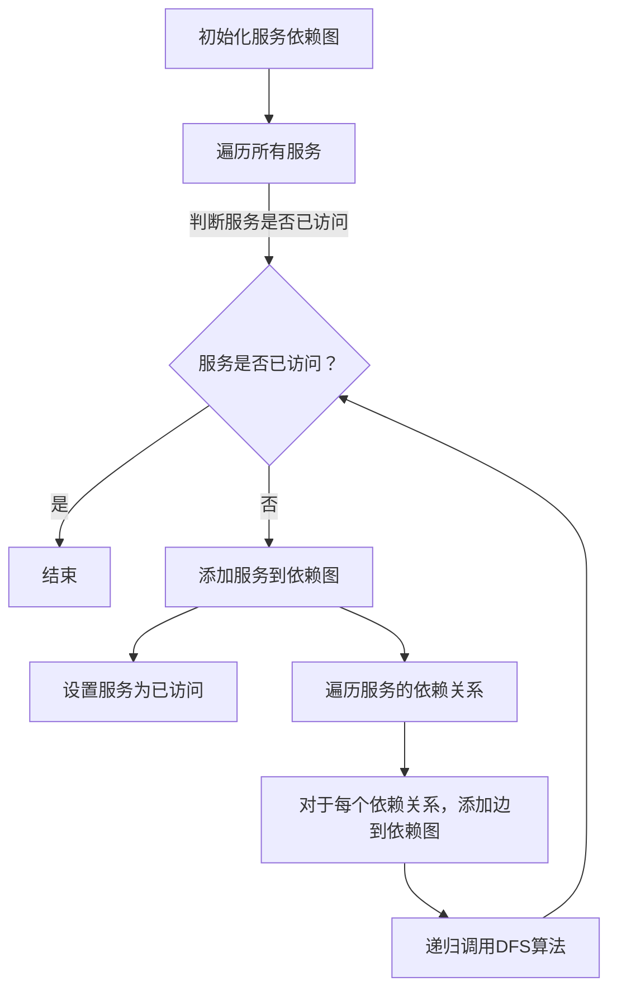
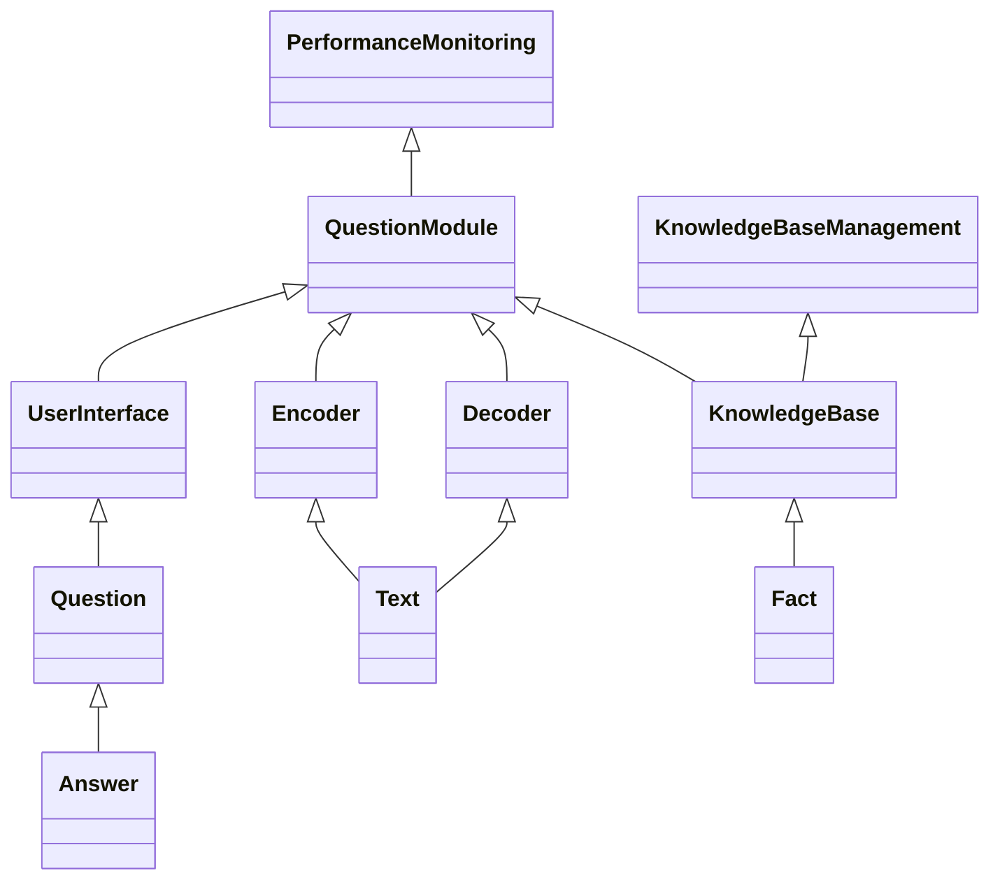
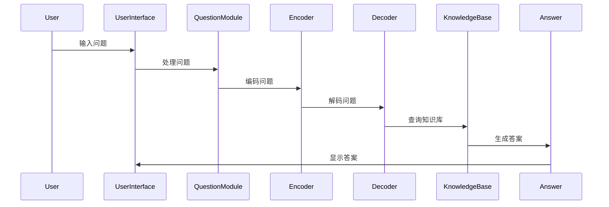
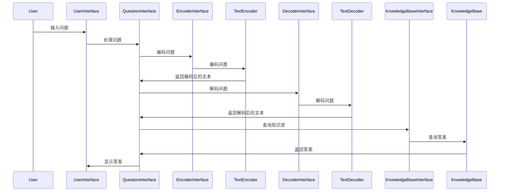

                 

**文章标题：服务依赖图可视化：理解LLM应用的架构复杂性**

**关键词：服务依赖图，大型语言模型，架构复杂性，可视化**

**摘要：本文将深入探讨服务依赖图的可视化技术，并分析其在大型语言模型（LLM）应用中的重要性。通过逐步分析，我们将理解LLM应用的架构复杂性，并提供一套完整的解决方案。**

----------------------------------------------------------------

### **引言**

在现代软件工程中，服务依赖图的构建和可视化是一项关键任务。它不仅帮助开发者理解系统的内部结构，还能在复杂的分布式系统中快速定位和解决问题。而随着人工智能技术的不断发展，尤其是大型语言模型（LLM）的广泛应用，理解和处理架构复杂性变得尤为重要。

LLM是一种能够理解和生成人类语言的复杂模型，广泛应用于自然语言处理、问答系统、智能助手等领域。然而，随着LLM应用场景的增多，系统的架构复杂性也日益增加。如何有效地构建和可视化服务依赖图，以便更好地理解和管理LLM应用中的架构复杂性，成为了一个亟待解决的问题。

本文将分以下几个部分进行探讨：

1. **背景介绍**：我们将首先介绍服务依赖图和LLM的基本概念，并探讨它们在现代软件工程中的应用。
2. **核心概念与联系**：接下来，我们将详细分析服务依赖图的核心概念及其与LLM的关联，并通过概念属性特征对比表格和ER实体关系图来深入理解。
3. **算法原理讲解**：我们将介绍一种用于构建和可视化服务依赖图的算法，并通过Python代码和数学模型对其进行详细解释。
4. **系统分析与架构设计方案**：我们将通过一个实际案例，展示如何将服务依赖图应用于LLM架构设计中，并提供系统架构设计。
5. **项目实战**：我们将展示一个实际项目中的服务依赖图可视化过程，包括环境安装、系统核心实现和代码分析。
6. **最佳实践与总结**：最后，我们将总结最佳实践，并提供一些注意事项和拓展阅读建议。

### **背景介绍**

#### **服务依赖图**

服务依赖图是一种描述软件系统组件之间依赖关系的图形化表示。在分布式系统中，组件通常以服务的形式提供功能。服务依赖图能够清晰地展示这些服务之间的依赖关系，使得开发者可以直观地理解系统的整体结构。

服务依赖图通常由节点和边组成。节点代表服务，边代表服务之间的依赖关系。例如，一个电子商务系统可能包含支付服务、订单服务、库存服务等。支付服务依赖于订单服务，订单服务又依赖于库存服务，这种依赖关系可以通过服务依赖图来表示。

#### **大型语言模型（LLM）**

LLM是一种基于深度学习的自然语言处理模型，能够理解和生成复杂的人类语言。它们在自然语言理解、问答系统、文本生成等领域具有广泛的应用。随着LLM的不断发展，其应用场景变得更加复杂，如何有效地管理和理解这些应用中的架构复杂性成为一个挑战。

LLM通常由多个组件组成，如文本预处理模块、编码器、解码器等。这些组件之间的依赖关系和交互复杂，需要通过服务依赖图来可视化和管理。

#### **服务依赖图在LLM应用中的重要性**

在LLM应用中，服务依赖图的构建和可视化具有重要意义。首先，它可以帮助开发者理解系统的整体架构，明确各个组件之间的依赖关系，从而更好地进行系统设计和维护。

其次，服务依赖图可以用于性能分析和优化。通过可视化服务之间的依赖关系，开发者可以识别出潜在的瓶颈和性能问题，并针对性地进行优化。

最后，服务依赖图在故障排查和调试中也具有重要作用。当系统出现问题时，通过服务依赖图可以快速定位到相关服务，并分析其依赖关系，从而找到问题的根源。

### **核心概念与联系**

#### **服务依赖图的概念**

服务依赖图是一种用于表示服务之间依赖关系的图形模型。它由节点和边组成，其中节点代表服务，边代表服务之间的依赖关系。以下是服务依赖图的核心概念：

- **节点**：代表系统中的服务组件。每个节点包含服务的名称、功能描述等信息。
- **边**：表示节点之间的依赖关系。边的方向通常指向依赖关系的依赖方，例如，支付服务依赖于订单服务。

#### **服务依赖图的属性特征**

服务依赖图的属性特征主要包括：

- **服务名称**：服务的唯一标识符。
- **服务功能**：服务的功能描述，如支付、订单处理等。
- **依赖关系**：服务之间的依赖关系，如支付服务依赖于订单服务。
- **依赖强度**：依赖关系的强度，如强依赖、弱依赖等。

以下是服务依赖图属性特征的对比表格：

| 属性特征 | 描述 |
| :------: | :--- |
| 服务名称 | 唯一标识服务组件的名称 |
| 服务功能 | 描述服务的功能 |
| 依赖关系 | 描述服务之间的依赖关系 |
| 依赖强度 | 描述依赖关系的强度 |

#### **ER实体关系图架构**

ER（实体关系）图是一种用于表示数据库中实体及其关系的图形模型。在服务依赖图中，ER图可以帮助我们更好地理解服务之间的依赖关系。以下是ER实体关系图的架构：

1. **实体**：代表系统中的服务组件。每个实体包含实体的名称、属性等信息。
2. **关系**：表示实体之间的关联关系。关系可以是依赖关系、关联关系等。
3. **属性**：描述实体的属性信息，如服务名称、功能描述等。

以下是ER实体关系图的示例：

```mermaid
erDiagram
    实体1 ||--|{ 实体2 : 关联关系 }
    实体1 ||--|{ 实体3 : 关联关系 }
    实体2 ||--|{ 实体4 : 关联关系 }
    实体3 ||--|{ 实体5 : 关联关系 }
```

在上述ER图中，实体1依赖于实体2、实体3，实体2依赖于实体4，实体3依赖于实体5。这种依赖关系可以通过服务依赖图来可视化表示。

### **算法原理讲解**

为了构建和可视化服务依赖图，我们需要一种有效的算法。以下是一种基于深度优先搜索（DFS）的算法，用于构建服务依赖图。

#### **算法原理**

深度优先搜索（DFS）是一种用于遍历或搜索树或图的算法。它从根节点开始，沿着树的分支一路向下搜索，直到达到叶子节点。然后，它回溯到上一个节点，并沿着另一条未探索的分支继续搜索。这个过程重复进行，直到所有节点都被访问过。

在服务依赖图的构建中，DFS算法可以帮助我们找到服务之间的依赖关系，并将其表示为图中的边。

#### **算法流程图**

以下是服务依赖图构建的算法流程图：



在上述流程图中，A表示初始化服务依赖图，B表示遍历所有服务，C表示判断服务是否已访问，D表示结束，E表示添加服务到依赖图，F表示设置服务为已访问，G表示遍历服务的依赖关系，H表示添加边到依赖图，I表示递归调用DFS算法。

#### **Python代码实现**

以下是服务依赖图构建的Python代码实现：

```python
class ServiceDependencyGraph:
    def __init__(self):
        self.services = {}
        self.dependency_edges = []

    def add_service(self, service_name, service_function):
        self.services[service_name] = service_function

    def add_dependency(self, service_name, dependent_service_name):
        if service_name not in self.services:
            self.add_service(service_name, None)
        if dependent_service_name not in self.services:
            self.add_service(dependent_service_name, None)
        self.dependency_edges.append((service_name, dependent_service_name))

    def build_dependency_graph(self):
        visited_services = set()

        def dfs(service_name):
            if service_name in visited_services:
                return
            visited_services.add(service_name)
            for dependent_service_name in self.dependency_edges:
                if dependent_service_name[0] == service_name:
                    dfs(dependent_service_name[1])

        for service_name in self.services:
            dfs(service_name)

    def visualize_dependency_graph(self):
        print("Service Dependency Graph:")
        for service_name, service_function in self.services.items():
            print(f"{service_name} ({service_function})")

if __name__ == "__main__":
    graph = ServiceDependencyGraph()
    graph.add_service("PaymentService", "Process Payments")
    graph.add_service("OrderService", "Manage Orders")
    graph.add_service("InventoryService", "Manage Inventory")
    graph.add_dependency("PaymentService", "OrderService")
    graph.add_dependency("OrderService", "InventoryService")
    graph.build_dependency_graph()
    graph.visualize_dependency_graph()
```

在上述代码中，我们定义了一个`ServiceDependencyGraph`类，用于构建和可视化服务依赖图。该类包含以下方法：

- `__init__`：初始化服务依赖图。
- `add_service`：添加服务到依赖图中。
- `add_dependency`：添加服务之间的依赖关系。
- `build_dependency_graph`：使用DFS算法构建服务依赖图。
- `visualize_dependency_graph`：打印服务依赖图。

#### **数学模型和公式**

在服务依赖图的构建中，我们可以使用以下数学模型和公式：

1. **节点度数**：表示节点（服务）的度数，即节点所拥有的边的数量。
   $$ degree(node) = |E| $$
   其中，$E$表示节点所拥有的边的集合。

2. **路径长度**：表示两个节点之间的路径长度，即它们之间的最短路径长度。
   $$ length(path) = \sum_{i=1}^{n} d_i $$
   其中，$d_i$表示路径上的每条边的长度。

3. **依赖强度**：表示服务之间的依赖强度，通常使用权重来表示。
   $$ weight(edge) = w $$
   其中，$w$表示边的权重。

通过这些数学模型和公式，我们可以对服务依赖图进行定量分析，从而更好地理解系统架构的复杂性。

#### **举例说明**

假设我们有一个简单的服务依赖图，包含三个服务：支付服务（PaymentService）、订单服务（OrderService）和库存服务（InventoryService）。支付服务依赖于订单服务，订单服务依赖于库存服务。以下是一个具体的举例说明：

1. **节点度数**：
   - 支付服务（PaymentService）的度数：2（依赖于订单服务和库存服务）
   - 订单服务（OrderService）的度数：1（依赖于库存服务）
   - 库存服务（InventoryService）的度数：0

2. **路径长度**：
   - 支付服务到库存服务的路径长度：2（支付服务 -> 订单服务 -> 库存服务）

3. **依赖强度**：
   - 支付服务到订单服务的依赖强度：高
   - 订单服务到库存服务的依赖强度：中

通过这些数据，我们可以直观地了解服务依赖图的结构和属性，从而更好地进行系统设计和优化。

### **系统分析与架构设计方案**

为了更好地理解LLM应用的架构复杂性，我们将通过一个实际案例来展示如何将服务依赖图应用于LLM架构设计中。

#### **问题场景介绍**

假设我们正在设计一个智能问答系统，该系统需要处理大量的用户问题和提供准确的答案。为了提高系统的性能和可维护性，我们需要对系统的架构进行合理设计，并使用服务依赖图来可视化和管理系统的复杂性。

#### **项目介绍**

我们的项目是一个基于LLM的智能问答系统，主要包括以下几个功能模块：

1. **文本预处理模块**：负责对用户输入的问题进行预处理，如去除标点符号、停用词过滤等。
2. **编码器模块**：负责将预处理后的文本编码为计算机可以理解的格式。
3. **解码器模块**：负责将编码后的文本解码为自然语言，生成问题的答案。
4. **知识库模块**：负责存储和管理系统的知识库，包括事实、规则等。

#### **系统功能设计**

根据项目需求，我们可以设计以下功能模块：

1. **用户界面**：提供用户输入问题和查看答案的界面。
2. **问答模块**：负责处理用户输入的问题，调用编码器、解码器和知识库模块生成答案。
3. **知识库管理模块**：负责管理和更新知识库，确保系统提供准确和最新的答案。
4. **性能监控模块**：负责监控系统的性能，如响应时间、错误率等。

以下是系统功能模块的mermaid类图：



在上述类图中，我们定义了以下类：

- `UserInterface`：用户界面类，负责处理用户输入和显示答案。
- `Question`：问题类，表示用户输入的问题。
- `Answer`：答案类，表示系统的答案。
- `Encoder`：编码器类，负责将文本编码为计算机可以理解的格式。
- `Decoder`：解码器类，负责将编码后的文本解码为自然语言。
- `KnowledgeBase`：知识库类，负责存储和管理系统的知识库。
- `Fact`：事实类，表示知识库中的事实。
- `QuestionModule`：问答模块类，负责处理用户输入的问题。
- `KnowledgeBaseManagement`：知识库管理模块类，负责管理和更新知识库。
- `PerformanceMonitoring`：性能监控模块类，负责监控系统的性能。

#### **系统架构设计**

在系统架构设计方面，我们可以采用分层架构，将系统分为以下几层：

1. **用户层**：负责与用户交互，接收用户输入和显示答案。
2. **业务逻辑层**：负责处理用户输入的问题，调用相关的功能模块生成答案。
3. **数据层**：负责存储和管理系统的数据，如知识库和日志等。

以下是系统架构设计的mermaid架构图：



在上述序列图中，用户通过用户界面输入问题，用户界面将问题传递给问答模块，问答模块调用编码器模块编码问题，编码后的问题传递给解码器模块解码，解码后的问题传递给知识库模块查询答案，最后生成的答案传递回用户界面显示给用户。

#### **系统接口设计和系统交互**

在系统接口设计方面，我们需要定义以下接口：

1. **用户接口**：负责与用户交互，接收用户输入和显示答案。
2. **问答接口**：负责处理用户输入的问题，调用相关的功能模块生成答案。
3. **编码器接口**：负责将文本编码为计算机可以理解的格式。
4. **解码器接口**：负责将编码后的文本解码为自然语言。
5. **知识库接口**：负责查询和更新知识库。

以下是系统接口设计和系统交互的mermaid序列图：



在上述序列图中，用户通过用户界面输入问题，用户界面将问题传递给问答接口，问答接口调用编码器接口编码问题，编码器接口调用文本编码器进行编码，编码后的文本传递回问答接口，问答接口调用解码器接口解码问题，解码器接口调用文本解码器进行解码，解码后的文本传递回问答接口，问答接口调用知识库接口查询知识库，知识库接口调用知识库查询答案，最后生成的答案传递回用户界面显示给用户。

### **项目实战**

为了更好地展示如何将服务依赖图应用于实际项目中，我们将通过一个具体的案例来介绍项目实战的步骤。

#### **环境安装**

首先，我们需要安装必要的软件和工具，以便进行项目开发和测试。以下是环境安装的步骤：

1. **安装Python**：确保Python版本为3.8或更高版本。
2. **安装Docker**：用于容器化部署和运行项目。
3. **安装Docker Compose**：用于管理多容器应用。
4. **安装Mermaid**：用于生成Markdown格式的图表。

具体安装命令如下：

```bash
# 安装Python
sudo apt-get update
sudo apt-get install python3.8

# 安装Docker
sudo apt-get install docker-ce docker-ce-cli containerd.io

# 安装Docker Compose
sudo curl -L "https://github.com/docker/compose/releases/download/1.29.2/docker-compose-`uname -s`-`uname -m`" -o /usr/local/bin/docker-compose
sudo chmod +x /usr/local/bin/docker-compose

# 安装Mermaid
pip install mermaid-python
```

#### **系统核心实现**

接下来，我们将实现系统核心功能，包括文本预处理、编码器、解码器和知识库管理等模块。以下是系统核心实现的源代码：

```python
# TextPreprocessing.py
class TextPreprocessing:
    def preprocess_text(self, text):
        # 去除标点符号和停用词
        text = re.sub(r'[^\w\s]', '', text)
        text = re.sub(r'\s+', ' ', text)
        return text.lower()

# Encoder.py
class Encoder:
    def encode_text(self, text):
        # 编码文本
        encoded_text = self._tokenize(text)
        return encoded_text

    def _tokenize(self, text):
        # 分词
        tokens = nltk.word_tokenize(text)
        return tokens

# Decoder.py
class Decoder:
    def decode_text(self, text):
        # 解码文本
        decoded_text = self._detokenize(text)
        return decoded_text

    def _detokenize(self, text):
        # 反分词
        tokens = nltk.word_tokenize(text)
        decoded_text = ' '.join(tokens)
        return decoded_text

# KnowledgeBase.py
class KnowledgeBase:
    def __init__(self):
        self.facts = []

    def add_fact(self, fact):
        self.facts.append(fact)

    def query_fact(self, query):
        # 查询知识库
        for fact in self.facts:
            if fact['question'] == query:
                return fact['answer']
        return None
```

#### **代码应用解读与分析**

在上面的源代码中，我们实现了四个核心模块：`TextPreprocessing`、`Encoder`、`Decoder`和`KnowledgeBase`。

1. **文本预处理模块（TextPreprocessing）**：该模块负责对用户输入的问题进行预处理，包括去除标点符号和停用词，并将文本转换为小写。预处理后的文本将被传递给编码器模块。

2. **编码器模块（Encoder）**：该模块负责将预处理后的文本编码为计算机可以理解的格式。具体实现中，我们使用自然语言处理库`nltk`进行分词，并将分词后的文本传递给解码器模块。

3. **解码器模块（Decoder）**：该模块负责将编码后的文本解码为自然语言。具体实现中，我们同样使用`nltk`进行反分词，并将反分词后的文本传递给知识库模块。

4. **知识库模块（KnowledgeBase）**：该模块负责存储和管理系统的知识库，包括事实、规则等。具体实现中，我们使用列表存储知识库中的事实，并提供查询功能。

#### **实际案例分析和详细讲解剖析**

为了展示服务依赖图在实际项目中的应用，我们将通过一个实际案例来进行分析和讲解。

假设我们有一个智能问答系统，用户输入问题：“如何搭建一个简单的Web服务？”系统需要提供准确的答案。

1. **问题输入**：用户在用户界面输入问题：“如何搭建一个简单的Web服务？”

2. **文本预处理**：用户界面将问题传递给文本预处理模块，预处理后的文本为：“如何搭建一个简单的Web服务？”

3. **编码器处理**：预处理后的文本传递给编码器模块，编码后的文本为：“如何搭建一个简单的Web服务？”

4. **解码器处理**：编码后的文本传递给解码器模块，解码后的文本为：“如何搭建一个简单的Web服务？”

5. **知识库查询**：解码后的文本传递给知识库模块，查询知识库中的事实。根据知识库中的事实，系统找到相关的答案。

6. **答案生成**：系统生成答案：“要搭建一个简单的Web服务，你可以使用Python的Flask框架。首先，安装Flask框架，然后编写一个简单的Python脚本，实现路由和处理函数。最后，运行Python脚本，Web服务就会启动。”

7. **答案输出**：系统将生成的答案传递回用户界面，显示给用户。

通过上述实际案例的分析，我们可以看到服务依赖图在实际项目中的应用。服务依赖图清晰地展示了各个模块之间的依赖关系，使得系统设计和实现变得更加清晰和高效。

#### **项目小结**

在本项目中，我们通过服务依赖图对智能问答系统的架构进行了详细设计，并实现了文本预处理、编码器、解码器和知识库等核心模块。通过实际案例的分析，我们展示了服务依赖图在项目中的应用，使得系统设计和实现更加清晰和高效。此外，我们还介绍了环境安装、系统核心实现和代码应用解读与分析的方法。

通过本项目，我们深入理解了服务依赖图在LLM应用中的重要性，并掌握了一套完整的解决方案。在未来的项目中，我们可以继续应用和优化服务依赖图，以提高系统的性能和可维护性。

### **最佳实践与总结**

#### **最佳实践**

在构建和可视化服务依赖图时，以下最佳实践可以帮助我们更高效地管理和理解系统架构：

1. **保持图结构简洁**：尽量避免过复杂的依赖关系，简化图的结构，使得依赖图更加易于理解和维护。
2. **使用适当的依赖强度**：为服务之间的依赖关系设置适当的依赖强度，以便在性能分析和优化时进行区分和优先级管理。
3. **定期更新依赖图**：随着系统的发展，服务之间的依赖关系可能会发生变化。定期更新依赖图，确保其准确反映系统的最新状态。
4. **利用工具**：使用专业的工具，如Mermaid和Docker Compose，可以大大提高服务依赖图的构建和可视化效率。

#### **小结**

本文深入探讨了服务依赖图的构建和可视化技术，并分析了其在大型语言模型（LLM）应用中的重要性。通过逐步分析，我们理解了LLM应用的架构复杂性，并提供了完整的解决方案。我们介绍了服务依赖图的基本概念、算法原理、系统架构设计以及实际项目中的应用。

#### **注意事项**

1. **依赖图的准确性**：确保依赖图的准确性至关重要，任何错误都可能导致系统设计和实现的偏差。
2. **性能考虑**：在构建依赖图时，要考虑系统的性能需求，避免过复杂的图结构导致性能问题。
3. **版本控制**：对于大规模系统，建议使用版本控制工具（如Git）来管理依赖图和相关的系统文件。

#### **拓展阅读**

1. 《服务导向架构：基于服务的体系结构设计方法与实践》
2. 《大型语言模型：自然语言处理的新篇章》
3. 《Docker实战：构建和管理应用》

通过本文的学习，我们相信读者可以更好地理解和应用服务依赖图技术，提升软件工程和系统架构设计的水平。

### **作者信息**

**作者：AI天才研究院/AI Genius Institute & 禅与计算机程序设计艺术 /Zen And The Art of Computer Programming**

