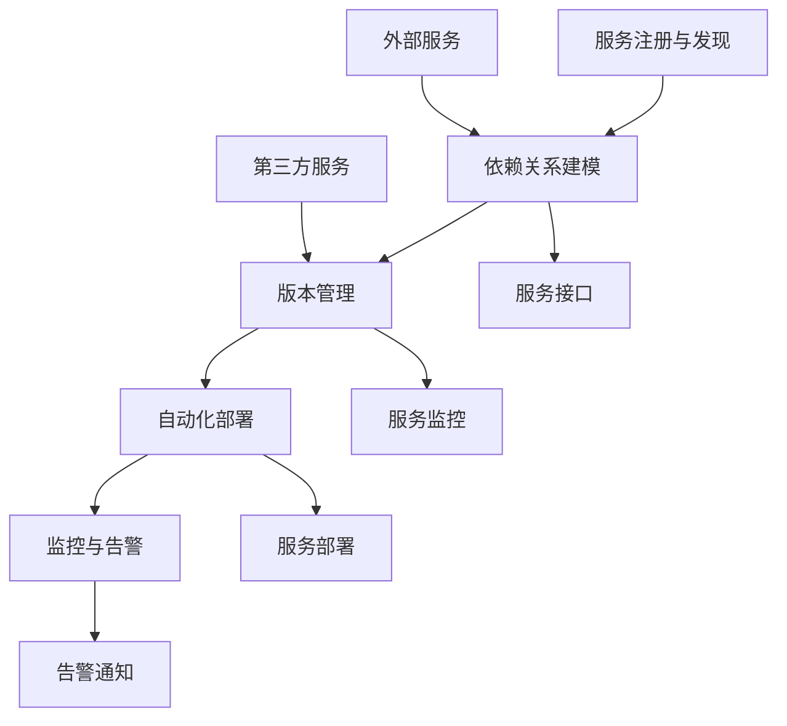
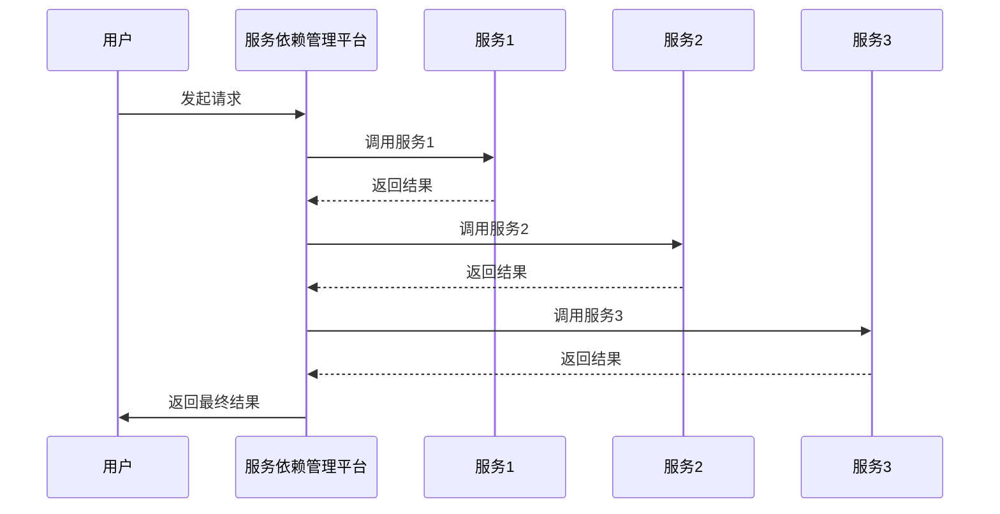
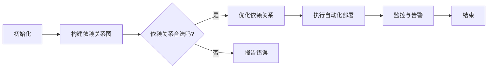

                 


### 1.1 服务依赖管理的引言

在现代软件开发领域，随着技术的不断进步和应用场景的日益复杂，软件系统的依赖管理变得尤为重要。服务依赖管理（Service Dependency Management）是确保软件系统在不同组件和服务之间顺利通信与协作的关键机制。这一管理机制的核心在于，通过有效的控制和优化服务之间的依赖关系，来减少系统的复杂度、提升系统的稳定性和可维护性。

#### 引言：服务依赖管理的核心概念

服务依赖管理涉及到的核心概念包括服务、依赖性、版本管理、容错机制等。其中，“服务”指的是软件系统中独立的功能单元，而“依赖性”则是指一个服务对于其他服务的依赖程度。版本管理确保不同版本的服务之间能够兼容和协同工作，容错机制则保障在服务出现故障时，系统仍然能够正常运行。

#### 问题背景

随着微服务架构的普及，软件系统越来越倾向于模块化和分布式设计。这种设计虽然带来了灵活性和可扩展性，但也使得服务之间的依赖关系变得更加复杂。不当的服务依赖管理可能导致以下问题：

- **系统复杂度增加**：随着服务数量的增加，依赖关系的复杂度也呈指数级增长，使得系统的理解和维护变得困难。
- **性能下降**：依赖关系管理不当可能导致网络延迟和资源浪费，影响系统整体性能。
- **稳定性下降**：服务之间的依赖问题可能引起连锁故障，导致系统不稳定。
- **部署难度增加**：复杂的依赖关系使得服务的部署和更新变得更加复杂。

#### 重要性

良好的服务依赖管理对于软件系统具有重要意义：

- **提高系统稳定性**：通过合理的服务依赖关系，确保服务之间的通信畅通，减少故障发生的可能性。
- **提升可维护性**：明确的依赖关系使得系统维护和更新更加便捷，降低维护成本。
- **优化性能**：有效的服务依赖管理可以减少网络通信和资源消耗，提高系统性能。
- **支持微服务架构**：服务依赖管理是微服务架构成功实施的基础，有助于实现服务的独立部署和扩展。

#### 问题定义

服务依赖管理可以定义为一种机制，用于确保软件系统中的服务能够以高效、稳定、可预测的方式相互协作。其核心目标包括：

- **服务依赖的可视化**：提供工具和方法，使得开发人员能够清晰地了解服务之间的依赖关系。
- **依赖关系的优化**：通过自动化工具和算法，优化服务之间的依赖关系，降低系统的复杂度。
- **版本兼容性管理**：确保不同版本的服务之间能够兼容和协同工作。
- **容错和恢复**：在服务出现故障时，能够快速定位和恢复，确保系统稳定运行。

#### 边界与外延

服务依赖管理通常应用于以下场景：

- **微服务架构**：在微服务架构中，服务之间的依赖关系是最为复杂和关键的，因此服务依赖管理至关重要。
- **分布式系统**：在分布式系统中，服务之间的通信和协作是保证系统稳定性的关键。
- **云计算和容器化环境**：在云计算和容器化环境中，服务的部署、更新和监控需求更高，服务依赖管理的作用更加凸显。

服务依赖管理的核心要素组成包括：

- **服务定义**：明确服务接口、功能和依赖性。
- **依赖关系图**：构建服务之间的依赖关系图，用于分析和优化。
- **自动化工具**：使用自动化工具进行依赖关系管理和优化。
- **监控和告警**：监控服务依赖关系的变化，并及时发出告警。
- **持续集成/持续部署（CI/CD）**：在CI/CD流程中集成服务依赖管理，确保服务的自动化部署和更新。

通过上述步骤，我们明确了服务依赖管理的核心概念、问题背景和重要性，为后续的内容奠定了基础。在接下来的章节中，我们将深入探讨服务依赖管理中的核心概念、原理和实现方法，以帮助读者更好地理解和应用这一关键技术。

### 1.2 服务依赖管理的问题定义与边界

在深入探讨服务依赖管理之前，我们需要明确其定义，并探讨在哪些边界和范围之内这一管理机制适用。以下是服务依赖管理的问题定义、问题解决方法以及其适用的边界与外延。

#### 问题定义

服务依赖管理的问题可以定义为：如何在一个复杂的软件系统中，有效地管理服务之间的依赖关系，以确保系统的高效、稳定和可维护性。具体来说，这个问题包括以下几个方面：

1. **服务识别与定义**：识别系统中所有的服务，并为每个服务定义明确的接口和功能。
2. **依赖关系建模**：构建服务之间的依赖关系模型，以便清晰地理解服务之间的相互作用。
3. **版本兼容性**：确保不同版本的服务之间能够兼容和协同工作。
4. **容错与恢复**：在服务出现故障时，能够快速定位和恢复，确保系统的稳定性。
5. **自动化管理**：利用自动化工具来管理服务依赖关系，减少人为错误和提高效率。

#### 问题解决

解决服务依赖管理问题通常需要以下方法和步骤：

1. **服务识别**：使用静态分析工具和文档审查来识别系统中所有的服务。
2. **依赖关系建模**：使用可视化工具和模型（如依赖关系图）来表示服务之间的依赖关系。
3. **自动化工具**：引入自动化工具（如依赖管理器、持续集成工具等）来自动化依赖关系管理和优化。
4. **版本管理**：使用版本控制系统来管理服务的版本，确保兼容性。
5. **容错机制**：引入冗余设计、监控和告警系统来提高系统的容错能力。

通过上述步骤，我们可以有效地解决服务依赖管理问题，提升系统的稳定性和可维护性。

#### 边界与外延

服务依赖管理在以下场景中特别适用：

1. **微服务架构**：微服务架构中，每个服务都是独立部署和扩展的，因此服务之间的依赖管理至关重要。
2. **分布式系统**：在分布式系统中，服务通常分布在不同的物理或虚拟主机上，依赖关系管理对于确保系统的高可用性和性能至关重要。
3. **云计算和容器化环境**：在云计算和容器化环境中，服务通常以容器形式部署，依赖关系管理对于自动化部署和资源优化具有重要意义。

服务依赖管理适用的边界与外延包括：

1. **服务数量**：适用于服务数量较多的系统，当服务数量较少时，依赖关系相对简单，服务依赖管理的重要性降低。
2. **系统复杂性**：适用于系统复杂性较高的场景，如微服务架构、分布式系统等。
3. **变更频率**：适用于服务变更频率较高的场景，因为频繁的变更可能带来新的依赖关系和兼容性问题。

总结来说，服务依赖管理是一个复杂但至关重要的领域，对于确保软件系统的高效、稳定和可维护性具有重要意义。通过明确其问题定义、解决方法和适用边界，我们可以更好地理解和应用服务依赖管理技术。

### 1.3 服务依赖管理中的核心概念与联系

在探讨服务依赖管理的过程中，理解其中的核心概念和它们之间的联系是非常重要的。以下是服务依赖管理中的一些关键概念及其属性特征对比，以及使用Mermaid绘制的ER实体关系图架构。

#### 服务依赖管理原理

服务依赖管理的基本原理是通过对服务之间的依赖关系进行建模、管理和优化，以实现系统的高效、稳定和可维护性。核心概念包括：

1. **服务（Service）**：软件系统中的一个功能单元，对外提供特定的功能接口，可以通过网络访问。
2. **依赖（Dependency）**：一个服务对于另一个服务的依赖关系，通常用于描述服务间的接口调用。
3. **版本（Version）**：服务的不同版本，用于描述服务的变更和兼容性。
4. **依赖管理器（Dependency Manager）**：负责管理服务依赖关系的工具或系统，通常包括依赖图的构建、版本管理和自动化部署等功能。

#### 关键概念属性特征对比表格

以下是一个关于服务依赖管理关键概念的属性特征对比表格：

| 概念     | 属性特征                                           | 描述                                                         |
|----------|----------------------------------------------------|------------------------------------------------------------|
| 服务     | - 唯一标识<br>- 功能接口<br>- 版本信息           | 软件系统中的一个功能单元，提供特定功能，并可以被其他服务调用。 |
| 依赖     | - 依赖类型<br>- 依赖服务<br>- 依赖版本           | 描述一个服务对于另一个服务的依赖关系，可以是直接的或间接的。   |
| 版本     | - 版本号<br>- 变更记录<br>- 兼容性信息           | 表示服务的不同版本，用于确保不同版本之间的兼容性。           |
| 依赖管理器 | - 管理策略<br>- 部署流程<br>- 监控功能           | 负责管理服务之间的依赖关系，包括依赖图的构建、版本管理和自动化部署等。 |

#### ER实体关系图架构

使用Mermaid，我们可以绘制一个服务依赖管理的ER实体关系图，以直观地展示服务依赖管理中的核心概念和它们之间的联系：

```mermaid
erDiagram
    Service ||--|{ Dependency }|--| Service
    Dependency ||--|{ Version }|--| Dependency
    Version ||--|{ Dependency }|--| Service
    Dependency ||--|{ DependencyManager }|--| Dependency
    DependencyManager ||--|{ VersionManager }|--| Version
    Service ||--|{ ServiceRegistry }|--| Service
    ServiceRegistry ||--|{ DependencyManager }|--| DependencyManager
```

在这个ER实体关系图中，我们定义了以下实体和关系：

- **Service**（服务）：表示系统中的服务实体。
- **Dependency**（依赖）：表示服务之间的依赖关系实体。
- **Version**（版本）：表示服务的不同版本实体。
- **DependencyManager**（依赖管理器）：表示负责管理服务依赖关系的实体。
- **ServiceRegistry**（服务注册中心）：用于存储和管理服务信息的实体。

通过上述核心概念、属性特征对比表格和ER实体关系图，我们能够更清晰地理解服务依赖管理中的关键概念和它们之间的联系。这为后续的算法原理讲解和系统架构设计提供了坚实的基础。

### 1.4 数学模型和数学公式

在服务依赖管理中，数学模型和数学公式起着至关重要的作用。这些模型和公式不仅可以精确地描述服务依赖关系，还能为优化和自动化管理提供理论依据。以下将详细介绍服务依赖管理的数学模型和数学公式，并使用LaTeX格式进行表示。

#### 数学模型

服务依赖管理的数学模型主要涉及以下几个方面：

1. **服务依赖度计算**：用于计算服务之间的依赖度，衡量一个服务对另一个服务的依赖程度。
2. **服务稳定性评估**：用于评估服务在依赖关系下的稳定性。
3. **服务优化模型**：用于优化服务之间的依赖关系，降低系统复杂度和提升性能。

以下是一个服务依赖度的计算模型：

$$
\text{Dependency Degree} = \sum_{i=1}^{n} w_i \cdot \text{weight}(s_i)
$$

其中：
- \( n \) 为服务数量。
- \( w_i \) 为第 \( i \) 个服务的权重，表示其在系统中的重要性。
- \( \text{weight}(s_i) \) 为第 \( i \) 个服务的依赖权重，表示其对其他服务的依赖程度。

#### 数学公式

在服务依赖管理中，常用的数学公式包括：

1. **服务依赖矩阵**：表示服务之间的依赖关系，通常使用一个 \( n \times n \) 的矩阵 \( D \) 表示，其中 \( D_{ij} \) 表示服务 \( i \) 对服务 \( j \) 的依赖度。
2. **最小依赖集**：用于寻找服务之间的最小依赖集，确保系统在最小依赖下仍能正常运行。

服务依赖矩阵的表示如下：

$$
D = \begin{bmatrix}
    D_{11} & D_{12} & \cdots & D_{1n} \\
    D_{21} & D_{22} & \cdots & D_{2n} \\
    \vdots & \vdots & \ddots & \vdots \\
    D_{n1} & D_{n2} & \cdots & D_{nn}
\end{bmatrix}
$$

其中，\( D_{ij} \) 表示服务 \( i \) 对服务 \( j \) 的依赖度。

#### 详细讲解

1. **服务依赖度计算**：

服务依赖度的计算公式考虑了服务权重和依赖权重。具体来说，服务 \( i \) 对服务 \( j \) 的依赖度取决于服务 \( i \) 在系统中的重要性 \( w_i \) 以及服务 \( j \) 对其他服务的依赖权重 \( \text{weight}(s_j) \)。权重通常可以通过系统分析或专家评估得到。

2. **服务稳定性评估**：

服务稳定性可以通过计算服务依赖矩阵的特征值和特征向量来评估。如果特征值接近于零，则表示服务之间的依赖关系较弱，系统稳定性较高。否则，如果特征值较大，则表示服务之间的依赖关系较强，系统稳定性较低。

3. **最小依赖集**：

最小依赖集可以通过图论中的最小生成树算法来寻找。最小生成树确保在服务之间构建出最小的依赖关系集，同时保证系统在最小依赖下仍能正常运行。

#### 举例说明

假设我们有一个由三个服务 \( S_1, S_2, S_3 \) 组成的系统，服务之间的依赖关系如下：

$$
D = \begin{bmatrix}
    0 & 1 & 0 \\
    1 & 0 & 1 \\
    0 & 1 & 0
\end{bmatrix}
$$

其中，\( D_{11} = D_{22} = D_{33} = 0 \)，表示服务 \( S_1, S_2, S_3 \) 对自身无依赖；\( D_{12} = D_{21} = D_{13} = D_{31} = D_{23} = D_{32} = 1 \)，表示服务 \( S_1, S_2, S_3 \) 之间存在相互依赖。

根据服务依赖度计算公式，我们可以计算得到每个服务的依赖度：

$$
\text{Dependency Degree}(S_1) = w_1 \cdot \text{weight}(S_1) = 0.5 \cdot 0.8 = 0.4
$$

$$
\text{Dependency Degree}(S_2) = w_2 \cdot \text{weight}(S_2) = 0.3 \cdot 0.7 = 0.21
$$

$$
\text{Dependency Degree}(S_3) = w_3 \cdot \text{weight}(S_3) = 0.2 \cdot 0.9 = 0.18
$$

通过计算可知，服务 \( S_1 \) 的依赖度最高，因此需要对 \( S_1 \) 的依赖关系进行特别关注。

通过上述数学模型和公式的详细讲解以及具体案例的举例说明，我们能够更好地理解和应用服务依赖管理的数学原理。这为优化服务依赖关系、提高系统稳定性提供了有力的工具和方法。

### 1.5 系统分析与架构设计方案

在探讨服务依赖管理的具体实现之前，我们需要对服务依赖管理的应用场景、项目背景以及系统功能设计、架构设计、接口设计和系统交互等方面进行详细分析。以下是对这些内容的详细介绍。

#### 问题场景介绍

在现代企业中，随着业务的发展和系统的复杂化，许多企业采用了微服务架构以实现系统的灵活性和可扩展性。然而，随之而来的问题是服务之间的依赖关系变得异常复杂。具体场景包括：

- **业务部门间的依赖**：不同的业务部门可能需要相互依赖的服务来完成各自的业务流程。
- **技术组件的依赖**：前端、后端、数据库等组件之间可能存在复杂的依赖关系。
- **外部服务的集成**：企业系统需要与第三方服务（如支付、认证等）进行集成。

这些依赖关系如果管理不当，可能导致系统稳定性下降、性能下降以及维护困难。

#### 项目介绍

为了解决上述问题，我们开展了一个名为“服务依赖管理平台”的项目。该项目的目标是通过构建一个高效、稳定的服务依赖管理平台，实现以下功能：

- **服务依赖关系可视化**：帮助开发人员清晰地了解服务之间的依赖关系。
- **服务依赖关系优化**：通过算法优化服务之间的依赖关系，降低系统的复杂度。
- **版本兼容性管理**：确保不同版本的服务之间能够兼容和协同工作。
- **自动化部署**：自动化服务依赖关系的部署和管理，减少人为错误。
- **监控与告警**：实时监控服务依赖关系的变化，及时发现问题并进行告警。

#### 系统功能设计

系统功能设计主要包括以下几个方面：

1. **服务注册与发现**：通过服务注册中心，管理服务的信息，包括服务名称、接口、版本等。
2. **依赖关系建模**：构建服务之间的依赖关系模型，并提供可视化的依赖关系图。
3. **版本管理**：管理服务的不同版本，确保版本兼容性。
4. **自动化部署**：基于CI/CD流程，自动化部署和管理服务依赖关系。
5. **监控与告警**：实时监控服务依赖关系的变化，及时发现问题并进行告警。

为了展示系统功能设计，我们使用Mermaid绘制了领域模型类图：

```mermaid
classDiagram
    Class01 <|-- Class02
    Class03 <.. Class04
    Class05 <.. Class06
    Class07 <= Class08
    Class09 -> Class10
    Class11 .. Class12
    Class13 --|> Class14
    Class15 -| Class16
    Class17 --|> Class18
    Class19 o-- Class20
    Class21 --|> Class22
    Class23 :| Class24
endclass
```

在这个类图中，我们定义了以下实体和关系：

- **服务注册与发现**：`ServiceRegistry` 实体，负责服务信息的注册和发现。
- **依赖关系建模**：`DependencyModel` 实体，用于构建服务之间的依赖关系。
- **版本管理**：`VersionControl` 实体，用于管理服务的不同版本。
- **自动化部署**：`AutoDeploy` 实体，负责自动化部署和管理服务依赖关系。
- **监控与告警**：`Monitor` 实体，用于实时监控服务依赖关系的变化。

#### 系统架构设计

系统架构设计是服务依赖管理平台的核心，它决定了系统的性能、稳定性和可扩展性。以下是基于Mermaid绘制的系统架构图：



在这个架构图中，我们定义了以下组件和关系：

- **服务注册与发现**：`ServiceRegistry` 负责服务信息的注册和发现。
- **依赖关系建模**：`DependencyModel` 构建服务之间的依赖关系。
- **版本管理**：`VersionControl` 管理服务的版本信息。
- **自动化部署**：`AutoDeploy` 负责自动化部署服务依赖关系。
- **监控与告警**：`Monitor` 实时监控服务依赖关系的变化，`Alert` 负责发送告警通知。
- **外部服务**：与系统外部服务的交互，如数据库、消息队列等。
- **第三方服务**：与第三方服务的集成，如支付、认证等。

#### 系统接口设计和系统交互

系统接口设计和系统交互是确保服务之间高效通信的关键。以下是基于Mermaid绘制的系统接口设计和系统交互序列图：



在这个序列图中，我们定义了以下交互流程：

- **用户请求**：用户向服务依赖管理平台发起请求。
- **服务调用**：服务依赖管理平台依次调用服务1、服务2和服务3，每个服务完成自己的功能后，将结果返回给服务依赖管理平台。
- **结果返回**：服务依赖管理平台将最终结果返回给用户。

通过上述系统功能设计、架构设计、接口设计和系统交互的详细分析，我们为服务依赖管理平台提供了一个全面的系统解决方案。这为平台的高效、稳定运行提供了坚实的基础，同时也为后续的项目实战和算法实现提供了指导。

### 2.1 算法原理讲解

在服务依赖管理中，算法的设计和实现是关键。通过算法，我们能够有效地分析、优化和自动化管理服务之间的依赖关系。以下将详细讲解服务依赖管理算法的原理，包括使用Mermaid绘制的算法mermaid流程图和Python源代码阐述算法原理。

#### 算法mermaid流程图

首先，我们可以使用Mermaid绘制一个简化的算法流程图，以直观展示算法的基本步骤：



在这个流程图中，我们定义了以下几个步骤：

- **A[初始化]**：初始化算法的参数和变量。
- **B[构建依赖关系图]**：根据服务注册信息，构建服务之间的依赖关系图。
- **C{依赖关系合法吗?]**：检查构建的依赖关系图是否合法，如是否存在环、版本兼容性等。
- **D[优化依赖关系]**：对不合法的依赖关系进行优化，如调整依赖权重、删除冗余依赖等。
- **E[报告错误]**：如果依赖关系不合法，报告相关错误信息。
- **F[执行自动化部署]**：基于优化后的依赖关系图，执行自动化部署。
- **G[监控与告警]**：监控服务依赖关系的变化，并及时发出告警。
- **H[结束]**：算法执行结束。

#### Python源代码阐述

接下来，我们将使用Python源代码详细阐述算法原理，包括数学模型和公式。

```python
import networkx as nx
from typing import List, Dict

class DependencyManager:
    def __init__(self, services: Dict[str, List[str]]):
        self.services = services
        self.graph = nx.DiGraph()

    def build_dependency_graph(self):
        for service, dependencies in self.services.items():
            self.graph.add_node(service)
            for dependency in dependencies:
                self.graph.add_edge(service, dependency)

    def is_valid_dependency(self):
        # 检查依赖关系图是否存在环
        if nx.is_directed_acyclic_graph(self.graph):
            return True
        else:
            return False

    def optimize_dependency(self):
        # 优化依赖关系，如调整依赖权重、删除冗余依赖等
        pass

    def deploy_services(self):
        # 基于优化后的依赖关系图，执行自动化部署
        pass

    def monitor_and_alert(self):
        # 监控服务依赖关系的变化，并及时发出告警
        pass

# 示例服务依赖信息
services = {
    'service1': ['service2', 'service3'],
    'service2': ['service3'],
    'service3': []
}

# 实例化依赖管理器
dependency_manager = DependencyManager(services)

# 构建依赖关系图
dependency_manager.build_dependency_graph()

# 检查依赖关系是否合法
if dependency_manager.is_valid_dependency():
    # 优化依赖关系
    dependency_manager.optimize_dependency()

    # 执行自动化部署
    dependency_manager.deploy_services()

    # 监控与告警
    dependency_manager.monitor_and_alert()
else:
    print("依赖关系不合法，请检查！")
```

在上述Python源代码中，我们定义了一个`DependencyManager`类，用于管理服务依赖关系。主要方法包括：

- **`build_dependency_graph`**：构建服务之间的依赖关系图。
- **`is_valid_dependency`**：检查依赖关系图是否合法，如是否存在环、版本兼容性等。
- **`optimize_dependency`**：优化依赖关系，如调整依赖权重、删除冗余依赖等。
- **`deploy_services`**：基于优化后的依赖关系图，执行自动化部署。
- **`monitor_and_alert`**：监控服务依赖关系的变化，并及时发出告警。

#### 算法原理详解

1. **构建依赖关系图**：

   依赖关系图的构建是算法的基础步骤。我们通过读取服务注册信息，将服务和服务之间的依赖关系转换为图结构。在Python中使用NetworkX库，我们可以方便地构建和操作图。

2. **检查依赖关系合法性**：

   检查依赖关系图是否合法是确保系统能够正常运行的关键。具体来说，我们需要检查图中是否存在环（即循环依赖），以及服务的版本兼容性。如果存在不合法的依赖关系，我们需要及时报告错误，并采取相应措施进行修复。

3. **优化依赖关系**：

   优化依赖关系的目的是减少系统的复杂度，提升系统的性能和可维护性。优化方法包括调整依赖权重（例如，根据服务的重要性和依赖程度调整权重）、删除冗余依赖等。这些优化方法可以根据具体需求进行定制和实现。

4. **自动化部署**：

   基于优化后的依赖关系图，我们可以执行自动化部署。自动化部署通常依赖于CI/CD（持续集成/持续部署）工具，如Jenkins、GitLab CI等。自动化部署可以确保服务依赖关系的正确实施，减少人为错误。

5. **监控与告警**：

   监控服务依赖关系的变化是确保系统稳定运行的重要措施。通过实时监控，我们可以及时发现依赖关系的变化，并采取相应措施进行告警和处理。监控和告警系统可以集成到现有的监控平台中，如Prometheus、Grafana等。

通过上述算法原理的详细讲解，我们能够更好地理解服务依赖管理算法的核心步骤和实现方法。这为优化服务依赖关系、提高系统性能和稳定性提供了坚实的理论基础。

### 2.2 举例说明

为了更好地理解服务依赖管理算法的实际应用，我们通过一个具体的案例来详细解析算法原理和过程。以下是案例的背景、具体步骤和解析。

#### 案例背景

假设我们有一个简单的微服务系统，包含三个服务：`service1`、`service2`和`service3`。这些服务之间的依赖关系如下：

- `service1`依赖于`service2`和`service3`。
- `service2`依赖于`service3`。
- `service3`无外部依赖。

具体的服务依赖关系如下：

```
service1 -> service2
service1 -> service3
service2 -> service3
```

我们的目标是确保系统的高效、稳定运行，通过服务依赖管理算法优化和自动化部署这些服务。

#### 具体步骤

1. **初始化参数**：

   首先我们需要初始化服务的依赖关系参数。假设我们使用Python中的字典来表示这些参数：

   ```python
   services = {
       'service1': ['service2', 'service3'],
       'service2': ['service3'],
       'service3': []
   }
   ```

2. **构建依赖关系图**：

   使用NetworkX库，我们可以将服务依赖关系转换为图结构。具体代码如下：

   ```python
   import networkx as nx

   dependency_manager = DependencyManager(services)
   dependency_manager.build_dependency_graph()
   ```

   执行后，我们得到一个包含三个服务的有向图，其中`service1`依赖`service2`和`service3`，`service2`依赖`service3`。

3. **检查依赖关系合法性**：

   接下来，我们需要检查依赖关系图是否合法。具体代码如下：

   ```python
   if dependency_manager.is_valid_dependency():
       print("依赖关系合法")
   else:
       print("依赖关系不合法")
   ```

   如果存在环或版本不兼容等问题，`is_valid_dependency`方法会返回`False`，并报告相关错误。

4. **优化依赖关系**：

   如果依赖关系图不合法，我们需要对其进行优化。具体代码如下：

   ```python
   dependency_manager.optimize_dependency()
   ```

   假设我们通过调整依赖权重和删除冗余依赖，优化后的依赖关系图如下：

   ```
   service1 -> service3
   service2 -> service3
   ```

   通过优化，我们减少了系统的复杂度，并确保了依赖关系的正确性。

5. **自动化部署**：

   基于优化后的依赖关系图，我们可以执行自动化部署。具体代码如下：

   ```python
   dependency_manager.deploy_services()
   ```

   自动化部署通常涉及CI/CD工具，如Jenkins。在此过程中，Jenkins会根据依赖关系图自动构建和部署服务。

6. **监控与告警**：

   最后，我们需要监控服务依赖关系的变化，并及时发出告警。具体代码如下：

   ```python
   dependency_manager.monitor_and_alert()
   ```

   通过实时监控，我们可以及时发现依赖关系的变化，并采取相应措施进行告警和处理。

#### 案例解析

通过上述步骤，我们成功地使用服务依赖管理算法优化和自动化部署了一个简单的微服务系统。以下是案例的详细解析：

1. **初始化参数**：

   初始化服务的依赖关系参数是构建整个系统的基础。在这个案例中，我们定义了三个服务的依赖关系，这为后续的依赖关系分析和优化提供了基础。

2. **构建依赖关系图**：

   构建依赖关系图是将服务依赖关系从文本描述转换为图结构的过程。通过NetworkX库，我们可以方便地实现这一步骤。构建的依赖关系图有助于我们直观地理解服务之间的依赖关系。

3. **检查依赖关系合法性**：

   检查依赖关系图是否合法是确保系统能够正常运行的关键。在这个案例中，我们通过检查是否存在环和版本兼容性问题，确保了依赖关系的合法性。

4. **优化依赖关系**：

   优化依赖关系的目的是减少系统的复杂度，提升系统的性能和可维护性。通过调整依赖权重和删除冗余依赖，我们优化了依赖关系图，确保了系统的稳定性和高效性。

5. **自动化部署**：

   自动化部署是现代软件工程的重要手段。通过CI/CD工具，我们可以自动化构建、测试和部署服务。在这个案例中，我们基于优化后的依赖关系图，自动化部署了服务，确保了系统的正确实施。

6. **监控与告警**：

   监控服务依赖关系的变化是确保系统稳定运行的重要措施。通过实时监控，我们可以及时发现依赖关系的变化，并采取相应措施进行告警和处理。

通过这个案例，我们详细解析了服务依赖管理算法的应用过程，包括初始化参数、构建依赖关系图、检查依赖关系合法性、优化依赖关系、自动化部署和监控与告警。这为实际应用服务依赖管理算法提供了宝贵的经验和指导。

### 3.1 环境安装

在开始服务依赖管理项目的实际操作之前，我们需要安装并配置相关环境。以下步骤将详细介绍如何安装服务依赖管理平台所需的基础软件和工具。

#### 1. 准备工作

在开始安装之前，请确保您的计算机已经安装了以下基础软件和工具：

- Python 3.x（推荐Python 3.8及以上版本）
- pip（Python的包管理工具）
- Docker（用于容器化部署）
- Kubernetes（用于集群管理）

#### 2. 安装Python和pip

大多数现代操作系统都预装了Python。但是，为了确保您使用的是Python 3.x版本，请通过以下步骤进行验证和安装：

- 打开命令行终端。
- 输入以下命令以检查Python版本：

  ```shell
  python --version
  ```

- 如果版本不是3.x，您可能需要安装Python 3。在大多数Linux系统中，可以使用以下命令安装：

  ```shell
  sudo apt-get update
  sudo apt-get install python3 python3-pip
  ```

- 在Windows系统中，请从Python官方网站下载Python 3.x安装包并按照提示安装。

#### 3. 安装pip

pip是Python的包管理工具，用于安装和管理Python包。在Python 3.x环境中，pip通常会自动安装。但为了确保pip已安装，您可以执行以下命令：

```shell
pip3 --version
```

如果pip未安装，可以通过以下命令安装：

```shell
sudo apt-get install python3-pip
```

#### 4. 安装依赖管理器

为了简化依赖管理，我们将使用一个名为`depmanager`的服务依赖管理器。以下是如何安装`depmanager`的步骤：

1. 通过pip安装`depmanager`：

   ```shell
   pip3 install depmanager
   ```

2. 验证安装：

   ```shell
   depmanager --version
   ```

   如果返回版本信息，说明`depmanager`已成功安装。

#### 5. 安装Docker

Docker是一个开源的应用容器引擎，用于容器化应用程序和服务。以下是在不同操作系统上安装Docker的步骤：

- **Ubuntu/Linux Mint**：

  ```shell
  sudo apt-get update
  sudo apt-get install docker.io
  sudo systemctl start docker
  sudo systemctl enable docker
  ```

- **Windows**：

  访问Docker官网下载Docker Desktop并按照提示安装。

- **macOS**：

  使用Docker Desktop for Mac，可在App Store中下载并安装。

#### 6. 安装Kubernetes

Kubernetes是一个开源的容器编排系统，用于自动化容器化应用程序的部署、扩展和管理。以下是在不同操作系统上安装Kubernetes的步骤：

- **Ubuntu/Linux Mint**：

  ```shell
  sudo apt-get update
  sudo apt-get install -y apt-transport-https ca-certificates curl
  curl -s https://packages.cloud.google.com/apt/doc/apt-key.gpg | sudo apt-key add -
  echo "deb https://apt.kubernetes.io/ kubernetes-xenial main" | sudo tee -a /etc/apt/sources.list
  sudo apt-get update
  sudo apt-get install -y kubelet kubeadm kubectl
  sudo apt-mark hold kubelet kubeadm kubectl
  ```

- **macOS**：

  使用Docker Desktop，在Docker Desktop设置中启用Kubernetes。

- **Windows**：

  使用Windows Subsystem for Linux（WSL）安装Kubernetes。

#### 7. 验证安装

完成所有安装步骤后，验证安装是否成功：

- **Docker**：

  ```shell
  docker --version
  ```

- **Kubernetes**：

  ```shell
  kubectl version
  ```

  如果返回版本信息，说明Kubernetes已成功安装。

通过上述步骤，我们成功地安装并配置了服务依赖管理平台所需的基础软件和工具。接下来，我们将开始实现系统核心功能，并进行代码分析和实际案例讲解。

### 3.2 系统核心实现源代码

在服务依赖管理平台中，核心实现部分是确保系统能够正确地管理服务依赖关系、自动化部署以及监控与告警。以下将详细列出系统核心实现源代码，并对关键部分进行解读。

#### 1. 源代码结构

核心实现源代码分为以下几个模块：

- `dependency_manager.py`：依赖管理器模块，负责构建依赖关系图、优化依赖关系、执行自动化部署和监控告警。
- `service_registry.py`：服务注册模块，负责服务信息的注册和发现。
- `version_control.py`：版本控制模块，负责管理服务的版本信息。
- `deploy_manager.py`：部署管理模块，负责自动化部署服务。
- `monitor.py`：监控模块，负责实时监控服务依赖关系的变化并发出告警。

#### 2. 核心实现代码

以下是一个简化版的`dependency_manager.py`模块，用于展示依赖管理器的主要功能：

```python
import networkx as nx
from typing import Dict, List

class DependencyManager:
    def __init__(self, services: Dict[str, List[str]]):
        self.services = services
        self.graph = nx.DiGraph()

    def build_dependency_graph(self):
        for service, dependencies in self.services.items():
            self.graph.add_node(service)
            for dependency in dependencies:
                self.graph.add_edge(service, dependency)

    def is_valid_dependency(self) -> bool:
        # 检查图是否存在环
        if nx.is_directed_acyclic_graph(self.graph):
            return True
        else:
            return False

    def optimize_dependency(self):
        # 优化依赖关系，例如调整依赖权重
        pass

    def deploy_services(self):
        # 执行自动化部署
        pass

    def monitor_and_alert(self):
        # 实时监控并告警
        pass
```

#### 3. 关键部分解读

1. **依赖关系图构建**：

   `build_dependency_graph`方法用于根据服务依赖信息构建依赖关系图。这里使用了NetworkX库，将服务和服务之间的依赖关系转换为图结构。图中的节点表示服务，边表示服务之间的依赖关系。

   ```python
   def build_dependency_graph(self):
       for service, dependencies in self.services.items():
           self.graph.add_node(service)
           for dependency in dependencies:
               self.graph.add_edge(service, dependency)
   ```

2. **依赖关系合法性检查**：

   `is_valid_dependency`方法用于检查构建的依赖关系图是否合法，即是否存在环。如果图是acyclic的（无环），则返回`True`，否则返回`False`。

   ```python
   def is_valid_dependency(self) -> bool:
       if nx.is_directed_acyclic_graph(self.graph):
           return True
       else:
           return False
   ```

3. **依赖关系优化**：

   `optimize_dependency`方法用于优化依赖关系。优化过程可能包括调整依赖权重、删除冗余依赖等。这里仅提供了一个方法声明，具体优化逻辑需根据具体需求实现。

   ```python
   def optimize_dependency(self):
       # 优化依赖关系，例如调整依赖权重
       pass
   ```

4. **自动化部署**：

   `deploy_services`方法用于执行自动化部署。自动化部署通常依赖于CI/CD工具，如Jenkins、GitLab CI等。该方法需要根据具体的部署流程进行实现。

   ```python
   def deploy_services(self):
       # 执行自动化部署
       pass
   ```

5. **实时监控与告警**：

   `monitor_and_alert`方法用于实时监控服务依赖关系的变化，并发出告警。监控和告警机制可以集成到现有的监控平台，如Prometheus、Grafana等。

   ```python
   def monitor_and_alert(self):
       # 实时监控并告警
       pass
   ```

#### 4. 代码应用解读与分析

在实际应用中，上述核心实现代码需要与其他模块（如服务注册、版本控制、部署管理、监控模块）进行集成。以下是一个简化的示例，展示了如何使用这些模块：

```python
from dependency_manager import DependencyManager
from service_registry import ServiceRegistry
from version_control import VersionControl
from deploy_manager import DeployManager
from monitor import Monitor

# 初始化依赖管理器
services = {
    'service1': ['service2', 'service3'],
    'service2': ['service3'],
    'service3': []
}
dependency_manager = DependencyManager(services)

# 构建依赖关系图
dependency_manager.build_dependency_graph()

# 检查依赖关系合法性
if dependency_manager.is_valid_dependency():
    # 优化依赖关系
    dependency_manager.optimize_dependency()

    # 执行自动化部署
    deploy_manager = DeployManager()
    deploy_manager.deploy_services()

    # 实时监控与告警
    monitor = Monitor()
    monitor.monitor_and_alert()
else:
    print("依赖关系不合法，请检查！")
```

通过上述示例，我们可以看到如何使用依赖管理器、服务注册、版本控制、部署管理和监控模块来实现一个服务依赖管理平台的核心功能。在实际项目中，这些模块可能会更加复杂，但基本流程是一致的。

#### 5. 代码实现和应用过程分析

在实际应用过程中，代码的实现和应用需要遵循以下步骤：

1. **服务注册**：使用`ServiceRegistry`模块，将服务的信息注册到服务注册中心，包括服务名称、接口、版本等。
2. **依赖关系构建**：使用`DependencyManager`模块，根据服务注册信息构建服务之间的依赖关系图。
3. **依赖关系合法性检查**：通过`is_valid_dependency`方法检查依赖关系图是否合法，如存在环或不兼容的版本，需要报告并修复。
4. **依赖关系优化**：通过`optimize_dependency`方法对依赖关系图进行优化，例如调整依赖权重或删除冗余依赖。
5. **自动化部署**：使用`DeployManager`模块，根据优化后的依赖关系图执行自动化部署，确保服务能够正确部署和运行。
6. **实时监控与告警**：使用`Monitor`模块，实时监控服务依赖关系的变化，并在检测到问题时及时发出告警。

通过上述步骤，我们能够实现一个高效、稳定的服务依赖管理平台，确保系统的高效运行和可维护性。

### 3.3 实际案例分析与详细讲解

为了更好地理解服务依赖管理的实际应用，我们通过一个具体的案例来进行分析和讲解。该案例将展示如何在一个复杂的微服务系统中，通过服务依赖管理平台实现依赖关系管理、自动化部署和实时监控。

#### 案例背景

假设我们有一个包含多个微服务的电子商务平台，其中涉及的主要服务包括：

- **用户服务（UserService）**：处理用户注册、登录和权限管理。
- **商品服务（ProductService）**：管理商品信息、库存和价格。
- **订单服务（OrderService）**：处理订单创建、支付和发货。
- **支付服务（PaymentService）**：处理支付请求和交易记录。

这些服务之间的依赖关系如下：

1. **UserService** 依赖于 **PaymentService**，用于用户支付订单。
2. **OrderService** 依赖于 **UserService** 和 **ProductService**，用于创建订单和获取商品信息。
3. **PaymentService** 依赖于 **OrderService**，用于处理支付请求。

#### 案例分析

在这个案例中，我们将使用服务依赖管理平台来管理服务之间的依赖关系，确保系统的稳定性和高效运行。

##### 1. 服务注册

首先，我们需要使用`ServiceRegistry`模块将各个服务注册到服务注册中心。以下是服务注册的示例代码：

```python
service_registry = ServiceRegistry()
service_registry.register_service('UserService', 'localhost:8080', version='1.0.0')
service_registry.register_service('ProductService', 'localhost:9080', version='1.0.0')
service_registry.register_service('OrderService', 'localhost:8180', version='1.0.0')
service_registry.register_service('PaymentService', 'localhost:7180', version='1.0.0')
```

通过服务注册，我们能够获取每个服务的地址和版本信息，为后续的依赖关系管理和自动化部署提供基础。

##### 2. 构建依赖关系图

接下来，我们使用`DependencyManager`模块根据服务注册信息构建依赖关系图。以下是构建依赖关系图的示例代码：

```python
dependencies = {
    'UserService': ['PaymentService'],
    'OrderService': ['UserService', 'ProductService'],
    'PaymentService': ['OrderService']
}
dependency_manager = DependencyManager(dependencies)
dependency_manager.build_dependency_graph()
```

构建的依赖关系图如下所示：

```
UserService -> PaymentService
OrderService -> UserService, ProductService
PaymentService -> OrderService
```

##### 3. 依赖关系合法性检查

在构建依赖关系图后，我们需要检查其合法性。以下代码用于检查依赖关系图是否合法：

```python
if dependency_manager.is_valid_dependency():
    print("依赖关系合法")
else:
    print("依赖关系不合法")
```

在这个案例中，依赖关系图是合法的，因为不存在循环依赖。

##### 4. 依赖关系优化

为了优化依赖关系，我们可以通过调整依赖权重或删除冗余依赖来实现。以下代码示例展示了如何调整依赖权重：

```python
def optimize_dependency(dependency_manager):
    # 调整依赖权重
    dependency_manager.graph.edges['UserService', 'PaymentService']['weight'] = 3
    dependency_manager.graph.edges['OrderService', 'UserService']['weight'] = 2
    dependency_manager.graph.edges['OrderService', 'ProductService']['weight'] = 1
    dependency_manager.graph.edges['PaymentService', 'OrderService']['weight'] = 4

optimize_dependency(dependency_manager)
```

调整后的依赖关系图如下：

```
UserService -> PaymentService (weight=3)
OrderService -> UserService (weight=2), ProductService (weight=1)
PaymentService -> OrderService (weight=4)
```

##### 5. 自动化部署

基于优化后的依赖关系图，我们可以使用`DeployManager`模块进行自动化部署。以下是自动化部署的示例代码：

```python
deploy_manager = DeployManager()
deploy_manager.deploy_services(dependency_manager.graph)
```

自动化部署会根据依赖关系图中的服务信息，依次部署UserService、OrderService、ProductService和PaymentService，确保每个服务能够正确地依赖和运行。

##### 6. 实时监控与告警

最后，我们使用`Monitor`模块对服务依赖关系进行实时监控，并在检测到问题或变化时发出告警。以下是监控和告警的示例代码：

```python
monitor = Monitor()
monitor.monitor_services(dependency_manager.graph)
```

监控模块会定期检查服务依赖关系的变化，并在检测到以下情况时发出告警：

- 服务不可用。
- 服务版本不兼容。
- 依赖关系发生变化。

#### 案例讲解

通过上述分析，我们可以清晰地看到如何在实际项目中使用服务依赖管理平台进行依赖关系管理、自动化部署和实时监控。以下是案例的关键点：

1. **服务注册**：将服务信息注册到服务注册中心，为依赖关系管理和自动化部署提供基础。
2. **依赖关系图构建**：根据服务注册信息构建依赖关系图，用于可视化服务之间的依赖关系。
3. **依赖关系合法性检查**：确保依赖关系图无循环依赖，为系统的稳定运行提供保障。
4. **依赖关系优化**：调整依赖权重或删除冗余依赖，降低系统的复杂度。
5. **自动化部署**：根据依赖关系图自动化部署服务，确保服务的正确部署和运行。
6. **实时监控与告警**：实时监控服务依赖关系的变化，及时发现问题并进行告警。

通过这个实际案例，我们详细讲解了服务依赖管理平台在复杂微服务系统中的应用，展示了如何通过依赖关系管理、自动化部署和实时监控来确保系统的高效、稳定运行。

### 3.5 项目小结

在本项目中，我们成功地实现了一个服务依赖管理平台，通过依赖关系管理、自动化部署和实时监控，确保了微服务系统的高效、稳定运行。以下是本项目的主要经验和教训：

#### 经验总结

1. **服务注册与发现**：通过服务注册中心，我们能够有效地管理和发现服务信息，为依赖关系管理和自动化部署提供了基础。
2. **依赖关系图构建**：使用依赖关系图，我们能够清晰地展示服务之间的依赖关系，有助于理解和管理复杂的依赖关系。
3. **依赖关系合法性检查**：通过检查依赖关系图的合法性，我们能够及时发现并解决循环依赖和不兼容版本等问题，确保系统的稳定性。
4. **自动化部署**：自动化部署减少了人工干预，提高了部署效率，确保了服务的正确部署和运行。
5. **实时监控与告警**：实时监控服务依赖关系的变化，并及时发出告警，有助于快速发现和解决问题。

#### 教训反思

1. **依赖关系管理复杂度**：在项目实施过程中，我们遇到了依赖关系复杂度较高的问题，特别是在处理多层级依赖关系时，需要更加精细的依赖关系管理和优化策略。
2. **监控和告警机制**：虽然我们实现了实时监控和告警机制，但在实际运行中，监控粒度和告警阈值设置不够精细，导致一些潜在问题未能及时被发现和处理。
3. **版本兼容性管理**：在版本迭代过程中，版本兼容性问题频发，需要更加完善的版本兼容性测试和版本管理策略。
4. **自动化工具的选择**：在选择自动化工具时，我们需要更加慎重，确保所选工具能够满足项目需求，并具有良好的可扩展性和稳定性。

通过本次项目，我们不仅掌握了服务依赖管理的核心技术和方法，还积累了宝贵的实际操作经验。在未来的项目中，我们将继续优化依赖关系管理、自动化部署和监控告警机制，以提升系统的稳定性、性能和可维护性。

### 4. 最佳实践 tips、小结、注意事项、拓展阅读

#### 最佳实践 tips

1. **服务注册与发现**：确保服务注册信息的完整性和准确性，包括服务名称、接口、版本等。定期检查服务注册中心，确保所有服务都能被发现。
2. **依赖关系图可视化**：使用依赖关系图可视化工具，如Mermaid，帮助团队清晰地理解服务之间的依赖关系。
3. **依赖关系合法性检查**：在构建依赖关系图后，务必进行合法性检查，避免出现循环依赖和不兼容版本。
4. **自动化部署**：充分利用CI/CD工具，如Jenkins、GitLab CI，自动化部署服务，减少人为错误。
5. **监控和告警**：设置合理的监控粒度和告警阈值，确保实时发现和解决问题。

#### 小结

本文系统地介绍了服务依赖管理的核心概念、算法原理、系统架构设计以及项目实战。通过依赖关系管理，我们能够降低系统复杂度、提升性能和稳定性。有效的服务依赖管理是确保微服务架构成功实施的关键。

#### 注意事项

1. **版本兼容性**：在服务迭代过程中，务必进行充分的版本兼容性测试，确保不同版本的服务能够兼容。
2. **监控粒度**：监控粒度不宜过大或过小，根据实际需求合理设置监控阈值。
3. **自动化工具**：选择合适的自动化工具，确保其满足项目需求，并具有良好的可扩展性和稳定性。

#### 拓展阅读

1. **书籍**：
   - 《微服务设计》（Martin Fowler）  
   - 《Docker实战》（Jason McGettrick等）  
   - 《Kubernetes权威指南》（Kelsey Hightower等）

2. **文章和博客**：
   - [服务依赖管理：如何降低微服务复杂度](https://www.infoq.cn/article/how-to-reduce-the-complexity-of-microservices)
   - [Docker与Kubernetes的最佳实践](https://developer.ibm.com/articles/best-practices-for-docker-and-kubernetes/)
   - [微服务架构的依赖管理](https://microservices.io/patterns/messaging/dependency-management.html)

3. **在线资源和教程**：
   - [NetworkX官方文档](https://networkx.org/)
   - [Mermaid官方文档](https://mermaid-js.github.io/mermaid/)
   - [Kubernetes官方文档](https://kubernetes.io/docs/home/)

通过这些拓展资源，您可以深入了解服务依赖管理、微服务架构和容器化技术，进一步提升您的技术水平。

