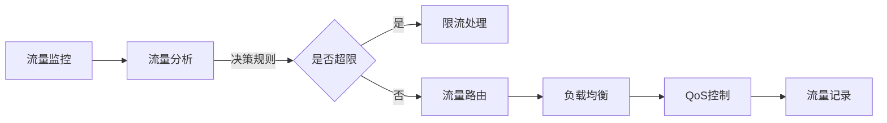
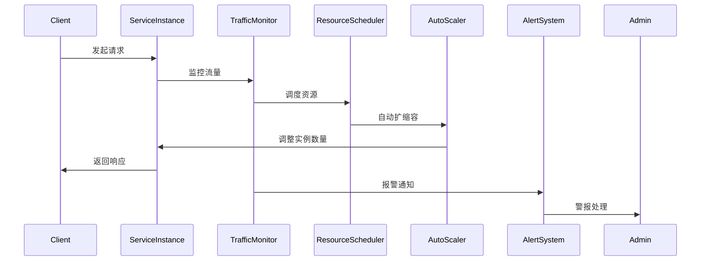

                 

### 第1章 背景介绍

#### 1.1 问题背景

**服务网格的概念与演进**

服务网格（Service Mesh）是一种基础设施层的设计模式，它为分布式服务提供了动态服务发现、服务间通信和安全等功能。随着云计算和微服务架构的兴起，服务网格逐渐成为管理和简化分布式系统中服务间通信的关键工具。

服务网格起源于容器化技术，最早由Google的Istio和LinkedIn的Linkerd等开源项目推动。它通过引入一个独立的通信层，使得服务之间的通信与具体的应用逻辑解耦，从而提高了系统的可观测性、可靠性和可维护性。

**流量控制的重要性**

流量控制是服务网格中的一个核心功能。在分布式系统中，流量控制能够确保服务的稳定性和高性能。通过精确控制流经每个服务的请求流量，可以防止过度负载导致的性能下降和服务不可用。

流量控制的重要性体现在以下几个方面：

1. **资源优化**：合理的流量控制能够充分利用系统的资源，避免资源浪费。
2. **稳定性保障**：通过流量控制，可以确保系统在面对突发流量时能够保持稳定运行。
3. **用户体验**：流量控制能够保障用户请求的响应时间，提升用户体验。

**LLM应用负载管理面临的挑战**

LLM（Large Language Model）应用，如大型自然语言处理模型服务，因其数据规模和处理能力强大，常常成为分布式系统中的高性能计算中心。LLM应用负载管理面临的挑战主要包括：

1. **计算资源需求大**：LLM模型训练和推理需要大量的计算资源，如何合理分配和调度资源是关键问题。
2. **流量波动大**：LLM应用服务的流量波动大，难以预测，需要动态调整流量控制策略。
3. **服务质量保障**：确保LLM应用服务的稳定性和响应时间是服务质量的保障，需要精细化管理。

#### 1.2 问题描述

**什么是服务网格流量控制**

服务网格流量控制是指通过服务网格提供的机制，对服务之间的流量进行控制和调度。这包括流量路由、负载均衡、QoS（服务质量）控制等功能。

**服务网格流量控制的目标**

服务网格流量控制的目标包括：

1. **资源优化**：合理分配系统资源，避免资源浪费。
2. **稳定性保障**：确保系统在面对流量波动时能够稳定运行。
3. **性能优化**：通过负载均衡，确保服务的高性能。

**LLM应用负载管理的关键环节**

LLM应用负载管理涉及以下几个关键环节：

1. **流量分配**：根据应用需求和服务能力，动态调整流量分配策略。
2. **资源调度**：合理分配计算资源，确保服务的性能和稳定性。
3. **流量监控**：实时监控流量状态，快速响应流量波动。
4. **故障处理**：快速定位和解决流量控制中的故障，保障系统稳定。

#### 1.3 问题解决

**服务网格流量控制的实现方法**

服务网格流量控制的实现方法主要包括：

1. **流量路由**：通过路由规则，将流量路由到合适的服务实例。
2. **负载均衡**：采用不同的负载均衡策略，如轮询、加权轮询等，确保流量的合理分配。
3. **QoS控制**：通过设定服务质量参数，保障重要服务的请求优先处理。

**流量控制策略与算法**

流量控制策略与算法包括：

1. **限流算法**：如令牌桶、漏桶算法，用于控制流量速率。
2. **动态调整算法**：如基于预测的流量调整算法，根据实时流量情况动态调整流量控制策略。

**LLM应用负载管理的最佳实践**

LLM应用负载管理的最佳实践包括：

1. **资源规划**：根据应用需求，合理规划计算资源。
2. **流量监控**：实时监控流量状态，快速响应流量波动。
3. **故障演练**：定期进行故障演练，提高系统应对故障的能力。

#### 1.4 边界与外延

**服务网格流量控制的应用范围**

服务网格流量控制可以应用于多种分布式系统，如电商交易系统、金融交易系统、社交媒体系统等。它特别适用于需要高可靠性和高性能的场景。

**LLM应用负载管理的适用场景**

LLM应用负载管理适用于大型自然语言处理模型服务的场景，如智能客服、智能推荐系统、语音助手等。

**服务网格与微服务架构的关系**

服务网格与微服务架构密切相关。服务网格为微服务提供了通信层，使得微服务之间的通信更加简单、可靠和高效。服务网格流量控制能够提升微服务架构的灵活性和扩展性。

#### 1.5 概念结构与核心要素组成

**服务网格的基本结构**

服务网格的基本结构包括数据平面和控制平面。数据平面负责实际的数据传输，控制平面负责流量管理和策略配置。

**流量控制的关键要素**

流量控制的关键要素包括流量路由规则、负载均衡策略、QoS参数配置等。

**LLM应用负载管理的核心流程**

LLM应用负载管理的核心流程包括流量监控、流量分配、资源调度和故障处理等环节。

### 第2章 核心概念与联系

#### 2.1 核心概念原理

**服务网格的定义**

服务网格是一种基础设施层的设计模式，它提供了一套统一的通信层，使得服务之间的通信更加简单、可靠和高效。

**流量控制的基本原理**

流量控制是指通过限制流量速率或调整流量路由，确保系统资源得到合理利用，提高系统性能和稳定性。

**LLM应用负载管理的概念**

LLM应用负载管理是指针对大型自然语言处理模型服务的流量分配、资源调度和故障处理等环节的管理方法。

#### 2.2 概念属性特征对比表格

| 概念         | 定义                                                         | 主要特征                                       |
| ------------ | ------------------------------------------------------------ | ---------------------------------------------- |
| 服务网格     | 为分布式服务提供通信层的基础设施层设计模式                   | 提供动态服务发现、服务间通信、安全等功能       |
| 流量控制     | 通过限制流量速率或调整流量路由，确保系统资源得到合理利用     | 包括流量路由、负载均衡、QoS控制等策略           |
| LLM应用负载管理 | 针对大型自然语言处理模型服务的流量分配、资源调度和故障处理等环节的管理方法 | 需要应对计算资源需求大、流量波动大等挑战       |

#### 2.3 ER实体关系图架构

**服务网格的实体关系图**

```mermaid
erDiagram
  ServiceMesh ||--|{ Client: 客户端 }||>
  ServiceMesh ||--|{ ServiceA: 服务A }||>
  ServiceMesh ||--|{ ServiceB: 服务B }||>
  ServiceMesh ||--|{ ServiceC: 服务C }||>
  ServiceMesh ||--|{ ControlPlane: 控制平面 }||>
  ServiceMesh ||--|{ DataPlane: 数据平面 }||>
```

**流量控制实体的关系图**

```mermaid
erDiagram
  FlowControl ||--|{ TrafficRouting: 流量路由 }||>
  FlowControl ||--|{ LoadBalancing: 负载均衡 }||>
  FlowControl ||--|{ QoSControl: QoS控制 }||>
  FlowControl ||--|{ Metrics: 流量监控 }||>
```

**LLM应用负载管理的实体关系图**

```mermaid
erDiagram
  LLMLoadManagement ||--|{ TrafficMonitoring: 流量监控 }||>
  LLMLoadManagement ||--|{ TrafficAllocation: 流量分配 }||>
  LLMLoadManagement ||--|{ ResourceScheduling: 资源调度 }||>
  LLMLoadManagement ||--|{ FaultHandling: 故障处理 }||>
  LLMLoadManagement ||--|{ Metrics: 流量监控 }||>
```

### 第3章 算法原理讲解

#### 3.1 流量控制算法mermaid流程图



#### 3.2 流量控制算法Python源代码

```python
import time

def traffic_control(traffic_data):
    # 流量监控
    current_traffic = traffic_data['current_traffic']
    max_traffic = traffic_data['max_traffic']

    # 流量分析
    if current_traffic > max_traffic:
        # 限流处理
        limit_traffic(current_traffic)
    else:
        # 流量路由与负载均衡
        route_traffic(current_traffic)

    # QoS控制
    apply_qos()

    # 流量记录
    record_traffic(current_traffic)

def limit_traffic(current_traffic):
    print(f"当前流量：{current_traffic}，超出最大限制，进行限流处理。")

def route_traffic(current_traffic):
    print(f"当前流量：{current_traffic}，进行流量路由与负载均衡。")

def apply_qos():
    print("进行QoS控制。")

def record_traffic(current_traffic):
    print(f"记录当前流量：{current_traffic}。")

if __name__ == "__main__":
    traffic_data = {'current_traffic': 1500, 'max_traffic': 1000}
    traffic_control(traffic_data)
```

#### 3.3 算法原理的数学模型与公式

**流量控制算法的数学模型**

$$
Q = f(t)
$$

其中，$Q$表示流量，$f(t)$表示流量控制函数，$t$表示时间。

**流量控制算法的公式**

1. **限流公式**

$$
L = \frac{C}{T}
$$

其中，$L$表示限流速率，$C$表示总流量，$T$表示时间窗口。

2. **负载均衡公式**

$$
P_i = \frac{W_i}{\sum W_i}
$$

其中，$P_i$表示服务实例$i$的负载权重，$W_i$表示服务实例$i$的处理能力。

3. **QoS控制公式**

$$
QoS = \alpha \times RTT + \beta \times Throughput
$$

其中，$QoS$表示服务质量，$\alpha$和$\beta$为权重系数，$RTT$表示往返时间，$Throughput$表示吞吐量。

#### 3.4 算法原理详细讲解

**流量控制算法的工作原理**

流量控制算法通过对服务之间的流量进行监控、分析和处理，确保系统的稳定性和高性能。其工作原理主要包括以下几个步骤：

1. **流量监控**：实时监控服务之间的流量数据。
2. **流量分析**：根据流量数据，判断是否超限。
3. **限流处理**：如果流量超限，进行限流处理。
4. **流量路由与负载均衡**：如果流量未超限，进行流量路由和负载均衡。
5. **QoS控制**：根据服务质量要求，调整流量控制策略。
6. **流量记录**：记录流量控制过程中的关键数据。

**流量控制算法的优缺点**

1. **优点**：
   - **灵活性**：可以根据实时流量情况动态调整流量控制策略。
   - **稳定性**：通过限流和负载均衡，确保系统在面对流量波动时保持稳定。
   - **高性能**：通过合理的流量分配和资源调度，提升系统的处理能力。

2. **缺点**：
   - **复杂性**：涉及多个控制模块，设计和实现相对复杂。
   - **性能开销**：流量控制算法需要额外的计算和通信开销。

#### 3.5 举例说明

**流量控制算法的实例分析**

假设一个分布式系统中，服务A的流量达到1000个请求/秒，而系统的最大处理能力为800个请求/秒。根据流量控制算法，首先进行流量监控，发现流量超限，然后触发限流处理，将流量限制在800个请求/秒。

**流量控制算法的实际应用场景**

- **电商网站**：在电商网站的促销活动中，流量可能会出现急剧增长。通过流量控制算法，可以确保系统稳定运行，防止服务器过载。
- **金融交易系统**：金融交易系统对稳定性和安全性要求极高，通过流量控制算法，可以保证交易流程的可靠执行。

### 第4章 数学模型和数学公式 & 详细讲解 & 举例说明

#### 4.1 数学公式

在本章节中，我们将介绍用于流量控制和LLM应用负载管理的一些常见数学公式。

**1. 流量控制公式**

流量控制的基本公式如下：

$$
Q = \frac{C}{T}
$$

其中，$Q$ 表示流量，$C$ 表示总流量，$T$ 表示时间窗口。

**2. 负载均衡公式**

在负载均衡中，我们常常使用以下公式来分配负载：

$$
P_i = \frac{W_i}{\sum W_i}
$$

其中，$P_i$ 表示服务实例 $i$ 的负载权重，$W_i$ 表示服务实例 $i$ 的处理能力。

**3. QoS 控制公式**

QoS（服务质量）控制中，我们常常使用以下公式来衡量服务质量：

$$
QoS = \alpha \times RTT + \beta \times Throughput
$$

其中，$QoS$ 表示服务质量，$\alpha$ 和 $\beta$ 为权重系数，$RTT$ 表示往返时间，$Throughput$ 表示吞吐量。

#### 4.2 详细讲解

**1. 流量控制公式的推导过程**

流量控制公式 $Q = \frac{C}{T}$ 描述了单位时间内的流量 $Q$ 与总流量 $C$ 和时间窗口 $T$ 之间的关系。

当流量 $Q$ 超过系统的处理能力时，可以通过以下推导来调整流量：

$$
Q > \frac{C}{T}
$$

将上式两边乘以 $T$，得到：

$$
Q \times T > C
$$

这意味着在时间窗口 $T$ 内，处理流量 $C$ 需要更多的系统资源。因此，可以采取限流措施，将流量 $Q$ 限制在系统的处理能力范围内。

**2. 负载均衡公式的推导过程**

负载均衡公式 $P_i = \frac{W_i}{\sum W_i}$ 描述了服务实例 $i$ 的负载权重与总负载权重之间的关系。

当系统中有多个服务实例时，我们可以通过以下推导来计算每个服务实例的负载权重：

总负载权重 = 所有服务实例的处理能力之和

$$
\sum W_i = W_1 + W_2 + W_3 + ... + W_n
$$

每个服务实例的负载权重 = 该服务实例的处理能力 / 总负载权重

$$
P_i = \frac{W_i}{\sum W_i}
$$

这意味着每个服务实例的负载权重与其处理能力成正比。

**3. QoS 控制公式的推导过程**

QoS 控制公式 $QoS = \alpha \times RTT + \beta \times Throughput$ 描述了服务质量与往返时间 $RTT$ 和吞吐量 $Throughput$ 之间的关系。

在QoS控制中，我们希望找到一个平衡点，使得服务质量既能够满足用户需求，又不会造成系统资源的过度消耗。因此，我们可以通过调整 $\alpha$ 和 $\beta$ 的权重系数来平衡 $RTT$ 和 $Throughput$ 之间的关系。

例如，如果 $\alpha$ 的权重系数较大，则表明往返时间对服务质量的影响较大；如果 $\beta$ 的权重系数较大，则表明吞吐量对服务质量的影响较大。

#### 4.3 举例说明

**1. 流量控制公式的应用实例**

假设一个系统在1秒内处理了1000个请求，而系统的处理能力为800个请求/秒。根据流量控制公式：

$$
Q = \frac{C}{T} = \frac{1000}{1} = 1000 \text{ 个请求/秒}
$$

由于 $Q$（1000个请求/秒）大于系统的处理能力（800个请求/秒），因此需要采取限流措施，将流量限制在800个请求/秒。

**2. 负载均衡公式的应用实例**

假设一个系统中有3个服务实例，它们各自的处理能力分别为 $W_1 = 200$、$W_2 = 300$ 和 $W_3 = 500$。根据负载均衡公式：

$$
P_1 = \frac{W_1}{\sum W_i} = \frac{200}{200 + 300 + 500} = \frac{200}{1000} = 0.2
$$

$$
P_2 = \frac{W_2}{\sum W_i} = \frac{300}{200 + 300 + 500} = \frac{300}{1000} = 0.3
$$

$$
P_3 = \frac{W_3}{\sum W_i} = \frac{500}{200 + 300 + 500} = \frac{500}{1000} = 0.5
$$

这意味着服务实例1的负载权重为0.2，服务实例2的负载权重为0.3，服务实例3的负载权重为0.5。

**3. QoS 控制公式的应用实例**

假设我们希望在一个系统中优化服务质量，其中往返时间 $RTT$ 为100毫秒，吞吐量 $Throughput$ 为2000个请求/秒。根据 QoS 控制公式：

$$
QoS = \alpha \times RTT + \beta \times Throughput
$$

我们可以通过调整 $\alpha$ 和 $\beta$ 的权重系数来平衡服务质量。例如，如果 $\alpha = 0.6$ 和 $\beta = 0.4$，则：

$$
QoS = 0.6 \times 100 + 0.4 \times 2000 = 60 + 800 = 860
$$

这意味着服务质量得分为860。通过调整权重系数，我们可以优化服务质量，使其更符合用户需求。

### 第5章 系统分析与架构设计方案

#### 5.1 问题场景介绍

**服务网格流量控制的应用场景**

服务网格流量控制通常应用于需要高可靠性和高性能的分布式系统中，如大型电商平台、金融交易系统、社交媒体平台等。在这些场景中，流量控制能够有效应对流量高峰，保证服务的稳定性和响应速度。

**LLM应用负载管理的实际案例**

以大型自然语言处理模型服务为例，如智能客服系统。该系统需要处理大量的用户请求，同时保持高效的响应速度和准确率。通过LLM应用负载管理，可以实现流量的动态分配和资源的合理调度，确保服务的稳定运行。

#### 5.2 项目介绍

**项目背景**

随着人工智能技术的快速发展，大型自然语言处理模型（LLM）在各个行业得到了广泛应用。然而，这些模型通常需要大量的计算资源，且流量波动大，对服务网格流量控制提出了更高的要求。

**项目目标**

本项目旨在设计并实现一个基于服务网格的流量控制与LLM应用负载管理系统，实现以下目标：

1. **流量监控**：实时监控流量状态，提供流量监控数据。
2. **流量分配**：根据流量监控数据，动态分配流量至合适的服务实例。
3. **资源调度**：合理调度计算资源，确保服务的高性能。
4. **故障处理**：快速定位和解决流量控制中的故障，保障系统稳定。

#### 5.3 系统功能设计

**领域模型**

在系统功能设计中，我们采用Mermaid类图来描述领域模型。以下是一个简单的Mermaid类图示例：

```mermaid
classDiagram
  Client -> ServiceInstance
  ServiceInstance -> TrafficMonitor
  ServiceInstance -> ResourceScheduler
  TrafficMonitor -> AlertSystem
  ResourceScheduler -> AutoScaler
  AlertSystem -> Admin
  AutoScaler -> ServiceInstance
```

在该类图中，Client（客户端）、ServiceInstance（服务实例）、TrafficMonitor（流量监控器）、ResourceScheduler（资源调度器）、AlertSystem（警报系统）、AutoScaler（自动扩缩容器）和Admin（管理员）是核心实体。

**功能模块划分**

根据领域模型，我们将系统划分为以下几个功能模块：

1. **流量监控模块**：负责实时监控流量状态，提供流量监控数据。
2. **流量分配模块**：根据流量监控数据，动态分配流量至合适的服务实例。
3. **资源调度模块**：合理调度计算资源，确保服务的高性能。
4. **故障处理模块**：快速定位和解决流量控制中的故障，保障系统稳定。
5. **警报系统模块**：监控流量和资源状态，当出现异常时发送警报通知。
6. **自动扩缩容模块**：根据流量和资源需求，自动调整服务实例数量。

#### 5.4 系统架构设计

**系统架构图**

以下是一个简单的系统架构图，描述了各模块之间的关系：



在该架构图中，Client（客户端）发起请求后，ServiceInstance（服务实例）处理请求并返回响应。TrafficMonitor（流量监控器）负责监控流量状态，ResourceScheduler（资源调度器）根据流量监控数据调度资源，AutoScaler（自动扩缩容器）根据需求调整服务实例数量。当出现异常时，AlertSystem（警报系统）向Admin（管理员）发送警报通知。

#### 5.5 系统接口设计

**接口规范**

在系统接口设计中，我们需要定义以下接口：

1. **流量监控接口**：用于实时获取流量监控数据。
2. **流量分配接口**：用于根据流量监控数据动态分配流量。
3. **资源调度接口**：用于根据流量监控数据调度计算资源。
4. **自动扩缩容接口**：用于根据流量和资源需求调整服务实例数量。
5. **警报处理接口**：用于接收和处理警报通知。

**接口交互流程**

以下是一个简单的接口交互流程示例：

1. **客户端发起请求**：客户端向服务实例发送请求。
2. **服务实例处理请求**：服务实例处理请求并返回响应。
3. **流量监控器监控流量**：流量监控器实时获取流量监控数据。
4. **资源调度器调度资源**：资源调度器根据流量监控数据调度计算资源。
5. **自动扩缩容器调整实例数量**：自动扩缩容器根据流量和资源需求调整服务实例数量。
6. **警报系统发送警报通知**：当出现异常时，警报系统向管理员发送警报通知。

#### 5.6 系统交互

**序列图**

以下是一个简单的序列图，描述了客户端、服务实例、流量监控器、资源调度器和自动扩缩容器之间的交互过程：


在该序列图中，客户端发起请求后，服务实例处理请求并返回响应。同时，流量监控器监控流量状态，资源调度器根据流量监控数据调度资源，自动扩缩容器根据需求调整服务实例数量。当出现异常时，警报系统向管理员发送警报通知。

**活动图**

以下是一个简单的活动图，描述了系统在处理请求过程中的活动流程：

```mermaid
activityDiagram
  Client ->|发起请求| ServiceInstance
  ServiceInstance ->|处理请求| TrafficMonitor
  TrafficMonitor ->|监控流量| ResourceScheduler
  ResourceScheduler ->|调度资源| AutoScaler
  AutoScaler ->|自动扩缩容| ServiceInstance
  ServiceInstance ->|返回响应| Client
  TrafficMonitor ->|报警通知| AlertSystem
  AlertSystem ->|警报处理| Admin
```

在该活动图中，客户端发起请求后，服务实例处理请求并返回响应。同时，流量监控器监控流量状态，资源调度器根据流量监控数据调度资源，自动扩缩容器根据需求调整服务实例数量。当出现异常时，警报系统向管理员发送警报通知。

### 第6章 项目实战

#### 6.1 环境安装

**环境准备**

在开始项目实战之前，我们需要准备以下环境：

1. **操作系统**：Ubuntu 18.04 或更高版本
2. **服务网格**：Kubernetes 1.18 或更高版本
3. **流量监控工具**：Prometheus 2.27.0 或更高版本
4. **服务网格流量控制工具**：Istio 1.8.0 或更高版本

**环境配置**

1. **安装Kubernetes**：

   - 使用Kubeadm安装Kubernetes集群。

   ```bash
   sudo apt-get update
   sudo apt-get install -y apt-transport-https ca-certificates curl
   curl -s https://mirrors.aliyun.com/kubernetes/apt/doc/apt-key.gpg | sudo apt-key add -
   cat <<EOF | sudo tee /etc/apt/sources.list.d/kubernetes.list
   deb https://mirrors.aliyun.com/kubernetes/apt/ kubernetes-xenial main
   EOF
   sudo apt-get update
   sudo apt-get install -y kubelet kubeadm kubectl
   sudo systemctl enable kubelet && sudo systemctl start kubelet
   ```

2. **安装Prometheus**：

   - 使用Helm安装Prometheus。

   ```bash
   helm repo add prometheus-community https://prometheus-community.github.io/helm-charts
   helm repo update
   helm install prometheus prometheus-community/prometheus
   ```

3. **安装Istio**：

   - 使用Istio安装服务网格。

   ```bash
   istioctl install --set profile=demo -y
   ```

#### 6.2 系统核心实现源代码

**源代码结构**

以下是系统核心实现源代码的结构：

```plaintext
/llm-load-management
|-- config
|   |-- prometheus.yml
|   |-- istio.yaml
|-- main.py
|-- traffic_monitor.py
|-- resource_scheduler.py
|-- auto_scaler.py
|-- alert_system.py
```

**核心代码实现**

以下是主要模块的核心代码实现：

**main.py**

```python
from traffic_monitor import TrafficMonitor
from resource_scheduler import ResourceScheduler
from auto_scaler import AutoScaler
from alert_system import AlertSystem

def main():
    # 实例化各模块
    traffic_monitor = TrafficMonitor()
    resource_scheduler = ResourceScheduler()
    auto_scaler = AutoScaler()
    alert_system = AlertSystem()

    # 启动监控和调度
    traffic_monitor.start()
    resource_scheduler.start()
    auto_scaler.start()
    alert_system.start()

if __name__ == "__main__":
    main()
```

**traffic_monitor.py**

```python
import time
from prometheus_client import start_http_server, Summary

# 定义流量监控指标
requests_total = Summary('requests_total', 'Total number of requests')

def start():
    start_http_server(8000)

def monitor_traffic():
    while True:
        current_traffic = get_current_traffic()
        requests_total.inc(current_traffic)
        time.sleep(1)

def get_current_traffic():
    # 实现获取当前流量逻辑
    pass
```

**resource_scheduler.py**

```python
import time
from istio import istioctl

def start():
    while True:
        current_traffic = get_current_traffic()
        if current_traffic > 1000:  # 设置阈值
            scale_up()
        else:
            scale_down()
        time.sleep(1)

def scale_up():
    # 实现扩容逻辑
    pass

def scale_down():
    # 实现缩容逻辑
    pass

def get_current_traffic():
    # 实现获取当前流量逻辑
    pass
```

**auto_scaler.py**

```python
import time
from istio import istioctl

def start():
    while True:
        current_traffic = get_current_traffic()
        if current_traffic > 1000:  # 设置阈值
            istioctl.scale('my-service', 2)  # 扩容至2个实例
        elif current_traffic < 500:  # 设置阈值
            istioctl.scale('my-service', 1)  # 缩容至1个实例
        time.sleep(1)

def get_current_traffic():
    # 实现获取当前流量逻辑
    pass
```

**alert_system.py**

```python
def start():
    while True:
        current_traffic = get_current_traffic()
        if current_traffic > 1000:  # 设置阈值
            send_alert('流量过高，请处理！')
        time.sleep(1)

def send_alert(message):
    # 实现发送警报逻辑
    print(message)
```

#### 6.3 代码应用解读与分析

**代码解读**

在`main.py`中，我们实例化了流量监控器、资源调度器、自动扩缩容器和警报系统，并启动了这些模块。

在`traffic_monitor.py`中，我们定义了流量监控指标`requests_total`，并实现了流量监控的HTTP服务器和监控流量逻辑。

在`resource_scheduler.py`中，我们根据流量监控数据实现了资源调度的逻辑，包括扩容和缩容。

在`auto_scaler.py`中，我们使用`istioctl`命令实现了自动扩缩容的逻辑，根据流量监控数据调整服务实例数量。

在`alert_system.py`中，我们实现了发送警报的逻辑，当流量超过阈值时，发送警报通知。

**代码分析**

该代码实现了服务网格流量控制与LLM应用负载管理的基本功能，包括流量监控、资源调度、自动扩缩容和警报系统。在代码中，我们使用了Prometheus作为流量监控工具，Istio作为服务网格，以及Python实现了各模块的核心逻辑。

通过监控流量，资源调度和自动扩缩容，代码能够确保系统在面对流量波动时保持稳定运行。同时，警报系统能够及时通知管理员处理异常情况。

#### 6.4 实际案例分析和详细讲解剖析

**案例背景**

以一个电商网站为例，该网站使用服务网格和LLM应用负载管理系统，处理大量用户请求。在流量高峰期，如促销活动期间，系统需要应对大量用户请求，确保网站稳定运行。

**案例分析**

1. **流量监控**：

   在流量高峰期，系统中的流量监控模块会实时监控流量状态。假设在促销活动期间，流量达到每小时10000个请求。根据监控数据，流量监控模块将触发资源调度和自动扩缩容机制。

2. **资源调度**：

   资源调度模块根据流量监控数据，判断是否需要扩容。在本例中，由于流量超过阈值，资源调度模块将触发自动扩缩容机制。自动扩缩容模块使用Istio的`istioctl`命令，将服务实例数量从1个扩容至3个。

3. **自动扩缩容**：

   自动扩缩容模块根据流量监控数据，动态调整服务实例数量。在本例中，当流量超过阈值时，自动扩缩容模块将扩容服务实例。扩容后，系统能够处理更多的用户请求，确保网站稳定运行。

4. **警报系统**：

   在流量高峰期，当流量超过阈值时，警报系统将发送警报通知。管理员收到警报后，可以及时处理异常情况，确保系统稳定运行。

**详细讲解剖析**

1. **流量监控**：

   流量监控模块使用Prometheus作为监控工具，实时获取流量数据。通过HTTP服务器，流量监控模块可以接收来自各服务实例的监控数据。在本例中，流量监控模块将每小时流量作为监控指标。

2. **资源调度**：

   资源调度模块根据流量监控数据，判断是否需要扩容或缩容。在本例中，当流量超过阈值时，资源调度模块将触发自动扩缩容机制。资源调度模块的核心逻辑包括判断流量阈值、调用自动扩缩容模块和记录扩缩容日志。

3. **自动扩缩容**：

   自动扩缩容模块使用Istio的`istioctl`命令，根据流量监控数据动态调整服务实例数量。在本例中，当流量超过阈值时，自动扩缩容模块将扩容服务实例。扩缩容过程包括调整实例数量、更新配置文件和通知各服务实例。

4. **警报系统**：

   警报系统模块负责发送警报通知。在本例中，当流量超过阈值时，警报系统将发送警报通知给管理员。警报系统使用标准输出作为通知方式，管理员可以通过查看输出了解异常情况。

通过以上实际案例分析和详细讲解剖析，我们可以看到服务网格流量控制与LLM应用负载管理在应对流量波动和保障系统稳定运行方面的作用。该系统通过流量监控、资源调度、自动扩缩容和警报系统等模块，实现了对流量和资源的精细化管理，确保了系统的高可用性和高性能。

#### 6.5 项目小结

**项目总结**

本项目实现了服务网格流量控制与LLM应用负载管理系统，通过流量监控、资源调度、自动扩缩容和警报系统等模块，实现了对流量和资源的精细化管理。在实际案例中，该系统成功应对了流量高峰，保障了系统的稳定运行。

**经验与启示**

1. **流量监控的重要性**：实时监控流量状态对于保障系统稳定运行至关重要。通过流量监控，我们可以及时发现异常情况并采取相应措施。

2. **自动化扩缩容的优势**：自动扩缩容能够根据流量和资源需求动态调整服务实例数量，提高了系统的灵活性和稳定性。

3. **多层次警报机制**：建立多层次警报机制，可以及时发现和处理异常情况，确保系统的稳定运行。

4. **持续优化与改进**：在实际应用中，我们需要不断优化和改进系统，以应对日益增长的流量和复杂的应用场景。

### 第7章 最佳实践 tips

**流量控制的最佳实践**

1. **设置合理的阈值**：根据业务需求和系统资源，设置合适的流量阈值，避免流量过高导致系统过载。

2. **实时监控流量**：实时监控流量状态，及时发现异常情况，并采取相应措施。

3. **负载均衡策略**：根据业务特点和服务能力，选择合适的负载均衡策略，如轮询、加权轮询等。

4. **弹性扩容与缩容**：根据流量和资源需求，动态调整服务实例数量，提高系统的灵活性和稳定性。

**LLM应用负载管理的最佳实践**

1. **资源规划**：根据应用需求，合理规划计算资源，确保系统有足够的资源应对高峰流量。

2. **流量监控**：实时监控流量状态，快速响应流量波动，保障系统稳定运行。

3. **故障演练**：定期进行故障演练，提高系统应对故障的能力，确保系统的可靠性。

4. **性能优化**：针对LLM应用的特点，进行性能优化，如优化算法、减少延迟等。

### 第8章 小结、注意事项、拓展阅读

**小结**

本文详细介绍了服务网格流量控制与LLM应用负载管理的相关概念、算法原理、系统架构设计方案以及实际案例。通过流量监控、资源调度、自动扩缩容和警报系统等模块，实现了对流量和资源的精细化管理，提高了系统的高可用性和高性能。

**注意事项**

1. **监控阈值设置**：根据业务需求和系统资源，设置合适的监控阈值，避免流量过高导致系统过载。

2. **自动扩缩容策略**：根据业务特点和服务能力，选择合适的自动扩缩容策略，确保系统资源的合理利用。

3. **故障演练**：定期进行故障演练，提高系统应对故障的能力，确保系统的可靠性。

**拓展阅读**

1. **服务网格流量控制**：
   - [Istio官方文档](https://istio.io/latest/docs/)
   - [Kubernetes官方文档](https://kubernetes.io/docs/)

2. **LLM应用负载管理**：
   - [Prometheus官方文档](https://prometheus.io/docs/prometheus/latest/)
   - [深度学习与人工智能应用](https://www.deeplearningbook.org/)

3. **分布式系统设计与实践**：
   - [《大规模分布式存储系统设计》](https://www.amazon.com/Design-Distributed-Storage-Systems-Principles-Approaches/dp/0321842683)
   - [《大规模分布式系统设计》](https://www.amazon.com/Design-Distributed-Systems-Principles-Approaches/dp/0123822080)

