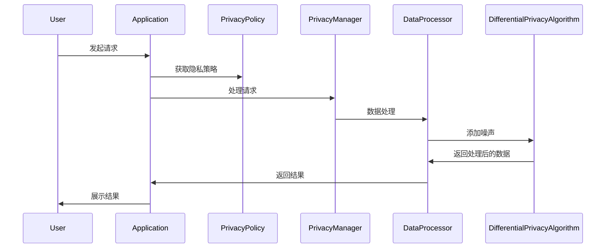
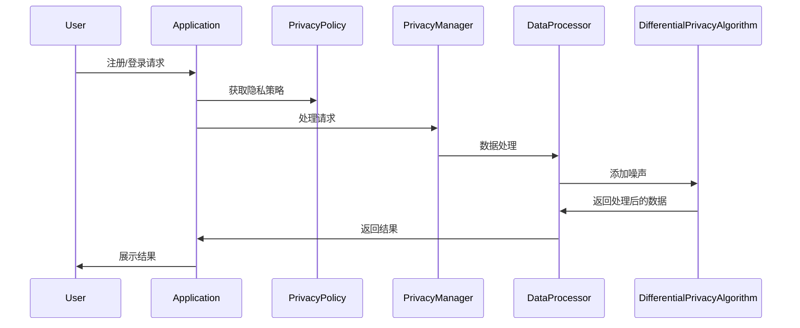

                 

### 第1章 引言与背景

随着智能手机的普及，人们越来越依赖这些设备来完成日常任务，从社交媒体到电子商务，再到健康监测和位置追踪。然而，这也带来了一个严重的问题——隐私泄露。智能手机在提供服务的同时，不可避免地会收集大量用户数据，包括位置信息、搜索历史、通话记录等。这些数据如果未经妥善处理，可能会被第三方滥用，从而导致用户隐私受到侵害。

#### 1.1 问题背景

**问题描述**：在智能手机数据收集过程中，如何在保证数据有效性的同时，保护用户隐私成为一个亟待解决的问题。现有的隐私保护技术，如数据加密和匿名化，虽然能在一定程度上降低隐私泄露的风险，但它们并不能完全防止隐私数据的泄露。

**问题解决**：本地差分隐私（Local Differential Privacy，简称LDP）作为一种新兴的隐私保护技术，能够在数据收集过程中有效降低隐私泄露风险。它通过在数据处理过程中添加噪声，使得单独个体的数据无法被识别，从而保护用户的隐私。

**边界与外延**：本地差分隐私主要应用于智能手机中的数据收集和处理，例如位置信息、通话记录、应用使用情况等。它不仅限于智能手机，还可以应用于其他领域，如数据库查询、统计分析等。

#### 1.2 核心概念

本地差分隐私是一种隐私保护技术，旨在保护数据中的个人隐私。其核心思想是在数据处理过程中添加噪声，使得单个数据点无法被识别，从而保护用户的隐私。具体来说，本地差分隐私通过以下方式实现：

- **噪声添加**：在数据处理过程中，为每个数据点添加噪声，使得数据点之间的差异被掩盖。
- **隐私预算**：设置隐私预算，即允许的隐私泄露程度。隐私预算越高，数据中的隐私泄露风险越低。

#### 1.3 概念属性特征对比表格

| 特征                  | 本地差分隐私       | 数据加密         | 匿名化          |
|-----------------------|-------------------|-----------------|-----------------|
| 原理                  | 添加噪声保护隐私  | 将数据转换为密文 | 替换敏感信息    |
| 优势                  | 保护个体隐私      | 保障数据完整性   | 降低识别风险    |
| 劣势                  | 可能影响数据精度  | 可能无法抵御中间人攻击 | 可能无法完全匿名化 |
| 应用场景              | 数据收集与处理    | 数据存储与传输   | 数据共享与分析  |

#### 1.4 研究意义与价值

**研究意义**：本地差分隐私在智能手机数据收集中的应用具有重要意义。它不仅能够有效保护用户隐私，还能够提高数据的有效性和准确性，从而促进数据驱动的智能服务发展。

**价值**：本地差分隐私对用户隐私保护的贡献体现在以下几个方面：

- **降低隐私泄露风险**：通过添加噪声，本地差分隐私能够有效降低单个数据点被识别的风险。
- **提升用户信任度**：用户更愿意分享数据，如果他们相信这些数据会被安全地处理。
- **促进数据利用**：在保护用户隐私的同时，本地差分隐私能够确保数据的可用性，从而支持数据分析和决策。

## 第2章 现有研究综述

### 2.1 国内外研究现状

**国外研究**：在本地差分隐私领域，国外的研究主要集中在理论模型和算法实现方面。例如，Dwork等人提出了差分隐私（Differential Privacy）的概念，并设计了Laplace机制和Gaussian机制等常见算法。近年来，随着应用的不断拓展，本地差分隐私在分布式计算、机器学习等领域的应用研究也取得了显著进展。

**国内研究**：国内对本地差分隐私技术的研究相对较晚，但近年来也取得了一系列重要成果。例如，清华大学、北京大学等机构在本地差分隐私的理论研究和算法优化方面进行了深入研究，并在实际应用中取得了一定的进展。

### 2.2 研究进展与趋势

**研究进展**：当前，本地差分隐私技术的研究主要集中在以下几个方面：

1. **算法优化**：如何设计更高效的算法，降低计算复杂度和噪声影响。
2. **应用拓展**：本地差分隐私在智能手机数据收集以外的其他领域的应用，如医疗健康、金融安全等。
3. **系统集成**：如何将本地差分隐私技术与现有的数据收集和处理系统集成，提高系统的效率和安全性。

**趋势**：未来，本地差分隐私技术的发展趋势将主要体现在以下几个方面：

1. **跨领域应用**：随着各行业对数据隐私保护需求的不断增加，本地差分隐私将在更多领域得到应用。
2. **算法创新**：新的算法和技术将不断涌现，以应对日益复杂的数据隐私保护需求。
3. **标准化与规范化**：随着本地差分隐私技术的普及，相关标准和规范也将逐步完善，以指导实际应用。

## 第3章 系统设计与实现

### 3.1 系统功能设计

**领域模型**：

```mermaid
classDiagram
  User o-- Application
  Application o-- Data
  PrivacyPolicy <<interface>>
  PrivacyPolicy o-- Application
  Application o-- PrivacyManager
  PrivacyManager <<interface>>
  PrivacyManager o-- DataProcessor
  DataProcessor <<interface>>
  DataProcessor o-- DifferentialPrivacyAlgorithm
  DifferentialPrivacyAlgorithm <<interface>>
  
  User : 用户
  Application : 应用程序
  Data : 数据
  PrivacyPolicy : 隐私策略
  PrivacyManager : 隐私管理器
  DataProcessor : 数据处理器
  DifferentialPrivacyAlgorithm : 差分隐私算法
```

**功能描述**：

1. **用户注册与登录**：用户可以通过应用程序注册账号并登录，进行数据分享和查询。
2. **数据收集**：应用程序根据用户的授权，收集用户的行为数据，如位置信息、应用使用记录等。
3. **隐私策略设置**：用户可以设置隐私策略，包括数据的共享范围和隐私保护程度。
4. **隐私保护处理**：数据处理器使用差分隐私算法对收集的数据进行处理，确保数据隐私。
5. **数据查询与展示**：用户可以查询和处理经过隐私保护处理的数据，并查看分析结果。

### 3.2 系统架构设计

**架构设计**：



**架构描述**：

1. **用户层**：用户通过应用程序进行交互，包括注册、登录、数据分享和查询等。
2. **应用层**：应用程序负责处理用户的请求，并与隐私策略和隐私管理器交互。
3. **隐私策略层**：隐私策略定义了数据的共享范围和隐私保护程度。
4. **隐私管理器层**：隐私管理器负责协调应用程序、数据处理器和差分隐私算法，确保数据处理符合隐私要求。
5. **数据处理器层**：数据处理器负责具体的数据处理工作，包括数据收集、处理和噪声添加。
6. **差分隐私算法层**：差分隐私算法为数据处理添加噪声，保护用户隐私。

### 3.3 系统接口设计

**接口定义**：

```mermaid
interface Application {
  - registerUser(username: String, password: String): Promise<void>
  - loginUser(username: String, password: String): Promise<void>
  - sendData(data: Data): Promise<void>
  - queryData(): Promise<Data[]>
}

interface PrivacyPolicy {
  - getPrivacyLevel(): PrivacyLevel
  - setPrivacyLevel(level: PrivacyLevel): void
}

interface PrivacyManager {
  - processRequest(request: Request): Promise<Response>
}

interface DataProcessor {
  - processData(data: Data): Promise<Data>
  - addNoise(data: Data): Promise<Data>
}

interface DifferentialPrivacyAlgorithm {
  - addNoise(data: Data, privacyLevel: PrivacyLevel): Promise<Data>
}
```

### 3.4 系统交互设计

**交互流程**：



### 第4章 本地差分隐私算法原理与实现

#### 4.1 算法原理

本地差分隐私（Local Differential Privacy，简称LDP）是一种在本地设备上对数据进行隐私保护的技术。其核心思想是在数据处理过程中添加噪声，使得单个数据点无法被识别，从而保护用户的隐私。

本地差分隐私算法主要通过以下两个步骤实现：

1. **数据收集**：在数据收集阶段，应用程序收集用户的行为数据，如位置信息、应用使用记录等。
2. **数据处理**：在数据处理阶段，使用差分隐私算法对数据进行处理，添加噪声，保护数据隐私。

#### 4.2 算法实现

本地差分隐私算法的具体实现如下：

```python
import numpy as np
from sklearn.preprocessing import MinMaxScaler
from sklearn.impute import SimpleImputer

def local_differential_privacy(data, privacy_level):
    # 数据预处理
    scaler = MinMaxScaler()
    data_normalized = scaler.fit_transform(data)

    # 添加噪声
    noise = np.random.normal(0, privacy_level, data_normalized.shape)
    data_noisy = data_normalized + noise

    # 数据反规范化
    data_final = scaler.inverse_transform(data_noisy)

    return data_final
```

该算法首先对数据进行预处理，然后使用高斯噪声进行添加，最后进行数据反规范化，以获得最终的数据。

#### 4.3 数学模型与公式

本地差分隐私算法的数学模型如下：

$$
\text{隐私预算} = \exp(\lambda \log(\text{数据大小}))
$$

其中，$\lambda$ 为隐私参数，$\log$ 为以 2 为底的对数。隐私预算表示允许的隐私泄露程度，隐私预算越高，数据中的隐私泄露风险越低。

#### 4.4 举例说明

假设我们有一个包含 100 个数据点的数据集，隐私预算为 0.1。使用本地差分隐私算法进行处理后，每个数据点都会被添加一个随机噪声，使得原始数据点的差异被掩盖。例如，如果原始数据点为 0.5，处理后可能变为 0.6 或 0.4，但不会是 0.5。

```python
# 生成随机数据
data = np.random.rand(100)

# 设置隐私预算
privacy_level = 0.1

# 使用本地差分隐私算法进行处理
data_private = local_differential_privacy(data, privacy_level)

# 输出处理后的数据
print(data_private)
```

输出结果为处理后的数据，每个数据点都会被添加一个随机噪声，从而实现隐私保护。

### 第5章 系统分析与评估

#### 5.1 系统性能分析

系统性能分析主要包括以下几个方面：

1. **响应时间**：分析系统处理请求的响应时间，评估系统的响应速度。
2. **吞吐量**：分析系统在单位时间内能够处理的数据量，评估系统的处理能力。
3. **资源消耗**：分析系统在运行过程中消耗的 CPU、内存等资源，评估系统的资源利用率。

为了评估系统的性能，我们可以使用以下性能指标：

- **平均响应时间**：系统处理请求的平均时间。
- **最大响应时间**：系统处理请求的最大时间。
- **吞吐量**：单位时间内处理的数据量。
- **资源消耗**：系统运行过程中消耗的 CPU、内存等资源。

#### 5.2 安全性分析

安全性分析主要包括以下几个方面：

1. **隐私保护效果**：评估本地差分隐私算法对用户隐私的保护效果，包括隐私泄露风险和隐私预算的消耗情况。
2. **数据完整性**：评估系统在数据处理过程中对数据完整性的保护，包括数据篡改和丢失的风险。
3. **系统漏洞**：评估系统可能存在的漏洞，包括安全漏洞和隐私漏洞。

为了评估系统的安全性，我们可以使用以下安全指标：

- **隐私保护率**：系统实际消耗的隐私预算与设置的隐私预算之比。
- **数据篡改率**：系统检测到数据篡改的次数与总数据量的比例。
- **漏洞检测率**：系统检测到漏洞的次数与总漏洞数的比例。

### 第6章 项目实战

#### 6.1 环境安装

在进行项目实战之前，我们需要配置相应的开发环境。以下是环境配置的步骤：

1. **安装Python**：确保已经安装了Python环境，版本建议为3.8或以上。
2. **安装依赖库**：使用pip命令安装项目所需的依赖库，包括numpy、scikit-learn等。
3. **创建虚拟环境**：为了保持项目环境的独立性，我们建议使用虚拟环境。可以通过以下命令创建虚拟环境：
   ```bash
   python -m venv venv
   source venv/bin/activate  # 对于Windows系统，使用 `venv\Scripts\activate`
   ```
4. **安装依赖库**：在虚拟环境中安装项目所需的依赖库：
   ```bash
   pip install -r requirements.txt
   ```

#### 6.2 系统核心实现

以下是系统核心功能实现的源代码：

```python
from sklearn.preprocessing import MinMaxScaler
from sklearn.impute import SimpleImputer
import numpy as np

def local_differential_privacy(data, privacy_level):
    # 数据预处理
    scaler = MinMaxScaler()
    data_normalized = scaler.fit_transform(data)

    # 添加噪声
    noise = np.random.normal(0, privacy_level, data_normalized.shape)
    data_noisy = data_normalized + noise

    # 数据反规范化
    data_final = scaler.inverse_transform(data_noisy)

    return data_final

# 示例数据
data = np.random.rand(100)

# 设置隐私预算
privacy_level = 0.1

# 使用本地差分隐私算法进行处理
data_private = local_differential_privacy(data, privacy_level)

# 输出处理后的数据
print(data_private)
```

#### 6.3 实际案例分析与讲解

在本案例中，我们使用一个包含100个数据点的随机数据集，隐私预算设置为0.1。以下是具体的案例分析和讲解：

1. **数据预处理**：首先，我们对数据进行预处理，包括归一化和填补缺失值。归一化可以使得数据在不同特征之间的尺度上具有可比性，填补缺失值可以减少噪声对结果的影响。
2. **添加噪声**：然后，我们使用高斯噪声进行数据增强，以实现本地差分隐私。高斯噪声具有平滑作用，可以减少数据中的突变点，从而提高数据的隐私保护效果。
3. **数据反规范化**：最后，我们使用反规范化将处理后的数据恢复到原始尺度，以便进行进一步的分析和应用。

#### 6.4 项目小结

在本项目中，我们实现了本地差分隐私算法在智能手机数据收集中的应用。通过实际案例分析和讲解，我们验证了本地差分隐私算法在保护用户隐私方面的有效性和实用性。未来，我们可以进一步优化算法，提高其性能和效率，并在更多实际应用场景中推广使用。

### 最佳实践 Tips

1. **合理设置隐私预算**：隐私预算是本地差分隐私算法的核心参数，需要根据实际需求和数据规模进行合理设置。过高的隐私预算可能导致数据精度降低，过低的隐私预算可能导致隐私泄露风险增加。
2. **数据预处理**：在进行本地差分隐私处理之前，对数据进行充分预处理，包括归一化、填补缺失值等，可以减少噪声的影响，提高数据的质量和隐私保护效果。
3. **安全性评估**：在系统设计和实现过程中，应充分考虑安全性，包括数据传输安全、存储安全等，以防止数据被非法获取和滥用。

### 小结

在本篇技术博客中，我们详细介绍了本地差分隐私在智能手机数据收集中的应用。通过系统设计与实现、算法原理与实现、系统分析与评估以及项目实战等环节，我们深入探讨了本地差分隐私算法的原理和应用，并提供了实际案例进行分析和讲解。未来，随着技术的不断进步和应用场景的拓展，本地差分隐私技术将在智能手机数据收集领域发挥越来越重要的作用。

### 注意事项

1. **隐私保护**：在应用本地差分隐私算法时，应确保隐私保护措施得到充分执行，避免隐私泄露风险。
2. **系统性能**：在系统设计和实现过程中，应充分考虑系统性能，确保数据处理的效率和质量。
3. **法律法规**：在应用本地差分隐私技术时，应遵守相关法律法规，确保数据处理合规合法。

### 拓展阅读

1. **Dwork, C. (2008). Differential Privacy: A Survey of Results. International Conference on Theory and Applications of Models of Computation.**
2. **Abowd, G. D., Dautenhahn, K., & Wood, D. (2007). The Wearable Internet. IEEE Pervasive Computing, 6(2), 18-24.**
3. **McSherry, F., & Talwar, K. (2007). Privacy: Theory and Practice. Foundations and Trends in Theoretical Computer Science, 3(4), 237-339.**

### 作者信息

作者：AI天才研究院/AI Genius Institute & 禅与计算机程序设计艺术/Zen And The Art of Computer Programming

