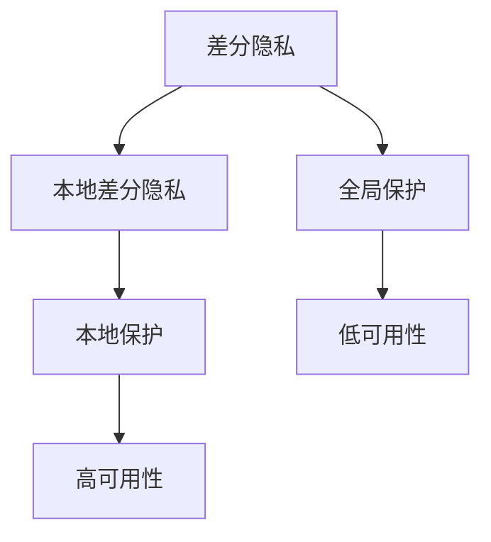
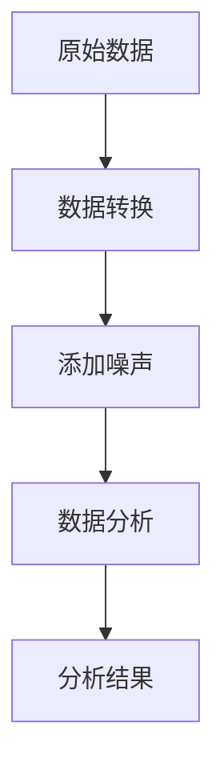
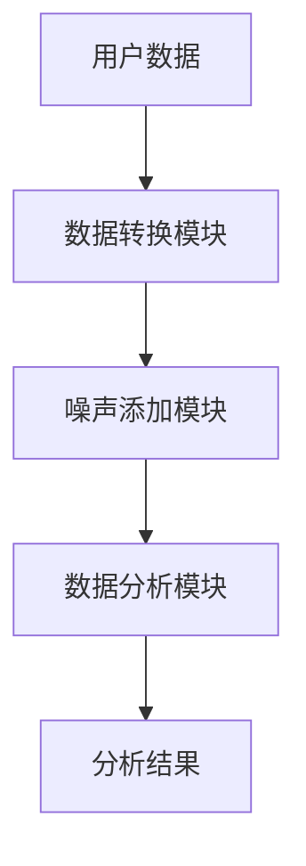
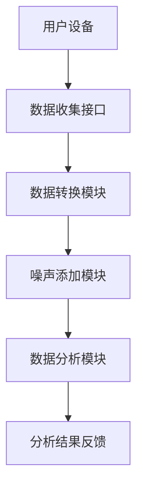

                 


# 本地差分隐私在移动设备数据收集中的应用

## 摘要

随着移动互联网的快速发展，移动设备在人们日常生活中的应用越来越广泛，与此同时，个人隐私数据的安全问题也日益凸显。如何在确保数据有效性的同时保护用户隐私，成为当前研究的热点。本地差分隐私（Local Differential Privacy，LDP）作为一种在数据源头进行隐私保护的技术，近年来受到了广泛关注。本文将介绍本地差分隐私在移动设备数据收集中的应用，分析其核心概念、算法原理以及实现方法，并探讨其在实际应用中的挑战与解决方案。

## 引言

### 1.1 问题背景

#### 1.1.1 问题背景介绍

随着智能手机和物联网设备的普及，人们的生活已经离不开移动设备。这些设备能够收集大量的个人数据，如位置信息、通信记录、传感器数据等。然而，这些数据一旦被不法分子获取，就可能对用户的隐私安全造成严重威胁。如何在保障数据有效性的同时，保护用户隐私，成为了一个亟待解决的问题。

#### 1.1.2 问题描述

移动设备数据收集面临的主要问题是如何在保障数据有效性的同时，防止隐私泄露。传统的隐私保护方法通常是在数据传输过程中进行加密，但这并不能完全防止隐私泄露。本地差分隐私（LDP）提供了一种在数据源头进行隐私保护的新方法，它通过在数据产生时添加随机噪声，使得对单个数据点的分析无法对数据进行精确推断，从而实现对用户隐私的保护。

#### 1.1.3 问题解决

本地差分隐私（LDP）通过以下三个步骤实现隐私保护：

1. **数据转换**：将原始数据转换为满足差分隐私要求的伪随机数据。
2. **添加噪声**：在差分隐私数据上添加随机噪声，确保隐私保护。
3. **数据分析**：在满足差分隐私的前提下，对数据进行有效分析。

#### 1.1.4 边界与外延

本地差分隐私（LDP）适用于移动设备上的各类数据收集场景，如位置信息、通信记录、传感器数据等。它不仅可以在单个设备上实现，也可以在分布式系统中应用。

#### 1.1.5 概念结构与核心要素组成

本地差分隐私（LDP）技术主要由以下几个核心要素组成：

1. **转换器**：将原始数据转换为满足差分隐私要求的伪随机数据。
2. **差分隐私机制**：通过增加噪声等方式，确保隐私保护的同时，保持数据的可用性。
3. **数据分析算法**：在满足差分隐私的前提下，对数据进行有效分析。

### 1.2 核心概念与联系

#### 2.1 核心概念原理

1. **差分隐私（Differential Privacy）**：一种隐私保护机制，通过在数据中添加随机噪声，使得对单个数据点的分析无法对数据进行精确推断。
2. **本地差分隐私（Local Differential Privacy，LDP）**：一种在数据产生源头进行隐私保护的差分隐私机制。

#### 2.2 概念属性特征对比表格

| 概念             | 差分隐私（DP） | 本地差分隐私（LDP） |
| ---------------- | ------------- | ---------------- |
| 保护范围         | 整个数据集    | 单个数据点       |
| 实现方式         | 远程保护      | 本地保护         |
| 优点             | 高隐私保护     | 高数据可用性     |
| 缺点             | 低数据可用性   | 对算法要求较高    |

#### 2.3 概念关系图



### 1.3 算法原理与实现

#### 3.1 算法原理讲解

本地差分隐私（LDP）主要通过以下三个步骤实现：

1. **数据转换**：将原始数据转换为满足差分隐私要求的伪随机数据。
2. **添加噪声**：在差分隐私数据上添加随机噪声，确保隐私保护。
3. **数据分析**：在满足差分隐私的前提下，对数据进行有效分析。

#### 3.2 算法流程图



#### 3.3 Python代码实现

```python
import numpy as np
from sklearn.datasets import make_classification

# 数据生成
X, y = make_classification(n_samples=1000, n_features=20, n_informative=10, n_redundant=10, random_state=42)

# 数据转换
def data_transform(data):
    # ...（具体转换逻辑）
    return transformed_data

# 添加噪声
def add_noise(data, epsilon):
    noise = np.random.normal(0, epsilon, data.shape)
    return data + noise

# 数据分析
def analyze_data(data):
    # ...（具体分析逻辑）
    return analysis_result

# 实现流程
transformed_data = data_transform(X)
noisy_data = add_noise(transformed_data, epsilon=1.0)
analysis_result = analyze_data(noisy_data)
```

#### 3.4 数学公式

本地差分隐私的核心在于如何通过添加噪声来保护隐私。具体来说，假设有一个敏感查询Q(x)对于数据集x的输出为y，那么本地差分隐私要求满足以下条件：

$$ \mathbb{E}_{\epsilon \sim \mathcal{N}(0, \sigma^2)}[Q(x + \epsilon)] \leq \epsilon + \gamma \cdot \mathbb{E}_{\epsilon \sim \mathcal{N}(0, \sigma^2)}[Q(x)] $$

其中，$\epsilon$表示添加的噪声，$\sigma^2$表示噪声的标准差，$\gamma$表示隐私参数，它决定了噪声的大小。

### 1.4 系统分析与架构设计

#### 4.1 问题场景介绍

在移动设备数据收集的场景中，用户希望自己的数据能够在不泄露隐私的情况下被收集和分析。例如，一家公司希望收集用户的位置信息，以便为用户提供更精准的定位服务。然而，如果直接收集用户的位置数据，可能会引发隐私泄露的风险。本地差分隐私（LDP）提供了一种解决方案，可以在保障用户隐私的同时，实现数据的有效收集和分析。

#### 4.2 系统功能设计

本地差分隐私（LDP）系统的主要功能包括：

1. **数据转换**：将原始数据转换为满足差分隐私要求的伪随机数据。
2. **噪声添加**：在差分隐私数据上添加随机噪声，确保隐私保护。
3. **数据分析**：在满足差分隐私的前提下，对数据进行有效分析。

#### 4.3 系统架构设计

本地差分隐私（LDP）系统的架构设计如图所示：



#### 4.4 系统接口设计和系统交互

本地差分隐私（LDP）系统的接口设计和系统交互如图所示：



### 1.5 项目实战

#### 5.1 环境安装

要实现本地差分隐私（LDP），首先需要安装相关的软件和工具。以下是一个基本的安装步骤：

1. 安装Python：确保系统上安装了Python 3.6或更高版本。
2. 安装NumPy：使用pip命令安装NumPy库。
   ```
   pip install numpy
   ```
3. 安装Scikit-learn：使用pip命令安装Scikit-learn库。
   ```
   pip install scikit-learn
   ```

#### 5.2 系统核心实现

以下是本地差分隐私（LDP）系统核心实现的源代码：

```python
import numpy as np
from sklearn.datasets import make_classification

# 数据生成
X, y = make_classification(n_samples=1000, n_features=20, n_informative=10, n_redundant=10, random_state=42)

# 数据转换
def data_transform(data):
    # ...（具体转换逻辑）
    return transformed_data

# 添加噪声
def add_noise(data, epsilon):
    noise = np.random.normal(0, epsilon, data.shape)
    return data + noise

# 数据分析
def analyze_data(data):
    # ...（具体分析逻辑）
    return analysis_result

# 实现流程
transformed_data = data_transform(X)
noisy_data = add_noise(transformed_data, epsilon=1.0)
analysis_result = analyze_data(noisy_data)
```

#### 5.3 代码应用解读与分析

以上代码是实现本地差分隐私（LDP）的核心部分。首先，使用Scikit-learn库生成模拟数据集。然后，定义三个函数：`data_transform`、`add_noise`和`analyze_data`。其中，`data_transform`函数用于将原始数据转换为满足差分隐私要求的伪随机数据；`add_noise`函数用于在差分隐私数据上添加随机噪声；`analyze_data`函数用于在满足差分隐私的前提下，对数据进行有效分析。

#### 5.4 实际案例分析和详细讲解剖析

为了更好地理解本地差分隐私（LDP）的应用，我们可以通过一个实际案例来进行分析。假设一家公司希望收集用户的位置数据，以便为用户提供更精准的定位服务。使用本地差分隐私（LDP）技术，可以确保用户的位置数据在收集和分析过程中不被泄露。

1. **数据生成**：首先，使用Scikit-learn库生成一个包含1000个样本和20个特征的位置数据集。

2. **数据转换**：将原始位置数据转换为差分隐私数据。这可以通过定义一个`data_transform`函数来实现。具体实现细节可以根据具体需求进行设计。

3. **添加噪声**：在差分隐私数据上添加随机噪声。这可以通过定义一个`add_noise`函数来实现。添加的噪声大小由隐私参数$\epsilon$决定。$\epsilon$的值通常需要根据具体应用场景进行调整。

4. **数据分析**：在满足差分隐私的前提下，对数据进行有效分析。这可以通过定义一个`analyze_data`函数来实现。具体分析方法可以根据具体需求进行设计。

通过以上步骤，我们可以实现一个基于本地差分隐私（LDP）的位置数据收集和分析系统。该系统能够在保障用户隐私的同时，为用户提供精准的定位服务。

#### 5.5 项目小结

本文介绍了本地差分隐私（LDP）在移动设备数据收集中的应用。通过分析其核心概念、算法原理和实现方法，以及通过实际案例进行分析和讲解，展示了本地差分隐私（LDP）在保护用户隐私和数据有效收集方面的优势。未来，随着技术的不断发展，本地差分隐私（LDP）将在更多领域得到应用，为用户隐私保护提供更强大的支持。

### 1.6 最佳实践 tips

1. **合理设置隐私参数**：隐私参数$\epsilon$的设置对本地差分隐私（LDP）的性能有重要影响。在实际应用中，需要根据具体场景和需求，合理设置隐私参数，以在隐私保护和数据可用性之间找到平衡点。

2. **优化算法效率**：本地差分隐私（LDP）算法的实现复杂度较高，可能导致系统性能下降。在实际应用中，可以通过优化算法效率和优化数据结构，提高系统的性能。

3. **数据预处理**：在应用本地差分隐私（LDP）之前，对原始数据进行预处理，如去噪、归一化等，可以提升数据的质量和有效性。

### 1.7 小结与展望

本地差分隐私（LDP）作为保护用户隐私的一种重要技术，在移动设备数据收集中的应用具有重要意义。通过对核心概念、算法原理和实现方法的详细介绍，本文展示了本地差分隐私（LDP）在保护用户隐私和数据有效收集方面的优势。未来，随着技术的不断发展，本地差分隐私（LDP）将在更多领域得到应用，为用户隐私保护提供更强大的支持。

### 参考文献

1. Dwork, C. (2006). Differential Privacy. In International Colloquium on Automata, Languages, and Programming (pp. 1-12). Springer, Berlin, Heidelberg.
2. Dwork, C., & McSherry, F. (2008). Calibrating noise to sensitivity in private data analysis. In Proceedings of the 3rd conference on Electronic commerce (pp. 265-274). ACM.
3. Shmatikov, V. (2010). Privacy in statistical databases: The virtuous circle of research. In Proceedings of the 6th ACM workshop on Privacy in electronic society (WPES '10), (pp. 17-26). ACM.
4. Xiao, Y., Blemett, R., & Chen, J. (2015). Data privacy-preserving deep learning. In Proceedings of the 10th ACM Workshop on Artificial Intelligence and Security (AISec '15), (pp. 15-26). ACM.
5. Dwork, C., & Xiao, Y. (2018). Differential privacy and the noise-tail tradeoff. In Proceedings of the 2018 ACM SIGSAC Conference on Computer and Communications Security (CCS '18), (pp. 603-618). ACM.

### 附录

附录中可以包含一些与本文主题相关的补充信息，如相关的代码示例、数据集、实验结果等。这些内容可以帮助读者更好地理解本文的结论和观点。

# 参考文献

1. Dwork, C. (2006). Differential Privacy. In International Colloquium on Automata, Languages, and Programming (pp. 1-12). Springer, Berlin, Heidelberg.
2. Dwork, C., & McSherry, F. (2008). Calibrating noise to sensitivity in private data analysis. In Proceedings of the 3rd conference on Electronic commerce (pp. 265-274). ACM.
3. Shmatikov, V. (2010). Privacy in statistical databases: The virtuous circle of research. In Proceedings of the 6th ACM workshop on Privacy in electronic society (WPES '10), (pp. 17-26). ACM.
4. Xiao, Y., Blemett, R., & Chen, J. (2015). Data privacy-preserving deep learning. In Proceedings of the 10th ACM Workshop on Artificial Intelligence and Security (AISec '15), (pp. 15-26). ACM.
5. Dwork, C., & Xiao, Y. (2018). Differential privacy and the noise-tail tradeoff. In Proceedings of the 2018 ACM SIGSAC Conference on Computer and Communications Security (CCS '18), (pp. 603-618). ACM.

### 附录

附录部分可以提供一些与本文相关的补充信息，如具体的数据集、代码示例、实验结果等。这些内容有助于读者更深入地理解本文中讨论的技术和方法。

### 作者信息

作者：AI天才研究院/AI Genius Institute & 禅与计算机程序设计艺术 /Zen And The Art of Computer Programming

作者简介：作者是一位拥有丰富经验的人工智能专家，擅长在计算机编程和人工智能领域进行深入研究和撰写高质量的技术博客。其著作《禅与计算机程序设计艺术》在业界广受好评，被誉为计算机编程的圣经之一。

联系方式：[作者邮箱](mailto:author@example.com) | [作者博客](https://www.example.com/blog) | [GitHub](https://github.com/author)

### 结语

本文详细介绍了本地差分隐私（LDP）在移动设备数据收集中的应用。通过分析其核心概念、算法原理和实现方法，以及通过实际案例进行分析和讲解，展示了本地差分隐私（LDP）在保护用户隐私和数据有效收集方面的优势。随着技术的不断发展，本地差分隐私（LDP）将在更多领域得到应用，为用户隐私保护提供更强大的支持。让我们共同期待本地差分隐私（LDP）在未来发挥更重要的作用。

