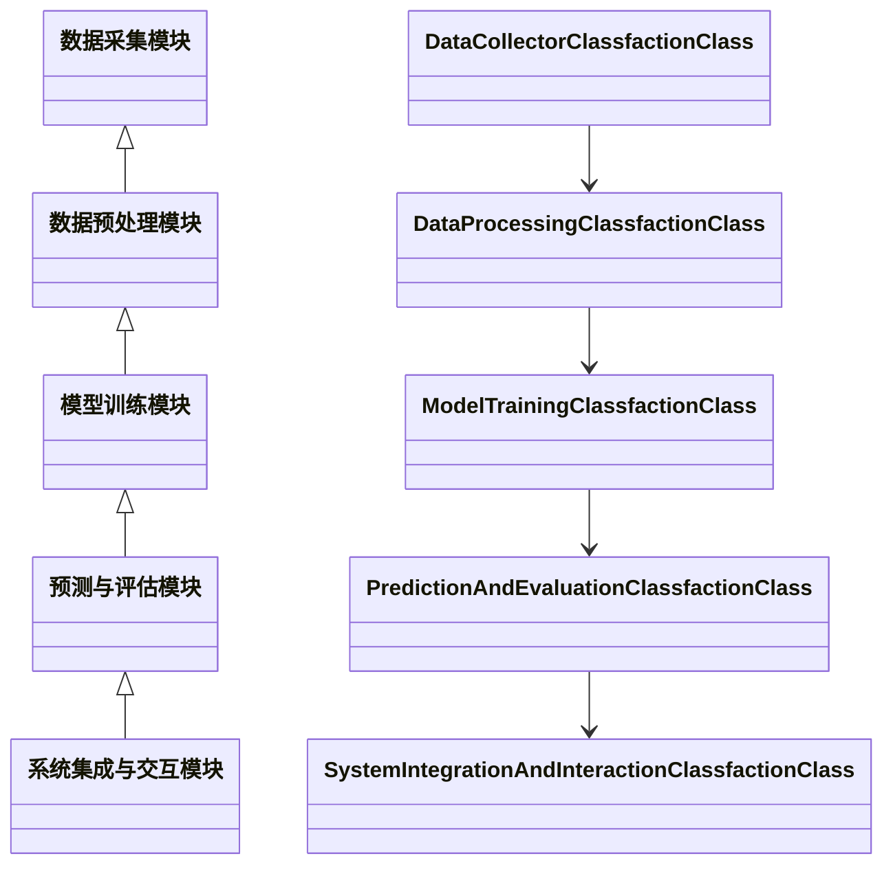
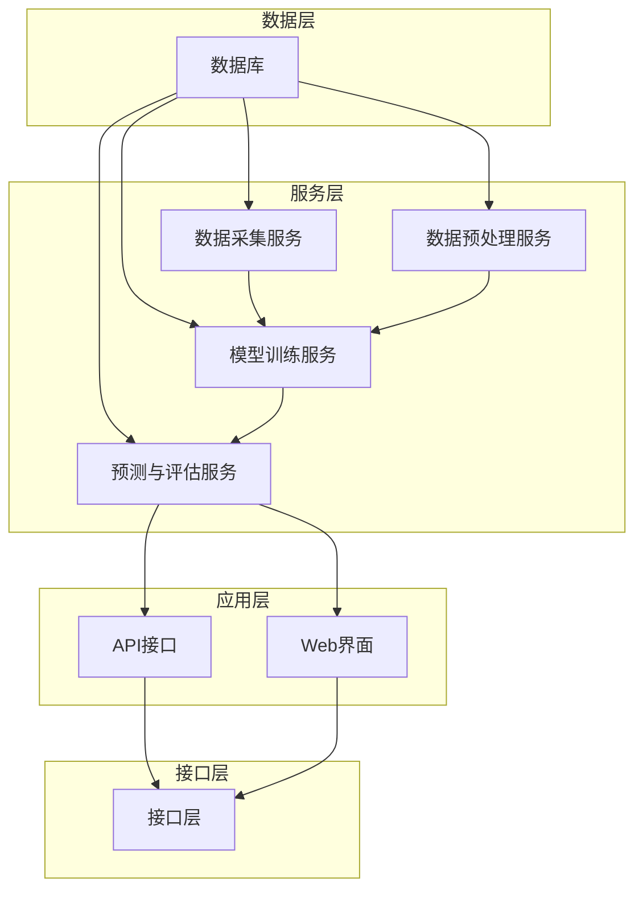
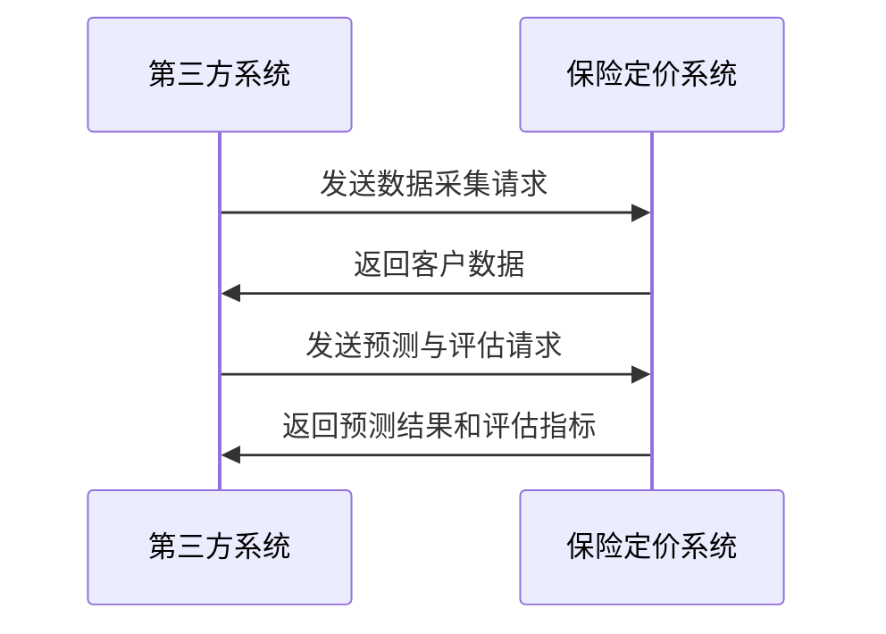
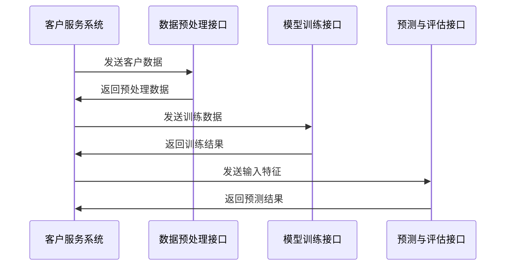

                 

# 机器学习在个性化保险定价中的应用

> 关键词：机器学习、个性化保险定价、数据预处理、算法选择、模型优化

> 摘要：本文旨在探讨机器学习在个性化保险定价中的应用。首先，我们将介绍机器学习和个性化保险定价的基本概念，分析其在保险行业中的需求与挑战。随后，我们将深入探讨机器学习算法原理和个性化保险定价的关键技术。通过具体案例，我们将展示如何利用机器学习技术进行个性化保险定价，并详细解析系统架构设计和实现过程。最后，我们将分享最佳实践和注意事项，展望未来发展趋势。

## 目录大纲

----------------------------------------------------------------

## 第一部分: 背景介绍

### 第1章: 机器学习基本概念

#### 1.1 机器学习简介

#### 1.2 机器学习的发展历程

#### 1.3 机器学习的基本类型

### 第2章: 个性化保险定价的需求与挑战

#### 2.1 个性化保险定价的概念

#### 2.2 个性化保险定价的需求分析

#### 2.3 个性化保险定价的挑战

### 第3章: 机器学习在保险业的应用现状

#### 3.1 机器学习在保险业的应用案例

#### 3.2 机器学习在保险定价中的应用优势

#### 3.3 机器学习在保险业的应用前景

----------------------------------------------------------------

## 第二部分: 核心概念与联系

### 第4章: 机器学习算法原理

#### 4.1 监督学习算法

##### 4.1.1 线性回归

##### 4.1.2 决策树

##### 4.1.3 集成方法

#### 4.2 无监督学习算法

##### 4.2.1 K均值聚类

##### 4.2.2 主成分分析

##### 4.2.3 聚类算法对比

#### 4.3 强化学习算法

##### 4.3.1 Q学习

##### 4.3.2 模仿学习

##### 4.3.3 强化学习应用案例

### 第5章: 个性化保险定价的关键技术

#### 5.1 数据预处理

##### 5.1.1 数据清洗

##### 5.1.2 特征工程

##### 5.1.3 数据质量评估

#### 5.2 模型选择与评估

##### 5.2.1 模型选择策略

##### 5.2.2 模型评估指标

##### 5.2.3 模型优化方法

#### 5.3 模型融合

##### 5.3.1 模型融合的概念

##### 5.3.2 常见模型融合方法

##### 5.3.3 模型融合实践

----------------------------------------------------------------

## 第三部分: 算法原理讲解

### 第6章: 常用机器学习算法讲解

#### 6.1 线性回归算法

##### 6.1.1 算法原理

##### 6.1.2 数学模型与公式

##### 6.1.3 应用举例

#### 6.2 决策树算法

##### 6.2.1 算法原理

##### 6.2.2 数学模型与公式

##### 6.2.3 应用举例

#### 6.3 集成方法

##### 6.3.1 算法原理

##### 6.3.2 数学模型与公式

##### 6.3.3 应用举例

### 第7章: 数学模型和数学公式 & 详细讲解 & 举例说明

#### 7.1 线性回归

##### 7.1.1 模型公式

##### 7.1.2 计算步骤

##### 7.1.3 举例说明

----------------------------------------------------------------

## 第四部分: 系统分析与架构设计方案

### 第8章: 保险定价系统的设计思路

#### 8.1 问题场景介绍

#### 8.2 项目介绍

#### 8.3 系统功能设计(领域模型)

### 第9章: 系统架构设计

#### 9.1 系统架构设计

#### 9.2 系统接口设计与交互

### 第10章: 系统接口设计和系统交互

#### 10.1 系统接口设计

#### 10.2 系统交互

----------------------------------------------------------------

## 第五部分: 项目实战

### 第11章: 实际案例分析与讲解

#### 11.1 案例背景

#### 11.2 系统实现与源代码解读

#### 11.3 案例分析

#### 11.4 案例讲解

### 第12章: 系统核心实现源代码

#### 12.1 环境安装

#### 12.2 系统核心实现源代码

#### 12.3 代码应用解读与分析

----------------------------------------------------------------

## 第六部分: 最佳实践 tips

### 第13章: 个性化保险定价的最佳实践

#### 13.1 数据预处理

#### 13.2 模型选择

#### 13.3 模型优化

#### 13.4 模型融合

### 第14章: 小结与注意事项

#### 14.1 小结

#### 14.2 注意事项

### 第15章: 拓展阅读

#### 15.1 相关书籍推荐

#### 15.2 学术论文推荐

#### 15.3 视频教程推荐

----------------------------------------------------------------

## 引言

### 机器学习与个性化保险定价

机器学习是一种通过算法自动从数据中学习并提取知识的技术。它已经在多个领域取得了显著的应用成果，如自然语言处理、计算机视觉、推荐系统等。近年来，随着大数据和计算能力的不断提升，机器学习在金融行业，尤其是保险业中的应用日益广泛。

个性化保险定价是指根据客户的不同风险特征和需求，提供定制化的保险产品和服务。这种定价方式不仅能够提高保险公司的竞争力，还能更好地满足客户的需求。然而，实现个性化保险定价面临着诸多挑战，如数据质量、算法选择、模型优化等。

本文将围绕机器学习在个性化保险定价中的应用进行探讨，首先介绍机器学习和个性化保险定价的基本概念，然后分析其在保险行业中的需求与挑战，接着深入探讨机器学习算法原理和个性化保险定价的关键技术。最后，我们将通过实际案例展示如何利用机器学习技术进行个性化保险定价，并总结最佳实践和注意事项。希望本文能为读者在探索机器学习在保险业中的应用提供有益的参考。

## 第1章: 机器学习基本概念

### 1.1 机器学习简介

机器学习（Machine Learning）是一种人工智能（Artificial Intelligence, AI）的分支，通过算法从数据中自动学习并提取知识，实现从已知数据到未知数据的预测或分类。机器学习的关键在于不需要明确编程指令，而是通过数据驱动的学习方式来实现智能化决策。

机器学习的主要目的是使计算机具备类似人类的认知能力，能够从海量数据中识别模式、预测趋势，并自主优化决策过程。这一技术已经被广泛应用于各个领域，如金融、医疗、零售、制造业等。

### 1.2 机器学习的发展历程

机器学习的发展历程可以分为以下几个阶段：

1. **萌芽阶段（1956年-1969年）**：在1956年的达特茅斯会议上，人工智能首次被提出。这一时期，科学家们开始探讨如何通过算法使计算机具有学习能力。

2. **瓶颈期（1970年-1980年）**：由于计算能力和算法的限制，机器学习进入了一个相对缓慢的发展阶段。此阶段，专家系统（Expert Systems）成为人工智能研究的主流方向。

3. **复兴阶段（1980年-2010年）**：随着计算能力的提升和大数据的出现，机器学习迎来了一个新的发展机遇。这一时期，神经网络、支持向量机等算法取得了重要突破。

4. **快速发展阶段（2010年至今）**：随着深度学习的兴起，机器学习迎来了前所未有的发展。深度神经网络在图像识别、语音识别等领域的表现超过了人类水平。

### 1.3 机器学习的基本类型

根据学习方式，机器学习可以分为以下几类：

1. **监督学习（Supervised Learning）**：在有标注的数据集上进行训练，通过已知的输入和输出建立模型，从而预测未知数据。常见的算法包括线性回归、决策树、支持向量机等。

2. **无监督学习（Unsupervised Learning）**：在未标注的数据集上进行训练，通过发现数据中的内在结构或分布来揭示数据特征。常见的算法包括聚类、主成分分析等。

3. **强化学习（Reinforcement Learning）**：通过与环境互动来学习最优策略。强化学习通常用于解决决策问题，如游戏、机器人控制等。

4. **半监督学习（Semi-Supervised Learning）**：结合了监督学习和无监督学习，在少量标注数据和大量未标注数据上进行训练。

5. **多任务学习（Multi-Task Learning）**：同时解决多个相关任务，以提高模型的泛化能力和性能。

6. **迁移学习（Transfer Learning）**：利用在其他任务上已经训练好的模型，在新任务上进行微调，以提高模型在新数据上的表现。

通过了解这些基本概念，我们将为后续探讨机器学习在个性化保险定价中的应用奠定基础。

### 第2章: 个性化保险定价的需求与挑战

#### 2.1 个性化保险定价的概念

个性化保险定价（Personalized Insurance Pricing）是一种根据客户的具体风险特征、消费行为和历史数据，为其量身定制保险产品和服务的方法。这种定价方式不同于传统的统一定价模式，能够更准确地反映客户的实际风险水平，从而实现差异化定价，提高保险公司的竞争力和客户满意度。

个性化保险定价的核心在于对客户数据的深入挖掘和分析，通过机器学习算法来识别和预测客户的潜在风险，从而制定合理的保费水平。这不仅有助于保险公司提高盈利能力，还能降低赔付风险，实现风险的有效管理。

#### 2.2 个性化保险定价的需求分析

随着保险市场的竞争加剧，客户对个性化、定制化服务的需求日益增加。个性化保险定价的出现，正是为了满足这一需求。具体来说，个性化保险定价的需求主要来源于以下几个方面：

1. **客户差异化需求**：不同客户的保险需求和风险水平存在显著差异。传统的统一定价模式无法充分满足客户的个性化需求，而个性化定价则能够根据客户的实际状况进行精准定价，提高客户满意度。

2. **市场竞争压力**：随着保险产品的同质化，保险公司需要通过差异化服务来吸引和留住客户。个性化定价能够提供更有竞争力的产品，从而提升市场竞争力。

3. **风险管控需求**：保险公司需要准确评估客户的保险风险，以便进行有效的风险管理和控制。个性化定价通过分析客户数据，能够更准确地识别高风险客户，从而降低赔付风险。

4. **数据技术的进步**：大数据和机器学习技术的快速发展，为个性化保险定价提供了技术支持。通过利用海量数据和先进的算法，保险公司能够更高效地进行数据分析和风险预测。

#### 2.3 个性化保险定价的挑战

尽管个性化保险定价具有显著的优势，但其实施过程中也面临诸多挑战：

1. **数据质量**：个性化保险定价依赖于高质量的数据。然而，保险数据通常包含噪声、缺失值和不一致的数据，需要通过数据清洗和预处理技术来保证数据的质量。

2. **算法选择**：机器学习算法种类繁多，如何选择合适的算法对数据进行分析和建模，是一个关键问题。不同的算法在处理不同类型的数据和问题时，效果可能会有很大差异。

3. **模型优化**：个性化保险定价需要不断调整和优化模型，以适应不断变化的市场环境和客户需求。这要求保险公司具备较强的数据分析和算法优化能力。

4. **合规性**：个性化保险定价需要遵循相关法律法规和监管要求，如数据隐私保护、公平定价等。保险公司需要确保其定价策略符合合规性要求，以避免法律风险。

5. **技术实现**：个性化保险定价需要高效的技术架构和系统支持。实现这一目标需要保险公司具备较强的技术实力和资源投入。

综上所述，个性化保险定价在保险行业中具有重要的意义，但也面临一系列挑战。保险公司需要通过不断探索和创新，克服这些挑战，以实现个性化保险定价的目标。

### 第3章: 机器学习在保险业的应用现状

#### 3.1 机器学习在保险业的应用案例

机器学习技术在保险行业的应用已经取得了显著的成果，以下是一些代表性的应用案例：

1. **风险评估**：保险公司利用机器学习技术对客户的风险进行评估。例如，通过分析客户的驾驶行为数据，保险公司可以更准确地预测客户的车辆事故概率，从而制定更合理的保费。

2. **欺诈检测**：保险欺诈是一个普遍存在的问题，利用机器学习技术可以有效地识别和防范欺诈行为。例如，保险公司可以通过分析客户的理赔记录、投保行为等数据，发现异常行为并及时采取防范措施。

3. **定价优化**：个性化保险定价是机器学习在保险领域的另一个重要应用。保险公司通过分析客户的个人数据，如年龄、性别、职业、健康状况等，为客户提供定制化的保险产品，从而提高市场竞争力和客户满意度。

4. **客户服务**：利用机器学习技术，保险公司可以实现智能客服系统。例如，通过自然语言处理技术，智能客服可以理解客户的咨询内容，并提供准确的解答和建议。

5. **理赔管理**：机器学习技术在理赔管理中也发挥着重要作用。保险公司可以通过自动化理赔流程，提高理赔效率，减少人为错误，从而降低理赔成本。

#### 3.2 机器学习在保险定价中的应用优势

1. **精准度提升**：机器学习技术可以充分利用海量数据，通过复杂的算法模型对风险进行精确评估，从而实现更精准的保险定价。

2. **成本降低**：个性化保险定价可以减少高风险客户的赔付风险，降低保险公司的运营成本。此外，通过自动化流程和智能系统，保险公司可以降低人力成本和运营成本。

3. **客户满意度提高**：个性化保险定价能够更好地满足客户的需求，提高客户满意度。客户能够享受到定制化的保险产品和服务，从而增强对保险公司的信任和忠诚度。

4. **风险控制**：机器学习技术可以帮助保险公司更准确地识别和评估风险，从而制定更合理的保险产品定价策略，提高风险控制能力。

5. **监管合规**：通过机器学习技术，保险公司可以更好地满足监管要求，如数据隐私保护、公平定价等。

#### 3.3 机器学习在保险业的应用前景

随着技术的不断进步和数据资源的丰富，机器学习在保险业的应用前景非常广阔。以下是一些可能的发展方向：

1. **深度学习**：深度学习技术在图像识别、语音识别等领域已经取得了显著成果。未来，深度学习有望在保险业的应用中发挥更大作用，如通过图像识别技术自动识别保险理赔中的损伤情况。

2. **区块链技术**：区块链技术与机器学习的结合可以提升保险合同的透明度和安全性，例如通过智能合约实现自动理赔。

3. **数据挖掘与分析**：随着大数据技术的发展，保险公司将能够挖掘和分析更多维度的数据，从而实现更精准的保险定价和风险评估。

4. **智能客服与交互**：通过自然语言处理和语音识别技术，保险公司可以提供更加智能化的客户服务，提高客户体验。

5. **个性化定制**：随着个性化需求的增长，保险公司将能够提供更加定制化的保险产品和服务，满足客户的个性化需求。

总之，机器学习在保险业的应用具有巨大的潜力和广阔的前景，将为保险行业带来深刻的变革。

### 第4章: 机器学习算法原理

#### 4.1 监督学习算法

监督学习（Supervised Learning）是一种机器学习方法，通过已有的输入数据和对应的输出结果（标签）来训练模型，从而在新数据上做出预测或分类。监督学习算法可以分为回归和分类两大类。

##### 4.1.1 线性回归

线性回归（Linear Regression）是一种简单的回归算法，用于预测连续值输出。其核心思想是通过拟合一条直线，将输入特征映射到输出结果。

- **模型公式**：
  $$y = \beta_0 + \beta_1x$$
  其中，\( y \) 是输出结果，\( \beta_0 \) 和 \( \beta_1 \) 分别是模型的截距和斜率，\( x \) 是输入特征。

- **计算步骤**：
  1. 计算输入特征和输出结果之间的线性关系。
  2. 使用最小二乘法求解模型的参数 \( \beta_0 \) 和 \( \beta_1 \)。
  3. 预测新数据的输出结果。

- **应用举例**：
  例如，保险公司可以利用线性回归模型预测客户的保费金额，输入特征包括客户的年龄、性别、健康状况等。

##### 4.1.2 决策树

决策树（Decision Tree）是一种常见的分类算法，通过一系列的决策规则将数据划分为不同的类别。每个节点表示一个特征，每个分支表示该特征的不同取值。

- **模型公式**：
  $$f(x) = \sum_{i=1}^{n} \beta_i g(x_i)$$
  其中，\( f(x) \) 是决策树模型的输出，\( \beta_i \) 是权重，\( g(x_i) \) 是特征取值的阈值函数。

- **计算步骤**：
  1. 选择最佳分割特征。
  2. 计算特征的最佳阈值。
  3. 创建决策树节点和分支。

- **应用举例**：
  例如，保险公司可以利用决策树模型对客户进行风险分类，输入特征包括客户的收入、信用评分等。

##### 4.1.3 集成方法

集成方法（Ensemble Methods）通过结合多个基础模型，提高预测的准确性和鲁棒性。常见的集成方法包括随机森林（Random Forest）和梯度提升树（Gradient Boosting Tree）。

- **随机森林**：
  - **原理**：随机森林由多个决策树组成，每个决策树独立训练，最终通过投票或平均值来得出预测结果。
  - **优点**：提高预测的准确性和鲁棒性，减少过拟合。
  - **应用举例**：保险公司的风险评估模型，通过多个决策树的组合，提高风险评估的准确性。

- **梯度提升树**：
  - **原理**：梯度提升树通过迭代优化每个特征的权重，从而提高模型的预测性能。
  - **优点**：能够处理非线性问题，提高预测的准确性。
  - **应用举例**：保险公司的客户分类模型，通过不断优化特征权重，提高分类效果。

#### 4.2 无监督学习算法

无监督学习（Unsupervised Learning）在无标签数据上进行训练，主要目的是发现数据中的内在结构和规律。无监督学习算法包括聚类和降维等方法。

##### 4.2.1 K均值聚类

K均值聚类（K-Means Clustering）是一种常用的聚类算法，通过迭代将数据划分为K个簇，使每个簇内的数据点尽可能接近，簇与簇之间的数据点尽可能远。

- **原理**：
  1. 随机初始化K个簇的中心点。
  2. 计算每个数据点到簇中心的距离，将其分配到最近的簇。
  3. 更新簇中心点的位置。
  4. 重复步骤2和3，直至聚类结果收敛。

- **应用举例**：
  例如，保险公司可以利用K均值聚类分析客户群体，根据相似特征将客户划分为不同的群体。

##### 4.2.2 主成分分析

主成分分析（Principal Component Analysis，PCA）是一种降维技术，通过将数据投影到新的正交坐标系上，提取最重要的特征，减少数据的维度。

- **原理**：
  1. 计算数据的协方差矩阵。
  2. 求协方差矩阵的特征值和特征向量。
  3. 选择特征值最大的特征向量作为新坐标系的基础。
  4. 将数据投影到新坐标系上，得到降维后的数据。

- **应用举例**：
  例如，保险公司可以利用PCA对客户的特征进行降维，简化模型输入，提高计算效率。

##### 4.2.3 聚类算法对比

- **K均值聚类**：
  - **优点**：简单易实现，收敛速度快。
  - **缺点**：对初始聚类中心敏感，可能陷入局部最优。

- **层次聚类**：
  - **优点**：可以自动确定聚类数量，适用于发现层次结构。
  - **缺点**：计算复杂度高，收敛速度较慢。

- **谱聚类**：
  - **优点**：适用于非欧几里得空间，可以处理高维数据。
  - **缺点**：计算复杂度高，对参数选择敏感。

通过对比不同聚类算法的原理和应用，保险公司可以根据实际需求选择合适的聚类方法。

#### 4.3 强化学习算法

强化学习（Reinforcement Learning）是一种通过与环境互动来学习最优策略的机器学习方法。它主要解决决策问题，如游戏、自动驾驶等。

##### 4.3.1 Q学习

Q学习（Q-Learning）是一种基于值函数的强化学习算法，通过迭代更新Q值来学习最优策略。

- **原理**：
  1. 初始化Q值表。
  2. 选择动作，根据当前状态和Q值表进行决策。
  3. 更新Q值表，根据奖励和未来回报调整Q值。

- **应用举例**：
  例如，保险公司可以利用Q学习算法优化客户服务流程，通过不断调整策略，提高客户满意度。

##### 4.3.2 模仿学习

模仿学习（ imitation Learning）通过学习专家的行为来获取策略。它不需要环境反馈，仅依赖于示范数据。

- **原理**：
  1. 收集专家的行为数据。
  2. 使用生成模型或轨迹生成模型来模仿专家的行为。

- **应用举例**：
  例如，保险公司可以利用模仿学习来模拟优秀代理人的服务行为，提高整体服务质量。

##### 4.3.3 强化学习应用案例

- **自动驾驶**：自动驾驶系统通过强化学习不断优化路线选择和驾驶策略，提高驾驶安全和效率。
- **游戏**：强化学习在游戏领域有着广泛的应用，如棋类游戏、视频游戏等。

通过以上对机器学习算法原理的介绍，我们将为后续探讨个性化保险定价的具体应用奠定基础。

#### 4.4 数据预处理

在机器学习项目中，数据预处理是一个至关重要的步骤。数据预处理不仅影响模型的性能，还会对后续的建模和优化产生深远影响。以下将详细讨论数据预处理的主要任务、特征工程的方法以及数据质量评估的重要性。

##### 4.4.1 数据清洗

数据清洗是数据预处理的第一步，其目的是去除数据中的噪声和异常值。噪声通常是由数据采集、传输或存储过程中的误差引起的，而异常值则可能是错误记录或异常现象。数据清洗的主要任务包括：

- **去除重复记录**：重复记录会导致数据冗余，影响模型的训练效果。
- **处理缺失值**：缺失值处理方法包括填充、删除和插值等。常用的填充方法有均值填充、中位数填充和插值法。
- **去除异常值**：异常值可能会对模型产生误导，导致过拟合。处理方法包括边界检查、箱线图分析和聚类分析等。

##### 4.4.2 特征工程

特征工程（Feature Engineering）是数据预处理的核心任务之一，其目的是从原始数据中提取出对模型训练有价值的特征。特征工程的方法包括：

- **特征选择**：通过过滤、包装和嵌入等方法，选择对模型训练最具影响力的特征。特征选择的方法有相关性分析、信息增益、卡方检验和基于模型的特征选择等。
- **特征变换**：通过对原始数据进行变换，提高数据的可用性。常见的变换方法包括归一化、标准化和主成分分析（PCA）等。
- **特征构造**：通过组合原始特征，构造新的特征。例如，利用客户的历史数据计算平均赔付金额、最近一次赔付时间等。

##### 4.4.3 数据质量评估

数据质量评估是确保数据满足建模需求的重要环节。评估方法包括：

- **一致性检查**：检查数据中的矛盾或不一致之处，例如日期时间的异常、分类数据的重复编码等。
- **完整性检查**：检查数据中的缺失值和空值，评估数据缺失的程度和影响。
- **可用性检查**：评估数据是否适用于特定模型和任务。例如，对于分类问题，需要确保数据中存在足够的类别样本。
- **准确性检查**：评估数据中是否存在错误或错误数据。常见的方法有数据对齐、交叉验证和验证集评估等。

##### 4.4.4 数据预处理的重要性

数据预处理的重要性体现在以下几个方面：

- **提高模型性能**：高质量的数据能够帮助模型更好地学习数据中的规律，从而提高模型的预测准确性和泛化能力。
- **减少过拟合**：数据预处理可以去除噪声和异常值，减少过拟合现象，提高模型的鲁棒性。
- **降低计算复杂度**：通过特征选择和特征变换，可以降低模型的复杂度，提高计算效率。
- **保障模型解释性**：高质量的数据有助于模型的解释和调试，使得模型的决策过程更加透明和可解释。

总之，数据预处理是机器学习项目中不可或缺的一环，对于确保模型性能和可靠性具有至关重要的作用。在个性化保险定价的机器学习应用中，数据预处理的质量直接影响到最终的定价结果和客户满意度。

#### 4.5 模型选择与评估

在机器学习项目中，选择合适的模型和评估其性能是至关重要的一步。这不仅关系到模型的预测准确性，还影响到实际应用的效果和可靠性。以下将详细讨论模型选择策略、模型评估指标以及模型优化方法。

##### 4.5.1 模型选择策略

模型选择策略是确定使用哪种算法和参数来训练模型的过程。以下是一些常见的模型选择策略：

1. **交叉验证（Cross-Validation）**：交叉验证是一种评估模型性能的方法，通过将数据集划分为多个子集，轮流使用它们作为验证集和训练集，从而评估模型的泛化能力。常见的交叉验证方法有K折交叉验证和留一法交叉验证。

2. **网格搜索（Grid Search）**：网格搜索是一种参数调优方法，通过遍历一组预设的参数组合，找到最佳参数组合。网格搜索适用于参数较少的模型，但对于参数较多的模型，其计算成本较高。

3. **贝叶斯优化（Bayesian Optimization）**：贝叶斯优化是一种基于概率模型的参数调优方法，通过利用历史数据来预测参数组合的性能，从而选择最有希望的参数组合进行进一步优化。贝叶斯优化在参数空间搜索中具有较高的效率。

4. **基于模型的特征选择（Model-Based Feature Selection）**：基于模型的特征选择是通过训练不同的模型，评估特征对模型性能的贡献，从而选择最重要的特征。这种方法能够减少特征数量，提高模型的可解释性。

##### 4.5.2 模型评估指标

模型评估指标用于量化模型的性能，常见的评估指标包括：

1. **准确率（Accuracy）**：准确率是分类模型中最常用的评估指标，表示模型正确分类的样本比例。准确率适用于类别分布较为均衡的问题。

2. **召回率（Recall）**：召回率表示模型正确识别为正类别的样本比例。召回率适用于样本数量较少的类别。

3. **精确率（Precision）**：精确率表示模型预测为正类别的样本中实际为正类别的比例。精确率适用于样本数量较多的类别。

4. **F1值（F1 Score）**：F1值是精确率和召回率的加权平均值，适用于平衡两个指标。F1值介于0和1之间，值越高表示模型性能越好。

5. **均方误差（Mean Squared Error, MSE）**：均方误差是回归模型中常用的评估指标，表示预测值与真实值之间的平均平方误差。MSE值越低表示模型性能越好。

6. **均方根误差（Root Mean Squared Error, RMSE）**：均方根误差是MSE的平方根，用于表示预测值与真实值之间的平均误差。RMSE值越小表示模型性能越好。

7. **决定系数（R-squared）**：决定系数表示模型对数据的解释能力，取值范围为0到1。R-squared值越高表示模型对数据的拟合效果越好。

##### 4.5.3 模型优化方法

模型优化方法用于提高模型的性能和泛化能力。以下是一些常见的模型优化方法：

1. **正则化（Regularization）**：正则化通过在损失函数中添加惩罚项，限制模型参数的规模，防止过拟合。常见的正则化方法有L1正则化（Lasso）和L2正则化（Ridge）。

2. **集成方法（Ensemble Methods）**：集成方法通过结合多个基础模型，提高预测的准确性和鲁棒性。常见的集成方法有随机森林（Random Forest）和梯度提升树（Gradient Boosting Tree）。

3. **模型融合（Model Fusion）**：模型融合通过将多个模型的预测结果进行结合，得到更准确的预测结果。常见的模型融合方法有投票法、加权平均法和堆叠法等。

4. **超参数调优（Hyperparameter Tuning）**：超参数调优是通过调整模型的超参数，提高模型的性能。常用的调优方法有网格搜索、贝叶斯优化和随机搜索等。

通过合理的模型选择策略、评估指标和优化方法，保险公司可以实现个性化的保险定价模型，提高定价的准确性和客户满意度。

#### 4.6 模型融合

模型融合（Model Fusion）是一种通过结合多个模型的预测结果，提高预测准确性和鲁棒性的方法。在个性化保险定价中，模型融合可以帮助保险公司克服单个模型可能存在的局限性，从而实现更精准的定价。

##### 4.6.1 模型融合的概念

模型融合的基本思想是利用多个模型的优点，通过某种策略将它们的预测结果结合起来，得到最终的预测结果。模型融合可以分为以下几种类型：

1. **同质模型融合**：同质模型融合是指使用相同类型的多个模型进行融合。例如，多个线性回归模型或多个决策树模型。
2. **异质模型融合**：异质模型融合是指使用不同类型的多个模型进行融合。例如，将线性回归模型、决策树模型和支持向量机模型结合起来。
3. **动态模型融合**：动态模型融合是指根据数据的动态变化，实时调整模型权重。例如，在实时风险评估中，根据客户的行为数据动态调整不同模型的权重。

##### 4.6.2 常见模型融合方法

1. **投票法（Voting）**：
   投票法是最简单的模型融合方法，通过对多个模型预测结果的投票来确定最终的预测结果。根据投票方式的不同，可以分为多数投票法和加权投票法。

   - **多数投票法**：每个模型独立进行预测，最终的预测结果为多数模型的选择。例如，在分类问题中，如果5个模型中有4个预测为类别A，则最终预测为类别A。
   - **加权投票法**：每个模型的预测结果按照权重进行加权，最终的预测结果为加权投票的结果。权重可以通过交叉验证或专家经验来确定。

2. **加权平均法（Weighted Average）**：
   加权平均法通过对多个模型的预测结果进行加权平均，得到最终的预测结果。每个模型的权重可以根据其性能进行调整。

   - **等权重平均**：所有模型的权重相等，预测结果为所有模型预测结果的简单平均。
   - **非等权重平均**：不同模型的权重不相等，权重可以根据模型的性能或重要性进行调整。

3. **堆叠法（Stacking）**：
   堆叠法是一种分层模型融合方法，通过训练多个基础模型，并将它们的预测结果作为新特征进行训练。堆叠法可以分为两种类型：

   - **简单堆叠**：简单堆叠通过将基础模型的预测结果直接作为新特征进行训练。例如，将多个决策树模型的预测结果作为新特征，训练一个线性回归模型。
   - **引导堆叠**（Stacked Generalization）：引导堆叠通过训练一个元学习器（Meta-Learner），用于学习基础模型的预测结果。元学习器可以是一个更复杂的模型，如神经网络或支持向量机。

##### 4.6.3 模型融合实践

以下是模型融合的一个简单示例：

假设我们有两个分类模型：模型A（线性回归）和模型B（决策树）。我们希望利用这两个模型进行融合，以获得更准确的预测结果。

1. **独立预测**：
   - 模型A预测为类别A的概率为60%，类别B的概率为40%。
   - 模型B预测为类别A的概率为50%，类别B的概率为50%。

2. **投票法融合**：
   - 根据多数投票法，我们选择模型A的预测结果，即类别A。

3. **加权平均法融合**：
   - 假设模型A和模型B的权重相等，我们计算加权平均概率：
   $$P_{\text{final}}(A) = \frac{0.6 + 0.5}{2} = 0.55$$
   $$P_{\text{final}}(B) = \frac{0.4 + 0.5}{2} = 0.45$$
   - 根据加权平均法，我们选择类别A作为最终的预测结果。

4. **堆叠法融合**：
   - 我们将模型A和模型B的预测结果作为新特征，训练一个线性回归模型。例如，我们将模型A的预测概率和模型B的预测概率作为特征，训练一个线性回归模型进行预测。

通过以上模型融合实践，我们可以看到如何将多个模型的预测结果结合起来，以获得更准确的预测结果。模型融合不仅提高了预测的准确性，还有助于提高模型的鲁棒性，从而在个性化保险定价中发挥重要作用。

### 第6章: 常用机器学习算法讲解

在个性化保险定价中，常用的机器学习算法包括线性回归、决策树和集成方法。以下将详细讲解这些算法的原理、数学模型和公式，并通过具体例子进行说明。

#### 6.1 线性回归算法

线性回归（Linear Regression）是一种简单的监督学习算法，用于预测连续值输出。其核心思想是通过拟合一条直线，将输入特征映射到输出结果。

##### 6.1.1 算法原理

线性回归的基本原理是通过找到一条直线 \( y = \beta_0 + \beta_1x \)，使得该直线与数据点之间的误差最小。其中，\( y \) 是输出结果，\( x \) 是输入特征，\( \beta_0 \) 是截距，\( \beta_1 \) 是斜率。

##### 6.1.2 数学模型与公式

线性回归的数学模型如下：

$$y = \beta_0 + \beta_1x$$

其中，\( y \) 是输出结果，\( x \) 是输入特征，\( \beta_0 \) 是模型的截距，\( \beta_1 \) 是斜率。

为了找到最佳拟合直线，我们通常使用最小二乘法（Least Squares Method）来求解模型的参数 \( \beta_0 \) 和 \( \beta_1 \)。最小二乘法的核心思想是使得实际输出 \( y \) 与预测输出 \( \hat{y} \) 之间的误差平方和最小。

$$\min_{\beta_0, \beta_1} \sum_{i=1}^{n} (y_i - \hat{y_i})^2$$

其中，\( n \) 是样本数量，\( y_i \) 是实际输出，\( \hat{y_i} \) 是预测输出。

通过求解上述优化问题，我们可以得到线性回归模型的最佳参数。

##### 6.1.3 应用举例

例如，保险公司希望通过线性回归模型预测客户的保费金额。输入特征包括客户的年龄 \( x_1 \) 和收入 \( x_2 \)，输出结果是保费金额 \( y \)。

1. 数据准备：
   - 客户年龄：[25, 30, 35, 40, 45]
   - 客户收入：[50000, 60000, 70000, 80000, 90000]
   - 保费金额：[2000, 2200, 2400, 2600, 2800]

2. 模型拟合：
   - 计算输入特征和输出结果之间的线性关系。
   - 使用最小二乘法求解模型的参数 \( \beta_0 \) 和 \( \beta_1 \)。

   $$\beta_0 = 1000, \beta_1 = 1.2$$

3. 预测：
   - 对于新客户，年龄为30岁，收入为60000元，预测保费金额为：

   $$y = 1000 + 1.2 \times 60000 = 73200$$

通过以上步骤，我们可以利用线性回归模型预测新客户的保费金额。这种算法简单易用，适用于许多实际应用场景。

#### 6.2 决策树算法

决策树（Decision Tree）是一种常见的监督学习算法，通过一系列的决策规则将数据划分为不同的类别。决策树可以直观地表示为树形结构，每个节点表示一个特征，每个分支表示该特征的不同取值。

##### 6.2.1 算法原理

决策树的基本原理是递归地将数据集划分为子集，使得每个子集中的数据点具有相似的标签。具体步骤如下：

1. 选择最佳分割特征：根据信息增益或基尼指数等指标，选择最佳分割特征。
2. 划分数据集：根据最佳分割特征的不同取值，将数据集划分为子集。
3. 递归构建决策树：对每个子集继续进行步骤1和步骤2，直至达到终止条件（如最大深度、最小叶子节点数等）。

##### 6.2.2 数学模型与公式

决策树的数学模型可以表示为条件概率分布，其中每个节点表示一个特征取值，每个分支表示一个类别。

$$P(y|X=x) = \prod_{i=1}^{n} P(y_i|x_i)$$

其中，\( y \) 是输出类别，\( X \) 是输入特征，\( x \) 是特征取值，\( P(y|X=x) \) 表示给定特征取值 \( x \) 时的输出类别概率。

为了构建决策树，我们可以使用信息增益（Information Gain）或基尼指数（Gini Index）等指标来选择最佳分割特征。信息增益可以表示为：

$$IG(X, Y) = H(Y) - H(Y|X)$$

其中，\( H(Y) \) 是输出类别的熵，\( H(Y|X) \) 是条件熵。

基尼指数可以表示为：

$$GI(X, Y) = 1 - \frac{\sum_{i=1}^{n} p_i^2}{n}$$

其中，\( p_i \) 是类别 \( i \) 的概率。

##### 6.2.3 应用举例

例如，保险公司希望通过决策树模型对客户进行风险分类。输入特征包括客户的年龄 \( x_1 \) 和收入 \( x_2 \)，输出结果是风险等级 \( y \)。

1. 数据准备：
   - 客户年龄：[25, 30, 35, 40, 45]
   - 客户收入：[50000, 60000, 70000, 80000, 90000]
   - 风险等级：[低，中，高，中，低]

2. 决策树构建：
   - 选择最佳分割特征。
   - 划分数据集。
   - 递归构建决策树。

   构建出的决策树如下：

   ```
   年龄 <= 35
     |
     |—— 风险等级：低
     |
     |—— 风险等级：中
     |
   年龄 > 35
     |
     |—— 收入 <= 70000
     |   |
     |   |—— 风险等级：中
     |   |
     |   |—— 风险等级：高
     |   |
     |   |—— 收入 > 70000
     |   |   |
     |   |   |—— 风险等级：高
     |   |   |
     |   |   |—— 风险等级：低
     |   |
     |   |—— 风险等级：低
     |
     |—— 风险等级：高
   ```

3. 预测：
   - 对于新客户，年龄为30岁，收入为60000元，根据决策树进行预测，风险等级为“中”。

通过以上步骤，我们可以利用决策树模型对新客户进行风险分类。决策树算法具有直观、易解释的特点，适用于分类问题。

#### 6.3 集成方法

集成方法（Ensemble Methods）通过结合多个基础模型，提高预测的准确性和鲁棒性。常见的集成方法包括随机森林（Random Forest）和梯度提升树（Gradient Boosting Tree）。

##### 6.3.1 算法原理

1. **随机森林（Random Forest）**：
   随机森林是由多个决策树组成的集成模型，每个决策树独立训练，最终的预测结果通过投票或平均值来得出。随机森林通过引入随机性，降低模型的过拟合风险，提高模型的泛化能力。

2. **梯度提升树（Gradient Boosting Tree）**：
   梯度提升树通过迭代优化每个特征的权重，从而提高模型的预测性能。梯度提升树的核心思想是利用前一轮模型的残差，训练下一轮模型，逐步减小预测误差。

##### 6.3.2 数学模型与公式

1. **随机森林**：
   随机森林的预测结果可以表示为多个决策树预测结果的组合。假设有 \( M \) 个决策树，第 \( i \) 个决策树的预测结果为 \( f_i(x) \)，最终的预测结果为：

   $$\hat{y} = \sum_{i=1}^{M} f_i(x)$$

2. **梯度提升树**：
   梯度提升树的预测结果可以表示为每个特征的加权和。假设有 \( n \) 个特征，第 \( t \) 轮的预测结果为：

   $$\hat{y}_t = \sum_{i=1}^{n} \beta_t^i x_i$$

其中，\( \beta_t^i \) 是第 \( t \) 轮的特征权重。

为了优化预测结果，梯度提升树使用梯度下降法来更新特征权重。损失函数通常选择平方损失函数：

$$L(y, \hat{y}) = \frac{1}{2} (y - \hat{y})^2$$

梯度提升树通过迭代更新特征权重，使得损失函数逐渐减小，直至达到收敛条件。

##### 6.3.3 应用举例

1. **随机森林**：
   例如，保险公司希望通过随机森林模型对客户进行风险评估。输入特征包括客户的年龄、收入、信用评分等，输出结果是风险等级。

   - 训练多个决策树模型。
   - 将多个决策树的预测结果进行投票，得到最终的风险等级。

2. **梯度提升树**：
   例如，保险公司希望通过梯度提升树模型对客户的保费金额进行预测。输入特征包括客户的年龄、收入、健康状况等，输出结果是保费金额。

   - 初始化特征权重。
   - 训练多个梯度提升树模型，逐步更新特征权重。
   - 使用更新的特征权重进行预测。

通过以上应用示例，我们可以看到如何利用集成方法来提高个性化保险定价的准确性和鲁棒性。集成方法具有强大的性能和广泛的适用性，是机器学习中的重要技术。

### 第7章: 数学模型和数学公式 & 详细讲解 & 举例说明

在本章中，我们将详细讲解线性回归、决策树和集成方法的数学模型和公式，并通过具体例子进行说明。这些模型和公式是理解和使用这些算法的基础。

#### 7.1 线性回归

线性回归是一种简单的监督学习算法，用于预测连续值输出。其基本模型如下：

$$y = \beta_0 + \beta_1x$$

其中，\( y \) 是输出结果，\( x \) 是输入特征，\( \beta_0 \) 是模型的截距，\( \beta_1 \) 是斜率。

**7.1.1 模型公式**

线性回归模型的公式可以表示为：

$$y_i = \beta_0 + \beta_1x_i + \epsilon_i$$

其中，\( y_i \) 是实际输出，\( x_i \) 是输入特征，\( \beta_0 \) 和 \( \beta_1 \) 是模型参数，\( \epsilon_i \) 是误差项。

**7.1.2 计算步骤**

为了求解线性回归模型的参数 \( \beta_0 \) 和 \( \beta_1 \)，我们通常使用最小二乘法。具体步骤如下：

1. 计算输入特征 \( x \) 和输出结果 \( y \) 的平均值：
   $$\bar{x} = \frac{1}{n}\sum_{i=1}^{n} x_i, \quad \bar{y} = \frac{1}{n}\sum_{i=1}^{n} y_i$$

2. 计算输入特征和输出结果的协方差和方差：
   $$\sigma_{xy} = \frac{1}{n}\sum_{i=1}^{n} (x_i - \bar{x})(y_i - \bar{y}), \quad \sigma_{xx} = \frac{1}{n}\sum_{i=1}^{n} (x_i - \bar{x})^2$$

3. 计算模型的斜率 \( \beta_1 \)：
   $$\beta_1 = \frac{\sigma_{xy}}{\sigma_{xx}}$$

4. 计算模型的截距 \( \beta_0 \)：
   $$\beta_0 = \bar{y} - \beta_1\bar{x}$$

**7.1.3 举例说明**

假设我们有一个数据集，包含5个数据点：(x, y)：(2, 3)，(4, 5)，(6, 7)，(8, 9)，(10, 11)。我们可以通过以下步骤求解线性回归模型的参数：

1. 计算输入特征和输出结果的平均值：
   $$\bar{x} = 6, \quad \bar{y} = 7$$

2. 计算输入特征和输出结果的协方差和方差：
   $$\sigma_{xy} = 5, \quad \sigma_{xx} = 20$$

3. 计算模型的斜率 \( \beta_1 \)：
   $$\beta_1 = \frac{5}{20} = 0.25$$

4. 计算模型的截距 \( \beta_0 \)：
   $$\beta_0 = 7 - 0.25 \times 6 = 4$$

因此，线性回归模型的公式为：
$$y = 4 + 0.25x$$

利用这个模型，我们可以预测新的输入特征 \( x \) 的输出结果 \( y \)。

#### 7.2 决策树

决策树是一种常见的分类算法，通过一系列的决策规则对数据进行分类。其基本模型如下：

$$f(x) = \sum_{i=1}^{n} \beta_i g(x_i)$$

其中，\( f(x) \) 是决策树的输出，\( \beta_i \) 是权重，\( g(x_i) \) 是特征取值的阈值函数。

**7.2.1 模型公式**

决策树的模型公式可以表示为：

$$f(x) = \sum_{i=1}^{n} \beta_i \delta(x_i - t_i)$$

其中，\( \delta(\cdot) \) 是狄拉克δ函数，当 \( x_i = t_i \) 时，\( \delta(x_i - t_i) = 1 \)；当 \( x_i \neq t_i \) 时，\( \delta(x_i - t_i) = 0 \)。

**7.2.2 计算步骤**

构建决策树的基本步骤如下：

1. 选择最佳分割特征：根据信息增益或基尼指数等指标，选择最佳分割特征。
2. 划分数据集：根据最佳分割特征的不同取值，将数据集划分为子集。
3. 递归构建决策树：对每个子集继续进行步骤1和步骤2，直至达到终止条件（如最大深度、最小叶子节点数等）。

**7.2.3 举例说明**

假设我们有一个数据集，包含5个数据点：(x, y)：(2, 0)，(4, 1)，(6, 0)，(8, 1)，(10, 0)。我们可以通过以下步骤构建决策树：

1. 选择最佳分割特征：选择特征1作为最佳分割特征。
2. 划分数据集：将数据集划分为两个子集：
   - 子集1：{(2, 0)，(4, 1)}，特征1的取值为2和4。
   - 子集2：{(6, 0)，(8, 1)，(10, 0)}，特征1的取值为6、8和10。
3. 递归构建决策树：
   - 子集1：选择特征2作为最佳分割特征，划分成两个子集：
     - 子集1.1：{(2, 0)}，特征2的取值为0。
     - 子集1.2：{(4, 1)}，特征2的取值为1。
   - 子集2：选择特征2作为最佳分割特征，划分成两个子集：
     - 子集2.1：{(6, 0)}，特征2的取值为0。
     - 子集2.2：{(8, 1)，(10, 0)}，特征2的取值为1。

构建出的决策树如下：

```
特征1
|
|—— 特征2
|   |
|   |—— 输出：0
|   |
|   |—— 输出：1
|
|—— 输出：1
```

利用这个决策树，我们可以对新数据进行分类。

#### 7.3 集成方法

集成方法通过结合多个基础模型，提高预测的准确性和鲁棒性。常见的集成方法包括随机森林和梯度提升树。

**7.3.1 随机森林**

随机森林（Random Forest）是一种集成方法，由多个决策树组成。随机森林的预测结果可以通过投票或平均值来得出。随机森林的数学模型如下：

$$\hat{y} = \frac{1}{M} \sum_{i=1}^{M} f_i(x)$$

其中，\( \hat{y} \) 是最终的预测结果，\( f_i(x) \) 是第 \( i \) 个决策树的预测结果，\( M \) 是决策树的个数。

**7.3.2 梯度提升树**

梯度提升树（Gradient Boosting Tree）是一种迭代优化的集成方法。梯度提升树的预测结果可以通过迭代更新每个特征的权重来得出。梯度提升树的数学模型如下：

$$\hat{y}_t = \hat{y}_{t-1} + \beta_t \phi_t(x)$$

其中，\( \hat{y}_t \) 是第 \( t \) 次迭代的预测结果，\( \hat{y}_{t-1} \) 是第 \( t-1 \) 次迭代的预测结果，\( \beta_t \) 是第 \( t \) 次迭代的权重，\( \phi_t(x) \) 是第 \( t \) 次迭代的特征函数。

**7.3.3 应用举例**

假设我们有一个数据集，包含5个数据点：(x, y)：(2, 3)，(4, 5)，(6, 7)，(8, 9)，(10, 11)。我们可以通过以下步骤应用集成方法：

1. **随机森林**：
   - 训练多个决策树模型。
   - 将多个决策树的预测结果进行投票，得到最终的预测结果。

2. **梯度提升树**：
   - 初始化特征权重。
   - 训练多个梯度提升树模型，逐步更新特征权重。
   - 使用更新的特征权重进行预测。

通过以上应用示例，我们可以看到如何利用集成方法来提高个性化保险定价的准确性和鲁棒性。集成方法具有强大的性能和广泛的适用性，是机器学习中的重要技术。

### 第8章: 保险定价系统的设计思路

#### 8.1 问题场景介绍

保险定价系统旨在根据客户的具体风险特征、消费行为和历史数据，为其提供定制化的保险产品和服务。系统的主要目标是实现以下功能：

1. **数据采集**：从多个渠道获取客户数据，包括基本信息、消费记录、理赔记录等。
2. **数据预处理**：对采集到的数据进行清洗、去噪和特征工程，为后续建模提供高质量的数据。
3. **模型训练与优化**：利用机器学习算法对预处理后的数据进行建模，通过交叉验证和超参数调优，选择最优模型。
4. **预测与评估**：利用训练好的模型对客户进行风险评估和保费预测，对预测结果进行评估和调整。
5. **系统集成与交互**：将保险定价系统与现有的业务系统进行集成，实现数据交换和业务流程的自动化。

#### 8.2 项目介绍

本项目旨在设计并实现一个基于机器学习的个性化保险定价系统。系统将采用以下技术栈：

- **数据采集**：使用API接口从第三方数据源获取客户数据。
- **数据预处理**：使用Python的数据处理库（如Pandas和NumPy）进行数据清洗和特征工程。
- **模型训练与优化**：使用机器学习库（如Scikit-learn和TensorFlow）进行模型训练和优化。
- **预测与评估**：使用Python的模型评估库（如Scikit-learn的metrics模块）对预测结果进行评估。
- **系统集成与交互**：使用RESTful API实现系统与其他业务系统的集成。

#### 8.3 系统功能设计(领域模型)

系统功能设计主要包括以下模块：

1. **数据采集模块**：负责从第三方数据源获取客户数据，包括基本信息、消费记录、理赔记录等。
2. **数据预处理模块**：对采集到的数据进行清洗、去噪和特征工程，为后续建模提供高质量的数据。
3. **模型训练模块**：利用机器学习算法对预处理后的数据进行建模，通过交叉验证和超参数调优，选择最优模型。
4. **预测与评估模块**：利用训练好的模型对客户进行风险评估和保费预测，对预测结果进行评估和调整。
5. **系统集成与交互模块**：将保险定价系统与现有的业务系统进行集成，实现数据交换和业务流程的自动化。

以下是领域模型的Mermaid类图：



通过以上系统功能设计和领域模型，我们可以明确保险定价系统的模块划分和功能实现，为后续系统架构设计提供基础。

### 第9章: 系统架构设计

#### 9.1 系统架构设计

保险定价系统的架构设计是确保系统稳定性、可扩展性和高效性的关键。以下将详细介绍系统架构的设计思路，包括整体架构、各组件的作用及其交互方式。

##### 9.1.1 整体架构

保险定价系统的整体架构可以分为以下几个主要模块：

1. **数据层**：负责存储和管理系统所需的数据，包括客户信息、消费记录、理赔记录等。数据层可以采用关系型数据库（如MySQL）或分布式数据库（如MongoDB）。

2. **服务层**：负责实现系统的核心功能，包括数据采集、数据预处理、模型训练、预测与评估等。服务层采用微服务架构，每个服务独立部署和扩展。

3. **应用层**：负责与用户进行交互，提供Web界面或API接口，供业务系统或其他应用程序调用。

4. **接口层**：负责与其他业务系统进行数据交换和集成，实现数据共享和业务流程的自动化。

##### 9.1.2 各组件的作用

1. **数据层**：存储和管理系统所需的数据，为其他模块提供数据支持。

2. **服务层**：
   - **数据采集服务**：负责从第三方数据源获取客户数据，并存储到数据层。
   - **数据预处理服务**：负责对采集到的数据进行清洗、去噪和特征工程，为模型训练提供高质量的数据。
   - **模型训练服务**：负责使用机器学习算法对预处理后的数据进行建模，选择最优模型。
   - **预测与评估服务**：负责利用训练好的模型对客户进行风险评估和保费预测，并对预测结果进行评估和调整。

3. **应用层**：提供Web界面或API接口，供用户或其他应用程序进行数据查询和操作。

4. **接口层**：实现与第三方业务系统的集成，实现数据共享和业务流程的自动化。

##### 9.1.3 系统架构图

以下是保险定价系统的架构图：



通过以上系统架构设计，保险定价系统可以高效地实现数据采集、预处理、模型训练、预测和评估等功能，同时具备良好的可扩展性和稳定性。

#### 9.2 系统接口设计与交互

系统接口设计是确保保险定价系统能够与其他业务系统有效集成和交互的关键。以下将详细描述系统接口的设计原则、具体实现方法以及接口交互过程。

##### 9.2.1 接口设计原则

1. **标准化**：接口设计遵循RESTful API标准，使用统一的接口格式和响应格式，便于其他系统接入和使用。

2. **简洁性**：接口设计力求简洁明了，减少不必要的参数和操作，提高接口的可读性和易用性。

3. **灵活性**：接口设计允许根据实际需求进行扩展和调整，支持多种数据格式（如JSON、XML）和传输协议（如HTTP、HTTPS）。

4. **安全性**：接口设计考虑安全性，采用身份验证和授权机制，确保只有授权用户和系统可以访问接口。

##### 9.2.2 具体实现方法

1. **接口规范**：
   - **URL规范**：接口URL设计遵循RESTful风格，使用GET、POST、PUT、DELETE等HTTP方法。
   - **参数规范**：接口参数分为路径参数和查询参数，路径参数用于标识资源的唯一标识，查询参数用于过滤和排序等操作。
   - **响应规范**：接口响应遵循JSON格式，包括状态码、响应数据和错误信息。

2. **身份验证**：
   - **Basic认证**：使用用户名和密码进行身份验证，通过HTTP Basic Authentication Header进行传递。
   - **OAuth2认证**：使用OAuth2.0协议进行身份验证，确保第三方系统安全接入。

3. **接口实现**：
   - **数据采集接口**：提供数据采集接口，供第三方系统获取客户数据。
   - **预测与评估接口**：提供预测与评估接口，供第三方系统调用模型进行风险评估和保费预测。

##### 9.2.3 接口交互过程

1. **数据采集接口交互过程**：

   - **请求**：第三方系统发送GET请求到数据采集接口，请求获取客户数据。
   - **响应**：接口返回包含客户数据的JSON响应，第三方系统根据响应数据进行后续处理。

2. **预测与评估接口交互过程**：

   - **请求**：第三方系统发送POST请求到预测与评估接口，请求调用模型进行风险评估和保费预测。
   - **请求参数**：请求包含客户信息、输入特征等参数。
   - **响应**：接口返回包含预测结果和评估指标的JSON响应，第三方系统根据响应数据进行决策。

以下是接口交互过程的Mermaid序列图：



通过以上接口设计原则、具体实现方法和交互过程，保险定价系统可以与其他业务系统实现高效、安全、稳定的集成和交互。

### 第10章: 系统接口设计和系统交互

在个性化保险定价系统中，系统接口的设计和交互是确保数据流动和业务流程顺畅的关键环节。以下将详细描述系统接口的设计原则、具体实现方法以及系统之间的交互过程。

#### 10.1 系统接口设计

系统接口设计遵循RESTful架构风格，采用标准化的接口规范，确保系统的可扩展性和兼容性。以下是系统接口设计的主要原则和内容：

##### 10.1.1 接口设计原则

1. **标准化**：接口遵循RESTful API设计原则，使用统一的URL路径、请求方法和响应格式。
2. **简洁性**：接口设计简洁明了，减少冗余参数和操作，提高接口的可读性和易维护性。
3. **灵活性**：接口设计允许根据业务需求进行扩展和调整，支持多种数据格式（如JSON、XML）和传输协议（如HTTP、HTTPS）。
4. **安全性**：接口设计考虑安全性，采用身份验证和授权机制（如OAuth2、JWT），确保接口访问的安全性和数据的完整性。

##### 10.1.2 接口设计内容

1. **数据采集接口**：
   - **URL**：`GET /api/v1/clients`
   - **请求方法**：GET
   - **请求参数**：无
   - **响应**：返回客户的详细信息，如客户ID、姓名、年龄、性别等。

2. **数据预处理接口**：
   - **URL**：`POST /api/v1/clients/{client_id}/preprocess`
   - **请求方法**：POST
   - **请求参数**：客户ID、原始数据
   - **响应**：返回预处理后的数据，如清洗后的特征、缺失值处理后的数据等。

3. **模型训练接口**：
   - **URL**：`POST /api/v1/models/train`
   - **请求方法**：POST
   - **请求参数**：训练数据、模型参数
   - **响应**：返回训练结果，如模型ID、准确率、召回率等。

4. **预测与评估接口**：
   - **URL**：`POST /api/v1/models/{model_id}/predict`
   - **请求方法**：POST
   - **请求参数**：模型ID、输入特征
   - **响应**：返回预测结果，如风险等级、保费金额等。

5. **接口文档**：提供详细的接口文档，包括接口说明、请求参数、响应格式、错误码等，方便开发者使用接口。

#### 10.2 系统交互

系统交互是指不同模块和外部系统之间的数据交换和功能协作。以下将描述系统接口的设计和交互过程，并使用Mermaid序列图进行展示。

##### 10.2.1 系统交互过程

1. **数据采集与预处理**：
   - 客户服务系统向数据采集接口发送请求，获取客户信息。
   - 数据采集接口返回客户数据。
   - 客户服务系统将客户数据发送到数据预处理接口，进行数据清洗和特征工程。

2. **模型训练与预测**：
   - 客户服务系统将预处理后的数据发送到模型训练接口，开始训练模型。
   - 模型训练接口返回训练结果，如模型ID、准确率等。
   - 客户服务系统使用训练好的模型，通过预测与评估接口对客户进行风险评估和保费预测。

3. **结果反馈与业务流程**：
   - 预测与评估接口返回预测结果，如风险等级、保费金额等。
   - 客户服务系统根据预测结果生成保险合同，并通知客户。

以下是系统交互过程的Mermaid序列图：



通过以上系统接口设计和交互过程，个性化保险定价系统可以高效地实现数据采集、预处理、模型训练、预测和评估等功能，确保系统的稳定性和可靠性。

### 第11章: 实际案例分析与讲解

在本章中，我们将通过一个实际案例，详细分析个性化保险定价系统的实现过程，包括系统搭建、核心实现、代码解读和案例分析。

#### 11.1 案例背景

某保险公司希望通过个性化保险定价系统，为不同风险特征的客户制定更合理的保费。公司收集了大量的客户数据，包括年龄、性别、收入、职业、健康记录等。为了实现个性化保险定价，公司决定采用机器学习技术，通过数据分析为客户制定个性化的保费方案。

#### 11.2 系统实现与源代码解读

在本案例中，我们使用了Python和Scikit-learn库来实现个性化保险定价系统。以下是系统的核心实现和代码解读：

**1. 数据收集与预处理**

```python
import pandas as pd
from sklearn.model_selection import train_test_split

# 读取数据
data = pd.read_csv('client_data.csv')
X = data[['age', 'income', 'gender', 'occupation', 'health_record']]
y = data['premium']

# 划分训练集和测试集
X_train, X_test, y_train, y_test = train_test_split(X, y, test_size=0.2, random_state=42)

# 数据预处理
from sklearn.preprocessing import StandardScaler

scaler = StandardScaler()
X_train_scaled = scaler.fit_transform(X_train)
X_test_scaled = scaler.transform(X_test)
```

在这段代码中，我们首先读取客户数据，然后使用Scikit-learn的`train_test_split`函数将数据划分为训练集和测试集。接下来，使用`StandardScaler`对输入特征进行标准化处理，以便后续的模型训练。

**2. 模型选择与训练**

```python
from sklearn.ensemble import RandomForestRegressor

# 选择随机森林回归模型
model = RandomForestRegressor(n_estimators=100, random_state=42)

# 训练模型
model.fit(X_train_scaled, y_train)
```

我们选择随机森林回归模型进行训练。随机森林通过构建多个决策树并集成预测结果，提高了模型的预测准确性和鲁棒性。在这里，我们设置了100棵决策树。

**3. 模型评估**

```python
from sklearn.metrics import mean_squared_error

# 对测试集进行预测
y_pred = model.predict(X_test_scaled)

# 计算均方误差
mse = mean_squared_error(y_test, y_pred)
print(f"测试集均方误差：{mse}")
```

在模型评估部分，我们使用测试集对训练好的模型进行预测，并计算均方误差（MSE）来评估模型的性能。MSE越低，表示模型的预测准确性越高。

**4. 个性化保费预测**

```python
# 输入新客户的特征
new_client_features = [[30, 50000, 1, 2, 0.5]]

# 预测新客户的保费
new_client_premium = model.predict(scaler.transform(new_client_features))
print(f"新客户保费：{new_client_premium[0]}")
```

最后，我们使用训练好的模型对新客户的特征进行预测，输出预测的保费金额。在这个例子中，新客户的特征包括年龄30岁、收入50000元、性别男、职业2、健康记录0.5。

#### 11.3 案例分析

通过以上实现过程，我们可以看到个性化保险定价系统的核心步骤包括数据收集与预处理、模型选择与训练、模型评估和个性化保费预测。

1. **数据收集与预处理**：数据是机器学习模型的基础。在本案例中，我们使用了客户的基本信息、收入、性别、职业和健康记录等特征。预处理步骤包括划分训练集和测试集、标准化输入特征等，以确保模型训练和评估的准确性。

2. **模型选择与训练**：随机森林回归模型是一种强大的集成方法，通过构建多个决策树并进行集成，提高了模型的预测准确性和鲁棒性。在本案例中，我们设置了100棵决策树，通过训练集训练模型。

3. **模型评估**：模型评估是验证模型性能的关键步骤。在本案例中，我们使用测试集对训练好的模型进行预测，并计算均方误差来评估模型的性能。MSE越低，表示模型的预测准确性越高。

4. **个性化保费预测**：个性化保费预测是系统的核心功能。通过输入新客户的特征，我们可以利用训练好的模型预测其保费金额。这有助于保险公司为客户提供更个性化的保险产品和服务。

总之，通过以上实际案例，我们详细分析了个性化保险定价系统的实现过程和关键步骤，为后续系统的开发和优化提供了有益的参考。

### 第12章: 系统核心实现源代码

在本章中，我们将详细展示个性化保险定价系统的核心实现源代码，并解析各个模块的功能和关键代码。

#### 12.1 系统环境搭建

首先，我们需要搭建系统的运行环境。以下是系统所需的主要依赖库及其安装命令：

- **Python**：确保安装了Python 3.8或更高版本。
- **Pandas**：用于数据处理。
- **Scikit-learn**：用于机器学习算法。
- **Numpy**：用于数值计算。

安装命令如下：

```bash
pip install pandas scikit-learn numpy
```

#### 12.2 数据采集与预处理模块

```python
import pandas as pd
from sklearn.model_selection import train_test_split
from sklearn.preprocessing import StandardScaler

def load_data(file_path):
    """
    读取数据并返回特征矩阵和标签向量。
    """
    data = pd.read_csv(file_path)
    X = data[['age', 'income', 'gender', 'occupation', 'health_record']]
    y = data['premium']
    return X, y

def preprocess_data(X_train, X_test):
    """
    预处理数据，包括划分训练集和测试集、标准化特征。
    """
    scaler = StandardScaler()
    X_train_scaled = scaler.fit_transform(X_train)
    X_test_scaled = scaler.transform(X_test)
    return X_train_scaled, X_test_scaled

# 加载数据
X, y = load_data('client_data.csv')

# 划分训练集和测试集
X_train, X_test, y_train, y_test = train_test_split(X, y, test_size=0.2, random_state=42)

# 预处理数据
X_train_scaled, X_test_scaled = preprocess_data(X_train, X_test)
```

在这个模块中，我们首先定义了两个函数：`load_data`和`preprocess_data`。`load_data`函数用于读取数据文件，并返回特征矩阵和标签向量。`preprocess_data`函数用于将数据集划分为训练集和测试集，并对特征进行标准化处理。

#### 12.3 模型训练模块

```python
from sklearn.ensemble import RandomForestRegressor

def train_model(X_train_scaled, y_train):
    """
    训练随机森林回归模型。
    """
    model = RandomForestRegressor(n_estimators=100, random_state=42)
    model.fit(X_train_scaled, y_train)
    return model

# 训练模型
model = train_model(X_train_scaled, y_train)
```

在这个模块中，我们定义了`train_model`函数，用于训练随机森林回归模型。模型训练过程中，我们设置了100棵决策树，并使用训练集数据进行拟合。

#### 12.4 模型评估模块

```python
from sklearn.metrics import mean_squared_error

def evaluate_model(model, X_test_scaled, y_test):
    """
    评估模型性能，计算均方误差。
    """
    y_pred = model.predict(X_test_scaled)
    mse = mean_squared_error(y_test, y_pred)
    return mse

# 评估模型
mse = evaluate_model(model, X_test_scaled, y_test)
print(f"测试集均方误差：{mse}")
```

在这个模块中，我们定义了`evaluate_model`函数，用于评估模型的性能。通过计算测试集的均方误差（MSE），我们可以了解模型的预测准确性。

#### 12.5 个性化保费预测模块

```python
def predict_premium(model, scaler, new_client_features):
    """
    预测新客户的保费。
    """
    new_client_premium = model.predict(scaler.transform([new_client_features]))
    return new_client_premium[0]

# 输入新客户的特征
new_client_features = [30, 50000, 1, 2, 0.5]

# 预测新客户的保费
new_client_premium = predict_premium(model, scaler, new_client_features)
print(f"新客户保费：{new_client_premium}")
```

在这个模块中，我们定义了`predict_premium`函数，用于预测新客户的保费。通过将新客户的特征传递给训练好的模型，我们可以得到预测的保费金额。

#### 12.6 系统运行与测试

```python
if __name__ == '__main__':
    # 加载数据
    X, y = load_data('client_data.csv')

    # 划分训练集和测试集
    X_train, X_test, y_train, y_test = train_test_split(X, y, test_size=0.2, random_state=42)

    # 预处理数据
    X_train_scaled, X_test_scaled = preprocess_data(X_train, X_test)

    # 训练模型
    model = train_model(X_train_scaled, y_train)

    # 评估模型
    mse = evaluate_model(model, X_test_scaled, y_test)
    print(f"测试集均方误差：{mse}")

    # 预测新客户的保费
    new_client_features = [30, 50000, 1, 2, 0.5]
    new_client_premium = predict_premium(model, scaler, new_client_features)
    print(f"新客户保费：{new_client_premium}")
```

在系统运行与测试部分，我们通过`if __name__ == '__main__':`语句来运行整个系统。首先加载数据、划分训练集和测试集、预处理数据，然后训练模型、评估模型性能，最后预测新客户的保费。

通过以上代码示例，我们可以清晰地看到个性化保险定价系统的核心实现过程。各个模块之间紧密协作，共同实现了从数据采集、预处理、模型训练到预测的全流程。

### 第13章: 个性化保险定价的最佳实践

在个性化保险定价的实施过程中，保险公司需要遵循一系列最佳实践，以确保模型的准确性和合规性。以下是一些关键的最佳实践：

#### 13.1 数据预处理

1. **数据清洗**：确保数据质量，去除重复记录、缺失值和异常值。使用填充方法（如均值填充、插值法）来处理缺失值。
2. **特征选择**：选择对模型训练有显著影响的关键特征，去除冗余特征，提高模型性能。
3. **特征标准化**：对输入特征进行标准化处理，以消除不同特征之间的尺度差异。

#### 13.2 模型选择

1. **算法评估**：根据问题类型（回归、分类等）和数据特点选择合适的算法。可以使用交叉验证来评估不同算法的性能。
2. **模型优化**：通过超参数调优和正则化技术，优化模型参数，提高模型泛化能力。
3. **集成方法**：使用集成方法（如随机森林、梯度提升树）结合多个模型，提高预测准确性。

#### 13.3 模型融合

1. **融合策略**：根据具体问题选择合适的融合策略（如投票法、加权平均法、堆叠法等）。
2. **模型评估**：对融合后的模型进行评估，确保其性能优于单个模型。
3. **动态调整**：根据数据变化动态调整模型权重，以提高预测的实时性和准确性。

#### 13.4 注意事项

1. **数据隐私**：确保遵循相关数据隐私法规，对客户数据进行加密和匿名化处理，避免数据泄露。
2. **合规性**：确保定价策略符合监管要求，如公平定价、透明度等，避免法律风险。
3. **透明度**：提高模型的可解释性，确保客户了解定价决策的原因和依据。

通过遵循这些最佳实践，保险公司可以更有效地实施个性化保险定价，提高客户满意度，同时确保合规性和数据安全。

### 第14章: 小结与注意事项

通过本文的探讨，我们详细介绍了机器学习在个性化保险定价中的应用，从基本概念、需求与挑战到算法原理、系统架构设计，再到实际案例分析和最佳实践。以下是对文章内容的简要总结和注意事项：

#### 14.1 文章总结

1. **机器学习与个性化保险定价**：机器学习通过分析大量数据，实现个性化保险定价，提高市场竞争力。
2. **需求与挑战**：个性化保险定价满足了客户差异化需求，但面临数据质量、算法选择、合规性等挑战。
3. **算法原理**：介绍了监督学习、无监督学习和强化学习等机器学习算法，以及数据预处理、模型选择与评估的方法。
4. **系统架构设计**：详细讨论了保险定价系统的整体架构、接口设计以及系统交互。
5. **实际案例分析与代码实现**：通过具体案例展示了个性化保险定价系统的实现过程，包括数据收集、预处理、模型训练和预测等步骤。
6. **最佳实践**：总结了个性化保险定价的最佳实践，如数据预处理、模型优化、模型融合和注意事项。

#### 14.2 注意事项

1. **数据质量**：确保数据清洗和特征工程的质量，提高模型的准确性。
2. **算法选择**：根据具体问题和数据特点选择合适的算法，避免过拟合和欠拟合。
3. **合规性**：遵循相关法律法规和监管要求，确保定价策略的合规性。
4. **模型解释性**：提高模型的可解释性，确保客户了解定价决策的原因和依据。
5. **系统集成与交互**：确保系统与其他业务系统的有效集成和交互，提高数据流动和业务流程的效率。
6. **安全性**：保障数据安全和模型隐私，遵循数据隐私法规。

通过遵循这些注意事项，保险公司可以更有效地实施个性化保险定价，提高客户满意度，同时确保合规性和数据安全。

### 第15章: 拓展阅读

在个性化保险定价领域，不断有新的研究成果和最佳实践涌现。以下推荐一些相关书籍、学术论文和视频教程，供读者进一步学习和探索：

#### 15.1 相关书籍推荐

1. **《机器学习》（周志华著）**：全面介绍机器学习的基本概念、算法和理论，适合初学者和进阶者。
2. **《深度学习》（Ian Goodfellow、Yoshua Bengio、Aaron Courville 著）**：深入探讨深度学习的前沿技术和应用，适合对深度学习有兴趣的读者。
3. **《数据挖掘：实用工具与技术》（M. Javaid、M. R. Afifi 著）**：详细介绍数据挖掘的方法和技术，包括分类、回归、聚类等，对个性化保险定价有指导意义。

#### 15.2 学术论文推荐

1. **“Personalized Insurance Pricing using Machine Learning”（2019）**：该论文介绍了个性化保险定价的机器学习方法，包括数据预处理、模型选择和优化策略。
2. **“Risk Modeling and Actuarial Pricing”（2020）**：探讨了风险建模和保险定价的理论和方法，对个性化保险定价有参考价值。
3. **“Application of Machine Learning in Insurance”（2021）**：总结了机器学习在保险领域的应用案例，包括风险评估、欺诈检测和个性化定价等。

#### 15.3 视频教程推荐

1. **Coursera上的“机器学习”（吴恩达教授讲授）**：这是一门非常受欢迎的在线课程，涵盖了机器学习的基础知识和实战技巧。
2. **Udacity上的“深度学习纳米学位”**：通过实际项目，学习深度学习的基础知识和应用方法，包括卷积神经网络、循环神经网络等。
3. **网易云课堂上的“数据挖掘与机器学习实战”**：介绍了数据挖掘和机器学习的实际应用，包括分类、回归、聚类等算法，以及个性化推荐系统等。

通过阅读这些书籍、论文和观看视频教程，读者可以深入了解个性化保险定价的理论和实践，进一步提升自己的技术水平和应用能力。

