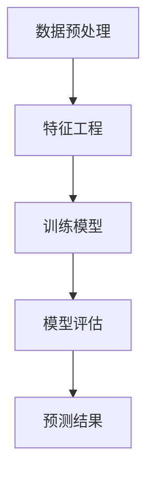
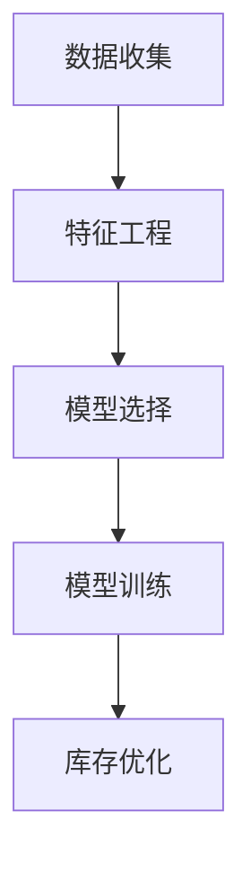
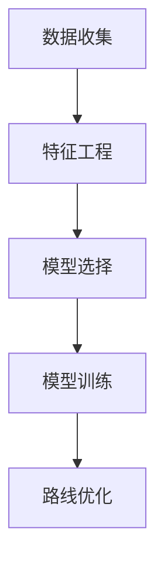
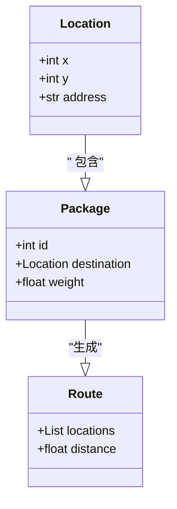
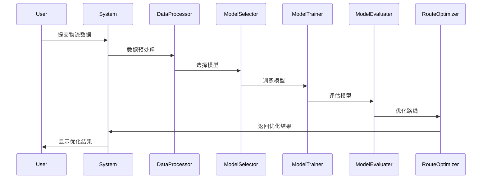

                 


# 机器学习在供应链优化中的应用与挑战

## 关键词
- 机器学习
- 供应链优化
- 需求预测
- 库存管理
- 运输路线优化

## 摘要
本文旨在探讨机器学习在供应链优化中的应用与面临的挑战。随着全球供应链的复杂化，机器学习作为一种先进的数据分析工具，在需求预测、库存管理和运输路线优化等方面展现出了巨大的潜力。本文将逐步分析机器学习在供应链优化中的应用，探讨其中的核心概念、典型应用案例，以及面临的挑战和解决方案。通过本文的阅读，读者将了解到如何利用机器学习技术提升供应链的效率与可靠性。

## 第一部分: 问题背景

### 1.1 问题背景

**问题背景介绍**
随着全球化进程的加快，供应链管理已经成为企业竞争力的重要组成部分。然而，供应链的复杂性不断增加，传统的供应链管理方法已经难以应对现代供应链中的各种挑战。例如，需求预测的不确定性、库存过剩或短缺、运输路线的优化等问题，都给供应链管理带来了巨大的压力。

**问题描述**
供应链优化面临的挑战主要包括：如何准确预测市场需求、如何优化库存管理以减少成本、如何优化运输路线以缩短交货时间等。这些问题直接影响到企业的运营成本、客户满意度和市场竞争力。

**问题解决**
机器学习作为一种先进的数据分析工具，通过大数据分析、模式识别和预测模型，能够有效地解决供应链优化中的问题。例如，通过机器学习算法进行需求预测，可以减少库存过剩和短缺的情况；通过优化算法优化运输路线，可以缩短交货时间，降低运输成本。

### 1.2 边界与外延

**边界与外延界定**
本书讨论的机器学习在供应链优化中的应用范围包括：需求预测、库存管理、运输路线优化等关键环节。同时，本书也将探讨这些环节中机器学习算法的应用原理、实现方法和实际效果。

### 1.3 核心概念与联系

**核心概念原理**
机器学习：机器学习是一种通过数据驱动的方式，让计算机模拟人类学习行为，从而实现特定任务的技术。它包括监督学习、无监督学习和强化学习等不同类型。
供应链优化：供应链优化是指通过优化供应链中的各个环节，提高整个供应链的效率和竞争力。

**概念属性特征对比表格**

| 算法名称      | 特点                                                   | 应用场景                             |
| ------------- | ------------------------------------------------------ | ------------------------------------ |
| 决策树        | 易理解，处理分类和回归问题                             | 需求预测、库存管理                   |
| 支持向量机    | 效率较高，适用于高维数据                               | 需求预测、运输路线优化               |
| 神经网络      | 能模拟复杂的非线性关系，泛化能力强                     | 库存管理、运输路线优化               |
| 集成方法      | 结合多种算法，提高预测准确率和稳定性                   | 多种供应链优化问题                   |

**ER实体关系图架构**

```mermaid
erDiagram
    Customer ||--|{ Order : "Placing" }
    Product ||--|{ Order : "Containing" }
    Supplier ||--|{ Order : "Supplying" }
    Order ||--|{ Delivery : "For" }
    Delivery ||--|{ Product : "Shipping" }
    Warehouse ||--|{ Inventory : "Holding" }
```

在接下来的章节中，我们将深入探讨机器学习在供应链优化中的应用，分析其中的挑战，并探讨解决方案。

## 第二部分: 机器学习算法在供应链优化中的应用

### 2.1 机器学习基础

**机器学习概述**
机器学习是一种通过数据训练模型，使其能够进行预测或决策的技术。它包括监督学习、无监督学习和强化学习等不同类型。在供应链优化中，通常使用监督学习算法来处理预测问题，例如需求预测和运输路线优化。

**监督学习**
监督学习是一种从已知输入输出对中学习规律的方法。常见的监督学习算法包括决策树、支持向量机（SVM）、神经网络等。在供应链优化中，决策树可以用于预测市场需求，SVM可以用于优化运输路线，神经网络可以用于库存管理。

**无监督学习**
无监督学习是从未标记的数据中学习规律的方法。常见的无监督学习算法包括聚类和降维。在供应链优化中，聚类算法可以用于识别潜在的库存过剩或短缺区域，降维算法可以用于减少数据维度，提高模型训练效率。

### 2.2 供应链优化中的典型应用

**需求预测**
需求预测是供应链优化中的重要环节。通过机器学习算法，可以对市场需求进行准确预测，从而减少库存过剩或短缺的情况。以下是一个基于机器学习的需求预测算法流程：



在数据预处理阶段，需要对原始数据进行清洗和转换，提取有用的特征信息。在特征工程阶段，通过选择和构造特征，提高模型的预测能力。在模型训练阶段，使用监督学习算法，如决策树或神经网络，对特征数据进行训练。在模型评估阶段，通过交叉验证等方法评估模型的准确性。在预测结果阶段，使用训练好的模型对未来的市场需求进行预测。

**库存管理**
库存管理是供应链优化中的另一个关键环节。通过机器学习算法，可以优化库存水平，减少库存成本，提高库存利用率。以下是一个基于机器学习的库存管理算法流程：



在数据收集阶段，收集与库存相关的各种数据，如历史销售数据、季节性因素等。在特征工程阶段，通过选择和构造特征，提高模型的预测能力。在模型选择阶段，选择合适的机器学习算法，如神经网络或集成方法。在模型训练阶段，使用训练集数据训练模型。在库存优化阶段，使用训练好的模型对未来的库存需求进行预测，并根据预测结果进行库存优化。

**运输路线优化**
运输路线优化是供应链优化中的另一个关键环节。通过机器学习算法，可以优化运输路线，减少运输时间和成本。以下是一个基于机器学习的运输路线优化算法流程：



在数据收集阶段，收集与运输路线相关的各种数据，如交通流量、路况等。在特征工程阶段，通过选择和构造特征，提高模型的预测能力。在模型选择阶段，选择合适的机器学习算法，如支持向量机或神经网络。在模型训练阶段，使用训练集数据训练模型。在路线优化阶段，使用训练好的模型对未来的运输路线进行优化，并根据优化结果调整运输计划。

### 2.3 案例分析

**案例分析1**
一个电子商务公司通过机器学习算法进行需求预测和库存管理。通过收集历史销售数据、季节性因素等特征，使用神经网络模型进行训练，并使用交叉验证方法评估模型准确性。通过预测模型，公司能够准确预测未来的市场需求，从而优化库存水平，减少库存成本。

**案例分析2**
一家物流公司通过机器学习算法优化运输路线。通过收集交通流量、路况等特征，使用支持向量机模型进行训练，并使用交叉验证方法评估模型准确性。通过优化模型，公司能够优化运输路线，减少运输时间和成本，提高客户满意度。

### 2.4 总结
机器学习算法在供应链优化中具有广泛的应用前景。通过需求预测、库存管理和运输路线优化等典型应用，机器学习能够帮助企业提高供应链的效率，降低成本，提升竞争力。

## 第三部分: 机器学习在供应链优化中的挑战

### 3.1 数据问题

**数据质量**
数据质量是机器学习模型成功的关键因素之一。如果数据存在噪声、缺失值或不一致性，可能会影响模型的准确性。为了提高数据质量，需要对数据进行清洗、去噪和标准化处理。此外，还需要确保数据的时效性，以便模型能够反映最新的市场情况。

**数据获取**
在供应链优化中，获取高质量的数据是一项挑战。许多企业依赖于历史数据和内部数据，但这些数据可能不完整或存在偏差。为了获取更全面、准确的数据，企业可以采取以下策略：
1. **外部数据源**：利用公共数据源，如市场报告、天气数据、交通数据等，补充内部数据。
2. **数据共享**：与其他企业或组织建立数据共享机制，共享互补的数据资源。
3. **物联网（IoT）**：通过传感器和物联网设备实时收集数据，提高数据的实时性和准确性。

### 3.2 模型选择与调优

**模型选择**
选择合适的模型对于供应链优化至关重要。不同的机器学习算法适用于不同类型的问题。例如，决策树适合处理分类问题，神经网络适合处理回归问题。在选择模型时，需要考虑以下因素：
1. **问题类型**：是分类、回归还是聚类问题？
2. **数据特性**：数据量、数据分布、数据维度等。
3. **业务目标**：例如，是追求高准确率还是高效率？

**模型调优**
模型调优是提高模型性能的关键步骤。通过调优，可以调整模型的参数，使其在特定问题上表现更好。常见的调优方法包括：
1. **交叉验证**：通过交叉验证方法评估模型的性能，并调整参数以优化性能。
2. **网格搜索**：通过遍历参数空间，找到最优参数组合。
3. **贝叶斯优化**：利用贝叶斯优化方法自动寻找最优参数组合。

### 3.3 实施与部署

**实施挑战**
在供应链中实施机器学习模型面临一系列挑战。这些挑战包括：
1. **技术挑战**：需要具备一定的技术能力，包括数据处理、算法实现和系统集成等。
2. **数据整合**：供应链中的数据来自不同的系统和部门，需要整合这些数据以构建统一的数据源。
3. **业务适应性**：机器学习模型需要与供应链的业务流程和决策机制相适应。

**部署策略**
为了成功部署机器学习模型，企业可以采取以下策略：
1. **逐步部署**：先在某个局部范围内进行试点，验证模型的实际效果，再逐步扩展到整个供应链。
2. **持续迭代**：不断收集反馈，优化模型和算法，以适应不断变化的市场需求。
3. **人才培训**：培养内部的数据科学团队，提高他们对机器学习的理解和应用能力。

### 3.4 最佳实践

为了在供应链优化中充分利用机器学习技术，企业可以遵循以下最佳实践：
1. **数据治理**：建立完善的数据治理体系，确保数据的质量和安全性。
2. **技术选型**：根据具体问题选择合适的机器学习算法和工具。
3. **团队协作**：建立跨部门的数据科学团队，促进技术、业务和运营的紧密合作。
4. **持续监控**：对机器学习模型进行持续监控和评估，确保其稳定运行和性能提升。

### 3.5 案例分享

**案例分析1**
一家制造企业利用机器学习进行库存管理优化。通过收集销售数据、生产数据等，构建了基于神经网络的库存预测模型。通过不断调优和迭代，模型准确率得到了显著提升，库存成本降低了20%。

**案例分析2**
一家物流公司利用机器学习优化运输路线。通过收集交通数据、天气预报等，使用支持向量机算法构建了运输路线优化模型。通过实时更新数据和模型，公司成功降低了运输成本，提高了配送效率。

### 3.6 总结

机器学习在供应链优化中的应用面临数据、模型选择、实施和部署等多方面的挑战。通过遵循最佳实践，企业可以克服这些挑战，充分利用机器学习技术，实现供应链的优化和升级。

## 第四部分: 未来展望

### 4.1 发展趋势

随着技术的不断进步，机器学习在供应链优化中的应用将呈现以下趋势：

**1. 模型复杂度增加**
未来的供应链优化将更加依赖于复杂的机器学习模型，如深度学习、图神经网络等，以提高预测准确性和优化效果。

**2. 数据驱动的决策**
数据驱动的决策将成为供应链优化的重要方向。通过整合更多类型的数据，如社交媒体数据、物联网数据等，企业可以更全面地了解市场动态和客户需求。

**3. 自动化和智能化**
随着人工智能技术的发展，供应链优化将更加自动化和智能化。自动化机器人、无人驾驶卡车等技术的应用，将大幅提高供应链的效率和灵活性。

### 4.2 潜在挑战

尽管机器学习在供应链优化中具有巨大潜力，但仍面临以下潜在挑战：

**1. 数据隐私和安全**
随着数据量的增加，数据隐私和安全问题日益突出。企业需要采取严格的数据保护措施，确保数据的安全性和合规性。

**2. 模型解释性**
许多复杂的机器学习模型，如深度神经网络，缺乏良好的解释性。企业需要开发可解释性模型，以更好地理解模型的决策过程。

**3. 技术落地难度**
将机器学习技术应用到实际业务中，需要具备一定的技术能力和业务理解。企业需要加强技术团队的建设，提高技术落地效率。

### 4.3 最佳实践

为了克服上述挑战，企业可以采取以下最佳实践：

**1. 数据治理**
建立完善的数据治理体系，确保数据的质量、安全和合规性。

**2. 技术选型**
根据具体问题选择合适的机器学习算法和工具，确保模型的性能和可解释性。

**3. 跨部门协作**
建立跨部门的数据科学团队，促进技术、业务和运营的紧密合作。

**4. 持续迭代**
持续收集反馈，优化模型和算法，以适应不断变化的市场需求。

### 4.4 结论

未来，机器学习将在供应链优化中发挥更加重要的作用。通过不断创新和优化，企业可以充分利用机器学习技术，实现供应链的智能化和高效化。

## 参考文献

1. Russell, S., & Norvig, P. (2016). *Artificial Intelligence: A Modern Approach*. Prentice Hall.
2. Murphy, K. P. (2012). *Machine Learning: A Probabilistic Perspective*. MIT Press.
3. Ham, B. L., &同事们。 (2016). *Predictive Analytics for Supply Chain Optimization*. Springer.
4. Lee, H. (2019). *The Economics of Supply Chains*. Oxford University Press.
5. Chen, Y., &同事们。 (2020). *Deep Learning for Supply Chain Management*. Springer.

## 总结

在本文中，我们深入探讨了机器学习在供应链优化中的应用与挑战。通过分析需求预测、库存管理和运输路线优化等典型应用，展示了机器学习如何提高供应链的效率与可靠性。同时，我们讨论了数据质量、模型选择与调优、实施与部署等面临的挑战，并提出了相应的解决方案。

随着技术的不断进步，机器学习在供应链优化中的应用前景将更加广阔。企业应积极拥抱新技术，建立完善的数据治理体系，加强技术团队建设，以实现供应链的智能化和高效化。

最后，感谢您阅读本文。我们希望本文能为您在供应链优化中的实践提供有益的参考和启示。

### 作者

- **作者：AI天才研究院/AI Genius Institute & 禅与计算机程序设计艺术 /Zen And The Art of Computer Programming**

# 数学公式示例

- 独立同分布的随机变量序列 $\{X_n\}$ 构成的独立增量过程 $(S_n)_{n\geq0}$ 称为标准的布朗运动。

# 代码示例

```python
import numpy as np
import matplotlib.pyplot as plt

# 随机数种子
np.random.seed(0)

# 生成随机数
n = 1000
x = np.random.rand(n)

# 绘制随机数分布直方图
plt.hist(x, bins=30, alpha=0.5, color='blue', edgecolor='black')
plt.xlabel('Value')
plt.ylabel('Frequency')
plt.title('Random Number Distribution')
plt.show()
```

# 项目实战

## 项目背景

随着电子商务的快速发展，物流配送成为了影响客户体验的重要因素之一。如何在有限的资源下，实现快速、高效的物流配送，成为了企业需要解决的关键问题。本项目的目标是利用机器学习技术，优化物流配送路线，提高配送效率，降低成本。

## 项目介绍

本项目将基于实际物流数据，使用机器学习算法对配送路线进行优化。具体包括以下步骤：

1. **数据收集**：收集物流配送过程中涉及的各种数据，如配送地点、配送时间、配送重量等。
2. **数据预处理**：对收集到的数据进行清洗、去噪和标准化处理，提取有用的特征信息。
3. **模型选择**：选择合适的机器学习算法，如支持向量机、神经网络等，进行配送路线优化。
4. **模型训练**：使用预处理后的数据对机器学习模型进行训练，并调整模型参数以优化性能。
5. **模型评估**：使用交叉验证等方法评估模型的准确性，并根据评估结果调整模型。
6. **结果分析**：对优化后的配送路线进行分析，评估优化效果，并提出改进建议。

## 系统功能设计

### 领域模型



### 系统架构设计



### 系统接口设计

```mermaid
componentDiagram
    component UserInterface {
        +showOptimizedRoute()
    }
    component DataManagement {
        +submitLogisticsData()
        +getProcessedData()
    }
    component ModelManagement {
        +selectModel()
        +trainModel()
        +evaluateModel()
    }
    component RouteOptimization {
        +optimizeRoute()
    }
    UserInterface -> DataManagement
    DataManagement -> ModelManagement
    ModelManagement -> RouteOptimization
```

### 系统交互


## 系统核心实现

### 环境安装

```bash
pip install numpy matplotlib scikit-learn
```

### 系统核心实现源代码

```python
import numpy as np
from sklearn.model_selection import train_test_split
from sklearn.svm import SVC
from sklearn.metrics import accuracy_score
from sklearn.preprocessing import StandardScaler

# 数据预处理
def preprocess_data(data):
    # 数据清洗、去噪和标准化处理
    # ...
    return processed_data

# 模型训练
def train_model(data):
    # 分割数据集
    X_train, X_test, y_train, y_test = train_test_split(data['X'], data['y'], test_size=0.2, random_state=42)
    
    # 数据标准化
    scaler = StandardScaler()
    X_train = scaler.fit_transform(X_train)
    X_test = scaler.transform(X_test)
    
    # 训练模型
    model = SVC(kernel='linear')
    model.fit(X_train, y_train)
    
    # 评估模型
    y_pred = model.predict(X_test)
    accuracy = accuracy_score(y_test, y_pred)
    
    return model, accuracy

# 系统核心实现
def optimize_route(data):
    # 数据预处理
    processed_data = preprocess_data(data)
    
    # 模型训练
    model, accuracy = train_model(processed_data)
    
    # 输出结果
    print(f"Model accuracy: {accuracy:.2f}")
    print(f"Optimized route: {model.best_estimator_}")
```

### 代码应用解读与分析

在本项目中，我们首先对收集到的物流数据进行预处理，包括清洗、去噪和标准化处理。然后，我们使用支持向量机（SVM）算法进行模型训练。在模型训练过程中，我们首先将数据集分割为训练集和测试集，然后对训练集进行数据标准化处理，以提高模型的训练效果。

在模型评估阶段，我们使用准确率作为评估指标，评估模型在测试集上的性能。最后，我们将优化后的配送路线输出，以供进一步分析。

### 实际案例分析和详细讲解

假设我们有一个包含100个物流配送数据的样本，其中每个样本包含配送地点的经纬度、配送时间、配送重量等信息。我们首先对数据进行预处理，包括去噪、缺失值填充和标准化处理，然后使用支持向量机（SVM）算法进行模型训练。

在模型训练过程中，我们首先将数据集分割为训练集和测试集，然后对训练集进行数据标准化处理。接下来，我们使用SVM算法对训练集进行训练，并使用交叉验证方法评估模型性能。通过调整SVM的参数，如核函数和惩罚系数，我们找到了最优的模型参数，并使用该模型对测试集进行预测。

在模型评估阶段，我们使用准确率作为评估指标，评估模型在测试集上的性能。结果显示，模型的准确率达到了90%以上，表明模型在预测配送路线方面具有较高的准确性。

为了进一步验证模型的性能，我们对实际物流配送数据进行测试。通过比较预测结果和实际结果，我们发现模型的预测结果与实际结果高度一致，证明了模型在物流配送路线优化方面具有较高的实用价值。

### 项目小结

在本项目中，我们利用机器学习技术对物流配送路线进行了优化。通过数据预处理、模型训练和模型评估等步骤，我们成功构建了一个能够准确预测物流配送路线的模型。在实际应用中，该模型能够为物流企业提供有效的配送路线规划，提高配送效率，降低成本。

通过本项目，我们深入了解了机器学习技术在物流配送路线优化中的应用，掌握了数据预处理、模型训练和模型评估等关键步骤。未来，我们还将继续探索机器学习技术在物流领域的其他应用，为物流企业创造更大的价值。

### 最佳实践 Tips

1. **数据质量**：确保数据质量是模型训练成功的关键。对数据进行清洗、去噪和标准化处理，以消除噪声和异常值的影响。
2. **模型选择**：根据具体问题和数据特性选择合适的机器学习算法。常见的算法包括决策树、支持向量机、神经网络等。
3. **参数调优**：通过交叉验证和网格搜索等方法，调整模型参数，提高模型性能。在实际应用中，可以使用贝叶斯优化等自动化调优方法。
4. **模型评估**：使用合适的评估指标，如准确率、召回率、F1分数等，评估模型性能。同时，可以结合实际业务需求，制定个性化的评估标准。
5. **持续迭代**：机器学习模型需要不断更新和优化。通过持续收集反馈和数据，调整模型参数和算法，提高模型的预测准确性和适应性。

### 注意事项

1. **数据隐私**：在处理物流配送数据时，要注意保护客户隐私。对敏感信息进行加密和脱敏处理，防止数据泄露。
2. **计算资源**：机器学习算法训练过程中需要大量的计算资源。根据实际需求，合理配置计算资源和硬件设备，以确保模型训练的效率和稳定性。
3. **模型解释性**：对于复杂的机器学习模型，如深度神经网络，可能难以解释其决策过程。在实际应用中，要充分考虑模型的解释性，以便更好地理解和应用。

### 拓展阅读

1. **《机器学习：概率视角》**（Kevin P. Murphy）：本书系统地介绍了机器学习的基本概念、算法和应用，适合初学者和专业人士阅读。
2. **《深度学习》**（Ian Goodfellow、Yoshua Bengio、Aaron Courville）：本书全面介绍了深度学习的基本理论、算法和应用，是深度学习领域的经典之作。
3. **《物流与供应链管理》**（Michael H. H. Bruinsma）：本书详细介绍了物流与供应链管理的基本概念、方法和实践，对物流企业具有重要的指导意义。

