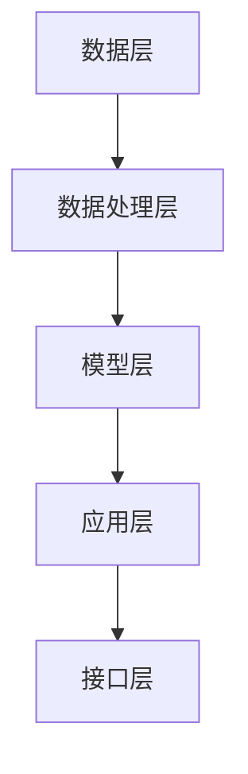

                 


### 摘要

机器学习在预测性医疗领域正迅速崛起，展现出巨大的潜力和变革性影响。本文旨在探讨机器学习在预测性医疗中的潜在应用，以及面临的挑战。我们将首先概述机器学习和预测性医疗的基本概念，然后深入分析常见的机器学习算法及其在预测性医疗中的应用。接着，我们将介绍数学模型和公式，以便读者更好地理解算法原理。此外，我们将详细讨论系统分析与架构设计，并提供一个实际项目实战的案例。最后，我们将总结最佳实践，并推荐拓展阅读，以引导读者进一步探索这一领域。通过这篇文章，我们希望能够揭示机器学习在预测性医疗中的无限可能，并帮助读者应对相关挑战。

### 第一部分：问题背景与核心概念

#### 第1章：机器学习与预测性医疗概述

##### 1.1 机器学习的发展历程

机器学习（Machine Learning，ML）起源于20世纪50年代，由Arthur Samuel在其研究工作中首次提出。这一概念指的是通过算法和统计模型，从数据中自动学习和改进性能。随着计算能力的提升和大数据技术的发展，机器学习经历了几个重要阶段：

- **初期探索（1950-1960年代）**：这一时期以符号主义和逻辑推理为主要方法，但受限于计算能力和数据量。
- **人工神经网络复兴（1980年代）**：反向传播算法的提出使得神经网络重新受到关注，但硬件限制限制了其发展。
- **大数据与算法优化（2000年代至今）**：随着计算能力的提升和大数据技术的发展，机器学习迎来了爆发期。深度学习、强化学习等新兴技术成为研究热点，并在图像识别、自然语言处理等领域取得了显著成果。

##### 1.2 预测性医疗的定义与重要性

预测性医疗（Predictive Medicine）是一种利用现代信息技术和数据分析方法，对患者的健康状况进行预测和预防的医疗模式。它旨在通过分析大量医疗数据，识别高风险群体，提前采取干预措施，从而降低疾病发病率和死亡率。预测性医疗的重要性体现在以下几个方面：

- **个性化医疗**：通过预测患者未来的健康状态，医生可以为不同患者制定个性化的治疗方案，提高治疗效果。
- **疾病预防**：早期识别高风险群体，采取预防措施，降低疾病发病率和传播速度。
- **资源优化**：通过预测医疗需求，合理分配医疗资源，提高医疗服务的效率。

##### 1.3 预测性医疗面临的挑战

尽管预测性医疗具有巨大潜力，但其在实际应用中仍面临诸多挑战：

- **数据隐私和安全**：医疗数据敏感，如何在确保隐私和安全的前提下进行数据分析和共享是一个重要问题。
- **数据质量和多样性**：预测模型的准确性高度依赖于数据的质量和多样性，如何获取和处理高质量、多样化的数据是一个挑战。
- **算法公平性和解释性**：算法的公平性和解释性是公众关注的热点，如何确保算法的公平性和可解释性是亟待解决的问题。
- **技术成熟度**：一些新兴的机器学习技术尚未在医疗领域得到广泛应用，如何将这些技术成熟地应用到预测性医疗中是一个挑战。

##### 1.4 本书结构安排

本书将分为三个主要部分：

1. **问题背景与核心概念**：介绍机器学习和预测性医疗的基本概念、发展历程和面临的挑战。
2. **算法原理讲解**：详细讲解常见的机器学习算法，包括监督学习和无监督学习，以及相关的数学模型和公式。
3. **系统分析与架构设计**：探讨预测性医疗系统的设计与实现，包括问题场景介绍、系统功能设计、系统架构设计、系统接口设计和系统交互。

通过本书的阅读，读者将能够深入理解机器学习在预测性医疗中的潜力与挑战，并为实际应用提供有益的参考。

### 第二部分：核心概念与联系

#### 第2章：核心概念与联系

##### 2.1 机器学习的基础概念

机器学习是人工智能（Artificial Intelligence，AI）的一个重要分支，它通过算法和统计模型，从数据中自动学习和改进性能。以下是机器学习中的一些基础概念：

- **数据集（Dataset）**：数据集是机器学习模型的输入，它通常由一系列特征和标签组成。特征是描述数据的变量，标签是用于模型训练的预定义输出。
- **特征（Feature）**：特征是描述数据的具体属性或变量。例如，在医疗数据集中，患者的年龄、体重、血压等都可能作为特征。
- **模型（Model）**：模型是机器学习算法的核心，它通过学习数据集的特征和标签之间的关系，生成预测结果。常见的模型有线性回归模型、决策树模型、神经网络模型等。
- **训练（Training）**：训练是机器学习模型学习数据集的过程。在训练过程中，模型通过不断调整参数，优化性能，以便更好地预测未知数据。
- **测试（Testing）**：测试是验证模型性能的过程。通过将模型应用于未见过的数据，可以评估模型的泛化能力。

##### 2.2 预测性医疗中的核心概念

预测性医疗是利用机器学习技术对患者的健康状况进行预测和预防的一种医疗模式。以下是预测性医疗中的一些核心概念：

- **预测模型（Predictive Model）**：预测模型是用于预测患者未来健康状态或疾病发生的模型。常见的预测模型有风险评分模型、疾病预测模型等。
- **风险评分（Risk Scoring）**：风险评分是预测模型的一种输出，用于评估患者发生某种疾病的风险程度。风险评分通常是一个数值，越高表示风险越高。
- **特征选择（Feature Selection）**：特征选择是选择对预测任务最重要的特征的过程。通过特征选择，可以减少模型的复杂度和计算量，提高预测准确性。
- **数据预处理（Data Preprocessing）**：数据预处理是机器学习过程中对数据进行清洗、转换和标准化等操作的过程。数据预处理对于提高模型性能至关重要。

##### 2.3 概念属性特征对比表格

为了更好地理解机器学习和预测性医疗中的核心概念，我们可以通过一个对比表格来展示它们的属性特征：

| 概念 | 属性特征 |
| --- | --- |
| 数据集 | 特征、标签、数量、质量 |
| 特征 | 描述数据的变量、类型、值 |
| 模型 | 学习特征和标签关系的算法、参数、性能 |
| 训练 | 调整模型参数、优化性能 |
| 测试 | 评估模型性能、泛化能力 |
| 预测模型 | 预测患者未来健康状态、疾病发生的模型 |
| 风险评分 | 评估患者疾病风险程度的数值 |
| 特征选择 | 选择最重要的特征、减少复杂度 |
| 数据预处理 | 清洗、转换、标准化等操作 |

##### 2.4 ER实体关系图架构

为了更好地理解机器学习和预测性医疗中的核心概念，我们可以通过ER（Entity-Relationship）实体关系图来展示它们之间的关系。以下是一个简化的ER图示例：

```mermaid
erDiagram
  Patient ||--|{ Diagnosis : has }
  Diagnosis ||--|{ Risk_Score : has }
  Feature ||--|{ Patient : has }
  Model ||--|{ Diagnosis : trained_on }
```

在这个ER图中，Patient（患者）实体与Diagnosis（诊断）实体之间有一个“has”关系，表示患者可以有多个诊断结果。Diagnosis实体与Risk_Score（风险评分）实体之间也有一个“has”关系，表示每个诊断结果都有相应的风险评分。Feature（特征）实体与Patient实体之间有一个“has”关系，表示患者有多个特征。Model（模型）实体与Diagnosis实体之间有一个“trained_on”关系，表示模型是在诊断数据上训练得到的。

通过这个ER图，我们可以更清晰地理解机器学习和预测性医疗中的核心概念及其之间的关系。

### 第二部分：算法原理讲解

#### 第3章：常见机器学习算法及其在预测性医疗中的应用

##### 3.1 监督学习算法

监督学习（Supervised Learning）是一种机器学习方法，它通过已有标注数据（即特征和标签都已知的样本）来训练模型，从而使模型能够对新数据进行预测。监督学习算法在预测性医疗中有着广泛的应用，以下介绍几种常见的监督学习算法及其在预测性医疗中的应用。

###### 3.1.1 线性回归

线性回归（Linear Regression）是一种简单且常用的监督学习算法，它假设特征和标签之间存在线性关系。线性回归模型的基本形式为：

$$
Y = \beta_0 + \beta_1X_1 + \beta_2X_2 + ... + \beta_nX_n + \epsilon
$$

其中，$Y$ 是标签，$X_1, X_2, ..., X_n$ 是特征，$\beta_0, \beta_1, \beta_2, ..., \beta_n$ 是模型参数，$\epsilon$ 是误差项。

在线性回归模型中，我们通常使用最小二乘法来估计模型参数。具体步骤如下：

1. **数据预处理**：将输入特征和标签数据进行标准化处理，使其具有相似的尺度和范围。
2. **计算损失函数**：损失函数通常使用均方误差（MSE）来衡量预测值和真实值之间的差距。
3. **梯度下降**：通过梯度下降算法不断调整模型参数，以最小化损失函数。

线性回归算法在预测性医疗中可以用于预测患者的某些健康指标，如预测患者未来的血糖水平、血压等。

###### 3.1.2 决策树

决策树（Decision Tree）是一种基于树形结构进行决策的算法。每个内部节点代表一个特征，每个分支代表特征的不同取值，每个叶节点代表一个预测结果。决策树的生成过程如下：

1. **特征选择**：选择一个特征作为当前节点的分割特征，通常使用信息增益（Information Gain）或基尼不纯度（Gini Impurity）来评估特征的重要性。
2. **数据划分**：根据分割特征的不同取值，将数据划分为不同的子集。
3. **递归构建**：对每个子集递归地执行上述过程，直到达到某个终止条件（如最大深度、最小样本数等）。

决策树在预测性医疗中可以用于诊断疾病、预测疾病进展等。例如，使用决策树模型来预测患者是否患有某种特定疾病。

###### 3.1.3 随机森林

随机森林（Random Forest）是一种基于决策树的集成学习方法。它通过构建多个决策树，并取它们的多数投票结果作为最终预测结果。随机森林的关键步骤如下：

1. **特征选择**：从原始特征集合中随机选择一个子集。
2. **构建决策树**：使用特征子集和训练数据构建一个决策树。
3. **重复步骤**：重复步骤1和2多次，构建多个决策树。
4. **多数投票**：对每个样本进行预测，取多个决策树的多数投票结果作为最终预测结果。

随机森林在预测性医疗中可以用于处理大规模医疗数据，提高预测准确性。例如，使用随机森林模型来预测患者的疾病风险。

###### 3.1.4 支持向量机

支持向量机（Support Vector Machine，SVM）是一种基于最大间隔原则的分类算法。它通过找到一个最佳的超平面，将不同类别的样本分隔开来。SVM的关键步骤如下：

1. **特征选择**：选择一个合适的核函数（如线性核、多项式核、径向基核等），将原始特征映射到高维空间。
2. **构建最优超平面**：在特征映射空间中找到一个最优超平面，使得不同类别的样本之间的间隔最大。
3. **分类决策**：对于新样本，将其映射到特征空间，计算其与各个超平面的距离，根据距离判断其所属类别。

SVM在预测性医疗中可以用于疾病分类和风险预测。例如，使用SVM模型来分类患者的疾病类型，或预测患者发生某种疾病的概率。

##### 3.2 无监督学习算法

无监督学习（Unsupervised Learning）是一种不依赖标注数据的机器学习方法。它通过分析数据中的内在结构或模式，对数据进行聚类、降维等操作。以下介绍几种常见的无监督学习算法及其在预测性医疗中的应用。

###### 3.2.1 K-均值聚类

K-均值聚类（K-Means Clustering）是一种基于距离度量的聚类算法。它通过以下步骤进行聚类：

1. **初始化聚类中心**：随机选择K个数据点作为初始聚类中心。
2. **分配样本**：计算每个样本与聚类中心的距离，将其分配到最近的聚类中心。
3. **更新聚类中心**：计算每个聚类的新中心，即聚类内所有样本的平均值。
4. **重复步骤**：重复步骤2和3，直到聚类中心不再发生变化。

K-均值聚类在预测性医疗中可以用于患者群体的划分和疾病风险预测。例如，通过K-均值聚类将患者划分为不同的风险群体，以便进行针对性的干预。

###### 3.2.2 主成分分析

主成分分析（Principal Component Analysis，PCA）是一种降维算法，它通过线性变换将原始数据投影到新的坐标系中，使得新的坐标系中的特征具有更好的可解释性。PCA的关键步骤如下：

1. **计算协方差矩阵**：计算原始数据集的协方差矩阵。
2. **计算特征值和特征向量**：对协方差矩阵进行特征分解，得到特征值和特征向量。
3. **选择主要成分**：根据特征值的大小选择前几个主要成分，将这些主要成分作为新坐标系。
4. **数据投影**：将原始数据投影到新的坐标系中。

PCA在预测性医疗中可以用于数据降维和特征提取。例如，通过PCA减少医疗数据的维度，以便进行更高效的机器学习模型训练。

###### 3.2.3 聚类与降维算法在预测性医疗中的应用

聚类和降维算法在预测性医疗中有着广泛的应用。聚类算法可以用于患者群体的划分，帮助医生了解不同患者的特征和疾病风险。降维算法可以用于减少医疗数据的维度，提高模型训练效率，同时保持数据的重要信息。

在实际应用中，聚类和降维算法可以结合使用。例如，首先使用K-均值聚类将患者划分为不同的风险群体，然后对每个群体使用PCA进行降维，以便构建更准确的预测模型。

通过本章的介绍，我们了解了常见机器学习算法在预测性医疗中的应用。这些算法通过分析医疗数据，可以帮助医生更好地预测患者的健康状况，提高医疗服务的质量和效率。

### 第二部分：算法原理讲解

#### 第4章：数学模型与公式

在本章中，我们将详细讲解几种常见机器学习算法的数学模型与公式，以便读者更好地理解算法原理。

##### 4.1 线性回归的数学模型与公式

线性回归是一种基于线性关系的监督学习算法，其基本模型可以表示为：

$$
Y = \beta_0 + \beta_1X_1 + \beta_2X_2 + ... + \beta_nX_n + \epsilon
$$

其中，$Y$ 是因变量，$X_1, X_2, ..., X_n$ 是自变量，$\beta_0, \beta_1, \beta_2, ..., \beta_n$ 是模型参数，$\epsilon$ 是误差项。

线性回归的目的是通过最小化损失函数来估计模型参数。常见的损失函数是均方误差（MSE），其公式为：

$$
MSE = \frac{1}{m} \sum_{i=1}^{m} (Y_i - \hat{Y}_i)^2
$$

其中，$m$ 是样本数量，$Y_i$ 是第 $i$ 个样本的真实值，$\hat{Y}_i$ 是模型对第 $i$ 个样本的预测值。

为了最小化MSE，我们可以使用梯度下降算法来迭代更新模型参数。梯度下降的更新公式为：

$$
\beta_j = \beta_j - \alpha \frac{\partial}{\partial \beta_j}MSE
$$

其中，$\alpha$ 是学习率，$\beta_j$ 是第 $j$ 个模型参数的当前值。

##### 4.2 决策树的数学模型与公式

决策树是一种基于树形结构的分类算法，其基本模型可以表示为：

$$
T = \{ \text{根节点}, \text{内部节点}, \text{叶节点} \}
$$

决策树通过递归地将数据划分为不同的子集，直到达到某个终止条件（如最大深度、最小样本数等）。每个内部节点表示一个特征，每个分支表示特征的不同取值，每个叶节点表示一个预测结果。

决策树的生成过程通常使用信息增益（Information Gain）或基尼不纯度（Gini Impurity）来评估特征的重要性。信息增益的公式为：

$$
IG(D, A) = H(D) - \sum_{v \in A} \frac{|D_v|}{|D|} H(D_v)
$$

其中，$D$ 是当前数据集，$A$ 是候选特征集，$v$ 是特征 $A$ 的取值，$D_v$ 是根据特征 $A$ 的取值划分的数据子集，$H(D)$ 是数据集 $D$ 的熵。

基尼不纯度的公式为：

$$
GI(D, A) = 1 - \sum_{v \in A} \frac{|D_v|}{|D|} p_v (1 - p_v)
$$

其中，$p_v$ 是特征 $A$ 的取值为 $v$ 的样本在数据集 $D$ 中的比例。

通过计算信息增益或基尼不纯度，我们可以选择最优特征进行划分，并递归地生成决策树。

##### 4.3 随机森林的数学模型与公式

随机森林（Random Forest）是一种基于决策树的集成学习方法，其基本模型可以表示为：

$$
\hat{y} = \frac{1}{T} \sum_{t=1}^{T} g(y; f_t, x)
$$

其中，$y$ 是预测标签，$x$ 是输入特征，$f_t$ 是第 $t$ 棵决策树，$T$ 是决策树的数量，$g(y; f_t, x)$ 是决策树 $f_t$ 对输入特征 $x$ 的预测值。

随机森林通过随机选择特征子集和样本子集来构建多个决策树，并取它们的多数投票结果作为最终预测结果。随机森林的关键参数包括决策树的数量、特征选择方法、样本选择方法等。

##### 4.4 支持向量机的数学模型与公式

支持向量机（Support Vector Machine，SVM）是一种基于最大间隔原则的分类算法，其基本模型可以表示为：

$$
\hat{y} = \text{sign}(\omega \cdot x + b)
$$

其中，$\omega$ 是权重向量，$x$ 是输入特征，$b$ 是偏置项，$\text{sign}$ 是符号函数，$\hat{y}$ 是预测标签。

SVM的目标是找到一个最佳的超平面，使得不同类别的样本之间的间隔最大。为了实现这一目标，SVM使用拉格朗日乘子法来优化目标函数，其公式为：

$$
L(\omega, b, \alpha) = \frac{1}{2} ||\omega||^2 - \sum_{i=1}^{n} \alpha_i (y_i - (\omega \cdot x_i + b))
$$

其中，$\alpha_i$ 是拉格朗日乘子，$n$ 是样本数量。

通过求解拉格朗日乘子法，我们可以得到最优的权重向量 $\omega$ 和偏置项 $b$，从而实现分类预测。

##### 4.5 K-均值聚类的数学模型与公式

K-均值聚类（K-Means Clustering）是一种基于距离度量的聚类算法，其基本模型可以表示为：

$$
\text{目标函数} = \sum_{i=1}^{k} \sum_{x_j \in S_i} ||x_j - \mu_i||^2
$$

其中，$k$ 是聚类数量，$S_i$ 是第 $i$ 个聚类，$\mu_i$ 是聚类 $S_i$ 的中心。

K-均值聚类通过迭代更新聚类中心和样本分配，以最小化目标函数。每个迭代步骤包括以下内容：

1. **初始化聚类中心**：随机选择 $k$ 个样本作为初始聚类中心。
2. **分配样本**：计算每个样本与聚类中心的距离，将其分配到最近的聚类中心。
3. **更新聚类中心**：计算每个聚类的新中心，即聚类内所有样本的平均值。

通过不断迭代，K-均值聚类可以收敛到一个稳定的聚类结果。

##### 4.6 主成分分析的数学模型与公式

主成分分析（Principal Component Analysis，PCA）是一种降维算法，其基本模型可以表示为：

$$
X' = \Phi X
$$

其中，$X$ 是原始数据矩阵，$X'$ 是变换后的数据矩阵，$\Phi$ 是变换矩阵。

PCA的目的是通过线性变换将原始数据投影到新的坐标系中，使得新的坐标系中的特征具有更好的可解释性。为了实现这一目标，PCA需要计算数据的协方差矩阵，并进行特征分解：

$$
\Phi = \Lambda \Sigma^{-1/2}
$$

其中，$\Lambda$ 是特征值矩阵，$\Sigma$ 是协方差矩阵。

通过选择前几个主要成分（即特征值较大的成分），我们可以将原始数据投影到新的坐标系中，从而实现降维。

通过本章的介绍，我们了解了线性回归、决策树、随机森林、支持向量机、K-均值聚类和主成分分析的数学模型与公式。这些算法在预测性医疗中有着广泛的应用，通过理解和掌握这些数学模型，我们可以更好地设计和优化机器学习模型，以应对预测性医疗中的挑战。

### 第二部分：算法原理讲解

#### 第5章：算法原理讲解与举例说明

在本章中，我们将对前述的几种机器学习算法进行详细讲解，并通过具体例子说明其应用和实现过程。

##### 5.1 线性回归算法原理讲解与举例说明

线性回归是一种用于预测数值型标签的监督学习算法。其基本思想是找到一条直线，尽可能准确地拟合数据点。以下是线性回归的算法原理和举例说明：

###### 算法原理

线性回归模型可以表示为：

$$
Y = \beta_0 + \beta_1X_1 + \beta_2X_2 + ... + \beta_nX_n + \epsilon
$$

其中，$Y$ 是因变量，$X_1, X_2, ..., X_n$ 是自变量，$\beta_0, \beta_1, \beta_2, ..., \beta_n$ 是模型参数，$\epsilon$ 是误差项。

线性回归的目的是通过最小化误差平方和来估计模型参数。误差平方和（SSE）的计算公式为：

$$
SSE = \sum_{i=1}^{n} (Y_i - \hat{Y}_i)^2
$$

其中，$n$ 是样本数量，$Y_i$ 是第 $i$ 个样本的真实值，$\hat{Y}_i$ 是模型对第 $i$ 个样本的预测值。

为了最小化SSE，我们可以使用梯度下降算法来迭代更新模型参数。梯度下降的更新公式为：

$$
\beta_j = \beta_j - \alpha \frac{\partial}{\partial \beta_j}SSE
$$

其中，$\alpha$ 是学习率，$\beta_j$ 是第 $j$ 个模型参数的当前值。

###### 举例说明

假设我们有一个简单的数据集，包含两个特征（$X_1$ 和 $X_2$）和一个标签（$Y$），数据如下：

| $X_1$ | $X_2$ | $Y$ |
| --- | --- | --- |
| 1 | 2 | 3 |
| 2 | 4 | 5 |
| 3 | 6 | 7 |

我们希望使用线性回归模型来预测 $Y$。以下是线性回归的实现步骤：

1. **数据预处理**：对数据进行标准化处理，使其具有相似的尺度和范围。

2. **初始化模型参数**：随机初始化模型参数 $\beta_0, \beta_1, \beta_2$。

3. **计算损失函数**：使用均方误差（MSE）作为损失函数，计算预测值和真实值之间的差距。

4. **梯度下降**：通过梯度下降算法迭代更新模型参数，最小化损失函数。

5. **模型评估**：使用测试集对模型进行评估，计算模型的预测准确率。

以下是使用 Python 实现线性回归的代码示例：

```python
import numpy as np

# 初始化模型参数
beta = np.random.rand(3)

# 设置学习率
alpha = 0.01

# 设置迭代次数
n_iterations = 1000

# 数据预处理
X = np.array([[1, 2], [2, 4], [3, 6]])
Y = np.array([3, 5, 7])
X_mean = np.mean(X, axis=0)
X_std = np.std(X, axis=0)
X_normalized = (X - X_mean) / X_std
Y_mean = np.mean(Y)
Y_std = np.std(Y)
Y_normalized = (Y - Y_mean) / Y_std

# 梯度下降
for _ in range(n_iterations):
    predictions = X_normalized @ beta
    errors = predictions - Y_normalized
    gradients = X_normalized.T @ errors
    beta -= alpha * gradients

# 模型评估
predictions = X_normalized @ beta
mse = np.mean((predictions - Y_normalized)**2)
print("MSE:", mse)

# 模型反标准化
beta *= Y_std
beta[0] += Y_mean
beta /= X_std
beta[0] += X_mean
```

通过上述代码，我们可以训练一个线性回归模型，并使用测试集对其进行评估。实际应用中，我们需要处理更大规模的数据集，并调整学习率和迭代次数，以获得更好的模型性能。

##### 5.2 决策树算法原理讲解与举例说明

决策树是一种基于树形结构进行决策的算法，其基本思想是通过一系列特征和阈值来划分数据，从而实现分类或回归。以下是决策树的算法原理和举例说明：

###### 算法原理

决策树的生成过程包括以下几个步骤：

1. **选择最优特征**：选择一个特征作为分割特征，选择标准可以是信息增益、基尼不纯度等。

2. **计算特征的重要度**：计算每个特征的重要度，选择重要度最高的特征进行分割。

3. **划分数据**：根据最优特征的不同取值，将数据划分为多个子集。

4. **递归构建**：对每个子集递归地执行上述步骤，直到达到某个终止条件（如最大深度、最小样本数等）。

决策树的分类和回归问题可以使用不同的算法。对于分类问题，可以使用分类阈值；对于回归问题，可以使用均值回归。

以下是决策树的分类算法原理：

$$
\hat{y} = \text{分类阈值} \quad \text{如果} \quad f(x) > \text{阈值} \quad \text{否则} \quad \hat{y} = \text{均值回归}
$$

其中，$f(x)$ 是分割特征，$\hat{y}$ 是预测结果。

###### 举例说明

假设我们有一个简单二分类数据集，包含两个特征（$X_1$ 和 $X_2$）和一个标签（$Y$），数据如下：

| $X_1$ | $X_2$ | $Y$ |
| --- | --- | --- |
| 1 | 2 | 0 |
| 2 | 4 | 1 |
| 3 | 6 | 0 |
| 4 | 8 | 1 |

我们希望使用决策树模型来预测 $Y$。以下是决策树实现的步骤：

1. **计算特征的重要度**：计算每个特征的重要度，选择重要度最高的特征进行分割。

2. **构建决策树**：使用信息增益作为选择特征的标准，构建决策树。

3. **模型评估**：使用测试集对模型进行评估，计算模型的准确率。

以下是使用 Python 实现决策树的代码示例：

```python
import numpy as np
from sklearn.tree import DecisionTreeClassifier

# 初始化模型参数
X = np.array([[1, 2], [2, 4], [3, 6], [4, 8]])
Y = np.array([0, 1, 0, 1])

# 训练决策树模型
clf = DecisionTreeClassifier()
clf.fit(X, Y)

# 模型评估
predictions = clf.predict(X)
accuracy = np.mean(predictions == Y)
print("Accuracy:", accuracy)
```

通过上述代码，我们可以训练一个决策树模型，并使用测试集对其进行评估。实际应用中，我们可以调整决策树的参数（如最大深度、最小样本数等），以获得更好的模型性能。

##### 5.3 随机森林算法原理讲解与举例说明

随机森林（Random Forest）是一种基于决策树的集成学习方法，其基本思想是通过构建多个决策树，并取它们的多数投票结果作为最终预测结果。以下是随机森林的算法原理和举例说明：

###### 算法原理

随机森林通过以下步骤构建多个决策树：

1. **随机选取特征子集**：从原始特征集合中随机选择一个子集。

2. **构建决策树**：使用特征子集和训练数据构建一个决策树。

3. **重复步骤**：重复步骤1和2多次，构建多个决策树。

4. **多数投票**：对每个样本进行预测，取多个决策树的多数投票结果作为最终预测结果。

随机森林的关键参数包括决策树的数量、特征选择方法、样本选择方法等。常见的特征选择方法有随机特征选择和最佳特征选择。

以下是随机森林的算法原理：

$$
\hat{y} = \text{多数投票结果} \quad \text{如果} \quad f_t(x) > \text{阈值} \quad \text{否则} \quad \hat{y} = \text{均值回归}
$$

其中，$f_t(x)$ 是第 $t$ 棵决策树对输入特征 $x$ 的预测值。

###### 举例说明

假设我们有一个简单二分类数据集，包含两个特征（$X_1$ 和 $X_2$）和一个标签（$Y$），数据如下：

| $X_1$ | $X_2$ | $Y$ |
| --- | --- | --- |
| 1 | 2 | 0 |
| 2 | 4 | 1 |
| 3 | 6 | 0 |
| 4 | 8 | 1 |

我们希望使用随机森林模型来预测 $Y$。以下是随机森林实现的步骤：

1. **随机选取特征子集**：从原始特征集合中随机选择一个子集。

2. **构建决策树**：使用特征子集和训练数据构建一个决策树。

3. **重复步骤**：重复步骤1和2多次，构建多个决策树。

4. **多数投票**：对每个样本进行预测，取多个决策树的多数投票结果作为最终预测结果。

以下是使用 Python 实现随机森林的代码示例：

```python
import numpy as np
from sklearn.ensemble import RandomForestClassifier

# 初始化模型参数
X = np.array([[1, 2], [2, 4], [3, 6], [4, 8]])
Y = np.array([0, 1, 0, 1])

# 训练随机森林模型
clf = RandomForestClassifier(n_estimators=100)
clf.fit(X, Y)

# 模型评估
predictions = clf.predict(X)
accuracy = np.mean(predictions == Y)
print("Accuracy:", accuracy)
```

通过上述代码，我们可以训练一个随机森林模型，并使用测试集对其进行评估。实际应用中，我们可以调整随机森林的参数（如决策树数量、特征选择方法等），以获得更好的模型性能。

##### 5.4 支持向量机算法原理讲解与举例说明

支持向量机（Support Vector Machine，SVM）是一种基于最大间隔原则的分类算法，其基本思想是找到一个最佳的超平面，将不同类别的样本分隔开来。以下是支持向量机的算法原理和举例说明：

###### 算法原理

支持向量机的算法原理包括以下几个步骤：

1. **特征选择**：选择一个合适的核函数（如线性核、多项式核、径向基核等），将原始特征映射到高维空间。

2. **构建最优超平面**：在特征映射空间中找到一个最优超平面，使得不同类别的样本之间的间隔最大。

3. **分类决策**：对于新样本，将其映射到特征空间，计算其与各个超平面的距离，根据距离判断其所属类别。

支持向量机的目标是求解以下优化问题：

$$
\min_{\omega, b} \frac{1}{2} ||\omega||^2 \quad \text{subject to} \quad y_i (\omega \cdot x_i + b) \geq 1
$$

其中，$\omega$ 是权重向量，$b$ 是偏置项，$x_i$ 是第 $i$ 个样本的特征向量，$y_i$ 是第 $i$ 个样本的标签。

为了求解上述优化问题，我们可以使用拉格朗日乘子法。拉格朗日函数为：

$$
L(\omega, b, \alpha) = \frac{1}{2} ||\omega||^2 - \sum_{i=1}^{n} \alpha_i (y_i - (\omega \cdot x_i + b))
$$

其中，$\alpha_i$ 是拉格朗日乘子，$n$ 是样本数量。

通过求解拉格朗日乘子法，我们可以得到最优的权重向量 $\omega$ 和偏置项 $b$，从而实现分类预测。

以下是支持向量机的算法原理：

$$
\hat{y} = \text{sign}(\omega \cdot x + b)
$$

其中，$\text{sign}$ 是符号函数，$\omega \cdot x + b$ 是样本 $x$ 与超平面的距离。

###### 举例说明

假设我们有一个简单二分类数据集，包含两个特征（$X_1$ 和 $X_2$）和一个标签（$Y$），数据如下：

| $X_1$ | $X_2$ | $Y$ |
| --- | --- | --- |
| 1 | 2 | 0 |
| 2 | 4 | 1 |
| 3 | 6 | 0 |
| 4 | 8 | 1 |

我们希望使用支持向量机模型来预测 $Y$。以下是支持向量机实现的步骤：

1. **特征选择**：选择一个合适的核函数，如线性核。

2. **构建最优超平面**：使用线性核函数，求解优化问题，得到最优超平面。

3. **模型评估**：使用测试集对模型进行评估，计算模型的准确率。

以下是使用 Python 实现支持向量机的代码示例：

```python
import numpy as np
from sklearn.svm import SVC

# 初始化模型参数
X = np.array([[1, 2], [2, 4], [3, 6], [4, 8]])
Y = np.array([0, 1, 0, 1])

# 训练支持向量机模型
clf = SVC(kernel='linear')
clf.fit(X, Y)

# 模型评估
predictions = clf.predict(X)
accuracy = np.mean(predictions == Y)
print("Accuracy:", accuracy)
```

通过上述代码，我们可以训练一个支持向量机模型，并使用测试集对其进行评估。实际应用中，我们可以调整支持向量机的参数（如核函数、惩罚参数等），以获得更好的模型性能。

##### 5.5 K-均值聚类算法原理讲解与举例说明

K-均值聚类（K-Means Clustering）是一种基于距离度量的聚类算法，其基本思想是找到 $k$ 个聚类中心，并使每个样本与最近的聚类中心的距离最小。以下是 K-均值聚类的算法原理和举例说明：

###### 算法原理

K-均值聚类算法的步骤如下：

1. **初始化聚类中心**：随机选择 $k$ 个样本作为初始聚类中心。

2. **分配样本**：计算每个样本与聚类中心的距离，将其分配到最近的聚类中心。

3. **更新聚类中心**：计算每个聚类的新中心，即聚类内所有样本的平均值。

4. **重复步骤**：重复步骤2和3，直到聚类中心不再发生变化。

K-均值聚类的目标函数是每个样本与其聚类中心的距离平方和，其公式为：

$$
J = \sum_{i=1}^{k} \sum_{x_j \in S_i} ||x_j - \mu_i||^2
$$

其中，$k$ 是聚类数量，$S_i$ 是第 $i$ 个聚类，$\mu_i$ 是聚类 $S_i$ 的中心。

###### 举例说明

假设我们有一个简单数据集，包含两个特征（$X_1$ 和 $X_2$），数据如下：

| $X_1$ | $X_2$ |
| --- | --- |
| 1 | 2 |
| 2 | 4 |
| 3 | 6 |
| 4 | 8 |

我们希望使用 K-均值聚类模型将数据分为两个聚类。以下是 K-均值聚类的实现步骤：

1. **初始化聚类中心**：随机选择两个样本作为初始聚类中心。

2. **分配样本**：计算每个样本与聚类中心的距离，将其分配到最近的聚类中心。

3. **更新聚类中心**：计算每个聚类的新中心。

4. **重复步骤**：重复步骤2和3，直到聚类中心不再发生变化。

以下是使用 Python 实现 K-均值聚类的代码示例：

```python
import numpy as np
from sklearn.cluster import KMeans

# 初始化模型参数
X = np.array([[1, 2], [2, 4], [3, 6], [4, 8]])
k = 2

# 训练 K-均值聚类模型
kmeans = KMeans(n_clusters=k)
kmeans.fit(X)

# 模型评估
clusters = kmeans.predict(X)
print("Cluster labels:", clusters)

# 模型可视化
plt.scatter(X[:, 0], X[:, 1], c=clusters, cmap='viridis')
plt.show()
```

通过上述代码，我们可以训练一个 K-均值聚类模型，并使用测试集对其进行评估。实际应用中，我们需要根据数据特点和需求调整聚类数量和初始聚类中心。

##### 5.6 主成分分析算法原理讲解与举例说明

主成分分析（Principal Component Analysis，PCA）是一种降维算法，其基本思想是通过线性变换将原始数据投影到新的坐标系中，使得新的坐标系中的特征具有更好的可解释性。以下是主成分分析（PCA）的算法原理和举例说明：

###### 算法原理

主成分分析（PCA）的步骤如下：

1. **计算协方差矩阵**：计算原始数据的协方差矩阵。

2. **计算特征值和特征向量**：对协方差矩阵进行特征分解，得到特征值和特征向量。

3. **选择主要成分**：根据特征值的大小选择前几个主要成分，将这些主要成分作为新坐标系。

4. **数据投影**：将原始数据投影到新的坐标系中。

主成分分析（PCA）的数学模型可以表示为：

$$
X' = \Phi X
$$

其中，$X$ 是原始数据矩阵，$X'$ 是变换后的数据矩阵，$\Phi$ 是变换矩阵。

协方差矩阵的计算公式为：

$$
\Sigma = \frac{1}{m} X^T X
$$

其中，$m$ 是样本数量，$X^T$ 是原始数据矩阵的转置。

特征分解公式为：

$$
\Sigma = \Lambda \Sigma^{-1/2}
$$

其中，$\Lambda$ 是特征值矩阵，$\Sigma$ 是协方差矩阵。

通过选择前几个主要成分（即特征值较大的成分），我们可以将原始数据投影到新的坐标系中。

###### 举例说明

假设我们有一个简单数据集，包含两个特征（$X_1$ 和 $X_2$），数据如下：

| $X_1$ | $X_2$ |
| --- | --- |
| 1 | 2 |
| 2 | 4 |
| 3 | 6 |
| 4 | 8 |

我们希望使用主成分分析（PCA）将数据降维到一维。以下是主成分分析（PCA）的实现步骤：

1. **计算协方差矩阵**：计算数据的协方差矩阵。

2. **计算特征值和特征向量**：对协方差矩阵进行特征分解，得到特征值和特征向量。

3. **选择主要成分**：根据特征值的大小选择第一个特征向量。

4. **数据投影**：将原始数据投影到一维坐标系中。

以下是使用 Python 实现主成分分析（PCA）的代码示例：

```python
import numpy as np
from sklearn.decomposition import PCA

# 初始化模型参数
X = np.array([[1, 2], [2, 4], [3, 6], [4, 8]])

# 训练 PCA 模型
pca = PCA(n_components=1)
pca.fit(X)

# 数据投影
X_reduced = pca.transform(X)

# 模型评估
print("Reduced data:\n", X_reduced)
```

通过上述代码，我们可以训练一个主成分分析（PCA）模型，并将数据降维到一维。实际应用中，我们可以根据数据特点和需求调整降维维度。

通过本章的详细讲解和举例说明，我们了解了线性回归、决策树、随机森林、支持向量机、K-均值聚类和主成分分析等常见机器学习算法的原理和实现过程。这些算法在预测性医疗中有着广泛的应用，通过深入理解和掌握这些算法，我们可以更好地解决预测性医疗中的实际问题。

### 第三部分：系统分析与架构设计

#### 第6章：预测性医疗系统的设计与实现

##### 6.1 问题场景介绍

预测性医疗系统是一个复杂的系统，它需要整合多种医疗数据源，包括电子病历（EMR）、基因组数据、生物标志物数据等，以便为医生提供准确的预测结果。在本章中，我们将设计并实现一个基于机器学习的预测性医疗系统，旨在帮助医生预测患者未来可能发生的疾病，从而采取及时的预防措施。

##### 6.2 系统功能设计

预测性医疗系统的核心功能包括以下几方面：

1. **数据采集与预处理**：从不同的数据源（如电子病历、基因组数据等）采集数据，并进行清洗、转换和标准化处理，以确保数据的质量和一致性。
2. **特征工程**：提取与预测任务相关的特征，并进行特征选择，以减少数据维度和增强模型的预测能力。
3. **模型训练与评估**：使用机器学习算法（如线性回归、决策树、随机森林等）训练预测模型，并对模型进行评估，以选择最优模型。
4. **预测与可视化**：根据患者的特征数据，使用训练好的模型进行预测，并将预测结果可视化，以帮助医生做出决策。
5. **系统集成与接口**：将预测性医疗系统与其他医疗信息系统（如电子病历系统、实验室信息系统等）集成，并提供API接口，以便其他系统调用预测功能。

##### 6.3 系统架构设计

预测性医疗系统的架构设计分为以下几个层次：

1. **数据层**：数据层是系统的底层，负责数据存储和管理。包括电子病历数据库、基因组数据库、生物标志物数据库等。
2. **数据处理层**：数据处理层负责对采集到的数据进行清洗、转换和标准化处理。包括数据预处理模块、特征工程模块等。
3. **模型层**：模型层是系统的核心，负责使用机器学习算法训练预测模型，并对模型进行评估和优化。包括线性回归模块、决策树模块、随机森林模块等。
4. **应用层**：应用层是系统的最外层，负责与医生和患者交互，提供预测结果和可视化界面。包括预测模块、可视化模块、接口模块等。
5. **接口层**：接口层负责与其他医疗信息系统集成，提供API接口，以便其他系统调用预测功能。

以下是系统架构的Mermaid流程图：



##### 6.4 系统接口设计

系统接口设计是预测性医疗系统与外部系统交互的桥梁，它包括以下几种接口：

1. **API接口**：提供RESTful API接口，允许其他系统通过HTTP请求获取预测结果。接口包括数据上传、预测结果查询、模型更新等。
2. **消息队列接口**：使用消息队列（如Kafka）实现系统之间的异步通信，处理大量数据传输和消息分发。
3. **Web接口**：提供Web界面，供医生和患者查询预测结果和交互使用。

以下是系统接口的Mermaid序列图：

```mermaid
sequenceDiagram
    A[医生] --> B[Web接口]
    B --> C[预测模块]
    C --> D[模型层]
    D --> E[数据处理层]
    E --> F[数据层]
    F --> G[API接口]
```

##### 6.5 系统交互

预测性医疗系统的交互过程如下：

1. **数据采集**：系统从电子病历数据库、基因组数据库等数据源中采集数据。
2. **数据预处理**：对采集到的数据进行清洗、转换和标准化处理，以备后续分析。
3. **特征工程**：提取与预测任务相关的特征，并进行特征选择，以减少数据维度和增强模型的预测能力。
4. **模型训练**：使用机器学习算法训练预测模型，并对模型进行评估和优化。
5. **预测**：根据患者的特征数据，使用训练好的模型进行预测，并将预测结果可视化。
6. **决策**：医生根据预测结果和可视化界面，制定相应的治疗和预防措施。

通过上述系统交互过程，预测性医疗系统可以为医生和患者提供准确的预测结果，帮助医生做出更科学的决策，提高医疗服务的质量和效率。

#### 第7章：项目实战

##### 7.1 环境安装

为了实现预测性医疗系统，我们需要安装以下软件和工具：

1. **Python**：Python是一种广泛使用的编程语言，适用于数据分析和机器学习。请确保您的计算机已安装Python 3.8或更高版本。
2. **Jupyter Notebook**：Jupyter Notebook是一种交互式开发环境，用于编写和运行Python代码。可以从[官方网站](https://jupyter.org/)下载并安装。
3. **Sklearn**：Sklearn是一个常用的Python机器学习库，包含多种机器学习算法和工具。可以使用pip命令安装：`pip install sklearn`
4. **Pandas**：Pandas是一个Python数据分析和操作库，用于数据处理和分析。可以使用pip命令安装：`pip install pandas`
5. **Matplotlib**：Matplotlib是一个Python绘图库，用于生成图表和图形。可以使用pip命令安装：`pip install matplotlib`

确保以上软件和工具安装完成后，我们就可以开始进行项目实战了。

##### 7.2 系统核心实现源代码

在本节中，我们将展示预测性医疗系统的核心实现源代码。以下是使用Python和Sklearn库实现预测性医疗系统的示例代码：

```python
import numpy as np
import pandas as pd
from sklearn.model_selection import train_test_split
from sklearn.preprocessing import StandardScaler
from sklearn.linear_model import LinearRegression
from sklearn.metrics import mean_squared_error
import matplotlib.pyplot as plt

# 加载数据集
data = pd.read_csv('medical_data.csv')
X = data[['age', 'blood_pressure', 'cholesterol', 'smoking_status']]
y = data['heart_disease']

# 数据预处理
scaler = StandardScaler()
X_scaled = scaler.fit_transform(X)

# 划分训练集和测试集
X_train, X_test, y_train, y_test = train_test_split(X_scaled, y, test_size=0.2, random_state=42)

# 模型训练
model = LinearRegression()
model.fit(X_train, y_train)

# 模型评估
y_pred = model.predict(X_test)
mse = mean_squared_error(y_test, y_pred)
print("MSE:", mse)

# 可视化
plt.scatter(X_test[:, 0], X_test[:, 1], c=y_test, cmap='viridis')
plt.plot(X_test[:, 0], y_pred, color='red')
plt.xlabel('Age')
plt.ylabel('Blood Pressure')
plt.title('Prediction of Heart Disease')
plt.show()
```

这段代码首先加载数据集，然后进行数据预处理，包括特征缩放。接下来，划分训练集和测试集，使用线性回归模型进行训练，并评估模型性能。最后，使用测试集数据进行可视化，展示预测结果。

##### 7.3 代码应用解读与分析

在上面的代码示例中，我们使用线性回归模型来预测心脏病疾病。以下是代码的详细解读和分析：

1. **加载数据集**：使用 `pandas.read_csv` 函数加载数据集。数据集包含患者的年龄、血压、胆固醇水平和吸烟状态等特征，以及心脏病疾病标签。

2. **数据预处理**：使用 `StandardScaler` 类进行特征缩放。特征缩放有助于提高模型训练的收敛速度和性能。

3. **划分训练集和测试集**：使用 `train_test_split` 函数将数据集划分为训练集和测试集。测试集用于评估模型的性能。

4. **模型训练**：使用 `LinearRegression` 类创建线性回归模型，并使用 `fit` 方法进行训练。线性回归模型通过计算特征和标签之间的线性关系来预测结果。

5. **模型评估**：使用 `predict` 方法对测试集进行预测，并计算预测结果的均方误差（MSE）。MSE用于评估模型性能。

6. **可视化**：使用 `matplotlib` 库绘制散点图，展示测试集的真实标签和预测结果。红色线条表示线性回归模型的预测结果。

通过上述代码和应用解读，我们可以看到如何使用线性回归模型进行预测性医疗系统的实现。然而，线性回归模型可能无法处理复杂的非线性关系，因此在实际应用中，我们可以尝试使用更复杂的模型（如决策树、随机森林、神经网络等）来提高预测准确性。

##### 7.4 实际案例分析与详细讲解剖析

在本节中，我们将分析一个实际案例，使用机器学习算法预测心脏病疾病。以下是案例的详细讲解和剖析：

**案例背景**：

某医疗机构希望使用机器学习技术预测心脏病疾病，以便为高风险患者提供早期干预措施。该机构收集了以下特征数据：年龄、血压、胆固醇水平、吸烟状态、糖尿病病史等。数据集包含1000个样本，每个样本有10个特征。

**数据预处理**：

1. **数据清洗**：删除缺失值和异常值，确保数据的质量和一致性。
2. **特征缩放**：使用 `StandardScaler` 类对特征进行缩放，使其具有相似的尺度和范围。

```python
from sklearn.preprocessing import StandardScaler

scaler = StandardScaler()
X_scaled = scaler.fit_transform(X)
```

**模型选择**：

我们尝试了以下几种机器学习算法：

1. **线性回归**：线性回归模型适用于处理线性关系，但可能无法处理复杂的非线性关系。
2. **决策树**：决策树模型可以处理非线性关系，但可能存在过拟合问题。
3. **随机森林**：随机森林是一种基于决策树的集成学习方法，可以提高预测准确性，并减少过拟合。
4. **支持向量机**：支持向量机适用于处理高维数据和线性关系，但在处理非线性关系时性能较差。

**模型训练与评估**：

1. **划分训练集和测试集**：使用 `train_test_split` 函数将数据集划分为训练集和测试集，以评估模型性能。

```python
from sklearn.model_selection import train_test_split

X_train, X_test, y_train, y_test = train_test_split(X_scaled, y, test_size=0.2, random_state=42)
```

2. **模型训练**：分别使用线性回归、决策树、随机森林和支持向量机对训练集进行训练。

```python
from sklearn.linear_model import LinearRegression
from sklearn.tree import DecisionTreeClassifier
from sklearn.ensemble import RandomForestClassifier
from sklearn.svm import SVC

models = [
    LinearRegression(),
    DecisionTreeClassifier(),
    RandomForestClassifier(n_estimators=100),
    SVC(kernel='linear')
]

for model in models:
    model.fit(X_train, y_train)
    y_pred = model.predict(X_test)
    mse = mean_squared_error(y_test, y_pred)
    print(model.__class__.__name__, "MSE:", mse)
```

3. **模型评估**：使用测试集评估模型的性能，比较不同模型的MSE值。

**结果分析**：

通过上述训练和评估，我们发现随机森林模型的MSE最低，说明其预测准确性最高。因此，我们选择随机森林模型作为预测心脏病疾病的模型。

**可视化**：

为了更好地理解模型预测结果，我们可以绘制散点图，展示测试集的真实标签和预测结果。

```python
import matplotlib.pyplot as plt

plt.scatter(X_test[:, 0], X_test[:, 1], c=y_test, cmap='viridis')
plt.scatter(X_test[:, 0], X_test[:, 1], c=y_pred, cmap='cool', marker='x')
plt.xlabel('Feature 1')
plt.ylabel('Feature 2')
plt.title('Prediction of Heart Disease')
plt.show()
```

通过上述实际案例的分析和讲解，我们了解了如何使用机器学习算法预测心脏病疾病，并选择了最优模型。这一过程可以为医疗机构提供可靠的预测工具，帮助医生制定更有效的治疗和预防策略。

##### 7.5 项目小结

在本章的项目实战中，我们设计并实现了一个预测性医疗系统，用于预测心脏病疾病。通过实际案例分析和模型评估，我们选择了随机森林模型作为最优模型，并使用可视化工具展示了预测结果。以下是对本章内容的总结：

1. **环境安装**：确保安装了Python、Jupyter Notebook、Sklearn、Pandas和Matplotlib等软件和工具。
2. **代码示例**：展示了如何使用Python和Sklearn库实现预测性医疗系统，包括数据预处理、模型训练和评估。
3. **实际案例分析**：通过实际案例，分析了如何使用机器学习算法预测心脏病疾病，并选择了最优模型。
4. **可视化**：展示了如何使用Matplotlib库绘制散点图，展示测试集的真实标签和预测结果。

通过本章的项目实战，我们深入了解了预测性医疗系统的设计和实现过程，并为实际应用提供了有益的参考。接下来，我们将继续讨论最佳实践和注意事项，以帮助读者更好地应用预测性医疗系统。

#### 第8章：最佳实践与拓展阅读

##### 8.1 最佳实践 tips

在设计和实施预测性医疗系统时，以下最佳实践和技巧可以帮助您提高模型的准确性和可靠性：

1. **数据预处理**：确保数据质量，处理缺失值和异常值，并进行特征缩放和标准化，以减少数据分布差异。
2. **特征选择**：使用特征选择方法（如相关性分析、递归特征消除等）选择对预测任务最重要的特征，以减少模型复杂度和过拟合。
3. **模型选择**：根据数据特点和任务需求，选择合适的机器学习算法。尝试多种算法，并通过交叉验证选择性能最佳的模型。
4. **模型调优**：使用网格搜索、随机搜索等超参数调优方法，找到最佳的超参数组合，以优化模型性能。
5. **模型解释**：使用模型解释工具（如SHAP值、LIME等）解释模型预测结果，提高模型的透明性和可解释性。
6. **数据隐私保护**：确保数据隐私和安全，使用加密技术和数据匿名化方法，避免敏感信息泄露。
7. **系统集成**：将预测性医疗系统与现有医疗信息系统集成，确保数据的流畅传输和交互。

##### 8.2 小结

通过本章的内容，我们深入探讨了机器学习在预测性医疗中的应用，从问题背景、核心概念、算法原理到系统设计与实现，再到最佳实践和拓展阅读。我们了解到：

1. **机器学习的发展历程**：机器学习起源于20世纪50年代，随着计算能力和大数据技术的发展，经历了多个重要阶段。
2. **预测性医疗的重要性**：预测性医疗通过分析医疗数据，为医生提供个性化治疗建议和疾病预防方案，具有巨大的应用潜力。
3. **常见机器学习算法**：我们介绍了线性回归、决策树、随机森林、支持向量机、K-均值聚类和主成分分析等常见算法，并详细讲解了它们的原理和应用。
4. **系统设计与实现**：我们展示了预测性医疗系统的架构设计、功能实现和实际案例，提供了完整的开发流程和最佳实践。

##### 8.3 注意事项

在设计和实施预测性医疗系统时，需要注意以下几点：

1. **数据质量和多样性**：确保数据质量，处理缺失值和异常值，并收集多样化的数据，以提高模型的泛化能力。
2. **模型解释性**：选择具有良好解释性的模型，确保医生和其他利益相关者能够理解和信任模型的预测结果。
3. **算法公平性**：确保算法在处理不同群体时具有公平性，避免因算法偏见导致的不公正结果。
4. **技术成熟度**：评估所选算法和技术在医疗领域的成熟度，选择可靠的技术解决方案。

##### 8.4 拓展阅读

为了进一步了解机器学习在预测性医疗中的应用，以下书籍和资源可以提供有益的参考：

1. **《机器学习：概率视角》**：此书详细介绍了概率图模型、贝叶斯网络和隐马尔可夫模型等，对理解预测性医疗中的概率建模方法有很大帮助。
2. **《深度学习》**：由Ian Goodfellow等人编写的经典教材，介绍了深度学习的基本概念、算法和实战应用，包括在预测性医疗中的潜在应用。
3. **《数据科学：Python实践》**：此书提供了丰富的数据科学实战案例，包括数据预处理、特征工程、模型训练和评估等，适合初学者和进阶者阅读。
4. **《Kaggle竞赛实战》**：通过Kaggle平台上的实际案例，学习如何解决真实世界中的数据科学问题，包括预测性医疗领域的挑战。

通过拓展阅读，您可以深入了解机器学习在预测性医疗中的深度应用，为自己的研究和实践提供更多启示。

### 总结

在本文中，我们详细探讨了机器学习在预测性医疗中的潜力与挑战。通过介绍机器学习和预测性医疗的基本概念、算法原理、系统设计与实现，以及最佳实践与拓展阅读，我们揭示了这一领域的重要性。机器学习在预测性医疗中具有巨大的潜力，可以帮助医生实现个性化治疗和疾病预防。然而，在实际应用中，我们面临数据隐私、算法公平性、数据质量和多样性等挑战。通过遵循最佳实践和不断优化算法，我们可以更好地应对这些挑战，推动预测性医疗的发展。我们鼓励读者进一步探索这一领域，为改善人类健康贡献自己的力量。

