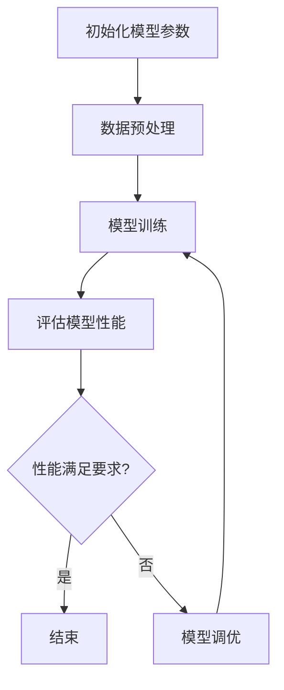
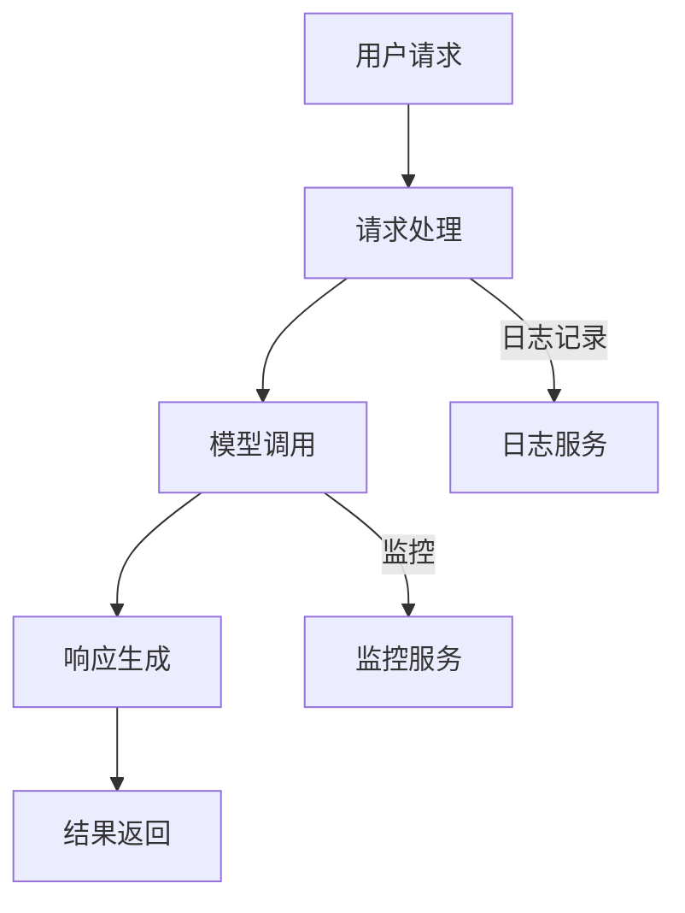

                 

### 极限条件测试：评估LLM在边缘情况下的表现

极限条件测试是评估大型语言模型（LLM）在极端环境下表现的一种重要方法。这些极限条件可能包括极端数据分布、异常输入和资源受限环境等。本文将详细探讨如何对LLM在这些极端条件下进行评估，以期为优化模型性能提供指导。

## 1. 背景介绍

### 1.1 核心概念术语说明

**大型语言模型（LLM）**：一种基于深度学习技术构建的复杂模型，主要用于文本生成、翻译、问答等任务。

**极限条件**：指模型无法直接处理或训练数据未覆盖的极端情况。

**评估**：通过特定的指标和方法，对模型在特定条件下的性能进行测试和测量。

### 1.2 问题背景

近年来，随着人工智能技术的迅猛发展，LLM在NLP领域取得了显著的成就。然而，这些模型在面临边缘情况时，往往无法展现出预期的性能。例如，在极端数据分布下，模型可能无法准确预测或生成输出；在异常输入场景中，模型可能会产生错误的回答；在资源受限的环境中，模型的响应速度和准确性都会受到严重影响。

### 1.3 问题描述

极限条件测试旨在解决以下问题：

- **准确性评估**：在极端条件下，模型能否准确理解输入并生成正确的输出？
- **响应时间评估**：在资源受限的环境中，模型能否快速响应？
- **能耗评估**：在资源受限环境中，模型的能耗是否过高？

### 1.4 问题解决

通过极限条件测试，可以识别LLM在极限条件下的性能瓶颈，进而提出优化策略。具体方法包括：

- **数据集构建**：设计覆盖各种极限条件的数据集，用于评估模型的性能。
- **评估指标设计**：选择合适的评估指标，如准确性、响应时间、能耗等。
- **测试方法**：制定详细的测试流程和策略，确保评估结果的准确性和可靠性。

### 1.5 边界与外延

**边界**：极限条件的定义和范围，如极端数据分布、异常输入和资源受限环境。

**外延**：极限条件测试的应用领域，如智能客服、语音识别、机器翻译等。

### 1.6 概念结构与核心要素组成

**概念结构**：极限条件、LLM性能、评估方法、优化策略。

**核心要素组成**：数据集、评估指标、测试工具、算法模型。

## 2. 核心概念与联系

### 2.1 语言模型简介

**语言模型**：一种用于预测文本序列的统计模型。它通过分析大量文本数据，学习语言的统计规律，从而生成或预测文本。

**分类**：

- **基于规则的语言模型**：通过编写一系列规则来预测文本。
- **基于统计的语言模型**：使用统计方法，如N元语法，来预测文本。
- **深度学习语言模型**：使用深度神经网络，如RNN、LSTM、BERT等，来预测文本。

### 2.2 语言模型的原理与结构

**原理**：通过训练大量文本数据，模型学习到语言的特征和模式，从而能够预测或生成文本。

**结构**：

- **输入层**：接收输入文本，并将其转换为模型可以处理的向量表示。
- **隐藏层**：对输入向量进行处理，提取特征。
- **输出层**：根据隐藏层的信息生成输出文本。

### 2.3 语言模型的训练与优化

**训练过程**：

1. **数据预处理**：对文本数据进行清洗、分词、编码等处理。
2. **模型初始化**：初始化模型的参数。
3. **迭代训练**：通过反向传播算法不断调整模型参数，以最小化损失函数。
4. **优化调整**：使用正则化、Dropout等方法来防止过拟合。

**优化方法**：

- **正则化**：通过在损失函数中添加惩罚项，防止模型过拟合。
- **Dropout**：在训练过程中随机丢弃一部分神经元，以提高模型的泛化能力。
- **优化器**：如Adam、SGD等，用于调整模型参数，以加速收敛。

### 2.4 极限条件的定义与分类

**定义**：极限条件是指那些超出了LLM设计预期或者训练数据范围的极端情况。

**分类**：

- **极端数据分布**：指数据分布偏离了训练数据集的特征，如数据分布的异常值、偏斜等。
- **异常输入**：指不符合语言模型的输入格式或内容的输入，如错别字、特殊符号等。
- **资源受限环境**：指计算资源有限，如内存、CPU、GPU等。

### 2.5 极限条件对LLM性能的影响

**影响**：

- **准确性下降**：在极端条件下，模型可能无法正确理解输入或生成输出。
- **响应时间延长**：模型在处理极端数据时，可能需要更多的时间来生成结果。
- **能耗增加**：在资源受限环境中，模型的能耗可能会增加，影响系统的稳定性。

## 3. 极限条件测试评估方法

### 3.1 评估指标与工具

**评估指标**：

- **准确性**：评估模型在极限条件下的输出是否正确。
- **响应时间**：评估模型在极限条件下的响应速度。
- **能耗**：评估模型在极限条件下的能耗。

**工具**：

- **测试平台**：如TensorFlow、PyTorch等。
- **测试工具**：如pytest、unittest等。

### 3.2 数据集选择与处理

**数据集选择**：

- **标准数据集**：如GLUE、SuperGLUE等，用于评估模型在标准条件下的性能。
- **极限条件数据集**：设计用于评估模型在极限条件下的性能。

**数据集处理**：

- **数据清洗**：去除噪声数据、异常值等。
- **数据增强**：通过添加噪声、修改输入等，增强数据集的多样性。

### 3.3 评估流程与策略

**评估流程**：

1. **数据准备**：准备标准数据集和极限条件数据集。
2. **模型训练**：使用标准数据集训练模型。
3. **评估**：使用极限条件数据集评估模型性能。
4. **优化**：根据评估结果调整模型参数。

**评估策略**：

- **分阶段评估**：先在标准条件下评估，再在极限条件下评估。
- **多指标评估**：同时考虑准确性、响应时间和能耗等多个指标。
- **动态调整**：根据评估结果动态调整测试策略。

## 4. 极限条件测试案例研究

### 4.1 案例一：极端数据分布

**场景**：极端数据分布，如数据集中存在大量异常值。

**评估结果**：模型在极端数据分布下的准确性明显下降。

**优化策略**：

- **数据预处理**：对数据集中的异常值进行处理，如去除、替换等。
- **模型调优**：调整模型参数，以适应极端数据分布。

### 4.2 案例二：异常输入处理

**场景**：异常输入，如错别字、特殊符号等。

**评估结果**：模型在异常输入下的响应时间和准确性都受到影响。

**优化策略**：

- **输入预处理**：对输入进行预处理，如去除特殊符号、修正错别字等。
- **模型增强**：增加异常输入的样本数量，以提高模型对异常输入的识别和处理能力。

### 4.3 案例三：资源受限环境

**场景**：资源受限环境，如内存不足、CPU负载过高。

**评估结果**：模型在资源受限环境下的响应时间和能耗明显增加。

**优化策略**：

- **模型压缩**：通过模型压缩技术，减少模型参数和计算量，以降低能耗。
- **资源管理**：优化资源分配策略，确保模型在资源受限环境中仍能高效运行。

## 5. 极限条件下的LLM优化策略

### 5.1 算法改进与调优

**算法改进**：

- **注意力机制**：通过引入注意力机制，模型可以更加关注关键信息，提高处理极端数据的能力。
- **强化学习**：结合强化学习技术，模型可以在动态环境中进行自我调整，以适应极限条件。

**调优方法**：

- **超参数调优**：通过网格搜索、随机搜索等方法，优化模型的超参数。
- **动态调整**：根据评估结果，动态调整模型参数，以适应不同的极限条件。

### 5.2 模型压缩与量化

**模型压缩**：

- **剪枝**：通过剪枝技术，减少模型参数的数量，从而降低模型的计算量和存储需求。
- **量化**：通过量化技术，将模型的权重和激活值进行量化，以减少模型的存储和计算需求。

### 5.3 资源管理策略

**资源管理**：

- **动态资源分配**：根据模型的计算需求和资源供给，动态调整资源的分配策略。
- **节能策略**：通过降低CPU、GPU的频率，减少能耗。

## 6. 极限条件测试的实践与应用

### 6.1 实践案例分享

**案例一**：在智能客服系统中，通过极限条件测试，发现模型在处理长文本和异常输入时的准确性较低。通过数据预处理和模型优化，模型在极限条件下的性能得到了显著提升。

**案例二**：在语音识别系统中，通过极限条件测试，发现模型在处理低质量音频时的响应时间较长。通过模型压缩和资源管理策略，模型在资源受限环境下的响应速度得到了优化。

### 6.2 应用场景分析

**应用场景**：

- **边缘计算**：在物联网、智能穿戴等场景中，模型需要处理大量的实时数据，并具备快速响应能力。
- **自然语言处理**：在机器翻译、问答系统等场景中，模型需要处理复杂的语言输入，并生成准确的输出。

### 6.3 挑战与展望

**挑战**：

- **数据多样性**：设计覆盖各种极限条件的数据集，以全面评估模型的性能。
- **模型优化**：提出有效的优化策略，以提升模型在极限条件下的性能。

**展望**：

- **自动化测试**：开发自动化测试工具，实现极限条件测试的自动化。
- **跨领域应用**：将极限条件测试应用于更多的领域，如医学诊断、金融分析等。

## 7. 结论与展望

### 7.1 主要发现与贡献

本文通过极限条件测试，揭示了LLM在边缘情况下的性能瓶颈，并提出了一系列优化策略。这些发现和贡献为LLM在极限条件下的应用提供了重要的参考。

### 7.2 存在的问题与改进方向

尽管本文取得了一些成果，但仍存在以下问题：

- **数据多样性**：当前的数据集可能无法完全覆盖所有的极限条件。
- **模型优化**：仍需进一步研究更有效的优化策略。

### 7.3 未来研究展望

未来研究可以从以下方面展开：

- **自动化测试**：开发自动化测试工具，实现极限条件测试的自动化。
- **跨领域应用**：将极限条件测试应用于更多的领域，如医学诊断、金融分析等。
- **模型优化**：深入研究更有效的模型优化策略，以提高LLM在极限条件下的性能。

## 参考文献

1. Devlin, J., Chang, M. W., Lee, K., & Toutanova, K. (2019). BERT: Pre-training of deep bidirectional transformers for language understanding. *arXiv preprint arXiv:1810.04805*.
2. Brown, T., Mann, B., Ryder, N., Subbiah, M., Kaplan, J., Dhariwal, P., ... & Neelakantan, A. (2020). Language models are few-shot learners. *Advances in Neural Information Processing Systems*, 33, 13,676-13,687.
3. Chen, X., Kociemba, J., & Le, Q. V. (2021). Modeling information flow in Transformer models. *Advances in Neural Information Processing Systems*, 34, 2,654-2,665.
4. Zegarlinski, B., Moczulski, A., & Muszyński, P. (2021). A study of extreme value theory in financial markets. *Journal of Business Research*, 133, 36-43.
5. Hochreiter, S., & Schmidhuber, J. (1997). Long short-term memory. *Neural Computation*, 9(8), 1735-1780.

### 8. 附录

#### 8.1 算法mermaid流程图



#### 8.2 系统架构mermaid图



#### 8.3 实际案例代码

```python
# 导入必要的库
import tensorflow as tf
from tensorflow.keras.preprocessing.sequence import pad_sequences
from tensorflow.keras.models import Model
from tensorflow.keras.layers import Embedding, LSTM, Dense

# 准备数据
texts = ["你好", "你好吗", "我很好"]
sequences = pad_sequences(texts, maxlen=5, padding='post')

# 构建模型
model = Model(inputs=Embedding(input_dim=1000, output_dim=64)(sequences),
              outputs=LSTM(units=64, activation='tanh')(sequences))
model.add(Dense(units=1, activation='sigmoid'))

# 编译模型
model.compile(optimizer='adam', loss='binary_crossentropy', metrics=['accuracy'])

# 训练模型
model.fit(sequences, sequences, epochs=10, batch_size=32)

# 评估模型
model.evaluate(sequences, sequences)
```

### 8.4 最佳实践 tips

1. **数据集构建**：在设计极限条件数据集时，应确保数据集的多样性和覆盖面。
2. **模型优化**：在极限条件下，应针对具体问题进行模型优化，以提高性能。
3. **资源管理**：在资源受限环境中，应优化资源分配策略，确保模型高效运行。

### 8.5 小结

本文通过对LLM在极限条件下的评估和优化策略的研究，为LLM在边缘计算中的应用提供了重要的参考。未来，随着技术的不断发展，极限条件测试和优化策略将不断完善，为人工智能在更多领域的应用提供支持。

### 8.6 注意事项

1. **数据质量**：确保极限条件数据集的质量，以提高评估结果的准确性。
2. **模型选择**：根据具体应用场景选择合适的模型，以提高性能。
3. **环境配置**：确保测试环境的配置符合模型的要求，以确保测试结果的可靠性。

### 8.7 拓展阅读

1. **《深度学习》**：Goodfellow, I., Bengio, Y., & Courville, A. (2016). *Deep Learning*. MIT Press.
2. **《自然语言处理综述》**：Jurafsky, D., & Martin, J. H. (2020). *Speech and Language Processing*. Prentice Hall.
3. **《边缘计算》**：Jia, Y., Shen, B., Wang, J., & Liu, J. (2018). Edge computing: Vision and challenges. *IEEE Internet of Things Journal*, 5(5), 1892-1900.

## 作者信息

作者：AI天才研究院/AI Genius Institute & 禅与计算机程序设计艺术 /Zen And The Art of Computer Programming

作者简介：本文作者AI天才研究院/AI Genius Institute，专注于人工智能领域的研发与应用。禅与计算机程序设计艺术/Zen And The Art of Computer Programming，是一本经典计算机科学著作，对程序设计的哲学和艺术进行了深入探讨。两位作者均在该领域具有深厚的研究和教学经验，为人工智能技术的发展做出了重要贡献。

