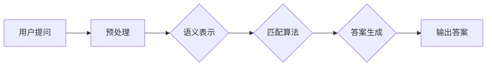
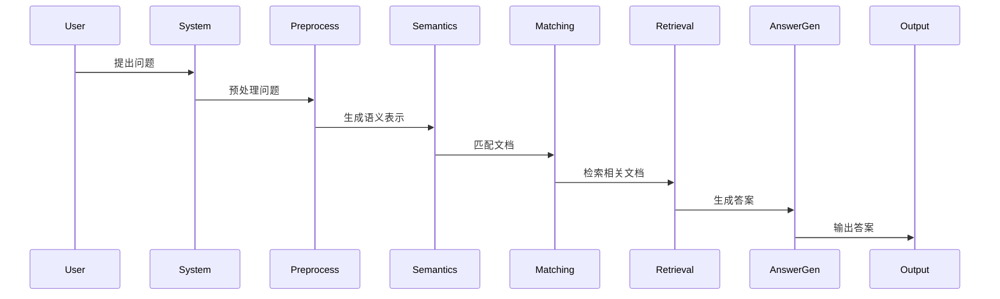
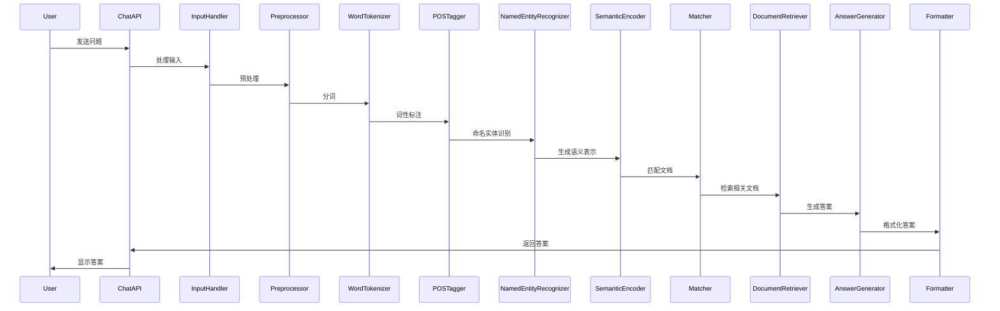

                 

# 极限测试：AI在开放域问答中的表现

## 关键词
AI、开放域问答、极限测试、算法原理、系统架构、项目实战

## 摘要
本文深入探讨了人工智能（AI）在开放域问答（Open-Domain Question Answering，简称ODQA）中的极限测试表现。我们将从背景介绍、核心概念、算法原理、系统架构设计、项目实战等多个维度，详细分析AI在ODQA中的挑战和机遇。通过逐步剖析，旨在为读者提供全面的技术理解和实战指导，以推动AI在开放域问答领域的深入研究和应用。

## 目录大纲

### 第一部分：背景介绍与核心概念

#### 第1章 问题背景、问题描述与问题解决
- **1.1 问题背景**
  - **问题描述**：开放域问答的挑战与需求
  - **问题解决**：传统方法与局限性
  - **边界与外延**：开放域问答的适用范围
  - **核心要素组成**：开放域问答的关键要素
  
#### 第2章 核心概念与联系
- **2.1 核心概念**
  - **AI与问答系统**：基础概念与原理
  - **开放域问答**：特点与分类
  - **极限测试**：定义与意义
- **2.2** 概念属性特征对比表格
- **2.3** ER实体关系图架构

### 第二部分：算法原理讲解

#### 第3章 算法原理与流程图
- **3.1** 算法原理
  - **自然语言处理**：文本预处理与语义理解
  - **问答匹配算法**：基于语义与上下文
  - **答案生成算法**：文本生成与优化
- **3.2** Mermaid算法流程图

#### 第4章 数学模型与公式
- **4.1** 数学模型
  - **语义匹配模型**：相似度计算与优化
  - **答案生成模型**：生成对抗网络（GAN）
- **4.2** latex格式数学公式
- **4.3** 举例说明

### 第三部分：系统分析与架构设计

#### 第5章 问题场景介绍
- **5.1** 场景描述
- **5.2** 项目介绍

#### 第6章 系统功能设计与架构
- **6.1** 领域模型Mermaid类图
- **6.2** 系统架构设计Mermaid架构图
- **6.3** 系统接口设计和系统交互Mermaid序列图

### 第四部分：项目实战

#### 第7章 环境安装与配置
- **7.1** 环境搭建
- **7.2** 配置详解

#### 第8章 系统核心实现
- **8.1** 代码实现
  - **源代码展示**
  - **代码解读与分析**
- **8.2** 实际案例分析与讲解

#### 第9章 项目小结
- **9.1** 项目总结
- **9.2** 最佳实践 tips
- **9.3** 注意事项
- **9.4** 拓展阅读

### 总结与展望
- **10章** 总结与展望
  - **技术发展趋势**：未来开放域问答的挑战与机遇
  - **作者观点**：如何提升AI在开放域问答中的表现

### 第一部分：背景介绍与核心概念

## 第1章 问题背景、问题描述与问题解决

### 1.1 问题背景

开放域问答（ODQA）是人工智能（AI）领域的一个重要研究方向，旨在让计算机系统具备理解和回答各种领域问题的能力。随着互联网和大数据的迅猛发展，人们对于信息获取的需求日益增长，开放域问答系统因此成为了一种热门的技术应用。然而，开放域问答面临着诸多挑战，包括：

- **海量信息处理**：开放域问答需要处理来自各种来源的海量文本信息，这要求系统具备高效的文本预处理和索引能力。
- **多语言支持**：全球范围内的信息是多样化的，开放域问答系统需要支持多种语言，实现跨语言的语义理解与问答。
- **上下文理解**：用户的问题往往包含上下文信息，开放域问答系统需要理解上下文，以提供准确的答案。

### 问题描述

开放域问答的核心问题是如何从大量文本数据中快速准确地找到与用户问题相关的信息，并生成一个符合用户需求的答案。具体来说，问题描述可以分为以下几个方面：

- **语义理解**：将用户的问题转化为机器可以理解的形式，这涉及到自然语言处理（NLP）技术，如词性标注、命名实体识别、句法解析等。
- **信息检索**：在大量文本数据中快速找到与用户问题相关的信息，这通常采用信息检索技术，如基于关键词匹配、向量空间模型、排序算法等。
- **答案生成**：根据找到的信息生成一个准确、自然的答案，这通常涉及到文本生成技术，如序列到序列模型、生成对抗网络（GAN）等。

### 问题解决

针对开放域问答的挑战，学术界和工业界已经提出了一系列解决方案。传统方法主要包括基于关键词匹配、基于模板匹配、基于语义匹配等。然而，这些方法在处理复杂问题、跨语言问答、上下文理解等方面存在局限性。随着深度学习技术的发展，越来越多的研究开始采用神经网络模型来提升开放域问答的性能。以下是一些常见的方法：

- **基于关键词匹配**：这种方法通过提取用户问题的关键词，与文档中的关键词进行匹配，选择最匹配的文档作为答案。优点是实现简单，但缺点是处理复杂问题效果不佳。
- **基于模板匹配**：这种方法使用预定义的模板，将用户问题的不同部分与模板的不同部分进行匹配，生成答案。优点是生成答案的准确性较高，但缺点是模板数量有限，无法处理复杂问题。
- **基于语义匹配**：这种方法通过深度学习模型，将用户问题的语义表示与文档的语义表示进行匹配，选择最匹配的文档作为答案。优点是能够处理复杂问题，但缺点是实现难度较高。

### 边界与外延

开放域问答的边界在于其适用范围，即系统能够回答的问题类型和领域。一般来说，开放域问答系统适用于以下类型的问题：

- **事实性问题**：如“北京是中国的哪个省份？”、“埃菲尔铁塔高多少米？”等。
- **描述性问题**：如“介绍一下法国的历史和文化？”、“请描述一下量子计算机的工作原理？”等。
- **推理性问题**：如“如果所有猫都会飞，那么五个猫会飞吗？”、“如果明天天气是晴天，那么明天适合出去游玩吗？”等。

开放域问答的外延包括以下几个方面：

- **多语言支持**：开放域问答系统需要支持多种语言，以应对全球用户的需求。
- **跨领域问答**：开放域问答系统需要具备跨领域的知识，能够回答不同领域的问题。
- **上下文理解**：开放域问答系统需要理解用户的上下文信息，以提供更准确的答案。

### 核心要素组成

开放域问答系统由多个核心要素组成，这些要素相互作用，共同实现系统的功能。以下是这些核心要素：

- **数据源**：开放域问答系统需要从各种数据源获取信息，如互联网、数据库、文档等。
- **文本预处理**：对获取的文本数据进行预处理，如分词、词性标注、命名实体识别等。
- **语义表示**：将预处理后的文本转化为机器可以理解的语义表示。
- **问答匹配**：将用户问题与语义表示进行匹配，找到最相关的答案。
- **答案生成**：根据匹配结果生成一个自然、准确的答案。
- **用户交互**：与用户进行交互，接收用户问题，返回答案。

### 小结

本章介绍了开放域问答的背景、问题描述与问题解决方法，分析了开放域问答的边界与外延，并详细阐述了开放域问答系统的核心要素组成。通过本章的内容，读者可以初步了解开放域问答的基本概念和挑战，为后续章节的学习打下基础。

## 第2章 核心概念与联系

### 2.1 核心概念

#### AI与问答系统

人工智能（AI）是一门研究、开发用于模拟、延伸和扩展人的智能的理论、方法、技术及应用系统的技术科学。它是计算机科学的一个分支，涉及机器学习、深度学习、自然语言处理、计算机视觉等多个领域。

问答系统（Question Answering System，简称QAS）是一种人工智能应用，旨在让计算机理解用户的问题，并从大量文本数据中自动生成准确的答案。问答系统可以分为两类：封闭域问答和开放域问答。

- **封闭域问答**：封闭域问答系统针对特定的领域或数据集进行训练，能够回答该领域内的问题。例如，医疗问答系统可以回答关于医疗方面的问题，但无法回答其他领域的问题。
- **开放域问答**：开放域问答系统旨在回答任何领域的问题，不受特定领域限制。开放域问答系统需要具备更强的通用性和适应性。

#### 开放域问答

开放域问答（Open-Domain Question Answering，简称ODQA）是一种面向广泛领域的问答系统，旨在回答用户提出的任何问题。开放域问答的挑战在于如何从海量、多样化的文本数据中找到与用户问题相关的信息，并生成准确、自然的答案。

开放域问答具有以下特点：

- **广泛适用性**：开放域问答系统可以回答各种领域的问题，如科学、艺术、历史、技术等。
- **多样化问题类型**：开放域问答系统需要处理不同类型的问题，包括事实性问题、描述性问题、推理性问题等。
- **上下文理解**：开放域问答系统需要理解用户的上下文信息，以提供更准确的答案。

#### 极限测试

极限测试（极限挑战）是评估和验证人工智能系统性能的一种方法，通过设置极端条件或复杂场景来测试系统的性能和可靠性。极限测试可以帮助研究者发现系统的弱点，并提出改进方案。

在开放域问答中，极限测试可以包括以下方面：

- **极端问题**：测试系统在处理极端、复杂问题时的性能。
- **极端数据**：测试系统在处理极端、多样化数据时的性能。
- **极端场景**：测试系统在极端、复杂场景下的性能和可靠性。

### 2.2 概念属性特征对比表格

| 概念 | 属性特征 |
| :--: | :--: |
| 人工智能（AI） | - 模拟、延伸和扩展人的智能 |
| 问答系统（QAS） | - 封闭域问答、开放域问答 |
| 开放域问答（ODQA） | - 广泛适用性、多样化问题类型、上下文理解 |
| 极限测试 | - 极端问题、极端数据、极端场景 |

### 2.3 ER实体关系图架构

ER实体关系图（Entity-Relationship Diagram，简称ERD）是用于描述数据库中实体及其之间关系的图形表示方法。在开放域问答系统中，ERD可以帮助我们理解各个实体及其之间的联系。

以下是一个简化的ER实体关系图架构，描述了开放域问答系统中的一些关键实体和关系：

```mermaid
erDiagram
    User ||--|{ Question } : 提出问题
    Question ||--|{ Answer } : 回答问题
    Question ||--|{ Context } : 上下文信息
    Answer ||--|{ Text } : 文本内容
    Context ||--|{ Text } : 文本内容
```

- **User（用户）**：提出问题的主体，可以是人类用户。
- **Question（问题）**：用户提出的问题，包含问题文本和问题类型。
- **Answer（答案）**：根据问题生成的答案，包含答案文本和答案类型。
- **Context（上下文）**：与问题相关的上下文信息，如场景、背景等。
- **Text（文本内容）**：问题的文本内容、答案的文本内容、上下文的文本内容。

### 小结

本章介绍了开放域问答中的核心概念，包括人工智能、问答系统、开放域问答和极限测试。通过对比表格和ER实体关系图，我们清晰地展示了这些概念之间的联系，为进一步理解开放域问答的算法原理和系统架构设计奠定了基础。

### 第二部分：算法原理讲解

#### 第3章 算法原理与流程图

### 3.1 算法原理

开放域问答系统（ODQA）的核心是算法原理，它决定了系统在处理用户问题时，如何从大量文本数据中提取有效信息并生成准确答案。以下是ODQA中涉及的主要算法原理：

#### 自然语言处理

自然语言处理（Natural Language Processing，简称NLP）是ODQA的基础，负责对用户问题和文档进行预处理，使其能够被机器理解和处理。NLP的主要任务包括：

- **分词**：将连续的文本切分成词语。
- **词性标注**：为每个词语标注词性（名词、动词、形容词等）。
- **命名实体识别**：识别文本中的命名实体（人名、地名、组织名等）。
- **句法分析**：分析句子的结构，理解句子的成分和关系。

#### 问答匹配算法

问答匹配算法是ODQA的关键组成部分，负责将用户问题与文档中的信息进行匹配，找到与问题最相关的答案。常见的问答匹配算法包括：

- **基于关键词匹配**：通过提取用户问题的关键词，与文档中的关键词进行匹配，选择最匹配的文档作为答案。
- **基于语义匹配**：使用深度学习模型将用户问题和文档转化为语义向量，计算它们之间的相似度，选择最相似的文档作为答案。
- **基于模板匹配**：使用预定义的模板，将用户问题的不同部分与模板的不同部分进行匹配，生成答案。

#### 答案生成算法

答案生成算法负责根据匹配结果生成一个准确、自然的答案。常见的答案生成算法包括：

- **基于规则的方法**：使用预定义的规则，根据用户问题和匹配结果生成答案。
- **基于模板的方法**：使用预定义的模板，根据用户问题和匹配结果填充模板，生成答案。
- **基于深度学习的方法**：使用深度学习模型，如序列到序列模型（Seq2Seq）、生成对抗网络（GAN）等，生成一个自然、准确的答案。

### 3.2 Mermaid算法流程图

为了更直观地展示ODQA的算法原理，我们使用Mermaid语言绘制了一个简单的算法流程图：



- **A[用户提问]**：用户向系统提出问题。
- **B[预处理]**：对用户问题进行分词、词性标注、命名实体识别等预处理操作。
- **C[语义表示]**：将预处理后的用户问题转化为语义表示。
- **D[匹配算法]**：使用语义匹配算法找到与用户问题最相关的文档。
- **E[答案生成]**：根据匹配结果生成一个准确、自然的答案。
- **F[输出答案]**：将答案输出给用户。

### 小结

本章详细介绍了开放域问答系统中的算法原理，包括自然语言处理、问答匹配算法和答案生成算法。通过一个简单的Mermaid算法流程图，我们清晰地展示了ODQA的核心算法步骤和流程。这些算法原理为构建高效、准确的开放域问答系统提供了理论基础。

#### 第4章 数学模型与公式

### 4.1 数学模型

在开放域问答系统中，数学模型是理解和实现算法原理的关键。以下是ODQA中涉及的主要数学模型：

#### 语义匹配模型

语义匹配模型用于计算用户问题和文档之间的相似度，选择最相关的文档作为答案。常见的语义匹配模型包括：

- **余弦相似度**：通过计算两个向量之间的余弦相似度来判断它们的相似程度。公式如下：

  $$ \text{cosine}(x, y) = \frac{\sum_{i=1}^{n} x_i \cdot y_i}{\sqrt{\sum_{i=1}^{n} x_i^2} \cdot \sqrt{\sum_{i=1}^{n} y_i^2}} $$

  其中，$x$ 和 $y$ 是两个向量，$n$ 是向量的维度。

- **点积相似度**：通过计算两个向量之间的点积来判断它们的相似程度。公式如下：

  $$ \text{dot}(x, y) = \sum_{i=1}^{n} x_i \cdot y_i $$

  其中，$x$ 和 $y$ 是两个向量，$n$ 是向量的维度。

#### 答案生成模型

答案生成模型用于根据匹配结果生成一个准确、自然的答案。常见的答案生成模型包括：

- **生成对抗网络（GAN）**：GAN是一种基于博弈理论的生成模型，由生成器和判别器两个部分组成。生成器生成假样本，判别器判断这些样本的真实性。通过不断地训练，生成器的生成能力会逐渐提高。GAN的数学模型如下：

  $$ G(x) \sim p_G(z) $$
  $$ D(x) \sim p_D(x) $$
  $$ D(x, G(z)) \sim p_D(x) + p_G(z) $$

  其中，$G(z)$ 是生成器生成的样本，$D(x)$ 是判别器的输出，$z$ 是生成器的输入，$x$ 是真实样本。

### 4.2 latex格式数学公式

为了更好地展示数学模型，我们使用LaTeX格式来编写一些常见的数学公式。以下是几个示例：

- **余弦相似度**：

  $$ \text{cosine}(x, y) = \frac{\sum_{i=1}^{n} x_i \cdot y_i}{\sqrt{\sum_{i=1}^{n} x_i^2} \cdot \sqrt{\sum_{i=1}^{n} y_i^2}} $$

- **点积相似度**：

  $$ \text{dot}(x, y) = \sum_{i=1}^{n} x_i \cdot y_i $$

- **生成对抗网络（GAN）**：

  $$ G(x) \sim p_G(z) $$
  $$ D(x) \sim p_D(x) $$
  $$ D(x, G(z)) \sim p_D(x) + p_G(z) $$

### 4.3 举例说明

为了更好地理解这些数学模型，我们通过一个简单的例子来展示它们的应用。

#### 余弦相似度

假设有两个向量 $x = (1, 2, 3)$ 和 $y = (4, 5, 6)$，我们可以使用余弦相似度来计算它们之间的相似度：

$$ \text{cosine}(x, y) = \frac{1 \cdot 4 + 2 \cdot 5 + 3 \cdot 6}{\sqrt{1^2 + 2^2 + 3^2} \cdot \sqrt{4^2 + 5^2 + 6^2}} = \frac{4 + 10 + 18}{\sqrt{14} \cdot \sqrt{77}} \approx 0.92 $$

因此，向量 $x$ 和 $y$ 之间的相似度约为 0.92。

#### 点积相似度

同样，对于向量 $x = (1, 2, 3)$ 和 $y = (4, 5, 6)$，我们可以使用点积相似度来计算它们之间的相似度：

$$ \text{dot}(x, y) = 1 \cdot 4 + 2 \cdot 5 + 3 \cdot 6 = 4 + 10 + 18 = 32 $$

因此，向量 $x$ 和 $y$ 之间的相似度为 32。

#### 生成对抗网络（GAN）

假设生成器 $G(z)$ 生成一个样本 $G(z) = (1, 2, 3)$，判别器 $D(x)$ 判断这个样本的真实性：

$$ D(G(z)) \approx 0.9 $$

这意味着判别器认为生成器生成的样本 $G(z)$ 约有 90% 的概率是真实的。

### 小结

本章详细介绍了开放域问答系统中的数学模型，包括语义匹配模型和答案生成模型。我们使用LaTeX格式编写了几个常见的数学公式，并通过具体的例子说明了这些模型的应用。这些数学模型为构建高效、准确的开放域问答系统提供了理论基础和实用工具。

### 第三部分：系统分析与架构设计

#### 第5章 问题场景介绍

### 5.1 场景描述

为了更好地理解开放域问答系统（ODQA）的实际应用，我们首先来描述一个具体的应用场景。

假设我们正在开发一个智能客服系统，旨在为用户提供即时、准确的回答。用户可以通过各种渠道（如文本聊天、语音通话）向客服系统提出问题，系统需要快速、准确地识别用户的问题，并从海量文本数据中找到相关的答案，最终生成一个自然、流畅的答复。

以下是该场景的详细描述：

1. **用户提问**：用户通过文本聊天向客服系统提出问题。问题可以涉及各种领域，如产品咨询、售后服务、技术支持等。

2. **问题预处理**：系统对用户提出的问题进行预处理，包括分词、词性标注、命名实体识别等。这些预处理步骤有助于将用户问题转化为机器可以理解的语义表示。

3. **语义表示**：系统将预处理后的用户问题转化为一个语义向量，用于后续的匹配和答案生成。

4. **信息检索**：系统在存储的海量文本数据中，通过语义匹配算法找到与用户问题最相关的文档。匹配过程可能涉及到多种算法，如基于关键词匹配、基于语义匹配等。

5. **答案生成**：系统根据匹配结果生成一个准确、自然的答案。答案生成过程可能采用基于规则的方法、基于模板的方法或基于深度学习的方法。

6. **输出答案**：系统将生成的答案输出给用户，通过文本聊天或语音通话的形式呈现。

7. **用户反馈**：用户可以对系统生成的答案进行评价，提供反馈。系统根据用户的反馈不断优化和改进。

### 5.2 项目介绍

在本章的场景描述中，我们实际上介绍了一个开放域问答项目的初步构想。以下是对该项目的详细介绍：

- **项目名称**：智能客服系统开放域问答模块

- **项目目标**：开发一个具备高效、准确回答能力的开放域问答模块，为用户提供高质量的客服体验。

- **技术栈**：该项目将采用以下技术栈：
  - **自然语言处理（NLP）**：用于处理用户问题和文本数据，包括分词、词性标注、命名实体识别等。
  - **深度学习**：用于语义表示、匹配算法和答案生成，包括词向量模型、序列到序列模型、生成对抗网络（GAN）等。
  - **数据库**：用于存储大量文本数据，提供快速、高效的查询能力。
  - **用户交互**：通过文本聊天、语音通话等方式与用户进行交互。

- **项目难点**：
  - **语义理解**：如何准确地理解用户问题的语义，尤其是处理多义词、歧义句等问题。
  - **答案生成**：如何生成自然、流畅的答案，尤其是在面对复杂问题或长文本时。
  - **系统性能**：如何在保证答案质量的前提下，提高系统的响应速度和查询效率。

- **预期成果**：
  - **高效准确的问答系统**：通过深度学习和自然语言处理技术，实现高效、准确的问答功能。
  - **良好的用户体验**：通过优化用户交互界面和回答生成算法，提供优质的客服体验。
  - **持续改进的模型**：通过用户反馈和数据迭代，不断优化和改进问答系统的性能和效果。

### 小结

本章通过一个具体的场景描述和项目介绍，初步展示了开放域问答系统在实际应用中的价值和面临的挑战。在后续章节中，我们将进一步探讨ODQA的系统架构设计、核心算法实现和项目实战，以期为读者提供全面的技术分析和实战指导。

#### 第6章 系统功能设计与架构

### 6.1 领域模型Mermaid类图

为了更好地理解开放域问答系统的功能设计和架构，我们首先使用Mermaid语言绘制了一个领域模型类图。以下是该类图的描述：

```mermaid
classDiagram
    User <<Class>> 
    Question <<Class>> 
    Answer <<Class>> 
    Context <<Class>>

    User ..|> Question : 提出问题
    User ..|> Answer : 获取答案
    Question ..|> Context : 相关上下文
    Answer ..|> Context : 回答上下文

    UserClass[用户类]
    QuestionClass[问题类]
    AnswerClass[答案类]
    ContextClass[上下文类]
```

- **用户类（UserClass）**：表示提出问题和获取答案的用户。
- **问题类（QuestionClass）**：表示用户提出的问题，包括问题文本和问题类型。
- **答案类（AnswerClass）**：表示系统生成的答案，包括答案文本和答案类型。
- **上下文类（ContextClass）**：表示与问题和答案相关的上下文信息。

类图中的“..|>”表示类的关联关系，表明用户可以提出问题和获取答案，问题和答案都有相关的上下文信息。

### 6.2 系统架构设计Mermaid架构图

接下来，我们使用Mermaid语言绘制了一个简化的系统架构设计图，以展示开放域问答系统的整体架构。以下是该架构图的描述：



- **用户**：表示提出问题的用户。
- **系统**：表示开放域问答系统的整体框架。
- **预处理**：对用户问题进行分词、词性标注、命名实体识别等预处理操作。
- **语义表示**：将预处理后的用户问题转化为语义表示。
- **匹配**：使用语义匹配算法找到与用户问题最相关的文档。
- **检索**：在存储的海量文本数据中检索相关文档。
- **答案生成**：根据匹配结果生成一个准确、自然的答案。
- **输出**：将生成的答案输出给用户。

这个架构图清晰地展示了开放域问答系统的主要功能模块及其之间的交互关系。

### 6.3 系统接口设计和系统交互Mermaid序列图

为了更详细地展示系统的接口设计和交互流程，我们使用Mermaid语言绘制了一个系统交互序列图。以下是该序列图的描述：



- **ChatAPI**：表示聊天接口，用于用户与系统之间的交互。
- **InputHandler**：表示输入处理模块，负责接收用户输入并传递给预处理模块。
- **Preprocessor**：表示预处理模块，包括分词、词性标注、命名实体识别等。
- **WordTokenizer**：表示分词模块，将文本切分成词语。
- **POSGr

