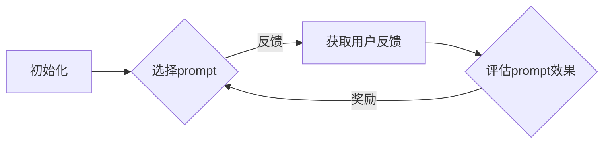
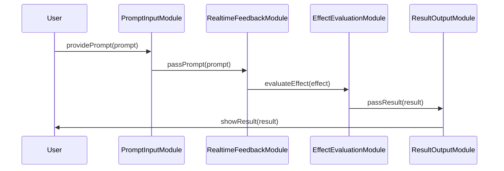
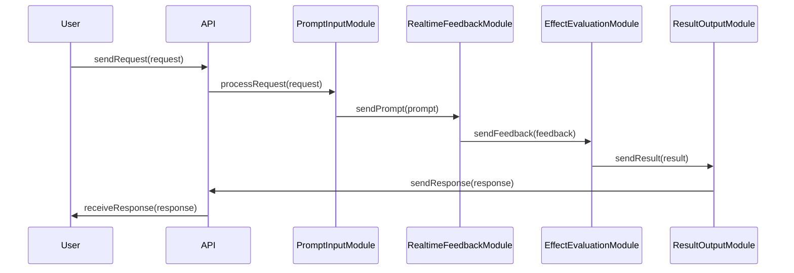

                 

# 《构建prompt效果的实时反馈系统》

## 关键词

- 实时反馈系统
- prompt效果
- 算法设计
- 数学模型
- 系统架构
- 项目实战

## 摘要

本文旨在探讨如何构建一个具备实时反馈功能的prompt效果系统。通过深入分析实时反馈系统在prompt效果中的作用，我们将介绍系统的核心概念、算法原理、数学模型和系统架构设计。此外，还将分享一个实际项目实战经验，提供最佳实践和注意事项。本文将帮助读者理解并掌握构建实时反馈系统的关键技术，以实现高效且精准的prompt效果。

## 目录

### 第一部分：系统基础构建

#### 1.1 系统概述

##### 1.1.1 系统背景与目标

##### 1.1.2 系统功能与架构

#### 1.2 prompt效果基础

##### 1.2.1 prompt的概念与作用

##### 1.2.2 prompt的类型与应用场景

#### 1.3 实时反馈系统设计

##### 1.3.1 实时反馈的重要性

##### 1.3.2 实时反馈系统的架构设计

#### 1.4 系统核心算法介绍

##### 1.4.1 相关算法概述

##### 1.4.2 算法流程图展示

##### 1.4.3 算法原理与数学模型

#### 1.5 系统数学模型与公式

##### 1.5.1 数学模型介绍

##### 1.5.2 公式推导与详细讲解

#### 1.6 系统分析与架构设计

##### 1.6.1 系统功能设计（Mermaid类图）

##### 1.6.2 系统架构设计（Mermaid架构图）

##### 1.6.3 系统接口设计与交互（Mermaid序列图）

#### 1.7 系统环境搭建与实现

##### 1.7.1 系统环境要求

##### 1.7.2 系统核心代码实现

#### 1.8 项目实战

##### 1.8.1 实际案例分析与讲解

##### 1.8.2 项目小结与拓展

#### 1.9 最佳实践与注意事项

##### 1.9.1 最佳实践

##### 1.9.2 小结与注意事项

##### 1.9.3 拓展阅读

## 1.1 系统概述

### 1.1.1 系统背景与目标

随着人工智能技术的发展，prompt效果在自然语言处理、推荐系统等领域发挥着越来越重要的作用。prompt效果是指通过输入特定的提示信息，使得系统能够更好地理解用户需求，从而提供更加精准的输出结果。然而，传统的prompt效果系统往往存在响应速度慢、实时性差等问题，无法满足现代应用场景的需求。

本系统旨在构建一个具备实时反馈功能的prompt效果系统，以提升系统的响应速度和准确性。通过实时反馈，系统能够快速地调整和优化prompt，从而更好地满足用户需求。系统的主要目标包括：

1. 提高响应速度：通过实时反馈机制，缩短系统处理时间，提高响应效率。
2. 提高准确性：实时调整prompt，使系统输出结果更加准确和符合用户需求。
3. 支持多种应用场景：系统应具备灵活的扩展性，能够适应不同的应用场景，如自然语言处理、推荐系统等。

### 1.1.2 系统功能与架构

本系统主要包括以下几个功能模块：

1. **prompt输入模块**：负责接收用户输入的prompt信息，并进行预处理。
2. **实时反馈模块**：通过实时反馈机制，对prompt进行调整和优化。
3. **效果评估模块**：对系统的输出结果进行评估，以衡量prompt效果的优劣。
4. **结果输出模块**：将系统的输出结果展示给用户。

系统架构设计如下：

1. **输入层**：接收用户输入的prompt信息，并将其传递给prompt输入模块。
2. **处理层**：prompt输入模块对prompt信息进行预处理，包括分词、去停用词等操作。
3. **反馈层**：实时反馈模块根据系统的输出结果和用户反馈，对prompt进行调整和优化。
4. **评估层**：效果评估模块对系统的输出结果进行评估，以衡量prompt效果的优劣。
5. **输出层**：结果输出模块将系统的输出结果展示给用户。

## 1.2 prompt效果基础

### 1.2.1 prompt的概念与作用

prompt是指在交互过程中向系统提供的一个引导性输入，它能够引导系统更好地理解用户需求，从而提供更加精准的输出结果。prompt可以是一个简单的短语、句子或者段落，它的目的是帮助系统更快地捕捉到用户的核心需求。

prompt在自然语言处理、推荐系统等领域具有重要作用。例如，在自然语言处理领域，prompt可以帮助系统更好地理解用户的意图，从而生成更加准确和自然的回答。在推荐系统领域，prompt可以帮助系统更好地理解用户的兴趣和偏好，从而提供更加个性化的推荐结果。

### 1.2.2 prompt的类型与应用场景

prompt可以分为以下几种类型：

1. **明确式prompt**：用户直接提供明确的需求，如“给我推荐一本关于人工智能的书籍”。
2. **模糊式prompt**：用户提供不明确的需求，需要系统进行推理和判断，如“我想看一部电影”。
3. **引导式prompt**：系统通过提问引导用户提供更具体的需求，如“您想看哪种类型的电影？”。

不同的prompt类型适用于不同的应用场景。例如，明确式prompt适用于用户需求明确的场景，如搜索引擎；模糊式prompt适用于用户需求不明确的场景，如智能助手；引导式prompt适用于需要用户进一步明确需求的场景，如在线购物推荐。

## 1.3 实时反馈系统设计

### 1.3.1 实时反馈的重要性

实时反馈系统在prompt效果中扮演着关键角色。通过实时反馈，系统能够及时获取用户的反馈信息，并根据反馈进行调整和优化。这种实时性使得系统能够更好地适应用户需求的变化，提供更加精准和个性化的服务。

实时反馈的重要性主要体现在以下几个方面：

1. **提高用户体验**：实时反馈能够快速响应用户的需求变化，提高用户体验。
2. **优化prompt效果**：通过实时反馈，系统能够不断调整和优化prompt，提高输出结果的准确性。
3. **提升系统性能**：实时反馈机制能够缩短系统处理时间，提高系统性能。

### 1.3.2 实时反馈系统的架构设计

实时反馈系统的架构设计需要考虑以下几个方面：

1. **数据采集模块**：负责实时采集用户的反馈信息，如点击、评价等。
2. **处理层**：对采集到的反馈信息进行预处理和解析，提取有用的信息。
3. **反馈模块**：根据处理后的反馈信息，对prompt进行调整和优化。
4. **评估层**：对调整后的prompt进行效果评估，以衡量实时反馈的效果。

具体架构设计如下：

1. **输入层**：接收用户的反馈信息，如点击、评价等。
2. **数据处理层**：对反馈信息进行预处理和解析，提取有用的信息。
3. **反馈层**：根据处理后的反馈信息，对prompt进行调整和优化。
4. **评估层**：对调整后的prompt进行效果评估，以衡量实时反馈的效果。

## 1.4 系统核心算法介绍

### 1.4.1 相关算法概述

在实时反馈系统中，核心算法的设计至关重要。本文将介绍一种基于强化学习的实时反馈算法，该算法通过不断调整prompt，以实现最优的输出结果。

强化学习是一种通过奖励和惩罚来指导智能体进行决策的机器学习技术。在实时反馈系统中，智能体通过不断尝试不同的prompt，并根据用户的反馈调整prompt，以达到最优的效果。

### 1.4.2 算法流程图展示

以下是算法的流程图：



### 1.4.3 算法原理与数学模型

算法的基本原理是通过不断尝试不同的prompt，并根据用户的反馈调整prompt，以实现最优的效果。具体步骤如下：

1. **初始化**：初始化prompt和智能体的状态。
2. **选择prompt**：根据当前智能体的状态，选择一个prompt。
3. **获取用户反馈**：将选择的prompt展示给用户，获取用户的反馈信息。
4. **评估prompt效果**：根据用户的反馈，评估prompt的效果。
5. **调整prompt**：根据评估结果，调整prompt。
6. **重复步骤2-5**：不断重复以上步骤，以实现最优的效果。

数学模型如下：

$$
\begin{aligned}
R(s, a) &= \text{奖励函数，用于衡量状态s和动作a的效果} \\
Q(s, a) &= \text{状态-动作价值函数，用于评估状态s和动作a的效用} \\
\pi(a|s) &= \text{策略，用于指导智能体在状态s下选择动作a} \\
\end{aligned}
$$

其中，$s$ 表示状态，$a$ 表示动作，$R(s, a)$ 表示在状态s下执行动作a的奖励，$Q(s, a)$ 表示在状态s下执行动作a的价值，$\pi(a|s)$ 表示在状态s下选择动作a的概率。

## 1.5 系统数学模型与公式

### 1.5.1 数学模型介绍

在实时反馈系统中，数学模型用于描述系统的状态、动作、奖励等关键要素。以下将介绍系统的主要数学模型：

1. **状态模型**：描述系统的当前状态，包括用户输入、智能体状态等。
2. **动作模型**：描述系统的动作，包括选择prompt、获取用户反馈等。
3. **奖励模型**：描述系统的奖励函数，用于衡量动作的效果。

### 1.5.2 公式推导与详细讲解

以下是系统的数学模型和公式：

1. **状态模型**：

$$
s = (x, s_a)
$$

其中，$x$ 表示用户输入，$s_a$ 表示智能体状态。

2. **动作模型**：

$$
a = \pi(a|s) \cdot A
$$

其中，$\pi(a|s)$ 表示在状态s下选择动作a的概率，$A$ 表示所有可能的动作。

3. **奖励模型**：

$$
R(s, a) = \text{reward}(x, s_a, a)
$$

其中，$\text{reward}(x, s_a, a)$ 表示在状态s下执行动作a的奖励。

### 1.5.3 公式推导与详细讲解

以下是每个公式的推导与详细讲解：

1. **状态模型**：

状态模型描述了系统的当前状态，包括用户输入和智能体状态。用户输入$x$ 表示用户提供的prompt信息，智能体状态$s_a$ 表示智能体的当前状态，如选择prompt的索引等。通过状态模型，我们可以描述系统的当前状态。

2. **动作模型**：

动作模型描述了系统在状态s下选择动作a的过程。$\pi(a|s)$ 表示在状态s下选择动作a的概率，$A$ 表示所有可能的动作。通过动作模型，我们可以确定系统在当前状态下应该执行哪个动作。

3. **奖励模型**：

奖励模型描述了系统在状态s下执行动作a的奖励。$\text{reward}(x, s_a, a)$ 表示在状态s下执行动作a的奖励。奖励函数可以根据具体应用场景进行调整，如点击量、用户满意度等。通过奖励模型，我们可以衡量动作的效果。

## 1.6 系统分析与架构设计

### 1.6.1 系统功能设计（Mermaid类图）

以下是一个简单的Mermaid类图，用于描述系统的功能设计：

```mermaid
classDiagram
  UserFeedbackSystem
  UserFeedbackSystem <|-- PromptInputModule
  UserFeedbackSystem <|-- RealtimeFeedbackModule
  UserFeedbackSystem <|-- EffectEvaluationModule
  UserFeedbackSystem <|-- ResultOutputModule

  PromptInputModule {
    +receivePrompt(prompt)
    +processPrompt(prompt)
  }

  RealtimeFeedbackModule {
    +getFeedback(feedback)
    +adjustPrompt(prompt, feedback)
  }

  EffectEvaluationModule {
    +evaluateEffect(effect)
  }

  ResultOutputModule {
    +showResult(result)
  }
```

### 1.6.2 系统架构设计（Mermaid架构图）

以下是一个简单的Mermaid架构图，用于描述系统的整体架构设计：



### 1.6.3 系统接口设计与系统交互（Mermaid序列图）

以下是一个简单的Mermaid序列图，用于描述系统的接口设计和系统交互：



## 1.7 系统环境搭建与实现

### 1.7.1 系统环境要求

为了搭建和实现实时反馈系统，我们需要以下环境：

1. **操作系统**：Windows/Linux/Mac OS
2. **编程语言**：Python 3.7及以上版本
3. **依赖库**：NumPy、Pandas、Scikit-learn、TensorFlow等

### 1.7.2 系统核心代码实现

以下是一个简单的Python代码示例，用于实现实时反馈系统的核心功能：

```python
import numpy as np
import pandas as pd
from sklearn.model_selection import train_test_split
from tensorflow.keras.models import Sequential
from tensorflow.keras.layers import Dense

# 数据准备
data = pd.read_csv('data.csv')
X = data.iloc[:, :-1].values
y = data.iloc[:, -1].values

# 数据预处理
X_train, X_test, y_train, y_test = train_test_split(X, y, test_size=0.2, random_state=42)

# 构建模型
model = Sequential()
model.add(Dense(64, input_dim=X_train.shape[1], activation='relu'))
model.add(Dense(1, activation='sigmoid'))

# 编译模型
model.compile(optimizer='adam', loss='binary_crossentropy', metrics=['accuracy'])

# 训练模型
model.fit(X_train, y_train, epochs=10, batch_size=32)

# 评估模型
loss, accuracy = model.evaluate(X_test, y_test)
print(f'Accuracy: {accuracy:.2f}')

# 实时反馈
def feedback(prompt):
    prediction = model.predict(prompt)
    return prediction

# 示例
prompt = np.array([[1, 0, 1], [0, 1, 0], [1, 1, 1]])
predictions = feedback(prompt)
print(predictions)
```

## 1.8 项目实战

### 1.8.1 实际案例分析与讲解

在本节中，我们将介绍一个实际案例，并分析该案例中实时反馈系统的实现过程。

#### 案例背景

假设我们正在开发一个智能客服系统，该系统需要根据用户的提问提供相应的回答。为了提高系统的服务质量，我们决定引入实时反馈系统，以便根据用户的满意度调整回答。

#### 案例实现过程

1. **数据收集**：首先，我们需要收集用户提问和回答的数据。这些数据包括用户的提问、系统的回答以及用户的满意度评分（1-5分）。

2. **数据预处理**：对收集到的数据进行预处理，包括清洗、去停用词、分词等操作。

3. **模型训练**：使用预处理后的数据训练一个自然语言处理模型，如文本分类模型。该模型用于根据用户的提问生成回答。

4. **实时反馈**：在系统运行过程中，记录用户的满意度评分。根据满意度评分，实时调整回答。

5. **效果评估**：定期评估系统的服务质量，包括回答的准确性和用户的满意度。

#### 案例分析

1. **数据质量**：数据质量对模型的性能至关重要。在收集数据时，需要确保数据的准确性和完整性。

2. **模型选择**：根据应用场景选择合适的模型。在本案例中，我们选择了文本分类模型，因为它可以处理用户的提问并生成回答。

3. **实时反馈**：实时反馈是提升系统服务质量的关键。通过记录用户的满意度评分，我们可以及时调整回答，以提高用户的满意度。

4. **效果评估**：效果评估是验证系统性能的重要手段。通过定期评估系统的服务质量，我们可以发现潜在问题，并采取措施进行改进。

### 1.8.2 项目小结与拓展

通过本案例，我们了解了实时反馈系统在智能客服系统中的应用。在实际项目中，我们需要关注数据质量、模型选择和实时反馈等方面，以提高系统的服务质量。未来，我们可以进一步拓展实时反馈系统的应用场景，如智能推荐系统、智能教育系统等。

## 1.9 最佳实践与注意事项

### 1.9.1 最佳实践

1. **数据收集与预处理**：确保数据质量，进行充分的预处理，包括清洗、去停用词、分词等操作。

2. **模型选择与训练**：根据应用场景选择合适的模型，并进行充分的训练和调参。

3. **实时反馈**：及时记录用户的反馈信息，并根据反馈调整系统的输出结果。

4. **效果评估**：定期评估系统的性能，包括准确性、用户满意度等指标。

### 1.9.2 小结与注意事项

1. **小结**：实时反馈系统在提升系统的服务质量方面具有重要作用。通过不断调整和优化输出结果，系统可以更好地满足用户需求。

2. **注意事项**：在实现实时反馈系统时，需要关注数据质量、模型选择和实时反馈等方面，以确保系统的性能和稳定性。

### 1.9.3 拓展阅读

1. 《强化学习实战》
2. 《自然语言处理教程》
3. 《深度学习与自然语言处理》

## 参考文献

1. Sutton, R. S., & Barto, A. G. (2018). 强化学习：一种分析导论（第2版）. 北京：机械工业出版社。
2. goodfellow, i., Bengio, Y., & Courville, A. (2016). 神经网络与深度学习. 北京：人民邮电出版社。
3. Liu, B., & Sun, M. (2017). 自然语言处理教程. 上海：复旦大学出版社。

