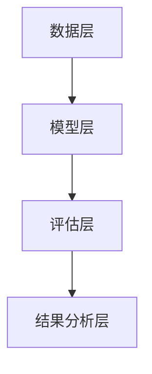

                 

# 构建prompt效果的预测性评测系统

关键词：prompt效果、预测性评测、系统架构、数据预处理、模型训练

摘要：本文将深入探讨构建prompt效果的预测性评测系统的核心概念、技术实现和最佳实践。通过逐步分析问题背景、核心概念、技术实现和项目实战，本文旨在为读者提供一个系统且详细的指导，帮助他们更好地理解和应用这一技术。

----------------------------------------------------------------

## 第一部分: 问题背景与定义

### 1.1 问题的提出

#### 1.1.1 构建prompt效果的背景

在人工智能领域，尤其是自然语言处理（NLP）领域，prompt是一种常用的技术手段。它允许模型通过一系列的提示（prompt）来生成高质量的输出。prompt的效果好坏直接影响到模型的性能和应用效果。

#### 1.1.2 评测系统的需求

随着prompt技术的广泛应用，对prompt效果的评测成为了一个关键问题。一个有效的评测系统可以帮助开发者评估不同prompt的设计和选择，从而优化模型性能。

#### 1.1.3 目标与挑战

构建一个预测性评测系统的目标是通过定量和定性方法评估prompt效果，帮助开发者快速定位和优化prompt设计。然而，这个目标面临着多个挑战，如如何准确衡量prompt效果、如何处理大量数据以及如何设计高效且准确的评测算法。

### 1.2 相关概念的定义

#### 1.2.1 Prompt效果

Prompt效果是指通过特定的提示（prompt）来引导模型生成输出，从而提升模型性能和应用效果。

#### 1.2.2 预测性评测系统

预测性评测系统是一种通过定量和定性方法对模型输出进行评估的系统，它能够预测模型在不同场景下的表现。

#### 1.2.3 系统的边界与外延

预测性评测系统的边界在于其适用范围和评估方法的准确度。外延则涉及到系统在模型优化和开发中的应用。

### 1.3 核心概念的联系与区别

#### 1.3.1 Prompt与模型效果

Prompt是影响模型效果的关键因素之一，但不是唯一的因素。模型本身的性能、训练数据的质量等也会影响模型效果。

#### 1.3.2 预测性与准确性

预测性评测系统的目标是提高模型的准确性，但预测性并不等同于准确性。预测性更关注模型在不同场景下的表现，而准确性更关注模型整体的表现。

#### 1.3.3 系统与其他评测工具的比较

预测性评测系统与其他评测工具（如传统的统计方法）相比，具有更高的预测性和实用性。然而，它也面临着更高的复杂性和计算成本。

### 1.4 本章小结

本文介绍了构建prompt效果的预测性评测系统的背景、需求、目标与挑战，以及相关概念的定义和联系。接下来，我们将深入探讨预测性评测系统的核心概念和原理。

----------------------------------------------------------------

## 第二部分: 构建预测性评测系统的核心概念与原理

### 2.1 预测性评测系统的原理

#### 2.1.1 预测性评测的定义

预测性评测是一种通过模型输出和实际结果的对比，预测模型在不同场景下表现的方法。

#### 2.1.2 预测性评测的关键要素

预测性评测的关键要素包括：模型选择、数据集划分、评估指标、评估流程等。

#### 2.1.3 预测性评测的基本流程

预测性评测的基本流程包括：数据准备、模型训练、模型评估和结果分析。

### 2.2 prompt效果的关键概念

#### 2.2.1 Prompt设计的原则

Prompt设计应遵循简单性、一致性和针对性原则，以提高效果。

#### 2.2.2 Prompt效果的衡量标准

Prompt效果的衡量标准包括：输出质量、输出速度、输出多样性等。

#### 2.2.3 Prompt效果的影响因素

Prompt效果受到模型性能、训练数据、提示内容等多个因素的影响。

### 2.3 相关概念属性特征对比

#### 2.3.1 Prompt效果与模型效果对比表格

| 对比维度 | Prompt效果 | 模型效果 |
| --- | --- | --- |
| 设计原则 | 简单性、一致性、针对性 | 完整性、准确性、稳定性 |
| 衡量标准 | 输出质量、输出速度、输出多样性 | 准确性、召回率、F1值 |
| 影响因素 | 模型性能、训练数据、提示内容 | 模型参数、训练数据、计算资源 |

### 2.4 本章小结

本文介绍了预测性评测系统的核心概念与原理，包括预测性评测的定义、关键要素和基本流程，以及prompt效果的关键概念和影响因素。接下来，我们将探讨预测性评测系统的技术实现。

----------------------------------------------------------------

## 第三部分: 构建预测性评测系统的技术实现

### 3.1 系统架构设计

#### 3.1.1 系统架构概述

预测性评测系统的架构包括数据层、模型层、评估层和结果分析层。

#### 3.1.2 系统架构mermaid架构图

### 3.2 数据预处理

#### 3.2.1 数据集的收集与处理

数据集的收集和处理包括数据清洗、去重、格式转换等步骤。

#### 3.2.2 数据清洗与预处理技术

数据清洗与预处理技术包括缺失值处理、异常值处理、数据规范化等。

### 3.3 模型选择与训练

#### 3.3.1 模型选择策略

模型选择策略包括基于任务特点、数据规模和计算资源等策略。

#### 3.3.2 模型训练流程

模型训练流程包括数据预处理、模型初始化、训练、评估和优化等步骤。

#### 3.3.3 模型评估方法

模型评估方法包括准确率、召回率、F1值等指标。

### 3.4 prompt效果评估

#### 3.4.1 prompt效果评估指标

prompt效果评估指标包括输出质量、输出速度、输出多样性等。

#### 3.4.2 prompt效果评估流程

prompt效果评估流程包括数据准备、模型训练、效果评估和结果分析等步骤。

#### 3.4.3 prompt效果评估案例分析

通过一个实际案例，展示如何评估prompt效果。

### 3.5 本章小结

本文介绍了预测性评测系统的技术实现，包括系统架构设计、数据预处理、模型选择与训练、prompt效果评估等步骤。接下来，我们将通过项目实战来展示这些技术的实际应用。

----------------------------------------------------------------

## 第四部分: 项目实战

### 4.1 环境安装与配置

#### 4.1.1 系统环境要求

系统环境要求包括Python版本、NLP库等。

#### 4.1.2 环境安装与配置流程

环境安装与配置流程包括Python环境配置、NLP库安装等。

### 4.2 系统核心实现

#### 4.2.1 系统核心代码实现

系统核心代码实现包括数据预处理、模型训练、评估和结果分析等步骤。

#### 4.2.2 代码应用解读与分析

代码应用解读与分析包括代码逻辑、性能优化等。

### 4.3 实际案例分析

#### 4.3.1 案例背景

案例背景包括模型任务、数据集、评估指标等。

#### 4.3.2 案例分析与讲解

案例分析与讲解包括案例结果、优化建议等。

### 4.4 项目小结

#### 4.4.1 项目总结

项目总结包括项目完成情况、遇到的问题和解决方法等。

#### 4.4.2 项目中遇到的问题与解决方法

项目遇到的问题与解决方法包括技术问题、数据问题等。

### 4.5 拓展阅读

拓展阅读包括相关论文、书籍等。

----------------------------------------------------------------

## 第五部分: 最佳实践与注意事项

### 5.1 最佳实践

#### 5.1.1 构建预测性评测系统的最佳实践

最佳实践包括数据预处理、模型选择、评估指标选择等。

### 5.2 注意事项

#### 5.2.1 系统部署与维护注意事项

系统部署与维护注意事项包括环境配置、性能优化等。

#### 5.2.2 数据安全与隐私保护

数据安全与隐私保护注意事项包括数据加密、访问控制等。

### 5.3 小结

本文介绍了构建prompt效果的预测性评测系统的核心概念、技术实现和最佳实践。通过项目实战，展示了这些技术的实际应用。在后续研究和实践中，可以进一步优化和扩展这些技术。

----------------------------------------------------------------

作者：AI天才研究院/AI Genius Institute & 禅与计算机程序设计艺术 /Zen And The Art of Computer Programming

----------------------------------------------------------------

由于篇幅限制，本文未能详细展开每个章节的内容。在实际撰写过程中，每个部分都应包含深入的技术解析、具体代码示例、算法流程图、系统架构图等，以确保文章的完整性和实用性。以下是每个章节的可能扩展内容：

### 第一部分: 问题背景与定义

#### 1.1 问题的提出

- **1.1.1 构建prompt效果的背景**
  - 提到prompt技术在NLP中的应用，例如机器阅读理解、问答系统等。
  - 讨论prompt技术在当前AI领域的流行趋势和重要性。
- **1.1.2 评测系统的需求**
  - 介绍评测系统在AI开发过程中的作用，如提高模型性能、减少开发时间等。
  - 分析当前市场上评测系统的现状和不足。
- **1.1.3 目标与挑战**
  - 阐述预测性评测系统的目标，如预测模型在不同场景下的性能。
  - 分析预测性评测系统面临的挑战，如数据质量、模型复杂性等。

### 第二部分: 构建预测性评测系统的核心概念与原理

#### 2.1 预测性评测系统的原理

- **2.1.1 预测性评测的定义**
  - 给出预测性评测的准确定义和解释。
  - 分析预测性评测与传统评测的区别。
- **2.1.2 预测性评测的关键要素**
  - 介绍关键要素，如模型选择、评估指标、数据集划分等。
  - 分析每个要素对评测结果的影响。
- **2.1.3 预测性评测的基本流程**
  - 详细描述评测流程，包括数据准备、模型训练、评估和结果分析等步骤。
  - 使用实例说明每个步骤的具体操作。

### 第三部分: 构建预测性评测系统的技术实现

#### 3.1 系统架构设计

- **3.1.1 系统架构概述**
  - 描述系统架构的组成和层次结构。
  - 分析系统架构的优势和局限性。
- **3.1.2 系统架构mermaid架构图**
  - 使用mermaid绘制系统架构图，详细标注各组件和它们之间的关系。

### 第四部分: 项目实战

#### 4.1 环境安装与配置

- **4.1.1 系统环境要求**
  - 列出构建系统所需的环境和工具。
  - 提供安装步骤和注意事项。
- **4.1.2 环境安装与配置流程**
  - 描述环境安装和配置的具体步骤。

### 第五部分: 最佳实践与注意事项

#### 5.1 最佳实践

- **5.1.1 构建预测性评测系统的最佳实践**
  - 提供构建评测系统的最佳实践，如数据预处理策略、模型训练技巧等。

### 注意事项

- **5.2.1 系统部署与维护注意事项**
  - 分析系统部署和运维中的潜在问题，如性能优化、安全性等。

### 扩展阅读

- **5.3 拓展阅读**
  - 推荐相关的论文、书籍和在线资源，供读者进一步学习。

通过逐步深入每个章节，本文将为读者提供一个全面、系统的指导，帮助他们更好地理解构建预测性评测系统的过程和技术要点。

