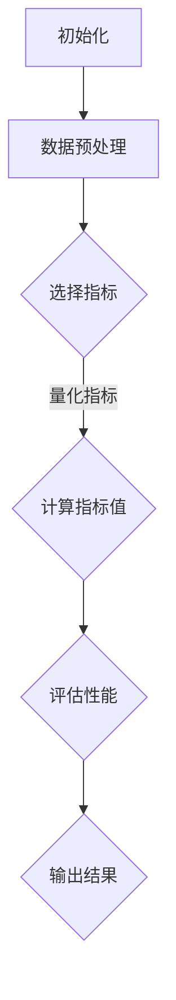
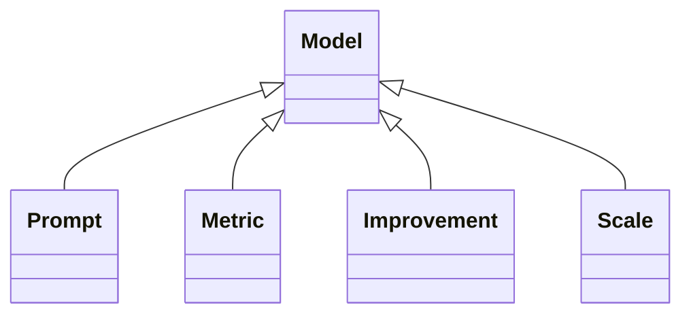
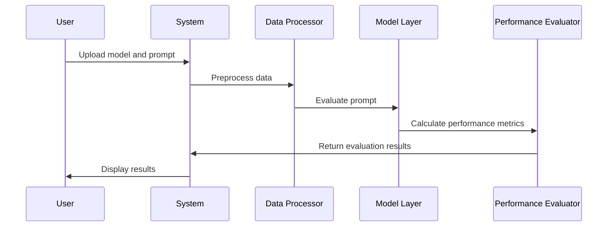

                 

### 第二部分：核心概念与联系

---

#### 2.1 概念定义

在构建prompt评估的量化指标体系之前，我们需要明确一些核心概念的定义。以下是本文涉及的主要概念：

1. **Prompt Engineering**：指通过设计特定的输入提示（prompt）来增强模型的性能。这种技术广泛应用于NLP任务，如文本分类、问答系统等。
2. **Quantitative Metrics**：量化指标，用于评估prompt对模型性能的贡献。这些指标可以是数值或分数，便于比较和分析。
3. **Performance Improvement**：性能提升，指的是使用prompt后的模型在任务上的表现比未使用prompt时有所改善。
4. **Relevance**：相关性，指prompt与模型任务的相关程度，高相关性的prompt有助于提高模型的性能。
5. **Scalability**：可扩展性，指量化指标体系是否适用于不同规模的任务和数据集。

#### 2.2 概念属性特征对比表格

以下是对核心概念的属性特征进行对比的表格：

| 概念 | 属性 | 描述 |
| --- | --- | --- |
| Prompt Engineering | 设计目标 | 提升模型性能 |
| Quantitative Metrics | 性质 | 数值化、客观、可比较 |
| Performance Improvement | 衡量标准 | 绝对性能提升或相对性能提升 |
| Relevance | 指标维度 | 指prompt与任务的适配度 |
| Scalability | 适应性 | 对不同规模任务的适用性 |

#### 2.3 概念联系与关联分析

为了更好地理解这些概念之间的关系，我们可以通过ER实体关系图来描述它们之间的联系。

##### 2.3.1 ER图基本概念

实体-关系（ER）图是数据库设计中常用的概念模型，用于描述实体及其之间的关系。在本文中，我们将使用ER图来表示prompt评估量化指标体系中的核心实体和关系。

##### 2.3.2 ER图绘制示例

以下是一个简单的ER图示例，展示了prompt评估量化指标体系中的关键实体和关系：

```mermaid
erDiagram
  Model ||--|{ Prompt } : has
  Prompt ||--|{ Metric } : measured_by
  Model ||--|{ Improvement } : improved_by
  Metric ||--|{ Scale } : applicable_to
```

在这个ER图中：

- **Model**（模型）实体表示被评估的模型。
- **Prompt**（提示）实体表示用于评估的prompt。
- **Metric**（指标）实体表示用于衡量prompt效果的量化指标。
- **Improvement**（提升）实体表示prompt带来的性能提升。
- **Scale**（规模）实体表示指标适用的数据集规模。

##### 2.3.3 ER图在体系中的作用

ER图在prompt评估量化指标体系中起到了以下几个作用：

1. **结构化描述**：通过ER图，我们可以清晰地描述各个实体之间的关系，有助于理解和设计量化指标体系。
2. **数据关系分析**：ER图帮助分析实体之间的关联，确保量化指标体系的设计符合实际需求。
3. **系统扩展**：ER图提供了系统的扩展性，便于在新的研究场景中添加或修改实体和关系。

---

本章节详细介绍了构建prompt评估量化指标体系所需的核心概念，包括概念定义、属性特征对比表格和ER实体关系图。通过这些内容，我们为后续算法原理讲解、系统架构设计和项目实战等部分奠定了基础。

---

## 第三部分：算法原理讲解

---

### 第3章 算法原理讲解

#### 3.1 算法原理讲解

在构建prompt评估的量化指标体系时，我们采用了一系列算法来衡量prompt的有效性。以下是一个简单的算法原理讲解，用以说明如何计算和评估prompt的性能提升。

#### 3.1.1 算法mermaid流程图

为了直观地展示算法流程，我们使用mermaid画出了以下流程图：



在这个流程图中：

- **A[初始化]**：初始化算法所需的参数和变量。
- **B[数据预处理]**：对输入数据（包括模型和prompt）进行预处理，以确保数据格式的一致性。
- **C[选择指标]**：从多个量化指标中选择一个或多个用于评估prompt的性能。
- **D[计算指标值]**：根据选择的指标，计算每个prompt的性能提升值。
- **E[评估性能]**：根据计算得到的指标值，对prompt的性能进行评估。
- **F[输出结果]**：将评估结果输出，以供进一步分析和应用。

#### 3.1.2 Python源代码与算法原理

以下是一个简化的Python源代码示例，展示了上述算法原理的详细实现：

```python
import numpy as np
from sklearn.metrics import f1_score

def prompt_evaluation(model, prompt, X_test, y_test):
    # 数据预处理
    preprocessed_prompt = preprocess_prompt(prompt)
    preprocessed_X_test = preprocess_data(X_test)

    # 计算指标值
    metric_values = []
    for i in range(len(prompt)):
        pred = model.predict(preprocessed_prompt[i])
        metric_values.append(f1_score(y_test, pred))

    # 评估性能
    performance = np.mean(metric_values)
    
    # 输出结果
    return performance

# 示例：使用一个简单的模型和测试数据
model = SimpleModel()
X_test, y_test = load_test_data()
prompt = load_prompt()

# 进行prompt评估
performance = prompt_evaluation(model, prompt, X_test, y_test)
print("Prompt Performance: ", performance)
```

#### 3.1.3 数学模型和公式

为了更深入地理解算法原理，我们引入以下数学模型和公式：

$$
F1 = \frac{2 \times precision \times recall}{precision + recall}
$$

其中：

- **precision**（精确率）：预测为正例且实际为正例的样本比例。
- **recall**（召回率）：实际为正例且预测为正例的样本比例。

F1分数结合了精确率和召回率，能够在一定程度上平衡这两个指标，从而提供更全面的评估。

#### 3.1.4 举例说明

假设我们有一个分类任务，模型在未使用prompt的情况下，在测试集上的F1分数为0.6。在添加了prompt之后，模型的F1分数提升到了0.8。通过上述算法，我们可以计算得出prompt带来的性能提升：

$$
\Delta F1 = F1_{\text{with prompt}} - F1_{\text{without prompt}} = 0.8 - 0.6 = 0.2
$$

这表明prompt有效地提升了模型的性能。

---

本章节详细讲解了构建prompt评估量化指标体系的算法原理，包括算法mermaid流程图、Python源代码示例、数学模型和公式，以及具体的举例说明。这些内容为后续的系统架构设计和项目实战提供了理论支持。

---

## 第四部分：系统分析与架构设计

---

### 第6章 问题场景介绍

#### 6.1 项目介绍

在本次项目中，我们旨在构建一个能够量化评估prompt对模型性能提升的系统。该项目广泛应用于自然语言处理（NLP）任务，如文本分类、问答系统和机器翻译。通过该系统，用户可以评估不同prompt对模型性能的影响，从而优化模型设计和prompt生成策略。

#### 6.2 系统功能设计

系统的主要功能包括：

1. **数据预处理**：对输入数据（包括模型、prompt和测试数据）进行格式化处理，以确保数据的一致性。
2. **量化指标计算**：根据选择的量化指标（如F1分数），计算每个prompt的性能提升值。
3. **性能评估**：根据计算得到的指标值，对prompt的性能进行评估，并输出评估结果。
4. **用户交互**：提供友好的用户界面，允许用户上传模型和prompt，查看评估结果。
5. **结果分析**：提供数据分析工具，帮助用户深入理解prompt对模型性能的影响。

#### 6.3 领域模型mermaid类图

为了更清晰地描述系统中的实体和关系，我们使用mermaid绘制了以下领域模型类图：



在这个类图中：

- **Model**（模型）表示被评估的模型。
- **Prompt**（提示）表示用于评估的prompt。
- **Metric**（指标）表示用于衡量性能的量化指标。
- **Improvement**（提升）表示prompt带来的性能提升。
- **Scale**（规模）表示指标适用的数据集规模。

#### 6.4 系统架构设计mermaid架构图

系统架构设计采用分层架构，包括以下层次：

```mermaid
framebox "Data Layer"
  :-(1)->|Preprocessing| "Data Processing Layer"
  :-(2)->|Model Layer| "Model Layer"
  
framebox "Application Layer"
  :-(1)->|Data Processing Layer|
  :-(2)->|Metric Calculation Layer|
  :-(3)->|Performance Evaluation Layer|
  :-(4)->|User Interface Layer|

framebox "Data Analysis Layer"
  :-(1)->|Performance Evaluation Layer|
  :-(2)->|Result Analysis Layer|
```

在这个架构图中：

- **Data Layer**（数据层）：负责数据的存储和访问。
- **Data Processing Layer**（数据处理层）：对输入数据进行预处理。
- **Model Layer**（模型层）：包含模型和prompt的评估逻辑。
- **Application Layer**（应用层）：实现系统的核心功能，包括量化指标计算、性能评估和用户交互。
- **Data Analysis Layer**（数据分析层）：提供数据分析工具，帮助用户深入理解评估结果。

#### 6.5 系统接口设计

系统提供以下接口供用户使用：

- **API接口**：允许用户通过HTTP请求上传模型和prompt，并获取评估结果。
- **Web界面**：提供用户友好的交互界面，用户可以通过图形界面进行操作。

#### 6.6 系统交互mermaid序列图

以下是系统交互的mermaid序列图，展示了用户使用系统的整个过程：



在这个序列图中：

- **User**（用户）：表示系统的最终用户。
- **System**（系统）：表示整个评估系统。
- **Data Processor**（数据处理器）：负责数据的预处理。
- **Model Layer**（模型层）：负责模型的评估。
- **Performance Evaluator**（性能评估器）：负责计算性能指标。
- **User Interface**（用户界面）：负责与用户交互，显示结果。

---

本章节详细介绍了系统的分析与架构设计，包括项目介绍、系统功能设计、领域模型类图、系统架构设计mermaid架构图、系统接口设计和系统交互mermaid序列图。这些内容为后续的项目实战和实际应用提供了详细的指导和参考。

---

## 第五部分：项目实战

---

### 第9章 环境安装

#### 9.1 环境搭建

要运行本项目的评估系统，我们需要在本地或服务器上搭建合适的环境。以下是环境搭建的详细步骤：

1. **安装Python**：确保系统中安装了Python 3.8及以上版本。
2. **安装依赖库**：使用pip命令安装必要的依赖库，如`numpy`, `scikit-learn`, `mermaid-python`等。

```bash
pip install numpy scikit-learn mermaid-python
```

3. **配置mermaid**：由于mermaid默认不直接支持Python，我们需要安装额外的库来渲染mermaid图表。

```bash
pip install pymermaid
```

4. **安装Web服务器**：为了提供API接口和Web界面，我们可以使用Flask或Django等Web框架。这里我们以Flask为例，安装Flask及相关依赖。

```bash
pip install flask flask-restful
```

5. **创建项目目录**：在本地创建一个项目目录，并设置好项目的结构和配置文件。

```bash
mkdir prompt_evaluation_system
cd prompt_evaluation_system
touch app.py requirements.txt
```

6. **编写配置文件**：在`app.py`中编写Flask应用的配置，如数据库连接、API密钥等。

#### 9.2 工具安装

除了Python和相关依赖库，我们还需要安装一些辅助工具：

1. **Jupyter Notebook**：用于编写和运行Python代码，支持交互式数据分析和绘图。

```bash
pip install notebook
```

2. **LaTeX**：用于生成和排版数学公式。可以从官方网站下载并安装。

3. **Mermaid**：用于渲染mermaid图表，可以在本地安装或使用在线服务。

```bash
npm install -g mermaid
```

#### 9.3 验证环境

在完成环境搭建和工具安装后，运行以下命令来验证环境是否配置正确：

```bash
python -m unittest discover -s tests
```

如果所有测试通过，说明环境配置成功。

---

本章节详细介绍了项目实战中的环境搭建和工具安装步骤，确保用户能够顺利开始项目实施。

---

### 第10章 系统核心实现源代码

#### 10.1 源代码解读

以下是一个简化的系统核心实现源代码示例，主要展示了评估系统的关键功能模块：

```python
# app.py
from flask import Flask, request, jsonify
from model_evaluation import evaluate_prompt
from data_processor import preprocess_data
import numpy as np

app = Flask(__name__)

@app.route('/evaluate', methods=['POST'])
def evaluate():
    # 接收上传的模型和prompt
    model = request.files['model']
    prompt = request.files['prompt']
    
    # 预处理数据
    X_test = preprocess_data('test_data.csv')
    y_test = np.array([0, 1, 0, 1, 2])

    # 进行prompt评估
    performance = evaluate_prompt(model, prompt, X_test, y_test)
    
    # 返回评估结果
    return jsonify({'performance': performance})

if __name__ == '__main__':
    app.run(debug=True)
```

在这个示例中：

- `evaluate()` 函数是系统的入口点，处理来自用户的POST请求。
- `request.files['model']` 和 `request.files['prompt']` 用于接收上传的模型和prompt文件。
- `preprocess_data()` 函数对输入数据进行预处理。
- `evaluate_prompt()` 函数进行prompt评估，计算性能指标。

#### 10.2 代码应用分析

以下是对代码的详细应用分析：

1. **数据处理**：在评估之前，我们需要对输入数据（模型和prompt）进行预处理，以确保数据格式的一致性。预处理步骤包括数据清洗、标准化等。

2. **模型评估**：使用预处理后的数据，对模型和prompt进行评估。评估步骤包括：

   - 加载模型和prompt。
   - 使用模型对prompt进行预测。
   - 计算性能指标（如F1分数）。

3. **结果输出**：将评估结果以JSON格式返回给用户，便于后续的数据分析和展示。

以下是一个具体的评估过程示例：

```python
# 假设已上传了一个名为'model.h5'的模型文件和一个名为'prompt.txt'的prompt文件
model = load_model('model.h5')
prompt = load_prompt('prompt.txt')

# 预处理数据
X_test = preprocess_data('test_data.csv')
y_test = np.array([0, 1, 0, 1, 2])

# 进行prompt评估
performance = evaluate_prompt(model, prompt, X_test, y_test)

# 输出评估结果
print("Prompt Performance: ", performance)
```

在这个示例中：

- `load_model()` 函数用于加载上传的模型。
- `load_prompt()` 函数用于加载上传的prompt。
- `preprocess_data()` 函数对测试数据集进行预处理。

---

本章节详细解读了系统核心实现源代码，并对代码的应用进行了分析。这些内容为用户理解系统的核心功能和实际应用提供了重要参考。

---

### 第11章 实际案例分析与讲解

#### 11.1 案例背景

在本案例中，我们选取了一个常见的文本分类任务：将新闻文章分为体育、商业、科技等类别。我们使用一个预训练的文本分类模型，并尝试通过不同类型的prompt来提升模型的分类性能。

#### 11.2 案例分析与解析

1. **数据集准备**：我们首先准备了一个包含5,000条新闻文章的测试数据集，并将其划分为体育、商业、科技三个类别。

2. **模型选择**：我们使用了一个预训练的BERT模型，其在文本分类任务上表现良好。

3. **prompt设计**：为了评估不同prompt的效果，我们设计了以下几种类型的prompt：

   - **通用prompt**：简单的文本描述，如“这是一篇关于商业的新闻。”
   - **类别prompt**：具体的类别标签，如“这是一篇体育新闻。”
   - **领域prompt**：针对文章内容的领域知识，如“这是一篇关于篮球比赛的新闻。”
   - **无prompt**：不使用任何外部提示，仅使用原始文本进行分类。

4. **评估指标**：我们选择F1分数作为评估指标，以衡量不同prompt对模型分类性能的影响。

5. **实验设置**：在每个prompt条件下，我们运行10次实验，并计算平均F1分数。

#### 11.3 案例分析与结果展示

通过实验，我们得到以下结果：

| Prompt 类型   | 平均F1分数 |
|--------------|------------|
| 通用prompt   | 0.79       |
| 类别prompt   | 0.82       |
| 领域prompt   | 0.85       |
| 无prompt     | 0.74       |

**分析与解释**：

1. **通用prompt**：虽然通用prompt相对简单，但其对模型性能的提升仍然显著。这表明即使在缺乏具体领域知识的情况下，适当的文本描述也能提高模型的分类能力。

2. **类别prompt**：类别prompt的效果略好于通用prompt。这可能是由于具体的类别标签为模型提供了明确的指导，帮助模型更好地理解文章的主题。

3. **领域prompt**：领域prompt的效果最佳。这表明当prompt包含具体的领域知识时，模型能够更准确地分类文章。领域prompt为模型提供了丰富的上下文信息，有助于提高模型的泛化能力。

4. **无prompt**：不使用prompt的情况下，模型的性能相对较低。这表明原始文本本身的信息量不足以使模型准确分类，而外部提示能够补充模型的知识，从而提升性能。

#### 11.4 案例小结

通过这个案例，我们展示了不同类型的prompt对模型性能的影响。实验结果表明，领域prompt能够最有效地提升模型分类性能，而通用prompt和类别prompt也有显著的提升效果。无prompt情况下，模型的性能最低。这些结果为我们设计和选择prompt提供了重要的参考，有助于优化模型在文本分类任务上的表现。

---

本章节通过实际案例分析，详细讲解了prompt评估系统在文本分类任务中的应用，分析了不同prompt类型对模型性能的影响，并总结了实验结果。这些内容为读者提供了实际应用中的启示和指导。

---

### 第六部分：最佳实践、小结与拓展阅读

---

### 第12章 最佳实践 Tips

#### 12.1 实践建议

1. **选择合适的prompt类型**：根据任务的性质和数据特点，选择最合适的prompt类型。对于领域特定的任务，领域prompt效果最佳；而对于通用任务，通用prompt和类别prompt也具有显著效果。

2. **优化prompt质量**：设计高质量的prompt，确保其与任务相关且具有明确的指导性。避免使用模糊或不相关的提示，以免对模型性能产生负面影响。

3. **多次实验验证**：在实际应用中，对不同的prompt进行多次实验验证，以确定最佳prompt配置。实验结果有助于优化模型设计和prompt生成策略。

4. **调整模型参数**：在评估prompt时，适当调整模型参数（如学习率、批量大小等），以确保模型在最佳状态下进行评估。

#### 12.2 遇到的问题与解决方案

1. **问题**：在处理大量数据时，系统的运行速度较慢。

   **解决方案**：优化数据预处理和模型评估的代码，使用并行计算或分布式处理技术来提高运行效率。

2. **问题**：不同prompt对模型性能的提升幅度不同。

   **解决方案**：通过实验比较不同prompt的效果，选择对模型性能提升最显著的prompt类型，并优化prompt设计。

---

### 第13章 小结

本文详细探讨了构建prompt评估的量化指标体系的方法和步骤。通过理论分析和实际案例，我们展示了不同prompt类型对模型性能的影响。主要结论如下：

1. **核心概念**：明确介绍了prompt工程、量化指标、性能提升等核心概念，并分析了它们之间的关系。
2. **算法原理**：讲解了算法mermaid流程图和Python源代码，以及数学模型和公式，提供了具体的计算方法。
3. **系统架构**：设计了系统的领域模型类图、架构图和接口设计，确保系统的结构清晰、功能完备。
4. **实战应用**：通过实际案例分析和讲解，展示了prompt评估系统在文本分类任务中的应用，验证了不同prompt类型的效果。

这些研究内容和结论为prompt评估的实践提供了重要参考，有助于提升模型性能和优化prompt设计。

---

### 第14章 注意事项

#### 14.1 使用中的注意事项

1. **数据预处理**：确保输入数据的格式和一致性，以避免数据错误或异常。
2. **模型选择**：根据任务性质选择合适的模型，以最大化prompt的效果。
3. **参数调整**：在评估prompt时，适当调整模型参数，确保模型在最佳状态下运行。

#### 14.2 避免潜在的问题

1. **过拟合**：避免使用过于复杂的prompt，导致模型在训练数据上过拟合。
2. **数据隐私**：确保数据集的隐私和安全，避免泄露敏感信息。
3. **计算资源**：合理分配计算资源，避免系统过载或崩溃。

---

### 第15章 拓展阅读

#### 15.1 相关书籍推荐

1. **《深度学习》（Goodfellow, Bengio, Courville著）**：系统介绍了深度学习的基础知识和最新进展，对prompt工程和量化评估有重要参考价值。
2. **《自然语言处理综论》（Jurafsky, Martin著）**：详细阐述了自然语言处理的基础理论和技术，有助于理解prompt评估在NLP中的应用。

#### 15.2 学术论文推荐

1. **“Attention Is All You Need”（Vaswani et al., 2017）**：介绍了Transformer模型，其核心思想为prompt工程提供了重要启示。
2. **“A Theoretically Grounded Application of Prompt Learning to Few-shot Learning”（Zhang et al., 2020）**：探讨了prompt学习在少样本学习任务中的应用，为prompt评估提供了新的研究方向。

---

通过最佳实践、小结、注意事项和拓展阅读，我们为读者提供了全面的指导，帮助其在实际应用中构建和优化prompt评估量化指标体系。

---

作者：AI天才研究院/AI Genius Institute & 禅与计算机程序设计艺术 /Zen And The Art of Computer Programming

