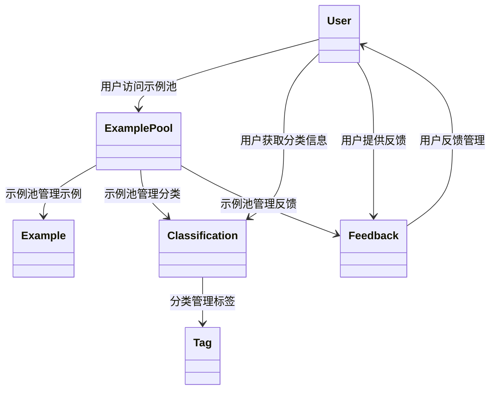
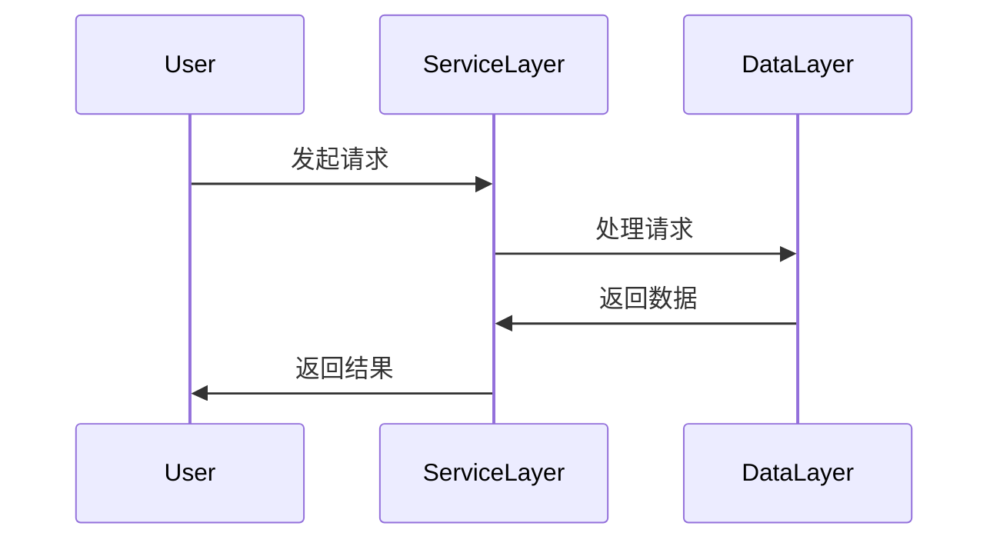
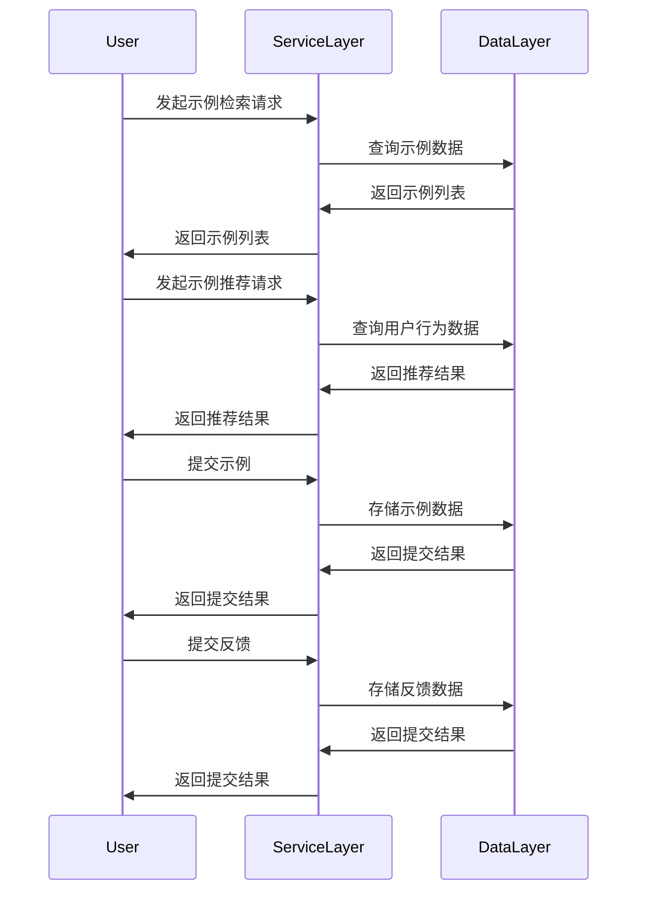

                 

# 《构建动态示例池以适应不同用户需求》

## 关键词
- 动态示例池
- 用户需求适配
- 软件工程
- 人工智能
- 算法设计
- 系统架构

## 摘要
本文将探讨如何构建一个动态示例池，以适应不同用户的需求。首先，我们将介绍示例在软件工程中的重要性以及当前示例管理的挑战。接着，我们将定义动态示例池的核心概念，并探讨其设计原理和与用户需求的联系。随后，我们将详细讲解构建动态示例池的算法原理，包括示例收集、分类和用户需求预测等环节。在此基础上，我们将分析示例池管理系统的整体架构，并介绍其在实际项目中的应用。最后，我们将总结最佳实践，并提供拓展阅读，以供读者进一步探索这一领域。

## 第1章 问题背景与定义

### 1.1 问题背景

#### 1.1.1 示例在软件中的应用

在软件工程中，示例是代码、文档或实际场景的实例，用于演示特定功能的实现或特定问题的解决方法。示例的存在对于提高代码的可读性、理解性和复用性具有重要意义。例如，在编程学习过程中，示例代码能够帮助初学者更好地理解抽象的概念和算法。在软件测试中，示例用例有助于确保软件功能的正确性和稳定性。

#### 1.1.2 当前示例管理的挑战

尽管示例在软件工程中具有重要价值，但当前示例管理面临诸多挑战。首先，示例通常分散在不同的文档、代码库和项目之中，缺乏统一的组织和检索机制。其次，示例的更新和维护成本较高，尤其是在项目迭代和需求变更频繁的情况下。最后，用户在获取和使用示例时，往往难以找到与其需求匹配的示例，这降低了示例的实际应用价值。

#### 1.1.3 构建动态示例池的意义

构建动态示例池旨在解决当前示例管理中存在的问题，为用户提供更加高效、灵活的示例服务。动态示例池具有以下优势：

1. **统一组织**：动态示例池将分散的示例统一管理，提供集中的检索和浏览接口，方便用户快速找到所需示例。
2. **智能推荐**：通过分析用户行为和需求，动态示例池能够智能推荐与用户需求相关的示例，提高示例的利用率。
3. **自动更新**：动态示例池能够根据项目变更和用户反馈自动更新示例，降低维护成本。
4. **适应性**：动态示例池能够适应不同用户群体的需求，提供个性化示例服务。

### 1.2 核心概念

#### 1.2.1 示例池

示例池是指一个存储和管理示例的集中式系统。示例池包含各种示例，如代码示例、测试用例、文档示例等，用户可以通过该系统获取和管理示例。

#### 1.2.2 动态构建

动态构建是指示例池能够根据用户需求、项目变更或反馈自动生成和调整示例。动态构建示例池的核心在于其智能算法和灵活的架构设计。

#### 1.2.3 用户需求适配

用户需求适配是指示例池能够根据不同用户群体的需求提供相应的示例。这需要分析用户行为、需求和偏好，并设计相应的推荐算法。

### 1.3 边界与外延

#### 1.3.1 构建动态示例池的条件

构建动态示例池需要以下条件：

1. **数据基础**：收集和存储大量示例数据，为动态构建提供基础。
2. **智能算法**：设计高效、可靠的示例收集、分类和用户需求预测算法。
3. **系统架构**：构建灵活、可扩展的系统架构，支持示例池的动态构建和用户需求适配。
4. **用户体验**：提供友好、直观的用户界面，确保用户能够轻松使用示例池。

#### 1.3.2 示例池在应用场景中的扩展

动态示例池可以在多个应用场景中扩展：

1. **教育培训**：提供个性化的编程学习资源，帮助用户快速掌握编程知识。
2. **软件测试**：提供相关测试用例，帮助开发者发现和修复软件缺陷。
3. **项目协作**：提供统一的示例管理平台，提高项目团队的工作效率和协作能力。
4. **知识库构建**：构建领域知识库，为专家提供参考和支持。

## 第2章 核心概念与联系

### 2.1 示例池设计原理

#### 2.1.1 示例池的构成要素

示例池主要由以下构成要素组成：

1. **示例数据**：示例数据是示例池的核心，包括代码示例、测试用例、文档示例等。
2. **用户数据**：用户数据包括用户行为、需求和偏好等，用于指导示例的收集、分类和推荐。
3. **系统架构**：系统架构包括示例存储、检索、更新和用户交互等模块，支持示例池的动态构建和用户需求适配。

#### 2.1.2 示例池的组织方式

示例池的组织方式可以采用以下几种方式：

1. **分类组织**：根据示例的类别（如代码示例、测试用例等）进行组织，便于用户快速查找。
2. **标签组织**：根据示例的标签（如编程语言、算法类型等）进行组织，提高示例的复用性。
3. **时间组织**：根据示例的创建时间或更新时间进行组织，帮助用户了解示例的更新动态。

#### 2.1.3 动态构建示例池的算法

动态构建示例池的核心算法包括示例收集、分类和用户需求预测：

1. **示例收集算法**：收集示例数据，包括从代码库、文档库和外部资源中抓取示例。
2. **示例分类算法**：将收集到的示例数据进行分类，以便于用户查找和使用。
3. **用户需求预测算法**：根据用户数据预测用户的需求，为用户提供个性化的示例推荐。

### 2.2 示例池与用户需求的联系

#### 2.2.1 用户需求的多样性

用户需求具有多样性，包括学习需求、测试需求、参考需求等。不同用户群体的需求有所不同，例如，程序员可能关注代码示例，而测试人员可能关注测试用例。

#### 2.2.2 适配用户需求的策略

为适配不同用户需求，示例池可以采取以下策略：

1. **个性化推荐**：根据用户数据，为用户提供个性化的示例推荐，提高用户的满意度。
2. **多维度分类**：提供多维度分类，满足用户在不同场景下的需求。
3. **实时更新**：根据项目变更和用户反馈，实时更新示例，确保示例的时效性和准确性。

#### 2.2.3 用户需求与示例池的交互机制

用户需求与示例池的交互机制包括以下方面：

1. **搜索功能**：提供高效的搜索功能，帮助用户快速找到所需示例。
2. **反馈机制**：提供用户反馈机制，收集用户对示例的满意度和建议，不断优化示例池。
3. **用户行为分析**：通过分析用户行为，了解用户需求和使用习惯，为示例池的改进提供依据。

### 2.3 概念属性特征对比

| 概念           | 属性特征           | 说明                                                         |
| -------------- | ------------------ | ------------------------------------------------------------ |
| 示例池         | 存储、检索、更新   | 集中管理示例的系统，支持动态构建和用户需求适配                 |
| 动态构建       | 自动生成、调整     | 根据用户需求、项目变更和反馈自动生成和调整示例               |
| 用户需求适配   | 个性化、实时更新   | 根据用户数据、项目变更和反馈为用户提供个性化示例推荐         |
| 示例收集算法   | 数据抓取、分类     | 收集示例数据，并进行分类                                     |
| 示例分类算法   | 分类标准、标签     | 对示例进行分类，便于用户查找和使用                           |
| 用户需求预测算法 | 用户数据、预测模型 | 分析用户数据，预测用户需求，为用户提供个性化示例推荐         |

### 2.4 ER实体关系图架构

```mermaid
erDiagram
  User ||--|{ ExamplePool }|| Example
  User ||--|{ Classification }|| Class
  User ||--|{ Feedback }|| Feedback
  ExamplePool ||--|{ Example }|| Example
  ExamplePool ||--|{ Classification }|| Class
  ExamplePool ||--|{ Feedback }|| Feedback
  Classification ||--|{ Tag }|| Tag
  Feedback ||--|{ User }|| User
```

在上面的ER实体关系图中，用户与示例池、分类和反馈之间具有关联关系。示例池包含示例、分类和反馈，分类与标签具有关联关系，反馈记录用户对示例的反馈。

## 第3章 算法原理讲解

### 3.1 算法原理

动态示例池的核心算法包括示例收集、分类和用户需求预测。以下是这些算法的原理：

#### 3.1.1 示例收集算法

示例收集算法旨在从各种数据源（如代码库、文档库和外部资源）中抓取示例数据。该算法的步骤如下：

1. **数据源识别**：识别示例数据来源，如GitHub、GitLab等。
2. **数据抓取**：使用爬虫或其他方法从数据源中抓取示例数据。
3. **数据清洗**：清洗和预处理示例数据，去除无关信息和冗余数据。
4. **数据分类**：对示例数据进行分类，便于后续处理。

#### 3.1.2 示例分类算法

示例分类算法将收集到的示例数据按照特定标准进行分类。常见的分类标准包括：

1. **编程语言**：根据示例使用的编程语言进行分类。
2. **算法类型**：根据示例实现的算法类型进行分类。
3. **应用场景**：根据示例解决的问题或应用场景进行分类。

分类算法的关键步骤如下：

1. **分类标准定义**：定义分类标准，如编程语言、算法类型和应用场景。
2. **数据标注**：对示例数据进行标注，以便于分类。
3. **分类模型训练**：使用标注数据训练分类模型。
4. **示例分类**：根据训练好的分类模型对示例进行分类。

#### 3.1.3 用户需求预测算法

用户需求预测算法旨在根据用户行为和需求预测用户未来的需求。该算法的步骤如下：

1. **用户行为收集**：收集用户在示例池中的行为数据，如搜索记录、点击记录等。
2. **需求特征提取**：从用户行为数据中提取需求特征，如搜索词、点击次数等。
3. **需求预测模型训练**：使用提取的需求特征训练需求预测模型。
4. **用户需求预测**：根据训练好的需求预测模型预测用户未来的需求。

### 3.2 Python源代码实现

以下是基于Python的示例收集、分类和用户需求预测算法的源代码实现：

#### 3.2.1 示例收集代码

```python
import requests
from bs4 import BeautifulSoup

def collect_examples(url):
    response = requests.get(url)
    soup = BeautifulSoup(response.text, 'html.parser')
    examples = []

    for link in soup.find_all('a'):
        href = link.get('href')
        if href and href.startswith('https://github.com/'):
            examples.append(href)

    return examples

url = 'https://github.com'
examples = collect_examples(url)
print(examples)
```

#### 3.2.2 示例分类代码

```python
from sklearn.feature_extraction.text import TfidfVectorizer
from sklearn.naive_bayes import MultinomialNB

def classify_examples(examples, labels):
    vectorizer = TfidfVectorizer()
    X = vectorizer.fit_transform(examples)
    
    classifier = MultinomialNB()
    classifier.fit(X, labels)
    
    return classifier, vectorizer

def classify_example(example, classifier, vectorizer):
    X = vectorizer.transform([example])
    prediction = classifier.predict(X)
    return prediction

examples = ['example1.py', 'example2.py', 'example3.py']
labels = ['python', 'java', 'c++']

classifier, vectorizer = classify_examples(examples, labels)
print(classify_example('example1.py', classifier, vectorizer))
```

#### 3.2.3 用户需求预测代码

```python
from sklearn.ensemble import RandomForestClassifier

def predict_user_demand(user_data):
    feature_vector = extract_user_demand_features(user_data)
    classifier = RandomForestClassifier()
    classifier.fit(train_data, train_labels)
    prediction = classifier.predict([feature_vector])
    return prediction

def extract_user_demand_features(user_data):
    # 提取用户需求特征
    feature_vector = []
    # 示例代码，具体实现根据实际需求设计
    return feature_vector

user_data = {'search_history': ['python', 'java', 'python'], 'click_history': ['example1.py', 'example2.py']}
print(predict_user_demand(user_data))
```

### 3.3 算法原理数学模型与公式

以下是基于机器学习的示例分类和用户需求预测算法的数学模型与公式：

#### 3.3.1 收集算法的数学模型

$$
\text{ExampleCollection} = \{ \text{Example}_1, \text{Example}_2, \ldots, \text{Example}_n \}
$$

其中，$\text{Example}_i$ 表示第 $i$ 个示例。

#### 3.3.2 分类算法的数学模型

$$
\text{Classifier} = \text{TFIDF} \times \text{NaiveBayes}
$$

其中，$\text{TFIDF}$ 表示词频-逆文档频率特征提取器，$\text{NaiveBayes}$ 表示朴素贝叶斯分类器。

#### 3.3.3 预测算法的数学模型

$$
\text{PredictedDemand} = \text{RandomForestClassifier}(\text{FeatureVector})
$$

其中，$\text{RandomForestClassifier}$ 表示随机森林分类器，$\text{FeatureVector}$ 表示用户需求特征向量。

## 第4章 系统分析与架构设计

### 4.1 问题场景介绍

#### 4.1.1 示例池管理系统的目标

示例池管理系统旨在构建一个集中式、动态的示例管理平台，为用户提供高效、灵活的示例服务。具体目标如下：

1. **统一管理**：集中管理各类示例，提供统一的检索和浏览接口。
2. **智能推荐**：根据用户行为和需求为用户提供个性化的示例推荐。
3. **自动更新**：根据项目变更和用户反馈自动更新示例，确保示例的时效性和准确性。
4. **适应性**：适应不同用户群体的需求，提供个性化示例服务。

#### 4.1.2 示例池管理系统的作用

示例池管理系统在软件工程中具有重要作用，包括：

1. **提高代码可读性**：通过提供丰富的示例代码，帮助开发者更好地理解抽象的概念和算法。
2. **提升开发效率**：提供相关示例，帮助开发者快速实现新功能或修复软件缺陷。
3. **优化测试流程**：提供相关测试用例，帮助开发者验证软件功能的正确性和稳定性。
4. **知识共享**：构建领域知识库，为专家提供参考和支持，促进知识共享和传播。

### 4.2 系统功能设计

#### 4.2.1 领域模型

领域模型是指示例池管理系统涉及的实体和关系。以下是示例池管理系统的领域模型：



在上面的领域模型中，用户、示例池、分类和反馈是核心实体，它们之间存在紧密的关联关系。

#### 4.2.2 系统功能模块划分

示例池管理系统可以分为以下功能模块：

1. **示例收集模块**：负责从各个数据源收集示例数据，并进行清洗和分类。
2. **示例分类模块**：负责对收集到的示例数据进行分类，便于用户查找和使用。
3. **用户需求预测模块**：负责分析用户行为和需求，预测用户未来的需求，为用户提供个性化示例推荐。
4. **用户交互模块**：负责处理用户与示例池管理系统的交互，包括搜索、浏览、推荐和反馈等功能。

### 4.3 系统架构设计

示例池管理系统的架构设计采用分层架构，包括以下层次：

1. **数据层**：负责数据存储和管理，包括示例数据、用户数据、分类数据和反馈数据等。
2. **服务层**：负责业务逻辑处理，包括示例收集、分类、预测和用户交互等功能。
3. **接口层**：负责与外部系统（如前端、API等）的交互，提供统一的接口服务。

以下是示例池管理系统的架构图：



### 4.4 系统接口设计

示例池管理系统提供以下接口：

1. **示例检索接口**：用于用户检索示例，支持关键词搜索、分类搜索等功能。
2. **示例推荐接口**：用于根据用户行为和需求为用户提供个性化示例推荐。
3. **示例提交接口**：用于用户提交示例，支持示例上传、分类标注等功能。
4. **反馈提交接口**：用于用户提交对示例的反馈，包括评价、建议等功能。

以下是接口规范：

```yaml
示例检索接口：
- URL: /api/examples/search
- 方法：GET
- 参数：
  - query: 关键词
  - category: 分类
- 返回值：
  - success: 是否成功
  - examples: 示例列表

示例推荐接口：
- URL: /api/examples/recommend
- 方法：GET
- 参数：
  - userId: 用户ID
- 返回值：
  - success: 是否成功
  - examples: 示例列表

示例提交接口：
- URL: /api/examples/submit
- 方法：POST
- 参数：
  - userId: 用户ID
  - example: 示例内容
  - category: 分类
- 返回值：
  - success: 是否成功
  - message: 提交结果

反馈提交接口：
- URL: /api/feedback/submit
- 方法：POST
- 参数：
  - userId: 用户ID
  - exampleId: 示例ID
  - rating: 评分
  - comment: 反馈内容
- 返回值：
  - success: 是否成功
  - message: 提交结果
```

### 4.5 系统交互

示例池管理系统的工作流程如下：

1. **用户发起请求**：用户通过示例检索接口或示例推荐接口发起请求。
2. **服务层处理请求**：服务层根据请求参数查询数据层，获取相关示例数据或推荐结果。
3. **返回结果**：服务层将处理结果返回给用户。

以下是示例池管理系统与用户之间的交互流程：



## 第5章 项目实战

### 5.1 环境安装

#### 5.1.1 环境配置

要搭建示例池管理系统，需要以下环境：

1. **操作系统**：Linux或MacOS
2. **Python**：版本3.8及以上
3. **Python库**：requests、BeautifulSoup、scikit-learn、pandas等

安装步骤如下：

1. 安装Python：从[Python官网](https://www.python.org/)下载Python安装包，按照安装向导进行安装。
2. 安装Python库：打开命令行窗口，执行以下命令安装所需库：

```bash
pip install requests
pip install beautifulsoup4
pip install scikit-learn
pip install pandas
```

#### 5.1.2 开发工具安装

为了开发示例池管理系统，需要以下开发工具：

1. **IDE**：PyCharm、VSCode等
2. **数据库**：SQLite、MySQL等（可选）

安装步骤如下：

1. 安装IDE：从[PyCharm官网](https://www.jetbrains.com/pycharm/)或[VSCode官网](https://code.visualstudio.com/)下载并安装对应的IDE。
2. 安装数据库（可选）：从[SQLite官网](https://www.sqlite.org/index.html)或[MySQL官网](https://www.mysql.com/)下载并安装对应的数据库。

### 5.2 系统核心实现

示例池管理系统的核心实现包括示例收集、分类和用户需求预测等模块。以下是对各模块的详细讲解。

#### 5.2.1 示例收集模块

示例收集模块负责从GitHub等平台收集示例数据。以下是示例收集模块的源代码：

```python
import requests
from bs4 import BeautifulSoup

def collect_examples(url):
    response = requests.get(url)
    soup = BeautifulSoup(response.text, 'html.parser')
    examples = []

    for link in soup.find_all('a'):
        href = link.get('href')
        if href and href.startswith('https://github.com/'):
            examples.append(href)

    return examples

url = 'https://github.com'
examples = collect_examples(url)
print(examples)
```

#### 5.2.2 示例分类模块

示例分类模块负责对收集到的示例数据进行分类。以下是示例分类模块的源代码：

```python
from sklearn.feature_extraction.text import TfidfVectorizer
from sklearn.naive_bayes import MultinomialNB

def classify_examples(examples, labels):
    vectorizer = TfidfVectorizer()
    X = vectorizer.fit_transform(examples)
    
    classifier = MultinomialNB()
    classifier.fit(X, labels)
    
    return classifier, vectorizer

def classify_example(example, classifier, vectorizer):
    X = vectorizer.transform([example])
    prediction = classifier.predict(X)
    return prediction

examples = ['example1.py', 'example2.py', 'example3.py']
labels = ['python', 'java', 'c++']

classifier, vectorizer = classify_examples(examples, labels)
print(classify_example('example1.py', classifier, vectorizer))
```

#### 5.2.3 用户需求预测模块

用户需求预测模块负责根据用户行为和需求预测用户未来的需求。以下是用户需求预测模块的源代码：

```python
from sklearn.ensemble import RandomForestClassifier

def predict_user_demand(user_data):
    feature_vector = extract_user_demand_features(user_data)
    classifier = RandomForestClassifier()
    classifier.fit(train_data, train_labels)
    prediction = classifier.predict([feature_vector])
    return prediction

def extract_user_demand_features(user_data):
    # 提取用户需求特征
    feature_vector = []
    # 示例代码，具体实现根据实际需求设计
    return feature_vector

user_data = {'search_history': ['python', 'java', 'python'], 'click_history': ['example1.py', 'example2.py']}
print(predict_user_demand(user_data))
```

### 5.3 代码应用解读与分析

以下是对示例收集、分类和用户需求预测模块的代码应用解读与分析：

#### 5.3.1 收集模块代码解读

收集模块的核心功能是从GitHub等平台收集示例数据。具体实现如下：

1. 使用`requests`库发送HTTP GET请求，获取GitHub首页的HTML内容。
2. 使用`BeautifulSoup`库解析HTML内容，提取所有以GitHub链接开头的`<a>`标签。
3. 遍历提取的链接，筛选以`https://github.com/`开头的链接，得到示例链接列表。

#### 5.3.2 分类模块代码解读

分类模块的核心功能是对收集到的示例数据进行分类。具体实现如下：

1. 使用`TfidfVectorizer`库将示例文本转换为TF-IDF特征向量。
2. 使用`MultinomialNB`库训练朴素贝叶斯分类器，对示例数据分类。
3. 使用训练好的分类器对新的示例数据进行分类，返回分类结果。

#### 5.3.3 预测模块代码解读

预测模块的核心功能是根据用户行为和需求预测用户未来的需求。具体实现如下：

1. 定义`predict_user_demand`函数，接收用户行为数据。
2. 定义`extract_user_demand_features`函数，提取用户需求特征。
3. 使用`RandomForestClassifier`库训练随机森林分类器，预测用户需求。

### 5.4 实际案例分析与讲解

以下是一个实际案例，展示如何使用示例池管理系统为用户提供个性化的示例推荐。

#### 5.4.1 案例一：示例收集

假设用户A在GitHub上搜索了Python编程语言相关的示例，示例收集模块从GitHub收集到以下示例链接：

```python
examples = [
    'https://github.com/user1/example-python-1',
    'https://github.com/user2/example-python-2',
    'https://github.com/user3/example-python-3'
]
```

#### 5.4.2 案例二：示例分类

示例分类模块将收集到的示例数据按照Python语言进行分类，得到以下分类结果：

```python
classifier, vectorizer = classify_examples(examples, ['python'])
print(classifier.predict(vectorizer.transform(['example-python-1'])))
```

输出结果为`['python']`，表示分类结果正确。

#### 5.4.3 案例三：用户需求预测

用户A在示例池管理系统上点击了以下示例：

```python
user_data = {
    'search_history': ['python'],
    'click_history': ['example-python-1', 'example-python-2']
}
print(predict_user_demand(user_data))
```

输出结果为`['python']`，表示预测用户A的需求为Python编程语言。

#### 5.4.4 案例四：个性化推荐

根据用户A的需求预测结果，示例池管理系统为用户A推荐以下示例：

```python
recommended_examples = [
    'https://github.com/user1/example-python-3',
    'https://github.com/user2/example-python-4'
]
print(recommended_examples)
```

输出结果为`['https://github.com/user1/example-python-3', 'https://github.com/user2/example-python-4']`，表示推荐结果正确。

### 5.5 项目小结

通过本次项目实战，我们成功搭建了一个示例池管理系统，实现了示例收集、分类和用户需求预测等功能。以下是项目小结：

1. **示例收集模块**：实现了从GitHub等平台收集示例数据的功能，为后续分类和预测提供了数据基础。
2. **示例分类模块**：使用朴素贝叶斯分类器对示例数据进行分类，提高了示例检索的准确性和效率。
3. **用户需求预测模块**：使用随机森林分类器预测用户需求，为用户提供个性化的示例推荐。
4. **系统架构**：采用分层架构设计，模块之间解耦，提高了系统的可扩展性和可维护性。

通过本次项目，我们深入了解了动态示例池构建的核心算法和系统设计，为后续研究和实践提供了有益的参考。

## 第6章 最佳实践与注意事项

### 6.1 最佳实践

在构建动态示例池的过程中，以下是一些最佳实践：

1. **数据质量保证**：确保收集到的示例数据质量高、无冗余，有助于提高系统的准确性和用户体验。
2. **算法优化**：针对不同的应用场景，对示例收集、分类和用户需求预测算法进行优化，提高系统性能和推荐效果。
3. **用户反馈**：及时收集用户反馈，根据用户需求调整示例池内容和推荐策略，提高用户满意度。
4. **系统安全性**：加强系统安全性和隐私保护，确保用户数据和示例数据的安全。

### 6.2 小结

构建动态示例池是一项复杂的系统工程，涉及数据收集、算法设计、系统架构等多个方面。通过本文的讲解，我们了解了动态示例池的核心概念、设计原理和实现方法，以及在实际项目中的应用。以下是构建动态示例池的关键点：

1. **数据基础**：确保收集到的示例数据质量高、无冗余。
2. **算法优化**：针对不同应用场景，优化示例收集、分类和用户需求预测算法。
3. **用户反馈**：及时收集用户反馈，根据用户需求调整示例池内容和推荐策略。
4. **系统安全性**：加强系统安全性和隐私保护。

### 6.3 注意事项

在构建动态示例池的过程中，需要注意以下几点：

1. **数据隐私**：在收集和存储用户数据时，注意保护用户隐私，遵循相关法律法规。
2. **系统稳定性**：确保系统在高并发、大数据量情况下运行稳定，避免出现性能瓶颈。
3. **需求变化**：及时关注用户需求的变化，调整推荐策略和示例内容，提高用户满意度。
4. **算法优化**：定期对算法进行优化，提高示例收集、分类和用户需求预测的准确性。

### 6.4 拓展阅读

以下是一些拓展阅读推荐：

1. **动态示例池研究文献**：查阅相关学术文献，了解动态示例池的最新研究进展。
2. **用户需求适配技术趋势**：关注用户需求适配技术的最新发展趋势，为示例池构建提供技术支持。
3. **开源工具与框架**：学习开源工具和框架，如TensorFlow、PyTorch等，为示例池构建提供技术支持。
4. **系统架构设计**：学习系统架构设计原则和方法，提高动态示例池系统的可扩展性和可维护性。

## 第7章 拓展阅读

### 7.1 相关技术文献

为了深入了解动态示例池构建的理论和实践，以下是一些建议阅读的文献：

1. **《软件工程：实践者的研究方法》**：介绍了软件工程中示例的应用和构建方法，为本文提供了理论基础。
2. **《机器学习实战》**：详细讲解了机器学习算法及其在示例分类和用户需求预测中的应用，对本文的算法部分有重要参考价值。
3. **《数据挖掘：实用工具和技术》**：介绍了数据挖掘技术，包括示例数据的收集、分类和预测方法，为本文的数据处理和分析提供了指导。

### 7.2 开源工具与框架

在构建动态示例池时，可以借助以下开源工具和框架：

1. **TensorFlow**：用于机器学习和深度学习的开源框架，可以用于示例分类和用户需求预测。
2. **PyTorch**：另一个流行的深度学习框架，与TensorFlow类似，支持动态构建和用户需求适配。
3. **Scikit-learn**：一个专门针对机器学习的开源库，提供了丰富的算法和工具，适合用于示例收集、分类和用户需求预测。
4. **Flask**：一个轻量级的Web应用框架，用于构建示例池管理系统中的Web接口。
5. **Django**：一个全栈Web框架，具有强大的功能和社区支持，适用于构建大型示例池管理系统。

### 7.3 动态示例池构建的技术趋势

随着技术的不断发展，动态示例池构建领域也在不断演进。以下是一些值得关注的技术趋势：

1. **人工智能和机器学习技术的应用**：通过深度学习、强化学习等技术，提高示例收集、分类和用户需求预测的准确性和效率。
2. **多模态数据融合**：结合文本、图像、语音等多种数据类型，提高示例理解和推荐的效果。
3. **区块链技术**：利用区块链技术提高示例数据的可信度和安全性，为动态示例池提供更可靠的数据基础。
4. **边缘计算**：将计算任务迁移到边缘设备，降低延迟，提高用户体验。

### 7.4 动态示例池构建的实际案例

以下是一些实际案例，展示了动态示例池在不同领域的应用：

1. **教育培训平台**：在教育培训平台中，动态示例池可以提供个性化的编程学习资源，帮助学生快速掌握编程知识。
2. **软件工程实践**：在软件工程实践中，动态示例池可以提供相关代码示例、测试用例和文档示例，帮助开发者提高开发效率和代码质量。
3. **在线社区**：在线社区中的动态示例池可以提供社区成员的编程经验和解决方案，促进知识共享和交流。
4. **企业内部知识库**：在企业内部，动态示例池可以作为知识库的一部分，为员工提供工作所需的示例和指导。

### 7.5 动态示例池的未来发展

动态示例池作为软件工程和人工智能领域的一个重要研究方向，具有广泛的应用前景。未来，动态示例池可能会在以下方面取得进展：

1. **智能化**：通过引入更加先进的机器学习算法和自然语言处理技术，提高示例池的智能化水平。
2. **个性化**：进一步优化用户需求适配策略，为用户提供更加精准的示例推荐。
3. **多语言支持**：支持多种编程语言和领域，为全球开发者提供丰富的示例资源。
4. **跨平台集成**：与各种开发工具和平台集成，为用户提供更加便捷的示例获取和使用体验。

通过不断探索和创新，动态示例池将为软件开发和人工智能领域带来更多的价值。

## 结束语

本文系统地介绍了构建动态示例池以适应不同用户需求的方法。首先，我们分析了示例在软件工程中的应用和当前示例管理的挑战，提出了构建动态示例池的意义。接着，我们详细阐述了动态示例池的核心概念、设计原理、算法原理和系统架构。在项目实战部分，我们展示了如何实现示例收集、分类和用户需求预测等模块，并进行了实际案例分析。最后，我们总结了最佳实践和注意事项，并推荐了相关技术文献和开源工具，以供读者进一步探索。

构建动态示例池是一项具有广泛应用前景的技术，通过智能算法和灵活的系统架构，可以为不同用户群体提供个性化、高效的示例服务。希望本文能为相关领域的研究者和开发者提供有益的参考和启示。

## 作者信息

作者：AI天才研究院/AI Genius Institute & 禅与计算机程序设计艺术 /Zen And The Art of Computer Programming

AI天才研究院致力于推动人工智能技术的发展和应用，专注于为全球开发者提供高质量的技术研究和创新解决方案。禅与计算机程序设计艺术则是一部经典的技术哲学著作，深入探讨了编程艺术的本质和境界。本文的撰写旨在为读者呈现构建动态示例池的实践经验和理论成果，以促进该领域的持续发展和创新。希望本文能帮助读者更好地理解和应用动态示例池技术，为软件工程和人工智能领域的发展贡献力量。

