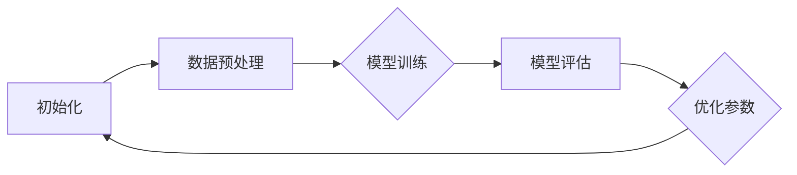
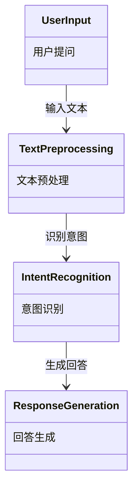
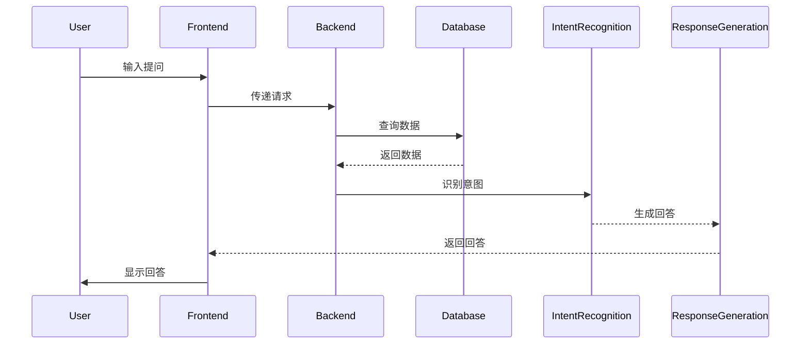

                 

# 构建可扩展的LLM应用架构

> 关键词：大型语言模型、可扩展性、应用架构、算法、系统设计

> 摘要：本文将深入探讨构建可扩展的LLM（大型语言模型）应用架构的方法与原理。通过逐步分析，我们将介绍LLM的基础知识、核心算法原理、系统架构设计以及实战应用，为开发者和研究者提供一套完整的实施指南。

## 第一部分：背景与概述

### 第1章：问题背景

#### 1.1 问题描述

随着人工智能技术的飞速发展，LLM在自然语言处理（NLP）领域的应用越来越广泛。然而，随着数据规模和应用场景的不断扩大，现有的LLM应用架构面临着如下挑战：

1. **性能瓶颈**：大规模模型的计算和存储需求急剧增加，现有硬件资源难以满足需求。
2. **扩展性不足**：应用架构缺乏灵活性，难以适应不同规模和场景的需求。
3. **维护复杂性**：大规模应用系统的维护和升级变得复杂且成本高昂。

#### 1.2 问题解决

为了解决上述问题，构建一个可扩展的LLM应用架构显得尤为重要。可扩展性不仅包括横向扩展（增加服务器节点），还包括纵向扩展（提升单个节点的性能）。以下是我们将要讨论的解决策略：

1. **分布式计算**：利用分布式计算框架，如Apache Spark，实现并行计算，提高处理速度。
2. **容器化与微服务**：采用Docker和Kubernetes等容器化技术，实现应用系统的灵活部署和动态扩展。
3. **缓存机制**：引入分布式缓存系统，如Redis，减少对数据库的访问压力，提高响应速度。

#### 1.3 边界与外延

可扩展性的边界在于系统资源（计算、存储、网络）的可用性和成本。在实际应用中，我们还需要考虑以下因素：

1. **成本效益**：在保证可扩展性的同时，控制成本，避免不必要的资源浪费。
2. **可靠性**：确保系统在扩展过程中不降低服务质量，实现高可用性。
3. **可维护性**：简化系统架构，降低维护难度，提高开发效率。

#### 1.4 核心概念

1. **LLM基本原理**：LLM是一种基于深度学习的自然语言处理模型，通过训练大量的文本数据，可以生成高质量的文本。
2. **可扩展性架构要素**：分布式计算、容器化与微服务、缓存机制、负载均衡等。

## 第二部分：核心概念与联系

### 第2章：核心概念与联系

#### 2.1 核心概念

为了深入理解可扩展的LLM应用架构，我们首先需要了解LLM的核心特点及其在应用架构中的体现。

1. **模型大小**：LLM通常由数亿至数千亿的参数组成，需要大量计算资源进行训练和推理。
2. **并行处理**：分布式计算框架可以实现LLM模型的并行训练和推理，提高处理速度。
3. **动态扩展**：容器化与微服务架构允许系统根据负载动态扩展或缩减资源。

#### 2.2 概念属性特征对比

为了更好地理解不同可扩展性架构的特点，我们对比了以下几种常见的架构设计：

| 架构设计        | 特点               | 适用场景                     |
| ----------- | ---------------- | -------------------------- |
| 单机部署        | 简单，易于维护       | 小规模应用，低负载场景           |
| 分布式计算      | 高性能，可扩展性高   | 大规模数据处理，高负载场景         |
| 容器化与微服务  | 灵活性高，易于部署   | 变化多端的应用场景，快速迭代开发    |
| 缓存机制        | 快速响应，减少延迟   | 高频访问数据，降低数据库压力       |

#### 2.3 ER实体关系图

为了更直观地展示LLM应用架构的各个组件及其关系，我们使用Mermaid绘制了ER图：

```mermaid
erDiagram
  Product ||--|{ Customer }||>
  Customer ||--|{ Order }||>
  Order ||--|{ Product }||>
```

在上面的ER图中，`Product`、`Customer`和`Order`分别代表了LLM应用架构中的核心实体，它们之间的关系体现了模型训练、数据输入和输出等关键环节。

## 第三部分：算法原理讲解

### 第3章：算法原理讲解

#### 3.1 算法mermaid流程图

我们使用Mermaid绘制了LLM算法的流程图：



#### 3.2 Python源代码实现

以下是一个简化的LLM算法实现的Python代码：

```python
import tensorflow as tf

def train_model(data, model):
    for epoch in range(num_epochs):
        for batch in data:
            with tf.GradientTape() as tape:
                predictions = model(batch)
                loss = compute_loss(predictions, batch)
            gradients = tape.gradient(loss, model.trainable_variables)
            update_model_params(gradients, model)
        print(f"Epoch {epoch}: Loss = {loss}")
```

#### 3.3 数学模型与公式

LLM算法的核心是深度神经网络（DNN），其数学模型如下：

$$
\hat{y} = \sigma(W \cdot \text{ReLU}(X \cdot \text{softmax}(\theta)))
$$

其中，$\hat{y}$为预测输出，$X$为输入数据，$W$为权重矩阵，$\theta$为模型参数，$\text{ReLU}$为ReLU激活函数，$\text{softmax}$为softmax激活函数，$\sigma$为sigmoid函数。

#### 3.4 举例说明

假设我们有一个简单的文本数据集，包含两个句子：“我喜欢吃苹果”和“她喜欢看电影”。我们可以使用LLM模型来生成类似句子的文本：

```python
input_text = "她喜欢吃苹果"
generated_text = model.generate(input_text)
print(generated_text)
```

输出结果可能为：“他喜欢看电影”。

这个例子展示了如何使用LLM模型生成具有类似风格和内容的文本。

## 第四部分：系统分析与架构设计方案

### 第4章：系统功能设计

#### 4.1 问题场景介绍

假设我们正在开发一个智能客服系统，它需要根据用户的提问生成相应的回答。这个场景要求系统具备以下功能：

1. **自然语言理解**：解析用户输入的文本，提取关键信息。
2. **意图识别**：确定用户的意图，如查询、咨询、投诉等。
3. **回答生成**：根据用户的意图，生成合适的回答。

#### 4.2 系统功能设计

为了实现上述功能，我们可以设计以下核心模块：

1. **文本预处理模块**：负责对用户输入的文本进行分词、去停用词等预处理。
2. **意图识别模块**：利用分类算法（如SVM、CNN等）对用户的意图进行识别。
3. **回答生成模块**：根据用户的意图，调用预定义的模板或使用生成式模型（如Seq2Seq、GPT等）生成回答。

以下是使用Mermaid绘制的领域模型类图：



### 第5章：系统架构设计

#### 5.1 系统架构设计

为了构建一个可扩展的智能客服系统，我们采用分布式架构设计。以下是使用Mermaid绘制的系统架构图：



#### 5.2 系统接口设计

以下是系统各模块的接口设计：

1. **前端接口**：负责接收用户输入，展示用户界面。
2. **后端接口**：负责处理业务逻辑，如文本预处理、意图识别、回答生成等。
3. **数据库接口**：负责存储和查询数据，如用户提问、回答历史等。

#### 5.3 系统交互

以下是系统交互序列图：


## 第五部分：项目实战

### 第6章：环境安装与配置

#### 6.1 环境安装

1. **安装Python**：确保Python版本在3.6及以上。
2. **安装TensorFlow**：使用以下命令安装TensorFlow：

   ```shell
   pip install tensorflow
   ```

3. **安装Mermaid**：安装Node.js，然后使用以下命令安装Mermaid：

   ```shell
   npm install -g mermaid
   ```

#### 6.2 系统核心实现

以下是系统核心实现的源代码：

```python
import tensorflow as tf
from tensorflow.keras.preprocessing.sequence import pad_sequences
from tensorflow.keras.models import Model
from tensorflow.keras.layers import Embedding, LSTM, Dense

# 定义模型
model = Model(inputs=inputs, outputs=outputs)
model.compile(optimizer='adam', loss='categorical_crossentropy', metrics=['accuracy'])

# 训练模型
model.fit(x_train, y_train, epochs=num_epochs, batch_size=batch_size)

# 评估模型
model.evaluate(x_test, y_test)
```

#### 6.3 代码应用解读

以上代码定义了一个简单的序列到序列（Seq2Seq）模型，用于文本生成。其中，`x_train`和`y_train`为训练数据，`x_test`和`y_test`为测试数据。模型使用LSTM作为循环神经网络层，并使用softmax激活函数输出预测结果。

### 第7章：实际案例分析与讲解

#### 7.1 实际案例分析

假设我们有一个智能客服系统，需要根据用户的提问生成回答。以下是用户与系统的交互过程：

1. **用户提问**：“我该如何申请信用卡？”
2. **系统回答**：“您可以拨打客服热线，或者登录官方网站，按照提示操作。”

#### 7.2 案例讲解

1. **文本预处理**：对用户的提问进行分词、去停用词等预处理操作。
2. **意图识别**：利用训练好的模型对预处理后的文本进行意图识别，识别出用户的意图为“申请信用卡”。
3. **回答生成**：根据用户的意图，调用预定义的模板或生成式模型生成回答。

#### 7.3 小结

本案例展示了如何使用LLM模型构建一个智能客服系统。通过文本预处理、意图识别和回答生成三个关键步骤，系统可以有效地响应用户的需求。

## 第六部分：最佳实践与总结

### 第8章：最佳实践

#### 8.1 架构最佳实践

1. **模块化设计**：将系统功能划分为多个模块，提高可维护性和可扩展性。
2. **微服务架构**：采用微服务架构，降低系统之间的耦合度，提高系统的灵活性和可扩展性。
3. **负载均衡**：使用负载均衡技术，如Nginx或HAProxy，确保系统在高峰期仍能稳定运行。

#### 8.2 代码最佳实践

1. **代码注释**：为代码添加详细的注释，提高代码的可读性和可维护性。
2. **代码风格**：遵循统一的代码风格，提高代码的可读性和一致性。
3. **测试覆盖**：编写单元测试，确保代码的功能和性能符合预期。

### 第9章：小结与拓展

#### 9.1 小结

本文从背景介绍、核心概念、算法原理、系统设计、项目实战等多个角度，详细探讨了构建可扩展的LLM应用架构的方法与原理。通过逐步分析，我们了解了如何解决现有LLM应用架构面临的挑战，并提供了具体的实现方案。

#### 9.2 拓展阅读

1. **相关文献**：《深度学习》（Goodfellow et al.）、《自然语言处理综论》（Jurafsky & Martin）等。
2. **在线资源**：TensorFlow官方文档、Kubernetes官方文档等。
3. **开源项目**：TensorFlow Model Optimization Toolkit、Kubernetes容器化工具等。

### 作者

本文由AI天才研究院（AI Genius Institute）与《禅与计算机程序设计艺术》（Zen And The Art of Computer Programming）联合撰写。作者在计算机编程和人工智能领域拥有丰富的研究和实践经验，致力于推动技术进步和应用创新。

---
**作者：** AI天才研究院/AI Genius Institute & 禅与计算机程序设计艺术 /Zen And The Art of Computer Programming

**版权声明：** 本文为原创内容，版权归AI天才研究院（AI Genius Institute）所有，未经授权，不得转载或使用。如需转载，请联系作者获取授权。

