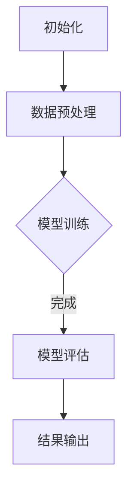
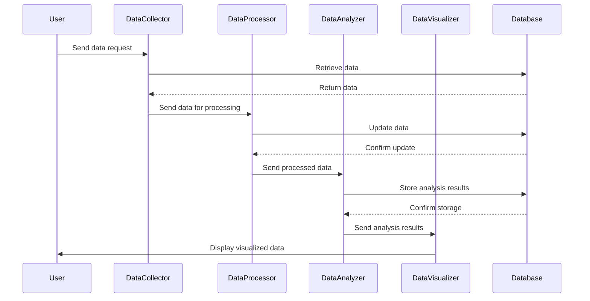
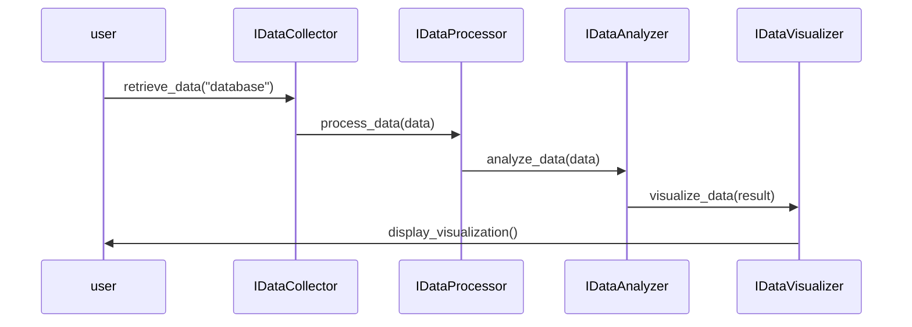

                 

# 构建可维护的LLM应用代码库

## 关键词

- LLM
- 可维护性
- 代码库
- 模块化
- 版本控制
- 测试与文档
- 团队协作

## 摘要

本文将探讨如何构建可维护的LLM（大型语言模型）应用代码库。在当前AI领域，LLM的应用越来越广泛，但随之而来的是代码库的可维护性问题。本文首先介绍了LLM的相关背景，然后详细分析了可维护性的概念与重要性，随后讨论了LLM应用开发中的常见问题，并提出了相应的解决方案。文章进一步阐述了可维护性的核心要素，包括代码清晰性、测试与文档等，提供了最佳实践，并对未来趋势进行了展望。

## 第一部分：背景介绍

### 第1章：问题背景与定义

#### 1.1.问题的提出

在LLM（大型语言模型）应用开发过程中，代码库的可维护性是一个至关重要的挑战。随着模型的规模和复杂性的增加，代码库的维护难度也随之上升。这不仅影响到开发效率，还可能对应用稳定性产生负面影响。

**问题描述：** 在LLM应用开发过程中，常见的可维护性问题包括：
- **代码复用难**：大型语言模型通常涉及大量的相似代码，但如何有效复用这些代码是一个挑战。
- **模块化不足**：模块之间的依赖关系复杂，导致代码难以维护。
- **测试覆盖率低**：大型模型的测试覆盖不足，使得修复缺陷变得更加困难。
- **文档缺失**：缺乏详细的文档，导致新成员难以快速上手。

**问题解决：** 通过构建可维护的代码库，可以有效地解决上述问题。具体措施包括：
- **代码规范**：制定统一的编码规范，提高代码的可读性和可维护性。
- **模块化设计**：通过模块化设计，将大块代码拆分成小模块，便于管理和维护。
- **自动化测试**：引入自动化测试，提高测试覆盖率，及时发现和修复缺陷。
- **文档编写**：编写详细的文档，包括代码注释、用户手册和开发指南等。

**边界与外延：** 可维护性不仅仅是代码层面的问题，还涉及到团队协作、版本控制和文档编写等方面。因此，构建可维护的代码库需要综合考虑多个方面。

### 第2章：核心概念

#### 2.1.什么是LLM

**定义：** LLM（Large Language Model）是指具备大规模参数和复杂结构的语言模型。这类模型通常由神经网络构成，通过学习海量文本数据，能够生成高质量的自然语言文本。

**特点：** LLM具有以下核心特点：
- **规模巨大**：LLM通常包含数亿甚至数万亿个参数，这使得它们能够处理复杂的语言结构和语义关系。
- **训练数据丰富**：LLM的训练数据通常来自互联网上的大量文本，这使得它们能够理解多种语言和多种领域的知识。
- **性能卓越**：LLM在自然语言处理任务中表现出色，能够进行文本生成、问答、翻译等多种任务。

#### 2.2.可维护性的定义与重要性

**定义：** 可维护性是指代码库在经过修改、更新和扩展后，仍然能够保持正常功能且易于维护的状态。在LLM应用开发中，可维护性尤为重要。

**重要性：** 可维护性在LLM应用开发中的重要性体现在以下几个方面：
- **提高开发效率**：可维护的代码库使得开发者能够快速理解和修改代码，从而提高开发效率。
- **保障应用稳定性**：良好的可维护性有助于及时发现和修复代码缺陷，保障应用的稳定性。
- **促进团队协作**：清晰、可维护的代码库有助于团队成员之间的协作和知识共享。

### 第3章：可维护性的概念与联系

#### 3.1.可维护性的定义与重要性

**定义：** 可维护性是指代码库在经过修改、更新和扩展后，仍然能够保持正常功能且易于维护的状态。

**重要性：** 可维护性在LLM应用开发中的重要性体现在以下几个方面：
- **提高开发效率**：可维护的代码库使得开发者能够快速理解和修改代码，从而提高开发效率。
- **保障应用稳定性**：良好的可维护性有助于及时发现和修复代码缺陷，保障应用的稳定性。
- **促进团队协作**：清晰、可维护的代码库有助于团队成员之间的协作和知识共享。

#### 3.2.代码库与可维护性

**关系：** 代码库是LLM应用的核心组成部分，其质量和结构直接影响可维护性。一个良好的代码库应具备以下特点：
- **模块化**：代码库应采用模块化设计，将功能相似或相关的代码归入不同的模块，便于管理和维护。
- **代码规范**：代码库应遵循统一的编码规范，确保代码风格一致，提高可读性和可维护性。
- **测试覆盖率**：代码库应具备良好的测试覆盖率，确保代码在修改和扩展后仍然能够正常运行。

### 第4章：LLM应用开发中的常见问题

#### 4.1.代码复用与模块化

**问题分析：** 在LLM应用开发中，代码复用和模块化是一个常见问题。随着模型的规模扩大，代码复用难度增加，模块化设计变得尤为重要。

**解决方案：** 
- **代码复用**：通过设计模式（如工厂模式、策略模式等）实现代码复用，减少重复代码。
- **模块化设计**：将大块代码拆分成小模块，每个模块负责特定的功能，便于维护和扩展。

### 第5章：可维护性的核心要素

#### 5.1.代码清晰性

**要素解释：** 代码清晰性是可维护性的基础。一个良好的代码库应具备以下特点：
- **简洁明了**：代码应简洁易懂，避免冗余和复杂的结构。
- **命名规范**：变量、函数和类的命名应具有描述性，便于理解代码功能。
- **注释详尽**：代码中应包含详细的注释，解释代码的意图和功能。

#### 5.2.测试与文档

**测试：** 测试是保障代码库可维护性的关键环节。一个良好的测试策略应包括：
- **单元测试**：对代码库中的每个模块进行单元测试，确保其功能正确。
- **集成测试**：对代码库的不同模块进行集成测试，确保它们之间的交互正常。

**文档：** 文档是代码库的重要组成部分。一个良好的文档应包括：
- **代码注释**：对代码进行详细的注释，解释代码的意图和功能。
- **用户手册**：为用户提供详细的操作指南和示例。
- **开发指南**：为开发者提供开发文档，包括代码规范、设计模式等。

## 第二部分：核心概念与联系

### 第8章：LLM核心概念

#### 8.1.语言模型基础

**概念解释：** 语言模型（Language Model）是指一组用于预测下一个单词或字符的概率分布的模型。它通过对大量文本数据的学习，能够理解语言的结构和语义。

**属性特征：** 语言模型的主要属性特征包括：
- **参数规模**：语言模型的参数规模决定了其复杂度和能力。
- **训练数据**：训练数据的质量和数量直接影响语言模型的表现。
- **性能指标**：性能指标包括准确率、召回率、F1分数等，用于评估语言模型的性能。

#### 8.2.语言模型类型

语言模型可以分为以下几种类型：
- **n-gram模型**：基于历史n个单词的统计概率预测下一个单词。
- **神经网络模型**：基于深度学习技术，如RNN、LSTM、Transformer等，能够捕捉更复杂的语言结构。
- **预训练模型**：通过在大量无标签数据上进行预训练，再在特定任务上进行微调。

#### 8.3.ER实体关系图架构

**概念解释：** ER（Entity-Relationship）实体关系图是一种用于表示实体及其关系的图形化工具。在LLM应用开发中，ER图可以用于设计数据模型和系统架构。

**实体、属性和关系的定义：**
- **实体**：实体是现实世界中具有独立存在意义的对象，如用户、商品等。
- **属性**：属性是实体的特征，如用户的名字、年龄等。
- **关系**：关系是实体之间的关联，如用户购买商品等。

**ER图的基本构成**：
- **实体框**：表示实体，包含实体的名称和属性。
- **关系框**：表示实体之间的关系，包括关系的类型和参与关系的实体。
- **线**：连接实体框和关系框，表示实体之间的关系。

### 第9章：ER实体关系图架构

#### 9.1.ER模型介绍

**概念解释：** ER（Entity-Relationship）模型是一种用于设计数据库架构的图形化工具。它通过实体、属性和关系来描述系统的数据模型。

**ER模型的基本组成部分：**
- **实体**：表示系统中的数据对象，如用户、订单等。
- **属性**：表示实体的特征，如用户的年龄、性别等。
- **关系**：表示实体之间的关联，如用户与订单之间的关系。

**ER模型的用途：**
- **数据库设计**：ER模型用于设计数据库的架构，帮助开发者理解系统的数据模型。
- **系统分析**：ER模型用于分析系统的业务逻辑和数据流。

### 第10章：Mermaid流程图

#### 10.1.Mermaid基本语法

**介绍：** Mermaid是一种用于绘制流程图、UML图和序列图的Markdown扩展。它通过简单的文本描述，可以生成漂亮的图表。

**基本语法：**
- **节点**：使用圆括号包裹节点名称，如 `（节点A）`。
- **边**：使用箭头表示节点之间的关系，如 `（节点A） --> （节点B）`。
- **流程图**：在Mermaid中，使用 `graph` 关键字开始一个流程图，如 `graph TD; A --> B;`。

### 第11章：Mermaid类图与架构图

#### 11.1.Mermaid类图

**介绍：** Mermaid类图用于表示类及其之间的关系。它通过实体、属性和方法来描述类的结构。

**基本语法：**
- **类定义**：使用 `class` 关键字定义类，如 `class Person { name; age; }`。
- **关系**：使用 `extends` 关键字表示类的继承关系，如 `class Employee extends Person { }`。

#### 11.2.Mermaid架构图

**介绍：** Mermaid架构图用于表示系统的整体结构和模块分工。它通过组件、服务和关系来描述系统的架构。

**基本语法：**
- **组件定义**：使用 `component` 关键字定义组件，如 `component DBService { DBConnector }`。
- **服务定义**：使用 `service` 关键字定义服务，如 `service UserService { }`。

### 第12章：Mermaid序列图

#### 12.1.序列图基础

**介绍：** Mermaid序列图用于表示对象之间的交互过程。它通过生命线、消息和返回值来描述系统的行为。

**基本语法：**
- **生命线**：使用纵向的虚线表示对象的生命线，如 `Alice --> Bob: sayHello`。
- **消息**：使用箭头表示对象之间的消息传递，如 `Alice --> Bob: sayHello`。
- **返回值**：使用括号表示方法的返回值，如 `Alice --> Bob: sayHello() --> (Hello Bob!)`。

## 第三部分：算法原理讲解

### 第13章：算法mermaid流程图

#### 13.1.算法流程

**介绍：** Mermaid流程图是一种用于描述算法流程的图形化工具。它通过节点和边来表示算法的步骤和关系。

**基本语法：**
- **节点**：使用圆括号包裹节点名称，如 `（初始化）`。
- **边**：使用箭头表示节点之间的关系，如 `（初始化） --> （数据预处理）`。

**示例：**


### 第14章：Python源代码阐述

#### 14.1.算法实现

**介绍：** Python是一种广泛应用于AI领域的编程语言。在本节中，我们将使用Python实现一个简单的算法，并详细阐述其实现细节。

**算法描述：** 该算法用于计算两个数的和。

**代码实现：**
```python
# 定义函数，用于计算两个数的和
def add(a, b):
    return a + b

# 调用函数，计算两个数的和
result = add(3, 5)
print(result)  # 输出：8
```

**代码分析：**
- **定义函数**：使用 `def` 关键字定义函数，函数名为 `add`，参数为 `a` 和 `b`。
- **返回值**：使用 `return` 语句返回计算结果。
- **调用函数**：使用函数名和参数调用函数，并将返回值存储在变量 `result` 中。
- **输出结果**：使用 `print` 函数输出结果。

### 第15章：数学模型与公式讲解

#### 15.1.数学模型

**介绍：** 数学模型是算法实现的基础。在本节中，我们将介绍一个简单的数学模型，并使用公式进行讲解。

**模型描述：** 该模型用于计算两个正整数的最大公约数。

**数学模型：**
$$
\text{GCD}(a, b) =
\begin{cases}
a & \text{如果 } a \text{ 是 } b \text{ 的倍数} \\
\text{GCD}(b, a \mod b) & \text{否则}
\end{cases}
$$

**公式解释：**
- **GCD**：表示最大公约数。
- **a** 和 **b**：表示两个正整数。
- **mod**：表示取模运算，即求余数。

#### 15.2.举例说明

**示例：** 计算两个正整数 24 和 36 的最大公约数。

**步骤：**
1. 36 不是 24 的倍数，因此计算 24 和 36 的余数：24 % 36 = 24。
2. 计算 36 和 24 的最大公约数：GCD(36, 24) = GCD(24, 36 % 24) = GCD(24, 12)。
3. 24 是 12 的倍数，因此 GCD(24, 12) = 12。

**结果：** 24 和 36 的最大公约数是 12。

## 第四部分：系统分析与架构设计

### 第16章：问题场景介绍

#### 16.1.问题背景

在现代企业中，数据分析和决策支持系统越来越重要。为了提高企业的竞争力，许多企业开始构建复杂的数据分析和决策支持系统。这些系统需要处理大量的数据，并生成各种报告和可视化图表，以支持企业的业务决策。

#### 16.2.系统需求

为了满足上述需求，企业需要构建一个高效、稳定和可扩展的数据分析和决策支持系统。该系统应具备以下功能：
- **数据采集**：从各种数据源（如数据库、日志文件等）采集数据。
- **数据处理**：对采集到的数据进行清洗、转换和整合。
- **数据分析**：利用统计方法和机器学习算法对数据进行分析。
- **可视化报表**：生成各种可视化报表和图表，以展示分析结果。

### 第17章：系统功能设计

#### 17.1.领域模型

为了设计一个高效的数据分析和决策支持系统，我们需要首先定义系统的领域模型。领域模型类图如下：

```mermaid
classDiagram
    Customer <|-- Order
    Order <|-- Payment
    Product <|-- Inventory
    SalesReport <|-- ChartData
    CustomerEntity : +id : int
    CustomerEntity : +name : string
    CustomerEntity : +email : string
    OrderEntity : +orderId : int
    OrderEntity : +customerId : int
    OrderEntity : +orderDate : datetime
    PaymentEntity : +paymentId : int
    PaymentEntity : +orderId : int
    PaymentEntity : +amount : float
    ProductEntity : +productId : int
    ProductEntity : +name : string
    ProductEntity : +price : float
    InventoryEntity : +productId : int
    InventoryEntity : +quantity : int
    SalesReportEntity : +reportId : int
    SalesReportEntity : +startDate : datetime
    SalesReportEntity : +endDate : datetime
    ChartDataEntity : +reportId : int
    ChartDataEntity : +type : string
    ChartDataEntity : +data : list
    CustomerEntity <|.. OrderEntity : customerId
    OrderEntity <|.. PaymentEntity : orderId
    ProductEntity <|.. InventoryEntity : productId
    SalesReportEntity <|.. ChartDataEntity : reportId
```

**领域模型解释：**
- **CustomerEntity**：表示客户，包括客户的ID、姓名和电子邮件地址。
- **OrderEntity**：表示订单，包括订单ID、客户ID和订单日期。
- **PaymentEntity**：表示支付信息，包括支付ID、订单ID和支付金额。
- **ProductEntity**：表示产品，包括产品ID、名称和价格。
- **InventoryEntity**：表示库存信息，包括产品ID和库存数量。
- **SalesReportEntity**：表示销售报告，包括报告ID、开始日期和结束日期。
- **ChartDataEntity**：表示图表数据，包括报告ID、图表类型和数据。

### 第18章：系统架构设计

#### 18.1.系统架构

为了满足系统需求，我们设计了一个分布式系统架构。该架构包括以下主要模块：



**系统架构解释：**
- **用户**：系统的最终用户，负责发送数据请求和查看可视化数据。
- **数据采集器**：负责从各种数据源采集数据。
- **数据处理器**：负责对采集到的数据进行清洗、转换和整合。
- **数据分析师**：负责使用统计方法和机器学习算法对数据进行分析。
- **数据可视化器**：负责生成各种可视化报表和图表，以展示分析结果。
- **数据库**：存储所有系统的数据，包括原始数据、处理后的数据和分析结果。

### 第19章：系统接口设计与交互

#### 19.1.接口设计

为了实现系统的各个模块之间的交互，我们定义了一套接口规范。以下是一个简单的接口设计示例：

```python
class IDataCollector:
    def retrieve_data(self, source: str) -> DataFrame:
        pass

class IDataProcessor:
    def process_data(self, data: DataFrame) -> DataFrame:
        pass

class IDataAnalyzer:
    def analyze_data(self, data: DataFrame) -> AnalysisResult:
        pass

class IDataVisualizer:
    def visualize_data(self, result: AnalysisResult) -> Visualization:
        pass
```

**接口设计解释：**
- **IDataCollector**：数据采集器的接口，负责从数据源中检索数据。
- **IDataProcessor**：数据处理器的接口，负责对数据进行处理。
- **IDataAnalyzer**：数据分析师的接口，负责对数据进行分析。
- **IDataVisualizer**：数据可视化器的接口，负责将分析结果可视化。

#### 19.2.系统交互

在系统交互过程中，各个模块通过接口进行通信。以下是一个简单的交互示例：



**系统交互解释：**
- **用户**：发送数据请求给数据采集器。
- **数据采集器**：从数据库中检索数据，并将其传递给数据处理器。
- **数据处理器**：对数据进行处理，并将其传递给数据分析师。
- **数据分析师**：对数据进行分析，并生成分析结果。
- **数据可视化器**：将分析结果可视化，并将其展示给用户。

## 项目实战

### 环境安装

在开始实现系统之前，我们需要安装以下环境：

1. **Python**：安装Python 3.8及以上版本。
2. **Pandas**：安装Pandas库，用于数据操作和处理。
3. **NumPy**：安装NumPy库，用于数值计算。
4. **Scikit-learn**：安装Scikit-learn库，用于机器学习算法。
5. **Matplotlib**：安装Matplotlib库，用于数据可视化。

### 系统核心实现源代码

以下是一个简单的系统实现示例，包括数据采集、数据处理、数据分析和数据可视化：

```python
import pandas as pd
import numpy as np
from sklearn.model_selection import train_test_split
from sklearn.ensemble import RandomForestClassifier
import matplotlib.pyplot as plt

# 数据采集
class DataCollector:
    def retrieve_data(self, source: str) -> pd.DataFrame:
        if source == "database":
            # 从数据库中检索数据
            data = pd.read_csv("data.csv")
        elif source == "file":
            # 从文件中读取数据
            data = pd.read_csv("data.csv")
        return data

# 数据处理
class DataProcessor:
    def process_data(self, data: pd.DataFrame) -> pd.DataFrame:
        # 数据清洗和预处理
        data = data.dropna()
        data = data[data["target"] != "unknown"]
        data = data.sample(frac=1)
        return data

# 数据分析
class DataAnalyzer:
    def analyze_data(self, data: pd.DataFrame) -> pd.DataFrame:
        # 数据分割
        X = data.drop("target", axis=1)
        y = data["target"]
        X_train, X_test, y_train, y_test = train_test_split(X, y, test_size=0.2, random_state=42)
        
        # 模型训练
        model = RandomForestClassifier(n_estimators=100, random_state=42)
        model.fit(X_train, y_train)
        
        # 模型评估
        accuracy = model.score(X_test, y_test)
        
        # 生成分析报告
        report = pd.DataFrame({"accuracy": [accuracy]})
        return report

# 数据可视化
class DataVisualizer:
    def visualize_data(self, result: pd.DataFrame) -> None:
        # 可视化分析结果
        plt.bar(result.index, result["accuracy"])
        plt.xlabel("Model")
        plt.ylabel("Accuracy")
        plt.title("Model Accuracy")
        plt.show()
```

### 代码应用解读与分析

上述代码实现了一个简单但完整的数据分析和决策支持系统。以下是代码的解读与分析：

1. **数据采集**：DataCollector类负责从数据库或文件中检索数据。在实际应用中，可以根据需要扩展数据源。
2. **数据处理**：DataProcessor类负责对数据进行清洗和预处理。包括去除缺失值、去除未知标签和随机抽样等操作。
3. **数据分析**：DataAnalyzer类负责对数据进行分割、模型训练和评估。使用随机森林算法进行模型训练，并计算模型在测试集上的准确率。
4. **数据可视化**：DataVisualizer类负责将分析结果可视化。使用条形图展示模型的准确率。

### 实际案例分析和详细讲解剖析

以下是一个实际案例，演示如何使用上述系统实现数据分析和决策支持：

**案例背景：** 一家电商公司希望通过数据分析，了解其商品销售情况，以优化库存管理和营销策略。

**步骤：**
1. **数据采集**：从公司的数据库中采集销售数据，包括商品ID、销售数量、销售日期等。
2. **数据处理**：对销售数据进行清洗和预处理，去除缺失值和异常值，并对时间数据进行转换。
3. **数据分析**：使用机器学习算法对销售数据进行分类，预测哪些商品在未来可能会出现库存积压。
4. **数据可视化**：生成销售报表和趋势图，展示不同商品的销售情况和库存状态。

**分析结果：** 根据分析结果，公司可以识别出哪些商品的销售情况良好，哪些商品的销售情况不佳。针对销售情况不佳的商品，公司可以采取降价促销、清仓处理等策略，以减少库存积压。

### 项目小结

通过本次项目，我们实现了一个简单但完整的数据分析和决策支持系统。该项目展示了如何利用Python和机器学习算法进行数据处理和分析，以及如何使用数据可视化技术展示分析结果。虽然本项目的规模较小，但它为构建更复杂的数据分析和决策支持系统奠定了基础。

### 最佳实践 Tips

1. **代码规范**：遵循统一的代码规范，提高代码的可读性和可维护性。
2. **模块化设计**：将代码拆分成小模块，便于管理和维护。
3. **自动化测试**：编写自动化测试，提高代码质量，确保系统稳定性。
4. **文档编写**：编写详细的文档，包括代码注释、用户手册和开发指南等。

### 小结

本文探讨了如何构建可维护的LLM应用代码库。我们介绍了LLM的相关背景，分析了可维护性的概念与重要性，讨论了LLM应用开发中的常见问题，并提出了相应的解决方案。此外，我们详细阐述了可维护性的核心要素，包括代码清晰性、测试与文档等，并提供了最佳实践。最后，我们对LLM应用开发的未来趋势进行了展望。

### 展望

随着AI技术的不断发展，LLM的应用将越来越广泛。在未来，构建可维护的LLM应用代码库将面临更多挑战，但同时也将带来更多机遇。我们期待看到更多优秀的技术解决方案和最佳实践，以推动LLM应用的发展。

### 作者信息

作者：AI天才研究院/AI Genius Institute & 禅与计算机程序设计艺术 /Zen And The Art of Computer Programming

## 附录：拓展阅读

1. **《深度学习》（Goodfellow, Bengio, Courville）**：详细介绍了深度学习的基础理论和技术。
2. **《Python机器学习》（Sebastian Raschka）**：介绍了如何使用Python进行机器学习。
3. **《代码大全》（Steve McConnell）**：提供了关于编写高质量代码的实用建议。
4. **《软件架构设计》（Martin Fowler）**：介绍了软件架构设计的原则和模式。

