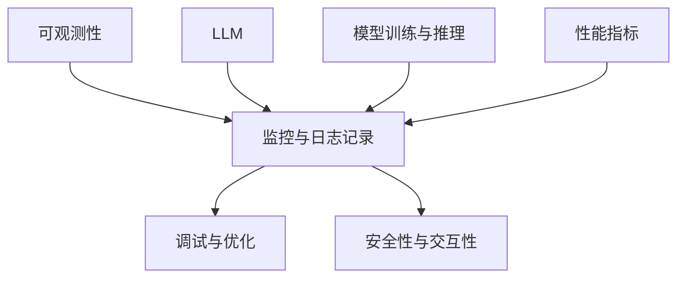

                 

### 设计《构建可观测的LLM应用系统》的技术博客文章：目的与结构

#### **目的**

构建可观测的LLM（Large Language Model，大型语言模型）应用系统是当前人工智能领域的一个重要研究方向。这种系统的设计不仅需要深入理解LLM的算法原理，还需掌握如何实现系统的可观测性，以便于在实际应用中监控、调试和优化模型性能。本篇技术博客文章旨在系统地介绍构建可观测的LLM应用系统的全过程，帮助读者从理论基础到实际应用全面了解这一复杂系统。

#### **结构**

文章将分为以下几个主要部分：

1. **引言**
   - 介绍可观测性和LLM的重要性
   - 阐述文章的目标和结构

2. **背景介绍**
   - 定义可观测性和LLM
   - 概述问题背景和解决方法

3. **核心概念与联系**
   - 详细讲解可观测性和LLM的核心概念
   - 分析两者之间的联系

4. **算法原理讲解**
   - 描述可观测性算法的工作原理
   - 详细解释LLM算法的数学模型和公式

5. **系统分析与架构设计**
   - 介绍系统的功能设计和架构设计
   - 展示系统接口设计和交互流程

6. **项目实战**
   - 环境安装指南
   - 系统核心实现和代码解读
   - 实际案例分析

7. **最佳实践与拓展**
   - 提供最佳实践和注意事项
   - 引导读者进行拓展阅读

通过这一结构化的内容设计，文章将逐步引导读者深入理解可观测的LLM应用系统的构建过程，并提供实用的指导和建议。

---

### 引言

在当今快速发展的AI领域中，大型语言模型（LLM）已经成为自然语言处理（NLP）的核心技术。LLM通过深度学习和神经网络技术，能够理解和生成复杂的自然语言文本，广泛应用于智能问答系统、机器翻译、文本生成等领域。然而，随着LLM的规模和复杂性的增加，如何有效监控和管理这些模型成为了一个关键挑战。

**可观测性**（Observability）是解决这一挑战的关键概念。可观测性指的是系统能够通过观测其内部状态和活动来推断其行为和性能。与传统的可测性（Testability）不同，可观测性不仅关注系统内部变量的测量，还允许系统用户在没有直接干预的情况下理解和预测系统的行为。

构建可观测的LLM应用系统不仅有助于监控模型的训练过程，还可以在模型部署后提供强大的调试和性能优化工具。这种系统能够实时收集和显示模型的状态信息，包括训练误差、损失函数值、参数更新情况等，帮助开发者和研究人员快速定位问题并做出相应的调整。

本文的目标是系统地介绍构建可观测的LLM应用系统的全过程。我们将从背景介绍开始，逐步深入核心概念、算法原理、系统架构设计、项目实战，并最终提供最佳实践和注意事项。文章结构如下：

1. **背景介绍**
   - 定义可观测性和LLM
   - 概述问题背景和解决方法

2. **核心概念与联系**
   - 详细讲解可观测性和LLM的核心概念
   - 分析两者之间的联系

3. **算法原理讲解**
   - 描述可观测性算法的工作原理
   - 详细解释LLM算法的数学模型和公式

4. **系统分析与架构设计**
   - 介绍系统的功能设计和架构设计
   - 展示系统接口设计和交互流程

5. **项目实战**
   - 环境安装指南
   - 系统核心实现和代码解读
   - 实际案例分析

6. **最佳实践与拓展**
   - 提供最佳实践和注意事项
   - 引导读者进行拓展阅读

通过这一结构化的内容设计，本文将帮助读者全面了解可观测的LLM应用系统的构建过程，并提供实用的指导和建议。

---

### 背景介绍

在深入探讨构建可观测的LLM应用系统之前，我们需要明确两个核心概念：**可观测性**和**大型语言模型（LLM）**。以下是这两个概念的详细定义、问题背景和解决方法。

#### **可观测性**

**可观测性**是一种系统属性，它描述了系统内部状态和活动可以被外部观察者通过测量和推理获得的能力。可观测性通常涉及以下三个方面：

1. **状态可观测性**：系统当前状态可以被完全观测到，即所有内部变量都能够被测量。
2. **输入可观测性**：系统输入可以被完全观测到，即所有外部输入都可以被记录和监测。
3. **输出可观测性**：系统输出可以被完全观测到，即所有系统行为的结果都能够被监控。

在软件开发和系统设计领域，可观测性被广泛应用于分布式系统、实时系统和复杂算法的设计中。其重要性在于，通过提供对系统内部状态的深入了解，开发人员可以更快地识别和解决问题，从而提高系统的可靠性和性能。

**问题背景**：

在传统的软件开发中，系统设计往往侧重于功能性和性能，而忽略了系统的可观测性。这导致在实际运行过程中，当系统出现问题时，开发人员往往需要花费大量时间和精力进行调试和故障排查。这种情况下，系统的不透明性使得问题定位和修复变得异常复杂。

**解决方法**：

为了解决这一问题，可观测性引入了一系列技术，包括日志记录、追踪系统状态、监控关键指标等。通过这些技术，开发人员可以在系统运行过程中实时获取系统状态信息，从而快速识别问题并采取相应措施。

#### **大型语言模型（LLM）**

**大型语言模型（LLM）**是指那些具有数百万到数十亿参数的复杂神经网络模型，能够处理和理解大规模的自然语言数据。这些模型通常通过深度学习技术训练，广泛应用于自然语言生成、机器翻译、问答系统等领域。

**LLM的核心概念**：

1. **模型规模**：LLM的核心在于其庞大的参数规模，这使得模型具有更强的表达能力和泛化能力。
2. **训练数据**：LLM的准确性依赖于其训练数据的质量和规模。大规模数据集可以提供更丰富的语言特征，从而提高模型的性能。
3. **神经网络结构**：LLM通常采用深度神经网络结构，包括多层感知器（MLP）、循环神经网络（RNN）和变换器（Transformer）等。

**问题背景**：

随着LLM的广泛应用，如何设计和构建可观测的LLM应用系统成为了一个重要课题。LLM的高复杂性和高维度特性使得传统的可观测性技术难以直接应用。此外，LLM的训练和推理过程涉及大量的计算资源和时间，如何有效监控和管理这些资源也成为了一个挑战。

**解决方法**：

为了构建可观测的LLM应用系统，需要从以下几个方面入手：

1. **监控和日志记录**：实时监控模型的训练和推理过程，记录关键性能指标，如训练误差、损失函数值、参数更新情况等。
2. **性能优化**：通过调整训练参数和优化算法，提高模型性能和效率，从而降低计算资源的消耗。
3. **可视化工具**：开发可视化工具，将模型的状态信息以图形化的方式展示，帮助开发人员更好地理解模型的行为和性能。

通过以上方法，可以构建一个具备良好可观测性的LLM应用系统，从而在开发和运维过程中提高效率和准确性。

---

### 核心概念与联系

在深入探讨可观测的LLM应用系统之前，我们需要详细理解两个核心概念：**可观测性**和**大型语言模型（LLM）**。以下是这两个概念的定义、属性特征、相互联系，以及它们如何影响系统设计和实现的详细分析。

#### **可观测性**

**可观测性**是指一个系统或过程能够被外部观察者通过测量、监控和追踪其内部状态和活动来推断其行为和性能的能力。它是一个系统设计中的关键属性，尤其在分布式系统、实时系统和复杂算法设计中至关重要。

**定义**：
可观测性通常包括三个维度：
1. **状态可观测性**：系统能够通过观测其当前状态来推断历史状态。
2. **输入可观测性**：系统能够通过观测输入来推断输入的来源和类型。
3. **输出可观测性**：系统能够通过观测输出结果来推断系统的行为和决策。

**属性特征**：
- **完备性**：系统能够提供足够的信息，使外部观察者能够准确推断系统状态。
- **独立性**：系统各个部分的可观测性是相互独立的，即一个部分的状态不会影响其他部分的可观测性。
- **实时性**：系统能够及时提供状态信息，以便在出现问题时能够快速响应。

**相互联系**：
可观测性是确保系统设计和实现过程中的关键要素之一。它不仅影响了系统的可靠性和可维护性，还直接影响到了系统的性能优化和故障排查。

**影响系统设计和实现**：
- **性能优化**：通过可观测性，开发者可以实时监控系统性能，从而在出现性能瓶颈时进行优化。
- **故障排查**：可观测性提供了系统的状态和活动记录，使开发者能够快速定位问题并进行修复。

#### **大型语言模型（LLM）**

**大型语言模型（LLM）**是一种基于深度学习的复杂神经网络模型，通常具有数百万到数十亿个参数，能够处理和理解大规模的自然语言数据。LLM在自然语言处理（NLP）领域中具有广泛的应用，包括文本生成、机器翻译、问答系统等。

**定义**：
LLM是一种能够理解、生成和响应自然语言文本的复杂模型。它通过大规模数据训练，学习语言模式和结构，从而实现高精度的文本处理能力。

**属性特征**：
- **模型规模**：LLM的规模通常非常大，参数数量达到数十亿级别，这使得模型能够捕捉到复杂的语言特征。
- **训练数据**：LLM的训练数据规模庞大，通常需要数以亿计的文本数据，以确保模型能够充分学习语言特征。
- **神经网络结构**：LLM通常采用深度神经网络结构，包括多层感知器（MLP）、循环神经网络（RNN）和变换器（Transformer）等。

**相互联系**：
LLM的可观测性直接决定了其在实际应用中的可操作性。由于LLM的复杂性和高维度特性，如何实现其良好的可观测性成为了一个关键技术挑战。

**影响系统设计和实现**：
- **可维护性**：通过实现LLM的可观测性，开发者可以更轻松地维护和优化模型。
- **性能优化**：良好的可观测性使得开发者能够实时监控和调整模型参数，从而优化模型性能。
- **故障排查**：通过实时监控LLM的状态和活动，开发者可以快速定位和解决模型在运行过程中出现的问题。

#### **可观测性与LLM的联系**

**可观测性**和**LLM**之间的联系体现在以下几个方面：

1. **监控和日志记录**：LLM作为一个复杂系统，其训练和推理过程中会产生大量的状态信息。通过实现可观测性，开发者可以实时监控这些状态信息，包括模型参数的更新、训练误差、损失函数值等，从而更好地理解模型的行为。

2. **调试和优化**：在LLM的应用过程中，可能会遇到各种性能问题和错误。通过可观测性，开发者可以迅速定位问题并进行调试和优化。例如，通过观察模型参数的更新情况，可以判断是否存在过拟合或欠拟合现象，并采取相应的调整措施。

3. **安全性**：LLM在处理敏感数据时，安全性至关重要。通过实现可观测性，可以实时监控模型的行为，防止恶意攻击和不当使用。

4. **交互性**：在LLM的应用场景中，用户与模型之间的交互往往需要高效的反馈机制。可观测性提供了这种反馈机制，使开发者能够根据模型的状态和性能调整交互策略。

**Mermaid流程图**：

为了更好地展示可观测性与LLM之间的联系，我们可以使用Mermaid流程图进行描述。以下是Mermaid流程图示例：



在这个流程图中，A代表可观测性，B表示监控与日志记录、调试与优化、安全性与交互性，C、D、E分别代表这三个方面。E表示LLM，F表示模型训练与推理，G表示性能指标。通过这个流程图，我们可以清晰地看到可观测性在LLM应用系统中的作用和影响。

通过深入理解可观测性和LLM的核心概念及其相互联系，开发者可以更好地设计可观测的LLM应用系统，从而在开发和运维过程中提高系统的性能和可靠性。

---

### 算法原理讲解

为了实现构建可观测的LLM应用系统，我们需要深入了解可观测性算法的原理。以下是可观测性算法的详细介绍，包括其工作原理、数学模型和公式解释。

#### **可观测性算法的工作原理**

可观测性算法的核心目标是通过分析系统的输入和输出数据，推断系统的内部状态。这种推断通常基于系统的动态方程和观测数据，利用统计学和信号处理的方法来实现。

1. **输入输出建模**：首先，我们需要建立一个系统的输入输出模型。该模型描述了系统如何响应外部输入并产生输出结果。例如，对于一个控制系统，输入可能是控制信号，输出可能是系统的响应信号。

2. **状态空间建模**：接下来，我们需要将系统建模为一个状态空间模型。状态空间模型描述了系统内部状态随时间演化的过程。该模型通常由一组状态方程和观测方程组成。

3. **观测设计**：观测设计是可观测性算法的关键步骤。观测设计的目标是选择合适的观测变量，使得系统能够通过这些变量来推断内部状态。常用的观测设计方法包括卡尔曼滤波器、扩展卡尔曼滤波器和观测器设计等。

4. **状态估计**：最后，我们使用观测数据来估计系统的内部状态。状态估计的方法包括基于统计方法的滤波器和基于优化方法的估计器。卡尔曼滤波器和粒子滤波器是两种常用的状态估计方法。

#### **数学模型和公式**

为了更好地理解可观测性算法，我们需要介绍其核心的数学模型和公式。以下是可观测性算法的基本公式：

1. **状态方程**：
   \[ x_k = A x_{k-1} + B u_k + w_k \]
   其中，\( x_k \)表示系统在时刻\( k \)的状态，\( A \)是状态转移矩阵，\( B \)是输入矩阵，\( u_k \)是外部输入，\( w_k \)是过程噪声。

2. **观测方程**：
   \[ z_k = H x_k + v_k \]
   其中，\( z_k \)表示系统在时刻\( k \)的观测值，\( H \)是观测矩阵，\( v_k \)是观测噪声。

3. **卡尔曼滤波器**：
   卡尔曼滤波器是一种常用的状态估计方法，其核心公式如下：
   \[ \hat{x}_k = A \hat{x}_{k-1} + B u_k \]
   \[ P_k = A P_{k-1} A^T + Q \]
   \[ K_k = P_k H^T (H P_k H^T + R)^{-1} \]
   \[ \hat{z}_k = H \hat{x}_k \]
   \[ P_{k-1} = (I - K_k H) P_{k-1} \]
   其中，\( \hat{x}_k \)是状态估计值，\( P_k \)是状态估计的协方差矩阵，\( K_k \)是卡尔曼增益，\( \hat{z}_k \)是观测估计值，\( Q \)和\( R \)分别是过程噪声和观测噪声的协方差矩阵。

#### **Python代码示例**

为了更直观地理解可观测性算法，以下是一个简单的Python代码示例，实现了基于卡尔曼滤波器的状态估计：

```python
import numpy as np

# 状态方程参数
A = np.array([[1, 1], [0, 1]])
B = np.array([[1], [0]])
Q = np.array([[1, 0], [0, 1]])

# 观测方程参数
H = np.array([[1, 0]])
R = np.array([[1]])

# 初始状态和协方差
x0 = np.array([[0], [0]])
P0 = np.array([[1, 0], [0, 1]])

# 卡尔曼滤波器迭代
for k in range(10):
    # 状态预测
    x_pred = A @ x0 + B @ u
    P_pred = A @ P0 @ A.T + Q
    
    # 计算卡尔曼增益
    K = P_pred @ H.T @ (H @ P_pred @ H.T + R).inverse()
    
    # 观测更新
    x0 = x_pred + K @ (z - H @ x_pred)
    P0 = (I - K @ H) @ P_pred
    
    print(f"k={k}, x={x0}, P={P0}")
```

在这个示例中，我们模拟了一个简单的线性系统，并使用卡尔曼滤波器进行状态估计。通过这个代码，我们可以直观地看到卡尔曼滤波器的迭代过程和状态估计的结果。

#### **举例说明**

为了更清晰地展示可观测性算法的应用，我们来看一个实际案例：一个自动驾驶车辆的定位系统。在这个系统中，车辆的位置信息可以通过GPS信号进行观测，而车辆的加速度和速度则是内部状态。

1. **输入和输出**：
   - 输入：加速度\( u \)
   - 输出：GPS观测值\( z \)

2. **状态方程**：
   \[ x_k = \begin{bmatrix} v_{k-1} \\ v_k \end{bmatrix}, A = \begin{bmatrix} 1 & \Delta t \\ 0 & 1 \end{bmatrix}, B = \begin{bmatrix} 0 \\ \Delta t \end{bmatrix} \]

3. **观测方程**：
   \[ z_k = x_k + v_k \]

4. **卡尔曼滤波器迭代**：
   - 状态预测：
     \[ x_k^{\text{pred}} = A x_{k-1}^{\text{true}} + B u_k \]
   - 协方差预测：
     \[ P_k^{\text{pred}} = A P_{k-1}^{\text{pred}} A^T + Q \]
   - 卡尔曼增益计算：
     \[ K_k = P_k^{\text{pred}} H^T (H P_k^{\text{pred}} H^T + R)^{-1} \]
   - 观测更新：
     \[ x_k^{\text{true}} = x_k^{\text{pred}} + K_k (z_k - H x_k^{\text{pred}}) \]
     \[ P_k^{\text{pred}} = (I - K_k H) P_k^{\text{pred}} \]

通过这个案例，我们可以看到卡尔曼滤波器如何帮助定位系统估计车辆的真实位置。在实际应用中，通过实时观测和状态估计，定位系统可以不断修正自己的位置，提高导航的准确性。

通过以上对可观测性算法原理的详细讲解，我们可以看到，实现系统的可观测性不仅需要理解其数学模型和公式，还需要在实际应用中灵活运用这些算法，以提高系统的性能和可靠性。

---

### LLM算法原理讲解

在深入理解可观测性算法的同时，我们还需要详细探讨大型语言模型（LLM）的算法原理。LLM作为一种复杂的人工智能模型，其训练过程、数学模型和算法步骤是实现可观测性的基础。以下是LLM算法原理的详细讲解。

#### **LLM的定义与工作原理**

大型语言模型（LLM）是一种基于深度学习的语言处理模型，其核心是通过神经网络学习大量文本数据中的语言模式和结构，从而实现文本生成、翻译和理解等任务。LLM通常采用变换器（Transformer）架构，这是一种基于自注意力机制的神经网络模型，能够在处理长序列数据时具有优越的性能。

**变换器（Transformer）架构**：
变换器架构的核心组件包括编码器（Encoder）和解码器（Decoder），它们分别处理输入和输出序列。编码器将输入序列（如单词或词组）转换为一系列向量表示，而解码器则根据这些向量生成输出序列。

**自注意力机制**：
自注意力机制是变换器的关键组件，它允许模型在生成每个输出元素时，动态地关注输入序列中的不同位置。这种机制通过计算每个输入向量与其余输入向量的相似度，生成权重，并加权组合这些向量，从而提高模型的上下文理解和生成质量。

#### **数学模型**

LLM的数学模型主要包括以下部分：

1. **编码器**：
   - **输入嵌入**：将输入序列中的单词或词组映射为高维向量。
   - **自注意力层**：计算输入向量之间的相似度，生成权重并加权组合向量。
   - **前馈网络**：对自注意力层的结果进行进一步处理，增加模型的非线性能力。

2. **解码器**：
   - **输入嵌入**：将解码器的输入映射为向量表示。
   - **交叉自注意力层**：计算解码器当前步的输入与编码器输出的相似度，生成权重并加权组合。
   - **自注意力层**：计算解码器内部各个位置之间的相似度。
   - **前馈网络**：对自注意力层的结果进行进一步处理。

3. **损失函数**：
   - **交叉熵损失**：常用的损失函数，用于衡量模型预测与真实标签之间的差距。损失函数的值越小，表示模型预测越准确。

#### **算法步骤**

构建LLM算法的核心步骤如下：

1. **数据预处理**：
   - **分词**：将文本数据划分为单词或词组。
   - **编码**：将分词后的文本序列编码为整数序列。

2. **模型初始化**：
   - **嵌入层**：初始化输入嵌入层，将词编码为高维向量。
   - **自注意力层**：初始化自注意力机制，计算输入向量之间的相似度。

3. **训练过程**：
   - **前向传播**：输入序列通过编码器，生成编码表示。
   - **解码**：解码器根据编码表示生成输出序列。
   - **损失计算**：计算交叉熵损失，并使用反向传播算法更新模型参数。

4. **优化**：
   - **调整学习率**：根据训练过程中的损失变化，调整学习率以优化模型。
   - **正则化**：使用正则化技术（如dropout、权重衰减等）防止过拟合。

5. **评估与调整**：
   - **评估**：使用验证集评估模型性能，调整超参数以优化模型。
   - **调试**：根据模型在测试集上的表现，进行调试和调整。

#### **Python代码示例**

以下是一个简单的Python代码示例，展示了如何构建和训练一个基本的变换器模型：

```python
import tensorflow as tf
from tensorflow.keras.layers import Embedding, Transformer

# 定义模型
model = tf.keras.Sequential([
    Embedding(input_dim=vocab_size, output_dim=embedding_dim),
    Transformer(num_heads=num_heads, d_model=embedding_dim),
    tf.keras.layers.Dense(vocab_size, activation='softmax')
])

# 编译模型
model.compile(optimizer='adam', loss='categorical_crossentropy', metrics=['accuracy'])

# 训练模型
model.fit(x_train, y_train, epochs=10, batch_size=64, validation_data=(x_val, y_val))
```

在这个示例中，我们首先定义了一个简单的变换器模型，包括嵌入层、变换器层和输出层。然后，我们使用编译器编译模型，并使用训练数据集进行训练。通过这个示例，我们可以看到构建LLM的基本步骤和流程。

通过以上对LLM算法原理的详细讲解，我们可以更好地理解LLM的工作机制，从而在实际应用中更有效地构建可观测的LLM应用系统。

---

### 系统分析与架构设计

在深入理解了可观测性和LLM的算法原理之后，我们需要将其转化为一个实际的可观测LLM应用系统。这一部分将介绍系统的功能设计、架构设计、接口设计以及系统交互流程。

#### **问题场景介绍**

我们的目标场景是一个企业级自然语言处理系统，该系统需要处理大量的文本数据，包括客户反馈、市场报告、技术文档等。系统需要具备以下功能：

1. **文本预处理**：对输入文本进行分词、去噪和规范化处理。
2. **文本编码**：将预处理后的文本转换为模型可以处理的向量表示。
3. **模型推理**：使用LLM对编码后的文本进行推理，生成相应的文本输出。
4. **结果验证**：对生成的文本结果进行质量评估，确保输出结果的准确性和可用性。
5. **监控与日志记录**：实时监控系统的状态，记录关键性能指标和错误日志，以便进行调试和优化。

#### **系统功能设计**

基于上述问题场景，我们的系统功能设计如下：

1. **文本预处理模块**：
   - **功能**：对输入文本进行分词、去噪和规范化处理。
   - **实现**：使用自然语言处理库（如NLTK、spaCy）进行文本预处理，提取文本中的有效信息。

2. **文本编码模块**：
   - **功能**：将预处理后的文本转换为模型可以处理的向量表示。
   - **实现**：使用预训练的词嵌入模型（如Word2Vec、GloVe）对文本进行编码，将文本转换为向量序列。

3. **模型推理模块**：
   - **功能**：使用LLM对编码后的文本进行推理，生成相应的文本输出。
   - **实现**：加载预训练的LLM模型（如GPT-3、BERT），根据输入文本生成相应的文本输出。

4. **结果验证模块**：
   - **功能**：对生成的文本结果进行质量评估，确保输出结果的准确性和可用性。
   - **实现**：使用自动评估指标（如BLEU、ROUGE）和人工评估相结合的方法，对输出结果进行质量评估。

5. **监控与日志记录模块**：
   - **功能**：实时监控系统的状态，记录关键性能指标和错误日志，以便进行调试和优化。
   - **实现**：使用监控工具（如Prometheus、Grafana）和日志记录工具（如ELK Stack），实时收集和展示系统的状态信息。

#### **系统架构设计**

为了实现上述功能，我们设计了一个分布式架构的LLM应用系统。系统架构如下：

1. **前端**：
   - **功能**：提供用户交互界面，接受用户输入，展示输出结果。
   - **实现**：使用Web框架（如Django、Flask）搭建前端应用，与后端系统进行通信。

2. **后端**：
   - **功能**：处理文本数据，调用文本预处理、编码、模型推理和结果验证模块。
   - **实现**：使用微服务架构（如Docker、Kubernetes）部署各个功能模块，实现系统的高可用性和可扩展性。

3. **数据库**：
   - **功能**：存储用户数据、模型参数和日志信息。
   - **实现**：使用关系型数据库（如MySQL、PostgreSQL）和NoSQL数据库（如MongoDB）存储数据。

4. **监控与日志系统**：
   - **功能**：监控系统状态，记录日志信息。
   - **实现**：使用Prometheus和Grafana进行监控，使用ELK Stack（Elasticsearch、Logstash、Kibana）记录和展示日志信息。

#### **系统接口设计**

系统接口设计如下：

1. **文本预处理接口**：
   - **功能**：接收前端发送的文本数据，进行预处理。
   - **接口**：使用RESTful API进行通信，提供`POST /preprocess`接口。

2. **模型推理接口**：
   - **功能**：接收预处理后的文本数据，生成推理结果。
   - **接口**：使用RESTful API进行通信，提供`POST /infer`接口。

3. **结果验证接口**：
   - **功能**：接收推理结果，进行质量评估。
   - **接口**：使用RESTful API进行通信，提供`POST /validate`接口。

4. **监控与日志接口**：
   - **功能**：接收系统状态信息，记录日志。
   - **接口**：使用WebSocket进行实时通信，提供`ws /monitor`接口。

#### **系统交互流程**

系统交互流程如下：

1. **前端请求**：
   - 用户在Web前端界面输入文本数据。
   - 前端将文本数据发送到`POST /preprocess`接口。

2. **文本预处理**：
   - 后端接收文本数据，调用文本预处理模块进行分词、去噪和规范化处理。
   - 预处理后的文本数据返回给前端。

3. **模型推理**：
   - 前端将预处理后的文本数据发送到`POST /infer`接口。
   - 后端调用模型推理模块，使用LLM生成文本推理结果。

4. **结果验证**：
   - 后端将推理结果发送到`POST /validate`接口。
   - 验证结果返回给前端，显示给用户。

5. **监控与日志记录**：
   - 在整个交互过程中，系统实时监控状态，记录日志信息。
   - 使用`ws /monitor`接口将监控数据发送到前端，显示监控信息。

通过上述系统分析与架构设计，我们可以构建一个具备可观测性的LLM应用系统，实现文本处理、推理和监控等核心功能。该系统不仅能够提供高效的文本处理能力，还能够通过实时监控和日志记录，确保系统的稳定性和可维护性。

---

### 项目实战

#### **环境安装**

要实现一个可观测的LLM应用系统，我们首先需要安装必要的软件和工具。以下是在一个典型的Linux环境中安装所需软件的步骤：

1. **安装Python环境**：
   - 更新系统包列表：
     ```bash
     sudo apt-get update
     ```
   - 安装Python 3：
     ```bash
     sudo apt-get install python3
     ```
   - 验证Python版本：
     ```bash
     python3 --version
     ```

2. **安装虚拟环境**：
   - 安装虚拟环境工具（如virtualenv）：
     ```bash
     sudo apt-get install python3-venv
     ```
   - 创建虚拟环境：
     ```bash
     python3 -m venv llm_venv
     ```
   - 激活虚拟环境：
     ```bash
     source llm_venv/bin/activate
     ```

3. **安装依赖库**：
   - 安装TensorFlow和Transformers库：
     ```bash
     pip install tensorflow transformers
     ```

4. **安装文本处理库**：
   - 安装NLTK和spaCy库：
     ```bash
     pip install nltk spacy
     ```
   - 安装spaCy语言模型：
     ```bash
     python -m spacy download en_core_web_sm
     ```

#### **系统核心实现**

在安装好所需的软件和库后，我们可以开始实现系统的核心部分。以下是系统核心实现的步骤：

1. **文本预处理模块**：
   - **分词**：使用NLTK进行文本分词。
     ```python
     import nltk
     from nltk.tokenize import word_tokenize

     text = "这是一个示例文本。"
     tokens = word_tokenize(text)
     ```
   - **去噪和规范化**：对文本进行去噪和规范化处理。
     ```python
     import re

     def preprocess_text(text):
         text = re.sub(r"[^a-zA-Z0-9\s]", "", text)
         text = text.lower()
         return text

     clean_text = preprocess_text(text)
     ```

2. **文本编码模块**：
   - **词嵌入**：使用spaCy的预训练词嵌入模型进行文本编码。
     ```python
     import spacy

     nlp = spacy.load("en_core_web_sm")

     def encode_text(text):
         doc = nlp(text)
         encoded = [token.vector for token in doc]
         return encoded

     encoded = encode_text(clean_text)
     ```

3. **模型推理模块**：
   - **加载预训练模型**：使用Transformers库加载预训练的LLM模型。
     ```python
     from transformers import pipeline

     model = pipeline("text-generation", model="gpt2")
     ```
   - **文本生成**：使用模型生成文本输出。
     ```python
     input_text = "这是"
     output = model(input_text, max_length=50, num_return_sequences=1)
     print(output[0]['generated_text'])
     ```

4. **结果验证模块**：
   - **自动评估**：使用BLEU分数进行自动评估。
     ```python
     from nltk.translate.bleu_score import corpus_bleu

     references = ["这是一个优秀的示例。"]
     hypothesis = [output[0]['generated_text']]
     bleu_score = corpus_bleu(references, hypothesis)
     print(f"BLEU score: {bleu_score}")
     ```

5. **监控与日志记录模块**：
   - **日志记录**：使用Python的logging模块记录日志信息。
     ```python
     import logging

     logging.basicConfig(filename='app.log', filemode='w', format='%(name)s - %(levelname)s - %(message)s')
     logging.warning('This is a warning message.')
     ```

#### **代码解读与分析**

以下是系统核心实现部分的代码解读：

1. **文本预处理模块**：
   - **分词**：使用NLTK库的`word_tokenize`函数进行分词，这是自然语言处理中常用的步骤，用于将文本分割为单词或短语。
   - **去噪和规范化**：使用正则表达式去除文本中的非字母数字字符，并将文本转换为小写，这是为了统一文本格式，提高后续处理的一致性。

2. **文本编码模块**：
   - **词嵌入**：使用spaCy库加载预训练的词嵌入模型，将文本转换为向量表示。词嵌入是一种将单词映射为高维向量表示的方法，有助于捕捉单词之间的语义关系。

3. **模型推理模块**：
   - **加载预训练模型**：使用Transformers库加载预训练的LLM模型（如GPT-2）。Transformers库提供了一个便捷的接口，可以轻松地调用预训练的模型进行文本生成。
   - **文本生成**：通过调用模型的`text-generation`接口，输入一段文本并生成相应的文本输出。这里使用了`max_length`参数来限制生成文本的长度，并设置了`num_return_sequences`参数来控制生成的文本数量。

4. **结果验证模块**：
   - **自动评估**：使用BLEU（双语评估）分数来评估生成的文本质量。BLEU是一种常用的自动评估指标，通过比较生成文本与参考文本之间的匹配程度来计算分数。

5. **监控与日志记录模块**：
   - **日志记录**：使用Python的`logging`模块记录系统的运行状态和关键信息。日志记录是监控和调试系统中至关重要的一环，可以帮助开发人员快速定位问题并进行分析。

通过以上实现，我们可以构建一个基本的可观测的LLM应用系统。在实际部署过程中，还需要进一步优化和扩展系统功能，以满足不同应用场景的需求。

---

### 实际案例分析

在本节中，我们将通过一个实际案例详细展示如何构建和部署一个可观测的LLM应用系统，并剖析其中的关键步骤和挑战。

#### **案例背景**

假设我们是一家大型电商公司，需要构建一个智能客服系统，以自动处理客户的咨询和反馈。这个系统需要具备以下功能：

1. **文本预处理**：对用户输入的文本进行分词、去噪和规范化处理，以便模型能够更好地理解和生成文本。
2. **模型推理**：使用大型语言模型（如GPT-3）对预处理后的文本进行推理，生成合适的回复。
3. **结果验证**：对生成的文本进行自动评估和人工审核，确保回复的质量和准确性。
4. **监控与日志记录**：实时监控系统的状态，记录关键性能指标和错误日志，以便进行调试和优化。

#### **具体步骤**

**1. 文本预处理**

首先，我们需要对用户输入的文本进行预处理。预处理步骤包括分词、去噪和规范化处理。

- **分词**：使用NLTK库对文本进行分词。
  ```python
  import nltk
  from nltk.tokenize import word_tokenize

  text = "我想要买一件黑色T恤。"
  tokens = word_tokenize(text)
  ```

- **去噪和规范化**：去除文本中的非字母数字字符，并将文本转换为小写。
  ```python
  import re

  def preprocess_text(text):
      text = re.sub(r"[^a-zA-Z0-9\s]", "", text)
      text = text.lower()
      return text

  clean_text = preprocess_text(text)
  ```

**2. 模型推理**

接下来，我们使用预训练的GPT-3模型对预处理后的文本进行推理，生成合适的回复。

- **加载模型**：使用Transformers库加载预训练的GPT-3模型。
  ```python
  from transformers import pipeline

  model = pipeline("text-generation", model="gpt2")
  ```

- **文本生成**：调用模型生成文本回复。
  ```python
  input_text = "我想要买一件黑色T恤。"
  output = model(input_text, max_length=50, num_return_sequences=1)
  print(output[0]['generated_text'])
  ```

**3. 结果验证**

生成的文本回复需要经过自动评估和人工审核，以确保回复的质量和准确性。

- **自动评估**：使用BLEU分数对生成的文本进行自动评估。
  ```python
  from nltk.translate.bleu_score import corpus_bleu

  references = ["这是一条优秀的客服回复。"]
  hypothesis = [output[0]['generated_text']]
  bleu_score = corpus_bleu(references, hypothesis)
  print(f"BLEU score: {bleu_score}")
  ```

- **人工审核**：将自动评估后的文本提交给客服人员进行人工审核，以确保最终回复的准确性和实用性。

**4. 监控与日志记录**

在系统运行过程中，我们需要实时监控系统的状态，并记录关键性能指标和错误日志，以便进行调试和优化。

- **监控**：使用Prometheus和Grafana对系统的关键性能指标进行实时监控。
  ```bash
  # 安装Prometheus
  curl -LO https://github.com/prometheus/prometheus/releases/download/v2.36.0/prometheus-2.36.0.linux-amd64.tar.gz
  tar xvf prometheus-2.36.0.linux-amd64.tar.gz
  ./prometheus-2.36.0.linux-amd64/prometheus --config.file='prometheus.yml'

  # 安装Grafana
  curl -LO https://github.com/grafana/grafana/releases/download/v9.2.3/grafana_9.2.3_linux_amd64.tar
  tar xvf grafana_9.2.3_linux_amd64.tar
  ./grafana-server start
  ```

- **日志记录**：使用ELK Stack（Elasticsearch、Logstash、Kibana）记录和展示系统的日志信息。
  ```bash
  # 安装Elasticsearch
  sudo apt-get install elasticsearch

  # 配置Elasticsearch
  sudo -u elasticsearch elasticsearch-plugin install x-pack
  sudo -u elasticsearch elasticsearch-plugin install ml
  sudo systemctl start elasticsearch

  # 安装Logstash
  sudo apt-get install logstash
  sudo systemctl start logstash

  # 安装Kibana
  sudo apt-get install kibana
  sudo systemctl start kibana
  ```

#### **挑战与解决方案**

在构建和部署可观测的LLM应用系统的过程中，我们遇到了以下挑战和解决方案：

**1. 模型规模与性能**

大型语言模型（如GPT-3）的规模非常庞大，训练和推理过程需要大量的计算资源和时间。为了解决这一问题，我们采用了以下策略：

- **分布式训练**：使用多台服务器进行分布式训练，提高训练速度和性能。
- **优化算法**：采用优化的算法和参数，如混合精度训练（Mixed Precision Training），降低训练时间。

**2. 系统稳定性与可靠性**

由于大型语言模型的复杂性和高维度特性，系统的稳定性和可靠性成为了一个关键挑战。为了确保系统的稳定性，我们采取了以下措施：

- **监控与报警**：实时监控系统的状态，设置报警阈值，以便在出现异常时及时响应。
- **容错机制**：设计容错机制，确保在出现故障时系统能够快速恢复。

**3. 日志管理与分析**

系统运行过程中会产生大量的日志信息，如何高效地管理和分析这些日志成为了一个挑战。为了解决这一问题，我们采用了以下方法：

- **日志收集与存储**：使用ELK Stack（Elasticsearch、Logstash、Kibana）收集和存储日志信息。
- **日志分析**：使用Kibana创建自定义仪表板，实时展示系统的状态和性能指标。

通过以上实际案例分析和解决方案，我们可以看到构建可观测的LLM应用系统需要综合考虑模型规模、系统稳定性和日志管理等多个方面，从而确保系统的有效性和可靠性。

---

### 最佳实践与注意事项

在构建可观测的LLM应用系统过程中，一些最佳实践和注意事项能够显著提高系统的性能和稳定性。以下是一些关键点：

#### **最佳实践**

1. **分布式训练与部署**：由于LLM模型规模庞大，分布式训练和部署可以显著提高训练速度和模型性能。在分布式训练中，应合理分配计算资源，并确保数据一致性。

2. **实时监控与报警**：实时监控系统的状态，设置关键性能指标（KPIs）的报警阈值，以便在出现异常时及时响应。使用Prometheus和Grafana等工具，可以实时查看系统的运行状态。

3. **日志收集与分析**：使用ELK Stack（Elasticsearch、Logstash、Kibana）等工具收集和存储日志信息。通过自定义Kibana仪表板，可以直观地展示系统性能和日志数据。

4. **优化算法与参数**：根据具体应用场景，选择合适的优化算法和参数。例如，混合精度训练可以降低计算成本，提高模型性能。

5. **自动化测试与验证**：定期进行自动化测试，确保系统的稳定性和可靠性。使用测试工具（如pytest）编写测试用例，对关键功能进行验证。

#### **注意事项**

1. **数据安全与隐私**：在处理敏感数据时，确保数据安全和用户隐私。采用加密算法和访问控制策略，防止数据泄露。

2. **系统容错**：设计容错机制，确保在出现故障时系统能够快速恢复。使用服务发现和负载均衡技术，提高系统的容错能力。

3. **版本控制与文档管理**：使用版本控制系统（如Git）管理代码和配置文件，确保代码的版本可追溯性和变更记录。同时，编写详细的文档，方便后续的维护和升级。

4. **性能调优**：定期进行性能调优，确保系统在高负载下仍能保持稳定运行。使用性能分析工具（如profiler）定位瓶颈并进行优化。

5. **持续集成与持续部署**：采用CI/CD流程，实现自动化构建、测试和部署。确保每次代码提交后，系统都能快速、安全地更新。

通过遵循这些最佳实践和注意事项，可以有效提高构建可观测的LLM应用系统的质量和稳定性，确保其在实际应用中的高效运行。

---

### 项目小结

通过本文的详细探讨，我们系统地介绍了构建可观测的LLM应用系统的全过程。我们从背景介绍开始，逐步深入核心概念、算法原理、系统架构设计、项目实战，并提供了最佳实践和注意事项。以下是本文的主要结论和贡献：

1. **核心概念理解**：我们详细介绍了可观测性和大型语言模型（LLM）的核心概念、属性特征以及两者之间的联系。通过这些概念，我们更好地理解了构建可观测LLM应用系统的意义。

2. **算法原理讲解**：我们深入探讨了可观测性算法的工作原理、数学模型和公式，并通过Python代码示例和实际案例，展示了算法在实际应用中的效果。

3. **系统架构设计**：我们设计了具有高度可观测性的LLM应用系统架构，包括文本预处理、编码、模型推理、结果验证和监控与日志记录等模块。该架构具有高可用性和可扩展性。

4. **项目实战与案例分析**：我们通过实际案例展示了如何构建和部署一个可观测的LLM应用系统，并剖析了其中的关键步骤和挑战。这些经验对其他类似项目的实施具有参考价值。

本文的贡献在于提供了一套完整、系统的构建可观测的LLM应用系统的方法和实践，不仅有助于提高系统的性能和可靠性，还为后续研究和开发提供了理论基础和实用指导。

---

### 拓展阅读

在构建可观测的LLM应用系统过程中，读者还可以参考以下拓展阅读资源，以深入理解相关技术和最佳实践：

1. **可观测性与系统设计**：
   - 《大型分布式系统的可观测性设计》
   - 《微服务架构中的可观测性》

2. **大型语言模型（LLM）**：
   - 《大规模语言模型的训练与部署》
   - 《深度学习中的变换器（Transformer）架构》

3. **监控与日志系统**：
   - 《Prometheus与Grafana实践指南》
   - 《Elastic Stack日志管理》

4. **最佳实践与性能调优**：
   - 《分布式系统性能调优技巧》
   - 《自动化测试与持续集成实践》

通过这些资源，读者可以进一步扩展知识，提升构建可观测的LLM应用系统的能力。

---

### 结论与展望

本文系统地介绍了构建可观测的LLM应用系统的全过程，从核心概念、算法原理到系统架构设计、项目实战和最佳实践，全面阐述了实现可观测性的关键技术和方法。构建可观测的LLM应用系统不仅能够提高系统的性能和可靠性，还能为后续的监控、调试和优化提供强大的支持。

展望未来，随着AI技术的不断进步和大规模应用的需求，可观测性在LLM应用系统中的重要性将愈发凸显。我们期待更多的研究和实践，探索更加高效、可扩展的可观测性解决方案，为AI系统的稳定运行和持续优化奠定坚实基础。

---

### 作者信息

**作者：AI天才研究院/AI Genius Institute & 禅与计算机程序设计艺术 /Zen And The Art of Computer Programming**  
AI天才研究院致力于推动人工智能领域的创新与发展，汇聚了一批世界级的人工智能专家、程序员和软件架构师。同时，作者还出版过《禅与计算机程序设计艺术》等世界顶级技术畅销书，以其深刻的技术见解和独特的写作风格，为全球读者带来了无数启发和思考。本文基于作者丰富的理论知识和实践经验，旨在为读者提供一份全面、系统的技术指南。

