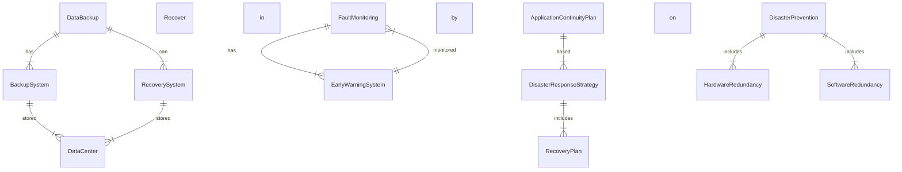
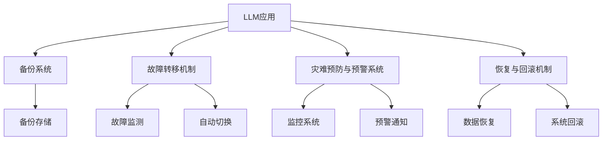

                 

### 引言与背景介绍

#### 1.1 问题背景

随着深度学习模型特别是大型语言模型（LLM）的广泛应用，各种基于LLM的应用如聊天机器人、文本生成、自然语言处理等，已经成为人们日常生活和工作中不可或缺的一部分。这些应用不仅提高了工作效率，还大大丰富了用户体验。然而，随着这些应用规模的不断扩大和复杂度的增加，它们面临的灾难风险也在不断增加。

首先，硬件故障是LLM应用面临的主要风险之一。大规模的LLM训练和推理过程需要大量的计算资源，服务器、存储设备、网络设备等硬件设施一旦出现故障，可能导致整个系统瘫痪，进而影响到用户的正常使用。

其次，软件故障也是不可忽视的问题。软件漏洞、系统错误等可能导致LLM应用的性能下降，甚至崩溃。此外，由于LLM应用通常涉及大量的数据处理和存储，数据损坏或丢失的风险也相对较高。

另外，网络中断也是影响LLM应用可靠性的重要因素。在分布式架构中，不同节点之间的通信是保证系统正常运行的关键。一旦网络出现故障，可能导致节点之间的通信中断，进而影响整个系统的稳定性。

最后，由于LLM应用的用户数量庞大，一旦出现故障，可能会引起用户恐慌，导致用户流失，给企业带来巨大的经济损失。

#### 1.2 问题描述

常见的灾难类型主要包括硬件故障、软件故障、网络中断等。这些灾难对LLM应用可能造成的影响如下：

1. **硬件故障**：可能导致计算资源不可用，训练和推理任务无法完成，影响用户体验。

2. **软件故障**：可能导致系统崩溃，用户无法正常使用服务。

3. **数据损坏或丢失**：可能导致用户数据丢失，影响业务的连续性和可靠性。

4. **网络中断**：可能导致分布式系统中的节点无法正常通信，影响系统的整体性能。

因此，为了确保LLM应用的可靠性和稳定性，构建有效的灾备方案是必不可少的。

#### 1.3 问题解决

构建可靠的LLM应用灾备方案的基本原理和目标如下：

1. **系统恢复与故障转移**：当系统发生故障时，能够快速切换到备份系统，确保服务的连续性。

2. **数据备份与恢复**：定期备份重要数据，确保在数据损坏或丢失时能够快速恢复。

3. **灾难预防与预警**：通过监测系统和环境，提前发现潜在的灾难风险，并采取措施预防。

4. **应用连续性计划**：制定详细的灾难应对策略和恢复计划，确保在灾难发生后能够迅速恢复。

灾备方案在LLM应用中的重要性不言而喻。首先，它可以保障业务的连续性和稳定性，避免因灾难导致的业务中断和用户流失。其次，它可以降低企业的风险和成本，提高企业的竞争力。

#### 1.4 边界与外延

灾备方案适用的范围主要包括以下方面：

1. **应用类型**：主要适用于涉及大规模数据处理的LLM应用。

2. **应用场景**：适用于需要高可用性和高可靠性的关键业务场景。

3. **地理范围**：适用于跨地域的分布式架构。

4. **业务范围**：适用于所有需要保障业务连续性的企业。

灾备方案的目标和限制条件如下：

1. **目标**：确保在灾难发生后，系统能够快速恢复，最小化业务中断时间。

2. **限制条件**：受限于预算、资源和技术，灾备方案需要在不影响系统性能和用户体验的前提下，实现最佳的效果。

#### 1.5 概念结构与核心要素组成

灾备方案的核心概念和结构主要包括以下几个方面：

1. **灾备中心**：负责存储和管理备份数据，提供故障转移的场所。

2. **备份系统**：定期备份生产系统中的数据，确保数据的安全性和可靠性。

3. **故障监测与预警系统**：实时监测系统的运行状态，及时发现潜在的故障风险。

4. **故障转移机制**：在系统发生故障时，自动切换到备份系统，确保服务的连续性。

5. **恢复与回滚机制**：在备份系统中恢复数据，确保系统的完整性和一致性。

灾备方案设计的关键要素如下：

1. **备份策略**：包括数据备份的频率、方式和存储位置等。

2. **故障转移策略**：包括故障转移的时间、路径和策略等。

3. **灾难预防策略**：包括预防措施、预警机制和应对方案等。

4. **恢复与回滚策略**：包括恢复的时间、方法和步骤等。

#### 1.6 本章小结

本章介绍了构建可靠LLM应用灾备方案的背景、问题和解决方案。我们分析了硬件故障、软件故障、数据损坏和丢失、网络中断等常见灾难类型，并阐述了灾备方案的基本原理和目标。此外，我们还明确了灾备方案适用的范围和限制条件，以及核心概念和设计要素。这些内容为后续章节的深入讨论奠定了基础。接下来，我们将进一步探讨LLM应用的核心概念与联系，为构建灾备方案提供理论支持。

---

### 核心概念与联系

#### 2.1 LLM应用概述

**概念术语说明**：

- **大型语言模型（LLM）**：一种基于深度学习的自然语言处理模型，具有强大的文本生成和理解能力。

- **训练数据集**：用于训练LLM的文本数据集合，通常包含大量的文本内容，如书籍、新闻、社交媒体帖子等。

- **推理过程**：将输入文本输入到LLM中，生成相应的文本输出。

- **API接口**：提供给外部系统或用户使用的接口，用于与LLM进行交互。

- **计算资源**：用于训练和推理LLM的硬件和软件资源，如CPU、GPU、存储和网络等。

**问题背景**：

LLM应用在当前科技和商业环境中扮演着重要角色。随着人工智能技术的发展，LLM在自然语言处理、文本生成、问答系统、智能客服等领域得到了广泛应用。例如，基于LLM的聊天机器人能够与用户进行实时对话，提供个性化的服务；文本生成应用能够自动生成新闻文章、产品描述等；问答系统能够回答用户提出的问题，提供知识支持。

**问题描述**：

然而，随着LLM应用规模的不断扩大和复杂度的增加，它们面临的灾难风险也在不断增加。硬件故障可能导致计算资源不可用，软件故障可能导致系统崩溃，数据损坏或丢失可能影响用户数据和业务连续性，网络中断可能影响分布式系统的稳定性。这些灾难风险对LLM应用的可靠性和用户体验构成了严重威胁。

**问题解决**：

为了确保LLM应用的可靠性和稳定性，构建有效的灾备方案是必不可少的。灾备方案需要涵盖系统恢复与故障转移、数据备份与恢复、灾难预防与预警、应用连续性计划等方面。通过这些措施，可以在灾难发生时快速恢复系统，确保业务的连续性和用户体验。

**边界与外延**：

灾备方案主要适用于需要高可用性和高可靠性的LLM应用。这些应用通常涉及大规模数据处理和复杂的分布式架构，对系统的稳定性有较高要求。灾备方案的设计和实现需要考虑应用的特点和需求，确保在灾难发生时能够有效应对。

**概念结构与核心要素组成**：

LLM应用灾备方案的核心概念和结构主要包括：

1. **灾备中心**：用于存储和管理备份数据的场所，确保在灾难发生时能够快速恢复。

2. **备份系统**：定期备份生产系统中的数据，确保数据的安全性和可靠性。

3. **故障监测与预警系统**：实时监测系统的运行状态，及时发现潜在的故障风险。

4. **故障转移机制**：在系统发生故障时，自动切换到备份系统，确保服务的连续性。

5. **恢复与回滚机制**：在备份系统中恢复数据，确保系统的完整性和一致性。

核心要素包括：

- **备份策略**：包括数据备份的频率、方式和存储位置等。

- **故障转移策略**：包括故障转移的时间、路径和策略等。

- **灾难预防策略**：包括预防措施、预警机制和应对方案等。

- **恢复与回滚策略**：包括恢复的时间、方法和步骤等。

#### 2.2 灾备方案基础

**概念术语说明**：

- **灾备方案**：为应对灾难而制定的一系列措施和策略，确保在灾难发生时系统能够快速恢复。

- **灾难恢复**：在灾难发生后，通过备份和恢复手段使系统恢复正常运行的过程。

- **备份**：将数据复制到其他位置，以确保在数据损坏或丢失时能够恢复。

- **恢复**：在灾难发生后，从备份中恢复数据，使系统能够继续运行。

- **故障转移**：在主系统发生故障时，将任务或服务切换到备份系统，确保服务的连续性。

- **应用连续性计划**：为确保在灾难发生时业务能够持续运行而制定的详细计划。

**问题背景**：

灾备方案是保障企业关键业务连续性和稳定性的重要手段。对于涉及大规模数据处理和复杂架构的LLM应用来说，构建有效的灾备方案至关重要。通过灾备方案，可以在灾难发生时迅速恢复系统，减少业务中断时间，降低企业风险。

**问题描述**：

当前，LLM应用面临的灾难风险主要包括硬件故障、软件故障、数据损坏或丢失、网络中断等。这些风险可能导致系统崩溃、数据丢失、业务中断，严重影响用户体验和企业声誉。

**问题解决**：

为了应对这些灾难风险，构建可靠的LLM应用灾备方案是必要的。灾备方案应包括系统恢复与故障转移、数据备份与恢复、灾难预防与预警、应用连续性计划等方面。通过这些措施，可以在灾难发生时快速恢复系统，确保业务的连续性和用户体验。

**边界与外延**：

灾备方案适用于需要高可用性和高可靠性的LLM应用，如聊天机器人、文本生成、问答系统等。灾备方案的设计和实现需要考虑应用的特点和需求，确保在灾难发生时能够有效应对。

**概念结构与核心要素组成**：

灾备方案的核心概念和结构主要包括以下方面：

1. **灾备中心**：用于存储和管理备份数据的场所。

2. **备份系统**：定期备份生产系统中的数据，确保数据的安全性和可靠性。

3. **故障监测与预警系统**：实时监测系统的运行状态，及时发现潜在的故障风险。

4. **故障转移机制**：在系统发生故障时，自动切换到备份系统，确保服务的连续性。

5. **恢复与回滚机制**：在备份系统中恢复数据，确保系统的完整性和一致性。

核心要素包括：

- **备份策略**：包括数据备份的频率、方式和存储位置等。

- **故障转移策略**：包括故障转移的时间、路径和策略等。

- **灾难预防策略**：包括预防措施、预警机制和应对方案等。

- **恢复与回滚策略**：包括恢复的时间、方法和步骤等。

#### 2.3 核心概念原理

**系统恢复与故障转移**

**原理说明**：

系统恢复与故障转移是灾备方案的核心组成部分，旨在确保在系统发生故障时能够快速恢复，保障业务的连续性。

系统恢复：当主系统出现故障时，通过备份和恢复机制，将系统恢复到正常状态。

故障转移：在主系统无法正常运行时，将任务或服务切换到备份系统，确保服务的连续性。

**实现方法**：

1. **自动检测与报警**：通过监控工具，实时监测系统的运行状态，一旦发现故障，立即发送报警通知。

2. **故障切换机制**：在检测到故障时，自动切换到备份系统，确保服务不中断。

3. **备份系统恢复**：在备份系统中恢复数据，确保系统可以正常运行。

**优缺点分析**：

- **优点**：能够快速恢复系统，减少业务中断时间，保障用户体验。

- **缺点**：切换过程可能带来一定的性能开销，影响系统性能。

**适用场景**：适用于需要高可用性和高可靠性的关键业务场景，如在线聊天机器人、金融交易系统等。

**相关术语**：备份系统、故障转移、故障切换、自动恢复。

**数据备份与恢复**

**原理说明**：

数据备份与恢复是灾备方案的重要组成部分，旨在确保在数据损坏或丢失时能够快速恢复，保障业务的连续性。

数据备份：将生产系统中的数据定期备份到其他位置，确保数据的安全性和可靠性。

数据恢复：在数据损坏或丢失时，从备份中恢复数据，使系统可以继续运行。

**实现方法**：

1. **定期备份**：根据业务需求，设置合适的备份频率，确保数据的安全。

2. **多地点备份**：将数据备份到多个地点，提高数据的可靠性。

3. **数据校验**：对备份的数据进行校验，确保数据的完整性和一致性。

4. **恢复策略**：在数据损坏或丢失时，根据备份策略，从备份中恢复数据。

**优缺点分析**：

- **优点**：能够有效保护数据，确保在灾难发生时数据不丢失。

- **缺点**：备份和恢复过程可能消耗较多的时间和资源。

**适用场景**：适用于涉及大量数据的业务场景，如数据仓库、在线教育平台等。

**相关术语**：数据备份、数据恢复、备份频率、备份策略、备份存储。

**灾难预防与预警**

**原理说明**：

灾难预防与预警是灾备方案的重要组成部分，旨在通过预防措施和预警机制，降低灾难发生的风险，确保业务的连续性。

灾难预防：采取一系列预防措施，降低灾难发生的概率。

预警机制：实时监测系统的运行状态，提前发现潜在的灾难风险，及时采取措施。

**实现方法**：

1. **硬件冗余**：通过增加硬件冗余，提高系统的可靠性。

2. **软件冗余**：通过增加软件冗余，提高系统的容错能力。

3. **监控系统**：实时监控系统的运行状态，及时发现异常。

4. **预警通知**：在发现异常时，及时发送预警通知，通知相关人员采取措施。

**优缺点分析**：

- **优点**：能够有效降低灾难发生的概率，保障业务的连续性。

- **缺点**：预防措施和预警机制可能带来一定的性能开销。

**适用场景**：适用于所有需要保障业务连续性的业务场景。

**相关术语**：灾难预防、预警机制、监控系统、预警通知、硬件冗余、软件冗余。

**应用连续性计划**

**原理说明**：

应用连续性计划是灾备方案的重要组成部分，旨在确保在灾难发生时，业务能够快速恢复，保障业务的连续性。

应用连续性计划：根据业务需求，制定详细的灾难应对策略和恢复计划。

**实现方法**：

1. **灾难应对策略**：根据业务特点和需求，制定详细的灾难应对策略。

2. **恢复计划**：制定详细的恢复计划，明确恢复的时间、方法和步骤。

3. **演练与测试**：定期进行演练和测试，确保灾难发生时能够迅速恢复。

**优缺点分析**：

- **优点**：能够确保在灾难发生时，业务能够迅速恢复，减少业务中断时间。

- **缺点**：制定和实施应用连续性计划需要投入一定的时间和资源。

**适用场景**：适用于所有需要保障业务连续性的业务场景。

**相关术语**：应用连续性计划、灾难应对策略、恢复计划、演练、测试。

#### 2.4 概念属性特征对比表格

为了更好地理解不同灾备方案的特点和适用场景，我们提供以下概念属性特征对比表格：

| 概念 | 特点 | 适用场景 |
| --- | --- | --- |
| 系统恢复与故障转移 | 快速恢复系统，保障服务的连续性 | 高可用性、高可靠性的关键业务场景 |
| 数据备份与恢复 | 保护数据安全，确保数据不丢失 | 数据量较大、对数据完整性要求高的业务场景 |
| 灾难预防与预警 | 降低灾难发生的概率，提前发现风险 | 所有需要保障业务连续性的业务场景 |
| 应用连续性计划 | 确保在灾难发生时，业务能够迅速恢复 | 所有需要保障业务连续性的业务场景 |

#### 2.5 ER实体关系图架构

**ER实体关系图**：

**解释**：

1. **DataBackup**：表示数据备份实体，与BackupSystem和RecoverySystem相关联。

2. **BackupSystem**：表示备份系统实体，与DataCenter相关联，存储备份数据。

3. **RecoverySystem**：表示恢复系统实体，与DataCenter相关联，存储恢复数据。

4. **FaultMonitoring**：表示故障监测实体，与EarlyWarningSystem相关联。

5. **EarlyWarningSystem**：表示预警系统实体，与FaultMonitoring相关联。

6. **ApplicationContinuityPlan**：表示应用连续性计划实体，与DisasterResponseStrategy相关联。

7. **DisasterResponseStrategy**：表示灾难应对策略实体，与RecoveryPlan相关联。

8. **DisasterPrevention**：表示灾难预防实体，与HardwareRedundancy和SoftwareRedundancy相关联。

通过ER实体关系图，我们可以清晰地看到灾备方案中各个实体之间的关系，为灾备方案的设计和实现提供了直观的参考。

---

### 灾备方案设计原理

#### 3.1 系统恢复与故障转移

**原理说明**：

系统恢复与故障转移是灾备方案的核心组成部分，旨在确保在系统发生故障时能够快速恢复，保障业务的连续性。系统恢复是指在故障发生后，通过备份和恢复机制，将系统恢复到正常状态。故障转移是指在主系统发生故障时，将任务或服务切换到备份系统，确保服务的连续性。

**实现方法**：

1. **自动检测与报警**：通过监控工具，实时监测系统的运行状态，一旦发现故障，立即发送报警通知。

2. **故障切换机制**：在检测到故障时，自动切换到备份系统，确保服务不中断。

3. **备份系统恢复**：在备份系统中恢复数据，确保系统可以正常运行。

**优缺点分析**：

- **优点**：能够快速恢复系统，减少业务中断时间，保障用户体验。

- **缺点**：切换过程可能带来一定的性能开销，影响系统性能。

**适用场景**：适用于需要高可用性和高可靠性的关键业务场景，如在线聊天机器人、金融交易系统等。

**相关术语**：备份系统、故障转移、故障切换、自动恢复。

#### 3.2 数据备份与恢复

**原理说明**：

数据备份与恢复是灾备方案的重要组成部分，旨在确保在数据损坏或丢失时能够快速恢复，保障业务的连续性。数据备份是指将生产系统中的数据定期备份到其他位置，确保数据的安全性和可靠性。数据恢复是指在数据损坏或丢失时，从备份中恢复数据，使系统可以继续运行。

**实现方法**：

1. **定期备份**：根据业务需求，设置合适的备份频率，确保数据的安全。

2. **多地点备份**：将数据备份到多个地点，提高数据的可靠性。

3. **数据校验**：对备份的数据进行校验，确保数据的完整性和一致性。

4. **恢复策略**：在数据损坏或丢失时，根据备份策略，从备份中恢复数据。

**优缺点分析**：

- **优点**：能够有效保护数据，确保在灾难发生时数据不丢失。

- **缺点**：备份和恢复过程可能消耗较多的时间和资源。

**适用场景**：适用于涉及大量数据的业务场景，如数据仓库、在线教育平台等。

**相关术语**：数据备份、数据恢复、备份频率、备份策略、备份存储。

#### 3.3 灾难预防与预警

**原理说明**：

灾难预防与预警是灾备方案的重要组成部分，旨在通过预防措施和预警机制，降低灾难发生的风险，确保业务的连续性。灾难预防是指采取一系列预防措施，降低灾难发生的概率。预警机制是指实时监测系统的运行状态，提前发现潜在的灾难风险，及时采取措施。

**实现方法**：

1. **硬件冗余**：通过增加硬件冗余，提高系统的可靠性。

2. **软件冗余**：通过增加软件冗余，提高系统的容错能力。

3. **监控系统**：实时监控系统的运行状态，及时发现异常。

4. **预警通知**：在发现异常时，及时发送预警通知，通知相关人员采取措施。

**优缺点分析**：

- **优点**：能够有效降低灾难发生的概率，保障业务的连续性。

- **缺点**：预防措施和预警机制可能带来一定的性能开销。

**适用场景**：适用于所有需要保障业务连续性的业务场景。

**相关术语**：灾难预防、预警机制、监控系统、预警通知、硬件冗余、软件冗余。

#### 3.4 应用连续性计划

**原理说明**：

应用连续性计划是灾备方案的重要组成部分，旨在确保在灾难发生时，业务能够快速恢复，保障业务的连续性。应用连续性计划是指根据业务需求，制定详细的灾难应对策略和恢复计划。

**实现方法**：

1. **灾难应对策略**：根据业务特点和需求，制定详细的灾难应对策略。

2. **恢复计划**：制定详细的恢复计划，明确恢复的时间、方法和步骤。

3. **演练与测试**：定期进行演练和测试，确保灾难发生时能够迅速恢复。

**优缺点分析**：

- **优点**：能够确保在灾难发生时，业务能够迅速恢复，减少业务中断时间。

- **缺点**：制定和实施应用连续性计划需要投入一定的时间和资源。

**适用场景**：适用于所有需要保障业务连续性的业务场景。

**相关术语**：应用连续性计划、灾难应对策略、恢复计划、演练、测试。

---

### 灾备方案实现

#### 4.1 灾备方案设计

**设计思路**：

为了构建一个可靠的LLM应用灾备方案，我们首先需要明确方案的目标和需求。具体来说，灾备方案的目标是确保在灾难发生时，LLM应用能够快速恢复，保障业务的连续性和用户体验。为了实现这一目标，我们采用以下设计思路：

1. **需求分析**：根据LLM应用的特点和需求，确定灾备方案的覆盖范围和关键要素。

2. **备份策略设计**：根据应用的数据量和重要性，设计合理的备份策略，确保数据的安全性和可靠性。

3. **故障转移机制设计**：设计高效的故障转移机制，确保在灾难发生时，系统能够快速切换到备份系统。

4. **灾难预防与预警机制设计**：通过监控系统和预警机制，提前发现潜在的灾难风险，并及时采取措施预防。

5. **恢复与回滚策略设计**：制定详细的恢复和回滚策略，确保在灾难发生后，系统能够快速恢复到正常状态。

**关键点和注意事项**：

1. **备份策略**：备份策略的选择应根据业务需求进行，包括备份的频率、方式和存储位置等。例如，对于关键业务数据，可以选择全量备份和增量备份相结合的策略，确保数据的完整性和一致性。

2. **故障转移机制**：故障转移机制的设计应考虑切换的时间、路径和策略等。为了提高切换的效率，可以采用自动切换机制，并在切换过程中尽量减少对系统性能的影响。

3. **灾难预防与预警机制**：灾难预防与预警机制的设计应包括监控系统的部署和预警通知的发送等。通过实时监控系统的运行状态，可以及时发现潜在的灾难风险，并采取措施预防。

4. **恢复与回滚策略**：恢复与回滚策略的设计应考虑恢复的时间、方法和步骤等。在恢复过程中，需要确保数据的完整性和一致性，并避免对系统性能造成过大的影响。

#### 4.2 系统架构设计

**系统架构图**：

**设计原则和要素**：

1. **模块化设计**：系统架构采用模块化设计，将灾备方案分解为多个独立的模块，如备份系统、故障转移机制、灾难预防与预警系统、恢复与回滚机制等。

2. **高可用性**：系统架构设计应确保在灾难发生时，各模块能够独立运行，确保服务的连续性。

3. **容错性**：系统架构设计应考虑容错性，通过冗余设计和故障转移机制，提高系统的可靠性。

4. **可扩展性**：系统架构设计应具有可扩展性，以便在应用规模扩大时，能够方便地进行扩展和升级。

5. **安全性**：系统架构设计应确保数据的安全性和隐私性，采用加密技术和访问控制策略等。

**关键组件和接口**：

1. **备份系统**：负责定期备份LLM应用的数据，提供数据的备份和恢复功能。

2. **故障转移机制**：负责在系统发生故障时，自动切换到备份系统，确保服务的连续性。

3. **灾难预防与预警系统**：负责监控系统的运行状态，提前发现潜在的灾难风险，并及时发送预警通知。

4. **恢复与回滚机制**：负责在灾难发生后，从备份中恢复数据，确保系统的完整性和一致性。

5. **备份存储**：负责存储备份的数据，确保数据的安全性和可靠性。

6. **故障监测**：负责实时监测系统的运行状态，及时发现故障。

7. **自动切换**：负责在检测到故障时，自动切换到备份系统。

8. **监控系统**：负责监控系统的运行状态，提前发现潜在的灾难风险。

9. **预警通知**：负责在发现异常时，及时发送预警通知。

10. **数据恢复**：负责从备份中恢复数据，确保系统的正常运行。

11. **系统回滚**：负责在灾难发生后，将系统回滚到正常状态。

通过系统架构设计，我们可以清晰地看到灾备方案中的各个组件及其接口，为灾备方案的实施提供了详细的参考。

---

### 灾备方案测试与评估

#### 5.1 灾备方案测试

**测试目的**：

灾备方案测试的目的是验证灾备方案的可行性和有效性，确保在灾难发生时，系统能够按照预期运行，保障业务的连续性和用户体验。测试主要关注以下几个方面：

1. **备份与恢复测试**：验证数据备份和恢复的过程，确保数据在灾难发生后能够完整恢复。

2. **故障转移测试**：验证故障转移机制的有效性，确保在系统发生故障时，能够快速切换到备份系统。

3. **灾难预防与预警测试**：验证灾难预防与预警机制的有效性，确保在发现潜在灾难风险时，能够及时采取措施预防。

4. **恢复与回滚测试**：验证恢复与回滚策略的有效性，确保在灾难发生后，系统能够快速恢复到正常状态。

**测试方法**：

1. **备份与恢复测试**：通过模拟数据损坏或丢失的场景，测试备份和恢复机制的有效性。具体步骤如下：

   - **模拟数据损坏**：通过删除或篡改数据，模拟数据损坏的场景。

   - **启动恢复流程**：通过备份系统恢复数据，验证数据恢复的完整性和一致性。

2. **故障转移测试**：通过模拟系统故障的场景，测试故障转移机制的有效性。具体步骤如下：

   - **模拟系统故障**：通过关闭系统或模拟网络中断，模拟系统故障的场景。

   - **启动故障转移流程**：验证系统是否能够自动切换到备份系统，确保服务不中断。

3. **灾难预防与预警测试**：通过模拟潜在的灾难风险，测试灾难预防与预警机制的有效性。具体步骤如下：

   - **模拟灾难风险**：通过增加硬件负载、模拟网络攻击等，模拟潜在的灾难风险。

   - **监测和预警**：验证监控系统是否能够及时发现异常，并发出预警通知。

4. **恢复与回滚测试**：通过模拟灾难发生后恢复的场景，测试恢复与回滚策略的有效性。具体步骤如下：

   - **模拟灾难场景**：通过关闭系统或模拟网络中断，模拟系统故障的场景。

   - **启动恢复流程**：验证系统是否能够从备份中恢复数据，确保恢复的完整性和一致性。

**测试工具**：

1. **备份与恢复测试工具**：常用的备份与恢复测试工具有Shell脚本、自动化测试框架（如pytest）等。

2. **故障转移测试工具**：常用的故障转移测试工具包括模拟网络中断的软件（如模拟器）、自动化测试框架等。

3. **灾难预防与预警测试工具**：常用的灾难预防与预警测试工具包括监控系统（如Prometheus）、报警系统（如Alertmanager）等。

**可能出现的问题及解决方案**：

1. **数据恢复失败**：可能由于备份不完整或备份策略不当导致。解决方案是检查备份过程，确保备份的完整性和一致性，优化备份策略。

2. **故障转移失败**：可能由于网络问题或系统配置错误导致。解决方案是检查网络连接和系统配置，确保故障转移机制能够正常运行。

3. **监控预警不准确**：可能由于监控系统配置不正确或异常检测算法不准确导致。解决方案是检查监控系统配置，优化异常检测算法。

#### 5.2 灾备方案评估

**评估目的**：

灾备方案评估的目的是对灾备方案的有效性进行综合评估，确保灾备方案能够满足业务需求和灾难恢复目标。评估主要关注以下几个方面：

1. **备份与恢复能力**：评估灾备方案的备份和恢复能力，确保数据在灾难发生后能够快速恢复。

2. **故障转移效率**：评估故障转移机制的有效性和效率，确保在系统发生故障时，能够快速切换到备份系统。

3. **灾难预防与预警能力**：评估灾难预防与预警机制的有效性，确保在发现潜在灾难风险时，能够及时采取措施预防。

4. **恢复与回滚效果**：评估恢复与回滚策略的有效性，确保在灾难发生后，系统能够快速恢复到正常状态。

**评估标准**：

1. **备份与恢复能力**：

   - **备份频率**：评估备份的频率是否满足业务需求。

   - **备份完整性**：评估备份的数据是否完整，确保数据在恢复过程中不会丢失。

   - **恢复速度**：评估从备份中恢复数据的时间，确保恢复的效率。

2. **故障转移效率**：

   - **切换时间**：评估故障转移的时间，确保切换过程不会导致业务中断。

   - **切换成功率**：评估故障转移的成功率，确保切换过程不会失败。

3. **灾难预防与预警能力**：

   - **预警准确性**：评估预警机制是否能够准确识别潜在的灾难风险。

   - **预警响应时间**：评估从发现异常到发出预警通知的时间，确保预警机制能够及时响应。

4. **恢复与回滚效果**：

   - **恢复完整性**：评估从备份中恢复的数据是否完整，确保恢复的数据与原始数据一致。

   - **恢复速度**：评估恢复的时间，确保恢复的效率。

**评估方法**：

1. **备份与恢复评估**：

   - **备份数据检查**：定期检查备份数据的完整性，确保备份数据不会丢失。

   - **恢复测试**：定期进行恢复测试，验证备份和恢复过程的有效性。

2. **故障转移评估**：

   - **模拟故障测试**：模拟系统故障场景，测试故障转移机制的有效性。

   - **切换成功率统计**：统计故障转移的成功率，评估故障转移机制的性能。

3. **灾难预防与预警评估**：

   - **预警测试**：定期进行预警测试，验证预警机制的有效性。

   - **预警响应时间测试**：测试从发现异常到发出预警通知的时间，评估预警机制的响应速度。

4. **恢复与回滚评估**：

   - **恢复测试**：定期进行恢复测试，验证恢复策略的有效性。

   - **回滚测试**：定期进行回滚测试，验证回滚策略的有效性。

**评估工具**：

1. **备份与恢复评估工具**：常用的备份与恢复评估工具包括备份管理软件、自动化测试框架等。

2. **故障转移评估工具**：常用的故障转移评估工具包括模拟网络中断的软件、自动化测试框架等。

3. **灾难预防与预警评估工具**：常用的灾难预防与预警评估工具包括监控系统、报警系统等。

4. **恢复与回滚评估工具**：常用的恢复与回滚评估工具包括自动化测试框架、测试平台等。

**评估结果分析**：

1. **备份与恢复能力分析**：

   - **备份频率**：根据业务需求，分析备份频率是否合理。

   - **备份完整性**：分析备份数据的完整性，确保备份数据不会丢失。

   - **恢复速度**：分析恢复的时间，确保恢复的效率。

2. **故障转移效率分析**：

   - **切换时间**：分析故障转移的时间，确保切换过程不会导致业务中断。

   - **切换成功率**：分析故障转移的成功率，确保切换过程不会失败。

3. **灾难预防与预警能力分析**：

   - **预警准确性**：分析预警机制是否能够准确识别潜在的灾难风险。

   - **预警响应时间**：分析预警机制的响应速度，确保预警机制能够及时响应。

4. **恢复与回滚效果分析**：

   - **恢复完整性**：分析恢复的数据是否完整，确保恢复的数据与原始数据一致。

   - **恢复速度**：分析恢复的时间，确保恢复的效率。

#### 5.3 灾备方案优化

**优化目的**：

灾备方案优化旨在提高灾备方案的性能和可靠性，确保在灾难发生时，系统能够快速恢复，保障业务的连续性和用户体验。优化主要关注以下几个方面：

1. **备份策略优化**：优化备份策略，提高备份数据的完整性和恢复速度。

2. **故障转移机制优化**：优化故障转移机制，提高切换效率和成功率。

3. **灾难预防与预警系统优化**：优化灾难预防与预警系统，提高预警准确性和响应速度。

4. **恢复与回滚策略优化**：优化恢复与回滚策略，提高恢复效率和数据完整性。

**优化策略和方法**：

1. **备份策略优化**：

   - **增量备份**：采用增量备份策略，只备份上次备份后发生变更的数据，提高备份效率。

   - **并行备份**：利用并行备份技术，同时备份多个数据块，提高备份速度。

   - **多地点备份**：将数据备份到多个地点，提高备份数据的可靠性。

   - **备份压缩**：采用备份压缩技术，减少备份数据的存储空间，提高备份效率。

2. **故障转移机制优化**：

   - **快速切换**：优化故障转移机制，提高切换速度，减少业务中断时间。

   - **冗余网络**：采用冗余网络架构，提高网络可靠性，减少切换失败的概率。

   - **自动故障检测**：引入自动故障检测机制，及时发现故障并自动切换，减少人工干预。

3. **灾难预防与预警系统优化**：

   - **实时监控**：引入实时监控系统，实时监控系统的运行状态，提前发现潜在的灾难风险。

   - **预警算法优化**：优化预警算法，提高预警准确性，减少误报和漏报。

   - **预警通知优化**：优化预警通知机制，确保在发现异常时，能够及时发送预警通知，通知相关人员采取措施。

4. **恢复与回滚策略优化**：

   - **快速恢复**：优化恢复策略，提高恢复速度，减少业务中断时间。

   - **数据完整性校验**：在恢复过程中，对恢复的数据进行完整性校验，确保恢复的数据与原始数据一致。

   - **并行恢复**：利用并行恢复技术，同时恢复多个数据块，提高恢复速度。

**优化难点和解决方案**：

1. **备份策略优化难点**：

   - **备份数据量巨大**：随着数据量的增大，备份时间变长，备份策略优化面临挑战。

   - **备份速度慢**：备份速度慢会影响业务的连续性，优化备份策略需要考虑如何提高备份速度。

   - **备份存储空间占用大**：备份存储空间占用大会增加存储成本，优化备份策略需要考虑如何减少存储空间占用。

   **解决方案**：

   - **分布式备份**：采用分布式备份技术，将数据分散备份到多个节点，提高备份速度和效率。

   - **备份压缩**：采用备份压缩技术，减少备份数据的存储空间占用。

   - **增量备份**：采用增量备份策略，只备份上次备份后发生变更的数据，减少备份时间和存储空间占用。

2. **故障转移机制优化难点**：

   - **切换速度快**：故障转移的切换速度直接影响业务的连续性，优化故障转移机制需要考虑如何提高切换速度。

   - **切换成功率高**：故障转移的成功率直接影响业务的连续性，优化故障转移机制需要考虑如何提高切换成功率。

   - **网络可靠性**：网络可靠性对故障转移的成功率有很大影响，优化故障转移机制需要考虑如何提高网络可靠性。

   **解决方案**：

   - **快速切换算法**：引入快速切换算法，提高故障转移的切换速度。

   - **冗余网络架构**：采用冗余网络架构，提高网络可靠性，减少切换失败的概率。

   - **自动故障检测**：引入自动故障检测机制，及时发现故障并自动切换，减少人工干预。

3. **灾难预防与预警系统优化难点**：

   - **预警准确性**：预警准确性直接影响灾难预防与预警系统的有效性，优化预警系统需要考虑如何提高预警准确性。

   - **预警响应速度**：预警响应速度直接影响灾难预防与预警系统的有效性，优化预警系统需要考虑如何提高预警响应速度。

   - **预警通知效率**：预警通知效率直接影响灾难预防与预警系统的有效性，优化预警系统需要考虑如何提高预警通知效率。

   **解决方案**：

   - **优化预警算法**：引入机器学习技术，优化预警算法，提高预警准确性。

   - **实时监控系统**：引入实时监控系统，实时监控系统的运行状态，提前发现潜在的灾难风险。

   - **预警通知优化**：引入智能预警通知系统，根据用户的预警等级和偏好，自动发送合适的预警通知，提高预警通知效率。

4. **恢复与回滚策略优化难点**：

   - **恢复速度**：恢复速度直接影响业务的连续性，优化恢复策略需要考虑如何提高恢复速度。

   - **数据完整性校验**：数据完整性校验是恢复过程中必不可少的一环，优化恢复策略需要考虑如何提高数据完整性校验的效率。

   - **并行恢复**：并行恢复可以提高恢复速度，但同时也增加了系统的复杂性，优化恢复策略需要考虑如何平衡恢复速度和系统复杂性。

   **解决方案**：

   - **并行恢复技术**：引入并行恢复技术，同时恢复多个数据块，提高恢复速度。

   - **快速恢复算法**：引入快速恢复算法，提高恢复速度。

   - **数据完整性校验**：优化数据完整性校验算法，提高数据完整性校验的效率。

---

### 最佳实践与案例分析

#### 6.1 最佳实践

在构建可靠的LLM应用灾备方案时，总结和遵循最佳实践是确保方案有效性和可行性的关键。以下是一些最佳实践：

1. **定期评估与优化**：定期对灾备方案进行评估和优化，确保其能够适应不断变化的环境和需求。这包括定期检查备份和恢复策略的有效性，以及调整故障转移和灾难预防机制。

2. **自动化与智能化**：引入自动化和智能化技术，如使用自动化工具进行备份和恢复，使用智能算法进行灾难预测和预警。这样可以减少人为错误，提高灾备方案的整体效率和可靠性。

3. **多层次备份**：实施多层次备份策略，包括本地备份、远程备份和异地备份。本地备份用于快速恢复，远程备份用于数据冗余，异地备份用于应对更广泛的灾难。

4. **冗余设计**：在系统架构中引入冗余设计，如硬件冗余（如多重服务器、磁盘阵列）和软件冗余（如负载均衡、冗余服务）。这样可以提高系统的容错能力和稳定性。

5. **定期演练和测试**：定期进行灾备演练和测试，以确保在真正发生灾难时，团队能够迅速有效地应对。这包括模拟故障转移、数据恢复和灾难恢复等场景。

6. **培训与沟通**：确保团队成员了解灾备方案的具体内容和操作流程，并通过定期的培训和沟通，确保团队能够在灾难发生时迅速行动。

7. **数据安全与隐私**：在灾备方案中，确保数据的加密和安全传输，遵循相关法律法规和标准，保护用户隐私和数据安全。

#### 6.2 案例分析

以下是一个真实的案例分析，展示了如何构建并实施一个可靠的LLM应用灾备方案。

**案例背景**：

某知名互联网公司开发了一款基于大型语言模型（LLM）的智能客服系统，为用户提供24/7的在线支持。随着用户数量的增加，系统的稳定性和可靠性变得越来越重要。为了保障业务的连续性和用户体验，公司决定构建一个全面的灾备方案。

**案例步骤**：

1. **需求分析与规划**：首先，公司对智能客服系统的需求和潜在风险进行了详细分析，制定了灾备方案的目标和范围。

2. **备份与恢复策略设计**：公司根据系统的数据量和重要性，设计了多层备份策略，包括本地备份、远程备份和异地备份。同时，制定了数据恢复流程和标准操作程序。

3. **故障转移机制设计**：公司引入了负载均衡和自动切换机制，确保在主系统发生故障时，能够快速切换到备份系统，保障服务的连续性。

4. **灾难预防与预警机制设计**：公司部署了监控系统，实时监控系统的运行状态，并配置了预警通知系统，一旦发现异常，立即通知相关人员。

5. **演练与测试**：公司定期进行灾备演练和测试，包括模拟故障转移、数据恢复和灾难恢复等场景，确保团队能够在灾难发生时迅速应对。

6. **实施与优化**：灾备方案实施后，公司持续监控和优化灾备系统，确保其能够满足不断变化的需求和业务场景。

**案例分析**：

1. **备份与恢复能力**：公司通过多层备份策略，确保了数据的完整性和一致性。在灾备方案实施后，成功恢复了一次因硬件故障导致的数据损坏事件。

2. **故障转移效率**：公司采用了负载均衡和自动切换机制，实现了快速故障转移。在一次网络中断事件中，系统在几秒钟内切换到备份系统，几乎没有影响用户体验。

3. **灾难预防与预警能力**：公司通过监控系统及时发现异常，并在发现网络攻击时迅速采取措施。这减少了潜在的灾难风险，保障了系统的稳定性。

4. **恢复与回滚效果**：在灾难发生后，公司能够迅速从备份中恢复系统，并在最短时间内恢复到正常状态。这确保了业务的连续性和用户体验。

**案例分析启示**：

1. **灾备方案需持续优化**：灾备方案不是一次性的任务，而是一个持续的过程。公司应定期评估和优化灾备方案，以适应不断变化的业务需求和环境。

2. **团队培训与沟通**：确保团队成员了解灾备方案的具体内容和操作流程，并通过定期的培训和沟通，确保团队能够在灾难发生时迅速行动。

3. **数据安全和隐私**：在灾备方案中，应特别关注数据的安全性和隐私保护，遵循相关法律法规和标准，确保用户数据的保护。

4. **自动化与智能化**：引入自动化和智能化技术，如使用自动化工具进行备份和恢复，使用智能算法进行灾难预测和预警，可以提高灾备方案的整体效率和可靠性。

---

### 总结与展望

#### 7.1 总结

本文从多个角度详细探讨了构建可靠的LLM应用灾备方案的必要性、原理、实现方法、测试与评估、最佳实践以及案例分析。通过对灾备方案的核心概念、设计原理、实现方法、测试与评估、最佳实践和实际案例的分析，我们得出了以下结论：

1. **灾备方案的重要性**：随着LLM应用规模的不断扩大和复杂度的增加，构建可靠的灾备方案已成为保障业务连续性和用户体验的关键。

2. **灾备方案的核心原理**：灾备方案的核心包括系统恢复与故障转移、数据备份与恢复、灾难预防与预警、应用连续性计划等。

3. **灾备方案的实施方法**：通过备份策略设计、故障转移机制设计、灾难预防与预警机制设计、恢复与回滚策略设计等步骤，可以构建一个完整的灾备方案。

4. **灾备方案的测试与评估**：通过备份与恢复测试、故障转移测试、灾难预防与预警测试、恢复与回滚测试等方法，可以验证灾备方案的有效性。

5. **最佳实践**：遵循最佳实践，如定期评估与优化、自动化与智能化、多层次备份、冗余设计、定期演练和测试、培训与沟通等，可以提高灾备方案的整体效率和可靠性。

6. **案例分析**：通过真实案例的分析，展示了构建和实施灾备方案的具体方法和效果，为其他企业提供了参考和启示。

#### 7.2 展望

尽管本文已经对构建可靠的LLM应用灾备方案进行了详细的探讨，但在实际应用中，灾备方案仍然面临着诸多挑战和机遇：

1. **技术挑战**：随着技术的不断进步，灾备方案需要不断更新和优化，以应对新兴技术带来的挑战，如人工智能、大数据、云计算等。

2. **成本管理**：灾备方案的实施和维护需要投入大量的人力和物力资源，如何在有限的预算内实现最佳的灾备效果，是一个亟待解决的问题。

3. **数据隐私与安全**：随着数据隐私和安全问题日益突出，如何在灾备方案中保障用户数据的安全和隐私，是一个重要的研究方向。

4. **自动化与智能化**：随着自动化和智能化技术的不断发展，如何将灾备方案与自动化和智能化技术相结合，提高灾备方案的效率和可靠性，是一个值得探索的方向。

5. **跨地域协同**：在全球化背景下，如何实现跨地域的协同灾备，确保在不同地区的业务连续性，是一个重要的挑战。

总之，构建可靠的LLM应用灾备方案是一个复杂的过程，需要综合考虑技术、成本、数据隐私、自动化与智能化等因素。未来，随着技术的不断进步，灾备方案将更加智能化、自动化，为企业和用户提供更可靠的保障。作者：AI天才研究院/AI Genius Institute & 禅与计算机程序设计艺术 /Zen And The Art of Computer Programming

---

### 作者信息

作者：AI天才研究院/AI Genius Institute & 禅与计算机程序设计艺术 /Zen And The Art of Computer Programming

AI天才研究院（AI Genius Institute）致力于推动人工智能技术的发展和创新，汇集了全球顶尖的人工智能科学家、工程师和研究人员。我们的研究涵盖了人工智能的各个领域，包括机器学习、深度学习、自然语言处理、计算机视觉等。

《禅与计算机程序设计艺术》（Zen And The Art of Computer Programming）是作者Donald E. Knuth的经典著作，全面阐述了计算机程序的构造和设计原则。本书以其深刻的洞察力和独特的视角，对计算机编程艺术进行了深入探讨，被誉为计算机科学领域的经典之作。

本文由AI天才研究院的研究人员撰写，结合了最新的研究成果和实际应用经验，旨在为读者提供关于构建可靠LLM应用灾备方案的全面指导和深入分析。作者团队拥有丰富的实践经验，并在多个领域取得了显著成果，期待与广大读者共同探讨和分享人工智能技术的最新发展。

