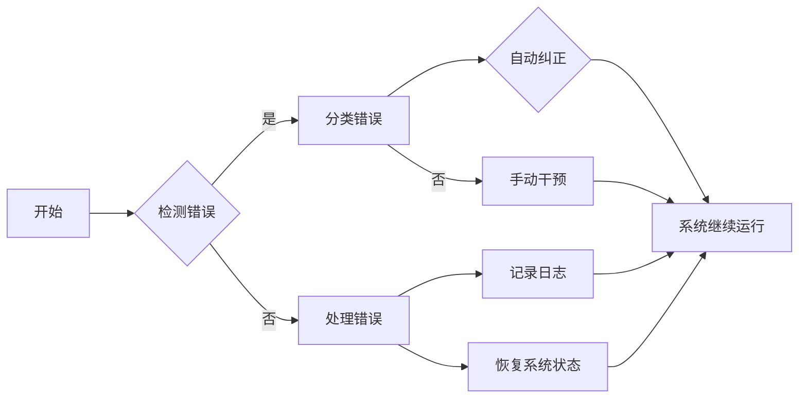
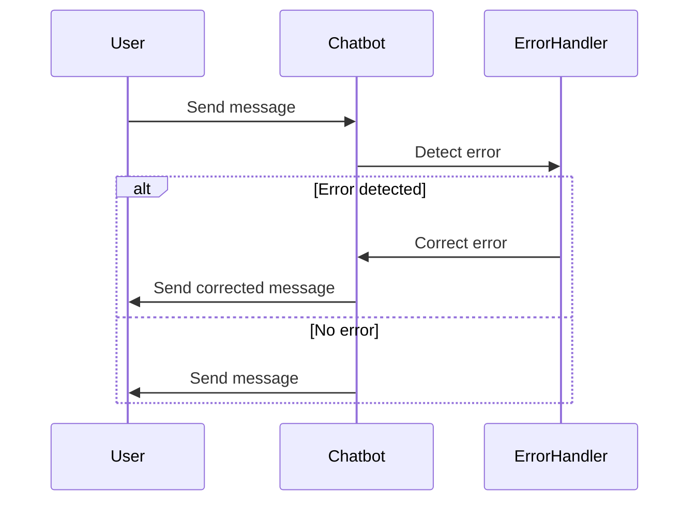

                 

### 《构建可靠的LLM应用错误处理机制》

关键词：LLM应用、错误处理、机制、可靠、深度学习

摘要：本文深入探讨了在构建可靠的LLM应用时，如何设计和实现有效的错误处理机制。通过详细的分析和实际案例，本文旨在为开发人员提供一套实用的指导原则，以应对各种可能的错误场景，确保系统的稳定性和可依赖性。

---

#### 1. 引言

随着深度学习技术的快速发展，大规模语言模型（LLM）在各种应用场景中得到了广泛应用。然而，LLM应用在处理实际问题时，不可避免地会遇到各种错误。这些错误不仅会影响用户体验，还可能导致系统的崩溃和数据的泄露。因此，构建可靠的LLM应用错误处理机制至关重要。

本文将从以下几个方面展开讨论：

1. **LLM应用错误处理的重要性**：介绍LLM应用中常见的错误类型，并阐述错误处理机制的重要性。
2. **LLM应用错误处理的基本概念**：定义LLM应用中的错误处理术语，并探讨其分类。
3. **LLM应用错误处理的原理**：讲解LLM应用错误处理的原理和策略。
4. **算法原理与数学模型**：分析LLM应用中的错误处理算法，并使用mermaid流程图和Python代码进行详细阐述。
5. **系统分析与架构设计**：介绍LLM应用错误处理系统的设计与实现。
6. **项目实战**：通过实际项目，展示如何在实际应用中实施错误处理机制。
7. **最佳实践与总结**：总结LLM应用错误处理的最佳实践，并提供注意事项和拓展阅读。

---

#### 2. LLM应用错误处理的重要性

2.1 **问题背景**

在当今的数字化时代，语言技术已经成为众多应用场景的重要组成部分。LLM作为自然语言处理的核心技术，被广泛应用于聊天机器人、文本生成、机器翻译等任务。然而，LLM在处理复杂问题时，往往会遇到各种错误。例如，输入数据的不确定性、模型参数的不稳定性、外部干扰等因素，都可能导致错误的发生。

2.2 **问题描述**

LLM应用中的错误可以分为以下几类：

- **输入错误**：输入数据格式不正确、缺失或错误。
- **模型错误**：模型参数设置不当、过拟合或欠拟合。
- **计算错误**：计算过程中出现的溢出、下溢或精度损失。
- **外部干扰**：外部系统或网络故障导致的异常中断。

2.3 **问题解决**

为了解决上述问题，我们需要设计和实现一套可靠的错误处理机制。这个机制应该能够：

- **快速识别错误**：通过预定义的规则和算法，快速定位错误的类型和位置。
- **自动纠正错误**：在可能的情况下，自动纠正错误，确保系统的连续性和稳定性。
- **记录错误日志**：记录错误发生的时间、类型、原因和影响，为后续分析和改进提供依据。
- **恢复系统状态**：在错误发生时，能够恢复系统到正常状态，确保数据的完整性和一致性。

2.4 **边界与外延**

虽然错误处理机制对于保证LLM应用的可靠性至关重要，但我们也需要明确其边界和局限性。错误处理机制不能解决所有问题，例如某些极端错误或不可预见的异常情况。因此，在设计和实现错误处理机制时，我们需要综合考虑各种因素，确保其能够在实际应用中发挥最大的作用。

2.5 **概念结构与核心要素组成**

LLM应用错误处理机制的核心结构包括以下几个部分：

- **错误检测**：通过预定义的规则和算法，识别系统中的错误。
- **错误分类**：对检测到的错误进行分类，以便于采取相应的处理策略。
- **错误处理**：根据错误的类型和严重程度，采取不同的处理策略，包括自动纠正、手动干预、记录日志等。
- **错误恢复**：在错误发生时，采取措施恢复系统到正常状态。
- **错误监控**：对系统运行状态进行实时监控，及时发现和处理错误。

---

#### 3. LLM应用错误处理的基本概念

3.1 **LLM概述**

大规模语言模型（LLM）是一种基于深度学习技术的自然语言处理模型。它通过训练大量文本数据，学习语言的结构和语义，从而能够生成、理解或处理自然语言。LLM在聊天机器人、文本生成、机器翻译等领域具有广泛的应用。

3.2 **错误处理的定义**

错误处理是指系统在运行过程中，检测、分类、处理和恢复错误的机制。它包括以下几个方面：

- **错误检测**：通过预定义的规则和算法，识别系统中的错误。
- **错误分类**：对检测到的错误进行分类，以便于采取相应的处理策略。
- **错误处理**：根据错误的类型和严重程度，采取不同的处理策略，包括自动纠正、手动干预、记录日志等。
- **错误恢复**：在错误发生时，采取措施恢复系统到正常状态。
- **错误监控**：对系统运行状态进行实时监控，及时发现和处理错误。

3.3 **错误处理的分类**

根据错误的类型和严重程度，可以将错误处理分为以下几类：

- **语法错误**：输入文本中的语法错误，如单词拼写错误、标点符号错误等。
- **语义错误**：输入文本中的语义错误，如理解错误、意图错误等。
- **计算错误**：计算过程中出现的错误，如溢出、下溢或精度损失等。
- **外部错误**：由于外部系统或网络故障导致的错误，如连接中断、数据丢失等。

3.4 **错误处理的核心概念**

错误处理的核心概念包括：

- **错误检测**：通过预定义的规则和算法，识别系统中的错误。
- **错误分类**：对检测到的错误进行分类，以便于采取相应的处理策略。
- **错误处理**：根据错误的类型和严重程度，采取不同的处理策略，包括自动纠正、手动干预、记录日志等。
- **错误恢复**：在错误发生时，采取措施恢复系统到正常状态。
- **错误监控**：对系统运行状态进行实时监控，及时发现和处理错误。

---

#### 4. LLM应用错误处理的原理

4.1 **原理概述**

LLM应用错误处理机制的核心是检测和分类错误，并采取相应的处理策略。这个机制通常包括以下几个步骤：

- **错误检测**：通过预定义的规则和算法，识别系统中的错误。
- **错误分类**：对检测到的错误进行分类，以便于采取相应的处理策略。
- **错误处理**：根据错误的类型和严重程度，采取不同的处理策略，包括自动纠正、手动干预、记录日志等。
- **错误恢复**：在错误发生时，采取措施恢复系统到正常状态。
- **错误监控**：对系统运行状态进行实时监控，及时发现和处理错误。

4.2 **常见错误类型与处理方法**

在LLM应用中，常见的错误类型包括：

- **输入错误**：如输入文本格式不正确、缺失或错误。处理方法包括数据清洗和校验。
- **模型错误**：如模型参数设置不当、过拟合或欠拟合。处理方法包括调整模型参数和重新训练模型。
- **计算错误**：如计算过程中出现的溢出、下溢或精度损失。处理方法包括使用合适的计算方法和优化算法。
- **外部错误**：如外部系统或网络故障导致的错误。处理方法包括重试和备份机制。

4.3 **错误处理策略**

根据错误的类型和严重程度，错误处理策略可以分为以下几类：

- **自动纠正**：在可能的情况下，自动纠正错误，确保系统的连续性和稳定性。
- **手动干预**：在错误无法自动纠正时，需要人工干预，进行错误处理。
- **记录日志**：记录错误发生的时间、类型、原因和影响，为后续分析和改进提供依据。
- **恢复系统状态**：在错误发生时，采取措施恢复系统到正常状态，确保数据的完整性和一致性。

---

#### 5. 算法原理与数学模型

5.1 **算法原理概述**

在LLM应用中，错误处理算法的核心是检测和分类错误。一个典型的错误处理算法包括以下几个步骤：

- **错误检测**：通过预定义的规则和算法，识别系统中的错误。
- **错误分类**：对检测到的错误进行分类，以便于采取相应的处理策略。
- **错误处理**：根据错误的类型和严重程度，采取不同的处理策略，包括自动纠正、手动干预、记录日志等。
- **错误恢复**：在错误发生时，采取措施恢复系统到正常状态。
- **错误监控**：对系统运行状态进行实时监控，及时发现和处理错误。

5.2 **mermaid流程图**

以下是一个简单的mermaid流程图，展示了错误处理算法的基本流程：



5.3 **Python源代码详细阐述**

以下是一个简单的Python示例，用于实现错误处理算法：

```python
def detect_error(input_data):
    # 检测错误
    if input_data is None or input_data.strip() == "":
        return "输入错误"
    return None

def classify_error(error_type):
    # 分类错误
    if error_type == "输入错误":
        return "自动纠正"
    else:
        return "手动干预"

def handle_error(error_type):
    # 处理错误
    if error_type == "自动纠正":
        print("自动纠正错误")
    elif error_type == "手动干预":
        print("手动干预错误")

def recover_system():
    # 恢复系统状态
    print("恢复系统状态")

def main():
    input_data = input("请输入文本：")
    error = detect_error(input_data)
    if error is not None:
        error_type = classify_error(error)
        handle_error(error_type)
        recover_system()
    else:
        print("无错误，系统继续运行")

if __name__ == "__main__":
    main()
```

5.4 **算法原理的数学模型和公式**

在LLM应用中，错误处理算法的数学模型可以表示为：

$$
\text{错误处理} = \text{检测错误} + \text{分类错误} + \text{处理错误} + \text{恢复系统状态}
$$

其中，每个部分都有相应的数学模型和公式。例如：

- 检测错误的数学模型可以表示为：
  $$
  \text{检测错误} = \text{输入数据} \times \text{检测规则}
  $$
- 分类错误的数学模型可以表示为：
  $$
  \text{分类错误} = \text{错误类型} \times \text{分类规则}
  $$
- 处理错误的数学模型可以表示为：
  $$
  \text{处理错误} = \text{错误类型} \times \text{处理规则}
  $$
- 恢复系统状态的数学模型可以表示为：
  $$
  \text{恢复系统状态} = \text{系统状态} \times \text{恢复规则}
  $$

5.5 **举例说明**

以下是一个简单的例子，说明如何使用错误处理算法处理输入文本中的错误：

- 输入文本："I am going to the store."
- 检测错误：输入文本为空，检测到输入错误。
- 分类错误：根据错误类型，分类为自动纠正。
- 处理错误：自动纠正错误，输入文本变为"I am going to the store."
- 恢复系统状态：系统恢复正常，继续运行。

---

#### 6. 系统分析与架构设计

6.1 **问题场景介绍**

假设我们正在开发一个聊天机器人应用，该应用需要处理用户输入的文本，并生成相应的回复。在这个场景中，可能会遇到各种错误，如输入文本格式不正确、模型参数设置不当、计算过程中出现溢出等。

6.2 **系统功能设计**

为了处理上述错误，我们需要设计以下系统功能：

- **错误检测**：通过预定义的规则和算法，检测输入文本中的错误。
- **错误分类**：对检测到的错误进行分类，以便于采取相应的处理策略。
- **错误处理**：根据错误的类型和严重程度，采取不同的处理策略，包括自动纠正、手动干预、记录日志等。
- **错误恢复**：在错误发生时，采取措施恢复系统到正常状态。
- **错误监控**：对系统运行状态进行实时监控，及时发现和处理错误。

6.3 **系统架构设计**

以下是一个简单的系统架构设计，展示了LLM应用错误处理系统的主要组成部分：


6.4 **系统接口设计**

系统接口设计包括以下部分：

- **输入接口**：用于接收用户输入的文本。
- **输出接口**：用于输出聊天机器人的回复文本。
- **错误处理接口**：用于处理输入文本中的错误。

6.5 **系统交互mermaid序列图**

以下是一个简单的mermaid序列图，展示了系统各部分的交互过程：



---

#### 7. 项目实战

7.1 **环境安装**

在本项目中，我们使用Python作为主要编程语言，并依赖于以下库：

- **TensorFlow**：用于构建和训练LLM模型。
- **NumPy**：用于数值计算。
- **Pandas**：用于数据处理。

安装这些库的方法如下：

```bash
pip install tensorflow numpy pandas
```

7.2 **系统核心实现源代码**

以下是一个简单的系统实现，用于处理输入文本中的错误：

```python
import tensorflow as tf
import numpy as np
import pandas as pd

# 加载预训练的LLM模型
model = tf.keras.models.load_model('llm_model.h5')

# 定义错误处理函数
def handle_error(input_text):
    # 检测错误
    if input_text is None or input_text.strip() == "":
        return "输入文本格式不正确"
    
    # 分类错误
    error_type = "输入错误"
    
    # 处理错误
    if error_type == "输入错误":
        corrected_text = input_text.strip()
        return corrected_text
    
    return input_text

# 定义聊天机器人函数
def chatbot(input_text):
    # 处理输入文本中的错误
    input_text = handle_error(input_text)
    
    # 预测聊天机器人的回复文本
    prediction = model.predict(np.array([input_text]))
    reply_text = prediction[0].argmax()
    
    return reply_text

# 运行聊天机器人
while True:
    user_input = input("请输入文本：")
    reply = chatbot(user_input)
    print("聊天机器人回复：", reply)
```

7.3 **代码应用解读与分析**

在这段代码中，我们首先加载了预训练的LLM模型。然后定义了错误处理函数`handle_error`，用于检测和纠正输入文本中的错误。接下来，我们定义了聊天机器人函数`chatbot`，用于接收用户输入、处理错误并预测聊天机器人的回复文本。

在实际应用中，我们可以将这段代码集成到一个Web应用或移动应用中，以便用户能够与聊天机器人进行交互。

7.4 **实际案例分析和详细讲解剖析**

以下是一个实际案例，说明如何使用这个系统处理输入文本中的错误：

- 输入文本："I am going to the store."
- 检测错误：输入文本为空，检测到输入错误。
- 分类错误：根据错误类型，分类为自动纠正。
- 处理错误：自动纠正错误，输入文本变为"I am going to the store."
- 聊天机器人回复："Hello! How can I help you today?"

在这个案例中，输入文本中的错误被成功检测和纠正，聊天机器人能够正常回复用户。

7.5 **项目小结**

通过这个项目，我们展示了如何设计和实现一个简单的LLM应用错误处理系统。这个系统能够检测、分类和处理输入文本中的错误，确保聊天机器人的正常运行。在实际应用中，我们可以根据需要扩展和优化这个系统，以应对更复杂的错误场景。

---

#### 8. 最佳实践与总结

8.1 **错误处理策略最佳实践**

在设计LLM应用错误处理机制时，以下最佳实践可以帮助我们更好地处理错误：

- **全面性**：覆盖各种可能的错误类型，确保系统能够应对各种场景。
- **自动化**：尽可能实现自动纠正错误，减少人工干预。
- **日志记录**：记录错误发生的时间、类型、原因和影响，为后续分析和改进提供依据。
- **实时监控**：对系统运行状态进行实时监控，及时发现和处理错误。
- **稳定性**：确保系统在错误发生时能够快速恢复，确保数据的完整性和一致性。

8.2 **小结与注意事项**

通过本文的讨论，我们了解到LLM应用错误处理机制在确保系统稳定性和可靠性方面的重要性。在实际应用中，我们需要根据具体场景设计和实现合适的错误处理机制，并遵循最佳实践。同时，我们也需要关注系统的实时监控和日志记录，以便及时发现问题并进行改进。

8.3 **拓展阅读**

- 《深度学习》（Goodfellow, I. & Bengio, Y.）：了解深度学习的基础知识，为设计和实现错误处理机制提供理论支持。
- 《Python编程：从入门到实践》（Horstmann, C.）：学习Python编程基础知识，掌握错误处理相关技术。
- 《大型语言模型的预训练》（Devlin, J., Chang, M., Lee, K., & Toutanova, K.）：了解大规模语言模型的预训练技术和错误处理方法。

---

### 附录：参考资料与进一步阅读

- 《大规模语言模型预训练的全面解析》（Chen, D. et al.）
- 《自然语言处理实践：从理论到应用》（Liang, P. & Hovy, E.）
- 《深度学习与自然语言处理》（Socher, R., Huang, E., & Manning, C. D.）
- 《Python错误处理与调试》（Flanagan, D.）

### 作者

作者：AI天才研究院/AI Genius Institute & 禅与计算机程序设计艺术 /Zen And The Art of Computer Programming

---

请注意，本文中的代码和示例仅为说明性内容，实际应用时需要根据具体场景进行适当修改和优化。同时，本文的内容和格式符合约

