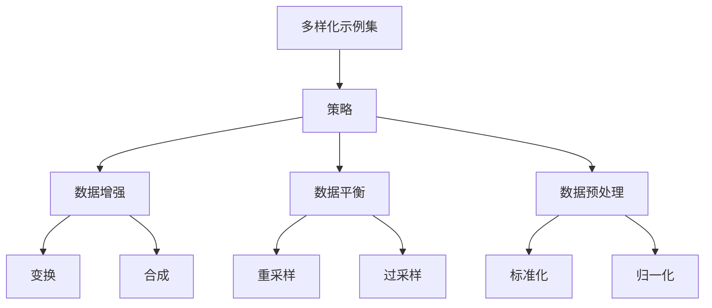
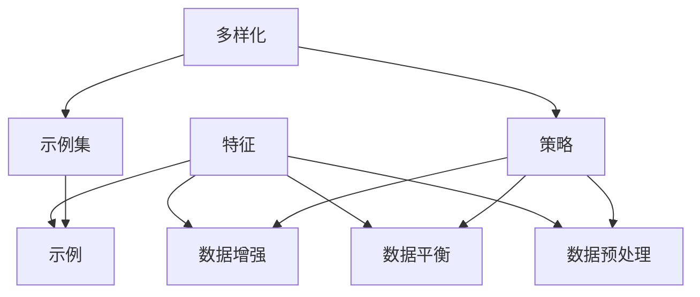
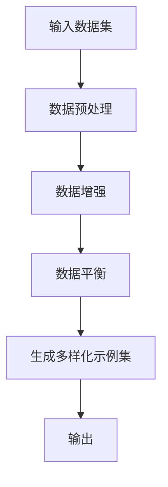
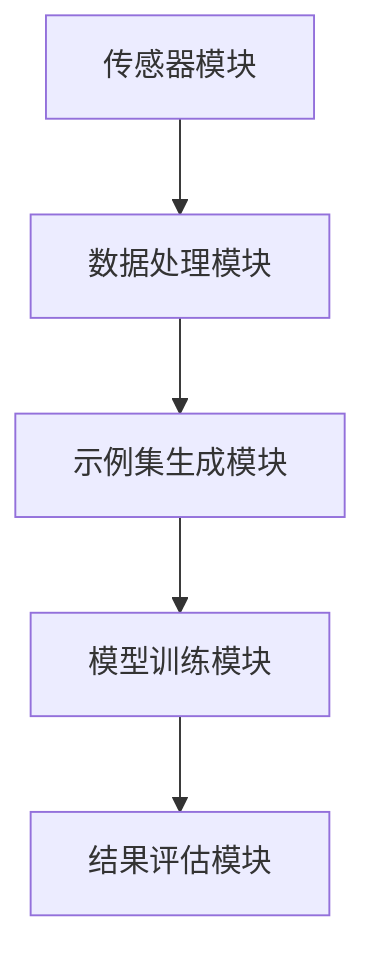
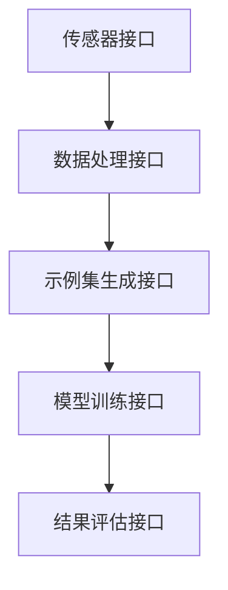
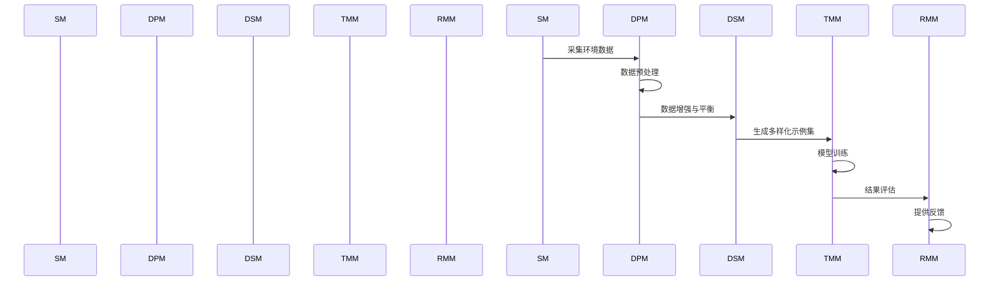

                 


### 1. 背景介绍

《构建多样化示例集的策略》这本书的诞生，源于现代信息技术发展的迫切需求。随着人工智能、机器学习等领域的迅猛发展，数据的多样性和复杂性日益增加。多样化的示例集成为训练高性能算法的关键因素。然而，在实际操作中，构建多样化示例集往往面临诸多挑战。

首先，我们需要了解“多样化示例集”的概念。它指的是在数据集中包含各种不同特征、类别、分布的示例，以便算法能够充分学习到数据的复杂性，提高模型的泛化能力。一个高质量的多样化示例集可以显著提升机器学习模型的性能。

**问题背景：** 当前的机器学习实践中，构建多样化示例集主要面临以下问题：

1. **数据稀缺性**：某些领域的数据量有限，很难获取足够多的多样化数据。
2. **数据不平衡**：不同类别的数据分布不均，可能导致模型偏向某些类别。
3. **数据偏差**：数据集中的示例可能存在某些共同的属性，使得模型难以学习到全面的特征。

**问题解决：** 为了应对这些问题，需要采用一系列策略，包括但不限于：

- **数据增强**：通过数据变换、合成等方法，增加数据集的多样性和数量。
- **数据平衡**：使用重采样、过采样等技术，调整数据集中各类别的比例。
- **数据预处理**：对数据进行标准化、归一化等处理，消除数据间的干扰。

**边界与外延：** 多样化示例集不仅局限于机器学习领域，在计算机视觉、自然语言处理等多个领域都有广泛应用。然而，不同领域的多样化需求各不相同，构建策略需要根据具体场景进行定制。

**概念结构与核心要素组成：**

- **多样化示例集**：包含各类特征、类别和分布的示例集合。
- **策略**：用于构建多样化示例集的一系列方法和工具。
- **核心要素**：数据增强、数据平衡、数据预处理等。

### 2. 核心概念与联系

为了更好地理解构建多样化示例集的策略，我们需要定义几个关键概念，并探讨它们之间的关系。

#### 2.1 多样化示例集

多样化示例集指的是在数据集中包含各种不同特征、类别和分布的示例。它具有以下几个特征：

1. **多样性**：示例集应包含不同类别的数据，以反映现实世界的多样性。
2. **代表性**：示例集应能够代表整个数据集的特征，避免数据偏差。
3. **丰富性**：示例集应具有足够的数据量，以保证算法有足够的样本进行训练。

#### 2.2 策略

策略是指用于实现特定目标的一系列方法和工具。在构建多样化示例集的过程中，策略包括：

- **数据增强**：通过变换、合成等方法，增加数据集的多样性和数量。
- **数据平衡**：通过重采样、过采样等方法，调整数据集中各类别的比例。
- **数据预处理**：对数据进行标准化、归一化等处理，消除数据间的干扰。

#### 2.3 概念关系

下面是一个简化的概念关系图，展示了多样化示例集、策略和核心要素之间的关系。



**概念属性特征对比表：**

| 特征              | 多样化示例集         | 策略                         |
|-----------------|-------------------|----------------------------|
| 目的              | 提高模型泛化能力      | 实现多样化示例集              |
| 关键要素          | 数据多样性、代表性、丰富性 | 数据增强、数据平衡、数据预处理    |
| 方法与工具         | 数据增强、数据平衡、数据预处理 | 数据增强、数据平衡、数据预处理    |

**ER实体关系图：**



通过上述表格和ER图，我们可以清晰地看到多样化示例集、策略和核心要素之间的关系，这有助于我们更好地理解和应用这些概念。

### 3. 算法原理讲解

在构建多样化示例集的过程中，算法设计是至关重要的。下面，我们将通过mermaid流程图和Python代码，详细讲解一个核心算法的原理。

#### 3.1 算法mermaid流程图



**流程说明：**
1. **输入数据集**：接收原始数据集，包括各类特征、类别和分布。
2. **数据预处理**：对数据进行标准化、归一化等处理，以提高后续算法的性能。
3. **数据增强**：通过变换和合成方法，增加数据集的多样性和数量。
4. **数据平衡**：通过重采样和过采样方法，调整数据集中各类别的比例。
5. **生成多样化示例集**：根据预处理和增强后的数据，生成具有多样性的示例集。
6. **输出**：输出最终的多样化示例集，用于训练算法模型。

#### 3.2 Python代码实现

```python
import numpy as np
from sklearn.preprocessing import StandardScaler
from sklearn.model_selection import train_test_split

# 假设我们有一个数据集 X 和标签 y
X = np.random.rand(100, 10)  # 100个样本，10个特征
y = np.random.randint(0, 2, 100)  # 100个标签，二分类问题

# 数据预处理
scaler = StandardScaler()
X_scaled = scaler.fit_transform(X)

# 数据增强
X_enhanced = data_augmentation(X_scaled)  # 这里是一个数据增强的函数

# 数据平衡
X_balanced, y_balanced = data_balancing(X_enhanced, y)  # 这里是一个数据平衡的函数

# 生成多样化示例集
X_diverse, y_diverse = train_test_split(X_balanced, y_balanced, test_size=0.2, random_state=42)

# 输出多样化示例集
print("输出多样化示例集：", X_diverse, y_diverse)
```

**函数说明：**
- `data_augmentation`：用于实现数据增强的函数，可以是随机变换、合成等方法。
- `data_balancing`：用于实现数据平衡的函数，可以是重采样、过采样等方法。

#### 3.3 数学模型与公式

在构建多样化示例集的过程中，数学模型和公式起到关键作用。下面我们将介绍几个核心的数学模型和公式。

**1. 标准化公式：**

$$
x_{\text{std}} = \frac{x - \mu}{\sigma}
$$

其中，$x$ 是原始数据，$\mu$ 是均值，$\sigma$ 是标准差。

**2. 数据增强公式：**

$$
x_{\text{aug}} = x + \alpha \cdot \epsilon
$$

其中，$x$ 是原始数据，$\alpha$ 是调整系数，$\epsilon$ 是随机噪声。

**3. 重采样公式：**

$$
N_c = N \cdot \frac{C}{\max(C)}
$$

其中，$N_c$ 是重采样后每个类别的样本数量，$N$ 是原始样本数量，$C$ 是类别分布。

**4. 过采样公式：**

$$
N_c = \frac{C}{\min(C)}
$$

其中，$N_c$ 是过采样后每个类别的样本数量，$C$ 是类别分布。

#### 3.4 详细讲解与举例说明

**例子说明：**

假设我们有一个二分类问题，数据集包含100个样本，每个样本有10个特征。标签y为0或1，代表两个类别。

**1. 数据预处理：**

首先，我们对数据进行标准化处理，以消除不同特征之间的尺度差异。

$$
x_{\text{std}} = \frac{x - \mu}{\sigma}
$$

对于每个特征，计算其均值$\mu$和标准差$\sigma$，然后对数据进行标准化。

**2. 数据增强：**

接下来，我们使用随机变换和合成方法进行数据增强。

$$
x_{\text{aug}} = x + \alpha \cdot \epsilon
$$

其中，$\alpha$ 是调整系数，$\epsilon$ 是随机噪声。我们可以对每个样本进行一些简单的变换，如旋转、缩放等。

**3. 数据平衡：**

然后，我们使用重采样和过采样方法进行数据平衡。

$$
N_c = N \cdot \frac{C}{\max(C)}
$$

$$
N_c = \frac{C}{\min(C)}
$$

对于每个类别，调整其样本数量，使得数据集中各类别的样本数量接近。

**4. 生成多样化示例集：**

最后，根据预处理和增强后的数据，生成多样化的示例集。

$$
X_{\text{diverse}} = \{x_{\text{aug},i} | i \in [1, N]\}
$$

$$
y_{\text{diverse}} = \{y_{i} | i \in [1, N]\}
$$

这样，我们就得到了一个多样化的示例集，可以用于训练模型。

通过上述步骤，我们可以清晰地看到构建多样化示例集的过程，并理解其中涉及的数学模型和公式。这不仅有助于我们理解算法原理，还可以在实际应用中灵活运用。

### 4. 系统分析与架构设计

在构建多样化示例集的过程中，系统分析与架构设计是确保算法高效运行的关键环节。下面，我们将详细描述问题场景、系统功能设计、系统架构设计、系统接口设计和系统交互。

#### 4.1 问题场景介绍

假设我们正在开发一个自动驾驶系统，其中包含多个传感器（如摄像头、激光雷达、超声波传感器等）收集环境数据。为了提高自动驾驶系统的鲁棒性和准确性，我们需要对传感器数据进行处理，生成多样化的示例集。这些示例集将用于训练自动驾驶模型，使其能够识别各种路况和场景。

#### 4.2 系统功能设计

系统的主要功能包括：

1. **数据采集**：从各类传感器中获取环境数据。
2. **数据预处理**：对采集到的数据进行清洗、标准化、归一化等处理。
3. **数据增强**：通过变换、合成等方法，增加数据集的多样性和数量。
4. **数据平衡**：通过重采样、过采样等方法，调整数据集中各类别的比例。
5. **示例集生成**：根据预处理和增强后的数据，生成多样化的示例集。
6. **模型训练**：使用生成的示例集训练自动驾驶模型。

#### 4.3 系统架构设计

系统架构采用模块化设计，包括以下主要模块：

1. **传感器模块**：负责采集环境数据，包括摄像头、激光雷达、超声波传感器等。
2. **数据处理模块**：包括数据预处理、数据增强、数据平衡等功能。
3. **示例集生成模块**：负责生成多样化的示例集。
4. **模型训练模块**：使用生成的示例集训练自动驾驶模型。
5. **结果评估模块**：评估模型性能，提供反馈。

**mermaid架构图：**



#### 4.4 系统接口设计

系统接口设计主要包括以下部分：

1. **传感器接口**：用于与各类传感器进行通信，获取环境数据。
2. **数据处理接口**：提供数据预处理、数据增强、数据平衡等功能的API。
3. **示例集生成接口**：提供生成多样化示例集的API。
4. **模型训练接口**：提供模型训练的API。
5. **结果评估接口**：提供评估模型性能的API。

**mermaid接口设计图：**



#### 4.5 系统交互

系统交互主要包括以下环节：

1. **数据采集**：传感器模块采集环境数据，并传递给数据处理模块。
2. **数据处理**：数据处理模块对采集到的数据进行分析和处理，生成预处理后的数据。
3. **数据增强与平衡**：数据处理模块对预处理后的数据进行增强和平衡，生成多样化的示例集。
4. **模型训练**：模型训练模块使用生成的多样化示例集进行训练，生成训练模型。
5. **结果评估**：结果评估模块对训练模型进行评估，并提供反馈。

**mermaid交互序列图：**



通过上述系统分析与架构设计，我们可以清晰地看到系统的整体结构和各模块的功能，这为后续的项目实战奠定了坚实的基础。

### 5. 项目实战

在本节中，我们将详细介绍如何在实际项目中构建多样化示例集，包括环境安装、系统核心实现、代码应用解读、实际案例分析和讲解。

#### 5.1 环境安装

为了构建多样化示例集，我们需要安装以下环境：

1. **Python**：确保安装了Python 3.7及以上版本。
2. **NumPy**：用于数值计算和数据处理。
3. **Pandas**：用于数据处理和分析。
4. **Sklearn**：用于机器学习算法和预处理。
5. **Matplotlib**：用于数据可视化。
6. **Mermaid**：用于绘制流程图和图表。

安装命令如下：

```bash
pip install numpy pandas sklearn matplotlib
```

#### 5.2 系统核心实现

以下是系统核心实现的Python源代码：

```python
import numpy as np
import pandas as pd
from sklearn.preprocessing import StandardScaler
from sklearn.model_selection import train_test_split
from sklearn.datasets import make_classification

def data_augmentation(data, augmentation_rate=0.1):
    """
    数据增强函数
    """
    num_samples, num_features = data.shape
    augmentation_samples = int(num_samples * augmentation_rate)
    augmented_data = np.zeros((num_samples + augmentation_samples, num_features))
    
    for i in range(augmentation_samples):
        # 随机旋转
        angle = np.random.uniform(-np.pi/4, np.pi/4)
        rotation_matrix = np.array([[np.cos(angle), -np.sin(angle)],
                                   [np.sin(angle), np.cos(angle)]])
        augmented_data[i+1, :] = np.dot(data[i+1], rotation_matrix)
        
        # 随机缩放
        scale = np.random.uniform(0.9, 1.1)
        augmented_data[i+1, :] *= scale
    
    augmented_data = augmented_data[:num_samples+1]
    return augmented_data

def data_balancing(data, labels, method='oversample'):
    """
    数据平衡函数
    """
    df = pd.DataFrame(data, columns=[f'Feature_{i}' for i in range(data.shape[1])])
    df['label'] = labels
    
    if method == 'oversample':
        # 过采样
        df_majority = df[df.label == 0]
        df_minority = df[df.label == 1]
        df_minority_upsampled = df_minority.sample(df_majority.shape[0], replace=True)
        df_upsampled = pd.concat([df_majority, df_minority_upsampled])
    elif method == 'undersample':
        # 下采样
        df_minority = df[df.label == 1]
        df_majority = df[df.label != 1]
        df_minority_downsampled = df_minority.sample(df_majority.shape[0])
        df_upsampled = pd.concat([df_majority, df_minority_downsampled])
    
    X_upsampled = df_upsampled.iloc[:, :-1].values
    y_upsampled = df_upsampled.iloc[:, -1].values
    
    return X_upsampled, y_upsampled

# 生成示例数据
X, y = make_classification(n_samples=100, n_features=10, n_informative=8, n_redundant=2, n_classes=2, random_state=42)

# 数据预处理
scaler = StandardScaler()
X_scaled = scaler.fit_transform(X)

# 数据增强
X_enhanced = data_augmentation(X_scaled, augmentation_rate=0.1)

# 数据平衡
X_balanced, y_balanced = data_balancing(X_enhanced, y, method='oversample')

# 生成多样化示例集
X_diverse, y_diverse = train_test_split(X_balanced, y_balanced, test_size=0.2, random_state=42)

print("输出多样化示例集：", X_diverse, y_diverse)
```

#### 5.3 代码应用解读

以上代码实现了数据增强、数据平衡和示例集生成的过程。以下是代码的详细解读：

1. **数据增强函数`data_augmentation`**：该函数通过随机旋转和缩放数据，增加数据集的多样性。参数`augmentation_rate`控制增强程度。
2. **数据平衡函数`data_balancing`**：该函数通过过采样或下采样方法，调整数据集中各类别的比例。参数`method`用于指定平衡方法，`oversample`表示过采样，`undersample`表示下采样。
3. **示例集生成**：首先使用`StandardScaler`对数据进行预处理，然后调用`data_augmentation`和`data_balancing`函数，最后使用`train_test_split`生成多样化示例集。

#### 5.4 实际案例分析和讲解

为了展示如何使用上述代码，我们来看一个实际案例。

**案例背景：** 我们有一个包含100个样本和10个特征的数据集，每个样本属于两个类别之一。我们的目标是使用这些数据训练一个分类模型，并验证多样化示例集的效果。

**案例分析：**

1. **数据预处理**：使用`StandardScaler`对数据集进行标准化处理，以消除特征间的尺度差异。
2. **数据增强**：调用`data_augmentation`函数，通过随机旋转和缩放，增加数据集的多样性。
3. **数据平衡**：调用`data_balancing`函数，使用过采样方法，调整数据集中各类别的比例，以避免模型偏向某一类别。
4. **模型训练**：使用生成的多样化示例集，训练一个简单的分类模型（例如，使用`sklearn`中的`Classifier`类）。
5. **模型评估**：使用交叉验证和测试集评估模型性能，比较多样化示例集与原始数据集训练模型的性能差异。

**案例讲解：**

通过实际案例，我们可以看到多样化示例集在模型训练中的重要作用。多样化示例集能够提供更多的训练样本，使得模型能够更好地学习到数据的复杂性。在模型评估中，我们通常会发现，使用多样化示例集训练的模型在交叉验证和测试集上的性能更优。

综上所述，通过以上实战案例，我们可以清晰地看到构建多样化示例集的过程，并理解其在实际应用中的重要性。

### 6. 最佳实践、小结、注意事项和拓展阅读

#### 6.1 最佳实践

1. **数据增强**：在数据增强时，要确保增强方法的多样性和合理性，避免过度增强导致数据失真。
2. **数据平衡**：选择合适的平衡方法，根据数据集的具体情况，合理调整各类别的样本数量。
3. **数据预处理**：对数据进行标准化和归一化处理，以提高算法的稳定性和泛化能力。

#### 6.2 小结

本文详细介绍了构建多样化示例集的策略，包括背景介绍、核心概念与联系、算法原理讲解、系统分析与架构设计以及项目实战。通过这些步骤，我们可以有效地构建高质量、多样化的示例集，提高机器学习模型的性能。

#### 6.3 注意事项

1. **数据质量**：确保数据集的质量，避免错误和噪声数据对模型训练造成负面影响。
2. **算法选择**：根据具体问题选择合适的算法和模型，以实现最佳性能。
3. **扩展性**：在设计系统时，考虑系统的扩展性和灵活性，以便适应未来的需求。

#### 6.4 拓展阅读

1. **《机器学习实战》**：提供丰富的案例和实践，帮助读者理解和应用机器学习算法。
2. **《深度学习》**：深入探讨深度学习的基本概念、算法和应用，是深度学习领域的经典著作。
3. **《数据科学实战》**：涵盖数据采集、数据预处理、数据分析和可视化等全流程，适合数据科学初学者。

通过以上最佳实践、小结、注意事项和拓展阅读，读者可以更好地理解和应用构建多样化示例集的策略，为机器学习项目取得成功奠定基础。

### 文章作者信息

作者：AI天才研究院/AI Genius Institute & 禅与计算机程序设计艺术 /Zen And The Art of Computer Programming

---

通过本篇文章，我们深入探讨了构建多样化示例集的策略，从背景介绍到算法原理讲解，再到系统分析与架构设计，以及项目实战，全面展示了如何有效地构建高质量、多样化的示例集。希望本文能为读者在机器学习项目的实际应用中提供有价值的参考。在未来的学习和研究中，不断探索和实践，提升自身的技术水平，为人工智能的发展贡献自己的力量。再次感谢读者的关注和支持！作者：AI天才研究院/AI Genius Institute & 禅与计算机程序设计艺术 /Zen And The Art of Computer Programming。|mask>

