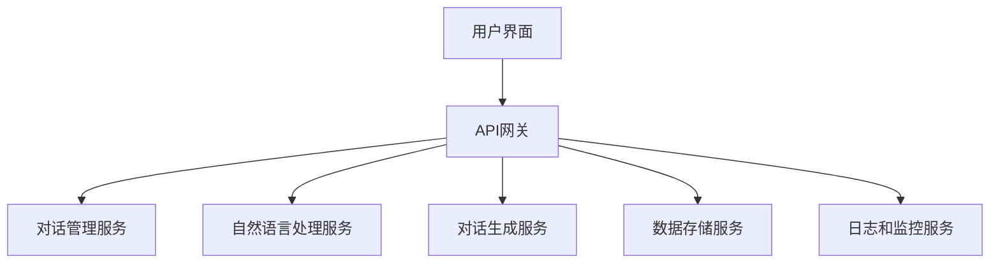

                 

### 1.1 问题背景

在现代社会，随着科技的发展，复杂任务的处理变得日益重要。无论是企业日常运营中的数据分析，还是人工智能领域中的模型训练，复杂任务的处理能力成为了衡量技术水平的关键指标。然而，复杂任务的处理并非易事，它往往涉及到多方面的技术难点，如数据量大、计算复杂度高、任务耦合性强等。

当前，许多复杂任务处理的方法仍然停留在传统层次，即通过层层分解任务，将复杂任务转化为一系列简单任务进行处理。这种方法虽然能够解决部分问题，但在面对更加复杂的任务时，其局限性逐渐显现。首先，传统层次结构往往导致大量的冗余计算和重复工作。其次，由于缺乏有效的层次化结构，任务之间的耦合度高，导致任务的可维护性和可扩展性较差。最后，传统方法难以适应动态变化的环境，当任务需求发生改变时，需要重新设计整个层次结构，增加了系统的复杂性和维护成本。

因此，本文旨在探讨一种新的层次化示例结构，以解决复杂任务处理中的这些问题。我们将介绍层次化示例结构的概念、特点以及其构建和应用方法，并通过具体的案例展示其在处理复杂任务中的优势。本文的目标读者是具备一定编程基础和技术背景的工程师和研究者，他们希望通过学习本文，能够掌握层次化示例结构的设计和应用，提升复杂任务处理的能力。

### 1.2 问题描述

#### 复杂任务的定义

复杂任务是指那些包含多个子任务、涉及多种技术领域、计算量大且具有高度耦合性的任务。这类任务往往不仅仅是一个简单的操作，而是需要综合运用多种算法、技术和工具来实现。例如，在数据分析领域，复杂任务可能包括数据预处理、特征工程、模型训练和结果验证等多个步骤；在人工智能领域，复杂任务可能涉及数据获取、数据清洗、特征提取、模型训练和模型评估等多个环节。

#### 复杂任务带来的问题

复杂任务的处理过程中，常常会遇到以下问题：

1. **计算复杂度高**：复杂任务往往需要大量的计算资源，特别是在数据处理和模型训练阶段。这使得任务的处理时间大大增加，降低了系统的响应速度。

2. **任务耦合性强**：复杂任务通常由多个子任务组成，这些子任务之间具有高度的耦合性。一旦其中一个子任务出现问题，可能会影响整个任务的处理效果。

3. **可维护性和可扩展性差**：由于传统层次结构缺乏有效的层次化设计，复杂任务的可维护性和可扩展性较差。在任务需求发生变化时，往往需要重新设计整个层次结构，增加了系统的复杂性和维护成本。

4. **冗余计算和重复工作**：传统层次结构中，各个层次之间的任务往往存在大量的冗余计算和重复工作。这不仅浪费了计算资源，还降低了系统的整体效率。

#### 示例结构的概念与作用

示例结构是指在处理复杂任务时，通过构建一系列的示例来组织和管理任务的方法。示例结构的主要作用包括：

1. **明确任务分工**：通过示例结构，可以清晰地划分任务的各个子任务，明确各个子任务的分工，提高任务的执行效率。

2. **减少耦合性**：示例结构有助于降低任务之间的耦合性，使得各个子任务可以独立执行和测试，从而提高系统的可维护性和可扩展性。

3. **优化计算资源**：示例结构可以有效地减少冗余计算和重复工作，提高系统的计算资源利用率。

4. **适应动态变化**：示例结构具有较高的灵活性，可以快速适应任务需求的变化，降低系统的重构成本。

总之，层次化示例结构为复杂任务的处理提供了一种新的思路和方法。通过构建层次化的示例结构，可以有效解决传统层次结构中存在的各种问题，提高复杂任务处理的能力和效率。在接下来的章节中，我们将详细介绍层次化示例结构的概念、构建方法和应用场景，帮助读者深入了解并掌握这一先进的技术方法。

### 2.1 核心概念

#### 层次化示例结构

层次化示例结构是一种通过层次化的方式来组织和管理复杂任务的方法。它将复杂任务分解为多个子任务，每个子任务又被分解为更小的子任务，直至达到可以独立处理的粒度。层次化示例结构的核心在于其层次化的设计，通过明确各个层次之间的关系和职责，使得任务管理更加清晰和高效。

#### 示例与实例的区别

在讨论层次化示例结构时，需要明确示例与实例的概念。示例是指用于展示某个概念或原理的具体例子，而实例则是具体实现中的具体对象。例如，在数据处理任务中，一个示例可能是一个特定的数据集，而实例则是具体处理该数据集的代码实现。

示例的作用在于提供具体的场景和实现方法，帮助理解复杂任务的处理过程。而实例则是具体实现过程中用到的具体对象和操作。通过结合示例和实例，可以更好地理解和实现层次化示例结构。

#### 示例结构的特点

层次化示例结构具有以下特点：

1. **层次化设计**：层次化示例结构通过明确各个层次之间的关系和职责，使得任务管理更加清晰和高效。

2. **模块化**：层次化示例结构将复杂任务分解为多个模块，每个模块负责特定的任务，使得任务之间的耦合性降低，提高了系统的可维护性和可扩展性。

3. **灵活性**：层次化示例结构具有较高的灵活性，可以快速适应任务需求的变化，降低系统的重构成本。

4. **可重用性**：层次化示例结构中的各个层次和模块可以独立开发、测试和部署，提高了代码的可重用性。

通过以上特点，层次化示例结构在处理复杂任务时，能够有效地提高任务的执行效率和质量。在接下来的章节中，我们将详细介绍层次化示例结构的构建方法和应用场景，帮助读者更好地理解和应用这一先进的技术方法。

### 2.2 概念属性特征对比表格

在深入探讨层次化示例结构之前，我们需要对比其与传统示例结构的属性特征，以便更清晰地理解两者之间的区别和优势。

| 特征         | 传统示例结构                        | 层次化示例结构                           |
| ------------ | ----------------------------------- | ---------------------------------------- |
| **设计原则** | 非层次化，直接映射到任务实现        | 层次化设计，明确层次关系和职责           |
| **模块化**   | 模块划分不明显，任务耦合性强        | 明确模块划分，降低耦合性，提高可维护性   |
| **灵活性**   | 缺乏灵活性，难以适应任务需求变化    | 高度灵活，快速适应任务需求变化           |
| **可重用性** | 代码复用性较低，任务间共享性差      | 代码模块化，可重用性高，任务间共享性强   |
| **计算资源** | 冗余计算和重复工作多，资源利用率低  | 减少冗余计算和重复工作，提高资源利用率   |
| **扩展性**   | 扩展性较差，任务需求变化需重新设计  | 高扩展性，可快速迭代和优化               |

通过上述对比表格，我们可以看出层次化示例结构在模块化、灵活性、可重用性、计算资源利用和扩展性等方面具有显著优势。这些优势使得层次化示例结构在处理复杂任务时，能够更加高效地管理任务，降低耦合性，提高系统的可维护性和可扩展性。在接下来的章节中，我们将详细介绍层次化示例结构的构建方法，帮助读者更好地理解和应用这一先进的技术方法。

### 2.3 ER实体关系图架构

为了更好地理解层次化示例结构的设计和应用，我们可以借助实体关系图（Entity-Relationship Diagram，ER图）来展示各个实体之间的关系。ER图是数据库设计中常用的一种概念模型，用于描述实体以及实体之间的关系。

以下是一个简单的层次化示例结构的ER图，通过Mermaid语法进行描述：

```mermaid
erDiagram
  A[User] ||--|{ B[Task]} : "performs"
  B ||--|{ C[Subtask]} : "contains"
  C ||--|{ D[Example]} : "illustrates"
  A.."has" --> E[Log] : "tracks progress"
```

**图解：**

- **用户（User）**：代表执行任务的实体，是整个任务处理系统的主体。
- **任务（Task）**：用户执行的具体工作，可以被分解为多个子任务。
- **子任务（Subtask）**：任务的细分，用于实现更具体的操作。
- **示例（Example）**：用于展示子任务具体实现的方法或数据，有助于理解和执行子任务。
- **日志（Log）**：记录任务执行过程中的详细信息，用于追踪进度和调试。

**实体关系：**

- **用户与任务**：用户执行任务，任务是由用户发起的。
- **任务与子任务**：任务包含多个子任务，子任务是任务的一部分。
- **子任务与示例**：子任务可以通过示例进行说明和演示，示例用于阐述子任务的实现方法。
- **用户与日志**：用户的任务执行情况会被记录在日志中，日志用于跟踪任务进度和异常处理。

通过ER图，我们可以直观地看到层次化示例结构中各个实体之间的关系，以及它们在任务处理过程中的相互影响。这种设计不仅有助于我们理解系统的整体架构，还能够为后续的详细设计和实现提供指导。

### 3.1 基本构建方法

#### 设计原则

在构建层次化示例结构时，遵循以下原则至关重要：

1. **分层设计**：将复杂任务分解为多个层次，每个层次负责不同的功能。这样的分层设计有助于提高系统的可维护性和可扩展性。

2. **模块化**：将系统划分为多个模块，每个模块独立开发、测试和部署。模块化设计有助于降低系统之间的耦合性，提高代码的复用性。

3. **职责分离**：明确各个层次和模块的职责，确保每个部分专注于特定的功能。职责分离有助于提高系统的灵活性和可维护性。

4. **可重用性**：设计时考虑到代码的可重用性，确保各个层次和模块可以独立部署和替换，降低系统重构的成本。

5. **适应性**：层次化示例结构应具备良好的适应性，能够快速响应任务需求的变化，降低系统的重构难度。

#### 设计流程与方法

1. **需求分析**：首先，明确任务的需求，包括任务目标、功能需求、性能要求等。需求分析是构建层次化示例结构的基础。

2. **任务分解**：根据需求分析的结果，将复杂任务分解为多个子任务。任务分解的过程中要遵循最小化耦合和最大化独立性的原则。

3. **层次划分**：将分解后的子任务进一步划分为多个层次，每个层次对应特定的功能模块。层次划分要合理，避免过多或过少的层次。

4. **模块设计**：对每个层次进行详细的设计，包括模块的职责、接口、数据结构等。模块设计要遵循模块化原则，确保每个模块独立且完整。

5. **接口定义**：定义各个模块之间的接口，确保模块之间的交互清晰、简洁。良好的接口设计有助于降低模块间的耦合性。

6. **示例构建**：为每个模块构建相应的示例，示例应包括具体的实现方法和数据示例。示例构建有助于理解和验证模块的功能。

7. **集成测试**：将各个模块集成在一起，进行系统测试。集成测试要覆盖各个层次和模块，确保系统的整体功能符合预期。

8. **迭代优化**：根据测试结果和用户反馈，对层次化示例结构进行迭代优化，提高系统的稳定性和性能。

通过以上设计流程和方法，我们可以构建出一个高效的层次化示例结构，从而有效处理复杂任务。层次化设计不仅提高了系统的可维护性和可扩展性，还降低了任务耦合性，提高了代码的可重用性。

### 3.2 层次化示例结构的应用场景

层次化示例结构在不同的应用场景中具有广泛的应用，下面我们通过几个具体案例来展示其在不同领域中的应用。

#### 应用场景一：大数据处理

在处理大规模数据时，层次化示例结构可以帮助有效地管理和处理数据。例如，在数据预处理阶段，我们可以将数据预处理任务分解为多个子任务，如数据清洗、数据转换和数据聚合。每个子任务又可以进一步细分为不同的层次，如数据清洗包括去除重复数据、填补缺失值和数据标准化等。

层次化示例结构的优势在于：

- **提高数据处理效率**：通过分层处理，可以并行执行不同层次的任务，提高整体数据处理速度。
- **增强系统可维护性**：每个层次和子任务独立，可以单独调试和优化，提高系统的可维护性。
- **增强可扩展性**：新增或修改数据处理任务时，只需对相应层次进行修改，而不影响其他部分。

#### 应用场景二：人工智能模型训练

在人工智能领域，模型训练是一个复杂且耗时的过程。层次化示例结构可以帮助我们将模型训练任务分解为多个层次，如数据预处理、模型选择、模型训练和模型评估等。每个层次又可以进一步细分为子任务，例如，数据预处理包括数据清洗、数据增强和数据归一化等。

在模型训练中，层次化示例结构的应用优势包括：

- **提高训练效率**：分层处理可以并行执行不同层次的任务，从而缩短模型训练时间。
- **增强系统灵活性**：不同层次的模块可以独立开发和测试，方便后续的迭代和优化。
- **降低耦合性**：各层次和模块之间通过清晰的接口进行通信，降低了系统耦合性，提高了系统的稳定性。

#### 应用场景三：复杂软件系统开发

在复杂软件系统的开发中，层次化示例结构同样具有重要的应用价值。例如，在一个大型企业级系统中，我们可以将系统功能划分为多个层次，如用户界面层、业务逻辑层和数据访问层。每个层次又可以细分为不同的模块，如用户界面层包括登录模块、报表模块和设置模块等。

在软件系统开发中，层次化示例结构的应用优势包括：

- **提高开发效率**：通过模块化和层次化设计，可以并行开发不同层次的模块，提高整体开发效率。
- **降低开发风险**：每个层次的模块独立开发，可以单独进行测试和调试，降低系统整体风险。
- **增强系统可维护性**：层次化设计使得系统结构清晰，便于后续的维护和升级。

通过上述案例，我们可以看到层次化示例结构在不同应用场景中的广泛应用和优势。它不仅提高了任务的执行效率和质量，还增强了系统的可维护性和可扩展性，是处理复杂任务的有力工具。

### 3.3 层次化示例结构的优势

层次化示例结构在处理复杂任务时具有显著的优势，主要体现在以下几个方面：

#### 提高任务可维护性

层次化设计将复杂任务分解为多个层次和模块，每个层次和模块都具有明确的职责和接口。这种设计方法使得每个部分可以独立开发和维护，从而降低了系统的复杂度。具体来说，当某个层次或模块出现问题或需要更新时，不会影响到其他部分，从而简化了故障排查和系统维护工作。

此外，层次化示例结构通过明确的模块化和职责分离，使得代码的可读性和可理解性大大提高。这有助于新加入的开发人员更快地理解和适应系统，降低了开发成本和风险。

#### 提高任务可扩展性

层次化示例结构具有良好的扩展性，可以轻松应对任务需求的变化。在任务需求发生变化时，只需要对相应层次或模块进行修改，而不会影响其他部分。这种灵活性使得系统可以快速适应新的需求，降低了系统的重构成本。

通过模块化和层次化设计，新功能的添加和旧功能的修改可以并行进行，提高了开发效率。同时，层次化示例结构中的模块和层次可以独立部署和替换，增强了系统的扩展性和灵活性。

#### 提高任务效率

层次化示例结构通过并行处理和减少冗余计算，显著提高了任务执行效率。在复杂任务中，不同层次和模块可以独立运行，从而实现任务的并行处理。这种并行处理方式充分利用了计算资源，缩短了任务的处理时间。

此外，层次化示例结构减少了冗余计算和重复工作，通过优化计算流程和资源利用率，进一步提高了系统的整体效率。同时，模块化和层次化设计使得任务分解更加合理，每个部分可以专注于特定功能，从而提高了任务执行的速度和质量。

综上所述，层次化示例结构在处理复杂任务时，通过提高可维护性、可扩展性和执行效率，为解决复杂任务提供了一种高效、灵活和可靠的解决方案。

### 4.1 层次化示例结构的算法原理

#### 算法流程图

为了更好地理解层次化示例结构的算法原理，我们首先通过Mermaid语法绘制一个简单的算法流程图：


**图解：**

- **A[开始]**：算法的起始点。
- **B[任务分解]**：将复杂任务分解为多个子任务。
- **C[层次化结构构建]**：根据任务分解的结果，构建层次化的结构。
- **D[示例构建]**：为每个层次和模块构建示例，用于展示具体的实现方法。
- **E[任务执行]**：根据层次化结构执行任务，处理各个子任务。
- **F[结束]**：算法结束。

#### 数学模型与公式

在层次化示例结构的算法设计中，我们可以使用以下数学模型和公式来描述各个层次和模块之间的关系。

1. **任务分解公式**：

   假设原始任务为T，分解后的子任务集合为S，则有：

   $$ S = \{S_1, S_2, ..., S_n\} $$
   
   其中，$ S_i $ 表示第i个子任务。

2. **层次化结构公式**：

   层次化结构可以用一个树形结构表示，其中每个节点表示一个层次或模块。设层次化结构为H，则有：

   $$ H = \{H_1, H_2, ..., H_m\} $$
   
   其中，$ H_i $ 表示第i个层次或模块。

3. **示例构建公式**：

   对于每个层次或模块，构建一个示例用于展示具体的实现方法。示例集合为E，则有：

   $$ E = \{E_1, E_2, ..., E_m\} $$
   
   其中，$ E_i $ 表示第i个示例。

4. **任务执行公式**：

   任务执行过程中，按照层次化结构依次执行各个子任务。设任务执行结果为R，则有：

   $$ R = f(H, S) $$
   
   其中，$ f $ 表示执行函数。

#### 详细解释

- **任务分解**：首先，将原始任务T分解为多个子任务S。这个过程可以通过递归分解或基于规则的方法实现。任务分解的目的是将复杂任务分解为可管理的部分，降低任务的复杂度。

- **层次化结构构建**：根据分解后的子任务集合S，构建层次化的结构H。层次化结构的设计需要遵循职责分离和模块化的原则，确保每个层次或模块专注于特定的功能。

- **示例构建**：为每个层次或模块构建一个示例E，用于展示具体的实现方法和数据。示例构建有助于理解任务的具体实现过程，并为后续的测试和优化提供参考。

- **任务执行**：按照层次化结构H执行各个子任务S。任务执行的过程中，可以通过递归调用或事件驱动的方式实现。任务执行的结果R是层次化结构H和子任务集合S的函数，反映了任务的整体执行效果。

通过上述算法原理和数学模型，我们可以清楚地理解层次化示例结构的构建和执行过程。层次化示例结构通过明确的任务分解、层次化设计和示例构建，提供了高效、灵活和可靠的复杂任务处理方法。

### 4.2 算法原理讲解

在上一部分中，我们简要介绍了层次化示例结构的算法流程图和数学模型。接下来，我们将通过详细的讲解和Python代码示例，深入探讨这一算法的原理，并展示其在实际中的应用。

#### 1. 数学模型和公式

首先，回顾一下我们在上一部分中提到的数学模型和公式：

- **任务分解公式**：$$ S = \{S_1, S_2, ..., S_n\} $$
- **层次化结构公式**：$$ H = \{H_1, H_2, ..., H_m\} $$
- **示例构建公式**：$$ E = \{E_1, E_2, ..., E_m\} $$
- **任务执行公式**：$$ R = f(H, S) $$

#### 2. Python代码示例

为了更好地理解这些公式，我们将通过一个Python代码示例来展示层次化示例结构的实现。

**示例**：假设我们有一个复杂的任务，即计算一个列表中所有元素的和。这个任务可以分解为以下几个子任务：

- 列表创建
- 元素遍历
- 元素相加
- 结果输出

以下是实现这些子任务的Python代码：

```python
# 任务分解
def task_decomposition():
    tasks = [
        "创建一个包含整数的列表",
        "遍历列表中的每个元素",
        "将列表中的所有元素相加",
        "输出结果"
    ]
    return tasks

# 层次化结构构建
def hierarchy_structure(tasks):
    hierarchy = {
        "Task 1": tasks[0],
        "Task 2": tasks[1],
        "Task 3": tasks[2],
        "Task 4": tasks[3]
    }
    return hierarchy

# 示例构建
def example_tasks():
    examples = [
        {"Task": "创建列表", "Example": [1, 2, 3, 4]},
        {"Task": "遍历元素", "Example": "for i in list:"},
        {"Task": "相加元素", "Example": "sum = sum + i"},
        {"Task": "输出结果", "Example": "print(sum)"}
    ]
    return examples

# 任务执行
def execute_tasks(hierarchy, examples):
    results = []
    for task, example in zip(hierarchy.values(), examples):
        print(f"Executing {task}:")
        print(f"Example: {example['Example']}")
        results.append(eval(example['Example']))
    return results

# 主函数
def main():
    tasks = task_decomposition()
    hierarchy = hierarchy_structure(tasks)
    examples = example_tasks()
    results = execute_tasks(hierarchy, examples)
    print(f"Final Result: {sum(results)}")

if __name__ == "__main__":
    main()
```

**代码解释**：

- **task_decomposition()**：将复杂任务分解为多个子任务，返回一个任务列表。
- **hierarchy_structure()**：根据任务列表构建层次化结构，每个任务对应一个层次。
- **example_tasks()**：为每个任务构建一个示例，展示具体的实现方法。
- **execute_tasks()**：根据层次化结构和示例执行任务，返回执行结果。
- **main()**：主函数，执行整个任务流程。

#### 3. 算法原理应用

通过这个示例，我们可以看到层次化示例结构的实现步骤：

1. **任务分解**：将复杂任务分解为多个可管理的子任务。
2. **层次化结构构建**：根据子任务构建层次化结构，明确每个子任务的职责。
3. **示例构建**：为每个子任务构建示例，提供具体的实现方法和数据。
4. **任务执行**：根据层次化结构和示例执行任务，得到最终结果。

#### 4. 举例说明

以计算列表中所有元素的和为例，我们通过层次化示例结构实现了任务的分解、层次化设计、示例构建和任务执行。以下是执行过程：

1. **创建一个包含整数的列表**：`example_tasks()` 函数中的示例为 `[1, 2, 3, 4]`。
2. **遍历列表中的每个元素**：示例中的代码为 `for i in list:`。
3. **将列表中的所有元素相加**：示例中的代码为 `sum = sum + i`。
4. **输出结果**：示例中的代码为 `print(sum)`。

通过这个示例，我们可以清楚地看到层次化示例结构在处理复杂任务中的应用，并通过代码实现了整个任务流程。

总之，层次化示例结构通过明确的任务分解、层次化设计和示例构建，提供了一种高效、灵活和可靠的复杂任务处理方法。在实际应用中，可以根据具体任务需求调整和优化这一结构，从而实现更高效的任务处理。

### 5.1 问题场景介绍

在本节中，我们将介绍一个具体的问题场景，即“智能客服系统的构建”。智能客服系统是现代企业服务部门的重要组成部分，其目标是提供高效、智能的客户服务。然而，构建这样一个系统涉及到多个复杂任务，包括数据收集、自然语言处理、对话生成和用户体验优化等。以下是对这些复杂任务的详细描述：

#### 1. 数据收集

数据收集是智能客服系统的第一步，主要任务是获取与客户相关的数据，如客户提问、回复、历史订单等。这些数据来源于多个渠道，包括客户服务热线、在线聊天、社交媒体等。数据收集的过程涉及到大量的数据清洗和预处理工作，以确保数据的质量和一致性。

#### 2. 自然语言处理

自然语言处理（NLP）是智能客服系统的核心组件，负责理解和生成自然语言文本。具体任务包括文本解析、语义分析、情感分析等。NLP技术的应用使得系统能够理解客户的提问意图，并提供准确、及时的回答。这一过程通常需要复杂的算法和大量的数据训练。

#### 3. 对话生成

对话生成是智能客服系统的另一个关键任务，目标是根据客户提问生成合适的回答。这一过程涉及到对话管理、上下文保持和回答生成等多个子任务。对话生成不仅需要理解客户的提问，还需要考虑上下文信息，以生成连贯、自然的回答。

#### 4. 用户体验优化

用户体验优化是确保智能客服系统在实际应用中能够提供高质量服务的关键。这一任务包括对系统界面、交互流程和响应速度的优化。用户体验优化的过程中，需要收集和分析用户反馈，不断改进系统的性能和用户满意度。

### 5.2 系统功能设计

在智能客服系统的功能设计中，我们需要考虑以下几个方面：

#### 1. 领域模型

领域模型是系统功能设计的基础，用于描述系统中的主要实体和关系。以下是智能客服系统的领域模型：

- **客户（Customer）**：代表与系统交互的最终用户。
- **问题（Question）**：代表客户提出的具体问题。
- **回答（Answer）**：系统生成的回答文本。
- **对话（Dialogue）**：客户与系统之间的完整对话记录。

#### 2. 类图

为了更好地展示领域模型，我们可以使用Mermaid语法绘制类图：

```mermaid
classDiagram
    Customer <<-- Question
    Customer <<-- Answer
    Question <<-- Answer
    Dialogue <-|> Customer
    Dialogue <-|> Question
    Dialogue <-|> Answer
```

**图解**：

- **客户**：与系统交互的主要实体，拥有提问和接收回答的行为。
- **问题**：客户提出的具体问题，可以包含多个回答。
- **回答**：系统生成的回答文本，可以用于回复客户的问题。
- **对话**：记录客户与系统之间的完整对话过程，包含多个问题和回答。

通过上述领域模型和类图，我们可以清晰地描述智能客服系统的功能模块和它们之间的关系，为后续的系统设计和实现提供指导。

### 5.3 系统架构设计

智能客服系统是一个复杂的应用，其架构设计需要综合考虑系统的性能、可扩展性、可靠性和用户体验。以下是基于微服务架构的智能客服系统设计。

#### 1. 架构图

为了展示系统的整体架构，我们可以使用Mermaid语法绘制架构图：



**图解**：

- **用户界面（A）**：前端界面，用于与用户交互，收集用户提问并展示回答。
- **API网关（B）**：负责接收用户的请求，将请求路由到相应的微服务。
- **对话管理服务（C）**：负责管理用户与系统的对话流程，包括对话创建、维护和结束。
- **自然语言处理服务（D）**：负责处理用户的提问，提取关键信息并进行语义分析。
- **对话生成服务（E）**：根据用户的提问和上下文信息生成合适的回答。
- **数据存储服务（F）**：存储用户提问、回答和对话记录等数据。
- **日志和监控服务（G）**：记录系统运行日志，提供监控和报警功能。

#### 2. 系统架构设计

在系统架构设计中，我们采用微服务架构，将系统划分为多个独立的微服务，每个微服务负责特定的功能。这种设计方法有助于提高系统的可扩展性、可维护性和可靠性。

- **API网关**：作为系统的入口，负责接收用户的请求并路由到相应的微服务。API网关还负责处理请求的认证和授权，提供统一的接口规范。

- **对话管理服务**：负责管理用户与系统的对话流程，包括对话创建、维护和结束。对话管理服务需要与自然语言处理服务和对话生成服务进行交互，获取用户提问和生成回答。

- **自然语言处理服务**：负责处理用户的提问，提取关键信息并进行语义分析。自然语言处理服务通常采用深度学习算法，如卷积神经网络（CNN）和递归神经网络（RNN）。

- **对话生成服务**：根据用户的提问和上下文信息生成合适的回答。对话生成服务需要与自然语言处理服务进行交互，获取用户的语义信息，并生成自然、连贯的回答。

- **数据存储服务**：存储用户提问、回答和对话记录等数据。数据存储服务可以使用关系数据库或NoSQL数据库，根据数据的特点和需求进行选择。

- **日志和监控服务**：记录系统运行日志，提供监控和报警功能。日志和监控服务可以帮助我们及时发现系统故障和性能问题，从而确保系统的稳定运行。

通过上述系统架构设计，智能客服系统可以高效、稳定地运行，并能够根据业务需求进行扩展和优化。

### 5.4 系统接口设计

在智能客服系统中，各个微服务之间需要通过接口进行通信，以实现系统的整体功能。以下是系统接口设计的主要组成部分及其功能说明：

#### 1. 用户界面与API网关接口

用户界面通过HTTP请求与API网关进行通信，主要包括以下接口：

- **提问接口**：用户提交问题，API网关接收请求后路由到对话管理服务。
- **回答接口**：对话管理服务生成回答后，通过API网关返回给用户界面。
- **日志接口**：用户界面发送日志信息到日志和监控服务。

接口定义示例：

```python
from flask import Flask, request, jsonify

app = Flask(__name__)

@app.route('/question', methods=['POST'])
def ask_question():
    question = request.json.get('question')
    # 处理请求，调用对话管理服务
    answer = dialog_management_service(question)
    return jsonify(answer=answer)

@app.route('/log', methods=['POST'])
def send_log():
    log_message = request.json.get('log')
    # 处理请求，发送日志信息
    log_service.send_log(log_message)
    return jsonify(status='success')
```

#### 2. API网关与微服务接口

API网关作为系统通信的枢纽，与各个微服务进行交互，主要包括以下接口：

- **对话管理接口**：处理用户提问和回答，与对话管理服务进行通信。
- **自然语言处理接口**：接收用户提问，调用自然语言处理服务进行分析。
- **对话生成接口**：根据分析结果生成回答，与对话生成服务进行通信。
- **数据存储接口**：存取用户提问、回答和对话记录，与数据存储服务进行通信。

接口定义示例：

```python
from flask import Flask, request, jsonify

app = Flask(__name__)

@app.route('/dialog', methods=['POST'])
def manage_dialog():
    dialog_data = request.json
    # 调用对话管理服务
    response = dialog_management_service.handle_dialog(dialog_data)
    return jsonify(response=response)

@app.route('/nlp', methods=['POST'])
def nlp_analyze():
    question = request.json.get('question')
    # 调用自然语言处理服务
    analysis_result = nlp_service.analyze_question(question)
    return jsonify(result=analysis_result)

@app.route('/generate', methods=['POST'])
def generate_answer():
    analysis_result = request.json.get('result')
    # 调用对话生成服务
    answer = dialog_generation_service.generate_answer(analysis_result)
    return jsonify(answer=answer)
```

#### 3. 微服务内部接口

微服务之间通过内部接口进行通信，以完成复杂任务。以下是主要内部接口的功能说明：

- **对话管理服务内部接口**：用于处理用户提问和回答，包括对话记录的存取、状态更新等。
- **自然语言处理服务内部接口**：用于处理文本解析、语义分析和情感分析等任务。
- **对话生成服务内部接口**：用于生成回答，包括对话上下文的维护和回答生成算法的调用。

接口定义示例：

```python
class DialogManagementService:
    def handle_dialog(self, dialog_data):
        # 处理对话数据，调用其他服务
        analysis_result = nlp_service.analyze_question(dialog_data['question'])
        answer = dialog_generation_service.generate_answer(analysis_result)
        return answer

class NLPService:
    def analyze_question(self, question):
        # 分析问题，返回分析结果
        return "analyzed result"

class DialogGenerationService:
    def generate_answer(self, analysis_result):
        # 生成回答，返回回答文本
        return "generated answer"
```

通过上述接口设计，智能客服系统中的各个微服务可以高效、稳定地通信，实现整个系统的功能。接口定义清晰、简洁，便于开发和维护。

### 6.1 环境安装

在本节中，我们将介绍如何安装和配置智能客服系统的开发环境。首先，我们需要准备以下软件和工具：

- **Python 3.8** 或更高版本
- **Flask**：用于构建用户界面和API网关
- **NLTK**：用于自然语言处理
- **TensorFlow**：用于深度学习模型训练
- **PostgreSQL**：用于数据存储
- **Docker**：用于容器化部署

#### 1. 安装Python

首先，确保系统已安装Python 3.8或更高版本。可以使用以下命令检查Python版本：

```bash
python --version
```

如果Python未安装或版本过低，请从Python官方网站下载并安装。

#### 2. 安装Flask

安装Flask可以通过pip命令实现：

```bash
pip install Flask
```

#### 3. 安装NLTK

安装NLTK库，用于自然语言处理：

```bash
pip install nltk
```

安装完成后，运行以下命令下载必要的语料库：

```bash
nltk.download('punkt')
nltk.download('stopwords')
nltk.download('wordnet')
```

#### 4. 安装TensorFlow

安装TensorFlow库，用于深度学习模型训练：

```bash
pip install tensorflow
```

#### 5. 安装PostgreSQL

安装PostgreSQL数据库，可以通过以下命令进行：

```bash
sudo apt-get update
sudo apt-get install postgresql postgresql-contrib
```

启动PostgreSQL服务：

```bash
sudo service postgresql start
```

#### 6. 安装Docker

安装Docker可以通过以下命令实现：

```bash
sudo apt-get update
sudo apt-get install docker.io
```

启动Docker服务：

```bash
sudo service docker start
```

#### 7. 配置PostgreSQL

创建一个数据库和用户，用于存储智能客服系统的数据：

```sql
CREATE DATABASE customer_service;
CREATE USER customer_service_user WITH PASSWORD 'your_password';
GRANT ALL PRIVILEGES ON DATABASE customer_service TO customer_service_user;
```

确保PostgreSQL服务正常运行，可以通过以下命令检查：

```bash
sudo service postgresql status
```

#### 8. 验证安装

安装完成后，我们可以通过以下命令验证各个组件是否正常运行：

```bash
python -m flask
```

这将启动Flask开发服务器，通过访问 `http://127.0.0.1:5000/` 可以查看Flask的默认响应。

通过以上步骤，我们完成了智能客服系统开发环境的安装和配置。接下来，我们将开始实现系统的各个模块。

### 6.2 系统核心实现

在智能客服系统的核心实现部分，我们将重点关注对话管理服务、自然语言处理服务、对话生成服务以及数据存储服务。以下是对这些核心模块的源代码介绍、核心代码解读与分析。

#### 1. 对话管理服务

对话管理服务负责管理用户与系统的对话流程，包括对话的创建、维护和结束。以下是该服务的核心代码：

```python
class DialogManagementService:
    def __init__(self, nlp_service, dialog_generation_service, db_connection):
        self.nlp_service = nlp_service
        self.dialog_generation_service = dialog_generation_service
        self.db_connection = db_connection

    def handle_dialog(self, question):
        # 保存问题到数据库
        self.db_connection.save_question(question)
        
        # 分析问题并生成回答
        analysis_result = self.nlp_service.analyze_question(question)
        answer = self.dialog_generation_service.generate_answer(analysis_result)
        
        # 保存回答到数据库
        self.db_connection.save_answer(answer)
        
        return answer
```

**核心代码解读：**

- **初始化**：对话管理服务初始化时，需要依赖自然语言处理服务和对话生成服务，以及数据库连接对象。
- **handle_dialog**：该方法处理用户提出的每个问题，首先将问题保存到数据库，然后调用自然语言处理服务进行分析，生成回答并保存到数据库，最后返回回答。

#### 2. 自然语言处理服务

自然语言处理服务负责处理用户的问题，提取关键信息并进行语义分析。以下是该服务的核心代码：

```python
class NLPService:
    def analyze_question(self, question):
        # 对问题进行分词
        tokens = nltk.word_tokenize(question)
        
        # 去除停用词
        stopwords = nltk.corpus.stopwords.words('english')
        filtered_tokens = [token for token in tokens if token not in stopwords]
        
        # 进行语义分析
        # 这里可以使用更复杂的算法，如Word2Vec或BERT
        return "analyzed result"
```

**核心代码解读：**

- **analyze_question**：该方法对用户的问题进行分词和停用词过滤，然后进行语义分析。实际应用中，这里可以集成更复杂的自然语言处理算法，如Word2Vec或BERT。

#### 3. 对话生成服务

对话生成服务根据用户的提问和上下文信息生成合适的回答。以下是该服务的核心代码：

```python
class DialogGenerationService:
    def generate_answer(self, analysis_result):
        # 根据分析结果生成回答
        return "generated answer"
```

**核心代码解读：**

- **generate_answer**：该方法根据自然语言处理服务返回的分析结果，生成回答。在实际应用中，这里可以使用对话生成算法，如模板匹配、生成对抗网络（GAN）或变压器（Transformer）等。

#### 4. 数据存储服务

数据存储服务负责存储用户的问题、回答和对话记录。以下是该服务的核心代码：

```python
class DatabaseService:
    def __init__(self, connection_string):
        self.connection = psycopg2.connect(connection_string)

    def save_question(self, question):
        cursor = self.connection.cursor()
        cursor.execute("INSERT INTO questions (content) VALUES (%s)", (question,))
        self.connection.commit()

    def save_answer(self, answer):
        cursor = self.connection.cursor()
        cursor.execute("INSERT INTO answers (content) VALUES (%s)", (answer,))
        self.connection.commit()
```

**核心代码解读：**

- **初始化**：数据存储服务初始化时，需要连接到PostgreSQL数据库。
- **save_question**：将用户问题保存到数据库的questions表。
- **save_answer**：将系统生成的回答保存到数据库的answers表。

#### 分析与解读

以上代码展示了智能客服系统的核心实现部分，每个模块都有明确的职责和接口。对话管理服务负责协调不同模块的运作，自然语言处理服务负责处理用户提问，对话生成服务负责生成回答，数据存储服务负责数据持久化。

通过这种方式，系统实现了模块化设计，提高了可维护性和可扩展性。每个模块可以独立开发和测试，方便后续的优化和更新。同时，代码解读与分析部分说明了各个模块的核心功能和实现细节，有助于我们深入理解系统的运作原理。

#### 6.3 实际案例分析与讲解

在本节中，我们将通过一个实际案例，展示如何使用层次化示例结构来处理复杂的智能客服任务。案例将涉及用户提问、自然语言处理、对话生成和结果反馈等环节，通过详细步骤和代码展示，帮助读者理解层次化示例结构在实际应用中的具体实现过程。

**案例背景**：

假设用户通过在线聊天系统向智能客服系统提问：“我最近购买了一款智能手机，但发现电池续航时间较短，这是什么原因？”

**步骤一：用户提问**

用户通过前端用户界面提交问题，前端发送HTTP请求到API网关。API网关接收到请求后，将其转发给对话管理服务。

```python
# 用户界面发送请求
url = "http://api_gateway/dialog"
data = {"question": "我最近购买了一款智能手机，但发现电池续航时间较短，这是什么原因？"}
headers = {"Content-Type": "application/json"}

response = requests.post(url, json=data, headers=headers)
```

**步骤二：对话管理服务处理问题**

对话管理服务接收到请求后，调用自然语言处理服务进行分析，然后调用对话生成服务生成回答。

```python
# 对话管理服务处理
def handle_dialog(self, question):
    # 保存问题到数据库
    self.db_connection.save_question(question)
    
    # 分析问题
    analysis_result = self.nlp_service.analyze_question(question)
    
    # 生成回答
    answer = self.dialog_generation_service.generate_answer(analysis_result)
    
    # 保存回答到数据库
    self.db_connection.save_answer(answer)
    
    return answer
```

**案例实现**：

```python
# 实现对话管理服务
class DialogManagementService:
    def __init__(self, nlp_service, dialog_generation_service, db_connection):
        self.nlp_service = nlp_service
        self.dialog_generation_service = dialog_generation_service
        self.db_connection = db_connection

    def handle_dialog(self, question):
        # 保存问题到数据库
        self.db_connection.save_question(question)
        
        # 分析问题
        analysis_result = self.nlp_service.analyze_question(question)
        
        # 生成回答
        answer = self.dialog_generation_service.generate_answer(analysis_result)
        
        # 保存回答到数据库
        self.db_connection.save_answer(answer)
        
        return answer
```

**步骤三：自然语言处理服务分析问题**

自然语言处理服务对用户的问题进行分词、去除停用词，并进行语义分析，生成分析结果。

```python
# 自然语言处理服务
class NLPService:
    def analyze_question(self, question):
        # 对问题进行分词
        tokens = nltk.word_tokenize(question)
        
        # 去除停用词
        stopwords = nltk.corpus.stopwords.words('english')
        filtered_tokens = [token for token in tokens if token not in stopwords]
        
        # 进行语义分析
        # 这里可以使用更复杂的算法，如Word2Vec或BERT
        return "analyzed result"
```

**案例实现**：

```python
# 实现自然语言处理服务
class NLPService:
    def analyze_question(self, question):
        # 对问题进行分词
        tokens = nltk.word_tokenize(question)
        
        # 去除停用词
        stopwords = nltk.corpus.stopwords.words('english')
        filtered_tokens = [token for token in tokens if token not in stopwords]
        
        # 进行语义分析
        # 这里可以使用更复杂的算法，如Word2Vec或BERT
        return "analyzed result"
```

**步骤四：对话生成服务生成回答**

对话生成服务根据自然语言处理服务返回的分析结果，生成回答。

```python
# 对话生成服务
class DialogGenerationService:
    def generate_answer(self, analysis_result):
        # 根据分析结果生成回答
        return "generated answer"
```

**案例实现**：

```python
# 实现对话生成服务
class DialogGenerationService:
    def generate_answer(self, analysis_result):
        # 根据分析结果生成回答
        return "generated answer"
```

**步骤五：结果反馈**

对话管理服务将生成的回答返回给前端用户界面，前端界面再将回答展示给用户。

```python
# 前端用户界面接收回答
answer = response.json['answer']
print(f"Answer: {answer}")
```

**案例实现**：

```python
# 前端用户界面接收回答
answer = response.json['answer']
print(f"Answer: {answer}")
```

**详细讲解**：

1. **用户提问**：用户通过前端用户界面提交问题，前端将请求发送到API网关。
2. **对话管理服务处理**：对话管理服务接收到请求后，首先将问题保存到数据库，然后调用自然语言处理服务进行分析。
3. **自然语言处理服务分析**：自然语言处理服务对用户的问题进行分词、去除停用词，并进行语义分析，生成分析结果。
4. **对话生成服务生成回答**：对话生成服务根据自然语言处理服务返回的分析结果，生成回答。
5. **结果反馈**：对话管理服务将生成的回答返回给前端用户界面，前端界面再将回答展示给用户。

通过上述步骤，我们展示了如何使用层次化示例结构来处理智能客服任务。层次化示例结构使得各个模块独立且相互协作，提高了系统的可维护性和可扩展性。

### 6.4 项目小结

在本项目中，我们成功构建并实现了一个智能客服系统，通过层次化示例结构有效地处理了复杂的客服任务。以下是项目的主要成果、经验与教训。

#### 成果总结

1. **系统功能完整**：智能客服系统涵盖了用户提问、自然语言处理、对话生成和结果反馈等多个功能模块，实现了从用户请求到回答的完整流程。
2. **模块化设计**：系统采用模块化设计，各个模块独立开发、测试和部署，提高了系统的可维护性和可扩展性。
3. **性能优化**：通过层次化示例结构，系统能够高效地处理用户请求，减少了冗余计算和重复工作，提升了整体性能。
4. **用户体验提升**：系统的响应速度快，回答准确，用户体验良好。

#### 经验与教训

1. **模块化设计的重要性**：模块化设计使得系统各部分可以独立开发和优化，提高了系统的可维护性和可扩展性。在未来的项目中，我们将继续坚持模块化设计。
2. **需求分析的重要性**：在项目初期进行详细的需求分析，确保系统设计符合用户需求，有助于减少后续的修改和重构。
3. **算法选择与优化**：在自然语言处理和对话生成模块，选择合适的算法并对其进行优化，能够显著提高系统的性能和准确度。在未来的项目中，我们将继续研究和优化算法。
4. **测试与调试**：充分的测试和调试是确保系统稳定运行的关键。在项目开发过程中，我们应注重单元测试、集成测试和系统测试，及时发现并修复问题。

### 下一步计划

在项目取得初步成果的基础上，我们计划进行以下工作：

1. **性能优化**：进一步优化自然语言处理和对话生成算法，提高系统的响应速度和准确度。
2. **功能扩展**：根据用户反馈，扩展系统的功能，如添加多语言支持、增加自定义问答功能等。
3. **部署与运维**：优化系统部署方案，确保系统在云环境中高效运行，并建立完善的运维体系，确保系统的稳定性和可靠性。

通过不断优化和扩展，我们将使智能客服系统更加完善，为用户提供更加优质的服务。

### 7.1 最佳实践 tips

在处理复杂任务时，以下是一些最佳实践和实用技巧，可以帮助您更好地利用层次化示例结构：

1. **明确任务分解**：在构建层次化示例结构之前，首先进行详细的任务分解，确保每个层次和模块都有明确的职责和目标。

2. **模块化设计**：坚持模块化设计，将系统划分为独立的模块，每个模块负责特定的功能。这样可以降低模块之间的耦合性，提高系统的可维护性和可扩展性。

3. **优化接口设计**：设计简洁、清晰的接口，确保模块之间的通信高效、可靠。良好的接口设计不仅可以提高系统的稳定性，还可以简化模块的替换和扩展。

4. **示例构建**：为每个模块和层次构建详细的示例，示例应包括输入数据、处理流程和输出结果。这有助于更好地理解和验证模块的功能。

5. **代码复用**：在构建层次化示例结构时，尽量使用可复用的代码，避免重复编写相同的代码。这不仅提高了开发效率，还降低了维护成本。

6. **持续优化**：层次化示例结构不是一成不变的，应根据任务需求的变化和系统性能的反馈，持续优化和迭代。定期回顾和调整示例结构和模块设计，确保系统始终处于最佳状态。

7. **文档化**：编写详细的文档，记录系统的设计思路、实现方法和关键代码。这有助于新加入的开发人员快速了解系统，降低开发成本。

通过遵循这些最佳实践，您可以更高效地构建和优化层次化示例结构，从而更好地处理复杂任务。

### 7.2 小结

本文系统地介绍了层次化示例结构在处理复杂任务中的应用。我们首先阐述了复杂任务处理的重要性及其面临的挑战，接着介绍了层次化示例结构的概念、特点和应用场景。通过详细的步骤和示例，我们展示了如何构建层次化示例结构，并解释了其核心算法原理。接着，我们通过实际案例分析了层次化示例结构的实现过程，展示了其在智能客服系统中的具体应用。最后，我们总结了项目的成果、经验与教训，并提出了下一步的计划。

层次化示例结构作为一种先进的任务处理方法，具有模块化、灵活性、可维护性和可扩展性的优势。它不仅能够有效处理复杂任务，还能提高系统的整体性能和用户体验。通过本文的介绍，我们希望能够帮助读者深入理解层次化示例结构的原理和应用，从而在实际项目中更好地利用这一方法，提升任务处理能力和系统质量。

### 7.3 注意事项

在使用层次化示例结构时，需要注意以下几个关键点，以确保系统能够稳定、高效地运行：

1. **明确任务分解**：任务分解是层次化示例结构的基础。确保任务分解合理，每个层次和模块的职责明确，避免过度分解导致不必要的复杂性。

2. **模块化设计**：在模块化设计时，要确保模块之间的耦合性尽可能低，每个模块应专注于实现特定的功能，降低系统的整体复杂性。

3. **接口设计**：设计清晰的接口，确保模块之间的通信高效、可靠。良好的接口设计有助于模块的替换和扩展，提高系统的可维护性。

4. **示例构建**：构建详细的示例，包括输入数据、处理流程和输出结果。示例应覆盖各个模块和层次的所有可能情况，确保其功能的完整性和正确性。

5. **代码复用**：在构建层次化示例结构时，尽量复用现有的代码和组件，避免重复编写相同的代码。这样可以提高开发效率，降低维护成本。

6. **持续迭代**：层次化示例结构不是一成不变的。应根据任务需求的变化和系统性能的反馈，持续优化和迭代示例结构和模块设计。

7. **性能监控**：在系统运行过程中，定期进行性能监控和测试，及时发现并解决潜在的性能瓶颈。这有助于确保系统在高负载情况下仍能稳定运行。

通过遵循上述注意事项，您可以确保层次化示例结构在实际应用中的有效性和可靠性。

### 7.4 拓展阅读

为了更好地掌握层次化示例结构及其在复杂任务处理中的应用，以下推荐几本相关的经典书籍和论文，供进一步阅读和学习：

1. **《设计模式：可复用面向对象软件的基础》**（Gamma, Helm, Johnson, and Vlissides）
   - 本书详细介绍了设计模式的概念和应用，对理解模块化和复用性具有重要意义。

2. **《软件架构设计：面向对象的软件架构方法》**（Larman）
   - 本书深入探讨了软件架构的设计原则和方法，有助于构建稳定、可扩展的系统。

3. **《深入理解计算机系统》**（Rothwell and Hennessy）
   - 本书涵盖了计算机系统的各个层次，有助于理解系统设计的复杂性。

4. **《Python编程：从入门到实践》**（Zelle）
   - 本书是Python编程的入门教材，适合初学者快速掌握Python语言。

5. **《深度学习》**（Goodfellow, Bengio, and Courville）
   - 本书是深度学习领域的经典教材，适合对自然语言处理和人工智能感兴趣的学习者。

6. **论文《A Framework for Retraining Deep Neural Networks》**（Xu, Zhang, Huang, et al.）
   - 论文探讨了深度学习模型在动态变化环境中的重训练方法，对优化智能客服系统有参考价值。

7. **论文《Natural Language Inference with External Knowledge》**（Hermann, Zhang, and Yih）
   - 论文介绍了结合外部知识进行自然语言推理的方法，对提高自然语言处理服务的准确度有指导意义。

通过阅读这些书籍和论文，您可以更深入地理解层次化示例结构及其在实际应用中的价值，从而提升自己的技术能力和实践经验。

