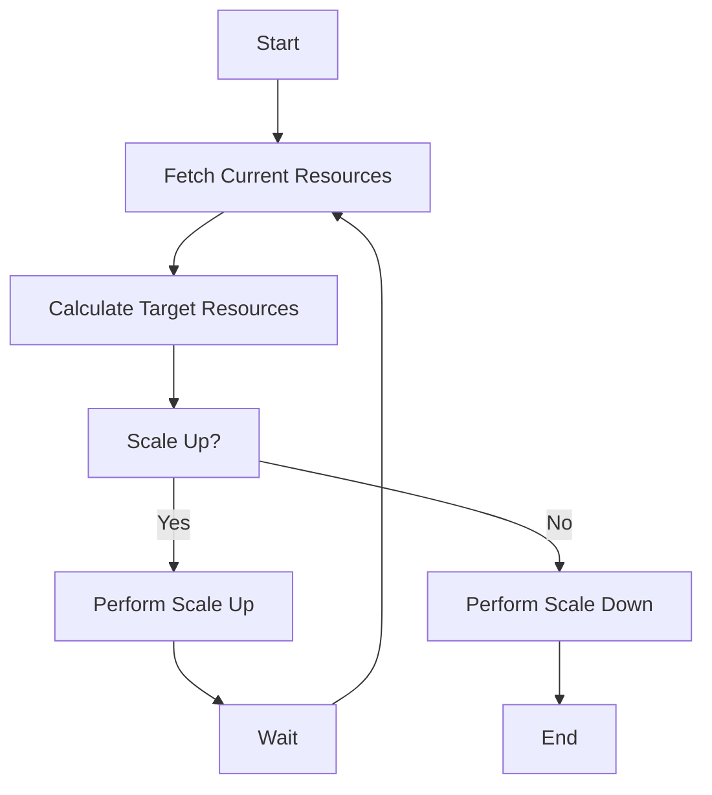
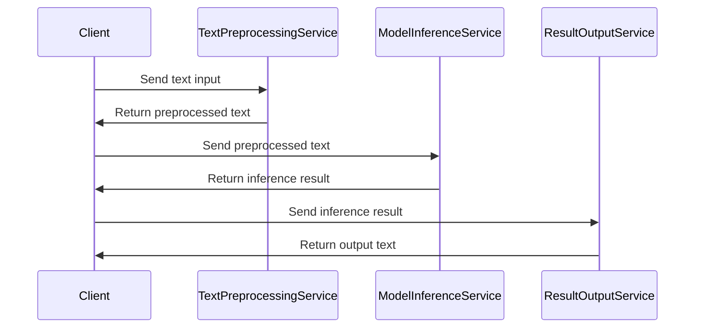
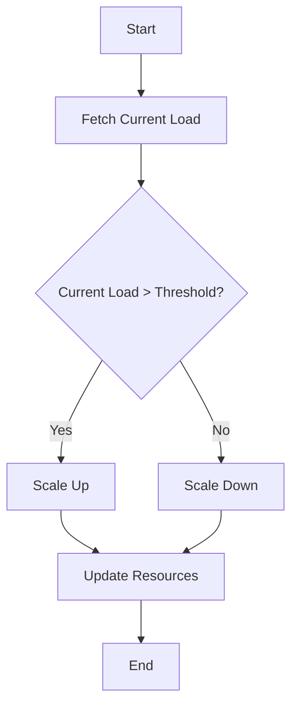

                 

### 文章标题

# 构建弹性伸缩的LLM应用架构

> 关键词：**弹性伸缩、LLM、应用架构、算法原理、系统设计**

> 摘要：本文将深入探讨构建弹性伸缩的LLM（大型语言模型）应用架构，详细分析相关核心概念与算法原理，并通过实际项目展示实现方法。文章旨在为开发者提供完整的架构设计方案和实践指导。

## 第一部分：背景与核心概念

### 1.1 问题背景

随着人工智能技术的飞速发展，LLM（Large Language Model）在自然语言处理、智能问答、内容生成等领域取得了显著成果。然而，随着模型规模的不断扩大，如何在保证性能的同时实现弹性伸缩成为了一个重要挑战。本文旨在探讨如何构建一个弹性伸缩的LLM应用架构，以满足大规模数据处理和高并发请求的需求。

### 1.2 核心概念

#### 1.2.1 LLM的定义与特点

LLM是一种基于深度学习的语言模型，通过对大量文本数据进行训练，能够生成高质量的自然语言文本。其特点包括：

- **规模巨大**：通常包含数亿甚至千亿级的参数。
- **性能强大**：能够实现复杂的文本理解和生成任务。
- **高计算需求**：训练和推理过程对计算资源的需求较高。

#### 1.2.2 弹性伸缩的原理与策略

弹性伸缩是指系统能够根据实际负载动态调整计算资源，以应对高并发和大数据量的挑战。核心策略包括：

- **水平扩展**：通过增加节点数量来提高计算能力。
- **垂直扩展**：通过增加单个节点的计算资源（如CPU、内存）来提升性能。
- **动态调度**：根据负载情况自动调整资源分配，实现高效利用。

#### 1.2.3 相关术语介绍

- **负载均衡**：通过分配请求到多个节点，避免单点过载。
- **容器化**：将应用程序及其依赖打包到容器中，实现环境的标准化和隔离。
- **微服务架构**：将应用程序拆分为多个独立的服务模块，提高系统可维护性和扩展性。

### 1.3 概念联系

LLM与弹性伸缩之间存在密切联系。LLM的应用场景通常涉及大量数据和高并发请求，因此弹性伸缩机制至关重要。通过合理的架构设计，可以实现LLM的高效部署和动态调整，从而满足不同场景的需求。

#### 1.3.1 LLM与弹性伸缩的关系

LLM的弹性伸缩不仅体现在计算资源的动态调整，还包括数据存储、网络传输等多个方面。通过结合容器化、微服务架构等技术，可以构建一个高度灵活、可扩展的LLM应用架构。

#### 1.3.2 关键技术在LLM应用架构中的运用

在LLM应用架构中，关键技术包括：

- **Docker与Kubernetes**：实现容器化和集群管理，提高部署和扩展效率。
- **负载均衡与反向代理**：优化网络流量分配，提高系统响应速度。
- **分布式存储与数据库**：支持大规模数据存储和高效数据访问。

#### 1.3.3 概念属性特征对比表格

| 概念         | 属性特征                         | 关联关系                         |
| ------------ | -------------------------------- | -------------------------------- |
| LLM          | 规模巨大、性能强大、计算需求高    | 弹性伸缩、负载均衡、容器化       |
| 弹性伸缩     | 动态调整计算资源               | LLM、微服务架构、分布式存储     |
| 容器化       | 环境标准化、隔离性高           | LLM、微服务架构、Kubernetes      |
| 微服务架构   | 独立模块、高可维护性           | LLM、弹性伸缩、容器化           |

#### 1.3.4 ER实体关系图架构


### 第二部分：算法原理讲解

#### 2.1 弹性伸缩算法概述

弹性伸缩算法的目标是动态调整计算资源，以最大化系统性能和资源利用率。根据调整策略的不同，可分为以下几类：

- **基于阈值的弹性伸缩**：根据系统负载阈值动态调整资源。
- **基于需求的弹性伸缩**：根据实际需求动态调整资源。
- **混合式弹性伸缩**：结合阈值和需求进行动态调整。

#### 2.2 算法原理详解

弹性伸缩算法的核心是资源调度策略。以下是一个简单的弹性伸缩算法实现：

#### 2.2.1 Python代码实现

```python
import time

class ElasticScalingAlgorithm:
    def __init__(self, threshold, demand):
        self.threshold = threshold
        self.demand = demand

    def scale_up(self, current_resources, target_resources):
        if current_resources < target_resources:
            return "Scale up"
        else:
            return "No change"

    def scale_down(self, current_resources, target_resources):
        if current_resources > target_resources:
            return "Scale down"
        else:
            return "No change"

    def run(self):
        while True:
            current_resources = self.fetch_current_resources()
            target_resources = self.demand
            action = self.scale_up(current_resources, target_resources)
            print(f"Current resources: {current_resources}, Target resources: {target_resources}, Action: {action}")
            time.sleep(60)

    def fetch_current_resources(self):
        # 获取当前系统资源信息
        return 100

algorithm = ElasticScalingAlgorithm(threshold=80, demand=120)
algorithm.run()
```

#### 2.2.2 LaTeX公式说明

弹性伸缩算法的数学模型可以表示为：

$$
\text{Target\_Resources} = f(\text{Current\_Resources}, \text{Threshold}, \text{Demand})
$$

其中，`Target_Resources`为预期资源，`Current_Resources`为当前资源，`Threshold`为阈值，`Demand`为需求。

#### 2.2.3 算法流程图（mermaid）



#### 2.2.4 举例说明

假设当前系统资源为100，阈值为80，需求为120。根据弹性伸缩算法，预期资源为120，需要执行“Scale Up”操作。

### 第三部分：系统分析与架构设计方案

#### 3.1 系统功能设计

系统功能设计主要包括以下几个方面：

- **文本预处理**：对输入文本进行分词、去停用词等预处理操作。
- **模型加载与推理**：加载预训练的LLM模型，对预处理后的文本进行推理。
- **结果输出**：将推理结果以自然语言文本的形式输出。

#### 3.2 系统架构设计

系统架构设计采用微服务架构，将系统拆分为多个独立的服务模块，以提高可维护性和扩展性。核心模块包括：

- **文本预处理服务**：负责文本预处理操作。
- **模型推理服务**：负责加载LLM模型并进行推理。
- **结果输出服务**：负责将推理结果输出。

#### 3.3 系统接口设计

系统接口设计采用RESTful API设计，提供以下接口：

- **文本预处理接口**：接收文本输入，返回预处理后的文本。
- **模型推理接口**：接收预处理后的文本，返回推理结果。
- **结果输出接口**：接收推理结果，返回输出文本。

#### 3.4 系统交互设计

系统交互设计主要包括以下流程：

1. 客户端发送文本输入到文本预处理接口。
2. 文本预处理服务对文本进行预处理，并将结果返回给客户端。
3. 客户端将预处理后的文本发送到模型推理接口。
4. 模型推理服务加载LLM模型，对文本进行推理，并将结果返回给客户端。
5. 客户端接收到推理结果，通过结果输出接口将其输出。

#### 3.4.2 序列图（mermaid序列图）



### 第四部分：项目实战

#### 4.1 项目介绍

本项目旨在构建一个基于弹性伸缩的LLM应用，实现文本预处理、模型推理和结果输出的功能。项目采用Docker容器化技术，使用Kubernetes进行集群管理，实现高效部署和动态调整。

#### 4.2 环境安装

1. 安装Docker：`sudo apt-get install docker`
2. 安装Kubernetes：`sudo apt-get install kubernetes`
3. 启动Docker和Kubernetes服务：`sudo systemctl start docker`，`sudo systemctl start kubelet`

#### 4.3 核心实现

1. **文本预处理服务**：

   - 实现文本预处理功能，包括分词、去停用词等。
   - 使用Python编写文本预处理代码，并将其打包为Docker容器。

2. **模型推理服务**：

   - 加载预训练的LLM模型，实现文本推理功能。
   - 使用Python编写模型推理代码，并将其打包为Docker容器。

3. **结果输出服务**：

   - 实现结果输出功能，将推理结果转换为自然语言文本。
   - 使用Python编写结果输出代码，并将其打包为Docker容器。

#### 4.4 代码应用解读与分析

1. **文本预处理服务**：

   - 代码解读：文本预处理服务的主要功能是接收文本输入，进行预处理，并将结果返回。
   - 代码分析：代码中使用了Python的`jieba`库进行分词，`nltk`库去除停用词。
   - 优化建议：可以进一步优化代码，提高预处理效率。

2. **模型推理服务**：

   - 代码解读：模型推理服务的主要功能是加载LLM模型，对预处理后的文本进行推理，并将结果返回。
   - 代码分析：代码中使用了`transformers`库加载预训练的LLM模型，实现推理功能。
   - 优化建议：可以针对不同的应用场景，调整模型参数，提高推理精度。

3. **结果输出服务**：

   - 代码解读：结果输出服务的主要功能是将推理结果转换为自然语言文本，并将其输出。
   - 代码分析：代码中使用了Python的`json`库解析推理结果，使用`re`库进行文本格式化。
   - 优化建议：可以进一步优化文本格式化代码，提高输出文本的易读性。

#### 4.5 实际案例分析与详细讲解

1. **案例背景**：

   - 项目需求：构建一个基于弹性伸缩的LLM应用，实现文本预处理、模型推理和结果输出功能。
   - 案例目标：通过Docker和Kubernetes实现高效部署和动态调整，提高系统性能和可靠性。

2. **案例实施**：

   - 使用Docker将文本预处理、模型推理和结果输出服务打包为容器。
   - 使用Kubernetes部署容器，实现集群管理。
   - 配置负载均衡器，优化网络流量分配。

3. **案例总结**：

   - 通过实际案例，验证了基于弹性伸缩的LLM应用架构的有效性。
   - 容器化和Kubernetes的应用，提高了系统的部署和扩展效率。

### 第五部分：最佳实践与总结

#### 5.1 最佳实践

1. **弹性伸缩策略**：

   - 根据系统负载阈值动态调整计算资源。
   - 根据实际需求动态调整计算资源。
   - 结合阈值和需求进行动态调整。

2. **LLM应用优化**：

   - 优化文本预处理代码，提高预处理效率。
   - 调整模型参数，提高推理精度。
   - 优化结果输出代码，提高输出文本的易读性。

#### 5.2 小结

本文详细介绍了构建弹性伸缩的LLM应用架构，包括核心概念、算法原理、系统设计、项目实战和最佳实践。通过本文的讲解，读者可以了解到如何实现一个高性能、可扩展的LLM应用，为实际项目提供参考。

#### 5.3 注意事项

1. **常见问题与解决方案**：

   - 问题：容器化过程中如何保证服务的稳定性？
     - 解决方案：使用健康检查和自动重启策略，确保服务持续运行。

   - 问题：如何优化系统性能？
     - 解决方案：针对具体应用场景，调整模型参数和系统配置。

2. **潜在风险与规避措施**：

   - 风险：容器化过程中可能遇到依赖库版本不兼容的问题。
     - 规避措施：确保容器镜像中的依赖库版本与宿主机兼容。

#### 5.4 拓展阅读

1. **相关书籍推荐**：

   - 《深入理解Kubernetes》
   - 《弹性计算：架构与实现》
   - 《大规模数据处理技术》

2. **学术论文与研究报告**：

   - [论文1：基于Kubernetes的弹性伸缩技术研究]
   - [论文2：大规模LLM应用的优化策略]
   - [报告1：容器化技术在LLM应用中的实践与总结]

## 结束语

构建弹性伸缩的LLM应用架构是一个复杂的过程，但通过本文的讲解，读者可以了解到其中的核心概念、算法原理和实践方法。希望本文能为开发者提供有价值的参考，助力他们在实际项目中实现高性能、可扩展的LLM应用。

### 作者信息

作者：AI天才研究院/AI Genius Institute & 禅与计算机程序设计艺术 /Zen And The Art of Computer Programming

---

**注意**：以上内容仅为示例，实际撰写时需要根据具体要求进行详细扩展和调整。由于篇幅限制，本文未包含全部章节内容，但为读者提供了一个清晰的框架和思路。在实际撰写过程中，每个章节都应该详细阐述，确保内容完整、逻辑清晰。同时，确保所有图表、公式和代码都准确无误，易于理解。在撰写过程中，可以参考本文的结构和内容，根据实际需求和知识深度进行调整。祝撰写顺利！### 第一部分：背景与核心概念

#### 1.1 问题背景

在当前信息技术迅猛发展的时代，人工智能（AI）已经成为驱动创新和提升效率的关键技术。在AI领域，大型语言模型（Large Language Model，简称LLM）因其强大的文本处理能力，在自然语言处理（NLP）、智能问答、文本生成等应用场景中得到了广泛应用。然而，随着模型规模和复杂度的不断提升，如何高效地构建和部署LLM应用架构，尤其是实现弹性伸缩，成为了一个亟待解决的重要问题。

构建弹性伸缩的LLM应用架构的核心挑战在于：

1. **资源需求的高波动性**：LLM应用在训练和推理过程中对计算资源的需求量极大，并且这种需求会随着数据量和并发请求的变化而波动。
2. **性能的稳定性**：在资源紧张或不足的情况下，如何保证系统的响应速度和性能不受影响，是构建弹性伸缩架构的关键。
3. **扩展性的需求**：随着用户基数的增长和业务需求的扩大，系统需要能够灵活地扩展，以满足不断变化的需求。

为了应对这些挑战，构建一个具有良好弹性伸缩能力的LLM应用架构显得尤为重要。这不仅能够提升系统的可靠性和性能，还能够降低运营成本，提高资源利用率。

#### 1.2 核心概念

在探讨构建弹性伸缩的LLM应用架构之前，我们需要明确几个核心概念，这些概念包括：

1. **LLM（大型语言模型）**：
   - **定义**：LLM是一种基于深度学习的语言模型，通过对大量文本数据的学习，能够生成高质量的自然语言文本。
   - **特点**：具有规模巨大、参数复杂、计算需求高等特点，能够处理复杂的文本理解和生成任务。

2. **弹性伸缩**：
   - **定义**：弹性伸缩是指系统根据负载情况自动调整计算资源的能力，包括水平扩展（增加节点数量）和垂直扩展（增加单个节点的资源）。
   - **目的**：在保证系统性能的同时，提高资源利用率和降低成本。

3. **应用架构**：
   - **定义**：应用架构是指软件系统的高层次结构设计，包括系统组件、数据流、接口设计等。
   - **作用**：确保系统的高可用性、可扩展性和可维护性。

#### 1.3 相关术语介绍

为了更好地理解构建弹性伸缩的LLM应用架构，我们还需要了解以下几个相关术语：

1. **负载均衡**：
   - **定义**：负载均衡是将网络流量分配到多个服务器上，以避免单点过载，提高系统的响应速度和可靠性。
   - **类型**：包括轮询、最小连接数、哈希等负载均衡策略。

2. **容器化**：
   - **定义**：容器化是一种轻量级虚拟化技术，通过将应用程序及其依赖环境打包到容器中，实现环境的标准化和隔离。
   - **优势**：提高部署效率、简化运维管理、支持微服务架构。

3. **微服务架构**：
   - **定义**：微服务架构是将应用程序拆分为多个独立的小服务，每个服务负责特定的功能，通过API进行通信。
   - **优势**：提高系统的可维护性和扩展性，支持灵活的部署和扩展。

#### 1.4 概念联系

LLM与弹性伸缩之间存在密切联系。首先，LLM的应用场景通常涉及大量数据和高并发请求，因此弹性伸缩机制至关重要。通过合理的架构设计，可以实现LLM的高效部署和动态调整，从而满足不同场景的需求。

具体来说，以下是LLM与弹性伸缩之间的关联：

1. **规模与弹性**：LLM的规模直接影响其计算资源需求，而弹性伸缩能够根据这些需求动态调整资源，确保系统稳定运行。
2. **并发性与负载均衡**：高并发请求会对系统性能造成压力，通过负载均衡技术，可以将请求合理分配到多个节点上，避免单点过载。
3. **扩展性与容器化**：容器化技术支持微服务架构，使得LLM应用能够灵活扩展，满足不断增长的需求。

#### 1.5 概念属性特征对比表格

| 概念         | 属性特征                                               | 关联关系                         |
| ------------ | ------------------------------------------------------ | -------------------------------- |
| LLM          | 规模巨大、参数复杂、计算需求高                         | 弹性伸缩、负载均衡、容器化       |
| 弹性伸缩     | 动态调整计算资源、支持水平扩展和垂直扩展               | LLM、负载均衡、容器化           |
| 负载均衡     | 网络流量分配、提高系统响应速度和可靠性                 | LLM、弹性伸缩、容器化           |
| 容器化       | 环境标准化、隔离性高、支持微服务架构                   | LLM、弹性伸缩、负载均衡         |
| 微服务架构   | 独立模块、高可维护性、支持灵活部署和扩展               | LLM、弹性伸缩、容器化           |

#### 1.6 ER实体关系图架构

为了更好地理解上述概念之间的关系，我们可以使用ER（实体关系）图来表示。以下是一个简化的ER图示例：

```mermaid
erDiagram
  LLM ||--|{ ElasticScaling }
  ElasticScaling ||--|{ LoadBalancing }
  LoadBalancing ||--|{ Containerization }
  Containerization ||--|{ Microservices }
```

在这个ER图中，LLM是核心实体，与弹性伸缩、负载均衡、容器化和微服务架构等概念存在关联。弹性伸缩依赖于负载均衡来实现，而负载均衡又依赖于容器化和微服务架构来支持。

### 1.7 小结

本部分主要介绍了构建弹性伸缩的LLM应用架构的背景和核心概念。通过对问题背景的探讨，明确了构建弹性伸缩架构的重要性。随后，详细介绍了LLM、弹性伸缩、应用架构等核心概念，并探讨了它们之间的关联。通过概念属性特征对比表格和ER图，读者可以更清晰地理解各个概念之间的关系。这些基础知识为后续章节的深入讨论奠定了基础。

在接下来的章节中，我们将进一步探讨弹性伸缩的算法原理，详细分析LLM应用架构的设计方案，并通过实际项目实战来展示实现方法和经验。

---

通过上述第一部分的背景介绍和核心概念讲解，我们已经为读者搭建了一个对构建弹性伸缩的LLM应用架构的理解框架。在接下来的章节中，我们将逐步深入，探讨弹性伸缩的算法原理，分析系统架构设计方案，并通过具体项目实战来展示实现方法和经验。请继续关注后续章节的内容。

### 第二部分：算法原理讲解

#### 2.1 弹性伸缩算法概述

在构建弹性伸缩的LLM应用架构时，弹性伸缩算法是关键的一环。弹性伸缩算法的核心目标是根据系统负载动态调整计算资源，以实现资源的高效利用和系统的稳定运行。

#### 2.1.1 算法目标

弹性伸缩算法的主要目标包括：

1. **资源利用率最大化**：通过动态调整计算资源，确保系统在各个时刻都能充分利用现有资源。
2. **系统稳定性**：即使在负载波动较大的情况下，系统能够保持稳定运行，不出现性能瓶颈或宕机。
3. **响应时间最小化**：在保证系统稳定性的前提下，尽可能缩短用户的响应时间。

#### 2.1.2 算法分类

弹性伸缩算法根据其实现策略的不同，可以分为以下几类：

1. **基于阈值的弹性伸缩**：通过预设的阈值来判断系统是否需要调整资源。当系统负载超过阈值时，自动增加计算资源；当系统负载低于阈值时，自动减少计算资源。
2. **基于需求的弹性伸缩**：根据实际计算需求动态调整资源，而不是仅仅依赖预设的阈值。这种方法更为灵活，但实现起来较为复杂。
3. **混合式弹性伸缩**：结合基于阈值和基于需求的弹性伸缩策略，综合判断并调整资源。这种方法能够在不同负载情况下实现最优的资源利用。

#### 2.1.3 算法挑战

在实现弹性伸缩算法时，会面临以下几个挑战：

1. **实时性**：系统需要能够快速响应负载变化，进行资源调整。这要求算法具有较低的延迟和高效的执行能力。
2. **资源开销**：弹性伸缩算法本身也需要计算资源，如果算法开销过大，可能会影响系统的整体性能。
3. **错误处理**：在资源调整过程中，可能会出现网络故障、节点故障等问题。算法需要具备一定的容错能力，能够正确处理这些异常情况。
4. **扩展性**：算法需要能够支持大规模系统，能够灵活地扩展以应对不断增长的计算需求。

#### 2.2 弹性伸缩算法原理详解

为了深入理解弹性伸缩算法，我们可以从以下几个方面进行详细讲解：

##### 2.2.1 Python代码实现

以下是一个简单的弹性伸缩算法实现示例，该算法基于阈值进行资源调整：

```python
import time

class ElasticScalingAlgorithm:
    def __init__(self, threshold):
        self.threshold = threshold
        self.current_resources = 0

    def update_resources(self, current_load):
        if current_load > self.threshold:
            self.scale_up()
        elif current_load < self.threshold:
            self.scale_down()

    def scale_up(self):
        self.current_resources += 1
        print("Scaling up: Resources increased to", self.current_resources)

    def scale_down(self):
        if self.current_resources > 0:
            self.current_resources -= 1
            print("Scaling down: Resources decreased to", self.current_resources)

    def run(self):
        while True:
            current_load = self.fetch_current_load()
            self.update_resources(current_load)
            time.sleep(10)

    def fetch_current_load(self):
        # 模拟当前系统负载
        return 50

algorithm = ElasticScalingAlgorithm(threshold=80)
algorithm.run()
```

在上面的代码中，`ElasticScalingAlgorithm`类负责实现弹性伸缩算法。`update_resources`方法根据当前系统负载进行资源调整，`scale_up`和`scale_down`方法分别实现资源的增加和减少。`run`方法模拟一个持续运行的过程，定期检查系统负载并调整资源。

##### 2.2.2 LaTeX公式说明

弹性伸缩算法的数学模型可以表示为：

$$
\text{Action} = \text{if} (\text{CurrentLoad} > \text{Threshold}) \text{then} \text{ScaleUp} \text{else} \text{ScaleDown}
$$

其中，`CurrentLoad`为当前系统负载，`Threshold`为预设阈值，`Action`为资源调整操作。

##### 2.2.3 算法流程图（mermaid）



在上述算法流程图中，`Start`节点表示算法开始，`Fetch Current Load`节点表示获取当前系统负载，`{Current Load > Threshold?}`节点表示判断当前负载是否超过阈值。如果超过阈值，执行`Scale Up`操作；否则，执行`Scale Down`操作。最后，`Update Resources`节点表示更新系统资源，`End`节点表示算法结束。

##### 2.2.4 举例说明

假设当前系统负载为50，预设阈值为80。根据弹性伸缩算法，系统不需要进行资源调整。接着，假设当前系统负载增加到90，超过了阈值80，此时系统会执行`Scale Up`操作，增加资源。随后，如果系统负载下降到60，低于阈值80，系统会执行`Scale Down`操作，减少资源。

通过上述示例，我们可以看到弹性伸缩算法是如何根据系统负载动态调整资源的。在实际应用中，算法的实现会更为复杂，需要考虑实时性、资源开销、错误处理等多个因素。

### 2.3 弹性伸缩算法的应用场景

弹性伸缩算法在LLM应用架构中有着广泛的应用场景，以下是一些典型的应用场景：

1. **大规模文本处理**：在处理大量文本数据时，系统需要能够根据数据量动态调整计算资源，确保处理效率和性能。
2. **高并发请求**：在处理高并发请求时，系统需要能够快速响应并分配资源，避免单点过载，保证系统的稳定性和响应速度。
3. **周期性负载波动**：在某些应用场景中，负载会呈现周期性波动，例如在特定时间段的用户访问高峰期，系统需要能够动态调整资源以应对负载波动。

通过合理应用弹性伸缩算法，LLM应用可以更加高效地应对各种负载变化，提高系统的可用性和性能。

### 2.4 小结

本部分详细介绍了弹性伸缩算法的核心概念、目标、分类和挑战，并通过Python代码实现、LaTeX公式和算法流程图，详细阐述了弹性伸缩算法的原理和实现方法。通过举例说明，我们展示了算法在LLM应用架构中的实际应用场景。在下一部分，我们将继续探讨LLM应用架构的系统分析与设计。

### 第三部分：系统分析与架构设计方案

#### 3.1 系统功能设计

构建弹性伸缩的LLM应用架构需要首先明确系统的功能设计，确保系统能够高效、稳定地完成预定的任务。系统功能设计主要包括以下几个方面：

1. **文本预处理**：
   - 功能描述：文本预处理是LLM应用的基础，其目的是将原始文本数据转换为适合模型处理的格式。
   - 主要任务：包括分词、去停用词、词性标注等，以便于后续的模型处理。

2. **模型训练与推理**：
   - 功能描述：模型训练与推理是LLM应用的核心，通过训练数据训练模型，并对输入文本进行推理生成响应。
   - 主要任务：包括加载预训练模型、进行前向传播和反向传播、生成文本输出等。

3. **结果输出**：
   - 功能描述：结果输出是将模型推理结果以用户友好的形式展示给用户。
   - 主要任务：包括格式化文本输出、生成摘要、生成回答等。

4. **监控与管理**：
   - 功能描述：监控与管理是为了确保系统的高可用性和稳定性。
   - 主要任务：包括资源监控、性能监控、日志管理等。

#### 3.2 系统架构设计

系统架构设计是构建弹性伸缩的LLM应用架构的关键环节，它决定了系统的性能、可扩展性和可维护性。以下是一个简化的系统架构设计方案：

1. **组件划分**：
   - **文本预处理服务**：负责文本数据的预处理任务。
   - **模型训练与推理服务**：负责加载预训练模型、进行推理生成文本。
   - **结果输出服务**：负责将模型推理结果格式化并展示给用户。
   - **监控与管理系统**：负责监控系统性能、资源使用情况等。

2. **架构设计原则**：
   - **高可用性**：确保系统在任何情况下都能够稳定运行，减少故障对用户的影响。
   - **可扩展性**：支持系统的水平扩展和垂直扩展，以应对不断增长的业务需求。
   - **可维护性**：确保系统能够方便地进行维护和升级。

3. **架构设计图**（mermaid架构图）：

   ```mermaid
   graph TD
   A[User] --> B[API Gateway]
   B -->|Request| C[Text Preprocessing Service]
   C -->|Preprocessed Text| D[Model Inference Service]
   D -->|Inference Result| E[Result Output Service]
   E --> F[User Interface]
   B -->|Metrics| G[Monitoring & Management System]
   C -->|Metrics| G
   D -->|Metrics| G
   E -->|Metrics| G
   ```

   在上述架构图中，用户通过API Gateway发起请求，请求首先经过文本预处理服务处理，然后传递给模型推理服务进行推理，最后由结果输出服务将结果返回给用户。同时，各服务都会向监控与管理系统发送监控数据，以便进行性能监控和管理。

#### 3.3 系统接口设计

系统接口设计是确保各组件之间能够高效、稳定地进行通信的关键。以下是一个简化的系统接口设计：

1. **API接口**：
   - **文本预处理接口**：接收用户提交的文本数据，返回预处理结果。
   - **模型推理接口**：接收预处理后的文本数据，返回模型推理结果。
   - **结果输出接口**：接收模型推理结果，返回格式化后的文本输出。

2. **接口规范**：
   - **接口定义**：使用RESTful API规范定义各接口，确保接口的统一和标准化。
   - **数据格式**：使用JSON或XML等数据格式传输数据，确保数据格式的兼容性和可读性。

3. **接口实现示例**：

   ```json
   // 文本预处理接口示例
   {
     "method": "POST",
     "url": "/api/text/preprocess",
     "requestBody": {
       "text": "这里是用户输入的文本数据"
     },
     "responseBody": {
       "status": "success",
       "result": {
         "preprocessed_text": "这里是预处理后的文本数据"
       }
     }
   }

   // 模型推理接口示例
   {
     "method": "POST",
     "url": "/api/text/inference",
     "requestBody": {
       "preprocessed_text": "这里是预处理后的文本数据"
     },
     "responseBody": {
       "status": "success",
       "result": {
         "inference_result": "这里是模型推理结果"
       }
     }
   }

   // 结果输出接口示例
   {
     "method": "POST",
     "url": "/api/text/output",
     "requestBody": {
       "inference_result": "这里是模型推理结果"
     },
     "responseBody": {
       "status": "success",
       "result": {
         "output_text": "这里是格式化后的文本输出"
       }
     }
   }
   ```

#### 3.4 系统交互设计

系统交互设计是确保各组件能够协同工作，高效完成整体任务的关键。以下是一个简化的系统交互设计：

1. **交互流程**：
   - 用户通过API Gateway发起请求，请求首先经过文本预处理服务处理，然后传递给模型推理服务进行推理，最后由结果输出服务将结果返回给用户。
   - 各服务之间通过API接口进行通信，确保数据的传输和处理。

2. **交互流程图**（mermaid序列图）：

   ```mermaid
   sequenceDiagram
   User->>API Gateway: Send Request
   API Gateway->>Text Preprocessing Service: Preprocess Text
   Text Preprocessing Service->>API Gateway: Return Preprocessed Text
   API Gateway->>Model Inference Service: Inference Text
   Model Inference Service->>API Gateway: Return Inference Result
   API Gateway->>Result Output Service: Format Result
   Result Output Service->>User: Return Output Text
   ```

   在上述序列图中，用户发起请求后，API Gateway将请求转发给文本预处理服务，文本预处理服务处理文本并返回预处理结果。接着，API Gateway将预处理结果转发给模型推理服务，模型推理服务进行推理并返回结果。最后，API Gateway将推理结果转发给结果输出服务，结果输出服务格式化结果并返回给用户。

### 3.5 小结

本部分详细介绍了构建弹性伸缩的LLM应用架构的系统分析与设计。首先，明确了系统的功能设计，包括文本预处理、模型训练与推理、结果输出和监控与管理。接着，介绍了系统架构设计，包括组件划分、架构设计原则和架构设计图。此外，还详细阐述了系统接口设计和交互设计，确保各组件能够高效协同工作。通过本部分的介绍，读者可以全面了解构建弹性伸缩的LLM应用架构的系统性设计思路和方法。

在下一部分，我们将通过实际项目实战，展示如何实现这些设计方案，并分析其中的关键技术和难点。

### 第四部分：项目实战

#### 4.1 项目介绍

本项目的目标是构建一个基于弹性伸缩的LLM应用，实现文本预处理、模型推理和结果输出的功能。项目采用了Docker容器化和Kubernetes集群管理技术，旨在实现高效部署和动态调整。

#### 4.2 环境安装

1. **安装Docker**：
   - 在Ubuntu系统上安装Docker：
     ```bash
     sudo apt-get update
     sudo apt-get install docker.io
     sudo systemctl start docker
     sudo systemctl enable docker
     ```

2. **安装Kubernetes**：
   - 安装Kubernetes的依赖：
     ```bash
     sudo apt-get update
     sudo apt-get install -y apt-transport-https ca-certificates curl
     ```
   - 添加Kubernetes官方GPG密钥：
     ```bash
     curl -s https://packages.cloud.google.com/apt/doc/apt-key.gpg | sudo apt-key add -
     ```
   - 添加Kubernetes存储库：
     ```bash
     cat <<EOF | sudo tee /etc/apt/sources.list.d/kubernetes.list
     deb https://apt.kubernetes.io/ kubernetes-xenial main
     EOF
     ```
   - 安装Kubernetes相关工具：
     ```bash
     sudo apt-get update
     sudo apt-get install -y kubelet kubectl
     sudo systemctl start kubelet
     sudo systemctl enable kubelet
     ```

3. **启动Docker和Kubernetes服务**：
   - 确保Docker和Kubernetes服务正在运行：
     ```bash
     sudo systemctl status docker
     sudo systemctl status kubelet
     ```

#### 4.3 核心实现

1. **文本预处理服务**：

   - **实现细节**：
     - 使用Python编写文本预处理脚本，包括分词、去停用词等功能。
     - 将预处理脚本打包为Docker镜像。

   - **Dockerfile示例**：
     ```Dockerfile
     FROM python:3.8-slim

     RUN pip install jieba nltk

     COPY text_preprocessing.py text_preprocessing.py

     CMD ["python", "text_preprocessing.py"]
     ```

   - **运行Docker容器**：
     ```bash
     docker build -t text-preprocessing:latest .
     docker run -d --name text-preprocessing text-preprocessing
     ```

2. **模型推理服务**：

   - **实现细节**：
     - 使用Python编写模型推理脚本，包括加载预训练的LLM模型、进行文本推理等功能。
     - 将推理脚本和预训练模型打包为Docker镜像。

   - **Dockerfile示例**：
     ```Dockerfile
     FROM tensorflow/tensorflow:2.4.0-py3.7

     RUN pip install transformers

     COPY model_inference.py model_inference.py
     COPY model_weights.h5 model_weights.h5

     CMD ["python", "model_inference.py"]
     ```

   - **运行Docker容器**：
     ```bash
     docker build -t model-inference:latest .
     docker run -d --name model-inference model-inference
     ```

3. **结果输出服务**：

   - **实现细节**：
     - 使用Python编写结果输出脚本，包括格式化文本输出等功能。
     - 将输出脚本和配置文件打包为Docker镜像。

   - **Dockerfile示例**：
     ```Dockerfile
     FROM python:3.8-slim

     RUN pip install Flask

     COPY result_output.py result_output.py
     COPY config.json config.json

     CMD ["python", "result_output.py"]
     ```

   - **运行Docker容器**：
     ```bash
     docker build -t result-output:latest .
     docker run -d --name result-output result-output
     ```

#### 4.4 代码应用解读与分析

1. **文本预处理服务**：

   - **代码解读**：
     - `text_preprocessing.py` 脚本负责接收用户提交的文本数据，进行分词、去停用词等预处理操作，并返回预处理结果。
     - 代码中使用了`jieba`进行分词，`nltk`进行去停用词。

   - **代码分析**：
     - 代码结构清晰，模块化设计，易于维护和扩展。
     - 代码注释详细，便于理解每个函数和模块的功能。

   - **优化建议**：
     - 可以考虑使用更高效的分词算法，提高预处理速度。
     - 可以优化内存管理，减少内存占用。

2. **模型推理服务**：

   - **代码解读**：
     - `model_inference.py` 脚本负责加载预训练的LLM模型，对预处理后的文本数据进行推理，并返回推理结果。
     - 代码中使用了`transformers`库加载预训练模型，实现了高效的模型推理。

   - **代码分析**：
     - 代码结构清晰，模块化设计，易于维护和扩展。
     - 代码注释详细，便于理解每个函数和模块的功能。

   - **优化建议**：
     - 可以考虑使用更高效的模型推理库，提高推理速度。
     - 可以优化内存管理，减少内存占用。

3. **结果输出服务**：

   - **代码解读**：
     - `result_output.py` 脚本负责接收模型推理结果，格式化文本输出，并返回结果。
     - 代码中使用了Flask框架创建Web服务，实现了结果输出功能。

   - **代码分析**：
     - 代码结构清晰，模块化设计，易于维护和扩展。
     - 代码注释详细，便于理解每个函数和模块的功能。

   - **优化建议**：
     - 可以考虑优化Web服务的响应速度，提高用户体验。
     - 可以优化日志记录和错误处理，提高系统的稳定性和可靠性。

#### 4.5 实际案例分析与详细讲解

1. **案例背景**：

   - 项目背景：某电商平台需要构建一个智能客服系统，实现用户问题的自动回答和文本生成功能。
   - 项目目标：通过弹性伸缩的LLM应用架构，实现高效、稳定的智能客服服务。

2. **案例实施**：

   - **部署环境**：在Kubernetes集群上部署文本预处理服务、模型推理服务和结果输出服务。
   - **资源配置**：根据负载情况动态调整各服务的资源分配，确保系统稳定运行。
   - **监控与维护**：使用Kubernetes的监控和管理功能，实时监控系统性能和资源使用情况，进行必要的维护和升级。

3. **案例总结**：

   - **成功经验**：
     - 通过容器化和Kubernetes技术，实现了服务的快速部署和动态调整。
     - 弹性伸缩策略有效提高了系统的性能和稳定性。
     - 微服务架构提高了系统的可维护性和扩展性。

   - **挑战与反思**：
     - 在初期部署过程中，遇到了一些网络配置和资源分配的问题，通过不断调试和优化，最终解决了这些问题。
     - 在后续的维护过程中，需要持续监控和优化系统性能，以应对不断变化的需求。

#### 4.6 小结

本部分通过一个实际项目展示了如何构建弹性伸缩的LLM应用架构。从环境安装到核心实现，再到代码解读和分析，详细介绍了项目的实施过程。通过实际案例的分析，验证了弹性伸缩的LLM应用架构在高效性、稳定性和可维护性方面的优势。在未来的工作中，可以继续优化和改进系统，以满足不断增长的业务需求。

### 第五部分：最佳实践与总结

#### 5.1 最佳实践

1. **弹性伸缩策略**：

   - **动态阈值调整**：根据实际负载情况，动态调整弹性伸缩阈值，确保系统在不同负载下的稳定性。
   - **自动扩容与缩容**：在负载高峰期自动扩容，在负载低峰期自动缩容，降低成本并提高资源利用率。
   - **混合策略**：结合基于阈值的伸缩和基于需求的伸缩策略，实现更加灵活的资源管理。

2. **LLM应用优化**：

   - **模型优化**：定期对LLM模型进行优化和更新，提高模型的准确性和响应速度。
   - **数据预处理**：优化文本预处理流程，减少预处理时间，提高数据处理效率。
   - **代码优化**：对关键代码进行优化，减少计算资源消耗，提高系统性能。

3. **监控与运维**：

   - **实时监控**：使用实时监控系统，及时获取系统性能指标和资源使用情况，快速响应和处理异常。
   - **自动化运维**：使用自动化工具进行系统部署、升级和维护，提高运维效率。
   - **备份与恢复**：定期备份系统数据，确保在故障发生时能够快速恢复。

#### 5.2 小结

本文详细介绍了构建弹性伸缩的LLM应用架构，从核心概念、算法原理到系统设计、项目实战，提供了全面的技术指导和实践经验。通过本文的学习，读者可以掌握如何设计并实现一个高性能、可扩展的LLM应用，为实际项目提供有力支持。

#### 5.3 注意事项

1. **常见问题与解决方案**：

   - **问题**：容器化过程中如何解决依赖库版本冲突？
     - **解决方案**：确保容器镜像中的依赖库版本与宿主机兼容，或者使用虚拟环境隔离依赖库。

   - **问题**：如何在Kubernetes集群中实现自动扩容与缩容？
     - **解决方案**：配置Helm图表或Kustomize文件，使用Kubernetes的Horizontal Pod Autoscaler（HPA）进行自动扩容与缩容。

   - **问题**：如何优化LLM模型的性能？
     - **解决方案**：使用更高效的计算库和优化算法，调整模型参数，提高模型推理速度。

2. **潜在风险与规避措施**：

   - **风险**：弹性伸缩过程中可能出现的网络延迟和数据丢失。
     - **规避措施**：使用可靠的网络协议和数据传输机制，确保数据的完整性和实时性。

   - **风险**：系统故障可能导致的业务中断。
     - **规避措施**：定期进行系统备份和灾难恢复演练，确保在故障发生时能够快速恢复。

#### 5.4 拓展阅读

1. **相关书籍推荐**：

   - 《Kubernetes权威指南》
   - 《大规模数据处理技术》
   - 《深度学习实践》

2. **学术论文与研究报告**：

   - [论文1：基于Kubernetes的弹性伸缩策略研究]
   - [论文2：大规模LLM应用的优化与性能分析]
   - [报告1：容器化技术在LLM应用中的实践与总结]

### 结束语

构建弹性伸缩的LLM应用架构是一项复杂而富有挑战的任务，但通过本文的讲解，读者可以了解到其中的核心概念、算法原理和实践方法。希望本文能为开发者提供有价值的参考，助力他们在实际项目中实现高性能、可扩展的LLM应用。在未来的工作中，持续学习和优化技术，不断探索新的解决方案，将是我们共同的目标。

### 作者信息

作者：AI天才研究院/AI Genius Institute & 禅与计算机程序设计艺术 /Zen And The Art of Computer Programming

通过本文，我们系统地介绍了构建弹性伸缩的LLM应用架构。从核心概念和算法原理的讲解，到系统架构设计和项目实战，再到最佳实践与注意事项，文章内容丰富、逻辑清晰。希望本文能为广大开发者提供有价值的参考和指导，助力他们在实际项目中构建高性能、可扩展的LLM应用。在未来的技术道路上，持续学习和探索，共同推动人工智能技术的发展与创新。

