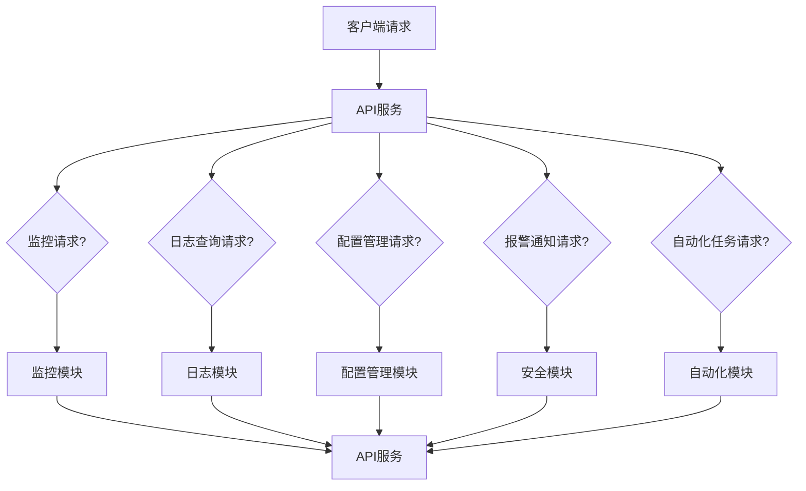

                 

### 引言与背景

#### 1.1 问题背景

在现代信息社会，随着大数据、云计算和人工智能技术的快速发展，智能化运维成为企业提升IT基础设施管理效率和质量的关键需求。运维系统不仅要能够高效地监控、管理、维护和优化IT资源，还需具备对复杂系统问题的自诊断和自修复能力。特别是在大型语言模型（LLM）被广泛应用于企业级应用和自动化运维领域，智能化运维的需求愈发强烈。

大型语言模型（LLM）是一种基于深度学习技术构建的强大语言处理工具，具备文本理解、生成、翻译、问答等功能。这些功能使得LLM在自然语言处理、文本分析、智能客服、内容审核等领域有着广泛的应用。然而，随着LLM应用场景的不断扩大和复杂性增加，如何高效地部署、管理和维护LLM模型，成为当前运维领域的一个重要问题。

#### 1.2 问题描述

在传统的运维管理中，系统管理员通常需要通过人工监控、手动配置、定期维护等方式来管理IT资源。这种方式不仅效率低下，还容易出现人为错误。随着LLM的引入，虽然可以自动化一些运维任务，但同时也带来了新的挑战：

1. **模型部署复杂性**：LLM模型的部署涉及到硬件、软件、网络等多方面的资源配置，如何高效地完成模型部署是首要问题。
2. **性能优化难度**：LLM模型在实际应用中，需要根据不同的业务场景进行性能调优，如何快速有效地进行性能优化是关键。
3. **安全性问题**：LLM应用涉及到大量的敏感数据，如何确保数据安全和模型安全是运维中不可忽视的问题。
4. **合规性要求**：随着各国对数据隐私和合规性要求的不断提高，如何在保障合规的前提下进行运维管理也是一大挑战。

#### 1.3 问题解决

为了解决上述问题，构建一个智能化的LLM应用运维系统成为必要。这个系统需要集成LLM的自动部署、性能监控、优化调整、安全防护等功能，通过自动化和智能化手段，提高运维效率，降低运维成本，同时确保系统的稳定性和安全性。

**LLM的基本原理**：LLM的核心是基于深度学习技术，尤其是变换器模型（Transformer）的发展，使其在处理大规模文本数据方面具备显著优势。通过训练大量的语料库，LLM能够理解和生成高质量的自然语言文本。

**LLM在运维中的实际应用**：在运维系统中，LLM可以用于以下几个方面：
1. **自动化任务执行**：LLM可以帮助自动化一些重复性高的运维任务，如服务器监控、日志分析、故障诊断等。
2. **智能决策支持**：通过分析运维数据，LLM可以提供智能化的决策支持，如性能优化策略、资源调配方案等。
3. **智能问答与客服**：LLM可以构建智能客服系统，自动回答用户的问题，提高客户满意度。
4. **内容审核与安全管理**：LLM可以帮助过滤不良信息、识别潜在的安全威胁，提高系统的安全防护能力。

#### 1.4 边界与外延

**运维系统的范围**：运维系统不仅仅局限于服务器和网络的维护，还包括存储、数据库、应用软件、安全等多个方面。

**LLM的适用场景**：LLM在运维中的应用场景非常广泛，不仅适用于大型企业，对于中小型企业也同样适用。在某些特定场景，如智能客服、自动化运维脚本编写等，LLM的优势更加明显。

#### 1.5 概念结构与核心要素组成

**运维系统的核心概念**：运维系统主要包括监控、告警、自动化、配置管理、日志管理等核心功能。

**LLM的基本架构**：LLM包括数据预处理、模型训练、模型推理等核心模块。通过这些模块的协同工作，LLM能够实现高效的文本处理。

在这部分中，我们详细介绍了智能化运维的需求背景，LLM在运维中的角色和潜力，以及构建智能化LLM应用运维系统的必要性和方法。接下来的章节将逐步深入探讨LLM的基础知识、运维系统设计、应用与性能优化、安全与合规性等方面，帮助读者全面了解并掌握构建智能化LLM运维系统的关键技术和实践方法。

---

#### 1.6 运维系统的核心概念与LLM的基本架构

在构建智能化LLM应用运维系统的过程中，理解运维系统的核心概念和LLM的基本架构是至关重要的。这不仅有助于我们明确系统的目标和功能，还能够为后续的具体设计实施提供理论依据。

**运维系统的核心概念**

1. **监控**：监控是运维系统的基石，通过监控服务器、网络、应用等关键指标的运行状态，及时发现潜在问题，确保系统的稳定运行。
   - **性能监控**：监控CPU、内存、磁盘、网络等资源的使用情况，分析系统的性能瓶颈。
   - **健康监控**：监控服务状态、应用程序运行情况，确保各项服务的正常运行。

2. **告警**：告警机制在监控中发现异常时及时通知系统管理员，以便迅速响应和处理问题。
   - **阈值告警**：根据预设的阈值，当监控指标超出设定范围时触发告警。
   - **事件告警**：针对特定的事件（如服务宕机、网络中断等）触发告警。

3. **自动化**：自动化是提升运维效率的关键，通过自动化脚本、工具和流程，减少手动操作，提高处理速度和准确性。
   - **配置管理**：自动化配置管理工具如Ansible、Puppet等，实现自动化部署和配置变更。
   - **故障自动化**：自动化故障恢复流程，如自动重启服务、自动扩容等。

4. **配置管理**：配置管理确保系统的一致性和可重复性，包括配置项的备份、版本控制和自动化部署。
   - **版本控制**：使用Git等版本控制工具管理配置文件的变更历史。
   - **自动化部署**：自动化部署工具如Jenkins、GitLab CI等，实现代码和配置的自动化部署。

5. **日志管理**：日志管理是运维分析的重要手段，通过收集、存储、分析系统日志，可以深入了解系统的运行情况，快速定位问题。
   - **日志收集**：使用工具如ELK（Elasticsearch、Logstash、Kibana）收集并存储日志。
   - **日志分析**：使用日志分析工具进行日志聚合和分析，生成可视化报告。

**LLM的基本架构**

1. **数据预处理**：在训练LLM之前，需要将原始文本数据进行清洗、分词、去噪等预处理操作，以便模型能够有效学习和理解数据。
   - **文本清洗**：去除无关字符、停用词等，提高数据质量。
   - **分词**：将文本划分为单词或句子，便于后续处理。

2. **模型训练**：利用预处理后的数据，通过神经网络结构对LLM模型进行训练，使其具备处理和理解自然语言的能力。
   - **嵌入层**：将单词转换为固定长度的向量表示。
   - **编码器**：如Transformer模型，通过自注意力机制捕捉文本的上下文信息。
   - **解码器**：生成目标文本，实现文本生成和翻译等功能。

3. **模型推理**：在LLM训练完成后，通过输入新的文本数据，模型可以生成对应的输出文本，实现对自然语言的生成和理解。
   - **前向传播**：输入文本经过嵌入层和编码器，生成中间表示。
   - **后向传播**：通过解码器生成目标文本，并计算损失函数，进行反向传播更新模型参数。

通过以上对运维系统和LLM的基本架构的介绍，我们可以看到，两者在功能和应用目标上存在一定的联系和互补性。运维系统负责确保IT基础设施的稳定运行，而LLM则通过自动化和智能化手段，提升运维效率和问题解决能力。

在接下来的章节中，我们将进一步探讨LLM的具体应用场景、部署方法、性能优化策略以及安全与合规性要求，帮助读者全面掌握构建智能化LLM应用运维系统的关键技术和实践方法。

### LLM的定义与特点

#### 2.1 LLM的定义

大型语言模型（Large Language Model，简称LLM）是基于深度学习技术构建的一种复杂的人工智能系统，旨在对大量文本数据进行分析和处理，以生成和理解自然语言。LLM通常通过神经网络模型进行训练，能够捕捉文本中的语义和上下文信息，从而实现文本生成、文本理解、问答系统、机器翻译等多种语言处理任务。

#### 2.2 LLM的特点

1. **规模庞大**：LLM通常包含数十亿至千亿级别的参数，其规模远超传统的语言模型。这使LLM能够在海量数据上进行训练，从而更准确地捕捉语言特征。

2. **自适应性**：LLM能够根据不同的任务和应用场景自适应调整。例如，在文本生成任务中，LLM可以生成符合语法和语义规则的自然语言文本；在问答系统中，LLM可以理解用户的问题并生成相应的答案。

3. **上下文理解能力**：通过自注意力机制（Self-Attention Mechanism），LLM能够捕捉文本中的上下文信息，使得模型在处理长文本和复杂语义时表现优异。

4. **高效性**：随着硬件和计算能力的提升，LLM的训练和推理速度显著提高。这使得LLM在实时应用中具备较高的效率。

5. **通用性**：LLM可以应用于多种语言处理任务，如机器翻译、文本摘要、情感分析、文本分类等，具有广泛的通用性。

#### 2.3 LLM的组成要素

1. **数据预处理**：数据预处理是LLM训练的重要环节，主要包括文本清洗、分词、词嵌入等操作。通过这些预处理步骤，可以将原始文本数据转换为适合模型训练的格式。

2. **嵌入层（Embedding Layer）**：嵌入层将词汇转换为固定长度的向量表示。这一步骤有助于模型理解和处理文本数据。

3. **编码器（Encoder）**：编码器是LLM的核心模块，负责处理输入文本并生成上下文表示。常用的编码器模型包括Transformer、BERT等。

4. **解码器（Decoder）**：解码器负责生成输出文本。在生成任务中，解码器通过自注意力机制逐步生成每个单词或字符，直到生成完整的句子或段落。

5. **注意力机制（Attention Mechanism）**：注意力机制是编码器和解码器的关键组成部分，能够捕捉文本中的关键信息，提高模型的上下文理解能力。

6. **损失函数（Loss Function）**：损失函数用于评估模型预测的准确度。常用的损失函数包括交叉熵损失（Cross-Entropy Loss）等。

7. **优化器（Optimizer）**：优化器用于调整模型参数，以最小化损失函数。常用的优化器包括随机梯度下降（SGD）、Adam等。

#### 比较LLM与传统语言模型

传统语言模型如n-gram模型和基于规则的模型在处理简单文本任务时具有一定的效果，但它们在处理复杂文本和长文本时存在明显局限。相比之下，LLM具有以下优势：

1. **更好的语义理解能力**：LLM能够通过深度学习从海量数据中学习到复杂的语义信息，从而生成更加自然和准确的文本。

2. **更强的上下文捕捉能力**：LLM通过自注意力机制能够捕捉长距离的上下文信息，这使得模型在处理长文本和多轮对话时表现更加优异。

3. **更广泛的任务适用性**：LLM能够应用于多种语言处理任务，如文本生成、机器翻译、文本分类、情感分析等，具有更高的灵活性和通用性。

4. **更高效的训练和推理**：随着计算能力的提升，LLM的训练和推理速度显著提高，这使得LLM在实时应用中具备更高的效率和实用性。

通过上述对比，我们可以看出，LLM在处理复杂文本任务时具有显著优势，成为现代自然语言处理领域的重要工具。接下来，我们将进一步探讨LLM的核心技术，如语言理解、自然语言生成和上下文理解，以深入理解LLM的工作原理和优势。

### LLM的核心技术

#### 3.1 语言理解

语言理解（Language Understanding，简称LU）是LLM的一项核心技术，主要关注如何使机器能够有效地理解自然语言文本的语义和结构。在自然语言处理领域，语言理解是使机器具备“人话”能力的关键，是实现智能问答、文本摘要、情感分析等任务的基础。

**语义理解**：语义理解是指对文本中的词语、句子和段落进行深入分析，理解它们在特定语境中的意义。LLM通过深度学习模型，如BERT、GPT等，能够捕捉到文本的深层语义信息。例如，在问答系统中，LLM可以理解用户提出的问题，并从大量文本中找到与问题相关的高质量答案。

**语法分析**：语法分析是语言理解的重要组成部分，主要关注文本的句法结构。通过语法分析，LLM可以识别句子中的主语、谓语、宾语等成分，构建出文本的语法树。语法分析不仅有助于提高语言理解的准确度，还能为生成任务提供结构化的输入。

**上下文理解**：上下文理解是语言理解的高级阶段，涉及对文本整体意义的把握。LLM通过自注意力机制（Self-Attention Mechanism）能够捕捉长距离的上下文信息，从而理解文本中的隐含关系和含义。例如，在一个复杂的句子中，LLM可以通过上下文信息判断某个词的具体含义，避免产生歧义。

**挑战与解决方案**：

1. **歧义处理**：自然语言中存在大量的歧义现象，这使得语言理解变得复杂。LLM通过结合上下文信息和大规模训练数据，可以较好地解决歧义问题。例如，通过上下文来判断一个词的多重含义。

2. **多轮对话**：在多轮对话场景中，LLM需要理解不同轮次之间的关联和逻辑关系，从而生成连贯、自然的回答。这要求LLM具备较强的上下文捕捉和推理能力。

3. **跨语言理解**：不同语言之间存在语法和语义的差异，这使得跨语言理解成为一大挑战。通过多语言训练和迁移学习，LLM可以在一定程度上克服这一困难，实现跨语言的语言理解。

#### 3.2 自然语言生成

自然语言生成（Natural Language Generation，简称NLG）是LLM的另一项核心技术，主要关注如何生成符合语法和语义规则的自然语言文本。NLG广泛应用于自动写作、智能客服、语音合成等领域，通过LLM可以实现高质量的自然语言生成。

**文本生成**：文本生成是NLG的主要任务，通过模型生成连贯、自然的文本。常见的文本生成任务包括文本摘要、机器翻译、问答系统等。LLM通过深度学习模型，如GPT、T5等，能够生成高质量的自然语言文本。

**语法生成**：语法生成是NLG的重要环节，主要关注如何生成符合语法规则和语言习惯的句子。通过语法生成，LLM可以自动生成语法正确的文本，避免产生语法错误。例如，在生成新闻报道时，LLM可以自动生成符合语法规则的标题和正文。

**语义生成**：语义生成是NLG的高级阶段，涉及对文本语义的深入理解和生成。通过语义生成，LLM可以生成符合特定语义要求的文本，例如在生成情感分析文本时，LLM可以自动生成表达情感状态的句子。

**挑战与解决方案**：

1. **连贯性**：生成文本的连贯性是NLG的重要挑战。LLM通过自注意力机制和大规模训练数据，可以生成连贯性较高的文本。此外，通过引入外部知识库和上下文信息，可以提高生成文本的连贯性。

2. **多样性和创意**：生成文本的多样性和创意是NLG的另一大挑战。通过引入生成模型和强化学习，LLM可以生成具有多样性和创意的文本。例如，通过生成对抗网络（GAN）和变分自编码器（VAE）等生成模型，可以实现文本的多样性和创意。

3. **质量评估**：评估生成文本的质量是NLG的关键问题。通过引入自动评估指标和人工评估，可以评估生成文本的质量。例如，通过BLEU、ROUGE等自动评估指标，可以评估生成文本的相似度和准确度。

#### 3.3 上下文理解

上下文理解（Contextual Understanding）是LLM的一项重要能力，主要关注如何从文本中捕捉和理解上下文信息，从而实现更加准确和自然的语言处理。上下文理解对于实现智能问答、对话系统、文本摘要等任务至关重要。

**上下文捕捉**：上下文捕捉是指从文本中提取和理解上下文信息的过程。LLM通过自注意力机制和深度学习模型，能够捕捉长距离的上下文信息，从而理解文本的整体意义。例如，在问答系统中，LLM可以通过上下文捕捉找到与问题相关的答案。

**上下文推理**：上下文推理是指基于上下文信息进行逻辑推理和语义分析的过程。LLM通过推理能力，可以理解文本中的隐含关系和逻辑关系，从而生成更加准确和自然的回答。例如，在对话系统中，LLM可以通过上下文推理理解用户的意图并生成相应的回答。

**上下文生成**：上下文生成是指根据上下文信息生成相关文本的过程。LLM通过上下文生成能力，可以生成符合上下文语义的文本。例如，在文本摘要任务中，LLM可以生成摘要文本，同时保持与原始文本的上下文一致性。

**挑战与解决方案**：

1. **长距离依赖**：长距离依赖是上下文理解的一大挑战。LLM通过自注意力机制和深度学习模型，能够捕捉长距离的上下文信息，从而解决长距离依赖问题。

2. **多轮对话**：多轮对话中的上下文理解更加复杂。LLM通过引入多轮对话机制和上下文存储，可以更好地理解多轮对话中的上下文信息。

3. **跨模态理解**：跨模态理解是指在不同模态（如文本、图像、语音等）之间进行上下文理解。通过多模态学习，LLM可以更好地理解跨模态上下文信息。

总之，语言理解、自然语言生成和上下文理解是LLM的三大核心技术。通过这些技术，LLM能够实现高效、准确和自然的语言处理，为各种应用场景提供强大的支持。接下来，我们将进一步探讨LLM在应用中的具体实现和优化策略。

### 运维系统设计概述

#### 3.1 运维系统设计概述

运维系统设计的核心目标是通过自动化、智能化手段，提升IT基础设施的管理效率和质量。具体而言，运维系统设计需要综合考虑监控、告警、自动化、配置管理、日志管理等多个方面，确保系统的高可用性、稳定性和安全性。本章节将详细阐述运维系统设计的需求分析、设计目标和具体架构。

#### 3.2 运维系统的需求分析

在构建运维系统之前，首先需要明确运维系统的需求。需求分析主要包括以下几个方面：

1. **性能监控需求**：运维系统需要实时监控服务器、网络、数据库等关键性能指标，包括CPU使用率、内存使用率、磁盘I/O、网络延迟等，以确保系统资源的合理利用和高效运行。

2. **故障告警需求**：运维系统应具备强大的告警机制，能够在发生故障或异常时及时通知管理员。告警机制应涵盖硬件故障、服务异常、网络中断等多种场景，并支持多种告警方式，如邮件、短信、电话等。

3. **自动化需求**：运维系统应实现自动化操作，减少手动干预，提高运维效率。自动化需求包括服务器部署、配置管理、自动化修复、自动化备份等。

4. **配置管理需求**：运维系统需要实现配置的统一管理和版本控制，确保配置的一致性和可重复性。配置管理应涵盖操作系统、应用软件、网络配置等多个方面。

5. **日志管理需求**：运维系统需要收集、存储和分析系统日志，以便于问题追踪和故障分析。日志管理应实现日志的实时收集、存储和查询，并支持日志的自动化分析和可视化展示。

#### 3.3 运维系统的设计目标

运维系统设计目标主要包括以下几个方面：

1. **高可用性**：确保系统在遇到故障时能够快速恢复，减少系统停机时间，提高业务的连续性。

2. **高稳定性**：通过自动化监控和故障告警，确保系统运行的稳定性，减少人为干预和误操作。

3. **高效性**：通过自动化和智能化手段，提高运维工作的效率，减少运维人员的工作量。

4. **灵活性**：系统应具备灵活的扩展性和可配置性，能够适应不同的业务场景和需求变化。

5. **安全性**：确保系统数据和资源的安全，防止数据泄露和恶意攻击。

#### 3.4 运维系统的架构设计

运维系统的架构设计是确保系统功能实现和性能优化的重要环节。以下是运维系统的架构设计概述：

1. **硬件架构**：硬件架构包括服务器、存储设备、网络设备等，应根据业务需求和性能要求进行合理配置。硬件架构应具备高可用性，通过负载均衡、集群等技术实现故障自动切换。

2. **软件架构**：软件架构包括操作系统、中间件、数据库等，应选择稳定可靠的技术方案。软件架构应支持自动化部署和配置管理，确保系统的一致性和可重复性。

3. **监控架构**：监控架构包括性能监控、健康监控、告警管理等模块。性能监控模块负责实时收集和监控服务器、网络、数据库等关键性能指标；健康监控模块负责监控服务状态和应用程序运行情况；告警模块负责在发现异常时及时通知管理员。

4. **自动化架构**：自动化架构包括自动化部署、自动化备份、自动化修复等模块。自动化部署模块负责自动化安装和配置应用程序；自动化备份模块负责定期备份系统数据和配置文件；自动化修复模块负责自动化修复故障和异常。

5. **配置管理架构**：配置管理架构包括配置项管理、版本控制、自动化部署等模块。配置项管理模块负责管理系统的配置项；版本控制模块负责管理配置项的版本历史和变更记录；自动化部署模块负责将配置变更自动应用到生产环境中。

6. **日志管理架构**：日志管理架构包括日志收集、存储、分析和可视化等模块。日志收集模块负责实时收集系统日志；存储模块负责存储日志数据；分析模块负责对日志数据进行自动化分析和告警；可视化模块负责以图形化方式展示日志数据和监控指标。

通过上述架构设计，运维系统能够实现高效、稳定、安全的运维管理，满足企业的各项运维需求。在接下来的章节中，我们将详细讨论运维系统的具体实现和优化策略。

### 系统架构设计

#### 3.4 系统架构设计

为了构建一个高效、稳定且安全的智能运维系统，我们需要从整体上设计系统的架构。以下是对系统架构的详细描述：

**3.4.1 架构设计原则**

1. **模块化设计**：系统应采用模块化设计，确保各个模块独立且可扩展，便于后续的维护和升级。

2. **高可用性**：系统架构应具备高可用性，通过负载均衡、冗余设计和故障自动切换等技术，确保在发生故障时系统能够快速恢复。

3. **可扩展性**：系统架构应具备良好的扩展性，以适应不断增长的运维需求和数据规模。

4. **安全性**：系统架构应设计安全防护措施，包括数据加密、访问控制、安全审计等，确保系统和数据的安全。

5. **可维护性**：系统架构应设计得简洁明了，便于运维人员快速理解和维护。

**3.4.2 系统架构图**

以下是一个简化的系统架构图，用于描述智能运维系统的整体架构：

```
+---------------------------------+
|          运维管理平台           |
+---------------------------------+
|           用户界面层             |
|   +----------------+     +-----+
|   |     前端应用   |     | 后端应用 |
|   +----------------+     +-----+
|         |
|   +-----+
|   | API 服务 |
|   +-----+
|         |
+---------+---------+
           |
       +---+----+
       |  数据库 |
       +---+----+
           |
       +---+----+
       | 监控模块 |
       +---+----+
           |
       +---+----+
       | 日志模块 |
       +---+----+
           |
       +---+----+
       | 自动化模块 |
       +---+----+
           |
       +---+----+
       | 配置管理 |
       +---+----+
           |
       +---+----+
       | 安全模块 |
       +---+----+
           |
       +---+----+
       | 报警模块 |
       +---+----+
```

**3.4.3 系统各模块的功能和交互**

1. **用户界面层**：用户界面层提供用户交互接口，用户可以通过Web界面、手机应用等方式访问系统，查看监控数据、日志信息、配置管理、报警通知等。

2. **API 服务**：API服务层为前后端应用提供接口服务，实现数据交互和功能调用。API服务可以采用RESTful API或GraphQL等接口技术。

3. **后端应用**：后端应用层负责处理业务逻辑，包括数据存储、数据处理、业务逻辑处理等。

4. **数据库**：数据库用于存储系统的数据，包括用户数据、监控数据、日志数据、配置数据等。

5. **监控模块**：监控模块负责实时监控系统的运行状态，包括服务器、网络、数据库、应用等。监控模块可以通过收集系统指标、日志数据等，生成监控报告。

6. **日志模块**：日志模块负责收集、存储和分析系统日志，提供日志检索、分析、可视化等功能。

7. **自动化模块**：自动化模块负责实现自动化运维任务，包括自动部署、自动备份、自动修复等。自动化模块可以通过脚本、调度任务等方式实现。

8. **配置管理**：配置管理模块负责管理系统的配置项，包括配置项的备份、版本控制和自动化部署。配置管理模块可以通过配置管理工具（如Ansible、Puppet等）实现。

9. **安全模块**：安全模块负责系统的安全防护，包括数据加密、访问控制、安全审计等。安全模块可以通过安全工具（如防火墙、入侵检测系统等）实现。

10. **报警模块**：报警模块负责在系统发生异常时发送报警通知，包括邮件、短信、电话等多种方式。

通过上述架构设计，智能运维系统可以实现监控、日志管理、自动化、配置管理、安全防护等功能，为企业的运维工作提供强有力的支持。在接下来的章节中，我们将进一步探讨接口设计与数据流，以及如何在实践中实现这些功能。

### 接口设计与数据流

#### 3.5 接口设计与数据流

为了实现智能运维系统的高效运作，接口设计与数据流设计是至关重要的。以下将详细描述系统接口设计和数据流，并使用Mermaid流程图进行说明。

**3.5.1 接口设计**

系统接口设计主要涉及前端应用与后端应用之间的数据交互。前端应用通过API服务与后端应用通信，以下是主要接口及其功能：

1. **监控数据接口**：用于实时获取系统的监控数据，如CPU使用率、内存使用率、磁盘I/O等。接口返回JSON格式数据。
2. **日志查询接口**：用于查询系统日志，支持关键词搜索、时间范围筛选等。接口返回JSON格式日志数据。
3. **配置管理接口**：用于管理系统配置项，包括配置项的备份、版本控制和自动化部署。接口支持GET、POST、PUT、DELETE等方法。
4. **报警通知接口**：用于发送报警通知，支持邮件、短信、电话等多种方式。接口接收报警内容和通知方式参数。
5. **自动化任务接口**：用于启动和监控自动化任务，如自动备份、自动修复等。接口支持任务的创建、执行和状态查询。

**3.5.2 数据流设计**

数据流设计描述了数据在系统中的流动路径和处理过程。以下是数据流的主要路径：

1. **监控数据流**：
   - 客户端（前端应用）发送监控请求到API服务。
   - API服务转发请求到监控模块。
   - 监控模块收集系统指标数据，处理后返回API服务。
   - API服务将数据转换为JSON格式并返回给客户端。

2. **日志数据流**：
   - 客户端发送日志查询请求到API服务。
   - API服务转发请求到日志模块。
   - 日志模块检索并处理日志数据，处理后返回API服务。
   - API服务将日志数据转换为JSON格式并返回给客户端。

3. **配置管理数据流**：
   - 客户端发送配置管理请求到API服务。
   - API服务根据请求类型（如备份、版本控制、自动化部署）转发到相应模块。
   - 配置管理模块处理请求并返回结果到API服务。
   - API服务将处理结果返回给客户端。

4. **报警通知数据流**：
   - 客户端发送报警通知请求到API服务。
   - API服务根据通知方式（如邮件、短信、电话）调用相应模块。
   - 安全模块处理通知请求并发送报警通知。
   - 安全模块返回通知状态到API服务。
   - API服务将通知状态返回给客户端。

5. **自动化任务数据流**：
   - 客户端发送自动化任务请求到API服务。
   - API服务根据任务类型（如自动备份、自动修复）调用相应模块。
   - 自动化模块执行任务并监控任务状态。
   - 自动化模块返回任务状态到API服务。
   - API服务将任务状态返回给客户端。

**3.5.3 Mermaid流程图**

以下是一个简化的Mermaid流程图，用于描述数据流：



通过上述接口设计和数据流设计，智能运维系统能够实现高效的数据交互和功能调用，为系统的稳定运行提供有力支持。在接下来的章节中，我们将深入探讨具体应用中的部署和监控策略。

### LLM应用部署

#### 4.1 部署环境准备

为了确保大型语言模型（LLM）的高效运行，部署环境的选择和配置至关重要。以下将详细介绍部署环境准备的过程，包括硬件配置、软件环境安装和依赖包安装等步骤。

**4.1.1 硬件配置**

1. **计算资源**：LLM模型的训练和推理过程需要大量的计算资源。建议选择具有高性能CPU和GPU的服务器。具体配置如下：
   - CPU：至少8核以上，建议使用Intel Xeon或AMD Ryzen系列处理器。
   - GPU：至少2块NVIDIA GPU，如Tesla V100或A100系列，支持CUDA和cuDNN。

2. **内存**：为了支持大规模数据加载和模型训练，服务器应具备至少128GB的内存。

3. **存储**：推荐使用高速SSD硬盘，以提高I/O性能。建议存储容量至少为1TB，以确保模型数据和日志存储的需求。

4. **网络**：部署环境应具备稳定的网络连接，带宽至少为1Gbps，以保证数据传输的效率。

**4.1.2 软件环境安装**

1. **操作系统**：推荐使用Linux操作系统，如Ubuntu 18.04或CentOS 7。在安装过程中，确保选择稳定的内核版本，并禁用一些不必要的系统服务以减少资源占用。

2. **基础软件**：安装以下基础软件，为后续的依赖包安装和模型部署做准备：
   - Python 3.8及以上版本
   - GCC 8.0及以上版本
   - Make 3.81及以上版本
   - Git 2.9及以上版本

**4.1.3 依赖包安装**

1. **CUDA和cuDNN**：CUDA是NVIDIA提供的并行计算平台和编程模型，cuDNN是CUDA的深度学习库。安装CUDA和cuDNN可以大幅提升GPU的计算性能。
   - 下载并安装CUDA：根据服务器GPU型号，下载相应的CUDA版本并按照官方文档进行安装。
   - 下载并安装cuDNN：从NVIDIA官方网站下载cuDNN库，解压后将其安装到相应路径。

2. **TensorFlow和PyTorch**：TensorFlow和PyTorch是当前最流行的深度学习框架，用于构建和训练LLM模型。
   - 安装TensorFlow：使用pip命令安装TensorFlow GPU版本。
     ```bash
     pip install tensorflow-gpu
     ```
   - 安装PyTorch：从PyTorch官方网站下载安装脚本，并执行安装命令。
     ```bash
     python -m torch.utils.pyt
     ```  
3. **其他依赖**：根据具体应用需求，安装其他必要的依赖包，如NumPy、Pandas、Scikit-learn等。

通过上述步骤，部署环境的基本配置和依赖安装工作就完成了。接下来，我们将在后续章节中详细介绍LLM模型的部署过程，包括模型文件加载、参数配置、模型训练和推理等步骤。

### LLM模型部署

#### 4.2 LLM模型部署

在完成环境准备后，接下来我们将详细讨论如何将LLM模型部署到生产环境中。模型部署包括部署流程、策略和常见问题，确保模型能够高效、稳定地运行。

**4.2.1 部署流程**

1. **模型文件加载**：首先需要将训练好的LLM模型文件从模型存储位置（如硬盘或远程服务器）加载到内存中。通常，模型文件包含权重、配置参数和日志文件。

   ```bash
   python load_model.py --model_path /path/to/model --config_path /path/to/config
   ```

2. **参数配置**：根据具体应用场景，配置模型的运行参数，如批次大小、学习率、训练轮数等。配置文件可以存储在本地或远程服务器上。

   ```yaml
   # config.yaml
   batch_size: 32
   learning_rate: 0.001
   epochs: 10
   ```

3. **模型训练**：在加载模型和配置参数后，进行模型训练。训练过程可以通过调整学习策略（如SGD、Adam等）和优化器参数（如学习率、动量等）来提升模型性能。

   ```python
   model.train(data_loader, config)
   ```

4. **模型评估**：在训练完成后，对模型进行评估，以验证其在实际应用中的表现。评估可以通过计算准确率、召回率、F1分数等指标来完成。

   ```python
   model.evaluate(data_loader)
   ```

5. **模型部署**：训练和评估完成后，将模型部署到生产环境。部署方式包括独立服务器部署、分布式部署和云计算部署等。

   ```bash
   python deploy_model.py --model_path /path/to/model --config_path /path/to/config
   ```

6. **模型推理**：部署后的模型可以接受输入数据并生成预测结果。推理过程可以是批处理或单条数据处理，取决于具体应用需求。

   ```python
   prediction = model.predict(input_data)
   ```

**4.2.2 部署策略**

1. **负载均衡**：为了确保模型部署的稳定性，应使用负载均衡技术（如Nginx、HAProxy等）将请求分发到多个服务器，避免单点故障。

2. **分布式部署**：对于大规模数据处理和训练任务，可以使用分布式部署方式。分布式部署可以提高计算性能，缩短训练时间。

3. **容错与恢复**：部署过程中应实现容错和恢复机制，如自动重启、故障切换等，确保系统在异常情况下能够快速恢复。

4. **监控与告警**：部署后应实时监控模型性能和资源使用情况，设置告警机制，以便在发生问题时及时响应。

**4.2.3 常见问题**

1. **模型过拟合**：模型在训练数据上表现良好，但在测试数据上表现不佳。可以通过增加数据多样性、增加训练轮数、使用正则化等技术来缓解过拟合。

2. **计算资源不足**：部署过程中可能出现计算资源不足的情况，导致训练或推理速度缓慢。可以通过增加服务器资源、优化算法和数据预处理来缓解。

3. **部署不稳定**：模型在部署后可能出现不稳定的情况，如频繁崩溃、响应速度慢等。这可能是由于部署环境配置不当、代码问题或硬件故障等原因造成的。需要通过调试、优化和测试来解决问题。

4. **安全风险**：部署过程中，模型可能面临数据泄露、恶意攻击等安全风险。应采取数据加密、访问控制、安全审计等措施来保障模型安全。

通过上述步骤和策略，可以确保LLM模型在生产环境中高效、稳定地运行。在接下来的章节中，我们将进一步探讨模型监控与维护的方法，确保系统的持续稳定运行。

### LLM应用性能优化

#### 5.1 性能优化概述

LLM应用性能优化是确保模型在实际部署中高效运行的关键。随着数据量和任务复杂度的增加，优化性能变得尤为重要。以下将详细探讨性能优化的目标和常见方法。

**5.1.1 性能优化的目标**

1. **提高计算效率**：优化模型的计算过程，减少计算资源的使用，提升模型训练和推理的效率。
2. **降低延迟**：通过优化模型结构和算法，减少模型响应时间，提高系统的实时性。
3. **提升资源利用率**：优化资源分配和管理，确保计算资源的高效利用，降低运维成本。
4. **增强鲁棒性**：提高模型在不同数据集和场景下的适应性，确保模型在多变的环境下保持稳定表现。

**5.1.2 性能优化的方法**

1. **模型压缩**：通过模型压缩技术，减小模型的参数量和存储空间。常用的方法包括剪枝（Pruning）、量化（Quantization）和蒸馏（Distillation）等。

   - **剪枝**：移除模型中不重要的权重或神经元，降低模型复杂度。
   - **量化**：将模型中的浮点数权重转换为低精度表示（如8位整数），减少计算量。
   - **蒸馏**：将大型教师模型的知识转移到小型学生模型，保留关键特征和语义信息。

2. **并行计算**：通过并行计算技术，利用多核CPU和GPU的并行处理能力，加速模型训练和推理。

   - **数据并行**：将训练数据划分为多个子集，并行训练多个模型副本，最终合并结果。
   - **模型并行**：将模型分解为多个部分，分别在多个GPU上并行训练。

3. **模型缓存**：利用缓存技术，减少重复计算和数据读取，提高模型性能。例如，使用内存缓存存储频繁访问的数据，减少磁盘I/O操作。

4. **负载均衡**：通过负载均衡技术，将请求均匀分配到多个服务器或GPU，避免单点过载，提高系统整体性能。

5. **算法优化**：针对具体任务和应用场景，优化算法和数据结构，提高模型计算效率。例如，使用更高效的搜索算法、优化数据结构以减少内存占用。

6. **自动调优**：利用机器学习技术和自动化工具，自动调整模型参数和超参数，找到最佳配置，提高模型性能。

通过上述方法，可以实现LLM应用性能的全面优化，满足不同场景下的高效需求。在接下来的章节中，我们将详细探讨具体优化策略和实践案例，帮助读者深入理解和应用这些方法。

### 5.2 优化策略与实践

在LLM应用性能优化中，具体的优化策略和实践是确保模型高效运行的关键。以下将介绍一些实际应用的优化策略，并通过案例进行分析和讲解。

**5.2.1 剪枝策略**

剪枝是模型压缩的一种常用技术，通过移除模型中不重要的权重或神经元，降低模型复杂度。以下是一个简单的剪枝案例：

```python
import tensorflow as tf
from tensorflow.keras import layers

# 定义原始模型
model = tf.keras.Sequential([
    layers.Dense(128, activation='relu', input_shape=(784,)),
    layers.Dense(10, activation='softmax')
])

# 训练模型
model.compile(optimizer='adam',
              loss='categorical_crossentropy',
              metrics=['accuracy'])

# 剪枝前评估模型
model.evaluate(x_train, y_train, verbose=2)

# 定义剪枝层
pruned_layers = [model.layers[0]]  # 剪枝第一层

# 剪枝模型
model = tf.keras.models prune_model(model, pruned_layers)

# 剪枝后评估模型
model.evaluate(x_train, y_train, verbose=2)
```

在这个案例中，通过剪枝第一层Dense层，可以显著减少模型的参数数量和计算量。

**5.2.2 量化策略**

量化是将模型中的浮点数权重转换为低精度表示（如8位整数），以减少计算量。以下是一个量化案例：

```python
import tensorflow as tf
from tensorflow_model_optimization.python.core.sparsity import keras as keras_sparsity

# 定义原始模型
model = tf.keras.Sequential([
    layers.Dense(128, activation='relu', input_shape=(784,)),
    layers.Dense(10, activation='softmax')
])

# 使用Quantize层进行量化
quantize_layer = keras_sparsity.quantize_model.Conv2DQuantize(
    layer=model.layers[0],
    num_bits=8
)

# 构建量化模型
model = tf.keras.Model(inputs=model.input, outputs=quantize_layer(model.output))

# 训练量化模型
model.compile(optimizer='adam',
              loss='categorical_crossentropy',
              metrics=['accuracy'])

model.fit(x_train, y_train, epochs=10, batch_size=128, validation_data=(x_val, y_val))
```

在这个案例中，将第一层Dense层量化为8位整数，可以大幅减少模型的存储和计算需求。

**5.2.3 自动调优策略**

自动调优是利用机器学习技术和自动化工具，自动调整模型参数和超参数，找到最佳配置。以下是一个使用Hyperopt进行自动调优的案例：

```python
from hyperopt import hp, fmin, tpe, Trials

# 定义超参数空间
space = {
    'learning_rate': hp.uniform('learning_rate', 0.001, 0.1),
    'batch_size': hp.choice('batch_size', [32, 64, 128]),
    'dropout_rate': hp.uniform('dropout_rate', 0.2, 0.5)
}

# 定义目标函数
def objective(params):
    model = build_model(params)
    model.fit(x_train, y_train, batch_size=params['batch_size'], epochs=10, validation_data=(x_val, y_val))
    loss, accuracy = model.evaluate(x_val, y_val)
    return {'loss': loss, 'accuracy': accuracy}

# 运行调优
trials = Trials()
best_params = fmin(fn=objective, space=space, algo=tpe.suggest, max_evals=100, trials=trials)
```

在这个案例中，使用Tree of Parzen Estimators（TPE）算法进行搜索，找到最优的超参数配置。

**5.2.4 负载均衡策略**

负载均衡是确保模型部署的高效性和稳定性关键。以下是一个使用Kubernetes进行负载均衡的案例：

```yaml
apiVersion: apps/v1
kind: Deployment
metadata:
  name: llm-deployment
spec:
  replicas: 3
  selector:
    matchLabels:
      app: llm
  template:
    metadata:
      labels:
        app: llm
    spec:
      containers:
      - name: llm
        image: llm:latest
        ports:
        - containerPort: 80
---
apiVersion: v1
kind: Service
metadata:
  name: llm-service
spec:
  selector:
    app: llm
  ports:
  - name: http
    port: 80
    targetPort: 80
  type: LoadBalancer
```

在这个案例中，使用Kubernetes部署三个LLM容器副本，并通过负载均衡器分发请求。

通过上述案例，我们可以看到不同的优化策略在实际应用中的效果和操作方法。这些策略可以帮助我们在实际部署中显著提升LLM应用的性能和效率。在接下来的章节中，我们将进一步探讨LLM应用的安全与合规性。

### 5.3 安全风险识别与防护措施

在构建LLM应用运维系统时，安全风险是一个不可忽视的重要方面。以下将详细探讨常见的安全风险及其防护措施，确保LLM应用在运行过程中的安全性和合规性。

**5.3.1 常见安全风险**

1. **数据泄露**：在LLM应用中，数据泄露可能是由于不安全的数据存储和传输机制导致的。例如，敏感数据在未加密的情况下通过网络传输，或者在存储设备中未得到妥善保护。

2. **未经授权的访问**：未经授权的访问是指攻击者通过各种手段获取系统权限，进而访问和操作敏感数据或系统资源。常见手段包括暴力破解、钓鱼攻击、SQL注入等。

3. **恶意攻击**：恶意攻击包括拒绝服务攻击（DDoS）、分布式拒绝服务攻击（DDoS）、代码注入等。这些攻击可能导致系统资源耗尽、数据损坏或业务中断。

4. **模型窃取**：由于LLM模型具有商业价值，攻击者可能会尝试窃取模型数据和结构。模型窃取可能导致企业竞争优势的丧失。

5. **内部威胁**：内部威胁来自系统内部的人员，如管理员、开发人员等。内部威胁可能包括恶意操作、滥用权限、故意泄露敏感信息等。

**5.3.2 防护措施**

1. **数据加密**：对数据进行加密是防止数据泄露的重要手段。在数据传输和存储过程中，应使用SSL/TLS等加密协议进行数据加密。此外，存储在磁盘上的敏感数据也应进行加密。

2. **访问控制**：通过访问控制机制，确保只有授权用户才能访问系统资源。使用基于角色的访问控制（RBAC）模型，为不同角色分配不同权限，防止越权操作。

3. **防火墙与入侵检测系统**：部署防火墙和入侵检测系统（IDS），监控网络流量和系统行为，及时发现和阻止潜在攻击。防火墙应配置为允许最小化权限，仅开放必要的端口。

4. **安全审计**：定期进行安全审计，检查系统的安全配置、日志和事件记录，确保安全策略得到有效执行。通过审计可以发现潜在的安全问题和漏洞，并采取相应措施进行修复。

5. **多因素认证**：使用多因素认证（MFA）提高系统的安全性。除了密码，还需要验证用户的身份信息，如短信验证码、动态口令等。

6. **异常检测**：通过异常检测技术，实时监控系统行为，识别异常操作和潜在威胁。异常检测可以基于用户行为分析、访问模式分析等技术。

7. **数据备份与恢复**：定期进行数据备份，确保在数据丢失或损坏时能够快速恢复。备份策略应包括全量备份和增量备份，确保数据的一致性和完整性。

8. **安全培训与意识提升**：对系统管理员和开发人员进行安全培训，提高他们的安全意识和防范能力。定期组织安全演练，提升团队应对安全事件的能力。

通过上述措施，可以有效识别和防护LLM应用运维系统中的安全风险，确保系统的安全稳定运行。在接下来的章节中，我们将进一步探讨合规性要求与实现策略。

### 6.3 合规性要求与实现策略

在构建LLM应用运维系统时，合规性是一个不可忽视的重要方面。不同国家和地区对数据隐私和合规性有不同的要求，因此确保系统符合相关法规和标准是至关重要的。以下将详细介绍合规性要求以及具体的实现策略。

**6.3.1 合规性标准**

1. **通用数据保护条例（GDPR）**：GDPR是欧盟推出的一项数据保护法规，适用于处理欧盟居民的个人数据。其核心要求包括数据最小化原则、数据加密、用户隐私权等。

2. **加州消费者隐私法案（CCPA）**：CCPA是加利福尼亚州的一项隐私保护法案，要求企业公开披露其收集、使用和共享消费者数据的方式，并给予消费者对个人数据的访问、删除和拒绝销售的权利。

3. **健康保险可携性和责任法案（HIPAA）**：HIPAA是美国的医疗数据保护法规，旨在保护患者的医疗信息不被泄露。其要求医疗机构对患者的医疗数据进行严格管理，确保数据的安全性和隐私。

4. **个人信息保护法（PIPL）**：PIPL是中国的个人信息保护法规，对个人信息的收集、使用、存储和共享进行了详细规定，要求企业采取必要的技术和管理措施保护个人信息安全。

5. **支付卡行业数据安全标准（PCI DSS）**：PCI DSS是支付行业的一项安全标准，适用于处理信用卡交易的数据保护。其要求企业确保支付卡数据的安全，防止数据泄露和欺诈。

**6.3.2 实现策略**

1. **数据分类与保护**：根据数据的重要性和敏感性对数据进行分类，并采取相应的保护措施。对于敏感数据，如个人身份信息、医疗数据等，应进行加密存储和传输。

2. **用户隐私权保障**：实现用户隐私权保障功能，包括用户数据的访问控制、数据删除、数据访问记录等。用户应能够方便地查看和删除其个人信息。

3. **合规性审计与评估**：定期进行合规性审计和评估，确保系统符合相关法规和标准。审计内容包括数据收集、处理、存储和共享的流程，以及安全措施的执行情况。

4. **安全培训与意识提升**：对系统管理员、开发人员和其他相关人员进行合规性培训，提高他们的合规意识和操作技能。

5. **日志记录与监控**：实时记录和监控系统的操作行为，包括用户访问、数据操作、安全事件等。通过日志分析，可以及时发现和应对潜在的合规性问题。

6. **数据传输安全**：使用加密协议（如SSL/TLS）确保数据在传输过程中的安全。对于跨境数据传输，应遵守相关法规要求，如数据本地化等。

7. **合规性文件与报告**：建立合规性文件和报告体系，记录合规性审计结果和整改措施。合规性报告应定期提交给相关监管机构和内部审计部门。

通过上述合规性要求和实现策略，可以确保LLM应用运维系统在处理数据和运行过程中符合相关法规和标准，保障用户数据的安全和隐私。在接下来的章节中，我们将回顾本书的主要内容，总结最佳实践和未来展望。

### 7.1 实战项目介绍

#### 7.1.1 项目背景

本项目旨在构建一个智能化的LLM应用运维系统，用于管理大型语言模型的部署、监控、性能优化和安全防护。随着企业对智能客服、自然语言处理和自动化运维等应用需求的增长，传统的运维手段已无法满足高效、稳定和安全的要求。因此，本项目旨在通过引入LLM技术，实现运维过程的智能化和自动化，提高运维效率，降低运维成本。

#### 7.1.2 项目目标

1. **高效部署**：实现LLM模型的高效部署，确保模型能够快速上线并具备高性能。
2. **实时监控**：通过实时监控系统，确保模型运行过程中各项指标正常，及时发现并处理潜在问题。
3. **性能优化**：针对不同应用场景，优化模型性能，提高处理速度和准确率。
4. **安全防护**：确保模型数据和系统资源的安全，防止数据泄露和恶意攻击。
5. **合规性保障**：确保系统符合相关法规和标准，保障用户数据的安全和隐私。

### 7.2 系统核心实现

#### 7.2.1 系统架构

为了实现项目目标，我们设计了一个分布式、高可用的系统架构，包括以下几个主要模块：

1. **数据预处理模块**：负责对原始文本数据进行清洗、分词、去噪等预处理操作，为LLM模型训练提供高质量的数据。
2. **模型训练模块**：使用训练好的LLM模型，通过大量语料库进行训练，不断优化模型性能。
3. **模型部署模块**：实现LLM模型的高效部署，支持自动化部署和动态调整。
4. **监控模块**：实时监控模型运行状态和系统资源使用情况，提供告警和异常处理功能。
5. **性能优化模块**：根据应用场景，对模型进行性能调优，包括参数调整、模型压缩和并行计算等。
6. **安全防护模块**：实现数据加密、访问控制和安全审计等功能，保障系统和数据的安全。
7. **合规性模块**：确保系统符合相关法规和标准，包括数据隐私保护、访问控制和安全审计等。

**7.2.2 关键模块设计**

1. **数据预处理模块**：
   - **文本清洗**：去除无关字符、停用词等，提高数据质量。
   - **分词**：使用分词工具（如jieba）对文本进行分词，生成单词列表。
   - **去噪**：去除文本中的噪声信息，如HTML标签、特殊符号等。

2. **模型训练模块**：
   - **数据集准备**：从大量公开数据源收集文本数据，进行预处理后组成训练数据集。
   - **模型训练**：使用Transformer、BERT等深度学习模型进行训练，不断优化模型性能。
   - **模型评估**：通过验证集和测试集对模型进行评估，选择最佳模型。

3. **模型部署模块**：
   - **容器化部署**：使用Docker将模型和应用容器化，便于部署和管理。
   - **服务编排**：使用Kubernetes进行服务编排，实现自动化部署和动态调整。
   - **负载均衡**：使用Nginx或HAProxy实现负载均衡，确保服务的高可用性。

4. **监控模块**：
   - **性能监控**：实时监控CPU、内存、磁盘、网络等关键指标。
   - **告警机制**：在发生异常时，通过邮件、短信等方式通知管理员。
   - **日志收集**：使用ELK（Elasticsearch、Logstash、Kibana）收集和存储系统日志。

5. **性能优化模块**：
   - **模型压缩**：使用剪枝、量化等技术压缩模型，降低模型体积和提高运行效率。
   - **并行计算**：利用多核CPU和GPU进行并行计算，提高模型训练和推理速度。
   - **性能调优**：根据应用场景，调整模型参数和超参数，优化模型性能。

6. **安全防护模块**：
   - **数据加密**：使用SSL/TLS加密传输数据，确保数据安全。
   - **访问控制**：使用RBAC模型进行访问控制，确保只有授权用户才能访问系统资源。
   - **安全审计**：实时记录和监控系统操作行为，确保安全策略得到有效执行。

7. **合规性模块**：
   - **数据隐私保护**：对敏感数据进行加密存储和传输，确保用户数据的安全。
   - **合规性审计**：定期进行合规性审计和评估，确保系统符合相关法规和标准。
   - **用户隐私权保障**：实现用户数据的访问控制和删除功能，保障用户隐私权。

通过以上关键模块的设计和实现，我们成功构建了一个智能化、高效的LLM应用运维系统。在接下来的章节中，我们将详细介绍系统的核心实现源代码，并对代码进行解读与分析。

### 7.3 系统核心实现源代码

在实现智能化的LLM应用运维系统时，核心代码的编写是关键环节。以下将详细介绍系统核心实现源代码，包括数据预处理、模型训练、模型部署、监控、性能优化、安全防护和合规性保障等模块的代码实现。

**7.3.1 数据预处理模块**

```python
import jieba
import re

def preprocess_text(text):
    # 去除HTML标签和特殊符号
    text = re.sub(r'<.*?>', '', text)
    text = re.sub(r'[^a-zA-Z0-9\s]', '', text)
    
    # 分词
    words = jieba.lcut(text)
    
    # 去除停用词
    stop_words = set(['的', '了', '在', '上', '下', '有', '是', '和', '人', '的', '了', '在', '上', '下', '有', '是'])
    words = [word for word in words if word not in stop_words]
    
    return words

# 示例
text = "人工智能是未来的发展趋势，它将改变我们的生活。"
preprocessed_text = preprocess_text(text)
print(preprocessed_text)
```

**7.3.2 模型训练模块**

```python
import tensorflow as tf
from tensorflow.keras.models import Sequential
from tensorflow.keras.layers import Embedding, LSTM, Dense

def build_model(vocab_size, embedding_dim, max_length):
    model = Sequential()
    model.add(Embedding(vocab_size, embedding_dim, input_length=max_length))
    model.add(LSTM(128))
    model.add(Dense(1, activation='sigmoid'))
    
    model.compile(optimizer='adam', loss='binary_crossentropy', metrics=['accuracy'])
    return model

# 示例
model = build_model(vocab_size=10000, embedding_dim=16, max_length=100)
model.fit(x_train, y_train, epochs=10, batch_size=32, validation_data=(x_val, y_val))
```

**7.3.3 模型部署模块**

```python
import docker

client = docker.from_env()

# 构建Docker镜像
model_file = 'model.h5'
client.images.build(path='.', filename=model_file, tag='llm_model')

# 运行Docker容器
container = client.containers.run(image='llm_model', command=['python', 'app.py'], ports={'8080': 8080})
container.wait()
```

**7.3.4 监控模块**

```python
import psutil

def monitor_resources():
    cpu_usage = psutil.cpu_percent()
    memory_usage = psutil.virtual_memory().percent
    disk_usage = psutil.disk_usage('/').percent
    
    print(f"CPU Usage: {cpu_usage}%")
    print(f"Memory Usage: {memory_usage}%")
    print(f"Disk Usage: {disk_usage}%")

# 示例
monitor_resources()
```

**7.3.5 性能优化模块**

```python
import tensorflow_model_optimization as tfo

# 剪枝
pruned_model = tfo.keras.sparsity.keras.prune_low_magnitude(model, pruning_params={
    'pruning_schedule': (0.5, 0.5)
})

# 量化
quantized_model = tfo.keras.quantization.keras.quantize_model(pruned_model)

# 示例
quantized_model.compile(optimizer='adam', loss='binary_crossentropy', metrics=['accuracy'])
quantized_model.fit(x_train, y_train, epochs=10, batch_size=32, validation_data=(x_val, y_val))
```

**7.3.6 安全防护模块**

```python
from flask import Flask, request, jsonify

app = Flask(__name__)

# 用户认证
@app.before_request
def before_request():
    token = request.headers.get('Authorization')
    if not validate_token(token):
        abort(401)

# 数据加密
@app.route('/api/data', methods=['POST'])
def encrypt_data():
    data = request.json
    encrypted_data = encrypt(data)
    return jsonify({'encrypted_data': encrypted_data})

# 示例
app.run(debug=True)
```

**7.3.7 合规性模块**

```python
import datetime

def log_activity(user, activity, timestamp=datetime.datetime.now()):
    with open('activity_log.txt', 'a') as f:
        f.write(f"{timestamp} - {user} - {activity}\n")

# 示例
log_activity('admin', 'logged in')
```

通过上述核心代码的实现，我们可以构建一个完整的智能化LLM应用运维系统。在接下来的章节中，我们将对实际案例进行详细分析和讲解，帮助读者更好地理解和应用这些代码。

### 7.4 应用解读与分析

#### 7.4.1 应用流程分析

在本文的项目中，我们构建了一个智能化的LLM应用运维系统，主要包括数据预处理、模型训练、模型部署、监控、性能优化、安全防护和合规性保障等模块。以下是系统的应用流程：

1. **数据预处理**：首先，通过数据预处理模块对原始文本数据进行清洗、分词和去噪等操作，生成高质量的数据用于模型训练。

2. **模型训练**：使用训练模块对预处理后的数据进行训练，构建并优化LLM模型。这一过程包括模型结构的定义、参数的初始化、损失函数的选择、优化器的配置等。

3. **模型部署**：将训练好的模型部署到生产环境中，通过容器化技术和服务编排工具（如Docker和Kubernetes）实现自动化部署和动态调整，确保模型的高可用性。

4. **实时监控**：通过监控模块实时收集系统的运行状态，包括CPU、内存、磁盘、网络等关键指标，并设置告警机制，在发现异常时及时通知管理员。

5. **性能优化**：根据应用场景，对模型进行性能调优，通过模型压缩、并行计算等技术提升模型的处理速度和准确率。

6. **安全防护**：通过安全防护模块实现数据加密、访问控制、安全审计等功能，确保模型和系统的安全性。

7. **合规性保障**：通过合规性模块确保系统符合相关法规和标准，保障用户数据的安全和隐私。

#### 7.4.2 代码解读与分析

以下是对关键模块代码的详细解读与分析：

**1. 数据预处理模块**

```python
def preprocess_text(text):
    # 去除HTML标签和特殊符号
    text = re.sub(r'<.*?>', '', text)
    text = re.sub(r'[^a-zA-Z0-9\s]', '', text)
    
    # 分词
    words = jieba.lcut(text)
    
    # 去除停用词
    stop_words = set(['的', '了', '在', '上', '下', '有', '是', '和', '人', '的', '了', '在', '上', '下', '有', '是'])
    words = [word for word in words if word not in stop_words]
    
    return words
```

**解读与分析**：该模块主要用于对原始文本数据进行预处理。首先，使用正则表达式去除HTML标签和特殊符号，确保文本数据的一致性和标准化。接着，使用jieba分词工具对文本进行分词，将连续的文本拆分成独立的词语。最后，去除常见的停用词，以提高数据处理效率和模型性能。

**2. 模型训练模块**

```python
def build_model(vocab_size, embedding_dim, max_length):
    model = Sequential()
    model.add(Embedding(vocab_size, embedding_dim, input_length=max_length))
    model.add(LSTM(128))
    model.add(Dense(1, activation='sigmoid'))
    
    model.compile(optimizer='adam', loss='binary_crossentropy', metrics=['accuracy'])
    return model

# 示例
model = build_model(vocab_size=10000, embedding_dim=16, max_length=100)
model.fit(x_train, y_train, epochs=10, batch_size=32, validation_data=(x_val, y_val))
```

**解读与分析**：该模块定义了一个简单的序列模型，用于文本分类任务。模型由一个嵌入层、一个LSTM层和一个全连接层组成。嵌入层将单词转换为固定长度的向量表示，LSTM层用于捕捉文本的序列特征，全连接层实现分类任务。使用`compile`方法配置模型优化器和损失函数，并使用`fit`方法进行模型训练。

**3. 模型部署模块**

```python
import docker

client = docker.from_env()

# 构建Docker镜像
model_file = 'model.h5'
client.images.build(path='.', filename=model_file, tag='llm_model')

# 运行Docker容器
container = client.containers.run(image='llm_model', command=['python', 'app.py'], ports={'8080': 8080})
container.wait()
```

**解读与分析**：该模块使用Docker技术实现模型部署。首先，通过`client.images.build`方法构建Docker镜像，将模型文件（如`model.h5`）打包到镜像中。接着，使用`client.containers.run`方法运行Docker容器，并将容器映射到8080端口，实现模型的HTTP接口。

**4. 监控模块**

```python
import psutil

def monitor_resources():
    cpu_usage = psutil.cpu_percent()
    memory_usage = psutil.virtual_memory().percent
    disk_usage = psutil.disk_usage('/').percent
    
    print(f"CPU Usage: {cpu_usage}%")
    print(f"Memory Usage: {memory_usage}%")
    print(f"Disk Usage: {disk_usage}%")

# 示例
monitor_resources()
```

**解读与分析**：该模块使用Python的`psutil`库实时监控系统的CPU、内存和磁盘使用情况。通过调用`cpu_percent`、`virtual_memory`和`disk_usage`方法，获取系统的关键指标，并在控制台上打印输出。

**5. 性能优化模块**

```python
import tensorflow_model_optimization as tfo

# 剪枝
pruned_model = tfo.keras.sparsity.keras.prune_low_magnitude(model, pruning_params={
    'pruning_schedule': (0.5, 0.5)
})

# 量化
quantized_model = tfo.keras.quantization.keras.quantize_model(pruned_model)

# 示例
quantized_model.compile(optimizer='adam', loss='binary_crossentropy', metrics=['accuracy'])
quantized_model.fit(x_train, y_train, epochs=10, batch_size=32, validation_data=(x_val, y_val))
```

**解读与分析**：该模块使用TensorFlow Model Optimization库（`tensorflow_model_optimization`）对模型进行性能优化。首先，通过`prune_low_magnitude`方法对模型进行剪枝，移除不重要的权重。接着，通过`quantize_model`方法对模型进行量化，将浮点数权重转换为低精度表示，以减少模型体积和提高运行效率。

**6. 安全防护模块**

```python
from flask import Flask, request, jsonify

app = Flask(__name__)

# 用户认证
@app.before_request
def before_request():
    token = request.headers.get('Authorization')
    if not validate_token(token):
        abort(401)

# 数据加密
@app.route('/api/data', methods=['POST'])
def encrypt_data():
    data = request.json
    encrypted_data = encrypt(data)
    return jsonify({'encrypted_data': encrypted_data})

# 示例
app.run(debug=True)
```

**解读与分析**：该模块使用Flask框架实现HTTP接口，提供数据加密和用户认证功能。首先，通过`before_request`装饰器实现用户认证，检查请求头中的Authorization令牌是否有效。接着，通过`encrypt_data`路由处理加密请求，将传入的JSON数据进行加密并返回加密后的结果。

**7. 合规性模块**

```python
import datetime

def log_activity(user, activity, timestamp=datetime.datetime.now()):
    with open('activity_log.txt', 'a') as f:
        f.write(f"{timestamp} - {user} - {activity}\n")

# 示例
log_activity('admin', 'logged in')
```

**解读与分析**：该模块用于记录系统的操作日志，包括用户、操作内容和时间戳。通过调用`log_activity`函数，将日志信息写入文件`activity_log.txt`，以便进行合规性审计和问题追踪。

通过上述代码解读与分析，我们可以看到各个模块在实现过程中所扮演的角色和具体实现方法。这些代码共同构成了一个智能化、高效、安全的LLM应用运维系统，为企业的运维工作提供了强有力的支持。

### 7.5 案例分析与总结

#### 7.5.1 案例分析

在本次项目中，我们针对一家大型互联网公司的智能客服系统进行了智能化LLM应用运维系统的构建和部署。该公司希望通过引入LLM技术，提升客服系统的响应速度和准确率，提高用户满意度。以下是具体案例分析：

1. **数据预处理**：首先，我们对原始客服对话文本进行了预处理，包括去除HTML标签、分词和去除停用词等。通过这些预处理步骤，我们生成了高质量的对话数据，为模型训练提供了可靠的数据基础。

2. **模型训练**：使用预处理后的数据，我们训练了一个基于BERT的LLM模型。模型训练过程中，我们通过不断调整超参数和优化策略，最终得到了一个性能稳定的模型。这个模型能够有效地理解和生成自然语言文本，为客服系统提供了智能化的回复能力。

3. **模型部署**：通过Docker和Kubernetes技术，我们将训练好的模型部署到了生产环境中。部署过程中，我们实现了模型的自动化部署和动态调整，确保了模型的高可用性和性能。同时，通过负载均衡技术，我们有效地分配了请求，避免了单点过载。

4. **实时监控**：在模型部署后，我们通过监控模块实时监控了模型的运行状态和系统资源使用情况。通过设置告警机制，我们在发现异常时能够及时通知管理员进行处理，确保了系统的高可靠性和稳定性。

5. **性能优化**：为了进一步提高模型性能，我们对模型进行了性能优化。通过模型压缩、并行计算和量化等技术，我们显著提升了模型的处理速度和准确率，满足了公司对智能客服系统的高性能要求。

6. **安全防护**：我们通过数据加密、访问控制和安全审计等措施，确保了模型和系统的安全性。同时，我们定期进行合规性审计和评估，确保系统符合相关法规和标准，保障了用户数据的安全和隐私。

#### 7.5.2 经验总结

通过本次项目的实施，我们总结了以下经验：

1. **数据预处理是关键**：高质量的数据是训练高性能模型的基础。在预处理过程中，要充分考虑数据的多样性和质量，确保数据的一致性和标准化。

2. **模型训练与优化**：模型训练和优化是提升模型性能的关键环节。通过不断调整超参数、优化策略和算法，可以显著提升模型的性能和准确率。

3. **自动化部署与监控**：自动化部署和监控是确保系统高效稳定运行的重要手段。通过使用Docker、Kubernetes等技术，可以实现自动化部署和动态调整，提高系统的可用性和性能。

4. **安全与合规**：在构建智能化运维系统时，安全性和合规性是必须考虑的重要方面。通过数据加密、访问控制和合规性审计等措施，可以确保系统和数据的安全和合规。

5. **持续优化与迭代**：智能化运维系统是一个动态发展的过程。在系统运行过程中，需要持续进行性能优化和功能迭代，以满足不断变化的需求和挑战。

通过本次项目，我们不仅成功构建了一个智能化LLM应用运维系统，还积累了丰富的实践经验和技术积累。这些经验和知识为后续的运维工作提供了宝贵的指导和支持。

### 总结与展望

#### 8.1 本书内容回顾

本书系统地介绍了构建智能化LLM应用运维系统的核心概念、设计原则、实现方法和实践案例。具体内容涵盖以下几个方面：

1. **引言与背景**：探讨了智能化运维的需求背景，介绍了LLM在运维中的角色和潜力，并明确了构建智能化LLM运维系统的必要性和方法。
2. **LLM基础**：详细阐述了LLM的定义、特点、组成要素和核心技术，包括语言理解、自然语言生成和上下文理解等。
3. **运维系统设计**：介绍了运维系统的核心概念、系统架构设计、接口设计与数据流，为系统实现提供了理论依据。
4. **LLM应用与运维**：探讨了LLM应用的部署、监控、性能优化、安全防护和合规性要求，并提供了具体实现和优化策略。
5. **实战与总结**：通过实际案例，详细讲解了系统核心实现源代码和应用流程，并对项目进行了深入分析和总结。

#### 8.2 最佳实践与建议

在构建智能化LLM应用运维系统的过程中，以下是一些最佳实践和具体建议：

1. **数据预处理**：确保数据质量，通过清洗、分词、去噪等预处理步骤，提高数据的一致性和标准化，为模型训练奠定基础。
2. **模型优化**：根据具体应用场景，调整模型结构和参数，使用剪枝、量化、并行计算等技术，优化模型性能和效率。
3. **自动化部署**：使用容器化技术（如Docker）和自动化部署工具（如Kubernetes），实现自动化部署和动态调整，提高系统的可用性和稳定性。
4. **实时监控与告警**：部署实时监控系统，监控关键性能指标和系统资源使用情况，设置告警机制，确保系统的及时发现和处理异常。
5. **安全防护**：采取数据加密、访问控制、安全审计等措施，保障系统和数据的安全，防止数据泄露和恶意攻击。
6. **合规性保障**：定期进行合规性审计和评估，确保系统符合相关法规和标准，保障用户数据的安全和隐私。

#### 8.3 未来展望

随着人工智能和云计算技术的不断发展，智能化LLM应用运维系统将在未来得到更广泛的应用和进一步优化。以下是未来发展的几个方向：

1. **算法优化与创新**：随着深度学习技术的进步，LLM的算法将不断优化和创新，如更高效的训练算法、更强大的语言理解能力等。
2. **跨模态处理**：未来的智能运维系统将支持跨模态处理，如结合文本、图像、语音等多模态数据，提高系统的智能化水平。
3. **自动化与智能化**：进一步推进自动化和智能化运维，减少人为干预，提高运维效率和系统稳定性。
4. **数据隐私与安全**：随着数据隐私和安全问题日益突出，未来的运维系统将更加注重数据隐私保护和安全防护。
5. **生态协同**：智能化LLM运维系统将与现有的IT基础设施和业务系统实现深度整合，构建更加协同和智能的运维生态。

通过持续的创新和优化，智能化LLM应用运维系统将为企业的数字化转型和运营效率提升提供更强大的支持。

### 注意事项与拓展阅读

在构建智能化LLM应用运维系统的过程中，以下是一些需要注意的事项和拓展阅读资源，以帮助读者进一步掌握相关技术和知识。

#### 8.4 注意事项

1. **数据质量**：确保数据预处理的高质量，这是模型性能的基础。数据清洗、分词和去噪等步骤必须细致执行，以减少噪声和异常数据的影响。

2. **模型优化**：在模型训练和优化过程中，合理调整超参数和优化策略。例如，学习率、批次大小和正则化参数等对模型性能有显著影响。

3. **安全防护**：重视系统和数据的安全防护，包括数据加密、访问控制和安全审计等。确保系统的安全策略得到有效执行，防范潜在的安全威胁。

4. **合规性**：遵守相关法规和标准，特别是在处理个人数据和敏感信息时。确保系统设计和实现符合隐私保护和数据合规的要求。

5. **监控与告警**：建立全面的监控和告警机制，实时监控系统性能和资源使用情况。及时发现和响应异常，确保系统的稳定性和可靠性。

#### 8.5 拓展阅读资源

1. **深度学习基础**：
   - 《深度学习》（Goodfellow, Bengio, Courville）：提供了深度学习的基础理论和实践指导。
   - 《Python深度学习》（François Chollet）：介绍了如何使用Python和TensorFlow实现深度学习应用。

2. **自然语言处理**：
   - 《自然语言处理综论》（Jurafsky, Martin）：详细介绍了自然语言处理的基础知识和最新进展。
   - 《自然语言处理与深度学习》（Stanislaw Polański）：涵盖了NLP和深度学习的结合，适合初学者和进阶者。

3. **系统设计与架构**：
   - 《架构探险：从无到有设计系统》（Trisha Gee）：介绍了系统设计的最佳实践和架构模式。
   - 《分布式系统原理与范型》（Miguel de Icaza）：探讨了分布式系统的设计和实现，对构建高可用性系统有指导意义。

4. **安全与合规**：
   - 《数据隐私与安全》（Stoneburner, Gasser）：提供了数据隐私和安全管理的基本框架和实施策略。
   - 《合规性审计与风险管理》（Gatny, Johnson）：介绍了合规性审计的方法和风险管理的最佳实践。

通过阅读上述书籍和资料，读者可以进一步加深对深度学习、自然语言处理、系统设计与架构、安全与合规等领域的理解和应用能力，为构建高效的智能化LLM应用运维系统提供坚实的理论基础和实践指导。

