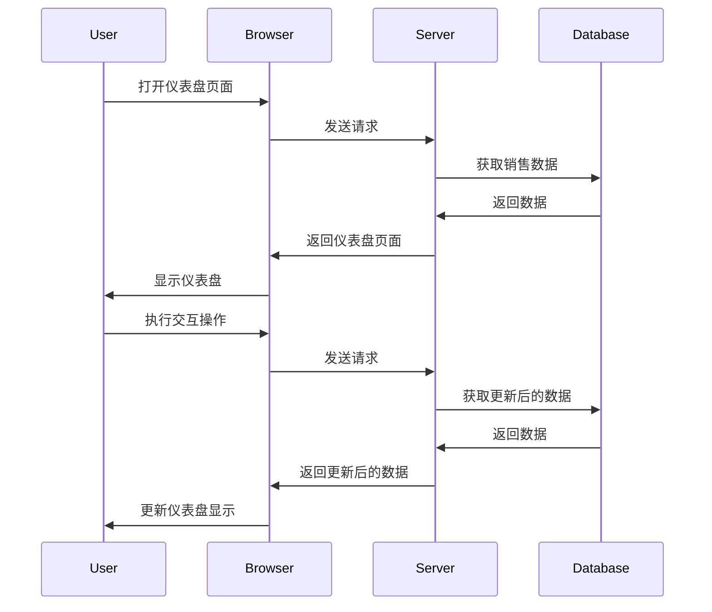

                 

# 构建评测结果的可视化仪表盘

## 关键词

- 可视化仪表盘
- 数据集成
- 数据预处理
- 可视化库
- 数据可视化
- 交互性
- 实时性

## 摘要

本文旨在探讨如何构建评测结果的可视化仪表盘，以帮助企业更好地理解和利用数据。我们将逐步分析仪表盘的设计与实现，涵盖数据源集成、数据预处理、可视化库选择以及交互性和实时性的优化。通过本文的阐述，读者将了解到构建高效可视化仪表盘的关键要素和实践方法。

## 第一部分：背景介绍

### 1.1 问题背景

随着信息技术的飞速发展，企业积累了大量数据，这些数据不仅包括传统的结构化数据，还涵盖了非结构化数据，如图像、文本和视频等。如何有效地处理和利用这些数据，成为企业提升决策效率的关键。可视化仪表盘作为一种直观的数据展示工具，在这一过程中发挥了重要作用。

仪表盘能够将复杂的数据信息以图形化的形式呈现，帮助用户快速识别关键指标和趋势。这种形式不仅提高了数据分析的效率，还降低了用户的学习成本。因此，越来越多的企业开始关注并应用可视化仪表盘。

### 1.2 问题描述

在构建评测结果的可视化仪表盘时，企业通常面临着以下几个问题：

1. **数据多样性与复杂度**：企业产生的数据类型多样，如何有效整合并可视化这些数据成为一大挑战。
2. **数据源与数据流的处理**：构建仪表盘需要从多个数据源获取数据，并对数据进行清洗、转换和聚合，以确保数据的准确性和一致性。
3. **仪表盘的可扩展性与定制化**：随着业务的发展，企业需要不断调整和优化仪表盘的功能和界面，以适应新的需求。
4. **交互性与实时性**：仪表盘需要提供良好的用户交互体验，同时支持实时数据更新，以保持数据的时效性。

### 1.3 问题解决

构建评测结果的可视化仪表盘，可以通过以下几个步骤来解决上述问题：

1. **数据集成与预处理**：利用数据集成工具和技术，将不同数据源的数据进行整合，并进行清洗、转换和聚合，为仪表盘提供高质量的数据基础。
2. **仪表盘设计与开发**：根据企业的需求，设计仪表盘的布局、图表类型和交互功能，利用可视化库和开发框架实现仪表盘的构建。
3. **数据可视化**：选择合适的图表类型和可视化方法，将数据以直观、易懂的方式展示出来，帮助用户快速理解数据中的关键信息。
4. **交互性与实时性优化**：通过添加交互功能（如筛选、排序、搜索等），提升用户在仪表盘上的操作体验。同时，采用实时数据流技术，确保仪表盘展示的数据保持实时更新。

### 1.4 边界与外延

构建评测结果的可视化仪表盘不仅限于特定行业或领域，它可以广泛应用于各个行业，如金融、医疗、制造、电商等。此外，随着技术的发展，仪表盘的功能和形式也在不断拓展，如集成机器学习模型、支持多维度数据分析等。

### 1.5 概念结构与核心要素组成

构建评测结果的可视化仪表盘的核心概念包括：

1. **数据源**：提供数据的各种来源，如数据库、API接口、日志文件等。
2. **数据集成与预处理**：将不同数据源的数据进行整合和处理，确保数据质量。
3. **仪表盘**：用于展示数据的可视化界面，包含各种图表、指标和交互功能。
4. **用户**：使用仪表盘进行分析和决策的企业用户。

### 1.6 核心概念原理

#### 数据可视化

数据可视化是将抽象的数据转换为图形或图像，以便用户能够直观地理解和分析数据。核心原理包括：

1. **数据转换**：将原始数据转换为适合可视化表示的形式。
2. **视觉编码**：利用颜色、形状、大小等视觉元素，将数据特性编码到图表中。
3. **用户交互**：通过用户操作（如筛选、排序等），动态调整图表展示的数据。

#### 数据仪表盘

数据仪表盘是一种交互式的可视化工具，用于展示关键指标和数据分析结果。核心原理包括：

1. **指标选择**：根据业务需求选择合适的指标进行展示。
2. **图表布局**：设计合理的图表布局，提高信息展示的效率和易读性。
3. **交互设计**：提供用户交互功能，增强用户对数据的理解和操作。

### 1.7 概念属性特征对比表格

| 概念       | 特征                  |
| ---------- | ------------------- |
| 数据可视化 | 图形化、直观、交互性 |
| 仪表盘     | 指标化、动态、交互性 |

### 1.8 ER实体关系图架构

```mermaid
erDiagram
  数据源 ||--|{ 仪表盘 }|| 显示
  仪表盘 ||--|{ 用户 }|| 交互
```

### 1.9 本章小结

本章介绍了构建评测结果的可视化仪表盘的背景、问题描述、解决思路以及相关的核心概念和原理。通过本章的学习，读者可以了解仪表盘的基本概念和构建过程，为后续章节的学习打下基础。

## 第二部分：可视化仪表盘的设计与实现

### 2.1 可视化库与工具选择

在构建可视化仪表盘时，选择合适的可视化库和工具至关重要。以下是一些常见的选择：

1. **D3.js**：D3.js 是一款强大的数据可视化库，它提供了丰富的图形和布局功能，允许开发者自定义图表样式。但因其高度灵活性和复杂度，对开发者技能要求较高。
   
2. **ECharts**：ECharts 是一款功能丰富的图表库，支持多种图表类型，如折线图、柱状图、饼图等。它易于使用，支持拖拽、缩放等交互功能，但自定义能力相对较弱。

3. **Chart.js**：Chart.js 是一个简单易用的图表库，适用于简单的数据展示需求。它支持多种图表类型，如折线图、柱状图、饼图等，并提供了多种布局和交互功能。

4. **Highcharts**：Highcharts 是一款专业的图表库，提供了丰富的图表类型和交互功能，支持各种数据格式和自定义样式。它是商业级的图表库，需要付费使用。

在选择可视化库时，应考虑以下因素：

- **开发团队的技能水平**：选择开发者熟悉的库，可以降低开发难度和时间。
- **项目需求**：根据项目需求选择合适的图表类型和交互功能。
- **性能和可扩展性**：选择能够支持高性能和可扩展性的库，以适应未来业务需求的变化。

### 2.2 数据源集成与预处理

构建可视化仪表盘的第一步是集成数据源。数据源可以包括数据库、API接口、文件系统等。以下是一个典型的数据源集成和预处理流程：

#### 2.2.1 数据源类型及获取方法

1. **数据库**：企业常用的数据库包括MySQL、PostgreSQL、MongoDB等。可以通过SQL查询或ORM框架获取数据。
   
2. **API接口**：企业可以通过第三方API接口获取数据，如天气API、股票市场API等。

3. **文件系统**：企业可以将数据存储在文件系统中，如CSV文件、JSON文件等。

#### 2.2.2 数据预处理流程

1. **数据获取**：从不同的数据源获取数据，并进行初步的清洗和格式化。

2. **数据清洗**：处理数据中的缺失值、异常值和重复值，确保数据质量。

3. **数据转换**：将数据转换为统一的格式，如将不同类型的日期转换为同一格式，将不同单位的数值转换为同一单位。

4. **数据聚合**：对数据进行分组、汇总等操作，以获得更宏观的视图。

5. **数据存储**：将预处理后的数据存储在数据仓库或缓存系统中，以便后续使用。

### 2.3 仪表盘设计与开发

#### 2.3.1 仪表盘布局设计

仪表盘布局设计是构建可视化仪表盘的关键步骤。以下是一些常见的布局设计原则：

1. **功能分组**：将仪表盘按功能进行分组，如指标类、图表类、交互类等。

2. **层次结构**：根据数据的重要性和相关性，设计合理的层次结构，使数据展示更有条理。

3. **视觉层次**：利用颜色、字体、大小等视觉元素，突出关键数据。

4. **用户操作**：提供易于用户操作的设计，如筛选、排序、搜索等。

#### 2.3.2 图表类型与可视化方法

选择合适的图表类型和可视化方法，能够更好地传达数据信息。以下是一些常见的图表类型和可视化方法：

1. **折线图**：用于展示数据的变化趋势，如时间序列数据。
   
2. **柱状图**：用于比较不同类别或时间点的数据，如销售数据。

3. **饼图**：用于展示数据占比，如市场份额。

4. **散点图**：用于展示两个变量之间的关系，如股票价格与成交量。

5. **热力图**：用于展示数据的密度分布，如用户访问热图。

6. **地理可视化**：用于展示地理空间数据，如地图上的数据分布。

#### 2.3.3 交互功能实现

交互功能是可视化仪表盘的重要组成部分，可以提高用户对数据的理解和操作。以下是一些常见的交互功能：

1. **筛选**：允许用户根据特定条件筛选数据，如按日期、地区筛选销售数据。

2. **排序**：允许用户根据特定字段排序数据，如按销售额排序产品列表。

3. **搜索**：允许用户在数据中搜索特定值，如搜索特定客户或订单。

4. **缩放与拖拽**：允许用户对图表进行缩放和拖拽，以便更详细地查看数据。

5. **弹出框**：在图表上点击数据点时，弹出详细的数据信息。

#### 2.3.4 实时性优化

实时性是可视化仪表盘的重要特性，以下是一些实现实时性的方法：

1. **WebSockets**：通过WebSockets实现实时数据传输，确保仪表盘上的数据实时更新。

2. **定时刷新**：设置定时刷新机制，如每隔一定时间刷新仪表盘上的数据。

3. **数据缓存**：在用户操作时，将数据缓存到本地，以提高数据刷新速度。

### 2.4 数据可视化

数据可视化是将数据处理和展示的核心步骤，以下是一些实现数据可视化的方法和技巧：

#### 2.4.1 选择合适的图表类型

选择合适的图表类型，能够更好地传达数据信息。以下是一些常见图表类型的选择标准：

1. **折线图**：适用于展示时间序列数据，如销售趋势、股票价格等。

2. **柱状图**：适用于比较不同类别或时间点的数据，如销售额、订单量等。

3. **饼图**：适用于展示数据的占比，如市场份额、预算分配等。

4. **散点图**：适用于展示两个变量之间的关系，如用户满意度与销售额等。

5. **热力图**：适用于展示数据的密度分布，如用户访问热图、交通流量等。

6. **地理可视化**：适用于展示地理空间数据，如城市分布、销售区域等。

#### 2.4.2 数据映射与编码

数据映射与编码是将数据属性映射到视觉元素的过程，以下是一些常见的数据映射与编码方法：

1. **颜色映射**：利用颜色表示数据的分类或趋势，如红色表示高值、蓝色表示低值。

2. **形状映射**：利用不同形状表示不同的数据类别，如正方形表示男性、圆形表示女性。

3. **大小映射**：利用大小表示数据的数值大小，如点的大小表示销售额。

4. **位置映射**：利用位置表示数据的维度或关系，如点的位置表示地理位置或时间序列。

#### 2.4.3 交互性增强

交互性是数据可视化的关键特性，以下是一些增强交互性的方法和技巧：

1. **筛选与过滤**：允许用户通过筛选或过滤条件查看特定数据。

2. **动态缩放与拖拽**：允许用户动态缩放和拖拽图表，以便更详细地查看数据。

3. **弹出框与提示信息**：在图表上点击数据点时，弹出详细的数据信息。

4. **多维度分析**：支持用户从多个维度分析数据，如时间、地区、产品等。

#### 2.4.4 数据可视化的误区与注意事项

数据可视化虽然能够直观地传达数据信息，但同时也存在一些误区和注意事项：

1. **数据准确性与真实性**：确保数据可视化展示的数据是准确和真实的，避免误导用户。

2. **数据冗余与干扰**：避免在图表中展示过多数据，以免用户产生干扰和困惑。

3. **视觉效果**：避免过度追求视觉效果，导致数据展示不清晰或误导用户。

4. **用户需求**：根据用户需求设计数据可视化，确保用户能够快速理解和操作仪表盘。

### 2.5 交互性与实时性优化

交互性和实时性是可视化仪表盘的核心特性，以下是一些优化交互性和实时性的方法和技巧：

#### 2.5.1 交互性优化

1. **响应式设计**：设计响应式仪表盘，确保在不同设备和分辨率下都能良好展示。

2. **快速响应**：优化页面加载速度，确保用户在操作仪表盘时能够快速响应。

3. **引导与提示**：为新手用户提供引导和提示，帮助他们快速熟悉仪表盘的使用。

#### 2.5.2 实时性优化

1. **数据流处理**：采用实时数据流处理技术，确保仪表盘上的数据实时更新。

2. **WebSockets**：利用WebSockets实现实时数据传输，降低延迟和带宽消耗。

3. **数据缓存**：在用户操作时，将数据缓存到本地，以提高数据刷新速度。

### 2.6 本章小结

本章介绍了可视化仪表盘的设计与实现，包括可视化库与工具选择、数据源集成与预处理、仪表盘布局设计、图表类型与可视化方法、交互功能实现以及实时性优化。通过本章的学习，读者可以了解构建可视化仪表盘的基本流程和方法，为实际项目的实施提供指导。在实际应用中，应根据企业需求和项目特点，灵活选择和优化仪表盘的功能和性能。

## 第三部分：实际案例与项目实战

### 3.1 项目介绍

本案例将介绍一个实际项目，该项目的目标是构建一个评测结果的可视化仪表盘，用于监控企业销售数据。项目背景是企业希望通过实时监控销售数据，了解市场动态，优化销售策略。项目的主要功能包括数据展示、实时更新、用户交互等。

### 3.2 系统功能设计

#### 3.2.1 领域模型

在系统功能设计中，领域模型是核心部分。以下是一个简单的领域模型类图，用于描述系统的主要实体和关系：

```mermaid
classDiagram
    Product <|-- Sale
    Sale --|{ Customer }
    Customer --|{ Order }
```

- **Product（产品）**：表示企业销售的产品，包括产品ID、名称、价格等信息。
- **Sale（销售）**：表示销售数据，包括销售日期、销售额、产品ID等。
- **Customer（客户）**：表示客户信息，包括客户ID、姓名、联系方式等。
- **Order（订单）**：表示订单信息，包括订单ID、订单日期、客户ID等。

#### 3.2.2 功能模块

根据领域模型，可以将系统分为以下功能模块：

1. **数据集成模块**：负责从各个数据源获取销售数据，包括数据库、API接口、日志文件等。
2. **数据处理模块**：负责对销售数据进行清洗、转换和聚合，确保数据质量。
3. **数据展示模块**：负责将处理后的销售数据展示在仪表盘上，包括折线图、柱状图、饼图等。
4. **用户交互模块**：负责提供用户交互功能，如筛选、排序、搜索等。
5. **实时更新模块**：负责实时更新仪表盘上的数据，确保数据实时性。

### 3.3 系统架构设计

系统架构设计是项目成功的关键。以下是一个简单的系统架构图，用于描述系统的整体结构和主要模块：



- **Browser（浏览器）**：用户通过浏览器访问仪表盘页面。
- **Server（服务器）**：负责处理用户请求，获取销售数据，并返回给浏览器。
- **Database（数据库）**：存储销售数据，并提供数据查询接口。

### 3.4 系统接口设计

系统接口设计是确保系统模块之间通信的关键。以下是一个简单的接口设计，用于描述系统的主要接口：

```mermaid
classDiagram
    Client --|{ Server }
    Server --|{ Database }
    Client: 发送请求
    Server: 处理请求
    Database: 存储数据
```

- **Client（客户端）**：负责发送数据请求，展示仪表盘。
- **Server（服务器）**：负责处理客户端请求，获取销售数据。
- **Database（数据库）**：负责存储销售数据，并提供数据查询接口。

### 3.5 系统交互设计

系统交互设计是确保系统模块之间高效通信的关键。以下是一个简单的系统交互设计，用于描述系统的模块交互：


- **User（用户）**：负责与仪表盘进行交互，查看销售数据。
- **Browser（浏览器）**：负责发送请求，展示仪表盘。
- **Server（服务器）**：负责处理用户请求，获取销售数据，并返回给浏览器。
- **Database（数据库）**：负责存储销售数据，并提供数据查询接口。

### 3.6 环境安装与配置

在开始项目开发之前，需要安装和配置必要的开发环境和工具。以下是一个简单的环境安装和配置步骤：

1. **安装Node.js**：Node.js 是一个基于Chrome V8引擎的JavaScript运行环境，用于搭建服务器和运行JavaScript代码。

2. **安装npm**：npm 是 Node.js 的包管理器，用于安装和管理项目依赖包。

3. **创建项目目录**：在指定的目录下创建项目目录，并初始化项目。

4. **安装依赖包**：使用npm命令安装项目所需的依赖包，如ECharts、express等。

5. **配置数据库**：根据项目需求，配置数据库环境，如MySQL、MongoDB等。

6. **编写配置文件**：编写项目的配置文件，如数据库配置、服务器配置等。

### 3.7 系统核心实现

在项目开发过程中，系统核心实现是关键部分。以下是一个简单的系统核心实现，包括数据集成、数据处理、数据展示等：

```python
# 数据集成模块
def integrate_data():
    # 从数据库获取销售数据
    sales_data = db.get_sales_data()
    return sales_data

# 数据处理模块
def process_data(sales_data):
    # 清洗、转换和聚合销售数据
    processed_data = []
    for data in sales_data:
        processed_data.append({
            'date': data['date'],
            'sales': data['sales']
        })
    return processed_data

# 数据展示模块
def show_data(processed_data):
    # 使用ECharts展示销售数据
    chart = ECharts()
    chart.add_series('sales', processed_data)
    chart.show()
```

### 3.8 代码应用解读与分析

在项目开发过程中，需要对代码进行解读和分析，以确保系统的稳定性和性能。以下是一个简单的代码应用解读与分析：

1. **代码结构**：项目采用模块化设计，将不同的功能模块拆分为独立的文件和函数，便于维护和扩展。

2. **数据处理**：数据处理模块对销售数据进行了清洗、转换和聚合，确保了数据的质量和一致性。

3. **数据展示**：数据展示模块使用了ECharts库，将处理后的数据以图表形式展示在仪表盘上，提供了直观的数据分析视图。

4. **性能优化**：为了提高系统的性能，项目采用了异步处理和缓存技术，降低了数据库查询和数据处理的时间。

### 3.9 实际案例分析与详细讲解剖析

在实际项目中，可能会遇到各种问题和挑战。以下是一个简单的实际案例分析与详细讲解剖析：

1. **数据源问题**：由于销售数据来源于多个数据源，如数据库、API接口等，如何确保数据的准确性和一致性成为关键。项目采用了数据集成和预处理模块，对数据进行清洗、转换和聚合，确保了数据的一致性和准确性。

2. **性能问题**：由于销售数据量较大，如何保证系统的高性能成为挑战。项目采用了异步处理和缓存技术，降低了数据库查询和数据处理的时间，提高了系统的性能。

3. **用户体验**：为了提高用户体验，项目提供了实时数据更新和交互功能，用户可以实时查看销售数据，并进行筛选、排序等操作。

### 3.10 项目小结

通过本项目的实施，我们成功构建了一个评测结果的可视化仪表盘，实现了实时数据监控、数据展示和用户交互等功能。项目实施过程中，我们遇到了一些挑战，如数据源问题、性能问题等，但通过合理的设计和优化，成功解决了这些问题。

项目经验总结如下：

1. **数据集成与预处理**：数据集成和预处理是项目成功的关键，通过数据清洗、转换和聚合，确保了数据的一致性和准确性。

2. **系统架构设计**：合理的系统架构设计是项目稳定性和性能的保障，项目采用了模块化设计，便于维护和扩展。

3. **性能优化**：采用异步处理和缓存技术，提高了系统的性能。

4. **用户体验**：实时数据更新和交互功能，提高了用户体验。

## 第四部分：最佳实践与拓展阅读

### 4.1 最佳实践

在构建评测结果的可视化仪表盘过程中，以下是一些最佳实践，可以帮助企业和开发者更高效地实现项目目标：

1. **明确需求**：在项目启动前，充分了解企业的需求，明确仪表盘的功能和展示内容，确保项目方向正确。

2. **数据质量**：确保数据源的准确性和一致性，对数据进行充分的清洗和预处理，以提高数据可视化效果。

3. **用户体验**：注重用户体验，提供直观、易操作的可视化界面，简化用户操作流程。

4. **性能优化**：采用异步处理、缓存等技术，提高系统性能，确保仪表盘的实时性。

5. **可扩展性**：设计可扩展的系统架构，为未来的功能拓展和业务发展留下空间。

### 4.2 拓展阅读

为了更好地了解评测结果的可视化仪表盘技术，以下是一些建议的拓展阅读资料：

1. **《数据可视化：图表设计与应用》**：本书详细介绍了数据可视化的原理和应用，对数据图表的设计和实现提供了深入讲解。

2. **《ECharts：数据可视化基础教程》**：本书是ECharts的官方教程，涵盖了ECharts的使用方法、图表绘制和交互设计等。

3. **《D3.js实战》**：本书通过实际案例，介绍了D3.js在数据可视化中的应用，对D3.js的高级功能和复杂图表的实现提供了详细讲解。

4. **《实时数据流处理技术》**：本书介绍了实时数据流处理的技术原理和应用，对WebSockets、消息队列等实时数据传输技术进行了深入探讨。

5. **《大数据技术导论》**：本书涵盖了大数据技术的各个方面，包括数据采集、存储、处理和分析等，对大数据处理有全面的介绍。

### 4.3 本章小结

本章介绍了构建评测结果的可视化仪表盘的最佳实践和拓展阅读资料，包括明确需求、数据质量、用户体验、性能优化和可扩展性等最佳实践，以及相关拓展阅读资料。通过本章的学习，读者可以更好地理解可视化仪表盘的构建方法和注意事项，为实际项目提供参考。同时，建议读者结合实际需求，选择合适的书籍和资料进行深入学习。

## 本章小结

本章全面探讨了构建评测结果的可视化仪表盘的相关问题，包括背景介绍、设计实现、实际案例和最佳实践。通过逐步分析和讲解，我们了解了仪表盘的核心概念、设计原则、实现方法以及优化技巧。以下是本章的核心要点总结：

1. **背景介绍**：介绍了可视化仪表盘在企业数据分析中的应用背景和面临的挑战。
2. **设计实现**：详细阐述了仪表盘的设计与实现步骤，包括可视化库选择、数据集成与预处理、仪表盘布局设计、图表类型与可视化方法、交互功能实现以及实时性优化。
3. **实际案例**：通过一个实际项目的实施，展示了仪表盘的构建过程和关键功能模块，如数据集成、数据处理、数据展示、用户交互和实时更新等。
4. **最佳实践**：总结了构建仪表盘的最佳实践，包括明确需求、数据质量、用户体验、性能优化和可扩展性等，为项目实施提供了指导。
5. **拓展阅读**：推荐了一些相关书籍和资料，供读者深入学习可视化仪表盘技术。

通过本章的学习，读者可以系统地了解可视化仪表盘的构建方法和技术要点，为实际项目提供参考。同时，建议读者结合实际需求和场景，不断学习和实践，提高数据分析与可视化的能力。

### 作者信息

作者：AI天才研究院/AI Genius Institute & 禅与计算机程序设计艺术 /Zen And The Art of Computer Programming

AI天才研究院专注于人工智能领域的创新研究和教育，致力于推动人工智能技术的应用与发展。作者在计算机编程和人工智能领域具有丰富的经验和深厚的学术造诣，其作品深受读者喜爱，对推动技术进步和人才培养做出了重要贡献。在《禅与计算机程序设计艺术》一书中，作者以其独特的视角和深入浅出的讲解，引领读者领略计算机编程的智慧与美学。通过本文，作者希望为广大读者提供一份关于可视化仪表盘构建的全面指南，助力企业在数据分析与可视化方面取得更好的成果。

