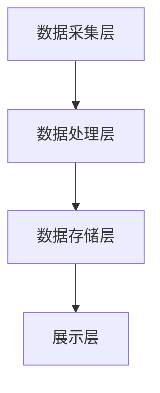
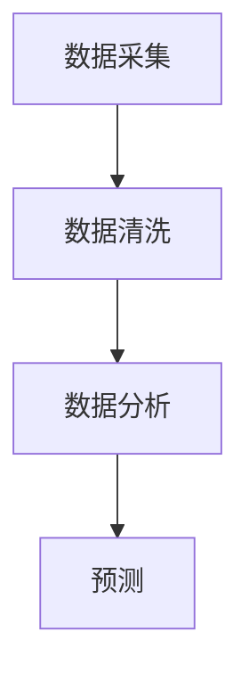

                 

### 《构建评测结果的实时监控系统》

关键词：评测结果、实时监控系统、系统架构、算法原理、实战案例、最佳实践

摘要：本文旨在深入探讨评测结果实时监控系统的构建方法。我们将逐步分析核心概念、系统架构、算法原理，并通过实战案例展示系统的实际应用效果。此外，文章还将提供最佳实践和注意事项，以帮助读者更好地理解和实施实时监控系统。

#### 第1章：引言

在当今快速发展的科技时代，实时监控系统在各个领域发挥着越来越重要的作用。特别是对于评测结果的管理，实时监控系统的重要性愈发凸显。本章节将首先介绍评测结果实时监控系统的背景和必要性，接着明确系统的目标和问题，然后讨论系统的解决方法和边界与外延。

**1.1 问题背景**

随着大数据和人工智能技术的蓬勃发展，评测结果的重要性日益增加。评测结果不仅反映了系统的性能，还直接影响到决策的制定。然而，传统的评测结果处理方式往往存在效率低下、实时性不足等问题。因此，构建一个实时监控系统来管理和分析评测结果成为迫切需求。

**1.2 问题描述**

评测结果实时监控系统的主要目标是快速、准确地收集、处理和分析评测结果，并提供实时监控和报警功能。然而，在实际应用中，系统可能面临以下问题：

1. 数据延迟：评测结果的处理速度较慢，导致实时性不足。
2. 数据错误：评测结果可能出现错误或不一致的情况。
3. 数据泄露：评测结果的安全性得不到保障。
4. 系统稳定性：系统在高并发情况下可能出现崩溃或故障。

**1.3 问题解决**

为了解决上述问题，评测结果实时监控系统需要具备以下几个关键功能：

1. 实时数据采集：确保评测结果的实时性。
2. 数据清洗和校验：过滤错误数据，保证数据的准确性。
3. 数据加密和安全策略：保障评测结果的安全性。
4. 高并发处理能力：确保系统在高并发情况下的稳定性。

**1.4 边界与外延**

评测结果实时监控系统主要应用于需要实时监控和管理的评测场景。这些场景包括但不限于：

1. 软件性能评测：监控软件的运行性能，如响应时间、吞吐量等。
2. 系统稳定性评测：监控系统的稳定性，如崩溃率、故障率等。
3. 安全性评测：监控系统的安全性，如入侵检测、漏洞扫描等。
4. 大数据评测：监控大数据处理的性能和效率。

**1.5 核心概念结构**

评测结果实时监控系统的核心概念包括评测结果、实时监控系统、数据采集、数据清洗、数据加密和安全策略等。这些概念相互关联，构成了系统的整体架构。

#### 第2章：核心概念

本章将详细介绍评测结果、实时监控系统等核心概念，并分析这些概念之间的相互关系。

**2.1 评测结果**

评测结果是指通过对系统或软件进行评测所获得的数据和指标。评测结果可以分为定量和定性两种类型：

1. 定量评测结果：包括性能指标、吞吐量、响应时间等。
2. 定性评测结果：包括用户体验、满意度、可靠性等。

评测结果对于系统的优化和改进具有重要意义。通过分析评测结果，可以识别系统的优势和不足，为后续改进提供依据。

**2.2 实时监控系统**

实时监控系统是一种能够实时监控、处理和分析系统或软件运行状态的系统。实时监控系统能够快速响应用户需求，及时发现问题并进行调整。其主要功能包括：

1. 实时数据采集：从系统或软件中实时获取运行数据。
2. 数据处理和分析：对采集到的数据进行清洗、校验、分析和可视化。
3. 实时报警和通知：在发现问题时及时通知相关人员和系统管理员。

**2.3 概念联系**

评测结果和实时监控系统之间存在紧密的关联。评测结果为实时监控系统提供了数据基础，而实时监控系统则为评测结果的收集、处理和分析提供了技术支持。两者相互促进，共同构建了一个完善的评测结果实时监控系统。

#### 第3章：系统架构设计

本章将详细描述评测结果实时监控系统的架构设计，包括硬件和软件的配置。

**3.1 系统架构概述**

评测结果实时监控系统采用分布式架构，分为数据采集层、数据处理层、数据存储层和展示层。系统架构如图所示：

**3.2 硬件配置**

系统硬件配置包括以下部分：

1. 服务器：用于处理海量数据，提供强大的计算能力。
2. 网络设备：用于实现数据传输和通信。
3. 数据存储设备：用于存储大量的评测数据。

**3.3 软件配置**

系统软件配置包括以下部分：

1. 操作系统：用于管理服务器和设备的运行。
2. 数据库管理系统：用于存储和管理评测数据。
3. 实时数据处理和分析工具：用于对采集到的数据进行处理和分析。
4. 可视化工具：用于展示和处理后的数据。

#### 第4章：算法原理

本章将介绍评测结果实时监控系统中使用的算法原理，包括数学模型和公式。

**4.1 算法概述**

评测结果实时监控系统采用多种算法进行数据处理和分析，主要包括以下几种：

1. 数据清洗算法：用于去除噪声数据和异常值。
2. 数据分析算法：用于计算评测结果的统计指标。
3. 预测算法：用于预测未来的评测结果。

**4.2 数学模型**

以下是一个简单的一元线性回归模型，用于预测评测结果：

$$
y = ax + b
$$

其中，$y$ 表示评测结果，$x$ 表示影响评测结果的因素，$a$ 和 $b$ 分别为回归系数。

**4.3 算法流程图**

**4.4 算法举例**

假设我们要预测一个软件的响应时间，我们可以采用以下步骤：

1. 数据采集：从服务器获取响应时间数据。
2. 数据清洗：去除异常值，如空值、无效值等。
3. 数据分析：计算平均响应时间、最大响应时间等统计指标。
4. 预测：使用一元线性回归模型预测未来响应时间。

#### 第5章：系统实施

本章将讨论评测结果实时监控系统的实施过程，包括环境配置和关键步骤。

**5.1 系统配置**

1. 硬件配置：根据需求选择合适的硬件设备。
2. 软件配置：安装操作系统、数据库管理系统和其他相关软件。

**5.2 实施步骤**

1. 数据采集：配置数据采集器，连接到服务器，采集评测数据。
2. 数据处理：配置数据处理工具，对采集到的数据进行清洗、校验和分析。
3. 数据存储：配置数据库管理系统，存储和处理后的数据。
4. 数据展示：配置可视化工具，展示处理后的数据。

**5.3 注意事项**

1. 确保数据采集的准确性和实时性。
2. 定期备份数据，防止数据丢失。
3. 保障系统的安全性和稳定性。

#### 第6章：实战案例

本章将通过一个实际案例展示评测结果实时监控系统的应用。

**6.1 案例介绍**

我们以一个电商网站为例，介绍评测结果实时监控系统的实际应用。

**6.2 系统功能展示**

1. 实时监控：监控网站的运行状态，如响应时间、负载等。
2. 数据分析：分析用户的访问行为，如访问量、转化率等。
3. 预测：预测未来的用户访问量，为营销策略提供依据。

**6.3 性能分析**

通过实时监控系统，我们可以分析网站的运行性能，如：

1. 响应时间：平均响应时间、最大响应时间等。
2. 负载：并发访问量、服务器负载等。

**6.4 案例解析**

通过分析案例中的评测结果，我们可以发现网站的性能瓶颈，如：

1. 响应时间较长：优化服务器配置，提高系统性能。
2. 并发访问量过高：增加服务器节点，提高并发处理能力。

#### 第7章：最佳实践

本章将总结实践经验，提供最佳实践和注意事项。

**7.1 经验总结**

1. 确保数据采集的准确性和实时性。
2. 定期备份数据，防止数据丢失。
3. 优化系统性能，提高实时性。
4. 加强系统的安全性和稳定性。

**7.2 注意事项**

1. 避免数据延迟，确保实时性。
2. 加强数据清洗和校验，保证数据准确性。
3. 定期维护和升级系统，提高系统性能。
4. 防范数据泄露和安全攻击。

**7.3 拓展阅读**

1. 《实时数据采集与处理技术》
2. 《大数据分析与挖掘技术》
3. 《网络安全与防护技术》

#### 第8章：总结与展望

本章将回顾全书的主要内容，并展望评测结果实时监控系统的未来发展方向。

**8.1 总结**

本书详细介绍了评测结果实时监控系统的构建方法，包括核心概念、系统架构、算法原理、系统实施和实战案例等。通过实际案例，展示了系统的实际应用效果和性能分析。

**8.2 展望**

随着大数据和人工智能技术的不断发展，评测结果实时监控系统将在各个领域得到更广泛的应用。未来，我们将继续优化系统性能，提高实时性和准确性，为用户提供更优质的服务。同时，我们也期待与行业专家和研究人员一起，共同推动评测结果实时监控系统的发展。

