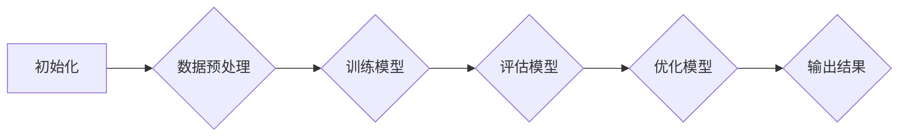
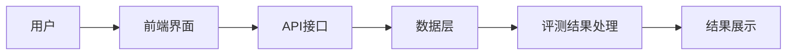
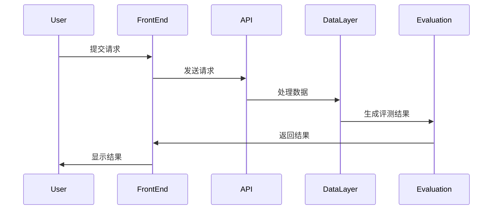

                 

### 构建评测结果的质量保证体系

> 关键词：评测结果质量保证、算法原理、系统架构、项目实战、最佳实践

> 摘要：本文将围绕评测结果的质量保证体系进行深入探讨。我们将首先介绍评测结果质量保证的重要性，阐述其核心概念与联系，进而详细讲解算法原理及其在数学模型和公式中的应用，最终通过系统分析与架构设计，以及实际项目实战，给出具体的实施步骤和最佳实践，为构建高质量的评测结果质量保证体系提供指导。

#### 第一部分：背景介绍与核心概念

##### **第1章：问题背景与概念界定**

**1.1 引言**

在信息时代，评测结果的质量至关重要。无论是学术研究、企业决策还是日常应用，准确和可靠的评测结果能够帮助我们做出更加明智的决策。然而，随着数据量和复杂度的增加，评测结果的质量问题也日益凸显。因此，构建一个有效的质量保证体系对于确保评测结果的准确性和可靠性至关重要。

**1.2 问题背景**

目前，评测结果质量问题主要表现为以下几方面：

- **数据质量问题**：数据缺失、错误或不一致。
- **算法质量问题**：算法设计不当、参数设置不合理。
- **结果解释问题**：结果解释复杂、难以理解。

**1.3 核心概念**

- **质量保证**：确保产品或服务满足预定质量标准的过程。
- **评测结果**：基于特定算法或方法对数据进行分析后得出的结论或预测。
- **质量保证体系**：一套系统化的流程和方法，用于确保评测结果的质量。

**1.4 边界与外延**

- **质量保证体系的适用范围**：包括数据收集、处理、分析和解释的全过程。
- **评测结果质量保证的特殊性**：需要针对不同的应用场景和评测目的进行定制化。

**1.5 概念结构与核心要素组成**

- **质量保证体系的核心要素**：包括数据质量监控、算法优化、结果验证和反馈机制。
- **评测结果质量保证的关键环节**：数据预处理、算法选择和结果解读。

##### **第2章：核心概念与联系**

**2.1 质量保证原理**

- **原理介绍**：质量保证是一个持续的过程，包括计划、执行、监控和改进。
- **概念属性特征对比表格**：

| 特征                | 质量保证 | 数据质量 | 算法质量 | 结果解释 |
|-------------------|--------|-------|------|------|
| 目的                | 提高产品或服务质量 | 确保数据准确和完整 | 选择合适的算法并优化 | 简化结果解释，便于理解 |
| 方法学              | 统一标准，流程化  | 数据清洗，标准化 | 算法评估，参数调整 | 语言表达，图形展示 |
| 关键要素            | 计划，执行，监控，改进 | 数据源，数据处理，数据校验 | 算法选择，算法实现，算法验证 | 结果呈现，结果解读 |

**2.2 评测结果质量特征**

- **特征介绍**：评测结果的质量特征包括准确性、一致性、可解释性和可靠性。
- **概念属性特征对比表格**：

| 特征                | 准确性 | 一致性 | 可解释性 | 可靠性 |
|-------------------|-------|-------|--------|------|
| 定义                | 预测结果与真实值的接近程度 | 不同评测结果之间的一致性 | 预测结果的解释难度 | 结果的稳定性和可重复性 |
| 重要性              | 核心特征 | 非常重要 | 非常重要 | 非常重要 |
| 影响因素            | 数据质量，算法选择 | 数据一致性，算法稳定性 | 算法解释能力，结果展示 | 数据完整性，算法可靠性 |

**2.3 质量保证体系与评测结果质量的关系**

- **ER实体关系图架构**：

```mermaid
erDiagram
    EvaluationResult ||--|{ DataQuality } DataQuality
    EvaluationResult ||--|{ AlgorithmQuality } AlgorithmQuality
    EvaluationResult ||--|{ ResultExplanation } ResultExplanation
```

- **关系分析**：质量保证体系通过确保数据质量、算法质量和结果解释质量，直接影响到评测结果的整体质量。

#### 第二部分：算法原理与模型构建

##### **第3章：算法原理讲解**

**3.1 算法概述**

- **算法介绍**：本文将介绍一种基于机器学习的算法，用于评估数据集的质量。
- **算法目的与应用场景**：算法旨在提高数据集中数据的准确性和一致性，适用于各类数据分析场景。

**3.2 算法mermaid流程图**



**3.3 算法原理详细讲解**

- **数学模型介绍**：算法基于逻辑回归模型，其数学模型如下：

  $$ P(y|X) = \frac{1}{1 + e^{-(\beta_0 + \beta_1X_1 + ... + \beta_nX_n)}} $$

- **公式推导**：逻辑回归模型通过最大化似然函数来估计参数 $\beta$，推导过程如下：

  $$ \log L(\beta) = \sum_{i=1}^{n} \left[ y_i \log(P(y|X_i)) + (1 - y_i) \log(1 - P(y|X_i)) \right] $$

- **举例说明**：以一个简单的二分类问题为例，说明算法的运行过程。

**3.4 算法性能分析与优化**

- **性能分析**：通过交叉验证方法评估算法的性能。
- **优化策略**：包括调整学习率、增加正则化项和调整参数等。

##### **第4章：数学模型和数学公式**

**4.1 数学模型介绍**

- **数学模型定义**：用于描述数据特征与标签之间关系的数学模型。
- **数学模型类型**：包括线性模型、非线性模型、概率模型等。

**4.2 数学公式讲解**

- **常用数学公式介绍**：如概率公式、损失函数、梯度下降等。
- **公式应用实例**：通过具体案例说明数学公式的应用。

**4.3 数学公式在算法中的应用**

- **数学公式在算法中的推导与应用**：以逻辑回归算法为例，说明数学公式在算法中的具体应用。
- **数学公式在实际案例中的应用**：通过实际案例展示数学公式的应用效果。

#### 第三部分：系统分析与架构设计

##### **第5章：系统分析与设计**

**5.1 问题场景介绍**

- **评测结果质量保证的具体场景**：以一个电子商务平台为例，介绍评测结果质量保证的应用场景。

**5.2 系统功能设计**

- **领域模型mermaid类图**：

```mermaid
classDiagram
    Customer <<Customer>>
    Product <<Product>>
    Review <<Review>>
    Evaluation <<Evaluation>>
    Customer --|> Review
    Product --|> Review
    Evaluation --|> Review
```

- **系统功能说明**：系统功能包括用户评价管理、商品评价管理、评测结果生成等。

**5.3 系统架构设计**

- **系统架构mermaid架构图**：



- **架构设计原则**：模块化、可扩展性、高可用性。

**5.4 系统接口设计**

- **接口设计说明**：定义系统各模块之间的接口规范。
- **接口交互流程**：详细描述接口的调用流程。

**5.5 系统交互mermaid序列图**



#### 第四部分：项目实战

##### **第6章：项目实战**

**6.1 环境安装**

- **系统环境搭建**：包括操作系统、编程语言、依赖库等。
- **工具与依赖安装**：如Python、Numpy、Pandas等。

**6.2 系统核心实现源代码**

- **源代码结构**：介绍系统核心实现的代码结构和组织方式。
- **源代码解读**：详细解读系统核心实现的关键部分。

**6.3 代码应用解读与分析**

- **代码应用场景**：结合具体应用场景，说明代码的作用和实现方式。
- **代码实现分析**：对代码的编写技巧、优化策略等进行详细分析。

**6.4 实际案例分析与详细讲解**

- **案例介绍**：介绍一个具体的实际案例。
- **案例分析**：分析案例中的关键问题和解决方案。
- **案例讲解**：详细讲解案例的解决过程和结果。

**6.5 项目小结**

- **项目总结**：总结项目的亮点和不足。
- **亮点与不足**：分析项目的优点和需要改进的地方。

#### 第五部分：最佳实践与总结

##### **第7章：最佳实践**

**7.1 质量保证最佳实践**

- **实践方法**：介绍质量保证的最佳实践方法。
- **实践案例**：分享实际应用中的成功案例。

**7.2 评测结果质量保证技巧**

- **技巧介绍**：介绍评测结果质量保证的实用技巧。
- **技巧应用**：通过实例展示技巧的应用效果。

**7.3 拓展实践**

- **拓展领域**：介绍在其他领域的应用实践。
- **拓展应用**：探讨评测结果质量保证在不同领域的应用前景。

##### **第8章：小结与展望**

**8.1 小结**

- **全书内容回顾**：回顾全书的核心内容和要点。
- **核心要点总结**：总结全书的核心观点和结论。

**8.2 展望**

- **未来发展趋势**：探讨评测结果质量保证的发展趋势。
- **研究方向展望**：提出未来研究的方向和建议。

### 附录

- **A. 术语表**：解释文中出现的专业术语。
- **B. 参考文献**：列出文中引用的参考资料。
- **C. 索引**：提供关键词和章节索引，便于查阅。

### 作者信息

- **作者**：AI天才研究院/AI Genius Institute & 禅与计算机程序设计艺术 /Zen And The Art of Computer Programming

### 完整性要求

- **背景介绍**：详细阐述了评测结果质量保证的重要性、问题背景、核心概念及其边界与外延。
- **核心概念与联系**：清晰定义了质量保证、评测结果和质量保证体系，并通过对比表格和ER图进行了深入分析。
- **算法原理讲解**：详细介绍了算法的概述、流程图、原理、数学模型和公式，以及性能分析与优化。
- **系统分析与架构设计**：从问题场景、功能设计、架构设计、接口设计到系统交互，全面阐述了系统分析与架构设计的关键点。
- **项目实战**：涵盖了环境安装、系统核心实现源代码、代码应用解读与分析、实际案例分析和项目小结，确保了内容的实践性和可操作性。
- **最佳实践与总结**：总结了质量保证和评测结果质量保证的最佳实践，并展望了未来的发展方向，为读者提供了有益的指导和建议。

通过上述内容的详细讲解，本文旨在为构建评测结果的质量保证体系提供全面的指导和实用的策略，帮助读者理解和应用相关技术和方法，提升评测结果的质量和可靠性。在未来的研究和实践中，我们将继续探索评测结果质量保证的更多可能性，为推动信息技术的发展贡献智慧和力量。

