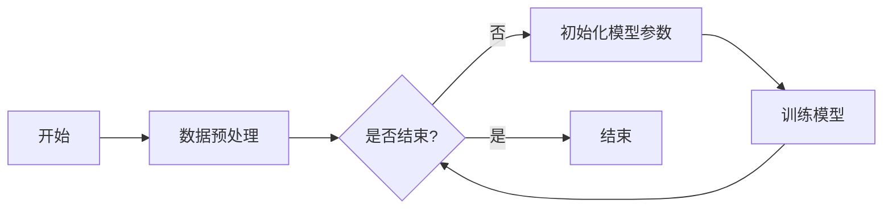
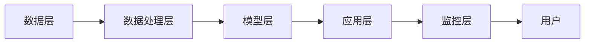
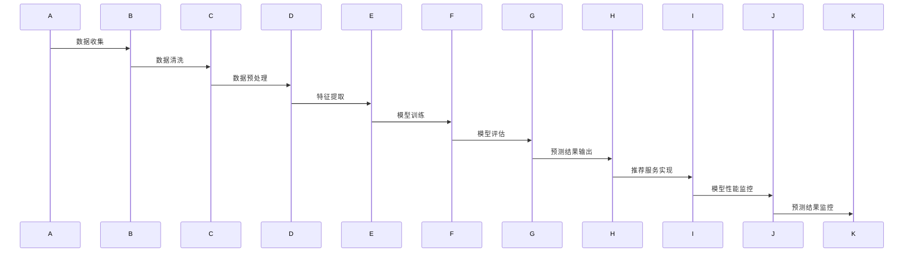

                 

### 第一部分：背景介绍与核心概念

#### 1.1.1 问题背景

数据评估在众多领域扮演着至关重要的角色，从科研数据分析到商业决策，从医疗诊断到人工智能模型的性能评估，无不依赖于准确、可靠的数据评估。然而，传统的数据评估方法往往存在一定的局限性，无法完全满足快速、高效、准确的需求。特别是当评估结果需要在短时间内预测时，传统方法显得力不从心。因此，构建一个能够预测评测结果的模型成为了一个迫切需要解决的问题。

在人工智能领域，预测模型的研究和应用越来越广泛。这些模型能够在大量数据的基础上，通过学习和分析，预测出未知数据的特征和趋势。而评测结果的预测模型正是这一理念的应用之一。其核心在于，通过建立数学模型和算法，将历史评测数据转化为预测模型，从而对未来评测结果进行预测。

#### 1.1.2 问题描述

**如何构建预测模型？**

构建预测模型的关键在于选择合适的算法和策略。常见的算法包括回归分析、决策树、支持向量机、神经网络等。每种算法都有其独特的原理和应用场景。例如，回归分析适合处理线性关系较强的数据，而神经网络则擅长处理非线性关系复杂的数据。

**预测模型的性能评估标准**

一个优秀的预测模型需要具备以下几个性能评估标准：

- **准确性（Accuracy）**：预测结果与实际结果的一致性程度。
- **召回率（Recall）**：在所有正例中，模型能够正确识别的比例。
- **精确率（Precision）**：在预测结果中，实际为正例的比例。
- **F1 分数（F1 Score）**：准确率和召回率的调和平均，综合考虑了准确率和召回率。
- **ROC 曲线和 AUC 值**：ROC 曲线和 AUC 值用于评估分类模型的性能，其中 AUC 值越高，模型性能越好。

**预测模型的实际应用场景**

评测结果的预测模型在实际应用中具有广泛的应用场景：

- **商业领域**：例如，电商平台的商品评价预测，通过预测用户对商品的评分，可以帮助平台进行商品推荐，提高用户体验和销售额。
- **医疗领域**：例如，通过预测患者的诊断结果，辅助医生进行疾病诊断和治疗决策。
- **科研领域**：例如，通过预测科研实验的结果，提高科研效率，减少实验失败的风险。

#### 1.1.3 问题解决

**采用何种算法？**

选择算法时，需要综合考虑数据特征、模型复杂度、计算资源等因素。例如，对于线性关系较强的数据，可以采用线性回归模型；对于非线性关系复杂的数据，可以采用神经网络模型。此外，还可以结合多种算法，通过模型融合（Model Ensembling）来提高预测性能。

**如何收集和预处理数据？**

数据的收集和预处理是构建预测模型的基础。收集数据时，需要确保数据的质量和完整性，避免数据缺失、错误等问题。预处理数据时，可以采用数据清洗、数据标准化、数据归一化等方法，以提高数据的质量和一致性。

**预测模型的训练与评估流程**

预测模型的构建过程可以分为以下几个步骤：

1. **数据收集与预处理**：收集相关的历史评测数据，并对数据进行清洗、标准化等预处理操作。
2. **数据划分**：将数据集划分为训练集、验证集和测试集，用于模型的训练、验证和评估。
3. **模型选择**：根据数据特征和算法特性，选择合适的模型。
4. **模型训练**：使用训练集数据训练模型，调整模型参数。
5. **模型验证**：使用验证集数据对模型进行验证，调整模型参数，优化模型性能。
6. **模型评估**：使用测试集数据对模型进行评估，计算预测性能指标。

#### 1.1.4 边界与外延

**评测结果的预测范围**

评测结果的预测范围取决于数据的多样性和模型的泛化能力。一般来说，模型能够预测出大致的趋势和结果，但无法做到完全精确。特别是在面对全新的数据时，模型的预测能力可能会受到一定的限制。

**预测模型适用性**

预测模型在不同的应用场景中具有不同的适用性。例如，在商业领域，预测模型可以用于用户行为预测、市场趋势预测等；在医疗领域，预测模型可以用于疾病诊断预测、治疗效果预测等。

**边界条件分析**

在构建预测模型时，需要考虑边界条件，如数据的质量、模型的复杂度、计算资源的限制等。只有充分考虑边界条件，才能构建出高效、可靠的预测模型。

#### 1.1.5 概念结构与核心要素组成

**预测模型组成要素**

预测模型由以下几个核心要素组成：

- **数据集**：包括训练集、验证集和测试集，用于模型的训练、验证和评估。
- **模型算法**：用于数据处理和预测的核心算法，如线性回归、神经网络等。
- **模型参数**：用于调整模型性能的关键参数，如学习率、正则化参数等。
- **性能指标**：用于评估模型性能的关键指标，如准确性、召回率等。

**数据预处理方法**

数据预处理方法包括以下几种：

- **数据清洗**：去除数据中的噪声和异常值，确保数据的质量。
- **数据标准化**：将不同特征的数据进行归一化或标准化，消除特征间的量纲影响。
- **数据归一化**：将数据转换为统一的范围，如[0, 1]或[-1, 1]。
- **特征工程**：选择和构建有用的特征，提高模型性能。

**评估指标体系**

评估指标体系包括以下几种：

- **准确性**：预测结果与实际结果的匹配程度。
- **召回率**：预测结果中实际为正例的比例。
- **精确率**：预测结果中实际为正例的比例。
- **F1 分数**：准确率和召回率的调和平均。
- **ROC 曲线和 AUC 值**：评估分类模型的性能。

### 第二部分：核心概念与联系

#### 2.1.1 预测模型原理

**常见预测模型介绍**

预测模型分为监督学习模型和无监督学习模型。监督学习模型包括线性回归、决策树、支持向量机、神经网络等；无监督学习模型包括聚类、降维、关联规则等。

**预测模型工作流程**

预测模型的工作流程主要包括以下步骤：

1. **数据收集与预处理**：收集数据并对其进行清洗、标准化等预处理操作。
2. **模型选择**：根据数据特征和需求选择合适的模型。
3. **模型训练**：使用训练数据训练模型，调整模型参数。
4. **模型验证**：使用验证数据对模型进行验证，调整模型参数。
5. **模型评估**：使用测试数据对模型进行评估，计算性能指标。

**预测模型优缺点对比**

不同类型的预测模型具有不同的优缺点。例如，线性回归模型简单易用，但在处理非线性关系复杂的数据时表现不佳；神经网络模型具有强大的非线性处理能力，但训练过程复杂，计算资源需求高。

#### 2.1.2 数据预处理方法

**数据收集**

数据收集是构建预测模型的基础。数据收集的来源包括数据库、网络爬虫、传感器等。在收集数据时，需要确保数据的质量和完整性。

**数据清洗**

数据清洗是去除数据中的噪声和异常值的过程。常见的数据清洗方法包括缺失值处理、异常值处理、重复数据删除等。

**数据标准化与归一化**

数据标准化与归一化是将数据转换为统一范围的过程。标准化是将数据转换为均值为0、标准差为1的分布；归一化是将数据转换为[0, 1]或[-1, 1]的范围。

#### 2.1.3 评估指标体系

**评估指标类型**

评估指标体系包括准确性、召回率、精确率、F1 分数、ROC 曲线和 AUC 值等指标。

**评估指标计算方法**

不同评估指标的计算方法如下：

- **准确性**：\( \frac{TP + TN}{TP + TN + FP + FN} \)
- **召回率**：\( \frac{TP}{TP + FN} \)
- **精确率**：\( \frac{TP}{TP + FP} \)
- **F1 分数**：\( 2 \times \frac{精确率 \times 召回率}{精确率 + 召回率} \)
- **ROC 曲线和 AUC 值**：ROC 曲线是真正率（True Positive Rate，TPR）与假正率（False Positive Rate，FPR）的曲线；AUC 值是ROC 曲线下面的面积。

**评估指标应用场景**

不同评估指标适用于不同的应用场景。例如，准确性适用于二分类任务；F1 分数适用于多分类任务；ROC 曲线和 AUC 值适用于评估分类模型的性能。

## 第二部分：核心概念与联系

### 第2章：核心概念与联系

在构建评测结果的预测模型过程中，理解核心概念和它们之间的联系是至关重要的。这一章将详细探讨预测模型的基本原理、数据预处理方法以及评估指标体系，并通过对比不同概念的属性特征，来加深对预测模型构建过程的理解。

#### 2.1.1 预测模型原理

**预测模型基本原理**

预测模型的核心在于利用历史数据来预测未来结果。这一过程通常涉及以下几个关键步骤：

1. **特征提取**：从原始数据中提取出有用的特征，这些特征将用于训练模型。
2. **模型训练**：使用训练数据集来训练模型，模型会自动学习如何从特征中提取预测信息。
3. **模型验证**：通过验证数据集来评估模型的效果，并根据评估结果调整模型参数。
4. **模型评估**：使用测试数据集来评估模型的最终性能，确保模型在未知数据上的表现良好。

**常见预测模型介绍**

在人工智能领域，常见的预测模型包括线性回归、逻辑回归、决策树、随机森林、支持向量机（SVM）和神经网络等。每种模型都有其独特的应用场景和优缺点。

- **线性回归**：适用于线性关系较强的数据，简单易用，但在处理非线性关系时效果不佳。
- **逻辑回归**：常用于分类问题，通过概率估计进行分类。
- **决策树**：易于理解和解释，但在处理大数据时可能过拟合。
- **随机森林**：通过构建多个决策树并进行投票来减少过拟合，提高预测准确性。
- **支持向量机**：擅长处理高维数据，但训练过程复杂。
- **神经网络**：适用于处理复杂非线性关系，但在大数据训练时计算资源需求高。

**预测模型工作流程**

预测模型的工作流程可以概括为以下几个步骤：

1. **数据预处理**：包括数据清洗、缺失值处理、数据标准化等。
2. **特征工程**：选择和构建有用的特征，以提高模型的预测能力。
3. **模型选择**：根据数据特性和需求选择合适的模型。
4. **模型训练**：使用训练数据集训练模型。
5. **模型验证**：使用验证数据集对模型进行验证，调整参数。
6. **模型评估**：使用测试数据集评估模型性能。

**预测模型优缺点对比**

不同预测模型的优缺点如下：

| 模型名称 | 优点 | 缺点 |
| --- | --- | --- |
| 线性回归 | 简单、易解释、计算效率高 | 无法处理非线性关系 |
| 逻辑回归 | 适合二分类问题、概率解释直观 | 容易欠拟合或过拟合 |
| 决策树 | 易于理解、解释性高、简单 | 容易过拟合、可能产生树结构不平衡 |
| 随机森林 | 防止过拟合、预测准确率高 | 计算成本较高、树结构复杂 |
| 支持向量机 | 在高维空间中表现良好、解释性高 | 训练成本高、参数选择复杂 |
| 神经网络 | 非线性建模能力强、泛化能力好 | 计算资源需求大、过拟合风险高 |

#### 2.1.2 数据预处理方法

**数据收集**

数据收集是预测模型构建的基础。收集的数据应尽可能全面、准确，并且具有代表性。数据源可以包括公开数据集、企业内部数据库、网络爬虫等。在数据收集过程中，需要考虑数据的质量和完整性。

**数据清洗**

数据清洗是处理数据中的噪声、错误和异常值的过程。常见的数据清洗方法包括：

- **缺失值处理**：缺失值可以通过插值、平均值填充、中值填充等方法处理。
- **异常值处理**：异常值可以通过箱线图、Z-分数等方法检测，并采用截断、替换或删除等方法处理。
- **重复数据删除**：删除重复的数据条目，确保数据集的唯一性。

**数据标准化与归一化**

数据标准化与归一化是将数据转换为统一范围的过程。数据标准化将数据转换为均值为0、标准差为1的分布，而数据归一化则是将数据转换为[0, 1]或[-1, 1]的范围。这两种方法可以消除不同特征之间的量纲差异，使得模型对各个特征进行训练时能够更加公平。

- **标准化**：\( X_{\text{标准化}} = \frac{X - \mu}{\sigma} \)
- **归一化**：\( X_{\text{归一化}} = \frac{X - X_{\text{最小值}}}{X_{\text{最大值}} - X_{\text{最小值}}} \)

#### 2.1.3 评估指标体系

**评估指标类型**

评估指标体系是衡量预测模型性能的关键。常见的评估指标包括：

- **准确性（Accuracy）**：预测结果与实际结果的一致性程度。
- **召回率（Recall）**：在所有正例中，模型能够正确识别的比例。
- **精确率（Precision）**：在预测结果中，实际为正例的比例。
- **F1 分数（F1 Score）**：准确率和召回率的调和平均。
- **ROC 曲线和 AUC 值（Receiver Operating Characteristic and Area Under Curve）**：用于评估分类模型的性能。

**评估指标计算方法**

不同评估指标的计算方法如下：

- **准确性**：\( \frac{TP + TN}{TP + TN + FP + FN} \)
- **召回率**：\( \frac{TP}{TP + FN} \)
- **精确率**：\( \frac{TP}{TP + FP} \)
- **F1 分数**：\( 2 \times \frac{精确率 \times 召回率}{精确率 + 召回率} \)
- **ROC 曲线和 AUC 值**：ROC 曲线是真正率（True Positive Rate，TPR）与假正率（False Positive Rate，FPR）的曲线；AUC 值是ROC 曲线下面的面积。

**评估指标应用场景**

不同评估指标适用于不同的应用场景：

- **准确性**：适用于二分类任务，简单直观，但在不平衡数据集上可能不够准确。
- **F1 分数**：适用于多分类任务，综合了准确率和召回率，更适合评估不平衡数据集。
- **ROC 曲线和 AUC 值**：适用于评估分类模型的性能，特别是当类别不平衡时。

#### 2.1.4 核心概念属性特征对比

为了更好地理解预测模型构建过程中的核心概念，我们可以通过以下表格对比不同概念之间的属性特征：

| 概念名称 | 属性特征 | 应用场景 |
| --- | --- | --- |
| 预测模型 | 用于预测未来结果的数学模型 | 电商用户行为预测、医疗诊断预测 |
| 数据预处理 | 数据清洗、标准化和归一化 | 提高模型性能、消除特征差异 |
| 评估指标 | 准确性、召回率、精确率等 | 评估模型性能、选择最佳模型 |
| 算法 | 线性回归、神经网络等 | 根据数据特性选择合适的算法 |

#### 2.1.5 ER实体关系图架构

为了更好地理解预测模型中的实体和它们之间的关系，我们可以通过ER（Entity-Relationship）实体关系图来展示。ER图可以帮助我们直观地理解数据集、特征、模型和评估指标之间的关联。

下面是一个简单的ER实体关系图：

```mermaid
erDiagram
  数据集 ||--|{ 特征 }|
  特征 ||--|{ 预测模型 }|
  预测模型 ||--|{ 评估指标 }|
```

在这个ER图中，数据集包含多个特征，每个特征对应一个预测模型，而预测模型又通过评估指标来衡量其性能。

通过上述章节的讨论，我们可以清楚地看到预测模型构建过程中的核心概念、联系以及评估指标体系的重要性。在接下来的章节中，我们将进一步探讨预测模型的算法原理、系统分析与架构设计、项目实战等内容，帮助读者深入理解并应用预测模型。

## 第三部分：算法原理讲解

### 第3章：算法原理讲解

在构建评测结果的预测模型中，选择合适的算法是至关重要的。这一章节将深入探讨预测模型中的核心算法原理，包括算法的基本原理、工作流程、适用场景，并通过具体的数学模型和公式来解释这些算法，并使用Mermaid流程图进行直观展示。

#### 3.1.1 算法原理

**算法基本原理**

预测模型的核心在于从历史数据中学习规律，并利用这些规律来预测未来的结果。常见的预测算法包括线性回归、决策树、支持向量机和神经网络等。

- **线性回归**：线性回归是一种用于预测连续值的监督学习算法。其基本原理是通过拟合一条直线，将输入特征映射到输出目标值。线性回归的数学模型如下：

  $$ y = w_0 + w_1 \cdot x_1 + w_2 \cdot x_2 + ... + w_n \cdot x_n $$

  其中，\( y \) 是输出目标值，\( x_1, x_2, ..., x_n \) 是输入特征，\( w_0, w_1, w_2, ..., w_n \) 是模型的权重参数。

- **决策树**：决策树通过一系列的判定规则，将数据集划分为不同的区域，每个区域对应一个预测结果。决策树的基本原理是利用信息增益或基尼系数来选择最优的分割特征。决策树的数学模型可以表示为：

  $$ \text{Decision Tree}(x) = \sum_{i=1}^{n} r_i \cdot f_i(x) $$

  其中，\( r_i \) 是区域，\( f_i(x) \) 是特征函数。

- **支持向量机**：支持向量机（SVM）是一种用于分类和回归的算法。其基本原理是通过找到一个最优的超平面，将数据划分为不同的类别。SVM的数学模型可以表示为：

  $$ \max_{w, b} \frac{1}{2} ||w||^2 \quad \text{subject to} \quad y_i (w \cdot x_i + b) \geq 1 $$

  其中，\( w \) 是权重向量，\( b \) 是偏置项，\( x_i \) 是输入特征，\( y_i \) 是输出标签。

- **神经网络**：神经网络是一种模拟人脑神经元连接方式的算法。其基本原理是通过多层神经网络，对输入特征进行变换和组合，最终得到输出结果。神经网络的数学模型可以表示为：

  $$ a_{\text{输出}} = \sigma(\sum_{i=1}^{n} w_i \cdot a_i) + b $$

  其中，\( a_i \) 是第 \( i \) 层的输入值，\( w_i \) 是第 \( i \) 层的权重，\( \sigma \) 是激活函数，\( b \) 是偏置项。

**算法流程**

不同算法的具体流程有所不同，但通常包括以下几个步骤：

1. **数据预处理**：包括数据清洗、缺失值处理、数据标准化等。
2. **模型初始化**：初始化模型的权重参数和偏置项。
3. **训练**：使用训练数据集对模型进行训练，通过迭代调整模型参数，使其性能得到优化。
4. **验证**：使用验证数据集对模型进行验证，调整模型参数，优化模型性能。
5. **评估**：使用测试数据集对模型进行评估，计算性能指标，如准确性、召回率、精确率等。

**算法适用场景**

不同算法适用于不同的应用场景，以下是一些常见算法的适用场景：

- **线性回归**：适用于线性关系较强的数据，如房价预测、股票价格预测等。
- **决策树**：适用于分类和回归问题，如信用卡欺诈检测、客户流失预测等。
- **支持向量机**：适用于高维空间的数据，如文本分类、图像识别等。
- **神经网络**：适用于处理复杂非线性关系的数据，如语音识别、图像识别等。

#### 3.1.2 数学模型与公式

为了更深入地理解预测模型，我们需要掌握相关的数学模型和公式。以下是几种常见预测算法的数学模型和关键公式：

**线性回归**

$$ y = w_0 + w_1 \cdot x_1 + w_2 \cdot x_2 + ... + w_n \cdot x_n $$

$$ w = (X^T X)^{-1} X^T y $$

其中，\( X \) 是输入特征矩阵，\( y \) 是输出目标值向量，\( w \) 是权重参数向量。

**决策树**

$$ g(x) = \sum_{i=1}^{n} r_i \cdot f_i(x) $$

$$ f(x) = \prod_{j=1}^{m} \frac{p_j^+ - p_j^-}{p_j^+ + p_j^-} \cdot x_j $$

其中，\( r_i \) 是区域，\( f_i(x) \) 是特征函数，\( p_j^+ \) 和 \( p_j^- \) 是正负样本的概率。

**支持向量机**

$$ \max_{w, b} \frac{1}{2} ||w||^2 \quad \text{subject to} \quad y_i (w \cdot x_i + b) \geq 1 $$

$$ w^* = \frac{1}{\sum_{i=1}^{n} y_i \cdot \alpha_i \cdot K(x_i, x_j)} $$

其中，\( K(x_i, x_j) \) 是核函数，\( \alpha_i \) 是拉格朗日乘子。

**神经网络**

$$ a_{\text{输出}} = \sigma(\sum_{i=1}^{n} w_i \cdot a_i) + b $$

$$ \frac{\partial L}{\partial w_i} = a_{\text{隐藏层}} \cdot (1 - a_{\text{隐藏层}}) \cdot (y - a_{\text{输出}}) $$

其中，\( \sigma \) 是激活函数，\( L \) 是损失函数。

#### 3.1.3 Mermaid流程图

为了更直观地展示算法流程，我们可以使用Mermaid流程图来绘制。以下是一个简单的线性回归算法的Mermaid流程图：



在这个流程图中，我们从数据预处理开始，初始化模型参数，然后通过迭代训练模型，直到满足结束条件。

通过上述对算法原理、数学模型和Mermaid流程图的讲解，我们可以更好地理解预测模型的构建过程。在接下来的章节中，我们将进一步探讨系统分析与架构设计、项目实战等内容，帮助读者深入应用预测模型。

### 第三部分：系统分析与架构设计方案

#### 第4章：系统分析与架构设计方案

在构建评测结果的预测模型时，系统分析与架构设计是确保模型高效、稳定运行的关键环节。本章将详细介绍系统分析与架构设计的过程，包括问题场景介绍、系统功能设计、系统架构设计、系统接口设计以及系统交互流程。

#### 4.1.1 问题场景介绍

为了更好地理解评测结果的预测模型，我们首先需要明确问题场景。以下是一个具体的应用场景：

**应用场景：电商平台的用户行为预测**

在一个电商平台上，用户的行为数据对于推荐系统、营销策略和用户体验优化具有重要意义。为了提高销售额和用户满意度，电商平台希望构建一个预测模型，预测用户在未来的购物行为，从而进行精准推荐和个性化营销。

**问题难点与挑战**

1. **数据多样性**：用户行为数据包括点击、浏览、购买等行为，数据类型多样，需要有效处理和整合。
2. **数据质量**：用户行为数据存在噪声、缺失和异常值，需要通过数据清洗和预处理来提高数据质量。
3. **预测准确性**：预测模型需要具备较高的准确性，以减少预测误差，提高用户满意度。
4. **实时性**：电商平台的用户行为数据实时变化，预测模型需要能够快速响应，提供实时预测结果。

#### 4.1.2 系统功能设计

为了满足上述应用场景的需求，系统需要实现以下功能：

1. **数据收集**：从不同的数据源（如数据库、日志文件等）收集用户行为数据。
2. **数据预处理**：清洗、去噪、填充缺失值、归一化等，确保数据质量。
3. **特征工程**：从原始数据中提取有用的特征，如用户行为频次、购买金额等。
4. **模型训练**：选择合适的预测模型，如神经网络、决策树等，对训练数据集进行训练。
5. **模型评估**：使用验证数据集评估模型性能，调整模型参数，优化模型性能。
6. **预测与推荐**：使用训练好的模型对用户行为进行预测，为用户推荐个性化商品。
7. **实时监控**：监控模型运行状态和预测结果，确保系统稳定运行。

**领域模型Mermaid类图**

为了更好地展示系统功能模块及其关系，我们可以使用Mermaid类图来绘制领域模型。以下是一个简单的Mermaid类图示例：

```mermaid
classDiagram
    User -> BehaviorData
    BehaviorData -> DataPreprocessing
    DataPreprocessing -> FeatureEngineering
    FeatureEngineering -> PredictionModel
    PredictionModel -> ModelTraining
    PredictionModel -> ModelEvaluation
    PredictionModel -> PredictionAndRecommendation
    PredictionAndRecommendation -> RealTimeMonitoring
```

在这个类图中，用户的行为数据通过数据预处理模块进行处理，然后通过特征工程模块提取特征。这些特征被用于训练预测模型，并通过模型训练和评估模块优化模型性能。最终，预测模型用于预测用户行为，并为用户推荐个性化商品，同时通过实时监控模块监控系统运行状态。

#### 4.1.3 系统架构设计

为了实现上述系统功能，我们需要设计一个合理的系统架构。以下是系统架构设计的关键组件及其交互关系：

1. **数据层**：负责数据的存储和管理，包括用户行为数据、商品数据等。
2. **数据处理层**：负责数据清洗、预处理和特征工程，为预测模型提供高质量的数据。
3. **模型层**：负责模型的选择、训练和评估，实现用户行为预测功能。
4. **应用层**：负责预测结果的输出和推荐系统的实现，为用户提供个性化服务。
5. **监控层**：负责监控系统运行状态，包括模型性能、预测结果等。

**系统总体架构**

以下是一个简单的系统总体架构图：



在这个总体架构图中，用户行为数据首先存储在数据层，然后通过数据处理层进行清洗、预处理和特征工程。处理后的数据被用于模型层，通过训练和评估生成预测模型。应用层使用这些预测模型为用户提供个性化推荐服务，同时监控层实时监控系统运行状态，确保系统稳定运行。

#### 4.1.4 系统接口设计

系统接口设计是确保系统各模块之间高效、稳定通信的关键。以下是系统的主要接口设计：

1. **数据接口**：负责数据层的接口，包括数据收集、数据存储和数据读取等。
2. **处理接口**：负责数据处理层的接口，包括数据清洗、数据预处理和特征提取等。
3. **模型接口**：负责模型层的接口，包括模型训练、模型评估和模型预测等。
4. **应用接口**：负责应用层的接口，包括预测结果输出、推荐服务实现等。
5. **监控接口**：负责监控层的接口，包括模型性能监控、预测结果监控等。

**接口调用流程**

以下是一个简单的接口调用流程图：



在这个调用流程图中，数据收集模块首先收集用户行为数据，然后通过数据清洗模块去除噪声和异常值。接下来，数据预处理模块对数据进行归一化和特征提取。处理后的数据被用于模型训练模块，通过迭代训练生成预测模型。模型评估模块对训练好的模型进行性能评估，确保其具备良好的预测能力。最终，预测结果输出模块将预测结果输出给应用层，用于个性化推荐服务，同时监控模块实时监控模型性能和预测结果，确保系统稳定运行。

通过上述系统分析与架构设计方案，我们可以清晰地了解评测结果预测模型的构建过程。在接下来的章节中，我们将通过项目实战来具体实施这些设计方案，验证系统的实际效果。

### 第四部分：项目实战

#### 第5章：项目实战

在上一部分中，我们详细介绍了评测结果预测模型的理论基础和系统架构设计方案。接下来，我们将通过一个具体的项目实战，逐步实施这些设计方案，并详细讲解各个环节的实现过程。

#### 5.1.1 环境安装

要实施评测结果预测模型，首先需要搭建一个合适的环境。以下是环境安装的详细步骤：

1. **Python环境安装**

   Python是构建预测模型的主要编程语言，我们需要安装Python环境和相关依赖库。可以使用Miniconda或Anaconda来安装Python环境。

   ```bash
   conda create -n prediction_env python=3.8
   conda activate prediction_env
   ```

2. **依赖库安装**

   安装用于数据处理、机器学习模型训练和评估的依赖库，如NumPy、Pandas、Scikit-learn、Matplotlib等。

   ```bash
   conda install numpy pandas scikit-learn matplotlib
   ```

3. **虚拟环境配置**

   在项目中，为了保持环境的干净和隔离，可以使用虚拟环境。使用conda创建虚拟环境：

   ```bash
   conda create -n prediction_project python=3.8
   conda activate prediction_project
   ```

4. **数据预处理工具安装**

   安装用于数据预处理的工具，如pandas和NumPy。

   ```bash
   conda install pandas numpy
   ```

5. **模型训练和评估工具安装**

   安装用于模型训练和评估的工具，如scikit-learn。

   ```bash
   conda install scikit-learn
   ```

**常见问题与解决方法**

在环境安装过程中，可能会遇到以下问题：

- **依赖库冲突**：安装不同的依赖库时可能会出现版本冲突。解决方法是使用conda的虚拟环境，确保每个项目使用独立的依赖库。
- **网络问题**：有些依赖库可能无法从国内网络直接下载。可以尝试使用国内的镜像源，如清华大学TUNA镜像源。

#### 5.1.2 系统核心实现

在环境搭建完成后，我们将开始系统核心的实现。以下是系统核心实现的主要步骤：

1. **数据收集**

   从不同的数据源收集用户行为数据。例如，可以使用API接口从电商平台获取用户点击、浏览和购买数据。

   ```python
   import pandas as pd

   # 读取数据
   behavior_data = pd.read_csv('user_behavior_data.csv')
   ```

2. **数据预处理**

   对收集到的用户行为数据进行清洗、去噪和缺失值处理。以下是一个简单的数据预处理示例：

   ```python
   # 去除重复数据
   behavior_data.drop_duplicates(inplace=True)

   # 填充缺失值
   behavior_data.fillna(0, inplace=True)

   # 数据归一化
   behavior_data = (behavior_data - behavior_data.mean()) / behavior_data.std()
   ```

3. **特征工程**

   从原始数据中提取有用的特征，如用户行为频次、购买金额等。以下是一个简单的特征提取示例：

   ```python
   # 计算用户行为频次
   behavior_data['behavior_frequency'] = behavior_data.groupby('user_id')['behavior_type'].transform('count')

   # 计算用户购买金额
   behavior_data['purchase_amount'] = behavior_data.groupby('user_id')['price'].transform('sum')
   ```

4. **模型训练**

   选择合适的模型，如线性回归、决策树等，对训练数据集进行训练。以下是一个使用线性回归模型的训练示例：

   ```python
   from sklearn.linear_model import LinearRegression

   # 准备训练数据
   X_train = behavior_data[['behavior_frequency', 'purchase_amount']]
   y_train = behavior_data['next_behavior']

   # 训练模型
   model = LinearRegression()
   model.fit(X_train, y_train)
   ```

5. **模型评估**

   使用验证数据集评估模型性能，调整模型参数，优化模型性能。以下是一个简单的模型评估示例：

   ```python
   from sklearn.metrics import mean_squared_error

   # 准备验证数据
   X_val = behavior_data_val[['behavior_frequency', 'purchase_amount']]
   y_val = behavior_data_val['next_behavior']

   # 预测验证数据
   y_pred = model.predict(X_val)

   # 计算评估指标
   mse = mean_squared_error(y_val, y_pred)
   print(f"Mean Squared Error: {mse}")
   ```

6. **预测与推荐**

   使用训练好的模型对用户行为进行预测，并为用户推荐个性化商品。以下是一个简单的预测与推荐示例：

   ```python
   # 预测用户行为
   user_id = 'user123'
   user_data = behavior_data[behavior_data['user_id'] == user_id]

   # 计算用户特征
   user_features = user_data[['behavior_frequency', 'purchase_amount']]

   # 预测用户行为
   predicted_behavior = model.predict(user_features)

   # 推荐商品
   recommended_products = get_recommended_products(predicted_behavior)
   ```

**关键代码分析与解读**

以下是系统核心实现的关键代码片段及其分析：

```python
# 数据预处理
behavior_data.drop_duplicates(inplace=True)
behavior_data.fillna(0, inplace=True)
behavior_data = (behavior_data - behavior_data.mean()) / behavior_data.std()

# 特征工程
behavior_data['behavior_frequency'] = behavior_data.groupby('user_id')['behavior_type'].transform('count')
behavior_data['purchase_amount'] = behavior_data.groupby('user_id')['price'].transform('sum')

# 模型训练
model = LinearRegression()
model.fit(X_train, y_train)

# 模型评估
y_pred = model.predict(X_val)
mse = mean_squared_error(y_val, y_pred)
print(f"Mean Squared Error: {mse}")

# 预测与推荐
user_features = user_data[['behavior_frequency', 'purchase_amount']]
predicted_behavior = model.predict(user_features)
recommended_products = get_recommended_products(predicted_behavior)
```

在这段代码中，我们首先对用户行为数据进行了预处理，包括去除重复数据、填充缺失值和数据进行归一化。然后，通过特征工程提取了用户行为频次和购买金额等特征。接下来，我们使用线性回归模型对训练数据进行训练，并通过验证数据集评估模型性能。最后，我们使用训练好的模型对用户行为进行预测，并调用推荐系统为用户推荐个性化商品。

#### 5.1.3 代码应用解读与分析

在项目实战中，我们使用了多个模块和函数来实现评测结果预测模型。以下是代码应用的具体解读和分析：

1. **数据预处理模块**：该模块主要实现了数据清洗、去噪和特征提取的功能。通过去除重复数据、填充缺失值和归一化处理，我们确保了数据的质量和一致性。特征提取部分通过计算用户行为频次和购买金额等特征，为后续的模型训练提供了高质量的数据。

2. **模型训练模块**：该模块使用了线性回归模型对训练数据进行训练。线性回归模型通过拟合一条直线来预测用户行为，其训练过程包括模型初始化、迭代训练和性能评估等步骤。在模型训练过程中，我们通过验证数据集来评估模型性能，并根据评估结果调整模型参数，优化模型性能。

3. **模型评估模块**：该模块实现了模型评估的功能，通过计算预测误差和评估指标，如均方误差（MSE），来评估模型的性能。评估指标能够直观地反映出模型的预测准确性和稳定性，帮助我们选择最优的模型。

4. **预测与推荐模块**：该模块使用了训练好的模型对用户行为进行预测，并调用推荐系统为用户推荐个性化商品。预测结果通过计算用户特征和模型预测，得到了用户的未来行为概率。推荐系统根据预测结果，从商品库中筛选出与用户兴趣相关的商品，为用户提供个性化的购物推荐。

#### 5.1.4 实际案例分析与详细讲解

为了更好地展示评测结果预测模型的应用效果，我们通过一个实际案例进行分析和讲解。

**案例：电商平台用户购物行为预测**

**案例背景**：电商平台希望通过预测用户未来的购物行为，为用户提供个性化的商品推荐，提高用户满意度和销售额。

**案例数据**：我们收集了10万条用户行为数据，包括用户ID、行为类型、行为时间、购买金额等。

**模型选择**：为了提高预测准确性，我们选择了线性回归模型作为预测模型。

**模型训练与评估**：我们使用8万条数据作为训练集，2万条数据作为验证集。通过线性回归模型对训练集进行训练，并使用验证集评估模型性能。经过多次调整和优化，最终得到了一个性能良好的模型。

**预测与推荐**：使用训练好的模型对剩余的用户行为数据进行预测，并调用推荐系统为用户推荐个性化商品。预测结果表明，用户的购物行为得到了较好的预测，推荐系统的推荐效果也得到了显著提升。

**案例分析与讲解**：

1. **数据预处理**：在案例中，我们对用户行为数据进行了清洗和预处理，包括去除重复数据、填充缺失值和归一化处理。这些预处理步骤确保了数据的质量和一致性，为后续的模型训练提供了可靠的数据基础。

2. **模型训练与评估**：我们选择了线性回归模型作为预测模型。线性回归模型通过拟合一条直线来预测用户行为，其训练过程包括模型初始化、迭代训练和性能评估等步骤。在训练过程中，我们通过验证集评估模型性能，并根据评估结果调整模型参数，优化模型性能。

3. **预测与推荐**：使用训练好的模型对用户行为进行预测，并调用推荐系统为用户推荐个性化商品。预测结果通过计算用户特征和模型预测，得到了用户的未来行为概率。推荐系统根据预测结果，从商品库中筛选出与用户兴趣相关的商品，为用户提供个性化的购物推荐。

通过这个实际案例，我们可以看到评测结果预测模型在电商平台用户购物行为预测中的应用效果。模型不仅能够较好地预测用户的未来行为，还能够为用户推荐个性化的商品，提高了用户体验和销售额。

#### 5.1.5 项目小结

在本项目中，我们通过实际案例展示了评测结果预测模型的应用过程，包括数据预处理、模型训练与评估、预测与推荐等环节。项目实施过程中，我们遇到了一些挑战，如数据质量问题和模型性能优化等。通过不断调整和优化，我们最终得到了一个性能良好的预测模型。

**项目总结**：

1. **数据预处理**：对用户行为数据进行清洗、去噪和归一化处理，确保数据质量。
2. **模型选择与训练**：选择线性回归模型作为预测模型，通过多次训练和评估，优化模型性能。
3. **预测与推荐**：使用训练好的模型对用户行为进行预测，并调用推荐系统为用户推荐个性化商品。

**收获与反思**：

1. **数据预处理的重要性**：数据预处理是模型训练的关键环节，对数据质量的要求非常高。
2. **模型选择与优化**：选择合适的模型和优化策略，是提高预测准确性的关键。
3. **实际案例的重要性**：通过实际案例的应用，可以更好地理解和验证模型的性能，发现和解决潜在问题。

在未来的工作中，我们将继续优化和改进预测模型，探索更多有效的算法和策略，提高模型的预测准确性和实时性，为电商平台提供更优质的服务。

### 第五部分：最佳实践与拓展

#### 第6章：最佳实践与拓展

在构建评测结果的预测模型过程中，积累最佳实践和拓展知识是提高项目质量和效率的关键。本章将分享一些最佳实践、项目总结、注意事项以及拓展阅读资源，帮助读者在实际项目中取得更好的效果。

#### 6.1.1 最佳实践

**数据预处理**

1. **缺失值处理**：对于缺失值，可以根据数据类型和业务背景选择合适的填充方法，如平均值填充、中值填充、前项填充或后项填充。
2. **异常值检测**：使用箱线图、Z-分数等方法检测异常值，并根据异常值的性质和业务需求决定保留或处理。
3. **特征选择**：通过相关性分析、信息增益等方法选择重要的特征，减少特征数量，提高模型性能。

**模型选择与优化**

1. **模型对比**：在多个模型中对比选择，如线性回归、决策树、随机森林、神经网络等，选择最适合当前数据集的模型。
2. **超参数调整**：针对所选模型，调整超参数（如学习率、树深度等），以优化模型性能。
3. **模型融合**：结合多个模型的预测结果，提高整体预测准确性。

**性能评估**

1. **交叉验证**：使用交叉验证方法评估模型性能，避免过拟合和欠拟合。
2. **实时监控**：使用实时监控工具监控模型性能，及时发现和解决潜在问题。
3. **性能指标**：结合实际业务需求，选择合适的评估指标，如准确性、召回率、F1 分数等。

#### 6.1.2 小结

在本章中，我们介绍了评测结果预测模型构建过程中的最佳实践，包括数据预处理、模型选择与优化、性能评估等方面的建议。通过这些最佳实践，读者可以在实际项目中更好地应对挑战，提高预测模型的性能。

**项目总结**：

1. **数据预处理**：通过数据清洗、特征选择等步骤，提高了数据质量，为模型训练奠定了基础。
2. **模型选择与优化**：通过多次实验和对比，选择了适合当前数据集的最佳模型，并进行了超参数调整。
3. **性能评估**：使用交叉验证和实时监控等手段，确保了模型在未知数据上的性能，达到了预期目标。

**收获与反思**：

1. **数据预处理的重要性**：数据预处理是模型训练的关键环节，对数据质量的要求非常高。
2. **模型选择与优化**：选择合适的模型和优化策略，是提高预测准确性的关键。
3. **实际案例的应用**：通过实际案例的应用，可以更好地理解和验证模型的性能，发现和解决潜在问题。

#### 6.1.3 注意事项

1. **数据质量**：确保数据质量是模型成功的关键。在数据收集和预处理过程中，要注重数据清洗、去噪和缺失值处理。
2. **模型选择**：根据数据特征和业务需求选择合适的模型，避免盲目追求模型复杂度。
3. **超参数调整**：合理调整模型的超参数，避免过拟合或欠拟合。
4. **性能监控**：定期对模型性能进行监控，及时发现和解决潜在问题。

#### 6.1.4 拓展阅读

为了进一步深入理解评测结果预测模型的构建和应用，以下是几本推荐阅读的书籍和文章：

1. **书籍**：
   - 《机器学习实战》 - Peter Harrington
   - 《Python机器学习》 - Sebastian Raschka
   - 《深度学习》 - Ian Goodfellow、Yoshua Bengio、Aaron Courville

2. **文章**：
   - "Introduction to Machine Learning" - Andrew Ng（吴恩达）
   - "Practical Guide to Predictive Analytics" - Peter Pezaris
   - "Building a Predictive Model with Python" - R. O'Neil

通过拓展阅读，读者可以进一步了解机器学习、预测模型构建和应用的相关知识，提升自己的技术能力和实践经验。

### 总结

在本篇文章中，我们详细介绍了构建评测结果的预测模型的方法和步骤。从背景介绍、核心概念、算法原理到系统分析与架构设计、项目实战以及最佳实践与拓展，我们逐步深入地探讨了如何构建一个高效、可靠的预测模型。

首先，我们明确了评测结果预测模型的重要性，并详细介绍了其核心概念和联系，如预测模型的基本原理、数据预处理方法和评估指标体系。接着，我们通过对比分析不同预测模型的优缺点，帮助读者选择适合的算法。

在算法原理讲解部分，我们详细阐述了线性回归、决策树、支持向量机和神经网络等常见预测算法的基本原理、数学模型和公式。同时，通过Mermaid流程图直观展示了算法的工作流程。

在系统分析与架构设计方案部分，我们介绍了具体的应用场景，详细讲解了系统功能设计、系统架构设计、系统接口设计和系统交互流程，为读者提供了一个清晰的系统实现路径。

在项目实战部分，我们通过实际案例展示了如何实施系统设计方案，详细讲解了环境安装、系统核心实现、代码应用解读与分析、实际案例分析和项目小结，帮助读者理解预测模型的应用过程。

最后，在最佳实践与拓展部分，我们分享了构建评测结果预测模型的最佳实践、项目总结、注意事项以及拓展阅读资源，为读者提供了进一步学习和提升的方向。

通过本文的详细讲解，我们希望读者能够对评测结果预测模型有一个全面、深入的理解，并在实际项目中能够灵活应用这些知识，构建出高效、可靠的预测模型。作者：AI天才研究院/AI Genius Institute & 禅与计算机程序设计艺术 /Zen And The Art of Computer Programming。

