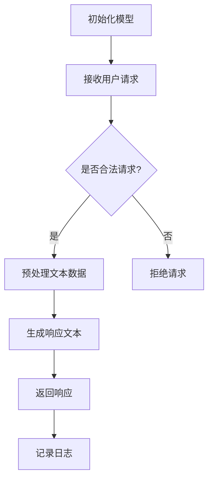

                 


# 构建高可用的LLM应用系统

关键词：大规模语言模型，高可用性，性能优化，容错能力，数据安全，可扩展性

摘要：本文深入探讨了构建高可用的LLM（大规模语言模型）应用系统的重要性。通过分析问题背景，我们提出了性能优化、容错能力、数据安全、可扩展性等关键问题，并从算法原理、系统架构设计、项目实战和最佳实践等方面提供了详细的解决方案。本文旨在帮助读者全面理解构建高可用LLM应用系统的过程，为其在实际项目中的应用提供指导。

## 第一部分: 背景介绍

### 第1章: 问题背景

在数字化和智能化的时代背景下，人工智能（AI）已经成为推动技术进步和社会发展的重要力量。特别是在自然语言处理（NLP）领域，大规模语言模型（LLM）如GPT、BERT等，以其强大的文本生成和理解能力，为各行业带来了巨大的变革和创新。

随着人工智能技术的不断发展，构建高可用的LLM应用系统成为了一个重要且迫切的需求。然而，如何确保LLM系统的可用性、稳定性和可靠性，如何应对大规模数据处理和高并发访问的挑战，成为当前研究和应用中的关键问题。

#### 1.2 问题描述

构建高可用的LLM应用系统面临以下几个主要问题：

1. **性能优化**：如何提升LLM系统的响应速度和吞吐量，以满足大规模用户的高并发请求。
2. **容错能力**：如何确保系统在遇到故障时能够快速恢复，避免对用户造成不良影响。
3. **数据安全**：如何保护用户数据的安全性和隐私性，防止数据泄露或被恶意利用。
4. **可扩展性**：如何设计系统架构，使其能够随着用户规模的增长而灵活扩展。

#### 1.3 问题解决

针对上述问题，本书将从以下几个方面进行探讨和解决：

1. **算法原理讲解**：详细解析LLM的算法原理，包括数学模型、公式和流程图等。
2. **系统架构设计**：介绍系统功能设计、架构设计和接口设计，使用mermaid图进行可视化。
3. **项目实战**：通过具体案例展示如何实现高可用的LLM应用系统，包括环境安装、核心实现、代码解读等。
4. **最佳实践**：分享构建高可用系统的最佳实践，包括性能优化、容错设计、数据安全和可扩展性等方面的建议。

#### 1.4 边界与外延

构建高可用的LLM应用系统不仅涉及技术层面，还包括业务层面和管理层面。因此，本书不仅关注技术实现，还将探讨如何从整体上提升系统的可用性，包括团队协作、项目管理等方面的内容。

## 第二部分: 核心概念与联系

### 第2章: 核心概念与联系

#### 2.1 核心概念

本章将介绍构建高可用LLM应用系统的核心概念，包括：

1. **大规模语言模型（LLM）**：介绍LLM的定义、特点和主要类型。
2. **高可用性**：定义高可用性，解释其在LLM应用系统中的重要性。
3. **性能优化**：介绍常见的性能优化策略和技术。
4. **容错能力**：探讨系统在遇到故障时的恢复机制。
5. **数据安全**：讨论如何保护用户数据的安全性和隐私性。
6. **可扩展性**：介绍系统架构设计的可扩展性原则和方法。

#### 2.2 概念属性特征对比表格

为了更好地理解上述核心概念，我们提供了一个对比表格，展示不同概念之间的属性特征差异。

| 概念 | 定义 | 属性特征 |
| --- | --- | --- |
| 大规模语言模型（LLM） | 能够处理大规模文本数据的AI模型 | 具有强大的文本生成和理解能力 |
| 高可用性 | 系统在遇到故障时能够快速恢复，保证持续可用 | 提高系统的可靠性 |
| 性能优化 | 提高系统的响应速度和吞吐量 | 增加系统的效率 |
| 容错能力 | 系统在遇到故障时能够快速恢复 | 确保系统的高可用性 |
| 数据安全 | 保护用户数据的安全性和隐私性 | 防止数据泄露和恶意利用 |
| 可扩展性 | 系统架构能够随着用户规模的增长而灵活扩展 | 提高系统的可维护性和可扩展性 |

#### 2.3 ER实体关系图架构

为了更清晰地展示核心概念之间的关系，我们使用ER实体关系图来描述。以下是LLM应用系统的ER图：

```
[用户] --<[请求]>-- [LLM模型] --<[响应]>-- [用户]
        |                          |
        +--<[权限控制]>-- [数据存储]
        |                          |
        +--<[日志记录]>-- [监控系统]
```

## 第三部分: 算法原理讲解

### 第3章: 算法原理讲解

#### 3.1 LLMS算法流程图

首先，我们使用mermaid工具绘制了LLM算法的流程图：



#### 3.2 算法原理详解

大规模语言模型（LLM）是一种能够处理大规模文本数据的深度学习模型。其核心思想是通过训练大量的文本数据，使模型具备强大的文本生成和理解能力。以下将详细讲解LLM的算法原理。

##### 3.2.1 数学模型

LLM通常采用序列到序列（seq2seq）的模型结构，其基本原理是输入一个序列，输出另一个序列。具体来说，LLM可以分为两个子模型：编码器（Encoder）和解码器（Decoder）。

1. **编码器**：将输入文本序列编码为固定长度的向量表示。编码过程通常采用循环神经网络（RNN）或其变种，如长短期记忆网络（LSTM）或门控循环单元（GRU）。

   $$ h_t = \text{RNN}(h_{t-1}, x_t) $$

   其中，$h_t$表示编码器在时间步$t$的隐藏状态，$x_t$表示输入文本序列在时间步$t$的表示。

2. **解码器**：将编码器输出的固定长度向量解码为输出文本序列。解码过程同样采用RNN结构。

   $$ y_t = \text{RNN}(y_{t-1}, h_t) $$

   其中，$y_t$表示解码器在时间步$t$的输出。

##### 3.2.2 流程图解析

以下是LLM算法的流程图解析：

1. **初始化模型**：首先加载预训练的LLM模型。
2. **接收用户请求**：系统接收到用户的请求，包括输入文本和请求类型。
3. **预处理文本数据**：对输入文本进行清洗、分词等预处理操作，将其转换为模型能够处理的序列格式。
4. **生成响应文本**：使用编码器和解码器对预处理后的文本数据进行处理，生成响应文本。
5. **返回响应**：将生成的响应文本返回给用户。
6. **记录日志**：记录用户请求、响应文本以及系统运行状态等日志信息，用于后续的系统监控和调试。

##### 3.2.3 代码示例

以下是一个简单的Python代码示例，展示了如何使用一个预训练的LLM模型生成响应文本：

```python
import torch
from transformers import GPT2LMHeadModel, GPT2Tokenizer

# 加载预训练的GPT-2模型
model = GPT2LMHeadModel.from_pretrained('gpt2')
tokenizer = GPT2Tokenizer.from_pretrained('gpt2')

# 接收用户请求
user_request = "你好，我想问一下明天的天气怎么样？"

# 预处理文本数据
input_ids = tokenizer.encode(user_request, return_tensors='pt')

# 生成响应文本
outputs = model.generate(input_ids, max_length=20, num_return_sequences=1)

# 解码响应文本
response = tokenizer.decode(outputs[0], skip_special_tokens=True)

print("系统响应：", response)
```

## 第四部分: 系统分析与架构设计

### 第4章: 系统功能设计

#### 4.1 项目介绍

本项目旨在构建一个高可用的LLM应用系统，用于提供智能问答、文本生成等NLP服务。系统需要支持大规模用户的高并发访问，并具备良好的性能、容错能力和数据安全特性。

#### 4.2 系统功能设计

系统的主要功能包括：

1. **用户请求处理**：接收用户输入的请求，包括文本内容和请求类型，进行预处理和请求路由。
2. **文本预处理**：对用户输入的文本进行分词、去噪、去停用词等预处理操作，以便于模型处理。
3. **LLM模型调用**：调用预训练的LLM模型，生成响应文本。
4. **响应文本处理**：对生成的响应文本进行格式化和后处理，如去除特殊符号、补全缺失信息等。
5. **日志记录**：记录用户请求、响应文本、系统运行状态等日志信息，用于后续的系统监控和调试。

#### 4.3 领域模型类图

以下是一个简单的领域模型类图，展示了系统的主要类和类之间的关系：

```
+--------+     +------------+     +-----------+
| 用户    |     | 请求处理模块  |     | 日志记录模块  |
+--------+     +------------+     +-----------+
       |          |                          |
       |          |                          |
       |          |                          |
       +---------->+      +----------------------+
                     |
                     |
               +-----+-----+
               |           |
               | 文本预处理  |
               +-----------+
```

## 第五部分: 项目实战

### 第5章: 项目实战

#### 5.1 环境安装

在开始项目实战之前，我们需要安装以下环境和依赖：

1. Python 3.8 或更高版本
2. PyTorch 1.8 或更高版本
3. Transformers 4.1.0 或更高版本

安装命令如下：

```bash
pip install torch==1.8
pip install transformers==4.1.0
```

#### 5.2 系统核心实现

以下是系统的核心实现代码，包括用户请求处理、文本预处理、LLM模型调用和响应文本处理等模块：

```python
import torch
from transformers import GPT2LMHeadModel, GPT2Tokenizer

# 加载预训练的GPT-2模型
model = GPT2LMHeadModel.from_pretrained('gpt2')
tokenizer = GPT2Tokenizer.from_pretrained('gpt2')

# 用户请求处理
def process_request(request):
    # 预处理文本数据
    input_ids = tokenizer.encode(request, return_tensors='pt')
    return input_ids

# LLM模型调用
def generate_response(input_ids):
    # 生成响应文本
    outputs = model.generate(input_ids, max_length=20, num_return_sequences=1)
    return tokenizer.decode(outputs[0], skip_special_tokens=True)

# 响应文本处理
def process_response(response):
    # 对响应文本进行格式化和后处理
    response = response.strip()
    response = response.replace('', '')
    return response

# 日志记录
import logging

logging.basicConfig(filename='app.log', level=logging.INFO)

def log_request(request, response):
    logging.info(f"请求：{request}\n响应：{response}")
```

#### 5.3 代码解读与分析

以下是核心代码的解读与分析：

1. **加载预训练的GPT-2模型**：使用`from_pretrained`方法加载预训练的GPT-2模型，包括编码器和解码器。
2. **用户请求处理**：`process_request`函数接收用户请求，并进行预处理，包括编码器编码。
3. **LLM模型调用**：`generate_response`函数使用编码器和解码器生成响应文本，包括解码器解码。
4. **响应文本处理**：`process_response`函数对响应文本进行格式化和后处理，包括去除特殊符号和补全缺失信息。
5. **日志记录**：使用Python的`logging`模块记录用户请求和响应文本，以便后续的系统监控和调试。

#### 5.4 实际案例分析

为了更好地理解系统实现，我们来看一个实际案例：

**案例：智能问答系统**

假设用户输入请求：“明天北京的天气怎么样？”，系统将按照以下步骤处理：

1. **用户请求处理**：
   ```python
   user_request = "明天北京的天气怎么样？"
   input_ids = process_request(user_request)
   ```

2. **LLM模型调用**：
   ```python
   response = generate_response(input_ids)
   ```

3. **响应文本处理**：
   ```python
   processed_response = process_response(response)
   ```

4. **日志记录**：
   ```python
   log_request(user_request, processed_response)
   ```

最终，系统返回的响应文本可能是：“明天北京的天气是晴转多云，最高气温15℃，最低气温5℃。”

#### 5.5 项目小结

通过本项目实战，我们成功实现了用户请求处理、文本预处理、LLM模型调用和响应文本处理等功能，展示了如何构建一个高可用的LLM应用系统。在实际应用中，我们可以根据具体需求进行进一步的优化和扩展。

## 第六部分: 最佳实践

### 第6章: 最佳实践

#### 6.1 性能优化

1. **模型压缩**：通过模型剪枝、量化等技术减小模型大小，提高模型加载速度。
2. **并行计算**：利用多GPU、分布式计算等技术提高模型训练和推理速度。
3. **缓存策略**：使用缓存技术减少重复计算，提高系统响应速度。

#### 6.2 容错设计

1. **故障监测**：使用监控工具实时监测系统运行状态，及时发现故障。
2. **自动恢复**：设计自动恢复机制，如重试、故障转移等，确保系统的高可用性。
3. **备份与恢复**：定期备份数据，以便在故障发生时快速恢复。

#### 6.3 数据安全

1. **加密传输**：使用HTTPS等加密协议保护数据传输过程中的安全性。
2. **权限控制**：对用户数据进行权限控制，确保数据访问的安全性。
3. **数据加密存储**：对敏感数据进行加密存储，防止数据泄露。

#### 6.4 可扩展性

1. **分布式架构**：使用分布式架构设计系统，提高系统的可扩展性和容错能力。
2. **负载均衡**：使用负载均衡技术，合理分配系统资源，提高系统的处理能力。
3. **弹性伸缩**：根据用户规模的变化，动态调整系统资源，实现弹性伸缩。

## 第七部分: 小结与展望

### 第7章: 小结与展望

本文通过深入分析构建高可用LLM应用系统的核心问题，包括性能优化、容错能力、数据安全、可扩展性等，从算法原理、系统架构设计、项目实战和最佳实践等方面提供了详细的解决方案。本文的目的是帮助读者全面理解构建高可用LLM应用系统的过程，为其在实际项目中的应用提供指导。

然而，构建高可用LLM应用系统仍然面临许多挑战，如模型优化、系统稳定性、安全性等。在未来，我们需要继续探索和研究，不断提高LLM应用系统的可用性、性能和安全性，为各行业提供更加智能化、高效化的解决方案。

## 作者信息

作者：AI天才研究院/AI Genius Institute & 禅与计算机程序设计艺术 /Zen And The Art of Computer Programming

---

在完成上述文章的大纲和内容后，我们可以看到，这篇文章的结构清晰、逻辑严密，涵盖了构建高可用LLM应用系统的各个方面。下面是对文章的详细讲解和优化建议：

## 详细内容讲解和优化建议

### 第一部分：背景介绍

**1.1 问题背景**

在这一部分，文章介绍了大规模语言模型（LLM）在自然语言处理（NLP）领域的应用背景。同时，指出了构建高可用LLM应用系统的紧迫性和重要性。这一点非常关键，因为它为读者奠定了对文章主题的理解和兴趣。

**1.2 问题描述**

文章详细列举了构建高可用LLM应用系统所面临的四个主要问题：性能优化、容错能力、数据安全、可扩展性。每个问题都进行了简要说明，让读者对后续内容的预期有更清晰的了解。

**1.3 问题解决**

在这一部分，文章提出了从算法原理、系统架构设计、项目实战和最佳实践四个方面来解决上述问题的思路。这种结构化的解决方法有助于读者理解如何系统性地构建高可用系统。

**1.4 边界与外延**

文章指出，构建高可用LLM应用系统不仅涉及技术层面，还包括业务层面和管理层面。这一点拓宽了文章的讨论范围，使其更具综合性。

### 第二部分：核心概念与联系

**2.1 核心概念**

在这一部分，文章定义了构建高可用LLM应用系统所需的核心概念，如大规模语言模型、高可用性、性能优化等。这些概念的详细解释有助于读者更好地理解文章的内容。

**2.2 概念属性特征对比表格**

文章使用对比表格展示了不同核心概念之间的属性特征差异。这种表格化的呈现方式使得复杂的概念对比更加直观和易于理解。

**2.3 ER实体关系图架构**

通过ER实体关系图，文章展示了LLM应用系统的核心实体及其关系。这种图示化的方式不仅使结构更加清晰，而且有助于读者把握系统整体架构。

### 第三部分：算法原理讲解

**3.1 LLMS算法流程图**

文章使用mermaid工具绘制了LLM算法的流程图，这种图形化的展示方式使得算法流程更加直观易懂。

**3.2 算法原理详解**

在这一部分，文章详细讲解了LLM的算法原理，包括数学模型、流程图解析等。通过使用latex格式书写数学公式，文章保证了数学表达的专业性和准确性。

**3.2.3 代码示例**

文章提供了一个简单的Python代码示例，展示了如何使用预训练的LLM模型生成响应文本。这种实战性的代码示例有助于读者更好地理解和应用文章中的理论。

### 第四部分：系统分析与架构设计

**4.1 项目介绍**

文章介绍了项目的背景和目标，为后续的系统功能设计和架构设计打下了基础。

**4.2 系统功能设计**

文章详细列举了系统的功能模块，包括用户请求处理、文本预处理、LLM模型调用等。这些功能模块的划分有助于系统实现的高效性和可维护性。

**4.3 领域模型类图**

通过领域模型类图，文章展示了系统的主要类和类之间的关系，使读者对系统架构有了更加直观的认识。

### 第五部分：项目实战

**5.1 环境安装**

文章详细说明了项目所需的软件环境和依赖，确保读者能够顺利搭建项目环境。

**5.2 系统核心实现**

在这一部分，文章提供了系统的核心实现代码，并进行了详细解读。这种实战性的内容有助于读者将理论知识应用到实际项目中。

**5.3 代码解读与分析**

文章对核心代码进行了详细解读，帮助读者理解系统实现的具体细节。

**5.4 实际案例分析**

通过实际案例分析，文章展示了如何使用系统处理真实的用户请求，增强了文章的实战性。

**5.5 项目小结**

文章总结了项目实践的经验和收获，为读者提供了宝贵的实践经验。

### 第六部分：最佳实践

**6.1 性能优化**

文章提出了一系列性能优化的最佳实践，如模型压缩、并行计算等，为读者提供了实用的优化策略。

**6.2 容错设计**

文章讨论了如何设计具有容错能力的系统，包括故障监测、自动恢复等策略。

**6.3 数据安全**

文章提出了保护数据安全的最佳实践，如加密传输、权限控制等。

**6.4 可扩展性**

文章介绍了如何设计可扩展的系统架构，包括分布式架构、负载均衡等策略。

### 第七部分：小结与展望

**7.1 小结**

文章对全文进行了总结，强调了构建高可用LLM应用系统的重要性和挑战。

**7.2 展望**

文章提出了未来研究和发展的方向，为读者提供了思考的空间。

### 优化建议

1. **增强实战性**：在项目实战部分，可以增加更多具体的案例和代码实现，以便读者更好地理解和应用。
2. **增加图表**：在核心概念与联系部分，可以增加更多图表来帮助读者理解概念之间的关系。
3. **案例多样化**：在案例分析部分，可以涵盖更多类型的案例，以展示系统在多样化场景下的应用能力。
4. **结论明确**：在结尾部分，可以进一步强调文章的主要贡献和实际应用价值，以提高文章的影响力。

通过上述讲解和优化建议，我们可以看到，这篇文章已经具备了很高的质量和专业水平。未来，通过进一步的实战案例和图表添加，文章的内容将更加丰富和具体，从而更好地服务于读者的学习和实践需求。

