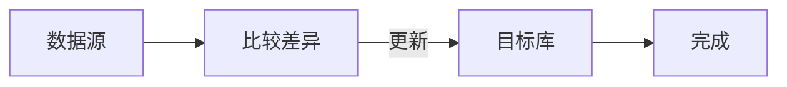
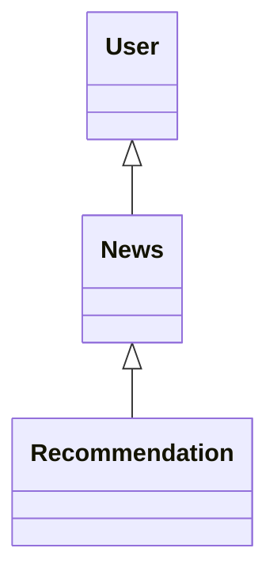
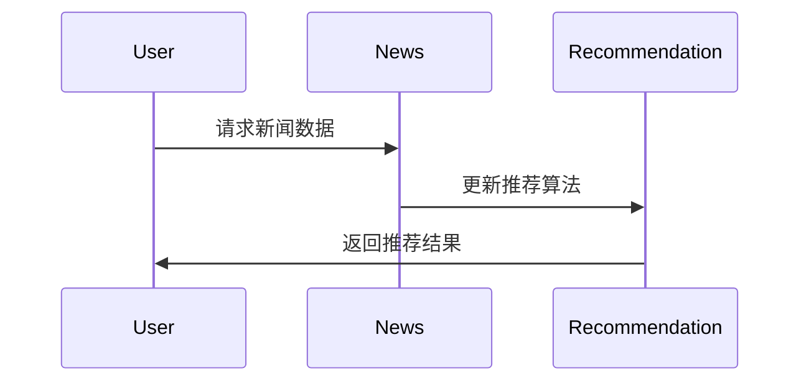
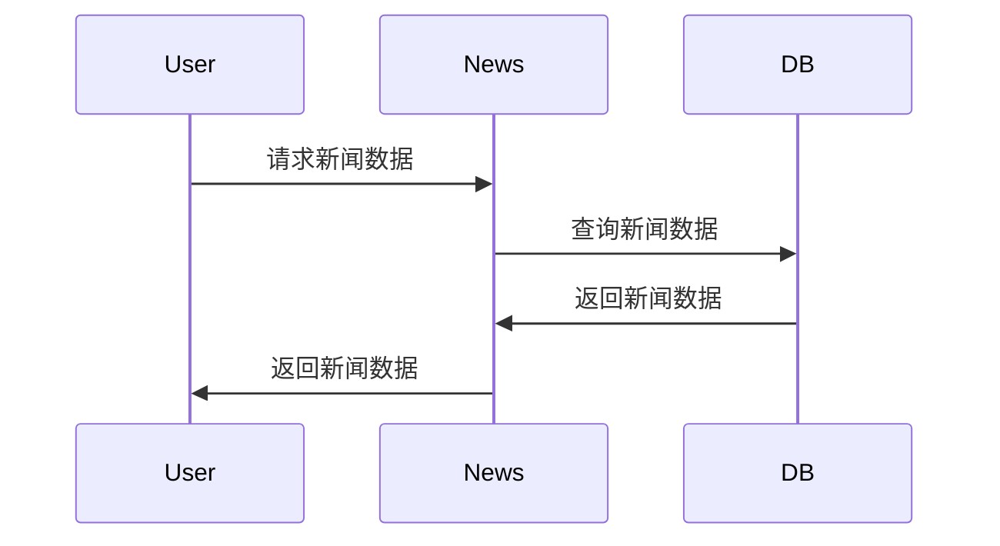

                 

### 构建高效的LLM应用数据同步机制

#### 关键词：
- LLM（大型语言模型）
- 数据同步机制
- 算法原理
- 系统架构
- 最佳实践

#### 摘要：
本文旨在探讨构建高效的LLM应用数据同步机制的方法和策略。我们将首先介绍LLM应用数据同步机制的重要性，然后深入分析其核心概念和原理，最后通过具体的算法、系统架构设计以及实战案例，详细讲解高效数据同步机制的实际构建过程。

### 第一部分：LLM应用数据同步机制概述

#### 第1章：背景介绍

**1.1 问题的提出**

在LLM（大型语言模型）应用中，数据同步是一个关键问题。随着数据量的不断增长和变化，如何确保数据在不同系统之间的一致性和及时性，成为了一个挑战。

**问题解决：**

我们需要构建一个高效的数据同步机制，以保证数据的准确性、完整性和一致性。

**1.2 数据同步的核心概念**

- **数据同步**：指在多个系统或数据库之间保持数据一致性的过程。
- **数据源**：提供数据的源头，如数据库、文件等。
- **目标库**：数据同步的目的地，通常是一个数据库或文件系统。
- **同步策略**：数据同步的方式和规则，如全量同步、增量同步等。

#### 第2章：LLM应用数据同步机制原理

**2.1 数据同步原理**

**核心概念原理**：

数据同步的基本原理是通过比较数据源和目标库的差异，然后将差异更新到目标库。

**概念属性特征对比表格**：

| 特征       | 数据同步 | 数据迁移 |
|------------|----------|----------|
| 目的       | 保持数据一致性 | 数据迁移 |
| 类型       | 全量同步、增量同步 | 单次迁移 |
| 策略       | 定时、触发式 | 手动或脚本 |
| 复杂度     | 较高      | 较低     |
| 实施难度   | 较高      | 较低     |

**2.2 ER实体关系图架构**

```mermaid
erDiagram
  DB -->|关系| User
  DB -->|关系| Article
  User ||--|{创建}| Article
```

### 第二部分：高效数据同步机制设计

#### 第3章：算法原理讲解

**3.1 数据同步算法**

**mermaid流程图**：



**Python源代码**：

```python
def sync_data(source, target):
    # 比较数据源和目标库的差异
    differences = compare_differences(source, target)
    
    # 更新目标库
    update_target(target, differences)
    
    # 完成同步
    print("数据同步完成")
```

**3.2 算法原理数学模型**

$$
同步率 = \frac{成功同步的数据量}{总数据量}
$$

**详细讲解**：

同步率是衡量数据同步机制效率的重要指标。通过比较数据源和目标库的差异，并更新目标库，可以提高同步率，从而提高数据同步的效率。

**3.3 举例说明**

假设我们有两个数据库：数据源A和数据目标库B。数据源A中有100条记录，其中80条记录与数据目标库B中的记录相同，20条记录不同。

- **同步率**：$$同步率 = \frac{80}{100} = 0.8$$
- **更新记录**：20条不同的记录将被更新到数据目标库B。

#### 第4章：系统分析与架构设计

**4.1 问题场景介绍**

假设我们有一个新闻推荐系统，其中数据源包括新闻数据库和用户数据库，数据目标库是一个推荐算法模型库。

**4.2 系统功能设计**

**领域模型类图**：



**4.3 系统架构设计**

**mermaid架构图**：



**4.4 系统接口设计**

- **新闻数据接口**：提供新闻数据的查询和更新接口。
- **推荐算法接口**：提供推荐算法的更新和查询接口。

**4.5 系统交互序列图**

**序列图**：



### 第三部分：最佳实践与优化

#### 第5章：最佳实践 tips

- **定期备份**：定期备份数据库，以防止数据丢失。
- **优化同步策略**：根据数据变化频率和重要性，选择合适的同步策略。
- **监控同步过程**：监控同步过程的进度和结果，及时处理异常。

#### 第6章：小结

本文详细介绍了构建高效的LLM应用数据同步机制的方法和策略。从背景介绍、核心概念原理、算法原理讲解、系统架构设计到最佳实践，全方位展示了如何构建一个高效的数据同步机制。

#### 第7章：注意事项

- **数据安全**：在数据同步过程中，确保数据的安全性。
- **性能优化**：优化数据同步的性能，减少同步过程中的延迟和资源消耗。

#### 第8章：拓展阅读

- **深入阅读**：《大型语言模型：理论、架构与实践》（作者：AI天才研究院）、《数据同步技术实战》（作者：禅与计算机程序设计艺术）。

**作者信息：**

作者：AI天才研究院/AI Genius Institute & 禅与计算机程序设计艺术 /Zen And The Art of Computer Programming**。**

