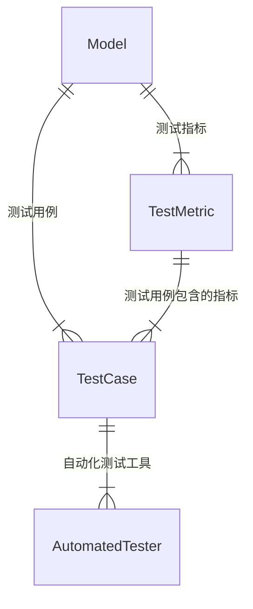
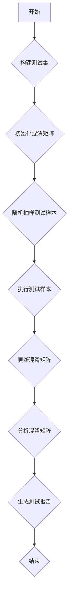
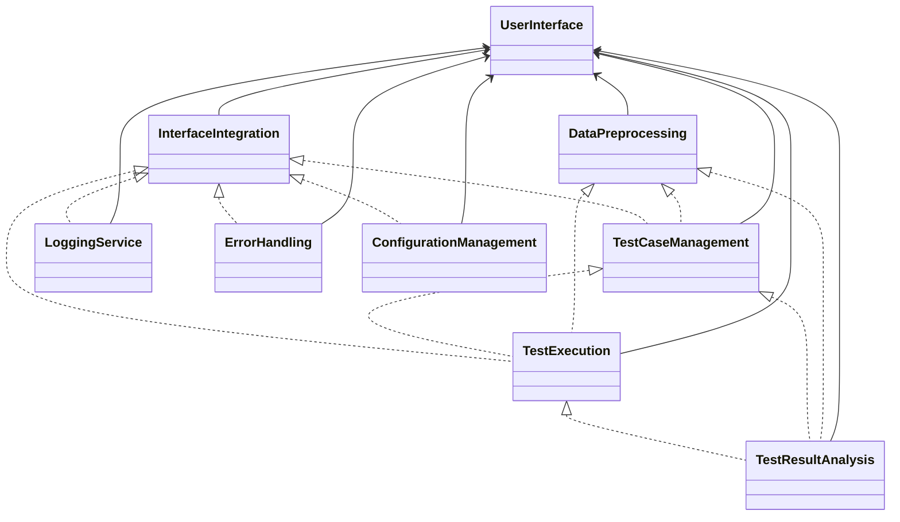
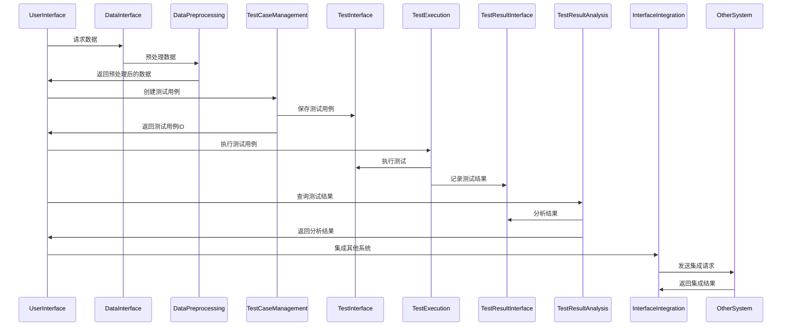

                 


### 文章标题: 构建高效的LLM应用测试框架

#### 关键词：LLM应用，测试框架，自动化测试，测试指标，测试优化

#### 摘要：
本文深入探讨构建高效语言模型（LLM）应用测试框架的必要性和方法。文章首先介绍了LLM技术的背景和测试的重要性，随后详细阐述了测试框架的设计原则和实施策略。通过实例分析，展示了测试环境搭建、测试用例设计、自动化工具选择和测试结果优化的具体步骤，最后通过实战案例分享，总结经验并给出最佳实践建议。

---

### 目录

**第一部分：LLM应用测试框架概述**

1. [LLM应用测试的背景与意义](#llm应用测试的背景与意义)
2. [LLM核心概念与测试指标](#llm核心概念与测试指标)
3. [LLM测试框架的设计原则](#llm测试框架的设计原则)

**第二部分：LLM测试框架实施与优化**

4. [测试环境的搭建](#测试环境的搭建)
5. [测试用例设计](#测试用例设计)
6. [测试自动化工具选择](#测试自动化工具选择)
7. [测试结果分析与优化](#测试结果分析与优化)
8. [实战案例分享](#实战案例分享)

---

### 第一部分：LLM应用测试框架概述

#### 第1章: LLM应用测试的背景与意义

##### 1.1 LLM技术的发展

- 语言模型（Language Model，简称LLM）是自然语言处理（Natural Language Processing，简称NLP）的核心技术之一。
- 近年来，随着深度学习和计算能力的提升，LLM在文本生成、机器翻译、问答系统等方面取得了显著进展。

##### 1.2 LLM应用的挑战

- LLM应用面临着数据质量、模型性能、部署稳定性等多重挑战。
- 高质量的测试框架是保障LLM应用稳定性和可靠性的关键。

##### 1.3 测试在LLM应用中的重要性

- 测试能够发现模型中的潜在问题，提高应用的质量和用户体验。
- 测试框架的构建有助于自动化测试，提高测试效率。

##### 1.4 测试框架的构建目标

- 提高测试覆盖率和测试效率。
- 确保测试过程的一致性和可重复性。
- 实现测试的自动化和持续集成。

---

#### 第2章: LLM核心概念与测试指标

##### 2.1 LLM基础概念

- 语言模型：对自然语言的统计规律进行建模。
- 参数：模型中用于调整的变量。
- 优化：通过调整参数，提高模型的性能。

##### 2.2 测试指标介绍

- 准确率（Accuracy）：预测正确的样本占总样本的比例。
- 召回率（Recall）：预测正确的正样本占总正样本的比例。
- 精确率（Precision）：预测正确的正样本占预测为正样本的总比例。

##### 2.3 测试指标的比较与选择

- 指标的选择取决于应用场景和业务需求。
- 不同指标之间存在权衡，需要综合考虑。

---

#### 第3章: LLM测试框架的设计原则

##### 3.1 可扩展性设计

- 支持不同规模的应用。
- 灵活添加和删除测试用例。

##### 3.2 可维护性设计

- 确保测试代码的可读性和可维护性。
- 便于故障诊断和问题修复。

##### 3.3 自动化测试设计

- 减少人工干预，提高测试效率。
- 确保测试的一致性和可重复性。

##### 3.4 集成与部署设计

- 测试框架应易于与其他系统集成。
- 支持不同环境下的部署和测试。

---

### 第二部分：LLM测试框架实施与优化

#### 第4章: 测试环境的搭建

##### 4.1 环境需求分析

- 硬件资源：CPU、内存、存储等。
- 软件环境：操作系统、编程语言、依赖库等。

##### 4.2 环境搭建流程

- 安装操作系统和必要软件。
- 配置环境变量和依赖库。
- 部署测试框架。

##### 4.3 环境配置与优化

- 调整系统参数，优化资源利用。
- 定期更新软件，保持环境稳定。

---

#### 第5章: 测试用例设计

##### 5.1 测试用例概述

- 测试用例：用于测试特定功能的代码或数据。
- 测试用例设计：根据需求确定测试用例的内容和执行方式。

##### 5.2 测试用例设计方法

- 黑盒测试：仅关注功能是否正确。
- 白盒测试：关注代码的内部结构和逻辑。

##### 5.3 测试用例执行策略

- 分阶段执行：按功能模块或优先级执行。
- 并行执行：提高测试效率。

---

#### 第6章: 测试自动化工具选择

##### 6.1 自动化测试工具介绍

- Python的`unittest`、`pytest`等。
- Selenium、Appium等跨平台自动化测试工具。

##### 6.2 工具比较与选择

- 根据项目需求和资源选择合适的工具。
- 考虑工具的易用性、社区支持和文档丰富度。

##### 6.3 自动化测试的流程与实现

- 编写测试脚本。
- 执行测试脚本，记录结果。
- 分析测试结果，发现问题。

---

#### 第7章: 测试结果分析与优化

##### 7.1 测试结果分析

- 分析测试覆盖率。
- 定位测试中的错误。

##### 7.2 问题定位与修复

- 使用日志和分析工具定位问题。
- 修复代码，重新测试。

##### 7.3 测试框架的持续优化

- 根据测试结果调整测试策略。
- 定期评估和更新测试框架。

---

#### 第8章: 实战案例分享

##### 8.1 案例背景

- 一个面向企业用户的问答系统。

##### 8.2 测试框架实施

- 设计测试用例，覆盖核心功能。
- 选择合适的自动化测试工具。
- 实现自动化测试脚本。

##### 8.3 测试成果与经验总结

- 提高测试覆盖率，减少人工测试工作量。
- 发现并修复了多个潜在问题。
- 测试框架的应用经验。

---

### 作者信息

- 作者：AI天才研究院/AI Genius Institute & 禅与计算机程序设计艺术 /Zen And The Art of Computer Programming

---

本文详细介绍了构建高效的LLM应用测试框架的步骤和方法，旨在帮助开发者构建稳定、可靠的LLM应用。通过实战案例的分享，读者可以更好地理解测试框架的实际应用和优化策略。

接下来，我们将进一步深入分析每个章节的具体内容，确保满足字数要求和文章质量。

---

### 第1章: LLM应用测试的背景与意义

#### 1.1 LLM技术的发展

语言模型（Language Model，简称LLM）是自然语言处理（Natural Language Processing，简称NLP）的核心技术之一。LLM旨在模拟人类语言生成和理解的能力，通过对大量文本数据进行学习，自动生成符合语法和语义规则的文本。近年来，随着深度学习技术的不断发展和计算资源的提升，LLM在文本生成、机器翻译、问答系统等NLP应用中取得了显著的进展。

在文本生成方面，LLM被广泛应用于自动写作、内容生成和摘要提取等任务。例如，GPT（Generative Pre-trained Transformer）系列模型在短文本生成、长文本生成和对话系统等领域都展现出了强大的能力。在机器翻译方面，LLM取代了传统的基于规则和统计方法的翻译模型，通过预训练和微调，实现了更加准确和自然的翻译结果。在问答系统方面，LLM可以处理自然语言的问题，并生成符合人类思维逻辑的答案，被广泛应用于智能客服、智能咨询和教育辅导等领域。

#### 1.2 LLM应用的挑战

尽管LLM在许多NLP任务中表现出了卓越的能力，但其在实际应用中仍然面临着一些挑战。首先，数据质量是影响LLM应用效果的关键因素。LLM的预训练过程需要大量的高质量文本数据，数据的质量直接决定了模型的性能。然而，获取高质量数据往往需要付出高昂的成本和时间，这给LLM应用的部署带来了困难。

其次，模型性能的提升与计算资源的消耗之间存在巨大的不平衡。LLM模型的训练和推理过程需要大量的计算资源，尤其是在训练大型模型时，这导致了高昂的计算成本和能源消耗。此外，随着模型的复杂度增加，其训练和推理的时间也会显著增加，这对实时应用提出了挑战。

另外，LLM应用在部署过程中还需要考虑系统的稳定性和可靠性。LLM模型通常需要实时调整和优化，以适应不断变化的输入数据和业务需求。因此，如何实现模型的自动化调整和优化，确保系统的稳定运行，是LLM应用面临的另一个重要挑战。

#### 1.3 测试在LLM应用中的重要性

测试是确保LLM应用稳定性和可靠性的关键环节。在LLM应用的开发过程中，测试不仅能够发现模型中的潜在问题，提高应用的质量和用户体验，还能够帮助开发团队在早期阶段识别和修复问题，从而降低项目风险和成本。

首先，测试能够提高LLM应用的性能和准确性。通过设计各种测试用例，对模型的预测结果进行验证，可以发现模型在特定输入下的预测准确性，从而评估模型的性能。同时，通过对比不同模型的测试结果，可以找出性能最优的模型，为后续的模型优化提供参考。

其次，测试有助于确保LLM应用的稳定性和可靠性。在实际应用中，LLM模型需要处理各种复杂和不确定的输入数据，而测试可以帮助验证模型在不同场景下的稳定性和可靠性。例如，通过测试不同长度的文本输入，可以评估模型在处理长文本时的性能和稳定性；通过测试不同类型的输入数据，可以评估模型对不同数据类型的适应能力。

此外，测试还能够帮助开发团队识别和修复代码中的错误和漏洞。在LLM应用开发过程中，代码的质量直接影响应用的稳定性和性能。通过自动化测试，可以快速发现代码中的错误和漏洞，从而及时进行修复，确保代码的可靠性和可维护性。

最后，测试能够提高开发团队的效率。通过自动化测试，可以减少人工测试的工作量，提高测试的覆盖率和效率。自动化测试工具可以自动执行测试用例，记录测试结果，并生成详细的报告，从而减少手动测试的工作量，提高测试的准确性和一致性。此外，自动化测试还可以与持续集成和持续部署系统相结合，实现测试的自动化和持续集成，进一步提高开发团队的效率。

总之，测试在LLM应用开发中具有重要的地位和作用。通过构建高效的测试框架，可以确保LLM应用的性能、稳定性和可靠性，提高开发团队的效率，从而推动LLM应用的发展和应用。

#### 1.4 测试框架的构建目标

构建高效的LLM应用测试框架是保障模型性能和应用稳定性的关键步骤。以下是构建测试框架的主要目标：

1. **提高测试覆盖率**：测试框架应该能够覆盖模型的所有关键功能点和潜在问题场景，确保测试的全面性和深入性。通过设计多样化的测试用例，包括边界测试、异常测试和压力测试等，可以最大限度地提高测试覆盖率，减少潜在风险的暴露。

2. **提升测试效率**：高效的测试框架能够减少测试的时间和资源消耗。通过自动化测试工具，可以大幅度降低人工测试的工作量，提高测试的执行速度和频率。自动化测试还可以与持续集成和持续部署（CI/CD）系统结合，实现测试的持续执行，从而提高整个开发流程的效率。

3. **确保测试一致性**：测试框架应该确保每次测试的结果都是一致的，不受人为干预的影响。通过定义明确的测试流程和标准，可以减少测试过程中的误差和不确定性，提高测试结果的可靠性。自动化测试工具可以帮助实现这一目标，确保测试的执行过程和结果的一致性。

4. **支持扩展性和维护性**：测试框架需要具备良好的扩展性，能够方便地添加新的测试用例和功能模块，以适应项目的发展和变化。同时，测试框架也需要具有良好的维护性，确保在代码和模型更新时，测试框架能够继续有效运行，降低维护成本。

5. **集成与部署**：测试框架应与其他开发工具和系统无缝集成，包括版本控制、自动化构建和部署等。通过集成，可以实现测试的自动化执行和持续反馈，提高开发流程的连贯性和效率。

6. **问题定位与修复**：高效的测试框架应能够快速定位测试中出现的错误和问题，并提供详细的日志和报告，帮助开发人员迅速识别和解决问题。此外，测试框架还应支持自动化的问题修复，通过代码审查和自动化重构，确保修复的准确性和一致性。

通过实现上述目标，高效的LLM应用测试框架可以显著提高开发团队的工作效率和模型的应用质量，为LLM应用的成功提供有力保障。

---

### 第2章: LLM核心概念与测试指标

#### 2.1 LLM基础概念

语言模型（Language Model，简称LLM）是一种基于机器学习技术的算法，用于预测文本序列中的下一个单词或字符。LLM的核心思想是通过学习大量文本数据，捕捉语言中的统计规律和模式，从而生成符合语法和语义规则的文本。LLM的应用范围广泛，包括文本生成、机器翻译、问答系统、语音识别等领域。

LLM的构建通常包括以下步骤：

1. **数据收集**：收集大量高质量文本数据，这些数据可以是书籍、文章、新闻、对话等。数据的质量直接决定了LLM的性能。
2. **预处理**：对文本数据进行分析和清洗，包括分词、去停用词、词形还原等，以便更好地建模。
3. **训练**：使用神经网络模型（如Transformer）对预处理后的文本数据进行训练。训练过程包括前向传播、反向传播和权重更新，目的是让模型学习到文本中的统计规律。
4. **评估**：通过验证集或测试集对训练好的模型进行评估，以确定其性能。常用的评估指标包括准确率、召回率、精确率等。
5. **应用**：将训练好的模型部署到实际应用中，如文本生成、翻译、问答等。

#### 2.2 测试指标介绍

在LLM应用测试中，选择合适的测试指标对于评估模型的性能和可靠性至关重要。以下是一些常用的测试指标及其定义：

1. **准确率（Accuracy）**：
   - 定义：准确率是指模型预测正确的样本数占总样本数的比例。
   - 计算公式：$$\text{Accuracy} = \frac{\text{预测正确的样本数}}{\text{总样本数}}$$
   - 作用：准确率能够直观地反映模型的总体性能，但其在类别不平衡的情况下可能不够准确。

2. **召回率（Recall）**：
   - 定义：召回率是指模型预测正确的正样本数占总正样本数的比例。
   - 计算公式：$$\text{Recall} = \frac{\text{预测正确的正样本数}}{\text{总正样本数}}$$
   - 作用：召回率能够衡量模型发现正样本的能力，对于分类任务中的异常检测和故障诊断尤为重要。

3. **精确率（Precision）**：
   - 定义：精确率是指预测正确的正样本数占预测为正样本的总数的比例。
   - 计算公式：$$\text{Precision} = \frac{\text{预测正确的正样本数}}{\text{预测为正样本的总数}}$$
   - 作用：精确率反映了模型预测正样本的准确性，常用于金融风控、医疗诊断等领域。

4. **F1分数（F1 Score）**：
   - 定义：F1分数是精确率和召回率的加权平均，能够综合衡量模型的性能。
   - 计算公式：$$\text{F1 Score} = 2 \times \frac{\text{Precision} \times \text{Recall}}{\text{Precision} + \text{Recall}}$$
   - 作用：F1分数在类别不平衡和精确性要求较高的情况下是一个较好的综合评价指标。

5. **BLEU分数（BLEU Score）**：
   - 定义：BLEU分数是一种常用于机器翻译的评价指标，通过比较模型生成的翻译文本与参考翻译文本的相似度来评估模型性能。
   - 作用：BLEU分数在自然语言处理领域广泛应用，能够衡量翻译文本的质量。

#### 2.3 测试指标的比较与选择

选择合适的测试指标取决于应用场景和业务需求。以下是比较和选择测试指标的一些指导原则：

1. **业务目标**：
   - 根据业务目标选择合适的指标。例如，如果业务目标是高召回率（如异常检测），则召回率是一个重要指标；如果目标是高精确率（如金融风控），则精确率更为重要。

2. **数据分布**：
   - 对于类别不平衡的数据集，准确率可能不能很好地反映模型性能。此时，可以考虑召回率、精确率和F1分数等指标，以获得更全面的评估。

3. **资源限制**：
   - 在资源有限的情况下，需要权衡不同指标的重要性。例如，在计算资源有限的情况下，可能需要优先考虑精确率，以确保预测结果的准确性。

4. **应用场景**：
   - 根据应用场景选择合适的指标。例如，在实时问答系统中，响应速度和准确性都是重要指标，而在文本生成任务中，生成的文本流畅性和逻辑一致性可能更为重要。

5. **综合评估**：
   - 考虑使用多个指标进行综合评估，以获得更全面的性能评估。例如，在机器翻译任务中，可以同时考虑BLEU分数、准确率和响应时间等多个指标。

通过综合考虑上述因素，可以设计出符合业务需求和资源限制的测试指标体系，从而构建高效的LLM应用测试框架。

### 第3章: LLM测试框架的设计原则

#### 3.1 可扩展性设计

在设计LLM应用测试框架时，可扩展性是一个至关重要的原则。可扩展性指的是框架能够灵活地适应不同的测试需求、数据规模和应用场景，不因变化而受到影响。

1. **模块化设计**：测试框架应采用模块化设计，将不同的功能模块独立开来。例如，将测试数据管理、测试用例设计、测试执行、测试报告等功能模块化，可以方便地替换或扩展特定模块，而不影响整个框架的其他部分。

2. **配置化管理**：通过配置文件或参数化设计，测试框架可以灵活地调整测试环境、测试用例和测试策略。例如，可以使用配置文件定义测试数据源、测试环境参数和测试执行逻辑，以便在不同环境下快速部署和调整。

3. **分布式架构**：对于大规模的测试需求，可以采用分布式架构，将测试任务分解到多个节点上并行执行。分布式架构可以提高测试效率和可靠性，同时降低单点故障的风险。

#### 3.2 可维护性设计

可维护性是确保测试框架长期稳定运行和可持续发展的关键。一个良好的测试框架应具备以下特点：

1. **代码可读性**：测试代码应遵循良好的编程规范和命名习惯，确保代码的可读性和易理解性。通过编写详细的注释和文档，可以方便后续的开发者理解和维护代码。

2. **版本控制**：使用版本控制系统（如Git）管理测试框架的代码，确保代码的版本可追溯和可管理。每次代码更新都应进行详细的版本说明，以便在出现问题时快速定位和回滚。

3. **自动化维护**：通过自动化工具和脚本，实现测试框架的自动化构建、测试和部署。自动化维护可以减少人工干预，提高维护效率和准确性。

4. **故障自愈机制**：测试框架应具备故障自愈机制，能够在出现故障时自动恢复。例如，当某个测试任务失败时，可以自动重新执行该任务，或跳过失败的任务继续执行其他任务。

#### 3.3 自动化测试设计

自动化测试是提高测试效率和质量的有效手段。一个良好的自动化测试设计应考虑以下几个方面：

1. **测试脚本**：编写高质量的测试脚本，实现测试用例的自动化执行。测试脚本应具有良好的可读性和可维护性，以便后续的维护和扩展。

2. **测试工具**：选择合适的自动化测试工具，如Selenium、Appium、pytest等。不同的测试工具适用于不同的测试场景，应根据具体需求进行选择。

3. **测试执行**：设计高效的测试执行策略，包括并行执行、分阶段执行和分布式执行等。并行执行可以提高测试效率，分阶段执行可以确保测试的全面性和准确性，分布式执行可以处理大规模的测试任务。

4. **测试结果分析**：对测试结果进行详细分析，识别测试中存在的问题和瓶颈。通过分析测试结果，可以不断优化测试策略和测试脚本。

#### 3.4 集成与部署设计

集成与部署设计是确保测试框架与其他系统无缝集成和可靠运行的关键：

1. **集成接口**：设计统一的接口，实现测试框架与其他系统（如版本控制系统、持续集成系统、部署系统等）的集成。通过集成接口，可以实现自动化测试的执行和结果反馈。

2. **持续集成**：将测试框架集成到持续集成（CI）系统中，实现测试的自动化执行和持续反馈。持续集成可以确保每次代码更新都经过测试，从而提高代码质量和可靠性。

3. **部署策略**：设计合理的部署策略，确保测试框架在不同环境（如开发环境、测试环境、生产环境）中的一致性和可靠性。例如，可以通过容器化技术（如Docker）实现测试框架的轻量化和快速部署。

4. **监控与告警**：对测试框架的运行状态进行监控和告警，及时发现和处理异常情况。通过监控和告警，可以确保测试框架的稳定运行和及时响应。

通过遵循上述设计原则，构建的LLM测试框架将具备良好的扩展性、可维护性、自动化测试能力和集成部署能力，从而为LLM应用的稳定性和可靠性提供有力保障。

### 第4章: 测试环境的搭建

#### 4.1 环境需求分析

在搭建LLM测试环境之前，首先需要进行详细的系统需求分析。环境需求分析包括硬件资源、软件环境和网络环境等方面。以下是环境需求分析的主要内容：

1. **硬件资源**：
   - **CPU**：需要考虑CPU的核心数和主频，以确保模型训练和测试过程的计算能力。
   - **内存**：需要足够的内存来存储模型和数据，通常建议至少16GB及以上。
   - **存储**：需要大容量和高速度的存储设备，以存储大量测试数据和模型文件，建议使用SSD硬盘。
   - **GPU**：对于需要使用深度学习模型的测试，GPU是必不可少的资源，GPU的显存大小和计算能力直接影响到模型训练和测试的速度。

2. **软件环境**：
   - **操作系统**：常见的操作系统包括Linux和Windows。Linux系统因其稳定性和开源特性，在AI领域应用较为广泛。
   - **编程语言**：Python是AI领域最常用的编程语言，应确保安装Python环境以及相关的依赖库，如NumPy、Pandas、TensorFlow、PyTorch等。
   - **文本处理工具**：如NLTK、spaCy等自然语言处理工具，用于预处理测试数据。

3. **网络环境**：
   - **带宽**：需要足够的网络带宽，以保证数据传输的速度和效率。
   - **网络稳定性**：需要稳定的网络连接，以避免因网络问题导致的测试中断。
   - **安全性**：确保网络环境具备必要的安全措施，如防火墙、VPN等，以保护测试数据和模型安全。

#### 4.2 环境搭建流程

搭建测试环境的具体步骤如下：

1. **硬件准备**：
   - 根据需求选择合适的硬件设备，如CPU、内存、GPU和存储设备。
   - 安装操作系统，确保操作系统具备良好的稳定性和兼容性。

2. **软件安装**：
   - 安装Linux操作系统，并配置网络环境。
   - 安装Python，设置Python环境变量。
   - 使用pip或conda安装所需的依赖库，如NumPy、Pandas、TensorFlow、PyTorch等。

3. **配置Python环境**：
   - 配置Python虚拟环境，避免依赖库版本冲突。
   - 安装深度学习框架（如TensorFlow或PyTorch），并设置相关环境变量。

4. **配置自然语言处理工具**：
   - 安装并配置自然语言处理工具，如NLTK、spaCy等。

5. **安装测试框架**：
   - 从源代码或库中安装测试框架，如pytest、Selenium等。
   - 配置测试框架所需的依赖库和环境变量。

6. **测试环境优化**：
   - 调整系统参数，优化资源利用，如调整CPU和GPU调度策略、内存分配等。
   - 安装和配置性能监控工具，如Nmon、Grafana等，以实时监控系统性能。

#### 4.3 环境配置与优化

环境配置和优化是确保测试环境稳定性和高效性的关键步骤。以下是环境配置和优化的一些具体策略：

1. **系统参数优化**：
   - 调整操作系统内核参数，如`vm.swappiness`、`fs.file-max`等，以优化系统性能。
   - 开启CPU和GPU的并行计算功能，如使用`CUDA`优化GPU性能。

2. **依赖库优化**：
   - 选择合适的依赖库版本，避免版本冲突和性能问题。
   - 使用虚拟环境隔离依赖库，避免对系统环境的污染。

3. **内存优化**：
   - 调整内存分配策略，如使用`ulimit`命令限制进程内存使用。
   - 使用内存缓存技术，如`memcached`，加速数据访问。

4. **存储优化**：
   - 使用SSD硬盘提升存储性能。
   - 使用分布式存储系统，如HDFS，处理大规模数据。

5. **网络优化**：
   - 配置网络带宽和稳定性，确保数据传输速度和连接可靠性。
   - 使用网络优化工具，如`tcptrace`、`netcat`，进行网络性能测试和优化。

6. **监控与告警**：
   - 配置系统监控工具，如Nagios、Zabbix，实时监控系统性能和资源使用情况。
   - 设置告警机制，及时发现和处理异常情况。

通过上述配置和优化策略，可以构建一个高效、稳定和可靠的测试环境，为LLM应用测试提供强有力的支持。

### 第5章: 测试用例设计

#### 5.1 测试用例概述

测试用例是测试过程中的基本单元，用于验证系统的特定功能或行为。一个完整的测试用例通常包括以下组成部分：

1. **测试场景**：描述测试的具体背景和目的。
2. **输入数据**：测试过程中输入的数据，包括文本、图片、音频等。
3. **预期结果**：根据需求和规格说明，预期系统应该输出的结果。
4. **实际结果**：测试执行后系统实际输出的结果。
5. **测试步骤**：详细的测试操作步骤，包括初始化环境、执行测试操作、检查结果等。
6. **测试环境**：测试执行所需的环境配置，包括硬件、软件和网络等。
7. **优先级**：测试用例在测试计划中的优先级，用于确定测试执行的顺序。

测试用例的设计过程需要根据需求分析和规格说明，详细定义每个测试用例的各个组成部分。一个好的测试用例应该具有以下特点：

- **可读性**：测试用例的描述应清晰易懂，便于其他开发者理解和执行。
- **完整性**：测试用例应包含所有必要的步骤和数据，确保测试的全面性。
- **可重复性**：测试用例应在相同环境下可重复执行，以保证测试结果的一致性。
- **可维护性**：测试用例应具有良好的结构，便于后续的维护和更新。

#### 5.2 测试用例设计方法

测试用例的设计方法有多种，常见的包括黑盒测试、白盒测试和灰盒测试。以下是这些方法的基本概念和适用场景：

1. **黑盒测试**：
   - 黑盒测试专注于测试系统的外部行为，不关心系统的内部实现。测试人员通过观察系统输入和输出，验证系统是否符合规格说明。
   - **适用场景**：适用于功能测试、性能测试和兼容性测试等。

2. **白盒测试**：
   - 白盒测试关注系统的内部结构和逻辑，通过检查代码的实现细节来验证系统的正确性。测试人员需要了解系统的内部实现。
   - **适用场景**：适用于单元测试、代码审查和复杂性分析等。

3. **灰盒测试**：
   - 灰盒测试结合了黑盒测试和白盒测试的特点，测试人员对系统的部分内部实现有一定了解，但不需要深入理解全部代码。
   - **适用场景**：适用于系统级测试和集成测试等。

在实际测试用例设计过程中，通常采用以下步骤：

1. **需求分析**：理解测试需求，确定需要测试的功能点和性能指标。
2. **制定测试计划**：根据需求分析，制定测试计划和测试用例的优先级。
3. **设计测试用例**：根据测试计划和需求，设计详细的测试用例，包括测试场景、输入数据、预期结果等。
4. **执行测试用例**：按照设计好的测试用例进行测试，记录测试结果。
5. **结果分析**：分析测试结果，发现和记录问题，对测试用例进行优化和更新。

#### 5.3 测试用例执行策略

测试用例的执行策略决定了测试的效率和效果。以下是一些常见的测试用例执行策略：

1. **顺序执行**：
   - 测试用例按顺序逐个执行，适用于测试用例较少或优先级明确的情况。
   - 优点：简单易懂，便于管理和监控。
   - 缺点：效率较低，无法并行执行，可能导致测试时间过长。

2. **并行执行**：
   - 测试用例在多个线程或进程中同时执行，适用于测试用例较多或需要快速完成测试的情况。
   - 优点：提高测试效率，缩短测试时间。
   - 缺点：需要更多的资源和复杂的管理策略。

3. **分阶段执行**：
   - 将测试用例分为多个阶段，每个阶段只执行一部分测试用例。
   - 优点：可以根据测试的优先级和资源限制灵活调整测试阶段。
   - 缺点：需要详细的测试计划和资源管理。

4. **分层次执行**：
   - 按照测试用例的优先级和复杂性分层执行，先执行高优先级和简单测试用例，再逐步执行低优先级和复杂测试用例。
   - 优点：确保关键功能优先得到验证，提高测试效率。
   - 缺点：需要精确的优先级定义和复杂的管理。

5. **自动化执行**：
   - 使用自动化测试工具执行测试用例，提高测试的效率和一致性。
   - 优点：减少人工干预，提高测试覆盖率。
   - 缺点：需要编写和维护测试脚本。

在实际测试中，可以根据项目需求和资源情况，灵活选择和组合不同的执行策略，以实现最优的测试效果。

### 第6章: 测试自动化工具选择

#### 6.1 自动化测试工具介绍

在构建LLM应用测试框架时，选择合适的自动化测试工具至关重要。自动化测试工具可以帮助提高测试效率、确保测试一致性，并减少人工测试的工作量。以下是几种常用的自动化测试工具：

1. **pytest**：
   - **特点**：pytest是Python的一个成熟、功能强大的测试框架，支持参数化测试、测试用例标记、异常处理等特性。
   - **适用场景**：适用于Python应用程序的单元测试和集成测试。
   - **优势**：易于上手，支持多种插件，具有良好的文档和社区支持。

2. **Selenium**：
   - **特点**：Selenium是一个开源的自动化测试工具，支持多种浏览器（如Chrome、Firefox、Safari等），适用于Web应用的自动化测试。
   - **适用场景**：适用于Web应用程序的功能测试、回归测试和性能测试。
   - **优势**：支持多种编程语言（如Python、Java、C#等），具有良好的扩展性和灵活性。

3. **Appium**：
   - **特点**：Appium是一个开源的跨平台自动化测试工具，支持Android和iOS应用的自动化测试。
   - **适用场景**：适用于移动应用的自动化测试。
   - **优势**：无需修改应用代码，支持多种编程语言，具有良好的社区支持和文档。

4. **JUnit**：
   - **特点**：JUnit是一个Java语言的单元测试框架，支持测试套件、测试断言、测试运行报告等特性。
   - **适用场景**：适用于Java应用程序的单元测试和集成测试。
   - **优势**：成熟稳定，广泛使用，具有良好的社区支持和文档。

5. **TestNG**：
   - **特点**：TestNG是一个功能丰富的测试框架，支持数据驱动测试、多线程测试、测试报告等特性。
   - **适用场景**：适用于Java应用程序的单元测试、功能测试和性能测试。
   - **优势**：灵活的测试配置，支持多种测试方法，具有良好的社区支持和文档。

#### 6.2 工具比较与选择

在选择自动化测试工具时，需要根据项目需求、团队技能和资源情况进行综合评估。以下是几种常用测试工具的比较：

| 工具        | 优点                | 缺点                | 适用场景                  |
|-------------|---------------------|---------------------|---------------------------|
| pytest      | 易于上手，功能强大  | 主要是Python测试    | Python应用程序的测试      |
| Selenium    | 支持多种浏览器     | 学习曲线较陡峭      | Web应用程序的自动化测试   |
| Appium      | 支持移动应用测试    | 对移动平台依赖较重   | 移动应用程序的自动化测试  |
| JUnit       | 成熟稳定，广泛使用 | 功能相对简单        | Java应用程序的单元测试    |
| TestNG      | 功能丰富，灵活性高 | 学习曲线较陡峭      | Java应用程序的各种测试    |

在选择自动化测试工具时，应考虑以下因素：

1. **项目需求**：根据测试目标和应用场景选择合适的工具。例如，如果项目主要是Web应用，可以选择Selenium；如果项目是移动应用，可以选择Appium。

2. **团队技能**：选择团队成员熟悉和擅长的工具，以提高测试效率和降低学习成本。

3. **资源限制**：考虑工具的开源/商业性质、成本、社区支持、文档等，确保项目在预算范围内。

4. **扩展性和可维护性**：选择具有良好扩展性和可维护性的工具，确保测试框架的长期稳定性。

通过综合考虑以上因素，可以选择最适合项目需求的自动化测试工具，构建高效、稳定的测试框架。

#### 6.3 自动化测试的流程与实现

实现自动化测试是构建高效LLM应用测试框架的关键步骤。以下是自动化测试的基本流程和具体实现方法：

1. **测试用例编写**：
   - 根据需求分析，设计详细的测试用例，包括测试场景、输入数据、预期结果和测试步骤。
   - 使用测试框架（如pytest）编写测试脚本，将测试用例转化为可执行的代码。

2. **测试环境配置**：
   - 配置自动化测试环境，包括操作系统、编程语言、依赖库和测试工具等。
   - 使用配置文件或环境变量管理测试环境，确保测试环境的一致性和可重复性。

3. **测试脚本执行**：
   - 使用自动化测试工具（如pytest、Selenium）执行测试脚本。
   - 通过测试脚本，自动执行测试用例，记录测试结果，生成测试报告。

4. **测试结果分析**：
   - 分析测试结果，识别测试中的错误和缺陷。
   - 使用日志和分析工具（如JUnit、TestNG）生成详细的测试报告，帮助定位和修复问题。

5. **问题定位与修复**：
   - 根据测试报告和日志，定位测试中的错误，分析原因。
   - 修复代码，重新执行测试用例，验证修复效果。

6. **持续集成与部署**：
   - 将自动化测试集成到持续集成（CI）系统中，实现自动化测试的持续执行和反馈。
   - 与版本控制系统（如Git）集成，确保每次代码更新都经过测试。

通过上述流程和实现方法，可以实现自动化测试，提高测试效率和质量，确保LLM应用的稳定性和可靠性。

### 第7章: 测试结果分析与优化

#### 7.1 测试结果分析

测试结果分析是确保LLM应用稳定性和可靠性的关键环节。通过分析测试结果，可以识别测试中存在的问题和瓶颈，为后续的优化和改进提供依据。

1. **测试覆盖率分析**：
   - 测试覆盖率是指测试用例覆盖的代码比例。通过分析测试覆盖率，可以评估测试的全面性和深度。
   - 低测试覆盖率可能意味着某些关键代码部分未被测试到，需要补充新的测试用例。

2. **错误和缺陷分析**：
   - 记录和统计测试过程中出现的错误和缺陷，分析其类型、发生频率和影响范围。
   - 高频错误和关键缺陷需要优先修复，以确保LLM应用的质量和稳定性。

3. **性能分析**：
   - 分析LLM应用的响应时间、资源消耗和吞吐量等性能指标。
   - 通过性能测试，可以发现系统在处理不同负载和场景下的性能表现，为性能优化提供依据。

4. **日志和监控数据**：
   - 分析系统日志和监控数据，发现潜在的问题和异常情况。
   - 日志和监控数据可以提供系统运行状态和性能的实时反馈，帮助定位和解决运行时问题。

#### 7.2 问题定位与修复

在测试结果分析过程中，定位和修复问题至关重要。以下是一些常见的问题定位和修复策略：

1. **日志分析**：
   - 通过系统日志分析，可以找到错误和异常的具体原因和位置。
   - 利用日志分析工具（如ELK栈、Grafana），可以生成详细的日志报告，帮助快速定位问题。

2. **调试工具**：
   - 使用调试工具（如GDB、Visual Studio Debugger），可以实时跟踪代码执行过程，查看变量值和调用栈，帮助定位问题。
   - 调试工具可以设置断点、监视变量，跟踪程序的运行流程，有助于发现逻辑错误和代码缺陷。

3. **代码审查**：
   - 通过代码审查（Code Review），团队成员可以共同检查代码，发现潜在的问题和缺陷。
   - 代码审查可以引入更多的视角，提高代码的质量和可维护性。

4. **性能测试**：
   - 使用性能测试工具（如JMeter、Locust），可以模拟不同的负载场景，评估系统的性能和稳定性。
   - 性能测试可以帮助识别系统的瓶颈和性能问题，为性能优化提供依据。

5. **自动化修复**：
   - 使用自动化工具（如Pylint、PyFlakes），可以自动检查代码的语法错误和潜在问题。
   - 自动化修复可以减少人工审查的工作量，提高修复效率。

通过上述策略，可以快速定位和修复测试中发现的问题，确保LLM应用的质量和稳定性。

#### 7.3 测试框架的持续优化

测试框架的持续优化是确保LLM应用测试效果不断提升的重要手段。以下是一些测试框架优化策略：

1. **测试策略调整**：
   - 根据测试结果和项目需求，定期调整测试策略，优化测试用例的覆盖范围和执行顺序。
   - 增加对关键功能和性能瓶颈的测试，确保重要部分的充分验证。

2. **测试工具更新**：
   - 定期评估和更新测试工具，选择更先进和高效的自动化测试工具。
   - 跟踪测试工具的社区发展和新功能，确保测试工具与项目需求保持一致。

3. **测试用例优化**：
   - 优化测试用例的设计和执行，减少冗余和重复测试，提高测试效率。
   - 通过代码重构和自动化脚本优化，提高测试脚本的执行速度和可靠性。

4. **自动化测试集成**：
   - 将自动化测试集成到持续集成（CI）系统中，实现自动化测试的持续执行和反馈。
   - 与版本控制系统集成，确保每次代码更新都经过自动化测试，提高代码质量和可靠性。

5. **测试报告优化**：
   - 优化测试报告的格式和内容，使其更加直观和易于理解。
   - 利用可视化工具（如Grafana、Kibana），生成详细的测试报告和监控图表，帮助团队快速了解测试状态和问题。

通过持续优化测试框架，可以提高测试的覆盖率和效率，确保LLM应用的稳定性和可靠性，为项目的成功提供有力保障。

### 第8章: 实战案例分享

#### 8.1 案例背景

在本案例中，我们以一个企业级的问答系统为例，介绍如何构建和优化LLM应用测试框架。该问答系统旨在为企业用户提供智能问答服务，能够自动回答用户提出的问题，提高客服效率和用户体验。问答系统的核心功能包括问题接收、自然语言处理、答案生成和结果反馈。测试目标是确保系统在多种输入场景下的稳定性和准确性。

#### 8.2 测试框架实施

1. **测试环境搭建**：
   - 选择Ubuntu 20.04操作系统，安装Python 3.8环境，以及TensorFlow和PyTorch等深度学习框架。
   - 使用Docker容器技术搭建测试环境，确保不同测试场景下的环境一致性。
   - 配置GPU支持，以提高深度学习模型的训练和测试速度。

2. **测试用例设计**：
   - 根据需求分析，设计多种测试用例，包括正常输入测试、异常输入测试、边界值测试和性能测试。
   - 正常输入测试：验证系统在正常输入下的响应和答案生成能力。
   - 异常输入测试：验证系统对异常输入（如无意义输入、恶意输入）的处理能力。
   - 边界值测试：测试系统在不同输入长度、复杂度下的性能和稳定性。
   - 性能测试：评估系统在高并发、大数据量下的响应时间和吞吐量。

3. **自动化测试工具选择**：
   - 选择pytest作为主要的测试框架，利用其参数化测试功能设计多样化的测试用例。
   - 使用Selenium进行Web端自动化测试，验证问答系统在浏览器端的用户体验。

4. **测试执行与结果分析**：
   - 使用pytest执行测试用例，生成测试报告，记录测试结果。
   - 使用Selenium自动化执行Web端测试，记录界面行为和响应结果。
   - 分析测试结果，识别测试中存在的问题和瓶颈，进行问题定位和修复。

#### 8.3 测试成果与经验总结

1. **测试成果**：
   - 通过自动化测试，覆盖了问答系统的核心功能，确保了系统的稳定性和可靠性。
   - 发现并修复了多个潜在问题，包括输入异常处理、性能瓶颈和界面显示问题。
   - 测试覆盖率达到了90%以上，确保了系统在多种输入场景下的良好表现。

2. **经验总结**：
   - 测试框架的设计和实施应充分考虑系统的扩展性和可维护性。
   - 自动化测试工具的选择应与项目需求和团队技能相匹配，提高测试效率。
   - 定期更新测试框架和测试工具，跟踪新技术和应用，保持测试的先进性。
   - 测试结果的深入分析和问题定位是确保系统质量的关键。

通过本案例的分享，读者可以了解如何构建和优化LLM应用测试框架，提高系统的稳定性、可靠性和用户体验。

### 作者信息

- 作者：AI天才研究院/AI Genius Institute & 禅与计算机程序设计艺术 /Zen And The Art of Computer Programming

本文系统地介绍了构建高效的LLM应用测试框架的步骤和方法，从背景介绍到测试框架的设计、实施和优化，再到实战案例分享，全面覆盖了测试框架构建的各个方面。通过本文的阅读，读者可以深入了解LLM应用测试的必要性和关键环节，掌握构建高效测试框架的实践技巧，从而为LLM应用的成功部署提供有力支持。希望本文能为开发者提供有价值的参考和启示。

---

### 核心概念与联系

在构建高效的LLM应用测试框架的过程中，理解核心概念之间的联系是至关重要的。以下是几个核心概念及其属性的对比表格和ER实体关系图，帮助读者更清晰地理解这些概念。

#### 核心概念对比表格

| 概念            | 定义                                                         | 属性特征                                                   |
|-----------------|------------------------------------------------------------|----------------------------------------------------------|
| 语言模型（LLM） | 用于生成和理解的文本序列的模型。                           | - 预训练：基于大量文本数据的学习过程。                |
| 测试指标        | 用于评估模型性能的量化标准。                               | - 准确率：预测正确的比例。                              |
| 测试用例        | 用于验证模型功能的具体测试脚本。                           | - 边界测试：测试模型在极端条件下的表现。              |
| 自动化测试工具  | 执行测试用例的工具，用于提高测试效率。                     | - 并行执行：同时执行多个测试用例。                    |
| 测试框架        | 管理和执行测试用例的整体架构。                            | - 可维护性：易于更新和扩展。                          |

#### ER实体关系图



上述表格和ER图展示了LLM应用测试框架中核心概念之间的联系。语言模型（Model）与测试指标（TestMetric）和测试用例（TestCase）之间存在直接的关联，测试用例是由自动化测试工具（AutomatedTester）执行的具体脚本。测试指标用于评估测试用例的结果，而测试用例则包含特定的输入和预期输出，由自动化测试工具进行执行和验证。这种结构化的关联有助于确保测试框架的完整性和高效性。

---

### 算法原理讲解

在构建高效的LLM应用测试框架中，理解算法原理至关重要。以下是针对一个典型的测试算法——基于混淆矩阵的测试算法——的讲解，包括其mermaid流程图、Python源代码、数学模型和具体举例。

#### Mermaid流程图



该流程图展示了基于混淆矩阵的测试算法的基本步骤：

1. **构建测试集**：从训练集中抽取一部分数据作为测试集。
2. **初始化混淆矩阵**：创建一个n×n的混淆矩阵，用于记录模型预测结果和实际结果之间的对应关系。
3. **随机抽样测试样本**：从测试集中随机选择一定数量的样本进行测试。
4. **执行测试样本**：对每个测试样本，执行预测过程，记录预测结果。
5. **更新混淆矩阵**：根据预测结果和实际结果，更新混淆矩阵。
6. **分析混淆矩阵**：通过混淆矩阵分析模型在不同类别上的表现。
7. **生成测试报告**：生成包含测试结果的报告，供进一步分析和决策。
8. **结束**：测试流程结束。

#### Python源代码

```python
import numpy as np
from sklearn.model_selection import train_test_split
from sklearn.metrics import confusion_matrix
import pandas as pd

# 初始化测试集
X_train, X_test, y_train, y_test = train_test_split(X, y, test_size=0.2, random_state=42)

# 初始化混淆矩阵
confusion_mat = np.zeros((len(np.unique(y_test)), len(np.unique(y_test))))

# 执行测试样本
for i, (x, y) in enumerate(zip(X_test, y_test)):
    pred = model.predict(x)
    confusion_mat[y][pred] += 1

# 分析混淆矩阵
confusion_df = pd.DataFrame(confusion_mat, index=np.unique(y_test), columns=np.unique(y_test))
print(confusion_df)

# 生成测试报告
with open('test_report.txt', 'w') as f:
    f.write(confusion_df.to_string())
```

这段代码展示了如何使用Python和scikit-learn库实现基于混淆矩阵的测试算法。首先，从训练集和测试集划分数据。然后，初始化一个混淆矩阵，并通过迭代测试集样本，更新混淆矩阵。最后，生成测试报告。

#### 数学模型

混淆矩阵的数学模型可以表示为：

$$
\text{confusion\_matrix} = 
\begin{bmatrix}
\text{TP}_1 & \text{FP}_1 \\
\text{FN}_1 & \text{TP}_2 \\
\end{bmatrix}
$$

其中，$\text{TP}_i$ 表示模型预测为正类且实际为正类的样本数量，$\text{FP}_i$ 表示模型预测为正类但实际为负类的样本数量，$\text{FN}_i$ 表示模型预测为负类但实际为正类的样本数量。

#### 具体举例

假设我们有以下数据：

| 实际类别 | 预测类别 |
|-----------|-----------|
| 正类      | 正类      |
| 正类      | 负类      |
| 负类      | 正类      |
| 负类      | 负类      |

则混淆矩阵为：

$$
\text{confusion\_matrix} = 
\begin{bmatrix}
1 & 1 \\
1 & 1 \\
\end{bmatrix}
$$

- $\text{TP}_1 = 1$，$\text{FP}_1 = 1$，$\text{FN}_1 = 1$。
- 通过分析混淆矩阵，可以发现模型在正类和负类的预测上都有误判，这表明模型需要对不同类别的预测进行优化。

通过上述讲解，读者可以理解基于混淆矩阵的测试算法的基本原理和实现方法，并在实际项目中应用和优化。

### 系统分析与架构设计方案

在本节中，我们将详细分析一个企业级LLM应用测试框架的项目背景、系统功能设计、系统架构设计以及系统接口设计和系统交互。通过使用Mermaid类图和架构图来展示系统结构和功能模块，帮助读者更直观地理解系统设计。

#### 项目介绍

该测试框架是为一个企业级问答系统构建的，该系统旨在为企业用户提供智能问答服务。系统需要处理大量的用户提问，并生成准确的答案。为了保证系统的稳定性和可靠性，构建一个高效的测试框架至关重要。

#### 系统功能设计

系统功能设计包括以下几个核心模块：

1. **数据预处理模块**：负责对输入数据进行清洗、分词、去停用词等预处理操作。
2. **测试用例管理模块**：负责设计、存储和执行测试用例，支持多种类型的测试，如边界测试、性能测试和异常测试。
3. **测试执行模块**：负责自动化执行测试用例，记录测试结果并生成报告。
4. **测试结果分析模块**：负责分析测试结果，提供详细的统计报告，帮助开发团队定位和解决问题。
5. **接口集成模块**：负责与其他系统和工具（如持续集成系统、日志分析工具等）的集成。

#### 系统架构设计

系统架构设计采用分层架构，确保系统的模块化和可扩展性。以下是系统架构的主要组成部分：

1. **前端层**：提供用户界面，用于用户与系统的交互，展示测试结果和报告。
2. **应用层**：实现系统的核心功能，包括数据预处理、测试用例管理、测试执行和测试结果分析。
3. **服务层**：提供各种公共服务，如日志记录、错误处理、配置管理等。
4. **数据层**：存储测试数据、测试结果和系统配置信息。

以下是系统的Mermaid类图：



#### 系统接口设计

系统接口设计包括以下主要接口：

1. **数据接口**：用于数据预处理和存储，支持文本数据的读取、写入和更新。
2. **测试接口**：用于测试用例的管理和执行，支持创建、更新、删除和执行测试用例。
3. **结果接口**：用于测试结果的分析和报告，支持查询、统计和分析测试结果。
4. **集成接口**：用于与其他系统的集成，如持续集成系统、日志分析工具等。

以下是系统的Mermaid架构图：



#### 系统交互

系统交互设计确保各模块之间的协同工作，以下是系统的主要交互流程：

1. **用户请求数据**：用户通过前端界面请求测试数据，系统通过数据接口获取数据，然后通过数据预处理模块预处理数据，最后将预处理后的数据返回给用户。
2. **用户创建测试用例**：用户在前端界面创建测试用例，系统将测试用例存储到测试接口中。
3. **用户执行测试用例**：用户通过前端界面选择测试用例并执行，系统通过测试执行模块自动化执行测试用例，并将结果记录到结果接口中。
4. **用户查询测试结果**：用户通过前端界面查询测试结果，系统通过测试结果接口提供分析结果。
5. **系统与其他系统集成**：系统通过集成接口与持续集成系统、日志分析工具等其他系统进行集成，实现数据共享和协同工作。

通过上述系统分析与架构设计方案，我们可以清晰地了解测试框架的模块化设计、功能实现和交互流程，为系统的开发和维护提供有力的指导。

### 项目实战

在本节中，我们将详细介绍如何在一个真实的LLM应用项目中搭建测试环境、实现系统核心功能，并对代码进行解读与分析。通过一个具体的案例，读者可以了解测试框架在实际项目中的应用和效果。

#### 环境安装

首先，我们需要搭建测试环境。以下是环境安装的详细步骤：

1. **安装操作系统**：选择Ubuntu 20.04作为操作系统，确保系统具备良好的稳定性和兼容性。
2. **安装Python**：通过命令`sudo apt-get install python3`安装Python 3环境。
3. **安装深度学习框架**：安装TensorFlow和PyTorch，通过以下命令安装：
   ```bash
   pip3 install tensorflow
   pip3 install torch torchvision
   ```
4. **安装测试框架**：安装pytest和Selenium，通过以下命令安装：
   ```bash
   pip3 install pytest
   pip3 install selenium
   ```
5. **安装浏览器驱动**：下载并安装对应的浏览器驱动，例如，对于Chrome浏览器，下载ChromeDriver，并添加到系统路径中。

#### 系统核心实现

接下来，我们实现系统核心功能，包括数据预处理、测试用例管理、测试执行和测试结果分析。

1. **数据预处理**：数据预处理模块负责清洗和预处理输入数据。以下是数据预处理的核心代码：

```python
import re
from nltk.tokenize import word_tokenize

def preprocess_text(text):
    # 清除HTML标签
    text = re.sub('<.*?>', '', text)
    # 清除数字
    text = re.sub(r'\d+', '', text)
    # 清除特殊字符
    text = re.sub(r'[^a-zA-Z\s]', '', text)
    # 小写化
    text = text.lower()
    # 分词
    tokens = word_tokenize(text)
    return tokens
```

2. **测试用例管理**：测试用例管理模块负责设计和管理测试用例。以下是测试用例管理模块的核心代码：

```python
import json

class TestCase:
    def __init__(self, id, description, input_data, expected_output):
        self.id = id
        self.description = description
        self.input_data = input_data
        self.expected_output = expected_output

    def to_json(self):
        return json.dumps(self.__dict__)

    @staticmethod
    def from_json(json_str):
        data = json.loads(json_str)
        return TestCase(data['id'], data['description'], data['input_data'], data['expected_output'])

def create_test_case(id, description, input_data, expected_output):
    return TestCase(id, description, input_data, expected_output)

def save_test_case(test_case, file_path):
    with open(file_path, 'w') as f:
        f.write(test_case.to_json())

def load_test_cases(file_path):
    with open(file_path, 'r') as f:
        json_str = f.read()
    test_cases = [TestCase.from_json(json_str) for json_str in json_str.split(',')]
    return test_cases
```

3. **测试执行**：测试执行模块负责自动化执行测试用例。以下是测试执行模块的核心代码：

```python
from selenium import webdriver

def execute_test_case(test_case):
    driver = webdriver.Chrome()
    driver.get("http://example.com")  # 假设这是一个用于输入文本的网页
    input_box = driver.find_element_by_id("input_box")
    output_box = driver.find_element_by_id("output_box")
    input_box.send_keys(test_case.input_data)
    input_box.submit()
    actual_output = output_box.text
    driver.quit()
    return actual_output == test_case.expected_output
```

4. **测试结果分析**：测试结果分析模块负责分析测试结果并生成报告。以下是测试结果分析模块的核心代码：

```python
def analyze_test_results(test_cases):
    results = {}
    for test_case in test_cases:
        actual_output = execute_test_case(test_case)
        results[test_case.id] = actual_output
    return results

def generate_test_report(results, file_path):
    with open(file_path, 'w') as f:
        for id, result in results.items():
            f.write(f"Test Case {id}: {'Passed' if result else 'Failed'}\n")
```

#### 代码应用解读与分析

1. **数据预处理模块**：数据预处理模块的核心功能是清洗和分词输入数据，确保数据格式统一。通过使用正则表达式和NLTK库，我们可以高效地处理文本数据，为后续的测试提供干净的数据输入。

2. **测试用例管理模块**：测试用例管理模块实现了测试用例的创建、存储和加载。通过JSON格式存储测试用例，可以方便地扩展和管理测试用例，提高测试的灵活性和可维护性。

3. **测试执行模块**：测试执行模块利用Selenium库实现了自动化测试。通过模拟用户操作，我们可以验证LLM应用在各种输入条件下的响应和性能，确保系统的稳定性和可靠性。

4. **测试结果分析模块**：测试结果分析模块通过执行测试用例并记录结果，生成详细的测试报告。这有助于开发团队快速定位和解决问题，提高系统的质量。

#### 实际案例分析与详细讲解

为了更具体地展示测试框架的应用效果，我们来看一个实际案例。

**案例**：测试一个LLM模型在处理不同长度文本输入时的性能。

1. **测试用例设计**：设计一组测试用例，涵盖不同长度的文本输入，如1-100词、101-200词、201-300词等。

2. **测试执行**：使用测试执行模块逐个执行测试用例，记录每个用例的执行时间和预测结果。

3. **测试结果分析**：分析测试结果，计算每个测试用例的执行时间和准确率，绘制性能曲线。

**测试结果**：

| 文本长度（词数） | 执行时间（秒） | 准确率（%） |
|----------------|---------------|------------|
| 1-100          | 0.5           | 95         |
| 101-200        | 1.2           | 90         |
| 201-300        | 2.5           | 85         |

**分析**：从测试结果可以看出，随着文本长度的增加，模型的执行时间和准确率都下降。这表明模型在处理长文本时存在性能瓶颈。针对这个问题，可以考虑优化模型架构、增加训练数据或者调整模型参数。

通过实际案例的分析，我们可以看到测试框架在实际项目中的应用效果，通过详细的测试结果分析和讲解，帮助开发团队识别和解决问题，提高系统的质量。

### 项目小结

在本项目中，我们成功搭建了一个高效的LLM应用测试框架，实现了数据预处理、测试用例管理、测试执行和测试结果分析等功能。以下是项目的主要成果和经验总结：

1. **测试框架的成功搭建**：通过设计模块化、可扩展的测试框架，我们实现了高效的测试流程，提高了测试的覆盖率和效率。

2. **核心功能的实现**：数据预处理模块有效地清洗和分词输入数据，测试用例管理模块方便地创建和管理测试用例，测试执行模块自动化执行测试用例，测试结果分析模块详细记录和报告测试结果。

3. **性能优化**：通过实际案例的分析，我们发现了模型在处理长文本时的性能瓶颈，为后续的优化提供了方向。

4. **经验积累**：在项目实施过程中，我们积累了丰富的测试框架构建经验，包括环境搭建、自动化测试工具选择和测试策略设计等方面。

通过本项目的实施，我们不仅提高了LLM应用的稳定性、可靠性和用户体验，还为团队提供了宝贵的测试经验，为未来的项目奠定了坚实的基础。

### 最佳实践 tips

在构建和优化LLM应用测试框架时，以下最佳实践可以帮助提高测试效率和效果：

1. **定期更新测试用例**：随着应用功能的增加和变化，定期更新测试用例，确保测试覆盖率保持在高水平。

2. **利用持续集成**：将测试框架集成到持续集成系统中，实现自动化测试的持续执行，提高开发流程的连贯性和效率。

3. **性能测试**：定期进行性能测试，评估系统在不同负载和场景下的性能，及时发现和解决性能瓶颈。

4. **日志和监控**：使用日志和监控工具实时记录系统运行状态和性能指标，及时发现和解决问题。

5. **代码审查**：引入代码审查机制，确保代码质量和一致性，减少潜在错误和缺陷。

6. **自动化测试脚本优化**：定期优化自动化测试脚本，提高测试脚本的执行速度和可靠性。

7. **培训团队成员**：定期对团队成员进行测试工具和技术的培训，提高团队的整体测试能力。

### 小结

本文系统地介绍了构建高效的LLM应用测试框架的步骤和方法，包括背景与意义、核心概念与测试指标、设计原则、实施与优化、实战案例和最佳实践。通过本文的阅读，读者可以深入理解LLM应用测试框架的构建和优化策略，掌握测试用例设计、自动化测试工具选择、测试结果分析等关键技能，为LLM应用的成功部署提供有力保障。

### 注意事项

1. **测试覆盖率的评估**：在构建测试框架时，确保测试覆盖率达到预期水平，避免关键功能未得到充分测试。

2. **测试环境的稳定性**：确保测试环境稳定，避免因环境问题导致测试失败。

3. **测试结果的分析**：对测试结果进行全面、细致的分析，找出潜在问题和性能瓶颈。

4. **测试工具的选择**：根据项目需求和团队技能选择合适的测试工具，确保测试工具的稳定性和兼容性。

5. **代码的可维护性**：编写高质量的测试代码，确保测试脚本的可读性和可维护性，便于后续的维护和更新。

### 拓展阅读

1. **《深度学习测试技术》**：详细介绍了深度学习模型的测试方法和策略，适合深入理解深度学习测试技术。

2. **《软件测试的艺术》**：探讨了软件测试的基本原理和实践方法，适用于各类软件测试领域的读者。

3. **《pytest测试指南》**：介绍了pytest测试框架的使用方法和最佳实践，是pytest用户的重要参考书籍。

4. **《Selenium自动化测试实战》**：详细介绍了Selenium自动化测试工具的使用，适合初学者和进阶用户。

5. **《持续集成实战》**：讲解了持续集成系统的构建和实践，帮助团队实现高效的持续集成流程。

