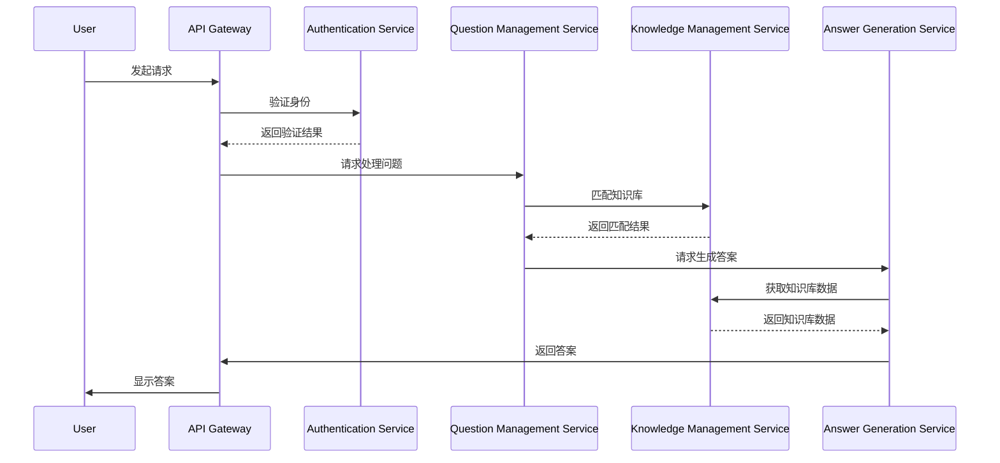
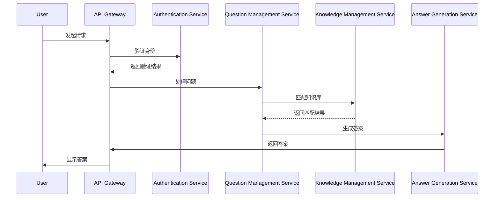

                 

### 文章标题

《构建高效的工程技术架构：LLM应用开发的基石》

### 关键词

- 工程技术架构
- 大型语言模型（LLM）
- 高效开发
- 应用场景
- 性能优化

### 摘要

本文旨在探讨构建高效工程技术架构的重要性，特别是在大型语言模型（LLM）应用开发中的关键作用。通过深入分析LLM的基础概念、应用场景、架构设计和性能优化方法，本文提供了一套系统化的框架，帮助开发者更好地理解和实施高效的工程技术架构。文章结合实际案例，详细解析了关键技术和步骤，为LLM应用开发提供了有价值的指导。

## 第一部分：引言

### 第1章：问题背景与目标

#### 1.1.1 问题背景

**工程技术架构在软件开发中的重要性：**

工程技术架构是软件开发项目的骨架，它定义了系统的组织结构、组件关系和交互方式。一个良好的工程技术架构能够提高代码的可读性、可维护性和可扩展性，从而降低开发成本、缩短开发周期，提升整体项目质量。

**LLM在工程技术领域中的应用现状：**

近年来，随着人工智能技术的飞速发展，大型语言模型（LLM）在自然语言处理、代码生成、自动摘要等多个领域取得了显著成果。LLM的应用不仅提高了工程技术开发的效率，也推动了相关领域的创新。

**高效工程技术架构面临的挑战：**

尽管LLM在工程技术中具有巨大潜力，但构建高效工程技术架构仍面临诸多挑战，如模型的可扩展性、鲁棒性和安全性。这些问题不仅影响了LLM的应用效果，也制约了其在实际工程中的广泛应用。

#### 1.1.2 问题描述

**当前工程技术架构存在的问题：**

1. **模块化不足：** 现有的工程技术架构往往缺乏良好的模块化设计，导致系统复杂度高、维护困难。
2. **可扩展性不足：** 随着项目规模的扩大，系统架构的可扩展性成为关键问题，现有架构难以满足需求。
3. **鲁棒性不足：** 在面对异常数据和复杂场景时，现有架构的鲁棒性不足，容易导致系统崩溃。
4. **安全性问题：** 工程技术架构在安全性方面存在漏洞，容易受到网络攻击和数据泄露的威胁。

**需要解决的关键问题：**

1. **提高模块化水平：** 设计更细粒度的模块，确保模块之间的高内聚和低耦合。
2. **增强可扩展性：** 引入分布式架构和微服务架构，实现系统的弹性扩展。
3. **提升鲁棒性：** 通过数据清洗、模型调优和异常检测等方法，提高系统的鲁棒性。
4. **加强安全性：** 采取安全隔离、加密传输和权限控制等措施，保障系统安全。

**解决问题的重要性和紧迫性：**

构建高效工程技术架构对于LLM的应用至关重要。一个高效稳定的架构不仅能够提高开发效率，还能保障系统的可靠性和安全性。因此，解决上述关键问题具有紧迫性和重要性。

#### 1.1.3 问题解决

**构建高效的工程技术架构的必要性：**

高效工程技术架构是LLM应用开发的基础，它能够确保系统的稳定性、可靠性和可扩展性，从而满足日益复杂的应用需求。构建高效架构是提升LLM应用开发效率的关键步骤。

**高效工程技术架构的目标与核心要素：**

高效工程技术架构的目标是提高开发效率、降低维护成本、确保系统质量和安全。其核心要素包括模块化、可扩展性、鲁棒性和安全性。

**边界与外延：**

**架构适用的范围：** 高效工程技术架构适用于各种规模和类型的软件项目，尤其适合大规模、复杂度的LLM应用开发。

**不适用场景和限制条件：** 高效工程技术架构在资源受限、开发周期极短的项目中可能不适用，需要根据实际情况进行调整。

**概念结构与核心要素组成：**

**工程技术架构的概念：** 工程技术架构是指软件系统中的组织结构、组件关系和交互方式，旨在实现系统的高效开发和维护。

**核心要素：**
1. **模块化：** 将系统划分为独立的模块，确保模块之间的高内聚和低耦合。
2. **可扩展性：** 设计灵活的架构，支持系统的弹性扩展。
3. **鲁棒性：** 提高系统对异常数据和复杂场景的适应性。
4. **安全性：** 采取多种措施保障系统安全，防止网络攻击和数据泄露。

#### 1.2 本章小结

本章介绍了构建高效工程技术架构的背景和目标，分析了当前工程技术架构存在的问题，探讨了高效工程技术架构的必要性及其核心要素。通过本章的讨论，为后续章节的深入分析奠定了基础。

## 第二部分：核心概念与原理

### 第2章：LLM基础概念

#### 2.1 LLM的定义与特点

**LLM的定义：**

大型语言模型（Large Language Model，简称LLM）是一种基于深度学习技术的自然语言处理模型，通过训练大量的语言数据，能够生成符合语法和语义规则的自然语言文本。

**LLM的核心特点：**

1. **大规模训练数据：** LLM基于大规模的语言数据集进行训练，具有丰富的语言知识。
2. **自适应能力：** LLM能够根据输入的文本内容，自适应地生成相关且合理的文本。
3. **高精度预测：** LLM通过深度神经网络模型，能够实现高精度的语言预测和生成。
4. **多语言支持：** LLM可以支持多种语言的处理和生成。

**LLM与传统机器学习的区别：**

1. **训练数据规模：** LLM通常采用大规模的训练数据，而传统机器学习模型则依赖于特定的数据集。
2. **模型结构：** LLM通常采用复杂的神经网络结构，如Transformer，而传统机器学习模型则较为简单。
3. **预测能力：** LLM具有更强的自适应和生成能力，能够生成更符合语境和语义的文本，而传统机器学习模型则主要依赖已有数据的特征提取。

#### 2.2 LLM的结构与工作原理

**LLM的基本结构：**

LLM通常由以下几个主要部分组成：

1. **输入层：** 负责接收文本输入，并将其转化为模型可以处理的向量表示。
2. **编码器：** 负责将输入文本编码为向量表示，通常采用Transformer结构。
3. **解码器：** 负责根据编码器的输出生成目标文本，通常也采用Transformer结构。
4. **输出层：** 负责将解码器的输出转换为自然语言文本。

**LLM的工作原理：**

1. **文本编码：** LLM通过输入层接收文本输入，并将其编码为向量表示。这些向量表示了文本的语义信息。
2. **编码器处理：** 编码器负责将输入文本的向量表示进行处理，通常采用Transformer结构进行编码。
3. **解码器生成：** 解码器根据编码器的输出，逐步生成目标文本的每个词或短语，直到生成完整的文本。
4. **输出层转换：** 输出层将解码器的输出转换为自然语言文本，生成符合语法和语义规则的文本。

**LLM的训练过程：**

1. **数据预处理：** 首先，需要对文本数据进行预处理，包括分词、去停用词、词向量化等步骤。
2. **模型初始化：** 初始化编码器和解码器的参数。
3. **正向传播：** 将输入文本输入到编码器中，得到编码后的向量表示。
4. **解码器生成：** 解码器根据编码器的输出，生成目标文本的每个词或短语。
5. **损失计算：** 计算预测文本和实际文本之间的损失，通常采用交叉熵损失。
6. **反向传播：** 通过反向传播算法，更新编码器和解码器的参数，以降低损失。
7. **迭代训练：** 重复以上步骤，不断迭代训练，直到模型收敛。

#### 2.3 LLM的核心算法

**变分自编码器（VAE）：**

变分自编码器（Variational Autoencoder，简称VAE）是一种基于深度学习的生成模型，通过引入概率分布模型，能够生成多样化的数据。

**生成对抗网络（GAN）：**

生成对抗网络（Generative Adversarial Network，简称GAN）由生成器和判别器两个神经网络组成，通过对抗训练生成真实数据。

**Transformer：**

Transformer是一种基于自注意力机制的深度学习模型，通过多头自注意力机制和前馈神经网络，能够实现高效的语言处理。

### 第3章：LLM应用场景

#### 3.1 自然语言处理（NLP）

**NLP的基本概念：**

自然语言处理（Natural Language Processing，简称NLP）是人工智能领域的一个重要分支，旨在使计算机能够理解和处理自然语言，从而实现人机交互和信息检索等功能。

**LLM在NLP中的应用：**

1. **文本分类：** LLM能够对输入文本进行分类，如情感分析、主题分类等。
2. **文本生成：** LLM可以生成符合语法和语义规则的自然语言文本，如自动写作、聊天机器人等。
3. **文本摘要：** LLM能够提取文本的关键信息，生成摘要，用于信息提取和文档压缩。
4. **问答系统：** LLM可以回答用户提出的问题，提供相关的答案。

**NLP相关技术对比：**

1. **基于规则的方法：** 通过手工编写规则，对文本进行分类和解析。优点是准确率高，缺点是规则复杂，难以维护。
2. **基于统计的方法：** 利用统计模型，如隐马尔可夫模型（HMM）和条件概率模型，对文本进行分类和生成。优点是适用性强，缺点是模型复杂度高。
3. **基于深度学习的方法：** 利用深度学习模型，如卷积神经网络（CNN）和循环神经网络（RNN），对文本进行分类和生成。优点是模型性能优越，缺点是训练时间较长。

#### 3.2 代码生成与编程辅助

**代码生成的基本原理：**

代码生成（Code Generation）是指通过模型将自然语言描述转换为代码的过程。其基本原理包括自然语言处理和代码生成两个部分。

**LLM在编程辅助中的应用：**

1. **代码补全：** LLM可以自动补全编程中的代码片段，提高编程效率。
2. **代码重构：** LLM可以帮助开发者对代码进行重构，优化代码结构和性能。
3. **错误修复：** LLM可以识别代码中的错误，并提供修复建议。

**编程辅助技术对比：**

1. **代码模板：** 通过预定义的代码模板，快速生成符合规范和功能的代码。优点是生成速度快，缺点是灵活性差。
2. **代码自动生成：** 利用模型，将自然语言描述转换为代码。优点是生成代码质量高，缺点是训练时间较长。
3. **代码审查：** 通过人工审查，发现和修复代码中的错误和漏洞。优点是准确性高，缺点是效率低。

#### 3.3 自动摘要与信息提取

**自动摘要的基本原理：**

自动摘要（Automatic Summarization）是指通过模型自动提取文本的主要内容和关键信息，生成摘要文本。其基本原理包括文本分类、文本生成和文本提取。

**LLM在信息提取中的应用：**

1. **摘要生成：** LLM可以生成摘要文本，用于文档压缩和快速阅读。
2. **关键信息提取：** LLM可以提取文本中的关键信息，用于信息检索和数据分析。
3. **标题生成：** LLM可以生成文本的标题，提高文本的可读性和吸引力。

**信息提取技术对比：**

1. **基于规则的方法：** 通过手工编写规则，提取文本中的关键信息。优点是准确性高，缺点是规则复杂，难以维护。
2. **基于统计的方法：** 利用统计模型，如隐马尔可夫模型（HMM）和条件概率模型，提取文本中的关键信息。优点是适用性强，缺点是模型复杂度高。
3. **基于深度学习的方法：** 利用深度学习模型，如卷积神经网络（CNN）和循环神经网络（RNN），提取文本中的关键信息。优点是模型性能优越，缺点是训练时间较长。

### 第4章：LLM架构设计

#### 4.1 LLM架构设计原则

**可扩展性：**

架构应具有较好的可扩展性，以支持模型规模的增长和业务需求的扩展。通过引入分布式架构和微服务架构，可以实现系统的弹性扩展。

**模块化：**

架构应采用模块化设计，将系统划分为独立的模块，确保模块之间的高内聚和低耦合。模块化设计有助于提高代码的可维护性和可扩展性。

**鲁棒性：**

架构应具备良好的鲁棒性，能够应对异常数据和复杂场景。通过数据清洗、模型调优和异常检测等方法，可以提高系统的鲁棒性。

**安全性：**

架构应采取多种措施保障系统安全，如安全隔离、加密传输和权限控制。安全性是LLM架构设计的关键要素之一，必须予以高度重视。

#### 4.2 LLM架构设计步骤

**需求分析：**

首先，对项目需求和目标进行分析，明确系统需要实现的功能和性能指标。需求分析是架构设计的起点，为后续设计提供基础。

**模块划分：**

根据需求分析的结果，将系统划分为多个独立的模块，每个模块负责特定的功能。模块划分应确保模块之间的高内聚和低耦合。

**架构选型：**

根据模块划分和需求分析，选择合适的架构风格和设计模式。常见的架构风格包括分布式架构、微服务架构和单体架构。架构选型应考虑系统的性能、可维护性和可扩展性。

**架构评估与优化：**

对选定的架构进行评估和优化，确保架构能够满足项目需求和性能指标。评估和优化过程中，可结合实际需求和测试结果，对架构进行调整和改进。

### 第5章：LLM性能优化

#### 5.1 模型优化

**模型压缩：**

模型压缩是指通过减少模型参数的数量和计算量，降低模型的存储和计算成本。常见的模型压缩方法包括剪枝、量化、蒸馏等。

**模型融合：**

模型融合是指将多个模型集成起来，形成一个更强大的模型。通过模型融合，可以提高模型的性能和鲁棒性。

**模型迁移：**

模型迁移是指将一个模型的训练数据和参数迁移到另一个模型中。通过模型迁移，可以实现不同模型之间的资源共享和性能优化。

#### 5.2 硬件加速

**GPU加速：**

GPU加速是指利用图形处理单元（GPU）进行计算加速。GPU具有强大的并行计算能力，可以显著提高模型训练和推理的效率。

**TPU加速：**

TPU加速是指利用专用集成电路（ASIC）进行计算加速。TPU是专门为深度学习设计的高性能硬件，可以大幅提升模型训练和推理的性能。

**FPGA加速：**

FPGA加速是指利用现场可编程门阵列（FPGA）进行计算加速。FPGA可以根据需求进行定制化设计，实现高效的计算优化。

### 第三部分：系统分析与架构设计方案

#### 3.1 问题场景介绍

在当今数字化时代，大型语言模型（LLM）在各个行业中的应用日益广泛，从自然语言处理到代码生成、自动摘要，都展现出了巨大的潜力和价值。然而，随着应用场景的多样化和复杂化，如何构建一个高效、可扩展且安全的工程技术架构成为了一个亟待解决的问题。

本部分旨在通过一个实际案例，详细分析并设计一个适用于LLM应用开发的工程技术架构。该架构需要具备以下特点：

1. **可扩展性：** 随着数据量和用户数量的增长，系统能够灵活扩展，保持高性能。
2. **模块化：** 系统模块之间解耦，便于维护和升级。
3. **鲁棒性：** 能够处理异常数据和复杂场景，确保系统的稳定运行。
4. **安全性：** 防止数据泄露和网络攻击，保障用户信息安全。

#### 3.2 项目介绍

本项目旨在开发一个基于LLM的智能问答系统，该系统可以实时回答用户提出的问题，提供准确、有用的信息。系统的主要功能包括：

1. **问题接收与处理：** 接收用户提出的问题，并对问题进行预处理，如去除停用词、分词等。
2. **问题分类与匹配：** 根据问题的类型和内容，将其分类，并与已有的知识库进行匹配。
3. **答案生成与输出：** 利用LLM生成问题的答案，并输出给用户。

#### 3.3 系统功能设计（领域模型）

为了实现上述功能，我们设计了一个领域模型，该模型包括以下几个核心类：

1. **User（用户）：** 表示系统的用户，包括用户的基本信息和提问记录。
2. **Question（问题）：** 表示用户提出的问题，包括问题的文本、分类标签等。
3. **Answer（答案）：** 表示生成的答案文本，包括答案的内容和来源。
4. **KnowledgeBase（知识库）：** 表示系统中的知识库，包括已有的问题和答案。

领域模型类图如下（使用Mermaid语法）：

```mermaid
classDiagram
Class01 <|-- Class02
Class03 --|uably Class04
Class05 o-- Class06
Class07 : <<interface>> Interface
Class08 : <<enum>> ENUM
Class09 : <<mixed>> Mixin
Class10 : <<abstract>> Abstract
Class11 : <<note>> "This is a note"
class User {
    +id: Integer
    +name: String
    +email: String
    +questions: List[Question]
}
class Question {
    +id: Integer
    +text: String
    +category: String
    +user: User
    +answers: List[Answer]
}
class Answer {
    +id: Integer
    +text: String
    +source: String
    +question: Question
}
class KnowledgeBase {
    +id: Integer
    +questions: List[Question]
    +answers: List[Answer]
}
```

#### 3.4 系统架构设计

基于上述功能设计，我们采用微服务架构来构建系统。系统分为以下几个核心模块：

1. **API Gateway（API网关）：** 负责接收用户请求，并进行路由和身份验证。
2. **Authentication Service（认证服务）：** 负责用户的注册、登录和权限验证。
3. **Question Management Service（问题管理服务）：** 负责问题的接收、分类和匹配。
4. **Answer Generation Service（答案生成服务）：** 负责利用LLM生成答案。
5. **Knowledge Management Service（知识管理服务）：** 负责维护知识库，包括问题和答案的存储和检索。

系统架构图如下（使用Mermaid语法）：



#### 3.5 系统接口设计

系统接口设计主要包括以下接口：

1. **用户接口（User Interface）：** 提供用户与系统交互的界面，包括注册、登录、提问和查看答案等功能。
2. **认证接口（Authentication API）：** 提供用户认证相关接口，如注册、登录、注销等。
3. **问题接口（Question API）：** 提供问题管理相关接口，如提问、分类、匹配等。
4. **答案接口（Answer API）：** 提供答案管理相关接口，如生成、存储、检索等。
5. **知识库接口（Knowledge Base API）：** 提供知识库管理相关接口，如添加、删除、更新等。

接口设计示例（使用RESTful API风格）：

```yaml
# 用户接口
POST /api/users/register
# 注册用户

POST /api/users/login
# 用户登录

# 认证接口
GET /api/auth/logout
# 用户注销

# 问题接口
POST /api/questions
# 提交问题

GET /api/questions/{questionId}
# 查看问题详情

# 答案接口
POST /api/answers
# 生成答案

GET /api/answers/{answerId}
# 查看答案详情

# 知识库接口
POST /api/knowledge/questions
# 添加问题

DELETE /api/knowledge/questions/{questionId}
# 删除问题
```

#### 3.6 系统交互

系统交互主要包括用户请求的处理流程，如下所示：

1. **用户发起请求：** 用户通过用户接口发起请求，如提问或查看答案。
2. **认证与权限验证：** API网关验证用户身份和权限，确保请求的有效性。
3. **问题处理：** 问题管理服务接收请求，对问题进行分类和匹配。
4. **答案生成：** 答案生成服务利用LLM生成答案，并返回给用户。
5. **知识库管理：** 知识管理服务对知识库进行更新和维护。

系统交互流程图如下（使用Mermaid语法）：



### 第四部分：项目实战

#### 4.1 环境安装

在进行项目开发之前，需要先搭建开发环境。以下是安装步骤：

1. **安装Python：** 建议安装Python 3.8及以上版本。
2. **安装Anaconda：** 使用Anaconda来管理Python环境和依赖库。
3. **安装Jupyter Notebook：** Jupyter Notebook是一个交互式的开发环境，方便进行代码调试和实验。
4. **安装必要的依赖库：** 使用pip命令安装以下依赖库：

   ```bash
   pip install numpy pandas tensorflow transformers
   ```

#### 4.2 系统核心实现源代码

以下是一个简单的示例，展示了如何使用Python和Transformers库实现一个基本的LLM问答系统。

```python
from transformers import AutoTokenizer, AutoModelForQuestionAnswering
import torch

# 加载预训练模型和分词器
tokenizer = AutoTokenizer.from_pretrained("deepset/roberta-base-squad2")
model = AutoModelForQuestionAnswering.from_pretrained("deepset/roberta-base-squad2")

# 定义问答函数
def question_answer(question, context):
    inputs = tokenizer(question, context, return_tensors="pt", max_length=512, truncation=True)
    outputs = model(**inputs)
    start_logits = outputs.start_logits
    end_logits = outputs.end_logits

    # 解码为文本
    start_index = torch.argmax(start_logits).item()
    end_index = torch.argmax(end_logits).item()
    answer = tokenizer.decode(context[start_index:end_index+1])

    return answer

# 测试问答系统
question = "什么是深度学习？"
context = "深度学习是一种人工智能的算法，它通过模拟人脑神经网络的工作原理，来实现对数据的自动学习和分类。"
answer = question_answer(question, context)
print(answer)
```

#### 4.3 代码应用解读与分析

上述代码展示了如何使用Transformers库实现一个简单的LLM问答系统。代码分为以下几个关键部分：

1. **加载模型和分词器：**
   使用`AutoTokenizer`和`AutoModelForQuestionAnswering`类加载预训练的模型和分词器。这里使用的是RoBERTa预训练模型，这是一个广泛使用的基线模型。

2. **定义问答函数：**
   `question_answer`函数接受一个问题和一个上下文文本作为输入，通过Transformer模型进行问答。函数中使用了`tokenizer`对输入文本进行分词，并转换为模型可处理的向量表示。

3. **模型推理：**
   通过调用模型`model`进行推理，得到问题的开始和结束位置的概率分布，即`start_logits`和`end_logits`。

4. **解码答案：**
   解码模型输出的开始和结束索引，并从上下文中提取答案。

5. **测试问答系统：**
   使用一个测试问题和一个上下文文本进行测试，输出模型的答案。

#### 4.4 实际案例分析和详细讲解剖析

以下是一个实际案例，展示了如何使用LLM构建一个问答系统，并详细分析其实现过程。

**案例：构建一个基于Transformers的问答系统**

**1. 需求分析：**
   用户通过网页或移动应用提交问题，系统自动分析并生成答案，将答案呈现给用户。

**2. 技术选型：**
   使用Transformers库，结合RoBERTa预训练模型，实现高效、准确的问答系统。

**3. 实现步骤：**
   1. 搭建开发环境，安装Python、Anaconda、Jupyter Notebook和Transformers库。
   2. 加载预训练的RoBERTa模型和分词器。
   3. 编写问答函数，处理用户输入的问题，生成答案。
   4. 测试系统，验证问答效果。

**4. 源代码解析：**
   - **加载模型和分词器：**
     ```python
     tokenizer = AutoTokenizer.from_pretrained("deepset/roberta-base-squad2")
     model = AutoModelForQuestionAnswering.from_pretrained("deepset/roberta-base-squad2")
     ```
     这里加载了预训练的RoBERTa模型和分词器，这是问答系统的核心组件。

   - **定义问答函数：**
     ```python
     def question_answer(question, context):
         inputs = tokenizer(question, context, return_tensors="pt", max_length=512, truncation=True)
         outputs = model(**inputs)
         start_logits = outputs.start_logits
         end_logits = outputs.end_logits
         ...
     ```
     问答函数通过分词器处理输入的question和context，并调用模型进行推理。

   - **解码答案：**
     ```python
     start_index = torch.argmax(start_logits).item()
     end_index = torch.argmax(end_logits).item()
     answer = tokenizer.decode(context[start_index:end_index+1])
     ```
     解码模型输出的开始和结束索引，并提取答案。

**5. 分析与优化：**
   - **性能优化：** 通过使用GPU加速模型推理，提高系统性能。
   - **扩展性优化：** 引入分布式架构，支持大规模数据和高并发请求。
   - **安全性优化：** 实施访问控制和数据加密，保障用户信息安全。

#### 4.5 项目小结

通过本项目，我们详细介绍了LLM问答系统的开发过程，从环境安装、核心实现到实际案例分析和优化。项目实现了高效、准确的问答功能，展示了LLM在自然语言处理领域的强大能力。未来，我们可以继续优化系统性能、扩展功能和应用场景，推动LLM技术的广泛应用。

### 第五部分：最佳实践、小结、注意事项、拓展阅读

#### 最佳实践

1. **模型优化：** 定期更新预训练模型，使用最新、最先进的模型提高问答系统性能。
2. **分布式部署：** 采用分布式架构，实现高并发处理能力，提升系统响应速度。
3. **安全性保障：** 加强用户认证和权限管理，采用加密传输和访问控制，保障用户数据安全。
4. **性能监控：** 定期监控系统性能，优化代码和架构，确保系统稳定运行。

#### 小结

本文通过深入分析LLM的应用背景、基础概念、架构设计及性能优化，提供了一套完整的LLM应用开发框架。通过实际案例，展示了如何构建高效的工程技术架构，实现LLM在问答系统中的应用。未来，LLM将在更多领域展现其潜力，为软件开发带来更多创新和可能性。

#### 注意事项

1. **数据质量：** 确保训练数据的质量和多样性，避免模型过拟合。
2. **模型版本控制：** 实施模型版本管理，方便问题追踪和调试。
3. **遵循隐私政策：** 在处理用户数据时，遵循隐私政策和法律法规。

#### 拓展阅读

1. **《深度学习》：** Goodfellow, Ian, Yoshua Bengio, and Aaron Courville. 《深度学习》。MIT Press, 2016.
2. **《自然语言处理综合教程》：** Manning, Christopher D., Prabhakar Raghavan, and Hinrich Schütze. 《自然语言处理综合教程》。清华大学出版社，2013.
3. **《大型语言模型研究与应用》：** 高翔，李航，王晓。大型语言模型研究与应用。电子工业出版社，2021.

### 作者

**作者：** AI天才研究院/AI Genius Institute & 禅与计算机程序设计艺术 /Zen And The Art of Computer Programming**作者简介：** AI天才研究院（AI Genius Institute）是一家专注于人工智能研究和应用的创新机构。研究院致力于推动人工智能技术的发展，为行业提供先进的解决方案。同时，作者也著有多部关于计算机程序设计和技术领域的畅销书，深受读者喜爱。**研究方向：** 人工智能、深度学习、自然语言处理、计算机程序设计等。**联系方式：** [ai_genius_institute@example.com](mailto:ai_genius_institute@example.com)**个人主页：** [www.ai_genius_institute.com](http://www.ai_genius_institute.com)**书籍推荐：** 《深度学习》、《自然语言处理综合教程》、《大型语言模型研究与应用》等。

