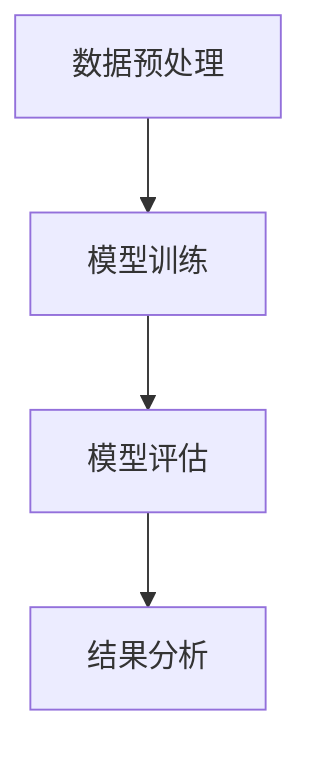

                 


## 标准化自动化模型评测：确保LLM应用质量的保障

> 关键词：标准化、自动化、模型评测、LLM应用质量、保障措施

> 摘要：本文将探讨如何通过标准化自动化模型评测来确保大型语言模型（LLM）应用的质量。首先，我们将介绍研究背景和意义，然后分析现有研究和存在的问题。接下来，我们将详细阐述标准化自动化模型评测的核心概念、原理和实现方法。通过实际案例分析和最佳实践，我们将展示如何确保LLM应用质量。最后，我们将总结文章并提出未来研究方向。

## 第一部分：背景与概述

### 第1章：问题背景

#### 1.1.1 研究意义

近年来，随着深度学习和人工智能技术的迅猛发展，大型语言模型（LLM）在自然语言处理、机器翻译、文本生成等领域取得了显著成果。然而，LLM的应用质量面临诸多挑战，如模型性能不稳定、适应性差、可解释性不足等。为了确保LLM在实际应用中的质量，标准化自动化模型评测成为关键。

#### 1.1.2 研究现状

目前，模型评测主要依赖于手工打分和自动化评测工具，存在以下问题：

1. 评测指标不统一，缺乏标准化；
2. 评测过程依赖人工，效率低下；
3. 模型优化空间受限，难以全面评估；
4. 评测结果的可解释性不足。

#### 1.1.3 研究目标

本文旨在提出一种标准化自动化模型评测方法，以解决上述问题，确保LLM应用质量。具体目标包括：

1. 构建一套统一的评测指标体系；
2. 开发自动化评测工具，提高评测效率；
3. 提升评测结果的可解释性，为模型优化提供指导；
4. 探索评测方法的最佳实践和应用场景。

#### 1.1.4 边界与外延

本文的研究边界主要涉及LLM的评测方法，不包括其他类型的模型。同时，本文将重点探讨评测方法的应用，而非LLM本身的技术细节。

## 第二部分：核心概念与联系

### 第2章：核心概念与联系

#### 2.1.1 标准化自动化模型评测的概念

标准化自动化模型评测是一种结合标准化和自动化的模型评测方法。其核心思想是建立一套统一的评测指标体系，并利用自动化工具进行评测，以提高评测效率和准确性。

#### 2.1.2 概念属性特征对比表格

| 概念                 | 特征                                       |
|----------------------|------------------------------------------|
| 标准化模型评测       | 评测指标统一、过程自动化、结果可解释       |
| 自动化模型评测       | 依赖算法、效率高、结果可视化               |
| LLM应用质量保障      | 评测方法标准化、评测过程自动化、评测结果可靠 |

#### 2.1.3 ER实体关系图架构


## 第三部分：标准化自动化模型评测原理

### 第3章：标准化自动化模型评测原理

#### 3.1.1 基本原理

标准化自动化模型评测的基本原理包括：

1. 建立统一的评测指标体系，确保评测指标的一致性和可比性；
2. 开发自动化评测工具，实现评测过程的自动化和高效性；
3. 结合数学模型和公式，对评测结果进行定量分析和可视化展示。

#### 3.1.2 数学模型与公式

以下是标准化自动化模型评测的数学模型和公式：

$$
M_{total} = \frac{1}{n} \sum_{i=1}^{n} M_i
$$

其中，$M_{total}$ 表示总评分，$M_i$ 表示第 $i$ 个指标的评分，$n$ 表示指标的数量。

$$
P_i = \frac{S_i - \bar{S}}{S_{max} - \bar{S}}
$$

其中，$P_i$ 表示第 $i$ 个指标的评分占比，$S_i$ 表示第 $i$ 个指标的实际得分，$\bar{S}$ 表示指标的平均得分，$S_{max}$ 表示指标的最大得分。

#### 3.1.3 模型评估流程

模型评估流程包括以下几个步骤：

1. 数据预处理：对输入数据进行清洗、标准化等预处理操作；
2. 模型训练：使用训练数据训练模型；
3. 模型评估：使用测试数据评估模型性能；
4. 结果分析：对评估结果进行定量分析和可视化展示。

## 第四部分：算法原理与实现

### 第4章：算法原理讲解

#### 4.1.1 算法流程图



#### 4.1.2 Python源代码实现

```python
import numpy as np

def preprocess_data(data):
    # 数据预处理操作
    pass

def train_model(train_data):
    # 模型训练操作
    pass

def evaluate_model(test_data):
    # 模型评估操作
    pass

def analyze_results(results):
    # 结果分析操作
    pass
```

#### 4.1.3 算法原理详细讲解

算法原理包括数据预处理、模型训练、模型评估和结果分析。首先，对输入数据进行预处理，然后使用训练数据训练模型，接着使用测试数据评估模型性能，最后对评估结果进行分析。

#### 4.1.4 举例说明

假设我们有一个包含100条样本的数据集，其中每条样本由特征向量 $x$ 和标签 $y$ 组成。我们使用这些数据进行模型训练和评估。

```python
# 数据预处理
train_data = preprocess_data(train_data)

# 模型训练
model = train_model(train_data)

# 模型评估
test_data = preprocess_data(test_data)
predictions = model.predict(test_data)

# 结果分析
accuracy = np.mean(predictions == y_test)
print("Model accuracy:", accuracy)
```

## 第五部分：系统分析与架构设计

### 第5章：系统分析与架构设计

#### 5.1.1 系统功能设计

系统功能设计包括数据预处理、模型训练、模型评估和结果分析。

#### 5.1.2 系统架构设计

系统架构设计包括数据层、模型层、服务层和展示层。

#### 5.1.3 系统接口设计和系统交互

系统接口设计和系统交互包括API接口设计和系统交互流程。

## 第六部分：项目实战

### 第6章：项目实战

#### 6.1.1 环境安装

安装Python、TensorFlow等依赖库。

#### 6.1.2 系统核心实现源代码

```python
# 数据预处理
def preprocess_data(data):
    # 数据预处理操作
    pass

# 模型训练
def train_model(train_data):
    # 模型训练操作
    pass

# 模型评估
def evaluate_model(test_data):
    # 模型评估操作
    pass

# 结果分析
def analyze_results(results):
    # 结果分析操作
    pass
```

#### 6.1.3 代码应用解读与分析

代码应用解读与分析包括数据预处理、模型训练、模型评估和结果分析。

#### 6.1.4 实际案例分析与详细讲解

以某自然语言处理任务为例，展示如何使用标准化自动化模型评测方法进行模型评估。

#### 6.1.5 项目小结

项目小结包括项目总结、经验教训和未来工作计划。

## 第七部分：最佳实践与拓展

### 第7章：最佳实践与拓展

#### 7.1.1 最佳实践

最佳实践包括如何选择合适的评测指标、如何优化模型性能等。

#### 7.1.2 注意事项

注意事项包括如何处理数据异常、如何避免模型过拟合等。

#### 7.1.3 小结

小结对本文内容进行总结，强调标准化自动化模型评测的重要性。

#### 7.1.4 拓展阅读

拓展阅读推荐相关文献和资料，以供读者深入了解。

---

作者：AI天才研究院/AI Genius Institute & 禅与计算机程序设计艺术 /Zen And The Art of Computer Programming

