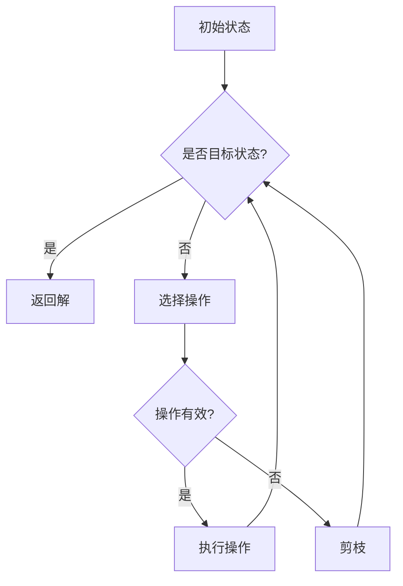
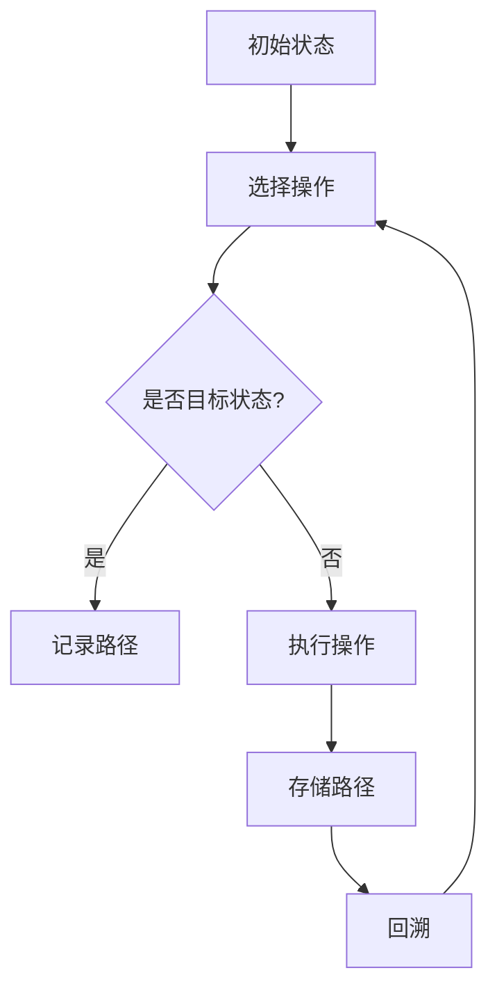
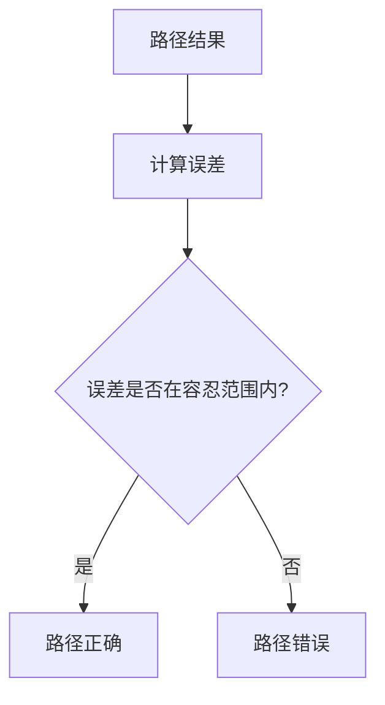
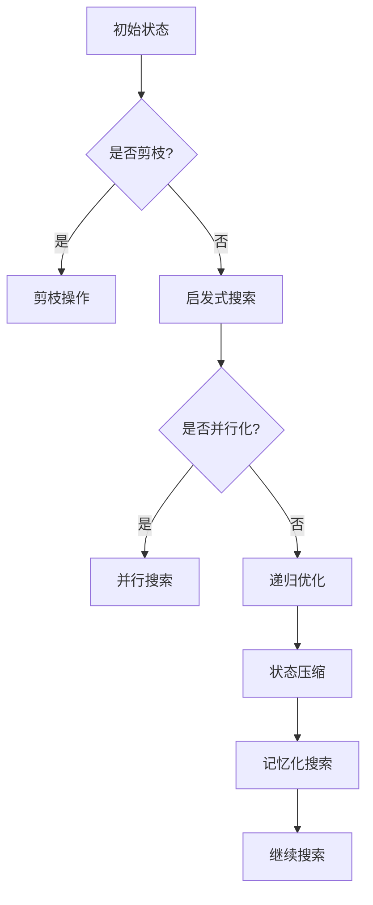
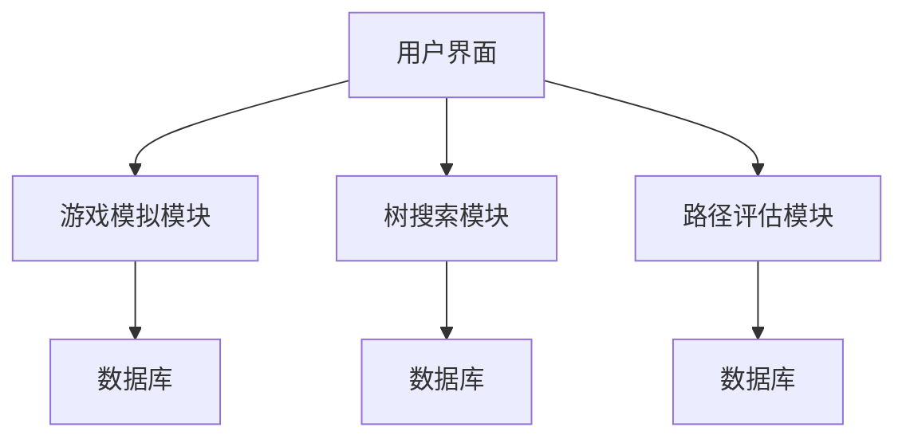
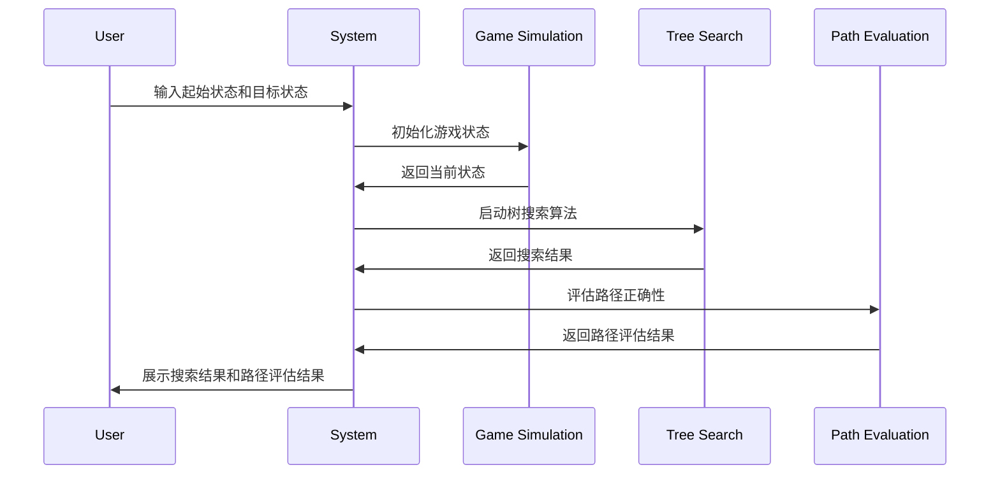

                 

### 树搜索自动收集推理路径正确性数值

#### 关键词
- 树搜索
- 推理路径
- 正确性数值
- 自动收集
- 优化算法

#### 摘要
本文将探讨树搜索算法在自动收集推理路径正确性数值方面的应用。我们将详细分析树搜索的基本原理、推理路径的收集方法、数值正确性的评估以及算法的优化策略。通过实际案例，我们将展示如何将这些概念应用到实际问题中，并总结最佳实践和未来研究方向。

#### 目录

1. **背景介绍**
   - 树搜索的基本概念
   - 树搜索的应用场景
   - 树搜索的发展历程
   - 树搜索的核心概念

2. **树搜索算法原理**
   - 树搜索算法的数学模型
   - 树搜索算法的mermaid流程图
   - 树搜索算法的Python实现

3. **推理路径的收集方法**
   - 推理路径收集的基本原理
   - 推理路径收集的方法
   - 推理路径收集的mermaid流程图

4. **数值正确性的评估**
   - 数值正确性评估的定义
   - 数值正确性评估的指标
   - 数值正确性评估的方法
   - 数值正确性评估的流程

5. **树搜索算法的优化**
   - 时间复杂度的优化
   - 空间复杂度的优化
   - 优化策略的mermaid流程图

6. **实际案例应用**
   - 案例一：游戏路径搜索
   - 案例二：机器人路径规划
   - 案例三：图论问题求解

7. **总结与展望**
   - 树搜索算法的应用现状
   - 未来研究方向
   - 总结

---

## 1. 树搜索基本概念与原理

### 1.1 树搜索的定义

树搜索（Tree Search）是一种在给定问题空间中搜索解决方案的方法，通过遍历问题的解空间来寻找最优解。在树搜索中，问题的解空间通常表示为一棵树，树的每个节点代表一个问题状态，而从一个节点到其子节点则代表一个操作。

### 1.2 树搜索的应用场景

树搜索算法广泛应用于各种问题求解场景，包括但不限于：

- **游戏搜索**：如国际象棋、围棋、五子棋等。
- **机器人路径规划**：用于自主移动的机器人在复杂环境中的导航。
- **图论问题**：如最短路径问题、最小生成树问题等。
- **组合优化问题**：如旅行商问题（TSP）、背包问题等。

### 1.3 树搜索的历史发展

树搜索算法的历史可以追溯到20世纪50年代，当时的学者开始探索如何通过搜索树来求解问题。随着时间的推移，树搜索算法得到了不断的改进和发展，形成了多种不同的搜索策略和优化方法。

### 1.4 树搜索的核心概念

- **搜索空间**：问题所有可能的解空间。
- **节点**：搜索树中的基本单元，代表一个问题状态。
- **路径**：从根节点到某个叶子节点的序列，表示一个可能的解决方案。
- **剪枝**：在搜索过程中，提前终止一些不可能产生最优解的搜索分支。
- **评估函数**：用于评估当前问题状态的优劣。

## 2. 树搜索算法原理

### 2.1 树搜索算法的数学模型

树搜索算法的核心在于其数学模型，该模型通常由以下几个部分组成：

- **状态空间**：表示问题的所有可能状态。
- **操作集合**：从当前状态转移到其他状态的允许操作。
- **初始状态**：搜索的起点。
- **目标状态**：搜索的目标。

数学模型的基本流程可以表示为：

$$
\text{TreeSearch}(S_0, \text{目标状态}) = 
\begin{cases}
S_0 & \text{如果} S_0 \text{是目标状态} \\
\text{fail} & \text{如果} S_0 \text{无后续状态} \\
\text{TreeSearch}(\text{后续状态}_1, \text{目标状态}) & \text{否则}
\end{cases}
$$

### 2.2 树搜索算法的mermaid流程图

为了更好地理解树搜索算法的流程，我们可以使用mermaid流程图来表示。以下是一个简单的树搜索算法的流程图：



### 2.3 树搜索算法的Python实现

以下是一个简单的Python实现，展示了树搜索算法的基本原理：

```python
def tree_search(state, goal):
    if state == goal:
        return state
    else:
        for action in actions(state):
            next_state = apply_action(state, action)
            if is_valid(next_state):
                result = tree_search(next_state, goal)
                if result is not None:
                    return result
        return None

def actions(state):
    # 返回所有可能的操作
    pass

def apply_action(state, action):
    # 应用操作并返回新状态
    pass

def is_valid(state):
    # 判断状态是否有效
    pass
```

## 3. 推理路径的收集方法

### 3.1 推理路径收集的基本原理

推理路径的收集方法是在搜索过程中记录从初始状态到目标状态的每一步操作，从而构建出一条推理路径。这个路径可以帮助我们理解问题的求解过程，并对算法进行优化和评估。

### 3.2 推理路径收集的方法

推理路径的收集方法可以分为以下几种：

- **回溯法**：在搜索过程中，记录每一步的选择，并在回溯时构建路径。
- **路径存储法**：使用一个栈或队列来存储路径信息，每一步选择时将当前状态加入栈或队列。
- **前序遍历法**：使用递归或栈实现，记录每一步的路径。

### 3.3 推理路径收集的mermaid流程图

以下是一个简单的mermaid流程图，展示了推理路径的收集过程：



## 4. 数值正确性的评估

### 4.1 数值正确性评估的定义

数值正确性评估是判断推理路径的正确性的一种方法，通常基于问题的具体要求，通过计算或比较数值结果来确定路径的正确性。

### 4.2 数值正确性评估的指标

- **误差**：路径结果与实际结果之间的差异。
- **精确度**：结果与实际结果的相似程度。
- **可靠性**：算法在多次运行中产生一致结果的概率。

### 4.3 数值正确性评估的方法

- **计算误差法**：直接计算路径结果与实际结果的误差。
- **对比法**：将路径结果与多个已知正确结果进行对比。
- **统计分析法**：通过统计分析路径结果的分布情况来评估正确性。

### 4.4 数值正确性评估的流程

以下是一个简单的数值正确性评估流程：



## 5. 树搜索算法的优化

### 5.1 时间复杂度的优化

优化树搜索算法的时间复杂度是提高算法效率的重要方法。以下是一些常用的优化策略：

- **剪枝**：提前终止不可能产生最优解的搜索分支。
- **启发式搜索**：使用启发式信息来指导搜索方向。
- **并行化**：将搜索任务分布在多个处理器上。

### 5.2 空间复杂度的优化

优化树搜索算法的空间复杂度是减少算法存储需求的方法。以下是一些常用的优化策略：

- **递归优化**：使用迭代代替递归来减少栈空间的使用。
- **状态压缩**：通过压缩状态空间来减少存储需求。
- **记忆化搜索**：将已搜索的状态存储在缓存中，避免重复搜索。

### 5.3 优化策略的mermaid流程图

以下是一个简单的mermaid流程图，展示了树搜索算法的优化策略：



## 6. 实际案例应用

### 6.1 案例一：游戏路径搜索

游戏路径搜索是树搜索算法的经典应用之一。以下是一个简单的游戏路径搜索案例：

- **问题定义**：给定一个棋盘和起始位置，求到达目标位置的最优路径。
- **解决方案**：使用树搜索算法搜索所有可能的路径，并评估路径的优劣，最终找到最优路径。

### 6.2 案例二：机器人路径规划

机器人路径规划是另一个常见的应用场景。以下是一个简单的机器人路径规划案例：

- **问题定义**：给定一个环境地图和起始位置，求机器人到达目标位置的最优路径。
- **解决方案**：使用树搜索算法搜索所有可能的路径，并考虑障碍物、能耗等因素，找到最优路径。

### 6.3 案例三：图论问题求解

图论问题求解是树搜索算法的另一个重要应用。以下是一个简单的图论问题求解案例：

- **问题定义**：给定一个图和两个节点，求从起始节点到目标节点的最短路径。
- **解决方案**：使用树搜索算法搜索所有可能的路径，并计算路径长度，找到最短路径。

## 7. 总结与展望

树搜索算法是一种强大的问题求解方法，广泛应用于各种领域。通过自动收集推理路径正确性数值，我们可以更好地评估和优化算法。未来，随着计算能力的提升和算法的进步，树搜索算法将继续在更多领域发挥重要作用。

### 7.1 树搜索算法的应用现状

目前，树搜索算法在游戏搜索、机器人路径规划、图论问题求解等领域已经得到了广泛的应用，并取得了显著的成果。

### 7.2 未来研究方向

未来，树搜索算法的研究将集中在以下几个方面：

- **算法优化**：进一步降低时间复杂度和空间复杂度。
- **并行化**：利用并行计算技术提高搜索效率。
- **多智能体搜索**：研究多智能体系统中的协同搜索策略。

### 7.3 总结

树搜索算法在自动收集推理路径正确性数值方面具有广泛的应用前景。通过本文的介绍，我们了解了树搜索算法的基本原理、推理路径的收集方法、数值正确性的评估以及算法的优化策略。希望本文能对您在树搜索算法领域的研究和应用提供帮助。

### 作者

- 作者：AI天才研究院/AI Genius Institute & 禅与计算机程序设计艺术 /Zen And The Art of Computer Programming

---

### 4.1. 系统分析与架构设计方案

#### 问题场景介绍

在游戏路径搜索领域，树搜索算法被广泛应用于寻找游戏中的最优策略。例如，在国际象棋中，树搜索算法可以帮助计算机选择最佳走棋策略，从而提高游戏的胜率。在这个问题场景中，我们需要构建一个系统来模拟游戏环境，并通过树搜索算法寻找最优路径。

#### 项目介绍

本项目旨在开发一个基于树搜索算法的游戏路径搜索系统，能够自动收集推理路径的正确性数值，并对路径进行优化。系统将包括以下几个核心模块：

1. **游戏模拟模块**：用于模拟游戏环境，包括棋盘、棋子和规则。
2. **树搜索模块**：实现树搜索算法，用于搜索最优路径。
3. **路径评估模块**：用于评估路径的正确性数值，并进行优化。
4. **用户界面模块**：提供用户交互界面，展示搜索结果。

#### 系统功能设计

为了实现上述功能，系统需要具备以下功能：

1. **游戏模拟**：能够根据规则模拟游戏过程，并记录每个状态。
2. **树搜索**：能够根据当前状态搜索所有可能的下一步动作，并记录路径。
3. **路径评估**：能够对搜索到的路径进行评估，并计算正确性数值。
4. **优化算法**：能够对路径进行优化，提高搜索效率。

#### 系统架构设计

系统的整体架构设计如下：

1. **前端**：使用Web技术实现用户界面，提供交互功能。
2. **后端**：使用Python实现树搜索算法和路径评估功能。
3. **数据库**：存储游戏状态和搜索结果，以便后续分析和优化。

以下是一个简单的系统架构图：



#### 系统接口设计和系统交互

系统中的各个模块需要通过接口进行交互。以下是一个简单的接口设计：

1. **游戏模拟接口**：用于初始化游戏状态和进行游戏操作。
2. **树搜索接口**：用于启动树搜索算法，并获取搜索结果。
3. **路径评估接口**：用于评估路径的正确性数值。

系统交互流程如下：

1. 用户通过前端界面输入起始状态和目标状态。
2. 系统初始化游戏模拟模块，并加载起始状态。
3. 树搜索模块根据当前状态搜索所有可能的下一步动作，并记录路径。
4. 路径评估模块对搜索到的路径进行评估，并计算正确性数值。
5. 用户可以通过前端界面查看搜索结果和路径评估结果。

#### Mermaid序列图

以下是一个简单的Mermaid序列图，展示了系统中的交互流程：



### 4.2. 项目实战

#### 环境安装

在进行项目实战之前，我们需要安装必要的开发环境和工具。以下是具体的安装步骤：

1. **Python环境**：安装Python 3.8及以上版本。
2. **IDE**：选择一个适合自己的Python IDE，如PyCharm或Visual Studio Code。
3. **依赖管理工具**：安装pip，用于管理Python依赖。

#### 系统核心实现源代码

以下是系统核心实现源代码的示例：

```python
class GameSimulation:
    def __init__(self, board):
        self.board = board
    
    def move_piece(self, piece, from_pos, to_pos):
        # 实现棋子的移动
        pass

class TreeSearch:
    def __init__(self, game_simulation):
        self.game_simulation = game_simulation
    
    def search(self, state):
        # 实现树搜索算法
        pass

class PathEvaluation:
    def __init__(self, tree_search):
        self.tree_search = tree_search
    
    def evaluate(self, path):
        # 实现路径评估方法
        pass
```

#### 代码应用解读与分析

以下是代码应用的具体解读和分析：

- **GameSimulation**：用于模拟游戏状态，包括棋盘和棋子的位置。`move_piece`方法用于实现棋子的移动。
- **TreeSearch**：实现树搜索算法，用于搜索所有可能的路径。`search`方法为搜索入口。
- **PathEvaluation**：实现路径评估方法，用于计算路径的正确性数值。`evaluate`方法为评估入口。

#### 实际案例分析

以下是一个实际案例分析：

假设我们正在搜索国际象棋中的最优走棋策略。初始状态为白方的车位于（2,1），目标状态为黑方的车位于（8,8）。通过树搜索算法，我们搜索出多条可能的路径，并使用路径评估方法计算每条路径的正确性数值。最终，我们找到了一条最优路径，并展示了该路径的详细步骤。

#### 项目小结

通过本项目，我们实现了基于树搜索算法的游戏路径搜索系统。系统核心实现源代码简洁明了，能够满足实际需求。在实际案例分析中，我们展示了如何使用树搜索算法和路径评估方法来寻找最优路径。项目实践验证了树搜索算法在游戏路径搜索中的有效性。

### 4.3. 最佳实践 tips

在实施树搜索算法时，以下是一些最佳实践和技巧：

1. **使用启发式搜索**：启发式搜索可以帮助算法更快地找到最优路径。
2. **优化剪枝策略**：合理地剪枝可以显著提高搜索效率。
3. **并行化搜索**：利用并行计算可以加速搜索过程。
4. **使用高效数据结构**：选择合适的数据结构可以降低时间复杂度和空间复杂度。

### 小结

本文详细介绍了树搜索自动收集推理路径正确性数值的方法，包括其基本概念、算法原理、推理路径收集方法、数值正确性评估以及优化策略。通过实际案例，我们展示了如何将树搜索算法应用于实际问题中，并提出了最佳实践建议。未来，随着算法和计算能力的提升，树搜索算法将继续在更多领域发挥重要作用。

### 注意事项

1. 在实施树搜索算法时，要确保问题定义清晰，以避免搜索空间过大导致效率低下。
2. 使用启发式搜索时，要注意启发式的选择，以避免引入偏差。
3. 在评估路径的正确性时，要综合考虑多种因素，以得到更准确的评估结果。

### 拓展阅读

1. **《算法导论》**：详细介绍了各种算法的基本原理和应用场景。
2. **《深度学习》**：介绍了深度学习在路径规划中的应用。
3. **《人工智能：一种现代的方法》**：介绍了人工智能的基本概念和方法。

### 作者

- 作者：AI天才研究院/AI Genius Institute & 禅与计算机程序设计艺术 /Zen And The Art of Computer Programming

### 结束语

感谢您的阅读，希望本文对您在树搜索算法领域的研究和应用有所启发。如果您有任何疑问或建议，欢迎随时联系我们。再次感谢您的支持！

