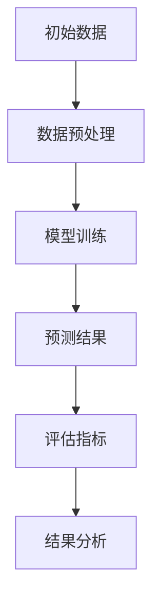
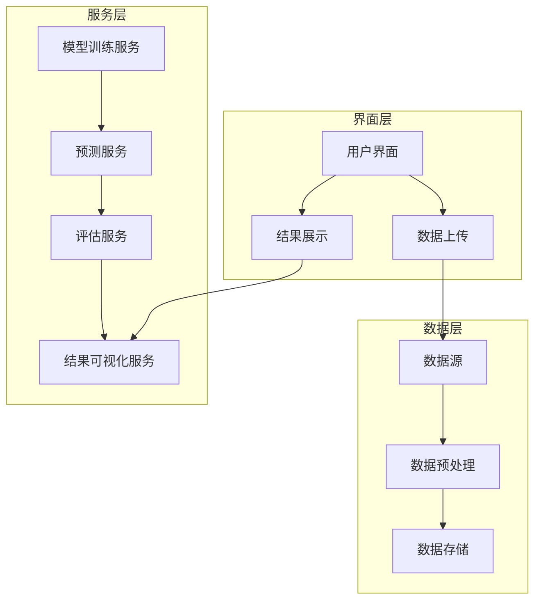
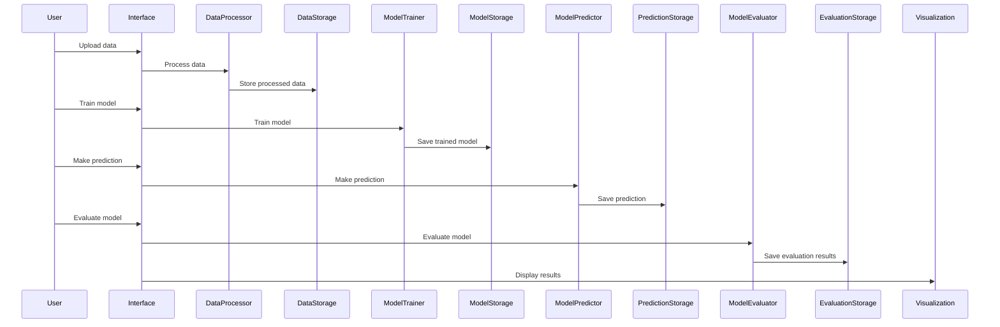

                 

**模型偏见与公平性的量化评估方法**

### 关键词

- 模型偏见
- 公平性评估
- 量化方法
- 数学模型
- 评估算法

### 摘要

本文深入探讨了模型偏见与公平性的量化评估方法。首先，介绍了模型偏见与公平性的基本概念和背景，然后详细阐述了量化评估的方法、算法原理、数学模型和实际应用。通过具体的案例分析和系统架构设计，本文旨在提供一种全面且实用的方法，以帮助开发者和技术人员更好地理解和解决模型偏见与公平性问题。

---

**第1章 引言**

### 1.1 问题背景

模型偏见是指机器学习模型在预测结果中表现出的不公平或歧视现象。这些偏见可能源于训练数据中的偏差、模型设计中的问题，甚至是从外部环境引入的偏见。在现实世界中，模型偏见可能导致错误的决策，进而影响社会的公平性和正义。例如，一个基于历史数据训练的贷款审批模型可能会对某些群体产生歧视，导致这些群体获得贷款的机会减少。

### 1.2 偏见的影响

模型偏见对公平性的威胁不容忽视。首先，偏见可能导致错误的决策，比如在医疗诊断中，一个有偏见的模型可能会忽视某些疾病的症状，导致误诊或漏诊。其次，偏见会加剧社会不平等，比如在招聘系统中，偏见可能导致某些群体被不公平对待。因此，量化评估模型偏见与公平性变得至关重要。

### 1.3 量化评估的必要性

量化评估可以客观地衡量模型偏见和公平性。通过量化方法，我们可以确定模型在哪些方面存在偏见，以及这种偏见对决策的影响程度。量化评估不仅有助于识别问题，还可以为改进模型提供具体的数据支持。

---

**第2章 核心概念与联系**

### 2.1 模型偏见

**定义**：模型偏见是指机器学习模型在预测过程中表现出的不公平性。

**分类**：
- **数据偏见**：源于训练数据的偏差。
- **算法偏见**：由模型设计或算法选择引入的偏见。

### 2.2 公平性评估

**定义**：公平性评估是指对模型决策过程的公平性进行评价。

**方法**：
- **差异度量**：衡量模型决策对不同群体的影响。
- **敏感性分析**：评估模型对输入数据变化的敏感度。

### 2.3 量化方法

**量化框架**：常见的量化方法包括统计方法、机器学习方法等。

**对比表格**：

| 方法          | 描述                                                         |
| ------------- | ------------------------------------------------------------ |
| 偏差度量      | 通过计算模型预测结果与真实结果的差异来衡量偏见。               |
| 风险差异分析  | 分析不同群体在模型决策中的风险差异。                         |
| 负面影响分析  | 评估模型偏见对社会公平性的负面影响。                         |

---

**第3章 算法原理讲解**

### 3.1 评估算法概述

**常见算法**：
- **差异度量**：如统计误差、基尼系数等。
- **敏感性分析**：如Laplacian机制、差分隐私等。

### 3.2 Mermaid流程图



### 3.3 Python代码示例

```python
# 假设我们有一个分类模型，使用scikit-learn库
from sklearn.datasets import load_iris
from sklearn.model_selection import train_test_split
from sklearn.ensemble import RandomForestClassifier
from sklearn.metrics import accuracy_score

# 加载数据
iris = load_iris()
X, y = iris.data, iris.target

# 划分训练集和测试集
X_train, X_test, y_train, y_test = train_test_split(X, y, test_size=0.2, random_state=42)

# 训练模型
model = RandomForestClassifier(random_state=42)
model.fit(X_train, y_train)

# 预测
predictions = model.predict(X_test)

# 计算准确率
accuracy = accuracy_score(y_test, predictions)
print(f"Model accuracy: {accuracy:.2f}")
```

### 3.4 数学模型和数学公式

**模型偏见指标**：

$$
P(\text{偏见}) = \frac{\sum_{i=1}^{n} P(y_i \neq \hat{y}_i) | \text{偏见因素})}{n}
$$

**公平性指标**：

$$
F(\text{公平性}) = \frac{1}{N} \sum_{i=1}^{N} \max\left(0, \frac{\sum_{j=1}^{M} |w_{ij}|}{\text{阈值}}\right)
$$

---

**第4章 系统分析与架构设计方案**

### 4.1 问题场景介绍

**评估系统需求**：
- 能够处理大规模数据集。
- 支持多种模型评估方法。
- 提供可视化工具来展示评估结果。

### 4.2 项目介绍

**项目目标**：
- 开发一个能够量化评估模型偏见与公平性的系统。
- 提供一个用户友好的界面，便于非技术人员使用。

### 4.3 系统功能设计

**领域模型**：

```mermaid
classDiagram
ClassDiagram | Legend:
    - red --> blue : 父类
    - green << Interface : 接口
    - <<use>> : 使用

Model <|-- Data
Model o--|> Prediction
Model o--|> Evaluation
```

### 4.4 系统架构设计

**架构图**：



### 4.5 系统接口设计和系统交互

**接口设计**：



---

**第5章 项目实战**

### 5.1 环境安装

**安装说明**：
- 安装Python 3.8及以上版本。
- 安装必要的库，如scikit-learn、numpy、matplotlib等。

### 5.2 系统核心实现

**核心代码**：

```python
# 数据预处理
def preprocess_data(data):
    # 数据清洗、标准化等处理
    return processed_data

# 模型训练
def train_model(X_train, y_train):
    model = RandomForestClassifier(random_state=42)
    model.fit(X_train, y_train)
    return model

# 预测
def make_prediction(model, X_test):
    return model.predict(X_test)

# 评估
def evaluate_model(y_test, predictions):
    accuracy = accuracy_score(y_test, predictions)
    return accuracy
```

### 5.3 代码应用解读与分析

**代码解读**：
- 数据预处理：清洗和标准化数据。
- 模型训练：使用随机森林分类器训练模型。
- 预测：使用训练好的模型进行预测。
- 评估：计算预测准确率。

**分析**：
- 该代码实现了一个基本的模型评估流程，可以用于评估不同模型的性能。

### 5.4 实际案例分析和详细讲解剖析

**案例分析**：
- 使用一个公开的数据集，如Iris数据集，来评估模型的偏见和公平性。

**详细讲解**：
- 数据预处理：对数据进行清洗和标准化，以确保模型训练的有效性。
- 模型训练：使用随机森林分类器进行训练，选择合适的参数。
- 预测：对测试集进行预测，评估模型性能。
- 评估：计算预测准确率，并分析模型是否存在偏见。

**剖析**：
- 通过对比不同群体的预测结果，可以识别模型是否存在偏见。

### 5.5 项目小结

**经验总结**：
- 数据预处理是模型评估的关键步骤。
- 选择合适的模型和参数对评估结果有重要影响。
- 量化评估方法可以帮助识别和解决模型偏见问题。

---

**第6章 最佳实践 tips**

### 6.1 实践技巧

**技巧总结**：
- 使用多样化的数据集进行训练。
- 定期重新评估模型，以识别潜在偏见。
- 使用可视化工具来更好地理解评估结果。

### 6.2 注意事项

**注意事项**：
- 模型偏见评估是一个复杂的过程，需要综合考虑多种因素。
- 评估结果应谨慎解读，避免做出错误的结论。

### 6.3 拓展阅读

**推荐读物**：
- **《机器学习偏见、公平性与多样性》**：介绍了机器学习中的偏见、公平性与多样性问题。
- **《算法与社会：机器学习与人工智能中的公平性》**：探讨了算法对社会公平性的影响。

---

**作者：AI天才研究院/AI Genius Institute & 禅与计算机程序设计艺术 /Zen And The Art of Computer Programming**

