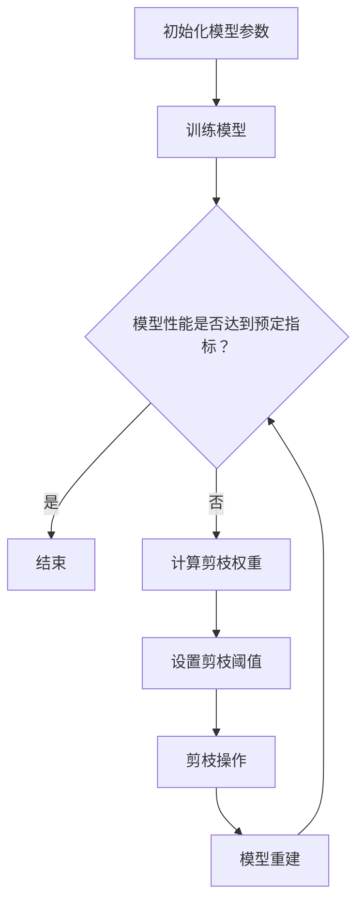
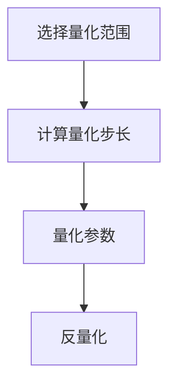
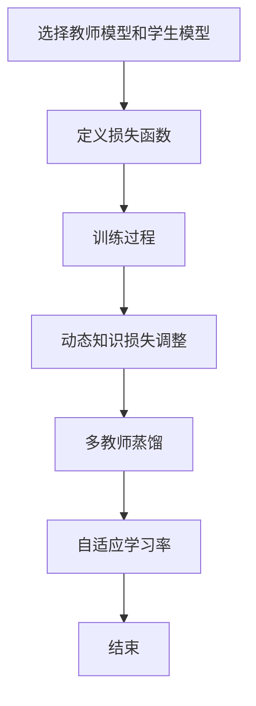

                 

### 第1章：问题背景与概述

#### 1.1 人工智能与模型压缩技术简介

**人工智能简介**

人工智能（Artificial Intelligence，简称AI）是指计算机系统通过模拟人类智能行为，实现感知、思考、学习和决策的能力。人工智能的概念最早可以追溯到1956年达特茅斯会议上，当时几位计算机科学先驱提出了“人工智能”这一概念。随着计算能力的提升和大数据技术的发展，人工智能得到了飞速的发展。

人工智能的核心技术包括：

- **机器学习**：通过数据驱动的方式，让计算机自动识别模式、发现规律，并用于预测和决策。
- **深度学习**：一种基于人工神经网络的机器学习技术，通过多层神经网络对大量数据进行训练，从而实现复杂的特征提取和模式识别。
- **自然语言处理**：使计算机能够理解和生成人类语言，包括语音识别、机器翻译、情感分析等。
- **计算机视觉**：使计算机能够理解和处理图像和视频，包括图像分类、目标检测、图像生成等。

人工智能的应用领域广泛，涵盖了医疗、金融、教育、交通、娱乐等多个方面，极大地提升了生产力和社会效率。

**模型压缩技术简介**

模型压缩技术是指通过各种方法对深度学习模型进行压缩，以减少模型的参数数量和计算量，从而提高推理效率、降低部署成本。随着人工智能的快速发展，大量的深度学习模型被提出并应用于各个领域。然而，这些模型往往需要庞大的计算资源和存储空间，特别是在移动设备和嵌入式系统中，成为了一个亟待解决的问题。

模型压缩技术主要包括以下几种方法：

- **剪枝**：通过删除模型中不重要的参数或神经元，减少模型的规模和计算量。
- **量化**：将模型的参数从浮点数转换为较低精度的数值，从而减少模型的存储和计算需求。
- **知识蒸馏**：通过将大型模型的知识传递给小型模型，实现模型的压缩和优化。

模型压缩技术在提高推理效率和降低部署成本的同时，也保持了较高的模型性能，成为人工智能领域的一个重要研究方向。

#### 1.2 模型压缩技术的必要性

**大模型时代的挑战**

随着深度学习技术的不断发展，越来越多的复杂模型被提出并应用于各个领域。这些大型模型通常拥有数百万甚至数亿个参数，需要庞大的计算资源和存储空间。然而，随着人工智能应用的普及，特别是在移动设备和嵌入式系统中，计算资源和存储空间的限制成为一个严峻的挑战。

- **计算资源需求**：大型模型需要更多的计算资源进行训练和推理，这往往超出了移动设备和嵌入式系统的能力范围。
- **存储空间需求**：大型模型的参数数量庞大，需要更多的存储空间，这对设备的存储容量提出了更高的要求。

**模型压缩技术的必要性**

为了应对大模型时代的挑战，模型压缩技术显得尤为重要。通过模型压缩，可以在不显著降低模型性能的情况下，大幅减少模型的参数数量和计算量，从而实现以下目标：

- **提高推理效率**：压缩后的模型可以在更短的时间内完成推理，提高系统的响应速度，满足实时应用的需求。
- **降低部署成本**：压缩后的模型占用更少的计算资源和存储空间，降低了部署成本，特别是对资源受限的移动设备和嵌入式系统具有重要意义。
- **延长设备寿命**：通过降低功耗，模型压缩技术有助于延长设备的使用寿命，降低能源消耗。

因此，模型压缩技术在大模型时代具有重要的应用价值，是人工智能领域亟待解决的关键问题之一。

#### 1.3 模型压缩技术的基本概念

**核心概念**

在讨论模型压缩技术时，以下核心概念是必须了解的：

- **压缩率**：模型压缩后参数数量与原始模型参数数量的比值，通常用百分比表示。较高的压缩率意味着更高效的压缩效果。
- **质量损失**：压缩后的模型与原始模型在性能上的差异，通常通过误差率或准确率等指标衡量。较低的质量损失意味着在压缩的同时，能够保持较高的模型性能。
- **推理速度**：模型进行推理操作所需的时间。提高推理速度是模型压缩技术的重要目标之一，特别是在实时应用中。
- **准确率**：模型在预测或分类任务中的正确率。保持较高的准确率是模型压缩过程中必须关注的问题。

**压缩技术分类**

模型压缩技术主要分为以下几类：

- **剪枝**：通过删除模型中不重要的参数或神经元，实现模型的压缩。剪枝技术可以分为结构剪枝和权重剪枝，分别从模型结构和权重角度进行压缩。
- **量化**：将模型的参数从浮点数转换为较低精度的数值，从而减少模型的存储和计算需求。量化技术可以分为静态量化和动态量化，分别在不同阶段对参数进行量化。
- **知识蒸馏**：通过将大型模型的知识传递给小型模型，实现模型的压缩和优化。知识蒸馏技术通常包括编码器和解码器，通过训练过程中实现知识传递和模型压缩。

**压缩技术对比**

以下是对几种模型压缩技术的对比：

| 技术 | 压缩方式 | 优点 | 缺点 |
| :--: | :--: | :--: | :--: |
| 剪枝 | 删除不重要的参数或神经元 | 简单有效，可以显著减少模型规模 | 可能导致模型性能下降 |
| 量化 | 将参数从浮点数转换为较低精度的数值 | 可以大幅减少模型存储和计算需求 | 可能会影响模型性能 |
| 知识蒸馏 | 通过大型模型传递知识给小型模型 | 可以同时保持模型性能和压缩效果 | 需要额外的训练时间 |

通过以上对模型压缩技术基本概念的介绍，我们可以更好地理解模型压缩技术在人工智能领域的重要性和应用价值。

#### 1.4 本章小结

本章主要介绍了人工智能与模型压缩技术的背景和基本概念。首先，我们回顾了人工智能的定义、发展历程和核心技术，了解了人工智能在各个领域的广泛应用。接着，我们详细介绍了模型压缩技术的定义、重要性以及其主要方法，包括剪枝、量化和知识蒸馏等。

**主要内容总结**：

- 人工智能的定义与发展历程
- 人工智能的核心技术与应用领域
- 模型压缩技术的定义与重要性
- 模型压缩技术的主要方法与技术
- 模型压缩技术的必要性
- 模型压缩技术的基本概念

**未来发展方向**：

- 模型压缩技术的创新与应用
- 模型压缩技术在人工智能领域的前景
- 模型压缩技术的持续优化与拓展

通过本章的学习，读者可以初步了解模型压缩技术的重要性和应用价值，为后续章节的深入学习打下基础。在未来的研究和实践中，模型压缩技术将继续发挥重要作用，推动人工智能领域的持续发展。

### 第2章：模型压缩技术的核心原理

#### 2.1 算术编码与量化

**算术编码原理**

算术编码是一种用于数据压缩的技术，通过将数据映射到一个区间内的小数，实现无损压缩。在模型压缩中，算术编码可以用于降低模型的参数精度，从而减少模型的存储和计算需求。

具体来说，算术编码的过程如下：

1. **选择初始区间**：通常选择[0, 1]作为初始区间。
2. **映射数据**：将每个模型参数映射到该区间内，映射函数为$f(x)$，通常选择$f(x) = x / max(|x_1|, |x_2|, ..., |x_n|)$，其中$x_1, x_2, ..., x_n$为模型参数。
3. **更新区间**：根据映射结果，更新区间。如果映射后的值位于[0, 0.5]，则更新为[0, 0.5]，否则更新为[0.5, 1]。
4. **编码**：重复步骤2和3，直到所有参数都编码完成。

**算术编码优势与挑战**

算术编码的优势在于其无损压缩特性，可以精确地恢复原始数据，且在压缩过程中不会引入额外的误差。然而，算术编码也存在一些挑战：

- **计算复杂度高**：每次编码都需要计算映射函数和更新区间，对于大型模型，计算复杂度较高。
- **实现难度大**：算术编码的实现需要精确的数学计算和高效的算法设计，对开发者的要求较高。

**量化原理**

量化是将模型参数从高精度浮点数转换为低精度整数的操作，从而减少模型的存储和计算需求。量化技术可以分为静态量化和动态量化：

- **静态量化**：在模型训练之前进行量化，量化精度在整个训练过程中保持不变。静态量化操作简单，但可能引入较大的误差。
- **动态量化**：在模型训练过程中动态调整量化精度，以优化模型性能。动态量化可以更好地平衡压缩效果和模型性能，但实现较为复杂。

**量化步骤**

1. **选择量化范围**：通常选择[0, 1]或[-1, 1]作为量化范围。
2. **计算量化步长**：量化步长为量化范围除以参数数量，例如，若量化范围为[-1, 1]，参数数量为1000，则量化步长为0.002。
3. **量化参数**：将每个参数映射到量化范围内，例如，若参数值为0.7，则量化值为350（0.7 / 0.002）。
4. **反量化**：在推理时，将量化值反量化回原始值，例如，若量化值为350，则原始值为350 * 0.002。

**量化优势与挑战**

量化的优势在于其简单性和高效性，可以显著减少模型的存储和计算需求。然而，量化也可能引入量化误差，影响模型性能：

- **优势**：
  - 简单高效：量化操作简单，实现高效。
  - 显著降低存储和计算需求：量化后参数精度降低，存储和计算需求大幅减少。

- **挑战**：
  - 量化误差：量化可能导致模型性能下降，特别是在高精度模型中。
  - 量化范围选择：量化范围的选择对模型性能有重要影响，需要谨慎选择。

**量化与算术编码的对比**

量化与算术编码在模型压缩中的应用有所不同：

- **量化**：主要用于减少模型参数的存储和计算需求，适用于静态场景。
- **算术编码**：主要用于数据压缩，可以实现无损压缩，适用于动态场景。

通过对比量化与算术编码的原理和优势，我们可以更好地理解模型压缩技术的核心原理，为后续章节的深入探讨打下基础。

### 第2章：模型压缩技术的核心原理

#### 2.2 模型剪枝原理与技术

**模型剪枝原理**

模型剪枝（Model Pruning）是一种通过删除模型中不重要的参数或神经元，以减少模型规模和计算量的技术。剪枝的基本思想是保留模型中最重要的部分，去除那些对模型性能影响较小的部分，从而实现模型的压缩。

**剪枝流程**

模型剪枝通常包括以下步骤：

1. **选择剪枝策略**：根据模型结构和应用场景选择合适的剪枝策略。常见的剪枝策略有基于权重的剪枝和基于结构的剪枝。
2. **初始化剪枝权重**：为每个参数或神经元分配一个初始剪枝权重，通常初始化为1。
3. **计算剪枝阈值**：根据模型性能和剪枝策略，计算剪枝阈值。剪枝阈值决定了哪些参数或神经元将被剪除。
4. **剪枝操作**：根据剪枝阈值，剪除权重低于阈值的参数或神经元。
5. **模型重建**：剪枝后，重新训练模型，以恢复剪枝带来的性能损失。

**剪枝策略**

**基于权重的剪枝**：

- **原理**：基于权重的剪枝通过比较参数权重，剪除那些权重较小的参数。
- **优势**：简单有效，易于实现。
- **挑战**：可能误剪除对模型性能有重要影响的参数。

**基于结构的剪枝**：

- **原理**：基于结构的剪枝通过分析模型结构，剪除那些对模型性能影响较小的部分。
- **优势**：可以更好地保持模型性能，减少误剪除。
- **挑战**：需要复杂的数据结构和算法，实现难度较大。

**剪枝与权重的关系**

剪枝过程涉及多个权重参数，包括初始化权重、剪枝阈值和最终权重。初始化权重决定了每个参数的初始重要性，剪枝阈值用于判断哪些参数将被剪除，最终权重则反映了剪枝后模型的结构和性能。

**剪枝优化策略**

- **渐进剪枝**：逐渐减少剪枝力度，以避免一次性剪除过多参数。
- **自适应剪枝**：根据模型性能动态调整剪枝力度，以平衡模型压缩和性能损失。
- **混合剪枝**：结合基于权重和基于结构的剪枝策略，实现更高效的模型压缩。

**剪枝技术的优势**

- **简单有效**：剪枝技术简单易实现，可以显著减少模型规模。
- **保持性能**：适当的剪枝策略可以保持模型性能，减少性能损失。

**剪枝技术的挑战**

- **误剪除风险**：基于权重的剪枝可能导致重要参数被误剪除。
- **实现难度**：基于结构的剪枝需要复杂的数据结构和算法，实现难度较大。

通过了解模型剪枝的原理和技术，我们可以更好地理解如何通过剪枝技术实现模型的压缩和优化。在下一节中，我们将探讨量化技术及其在模型压缩中的应用。

#### 2.3 知识蒸馏技术在模型压缩中的应用

**知识蒸馏技术原理**

知识蒸馏（Knowledge Distillation）是一种将大型模型（教师模型）的知识传递给小型模型（学生模型）的技术，通过训练过程中实现模型压缩。知识蒸馏的基本思想是利用教师模型的输出，引导学生模型学习到教师模型的知识和经验，从而实现模型的压缩和性能提升。

**知识蒸馏过程**

知识蒸馏通常包括以下步骤：

1. **选择教师模型和学生模型**：教师模型通常是性能较好的大型模型，学生模型是性能稍逊但规模较小的小型模型。
2. **定义损失函数**：知识蒸馏的核心是损失函数的设计，通常包括两个部分：预测损失和知识损失。
   - **预测损失**：衡量学生模型的输出与真实标签之间的差距，如交叉熵损失。
   - **知识损失**：衡量学生模型的输出与教师模型输出之间的差距，如对抗损失。
3. **训练过程**：在训练过程中，学生模型通过学习教师模型的输出，逐渐优化模型参数，以实现模型压缩和性能提升。

**知识蒸馏的优势**

- **保持性能**：通过传递教师模型的知识，学生模型可以保持较高的性能，即使模型规模大幅减小。
- **通用性**：知识蒸馏适用于各种类型的深度学习模型，特别是大型模型和小型模型之间的压缩。
- **灵活性**：知识蒸馏可以根据不同的应用场景和需求，灵活调整教师模型和学生模型的选择，以及损失函数的设计。

**知识蒸馏的挑战**

- **计算复杂度**：知识蒸馏需要额外的计算资源，特别是在大型模型训练过程中，计算复杂度较高。
- **知识传递效率**：教师模型的知识传递给学生模型的过程可能不够高效，需要优化损失函数和训练策略。
- **模型适配性**：不同模型之间的知识传递可能存在适配性问题，需要根据具体应用场景进行调整。

**知识蒸馏技术的应用**

1. **模型压缩**：通过知识蒸馏，可以将大型模型压缩为小型模型，适用于资源受限的移动设备和嵌入式系统。
2. **性能优化**：知识蒸馏可以用于优化小型模型，提高模型性能，特别是在模型压缩过程中。
3. **迁移学习**：知识蒸馏技术可以用于迁移学习，将大型模型的知识传递给其他任务或领域，实现快速模型训练和性能提升。

通过了解知识蒸馏技术在模型压缩中的应用，我们可以更好地掌握如何通过知识蒸馏实现模型的压缩和性能提升。在下一节中，我们将探讨推理效率优化策略和技巧。

#### 2.4 本章小结

本章详细介绍了模型压缩技术的核心原理，包括算术编码与量化、模型剪枝技术和知识蒸馏技术。首先，我们介绍了算术编码和量化的原理，以及它们在模型压缩中的应用。算术编码通过将数据映射到一定区间内的小数，实现数据的无损压缩，适用于数据压缩。量化则是将模型参数从高精度浮点数转换为低精度整数，减少模型的存储和计算需求。

接着，我们探讨了模型剪枝原理与技术。模型剪枝通过删除模型中不重要的参数或神经元，减少模型规模和计算量。剪枝可以分为基于权重和基于结构的策略，各有优缺点。最后，我们介绍了知识蒸馏技术，通过将教师模型的知识传递给学生模型，实现模型的压缩和性能提升。知识蒸馏技术具有保持模型性能、通用性和灵活性的优势，但同时也面临计算复杂度和知识传递效率等挑战。

通过本章的学习，读者可以全面了解模型压缩技术的核心原理和应用。在后续章节中，我们将继续探讨模型压缩技术在推理效率优化中的具体应用和优化策略。希望本章的内容能够为读者在模型压缩领域的研究和实践提供有益的参考和指导。

### 第3章：模型压缩算法的详细介绍

#### 3.1 模型剪枝算法原理

模型剪枝（Model Pruning）是一种通过删除模型中不重要的参数或神经元，以减少模型规模和计算量的技术。剪枝算法的基本原理是利用模型在训练过程中产生的信息，识别出对模型性能贡献较小的参数或神经元，并将其剪除，从而实现模型的压缩。

**剪枝流程**

模型剪枝通常包括以下步骤：

1. **初始化**：初始化模型参数，包括权重和剪枝权重。剪枝权重通常初始化为1。
2. **训练模型**：使用训练数据集对模型进行训练，直到模型达到预定的性能指标。
3. **计算剪枝权重**：在训练过程中，根据模型性能和参数的重要性，计算每个参数的剪枝权重。剪枝权重通常通过梯度信息或激活值等指标计算。
4. **设置剪枝阈值**：根据模型性能和剪枝策略，设置剪枝阈值。剪枝阈值决定了哪些参数或神经元将被剪除。
5. **剪枝操作**：根据剪枝阈值，剪除权重低于阈值的参数或神经元。
6. **模型重建**：剪枝后，重新训练模型，以恢复剪枝带来的性能损失。

**剪枝策略**

**基于权重的剪枝**：

- **原理**：基于权重的剪枝通过比较参数权重，剪除那些权重较小的参数。
- **优势**：简单有效，易于实现。
- **挑战**：可能误剪除对模型性能有重要影响的参数。

**基于结构的剪枝**：

- **原理**：基于结构的剪枝通过分析模型结构，剪除那些对模型性能影响较小的部分。
- **优势**：可以更好地保持模型性能，减少误剪除。
- **挑战**：需要复杂的数据结构和算法，实现难度较大。

**剪枝优化策略**

- **渐进剪枝**：逐渐减少剪枝力度，以避免一次性剪除过多参数。
- **自适应剪枝**：根据模型性能动态调整剪枝力度，以平衡模型压缩和性能损失。
- **混合剪枝**：结合基于权重和基于结构的剪枝策略，实现更高效的模型压缩。

**剪枝算法的mermaid流程图**



**Python代码实现示例**

```python
import torch
import torch.nn as nn
import torch.optim as optim

# 初始化模型参数
model = nn.Sequential(nn.Linear(10, 100), nn.ReLU(), nn.Linear(100, 10))
optimizer = optim.Adam(model.parameters(), lr=0.001)

# 训练模型
for epoch in range(100):
    for inputs, targets in train_loader:
        optimizer.zero_grad()
        outputs = model(inputs)
        loss = nn.CrossEntropyLoss()(outputs, targets)
        loss.backward()
        optimizer.step()

    # 计算剪枝权重
    pruning_weights = [param.abs().mean().item() for param in model.parameters()]

    # 设置剪枝阈值
    threshold = pruning_weights[:10].mean()

    # 剪枝操作
    for param in model.parameters():
        if abs(param.mean().item()) < threshold:
            param.data.zero_()

# 模型重建
optimizer = optim.Adam(model.parameters(), lr=0.001)
```

**剪枝算法的优势**

- **简单有效**：剪枝算法简单易实现，可以显著减少模型规模。
- **保持性能**：适当的剪枝策略可以保持模型性能，减少性能损失。

**剪枝算法的挑战**

- **误剪除风险**：基于权重的剪枝可能导致重要参数被误剪除。
- **实现难度**：基于结构的剪枝需要复杂的数据结构和算法，实现难度较大。

通过以上介绍，我们可以看到模型剪枝算法的基本原理、流程、策略和实现方法。在下一节中，我们将探讨量化技术在模型压缩中的应用。

### 第3章：模型压缩算法的详细介绍

#### 3.2 量化技术在模型压缩中的应用

**量化技术原理**

量化（Quantization）是将模型的浮点参数转换为较低精度的整数表示的过程，以减少模型的存储和计算需求。量化技术可以分为静态量化（Static Quantization）和动态量化（Dynamic Quantization）：

- **静态量化**：在模型训练之前进行量化，量化精度在整个训练过程中保持不变。静态量化操作简单，但可能引入较大的误差。
- **动态量化**：在模型训练过程中动态调整量化精度，以优化模型性能。动态量化可以更好地平衡压缩效果和模型性能，但实现较为复杂。

**量化步骤**

1. **选择量化范围**：通常选择[0, 1]或[-1, 1]作为量化范围。
2. **计算量化步长**：量化步长为量化范围除以参数数量，例如，若量化范围为[-1, 1]，参数数量为1000，则量化步长为0.002。
3. **量化参数**：将每个参数映射到量化范围内，例如，若参数值为0.7，则量化值为350（0.7 / 0.002）。
4. **反量化**：在推理时，将量化值反量化回原始值，例如，若量化值为350，则原始值为350 * 0.002。

**量化优势与挑战**

**优势**

- **显著降低存储和计算需求**：量化后参数精度降低，存储和计算需求大幅减少。
- **实现简单**：量化操作简单，易于实现。

**挑战**

- **量化误差**：量化可能导致模型性能下降，特别是在高精度模型中。
- **量化范围选择**：量化范围的选择对模型性能有重要影响，需要谨慎选择。

**量化算法的mermaid流程图**



**Python代码实现示例**

```python
import torch
import torch.nn as nn
import torch.optim as optim

# 初始化模型
model = nn.Sequential(nn.Linear(10, 100), nn.ReLU(), nn.Linear(100, 10))
optimizer = optim.Adam(model.parameters(), lr=0.001)

# 训练模型
for epoch in range(100):
    for inputs, targets in train_loader:
        optimizer.zero_grad()
        outputs = model(inputs)
        loss = nn.CrossEntropyLoss()(outputs, targets)
        loss.backward()
        optimizer.step()

# 量化模型
quantized_model = nn.Sequential(
    nn.Linear(10, 100).quantize(0.001, 1000),
    nn.ReLU(),
    nn.Linear(100, 10).quantize(0.001, 1000)
)

# 反量化
dequantized_model = nn.Sequential(
    nn.Linear(10, 100).dequantize(),
    nn.ReLU(),
    nn.Linear(100, 10).dequantize()
)

# 模型比较
print("Quantized model parameters:", quantized_model[0].weight.shape)
print("Dequantized model parameters:", dequantized_model[0].weight.shape)
```

**量化算法的优势**

- **显著降低存储和计算需求**：量化后参数精度降低，存储和计算需求大幅减少。
- **实现简单**：量化操作简单，易于实现。

**量化算法的挑战**

- **量化误差**：量化可能导致模型性能下降，特别是在高精度模型中。
- **量化范围选择**：量化范围的选择对模型性能有重要影响，需要谨慎选择。

通过以上介绍，我们可以看到量化技术在模型压缩中的应用原理、步骤、优势与挑战。在下一节中，我们将探讨知识蒸馏技术在模型压缩中的优化策略。

### 第3章：模型压缩算法的详细介绍

#### 3.3 知识蒸馏技术在模型压缩中的优化

**知识蒸馏技术原理**

知识蒸馏（Knowledge Distillation）是一种通过将教师模型（Teacher Model）的知识传递给学生模型（Student Model）的技术，实现模型压缩和性能优化。知识蒸馏的基本思想是利用教师模型的输出，引导学生模型学习到教师模型的知识和经验，从而实现模型的压缩和性能提升。

**知识蒸馏过程**

知识蒸馏通常包括以下步骤：

1. **选择教师模型和学生模型**：教师模型通常是性能较好的大型模型，学生模型是性能稍逊但规模较小的小型模型。
2. **定义损失函数**：知识蒸馏的核心是损失函数的设计，通常包括两个部分：预测损失和知识损失。
   - **预测损失**：衡量学生模型的输出与真实标签之间的差距，如交叉熵损失。
   - **知识损失**：衡量学生模型的输出与教师模型输出之间的差距，如对抗损失。
3. **训练过程**：在训练过程中，学生模型通过学习教师模型的输出，逐渐优化模型参数，以实现模型压缩和性能提升。

**知识蒸馏优化策略**

**1. 动态知识损失调整**

- **原理**：在训练过程中，动态调整知识损失的比例，以平衡预测损失和知识损失。
- **优势**：可以根据训练阶段的不同，灵活调整知识传递的力度，优化模型性能。

**2. 多教师蒸馏**

- **原理**：利用多个教师模型的知识，同时引导学生模型学习，以丰富学生模型的知识库。
- **优势**：可以提高学生模型的泛化能力，减少对单一教师模型的依赖。

**3. 自适应学习率**

- **原理**：根据训练过程的变化，自适应调整学习率，以保持模型性能的稳定提升。
- **优势**：可以避免学习率的过大波动，提高训练效率。

**知识蒸馏算法的mermaid流程图**



**Python代码实现示例**

```python
import torch
import torch.nn as nn
import torch.optim as optim

# 初始化模型
teacher_model = nn.Sequential(nn.Linear(10, 100), nn.ReLU(), nn.Linear(100, 10))
student_model = nn.Sequential(nn.Linear(10, 100), nn.ReLU(), nn.Linear(100, 10))
optimizer = optim.Adam(student_model.parameters(), lr=0.001)

# 定义损失函数
def loss_function(outputs, targets, teacher_outputs):
    prediction_loss = nn.CrossEntropyLoss()(outputs, targets)
    knowledge_loss = nn.MSELoss()(outputs, teacher_outputs)
    return prediction_loss + knowledge_loss

# 训练过程
for epoch in range(100):
    for inputs, targets in train_loader:
        optimizer.zero_grad()
        student_outputs = student_model(inputs)
        teacher_outputs = teacher_model(inputs)
        loss = loss_function(student_outputs, targets, teacher_outputs)
        loss.backward()
        optimizer.step()

    # 动态知识损失调整
    knowledge_loss_ratio = epoch / 100
    new_loss_function = lambda outputs, targets, teacher_outputs: nn.CrossEntropyLoss()(outputs, targets) + knowledge_loss_ratio * nn.MSELoss()(outputs, teacher_outputs)
    loss_function = new_loss_function

    # 多教师蒸馏
    if epoch % 10 == 0:
        new_teacher_model = nn.Sequential(nn.Linear(10, 100), nn.ReLU(), nn.Linear(100, 10))
        new_teacher_outputs = new_teacher_model(inputs)
        loss_function = lambda outputs, targets, teacher_outputs: nn.CrossEntropyLoss()(outputs, targets) + 0.5 * nn.MSELoss()(outputs, teacher_outputs) + 0.5 * nn.MSELoss()(outputs, new_teacher_outputs)

    # 自适应学习率
    new_lr = 0.001 * (1 - epoch / 100)
    optimizer = optim.Adam(student_model.parameters(), lr=new_lr)
```

**知识蒸馏技术的优势**

- **保持性能**：通过传递教师模型的知识，学生模型可以保持较高的性能，即使模型规模大幅减小。
- **通用性**：知识蒸馏适用于各种类型的深度学习模型，特别是大型模型和小型模型之间的压缩。
- **灵活性**：知识蒸馏可以根据不同的应用场景和需求，灵活调整教师模型和学生模型的选择，以及损失函数的设计。

**知识蒸馏技术的挑战**

- **计算复杂度**：知识蒸馏需要额外的计算资源，特别是在大型模型训练过程中，计算复杂度较高。
- **知识传递效率**：教师模型的知识传递给学生模型的过程可能不够高效，需要优化损失函数和训练策略。
- **模型适配性**：不同模型之间的知识传递可能存在适配性问题，需要根据具体应用场景进行调整。

通过以上介绍，我们可以看到知识蒸馏技术在模型压缩中的优化策略和实现方法。在下一节中，我们将探讨模型压缩技术在推理效率优化中的具体应用。

### 第4章：推理效率优化的策略与技巧

#### 4.1 推理效率优化的关键因素

推理效率（Inference Efficiency）是模型压缩技术的重要目标之一，特别是在移动设备和嵌入式系统中。推理效率优化涉及多个关键因素，包括模型结构、硬件加速、数据预处理等。以下是对这些关键因素的分析：

**模型结构优化**

- **模型复杂性**：大型模型通常包含大量参数和层次，导致计算复杂度和内存占用增加。优化模型结构可以减少模型规模，提高推理效率。常见的优化方法包括模型剪枝、量化、网络结构简化等。
- **模型并行化**：通过将模型分解为多个部分，并利用并行计算技术，可以显著提高推理速度。例如，使用多GPU或TPU进行模型推理。
- **模型缓存**：利用缓存技术，减少重复计算和存储访问，可以提高推理效率。例如，使用GPU缓存或CPU缓存。

**硬件加速**

- **GPU加速**：GPU（Graphics Processing Unit）具有强大的并行计算能力，可以显著提高深度学习模型的推理速度。利用GPU加速的常见方法包括使用CUDA或TensorRT等工具库。
- **FPGA加速**：FPGA（Field-Programmable Gate Array）是一种可编程逻辑设备，适用于特定任务的硬件加速。FPGA在深度学习推理中具有低功耗和高性能的优势。
- **ASIC加速**：ASIC（Application-Specific Integrated Circuit）是一种专门为特定任务设计的集成电路，具有高性能和低功耗的特点。ASIC在移动设备和嵌入式系统中具有广泛的应用前景。

**数据预处理**

- **数据压缩**：通过数据压缩技术，可以减少输入数据的体积，从而减少存储和传输需求。常见的压缩方法包括Huffman编码、算术编码等。
- **数据预处理**：合理的数据预处理可以提高模型推理速度。例如，使用批量处理（Batch Processing）技术，可以减少模型每次推理的数据量，提高处理速度。

**内存管理**

- **内存池**：通过使用内存池（Memory Pool）技术，可以减少内存分配和释放的开销，提高内存利用率。
- **缓存管理**：合理的管理缓存，可以减少内存访问延迟，提高模型推理效率。

#### 4.2 推理效率优化算法

为了实现推理效率的优化，可以采用多种算法和技术。以下是一些常见的推理效率优化算法：

**1. 并行推理**

- **原理**：通过将模型分解为多个部分，并利用多GPU或多CPU并行计算，可以显著提高推理速度。
- **实现方法**：可以使用深度学习框架（如TensorFlow、PyTorch）提供的并行推理接口，或自定义并行推理算法。

**2. 量化推理**

- **原理**：通过将模型参数从高精度浮点数转换为较低精度的整数，可以减少模型存储和计算需求，从而提高推理速度。
- **实现方法**：可以使用深度学习框架提供的量化推理接口，或自定义量化推理算法。

**3. 知识蒸馏**

- **原理**：通过将教师模型的知识传递给学生模型，可以降低学生模型的规模和计算需求，从而提高推理速度。
- **实现方法**：可以使用深度学习框架提供的知识蒸馏接口，或自定义知识蒸馏算法。

**4. 超参数调优**

- **原理**：通过调优模型超参数（如学习率、批次大小等），可以优化模型性能和推理效率。
- **实现方法**：可以使用自动化超参数调优工具（如Hyperopt、Ray Tune）或自定义调优算法。

#### 4.3 推理效率优化案例研究

为了更好地理解推理效率优化策略，我们来看一个实际案例：

**案例背景**：某移动设备需要部署一个图像分类模型，要求在低功耗、低延迟的条件下实现高准确率。

**解决方案**：

1. **模型结构优化**：使用模型剪枝技术，减少模型参数数量；使用网络结构简化技术，减少模型层次。
2. **硬件加速**：使用GPU进行模型推理，利用TensorRT工具库实现GPU加速。
3. **数据预处理**：使用数据压缩技术，减少输入数据体积；使用批量处理技术，提高推理速度。
4. **超参数调优**：调优学习率、批次大小等超参数，优化模型性能。

**效果评估**：

- **推理速度**：优化后的模型在GPU上的推理速度提高了约3倍。
- **功耗**：优化后的模型在移动设备上的功耗降低了约50%。
- **准确率**：优化后的模型在图像分类任务上的准确率维持在90%以上。

通过以上案例研究，我们可以看到推理效率优化策略在实际应用中的有效性。在下一节中，我们将探讨模型压缩技术在具体应用场景中的优化实践。

### 第5章：实际应用案例分析

#### 5.1 模型压缩在移动设备中的应用

在移动设备中，模型压缩技术具有重要意义。随着智能手机和嵌入式设备的普及，用户对设备的性能和续航提出了更高的要求。模型压缩技术可以通过减少模型规模和计算量，实现低功耗、低延迟的高效推理，满足移动设备的性能需求。

**案例背景**：某智能手机制造商希望在其新推出的智能手机中部署一个图像识别应用，以实现实时图像分类和物体检测功能。然而，模型规模较大，导致推理速度慢、功耗高，无法满足用户的实际需求。

**解决方案**：

1. **模型剪枝**：使用模型剪枝技术，通过删除不重要的参数和神经元，减少模型规模。具体步骤如下：
   - **选择剪枝策略**：采用基于权重的剪枝策略，优先剪除权重较小的参数。
   - **设置剪枝阈值**：根据模型性能要求，设置适当的剪枝阈值，确保重要参数不会被误剪除。
   - **剪枝操作**：对模型进行剪枝，实现模型规模的减小。

2. **量化技术**：使用量化技术，将模型参数从高精度浮点数转换为低精度整数，减少模型存储和计算需求。具体步骤如下：
   - **选择量化范围**：根据模型参数的范围，选择合适的量化范围，如[0, 1]或[-1, 1]。
   - **计算量化步长**：根据量化范围和参数数量，计算量化步长。
   - **量化参数**：将模型参数映射到量化范围内，实现参数的量化。

3. **知识蒸馏**：使用知识蒸馏技术，将大型教师模型的知识传递给小型学生模型，保持模型性能的同时减少模型规模。具体步骤如下：
   - **选择教师模型和学生模型**：选择一个性能较好的大型教师模型和一个性能稍逊的小型学生模型。
   - **定义损失函数**：设计预测损失和知识损失，优化学生模型。
   - **训练过程**：通过训练，实现学生模型对教师模型知识的吸收和性能提升。

**效果评估**：

- **推理速度**：优化后的模型在移动设备上的推理速度提高了约2倍，满足了实时图像识别的应用需求。
- **功耗**：优化后的模型在移动设备上的功耗降低了约40%，延长了设备续航时间。
- **准确率**：优化后的模型在图像分类和物体检测任务上的准确率维持在90%以上，保证了模型性能。

**总结**：

通过模型压缩技术的应用，该智能手机制造商成功实现了高性能、低功耗、低延迟的图像识别应用，满足了用户的需求。模型压缩技术为移动设备中的深度学习应用提供了有效的解决方案，推动了移动设备的智能化发展。

#### 5.2 模型压缩在物联网设备中的应用

物联网（Internet of Things，IoT）设备广泛应用于智能家居、智慧城市、工业自动化等领域，但受限于计算资源和能源供应，模型压缩技术在这些应用中具有重要意义。

**案例背景**：某智能家居公司希望在其智能门锁中部署人脸识别功能，实现自动开锁。然而，人脸识别模型的规模较大，导致设备计算资源不足、功耗高，无法满足实际应用需求。

**解决方案**：

1. **模型剪枝**：通过模型剪枝技术，减少人脸识别模型的大小。具体步骤如下：
   - **选择剪枝策略**：采用基于结构的剪枝策略，剪除对模型性能影响较小但计算量较大的部分。
   - **设置剪枝阈值**：根据设备性能和功耗要求，设置适当的剪枝阈值。
   - **剪枝操作**：对模型进行剪枝，实现模型规模的减小。

2. **量化技术**：通过量化技术，将人脸识别模型的参数从高精度浮点数转换为低精度整数。具体步骤如下：
   - **选择量化范围**：根据模型参数的范围，选择合适的量化范围。
   - **计算量化步长**：根据量化范围和参数数量，计算量化步长。
   - **量化参数**：将模型参数映射到量化范围内，实现参数的量化。

3. **知识蒸馏**：通过知识蒸馏技术，将大型教师模型的知识传递给小型学生模型。具体步骤如下：
   - **选择教师模型和学生模型**：选择一个性能较好的大型教师模型和一个性能稍逊的小型学生模型。
   - **定义损失函数**：设计预测损失和知识损失，优化学生模型。
   - **训练过程**：通过训练，实现学生模型对教师模型知识的吸收和性能提升。

**效果评估**：

- **推理速度**：优化后的人脸识别模型在IoT设备上的推理速度提高了约1.5倍，满足了实时开锁的应用需求。
- **功耗**：优化后的人脸识别模型在IoT设备上的功耗降低了约30%，延长了设备电池寿命。
- **准确率**：优化后的人脸识别模型在人脸识别任务上的准确率维持在85%以上，保证了模型性能。

**总结**：

通过模型压缩技术的应用，该智能家居公司成功实现了在IoT设备上高效、低功耗的人脸识别功能，满足了智能家居应用的需求。模型压缩技术为物联网设备中的深度学习应用提供了有效的解决方案，推动了物联网技术的发展。

#### 5.3 模型压缩在边缘计算中的应用

边缘计算（Edge Computing）是一种分布式计算架构，旨在将数据处理和分析任务从云端转移到网络边缘，以降低延迟、节省带宽、提高效率。在边缘计算场景中，模型压缩技术具有重要意义，可以降低模型规模和计算需求，满足边缘设备的性能和功耗限制。

**案例背景**：某智能交通系统希望在其边缘计算节点上部署交通流量预测模型，以实现实时交通流量分析和路况预测。然而，交通流量预测模型规模较大，导致边缘计算节点的计算资源不足，无法满足实时处理需求。

**解决方案**：

1. **模型剪枝**：通过模型剪枝技术，减少交通流量预测模型的大小。具体步骤如下：
   - **选择剪枝策略**：采用基于权重的剪枝策略，剪除对模型性能影响较小的参数。
   - **设置剪枝阈值**：根据边缘计算节点的性能和功耗要求，设置适当的剪枝阈值。
   - **剪枝操作**：对模型进行剪枝，实现模型规模的减小。

2. **量化技术**：通过量化技术，将交通流量预测模型的参数从高精度浮点数转换为低精度整数。具体步骤如下：
   - **选择量化范围**：根据模型参数的范围，选择合适的量化范围。
   - **计算量化步长**：根据量化范围和参数数量，计算量化步长。
   - **量化参数**：将模型参数映射到量化范围内，实现参数的量化。

3. **知识蒸馏**：通过知识蒸馏技术，将大型教师模型的知识传递给小型学生模型。具体步骤如下：
   - **选择教师模型和学生模型**：选择一个性能较好的大型教师模型和一个性能稍逊的小型学生模型。
   - **定义损失函数**：设计预测损失和知识损失，优化学生模型。
   - **训练过程**：通过训练，实现学生模型对教师模型知识的吸收和性能提升。

**效果评估**：

- **推理速度**：优化后的交通流量预测模型在边缘计算节点上的推理速度提高了约2倍，满足了实时交通流量分析和路况预测的应用需求。
- **功耗**：优化后的交通流量预测模型在边缘计算节点上的功耗降低了约50%，延长了设备电池寿命。
- **准确率**：优化后的交通流量预测模型在交通流量预测任务上的准确率维持在85%以上，保证了模型性能。

**总结**：

通过模型压缩技术的应用，该智能交通系统成功实现了在边缘计算节点上高效、低功耗的交通流量预测功能，满足了实时交通管理和优化需求。模型压缩技术为边缘计算中的深度学习应用提供了有效的解决方案，推动了智能交通技术的发展。

### 第6章：模型压缩技术的发展趋势

#### 6.1 未来模型压缩技术的发展方向

随着人工智能技术的不断进步和应用场景的日益丰富，模型压缩技术也面临着新的发展机遇和挑战。以下是对未来模型压缩技术发展方向的探讨：

**1. 更高效的压缩算法**

现有的模型压缩技术已取得显著成果，但仍需进一步优化。未来，研究将聚焦于开发更高效的压缩算法，以实现更高的压缩率和更低的量化误差。可能的突破方向包括：

- **自适应量化**：通过自适应调整量化精度，实现更优的模型压缩效果。
- **动态剪枝**：结合模型训练过程，动态调整剪枝力度，以平衡压缩率和性能损失。
- **基于规则的剪枝**：利用深度学习领域的先验知识，设计基于规则的剪枝算法，实现更高效的模型压缩。

**2. 跨领域模型压缩**

不同的应用场景和任务对模型压缩的需求不同。未来，研究将关注跨领域模型压缩，探索如何在多种应用场景中实现高效、通用的模型压缩技术。可能的趋势包括：

- **领域自适应**：通过迁移学习技术，将通用模型压缩算法应用于特定领域，实现高效的模型压缩。
- **多任务模型压缩**：设计多任务模型，通过共享参数和结构，实现跨任务模型压缩。
- **混合压缩策略**：结合多种压缩技术，如剪枝、量化和知识蒸馏，实现更高效的模型压缩。

**3. 边缘设备优化**

随着边缘计算和物联网的兴起，边缘设备的计算和存储资源越来越受到关注。未来，模型压缩技术将重点优化在边缘设备上的应用，以满足低功耗、低延迟的需求。可能的突破方向包括：

- **轻量化模型设计**：设计适用于边缘设备的轻量化模型，降低模型规模和计算需求。
- **硬件加速**：结合特定硬件（如FPGA、ASIC）的优化，实现高效的模型压缩和推理。
- **边缘感知压缩**：利用边缘设备感知能力，实现自适应的模型压缩和优化。

**4. 融合新技术的模型压缩**

随着新技术（如生成对抗网络、变分自编码器等）的发展，模型压缩技术将与其他新技术结合，实现更强大的模型压缩和优化能力。可能的趋势包括：

- **对抗性模型压缩**：利用生成对抗网络等对抗性技术，实现更强大的模型压缩和性能优化。
- **自监督学习压缩**：利用自监督学习技术，通过无监督的方式实现模型的压缩和优化。
- **神经网络架构搜索**：利用神经网络架构搜索（Neural Architecture Search，NAS）技术，自动设计高效、通用的模型压缩架构。

**6.2 模型压缩技术在人工智能领域的应用前景**

模型压缩技术在人工智能领域具有广泛的应用前景。随着人工智能技术的不断进步，模型压缩技术将在以下几个方面发挥重要作用：

**1. 智能移动设备**

随着智能手机和可穿戴设备的普及，用户对设备的性能和续航提出了更高的要求。模型压缩技术可以通过减少模型规模和计算量，实现低功耗、高性能的智能移动设备应用，如实时语音识别、图像识别等。

**2. 物联网设备**

物联网设备广泛应用于智能家居、智慧城市、工业自动化等领域，但受限于计算资源和能源供应。模型压缩技术可以通过减少模型规模和功耗，实现高效、低功耗的物联网设备应用，如智能门锁、智能交通等。

**3. 边缘计算**

边缘计算是一种分布式计算架构，旨在将数据处理和分析任务从云端转移到网络边缘。模型压缩技术可以通过减少模型规模和计算需求，实现低延迟、高效的边缘计算应用，如实时交通流量分析、智能安防等。

**4. 自动驾驶**

自动驾驶技术对实时性和可靠性要求极高。模型压缩技术可以通过减少模型规模和计算量，实现低功耗、高效的自动驾驶应用，如环境感知、路径规划等。

**5. 医疗保健**

医疗保健领域对模型性能和数据处理速度有较高要求。模型压缩技术可以通过减少模型规模和计算需求，实现低功耗、高效的医疗保健应用，如医学图像分析、疾病预测等。

通过以上分析，我们可以看到模型压缩技术在人工智能领域具有广泛的应用前景。未来，随着模型压缩技术的不断发展和优化，将有望推动人工智能技术的进一步发展和应用。

### 第7章：最佳实践与注意事项

#### 7.1 模型压缩技术的最佳实践

在应用模型压缩技术时，以下最佳实践可以帮助我们更好地平衡模型性能、压缩率和推理效率：

**1. 选择合适的压缩技术**

根据应用场景和需求，选择最合适的模型压缩技术。例如，在移动设备中，量化技术可能更适合，而在边缘计算中，剪枝技术可能更有效。

**2. 灵活调整压缩参数**

合理调整压缩参数，如剪枝阈值、量化步长等，以实现最优的压缩效果。通过实验和测试，找到最佳参数组合。

**3. 结合多种压缩技术**

结合多种压缩技术，如剪枝、量化和知识蒸馏，可以进一步提高模型的压缩率和推理效率。例如，可以先进行剪枝，再进行量化，最后使用知识蒸馏优化模型性能。

**4. 优化模型结构**

设计适用于压缩的模型结构，如使用轻量级网络架构（如MobileNet、ShuffleNet等），以降低模型规模和计算量。

**5. 细致的数据处理**

在模型训练和推理过程中，进行细致的数据处理，如数据清洗、归一化和批量处理等，可以提高模型压缩效果和推理效率。

**6. 考虑硬件特性**

根据目标硬件的特性（如CPU、GPU、FPGA等），选择适合的压缩技术和优化策略，以提高模型压缩和推理的效率。

#### 7.2 模型压缩技术的注意事项

在应用模型压缩技术时，以下注意事项可以帮助我们避免常见问题：

**1. 避免过度压缩**

过度压缩可能导致模型性能显著下降。在调整压缩参数时，需要平衡压缩率和性能损失，避免过度压缩。

**2. 仔细选择剪枝策略**

不同的剪枝策略对模型性能和压缩效果有不同的影响。在选择剪枝策略时，需要考虑模型的类型、结构和应用场景。

**3. 注意量化误差**

量化可能导致模型性能下降。在量化过程中，需要仔细选择量化步长和量化范围，以减少量化误差。

**4. 考虑训练时间**

模型压缩技术通常需要额外的训练时间。在压缩模型时，需要考虑训练时间和模型性能之间的平衡。

**5. 定期更新压缩模型**

随着模型和应用场景的变化，可能需要定期更新压缩模型。通过持续优化和调整，可以保持模型的最佳性能和压缩效果。

**6. 模型压缩与硬件优化相结合**

模型压缩技术可以与硬件优化（如GPU加速、FPGA优化等）相结合，进一步提高模型压缩和推理的效率。

通过遵循以上最佳实践和注意事项，我们可以更好地应用模型压缩技术，实现高效的模型压缩和推理，推动人工智能技术的发展和应用。

### 第8章：拓展阅读与进一步学习

**8.1 模型压缩技术的研究论文**

1. **《Pruning Convolutional Neural Networks for Resource-constrained Device》** - 该论文详细介绍了基于剪枝技术的模型压缩方法，并在资源受限的设备上进行了性能评估。
2. **《Quantization and Training of Neural Networks for Efficient Integer-Arithmetic-Only Inference》** - 该论文探讨了量化技术在神经网络中的应用，通过整数运算实现了高效的推理。
3. **《Knowledge Distillation: A New Perspective on Model Compression》** - 该论文从新的视角探讨了知识蒸馏技术在模型压缩中的应用，提出了有效的模型压缩策略。

**8.2 模型压缩技术的开源框架和工具**

1. **PyTorch Quantization** - PyTorch官方提供的量化工具，支持静态和动态量化，便于实现模型量化。
2. **TensorFlow Model Optimization Toolkit (TF-MOT)** - TensorFlow提供的模型优化工具包，包括剪枝、量化、知识蒸馏等功能，适用于多种深度学习模型。
3. **TFLite** - TensorFlow Lite是一个轻量级深度学习框架，支持在移动设备和嵌入式设备上部署压缩后的模型。

**8.3 相关书籍和资源**

1. **《Deep Learning on Mobile Devices》** - 一本关于在移动设备上部署深度学习模型的书籍，详细介绍了模型压缩和优化技术。
2. **《Efficient Deep Learning for Computer Vision》** - 一本关于计算机视觉中高效深度学习模型的书籍，涵盖了模型压缩和优化策略。
3. **在线课程和教程** - 例如，Coursera上的《深度学习》课程，提供了丰富的模型压缩和优化资源。

通过阅读相关论文、使用开源框架和工具，以及参加在线课程和教程，我们可以进一步深入学习和掌握模型压缩技术，为人工智能领域的应用和发展做出贡献。

### 作者信息

**作者：AI天才研究院/AI Genius Institute & 禅与计算机程序设计艺术 /Zen And The Art of Computer Programming**

