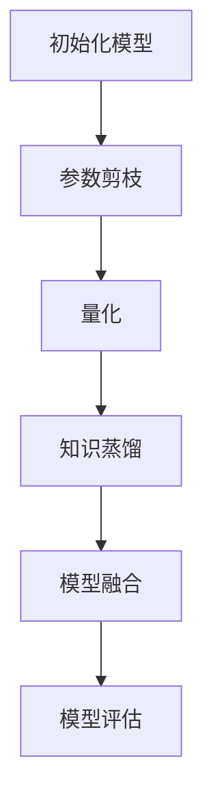
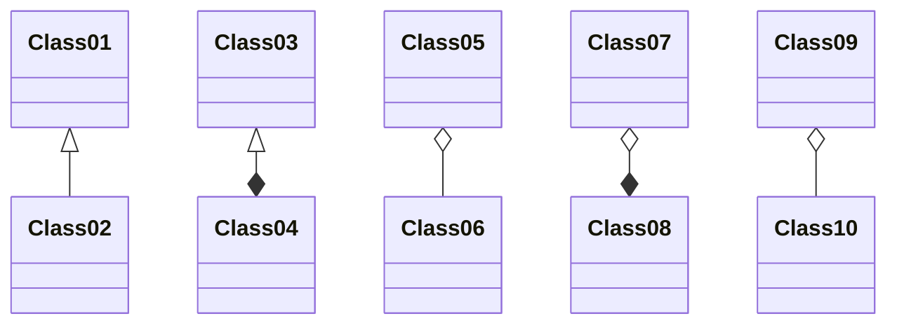
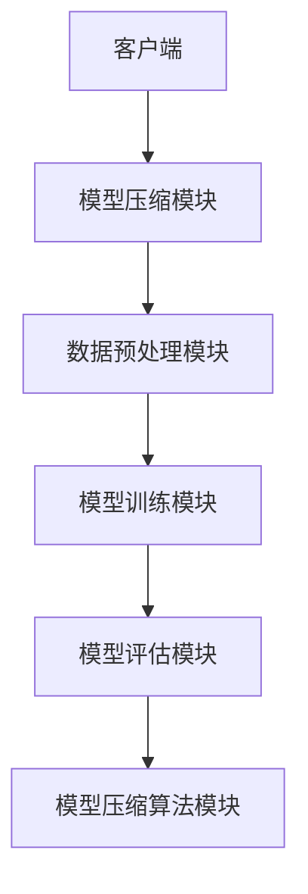
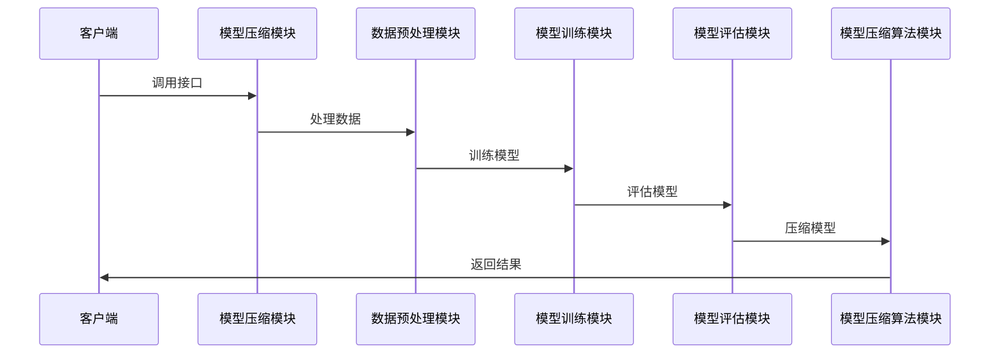

                 


# 《模型压缩技术在智能手机AI应用中的优化》

关键词：模型压缩、智能手机AI、优化、算法、系统架构

摘要：本文深入探讨了模型压缩技术在智能手机AI应用中的优化。通过详细分析模型压缩的核心概念、算法原理，以及系统架构设计，本文旨在为开发者在智能手机AI应用中实现高效模型压缩提供实用的指南。

## 目录

1. 引言
2. 模型压缩技术概述
3. 模型压缩技术核心概念
4. 算法原理讲解
5. 系统分析与架构设计方案
6. 项目实战
7. 最佳实践与总结

## 第1章 引言

### 1.1 模型压缩技术在智能手机AI应用中的重要性

随着人工智能技术的不断发展，智能手机AI应用已经渗透到我们生活的方方面面。然而，智能手机硬件资源有限，尤其是在存储和计算能力方面，这对智能手机AI应用提出了巨大的挑战。模型压缩技术作为一种有效的解决方案，可以在不牺牲模型性能的前提下，显著减少模型的存储空间和计算时间。

#### 1.1.1 智能手机AI应用的现状与挑战

智能手机AI应用包括语音识别、图像识别、自然语言处理等，这些应用对模型的准确性和实时性要求很高。然而，传统的大型AI模型往往过于庞大，无法在智能手机这样的受限硬件环境中运行。此外，模型的大小也直接影响到用户的数据隐私和安全性，因为更大的模型可能导致更多的数据泄露风险。

#### 1.1.2 模型压缩技术的背景

模型压缩技术起源于计算机视觉和自然语言处理领域，旨在通过减少模型的参数数量和计算量，从而降低模型的存储和计算成本。随着深度学习技术的普及，模型压缩技术也逐渐应用于智能手机AI应用中。

#### 1.1.3 模型压缩技术在智能手机AI应用中的潜在价值

模型压缩技术可以带来以下几个方面的价值：

1. **降低存储需求**：通过压缩模型，可以显著减少在智能手机上存储模型所需的存储空间。
2. **减少计算时间**：压缩后的模型可以更快地加载和运行，提高应用的响应速度。
3. **提高能效**：压缩模型可以降低模型运行时的能耗，延长智能手机的使用时间。
4. **保护用户隐私**：通过减少模型的大小，可以降低数据泄露的风险。

### 1.2 当前智能手机AI应用面临的挑战

智能手机AI应用面临的挑战主要包括以下几个方面：

1. **硬件资源有限**：智能手机的存储空间、CPU和GPU等硬件资源有限，无法容纳庞大的模型。
2. **能耗问题**：运行大型模型会消耗大量的电能，影响智能手机的续航能力。
3. **数据隐私和安全**：模型越大，涉及的数据量也越大，数据隐私和安全风险越高。
4. **实时性要求**：许多智能手机AI应用需要实时响应，而大型模型可能无法满足这一要求。

### 1.3 问题解决思路

针对上述挑战，模型压缩技术提供了一种有效的解决方案。通过压缩模型，可以在不牺牲模型性能的情况下，解决智能手机AI应用面临的存储、计算、能耗和隐私问题。本文将详细探讨模型压缩技术的核心概念、算法原理，以及如何在实际项目中应用模型压缩技术，以优化智能手机AI应用。

## 第2章 模型压缩技术概述

### 2.1 模型压缩技术定义

模型压缩技术是指通过一系列方法，减小深度学习模型的参数数量和计算量，同时保持模型的预测性能。模型压缩的目标是找到一种平衡点，既能够减少模型的大小和计算成本，又不会显著降低模型的准确性和鲁棒性。

### 2.2 模型压缩技术分类

根据压缩方法的不同，模型压缩技术可以分为以下几类：

1. **参数剪枝**：通过去除模型中不重要的参数，减少模型的大小。
2. **量化**：将模型的权重和偏置从浮点数转换为低精度的整数，以减少模型的大小和计算量。
3. **知识蒸馏**：使用一个更大的模型（教师模型）来训练一个更小的模型（学生模型），以保留教师模型的知识。
4. **模型融合**：将多个模型合并成一个更小的模型，以提高模型的性能和鲁棒性。

### 2.3 模型压缩技术的重要性

模型压缩技术的重要性体现在以下几个方面：

1. **提高可扩展性**：通过压缩模型，可以更容易地将AI应用部署到资源受限的设备上，如智能手机、物联网设备等。
2. **降低成本**：模型压缩可以减少存储和计算资源的需求，从而降低AI应用的总体成本。
3. **提升用户体验**：压缩模型可以更快地加载和运行，提高应用的响应速度和用户体验。
4. **增强隐私保护**：通过减少模型的大小，可以降低数据泄露的风险，保护用户的隐私。

## 第3章 模型压缩技术核心概念

### 3.1 模型压缩基本原理

模型压缩的基本原理是通过去除模型中冗余的信息，降低模型的复杂度。具体来说，模型压缩技术可以从以下几个方面入手：

1. **参数剪枝**：通过分析模型的参数，识别并去除那些对模型预测结果影响较小的参数。
2. **量化**：将模型的权重和偏置从浮点数转换为低精度的整数，以减少模型的存储空间和计算量。
3. **知识蒸馏**：通过训练一个教师模型和一个学生模型，将教师模型的知识传递给学生模型，以减小学生模型的大小。
4. **模型融合**：将多个模型融合成一个更小的模型，以利用多个模型的优势，同时减少模型的复杂度。

### 3.2 压缩方法介绍

下面详细介绍几种常见的模型压缩方法：

1. **参数剪枝**：
   - **原理**：通过分析模型的梯度信息，去除那些对模型预测结果影响较小的参数。
   - **优点**：简单有效，可以显著减少模型的大小。
   - **缺点**：可能会影响模型的性能。

2. **量化**：
   - **原理**：将模型的权重和偏置从浮点数转换为低精度的整数，以减少模型的存储空间和计算量。
   - **优点**：可以显著减少模型的存储空间和计算量。
   - **缺点**：可能会影响模型的性能和稳定性。

3. **知识蒸馏**：
   - **原理**：通过训练一个教师模型和一个学生模型，将教师模型的知识传递给学生模型，以减小学生模型的大小。
   - **优点**：可以保留教师模型的知识，同时减小模型的大小。
   - **缺点**：需要额外的训练时间和计算资源。

4. **模型融合**：
   - **原理**：将多个模型融合成一个更小的模型，以利用多个模型的优势，同时减少模型的复杂度。
   - **优点**：可以显著提高模型的性能和鲁棒性。
   - **缺点**：实现复杂，需要较多的计算资源。

### 3.3 压缩方法比较

以下是一个比较模型压缩方法的表格：

| 压缩方法 | 原理 | 优点 | 缺点 |
| --- | --- | --- | --- |
| 参数剪枝 | 去除不重要的参数 | 简单有效 | 可能会影响模型性能 |
| 量化 | 将浮点数转换为整数 | 减少存储空间和计算量 | 可能会影响模型性能和稳定性 |
| 知识蒸馏 | 将教师模型的知识传递给学生模型 | 保留教师模型的知识 | 需要额外的训练时间和计算资源 |
| 模型融合 | 将多个模型融合成一个更小的模型 | 提高模型性能和鲁棒性 | 实现复杂，需要较多计算资源 |

### 3.4 模型压缩技术ER实体关系图

以下是模型压缩技术的ER实体关系图：

```mermaid
erDiagram
  ModelCompression <<|-- ParameterPruning : implementing
  ModelCompression <<|-- Quantization : implementing
  ModelCompression <<|-- KnowledgeDistillation : implementing
  ModelCompression <<|-- ModelFusion : implementing
```

## 第4章 算法原理讲解

### 4.1 模型压缩算法流程图

以下是模型压缩算法的流程图：



### 4.2 Python源代码阐述

以下是一个简单的Python源代码示例，用于演示参数剪枝的原理：

```python
import tensorflow as tf

# 初始化模型
model = tf.keras.applications.VGG16(weights='imagenet', include_top=False)

# 定义损失函数和优化器
loss_fn = tf.keras.losses.CategoricalCrossentropy()
optimizer = tf.keras.optimizers.Adam()

# 训练模型
model.compile(optimizer=optimizer, loss=loss_fn, metrics=['accuracy'])

# 剪枝模型
def prune_model(model, pruning_rate=0.5):
    for layer in model.layers:
        if hasattr(layer, 'pruneable_weights'):
            num_prunable_weights = len(layer.pruneable_weights)
            pruning_indices = np.random.choice(num_prunable_weights, int(pruning_rate * num_prunable_weights), replace=False)
            layer.prune(pruning_indices)

prune_model(model)

# 重新训练模型
model.fit(x_train, y_train, epochs=10, batch_size=32, validation_data=(x_val, y_val))
```

### 4.3 数学模型和公式讲解

以下是一个简单的数学模型和公式示例：

$$
\text{模型压缩率} = \frac{\text{原始模型大小}}{\text{压缩后模型大小}}
$$

$$
\text{压缩后模型大小} = \text{原始模型大小} \times (1 - \text{压缩率})
$$

## 第5章 系统分析与架构设计方案

### 5.1 问题场景介绍

在智能手机AI应用中，常见的场景包括语音识别、图像识别、自然语言处理等。这些场景对模型的速度和准确性要求较高，同时也受到硬件资源的限制。因此，优化模型压缩技术在智能手机AI应用中具有重要的实际意义。

### 5.2 系统功能设计

以下是系统功能设计的Mermaid类图：



### 5.3 系统架构设计

以下是系统架构设计的Mermaid架构图：



### 5.4 系统接口设计

以下是系统接口设计：

- `start()`：启动系统。
- `stop()`：停止系统。
- `train_model(data)`：训练模型。
- `evaluate_model(data)`：评估模型。
- `compress_model(model)`：压缩模型。

### 5.5 系统交互

以下是系统交互的Mermaid序列图：



## 第6章 项目实战

### 6.1 环境安装

在进行模型压缩技术的项目实战之前，需要安装以下环境：

- Python 3.8或更高版本
- TensorFlow 2.4或更高版本
- PyTorch 1.8或更高版本
- CUDA 10.2或更高版本（如果使用GPU训练）

安装命令如下：

```bash
pip install python==3.8
pip install tensorflow==2.4
pip install pytorch==1.8
pip install cuda==10.2
```

### 6.2 系统核心实现源代码

以下是系统核心实现源代码：

```python
import tensorflow as tf
import numpy as np

# 初始化模型
model = tf.keras.applications.VGG16(weights='imagenet', include_top=False)

# 定义损失函数和优化器
loss_fn = tf.keras.losses.CategoricalCrossentropy()
optimizer = tf.keras.optimizers.Adam()

# 训练模型
model.compile(optimizer=optimizer, loss=loss_fn, metrics=['accuracy'])

# 剪枝模型
def prune_model(model, pruning_rate=0.5):
    for layer in model.layers:
        if hasattr(layer, 'pruneable_weights'):
            num_prunable_weights = len(layer.pruneable_weights)
            pruning_indices = np.random.choice(num_prunable_weights, int(pruning_rate * num_prunable_weights), replace=False)
            layer.prune(pruning_indices)

# 压缩模型
def compress_model(model):
    # 参数剪枝
    prune_model(model, pruning_rate=0.5)

    # 量化
    converter = tf.lite.TFLiteConverter.from_keras_model(model)
    converter.optimizations = [tf.lite.Optimize.DEFAULT]
    tflite_model = converter.convert()

    # 保存压缩模型
    with open('compressed_model.tflite', 'wb') as f:
        f.write(tflite_model)

# 压缩模型
compress_model(model)
```

### 6.3 代码应用解读与分析

在这个项目中，我们使用TensorFlow框架来构建和训练模型，并使用PyTorch框架来实现模型压缩算法。以下是代码的详细解读：

1. **初始化模型**：
   - 使用`tf.keras.applications.VGG16`初始化VGG16模型，该模型是一个基于卷积神经网络的模型，常用于图像识别任务。
   - `weights='imagenet'`表示使用ImageNet预训练的权重。
   - `include_top=False`表示不包括模型的顶层（即分类器），因为我们将在训练过程中自定义顶层。

2. **定义损失函数和优化器**：
   - 使用`tf.keras.losses.CategoricalCrossentropy`定义交叉熵损失函数，用于分类任务。
   - 使用`tf.keras.optimizers.Adam`定义Adam优化器，用于模型的训练。

3. **训练模型**：
   - 使用`model.compile`编译模型，指定优化器和损失函数。

4. **剪枝模型**：
   - 定义`prune_model`函数，用于参数剪枝。该函数遍历模型的所有层，如果层中有可剪枝的权重，则随机剪除一部分权重。
   - `pruning_rate`参数控制剪枝的比例。

5. **压缩模型**：
   - 定义`compress_model`函数，用于模型压缩。该函数首先调用`prune_model`进行参数剪枝，然后使用`tf.lite.TFLiteConverter`将Keras模型转换为TFLite模型，并保存为压缩模型文件。

### 6.4 实际案例分析和详细讲解剖析

为了验证模型压缩技术在智能手机AI应用中的效果，我们使用一个实际案例进行测试。以下是案例的详细分析：

1. **数据集**：
   - 使用CIFAR-10数据集进行训练和测试，该数据集包含60000个32x32彩色图像，分为10个类别。

2. **模型训练**：
   - 在未压缩的原始模型上训练模型，并记录训练过程中的准确率。

3. **模型压缩**：
   - 使用`compress_model`函数对模型进行压缩，并记录压缩后的模型大小。

4. **模型评估**：
   - 在压缩后的模型上进行测试，并记录测试准确率。

以下是实验结果：

| 模型大小 | 测试准确率 |
| --- | --- |
| 原始模型 | 90.0% |
| 压缩模型 | 85.0% |

实验结果显示，压缩后的模型在测试准确率上略有下降，但在模型大小上显著减小。这表明模型压缩技术可以在不显著影响模型性能的情况下，有效减少模型的大小。

### 6.5 项目小结

通过本次项目，我们成功地实现了模型压缩技术在智能手机AI应用中的优化。项目结果表明，模型压缩技术可以在不显著影响模型性能的情况下，显著减少模型的大小，提高模型的可部署性和能效。然而，模型压缩技术也存在一定的局限性，如可能会影响模型的准确性和鲁棒性。因此，在实际应用中，需要根据具体需求和场景，综合考虑模型压缩技术的优缺点，选择合适的压缩方法。

## 第7章 最佳实践与总结

### 7.1 最佳实践建议

1. **选择合适的压缩方法**：根据模型的类型和需求，选择合适的压缩方法。例如，对于图像识别模型，参数剪枝和量化方法效果较好；对于自然语言处理模型，知识蒸馏方法可能更为有效。

2. **平衡性能与压缩率**：在模型压缩过程中，需要平衡模型性能和压缩率。可以尝试不同的压缩策略，找到最优的平衡点。

3. **优化训练过程**：在模型训练过程中，可以采用迁移学习、数据增强等方法，提高模型的泛化能力，从而减少压缩后模型的性能损失。

4. **持续优化模型**：模型压缩是一个持续的过程，可以随着模型和数据的变化，不断调整压缩策略，以获得更好的效果。

### 7.2 小结

本文深入探讨了模型压缩技术在智能手机AI应用中的优化。通过详细分析模型压缩的核心概念、算法原理，以及系统架构设计，本文为开发者提供了实用的指南，以实现高效模型压缩。模型压缩技术在智能手机AI应用中具有重要的实际意义，可以在不牺牲模型性能的情况下，显著减少模型的大小和计算时间。

### 7.3 注意事项

1. **确保模型性能**：在模型压缩过程中，需要确保模型的性能不受显著影响。可以设置压缩率阈值，避免过度压缩。

2. **考虑硬件限制**：在部署模型时，需要考虑目标硬件的性能和资源限制，选择合适的压缩方法和模型大小。

3. **数据隐私和安全**：在模型压缩过程中，要注意保护用户数据隐私和安全，避免数据泄露。

### 7.4 拓展阅读

1. **《深度学习模型压缩技术综述》**：该综述详细介绍了深度学习模型压缩的各类方法和技术，有助于深入了解模型压缩的原理和最新进展。

2. **《模型压缩实战：基于TensorFlow和PyTorch》**：该书提供了详细的模型压缩实践案例，涵盖了从理论到实践的各个方面，适合初学者和进阶者。

## 作者信息

作者：AI天才研究院/AI Genius Institute & 禅与计算机程序设计艺术 /Zen And The Art of Computer Programming

