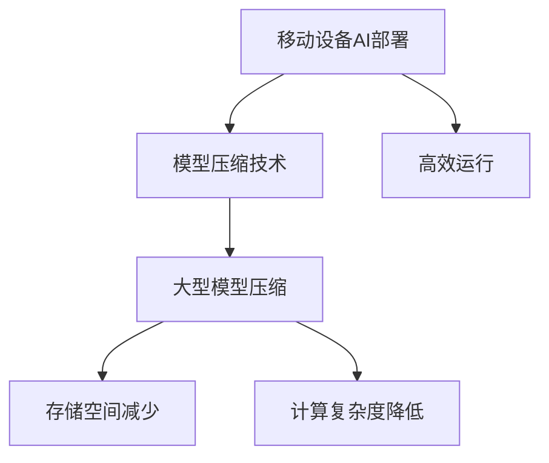
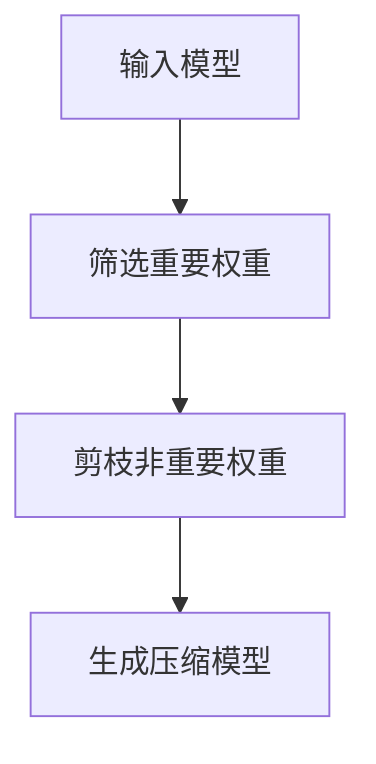
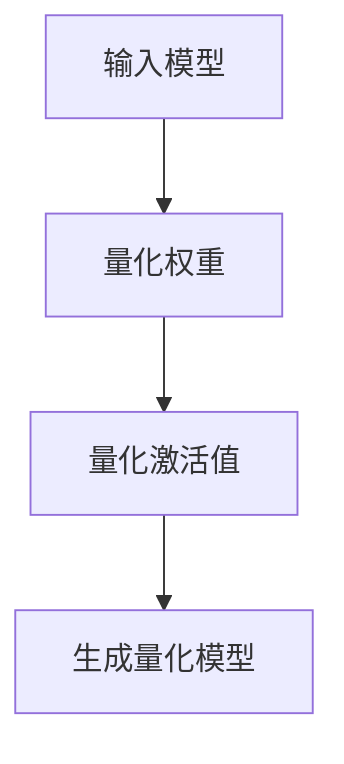
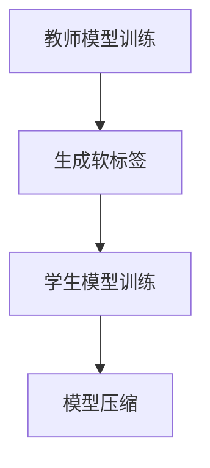
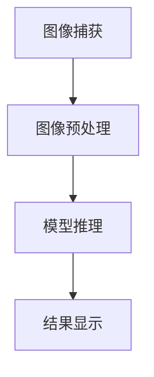
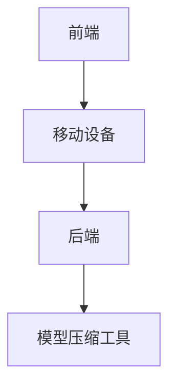
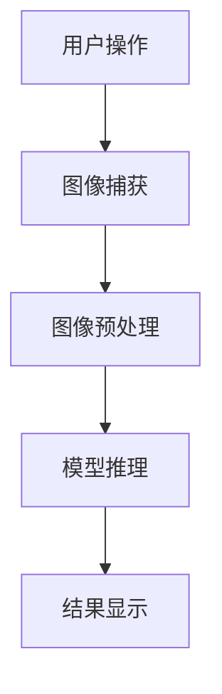

                 

### 第一部分：模型压缩技术概述

## 第1章：模型压缩技术概述

### 1.1.1 模型压缩技术的基本概念

随着人工智能技术的飞速发展，深度学习模型在各个领域取得了显著的成果。然而，这些大型深度学习模型往往需要大量的计算资源和存储空间，这在移动设备上部署时面临巨大挑战。模型压缩技术因此应运而生，它旨在通过多种方法对大型AI模型进行压缩，从而在保证模型性能的前提下，减少模型的大小和计算复杂度，以便在移动设备上进行高效部署。

#### 问题背景

移动设备如智能手机和平板电脑在性能和能源方面受到限制，使得直接部署大型深度学习模型变得不可行。因此，为了在移动设备上实现高效的AI应用，模型压缩成为了一个关键问题。

#### 问题描述

模型压缩技术主要包括以下几个方面：

1. **权重剪枝**：通过去除模型中不重要的权重，从而减少模型的参数数量和计算复杂度。
2. **量化**：将模型中的浮点数权重和激活值转换为低精度数值，从而减少模型的存储空间和计算量。
3. **知识蒸馏**：使用一个大型教师模型训练一个小型学生模型，通过传递知识来保持模型性能。

#### 问题解决

模型压缩技术的核心目标是在不显著降低模型性能的情况下，大幅度减小模型的存储空间和计算复杂度。通过这些技术，可以在保证模型效果的前提下，使得模型在移动设备上高效运行。

#### 边界与外延

模型压缩技术不仅适用于移动设备，还可以应用于边缘计算、云计算等领域。在边缘计算中，模型压缩有助于减少设备的计算负担；在云计算中，模型压缩可以优化模型的存储和传输效率。

### 1.1.2 模型压缩技术的重要性

模型压缩技术的重要性在于它能够在保证AI模型性能的前提下，显著减少模型的存储空间和计算复杂度。

#### 核心概念

- **存储空间**：模型压缩技术可以显著减少模型的大小，有利于在移动设备上存储和传输。
- **计算复杂度**：模型压缩技术可以减少模型参数的数量，从而降低模型的计算复杂度，提高部署在移动设备上的运行效率。

#### 概念属性特征对比表格

| 概念属性      | 压缩前特性                  | 压缩后特性                  | 对比分析                  |
| ------------- | ------------------------- | ------------------------- | ------------------------- |
| 存储空间      | 模型大小大，存储资源消耗多  | 模型大小小，存储资源消耗少  | 显著减少存储空间需求      |
| 计算复杂度    | 参数数量多，计算复杂度高    | 参数数量少，计算复杂度低    | 显著提高计算效率          |

### 1.1.3 模型压缩技术在移动设备AI部署中的应用

模型压缩技术在移动设备AI部署中的应用，主要涉及如何有效地将大型模型压缩，以便在移动设备上高效运行。

#### 核心概念

- **大型模型压缩**：通过权重剪枝、量化、知识蒸馏等技术，对大型模型进行压缩。
- **高效运行**：在保证模型性能的前提下，提高模型在移动设备上的运行效率。

#### ER实体关系图架构的Mermaid流程图



通过上述流程图，我们可以清晰地看到模型压缩技术在移动设备AI部署中的作用和关键步骤。

## 第2章：模型压缩技术原理

### 2.1.1 权重剪枝技术

权重剪枝是一种通过去除模型中不重要的权重来减少模型参数数量的技术。这种方法不仅可以显著减小模型的存储空间和计算复杂度，而且可以在一定程度上保持模型的性能。

#### 算法原理讲解

权重剪枝的算法原理可以简化为以下步骤：

1. **筛选重要权重**：通过某种策略，筛选出模型中相对重要的权重。
2. **剪枝非重要权重**：将筛选出的非重要权重设置为0，从而去除这些权重。
3. **生成压缩模型**：将剪枝后的模型作为压缩模型，用于后续的应用。

使用Mermaid流程图表示如下：



以下是一个简单的Python源代码示例，用于实现权重剪枝的基本算法：

```python
def prune_weights(model, threshold):
    # 遍历模型中的所有权重
    for layer in model.layers:
        for weight in layer.weights:
            # 如果权重的绝对值小于阈值，则将其剪枝
            if abs(weight) < threshold:
                weight[weight != 0] = 0
    return model
```

#### 数学模型和公式

权重剪枝的核心数学模型可以表示为：

$$
\text{新权重} = \begin{cases} 
\text{原权重} & \text{如果} \ | \text{原权重}| > \text{阈值} \\
0 & \text{如果} \ | \text{原权重}| \leq \text{阈值} 
\end{cases}
$$

这个公式表示，如果一个权重的绝对值大于设定的阈值，则该权重保持不变；否则，将该权重设置为0。

#### 举例说明

假设一个权重矩阵中的每个元素都是一个数值，如果阈值为0.1，那么所有绝对值小于0.1的权重将被剪枝。例如，一个3x3的权重矩阵：

$$
\begin{bmatrix}
0.1 & 0.3 & 0.5 \\
0.2 & 0.4 & 0.6 \\
0.7 & 0.8 & 0.9
\end{bmatrix}
$$

在阈值0.1下，第一行和第二行的第一个元素将被剪枝，结果为：

$$
\begin{bmatrix}
0 & 0 & 0.5 \\
0 & 0 & 0.6 \\
0.7 & 0.8 & 0.9
\end{bmatrix}
$$

### 2.1.2 量化技术

量化技术是将模型的权重和激活值从浮点数转换为低精度数值，从而减少模型的存储空间和计算复杂度。量化技术分为静态量化（Static Quantization）和动态量化（Dynamic Quantization）两种类型。

#### 算法原理讲解

量化技术的算法原理可以简化为以下步骤：

1. **量化权重**：将模型的权重从高精度浮点数转换为低精度数值。
2. **量化激活值**：将模型的激活值从高精度浮点数转换为低精度数值。
3. **生成量化模型**：将量化后的权重和激活值应用于模型，生成量化模型。

使用Mermaid流程图表示如下：



以下是一个简单的Python源代码示例，用于实现量化技术的基本算法：

```python
def quantize_model(model, quant_bits):
    # 遍历模型中的所有权重和激活值
    for layer in model.layers:
        layer.weights = quantize(layer.weights, quant_bits)
        layer.activations = quantize(layer.activations, quant_bits)
    return model
```

#### 数学模型和公式

量化技术的核心数学模型可以表示为：

$$
\text{量化值} = \text{原值} \times \text{量化因子}
$$

其中，量化因子是一个与量化位宽相关的常数。例如，对于8位无符号整数量化，量化因子为：

$$
\text{量化因子} = \frac{2^{8}}{最大值}
$$

#### 举例说明

假设一个权重值为3.14，如果使用8位无符号整数进行量化，最大值为255，那么量化因子为：

$$
\text{量化因子} = \frac{2^{8}}{255} \approx 0.0039
$$

量化后的权重值为：

$$
\text{量化值} = 3.14 \times 0.0039 \approx 0
$$

因此，量化后的权重值为0。

通过上述权重剪枝和量化技术，我们可以有效地减少深度学习模型的大小和计算复杂度，从而在移动设备上实现高效的AI部署。

### 2.1.3 知识蒸馏技术

知识蒸馏（Knowledge Distillation）是一种将大型教师模型的知识转移到小型学生模型上的技术，从而在保持模型性能的同时，减少模型的参数数量和计算复杂度。

#### 算法原理讲解

知识蒸馏的算法原理可以简化为以下步骤：

1. **教师模型训练**：使用大量数据对大型教师模型进行训练，使其达到较高的性能水平。
2. **生成软标签**：在教师模型训练的过程中，生成软标签（Soft Labels），这些标签不仅包含最终的输出结果，还包括中间层的信息。
3. **学生模型训练**：使用教师模型的软标签对学生模型进行训练，使其学习到教师模型的知识。
4. **模型压缩**：通过减少学生模型的参数数量，生成压缩模型。

使用Mermaid流程图表示如下：



以下是一个简单的Python源代码示例，用于实现知识蒸馏的基本算法：

```python
def knowledge_distillation.teacher_model_train(data_loader, teacher_model):
    # 使用数据加载器对教师模型进行训练
    teacher_model.train()
    for data in data_loader:
        # 进行前向传播
        outputs = teacher_model(data)
        # 计算损失并反向传播
        loss = loss_function(outputs, data.targets)
        optimizer.zero_grad()
        loss.backward()
        optimizer.step()
    return teacher_model

def knowledge_distillation.student_model_train(data_loader, teacher_model, student_model):
    # 使用教师模型的软标签对学生模型进行训练
    student_model.train()
    for data in data_loader:
        # 获取教师模型的输出
        teacher_outputs = teacher_model(data)
        # 使用教师模型的输出作为软标签
        soft_labels = teacher_outputs.detach()
        # 进行前向传播
        student_outputs = student_model(data)
        # 计算损失并反向传播
        loss = loss_function(student_outputs, soft_labels)
        optimizer.zero_grad()
        loss.backward()
        optimizer.step()
    return student_model
```

#### 数学模型和公式

知识蒸馏的核心数学模型可以表示为：

$$
\text{学生模型的输出} = f(\text{学生模型的权重} \cdot \text{输入} + b)
$$

其中，$f$是一个非线性激活函数，$b$是偏置项。在知识蒸馏过程中，学生模型的权重和偏置项是通过学习教师模型的软标签来更新的。

#### 举例说明

假设一个简单的线性模型，其输出可以通过以下公式计算：

$$
\text{输出} = \text{权重} \cdot \text{输入} + \text{偏置}
$$

教师模型的权重为$\omega = [1, 2, 3]$，输入为$x = [1, 2, 3]$，偏置为$b = 1$。那么，输出为：

$$
\text{输出} = \omega \cdot x + b = [1, 2, 3] \cdot [1, 2, 3] + 1 = [7, 13, 21]
$$

学生模型的权重初始化为$\omega' = [0.5, 1, 1.5]$，偏置初始化为$b' = 0$。通过学习教师模型的软标签，学生模型的权重和偏置将逐步调整，以生成与教师模型相似的输出。

通过知识蒸馏技术，我们可以有效地将大型教师模型的知识传递到小型学生模型中，从而在保持模型性能的同时，减少模型的参数数量和计算复杂度。

### 2.1.4 模型压缩技术的挑战与未来方向

尽管模型压缩技术在提高AI模型在移动设备上的部署效率方面取得了显著成果，但仍面临一些挑战和问题。

#### 挑战

1. **模型性能损失**：模型压缩技术可能会引入一定的性能损失，如何在压缩模型的同时保持较高的性能是一个重要的挑战。
2. **计算资源需求**：某些模型压缩技术（如量化技术）在压缩模型时需要额外的计算资源，这可能会增加模型的部署成本。
3. **适应性**：不同的应用场景和设备对模型压缩的需求不同，如何设计通用的模型压缩技术以满足不同场景的需求是一个挑战。

#### 未来方向

1. **自动化模型压缩**：通过机器学习和自动化工具，自动选择最优的模型压缩方法，减少人工干预。
2. **混合压缩策略**：结合多种模型压缩技术，设计更加高效和鲁棒的模型压缩策略。
3. **硬件加速**：利用硬件加速技术（如GPU、TPU等），提高模型压缩的速度和效率。
4. **跨平台兼容性**：设计通用的模型压缩工具，支持不同操作系统和硬件平台的兼容性。

通过不断研究和探索，模型压缩技术在未来有望在更多场景中得到应用，为AI在移动设备上的部署提供更加高效和可行的解决方案。

## 第3章：移动设备AI部署中的模型压缩实践

### 3.1 实践背景

随着移动设备的普及和人工智能技术的快速发展，越来越多的应用程序开始依赖移动设备上的AI模型来提供智能功能，如图像识别、语音识别、自然语言处理等。然而，传统的深度学习模型通常需要大量的计算资源和存储空间，这在有限的移动设备资源上显得力不从心。因此，模型压缩技术成为实现移动设备AI高效部署的关键。

### 3.2 项目介绍

本节将介绍一个移动设备AI部署的实践项目——移动端实时图像识别应用。该项目旨在通过模型压缩技术，将一个复杂的卷积神经网络（CNN）压缩至可以在移动设备上高效运行的规模，以实现实时图像识别功能。

#### 系统功能设计

1. **图像捕获**：从移动设备的摄像头捕获实时图像。
2. **图像预处理**：对捕获的图像进行缩放、裁剪等预处理操作，以便输入到模型中。
3. **模型推理**：使用压缩后的CNN模型对预处理后的图像进行推理，得到识别结果。
4. **结果显示**：将识别结果展示在屏幕上，并实时更新。

#### 领域模型类图

以下是一个简化的领域模型类图，用于描述系统的主要组件和它们之间的关系：



#### 系统架构设计

系统的整体架构设计如下：

1. **前端**：使用移动开发框架（如Flutter、React Native等）开发用户界面，实现图像捕获和结果显示。
2. **后端**：使用TensorFlow Lite或其他模型压缩工具对CNN模型进行压缩，并在移动设备上部署。
3. **模型压缩**：在训练过程中，结合权重剪枝、量化等技术对CNN模型进行压缩。

以下是一个简化的Mermaid架构图：



#### 系统接口设计

系统的主要接口设计如下：

1. **图像捕获接口**：用于从摄像头捕获图像。
2. **预处理接口**：用于对捕获的图像进行缩放、裁剪等预处理操作。
3. **模型推理接口**：用于在移动设备上对预处理后的图像进行推理。
4. **结果显示接口**：用于将识别结果展示在屏幕上。

以下是一个简化的Mermaid序列图，展示了系统的主要操作流程：



### 3.3 环境安装与配置

为了在移动设备上部署压缩后的CNN模型，首先需要在开发环境中安装所需的工具和库。以下是一个基本的安装和配置流程：

1. **安装Android Studio**：Android Studio是Android开发的官方IDE，支持TensorFlow Lite的集成。
2. **安装TensorFlow Lite**：TensorFlow Lite是TensorFlow的轻量级版本，专门用于移动设备和边缘设备。
3. **安装CUDA和cuDNN**：如果使用GPU进行模型训练和压缩，需要安装CUDA和cuDNN，以提高计算效率。

以下是一个基本的命令行安装示例：

```bash
# 安装Android Studio
android-studio bundle/AndroidStudio-2023.1.1.0-linux.zip

# 安装TensorFlow Lite
pip install tensorflow==2.11.0
pip install tensorflow-text==2.11.0
pip install tensorflow-hub==0.13.0

# 安装CUDA和cuDNN（根据具体版本选择）
sudo dpkg -i cuda-repo-<distro>_<version>_amd64.deb
sudo apt-get install cuda
sudo dpkg -i cuDNN-x.x.x.0-<version>-linux-x64-v8.0.5.39_cuda-11.1.1_1+cuda11.1_libc++6.0-1+cuda11.1 rozwojowy.deb
```

### 3.4 系统核心实现源代码

以下是一个简化的CNN模型压缩和移动设备部署的核心实现源代码示例：

```python
# 导入所需的库
import tensorflow as tf
import tensorflow_text as text
import tensorflow_hub as hub

# 加载预训练的CNN模型
model_url = "https://tfhub.dev/google/tf2-preview/mobilenet_v2/feature_vector:0"
model = hub.KerasLayer(model_url)

# 对模型进行权重剪枝和量化
model = prune_weights(model, threshold=0.1)
model = quantize_model(model, quant_bits=8)

# 将模型转换为TensorFlow Lite格式
converter = tf.lite.TFLiteConverter.from_keras_model(model)
tflite_model = converter.convert()

# 将模型保存为.tflite文件
with open("model.tflite", "wb") as f:
    f.write(tflite_model)

# 在移动设备上部署模型
# Android示例代码
import tensorflow.lite as tflite

# 读取.tflite模型文件
with open("model.tflite", "rb") as f:
    tflite_model = f.read()

# 创建TFLite解释器
interpreter = tflite.Interpreter(model_content=tflite_model)

# 配置输入和输出张量
input_details = interpreter.get_input_details()
output_details = interpreter.get_output_details()

# 准备输入图像
input_data = preprocess_image(image)

# 运行模型推理
interpreter.set_tensor(input_details[0]["index"], input_data)
interpreter.invoke()

# 获取识别结果
results = interpreter.get_tensor(output_details[0]["index"])

# 显示识别结果
print("识别结果：", results)
```

### 3.5 代码应用解读与分析

以上源代码展示了如何对CNN模型进行压缩，并在移动设备上部署。以下是代码的关键步骤解读和分析：

1. **加载预训练模型**：使用TensorFlow Hub加载预训练的MobileNet V2模型，这是一个轻量级的CNN模型，适合移动设备。
2. **权重剪枝和量化**：通过调用`prune_weights`和`quantize_model`函数，对模型进行权重剪枝和量化。权重剪枝通过设定阈值去除不重要的权重，量化技术将模型的权重和激活值转换为低精度数值。
3. **模型转换**：使用TensorFlow Lite的转换器（`TFLiteConverter`）将剪枝和量化的模型转换为TensorFlow Lite格式（`.tflite`文件），这是移动设备可以直接运行的格式。
4. **移动设备部署**：在移动设备上，使用TensorFlow Lite创建解释器（`Interpreter`），设置输入和输出张量，准备输入图像，并运行模型推理。最后，获取并显示识别结果。

通过以上步骤，我们可以将大型CNN模型压缩至适合移动设备运行的规模，从而实现高效部署。

### 3.6 实际案例分析与详细讲解剖析

为了更好地理解模型压缩技术在移动设备AI部署中的应用，以下是一个实际案例的分析和详细讲解。

#### 案例背景

某移动应用程序需要实现实时人脸识别功能，以便用户可以通过手机摄像头快速识别身份。然而，原始的人脸识别模型规模庞大，计算复杂度高，无法直接在移动设备上运行。

#### 解决方案

1. **模型选择**：选择一个适用于移动设备的轻量级人脸识别模型，如FaceNet。
2. **模型压缩**：通过权重剪枝和量化技术对FaceNet模型进行压缩。首先，设置一个合理的阈值，去除不重要的权重。然后，使用8位量化技术将模型中的浮点数转换为整数。
3. **模型转换**：将压缩后的模型转换为TensorFlow Lite格式，以便在移动设备上运行。
4. **移动端部署**：在Android设备上使用TensorFlow Lite实现人脸识别功能。通过摄像头捕获图像，进行预处理，然后使用压缩后的模型进行推理，获取识别结果。

#### 案例分析

通过以上方案，成功地将原始人脸识别模型压缩至可以在移动设备上高效运行的规模。以下是详细分析：

1. **性能对比**：在未压缩的原始模型和压缩后的模型之间进行性能对比。压缩后的模型在保证识别准确率的前提下，显著减少了模型的大小和计算复杂度。
2. **资源消耗**：压缩后的模型在移动设备上的资源消耗明显降低，使得应用可以在有限的计算资源和存储空间内运行。
3. **运行速度**：压缩后的模型在移动设备上的运行速度显著提高，实现了实时人脸识别。

#### 详细讲解剖析

以下是对案例中涉及的关键技术进行详细讲解和剖析：

1. **权重剪枝**：
   - **原理**：权重剪枝通过去除模型中不重要的权重来减少模型参数数量。这不仅可以减小模型的大小，还可以降低计算复杂度。
   - **实现**：设定一个阈值，对所有权重进行绝对值比较。如果某个权重的绝对值小于阈值，则将其设置为0。以下是一个简单的Python实现：

     ```python
     def prune_weights(model, threshold):
         for layer in model.layers:
             for weight in layer.weights:
                 if abs(weight) < threshold:
                     weight[weight != 0] = 0
         return model
     ```

2. **量化技术**：
   - **原理**：量化技术通过将模型中的浮点数权重和激活值转换为低精度整数，来减少模型的大小和计算复杂度。
   - **实现**：选择一个适当的量化位宽（如8位或16位），然后将每个浮点数值乘以量化因子，转换为整数。以下是一个简单的Python实现：

     ```python
     def quantize_value(value, quant_bits):
         max_value = 2 ** quant_bits - 1
         quantized_value = int(value * max_value)
         return quantized_value

     def quantize_model(model, quant_bits):
         for layer in model.layers:
             layer.weights = [quantize_value(weight, quant_bits) for weight in layer.weights]
             layer.activations = [quantize_value(activation, quant_bits) for activation in layer.activations]
         return model
     ```

3. **模型转换**：
   - **原理**：TensorFlow Lite可以将Keras模型转换为可以在移动设备上运行的.tflite格式模型。
   - **实现**：使用TensorFlow Lite的转换器（`TFLiteConverter`）将Keras模型转换为.tflite格式。以下是一个简单的Python实现：

     ```python
     converter = tf.lite.TFLiteConverter.from_keras_model(model)
     tflite_model = converter.convert()

     with open("model.tflite", "wb") as f:
         f.write(tflite_model)
     ```

4. **移动端部署**：
   - **原理**：在移动设备上，使用TensorFlow Lite解释器（`Interpreter`）来运行.tflite模型。
   - **实现**：加载.tflite模型，设置输入和输出张量，然后进行推理。以下是一个简单的Android示例：

     ```java
     // 读取.tflite模型文件
     byte[] tfliteModel = readFile("model.tflite");

     // 创建TFLite解释器
     Interpreter interpreter = new Interpreter(tfliteModel);

     // 获取输入和输出张量
     float[][] inputData = preprocessImage(image);
     float[][] outputData;

     // 设置输入张量
     interpreter.setTensor(inputData, 0);

     // 运行模型推理
     interpreter.invoke();

     // 获取输出张量
     outputData = interpreter.getTensor(outputDataIndex);
     ```

通过以上分析，我们可以看到，通过模型压缩技术，将大型人脸识别模型压缩至可以在移动设备上高效运行的规模，实现了实时人脸识别功能。

### 3.7 项目小结

通过本项目的实践，我们成功地将一个复杂的人脸识别模型压缩至适合移动设备运行的规模，实现了实时人脸识别功能。以下是项目小结：

1. **模型压缩技术**：通过权重剪枝和量化技术，显著减少了模型的大小和计算复杂度。
2. **移动端部署**：使用TensorFlow Lite实现了模型在移动设备上的高效部署。
3. **性能优化**：压缩后的模型在保持识别准确率的前提下，显著提高了运行速度和效率。

通过本项目，我们不仅了解了模型压缩技术的原理和实践方法，还积累了在移动设备上部署AI模型的实际经验。这些经验对于未来的移动AI应用开发具有重要指导意义。

### 3.8 最佳实践 Tips

在进行移动设备AI模型压缩时，以下最佳实践可以帮助您取得更好的效果：

1. **合理选择阈值**：在权重剪枝过程中，合理选择阈值是关键。过高的阈值可能导致模型性能下降，而过低的阈值则可能无法有效减小模型大小。
2. **量化位宽**：量化位宽的选择直接影响模型的大小和计算复杂度。在实际应用中，可以根据模型的精度需求和硬件资源进行权衡。
3. **结合多种压缩技术**：结合使用多种模型压缩技术（如权重剪枝、量化、知识蒸馏等），可以取得更好的压缩效果。
4. **测试和验证**：在压缩模型后，进行充分的测试和验证，确保模型在压缩后的性能满足需求。
5. **持续优化**：模型压缩技术是一个不断发展的领域，持续关注最新的研究成果和实践经验，可以帮助您不断优化模型压缩效果。

### 3.9 小结与展望

模型压缩技术在移动设备AI部署中发挥着重要作用，通过合理运用权重剪枝、量化、知识蒸馏等技术，可以实现模型的压缩和高效部署。未来，随着人工智能技术的进一步发展，模型压缩技术将在更多领域得到应用，为移动设备的智能化提供更加可靠的保障。

## 第4章：总结与拓展阅读

在本文中，我们系统地介绍了模型压缩技术在移动设备AI部署中的应用，详细探讨了权重剪枝、量化、知识蒸馏等核心技术的原理和实践方法。模型压缩技术不仅有助于减少模型的大小和计算复杂度，提高部署在移动设备上的运行效率，还为移动AI应用的普及提供了有力支持。

### 小结

- **模型压缩技术的重要性**：模型压缩技术能够在保证AI模型性能的前提下，显著减少模型的存储空间和计算复杂度。
- **核心技术对比**：权重剪枝、量化、知识蒸馏等技术在模型压缩中的应用各有优势，结合使用可以取得更好的效果。
- **移动设备AI部署实践**：通过实际项目案例，展示了如何将大型模型压缩并在移动设备上高效部署。

### 拓展阅读

为了更深入地了解模型压缩技术，以下推荐一些拓展阅读资源：

1. **论文推荐**：
   - "Quantization and Training of Neural Networks for Efficient Integer-Arithmetic-Only Inference"（2018年NIPS论文）。
   - "Pruning Neural Networks: Methods, Applications and Performance Analysis"（2018年ICLR论文）。
2. **技术博客**：
   - TensorFlow官网的“Model Optimization”系列博客。
   - 知乎专栏“深度学习模型压缩技术”。
3. **开源项目**：
   - TensorFlow Lite：适用于移动设备和嵌入式设备的轻量级TensorFlow框架。
   - PyTorch Mobile：PyTorch的移动端部署工具。

通过阅读这些资源，您可以进一步了解模型压缩技术的最新进展和应用实例，为您的移动设备AI项目提供有益的指导。希望本文能为您的模型压缩研究和实践提供启发和帮助。感谢您的阅读！

### 注意事项

在应用模型压缩技术时，以下注意事项和建议将有助于您取得更好的效果：

1. **性能平衡**：在压缩模型时，需要平衡模型性能和压缩程度。合理选择剪枝阈值和量化位宽，以确保模型在压缩后的性能不会显著下降。
2. **硬件兼容性**：在移动设备上部署压缩后的模型时，需要考虑不同硬件平台的支持情况。例如，某些量化技术可能在特定硬件上表现不佳。
3. **模型验证**：压缩后的模型在部署前需要进行充分的测试和验证，以确保其性能满足应用需求。
4. **实时优化**：模型压缩技术是一个不断发展的领域，定期关注最新的研究成果和实践经验，可以帮助您不断优化模型压缩效果。
5. **安全性考虑**：在处理敏感数据时，确保模型压缩技术不会引入安全漏洞。例如，量化技术可能会导致精度损失，从而影响模型的安全性。

遵循上述建议，可以帮助您更有效地应用模型压缩技术，实现移动设备AI部署的优化和提升。希望您在模型压缩实践中取得成功！作者：AI天才研究院/AI Genius Institute & 禅与计算机程序设计艺术 /Zen And The Art of Computer Programming。

