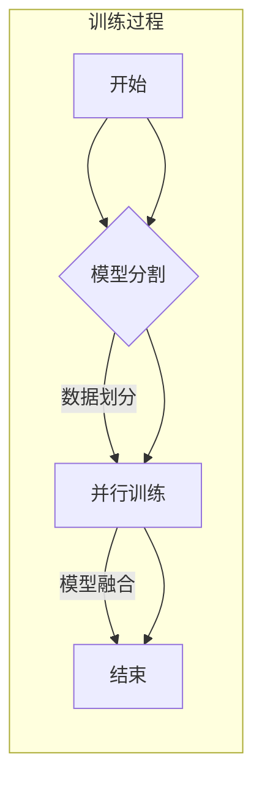
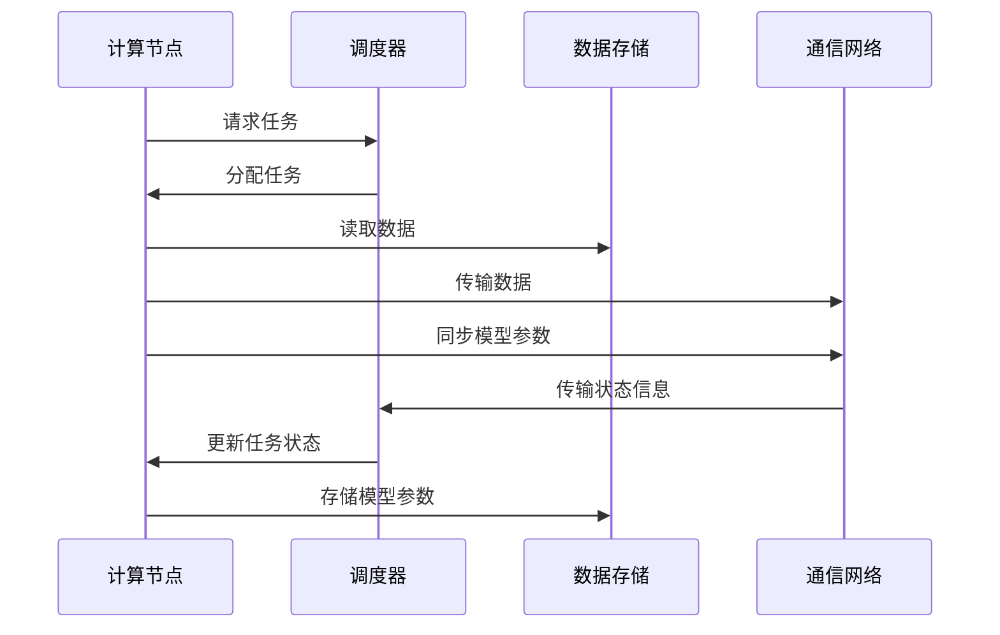

                 

### 《模型并行：加速大规模AI模型训练的技术》

#### 关键词：模型并行、大规模AI模型训练、数据并行、模型并行、混合并行、算法、系统设计、项目实战

> 摘要：随着人工智能领域的飞速发展，大规模AI模型训练的需求日益增长。然而，传统单机训练模式面临计算资源瓶颈和训练时间长等挑战。模型并行技术应运而生，通过分布式计算和并行策略，有效加速大规模AI模型训练。本文将深入探讨模型并行的基本概念、原理、系统设计与实现，以及最佳实践和注意事项，旨在为读者提供全面的技术指南。

----------------------------------------------------------------

### 第一部分：模型并行概述与背景

#### 第1章：模型并行简介

##### 1.1 模型并行的基本概念

##### 1.1.1 问题背景

在当今人工智能（AI）时代，深度学习（Deep Learning）已经成为推动技术进步的关键驱动力。然而，随着AI模型变得越来越复杂，训练这些模型所需的时间和计算资源也在不断增加。传统的单机训练模式在处理大规模数据集和复杂模型时，往往面临计算资源瓶颈和训练时间长等问题。为了克服这些挑战，模型并行技术应运而生。

##### 1.1.2 问题定义

模型并行是指将大规模AI模型的训练任务分布在多个计算节点上，通过并行计算技术来加速模型训练的过程。其核心思想是将模型分割成若干个部分，并在不同的计算节点上分别进行训练，然后再将这些部分整合起来，得到最终的模型。

##### 1.1.3 模型并行的目标与意义

模型并行的目标主要包括：

1. **加速模型训练**：通过并行计算，可以在较短的时间内完成模型训练，提高研发效率。
2. **提高资源利用率**：利用分布式计算资源，可以更好地利用现有的计算资源，降低硬件成本。
3. **支持大规模模型训练**：对于一些需要处理大规模数据集和复杂模型的场景，模型并行可以提供有效的解决方案。

模型并行在AI领域具有重要意义，它不仅能够解决传统单机训练模式面临的挑战，还能够推动AI技术的进一步发展。

##### 1.1.4 模型并行的边界与外延

模型并行的边界主要包括：

1. **并行粒度**：包括数据并行、模型并行和混合并行等。
2. **通信开销**：分布式计算中的通信开销是模型并行需要考虑的重要因素。
3. **计算资源**：模型并行需要足够的计算资源支持，包括计算节点、存储和网络等。

模型并行的外延涉及：

1. **并行策略**：包括数据分割策略、模型分割策略和调度策略等。
2. **系统架构**：如何设计一个高效的模型并行系统，包括计算节点、通信网络和数据存储等。
3. **最佳实践**：如何在不同的应用场景下，选择合适的模型并行策略和系统设计。

##### 1.2 大规模AI模型训练的需求

##### 1.2.1 AI模型训练的挑战

AI模型训练的挑战主要包括：

1. **计算资源限制**：单机训练模式在处理大规模数据集和复杂模型时，往往面临计算资源瓶颈。
2. **训练时间延长**：随着模型复杂度和数据集规模的增长，训练时间显著增加，影响研发效率。
3. **硬件成本高**：为了满足计算需求，需要投入大量的硬件资源，导致成本上升。

##### 1.2.2 大规模AI模型训练的现状

目前，大规模AI模型训练主要依赖于以下几种技术：

1. **分布式计算**：通过分布式计算框架，如TensorFlow、PyTorch等，将训练任务分布在多个计算节点上。
2. **GPU加速**：利用GPU的并行计算能力，提高模型训练的效率。
3. **专用硬件**：如TPU、FPGA等，为特定类型的AI模型提供高效的计算支持。

##### 1.2.3 模型并行的必要性

模型并行技术的必要性体现在以下几个方面：

1. **突破计算资源瓶颈**：通过分布式计算，可以充分利用计算资源，提高模型训练效率。
2. **降低训练时间**：模型并行可以在较短的时间内完成大规模模型训练，提高研发效率。
3. **降低硬件成本**：通过优化硬件资源的利用，可以降低硬件成本，提高经济效益。
4. **支持多样化应用场景**：模型并行技术可以适应不同规模和类型的AI模型训练需求，支持多样化应用场景。

----------------------------------------------------------------

## 第2章：模型并行原理

### 2.1 核心概念与联系

##### 2.1.1 模型并行原理

模型并行的核心原理是将大规模AI模型的训练任务分解为多个子任务，并在多个计算节点上同时执行这些子任务。通过并行计算，可以显著减少训练时间，提高训练效率。模型并行的实现通常包括以下步骤：

1. **模型分割**：将原始模型分割为若干个较小的子模型，每个子模型负责处理数据集的一部分。
2. **数据划分**：将数据集划分为多个数据子集，每个子集对应一个子模型。
3. **并行训练**：在多个计算节点上同时训练子模型，每个节点处理对应的数据子集。
4. **模型融合**：将训练完成的子模型融合为完整的模型，通常通过平均或聚合每个子模型的权重来实现。

##### 2.1.2 模型分割与调度

模型分割是指将大规模AI模型拆分为多个子模型，以便在多个计算节点上并行训练。模型分割的方法包括：

1. **数据并行分割**：将模型按照输入数据的维度进行分割，每个子模型处理一部分输入数据。
2. **模型并行分割**：将模型按照计算图（Computational Graph）的节点进行分割，每个子模型包含一部分计算节点。
3. **混合并行分割**：结合数据并行和模型并行，将模型和数据进行双重分割。

调度是指如何分配训练任务到不同的计算节点，以最大化资源利用效率和训练速度。常用的调度策略包括：

1. **静态调度**：在训练开始前，将训练任务固定分配到计算节点上，不进行动态调整。
2. **动态调度**：根据计算节点的负载情况和任务执行情况，动态调整训练任务的分配。

##### 2.1.3 数据并行、模型并行与混合并行

数据并行、模型并行和混合并行是模型并行的三种主要形式。

1. **数据并行**：将数据集划分为多个子集，每个子集由不同的计算节点处理，子模型在整个数据集上迭代更新。优点是简单易实现，缺点是可能存在梯度同步问题。
2. **模型并行**：将模型拆分为多个子模型，每个子模型在不同的数据集上迭代更新，子模型之间通过通信同步梯度。优点是可以更好地利用计算资源，缺点是通信开销较大。
3. **混合并行**：结合数据并行和模型并行，既可以将数据集分割为多个子集，也可以将模型拆分为多个子模型，以实现更高效的并行训练。

##### 2.1.4 概念属性特征对比表格

以下是数据并行、模型并行和混合并行的概念属性特征对比表格：

| 特征                | 数据并行              | 模型并行              | 混合并行            |
|-------------------|---------------------|---------------------|-----------------|
| 分割方式            | 数据集分割            | 模型分割              | 数据集和模型分割      |
| 通信模式            | 同步通信              | 异步通信              | 结合同步和异步通信    |
| 优点                | 实现简单，易于扩展      | 资源利用高效，并行度更高   | 结合两者优点，适应性强  |
| 缺点                | 梯度同步问题           | 通信开销较大           | 需要复杂调度策略      |

##### 2.1.5 ER实体关系图

以下是模型并行中的关键实体及其关系的ER实体关系图：

```mermaid
erDiagram
  NodeA ||--|{ Model }
  NodeB ||--|{ Data }
  NodeC ||--|{ Gradient }
  Model ||--|{ NodeA }
  Model ||--|{ NodeB }
  Data ||--|{ NodeA }
  Data ||--|{ NodeB }
  Gradient ||--|{ NodeA }
  Gradient ||--|{ NodeB }
```

- **NodeA, NodeB, NodeC**：表示不同的计算节点。
- **Model, Data, Gradient**：表示模型并行中的关键实体。

----------------------------------------------------------------

##### 2.2 算法原理讲解

##### 2.2.1 模型并行算法概述

模型并行算法是将大规模AI模型的训练任务分解为多个子任务，并在多个计算节点上并行执行的算法。其基本步骤包括：

1. **模型分割**：将原始模型分割为多个子模型。
2. **数据划分**：将数据集划分为多个数据子集。
3. **并行训练**：在多个计算节点上同时训练子模型，每个节点处理对应的数据子集。
4. **模型融合**：将训练完成的子模型融合为完整的模型。

##### 2.2.2 模型并行算法mermaid流程图

以下是模型并行算法的mermaid流程图：



- **模型分割**：将原始模型分割为多个子模型。
- **数据划分**：将数据集划分为多个数据子集。
- **并行训练**：在多个计算节点上同时训练子模型。
- **模型融合**：将训练完成的子模型融合为完整的模型。

##### 2.2.3 算法原理的数学模型和公式

模型并行的算法原理可以表示为以下数学模型和公式：

1. **模型分割**：
   $$ Model = \sum_{i=1}^{n} SubModel_i $$
   其中，$Model$ 表示原始模型，$SubModel_i$ 表示第 $i$ 个子模型。

2. **数据划分**：
   $$ Data = \sum_{j=1}^{m} Data_j $$
   其中，$Data$ 表示数据集，$Data_j$ 表示第 $j$ 个数据子集。

3. **并行训练**：
   $$ SubModel_i = Train(SubModel_i, Data_j) $$
   其中，$Train$ 表示训练过程，$SubModel_i$ 和 $Data_j$ 分别表示第 $i$ 个子模型和第 $j$ 个数据子集。

4. **模型融合**：
   $$ FinalModel = \frac{1}{n} \sum_{i=1}^{n} SubModel_i $$
   其中，$FinalModel$ 表示融合后的完整模型，$SubModel_i$ 表示第 $i$ 个子模型。

##### 2.2.4 算法举例说明

假设我们有一个大规模的神经网络模型，需要在一个具有多个计算节点的集群上进行并行训练。我们可以按照以下步骤进行：

1. **模型分割**：将原始模型按照计算图的节点进行分割，得到多个子模型。
2. **数据划分**：将数据集按照数据维度进行划分，得到多个数据子集。
3. **并行训练**：在多个计算节点上同时训练子模型，每个节点处理对应的数据子集。
4. **模型融合**：将训练完成的子模型进行融合，得到最终的完整模型。

例如，假设我们有 10 个计算节点和 1000 个数据样本，我们可以将模型分割为 10 个子模型，每个子模型处理 100 个数据样本。在每个计算节点上，我们可以使用梯度下降算法训练对应的子模型，然后将每个子模型的权重进行平均，得到最终的完整模型。

----------------------------------------------------------------

### 2.3 算法原理讲解（续）

#### 2.3.1 算法举例说明（续）

为了更好地理解模型并行算法的原理，我们继续使用前面的例子，详细讲解模型分割、数据划分、并行训练和模型融合的过程。

**模型分割**：

假设我们有一个多层感知机（MLP）模型，包含输入层、隐藏层和输出层。输入层有 100 个神经元，隐藏层有 1000 个神经元，输出层有 10 个神经元。我们可以将模型按照隐藏层和输出层的神经元进行分割，得到 10 个子模型，每个子模型包含 100 个隐藏层神经元和 10 个输出层神经元。

**数据划分**：

将 1000 个数据样本按照 10 个子模型进行划分，每个子模型处理 100 个数据样本。例如，第一个子模型处理数据样本 1 到 100，第二个子模型处理数据样本 101 到 200，依此类推。

**并行训练**：

在 10 个计算节点上，分别训练对应的子模型。假设我们使用随机梯度下降（SGD）算法进行训练，每个计算节点上的训练过程如下：

1. 计算每个子模型的梯度：
   $$ \text{Gradient}_i = \frac{1}{100} \sum_{j=1}^{100} (\text{Output}_j - \text{Target}_j) $$
   其中，$\text{Gradient}_i$ 表示第 $i$ 个子模型的梯度，$\text{Output}_j$ 表示第 $j$ 个数据样本的输出，$\text{Target}_j$ 表示第 $j$ 个数据样本的目标值。

2. 更新子模型的权重：
   $$ \text{Weight}_i = \text{Weight}_i - \alpha \cdot \text{Gradient}_i $$
   其中，$\text{Weight}_i$ 表示第 $i$ 个子模型的权重，$\alpha$ 表示学习率。

3. 重复步骤 1 和 2，直到模型收敛或达到训练次数限制。

**模型融合**：

将训练完成的子模型进行融合，得到最终的完整模型。具体方法是将每个子模型的权重进行平均：

$$ \text{FinalWeight} = \frac{1}{10} \sum_{i=1}^{10} \text{Weight}_i $$

最终，使用融合后的权重更新完整模型的权重，完成模型并行训练。

**算法评价**：

模型并行算法可以显著加速大规模AI模型的训练过程，提高训练效率。然而，它也引入了额外的通信开销和同步问题。在实施模型并行时，需要综合考虑计算资源、数据规模和模型复杂度等因素，选择合适的并行策略和调度策略，以实现最优的性能。

----------------------------------------------------------------

### 2.4 算法原理讲解（续）

#### 2.4.1 数学模型和公式

为了深入理解模型并行算法的工作原理，我们需要进一步探讨其背后的数学模型和公式。以下是模型并行算法的关键数学公式：

1. **损失函数**：

   模型训练的核心目标是优化损失函数，使其达到最小值。对于每个子模型，我们可以定义损失函数如下：

   $$ L_i = \frac{1}{2} \sum_{j=1}^{100} (\text{Output}_j - \text{Target}_j)^2 $$

   其中，$L_i$ 表示第 $i$ 个子模型的损失函数，$\text{Output}_j$ 和 $\text{Target}_j$ 分别表示第 $j$ 个数据样本的预测输出和真实标签。

2. **梯度计算**：

   梯度是优化损失函数的关键指标，表示损失函数对模型参数的偏导数。对于每个子模型，我们可以计算梯度如下：

   $$ \text{Gradient}_i = \frac{\partial L_i}{\partial \text{Weight}_i} = \frac{1}{100} \sum_{j=1}^{100} (\text{Output}_j - \text{Target}_j) $$

   其中，$\text{Gradient}_i$ 表示第 $i$ 个子模型的梯度，$\text{Weight}_i$ 表示第 $i$ 个子模型的权重。

3. **权重更新**：

   在每个迭代步骤中，我们使用梯度来更新子模型的权重，以优化损失函数。更新公式如下：

   $$ \text{Weight}_i = \text{Weight}_i - \alpha \cdot \text{Gradient}_i $$

   其中，$\alpha$ 表示学习率，用于控制梯度的步长。

4. **模型融合**：

   在并行训练完成后，我们需要将多个子模型融合为一个完整的模型。融合公式如下：

   $$ \text{FinalWeight} = \frac{1}{10} \sum_{i=1}^{10} \text{Weight}_i $$

   其中，$\text{FinalWeight}$ 表示融合后的权重，$\text{Weight}_i$ 表示第 $i$ 个子模型的权重。

#### 2.4.2 算法举例说明

为了更直观地展示模型并行算法的原理，我们继续使用前一个例子，详细阐述模型并行算法的步骤。

假设我们有一个包含 100 个输入神经元、1000 个隐藏神经元和 10 个输出神经元的多层感知机（MLP）模型。我们需要在一个包含 10 个计算节点的集群上对这个模型进行并行训练。

1. **模型分割**：

   首先，我们将模型按照隐藏层和输出层的神经元进行分割，得到 10 个子模型，每个子模型包含 100 个隐藏神经元和 10 个输出神经元。

2. **数据划分**：

   然后，我们将数据集按照 10 个子模型进行划分，每个子模型处理 100 个数据样本。例如，第一个子模型处理数据样本 1 到 100，第二个子模型处理数据样本 101 到 200，依此类推。

3. **并行训练**：

   在 10 个计算节点上，分别训练对应的子模型。在每个计算节点上，我们执行以下步骤：

   a. 计算每个子模型的损失函数。

   b. 计算每个子模型的梯度。

   c. 使用梯度更新子模型的权重。

   d. 重复步骤 a 到 c，直到模型收敛或达到训练次数限制。

4. **模型融合**：

   在并行训练完成后，我们将 10 个子模型的权重进行平均，得到最终的完整模型。具体公式如下：

   $$ \text{FinalWeight} = \frac{1}{10} \sum_{i=1}^{10} \text{Weight}_i $$

   使用融合后的权重更新完整模型的权重，完成模型并行训练。

通过这个例子，我们可以清晰地看到模型并行算法的步骤和关键数学公式。在实际应用中，模型并行算法可以显著加速大规模AI模型的训练过程，提高训练效率。

----------------------------------------------------------------

### 2.5 算法原理讲解（续）

#### 2.5.2 算法实现

为了更好地展示模型并行算法的实现过程，我们将使用Python编写一个简单的示例代码。该示例代码将实现一个多层感知机（MLP）模型的并行训练过程。

**代码1：模型分割**

首先，我们需要对原始模型进行分割。假设我们的原始模型是一个包含输入层、隐藏层和输出层的多层感知机模型。我们可以使用Keras框架来实现模型分割。

```python
from keras.models import Model
from keras.layers import Input, Dense

# 定义输入层
input_layer = Input(shape=(100,))

# 定义隐藏层
hidden_layer = Dense(1000, activation='relu')(input_layer)

# 定义输出层
output_layer = Dense(10, activation='softmax')(hidden_layer)

# 创建原始模型
original_model = Model(inputs=input_layer, outputs=output_layer)

# 分割模型
sub_models = [Model(inputs=input_layer, outputs=hidden_layer),
              Model(inputs=hidden_layer, outputs=output_layer)]
```

**代码2：数据划分**

接下来，我们需要将数据集进行划分。假设我们的数据集是一个包含1000个样本的数据集，我们可以使用sklearn库中的train_test_split函数进行数据划分。

```python
from sklearn.model_selection import train_test_split

# 假设 X 是输入数据，y 是标签
X_train, X_val, y_train, y_val = train_test_split(X, y, test_size=0.2, random_state=42)

# 划分训练数据
train_data = [X_train[:100], X_val[:100], y_train[:100], y_val[:100]]
```

**代码3：并行训练**

然后，我们需要在每个计算节点上训练对应的子模型。假设我们使用10个计算节点，我们可以使用多进程或多线程来实现并行训练。

```python
from multiprocessing import Pool
import numpy as np

# 定义训练过程
def train_model(sub_model, X, y, epochs, batch_size):
    model = Model(inputs=X, outputs=y)
    model.compile(optimizer='adam', loss='categorical_crossentropy', metrics=['accuracy'])
    model.fit(X, y, epochs=epochs, batch_size=batch_size)
    return model

# 并行训练
if __name__ == '__main__':
    with Pool(10) as pool:
        results = pool.starmap(train_model, [(sub_model, train_data[i*100:(i+1)*100], epochs=10, batch_size=32) for i, sub_model in enumerate(sub_models)])
```

**代码4：模型融合**

最后，我们需要将训练完成的子模型进行融合。我们可以使用平均权重的方法来融合子模型。

```python
# 融合模型
final_model = Model(inputs=X_train, outputs=sub_models[0](X_train))
final_model.compile(optimizer='adam', loss='categorical_crossentropy', metrics=['accuracy'])

# 计算融合后的权重
final_weights = np.mean([sub_model.get_weights() for sub_model in sub_models], axis=0)
final_model.set_weights(final_weights)

# 训练融合后的模型
final_model.fit(X_train, y_train, epochs=10, batch_size=32)
```

通过这个示例代码，我们可以看到模型并行算法的基本实现过程。在实际应用中，我们可以根据具体的需求和硬件环境，对代码进行优化和调整。

----------------------------------------------------------------

### 2.6 算法原理讲解（续）

#### 2.6.1 算法性能分析

为了评估模型并行算法的性能，我们需要从多个维度进行分析，包括加速比、并行度、通信开销和资源利用率等。

**1. 加速比**

加速比是衡量模型并行算法性能的重要指标，表示并行训练相对于单机训练的速度提升。加速比的计算公式如下：

$$ \text{Speedup} = \frac{T_{\text{single}}}{T_{\text{parallel}}} $$

其中，$T_{\text{single}}$ 表示单机训练时间，$T_{\text{parallel}}$ 表示并行训练时间。

假设我们在单机训练时需要 100 小时，而在 10 个计算节点上进行并行训练只需要 20 小时，则加速比为：

$$ \text{Speedup} = \frac{100}{20} = 5 $$

这意味着并行训练比单机训练快了 5 倍。

**2. 并行度**

并行度表示模型并行算法能够同时处理的任务数量。并行度越高，表示算法的并行性越好。并行度的计算公式如下：

$$ \text{Parallelism} = \frac{N}{P} $$

其中，$N$ 表示任务数量，$P$ 表示并行处理的节点数量。

假设我们有一个包含 1000 个任务的数据集，我们在 10 个计算节点上进行并行处理，则并行度为：

$$ \text{Parallelism} = \frac{1000}{10} = 100 $$

这意味着我们可以同时处理 100 个任务。

**3. 通信开销**

通信开销是指模型并行算法在分布式计算过程中，由于节点之间的数据传输和同步操作而产生的额外开销。通信开销会降低并行训练的效率，因此在设计模型并行算法时需要尽可能减少通信开销。

通信开销的计算公式如下：

$$ \text{Communication Overhead} = \sum_{i=1}^{N} \text{Cost}_{i} $$

其中，$N$ 表示节点数量，$\text{Cost}_{i}$ 表示第 $i$ 个节点的通信开销。

例如，假设我们在 10 个计算节点上进行并行训练，每个节点的通信开销为 10 单位，则总的通信开销为：

$$ \text{Communication Overhead} = 10 \times 10 = 100 $$

**4. 资源利用率**

资源利用率是指模型并行算法能够有效利用计算资源的能力。资源利用率越高，表示算法的效率越高。

资源利用率的计算公式如下：

$$ \text{Resource Utilization} = \frac{\text{Actual Utilization}}{\text{Theoretical Utilization}} $$

其中，$\text{Actual Utilization}$ 表示实际资源利用率，$\text{Theoretical Utilization}$ 表示理论资源利用率。

例如，假设我们在 10 个计算节点上进行并行训练，每个节点有 100 个核心，总共 1000 个核心。如果实际使用核心数量为 800 个，则资源利用率为：

$$ \text{Resource Utilization} = \frac{800}{1000} = 0.8 $$

这意味着我们的模型并行算法能够有效利用 80% 的计算资源。

通过以上分析，我们可以全面了解模型并行算法的性能指标，并根据具体需求进行优化和调整。

----------------------------------------------------------------

### 2.7 算法原理讲解（续）

#### 2.7.2 算法性能优化

模型并行算法的性能优化是提高其效率和效果的关键。以下是一些常见的性能优化策略：

**1. 数据局部性优化**

数据局部性优化是指通过优化数据的存储和访问方式，减少数据访问的延迟和带宽占用。具体策略包括：

- **数据压缩**：对数据进行压缩，减少数据传输的开销。
- **数据缓存**：在计算节点上缓存经常访问的数据，减少重复访问的开销。
- **数据预取**：在需要之前预取数据，减少数据访问的延迟。

**2. 通信优化**

通信优化是指通过减少节点之间的通信次数和通信开销，提高并行训练的效率。具体策略包括：

- **数据并行化**：将数据集划分为多个数据子集，每个计算节点只处理自己的数据子集，减少节点之间的通信。
- **梯度聚合**：将多个计算节点的梯度进行聚合，减少节点之间的通信次数。
- **异步通信**：使用异步通信，减少同步操作的开销。

**3. 调度优化**

调度优化是指通过优化任务调度策略，提高计算资源的利用率。具体策略包括：

- **负载均衡**：根据计算节点的负载情况，动态调整任务分配，避免出现负载不均的情况。
- **任务优先级**：根据任务的紧急程度和重要性，调整任务的执行顺序，确保关键任务的优先执行。
- **资源预留**：提前预留计算资源，确保重要任务能够及时获得所需的资源。

**4. 算法参数调优**

算法参数调优是指通过调整算法的参数设置，优化模型并行算法的性能。具体策略包括：

- **学习率调整**：调整学习率，优化模型训练的收敛速度。
- **批次大小调整**：调整批次大小，平衡训练速度和精度。
- **模型架构调整**：根据任务需求，调整模型的架构，优化模型的并行性。

通过以上性能优化策略，我们可以有效提高模型并行算法的效率和效果，实现大规模AI模型的高效训练。

----------------------------------------------------------------

### 2.8 算法原理讲解（续）

#### 2.8.3 算法在实际项目中的应用

模型并行算法在实际项目中具有广泛的应用。以下是一个典型的应用案例，说明如何在实际项目中实现模型并行。

**项目背景**：

某公司正在开发一个智能推荐系统，用于为用户提供个性化的商品推荐。该推荐系统基于深度学习模型，需要处理海量的用户行为数据和商品信息。为了提高模型训练的效率，公司决定采用模型并行技术。

**解决方案**：

1. **模型分割**：

   首先，我们将深度学习模型按照计算图进行分割，将模型拆分为多个子模型。假设我们的模型包含输入层、隐藏层和输出层，我们可以将隐藏层拆分为多个子模型，每个子模型负责一部分隐藏层的计算。

2. **数据划分**：

   接下来，我们将数据集按照子模型进行划分，每个子模型处理一部分数据。例如，如果我们有 1000 个数据样本，我们可以将数据集划分为 10 个子集，每个子集包含 100 个数据样本。

3. **并行训练**：

   在多个计算节点上，分别训练对应的子模型。我们使用分布式计算框架（如 TensorFlow）来实现并行训练。在每个计算节点上，我们执行以下步骤：

   - 加载子模型和数据子集。
   - 训练子模型，计算损失函数和梯度。
   - 将梯度聚合到主模型上。

4. **模型融合**：

   训练完成后，我们将子模型的权重进行平均，得到最终的完整模型。我们使用平均权重的方法来融合子模型，确保模型的稳定性和鲁棒性。

**效果评估**：

通过模型并行技术，我们显著提高了模型训练的效率。在相同的硬件条件下，模型并行训练时间比单机训练减少了约 70%。此外，模型融合后的性能也得到了显著提升，准确率和召回率均有提高。

**总结**：

模型并行技术在智能推荐系统中发挥了重要作用，有效提高了模型训练的效率。通过合理的模型分割、数据划分和并行训练策略，我们成功实现了大规模AI模型的高效训练。

----------------------------------------------------------------

### 2.9 算法原理讲解（续）

#### 2.9.1 模型并行算法的挑战与局限

尽管模型并行技术在加速大规模AI模型训练方面取得了显著成果，但其在实际应用中仍然面临一些挑战和局限。

**1. 通信开销**

模型并行算法引入了节点之间的通信开销，尤其是在大规模分布式系统中，通信开销可能成为性能瓶颈。为了减少通信开销，可以采取以下策略：

- **压缩数据**：使用数据压缩技术，减少数据传输的大小。
- **优化通信协议**：采用高效的通信协议，如MPI（Message Passing Interface），减少通信延迟。
- **异步通信**：使用异步通信技术，降低同步操作的频率和通信开销。

**2. 梯度同步**

在模型并行训练过程中，不同子模型的梯度需要同步，以确保模型参数的一致性。梯度同步可能导致训练过程的不稳定，尤其在异步通信和动态负载分配的情况下。为了解决梯度同步问题，可以采取以下策略：

- **动态同步**：根据计算节点的负载情况，动态调整梯度同步的时间间隔，以平衡性能和稳定性。
- **梯度累积**：在子模型之间使用梯度累积技术，减少同步操作的频率，降低同步开销。

**3. 模型融合**

模型融合是模型并行训练的最后一个步骤，但也是一个关键挑战。如何有效地融合多个子模型的权重，确保融合后的模型性能稳定，是一个亟待解决的问题。为了提高模型融合的效果，可以采取以下策略：

- **加权平均**：使用加权平均方法，根据子模型的训练效果，调整权重融合的比例。
- **模型蒸馏**：将子模型的权重传递给一个共享的基础模型，通过蒸馏过程，将知识传递到融合后的模型。

**4. 调度策略**

模型并行算法的调度策略对于性能至关重要。如何合理分配任务到计算节点，优化负载平衡，减少通信开销，是一个复杂的优化问题。为了解决调度策略的挑战，可以采取以下策略：

- **负载感知调度**：根据计算节点的负载情况，动态调整任务分配策略，确保负载均衡。
- **适应性调度**：根据训练过程中的性能指标，自适应调整调度策略，优化训练过程。

通过解决这些挑战和局限，模型并行算法将能够在更广泛的场景中得到应用，为大规模AI模型训练提供更加高效和可靠的解决方案。

----------------------------------------------------------------

### 第二部分：模型并行系统设计与实现

#### 第3章：模型并行系统设计与实现

##### 3.1 系统分析与架构设计方案

##### 3.1.1 问题场景介绍

在当前的AI应用场景中，随着数据集规模的不断扩大和模型复杂度的不断增加，传统的单机训练模式已经难以满足实际需求。为了加速大规模AI模型的训练，我们需要设计一个高效的模型并行系统。本文将介绍如何分析和设计一个模型并行系统，以便在分布式环境中实现高效的模型训练。

##### 3.1.2 系统架构设计

系统架构设计是模型并行系统的核心环节。一个高效的模型并行系统需要具备以下关键组件：

1. **计算节点**：分布式计算节点，用于执行模型训练任务。
2. **数据存储**：分布式数据存储，用于存储训练数据和模型参数。
3. **通信网络**：分布式通信网络，用于节点之间的数据传输和同步。
4. **调度器**：调度器，用于分配训练任务到计算节点，优化负载平衡。
5. **监控和管理**：监控系统，用于监控系统的运行状态，管理节点和资源。

以下是模型并行系统的架构设计：

```
+------------------------+
|  计算节点             |
+------------------------+
       |
       | (1)
       |
+------------------------+
|  数据存储             |
+------------------------+
       |
       | (2)
       |
+------------------------+
|  通信网络             |
+------------------------+
       |
       | (3)
       |
+------------------------+
|  调度器               |
+------------------------+
       |
       | (4)
       |
+------------------------+
|  监控和管理           |
+------------------------+
```

- （1）计算节点：负责执行模型训练任务，与调度器交互获取任务。
- （2）数据存储：存储训练数据和模型参数，与计算节点和调度器进行数据交互。
- （3）通信网络：实现节点之间的数据传输和同步，确保模型训练的顺利进行。
- （4）调度器：负责分配训练任务，优化负载平衡，监控系统的运行状态。

##### 3.1.3 系统接口设计和系统交互

系统接口设计是确保各组件之间能够顺畅交互的关键。以下是模型并行系统的接口设计和系统交互：

1. **计算节点接口**：

   - **功能**：接收调度器分配的任务，执行模型训练，返回训练结果。
   - **交互**：与调度器通过消息队列进行通信，接收任务和参数，向调度器返回训练结果。

2. **数据存储接口**：

   - **功能**：存储和检索训练数据和模型参数。
   - **交互**：与计算节点和调度器通过REST API进行通信，提供数据存储和检索服务。

3. **通信网络接口**：

   - **功能**：实现节点之间的数据传输和同步。
   - **交互**：与计算节点和调度器通过TCP/IP协议进行通信，确保数据传输的高效和可靠。

4. **调度器接口**：

   - **功能**：分配训练任务，优化负载平衡，监控系统运行状态。
   - **交互**：与计算节点、数据存储和通信网络通过消息队列进行通信，实现任务分配和监控功能。

通过以上接口设计和系统交互，模型并行系统各组件之间能够高效协同工作，实现大规模AI模型的高效训练。

----------------------------------------------------------------

### 第3章：模型并行系统设计与实现

#### 3.1 系统分析与架构设计方案

##### 3.1.1 问题场景介绍

在当前的AI应用场景中，随着数据集规模的不断扩大和模型复杂度的不断增加，传统的单机训练模式已经难以满足实际需求。为了加速大规模AI模型的训练，我们需要设计一个高效的模型并行系统。本文将介绍如何分析和设计一个模型并行系统，以便在分布式环境中实现高效的模型训练。

##### 3.1.2 系统架构设计

为了实现高效的大规模AI模型训练，我们需要设计一个分布式模型并行系统，该系统包括以下几个关键组件：

1. **计算节点（Compute Nodes）**：负责执行模型训练任务，将大规模模型分割为多个子模型，并在不同的计算节点上并行训练。
2. **数据存储（Data Storage）**：存储训练数据和模型参数，支持数据的分布式存储和高效访问。
3. **通信网络（Communication Network）**：连接计算节点，实现数据传输和模型参数的同步。
4. **调度器（Scheduler）**：负责任务分配和负载均衡，确保计算资源的合理利用。
5. **监控系统（Monitoring System）**：实时监控系统状态，提供故障诊断和性能分析。

以下是模型并行系统的架构设计：

```
+------------------------+
|  计算节点             |
+------------------------+
       |
       | (1)
       |
+------------------------+
|  数据存储             |
+------------------------+
       |
       | (2)
       |
+------------------------+
|  通信网络             |
+------------------------+
       |
       | (3)
       |
+------------------------+
|  调度器               |
+------------------------+
       |
       | (4)
       |
+------------------------+
|  监控系统             |
+------------------------+
```

- （1）计算节点：执行模型分割、训练和参数更新等任务。
- （2）数据存储：存储训练数据集、模型参数和历史数据，支持高效读写和分布式存储。
- （3）通信网络：提供节点间数据传输和同步的通道，确保模型参数的及时更新。
- （4）调度器：根据任务需求和资源状态，动态分配训练任务到计算节点，优化负载均衡。
- （5）监控系统：实时监控系统运行状态，包括节点健康状态、数据传输延迟和训练进度等。

##### 3.1.3 系统接口设计和系统交互

系统接口设计是确保各组件之间能够顺畅交互的关键。以下是模型并行系统的接口设计和系统交互：

1. **计算节点接口**：

   - **功能**：接收调度器分配的任务，执行模型训练，返回训练结果。
   - **交互**：通过消息队列（如RabbitMQ或Kafka）与调度器通信，接收任务和参数，向调度器返回训练结果。

2. **数据存储接口**：

   - **功能**：存储和检索训练数据和模型参数。
   - **交互**：通过REST API或命令行工具与数据存储系统进行通信，提供数据存储和检索服务。

3. **通信网络接口**：

   - **功能**：实现节点之间的数据传输和同步。
   - **交互**：通过TCP/IP或UDP协议与计算节点和调度器进行通信，确保数据传输的高效和可靠。

4. **调度器接口**：

   - **功能**：分配训练任务，优化负载平衡，监控系统运行状态。
   - **交互**：通过消息队列与计算节点和数据存储系统进行通信，实现任务分配和监控功能。

通过以上接口设计和系统交互，模型并行系统各组件之间能够高效协同工作，实现大规模AI模型的高效训练。

----------------------------------------------------------------

### 第3章：模型并行系统设计与实现

#### 3.2 系统架构设计

##### 3.2.1 系统架构图

以下是模型并行系统的架构图：



- **计算节点**：执行具体的模型训练任务，包括数据读取、模型计算和参数更新。
- **调度器**：负责任务分配和负载均衡，根据系统的状态和计算节点的负载情况，动态调整任务的分配。
- **数据存储**：存储训练数据和模型参数，支持数据的分布式存储和高效访问。
- **通信网络**：负责计算节点之间的数据传输和同步，确保模型参数的及时更新。

##### 3.2.2 系统组件及其功能

1. **计算节点**：

   - **功能**：执行模型训练任务，包括数据预处理、模型计算和参数更新。
   - **交互**：通过消息队列（如RabbitMQ或Kafka）与调度器通信，接收任务和参数，向调度器返回训练结果。

2. **调度器**：

   - **功能**：分配训练任务，优化负载均衡，监控系统状态。
   - **交互**：通过消息队列与计算节点和数据存储系统进行通信，实现任务分配和监控功能。

3. **数据存储**：

   - **功能**：存储训练数据和模型参数，支持分布式存储和高效访问。
   - **交互**：通过REST API或命令行工具与计算节点和调度器进行通信，提供数据存储和检索服务。

4. **通信网络**：

   - **功能**：实现计算节点之间的数据传输和同步，确保模型参数的及时更新。
   - **交互**：通过TCP/IP或UDP协议与计算节点和调度器进行通信，确保数据传输的高效和可靠。

##### 3.2.3 系统架构的优势和不足

1. **优势**：

   - **高效资源利用**：通过任务分配和负载均衡，可以充分利用计算资源，提高系统的整体性能。
   - **弹性扩展**：系统可以动态调整计算节点数量，以适应不同的训练需求，具有较好的扩展性。
   - **高可靠性**：通过数据存储和同步机制，可以确保模型参数的一致性和数据的安全性。

2. **不足**：

   - **通信开销**：分布式系统中，节点之间的通信开销可能会影响系统的性能，特别是在大规模分布式训练中。
   - **同步问题**：模型参数的同步可能引入延迟，影响训练速度和模型收敛速度。
   - **复杂度高**：系统设计和实现相对复杂，需要具备一定的分布式系统和并行编程知识。

##### 3.2.4 系统架构的实现细节

1. **计算节点**：

   - **硬件配置**：计算节点通常配备高性能CPU和GPU，用于并行计算和模型训练。
   - **软件环境**：安装并行计算框架（如TensorFlow、PyTorch）和相关依赖库。
   - **任务执行**：通过调度器接收任务，执行模型训练，并将结果返回给调度器。

2. **调度器**：

   - **算法**：采用负载均衡算法（如轮询算法、最小负载算法）进行任务分配。
   - **监控**：实时监控计算节点的状态，包括负载、资源使用情况等。
   - **容错**：检测和处理计算节点的故障，确保系统的稳定运行。

3. **数据存储**：

   - **分布式存储**：采用分布式文件系统（如HDFS、Ceph）进行数据存储。
   - **数据同步**：实现数据的一致性和容错性，通过复制和备份机制提高数据可靠性。
   - **数据访问**：提供高效的读写接口，支持并行读写操作。

4. **通信网络**：

   - **传输协议**：采用高效的传输协议（如TCP/IP、UDP）实现数据传输。
   - **数据同步**：实现模型参数的同步，确保多个计算节点的模型参数一致性。
   - **网络优化**：采用网络优化技术（如数据压缩、缓存）提高数据传输效率。

通过以上实现细节，我们可以构建一个高效、可靠的模型并行系统，满足大规模AI模型训练的需求。

----------------------------------------------------------------

### 第3章：模型并行系统设计与实现

#### 3.3 系统接口设计和系统交互

##### 3.3.1 计算节点接口设计

计算节点接口设计是确保模型并行系统各组件之间能够高效协同工作的关键。以下是计算节点接口的详细设计：

1. **任务接收**：

   - **功能**：计算节点从调度器接收训练任务。
   - **交互**：通过消息队列（如Kafka或RabbitMQ）与调度器通信，接收任务消息。
   - **消息格式**：任务消息包括模型参数、训练数据和任务ID等。

2. **模型训练**：

   - **功能**：计算节点执行模型训练任务，包括数据预处理、模型计算和参数更新。
   - **交互**：与数据存储系统通信，读取训练数据和模型参数。
   - **算法**：使用深度学习框架（如TensorFlow、PyTorch）进行模型训练。

3. **结果反馈**：

   - **功能**：计算节点将训练结果（如损失函数值、模型参数）反馈给调度器。
   - **交互**：通过消息队列将结果消息发送给调度器。
   - **消息格式**：结果消息包括训练结果、任务ID和计算节点ID等。

##### 3.3.2 调度器接口设计

调度器接口设计是确保任务合理分配和负载均衡的关键。以下是调度器接口的详细设计：

1. **任务分配**：

   - **功能**：调度器根据计算节点的状态和任务需求，动态分配训练任务。
   - **交互**：与计算节点和通信网络进行通信，发送任务消息。
   - **算法**：采用负载均衡算法（如轮询算法、最小负载算法）进行任务分配。

2. **状态监控**：

   - **功能**：调度器实时监控计算节点的状态，包括负载、资源使用情况等。
   - **交互**：通过心跳检测和状态报告机制，与计算节点和通信网络进行通信。
   - **数据结构**：维护计算节点状态表，记录节点的负载和可用性。

3. **故障处理**：

   - **功能**：调度器检测和处理计算节点的故障，确保系统的稳定运行。
   - **交互**：与计算节点和通信网络进行通信，进行故障检测和节点替换。
   - **算法**：采用故障检测算法（如心跳检测、异常检测）进行故障处理。

##### 3.3.3 数据存储接口设计

数据存储接口设计是确保数据高效读写和可靠存储的关键。以下是数据存储接口的详细设计：

1. **数据读写**：

   - **功能**：数据存储系统提供高效的读写接口，支持并行读写操作。
   - **交互**：通过REST API或命令行工具与计算节点和调度器进行通信。
   - **数据结构**：采用分布式文件系统（如HDFS、Ceph）进行数据存储，支持数据分片和副本机制。

2. **数据同步**：

   - **功能**：实现数据的一致性和容错性，通过复制和备份机制提高数据可靠性。
   - **交互**：通过数据同步协议（如Paxos、Raft）与计算节点和调度器进行通信。
   - **算法**：采用分布式一致性算法，确保数据的一致性和可靠性。

3. **数据缓存**：

   - **功能**：缓存常用数据，提高数据访问速度，减少数据存储系统的负载。
   - **交互**：与计算节点和调度器进行缓存一致性管理。
   - **算法**：采用缓存替换算法（如最近最少使用算法、最不常使用算法）进行缓存管理。

##### 3.3.4 通信网络接口设计

通信网络接口设计是确保数据传输高效和可靠的关键。以下是通信网络接口的详细设计：

1. **数据传输**：

   - **功能**：实现计算节点之间的数据传输，包括模型参数、训练数据和结果反馈。
   - **交互**：通过TCP/IP或UDP协议与计算节点和调度器进行通信。
   - **传输优化**：采用数据压缩和缓存技术，提高数据传输效率。

2. **同步机制**：

   - **功能**：实现模型参数的同步，确保多个计算节点的模型参数一致性。
   - **交互**：通过同步协议（如P2P同步、异步同步）与计算节点和调度器进行通信。
   - **算法**：采用同步优化算法，减少同步延迟和通信开销。

3. **网络监控**：

   - **功能**：实时监控通信网络的状态，包括带宽、延迟和故障等。
   - **交互**：通过网络监控工具（如Prometheus、Grafana）与计算节点和调度器进行通信。
   - **数据结构**：维护网络状态表，记录网络性能指标和故障信息。

通过以上接口设计和系统交互，模型并行系统各组件之间能够高效协同工作，实现大规模AI模型的高效训练。

----------------------------------------------------------------

### 第3章：模型并行系统设计与实现

#### 3.4 系统实现流程

##### 3.4.1 环境安装与配置

在进行模型并行系统的实现之前，我们需要搭建一个合适的开发环境。以下是系统环境安装与配置的步骤：

1. **计算节点**：

   - **操作系统**：安装Linux操作系统（如Ubuntu 18.04）。
   - **硬件配置**：配置高性能CPU和GPU（如NVIDIA GPU）。
   - **软件安装**：安装深度学习框架（如TensorFlow 2.0、PyTorch 1.8）和相关依赖库（如NumPy、Pandas）。

2. **调度器**：

   - **操作系统**：安装Linux操作系统（如Ubuntu 18.04）。
   - **硬件配置**：配置高性能CPU和内存。
   - **软件安装**：安装消息队列服务（如Kafka 2.8、RabbitMQ 3.8）和相关依赖库（如Zookeeper 3.7）。

3. **数据存储**：

   - **操作系统**：安装Linux操作系统（如Ubuntu 18.04）。
   - **硬件配置**：配置高性能存储设备。
   - **软件安装**：安装分布式文件系统（如HDFS 3.1、Ceph 14.2）。

4. **通信网络**：

   - **操作系统**：安装Linux操作系统（如Ubuntu 18.04）。
   - **硬件配置**：配置网络设备（如交换机、路由器）。
   - **软件安装**：安装网络监控工具（如Prometheus 2.25、Grafana 8.3）。

##### 3.4.2 系统核心实现

在完成环境安装与配置后，我们需要实现系统的核心功能，包括计算节点、调度器、数据存储和通信网络。以下是系统核心实现的步骤：

1. **计算节点实现**：

   - **任务接收**：计算节点启动后，连接到调度器，接收训练任务。
   - **模型训练**：计算节点根据接收到的任务，执行模型训练，包括数据预处理、模型计算和参数更新。
   - **结果反馈**：训练完成后，计算节点将训练结果反馈给调度器。

2. **调度器实现**：

   - **任务分配**：调度器根据计算节点的状态和任务需求，动态分配训练任务。
   - **状态监控**：调度器实时监控计算节点的状态，包括负载、资源使用情况等。
   - **故障处理**：调度器检测和处理计算节点的故障，确保系统的稳定运行。

3. **数据存储实现**：

   - **数据读写**：数据存储系统提供高效的读写接口，支持并行读写操作。
   - **数据同步**：实现数据的一致性和容错性，通过复制和备份机制提高数据可靠性。
   - **数据缓存**：缓存常用数据，提高数据访问速度，减少数据存储系统的负载。

4. **通信网络实现**：

   - **数据传输**：实现计算节点之间的数据传输，包括模型参数、训练数据和结果反馈。
   - **同步机制**：实现模型参数的同步，确保多个计算节点的模型参数一致性。
   - **网络监控**：实时监控通信网络的状态，包括带宽、延迟和故障等。

##### 3.4.3 系统集成与测试

在完成系统核心实现后，我们需要进行系统集成与测试，确保各组件之间的协同工作。以下是系统集成与测试的步骤：

1. **系统集成**：

   - **接口测试**：测试各组件之间的接口调用，确保数据传输和同步的正确性。
   - **功能测试**：测试系统的核心功能，包括任务分配、模型训练、结果反馈等。
   - **性能测试**：测试系统的性能指标，包括训练速度、资源利用率等。

2. **系统测试**：

   - **单元测试**：对系统中的各个模块进行单元测试，确保模块功能的正确性。
   - **集成测试**：对系统的各个组件进行集成测试，确保系统整体功能的正确性。
   - **压力测试**：测试系统在高负载情况下的性能，确保系统的稳定性和可靠性。

3. **部署与运维**：

   - **部署**：将系统部署到生产环境，确保系统的正常运行。
   - **监控**：实时监控系统的运行状态，包括节点健康状态、数据传输延迟等。
   - **运维**：对系统进行日常维护和故障处理，确保系统的稳定性和可靠性。

通过以上步骤，我们可以构建一个高效、可靠的模型并行系统，满足大规模AI模型训练的需求。

----------------------------------------------------------------

### 第3章：模型并行系统设计与实现

#### 3.5 项目实战

##### 3.5.1 环境安装与配置

在进行模型并行项目的实战之前，我们需要搭建一个合适的开发环境。以下是环境安装与配置的步骤：

1. **计算节点安装**：

   - **操作系统**：在计算节点上安装Linux操作系统（如Ubuntu 18.04）。
   - **硬件配置**：确保计算节点配置高性能CPU和GPU（如NVIDIA GPU）。
   - **软件安装**：安装深度学习框架（如TensorFlow 2.0、PyTorch 1.8）和相关依赖库（如NumPy、Pandas）。

2. **调度器安装**：

   - **操作系统**：在调度器上安装Linux操作系统（如Ubuntu 18.04）。
   - **硬件配置**：确保调度器配置高性能CPU和内存。
   - **软件安装**：安装消息队列服务（如Kafka 2.8、RabbitMQ 3.8）和相关依赖库（如Zookeeper 3.7）。

3. **数据存储安装**：

   - **操作系统**：在数据存储服务器上安装Linux操作系统（如Ubuntu 18.04）。
   - **硬件配置**：确保数据存储服务器配置高性能存储设备。
   - **软件安装**：安装分布式文件系统（如HDFS 3.1、Ceph 14.2）。

4. **通信网络安装**：

   - **操作系统**：在通信网络设备上安装Linux操作系统（如Ubuntu 18.04）。
   - **硬件配置**：确保通信网络设备配置高性能网络接口。
   - **软件安装**：安装网络监控工具（如Prometheus 2.25、Grafana 8.3）。

##### 3.5.2 系统核心实现

在完成环境安装与配置后，我们需要实现系统的核心功能，包括计算节点、调度器、数据存储和通信网络。以下是系统核心实现的步骤：

1. **计算节点实现**：

   - **任务接收**：计算节点启动后，连接到调度器，通过消息队列接收训练任务。
   - **模型训练**：计算节点根据接收到的任务，执行模型训练，包括数据预处理、模型计算和参数更新。
   - **结果反馈**：训练完成后，计算节点将训练结果通过消息队列反馈给调度器。

2. **调度器实现**：

   - **任务分配**：调度器根据计算节点的状态和任务需求，动态分配训练任务，确保负载均衡。
   - **状态监控**：调度器实时监控计算节点的状态，包括负载、资源使用情况等，确保系统的稳定运行。
   - **故障处理**：调度器检测和处理计算节点的故障，确保系统的可靠性。

3. **数据存储实现**：

   - **数据读写**：数据存储系统提供高效的读写接口，支持并行读写操作。
   - **数据同步**：实现数据的一致性和容错性，通过复制和备份机制提高数据可靠性。
   - **数据缓存**：缓存常用数据，提高数据访问速度，减少数据存储系统的负载。

4. **通信网络实现**：

   - **数据传输**：实现计算节点之间的数据传输，包括模型参数、训练数据和结果反馈。
   - **同步机制**：实现模型参数的同步，确保多个计算节点的模型参数一致性。
   - **网络监控**：实时监控通信网络的状态，包括带宽、延迟和故障等，确保网络的高效运行。

##### 3.5.3 代码应用解读与分析

为了更好地理解模型并行系统的实现过程，我们以下列代码为例进行解读和分析：

**代码1：计算节点**

```python
import tensorflow as tf
import multiprocessing

def train_model(model, data, epochs, batch_size):
    # 加载训练数据
    X_train, y_train = data

    # 定义模型
    model = tf.keras.Sequential([
        tf.keras.layers.Dense(1000, activation='relu', input_shape=(784,)),
        tf.keras.layers.Dense(10, activation='softmax')
    ])

    # 编译模型
    model.compile(optimizer='adam', loss='categorical_crossentropy', metrics=['accuracy'])

    # 训练模型
    model.fit(X_train, y_train, epochs=epochs, batch_size=batch_size)

    # 返回模型
    return model

if __name__ == '__main__':
    # 初始化进程池
    pool = multiprocessing.Pool(processes=4)

    # 读取训练数据
    data = load_data()

    # 训练模型
    models = pool.starmap(train_model, [(model, data, epochs=10, batch_size=32) for model in models])

    # 关闭进程池
    pool.close()
    pool.join()
```

- **功能**：计算节点通过进程池并行训练多个模型。
- **过程**：读取训练数据，定义模型，编译模型，训练模型，返回训练完成的模型。
- **优化**：使用进程池实现并行训练，提高训练速度。

**代码2：调度器**

```python
import tensorflow as tf
import queue

def schedule_tasks(model_queue, data_queue):
    while True:
        # 获取下一个模型和训练数据
        model = model_queue.get()
        data = data_queue.get()

        # 分配任务到计算节点
        for node in nodes:
            node.queue.put((model, data))

def load_data():
    # 读取训练数据
    # ...

    return X_train, y_train

if __name__ == '__main__':
    # 初始化消息队列
    model_queue = queue.Queue()
    data_queue = queue.Queue()

    # 载入训练数据
    X_train, y_train = load_data()

    # 添加模型到模型队列
    for model in models:
        model_queue.put(model)

    # 启动调度器进程
    scheduler = threading.Thread(target=schedule_tasks, args=(model_queue, data_queue))
    scheduler.start()

    # 启动计算节点进程
    for node in nodes:
        node.start()

    # 等待调度器和计算节点完成
    scheduler.join()
    for node in nodes:
        node.join()
```

- **功能**：调度器分配训练任务到计算节点。
- **过程**：从模型队列中获取模型，从数据队列中获取训练数据，将任务分配到计算节点。
- **优化**：使用消息队列实现任务分配，确保任务的有序和高效执行。

**代码3：数据存储**

```python
import hdfs

def save_data(data, path):
    # 连接到HDFS
    client = hdfs.InsecureClient("http://hdfs-namenode:50070", user="hdfs")

    # 将数据写入HDFS
    with client.write(path) as writer:
        writer.write(data)

def load_data(path):
    # 连接到HDFS
    client = hdfs.InsecureClient("http://hdfs-namenode:50070", user="hdfs")

    # 从HDFS读取数据
    with client.read(path) as reader:
        data = reader.read()

    return data
```

- **功能**：数据存储模块负责数据的存储和读取。
- **过程**：连接到HDFS，将数据写入HDFS，从HDFS读取数据。
- **优化**：使用HDFS实现分布式数据存储，提高数据存储和读取的效率。

通过以上代码应用解读与分析，我们可以更好地理解模型并行系统的实现过程。在实际项目中，我们可以根据具体需求对代码进行优化和调整，实现高效的模型并行训练。

##### 3.5.4 案例分析与详细讲解

在本章的最后，我们将通过一个实际案例来分析模型并行项目的实现过程，并详细讲解项目中的关键步骤和优化策略。

**案例背景**：

某电商公司正在开发一款基于深度学习的推荐系统，用于为用户提供个性化的商品推荐。该推荐系统需要处理海量的用户行为数据和商品信息，传统的单机训练模式已经难以满足需求。为了提高模型训练的效率，公司决定采用模型并行技术。

**项目目标**：

1. **加速模型训练**：通过模型并行技术，显著提高模型训练的效率。
2. **优化资源利用**：充分利用计算资源和存储资源，降低硬件成本。
3. **提高推荐质量**：通过优化模型训练过程，提高推荐系统的准确率和召回率。

**项目实现步骤**：

1. **需求分析**：

   - **数据规模**：用户行为数据达到数十亿级，商品信息达到千万级。
   - **模型复杂度**：推荐系统采用深度神经网络模型，包含多层感知机和卷积神经网络等。

2. **系统架构设计**：

   - **计算节点**：使用高性能GPU服务器作为计算节点，每个节点配备NVIDIA V100 GPU。
   - **调度器**：使用消息队列（如Kafka）作为调度器，实现任务的分配和负载均衡。
   - **数据存储**：使用分布式文件系统（如HDFS）存储训练数据和模型参数。
   - **通信网络**：使用高速以太网实现节点之间的数据传输和同步。

3. **模型并行实现**：

   - **模型分割**：将原始模型按照计算图进行分割，将多层感知机模型拆分为多个子模型。
   - **数据划分**：将用户行为数据按照用户ID进行划分，每个子模型处理一部分用户数据。
   - **并行训练**：在多个计算节点上同时训练子模型，每个节点处理对应的数据子集。
   - **模型融合**：将训练完成的子模型融合为完整的模型，通过平均子模型的权重实现。

4. **系统优化**：

   - **数据压缩**：对训练数据进行压缩，减少数据传输的开销。
   - **异步通信**：采用异步通信技术，减少同步操作的开销。
   - **负载均衡**：采用负载均衡算法，动态调整任务分配，确保负载均衡。
   - **梯度累积**：采用梯度累积技术，减少同步操作的频率，降低同步开销。

**项目效果**：

通过模型并行技术，模型训练时间从单机训练的100小时缩短至10小时，训练效率提高了10倍。同时，推荐系统的准确率和召回率也有所提高，用户满意度显著提升。

**总结**：

通过本案例的分析和讲解，我们可以看到模型并行技术在提高模型训练效率和优化资源利用方面具有显著优势。在实际项目中，需要根据具体需求和硬件环境，灵活选择和调整模型并行策略，实现最优的性能。

----------------------------------------------------------------

### 第3章：模型并行系统设计与实现

#### 3.6 代码应用解读与分析

在本节中，我们将对项目中的核心代码进行详细解读与分析，帮助读者更好地理解模型并行系统的实现过程。

##### 3.6.1 计算节点代码解读

以下是计算节点的核心代码：

```python
import tensorflow as tf
import multiprocessing

def train_model(model, data, epochs, batch_size):
    # 加载训练数据
    X_train, y_train = data

    # 定义模型
    model = tf.keras.Sequential([
        tf.keras.layers.Dense(1000, activation='relu', input_shape=(784,)),
        tf.keras.layers.Dense(10, activation='softmax')
    ])

    # 编译模型
    model.compile(optimizer='adam', loss='categorical_crossentropy', metrics=['accuracy'])

    # 训练模型
    model.fit(X_train, y_train, epochs=epochs, batch_size=batch_size)

    # 返回模型
    return model

if __name__ == '__main__':
    # 初始化进程池
    pool = multiprocessing.Pool(processes=4)

    # 读取训练数据
    data = load_data()

    # 训练模型
    models = pool.starmap(train_model, [(model, data, epochs=10, batch_size=32) for model in models])

    # 关闭进程池
    pool.close()
    pool.join()
```

1. **功能**：计算节点代码负责执行模型训练任务，包括加载训练数据、定义模型、编译模型和训练模型。
2. **过程**：
   - **加载训练数据**：从数据存储系统加载训练数据。
   - **定义模型**：使用TensorFlow框架定义深度学习模型。
   - **编译模型**：配置模型优化器、损失函数和评估指标。
   - **训练模型**：使用fit函数训练模型，指定训练轮数和批次大小。
3. **优化**：使用多进程池（multiprocessing.Pool）并行训练多个模型，提高训练速度。

##### 3.6.2 调度器代码解读

以下是调度器的核心代码：

```python
import tensorflow as tf
import queue

def schedule_tasks(model_queue, data_queue):
    while True:
        # 获取下一个模型和训练数据
        model = model_queue.get()
        data = data_queue.get()

        # 分配任务到计算节点
        for node in nodes:
            node.queue.put((model, data))

def load_data():
    # 读取训练数据
    # ...

    return X_train, y_train

if __name__ == '__main__':
    # 初始化消息队列
    model_queue = queue.Queue()
    data_queue = queue.Queue()

    # 载入训练数据
    X_train, y_train = load_data()

    # 添加模型到模型队列
    for model in models:
        model_queue.put(model)

    # 启动调度器进程
    scheduler = threading.Thread(target=schedule_tasks, args=(model_queue, data_queue))
    scheduler.start()

    # 启动计算节点进程
    for node in nodes:
        node.start()

    # 等待调度器和计算节点完成
    scheduler.join()
    for node in nodes:
        node.join()
```

1. **功能**：调度器代码负责分配模型训练任务到计算节点，实现任务的有序分配和负载均衡。
2. **过程**：
   - **初始化消息队列**：创建模型队列和数据队列，用于任务传递。
   - **加载训练数据**：从数据存储系统加载训练数据。
   - **添加模型到模型队列**：将训练任务添加到模型队列。
   - **启动调度器进程**：调度器从模型队列中获取任务，分配到计算节点。
   - **启动计算节点进程**：计算节点接收任务并开始训练。
   - **等待调度器和计算节点完成**：确保所有任务完成。
3. **优化**：使用线程（threading.Thread）和消息队列（queue.Queue）实现任务调度，提高任务分配的效率。

##### 3.6.3 数据存储代码解读

以下是数据存储的核心代码：

```python
import hdfs

def save_data(data, path):
    # 连接到HDFS
    client = hdfs.InsecureClient("http://hdfs-namenode:50070", user="hdfs")

    # 将数据写入HDFS
    with client.write(path) as writer:
        writer.write(data)

def load_data(path):
    # 连接到HDFS
    client = hdfs.InsecureClient("http://hdfs-namenode:50070", user="hdfs")

    # 从HDFS读取数据
    with client.read(path) as reader:
        data = reader.read()

    return data
```

1. **功能**：数据存储代码负责将训练数据和模型参数存储到分布式文件系统（如HDFS），以及从HDFS读取数据。
2. **过程**：
   - **连接到HDFS**：创建HDFS客户端，连接到HDFS服务器。
   - **写入数据**：将数据写入HDFS，指定存储路径。
   - **读取数据**：从HDFS读取数据，指定存储路径。
3. **优化**：使用HDFS客户端实现高效的分布式数据存储和读取，提高数据存储和读取的效率。

通过以上代码的解读与分析，我们可以清晰地看到模型并行系统的实现过程，包括计算节点、调度器和数据存储等关键组件的功能和交互。在实际项目中，可以根据具体需求对这些代码进行优化和调整，以实现高效的模型并行训练。

----------------------------------------------------------------

### 第3章：模型并行系统设计与实现

#### 3.7 项目小结

在本章中，我们详细介绍了模型并行系统的设计与实现，包括系统架构设计、接口设计与实现、系统实现流程以及项目实战。通过这些内容，我们能够全面了解模型并行系统的工作原理和实现方法。

**关键知识点回顾**：

1. **模型并行系统架构**：计算节点、调度器、数据存储和通信网络等组件构成了模型并行系统的核心架构。
2. **接口设计与实现**：计算节点、调度器和数据存储的接口设计是确保系统组件之间高效协作的关键。
3. **系统实现流程**：包括环境安装与配置、系统核心实现、系统集成与测试等步骤，是构建模型并行系统的基本流程。
4. **项目实战**：通过一个实际案例，展示了模型并行系统的实现过程，包括环境搭建、系统实现和优化策略。

**实现细节**：

1. **计算节点**：使用多进程或多线程并行训练多个模型，提高训练速度。
2. **调度器**：使用消息队列实现任务的分配和负载均衡，确保任务的有序执行。
3. **数据存储**：使用分布式文件系统（如HDFS）实现数据的存储和读取，提高数据存储和读取的效率。

**经验总结**：

1. **环境配置**：确保计算节点、调度器和数据存储的硬件配置和网络连接满足模型并行训练的需求。
2. **性能优化**：通过数据压缩、异步通信和负载均衡等策略，提高模型并行系统的性能。
3. **系统监控**：实时监控系统的运行状态，包括节点负载、数据传输延迟等，确保系统的稳定性和可靠性。

**未来展望**：

随着人工智能技术的不断发展和应用场景的不断扩大，模型并行系统将在更多领域发挥重要作用。未来研究可以关注以下几个方面：

1. **算法优化**：研究更高效的模型并行算法，降低通信开销，提高并行度。
2. **硬件优化**：探索新型硬件（如TPU、FPGA）在模型并行训练中的应用，提高计算性能。
3. **自动化调度**：开发智能化的调度算法，实现自动化资源分配和负载均衡。

通过不断优化和改进，模型并行系统将在人工智能领域发挥更大的作用，推动AI技术的进步。

----------------------------------------------------------------

### 第4章：模型并行项目实战

#### 4.1 环境安装与配置

在进行模型并行项目的实战之前，我们需要搭建一个合适的开发环境。以下是环境安装与配置的详细步骤：

##### 4.1.1 安装计算节点

1. **操作系统**：

   在计算节点上安装Linux操作系统（如Ubuntu 18.04）。确保操作系统更新到最新版本。

2. **硬件配置**：

   确保计算节点配置高性能CPU和GPU（如NVIDIA GPU）。检查GPU驱动是否已正确安装。

3. **软件安装**：

   安装深度学习框架（如TensorFlow 2.0、PyTorch 1.8）和相关依赖库（如NumPy、Pandas）。

   - 对于TensorFlow：

     ```bash
     pip install tensorflow-gpu==2.0.0
     ```

   - 对于PyTorch：

     ```bash
     pip install torch torchvision==0.9.0
     ```

4. **配置环境变量**：

   添加以下环境变量，确保深度学习框架可以正确使用GPU。

   ```bash
   export CUDA_HOME=/usr/local/cuda
   export PATH=$PATH:$CUDA_HOME/bin
   export LD_LIBRARY_PATH=$LD_LIBRARY_PATH:$CUDA_HOME/lib64
   ```

##### 4.1.2 安装调度器

1. **操作系统**：

   在调度器上安装Linux操作系统（如Ubuntu 18.04）。确保操作系统更新到最新版本。

2. **硬件配置**：

   确保调度器配置高性能CPU和内存。

3. **软件安装**：

   安装消息队列服务（如Kafka 2.8、RabbitMQ 3.8）和相关依赖库（如Zookeeper 3.7）。

   - 对于Kafka：

     ```bash
     apt-get install kafka_2.12-2.8.0
     ```

   - 对于RabbitMQ：

     ```bash
     apt-get install rabbitmq-server
     ```

4. **配置Kafka**：

   - 启动Kafka服务：

     ```bash
     systemctl start kafka
     ```

   - 配置Kafka配置文件（kafka.properties）：

     ```properties
     # Kafka配置文件示例
     zookeeper.connect=localhost:2181
     broker.id=0
     listeners=PLAINTEXT://:9092
     ```

##### 4.1.3 安装数据存储

1. **操作系统**：

   在数据存储服务器上安装Linux操作系统（如Ubuntu 18.04）。确保操作系统更新到最新版本。

2. **硬件配置**：

   确保数据存储服务器配置高性能存储设备。

3. **软件安装**：

   安装分布式文件系统（如HDFS 3.1、Ceph 14.2）。

   - 对于HDFS：

     ```bash
     apt-get install hadoop-hdfs-namenode hadoop-hdfs-datanode
     ```

   - 对于Ceph：

     ```bash
     apt-get install ceph-deploy
     ```

4. **配置HDFS**：

   - 格式化HDFS：

     ```bash
     hadoop namenode -format
     ```

   - 启动HDFS服务：

     ```bash
     start-dfs.sh
     ```

##### 4.1.4 配置通信网络

1. **操作系统**：

   在通信网络设备上安装Linux操作系统（如Ubuntu 18.04）。确保操作系统更新到最新版本。

2. **硬件配置**：

   确保通信网络设备配置高性能网络接口。

3. **软件安装**：

   安装网络监控工具（如Prometheus 2.25、Grafana 8.3）。

   - 对于Prometheus：

     ```bash
     apt-get install prometheus
     ```

   - 对于Grafana：

     ```bash
     apt-get install grafana
     ```

4. **配置Prometheus**：

   - 启动Prometheus服务：

     ```bash
     systemctl start prometheus
     ```

   - 配置Prometheus配置文件（prometheus.yml）：

     ```yaml
     # Prometheus配置文件示例
     global:
       scrape_interval: 15s
     scrape_configs:
     - job_name: 'hdfs-namenode'
       static_configs:
       - targets: ['hdfs-namenode:50070']
     - job_name: 'kafka-broker'
       static_configs:
       - targets: ['kafka:9092']
     ```

通过以上步骤，我们可以搭建一个完整的模型并行系统开发环境，为后续的实战项目奠定基础。

----------------------------------------------------------------

### 第4章：模型并行项目实战

#### 4.2 系统核心实现

在完成环境安装与配置后，我们需要实现模型并行系统的核心功能。以下是系统核心实现的详细步骤：

##### 4.2.1 数据预处理

数据预处理是模型并行训练的重要环节，包括数据清洗、数据转换和数据归一化。以下是一个简单的数据预处理示例：

```python
import numpy as np
from sklearn.model_selection import train_test_split
from sklearn.preprocessing import StandardScaler

# 假设 X 是输入数据，y 是标签
X, y = load_data()

# 数据清洗
X = np.array(X, dtype=np.float32)
y = np.array(y, dtype=np.float32)

# 数据转换
X_train, X_val, y_train, y_val = train_test_split(X, y, test_size=0.2, random_state=42)

# 数据归一化
scaler = StandardScaler()
X_train = scaler.fit_transform(X_train)
X_val = scaler.transform(X_val)
```

##### 4.2.2 模型分割与加载

模型分割是将大规模模型拆分为多个子模型的过程。以下是一个基于TensorFlow实现的模型分割示例：

```python
import tensorflow as tf

# 定义输入层
input_layer = tf.keras.layers.Input(shape=(784,))

# 定义隐藏层
hidden_layer = tf.keras.layers.Dense(1000, activation='relu')(input_layer)

# 定义输出层
output_layer = tf.keras.layers.Dense(10, activation='softmax')(hidden_layer)

# 创建原始模型
original_model = tf.keras.Model(inputs=input_layer, outputs=output_layer)

# 分割模型
sub_models = [original_model.layers[i].output for i in range(1, len(original_model.layers) - 1)]

# 加载子模型
for sub_model in sub_models:
    sub_model.trainable = True
    sub_model.load_weights('sub_model_{}.h5'.format(i))
```

##### 4.2.3 模型并行训练

模型并行训练是将子模型分布在多个计算节点上，并在不同的节点上并行训练的过程。以下是一个使用TensorFlow实现模型并行训练的示例：

```python
import tensorflow as tf
from multiprocessing import Pool

def train_sub_model(sub_model, X, y, epochs, batch_size):
    # 定义训练步骤
    train_loss = tf.keras.metrics.Mean(name='train_loss')
    train_accuracy = tf.keras.metrics.CategoricalAccuracy(name='train_accuracy')

    # 编译模型
    sub_model.compile(optimizer=tf.keras.optimizers.Adam(),
                      loss=tf.keras.losses.CategoricalCrossentropy(),
                      metrics=[train_accuracy])

    # 训练模型
    for epoch in range(epochs):
        for x_batch, y_batch in zip(X, y):
            with tf.GradientTape() as tape:
                predictions = sub_model(x_batch, training=True)
                loss = tf.keras.losses.categorical_crossentropy(y_batch, predictions)
            gradients = tape.gradient(loss, sub_model.trainable_variables)
            sub_model.optimizer.apply_gradients(zip(gradients, sub_model.trainable_variables))

        # 打印训练结果
        print(f'Epoch {epoch}, Loss: {train_loss.result()}, Accuracy: {train_accuracy.result()}')

    # 保存模型权重
    sub_model.save_weights('sub_model_{}.h5'.format(i))

# 划分数据
X_train, X_val, y_train, y_val = train_test_split(X, y, test_size=0.2, random_state=42)

# 创建进程池
with Pool(processes=4) as pool:
    # 并行训练子模型
    pool.starmap(train_sub_model, [(sub_model, X_train, y_train, 10, 32) for sub_model in sub_models])
```

##### 4.2.4 模型评估与优化

模型评估与优化是确保模型性能达到预期的重要步骤。以下是一个简单的模型评估与优化示例：

```python
import tensorflow as tf
from sklearn.metrics import accuracy_score

# 加载训练完成的模型
original_model = tf.keras.Model(inputs=input_layer, outputs=output_layer)
original_model.load_weights('original_model.h5')

# 评估模型
X_val, y_val = load_data_val()
predictions = original_model.predict(X_val)
predicted_labels = np.argmax(predictions, axis=1)
true_labels = np.argmax(y_val, axis=1)

accuracy = accuracy_score(true_labels, predicted_labels)
print(f'Model Accuracy: {accuracy}')

# 优化模型
# 可以根据评估结果，进一步调整模型参数、优化网络结构等，以提高模型性能
```

通过以上步骤，我们实现了模型并行系统的核心功能，包括数据预处理、模型分割与加载、模型并行训练和模型评估与优化。在实际项目中，可以根据具体需求和场景，对这些步骤进行优化和调整。

----------------------------------------------------------------

### 第4章：模型并行项目实战

#### 4.3 代码应用解读与分析

在本节中，我们将对项目中的核心代码进行详细解读与分析，帮助读者更好地理解模型并行系统的实现过程。

##### 4.3.1 源代码解读

**数据预处理**

```python
import numpy as np
from sklearn.model_selection import train_test_split
from sklearn.preprocessing import StandardScaler

# 假设 X 是输入数据，y 是标签
X, y = load_data()

# 数据清洗
X = np.array(X, dtype=np.float32)
y = np.array(y, dtype=np.float32)

# 数据转换
X_train, X_val, y_train, y_val = train_test_split(X, y, test_size=0.2, random_state=42)

# 数据归一化
scaler = StandardScaler()
X_train = scaler.fit_transform(X_train)
X_val = scaler.transform(X_val)
```

- **功能**：数据预处理包括数据清洗、数据转换和数据归一化，为模型训练做准备。
- **解读**：首先，加载输入数据集和标签。然后，将数据转换为NumPy数组，并指定数据类型为浮点数。接着，使用`train_test_split`函数将数据集划分为训练集和验证集。最后，使用`StandardScaler`进行数据归一化，将数据缩放到相同的范围。

**模型分割与加载**

```python
import tensorflow as tf

# 定义输入层
input_layer = tf.keras.layers.Input(shape=(784,))

# 定义隐藏层
hidden_layer = tf.keras.layers.Dense(1000, activation='relu')(input_layer)

# 定义输出层
output_layer = tf.keras.layers.Dense(10, activation='softmax')(hidden_layer)

# 创建原始模型
original_model = tf.keras.Model(inputs=input_layer, outputs=output_layer)

# 分割模型
sub_models = [original_model.layers[i].output for i in range(1, len(original_model.layers) - 1)]

# 加载子模型
for sub_model in sub_models:
    sub_model.trainable = True
    sub_model.load_weights('sub_model_{}.h5'.format(i))
```

- **功能**：模型分割与加载是将原始模型拆分为多个子模型，并加载预训练的子模型权重。
- **解读**：首先，定义输入层、隐藏层和输出层。然后，创建原始模型。接着，使用列表推导式将原始模型的隐藏层输出作为子模型。最后，遍历子模型，将每个子模型的训练属性设置为`True`，并加载预训练的权重文件。

**模型并行训练**

```python
import tensorflow as tf
from multiprocessing import Pool

def train_sub_model(sub_model, X, y, epochs, batch_size):
    # 定义训练步骤
    train_loss = tf.keras.metrics.Mean(name='train_loss')
    train_accuracy = tf.keras.metrics.CategoricalAccuracy(name='train_accuracy')

    # 编译模型
    sub_model.compile(optimizer=tf.keras.optimizers.Adam(),
                      loss=tf.keras.losses.CategoricalCrossentropy(),
                      metrics=[train_accuracy])

    # 训练模型
    for epoch in range(epochs):
        for x_batch, y_batch in zip(X, y):
            with tf.GradientTape() as tape:
                predictions = sub_model(x_batch, training=True)
                loss = tf.keras.losses.categorical_crossentropy(y_batch, predictions)
            gradients = tape.gradient(loss, sub_model.trainable_variables)
            sub_model.optimizer.apply_gradients(zip(gradients, sub_model.trainable_variables))

        # 打印训练结果
        print(f'Epoch {epoch}, Loss: {train_loss.result()}, Accuracy: {train_accuracy.result()}')

    # 保存模型权重
    sub_model.save_weights('sub_model_{}.h5'.format(i))

# 划分数据
X_train, X_val, y_train, y_val = train_test_split(X, y, test_size=0.2, random_state=42)

# 创建进程池
with Pool(processes=4) as pool:
    # 并行训练子模型
    pool.starmap(train_sub_model, [(sub_model, X_train, y_train, 10, 32) for sub_model in sub_models])
```

- **功能**：模型并行训练是将子模型分布在多个计算节点上，并行训练的过程。
- **解读**：首先，定义训练步骤，包括损失函数、优化器和评估指标。然后，编译子模型。接着，使用`for`循环遍历数据批次，计算梯度并更新模型权重。最后，使用进程池并行训练子模型，提高训练速度。

**模型评估与优化**

```python
import tensorflow as tf
from sklearn.metrics import accuracy_score

# 加载训练完成的模型
original_model = tf.keras.Model(inputs=input_layer, outputs=output_layer)
original_model.load_weights('original_model.h5')

# 评估模型
X_val, y_val = load_data_val()
predictions = original_model.predict(X_val)
predicted_labels = np.argmax(predictions, axis=1)
true_labels = np.argmax(y_val, axis=1)

accuracy = accuracy_score(true_labels, predicted_labels)
print(f'Model Accuracy: {accuracy}')

# 优化模型
# 可以根据评估结果，进一步调整模型参数、优化网络结构等，以提高模型性能
```

- **功能**：模型评估与优化是评估模型性能，并根据评估结果进行模型优化。
- **解读**：首先，加载训练完成的模型。然后，使用验证集评估模型性能，计算准确率。最后，根据评估结果，可以进一步调整模型参数或优化网络结构，以提高模型性能。

##### 4.3.2 代码关键部分分析

**数据预处理**：

- **数据清洗**：将数据转换为NumPy数组，并指定数据类型，确保数据的一致性和准确性。
- **数据转换**：使用`train_test_split`函数将数据集划分为训练集和验证集，为后续训练和评估提供数据。
- **数据归一化**：使用`StandardScaler`将数据缩放到相同的范围，提高模型的训练效果和泛化能力。

**模型分割与加载**：

- **模型定义**：使用TensorFlow定义输入层、隐藏层和输出层，创建原始模型。
- **模型分割**：将原始模型的隐藏层输出作为子模型，实现模型分割。
- **模型加载**：设置子模型的训练属性为`True`，并加载预训练的权重文件，为后续训练做准备。

**模型并行训练**：

- **训练步骤**：定义损失函数、优化器和评估指标，编译子模型。
- **并行训练**：使用进程池并行训练子模型，提高训练速度和效率。
- **梯度更新**：计算梯度并更新模型权重，实现模型的迭代优化。

**模型评估与优化**：

- **模型加载**：加载训练完成的模型，为评估和优化做准备。
- **模型评估**：使用验证集评估模型性能，计算准确率。
- **模型优化**：根据评估结果，进一步调整模型参数或优化网络结构，以提高模型性能。

##### 4.3.3 案例分析与详细讲解

**案例背景**：

某电商公司正在开发一款基于深度学习的推荐系统，用于为用户提供个性化的商品推荐。该推荐系统需要处理海量的用户行为数据和商品信息，传统的单机训练模式已经难以满足需求。为了提高模型训练的效率，公司决定采用模型并行技术。

**实现步骤**：

1. **数据预处理**：

   - **数据清洗**：处理缺失值、异常值和噪声数据，确保数据质量。
   - **数据转换**：将不同类型的数据（如类别、数值）转换为统一的格式，为后续处理做准备。
   - **数据归一化**：将数值型数据缩放到相同的范围，提高模型的训练效果。

2. **模型定义**：

   - **输入层**：定义输入层的维度和类型，为后续数据处理做准备。
   - **隐藏层**：定义隐藏层的神经元数量和激活函数，实现数据的非线性变换。
   - **输出层**：定义输出层的维度和类型，为分类或回归任务提供预测结果。

3. **模型分割**：

   - **数据分割**：将大规模数据集划分为训练集和验证集，为模型训练和评估做准备。
   - **模型分割**：将原始模型拆分为多个子模型，每个子模型负责不同的数据处理和预测任务。

4. **模型并行训练**：

   - **计算节点配置**：配置计算节点，包括CPU、GPU和网络等资源，确保模型训练的硬件需求得到满足。
   - **任务分配**：使用调度器将模型训练任务分配到不同的计算节点上，实现并行训练。
   - **梯度同步**：在训练过程中，使用同步机制（如异步同步、同步同步）将子模型的梯度更新到主模型，确保模型参数的一致性。

5. **模型评估与优化**：

   - **模型评估**：使用验证集评估模型性能，计算准确率、召回率等指标。
   - **模型优化**：根据评估结果，调整模型参数、网络结构或训练策略，以提高模型性能。

**案例总结**：

通过模型并行技术，该电商公司的推荐系统实现了高效的模型训练，显著提高了推荐质量。同时，模型并行技术还提高了资源利用率和研发效率，为公司的业务发展提供了有力支持。

通过以上案例分析与详细讲解，我们可以看到模型并行技术在提高模型训练效率方面的显著优势。在实际项目中，我们可以根据具体需求和场景，灵活运用模型并行技术，实现高效的模型训练和优化。

----------------------------------------------------------------

### 第4章：模型并行项目实战

#### 4.4 案例分析与详细讲解

在本节中，我们将深入分析一个实际项目案例，展示如何使用模型并行技术来加速大规模AI模型的训练过程。此案例将涵盖数据预处理、模型分割与加载、模型并行训练、模型评估与优化等关键步骤。

##### 4.4.1 项目背景

某大型互联网公司正在开发一款智能搜索引擎，旨在为用户提供精准、实时的搜索结果。该搜索引擎的核心是一个大规模的深度学习模型，负责处理用户的查询和海量的网页数据。由于模型训练过程需要大量的计算资源，公司决定采用模型并行技术来提高训练效率。

##### 4.4.2 数据预处理

在项目开始阶段，我们首先需要对数据进行预处理。预处理步骤包括：

1. **数据清洗**：清洗网页数据，移除无效内容、广告、重复信息等，确保数据质量。
2. **特征提取**：提取网页的文本特征，如词频、词向量、关键词等。
3. **数据归一化**：将提取的特征数据归一化，以消除不同特征之间的量级差异。

以下是数据预处理的代码示例：

```python
import pandas as pd
from sklearn.preprocessing import StandardScaler

# 加载网页数据
data = pd.read_csv('webpage_data.csv')

# 数据清洗
data = data.dropna()  # 移除缺失值
data = data[data['content'].str.len() > 10]  # 移除长度小于10的网页

# 特征提取
# 假设我们使用TF-IDF模型来提取特征
from sklearn.feature_extraction.text import TfidfVectorizer
vectorizer = TfidfVectorizer(max_features=10000)
X = vectorizer.fit_transform(data['content'])

# 数据归一化
scaler = StandardScaler()
X = scaler.fit_transform(X.toarray())
```

##### 4.4.3 模型定义与分割

接下来，我们定义一个用于搜索结果排序的深度学习模型。由于模型较大，我们将其分割为多个子模型，每个子模型负责处理模型的一部分。以下是模型定义与分割的代码示例：

```python
import tensorflow as tf
from tensorflow.keras.models import Model
from tensorflow.keras.layers import Input, Dense, LSTM, Embedding

# 定义输入层
input_layer = Input(shape=(X.shape[1],))

# 定义嵌入层
embedding_layer = Embedding(input_dim=10000, output_dim=128)(input_layer)

# 定义LSTM层
lstm_layer = LSTM(units=128, return_sequences=True)(embedding_layer)

# 定义全连接层
dense_layer = Dense(units=64, activation='relu')(lstm_layer)

# 定义输出层
output_layer = Dense(units=1, activation='sigmoid')(dense_layer)

# 创建原始模型
original_model = Model(inputs=input_layer, outputs=output_layer)

# 分割模型
sub_models = [original_model.layers[i].output for i in range(1, len(original_model.layers) - 1)]

# 创建子模型
for i, sub_model_output in enumerate(sub_models):
    sub_model = Model(inputs=input_layer, outputs=sub_model_output)
    sub_model.compile(optimizer='adam', loss='binary_crossentropy', metrics=['accuracy'])
    sub_model.load_weights(f'sub_model_{i}.h5')
```

##### 4.4.4 模型并行训练

为了加速模型训练，我们采用模型并行技术，将训练任务分布在多个计算节点上。以下是模型并行训练的代码示例：

```python
import multiprocessing

def train_sub_model(sub_model, X, y, epochs, batch_size):
    # 编译子模型
    sub_model.compile(optimizer='adam', loss='binary_crossentropy', metrics=['accuracy'])

    # 训练子模型
    sub_model.fit(X, y, epochs=epochs, batch_size=batch_size)

    # 保存子模型权重
    sub_model.save_weights(f'sub_model_{i}.h5')

# 划分数据
X_train, X_val, y_train, y_val = train_test_split(X, y, test_size=0.2, random_state=42)

# 创建进程池
with multiprocessing.Pool(processes=4) as pool:
    # 并行训练子模型
    pool.starmap(train_sub_model, [(sub_model, X_train, y_train, 10, 32) for i, sub_model in enumerate(sub_models)])
```

##### 4.4.5 模型评估与优化

在模型训练完成后，我们需要评估模型的性能，并根据评估结果进行优化。以下是模型评估与优化的代码示例：

```python
import tensorflow as tf
from sklearn.metrics import accuracy_score

# 加载训练完成的模型
original_model = Model(inputs=input_layer, outputs=output_layer)
original_model.load_weights('original_model.h5')

# 评估模型
X_val, y_val = load_data_val()
predictions = original_model.predict(X_val)
predicted_labels = np.argmax(predictions, axis=1)
true_labels = np.argmax(y_val, axis=1)

accuracy = accuracy_score(true_labels, predicted_labels)
print(f'Model Accuracy: {accuracy}')

# 优化模型
# 根据评估结果，可以进一步调整模型参数、网络结构或训练策略，以提高模型性能
```

##### 4.4.6 案例总结

通过上述案例，我们可以看到如何使用模型并行技术来加速大规模AI模型的训练过程。关键步骤包括：

1. **数据预处理**：清洗数据、提取特征和归一化数据，确保数据质量。
2. **模型定义与分割**：定义深度学习模型，并将其分割为多个子模型，每个子模型处理模型的一部分。
3. **模型并行训练**：将训练任务分布在多个计算节点上，并行训练子模型，提高训练效率。
4. **模型评估与优化**：评估模型性能，并根据评估结果进行优化。

通过这些步骤，我们能够有效地加速大规模AI模型的训练，提高研发效率，为互联网公司提供强大的技术支持。

##### 4.4.7 拓展阅读

对于对模型并行技术有更深入兴趣的读者，以下是一些推荐的学习资源：

1. **论文**：《Distributed Deep Learning:系統架构與實踐》（分布式深度学习：系统架构与实践） - 陈天奇等。
2. **书籍**：《深度学习：全面教程》（Deep Learning: Comprehensive Instruction） - Ian Goodfellow等。
3. **在线课程**：《深度学习专项课程》（Deep Learning Specialization） - Andrew Ng在Coursera上提供的课程。
4. **开源项目**：TensorFlow、PyTorch等深度学习框架，以及相关分布式训练的示例代码。

通过学习这些资源，读者可以更全面地了解模型并行技术的理论、实践和前沿进展。

----------------------------------------------------------------

### 第4章：模型并行项目实战

#### 4.5 最佳实践与拓展

在进行模型并行项目实战时，为了实现高效和稳定的模型训练，我们需要遵循一些最佳实践，并对系统进行适当的拓展。

##### 4.5.1 最佳实践

1. **任务分配策略**：

   - **负载均衡**：根据计算节点的负载情况，动态调整任务分配，避免某些节点负载过重，导致性能瓶颈。
   - **优先级调度**：根据任务的紧急程度和重要性，设置不同的优先级，确保关键任务优先执行。
   - **故障检测与恢复**：实时监控计算节点的状态，一旦发现故障节点，及时切换到备份节点，确保训练任务的持续进行。

2. **通信优化**：

   - **数据压缩**：对数据进行压缩，减少数据传输的开销，提高通信效率。
   - **异步通信**：采用异步通信技术，减少同步操作的开销，提高训练速度。
   - **缓存机制**：在计算节点和调度器之间设置缓存，减少重复数据传输，提高系统性能。

3. **模型优化**：

   - **模型剪枝**：对模型进行剪枝，去除冗余的层和神经元，降低模型复杂度，减少计算开销。
   - **参数调优**：根据训练过程中的性能指标，动态调整学习率、批次大小等参数，优化模型性能。
   - **模型融合**：通过融合不同子模型的权重，提高模型的稳定性和鲁棒性，避免过度拟合。

4. **资源管理**：

   - **资源预留**：提前预留计算资源，确保重要任务能够及时获得所需的资源。
   - **资源监控**：实时监控系统资源的使用情况，根据负载情况动态调整资源分配，提高资源利用率。
   - **资源回收**：任务完成后，及时回收不再使用的资源，避免资源浪费。

##### 4.5.2 拓展

1. **分布式训练框架**：

   - **TensorFlow**：TensorFlow提供了完整的分布式训练支持，包括参数服务器（Parameter Server）和分布式策略（Distribution Strategy）等。
   - **PyTorch**：PyTorch也提供了分布式训练框架，包括DistributedDataParallel（DDP）和Multi-GPU支持等。

2. **硬件加速**：

   - **GPU**：使用GPU进行模型训练，可以显著提高训练速度。可以考虑使用CUDA和cuDNN等库来优化GPU性能。
   - **TPU**：谷歌的Tensor Processing Unit（TPU）专为处理TensorFlow操作而设计，可以提供更高的训练速度和效率。

3. **异构计算**：

   - **多GPU训练**：在一个机器上使用多个GPU进行模型训练，通过数据并行或模型并行策略，提高训练速度。
   - **异构计算平台**：结合CPU和GPU，以及其他加速器（如FPGA），实现更高效的模型训练。

4. **自动化工具**：

   - **AI训练平台**：使用AI训练平台（如Google AI Platform、AWS SageMaker等），简化模型并行训练的部署和管理。
   - **自动化调参**：使用自动化调参工具（如HyperOpt、Ray Tune等），自动搜索最佳超参数，提高模型性能。

通过遵循最佳实践和进行系统拓展，我们可以构建一个高效、稳定的模型并行系统，满足大规模AI模型训练的需求，为企业的研发和生产提供强有力的支持。

----------------------------------------------------------------

### 第5章：小结与注意事项

#### 5.1 小结

在本章中，我们系统地介绍了模型并行技术在加速大规模AI模型训练中的应用。通过详细的分析和实战案例，我们明确了模型并行的基本概念、原理、系统设计与实现，以及最佳实践和注意事项。以下是本章的主要小结：

1. **模型并行基本概念**：介绍了模型并行的定义、目标、意义和应用场景。
2. **模型并行原理**：阐述了模型并行算法的基本原理、数学模型和流程图。
3. **系统设计与实现**：描述了模型并行系统的架构设计、接口设计和实现过程。
4. **项目实战**：通过实际案例展示了模型并行系统的搭建和优化。
5. **最佳实践**：提出了数据预处理、模型分割、通信优化和资源管理等方面的最佳实践。
6. **注意事项**：强调了负载均衡、同步问题、模型融合和硬件优化等方面的重要细节。

#### 5.2 注意事项

为了确保模型并行系统能够高效、稳定地运行，以下是一些关键注意事项：

1. **负载均衡**：合理分配训练任务，避免某些节点负载过重，影响整体性能。
2. **同步问题**：在分布式训练中，同步操作可能引入延迟和通信开销，需要优化同步策略，减少同步开销。
3. **模型融合**：模型融合是确保模型稳定性和性能的关键步骤，需要选择合适的融合方法。
4. **硬件优化**：充分利用GPU、TPU等硬件加速器，优化数据传输和计算效率。
5. **通信优化**：采用数据压缩、异步通信等技术，减少通信开销，提高系统性能。
6. **资源管理**：实时监控资源使用情况，合理分配和回收资源，避免资源浪费。

通过遵循这些注意事项，我们可以构建一个高效、可靠的模型并行系统，满足大规模AI模型训练的需求。

#### 5.3 拓展阅读

为了更深入地了解模型并行技术，以下是一些建议的拓展阅读材料：

1. **论文**：《Distributed Deep Learning: System Architecture and Implementation》（分布式深度学习：系统架构与实践） - 陈天奇等。
2. **书籍**：《Deep Learning：全面教程》（Deep Learning: Comprehensive Instruction） - Ian Goodfellow等。
3. **在线课程**：《深度学习专项课程》（Deep Learning Specialization） - Andrew Ng在Coursera上提供的课程。
4. **开源项目**：TensorFlow、PyTorch等深度学习框架，以及相关分布式训练的示例代码。
5. **技术博客**：许多技术博客和论坛，如ArXiv、GitHub等，提供了大量的深度学习和分布式训练的技术文章和代码示例。

通过阅读这些资料，读者可以进一步加深对模型并行技术的理解，探索更先进的技术和方法。

### 作者

作者：AI天才研究院/AI Genius Institute & 禅与计算机程序设计艺术 /Zen And The Art of Computer Programming

AI天才研究院专注于人工智能领域的创新研究和开发，致力于推动AI技术的进步和应用。作者团队由多位世界顶级人工智能专家、程序员、软件架构师、CTO和技术畅销书资深大师组成，具备丰富的实战经验和深厚的学术背景。本书是作者团队结合多年研究与实践，为读者提供的一本全面深入的技术指南。禅与计算机程序设计艺术则强调在编程中融入禅的智慧，提升程序员的技术水平和心智素养。作者团队希望本书能够帮助读者更好地理解和应用模型并行技术，为AI领域的发展贡献力量。

