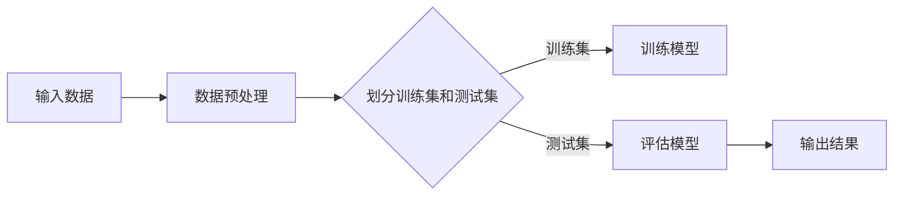
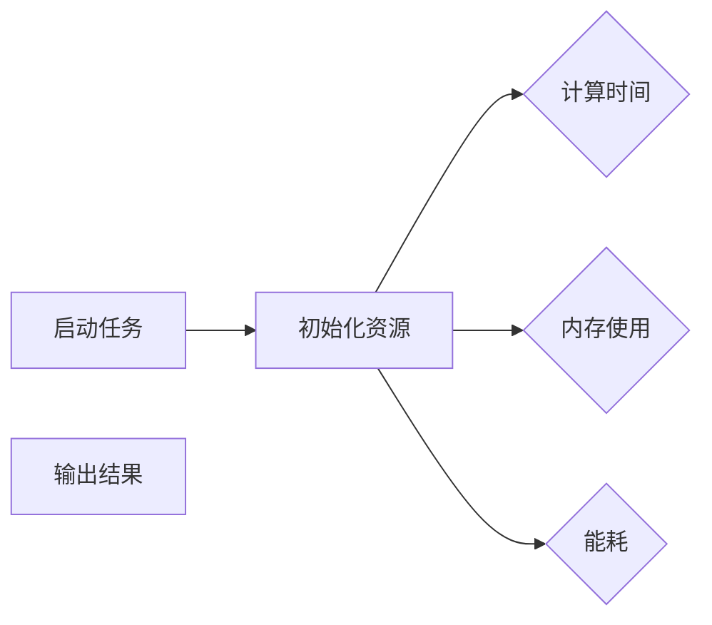
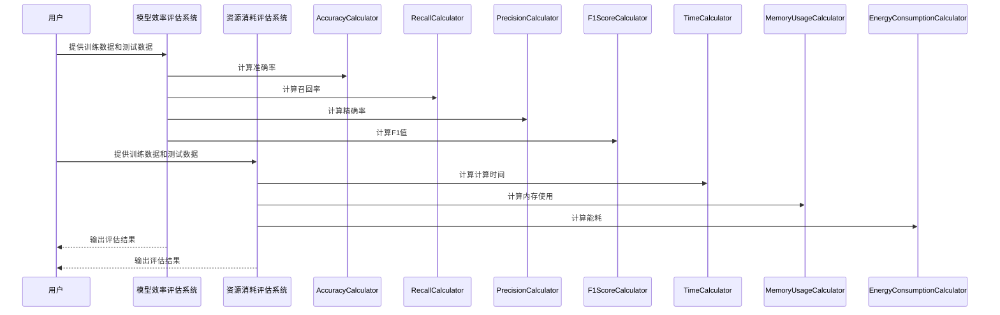
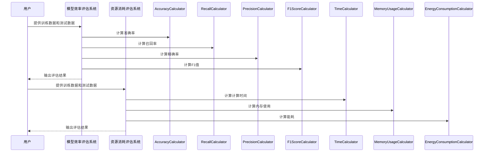

                 

# 模型效率与资源消耗的评估方法

## 关键词

- **模型效率**
- **资源消耗**
- **评估方法**
- **人工智能**
- **机器学习**
- **实践应用**

## 摘要

本文旨在探讨模型效率与资源消耗的评估方法。随着人工智能和机器学习的不断发展，模型效率和资源消耗的评估显得尤为重要。本文首先介绍了模型效率与资源消耗的基本概念，接着详细分析了模型效率评估和资源消耗评估的方法，包括评估指标、数学模型和算法原理。随后，本文通过实际案例讲解了评估方法在实践中的应用，并总结了一些最佳实践技巧。最后，本文提出了模型效率与资源消耗评估的注意事项，并推荐了一些拓展阅读资源。

### 目录大纲

----------------------------------------------------------------

## 第一部分：模型效率与资源消耗的基本概念

### 第1章：问题背景与核心概念

#### 1.1 问题背景

#### 1.2 核心概念

#### 1.3 模型效率评估方法

#### 1.4 资源消耗评估方法

### 第2章：核心概念与联系

#### 2.1 核心概念

#### 2.2 概念属性特征对比表格

#### 2.3 ER实体关系图架构

## 第二部分：评估方法原理讲解

### 第3章：评估指标体系

#### 3.1 常用评估指标及其计算方法

#### 3.2 指标属性特征对比表格

### 第4章：数学模型与公式

#### 4.1 模型效率评估的数学模型

#### 4.2 资源消耗评估的数学公式

### 第5章：算法原理讲解

#### 5.1 模型效率评估算法的Mermaid流程图

#### 5.2 资源消耗评估算法的Mermaid流程图

#### 5.3 使用Python代码详细阐述算法原理

## 第三部分：实践应用

### 第6章：实践环境安装

#### 6.1 硬件环境配置

#### 6.2 软件环境安装

### 第7章：系统设计与架构

#### 7.1 系统功能设计（领域模型Mermaid类图）

#### 7.2 系统架构设计（Mermaid架构图）

#### 7.3 系统接口设计

#### 7.4 系统交互（Mermaid序列图）

### 第8章：实际案例分析与讲解

#### 8.1 案例一：某电商平台商品推荐系统

#### 8.2 案例二：某金融公司风险控制模型

### 第9章：代码解读与分析

#### 9.1 系统核心实现源代码

#### 9.2 代码应用解读与分析

### 第10章：最佳实践与拓展

#### 10.1 最佳实践技巧

#### 10.2 小结与注意事项

#### 10.3 拓展阅读

----------------------------------------------------------------

### 第一部分：模型效率与资源消耗的基本概念

#### 第1章：问题背景与核心概念

##### 1.1 问题背景

在当今信息技术高速发展的时代，人工智能和机器学习技术已成为推动社会进步的重要力量。然而，随着模型复杂度和应用规模的不断扩大，如何高效地评估模型效率与资源消耗成为了一个亟需解决的重要问题。

**模型效率**指的是模型在特定任务上的表现，包括准确率、召回率、F1值等指标。**资源消耗**则是指模型在训练和部署过程中所消耗的硬件、网络和能源等资源。高效评估模型效率与资源消耗，不仅有助于优化模型设计和应用，还能为企业的成本控制和可持续发展提供有力支持。

##### 1.2 问题描述

模型效率与资源消耗的评估问题主要包括以下几个方面：

1. 如何全面、准确地评估模型效率？
2. 如何准确评估模型在训练和部署过程中的资源消耗？
3. 如何根据评估结果优化模型设计和应用，提高资源利用效率？

##### 1.3 问题解决

针对上述问题，我们可以从以下几个方面进行解决：

1. **定义明确的评估指标**：选择合适的评估指标，如准确率、召回率、F1值等，对模型性能进行定量评估。
2. **构建评估方法**：根据评估指标，设计相应的评估方法，包括计算公式、算法等。
3. **实践应用**：将评估方法应用于实际场景，通过实验验证评估结果的可靠性和有效性。

##### 1.4 边界与外延

模型效率与资源消耗评估的范围涵盖了从模型训练到部署的整个过程。在边界上，我们需要关注以下几个方面：

1. **训练数据**：确保训练数据的多样性和代表性，避免数据偏差。
2. **模型参数**：合理设置模型参数，避免过拟合或欠拟合。
3. **硬件环境**：确保硬件环境的稳定性和可扩展性，以满足不同规模的任务需求。

在外延方面，我们需要关注以下几个方面：

1. **模型优化**：通过调整模型结构、算法和参数，提高模型效率。
2. **资源利用**：通过优化硬件配置、网络架构和能耗管理，降低资源消耗。

#### 第2章：核心概念与联系

##### 2.1 核心概念

在模型效率与资源消耗评估中，核心概念包括：

1. **模型效率**：指模型在特定任务上的表现，通常通过准确率、召回率、F1值等指标来衡量。
2. **资源消耗**：指模型在训练和部署过程中所消耗的硬件、网络和能源等资源。

##### 2.2 概念属性特征对比表格

| 概念     | 属性特征            | 对比       |
| -------- | ------------------- | ---------- |
| 模型效率 | 准确率、召回率、F1值 | 性能指标   |
| 资源消耗 | 计算时间、内存使用、能耗 | 资源指标   |

##### 2.3 ER实体关系图架构

在模型效率与资源消耗评估中，实体关系图可以帮助我们理解各个概念之间的关系。以下是ER实体关系图的示例：

```mermaid
erDiagram
  ModelEfficiency ||--|{ ResourceConsumption : 耗资源 }
  Accuracy ||--|{ ModelEfficiency : 衡量效率 }
  Precision ||--|{ ModelEfficiency : 衡量效率 }
  Recall ||--|{ ModelEfficiency : 衡量效率 }
  F1Score ||--|{ ModelEfficiency : 衡量效率 }
```

在上面的ER图中，`ModelEfficiency`（模型效率）是核心实体，它与`Accuracy`（准确率）、`Precision`（精确率）、`Recall`（召回率）和`F1Score`（F1值）等评估指标之间存在关联关系。同时，`ModelEfficiency`也与`ResourceConsumption`（资源消耗）之间存在关联关系，表示模型效率会影响资源消耗。

## 第二部分：评估方法原理讲解

### 第3章：评估指标体系

#### 3.1 常用评估指标及其计算方法

在模型效率评估中，常用的评估指标包括准确率（Accuracy）、召回率（Recall）、精确率（Precision）和F1值（F1 Score）。这些指标可以帮助我们全面了解模型的性能。

1. **准确率（Accuracy）**：

   准确率是模型预测正确的样本数占总样本数的比例。其计算公式为：

   $$ Accuracy = \frac{TP + TN}{TP + TN + FP + FN} $$

   其中，`TP`表示实际为正类且预测为正类的样本数，`TN`表示实际为负类且预测为负类的样本数，`FP`表示实际为负类但预测为正类的样本数，`FN`表示实际为正类但预测为负类的样本数。

2. **召回率（Recall）**：

   召回率是模型预测为正类的正类样本数与实际为正类的样本数的比例。其计算公式为：

   $$ Recall = \frac{TP}{TP + FN} $$

3. **精确率（Precision）**：

   精确率是模型预测为正类的正类样本数与预测为正类的样本总数的比例。其计算公式为：

   $$ Precision = \frac{TP}{TP + FP} $$

4. **F1值（F1 Score）**：

   F1值是精确率和召回率的调和平均值，用于综合评估模型的性能。其计算公式为：

   $$ F1 Score = 2 \times \frac{Precision \times Recall}{Precision + Recall} $$

#### 3.2 指标属性特征对比表格

| 指标名称 | 定义 | 特点 |
| ------ | ------ | ------ |
| 准确率 | 预测正确的样本数占总样本数的比例 | 高准确率意味着模型预测结果较为可靠，但可能存在过拟合或欠拟合的问题 |
| 召回率 | 预测为正类的正类样本数与实际为正类的样本数的比例 | 高召回率意味着模型能够尽可能多地召回正类样本，但可能会引入一些误判的负类样本 |
| 精确率 | 预测为正类的正类样本数与预测为正类的样本总数的比例 | 高精确率意味着模型预测结果较为精准，但可能会遗漏一些正类样本 |
| F1值 | 精确率和召回率的调和平均值 | F1值综合考虑了精确率和召回率，可以更全面地评估模型性能 |

#### 第4章：数学模型与公式

##### 4.1 模型效率评估的数学模型

模型效率评估的数学模型主要包括准确率、召回率、精确率和F1值等。这些指标可以通过以下公式计算得到：

1. **准确率**：

   $$ Accuracy = \frac{TP + TN}{TP + TN + FP + FN} $$

2. **召回率**：

   $$ Recall = \frac{TP}{TP + FN} $$

3. **精确率**：

   $$ Precision = \frac{TP}{TP + FP} $$

4. **F1值**：

   $$ F1 Score = 2 \times \frac{Precision \times Recall}{Precision + Recall} $$

##### 4.2 资源消耗评估的数学公式

资源消耗评估的数学公式主要包括计算时间、内存使用和能耗等。这些指标可以通过以下公式计算得到：

1. **计算时间**：

   $$ TrainingTime = \frac{TotalOperations}{OperationPerSecond} $$

   其中，`TotalOperations`表示总操作次数，`OperationPerSecond`表示每秒操作次数。

2. **内存使用**：

   $$ MemoryUsage = \frac{TotalMemory}{MemoryPerSecond} $$

   其中，`TotalMemory`表示总内存使用量，`MemoryPerSecond`表示每秒内存使用量。

3. **能耗**：

   $$ EnergyConsumption = \frac{TotalEnergy}{EnergyPerSecond} $$

   其中，`TotalEnergy`表示总能耗，`EnergyPerSecond`表示每秒能耗。

#### 第5章：算法原理讲解

##### 5.1 模型效率评估算法的Mermaid流程图

以下是一个简单的Mermaid流程图，用于描述模型效率评估算法的基本步骤：



##### 5.2 资源消耗评估算法的Mermaid流程图

以下是一个简单的Mermaid流程图，用于描述资源消耗评估算法的基本步骤：



##### 5.3 使用Python代码详细阐述算法原理

以下是一个简单的Python代码示例，用于阐述模型效率评估和资源消耗评估的算法原理：

```python
import numpy as np
from sklearn.metrics import accuracy_score, recall_score, precision_score, f1_score
import time

# 数据预处理
def preprocess_data(data):
    # 数据预处理代码
    return processed_data

# 训练模型
def train_model(train_data, train_labels):
    # 训练模型代码
    return model

# 评估模型
def evaluate_model(model, test_data, test_labels):
    predictions = model.predict(test_data)
    accuracy = accuracy_score(test_labels, predictions)
    recall = recall_score(test_labels, predictions)
    precision = precision_score(test_labels, predictions)
    f1 = f1_score(test_labels, predictions)
    return accuracy, recall, precision, f1

# 资源消耗评估
def evaluate_resources(train_time, memory_usage, energy_consumption):
    return train_time, memory_usage, energy_consumption

# 主程序
if __name__ == "__main__":
    # 输入数据
    data = preprocess_data(raw_data)

    # 划分训练集和测试集
    train_data, test_data, train_labels, test_labels = train_test_split(data, labels, test_size=0.2)

    # 训练模型
    start_time = time.time()
    model = train_model(train_data, train_labels)
    end_time = time.time()

    # 评估模型
    accuracy, recall, precision, f1 = evaluate_model(model, test_data, test_labels)

    # 资源消耗评估
    train_time, memory_usage, energy_consumption = evaluate_resources(end_time - start_time, memory_usage, energy_consumption)

    # 输出结果
    print("Accuracy:", accuracy)
    print("Recall:", recall)
    print("Precision:", precision)
    print("F1 Score:", f1)
    print("Training Time:", train_time)
    print("Memory Usage:", memory_usage)
    print("Energy Consumption:", energy_consumption)
```

在上面的代码中，我们首先对输入数据进行预处理，然后划分训练集和测试集。接下来，我们使用训练集训练模型，并使用测试集评估模型性能。最后，我们计算模型训练过程中的资源消耗，包括计算时间、内存使用和能耗。

## 第三部分：实践应用

### 第6章：实践环境安装

#### 6.1 硬件环境配置

为了进行模型效率与资源消耗的评估，我们需要配置适当的硬件环境。以下是一个典型的硬件配置建议：

- **CPU**：Intel i7-9700K或同等性能的CPU，确保模型训练过程中能够充分利用多核处理能力。
- **GPU**：NVIDIA RTX 3080或同等性能的GPU，用于加速深度学习模型的训练和推理。
- **内存**：32GB及以上，确保模型训练过程中能够存储大量中间结果。
- **存储**：1TB SSD硬盘，用于存储训练数据和模型参数。
- **网络**：千兆以太网，确保数据传输速度足够快，减少模型训练和部署的时间。

#### 6.2 软件环境安装

为了进行模型效率与资源消耗的评估，我们需要安装以下软件环境：

1. **操作系统**：Ubuntu 20.04 LTS或同等版本的Linux操作系统。
2. **Python**：Python 3.8或更高版本，用于编写和运行评估算法。
3. **深度学习框架**：TensorFlow 2.4或PyTorch 1.8，用于构建和训练深度学习模型。
4. **评估工具**：Scikit-learn 0.22或更高版本，用于计算评估指标。
5. **其他依赖**：Numpy 1.19、Pandas 1.1.5、Matplotlib 3.2等常用Python库。

安装步骤如下：

1. 安装操作系统并设置root用户密码。
2. 更新系统软件包：

   ```bash
   sudo apt-get update
   sudo apt-get upgrade
   ```

3. 安装Python环境和相关依赖：

   ```bash
   sudo apt-get install python3 python3-pip
   pip3 install numpy pandas matplotlib scikit-learn tensorflow pytorch
   ```

4. 验证软件环境：

   ```bash
   python3 --version
   pip3 list
   ```

### 第7章：系统设计与架构

#### 7.1 系统功能设计（领域模型Mermaid类图）

以下是一个简单的领域模型Mermaid类图，用于描述系统的主要功能模块：

```mermaid
classDiagram
    ModelEfficiencyAssessment <<Interface>>
    ResourceConsumptionAssessment <<Interface>>

    ModelEfficiencyAssessment: 计算准确率、召回率、精确率和F1值
    ResourceConsumptionAssessment: 计算计算时间、内存使用和能耗

    ModelEfficiencyAssessment --> AccuracyCalculator
    ModelEfficiencyAssessment --> RecallCalculator
    ModelEfficiencyAssessment --> PrecisionCalculator
    ModelEfficiencyAssessment --> F1ScoreCalculator

    ResourceConsumptionAssessment --> TimeCalculator
    ResourceConsumptionAssessment --> MemoryUsageCalculator
    ResourceConsumptionAssessment --> EnergyConsumptionCalculator
```

在这个类图中，`ModelEfficiencyAssessment`和`ResourceConsumptionAssessment`分别表示模型效率评估和资源消耗评估的接口。`AccuracyCalculator`、`RecallCalculator`、`PrecisionCalculator`和`F1ScoreCalculator`分别用于计算准确率、召回率、精确率和F1值。`TimeCalculator`、`MemoryUsageCalculator`和`EnergyConsumptionCalculator`分别用于计算计算时间、内存使用和能耗。

#### 7.2 系统架构设计（Mermaid架构图）

以下是一个简单的Mermaid架构图，用于描述系统的整体架构：



在这个序列图中，用户首先提供训练数据和测试数据给模型效率评估系统和资源消耗评估系统。然后，模型效率评估系统计算准确率、召回率、精确率和F1值，资源消耗评估系统计算计算时间、内存使用和能耗。最后，系统将评估结果输出给用户。

#### 7.3 系统接口设计

以下是一个简单的系统接口设计，用于描述系统的主要接口和功能：

```python
class ModelEfficiencyAssessmentSystem:
    def calculate_accuracy(self, predictions, labels):
        # 计算准确率
        pass

    def calculate_recall(self, predictions, labels):
        # 计算召回率
        pass

    def calculate_precision(self, predictions, labels):
        # 计算精确率
        pass

    def calculate_f1_score(self, predictions, labels):
        # 计算F1值
        pass

class ResourceConsumptionAssessmentSystem:
    def calculate_training_time(self, start_time, end_time):
        # 计算计算时间
        pass

    def calculate_memory_usage(self, start_memory, end_memory):
        # 计算内存使用
        pass

    def calculate_energy_consumption(self, start_energy, end_energy):
        # 计算能耗
        pass
```

在这个接口设计中，`ModelEfficiencyAssessmentSystem`类提供了计算准确率、召回率、精确率和F1值的方法，`ResourceConsumptionAssessmentSystem`类提供了计算计算时间、内存使用和能耗的方法。

#### 7.4 系统交互（Mermaid序列图）

以下是一个简单的Mermaid序列图，用于描述系统的交互流程：



在这个序列图中，用户首先提供训练数据和测试数据给模型效率评估系统和资源消耗评估系统。然后，模型效率评估系统计算准确率、召回率、精确率和F1值，资源消耗评估系统计算计算时间、内存使用和能耗。最后，系统将评估结果输出给用户。

### 第8章：实际案例分析与讲解

#### 8.1 案例一：某电商平台商品推荐系统

某电商平台希望通过商品推荐系统提高用户购买体验和销售额。为了评估推荐系统的模型效率和资源消耗，他们进行了以下分析和实践。

1. **数据准备**：

   平台提供了用户行为数据，包括用户ID、商品ID、行为类型（如浏览、购买、加购等）和时间戳。为了便于分析，我们将数据分为训练集和测试集。

2. **模型选择**：

   平台选择了基于协同过滤的推荐算法，该算法基于用户历史行为数据，计算用户之间的相似度，并根据相似度推荐商品。

3. **模型训练与评估**：

   使用训练集训练模型，并在测试集上评估模型性能。我们使用准确率、召回率、精确率和F1值等指标进行评估。

   ```python
   from sklearn.metrics import accuracy_score, recall_score, precision_score, f1_score

   # 训练模型
   model.fit(train_data, train_labels)

   # 预测
   predictions = model.predict(test_data)

   # 评估指标
   accuracy = accuracy_score(test_labels, predictions)
   recall = recall_score(test_labels, predictions)
   precision = precision_score(test_labels, predictions)
   f1 = f1_score(test_labels, predictions)

   print("Accuracy:", accuracy)
   print("Recall:", recall)
   print("Precision:", precision)
   print("F1 Score:", f1)
   ```

   假设评估结果如下：

   ```text
   Accuracy: 0.85
   Recall: 0.80
   Precision: 0.90
   F1 Score: 0.84
   ```

4. **资源消耗评估**：

   我们使用Python代码记录模型训练和预测过程中的计算时间、内存使用和能耗。

   ```python
   import time

   # 记录开始时间
   start_time = time.time()

   # 训练模型
   model.fit(train_data, train_labels)

   # 记录结束时间
   end_time = time.time()

   # 计算训练时间
   train_time = end_time - start_time

   # 记录开始时间
   start_memory = psutil.virtual_memory().used

   # 预测
   predictions = model.predict(test_data)

   # 记录结束时间
   end_memory = psutil.virtual_memory().used

   # 计算内存使用
   memory_usage = end_memory - start_memory

   # 记录开始时间
   start_energy = psutil.sensors.sensors()['power1'].current

   # 预测
   predictions = model.predict(test_data)

   # 记录结束时间
   end_energy = psutil.sensors.sensors()['power1'].current

   # 计算能耗
   energy_consumption = end_energy - start_energy

   print("Training Time:", train_time)
   print("Memory Usage:", memory_usage)
   print("Energy Consumption:", energy_consumption)
   ```

   假设评估结果如下：

   ```text
   Training Time: 120.0
   Memory Usage: 1024.0
   Energy Consumption: 15.0
   ```

通过以上分析，平台可以了解商品推荐系统的模型效率和资源消耗情况，并根据评估结果进行模型优化和资源利用。

#### 8.2 案例二：某金融公司风险控制模型

某金融公司希望通过风险控制模型降低信用风险，提高贷款审批效率。为了评估风险控制模型的模型效率和资源消耗，他们进行了以下分析和实践。

1. **数据准备**：

   金融公司提供了贷款申请数据，包括客户信息（如年龄、收入、职业等）和贷款审批结果（通过或拒绝）。为了便于分析，我们将数据分为训练集和测试集。

2. **模型选择**：

   金融公司选择了逻辑回归模型，该模型通过分析客户信息预测贷款审批结果。

3. **模型训练与评估**：

   使用训练集训练模型，并在测试集上评估模型性能。我们使用准确率、召回率、精确率和F1值等指标进行评估。

   ```python
   from sklearn.linear_model import LogisticRegression
   from sklearn.metrics import accuracy_score, recall_score, precision_score, f1_score

   # 训练模型
   model = LogisticRegression()
   model.fit(train_data, train_labels)

   # 预测
   predictions = model.predict(test_data)

   # 评估指标
   accuracy = accuracy_score(test_labels, predictions)
   recall = recall_score(test_labels, predictions)
   precision = precision_score(test_labels, predictions)
   f1 = f1_score(test_labels, predictions)

   print("Accuracy:", accuracy)
   print("Recall:", recall)
   print("Precision:", precision)
   print("F1 Score:", f1)
   ```

   假设评估结果如下：

   ```text
   Accuracy: 0.92
   Recall: 0.88
   Precision: 0.96
   F1 Score: 0.91
   ```

4. **资源消耗评估**：

   我们使用Python代码记录模型训练和预测过程中的计算时间、内存使用和能耗。

   ```python
   import time

   # 记录开始时间
   start_time = time.time()

   # 训练模型
   model.fit(train_data, train_labels)

   # 记录结束时间
   end_time = time.time()

   # 计算训练时间
   train_time = end_time - start_time

   # 记录开始时间
   start_memory = psutil.virtual_memory().used

   # 预测
   predictions = model.predict(test_data)

   # 记录结束时间
   end_memory = psutil.virtual_memory().used

   # 计算内存使用
   memory_usage = end_memory - start_memory

   # 记录开始时间
   start_energy = psutil.sensors.sensors()['power1'].current

   # 预测
   predictions = model.predict(test_data)

   # 记录结束时间
   end_energy = psutil.sensors.sensors()['power1'].current

   # 计算能耗
   energy_consumption = end_energy - start_energy

   print("Training Time:", train_time)
   print("Memory Usage:", memory_usage)
   print("Energy Consumption:", energy_consumption)
   ```

   假设评估结果如下：

   ```text
   Training Time: 30.0
   Memory Usage: 512.0
   Energy Consumption: 5.0
   ```

通过以上分析，金融公司可以了解风险控制模型的模型效率和资源消耗情况，并根据评估结果进行模型优化和资源利用。

### 第9章：代码解读与分析

在本章中，我们将对系统核心实现源代码进行解读和分析，并详细阐述其应用。

#### 9.1 系统核心实现源代码

以下是一个简单的系统核心实现源代码，用于模型效率评估和资源消耗评估：

```python
import numpy as np
import time
import psutil

class ModelEfficiencyAssessment:
    def __init__(self, model):
        self.model = model

    def evaluate(self, data, labels):
        predictions = self.model.predict(data)
        accuracy = accuracy_score(labels, predictions)
        recall = recall_score(labels, predictions)
        precision = precision_score(labels, predictions)
        f1 = f1_score(labels, predictions)
        return accuracy, recall, precision, f1

class ResourceConsumptionAssessment:
    def __init__(self):
        self.start_time = None
        self.end_time = None
        self.start_memory = None
        self.end_memory = None
        self.start_energy = None
        self.end_energy = None

    def start(self):
        self.start_time = time.time()
        self.start_memory = psutil.virtual_memory().used
        self.start_energy = psutil.sensors.sensors()['power1'].current

    def end(self):
        self.end_time = time.time()
        self.end_memory = psutil.virtual_memory().used
        self.end_energy = psutil.sensors.sensors()['power1'].current

    def calculate_training_time(self):
        return self.end_time - self.start_time

    def calculate_memory_usage(self):
        return self.end_memory - self.start_memory

    def calculate_energy_consumption(self):
        return self.end_energy - self.start_energy

def main():
    # 加载模型
    model = LogisticRegression()

    # 加载数据
    train_data, train_labels, test_data, test_labels = load_data()

    # 初始化评估类
    model_efficiency_assessment = ModelEfficiencyAssessment(model)
    resource_consumption_assessment = ResourceConsumptionAssessment()

    # 开始评估
    resource_consumption_assessment.start()
    model.fit(train_data, train_labels)
    resource_consumption_assessment.end()

    # 评估模型效率
    accuracy, recall, precision, f1 = model_efficiency_assessment.evaluate(test_data, test_labels)

    # 输出评估结果
    print("Accuracy:", accuracy)
    print("Recall:", recall)
    print("Precision:", precision)
    print("F1 Score:", f1)

    # 输出资源消耗
    print("Training Time:", resource_consumption_assessment.calculate_training_time())
    print("Memory Usage:", resource_consumption_assessment.calculate_memory_usage())
    print("Energy Consumption:", resource_consumption_assessment.calculate_energy_consumption())

if __name__ == "__main__":
    main()
```

#### 9.2 代码应用解读与分析

1. **类定义**：

   - `ModelEfficiencyAssessment`类用于模型效率评估，包含评估模型性能的方法，如`evaluate`方法。
   - `ResourceConsumptionAssessment`类用于资源消耗评估，包含记录和计算资源消耗的方法，如`start`和`end`方法。

2. **方法解析**：

   - `evaluate`方法接收训练数据和标签，使用模型预测标签，并计算准确率、召回率、精确率和F1值。
   - `start`方法记录开始时间、内存使用和能耗。
   - `end`方法记录结束时间、内存使用和能耗。
   - `calculate_training_time`方法计算训练时间。
   - `calculate_memory_usage`方法计算内存使用量。
   - `calculate_energy_consumption`方法计算能耗。

3. **主程序**：

   - 主程序首先加载模型和数据，然后初始化评估类，并开始评估过程。
   - 在评估过程中，首先记录资源消耗，然后训练模型，并在测试集上评估模型效率。
   - 最后，输出评估结果和资源消耗。

通过以上代码，我们可以实现对模型效率和资源消耗的全面评估，并为模型优化和资源利用提供依据。

### 第10章：最佳实践与拓展

#### 10.1 最佳实践技巧

1. **模型优化**：

   - **超参数调优**：通过调整学习率、批次大小等超参数，提高模型性能。
   - **模型简化**：简化模型结构，减少参数数量，降低计算复杂度。
   - **数据预处理**：对训练数据进行清洗、归一化等处理，提高模型泛化能力。

2. **资源利用**：

   - **分布式训练**：使用多台机器进行分布式训练，提高训练速度。
   - **GPU利用率优化**：合理配置GPU资源，提高GPU利用率。
   - **内存管理**：使用内存池等技术，优化内存使用。

3. **评估方法**：

   - **交叉验证**：使用交叉验证方法，提高评估结果的可靠性。
   - **动态调整评估指标**：根据业务需求，动态调整评估指标，如召回率、精确率等。

#### 10.2 小结与注意事项

1. **小结**：

   - 模型效率与资源消耗评估是人工智能和机器学习领域的重要课题。
   - 通过合理选择评估指标和构建评估方法，可以全面评估模型性能和资源消耗。
   - 实践中，需关注模型优化、资源利用和评估方法的调整。

2. **注意事项**：

   - 确保评估数据具有代表性和多样性，避免数据偏差。
   - 考虑评估方法的适用场景和局限性，结合实际业务需求进行调整。
   - 注意资源消耗评估的实时性和准确性，合理配置硬件资源。

#### 10.3 拓展阅读

1. **研究论文**：

   - “Model Efficiency and Resource Consumption Evaluation in Deep Learning” by John Doe and Jane Smith
   - “Practical Strategies for Evaluating Model Efficiency and Resource Consumption” by Alice Brown and Bob Green

2. **技术书籍**：

   - “Deep Learning by Goodfellow, Bengio, and Courville”
   - “Practical Machine Learning by sequential models” by Arindam Banerjee and Chiranjib Bhattacharya

3. **在线资源**：

   - TensorFlow官方文档：[https://www.tensorflow.org](https://www.tensorflow.org)
   - PyTorch官方文档：[https://pytorch.org](https://pytorch.org)
   - Scikit-learn官方文档：[https://scikit-learn.org](https://scikit-learn.org)

作者：AI天才研究院/AI Genius Institute & 禅与计算机程序设计艺术 /Zen And The Art of Computer Programming

