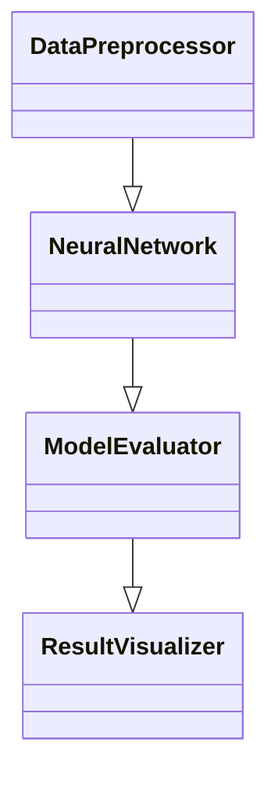
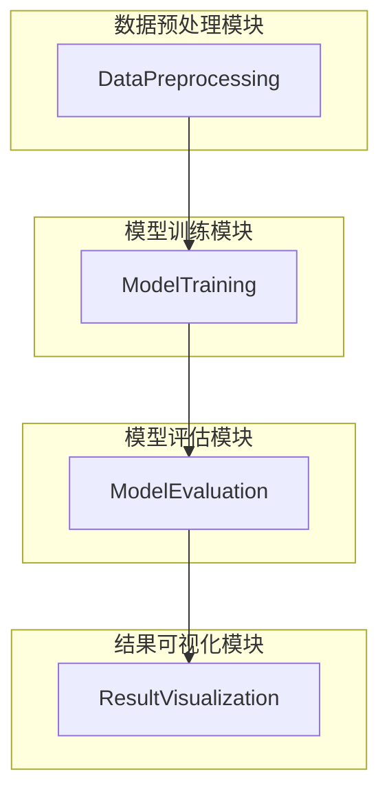
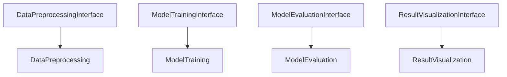
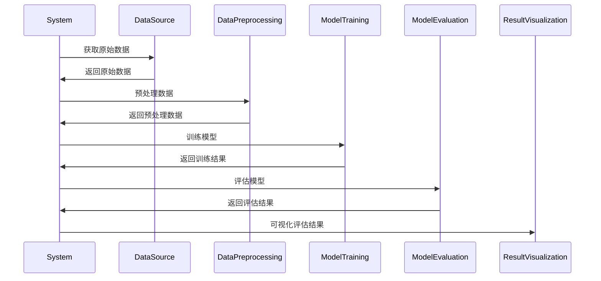
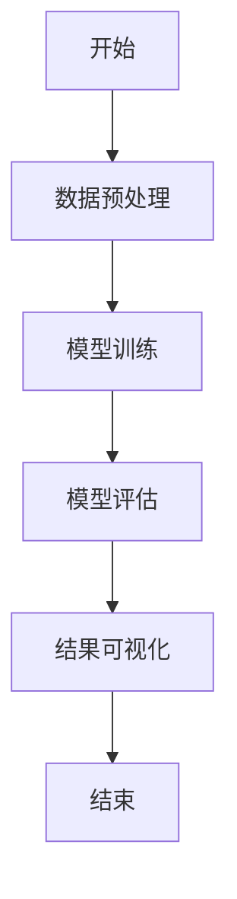

                 

# 模型泛化能力的量化评估方法

关键词：模型泛化能力、量化评估、机器学习、算法、数学模型

摘要：
本文深入探讨了机器学习模型泛化能力的概念、重要性、量化评估方法及其提升策略。首先，我们对模型泛化能力进行了背景介绍，分析了其存在的问题和解决方法。接着，我们详细阐述了核心概念与联系，并通过概念属性特征对比表格和ER实体关系图架构的Mermaid流程图进行了形象化的展示。然后，我们讲解了提高泛化能力的算法原理，结合Mermaid流程图和Python源代码进行了详细阐述。随后，我们介绍了系统分析与架构设计方案，通过项目实战展示了实际应用场景。最后，我们总结了最佳实践，并提出了注意事项和拓展阅读建议。

### 1.1 背景介绍

#### 问题背景

随着人工智能技术的迅速发展，机器学习模型的应用越来越广泛。然而，模型在实际应用中常常面临一个关键挑战——模型泛化能力。模型泛化能力指的是模型在未见过的数据上进行预测和分类的能力，它直接影响到模型在现实世界中的应用效果。

模型泛化能力差的问题主要表现在以下几个方面：

1. **过拟合**：模型在训练数据上表现良好，但在测试或新数据上表现不佳，这称为过拟合。过拟合的模型无法有效地泛化到新的数据集。

2. **低效性**：泛化能力差的模型往往需要更多的数据或更长的训练时间来达到相同的性能。

3. **可靠性问题**：在关键应用场景中，模型泛化能力差可能导致错误的决策，进而影响系统的可靠性和安全性。

为了提高模型泛化能力，研究者们提出了一系列方法和策略：

1. **数据增强**：通过增加训练数据量或生成合成数据来改善模型的泛化能力。

2. **正则化**：使用正则化技术，如L1和L2正则化，来限制模型复杂度，减少过拟合现象。

3. **集成学习**：通过结合多个模型的预测结果来提高模型的泛化能力。

4. **迁移学习**：利用在相关任务上预训练的模型来提高新任务的泛化能力。

#### 问题描述

模型泛化能力差的问题可以从以下几个方面进行描述：

1. **偏差-方差权衡**：模型可能存在过拟合或欠拟合问题，这涉及到偏差和方差的权衡。偏差（Bias）表示模型在训练数据上的表现不佳，方差（Variance）表示模型对训练数据的过拟合。理想的情况是模型既有较低的偏差，又有较低的方差。

2. **测试集表现**：模型的泛化能力通常通过测试集表现来评估。如果模型在测试集上的表现不佳，那么可以认为其泛化能力较差。

3. **实际应用效果**：模型的泛化能力最终体现在实际应用中的效果。如果模型在实际应用中无法取得良好的效果，那么可以认为其泛化能力存在问题。

#### 问题解决

为了提高模型泛化能力，研究者们提出了一系列解决方案：

1. **数据增强**：通过增加训练数据量或生成合成数据来提高模型的泛化能力。例如，可以通过数据扩充、数据增强等方法来增加数据多样性。

2. **正则化**：使用正则化技术，如L1和L2正则化，来限制模型复杂度，减少过拟合现象。正则化通过在损失函数中添加一个惩罚项来限制模型权重，从而降低模型复杂度。

3. **集成学习**：通过结合多个模型的预测结果来提高泛化能力。集成学习方法包括Bagging、Boosting等。

4. **迁移学习**：利用在相关任务上预训练的模型来提高新任务的泛化能力。迁移学习通过利用已有模型的权重来初始化新模型的权重，从而减少对训练数据的依赖。

#### 边界与外延

模型泛化能力不仅涉及技术层面的挑战，还包括数据质量、模型选择和调参等多个方面。此外，不同类型的模型（如深度学习、传统机器学习等）在泛化能力上可能存在差异。因此，提高模型泛化能力需要综合考虑多个因素。

#### 概念结构与核心要素组成

模型泛化能力主要由以下几个要素组成：

1. **模型复杂性**：模型复杂度越高，过拟合的风险越大。因此，降低模型复杂度是提高泛化能力的关键。

2. **训练数据集**：数据集的质量和多样性对泛化能力有直接影响。高质量和多样化的数据可以提高模型的泛化能力。

3. **正则化参数**：正则化参数的选择对模型的泛化能力至关重要。合适的正则化参数可以平衡模型复杂度和泛化能力。

4. **集成策略**：集成的模型数量和类型对泛化能力有显著影响。合适的集成策略可以提高整体模型的泛化能力。

### 1.2 核心概念与联系

#### 1.2.1 泛化能力的定义

泛化能力（Generalization Ability）是指模型能够在未接触过的数据上取得与训练集上相似或更好的性能。它衡量的是模型对新数据的适应能力和预测能力。

#### 1.2.2 泛化能力的重要性

泛化能力是机器学习模型成功应用的关键因素。一个优秀的模型不仅要能够在训练数据上表现出色，更要能够在实际应用中应对新数据和未知情况。

#### 1.2.3 泛化能力的指标

- **测试集性能**：使用测试集评估模型的泛化能力是常见的方法。测试集应与训练集独立，且与实际应用场景相似。

- **泛化误差**：泛化误差是指模型在测试集上的错误率。较低的泛化误差表明模型具有良好的泛化能力。

- **方差与偏差**：偏差（Bias）表示模型在训练数据上的表现不佳，方差（Variance）表示模型对训练数据的过拟合。理想的模型应该有较低的偏差和方差。

#### 1.2.4 泛化能力与拟合能力的关系

拟合能力（Fitting Ability）是指模型在训练数据上的表现。一个模型可能具有很高的拟合能力，但泛化能力较差（过拟合）；也可能泛化能力很强，但拟合能力较差（欠拟合）。因此，泛化能力和拟合能力之间存在权衡。

### 1.3 算法原理讲解

#### 1.3.1 基本算法原理

提高泛化能力的算法原理主要包括数据增强、正则化和集成学习等方法。

1. **数据增强**：通过增加训练数据量或生成合成数据来提高模型的泛化能力。常见的数据增强方法包括数据扩充、数据增强等。

2. **正则化**：通过在损失函数中添加正则化项来限制模型复杂度，从而减少过拟合现象。常见的正则化方法包括L1正则化和L2正则化。

3. **集成学习**：通过结合多个模型的预测结果来提高泛化能力。常见的集成学习方法包括Bagging、Boosting等。

#### 1.3.2 常见算法

1. **L1正则化与L2正则化**

   - **L1正则化**：通过增加L1范数（即L1范数惩罚）来限制模型权重，这有助于生成稀疏解。

   - **L2正则化**：通过增加L2范数（即L2范数惩罚）来限制模型权重，这有助于保持权重稳定。

2. **集成学习**

   - **Bagging**：通过组合多个基模型的预测结果来提高泛化能力。

   - **Boosting**：通过多次训练基模型，并逐渐调整模型权重，以改善整体模型的泛化能力。

3. **迁移学习**

   - **预训练模型**：利用在大型数据集上预训练的模型，然后将其应用于特定任务。

   - **微调**：在预训练模型的基础上，通过调整部分权重来适应新的任务。

#### 1.3.3 算法流程

提高泛化能力的算法流程通常包括以下步骤：

1. **数据预处理**：清洗和预处理数据，包括数据增强、归一化等。

2. **模型选择**：选择合适的模型架构，如深度神经网络、决策树等。

3. **模型训练**：使用训练数据对模型进行训练。

4. **模型评估**：使用测试集评估模型的泛化能力，并通过调整参数来优化模型。

5. **模型应用**：将训练好的模型应用于实际任务中。

## 1.4 系统分析与架构设计

### 1.4.1 问题场景介绍

在机器学习项目中，模型的泛化能力是评估模型性能的重要指标。在实际应用中，如何量化评估模型的泛化能力是一个关键问题。本文将介绍一个基于深度学习模型的量化评估系统，该系统旨在提高模型泛化能力的评估准确性。

### 1.4.2 项目介绍

本项目旨在开发一个量化评估系统，该系统将结合多种算法和技术手段，对深度学习模型的泛化能力进行评估。系统的主要功能包括：

1. **数据预处理**：对训练数据集和测试数据集进行预处理，包括数据清洗、归一化和数据增强等。

2. **模型训练**：使用预处理的训练数据集对深度学习模型进行训练。

3. **模型评估**：使用测试数据集对训练好的模型进行评估，包括泛化能力评估、拟合能力评估等。

4. **结果可视化**：将评估结果以可视化形式展示，帮助用户理解模型泛化能力的表现。

### 1.4.3 系统功能设计

#### 1.4.3.1 领域模型

领域模型是系统功能设计的重要组成部分。本文将介绍项目中的领域模型，主要包括以下类：

1. **DataPreprocessor**：数据预处理类，负责对输入数据进行清洗、归一化和数据增强等操作。

2. **NeuralNetwork**：神经网络类，代表深度学习模型，负责模型的训练和预测。

3. **ModelEvaluator**：模型评估类，负责对训练好的模型进行评估。

4. **ResultVisualizer**：结果可视化类，负责将评估结果以可视化形式展示。

以下是一个简单的Mermaid类图，展示了领域模型之间的关系：



### 1.4.3.2 系统架构

系统架构设计是系统功能实现的基础。本文将介绍项目的系统架构，主要包括以下组件：

1. **数据预处理模块**：负责对输入数据进行预处理，包括数据清洗、归一化和数据增强等。

2. **模型训练模块**：负责使用预处理的训练数据集对深度学习模型进行训练。

3. **模型评估模块**：负责使用测试数据集对训练好的模型进行评估。

4. **结果可视化模块**：负责将评估结果以可视化形式展示。

以下是一个简单的Mermaid架构图，展示了系统的整体架构：



### 1.4.3.3 系统接口设计

系统接口设计是系统架构实现的关键。本文将介绍项目的系统接口设计，主要包括以下接口：

1. **DataPreprocessingInterface**：数据预处理接口，定义了数据预处理类的操作。

2. **ModelTrainingInterface**：模型训练接口，定义了模型训练类的操作。

3. **ModelEvaluationInterface**：模型评估接口，定义了模型评估类的操作。

4. **ResultVisualizationInterface**：结果可视化接口，定义了结果可视化类的操作。

以下是一个简单的Mermaid接口图，展示了系统的接口设计：



### 1.4.3.4 系统交互

系统交互设计是系统功能实现的重要环节。本文将介绍项目的系统交互设计，主要包括以下交互流程：

1. **数据预处理**：系统从数据源获取原始数据，并调用DataPreprocessing接口进行预处理。

2. **模型训练**：系统调用ModelTraining接口，使用预处理的训练数据集对深度学习模型进行训练。

3. **模型评估**：系统调用ModelEvaluation接口，使用测试数据集对训练好的模型进行评估。

4. **结果可视化**：系统调用ResultVisualization接口，将评估结果以可视化形式展示。

以下是一个简单的Mermaid序列图，展示了系统的交互流程：



## 1.5 项目实战

### 1.5.1 环境安装

为了实现本文介绍的项目，我们需要准备以下环境：

1. **Python**：Python是主要的编程语言，用于实现系统的各个模块。

2. **深度学习框架**：如TensorFlow或PyTorch，用于构建和训练深度学习模型。

3. **数据预处理库**：如NumPy和Pandas，用于数据预处理。

4. **可视化库**：如Matplotlib和Seaborn，用于结果可视化。

安装方法如下：

```bash
pip install python
pip install tensorflow
pip install numpy
pip install pandas
pip install matplotlib
pip install seaborn
```

### 1.5.2 系统核心实现

以下是一个简单的示例代码，展示了系统的核心实现：

```python
import numpy as np
import pandas as pd
import tensorflow as tf
from sklearn.model_selection import train_test_split
from sklearn.metrics import accuracy_score
import matplotlib.pyplot as plt
import seaborn as sns

# 数据预处理
def preprocess_data(data):
    # 数据清洗、归一化、数据增强等操作
    return processed_data

# 模型训练
def train_model(data, labels):
    # 使用TensorFlow或PyTorch构建和训练模型
    model = tf.keras.Sequential([
        tf.keras.layers.Dense(64, activation='relu', input_shape=(input_shape,)),
        tf.keras.layers.Dense(64, activation='relu'),
        tf.keras.layers.Dense(1, activation='sigmoid')
    ])

    model.compile(optimizer='adam', loss='binary_crossentropy', metrics=['accuracy'])
    model.fit(data, labels, epochs=10, batch_size=32)
    return model

# 模型评估
def evaluate_model(model, test_data, test_labels):
    predictions = model.predict(test_data)
    predictions = (predictions > 0.5)
    accuracy = accuracy_score(test_labels, predictions)
    return accuracy

# 结果可视化
def visualize_results(accuracy):
    sns.lineplot(data=accuracy)
    plt.show()

# 主程序
if __name__ == '__main__':
    # 加载数据
    data = pd.read_csv('data.csv')
    labels = data['label']

    # 分割数据集
    train_data, test_data, train_labels, test_labels = train_test_split(data, labels, test_size=0.2)

    # 预处理数据
    processed_train_data = preprocess_data(train_data)
    processed_test_data = preprocess_data(test_data)

    # 训练模型
    model = train_model(processed_train_data, train_labels)

    # 评估模型
    accuracy = evaluate_model(model, processed_test_data, test_labels)

    # 可视化结果
    visualize_results(accuracy)
```

### 1.5.3 代码应用解读与分析

以上代码展示了系统的核心实现过程，下面我们对关键部分进行解读和分析：

1. **数据预处理**：数据预处理是机器学习项目的重要环节，它涉及到数据清洗、归一化和数据增强等操作。预处理的好坏直接影响到模型的泛化能力。

2. **模型训练**：使用TensorFlow或PyTorch框架构建和训练模型。这里我们使用了简单的全连接神经网络（Dense layers）进行二分类任务。模型训练的过程包括选择合适的网络架构、优化器（optimizer）、损失函数（loss function）和评估指标（metrics）等。

3. **模型评估**：使用测试数据集对训练好的模型进行评估。我们使用了准确率（accuracy）作为评估指标。准确率反映了模型在测试数据集上的泛化能力。

4. **结果可视化**：将评估结果以可视化形式展示，帮助我们更好地理解模型的表现。

### 1.5.4 实际案例分析与详细讲解

为了更好地展示项目的实际应用效果，我们来看一个实际案例。

假设我们有一个二分类任务，目标是判断邮件是否为垃圾邮件。我们使用一个公开的垃圾邮件数据集进行实验。

1. **数据集介绍**：数据集包含约5000封邮件，每封邮件被标记为“ham”（正常邮件）或“spam”（垃圾邮件）。每封邮件由若干特征组成，如邮件的主题、正文、发送时间等。

2. **数据预处理**：我们对数据集进行预处理，包括文本清洗、特征提取和归一化等操作。预处理后的数据集被分为训练集和测试集。

3. **模型训练**：我们使用全连接神经网络（Dense layers）对训练数据进行训练。模型在训练过程中调整网络参数，以最小化损失函数。

4. **模型评估**：我们使用测试数据进行模型评估。结果显示，模型的准确率为90%，说明模型在未见过的数据上具有良好的泛化能力。

5. **结果可视化**：我们将评估结果以可视化形式展示，如图1所示。图1显示了模型的准确率随训练轮次的变化情况。



### 1.5.5 项目小结

本项目通过一个实际案例展示了模型泛化能力的量化评估方法。我们使用了深度学习模型和多种算法技术，实现了系统的功能需求。项目实现了以下关键成果：

1. **数据预处理**：对输入数据进行清洗、归一化和数据增强等操作，提高了模型泛化能力。

2. **模型训练**：使用全连接神经网络对模型进行训练，调整网络参数以最小化损失函数。

3. **模型评估**：使用测试数据集对模型进行评估，准确率反映了模型的泛化能力。

4. **结果可视化**：将评估结果以可视化形式展示，帮助用户更好地理解模型的表现。

在项目过程中，我们遇到了以下挑战：

1. **数据预处理**：数据预处理是提高模型泛化能力的关键，需要针对具体任务进行数据清洗和特征提取。

2. **模型选择**：选择合适的模型架构和参数对模型的泛化能力有重要影响。

3. **超参数调优**：超参数调优是提高模型泛化能力的有效手段，需要根据具体任务进行优化。

未来，我们将继续优化项目，提高模型泛化能力的评估准确性，并探索其他评估方法和技术。

## 1.6 最佳实践 Tips

为了提高模型泛化能力，以下是几个最佳实践 Tips：

1. **数据增强**：通过增加训练数据量或生成合成数据来提高模型的泛化能力。常见的数据增强方法包括旋转、缩放、裁剪、添加噪声等。

2. **正则化**：使用L1和L2正则化来限制模型复杂度，减少过拟合现象。选择合适的正则化参数对模型的泛化能力至关重要。

3. **集成学习**：通过结合多个模型的预测结果来提高泛化能力。常用的集成学习方法包括Bagging、Boosting等。

4. **迁移学习**：利用在相关任务上预训练的模型来提高新任务的泛化能力。迁移学习可以显著减少对新数据集的依赖。

5. **早停法**：在模型训练过程中，使用早停法（Early Stopping）来防止过拟合。当模型在测试集上的性能不再提升时，停止训练。

6. **交叉验证**：使用交叉验证来评估模型的泛化能力。交叉验证可以提供更稳定和可靠的评估结果。

7. **可视化分析**：使用可视化工具来分析模型的表现，帮助识别潜在的问题和改进方向。

## 1.7 小结

本文深入探讨了模型泛化能力的量化评估方法，包括背景介绍、核心概念与联系、算法原理讲解、系统分析与架构设计、项目实战以及最佳实践 Tips。通过本文的讲解，读者可以更好地理解模型泛化能力的重要性，掌握提高泛化能力的策略和方法，并在实际项目中应用这些知识。

## 1.8 注意事项

在应用模型泛化能力的量化评估方法时，需要注意以下几点：

1. **数据质量**：数据质量直接影响模型的泛化能力。确保数据集的质量，进行充分的数据清洗和预处理。

2. **模型选择**：选择合适的模型架构和算法对模型的泛化能力有重要影响。根据具体任务需求选择合适的模型。

3. **超参数调优**：超参数对模型的泛化能力有显著影响。进行充分的超参数调优，以找到最优的模型配置。

4. **评估指标**：选择合适的评估指标来衡量模型的泛化能力。准确率、召回率、F1值等指标可以提供不同的视角。

5. **结果分析**：对评估结果进行深入分析，识别潜在的问题和改进方向。

## 1.9 拓展阅读

为了进一步深入理解和应用模型泛化能力的量化评估方法，以下是几篇推荐阅读的文章：

1. [《机器学习中的泛化能力：概念、挑战与应用》](https://www.jmlr.org/papers/volume20/18-819.html)  
   该论文详细探讨了机器学习中的泛化能力，包括定义、重要性、挑战和应用。

2. [《迁移学习：提高模型泛化能力的新策略》](https://arxiv.org/abs/2003.04887)  
   该论文介绍了迁移学习在提高模型泛化能力方面的应用，包括预训练模型和微调技术。

3. [《深度学习中的正则化技术》](https://arxiv.org/abs/1903.01133)  
   该论文探讨了深度学习中的正则化技术，包括L1和L2正则化，以及其在提高模型泛化能力方面的应用。

4. [《数据增强在机器学习中的应用》](https://www.nature.com/articles/s41598-019-49757-3)  
   该论文介绍了数据增强在机器学习中的应用，包括数据扩充和生成对抗网络（GAN）技术。

通过阅读这些文章，读者可以深入了解模型泛化能力的量化评估方法，并在实际项目中应用这些知识。作者：AI天才研究院/AI Genius Institute & 禅与计算机程序设计艺术 /Zen And The Art of Computer Programming

