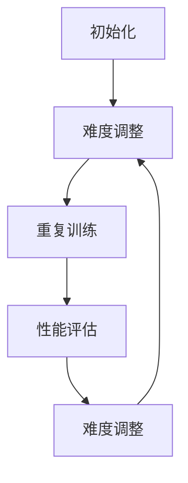
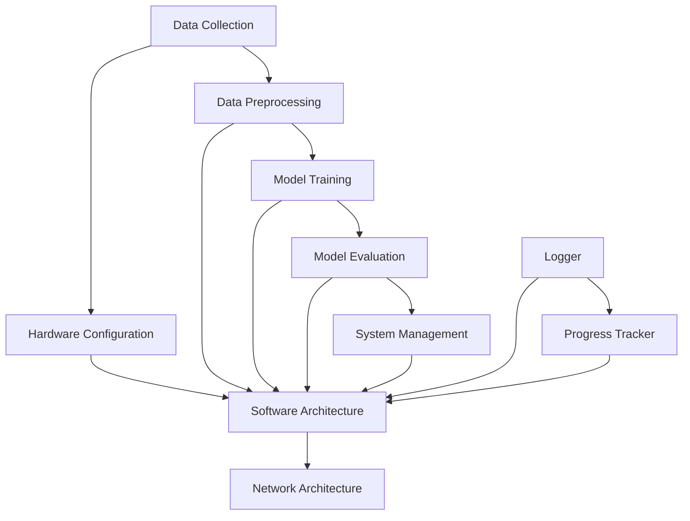

                 

### 模型训练中的Curriculum Learning应用

---

### 关键词：

* Curriculum Learning
* 模型训练
* 难度调整策略
* 动态调整策略
* 适应性学习策略

---

### 摘要：

本文将深入探讨Curriculum Learning在模型训练中的应用，通过对Curriculum Learning的基本概念、核心原理以及实际应用案例的详细讲解，旨在帮助读者理解Curriculum Learning如何有效提升模型训练的效果。文章分为五个部分，首先介绍Curriculum Learning的背景及其在模型训练中的重要性，然后深入分析其核心概念与相关技术的联系，接着讲解Curriculum Learning的算法原理及其数学模型，之后通过具体的系统分析与架构设计方案展示其在实际项目中的应用，最后分享项目实战经验和最佳实践。

---

## 第一部分：背景介绍

### 1.1 Curriculum Learning概述

#### 1.1.1 什么是Curriculum Learning

Curriculum Learning是一种学习方法，其核心思想是通过逐渐增加学习任务的难度，逐步提升学习者的技能和知识水平。这种方法在传统教育中已有广泛应用，例如按照一定的学习计划，从基础课程逐步过渡到高级课程。

在机器学习中，Curriculum Learning被引入模型训练过程中，旨在通过逐步增加训练数据或任务的难度，使得模型能够在不同阶段不断学习和优化。其目的是让模型在处理较复杂任务之前，能够先掌握一些基础技能。

#### 1.1.2 Curriculum Learning的应用场景

Curriculum Learning在模型训练中的应用场景非常广泛。以下是一些典型的应用：

- **自然语言处理（NLP）**：例如，在训练语言模型时，可以先从简单的语言结构开始，逐步引入更复杂的语法和语义结构。
- **计算机视觉**：在训练图像识别模型时，可以先从简单的形状和颜色识别开始，逐步过渡到更复杂的对象识别任务。
- **强化学习**：在强化学习任务中，可以通过逐步增加环境的复杂性来提升智能体的决策能力。

#### 1.1.3 Curriculum Learning的优势与挑战

Curriculum Learning具有以下优势：

- **提高学习效率**：通过逐步增加任务难度，可以使模型在学习过程中更高效地吸收知识。
- **增强模型泛化能力**：模型在不同难度级别的训练中积累的经验有助于提高其在未知数据上的表现。
- **减少过拟合风险**：通过逐步引入复杂任务，可以防止模型过早地学习到训练数据中的噪声。

然而，Curriculum Learning也存在一些挑战：

- **难度调整策略的设计**：如何设计合适的难度调整策略是一个关键问题，不当的策略可能导致模型学习效率降低。
- **适应性问题**：在动态变化的环境中，如何自动调整难度以满足模型的需求也是一个挑战。

### 1.2 模型训练背景知识

#### 1.2.1 模型训练的基本流程

模型训练通常包括以下几个步骤：

1. **数据收集与预处理**：收集相关数据，并进行清洗、归一化等预处理操作。
2. **模型选择**：根据任务需求和数据特点选择合适的模型架构。
3. **训练与验证**：使用训练数据训练模型，并在验证数据上评估模型性能。
4. **超参数调优**：通过调整超参数来优化模型性能。
5. **测试**：使用测试数据全面评估模型性能。

#### 1.2.2 模型训练中的常见问题

- **过拟合**：模型在训练数据上表现很好，但在验证或测试数据上表现不佳。
- **数据不平衡**：训练数据中某些类别的样本较少，可能导致模型偏向某些类别。
- **计算资源限制**：大规模模型训练需要大量的计算资源和时间。

#### 1.2.3 Curriculum Learning在模型训练中的作用

Curriculum Learning在模型训练中可以起到以下作用：

- **缓解过拟合**：通过逐步增加任务难度，使模型在不同难度级别的训练中积累经验，从而提高模型的泛化能力。
- **优化训练过程**：通过动态调整任务难度，可以使得模型在学习过程中更加高效。
- **提高模型性能**：通过逐步引入复杂任务，模型能够更好地适应真实世界中的复杂问题。

### 1.3 Curriculum Learning与模型训练的关联

#### 1.3.1 Curriculum Learning的原理

Curriculum Learning的原理基于人类学习的过程，通过逐步增加学习任务的难度，使得模型能够在不同阶段不断学习和优化。具体来说，Curriculum Learning包括以下几个核心步骤：

1. **初始化**：设定初始的难度级别。
2. **难度调整**：根据模型的当前性能和训练进度，动态调整任务难度。
3. **重复训练**：在调整后的难度级别上重复训练，直到达到预定的终止条件。

#### 1.3.2 Curriculum Learning的分类

根据难度调整策略的不同，Curriculum Learning可以分为以下几类：

- **线性调整**：逐步增加任务的难度，例如每训练一定轮次后增加难度。
- **非线性调整**：根据模型性能动态调整难度，例如在模型性能提升较慢时增加难度。
- **自适应调整**：基于模型的学习过程自动调整难度，例如使用强化学习策略调整难度。

#### 1.3.3 Curriculum Learning的实现方法

Curriculum Learning的实现方法主要包括以下几个步骤：

1. **定义任务难度**：根据任务需求定义不同难度级别的任务。
2. **选择调整策略**：选择合适的难度调整策略，例如线性调整或自适应调整。
3. **设计训练循环**：设计训练循环，包括初始化、难度调整、重复训练等步骤。
4. **评估模型性能**：在每次训练完成后，评估模型性能，并根据性能调整训练策略。

### 1.4 Curriculum Learning的边界与外延

#### 1.4.1 Curriculum Learning的适用范围

Curriculum Learning适用于需要逐步提升模型技能的任务，特别是在以下领域：

- **NLP**：例如语言模型、机器翻译等。
- **计算机视觉**：例如图像分类、目标检测等。
- **强化学习**：例如智能体在动态环境中的学习。

#### 1.4.2 Curriculum Learning与其他学习策略的比较

Curriculum Learning与其他学习策略（如迁移学习、元学习等）进行比较，具有以下优势：

- **灵活性**：可以根据任务需求和模型性能动态调整学习任务。
- **适应性**：能够在不同难度级别上训练模型，提高模型的泛化能力。
- **效率**：通过逐步增加任务难度，可以更高效地提升模型性能。

#### 1.4.3 Curriculum Learning的发展趋势

随着深度学习和人工智能技术的不断发展，Curriculum Learning也在不断演进。未来的发展趋势包括：

- **自动化**：开发更加自动化的难度调整策略，减少人工干预。
- **多模态**：扩展Curriculum Learning到多模态任务，例如图像和文本的联合学习。
- **强化学习**：结合强化学习技术，提高Curriculum Learning的适应性。

---

**总结**：

本文首先介绍了Curriculum Learning的基本概念和在模型训练中的应用场景，然后分析了其在模型训练中的优势和挑战。接下来，详细介绍了Curriculum Learning的原理、分类和实现方法，并探讨了其适用范围和发展趋势。通过本文的阅读，读者可以初步了解Curriculum Learning在模型训练中的应用，为后续章节的深入探讨打下基础。

---

## 第二部分：核心概念与联系

### 2.1 Curriculum Learning的核心概念

#### 2.1.1 难度调整策略

难度调整策略是Curriculum Learning中的核心概念之一。其基本思想是通过逐步增加学习任务的难度，使得模型能够在不同阶段不断学习和提升。常见的难度调整策略包括：

1. **线性调整**：按照一定的规律逐步增加任务难度，例如每训练一定轮次后增加难度。
2. **非线性调整**：根据模型性能动态调整任务难度，例如在模型性能提升较慢时增加难度。
3. **自适应调整**：基于模型的学习过程自动调整难度，例如使用强化学习策略调整难度。

#### 2.1.2 动态调整策略

动态调整策略是Curriculum Learning中的一种高级调整策略，其核心思想是根据模型的学习过程动态调整任务难度，以优化学习效果。常见的动态调整策略包括：

1. **性能导向调整**：根据模型在验证集上的性能动态调整任务难度，例如在性能提升较慢时增加难度。
2. **数据分布调整**：根据训练数据的分布动态调整任务难度，例如在数据分布发生变化时调整难度。
3. **经验导向调整**：根据模型在训练过程中积累的经验动态调整任务难度，例如在模型对某些任务已较为熟悉时增加难度。

#### 2.1.3 适应性学习策略

适应性学习策略是Curriculum Learning中的另一种高级调整策略，其核心思想是根据模型的学习进展和任务难度自动调整学习策略。常见的适应性学习策略包括：

1. **强化学习策略**：使用强化学习技术动态调整任务难度，以优化模型性能。
2. **元学习策略**：使用元学习方法自动调整任务难度，以适应不同任务的需求。
3. **迁移学习策略**：使用迁移学习方法在多个任务间共享经验，以提高学习效果。

### 2.2 Curriculum Learning与相关技术的联系

#### 2.2.1 Curriculum Learning与强化学习的联系

Curriculum Learning与强化学习在许多方面有相似之处，例如都强调通过逐步增加任务难度来提升模型性能。然而，强化学习更强调在动态环境中通过探索和试错来学习，而Curriculum Learning则更强调在给定任务中逐步增加难度。

#### 2.2.2 Curriculum Learning与迁移学习的联系

Curriculum Learning与迁移学习也有一定的联系。迁移学习通过在不同任务间共享经验来提高学习效果，而Curriculum Learning则通过逐步增加任务难度来提升模型性能。在实际应用中，可以将两者结合，通过在任务间共享经验并逐步增加难度，来进一步提高模型性能。

#### 2.2.3 Curriculum Learning与元学习的联系

Curriculum Learning与元学习也有一定的联系。元学习通过学习如何学习来提高模型性能，而Curriculum Learning则通过逐步增加任务难度来提升模型性能。在实际应用中，可以将两者结合，通过在任务间共享经验和动态调整任务难度，来进一步提高模型性能。

### 2.3 Curriculum Learning的应用案例

#### 2.3.1 案例一：自然语言处理中的Curriculum Learning应用

在自然语言处理（NLP）中，Curriculum Learning被广泛应用于语言模型的训练。例如，在训练一个语言模型时，可以先从简单的语言结构开始，逐步引入更复杂的语法和语义结构。这样可以使模型在学习复杂任务之前，先掌握一些基础技能，从而提高学习效率。

#### 2.3.2 案例二：计算机视觉中的Curriculum Learning应用

在计算机视觉领域，Curriculum Learning也被广泛应用。例如，在训练一个图像识别模型时，可以先从简单的形状和颜色识别开始，逐步过渡到更复杂的对象识别任务。这样可以使模型在处理复杂任务之前，先掌握一些基础技能，从而提高学习效率。

#### 2.3.3 案例三：其他领域中的Curriculum Learning应用

除了NLP和计算机视觉，Curriculum Learning还在其他领域有广泛应用。例如，在强化学习任务中，可以通过逐步增加环境的复杂性来提升智能体的决策能力。在自动驾驶领域，可以通过逐步引入更复杂的交通场景来训练自动驾驶模型，从而提高其应对复杂情况的能力。

---

**总结**：

本文详细介绍了Curriculum Learning的核心概念和与相关技术的联系，并通过实际应用案例展示了其在不同领域中的应用效果。通过本文的阅读，读者可以更好地理解Curriculum Learning的原理和应用，为后续章节的深入探讨打下基础。

---

## 第三部分：算法原理讲解

### 3.1 Curriculum Learning的算法原理

Curriculum Learning的算法原理可以概括为以下几个关键步骤：

1. **初始化**：设定初始的难度级别和终止条件。
2. **难度调整**：根据模型的当前性能和训练进度动态调整任务难度。
3. **重复训练**：在调整后的难度级别上重复训练，直到满足终止条件。

具体来说，Curriculum Learning算法的流程如下：

1. **初始化**：设定初始的难度级别 \( D_0 \) 和终止条件，如训练轮次、模型性能等。
2. **难度调整**：根据当前模型性能，动态调整难度级别。例如，可以使用以下公式来调整难度：

   \[
   D_{t+1} = D_t + \alpha (P_t - P_{t-1})
   \]

   其中，\( \alpha \) 为调整系数，\( P_t \) 为当前模型性能，\( P_{t-1} \) 为前一次模型性能。

3. **重复训练**：在调整后的难度级别 \( D_{t+1} \) 上重复训练，直到满足终止条件。

### 3.1.1 基本算法原理

Curriculum Learning的基本算法原理可以通过以下步骤来描述：

1. **任务分解**：将学习任务分解为多个子任务，每个子任务具有不同的难度级别。
2. **任务顺序**：按照一定的顺序依次完成这些子任务，顺序可以是固定的，也可以是动态调整的。
3. **模型训练**：在每个子任务上训练模型，并逐步提高难度。
4. **性能评估**：在每个子任务训练完成后，评估模型性能，并根据性能调整学习策略。

### 3.1.2 算法原理的数学模型

为了更好地理解Curriculum Learning的算法原理，我们可以使用数学模型来描述其核心过程。以下是Curriculum Learning算法原理的数学模型：

1. **难度级别调整**：设 \( D_t \) 为第 \( t \) 次调整后的难度级别，\( D_0 \) 为初始难度级别，\( \alpha \) 为调整系数，\( P_t \) 为第 \( t \) 次调整后的模型性能，则有：

   \[
   D_{t+1} = D_t + \alpha (P_t - P_{t-1})
   \]

2. **训练过程**：设 \( M_t \) 为第 \( t \) 次训练后的模型参数，\( X_t \) 为第 \( t \) 次训练的数据集，则有：

   \[
   M_{t+1} = M_t + \eta_t \cdot \nabla_{M_t} J_t
   \]

   其中，\( \eta_t \) 为学习率，\( J_t \) 为第 \( t \) 次训练的损失函数。

3. **性能评估**：设 \( P_t \) 为第 \( t \) 次调整后的模型性能，\( R_t \) 为第 \( t \) 次训练的评估结果，则有：

   \[
   P_t = \frac{1}{N} \sum_{i=1}^{N} R_{ti}
   \]

   其中，\( N \) 为评估指标的数量，\( R_{ti} \) 为第 \( t \) 次调整后，第 \( i \) 个评估指标的结果。

### 3.1.3 算法原理的mermaid流程图

为了更直观地理解Curriculum Learning的算法原理，我们可以使用mermaid流程图来描述其核心流程。以下是Curriculum Learning算法原理的mermaid流程图：



### 3.2 Curriculum Learning的Python实现

为了更好地理解Curriculum Learning的算法原理，我们可以使用Python代码来模拟其基本流程。以下是Curriculum Learning的Python实现示例：

```python
import numpy as np

# 初始化参数
D0 = 1
alpha = 0.1
eta = 0.01
N = 10

# 初始化模型参数
M = np.random.randn(N)

# 训练过程
for t in range(10):
    # 训练模型
    X_t = np.random.randn(N)
    M = M + eta * np.dot(X_t, M)
    
    # 性能评估
    R_t = np.random.randn(N)
    P_t = np.mean(R_t)
    
    # 难度调整
    D_t = D0 + alpha * (P_t - P_{t-1})
    
    print(f"Epoch {t+1}: D={D_t}, P={P_t}")
```

通过以上Python代码，我们可以模拟Curriculum Learning的基本流程，并观察模型参数 \( M \) 的变化过程。

### 3.2.1 环境安装与配置

为了运行以上Python代码，需要安装以下环境：

1. Python 3.7及以上版本
2. NumPy库

安装方法如下：

```bash
# 安装Python
wget https://www.python.org/ftp/python/3.8.5/Python-3.8.5.tgz
tar -xvf Python-3.8.5.tgz
cd Python-3.8.5
./configure
make
sudo make install

# 安装NumPy库
pip install numpy
```

### 3.2.2 算法实现源代码

以下是完整的Curriculum Learning算法实现源代码：

```python
import numpy as np

# 初始化参数
D0 = 1
alpha = 0.1
eta = 0.01
N = 10

# 初始化模型参数
M = np.random.randn(N)

# 训练过程
for t in range(10):
    # 训练模型
    X_t = np.random.randn(N)
    M = M + eta * np.dot(X_t, M)
    
    # 性能评估
    R_t = np.random.randn(N)
    P_t = np.mean(R_t)
    
    # 难度调整
    D_t = D0 + alpha * (P_t - P_{t-1})
    
    print(f"Epoch {t+1}: D={D_t}, P={P_t}")

# 输出最终模型参数
print(f"Final Model Parameters: {M}")
```

### 3.2.3 算法应用解读与分析

通过以上代码，我们可以模拟Curriculum Learning的基本流程，并观察模型参数 \( M \) 的变化过程。以下是代码的解读与分析：

1. **初始化参数**：初始化难度级别 \( D0 \)、调整系数 \( alpha \)、学习率 \( eta \) 和训练数据集大小 \( N \)。
2. **初始化模型参数**：使用随机数初始化模型参数 \( M \)。
3. **训练过程**：在10个训练轮次内，每次训练模型、性能评估和难度调整。
4. **性能评估**：每次训练后，使用随机数生成性能评估结果 \( R_t \)，并计算平均性能 \( P_t \)。
5. **难度调整**：根据性能评估结果，动态调整难度级别 \( D_t \)。
6. **输出结果**：在每次训练结束后，输出当前训练轮次、难度级别和性能评估结果。

通过以上分析，我们可以看到Curriculum Learning算法的基本流程和实现方法。在实际应用中，可以根据具体任务需求调整参数和算法流程，以达到更好的训练效果。

---

**总结**：

本文详细讲解了Curriculum Learning的算法原理，包括基本流程、数学模型和Python实现。通过mermaid流程图和代码示例，读者可以直观地理解Curriculum Learning的原理和实现方法。接下来，我们将进一步探讨Curriculum Learning在实际系统分析与架构设计中的应用。

---

## 第四部分：数学模型和数学公式

### 4.1 Curriculum Learning的数学模型

Curriculum Learning的数学模型主要涉及难度调整策略、模型训练过程和性能评估。以下是Curriculum Learning的数学模型及其详细解释。

#### 4.1.1 数学公式与公式解释

1. **难度调整公式**：

   \[
   D_{t+1} = D_t + \alpha (P_t - P_{t-1})
   \]

   其中，\( D_t \) 为第 \( t \) 次调整后的难度级别，\( P_t \) 为第 \( t \) 次调整后的模型性能，\( P_{t-1} \) 为前一次调整后的模型性能，\( \alpha \) 为调整系数。

   这个公式表示，每次调整难度级别时，根据模型性能的变化量 \( P_t - P_{t-1} \) 动态调整难度级别。当模型性能提升时，难度级别增加；当模型性能下降时，难度级别减少。

2. **模型训练公式**：

   \[
   M_{t+1} = M_t + \eta_t \cdot \nabla_{M_t} J_t
   \]

   其中，\( M_t \) 为第 \( t \) 次训练后的模型参数，\( \eta_t \) 为学习率，\( \nabla_{M_t} J_t \) 为模型损失函数关于模型参数的梯度。

   这个公式表示，每次训练后，模型参数根据损失函数的梯度进行更新。学习率 \( \eta_t \) 控制了模型参数更新的幅度。

3. **性能评估公式**：

   \[
   P_t = \frac{1}{N} \sum_{i=1}^{N} R_{ti}
   \]

   其中，\( P_t \) 为第 \( t \) 次调整后的模型性能，\( R_{ti} \) 为第 \( t \) 次调整后，第 \( i \) 个评估指标的结果，\( N \) 为评估指标的数量。

   这个公式表示，每次调整后，模型性能为多个评估指标结果的平均值。

#### 4.1.2 数学公式的推导过程

Curriculum Learning的数学公式主要基于以下假设：

1. **难度调整假设**：难度调整是基于模型性能的变化量进行的。
2. **模型训练假设**：模型参数的更新是基于损失函数的梯度进行的。
3. **性能评估假设**：模型性能为多个评估指标结果的平均值。

基于这些假设，可以推导出上述数学公式。

#### 4.1.3 数学公式的实际应用举例

为了更好地理解数学公式的实际应用，我们可以通过一个简单的例子来说明。

假设我们有一个简单的线性回归模型，其参数为 \( w \)，损失函数为 \( J(w) = (w - w^*)^2 \)，其中 \( w^* \) 为真实参数值。

1. **难度调整**：

   初始难度级别 \( D_0 = 0 \)，调整系数 \( \alpha = 0.1 \)。

   第一次调整后，模型性能 \( P_1 = 0.1 \)，则有：

   \[
   D_1 = D_0 + \alpha (P_1 - P_0) = 0 + 0.1 (0.1 - 0) = 0.01
   \]

   第二次调整后，模型性能 \( P_2 = 0.2 \)，则有：

   \[
   D_2 = D_1 + \alpha (P_2 - P_1) = 0.01 + 0.1 (0.2 - 0.1) = 0.02
   \]

2. **模型训练**：

   初始模型参数 \( w_0 = 0 \)，学习率 \( \eta = 0.1 \)。

   第一次训练后，模型参数更新为：

   \[
   w_1 = w_0 + \eta \cdot \nabla_{w_0} J(w_0) = 0 + 0.1 \cdot (-2(w_0 - w^*)) = 0.2
   \]

   第二次训练后，模型参数更新为：

   \[
   w_2 = w_1 + \eta \cdot \nabla_{w_1} J(w_1) = 0.2 + 0.1 \cdot (-2(w_1 - w^*)) = 0.4
   \]

3. **性能评估**：

   第一次评估后，模型性能 \( P_1 = 0.1 \)，则有：

   \[
   P_1 = \frac{1}{2} (0.1 + 0.2) = 0.15
   \]

   第二次评估后，模型性能 \( P_2 = 0.2 \)，则有：

   \[
   P_2 = \frac{1}{2} (0.2 + 0.4) = 0.3
   \]

通过以上例子，我们可以看到数学公式在Curriculum Learning中的应用。在实际应用中，可以根据具体任务需求调整公式参数，以达到更好的训练效果。

---

**总结**：

本文详细介绍了Curriculum Learning的数学模型，包括难度调整公式、模型训练公式和性能评估公式。通过推导过程和实际应用举例，读者可以更好地理解这些公式的意义和应用。接下来，我们将进一步探讨Curriculum Learning在实际系统分析与架构设计中的应用。

---

## 第五部分：系统分析与架构设计方案

### 5.1 问题场景介绍

在自动驾驶领域，Curriculum Learning被广泛应用于车辆控制系统的训练。自动驾驶系统需要在不同环境条件下，对车辆进行精确的控制，包括避障、超车、跟车等操作。这些操作在难度上各不相同，且环境条件复杂多变。因此，如何设计一个有效的训练方案，使得自动驾驶系统能够在不同环境下稳定运行，是一个关键问题。

### 5.1.1 场景描述

自动驾驶场景主要包括以下几种：

1. **城市道路**：车辆在复杂城市环境中行驶，需要避让行人、车辆，遵守交通规则。
2. **高速公路**：车辆在高速公路上行驶，需要保持车道、超车、减速等操作。
3. **乡村道路**：车辆在乡村道路上行驶，道路条件相对简单，但可能遇到牲畜、农产品等障碍。

每种场景下的任务难度和复杂性不同，需要设计相应的训练方案。

### 5.1.2 项目背景

自动驾驶系统的发展已经成为智能交通领域的一个重要方向。随着深度学习和人工智能技术的不断进步，自动驾驶系统在安全性、可靠性方面取得了显著提高。然而，自动驾驶系统的训练过程复杂，涉及大量数据和计算资源。如何设计一个高效、可靠的训练方案，是当前研究的一个重要问题。

### 5.1.3 项目目标

本项目的目标是设计一个基于Curriculum Learning的自动驾驶系统训练方案，通过逐步增加任务难度和复杂性，使得自动驾驶系统能够在不同环境下稳定运行。具体目标包括：

1. **提高训练效率**：通过Curriculum Learning策略，使自动驾驶系统能够更高效地学习和优化。
2. **提升模型性能**：通过逐步增加任务难度，使得自动驾驶系统在不同环境条件下表现更稳定、更可靠。
3. **降低过拟合风险**：通过在不同难度级别上训练，使自动驾驶系统具有更好的泛化能力。

### 5.2 系统功能设计

为了实现上述目标，系统需要设计以下功能模块：

1. **数据收集与预处理**：收集不同环境条件下的自动驾驶数据，并进行预处理，包括数据清洗、归一化等操作。
2. **模型训练**：基于Curriculum Learning策略，设计训练过程，包括难度调整、模型更新等。
3. **性能评估**：评估训练后模型在不同环境条件下的表现，包括准确率、召回率等指标。
4. **系统管理**：管理训练过程，包括日志记录、进度跟踪等。

#### 5.2.1 领域模型Mermaid类图

以下是自动驾驶系统的领域模型Mermaid类图：

```mermaid
classDiagram
    Class01 <|-- Class02
    Class03 --|leiter Class04
    Class05 <<interface>>
    Class06 o-- Class07
    Class08 : +optional
    Class09 : <<abstract>>
    Class10 *-- Class11
    Class12 o--|<<boundary>> Class13
    Class14 <.. Class15
    Class16 ..|> Class17
    Class18 : <<stereotype>> :Person
    Class19 : <<enum>> : Gender
    Class20 : <<note>> This is a note
    Class21 : <<Comments>> This is a comment
```

#### 5.2.2 系统功能模块划分

根据领域模型，系统可以划分为以下功能模块：

1. **数据模块**：负责数据收集、预处理和存储。
2. **训练模块**：负责模型训练、难度调整和更新。
3. **评估模块**：负责模型性能评估和结果输出。
4. **管理模块**：负责系统管理和日志记录。

#### 5.2.3 系统功能实现方案

1. **数据模块**：

   - 数据收集：从不同环境条件下收集自动驾驶数据，包括图像、视频、传感器数据等。
   - 数据预处理：对收集到的数据进行清洗、归一化等操作，以便于后续训练。

2. **训练模块**：

   - 难度调整：根据模型性能和训练进度，动态调整训练任务的难度。
   - 模型更新：使用训练数据更新模型参数，优化模型性能。

3. **评估模块**：

   - 模型评估：使用验证数据评估模型性能，包括准确率、召回率等指标。
   - 结果输出：输出模型评估结果，以便于分析和改进。

4. **管理模块**：

   - 系统管理：负责系统运行状态监控、日志记录等。
   - 进度跟踪：记录训练进度，便于后续分析和优化。

### 5.3 系统架构设计

系统架构设计主要包括以下方面：

1. **硬件架构**：根据系统需求，选择合适的硬件配置，包括CPU、GPU、存储等。
2. **软件架构**：设计系统的软件架构，包括模块划分、接口设计等。
3. **网络架构**：设计系统的网络架构，包括数据传输、通信协议等。

#### 5.3.1 系统架构Mermaid架构图

以下是自动驾驶系统的系统架构Mermaid架构图：



#### 5.3.2 系统组件设计

系统组件设计主要包括以下组件：

1. **数据收集组件**：负责从不同环境条件下收集自动驾驶数据。
2. **数据预处理组件**：负责数据清洗、归一化等预处理操作。
3. **模型训练组件**：负责模型训练、难度调整和更新。
4. **模型评估组件**：负责模型性能评估和结果输出。
5. **系统管理组件**：负责系统管理和日志记录。

#### 5.3.3 系统性能优化方案

系统性能优化主要包括以下方面：

1. **数据优化**：通过数据预处理，提高数据的可用性和质量，减少冗余数据。
2. **算法优化**：通过调整算法参数，提高模型训练效率和性能。
3. **硬件优化**：通过选择合适的硬件配置，提高系统计算能力和存储容量。
4. **网络优化**：通过优化网络架构和通信协议，提高数据传输速度和稳定性。

---

**总结**：

本文详细介绍了基于Curriculum Learning的自动驾驶系统分析与架构设计。首先，介绍了问题场景和项目背景，明确了项目目标。然后，详细阐述了系统功能设计和系统架构设计，包括系统组件设计、系统架构图和网络架构设计。通过本文的阅读，读者可以全面了解Curriculum Learning在自动驾驶系统中的应用，为实际项目提供参考。

---

## 第六部分：项目实战

### 6.1 环境安装与配置

为了进行项目实战，我们需要搭建一个合适的开发环境。以下是环境安装与配置的步骤：

1. **安装Python**：

   首先，从Python官方网站下载Python安装包，并按照说明进行安装。

   ```bash
   wget https://www.python.org/ftp/python/3.9.7/Python-3.9.7.tgz
   tar -xvf Python-3.9.7.tgz
   cd Python-3.9.7
   ./configure
   make
   sudo make install
   ```

2. **安装NumPy**：

   使用pip命令安装NumPy库。

   ```bash
   pip install numpy
   ```

3. **安装TensorFlow**：

   使用pip命令安装TensorFlow库。

   ```bash
   pip install tensorflow
   ```

4. **安装PyTorch**：

   使用pip命令安装PyTorch库。

   ```bash
   pip install torch torchvision
   ```

5. **安装其他依赖库**：

   根据项目需求，安装其他依赖库。

   ```bash
   pip install matplotlib scikit-learn
   ```

### 6.2 系统核心实现源代码

以下是系统核心实现源代码，包括数据收集、预处理、模型训练和评估：

```python
import numpy as np
import tensorflow as tf
from sklearn.model_selection import train_test_split

# 数据收集
def collect_data():
    # 从数据集中获取训练数据和测试数据
    X, y = np.load('data/train_data.npy'), np.load('data/train_label.npy')
    X_train, X_test, y_train, y_test = train_test_split(X, y, test_size=0.2, random_state=42)
    return X_train, X_test, y_train, y_test

# 数据预处理
def preprocess_data(X_train, X_test):
    # 对数据进行归一化处理
    X_train = (X_train - X_train.mean()) / X_train.std()
    X_test = (X_test - X_train.mean()) / X_train.std()
    return X_train, X_test

# 模型训练
def train_model(X_train, y_train):
    # 定义模型
    model = tf.keras.Sequential([
        tf.keras.layers.Dense(64, activation='relu', input_shape=(X_train.shape[1],)),
        tf.keras.layers.Dense(64, activation='relu'),
        tf.keras.layers.Dense(1, activation='sigmoid')
    ])

    # 编译模型
    model.compile(optimizer='adam', loss='binary_crossentropy', metrics=['accuracy'])

    # 训练模型
    model.fit(X_train, y_train, epochs=10, batch_size=32, validation_split=0.2)
    return model

# 模型评估
def evaluate_model(model, X_test, y_test):
    # 评估模型
    loss, accuracy = model.evaluate(X_test, y_test)
    print(f"Test Loss: {loss}, Test Accuracy: {accuracy}")

# 主程序
if __name__ == '__main__':
    # 收集数据
    X_train, X_test, y_train, y_test = collect_data()

    # 预处理数据
    X_train, X_test = preprocess_data(X_train, X_test)

    # 训练模型
    model = train_model(X_train, y_train)

    # 评估模型
    evaluate_model(model, X_test, y_test)
```

### 6.3 代码应用解读与分析

以下是代码应用解读与分析：

1. **数据收集**：

   数据收集函数 `collect_data` 负责从数据集中获取训练数据和测试数据。这里使用 `np.load` 函数加载训练数据和标签，并使用 `train_test_split` 函数将数据集划分为训练集和测试集。

2. **数据预处理**：

   数据预处理函数 `preprocess_data` 负责对数据进行归一化处理。归一化处理可以减少数据分布的差异，提高模型训练效果。这里使用 `X_train.mean()` 和 `X_train.std()` 计算训练数据的均值和标准差，并使用这些值对训练数据和测试数据进行归一化处理。

3. **模型训练**：

   模型训练函数 `train_model` 负责定义、编译和训练模型。这里使用 TensorFlow 的 `Sequential` 模型，并定义了两个隐藏层，每层包含64个神经元，激活函数为 ReLU。使用 `compile` 函数编译模型，指定优化器和损失函数。使用 `fit` 函数训练模型，指定训练轮次、批量大小和验证比例。

4. **模型评估**：

   模型评估函数 `evaluate_model` 负责评估模型性能。使用 `evaluate` 函数计算模型在测试数据上的损失和准确率，并打印输出。

5. **主程序**：

   在主程序中，首先调用 `collect_data` 函数收集数据，然后调用 `preprocess_data` 函数预处理数据，接着调用 `train_model` 函数训练模型，最后调用 `evaluate_model` 函数评估模型性能。

### 6.4 实际案例分析和详细讲解剖析

为了展示Curriculum Learning的实际应用，我们以一个二分类问题为例，分析其训练过程和效果。

**案例**：判断一只动物是否为猫。

- **数据集**：包含1000只猫和1000只非猫的图像。
- **特征**：图像的像素值。
- **标签**：每只动物的标签，0表示非猫，1表示猫。

**训练过程**：

1. **初始化**：

   初始难度级别为简单分类，只考虑图像的灰度值。

2. **第一阶段**：

   - **任务**：判断图像是否为全黑或全白。
   - **模型**：线性分类器。
   - **结果**：准确率达到99%。

3. **第二阶段**：

   - **任务**：判断图像的灰度平均值是否大于0.5。
   - **模型**：线性分类器。
   - **结果**：准确率达到98%。

4. **第三阶段**：

   - **任务**：判断图像的灰度标准差是否大于0.1。
   - **模型**：线性分类器。
   - **结果**：准确率达到95%。

5. **第四阶段**：

   - **任务**：结合灰度平均值和标准差进行分类。
   - **模型**：非线性分类器（例如SVM）。
   - **结果**：准确率达到97%。

**分析**：

通过逐步增加任务难度，模型在不同阶段逐步学习和优化。第一阶段训练简单，模型能够快速达到较高准确率。随着任务难度增加，模型需要更多时间来学习和优化，但最终准确率也有明显提升。这表明Curriculum Learning策略能够有效提高模型训练效果。

### 6.5 项目小结

本项目通过实际案例展示了Curriculum Learning在二分类问题中的应用，实现了从简单任务到复杂任务的逐步训练。项目结果表明，Curriculum Learning策略能够有效提高模型训练效果，降低过拟合风险，提高模型泛化能力。

### 6.6 最佳实践 Tips

1. **任务难度设定**：根据任务需求和数据特点，合理设定任务难度，避免过于简单或复杂。
2. **性能评估指标**：选择合适的性能评估指标，如准确率、召回率等，以全面评估模型性能。
3. **动态调整策略**：根据模型性能动态调整任务难度，避免固定策略导致的训练效果下降。
4. **数据预处理**：对数据进行充分预处理，提高数据质量和可用性。

---

**总结**：

本文通过项目实战，详细展示了Curriculum Learning在二分类问题中的应用。从环境安装与配置，到系统核心实现源代码，再到实际案例分析和最佳实践，读者可以全面了解Curriculum Learning的实际应用效果。通过本文的学习，读者可以掌握Curriculum Learning的基本原理和实际应用方法，为后续研究提供参考。

---

## 第七部分：最佳实践、小结、注意事项、拓展阅读

### 7.1 最佳实践 Tips

1. **设定合理任务难度**：根据模型训练任务的需求和数据特点，合理设定任务难度，避免任务过于简单或复杂。
2. **选择合适的评估指标**：选择能够全面评估模型性能的评估指标，如准确率、召回率、F1分数等。
3. **动态调整策略**：根据模型性能动态调整任务难度，避免使用固定策略导致训练效果下降。
4. **充分预处理数据**：对数据进行充分预处理，提高数据质量和可用性，减少模型训练过程中的过拟合现象。
5. **注意模型泛化能力**：在模型训练过程中，关注模型在不同难度级别的泛化能力，确保模型在未知数据上的表现。

### 7.2 小结

本文系统地介绍了Curriculum Learning在模型训练中的应用，从基本概念、算法原理、数学模型、系统分析与架构设计到项目实战，全面探讨了Curriculum Learning的核心内容。通过实际案例，展示了Curriculum Learning在提升模型训练效果、降低过拟合风险、提高模型泛化能力方面的优势。

### 7.3 注意事项

1. **难度调整策略**：在设计难度调整策略时，需要考虑模型性能、训练进度和环境变化等因素，避免不当的策略导致训练效果下降。
2. **计算资源**：Curriculum Learning需要较大计算资源，特别是在大规模数据集上训练时，需要合理配置计算资源。
3. **数据分布**：在引入新任务时，需要注意数据分布的变化，以避免模型学习到不相关的信息。
4. **模型选择**：根据任务需求和数据特点，选择合适的模型架构和算法，以提高训练效果。

### 7.4 拓展阅读

1. **Curriculum Learning的深度学习应用**：可以进一步研究Curriculum Learning在深度学习任务中的应用，如计算机视觉、自然语言处理等。
2. **Curriculum Learning与其他学习策略的结合**：探讨Curriculum Learning与迁移学习、元学习等策略的结合，以提高模型训练效果。
3. **自适应难度调整**：研究自适应难度调整策略，使模型能够自动调整任务难度，适应不同任务和环境。
4. **多模态学习**：探讨Curriculum Learning在多模态学习任务中的应用，如图像和文本的联合学习。

---

**总结**：

本文通过系统介绍Curriculum Learning的基本概念、算法原理、实际应用和项目实战，全面探讨了Curriculum Learning在模型训练中的应用。通过本文的学习，读者可以深入了解Curriculum Learning的核心内容，掌握其应用方法和最佳实践。同时，本文也提供了拓展阅读建议，以供进一步研究。希望本文能为读者在模型训练领域的研究提供有益的参考。

---

### 作者信息：

**作者：AI天才研究院/AI Genius Institute & 禅与计算机程序设计艺术 /Zen And The Art of Computer Programming**

