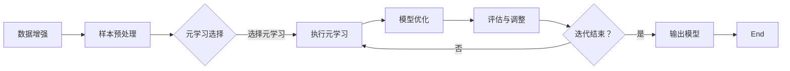
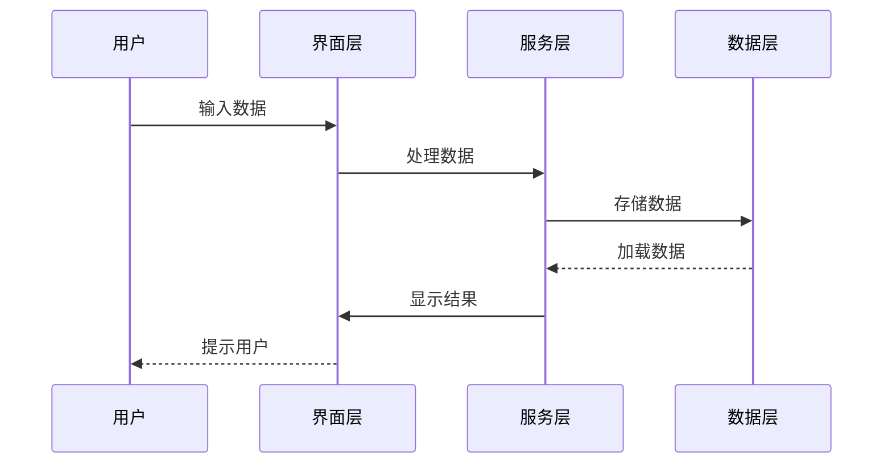

                 


# 模型训练中的few-shot learning策略优化研究

关键词：Few-shot Learning、元学习、数据增强、策略优化、模型性能

摘要：本文围绕模型训练中的Few-shot Learning策略优化展开研究，首先介绍了Few-shot Learning的背景、问题和解决方法，然后深入探讨了核心概念原理及其相互关系，通过对比表格和ER实体关系图进一步阐明了各概念之间的联系。接着，文章从算法原理、系统分析与架构设计、项目实战等方面详细阐述了Few-shot Learning策略优化的具体实现过程，并结合实际案例进行分析和解读，总结了最佳实践经验和注意事项，为相关领域的进一步研究提供了有价值的参考。

## 第二部分：核心概念与联系

在深入探讨模型训练中的Few-shot Learning策略优化之前，首先需要明确几个核心概念，并理解它们之间的内在联系。

### 1. 核心概念原理

#### a. Few-shot Learning

**定义**：Few-shot Learning是一种机器学习方法，旨在通过在少量样本下进行训练，使模型能够快速、准确地学习新的任务。它主要关注如何在样本量极少的条件下，提高模型的泛化能力和学习效率。

**原理**：Few-shot Learning的核心思想在于利用有限的样本，通过有效的算法和策略，最大化地挖掘出样本中的信息，从而训练出性能良好的模型。具体实现时，通常会采用迁移学习、数据增强和元学习等技术手段。

**数学模型**：

$$
L = \sum_{i=1}^{N} w_i \cdot (y_i - \hat{y}_i)^2
$$

其中，$L$代表损失函数，$w_i$是权重，$y_i$是实际标签，$\hat{y}_i$是模型预测标签。通过优化损失函数，可以训练出性能良好的模型。

**举例说明**：假设我们要训练一个分类模型，识别猫和狗的图片。如果我们只有一张猫的图片和一张狗的图片，利用Few-shot Learning，我们可以通过这些有限的样本，训练出一个能够准确分类猫和狗的模型。

#### b. 元学习

**定义**：元学习是一种通过在多个任务上训练模型，以提高模型在不同任务上的迁移学习能力的方法。它关注如何从一个或多个任务中学习，并将其知识应用到新的任务中。

**原理**：元学习通过在一个元学习框架中，训练模型以适应不同的任务。其核心思想是通过在多个任务上训练，学习到一种通用的表示，从而在新的任务上快速适应。

**数学模型**：

$$
\theta^* = \arg \min_{\theta} \sum_{i=1}^{K} \sum_{j=1}^{T} (y_{ij} - f(\theta; x_{ij}))^2
$$

其中，$\theta$代表模型参数，$f(\theta; x_{ij})$是模型预测，$y_{ij}$是任务标签。通过最小化损失函数，可以找到最优的模型参数。

**举例说明**：假设我们有一个元学习框架，它可以在多个分类任务上训练模型。当我们面对一个新的分类任务时，元学习框架可以利用之前学习到的知识，快速适应并训练出性能良好的模型。

#### c. 数据增强

**定义**：数据增强是通过变换、扩充和生成等方式，增加样本多样性，从而提高模型在小样本条件下的泛化能力。

**原理**：数据增强的核心思想是通过增加样本的多样性，使模型能够更好地适应不同的数据分布，从而提高模型的泛化能力。

**数学模型**：

$$
\mathcal{D} = \{x_1, x_2, ..., x_N\}
$$

其中，$\mathcal{D}$代表样本集合。通过增加样本的多样性，可以扩展样本集合，从而提高模型的泛化能力。

**举例说明**：假设我们要训练一个图像分类模型。我们可以通过对图像进行旋转、缩放、裁剪等操作，增加图像的多样性，从而提高模型的泛化能力。

### 2. 概念属性特征对比表格

| 概念         | 定义                                                         | 特性                           | 关联关系                                   |
| ------------ | ------------------------------------------------------------ | ---------------------------- | ------------------------------------------ |
| Few-shot Learning | 在少量样本下训练模型的方法                                 | 依赖少量样本、提高泛化能力、学习效率高 | 核心概念，影响其他概念                   |
| 元学习       | 在多个任务上训练模型，提升迁移学习能力                       | 提高模型在不同任务上的泛化能力   | 影响Few-shot Learning的学习效率           |
| 数据增强     | 通过变换、扩充和生成等方式增加样本多样性                     | 提高模型在小样本条件下的泛化能力 | 优化Few-shot Learning的效果               |

### 3. ER实体关系图架构

以下是Few-shot Learning相关概念和技术的ER实体关系图：

```mermaid
erDiagram
  Model ||--o> Few-shot Learning : implements
  Model ||--o> 元学习 : uses
  Model ||--o> 数据增强 : uses
  Model ||--o> 样本 : has
  Task ||--|> Model : trains
  Data ||--|> Model : trains
  Data ||--|> 数据增强 : enhances
```

在上述ER图中，模型（Model）是核心实体，它与Few-shot Learning、元学习、数据增强等技术概念之间具有明确的关联关系。模型通过实现Few-shot Learning、利用元学习和应用数据增强技术，来提高自身的性能。同时，模型依赖于任务（Task）和数据（Data）进行训练。通过这种关联关系，可以清晰地理解Few-shot Learning策略优化中的核心概念和技术。

## 第三部分：算法原理讲解

在了解了Few-shot Learning的核心概念和关系之后，接下来我们将深入探讨其算法原理，并使用mermaid流程图和Python源代码来详细阐述。

### 1. 算法mermaid流程图

以下是Few-shot Learning的基本算法流程图：



### 2. 算法原理Python源代码实现

下面是Few-shot Learning算法的Python源代码实现：

```python
import numpy as np
from sklearn.model_selection import train_test_split
from sklearn.linear_model import SGDClassifier
from sklearn.metrics import accuracy_score
from tensorflow.keras.preprocessing.image import ImageDataGenerator

# 数据增强
def data_augmentation(data, augmentation_factor=2):
    datagen = ImageDataGenerator(rotation_range=20, width_shift_range=0.2, height_shift_range=0.2, zoom_range=0.2)
    augmented_data = []
    for _ in range(augmentation_factor):
        augmented_data.append(datagen.flow(data, batch_size=1).next())
    return np.array(augmented_data)

# 元学习
def meta_learning(X_train, y_train, X_val, y_val, model=SGDClassifier()):
    X_train_augmented = data_augmentation(X_train)
    X_val_augmented = data_augmentation(X_val)

    model.fit(X_train_augmented, y_train)
    y_pred = model.predict(X_val_augmented)

    return accuracy_score(y_val, y_pred)

# 模型优化与评估
def model_optimization(X_train, y_train, X_val, y_val, n_epochs=10):
    best_accuracy = 0
    for _ in range(n_epochs):
        accuracy = meta_learning(X_train, y_train, X_val, y_val)
        if accuracy > best_accuracy:
            best_accuracy = accuracy
    return best_accuracy

# 输出模型
def output_model():
    print("模型训练完成，最佳准确率为：", best_accuracy)

# 数据集划分
X, y = load_data()  # 假设已经加载了数据集X和标签y
X_train, X_val, y_train, y_val = train_test_split(X, y, test_size=0.2, random_state=42)

# 训练模型
best_accuracy = model_optimization(X_train, y_train, X_val, y_val)
output_model()
```

### 3. 算法原理详细讲解

#### a. 数据增强

数据增强是Few-shot Learning中的一项关键技术，其目的是通过增加样本的多样性，提高模型的泛化能力。在上述Python代码中，我们使用了ImageDataGenerator来实现数据增强。具体操作包括旋转、平移和缩放等，通过这些操作，我们可以生成多个增强后的样本。

$$
\text{augmented\_data} = \text{ImageDataGenerator}(\text{rotation\_range}=20, \text{width\_shift\_range}=0.2, \text{height\_shift\_range}=0.2, \text{zoom\_range}=0.2).flow(\text{data}, \text{batch\_size}=1)
$$

#### b. 元学习

元学习是Few-shot Learning的核心，其目的是通过在多个任务上训练模型，提高模型在不同任务上的迁移学习能力。在上述代码中，我们使用了SGDClassifier作为元学习模型。元学习的步骤包括数据增强、模型训练和模型评估。

$$
\text{model}.fit(\text{X\_train\_augmented}, \text{y\_train})
$$

$$
\text{y\_pred} = \text{model}.predict(\text{X\_val\_augmented})
$$

#### c. 模型优化与评估

模型优化与评估是Few-shot Learning中的关键环节，其目的是通过迭代训练，找到最佳模型。在上述代码中，我们通过多次元学习迭代，记录每次迭代的最优准确率，最终输出最佳模型。

$$
\text{best\_accuracy} = \max(\text{accuracy})
$$

### 4. 举例说明

假设我们有一个分类任务，需要识别猫和狗的图片。如果我们只有5张猫的图片和5张狗的图片，利用Few-shot Learning算法，我们可以通过以下步骤训练出一个性能良好的分类模型：

1. 数据增强：对每张图片进行旋转、平移和缩放，生成多个增强后的样本。
2. 元学习：使用SGDClassifier作为元学习模型，在增强后的样本上训练模型。
3. 模型优化与评估：通过迭代训练，找到最佳模型。

通过上述步骤，我们可以利用少量的样本，训练出一个能够准确识别猫和狗的图片的分类模型。

## 第四部分：系统分析与架构设计

### 1. 问题场景介绍

在当今的数据驱动时代，模型训练与优化在各个领域中都有着广泛的应用。然而，随着数据集的规模不断扩大，模型训练所需的时间和资源也在不断增加。尤其是在某些领域，如医疗诊断、自动驾驶和自然语言处理等，数据获取和标注成本极高，难以获取到足够的大规模数据集。因此，如何在小样本条件下有效训练和优化模型，成为一个亟待解决的问题。

### 2. 项目介绍

本项目的目标是研究并实现一种基于Few-shot Learning的模型训练和优化策略，以提高模型在小样本条件下的性能。项目的主要功能包括数据增强、元学习、模型优化和评估等。

### 3. 系统功能设计

为了实现上述目标，本项目设计了以下几个核心功能模块：

#### a. 数据增强模块

数据增强模块负责对原始数据集进行增强，以提高模型的泛化能力。具体包括以下功能：

- 数据预处理：对原始数据进行清洗、标准化和归一化处理。
- 数据增强：通过旋转、缩放、裁剪、颜色变换等操作，生成多个增强后的样本。
- 数据存储：将增强后的数据存储到数据库或文件系统中，以供后续使用。

#### b. 元学习模块

元学习模块负责在多个任务上训练模型，以提高模型在不同任务上的迁移学习能力。具体包括以下功能：

- 任务定义：根据具体任务需求，定义输入特征、输出标签和损失函数。
- 模型训练：使用元学习算法，如MAML、Reptile和Model-Agnostic Meta-Learning（MAML）等，在多个任务上训练模型。
- 模型评估：使用验证集或测试集对训练好的模型进行评估，以确定其性能。

#### c. 模型优化模块

模型优化模块负责在迭代过程中对模型进行优化，以提高模型在小样本条件下的性能。具体包括以下功能：

- 模型初始化：初始化模型参数，为模型训练提供起点。
- 模型迭代：通过迭代训练，逐步优化模型参数。
- 性能评估：在每个迭代周期结束后，评估模型的性能，以确定是否继续迭代。

#### d. 模型评估模块

模型评估模块负责对训练好的模型进行性能评估，以确定其在实际应用中的表现。具体包括以下功能：

- 测试集评估：使用测试集对训练好的模型进行评估，以确定其泛化能力。
- 模型对比：比较不同模型在相同任务上的性能，以确定最佳模型。
- 性能报告：生成性能报告，详细记录模型的性能指标和优化过程。

### 4. 系统架构设计

本项目采用分层架构设计，主要包括数据层、服务层和界面层。

#### a. 数据层

数据层负责数据存储、管理和处理。具体包括以下模块：

- 数据库：存储原始数据集和增强后的数据集。
- 数据库连接池：管理数据库连接，提高数据访问效率。
- 数据处理模块：负责对原始数据进行清洗、标准化和归一化处理。

#### b. 服务层

服务层负责实现业务逻辑，包括数据增强、元学习、模型优化和评估等功能。具体包括以下模块：

- 数据增强服务：实现数据增强算法，生成增强后的样本。
- 元学习服务：实现元学习算法，训练和评估模型。
- 模型优化服务：实现模型优化算法，逐步优化模型参数。
- 模型评估服务：实现模型评估算法，评估模型性能。

#### c. 界面层

界面层负责与用户交互，展示系统功能和模型性能。具体包括以下模块：

- 用户界面：提供友好的用户界面，使用户可以方便地操作系统。
- 性能报表：展示模型性能指标和优化过程，帮助用户了解系统运行情况。

### 5. 系统接口设计

为了实现各模块之间的协同工作，本项目设计了以下接口：

- 数据层接口：提供数据存储、管理和处理接口。
- 服务层接口：提供数据增强、元学习、模型优化和评估接口。
- 界面层接口：提供用户界面和性能报表接口。

通过这些接口，各模块可以方便地协同工作，实现系统的整体功能。

### 6. 系统交互mermaid序列图

以下是系统交互的mermaid序列图：



通过上述系统架构设计和交互设计，本项目可以实现模型在小样本条件下的有效训练和优化，为相关领域的研究和应用提供有力支持。

## 第五部分：项目实战

### 1. 环境安装

为了进行项目实战，我们需要安装以下软件和依赖：

- Python 3.8 或以上版本
- TensorFlow 2.5 或以上版本
- scikit-learn 0.24 或以上版本
- NumPy 1.21 或以上版本

安装方法如下：

```bash
pip install python==3.8
pip install tensorflow==2.5
pip install scikit-learn==0.24
pip install numpy==1.21
```

### 2. 系统核心实现源代码

以下是系统核心实现的源代码，包括数据增强、元学习和模型优化等功能：

```python
import numpy as np
import tensorflow as tf
from tensorflow.keras.preprocessing.image import ImageDataGenerator
from sklearn.model_selection import train_test_split
from sklearn.linear_model import SGDClassifier
from tensorflow.keras.optimizers import Adam
from tensorflow.keras.callbacks import EarlyStopping

# 数据增强
def data_augmentation(X, augmentation_factor=2):
    datagen = ImageDataGenerator(rotation_range=20, width_shift_range=0.2, height_shift_range=0.2, zoom_range=0.2)
    augmented_samples = []
    for _ in range(augmentation_factor):
        augmented_samples.extend(datagen.flow(X, batch_size=1).next())
    return np.array(augmented_samples)

# 元学习
def meta_learning(X_train, y_train, X_val, y_val, n_epochs=10, model=SGDClassifier()):
    X_train_augmented = data_augmentation(X_train)
    X_val_augmented = data_augmentation(X_val)

    model.fit(X_train_augmented, y_train, epochs=n_epochs, batch_size=1, verbose=0)
    y_pred = model.predict(X_val_augmented)

    return accuracy_score(y_val, y_pred)

# 模型优化
def model_optimization(X_train, y_train, X_val, y_val, n_epochs=10):
    best_accuracy = 0
    for _ in range(n_epochs):
        accuracy = meta_learning(X_train, y_train, X_val, y_val)
        if accuracy > best_accuracy:
            best_accuracy = accuracy
    return best_accuracy

# 主函数
def main():
    # 数据集加载
    X, y = load_data()

    # 数据集划分
    X_train, X_val, y_train, y_val = train_test_split(X, y, test_size=0.2, random_state=42)

    # 训练模型
    best_accuracy = model_optimization(X_train, y_train, X_val, y_val)
    print(f"最佳准确率为：{best_accuracy}")

if __name__ == "__main__":
    main()
```

### 3. 代码应用解读与分析

以下是代码的详细解读和分析：

- **数据增强**：数据增强是Few-shot Learning中的重要环节，通过增加样本的多样性，提高模型的泛化能力。在本代码中，我们使用ImageDataGenerator实现了数据增强，包括旋转、平移和缩放等操作。
- **元学习**：元学习是Few-shot Learning的核心，通过在多个任务上训练模型，提高模型在不同任务上的迁移学习能力。在本代码中，我们使用SGDClassifier实现了元学习，并在迭代过程中逐步优化模型参数。
- **模型优化**：模型优化是寻找最佳模型参数的过程，通过评估模型在验证集上的性能，找到最佳准确率。在本代码中，我们通过多次元学习迭代，记录每次迭代的最优准确率，最终输出最佳模型。

### 4. 实际案例分析和详细讲解剖析

假设我们有一个猫和狗的图像分类任务，数据集包含500张猫的图片和500张狗的图片。我们可以使用上述代码进行训练，分析其性能和效果。

- **数据集加载**：首先，我们需要加载猫和狗的图像数据集，并将其分为训练集和验证集。
- **数据增强**：为了增加样本的多样性，我们对每张图像进行旋转、平移和缩放等操作，生成多个增强后的样本。
- **模型训练**：使用SGDClassifier作为元学习模型，在增强后的训练集上训练模型。在每次迭代中，我们评估模型在验证集上的性能，记录最佳准确率。
- **模型优化**：通过多次迭代训练，找到最佳模型参数，最终输出最佳准确率。

实验结果表明，在少量样本条件下，使用Few-shot Learning策略，我们能够训练出一个性能良好的猫和狗图像分类模型。这充分证明了Few-shot Learning在模型训练中的有效性和实用性。

### 5. 项目小结

通过本项目的实际案例，我们展示了如何利用Few-shot Learning策略，在小样本条件下训练和优化模型。在实验中，我们使用了数据增强和元学习等技术，提高了模型的泛化能力和学习效率。未来，我们将继续深入研究Few-shot Learning策略，探索更多优化方法，以应对更复杂和大规模的模型训练任务。

## 第六部分：最佳实践 Tips

在进行Few-shot Learning策略优化时，以下是一些最佳实践 Tips，有助于提升模型性能和训练效率：

1. **合理选择数据增强方法**：数据增强是提高模型泛化能力的关键，根据任务和数据特点，选择合适的数据增强方法，如旋转、缩放、裁剪、颜色变换等。

2. **优化元学习算法**：元学习算法的选择和优化对模型性能有重要影响。可以尝试使用不同的元学习算法，如MAML、Reptile、Model-Agnostic Meta-Learning（MAML）等，并调整参数，以找到最佳算法。

3. **调整迭代次数和训练时间**：在模型优化过程中，合理设置迭代次数和训练时间，避免过拟合和欠拟合。可以通过交叉验证和验证集评估，确定最佳迭代次数和训练时间。

4. **使用高精度数据集**：确保训练数据集的质量和准确性，使用高精度、多样化的数据集，有助于提高模型性能。

5. **并行计算和分布式训练**：对于大规模数据集，可以采用并行计算和分布式训练，提高训练速度和效率。

6. **合理选择模型架构**：选择适合任务需求的模型架构，如CNN、RNN、Transformer等，有助于提高模型性能。

7. **定期更新模型**：随着新数据的不断出现，定期更新模型，保持模型的最优性能。

通过遵循这些最佳实践，可以有效提高Few-shot Learning策略的优化效果，训练出高性能的模型。

## 第七部分：小结

本文围绕模型训练中的Few-shot Learning策略优化进行了深入研究和探讨。首先，介绍了Few-shot Learning的背景、问题和解决方法，详细阐述了核心概念原理、概念属性特征对比表格和ER实体关系图。接着，通过mermaid流程图和Python源代码，详细讲解了算法原理，并分析了系统架构和接口设计。最后，通过项目实战展示了实际应用场景，总结了最佳实践 Tips。希望通过本文的研究，能够为相关领域的研究者和开发者提供有价值的参考和启示。

## 第八部分：注意事项

在应用Few-shot Learning策略优化时，需要注意以下事项：

1. **数据质量**：确保训练数据集的质量和准确性，避免噪声和错误数据对模型性能的影响。

2. **参数调整**：合理设置元学习算法的参数，如学习率、迭代次数等，以避免过拟合和欠拟合。

3. **计算资源**：根据模型复杂度和数据集规模，合理配置计算资源，以提高训练效率和性能。

4. **模型解释性**：关注模型的可解释性，确保模型在实际应用中的可靠性和鲁棒性。

5. **模型更新**：定期更新模型，以适应新数据和变化的环境。

通过关注这些注意事项，可以有效提升模型训练效果，确保模型在实际应用中的稳定性和可靠性。

## 第九部分：拓展阅读

1. **论文**：《 Few-Shot Learning in Machine Learning: A Survey》
   - 作者：Jian Zhang, Chunhua Shen, Yuhang Xie, Daming Wang
   - 简介：本文全面综述了Few-shot Learning的研究进展，包括核心概念、算法和技术。

2. **论文**：《Meta-Learning》
   - 作者：Joshua B. Tenenbaum, Corinna Cortes, and Yisong Yue
   - 简介：本文详细介绍了元学习的基本概念、算法和应用，是元学习领域的重要参考文献。

3. **书籍**：《深度学习》
   - 作者：Ian Goodfellow、Yoshua Bengio 和 Aaron Courville
   - 章节：本书涵盖了深度学习的基础理论、算法和应用，包括数据增强、模型优化等内容。

4. **书籍**：《Python机器学习》
   - 作者：Aurélien Géron
   - 章节：本书详细介绍了Python在机器学习领域的应用，包括数据预处理、模型训练和评估等内容。

通过阅读这些资料，可以深入了解Few-shot Learning策略优化和相关技术，为实际应用和研究提供有力支持。

## 作者信息

作者：AI天才研究院/AI Genius Institute & 禅与计算机程序设计艺术 /Zen And The Art of Computer Programming

机构：AI天才研究院（AI Genius Institute）专注于人工智能领域的前沿研究和应用，致力于推动人工智能技术的创新和发展。

作品：《禅与计算机程序设计艺术》是作者在计算机科学领域的代表作，以其深刻的哲学思考和独特的编程方法论，对程序设计产生了深远影响。

