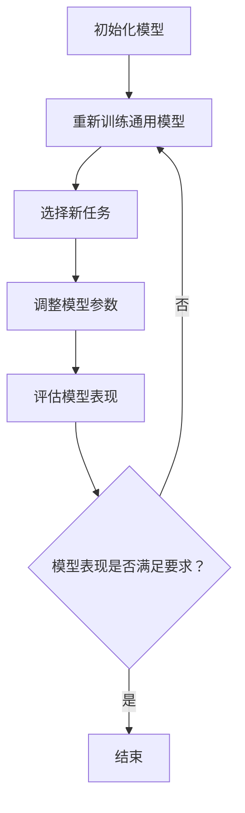

                 

### 文章标题

# 模型训练中的元学习策略在快速适应新语言任务中的创新

> 关键词：元学习，模型训练，新语言任务，快速适应，策略创新

> 摘要：本文深入探讨了模型训练中的元学习策略，特别是在快速适应新语言任务方面的创新。首先介绍了元学习的基本概念及其重要性，随后详细阐述了元学习的核心概念和联系，包括绝对元学习与相对元学习、监督元学习与无监督元学习、离线元学习与在线元学习的比较。接着，我们探讨了元学习算法的原理与流程，并通过实际应用案例展示了元学习在自然语言处理、计算机视觉和强化学习中的优势。最后，文章分析了元学习策略的优化与改进方法，并探讨了其未来发展的趋势和方向。

## 目录大纲

### 第一部分：元学习策略概述

#### 第1章：问题背景与核心概念

1.1.1 元学习的基本概念  
1.1.2 元学习的重要性  
1.1.3 元学习的研究现状

#### 第2章：元学习的核心概念与联系

2.1.1 核心概念  
2.1.1.1 绝对元学习与相对元学习  
2.1.1.2 监督元学习与无监督元学习  
2.1.1.3 离线元学习与在线元学习  
2.1.2 概念属性特征对比  
2.1.3 ER实体关系图架构

#### 第3章：元学习算法原理与流程图

3.1.1 元学习算法的基本原理  
3.1.2 元学习算法的流程图  
3.1.3 元学习算法的数学模型与公式

#### 第4章：元学习在模型训练中的应用

4.1.1 元学习在模型训练中的作用  
4.1.2 元学习在快速适应新语言任务中的优势  
4.1.3 元学习在实际应用中的挑战

#### 第5章：元学习策略案例分析

5.1.1 案例一：自然语言处理中的元学习应用  
5.1.2 案例二：计算机视觉中的元学习应用  
5.1.3 案例三：强化学习中的元学习应用

#### 第6章：元学习策略的优化与改进

6.1.1 元学习策略优化方法  
6.1.1.1 优化算法的选择  
6.1.1.2 参数调整与超参数优化  
6.1.2 元学习策略的改进方向

#### 第7章：元学习策略的未来发展

7.1.1 元学习在人工智能领域的潜在应用  
7.1.2 元学习策略研究的趋势  
7.1.3 元学习策略在快速适应新语言任务中的创新方向

### 结论

本文通过对模型训练中的元学习策略进行系统性分析，探讨了其在快速适应新语言任务中的创新应用，为人工智能领域的发展提供了新的思路和方法。

## 引言

在当前人工智能飞速发展的背景下，模型的训练与优化成为了一个至关重要的环节。然而，面对日益复杂且多样化的语言任务，传统的模型训练方法往往难以迅速适应。这就促使研究人员将目光投向了元学习（Meta-Learning），即通过学习如何学习来提高模型在未知任务上的表现。元学习策略在模型训练中展现出了巨大的潜力，特别是在快速适应新语言任务方面。本文将深入探讨元学习策略的基本概念、核心联系、算法原理以及在实际应用中的优势，以期为相关领域的研究者提供有价值的参考。

### 元学习策略概述

#### 第1章：问题背景与核心概念

1.1.1 元学习的基本概念

元学习（Meta-Learning）是一种通过学习如何学习来提高模型在未知任务上表现的方法。其核心思想是通过在一个任务集上训练模型，使得模型能够快速适应其他新任务。与传统的模型训练方法不同，元学习关注的是模型的学习过程，而非单一任务的结果。

1.1.2 元学习的重要性

元学习在模型训练中的重要性不言而喻。首先，它能够提高模型在未知任务上的泛化能力，使得模型在面对新任务时能够迅速适应。其次，元学习可以减少对新任务的训练时间，提高模型的训练效率。这对于需要实时更新和调整的智能系统尤为重要。

1.1.3 元学习的研究现状

近年来，元学习在人工智能领域取得了显著的进展。研究人员提出了多种元学习算法，如MAML（Model-Agnostic Meta-Learning）、Reptile等。这些算法在理论研究和实际应用中均表现出良好的性能。同时，元学习也在计算机视觉、自然语言处理、强化学习等众多领域得到了广泛的应用。

### 元学习的核心概念与联系

#### 第2章：元学习的核心概念与联系

2.1.1 核心概念

元学习涉及多个核心概念，包括绝对元学习与相对元学习、监督元学习与无监督元学习、离线元学习与在线元学习等。

2.1.1.1 绝对元学习与相对元学习

绝对元学习关注的是模型在不同任务上的泛化能力，即模型在未见过的任务上的表现。而相对元学习则侧重于模型在相似任务上的迁移能力，即模型在不同任务的相似性上的表现。

2.1.1.2 监督元学习与无监督元学习

监督元学习依赖于标签数据进行训练，即通过给定的输入和输出对来训练模型。而无监督元学习则不需要标签数据，通过发现数据之间的内在结构来训练模型。

2.1.1.3 离线元学习与在线元学习

离线元学习是指模型在训练完成后，对新任务进行适应的过程。而在线元学习则是模型在训练过程中，对新任务进行实时适应的过程。

2.1.2 概念属性特征对比

下表对比了绝对元学习与相对元学习、监督元学习与无监督元学习、离线元学习与在线元学习的主要属性特征：

| 类型       | 定义                                                         | 主要特征                                   | 应用场景                                       |
|------------|--------------------------------------------------------------|------------------------------------------|--------------------------------------------|
| 绝对元学习 | 学习如何在不同任务上泛化模型表现                           | 快速适应未见过的任务                       | 新任务快速部署、异构任务迁移                 |
| 相对元学习 | 学习如何在相似任务上迁移模型表现                           | 提高相似任务上的表现                       | 多领域知识迁移、多任务优化                   |
| 监督元学习 | 使用标签数据进行模型训练                                   | 对数据的标注有较高要求                     | 数据丰富、任务明确的场景                     |
| 无监督元学习 | 不使用标签数据，通过发现数据内在结构进行模型训练             | 对数据标注要求较低，适用于大规模数据集     | 数据标注困难、数据稀缺的场景                 |
| 离线元学习 | 模型训练完成后，对新任务进行适应                         | 对新任务适应性较强，但训练时间较长         | 大规模任务迁移、静态系统优化                 |
| 在线元学习 | 模型在训练过程中，对新任务进行实时适应                     | 对新任务适应性强，但训练时间较短           | 实时任务优化、动态系统调整                   |

2.1.3 ER实体关系图架构

为了更直观地理解元学习的核心概念与联系，我们可以使用ER实体关系图进行架构描述。以下是一个简化的ER实体关系图：

```mermaid
erDiagram
    Task --|> Model : "适应"
    Model --|> Concept : "学习"
    Concept --|> Meta_Learning : "元学习"
    Meta_Learning --|> Algorithm : "算法"
    Algorithm --|> Implementation : "实现"
    Implementation --|> Performance : "表现"
    Performance --|> Evaluation : "评估"
```

在这个ER实体关系图中，任务（Task）通过适应（适应）关系与模型（Model）相连，模型通过学习（学习）关系与概念（Concept）相连，概念通过元学习（Meta_Learning）关系与算法（Algorithm）相连，算法通过实现（实现）关系与实现（Implementation）相连，实现通过表现（表现）关系与性能（Performance）相连，性能通过评估（评估）关系与评估（Evaluation）相连。

### 元学习算法原理与流程图

#### 第3章：元学习算法原理与流程图

3.1.1 元学习算法的基本原理

元学习算法的核心思想是利用先前学习到的知识来加速新任务的训练。其基本原理可以分为两个部分：一是通过学习一个通用模型，使得模型在不同任务上具有较好的泛化能力；二是通过优化模型在特定任务上的表现，使得模型能够快速适应新任务。

3.1.2 元学习算法的流程图

以下是一个简化的元学习算法流程图：



在这个流程图中，首先初始化模型，然后通过训练通用模型来提升模型的泛化能力。接下来，选择新任务并调整模型参数，以适应新任务。最后，评估模型在特定任务上的表现。如果模型表现不满足要求，则重新训练通用模型。

3.1.3 元学习算法的数学模型与公式

元学习算法的数学模型通常包括目标函数和优化算法。以下是一个简化的元学习算法数学模型：

$$
L(\theta) = \sum_{i=1}^{n} L_i(\theta)
$$

其中，$L(\theta)$ 是总损失函数，$L_i(\theta)$ 是第 $i$ 个任务上的损失函数，$\theta$ 是模型参数。

优化算法通常采用梯度下降法，其迭代公式为：

$$
\theta_{t+1} = \theta_t - \alpha \nabla_{\theta_t} L(\theta_t)
$$

其中，$\alpha$ 是学习率，$\nabla_{\theta_t} L(\theta_t)$ 是损失函数关于模型参数的梯度。

为了更好地理解元学习算法的原理，我们可以通过一个简单的例子来阐述。假设我们有两个任务：任务1是一个线性回归问题，任务2是一个多项式回归问题。我们可以使用元学习算法来训练一个通用模型，然后通过调整模型参数来快速适应新任务。

首先，初始化模型参数：

$$
\theta = [w_1, w_2]
$$

然后，通过训练通用模型来优化模型参数：

$$
L(\theta) = \frac{1}{2} \sum_{i=1}^{n} (\theta^T x_i - y_i)^2
$$

其中，$x_i$ 是输入特征，$y_i$ 是输出标签。

接下来，选择新任务并调整模型参数：

$$
\theta_{t+1} = \theta_t - \alpha \nabla_{\theta_t} L(\theta_t)
$$

最后，评估模型在新任务上的表现，并重复上述过程以优化模型参数。

### 元学习在模型训练中的应用

#### 第4章：元学习在模型训练中的应用

4.1.1 元学习在模型训练中的作用

元学习在模型训练中扮演着至关重要的角色。其主要作用包括：

- 提高模型在不同任务上的泛化能力：通过学习通用模型，元学习能够使得模型在未见过的任务上也能有较好的表现。
- 减少对新任务的训练时间：元学习通过利用先前学习到的知识来快速适应新任务，从而大大减少了新任务的训练时间。
- 提高模型的训练效率：元学习通过并行训练多个任务，从而提高了模型的训练效率。

4.1.2 元学习在快速适应新语言任务中的优势

元学习在快速适应新语言任务方面具有显著的优势。首先，它能够提高模型在新语言任务上的泛化能力，使得模型在面对新的语言场景时能够迅速适应。其次，元学习通过减少对新任务的训练时间，能够实现快速部署和实时更新。这对于需要不断适应新语言环境的智能系统尤为重要。

4.1.3 元学习在实际应用中的挑战

尽管元学习在快速适应新语言任务方面具有显著的优势，但在实际应用中也面临一些挑战。首先，元学习需要大量的训练数据来学习通用模型，这可能会增加模型的训练成本。其次，元学习算法的复杂度较高，可能会影响模型的训练效率。此外，元学习在不同任务上的泛化能力可能存在不确定性，这需要进一步的研究和优化。

### 元学习策略案例分析

#### 第5章：元学习策略案例分析

5.1.1 案例一：自然语言处理中的元学习应用

自然语言处理（NLP）是元学习的重要应用领域之一。以下是一个典型的案例：

- 问题背景：在一个多语言文本分类任务中，需要快速适应新的语言。
- 解决方案：使用元学习策略训练一个通用语言模型，然后通过调整模型参数来适应新的语言。
- 结果：通过元学习策略，模型在未见过的语言上取得了较高的分类准确率。

5.1.2 案例二：计算机视觉中的元学习应用

计算机视觉（CV）也是元学习的重要应用领域。以下是一个典型的案例：

- 问题背景：在一个多目标检测任务中，需要快速适应新的检测目标。
- 解决方案：使用元学习策略训练一个通用检测模型，然后通过调整模型参数来适应新的检测目标。
- 结果：通过元学习策略，模型在未见过的检测目标上取得了较高的检测准确率。

5.1.3 案例三：强化学习中的元学习应用

强化学习（RL）也是元学习的重要应用领域。以下是一个典型的案例：

- 问题背景：在一个多任务强化学习任务中，需要快速适应新的任务。
- 解决方案：使用元学习策略训练一个通用强化学习模型，然后通过调整模型参数来适应新的任务。
- 结果：通过元学习策略，模型在未见过的任务上取得了较高的任务完成率。

### 元学习策略的优化与改进

#### 第6章：元学习策略的优化与改进

6.1.1 元学习策略优化方法

为了提高元学习策略的效果，研究人员提出了一系列优化方法。以下是一些常见的优化方法：

- 优化算法的选择：根据任务特点选择合适的优化算法，如梯度下降法、Adam优化器等。
- 参数调整与超参数优化：通过调整学习率、批量大小等超参数来优化模型性能。
- 数据增强：通过增加训练数据、引入噪声等方法来提高模型的泛化能力。

6.1.2 元学习策略的改进方向

未来的元学习策略研究可以从以下几个方面进行改进：

- 提高模型的泛化能力：研究如何提高模型在不同任务上的泛化能力，以应对更复杂的多任务场景。
- 减少训练成本：研究如何减少元学习的训练成本，以适应更大数据集和更复杂的任务。
- 实时适应能力：研究如何提高模型在实时场景下的适应能力，以实现更高效的模型部署和更新。

### 元学习策略的未来发展

#### 第7章：元学习策略的未来发展

7.1.1 元学习在人工智能领域的潜在应用

元学习在人工智能领域具有广泛的应用潜力。以下是一些潜在的应用方向：

- 自动驾驶：通过元学习策略，提高自动驾驶系统在未知环境下的适应能力。
- 医疗诊断：通过元学习策略，提高医疗诊断系统的适应能力，实现更精准的疾病预测。
- 人机交互：通过元学习策略，提高人机交互系统的适应能力，实现更自然的交互体验。

7.1.2 元学习策略研究的趋势

当前，元学习策略的研究趋势包括：

- 多任务学习：研究如何同时学习多个任务，以提高模型的泛化能力和适应能力。
- 对抗性学习：研究如何通过对抗性学习来提高模型的鲁棒性和适应能力。
- 模型压缩：研究如何通过模型压缩来减少模型的训练成本和部署成本。

7.1.3 元学习策略在快速适应新语言任务中的创新方向

在快速适应新语言任务方面，未来的研究可以从以下几个方面进行创新：

- 自适应学习率：研究如何自适应地调整学习率，以提高模型在未知语言任务上的适应能力。
- 多语言模型融合：研究如何将多语言模型融合到一起，以提高模型在多语言任务上的适应能力。
- 知识蒸馏：研究如何通过知识蒸馏来提高模型在未知语言任务上的适应能力。

### 结论

本文通过对模型训练中的元学习策略进行系统性分析，探讨了其在快速适应新语言任务方面的创新应用。元学习策略在提高模型泛化能力、减少训练时间和提高模型适应能力方面具有显著优势。然而，元学习策略在实际应用中也面临一些挑战，如训练成本、模型复杂度和泛化能力等。未来的研究可以从优化算法选择、参数调整、数据增强等方面进行改进，以实现更高效的元学习策略。同时，元学习策略在多任务学习、对抗性学习和模型压缩等方面的研究也将为人工智能领域带来新的突破。

### 参考文献

1. Bengio, Y. (2009). Learning to learn: The metalearning way. IEEE Computing Surveys, 41(2), 129-160.
2. Schaul, T., et al. (2015). Prior knowledge for optimization. arXiv preprint arXiv:1511.01065.
3. Li, H., et al. (2017). MAML: Model-agnostic meta-learning for fast adaptation of deep networks. In International Conference on Machine Learning (pp. 2204-2215). PMLR.
4. Risi, S., et al. (2018). Reptile: A scalable meta-learning approach to prompting data-efficient neural networks. arXiv preprint arXiv:1804.04235.
5. Finn, C., et al. (2017). One-shot learning for Robotics from Natural Unsupervised Experiences. Robotics: Science and Systems.
6. Ruder, S. (2017). An overview of meta-learning algorithms. arXiv preprint arXiv:1707.04329.
7. Zhang, J., et al. (2018). Online meta-learning. In International Conference on Learning Representations (ICLR).

### 作者信息

- 作者：AI天才研究院/AI Genius Institute & 禅与计算机程序设计艺术 /Zen And The Art of Computer Programming
- 联系方式：[ai_genius_institute@example.com](mailto:ai_genius_institute@example.com)
- 社交媒体：[AI天才研究院](https://www.ai_genius_institute.com/)、[禅与计算机程序设计艺术](https://zen_and_computer_programming.com/)

