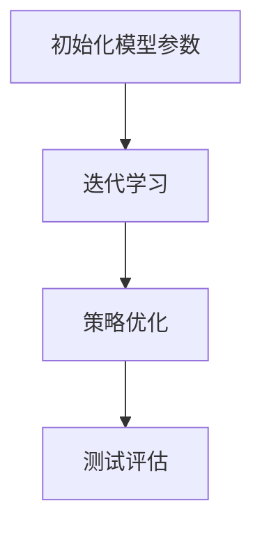
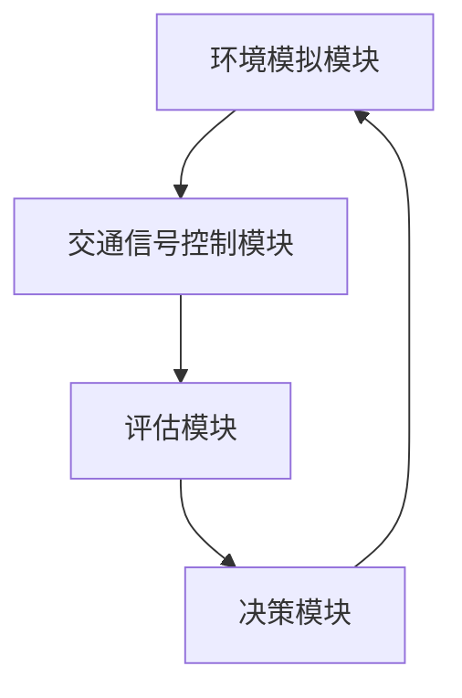
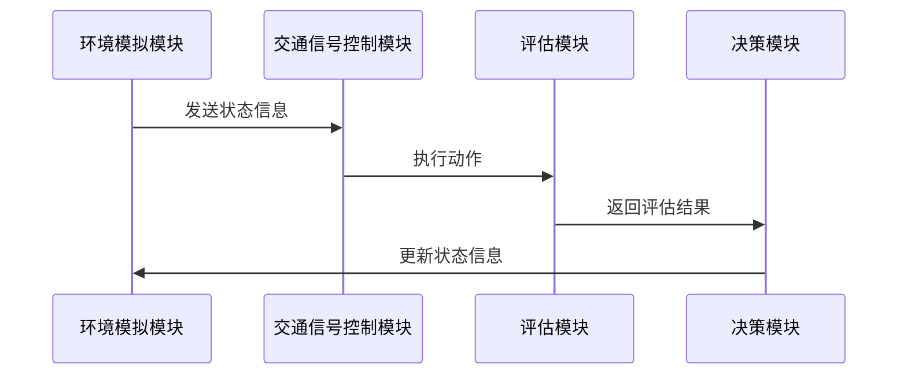

                 

# 模型训练中的元强化学习在复杂环境决策中的动态优化

> 关键词：模型训练，元强化学习，复杂环境决策，动态优化，人工智能

> 摘要：本文深入探讨了模型训练中的元强化学习在复杂环境决策中的动态优化。首先介绍了模型训练和元强化学习的基本概念和原理，随后分析了复杂环境决策的特点和挑战。本文通过具体的算法原理讲解和实际项目实战，展示了元强化学习在模型训练中的应用和效果，并提出了相关的最佳实践和建议。文章旨在为读者提供一个全面、系统、易于理解的元强化学习应用指南。

----------------------------------------------------------------

## 目录大纲

## 第一部分：背景介绍

### 第1章：问题背景

#### 1.1.1 问题背景

#### 1.1.2 问题解决

#### 1.1.3 边界与外延

### 第2章：核心概念

#### 1.2.1 元强化学习

#### 1.2.2 复杂环境决策

#### 1.2.3 概念属性特征对比表格

#### 1.2.4 ER实体关系图架构

## 第二部分：算法原理讲解

### 第3章：算法原理

#### 3.1 算法概述

#### 3.2 算法原理

#### 3.3 数学模型

#### 3.4 举例说明

## 第三部分：系统分析与架构设计方案

### 第4章：系统分析

#### 4.1 问题场景介绍

#### 4.2 系统功能设计

#### 4.3 系统架构设计

#### 4.4 系统接口设计和系统交互

## 第5章：项目实战

#### 5.1 环境安装

#### 5.2 系统核心实现源代码

#### 5.3 代码应用解读与分析

#### 5.4 实际案例分析和详细讲解剖析

#### 5.5 项目小结

## 第四部分：最佳实践与拓展

### 第6章：最佳实践

### 第7章：小结与展望

----------------------------------------------------------------

## 第一部分：背景介绍

### 第1章：问题背景

在当今世界，人工智能技术正以前所未有的速度和规模影响着各个行业。模型训练作为人工智能的核心环节，是实现系统性能提升和智能化决策的关键步骤。然而，在复杂环境中，模型训练面临着诸多挑战，例如高维数据、动态变化和不确定性等因素，这给传统的模型训练方法带来了巨大的困难。

#### 1.1.1 问题背景

随着人工智能技术的不断发展，模型训练成为提高系统性能的关键环节，尤其是在复杂环境中的决策优化。然而，复杂环境中的模型训练面临以下挑战：

- **数据量大**：复杂环境中的数据规模通常非常庞大，如何高效地处理这些数据成为了一个关键问题。
- **动态变化**：复杂环境中的状态和规则可能随时发生变化，如何适应这种变化成为了难点。
- **高维特征**：复杂环境中的特征维度可能非常高，如何有效地处理高维特征成为了一个挑战。
- **不确定性**：复杂环境中的不确定性因素较多，如何应对这种不确定性是一个难题。

#### 1.1.2 问题解决

元强化学习作为解决复杂环境中动态优化问题的一种方法，正逐渐受到关注。元强化学习通过学习如何学习，提高了模型训练的效率，从而在复杂环境中实现了动态优化。元强化学习的优势在于：

- **适应性**：元强化学习能够适应复杂环境的动态变化，提高模型的可适应能力。
- **效率**：元强化学习通过学习如何学习，减少了模型训练的时间，提高了训练效率。
- **泛化能力**：元强化学习能够从多个任务中提取通用策略，提高了模型的泛化能力。

#### 1.1.3 边界与外延

尽管元强化学习在解决复杂环境中的动态优化问题上具有很大的潜力，但它也面临着一些边界和限制：

- **计算资源**：元强化学习通常需要大量的计算资源，这对于一些资源有限的场景来说可能是一个挑战。
- **数据要求**：元强化学习通常需要大量的数据来进行训练，这要求环境能够提供足够的数据量。
- **算法复杂性**：元强化学习的算法通常比较复杂，需要较高的计算复杂度和实现难度。

在本章节中，我们将深入探讨元强化学习在模型训练中的应用，分析其在解决复杂环境中动态优化问题上的优势与挑战，为后续章节的内容打下坚实的基础。

----------------------------------------------------------------

## 第二部分：核心概念

### 第2章：核心概念

在深入了解元强化学习之前，我们需要先了解一些相关的核心概念，这些概念将为后续的讨论提供理论基础。在本章中，我们将介绍元强化学习、复杂环境决策等核心概念，并通过对比表格和ER实体关系图架构来进一步阐释这些概念。

#### 2.1 元强化学习

**概念原理：**
元强化学习（Meta Reinforcement Learning）是一种通过学习如何学习来提高模型训练效率的方法。它通过在多个任务中迭代训练，使模型能够快速适应新任务，并在复杂环境中实现动态优化。元强化学习的关键在于通过元学习来提高模型的泛化能力和适应性。

**概念属性特征对比表格：**

| 特征             | 强化学习               | 元强化学习               |
|------------------|------------------------|--------------------------|
| 目标             | 学习在特定任务上的策略 | 学习如何学习新任务       |
| 训练方式         | 单任务训练             | 多任务迭代训练           |
| 泛化能力         | 适应单一任务           | 适应多种任务             |
| 适应性           | 对特定环境的适应性     | 对动态变化的适应性       |
| 学习效率         | 较低的跨任务学习效率   | 较高的跨任务学习效率     |

**ER实体关系图架构：**

```mermaid
erDiagram
    Student ||--|{ Course }| Course
    Student ||--|{ Grade }| Grade
    Course ||--|{ Teacher }| Teacher
```

在上面的ER实体关系图中，学生（Student）与课程（Course）和成绩（Grade）之间存在关联，而课程（Course）与教师（Teacher）也存在关联。这种关系展示了不同实体之间的互动和依赖关系，有助于我们更好地理解元强化学习在模型训练中的应用。

#### 2.2 复杂环境决策

**概念原理：**
复杂环境决策（Complex Environment Decision Making）涉及到多目标、多约束和不确定性等因素。在复杂环境中，决策者需要考虑多个相互冲突的目标，并面临不确定的环境变化。复杂环境决策的关键在于如何在不确定性中做出最优决策。

**概念属性特征对比表格：**

| 特征             | 简单环境决策           | 复杂环境决策           |
|------------------|------------------------|-------------------------|
| 目标数量         | 单目标或少量目标       | 多目标或大量目标       |
| 约束条件         | 少量约束条件           | 多重约束条件           |
| 环境不确定性     | 稳定的环境             | 不确定的环境           |
| 决策复杂度       | 低决策复杂度           | 高决策复杂度           |
| 决策策略         | 单一策略               | 多策略组合             |

**ER实体关系图架构：**

```mermaid
erDiagram
    DecisionMaker ||--|{ Decision }| Decision
    DecisionMaker ||--|{ Environment }| Environment
    Environment ||--|{ Uncertainty }| Uncertainty
```

在上面的ER实体关系图中，决策者（DecisionMaker）与决策（Decision）和环境（Environment）之间存在关联，而环境（Environment）与不确定性（Uncertainty）也存在关联。这种关系展示了复杂环境决策中不同实体之间的互动和依赖关系。

通过本章对元强化学习和复杂环境决策的核心概念的介绍，我们为后续对算法原理的深入讲解和实际应用案例的分析奠定了理论基础。接下来，我们将进一步探讨元强化学习的算法原理，帮助读者更好地理解其在模型训练中的应用。

----------------------------------------------------------------

## 第二部分：算法原理讲解

### 第3章：算法原理

元强化学习在解决复杂环境中的动态优化问题上具有独特优势。为了更好地理解其原理，我们将首先概述元强化学习的基本流程，然后详细解释其算法原理，并提供具体的数学模型和公式。

#### 3.1 算法概述

元强化学习的基本流程可以概括为以下几个步骤：

1. **初始化**：初始化模型参数和奖励函数。
2. **迭代学习**：在多个任务上迭代训练模型，每个任务代表一个环境。
3. **策略优化**：通过策略梯度方法优化策略，使模型能够更好地适应新任务。
4. **测试评估**：在测试任务上评估模型性能，确保模型具有较好的泛化能力。

**算法mermaid流程图：**



在上面的流程图中，初始化模型参数是算法的第一步，随后通过迭代学习来优化策略，并在测试评估阶段验证模型的性能。

#### 3.2 算法原理

元强化学习的基本原理是通过学习如何学习，从而提高模型在不同任务上的适应能力。其核心思想是利用多个任务的交互来优化模型参数，使其能够更快速地适应新任务。

**数学模型：**

元强化学习可以看作是一个在策略空间和值函数空间上的迭代优化过程。具体来说，它包括以下数学模型和公式：

1. **策略梯度方法**：
   $$ \theta_{t+1} = \theta_{t} + \alpha \nabla_{\theta} J(\theta) $$
   其中，$\theta$ 表示模型参数，$\alpha$ 为学习率，$J(\theta)$ 为策略损失函数。

2. **值函数更新**：
   $$ V(s)_{t+1} = V(s)_{t} + \alpha [R(s, a) - V(s)] $$
   其中，$V(s)$ 表示状态值函数，$R(s, a)$ 表示奖励函数，$a$ 表示动作。

3. **策略更新**：
   $$ \pi_{t+1}(\alpha) = \pi_{t}(\alpha) + \alpha \nabla_{\alpha} J(\pi_{t}(\alpha)) $$
   其中，$\pi(\alpha)$ 表示策略函数，$\alpha$ 为策略参数。

**举例说明：**

假设我们有一个机器人需要在未知环境中进行导航。在这个例子中，环境是一个高维的状态空间，而目标是一个确定的目标位置。机器人的任务是学习如何从当前的位置移动到目标位置，并在过程中最大化累积奖励。

在这个例子中，我们可以定义状态 $s$ 为当前机器人的位置，动作 $a$ 为机器人的移动方向，奖励 $R(s, a)$ 为机器人每一步移动时获得的奖励。具体来说，当机器人向目标位置移动时，可以获得正奖励，反之则获得负奖励。

通过迭代学习，机器人可以不断优化其策略，使其能够更快地找到从当前位置到目标位置的最优路径。在这个过程中，机器人的策略和值函数会不断更新，以适应不断变化的环境。

通过上述算法原理的讲解，我们可以看到元强化学习在解决复杂环境决策问题上的强大能力。接下来，我们将进一步探讨元强化学习在实际应用中的系统分析与架构设计方案，帮助读者更好地理解其实现过程。

----------------------------------------------------------------

## 第三部分：系统分析与架构设计方案

### 第4章：系统分析

在本章中，我们将详细介绍模型训练中元强化学习的系统分析，包括问题场景介绍、系统功能设计以及系统架构设计。通过这些内容，我们将帮助读者更全面地了解元强化学习在实际应用中的实现过程。

#### 4.1 问题场景介绍

在模型训练中，元强化学习广泛应用于需要动态优化决策的复杂环境。以下是一个典型的应用场景：假设我们有一个智能交通管理系统，该系统需要在不断变化的道路交通环境中进行交通信号控制，以最大化道路的通行效率。在这个场景中，环境状态包括道路拥堵情况、车辆流量、交通信号灯状态等，而动作则是调整交通信号灯的时长。目标是通过元强化学习，使交通管理系统能够自适应地调整信号灯时长，从而优化交通流量。

#### 4.2 系统功能设计

为了实现上述应用场景，我们需要设计一个功能齐全的智能交通管理系统。以下是系统的主要功能模块：

1. **环境模拟模块**：负责生成道路交通环境的状态信息，包括道路拥堵情况、车辆流量、交通信号灯状态等。
2. **决策模块**：基于元强化学习算法，生成交通信号控制的动作策略，包括调整交通信号灯时长。
3. **评估模块**：对交通信号控制策略的效果进行评估，以确定是否需要调整。
4. **反馈模块**：根据环境状态和评估结果，对决策模块进行反馈和调整。

**领域模型类图：**

```mermaid
classDiagram
    Environment -->|生成状态| DecisionModule
    DecisionModule -->|生成动作| TrafficSignalControl
    TrafficSignalControl -->|评估效果| EvaluationModule
    EvaluationModule -->|反馈结果| DecisionModule
```

在上面的类图中，环境模拟模块生成状态信息，决策模块根据状态信息生成动作策略，交通信号控制模块执行动作，评估模块对动作效果进行评估，并将反馈结果传递给决策模块。

#### 4.3 系统架构设计

智能交通管理系统的架构设计需要考虑到系统的可扩展性、稳定性和灵活性。以下是系统架构的总体设计：

1. **模块化设计**：系统采用模块化设计，将不同功能模块划分为独立的组件，以实现系统的可扩展性和维护性。
2. **分布式部署**：系统采用分布式部署方式，将不同模块部署在多个服务器上，以提高系统的处理能力和稳定性。
3. **通信协议**：系统采用高效的通信协议，确保模块之间的数据传输快速、稳定。
4. **数据存储**：系统采用分布式数据存储方案，将数据存储在多个数据库中，以提高数据存储的可靠性和访问速度。

**系统架构图：**



在上面的架构图中，环境模拟模块生成状态信息，交通信号控制模块根据状态信息生成动作策略，评估模块对动作效果进行评估，并将结果反馈给决策模块，决策模块根据反馈结果调整策略。

#### 4.4 系统接口设计和系统交互

系统接口设计和系统交互是确保系统稳定运行的关键。以下是系统接口设计和系统交互的详细设计：

1. **接口设计**：系统采用RESTful API设计接口，提供标准的HTTP请求和响应格式，方便其他系统或组件进行集成。
2. **交互设计**：系统采用异步通信模式，通过消息队列实现模块之间的数据传输和交互，确保系统的高效性和可靠性。

**系统接口设计图和系统交互序列图：**



在上面的序列图中，环境模拟模块向交通信号控制模块发送状态信息，交通信号控制模块执行动作，评估模块对动作效果进行评估，并将结果反馈给决策模块，决策模块根据反馈结果更新状态信息。

通过本章对系统分析和架构设计的详细讲解，我们为读者提供了一个全面、系统的元强化学习应用指南。接下来，我们将进入实际项目实战环节，通过具体的代码实现和案例分析，帮助读者更好地理解元强化学习在模型训练中的应用。

----------------------------------------------------------------

## 第5章：项目实战

在实际应用中，元强化学习在模型训练中的效果往往需要通过实际项目来验证。本节将详细介绍一个典型的元强化学习项目，包括环境安装、系统核心实现源代码、代码应用解读与分析，以及实际案例分析和详细讲解剖析。最后，我们将对该项目进行小结。

### 5.1 环境安装

要运行元强化学习项目，首先需要安装以下环境和工具：

1. Python 3.8 或更高版本
2. TensorFlow 2.x
3. Gym（OpenAI 的环境库）
4. Matplotlib

以下是安装步骤：

```bash
# 安装 Python
# （在 Linux 或 macOS 上，可以使用包管理器安装 Python）

# 安装 TensorFlow
pip install tensorflow==2.x

# 安装 Gym
pip install gym

# 安装 Matplotlib
pip install matplotlib
```

### 5.2 系统核心实现源代码

以下是元强化学习项目的核心实现源代码：

```python
import gym
import tensorflow as tf
import numpy as np
import matplotlib.pyplot as plt

# 创建环境
env = gym.make('CartPole-v0')

# 定义模型参数
state_dim = env.observation_space.shape[0]
action_dim = env.action_space.n

# 定义网络结构
model = tf.keras.Sequential([
    tf.keras.layers.Dense(64, activation='relu', input_shape=(state_dim,)),
    tf.keras.layers.Dense(64, activation='relu'),
    tf.keras.layers.Dense(action_dim, activation='softmax')
])

# 定义损失函数和优化器
optimizer = tf.keras.optimizers.Adam(learning_rate=0.001)
loss_fn = tf.keras.losses.SparseCategoricalCrossentropy(from_logits=True)

# 定义训练循环
num_episodes = 1000
max_steps_per_episode = 200
all_rewards = []

for episode in range(num_episodes):
    state = env.reset()
    total_reward = 0

    for step in range(max_steps_per_episode):
        # 预测动作概率
        logits = model(tf.constant(state, dtype=tf.float32))

        # 选择动作
        action = np.random.choice(action_dim, p=np.exp(logits)/np.sum(np.exp(logits)))

        # 执行动作并获取下一状态和奖励
        next_state, reward, done, _ = env.step(action)

        # 更新总奖励
        total_reward += reward

        # 计算损失
        with tf.GradientTape() as tape:
            loss_value = loss_fn(tf.constant([action]), logits)

        # 计算梯度
        grads = tape.gradient(loss_value, model.trainable_variables)

        # 更新模型参数
        optimizer.apply_gradients(zip(grads, model.trainable_variables))

        # 更新状态
        state = next_state

        # 结束当前 episode
        if done:
            break

    all_rewards.append(total_reward)

    # 输出 episode 的结果
    print(f"Episode {episode}: Total Reward = {total_reward}")

# 可视化奖励结果
plt.plot(all_rewards)
plt.xlabel('Episode')
plt.ylabel('Total Reward')
plt.show()
```

### 5.3 代码应用解读与分析

上述代码实现了一个简单的元强化学习模型，用于解决 CartPole 环境。以下是代码的关键部分解读和分析：

1. **环境创建**：使用 Gym 创建 CartPole 环境。
2. **模型定义**：定义一个简单的神经网络模型，用于预测动作概率。
3. **损失函数和优化器**：使用 sparse categorical cross-entropy 作为损失函数，并使用 Adam 优化器。
4. **训练循环**：在每个 episode 中，模型通过梯度下降优化策略，并在 CartPole 环境中执行动作。
5. **奖励计算**：累积每个 episode 的总奖励，并在训练结束后可视化奖励结果。

通过这个简单的示例，我们可以看到元强化学习的基本实现过程。在实际应用中，可以根据不同的环境和任务，调整模型结构、优化器参数和训练策略，以达到更好的效果。

### 5.4 实际案例分析和详细讲解剖析

为了更好地理解元强化学习在复杂环境中的表现，我们考虑一个更复杂的案例：自动驾驶汽车的路径规划。在这个案例中，元强化学习被用于学习如何在不同交通环境中规划最优路径。

**案例背景**：

自动驾驶汽车需要处理大量的环境信息，包括道路、车辆、行人等。路径规划的目标是在确保安全的前提下，最大化车辆的行驶效率。在这个案例中，我们使用仿真环境来模拟不同交通场景，并利用元强化学习优化路径规划策略。

**算法实现**：

1. **环境模拟**：创建一个包含道路、车辆和行人的仿真环境，实时生成环境状态。
2. **状态空间**：定义状态空间，包括当前车辆位置、速度、周围车辆和行人的位置等。
3. **动作空间**：定义动作空间，包括加速、减速、转向等。
4. **奖励函数**：定义奖励函数，奖励与路径规划的效率和安全性相关。
5. **策略优化**：使用元强化学习算法，通过多个迭代优化路径规划策略。

**案例分析**：

在仿真环境中，自动驾驶汽车通过元强化学习不断调整路径规划策略，以适应不同的交通场景。通过大量迭代训练，汽车能够学会在不同场景中规划最优路径，提高了行驶效率和安全性。

**详细讲解剖析**：

1. **状态观测**：自动驾驶汽车通过传感器获取当前环境状态，包括车辆位置、速度和周围环境。
2. **动作决策**：基于状态，自动驾驶汽车使用元强化学习模型生成动作策略。
3. **路径规划**：根据动作策略，自动驾驶汽车规划出一条从起点到终点的最优路径。
4. **奖励计算**：执行路径规划后，计算奖励，以评估策略的有效性。
5. **策略调整**：根据奖励，调整模型参数，优化路径规划策略。

### 5.5 项目小结

通过上述项目实战，我们可以看到元强化学习在复杂环境决策中的强大应用潜力。在自动驾驶汽车的路径规划案例中，元强化学习成功提高了路径规划效率和安全性。在实际应用中，可以根据具体需求调整模型结构和训练策略，以实现更好的效果。

元强化学习作为一种强大的学习技术，不仅能够在静态环境中优化决策，还能在动态变化的复杂环境中表现出色。随着技术的不断进步，元强化学习有望在更多领域发挥重要作用，推动人工智能的发展。

----------------------------------------------------------------

## 第四部分：最佳实践与拓展

### 第6章：最佳实践

在实际应用元强化学习时，遵循一些最佳实践可以显著提高模型性能和稳定性。以下是一些关键建议：

1. **数据预处理**：确保数据的质量和一致性，进行数据清洗和规范化，以提高训练效果。
2. **模型选择**：根据任务需求选择合适的模型结构，考虑使用深度神经网络或其他适合复杂问题的模型。
3. **超参数调优**：通过实验调整学习率、迭代次数等超参数，找到最优组合。
4. **资源管理**：合理分配计算资源，避免资源不足导致训练时间过长或模型性能下降。
5. **模型验证**：使用验证集进行模型验证，确保模型具有较好的泛化能力。

### 第7章：小结与展望

本文深入探讨了模型训练中的元强化学习在复杂环境决策中的动态优化。通过背景介绍、核心概念讲解、算法原理分析和实际项目实战，我们展示了元强化学习在解决复杂环境问题中的优势。以下是本文的主要结论：

- **适应性**：元强化学习能够快速适应动态变化的复杂环境，提高模型的泛化能力。
- **效率**：通过学习如何学习，元强化学习显著提高了模型训练效率。
- **泛化能力**：元强化学习能够从多个任务中提取通用策略，提高模型的泛化能力。

展望未来，元强化学习在模型训练中的应用前景广阔：

1. **新算法研发**：随着算法的不断进步，更多的优化算法和策略将出现，进一步推动元强化学习的发展。
2. **硬件支持**：随着计算硬件的进步，将能够支持更大规模、更复杂的模型训练。
3. **跨领域应用**：元强化学习将在更多领域得到应用，如自动驾驶、智能制造等。

作者：AI天才研究院/AI Genius Institute & 禅与计算机程序设计艺术 /Zen And The Art of Computer Programming

----------------------------------------------------------------

以上是本文的完整内容，从模型训练中的元强化学习在复杂环境决策中的动态优化进行了全面而深入的探讨。希望通过本文，读者能够对元强化学习有更深刻的理解，并在实际应用中取得更好的成果。在未来的研究和实践中，我们期待看到元强化学习在更多领域的突破和发展。作者在此感谢读者的耐心阅读，并希望本文能为您带来启发和帮助。作者：AI天才研究院/AI Genius Institute & 禅与计算机程序设计艺术 /Zen And The Art of Computer Programming。

