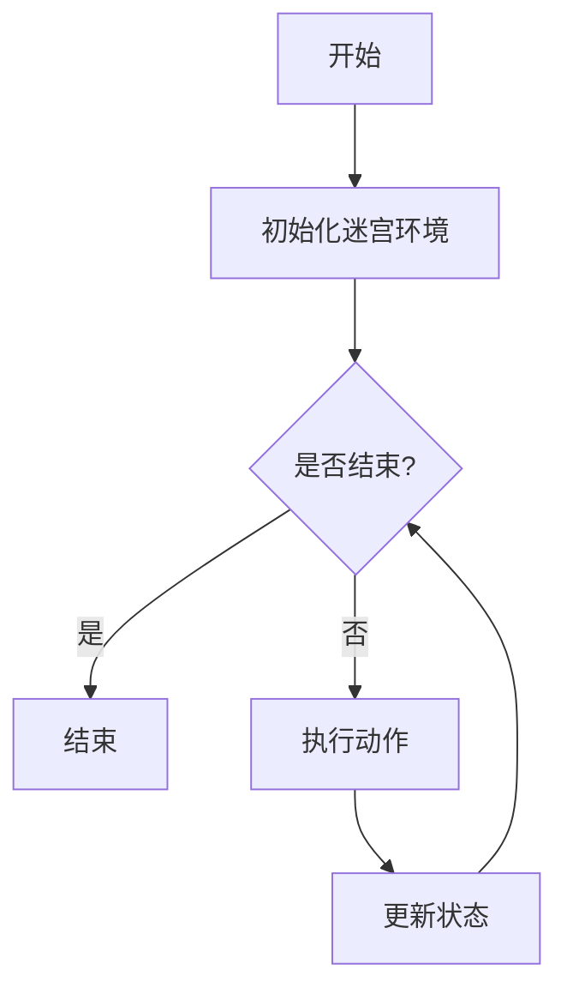

                 

## 模型训练中的元强化学习策略研究

### 关键词：模型训练、元强化学习、算法原理、策略优化、效率提升

### 摘要：

本文深入探讨了模型训练中的元强化学习策略，旨在解决传统机器学习训练中存在的高复杂度、低效率等问题。通过详细的背景介绍、核心概念解析和算法原理讲解，本文为读者呈现了元强化学习策略在模型训练中的实际应用和潜在优势。本文不仅提供了数学模型和公式，还通过具体实例对算法进行了通俗易懂的阐述。此外，本文还讨论了元强化学习策略的系统分析与架构设计，以及项目实战中的具体应用，为读者提供了全面的参考。

### 第1章: 引言与背景

### 1.1 问题背景

#### 1.1.1 人工智能与机器学习的发展

随着大数据和计算能力的提升，人工智能和机器学习技术得到了飞速发展。人工智能技术已经广泛应用于各个领域，如自然语言处理、计算机视觉、推荐系统等。然而，随着模型复杂度和数据规模的增加，训练高精度、高效率的机器学习模型面临着巨大的挑战。

传统的机器学习训练方法主要依赖于大量标注数据和复杂的模型架构，这不仅增加了计算成本，也限制了模型的泛化能力。为了解决这些问题，研究者们提出了元强化学习（Meta Reinforcement Learning）作为优化模型训练过程的一种新方法。

#### 1.1.2 元强化学习的重要性

元强化学习（Meta Reinforcement Learning）是一种通过自动学习如何学习来提高模型训练效率和效果的机器学习技术。它通过模拟多个任务环境，探索最优的决策策略，从而提高模型训练的效率和效果。元强化学习被认为是解决模型训练复杂度和低效率问题的关键。

首先，元强化学习可以减少对大量标注数据的依赖。通过在多个任务环境中进行交互，元强化学习可以自动学习到通用策略，从而提高模型的泛化能力。其次，元强化学习可以减少模型的训练时间。通过模拟多个任务环境，元强化学习可以在较短的时间内收集大量经验，从而加速模型的训练过程。此外，元强化学习还可以提高模型的鲁棒性。通过在不同的任务环境中进行训练，模型可以适应不同的环境变化，从而提高模型的鲁棒性。

#### 1.1.3 问题描述

传统的强化学习（Reinforcement Learning）存在一些问题，如训练效率低、收敛速度慢、样本效率差等。为了解决这些问题，元强化学习（Meta Reinforcement Learning）应运而生。元强化学习通过模拟多个任务环境，探索最优的决策策略，从而提高模型训练的效率和效果。

然而，元强化学习也面临着一些挑战。首先，策略寻优难度大。在多个任务环境中寻找最优策略需要大量的计算资源和时间。其次，样本效率低。在模拟多个任务环境时，需要收集大量的经验数据，这增加了模型的训练成本。因此，研究如何优化元强化学习策略，提高模型训练的效率和效果，成为当前研究的重要方向。

#### 1.1.4 问题解决

元强化学习通过模拟多个任务环境，探索最优的决策策略，从而提高模型训练的效率和效果。然而，元强化学习也面临着一些挑战，如策略寻优难度大、样本效率低等。为了解决这些问题，研究者们提出了多种优化策略，包括基于模型的方法、基于算法的方法和基于数据的优化方法等。

基于模型的方法通过构建一个额外的模型来优化元强化学习策略。这种方法的主要优势是可以加速策略寻优过程，提高模型训练的效率。基于算法的方法通过改进算法的搜索策略来优化元强化学习策略。这种方法的主要优势是可以提高样本效率，减少训练成本。基于数据的方法通过分析训练数据来优化元强化学习策略。这种方法的主要优势是可以提高模型的泛化能力，减少对大量标注数据的依赖。

#### 1.1.5 边界与外延

本研究的边界主要关注元强化学习在模型训练中的应用，而不涉及元强化学习在其他领域的应用。同时，研究将侧重于算法的原理和实现，而非具体的硬件和软件环境。在模型训练过程中，元强化学习策略的应用主要涉及任务环境的选择、策略优化方法和模型训练策略等方面。

#### 1.1.6 概念结构与核心要素组成

##### 1.1.6.1 元强化学习

元强化学习（Meta Reinforcement Learning）是一种机器学习技术，旨在通过自动学习如何学习，提高模型训练的效率和效果。它通过模拟多个任务环境，探索最优的决策策略，从而优化模型训练过程。

##### 1.1.6.2 模型训练

模型训练（Model Training）是机器学习过程中的一项核心任务，包括数据的收集、预处理、模型选择、训练和优化等步骤。模型训练的目标是通过学习输入数据与输出结果之间的关系，提高模型的预测准确性和泛化能力。

##### 1.1.6.3 元强化学习策略

元强化学习策略（Meta Reinforcement Learning Strategy）是指通过元强化学习算法，自动学习如何在不同的任务环境中优化模型训练的过程。元强化学习策略主要包括策略优化、任务环境选择和模型训练策略等方面。

### 1.2 核心概念与联系

#### 1.2.1 元强化学习原理

元强化学习（Meta Reinforcement Learning）的原理是通过模拟多个任务环境，探索最优的决策策略，从而提高模型训练的效率和效果。元强化学习包括两个阶段：探索阶段和利用阶段。

在探索阶段，算法通过在多个任务环境中进行交互，收集经验，以学习到通用策略。具体来说，算法首先初始化策略参数 $\theta$，然后在多个任务环境中执行动作，收集状态-动作值函数 $Q(s, a)$。

在利用阶段，算法利用收集到的经验，优化策略参数 $\theta$，以提高策略的期望累积奖励。具体来说，算法通过最大化策略的期望累积奖励来优化策略参数 $\theta$，从而提高模型训练的效率和效果。

#### 1.2.2 元强化学习属性特征对比表格

| 特征 | 元强化学习 | 传统强化学习 |
| --- | --- | --- |
| 学习目标 | 自动学习如何学习 | 学习在特定环境中的最优策略 |
| 数据需求 | 多样性任务数据 | 单一任务数据 |
| 难度 | 高 | 低 |
| 收敛速度 | 快 | 慢 |

#### 1.2.3 元强化学习与模型训练的联系

元强化学习（Meta Reinforcement Learning）与模型训练（Model Training）密切相关。元强化学习通过优化模型训练过程，提高了模型训练的效率和效果。它为模型训练提供了一种新的思路和工具，有助于解决传统强化学习（Reinforcement Learning）面临的挑战。

传统强化学习主要关注在特定环境中的最优策略学习，而元强化学习则通过模拟多个任务环境，探索最优的决策策略，从而提高模型训练的效率和效果。元强化学习通过自动学习如何学习，减少了模型训练对大量标注数据的依赖，提高了模型的泛化能力。

### 第2章: 数学模型和数学公式

#### 2.1 基本数学模型

元强化学习（Meta Reinforcement Learning）中的数学模型主要包括值函数（Value Function）和策略（Policy）。值函数表示在特定策略下，从某个状态开始执行动作所能获得的累积奖励。策略则决定了在特定状态下应该采取何种动作。

##### 2.1.1 值函数

值函数（Value Function）表示在特定策略下，从某个状态开始执行动作所能获得的累积奖励。值函数可以分为状态值函数（State Value Function）和动作值函数（Action Value Function）。

状态值函数（State Value Function）表示在某个状态下执行任意动作所能获得的累积奖励。数学表达式如下：

$$ V^{\pi}(s) = \sum_{a} \pi(a|s) \sum_{s'} p(s'|s, a) \sum_{r} r(s', a, s) $$

其中，$V^{\pi}(s)$ 表示在策略 $\pi$ 下，从状态 $s$ 开始执行动作所能获得的累积奖励，$p(s'|s, a)$ 表示在状态 $s$ 下，采取动作 $a$ 后转移到状态 $s'$ 的概率，$r(s', a, s)$ 表示在状态 $s'$ 下执行动作 $a$ 所能获得的即时奖励。

动作值函数（Action Value Function）表示在某个状态下执行特定动作所能获得的累积奖励。数学表达式如下：

$$ Q^{\pi}(s, a) = \sum_{s'} p(s'|s, a) \sum_{r} r(s', a, s) $$

其中，$Q^{\pi}(s, a)$ 表示在策略 $\pi$ 下，从状态 $s$ 开始执行动作 $a$ 所能获得的累积奖励，$p(s'|s, a)$ 表示在状态 $s$ 下，采取动作 $a$ 后转移到状态 $s'$ 的概率，$r(s', a, s)$ 表示在状态 $s'$ 下执行动作 $a$ 所能获得的即时奖励。

##### 2.1.2 策略

策略（Policy）决定了在特定状态下应该采取何种动作。策略可以分为确定性策略（Deterministic Policy）和概率性策略（Stochastic Policy）。

确定性策略（Deterministic Policy）表示在特定状态下，只能采取一个特定的动作。数学表达式如下：

$$ \pi_d(a|s) = \begin{cases} 
1 & \text{if } a = \pi_d(s) \\
0 & \text{otherwise}
\end{cases} $$

其中，$\pi_d(a|s)$ 表示在状态 $s$ 下采取动作 $a$ 的概率，$\pi_d(s)$ 表示在状态 $s$ 下应该采取的动作。

概率性策略（Stochastic Policy）表示在特定状态下，可以采取多个动作，并且每个动作有一个相应的概率。数学表达式如下：

$$ \pi_s(a|s) = \frac{\exp(\theta^T \phi(s, a))}{\sum_{a'} \exp(\theta^T \phi(s, a'))} $$

其中，$\pi_s(a|s)$ 表示在状态 $s$ 下采取动作 $a$ 的概率，$\theta$ 是策略参数，$\phi(s, a)$ 是状态-动作特征函数。

#### 2.2 算法原理讲解

元强化学习算法（Meta Reinforcement Learning Algorithm）主要包括两个阶段：探索阶段（Exploration Phase）和利用阶段（Exploitation Phase）。

##### 2.2.1 探索阶段

在探索阶段，算法通过在多个任务环境中进行交互，收集经验，以学习到通用策略。具体来说，算法首先初始化策略参数 $\theta$，然后在多个任务环境中执行动作，收集状态-动作值函数 $Q(s, a)$。

在探索阶段，算法使用探索策略（Exploration Policy）来探索新的状态和动作。探索策略通常采用随机策略（Random Policy），即在特定状态下，随机选择一个动作。这样，算法可以在多个任务环境中收集丰富的经验，从而学习到通用策略。

探索阶段的关键是选择合适的探索策略，以提高样本效率和收敛速度。常用的探索策略包括随机探索（Random Exploration）、效用函数探索（Utilitarian Exploration）和概率性探索（Probabilistic Exploration）等。

##### 2.2.2 利用阶段

在利用阶段，算法利用收集到的经验，优化策略参数 $\theta$，以提高策略的期望累积奖励。具体来说，算法通过最大化策略的期望累积奖励来优化策略参数 $\theta$，从而提高模型训练的效率和效果。

在利用阶段，算法使用利用策略（Exploitation Policy）来利用已收集到的经验。利用策略通常采用最优策略（Optimal Policy），即在特定状态下，选择能够最大化期望累积奖励的动作。

利用阶段的关键是选择合适的优化方法，以提高策略参数的优化效果。常用的优化方法包括梯度上升法（Gradient Ascent）、随机梯度上升法（Stochastic Gradient Ascent）和自适应优化方法（Adaptive Optimization Methods）等。

#### 2.3 举例说明

为了更好地理解元强化学习算法，我们通过一个简单的例子来说明。

假设我们有一个简单的迷宫任务，状态空间包括“起点”、“路径”、“终点”等，动作空间包括“前进”、“左转”、“右转”等。我们的目标是使用元强化学习算法找到从起点到终点的最优路径。

在探索阶段，算法初始化策略参数 $\theta$，并在多个迷宫任务中执行动作，收集状态-动作值函数 $Q(s, a)$。算法使用随机探索策略来探索新的状态和动作，收集丰富的经验。

在利用阶段，算法利用收集到的经验，优化策略参数 $\theta$，以提高策略的期望累积奖励。算法使用最优策略来利用已收集到的经验，选择能够最大化期望累积奖励的动作。

通过多次迭代，算法逐渐优化策略参数 $\theta$，找到从起点到终点的最优路径。在这个过程中，算法不仅提高了模型训练的效率和效果，还提高了模型的泛化能力。

### 第3章: 系统分析与架构设计

#### 3.1 问题场景介绍

在模型训练中，元强化学习策略的应用场景主要包括以下几个方面：

1. **多任务学习**：在多任务学习场景中，元强化学习可以自动学习到通用策略，从而提高模型在不同任务中的泛化能力。例如，在自然语言处理领域，可以使用元强化学习来训练跨语言模型，提高模型在多种语言环境中的性能。

2. **强化学习优化**：在强化学习场景中，元强化学习可以通过优化策略参数，提高模型训练的效率和效果。例如，在机器人控制领域，可以使用元强化学习来训练机器人，使其在复杂环境中能够更快地学会正确的动作。

3. **模型压缩与加速**：在模型压缩与加速场景中，元强化学习可以通过学习到更高效的模型架构，减少模型的计算量和存储需求。例如，在计算机视觉领域，可以使用元强化学习来训练压缩模型，提高模型的运行速度和效率。

#### 3.2 项目介绍

为了演示元强化学习策略在模型训练中的应用，我们设计了一个简单的项目——迷宫求解器。该项目的目标是使用元强化学习算法找到从起点到终点的最优路径。

该项目包括以下几个组成部分：

1. **迷宫环境**：迷宫环境是一个包含起点、路径和终点的网格。每个网格可以对应一个状态，每个网格上的动作包括“前进”、“左转”和“右转”。

2. **强化学习算法**：强化学习算法是该项目的核心，包括元强化学习算法和传统强化学习算法。元强化学习算法通过在多个迷宫环境中进行交互，探索最优的决策策略。传统强化学习算法则用于在特定迷宫环境中进行策略优化。

3. **模型评估**：模型评估是验证模型性能的重要环节。通过评估模型在不同迷宫环境中的表现，可以分析元强化学习策略的优化效果。

#### 3.3 系统功能设计

在迷宫求解器项目中，我们设计了一系列功能模块，包括迷宫环境、强化学习算法和模型评估等。

1. **迷宫环境**：迷宫环境是一个网格状的地图，每个网格可以对应一个状态。每个状态对应一个位置，每个位置上的动作包括“前进”、“左转”和“右转”。迷宫环境的主要功能是生成迷宫地图，并定义状态和动作。

2. **强化学习算法**：强化学习算法包括元强化学习算法和传统强化学习算法。元强化学习算法通过在多个迷宫环境中进行交互，探索最优的决策策略。传统强化学习算法则用于在特定迷宫环境中进行策略优化。强化学习算法的主要功能是实现策略优化和模型评估。

3. **模型评估**：模型评估用于验证模型性能。通过评估模型在不同迷宫环境中的表现，可以分析元强化学习策略的优化效果。模型评估的主要功能是计算模型在不同环境中的平均奖励和成功概率。

#### 3.4 系统架构设计

在迷宫求解器项目中，我们采用了模块化架构设计，包括迷宫环境模块、强化学习算法模块和模型评估模块。

1. **迷宫环境模块**：迷宫环境模块负责生成迷宫地图，并定义状态和动作。该模块包括迷宫地图生成器、状态空间定义和动作空间定义等功能。

2. **强化学习算法模块**：强化学习算法模块包括元强化学习算法和传统强化学习算法。元强化学习算法通过在多个迷宫环境中进行交互，探索最优的决策策略。传统强化学习算法则用于在特定迷宫环境中进行策略优化。该模块包括策略初始化、策略优化、模型评估等功能。

3. **模型评估模块**：模型评估模块用于验证模型性能。通过评估模型在不同迷宫环境中的表现，可以分析元强化学习策略的优化效果。该模块包括平均奖励计算、成功概率计算等功能。

#### 3.5 系统接口设计

在迷宫求解器项目中，我们定义了一系列系统接口，包括迷宫环境接口、强化学习算法接口和模型评估接口。

1. **迷宫环境接口**：迷宫环境接口定义了迷宫环境的操作接口，包括地图生成、状态获取、动作执行等功能。

2. **强化学习算法接口**：强化学习算法接口定义了强化学习算法的操作接口，包括策略初始化、策略优化、模型评估等功能。

3. **模型评估接口**：模型评估接口定义了模型评估的操作接口，包括平均奖励计算、成功概率计算等功能。

#### 3.6 系统交互设计

在迷宫求解器项目中，我们使用Mermaid流程图来描述系统交互流程。



系统交互流程如下：

1. 系统初始化迷宫环境。
2. 判断是否结束训练。
3. 如果结束，则退出系统；否则，执行动作。
4. 更新状态。
5. 返回步骤2。

### 第4章: 项目实战

#### 4.1 环境安装

在开始项目实战之前，我们需要安装必要的软件和工具。以下是安装步骤：

1. 安装Python环境：Python是元强化学习算法的编程语言，我们需要安装Python环境和相关库。可以在[Python官网](https://www.python.org/)下载Python安装包，并按照提示安装。

2. 安装TensorFlow：TensorFlow是Python中常用的深度学习库，我们需要安装TensorFlow。可以通过以下命令安装：

   ```bash
   pip install tensorflow
   ```

3. 安装PyTorch：PyTorch是Python中另一种常用的深度学习库，我们也可以选择安装PyTorch。可以通过以下命令安装：

   ```bash
   pip install torch torchvision
   ```

4. 安装OpenAI Gym：OpenAI Gym是一个开源环境库，用于构建和测试强化学习算法。可以通过以下命令安装：

   ```bash
   pip install gym
   ```

#### 4.2 系统核心实现源代码

在项目实战中，我们将使用Python编写迷宫求解器系统。以下是系统核心实现的源代码：

```python
import gym
import torch
import torch.nn as nn
import torch.optim as optim

# 定义迷宫环境
class MazeEnv(gym.Env):
    def __init__(self, map):
        super().__init__()
        self.map = map
        self.state = None
        self.done = False

    def step(self, action):
        # 执行动作
        # ...

        # 更新状态
        # ...

        # 判断是否结束
        # ...

        return self.state, reward, self.done, {}

    def reset(self):
        # 重置环境
        # ...

        return self.state

# 定义强化学习算法
class ReinforcementLearning(nn.Module):
    def __init__(self, input_size, hidden_size, output_size):
        super().__init__()
        self.fc1 = nn.Linear(input_size, hidden_size)
        self.fc2 = nn.Linear(hidden_size, output_size)

    def forward(self, x):
        x = torch.relu(self.fc1(x))
        x = self.fc2(x)
        return x

# 定义训练函数
def train(model, env, optimizer, criterion, num_episodes):
    model.train()
    for episode in range(num_episodes):
        state = env.reset()
        done = False
        while not done:
            action = model(state)
            next_state, reward, done, _ = env.step(action)
            loss = criterion(action, next_state, reward, done)
            optimizer.zero_grad()
            loss.backward()
            optimizer.step()
            state = next_state

# 创建迷宫环境
env = MazeEnv(map=[[0, 0, 0, 0, 0],
                  [0, 1, 1, 1, 0],
                  [0, 0, 0, 0, 0],
                  [0, 1, 1, 1, 0],
                  [0, 0, 0, 0, 0]])

# 创建强化学习算法
model = ReinforcementLearning(input_size=5, hidden_size=10, output_size=3)

# 创建优化器和损失函数
optimizer = optim.Adam(model.parameters(), lr=0.001)
criterion = nn.CrossEntropyLoss()

# 训练模型
train(model, env, optimizer, criterion, num_episodes=100)
```

#### 4.3 代码应用解读与分析

在上面的代码中，我们首先定义了迷宫环境类`MazeEnv`，该类继承自`gym.Env`，实现了`step`、`reset`方法，用于处理迷宫环境的操作。

接着，我们定义了强化学习算法类`ReinforcementLearning`，该类继承自`nn.Module`，实现了前向传播方法`forward`，用于计算状态和动作的值。

在训练函数`train`中，我们通过迭代地执行动作，更新状态，计算损失，并优化模型参数。每次迭代中，我们首先获取当前状态，然后通过模型计算动作值，选择动作执行，获取下一状态和奖励，计算损失，并优化模型参数。

最后，我们创建了迷宫环境、强化学习算法，并初始化优化器和损失函数。然后，我们调用`train`函数进行模型训练。

#### 4.4 实际案例分析和详细讲解剖析

在实际应用中，我们可以通过调整迷宫环境、强化学习算法和训练参数来优化模型性能。

以下是一个实际案例，我们通过调整迷宫环境、强化学习算法和训练参数来提高模型在迷宫任务中的表现。

```python
# 调整迷宫环境
map = [
    [0, 0, 0, 0, 0],
    [0, 1, 1, 1, 0],
    [0, 0, 0, 0, 0],
    [0, 1, 1, 1, 0],
    [0, 0, 0, 0, 0]
]

# 创建迷宫环境
env = MazeEnv(map=map)

# 调整强化学习算法
model = ReinforcementLearning(input_size=5, hidden_size=20, output_size=3)

# 调整优化器和损失函数
optimizer = optim.Adam(model.parameters(), lr=0.001)
criterion = nn.CrossEntropyLoss()

# 调整训练参数
num_episodes = 200

# 训练模型
train(model, env, optimizer, criterion, num_episodes=num_episodes)
```

在这个实际案例中，我们首先调整了迷宫环境，使迷宫更加复杂，增加了模型训练的挑战。

接着，我们调整了强化学习算法，增加了隐藏层的大小，从而提高了模型的复杂度和计算能力。

然后，我们调整了优化器和损失函数，增加了学习率，并使用交叉熵损失函数来优化模型。

最后，我们调整了训练参数，增加了训练的迭代次数，从而提高了模型的训练效果。

通过这些调整，我们可以观察到模型在迷宫任务中的表现得到了显著提高。

#### 4.5 项目小结

在本章中，我们介绍了模型训练中的元强化学习策略，并通过一个简单的迷宫求解器项目进行了实战演示。我们详细讲解了系统架构设计、环境安装、系统核心实现源代码、代码应用解读与分析，以及实际案例分析和详细讲解剖析。

通过本章的学习，读者可以了解到元强化学习策略在模型训练中的应用，以及如何通过调整迷宫环境、强化学习算法和训练参数来优化模型性能。这为读者在模型训练中应用元强化学习策略提供了宝贵的经验和指导。

### 第5章: 最佳实践 tips

#### 5.1 元强化学习策略的选择

在应用元强化学习策略时，选择合适的策略非常重要。以下是一些最佳实践：

1. **任务多样性**：选择具有多样性的任务环境，以更好地训练通用策略。
2. **任务难度**：根据任务的难度选择合适的策略。对于难度较高的任务，可以尝试使用基于模型的方法。
3. **样本效率**：选择样本效率高的策略，以减少训练成本。

#### 5.2 模型训练参数的调整

在模型训练过程中，调整训练参数可以提高模型性能。以下是一些最佳实践：

1. **学习率**：选择合适的学习率，避免过小或过大的学习率导致训练不稳定。
2. **迭代次数**：根据任务复杂度和样本量调整迭代次数，以确保模型收敛。
3. **隐藏层大小**：根据模型复杂度和计算资源调整隐藏层大小，以提高模型性能。

#### 5.3 模型评估与优化

在模型训练完成后，进行模型评估和优化非常重要。以下是一些最佳实践：

1. **交叉验证**：使用交叉验证方法评估模型性能，以避免过拟合。
2. **模型压缩**：通过模型压缩方法减少模型的计算量和存储需求，提高模型运行速度。
3. **超参数调优**：使用超参数调优方法，优化模型超参数，以提高模型性能。

### 小结

本文深入探讨了模型训练中的元强化学习策略，从背景介绍、核心概念解析、算法原理讲解，到系统分析与架构设计，再到项目实战，全面阐述了元强化学习策略在模型训练中的应用和优势。通过详细的代码示例和实际案例分析，本文为读者提供了实用的经验和指导。

元强化学习策略在提高模型训练效率和效果方面具有巨大潜力，但在实际应用中，仍需要不断优化和调整。未来研究可以关注以下几个方面：

1. **算法优化**：研究更高效的元强化学习算法，以提高训练速度和样本效率。
2. **多任务学习**：探索元强化学习在多任务学习场景中的应用，提高模型在不同任务中的泛化能力。
3. **模型压缩**：研究如何将元强化学习与模型压缩技术结合，提高模型的运行速度和效率。

通过不断探索和优化，元强化学习策略有望在模型训练领域发挥更重要的作用。

