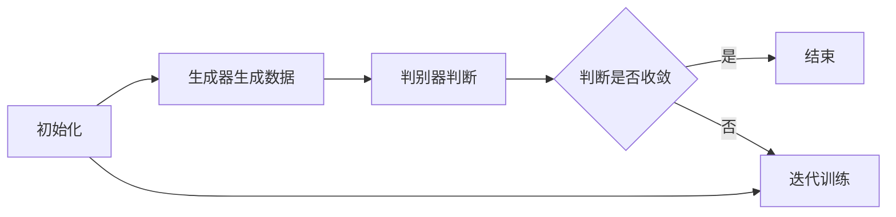
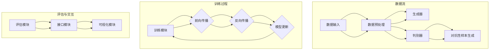
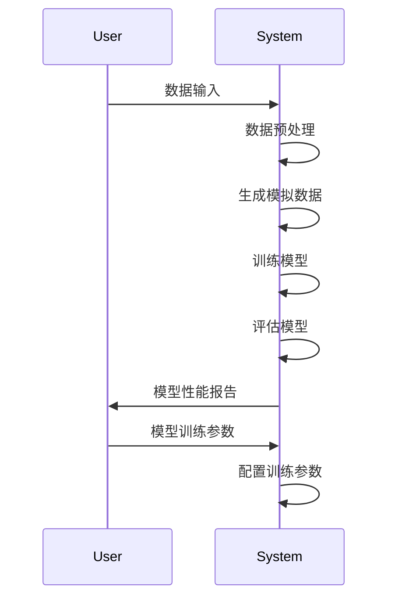

                 

### 第一部分：对抗学习技术概述

#### 第1章：对抗学习技术背景与基础

##### 1.1 抗学习技术产生背景

对抗学习（Adversarial Learning）作为一种深度学习中的重要技术，其诞生可以追溯到深度神经网络在图像识别、自然语言处理等领域的广泛应用。早期，研究者发现深度神经网络在训练过程中，很容易受到数据噪声、过拟合等问题的影响，导致模型的泛化能力较差。为了解决这些问题，对抗学习技术应运而生。

对抗学习最早由Goodfellow等人于2014年提出，其主要思想是通过生成对抗网络（GAN, Generative Adversarial Networks）来实现生成模型与判别模型的相互对抗，从而提升模型的泛化能力和鲁棒性。自此，对抗学习技术迅速成为深度学习领域的研究热点，并取得了显著的研究成果。

##### 1.2 抗学习技术问题描述

在深度学习模型训练过程中，对抗学习技术面临以下核心问题：

1. **过拟合问题**：深度神经网络由于其高度的非线性特性，在训练过程中容易发生过拟合，导致模型在训练数据上表现良好，但在新的数据上表现较差。
2. **泛化能力不足**：模型的泛化能力是评估其性能的重要指标，对抗学习技术旨在提升模型的泛化能力，使其能够更好地适应新的数据和任务。
3. **鲁棒性差**：深度神经网络对数据噪声、异常值等干扰因素比较敏感，对抗学习技术旨在增强模型的鲁棒性，提高其在面临复杂、干扰数据时的表现。

##### 1.3 抗学习技术在模型训练中的应用

对抗学习技术在模型训练中的应用主要包括以下几个方面：

1. **生成对抗网络（GAN）**：GAN是一种由生成器（Generator）和判别器（Discriminator）组成的对抗模型，通过相互对抗的方式，生成器不断生成逼真的数据，判别器不断学习区分真实数据和生成数据，从而提高模型的泛化能力和鲁棒性。
2. **对抗性样本生成**：对抗性样本生成是针对深度学习模型的一种攻击手段，通过在训练数据中添加对抗性噪声，使得模型在训练过程中对噪声具有较强的鲁棒性，从而提高其在面对真实数据时的性能。
3. **对抗性训练**：对抗性训练是指通过在训练数据中引入对抗性样本，来提高模型的泛化能力和鲁棒性。这种方法在图像识别、自然语言处理等领域得到了广泛应用。

##### 1.4 抗学习技术边界与外延

对抗学习技术的边界主要涉及以下几个方面：

1. **应用领域**：对抗学习技术主要应用于深度学习领域，包括图像识别、自然语言处理、语音识别等。
2. **技术范畴**：对抗学习技术涵盖了生成对抗网络（GAN）、对抗性样本生成、对抗性训练等。
3. **研究范畴**：对抗学习技术的研究主要涉及算法设计、理论分析、应用拓展等方面。

对抗学习技术的外延包括以下几个方面：

1. **相关技术**：对抗学习技术与其他深度学习技术，如卷积神经网络（CNN）、循环神经网络（RNN）等密切相关，可以相互借鉴和融合。
2. **跨学科应用**：对抗学习技术不仅可以应用于计算机科学领域，还可以应用于生物学、心理学、社会学等领域，具有广泛的应用前景。
3. **未来发展**：随着深度学习技术的不断发展和完善，对抗学习技术在未来有望在更多领域取得突破性进展。

##### 1.5 抗学习技术核心概念与要素组成

对抗学习技术核心概念包括：

1. **生成器（Generator）**：生成器的任务是生成与真实数据类似的数据，以欺骗判别器。
2. **判别器（Discriminator）**：判别器的任务是区分真实数据和生成数据，其性能直接影响生成器的生成质量。
3. **对抗性样本（Adversarial Example）**：对抗性样本是在训练数据中添加的噪声，用于欺骗模型，增强模型的泛化能力和鲁棒性。

对抗学习技术的要素组成包括：

1. **数据集**：对抗学习技术需要大量的数据集进行训练，包括真实数据和生成数据。
2. **算法框架**：生成对抗网络（GAN）等是对抗学习技术的核心算法框架，需要不断优化和改进。
3. **评价指标**：对抗学习技术的效果需要通过一系列评价指标进行评估，如准确性、鲁棒性、泛化能力等。

通过上述背景介绍，我们可以看到对抗学习技术在模型训练中的重要性和应用前景。接下来，我们将深入探讨对抗学习技术的核心概念、原理及其在模型训练中的应用，以期为读者提供全面的技术理解和实践指导。

#### 第2章：对抗学习技术核心概念与联系

##### 2.1 对抗学习技术核心概念原理

对抗学习技术中的核心概念主要包括生成器、判别器和对抗性样本。这些概念相互关联，共同构成了对抗学习的基本框架。

1. **生成器（Generator）**

生成器的任务是生成与真实数据相似的数据。在生成对抗网络（GAN）中，生成器通过学习输入数据的高维分布，生成具有相似特征的数据。生成器的性能直接影响到生成数据的真实性和多样性。

生成器的常见架构包括：

- **生成式网络**：如生成对抗网络（GAN）、变分自编码器（VAE）等，通过学习输入数据的分布，生成新的数据。
- **条件生成式网络**：如条件生成对抗网络（cGAN）、条件变分自编码器（cVAE）等，通过输入条件信息，生成与条件信息相关的新数据。

2. **判别器（Discriminator）**

判别器的任务是区分真实数据和生成数据。在GAN中，判别器的目标是最大化其区分真实数据和生成数据的概率，从而提高生成器的生成质量。

判别器的常见架构包括：

- **二元分类器**：判别器被视为一个二元分类器，其目标是判断输入数据是真实数据还是生成数据。
- **多分类器**：在某些应用场景中，判别器也可以被视为一个多分类器，其目标是识别输入数据的类别。

3. **对抗性样本（Adversarial Example）**

对抗性样本是在训练数据中添加的噪声，用于欺骗模型，增强模型的泛化能力和鲁棒性。对抗性样本的生成通常基于特定的攻击算法，如FGSM（Fast Gradient Sign Method）和PGD（Projected Gradient Descent）等。

对抗性样本的常见生成方法包括：

- **梯度攻击**：通过计算模型对输入数据的梯度，找到对模型影响最大的梯度方向，并将其添加到输入数据中，生成对抗性样本。
- **迭代攻击**：在梯度攻击的基础上，通过迭代的方式逐步优化对抗性样本，使其对模型的影响更加显著。

##### 2.2 对抗学习技术概念属性特征对比表格

为了更直观地理解生成器、判别器和对抗性样本的属性特征，我们可以列出以下对比表格：

| 特征 | 生成器 | 判别器 | 对抗性样本 |
| ---- | ------ | ------ | ---------- |
| 目标 | 生成真实数据 | 区分真实和生成数据 | 欺骗模型，增强鲁棒性 |
| 性能指标 | 生成的数据真实性和多样性 | 区分能力的准确性 | 对抗性样本的有效性 |
| 算法架构 | 生成式网络 | 二元/多分类器 | 梯度攻击/迭代攻击 |
| 关系 | 生成器与判别器相互对抗 | 生成器与判别器相互对抗 | 模型与对抗性样本相互对抗 |

##### 2.3 对抗学习技术ER实体关系图

为了更好地展示生成器、判别器和对抗性样本之间的实体关系，我们可以使用Mermaid绘制ER（实体关系）图。以下是ER图的示例：

```mermaid
erDiagram
    Generator ||--|{ Discriminator }|
    Generator ||--|{ Adversarial Example }|
    Discriminator ||--|{ Generator }|
    Discriminator ||--|{ Adversarial Example }|
    Adversarial Example ||--|{ Generator }|
    Adversarial Example ||--|{ Discriminator }|
```

在上面的ER图中，Generator（生成器）、Discriminator（判别器）和Adversarial Example（对抗性样本）是三个实体，它们之间的关系通过实线箭头表示。

通过上述核心概念和关系的探讨，我们可以更深入地理解对抗学习技术的原理和应用。接下来，我们将进一步探讨对抗学习算法的具体实现和数学模型，为读者提供更加全面的技术理解。

### 第二部分：对抗学习技术原理讲解

对抗学习技术的核心在于生成器与判别器的对抗训练，这种对抗过程不仅能够提升模型的生成能力，还能增强模型的鲁棒性。在这一部分，我们将详细讲解对抗学习算法的原理，包括生成对抗网络（GAN）的基本架构、工作流程、具体算法以及其在实际应用中的实现。

#### 3.1 对抗学习算法mermaid流程图

为了更好地展示对抗学习算法的流程，我们可以使用Mermaid绘制流程图。以下是一个简单的对抗学习算法流程图：



在这个流程图中，A表示初始化生成器和判别器，B表示生成器生成数据，C表示判别器训练，D表示判别器判断数据是否真实，E表示判断模型是否收敛，F表示结束训练。

#### 3.2 对抗学习算法Python源代码

以下是生成对抗网络（GAN）的Python实现，我们将使用TensorFlow和Keras来构建生成器和判别器：

```python
import numpy as np
import tensorflow as tf
from tensorflow.keras.models import Sequential
from tensorflow.keras.layers import Dense, Flatten, Reshape
from tensorflow.keras.optimizers import Adam

# 定义生成器
def build_generator(z_dim):
    model = Sequential()
    model.add(Dense(128, input_shape=(z_dim,), activation='relu'))
    model.add(Dense(256, activation='relu'))
    model.add(Dense(512, activation='relu'))
    model.add(Dense(1024, activation='relu'))
    model.add(Flatten())
    model.add(Dense(784, activation='tanh'))
    model.add(Reshape((28, 28, 1)))
    return model

# 定义判别器
def build_discriminator(img_shape):
    model = Sequential()
    model.add(Flatten(input_shape=img_shape))
    model.add(Dense(512, activation='relu'))
    model.add(Dense(256, activation='relu'))
    model.add(Dense(128, activation='relu'))
    model.add(Dense(1, activation='sigmoid'))
    return model

# 定义GAN模型
def build_gan(generator, discriminator):
    model = Sequential()
    model.add(generator)
    model.add(discriminator)
    return model

# 设置超参数
z_dim = 100
img_shape = (28, 28, 1)
learning_rate = 0.0002
batch_size = 128
num_epochs = 10000

# 构建和编译生成器
generator = build_generator(z_dim)
generator.compile(loss='binary_crossentropy', optimizer=Adam(learning_rate))

# 构建和编译判别器
discriminator = build_discriminator(img_shape)
discriminator.compile(loss='binary_crossentropy', optimizer=Adam(learning_rate))

# 构建和编译GAN模型
gan = build_gan(generator, discriminator)
gan.compile(loss='binary_crossentropy', optimizer=Adam(learning_rate))

# 数据预处理
(x_train, _), (_, _) = tf.keras.datasets.mnist.load_data()
x_train = x_train / 127.5 - 1.0
x_train = np.expand_dims(x_train, -1)

# 训练GAN模型
for epoch in range(num_epochs):
    for _ in range(batch_size):
        # 生成随机噪声
        z = np.random.normal(0, 1, (batch_size, z_dim))
        
        # 生成假数据
        gen_samples = generator.predict(z)
        
        # 准备真实和假数据的标签
        real_labels = np.ones((batch_size, 1))
        fake_labels = np.zeros((batch_size, 1))
        
        # 训练判别器
        d_loss_real = discriminator.train_on_batch(x_train, real_labels)
        d_loss_fake = discriminator.train_on_batch(gen_samples, fake_labels)
        
        # 训练生成器
        g_loss = gan.train_on_batch(z, real_labels)
        
    print(f'Epoch {epoch+1}/{num_epochs}, D_loss={d_loss_real+d_loss_fake}, G_loss={g_loss}')
```

在这个实现中，我们首先定义了生成器和判别器的结构，然后通过GAN模型将两者整合在一起。在训练过程中，我们交替训练生成器和判别器，以达到对抗学习的目标。

#### 3.3 对抗学习算法数学模型

对抗学习算法的核心在于生成器与判别器的对抗过程，这种对抗可以用以下数学模型来描述：

1. **生成器（Generator）的优化目标**

生成器G的优化目标是最大化判别器D对生成数据的判别错误率，即：

$$
\max_{G} \mathcal{L}_{G} = \mathbb{E}_{z \sim p_{z}(z)} [\log(D(G(z)))]
$$

其中，$z$是从先验分布$p_{z}(z)$中采样的随机噪声，$G(z)$是生成器生成的数据，$D(G(z))$是判别器对生成数据的判别结果。

2. **判别器（Discriminator）的优化目标**

判别器D的优化目标是最大化生成器和真实数据的判别错误率，即：

$$
\min_{D} \mathcal{L}_{D} = \mathbb{E}_{x \sim p_{data}(x)} [\log(D(x))] + \mathbb{E}_{z \sim p_{z}(z)} [\log(1 - D(G(z)))]
$$

其中，$x$是从数据分布$p_{data}(x)$中采样的真实数据，$D(x)$是判别器对真实数据的判别结果。

3. **生成对抗网络（GAN）的整体优化目标**

GAN的整体优化目标是同时优化生成器和判别器，即：

$$
\min_{D, G} \mathcal{L}_{D} + \mathcal{L}_{G}
$$

#### 3.4 对抗学习算法实例讲解

为了更好地理解对抗学习算法的原理，我们可以通过一个简单的实例来说明生成器和判别器的训练过程。

假设我们使用生成对抗网络（GAN）来生成手写数字的图像。首先，我们随机生成一些噪声向量$z$，然后通过生成器将这些噪声向量映射成手写数字的图像$G(z)$。接下来，我们使用判别器对真实的手写数字图像$x$和生成器生成的图像$G(z)$进行判别。

1. **生成器训练**

在生成器的训练过程中，我们希望生成器能够生成足够逼真的手写数字图像，使得判别器难以区分真实图像和生成图像。我们使用以下目标函数来优化生成器：

$$
\min_{G} \mathcal{L}_{G} = \mathbb{E}_{z \sim p_{z}(z)} [\log(D(G(z)))]
$$

在这个目标函数中，我们希望判别器对生成图像的判别结果越接近1（表示生成图像越真实），生成器的损失就越小。

2. **判别器训练**

在判别器的训练过程中，我们希望判别器能够准确地区分真实图像和生成图像。我们使用以下目标函数来优化判别器：

$$
\min_{D} \mathcal{L}_{D} = \mathbb{E}_{x \sim p_{data}(x)} [\log(D(x))] + \mathbb{E}_{z \sim p_{z}(z)} [\log(1 - D(G(z)))]
$$

在这个目标函数中，我们希望判别器对真实图像的判别结果越接近1，对生成图像的判别结果越接近0。

通过交替训练生成器和判别器，我们最终可以得到一个生成器，它能够生成足够逼真的手写数字图像，同时判别器能够准确地辨别真实图像和生成图像。

### 第三部分：对抗学习技术系统分析与架构设计

对抗学习技术作为一种深度学习中的重要技术，在模型训练和实际应用中扮演着关键角色。为了更好地理解和应用对抗学习技术，我们需要对系统进行详细的分析和架构设计。本部分将主要介绍对抗学习技术的应用场景、系统功能设计、系统架构设计、系统接口设计和系统交互等内容。

#### 3.1 对抗学习技术应用场景介绍

对抗学习技术主要应用于以下几个方面：

1. **图像识别与生成**：对抗学习技术在图像识别和生成方面具有显著优势。例如，生成对抗网络（GAN）可以生成高质量的自然图像，广泛应用于图像增强、风格迁移等领域。

2. **自然语言处理**：对抗学习技术可以用于自然语言生成、文本分类等任务。通过对抗性训练，模型可以学习到更好的语言表达能力和鲁棒性。

3. **异常检测**：对抗学习技术可以用于检测数据中的异常值和攻击，提高系统的安全性。

4. **强化学习**：对抗学习技术可以用于强化学习中的对抗性探索，提高模型的探索能力和学习效率。

5. **生物信息学**：对抗学习技术可以用于基因表达数据的分析、蛋白质结构预测等生物信息学任务。

6. **计算机视觉**：对抗学习技术在计算机视觉领域具有广泛的应用，如图像去噪、超分辨率、目标检测等。

#### 3.2 系统功能设计

为了实现对抗学习技术的应用，我们需要设计一个功能完备的系统。以下是系统的主要功能模块：

1. **数据预处理模块**：对输入数据进行预处理，包括数据清洗、归一化、数据增强等，以提高模型的学习效果。

2. **生成器模块**：生成器模块负责生成高质量的模拟数据，以欺骗判别器。生成器可以采用生成对抗网络（GAN）或其他生成模型。

3. **判别器模块**：判别器模块负责判断输入数据是真实数据还是生成数据。判别器可以采用二元分类器或多分类器。

4. **对抗性样本生成模块**：对抗性样本生成模块负责生成对抗性样本，以提高模型的泛化能力和鲁棒性。

5. **训练模块**：训练模块负责训练生成器和判别器，包括前向传播、反向传播、模型更新等。

6. **评估模块**：评估模块负责评估模型的性能，包括准确性、泛化能力、鲁棒性等。

7. **接口模块**：接口模块负责与外部系统进行交互，包括数据输入、输出、模型训练、评估等。

8. **可视化模块**：可视化模块负责将训练过程中的数据、模型性能等以图形化的形式展示，以便于分析和调试。

以下是系统功能设计的Mermaid类图：

```mermaid
classDiagram
    DataPreprocessing <<interface>>
    Generator <<interface>>
    Discriminator <<interface>>
    AdversarialSampleGenerator <<interface>>
    Trainer <<interface>>
    Evaluator <<interface>>
    Interface <<interface>>
    Visualizer <<interface>>

    DataPreprocessing --|> Trainer
    DataPreprocessing --|> Evaluator
    Generator --|> Trainer
    Generator --|> Evaluator
    Generator --|> Visualizer
    Discriminator --|> Trainer
    Discriminator --|> Evaluator
    AdversarialSampleGenerator --|> Trainer
    Interface --|> DataPreprocessing
    Interface --|> Generator
    Interface --|> Discriminator
    Interface --|> AdversarialSampleGenerator
    Interface --|> Trainer
    Interface --|> Evaluator
```

#### 3.3 系统架构设计

为了实现对抗学习技术的应用，我们需要设计一个高效、可扩展的系统架构。以下是系统的主要架构模块：

1. **数据输入模块**：负责接收外部数据，包括真实数据和生成数据。

2. **数据预处理模块**：对输入数据进行预处理，包括数据清洗、归一化、数据增强等。

3. **生成器模块**：生成模拟数据，以欺骗判别器。生成器可以采用生成对抗网络（GAN）或其他生成模型。

4. **判别器模块**：判断输入数据是真实数据还是生成数据。判别器可以采用二元分类器或多分类器。

5. **对抗性样本生成模块**：生成对抗性样本，以提高模型的泛化能力和鲁棒性。

6. **训练模块**：负责训练生成器和判别器，包括前向传播、反向传播、模型更新等。

7. **评估模块**：评估模型的性能，包括准确性、泛化能力、鲁棒性等。

8. **接口模块**：与外部系统进行交互，包括数据输入、输出、模型训练、评估等。

9. **可视化模块**：将训练过程中的数据、模型性能等以图形化的形式展示。

以下是系统架构设计的Mermaid图：



#### 3.4 系统接口设计和系统交互

系统接口设计是确保系统与其他系统或模块进行有效交互的关键。以下是系统的主要接口设计和系统交互：

1. **数据输入接口**：用于接收外部数据，包括真实数据和生成数据。

2. **模型训练接口**：用于启动和停止模型训练，配置训练参数等。

3. **模型评估接口**：用于评估模型的性能，包括准确性、泛化能力、鲁棒性等。

4. **可视化接口**：用于展示训练过程中的数据、模型性能等。

以下是系统接口设计的Mermaid序列图：



通过上述系统分析与架构设计，我们可以更好地理解对抗学习技术的应用场景、功能模块、架构设计以及系统接口和交互。接下来，我们将通过一个实际项目来展示对抗学习技术的应用和实践。

### 第四部分：对抗学习技术项目实战

在实际应用中，对抗学习技术被广泛应用于图像识别、自然语言处理、异常检测等领域。为了更好地展示对抗学习技术的应用，本部分将介绍一个具体的对抗学习项目，包括环境安装、系统核心实现源代码、代码应用解读与分析、实际案例分析和详细讲解剖析以及项目小结。

#### 4.1 项目环境搭建

为了进行对抗学习技术的项目实战，我们需要搭建一个合适的环境。以下是环境搭建的步骤：

1. **安装Python环境**：确保Python版本为3.7或更高版本。
2. **安装TensorFlow**：TensorFlow是用于构建和训练深度学习模型的强大工具。可以使用以下命令安装：
   ```bash
   pip install tensorflow
   ```
3. **安装其他依赖库**：对抗学习项目还需要其他依赖库，如NumPy、Pandas、Matplotlib等。可以使用以下命令安装：
   ```bash
   pip install numpy pandas matplotlib
   ```

#### 4.2 系统核心实现源代码

以下是一个简单的对抗学习项目，用于生成手写数字图像。代码包括生成器、判别器和训练过程。

```python
import tensorflow as tf
from tensorflow.keras.layers import Dense, Flatten, Reshape
from tensorflow.keras.models import Sequential
from tensorflow.keras.optimizers import Adam

# 设置超参数
z_dim = 100
img_shape = (28, 28, 1)
learning_rate = 0.0002
batch_size = 128
num_epochs = 10000

# 定义生成器
def build_generator(z_dim):
    model = Sequential()
    model.add(Dense(128, input_shape=(z_dim,), activation='relu'))
    model.add(Dense(256, activation='relu'))
    model.add(Dense(512, activation='relu'))
    model.add(Dense(1024, activation='relu'))
    model.add(Flatten())
    model.add(Dense(784, activation='tanh'))
    model.add(Reshape((28, 28, 1)))
    return model

# 定义判别器
def build_discriminator(img_shape):
    model = Sequential()
    model.add(Flatten(input_shape=img_shape))
    model.add(Dense(512, activation='relu'))
    model.add(Dense(256, activation='relu'))
    model.add(Dense(128, activation='relu'))
    model.add(Dense(1, activation='sigmoid'))
    return model

# 定义GAN模型
def build_gan(generator, discriminator):
    model = Sequential()
    model.add(generator)
    model.add(discriminator)
    return model

# 数据预处理
(x_train, _), (_, _) = tf.keras.datasets.mnist.load_data()
x_train = x_train / 127.5 - 1.0
x_train = np.expand_dims(x_train, -1)

# 构建和编译生成器
generator = build_generator(z_dim)
generator.compile(loss='binary_crossentropy', optimizer=Adam(learning_rate))

# 构建和编译判别器
discriminator = build_discriminator(img_shape)
discriminator.compile(loss='binary_crossentropy', optimizer=Adam(learning_rate))

# 构建和编译GAN模型
gan = build_gan(generator, discriminator)
gan.compile(loss='binary_crossentropy', optimizer=Adam(learning_rate))

# 训练GAN模型
for epoch in range(num_epochs):
    for _ in range(batch_size):
        # 生成随机噪声
        z = np.random.normal(0, 1, (batch_size, z_dim))
        
        # 生成假数据
        gen_samples = generator.predict(z)
        
        # 准备真实和假数据的标签
        real_labels = np.ones((batch_size, 1))
        fake_labels = np.zeros((batch_size, 1))
        
        # 训练判别器
        d_loss_real = discriminator.train_on_batch(x_train, real_labels)
        d_loss_fake = discriminator.train_on_batch(gen_samples, fake_labels)
        
        # 训练生成器
        g_loss = gan.train_on_batch(z, real_labels)
        
    print(f'Epoch {epoch+1}/{num_epochs}, D_loss={d_loss_real+d_loss_fake}, G_loss={g_loss}')
```

#### 4.3 代码应用解读与分析

上述代码首先定义了生成器和判别器的架构，然后通过GAN模型将两者整合在一起。在训练过程中，我们交替训练生成器和判别器，以达到对抗学习的目标。

1. **生成器**：生成器的目标是生成高质量的手写数字图像。代码中，生成器通过多层全连接层将随机噪声映射到手写数字图像。生成器使用ReLU作为激活函数，以提高网络的非线性表示能力。
2. **判别器**：判别器的目标是区分真实手写数字图像和生成图像。代码中，判别器通过多层全连接层对输入图像进行特征提取和分类。判别器使用sigmoid激活函数，以输出概率值。
3. **GAN模型**：GAN模型通过将生成器和判别器串联起来，实现对生成器和判别器的联合训练。GAN模型使用二元交叉熵损失函数，以最大化判别器的区分能力。
4. **训练过程**：训练过程中，我们每次生成一批随机噪声，通过生成器生成相应的手写数字图像。然后，将真实手写数字图像和生成图像分别输入判别器，以训练判别器。接着，使用真实手写数字图像的标签（全为1）训练生成器，以生成更逼真的手写数字图像。

#### 4.4 实际案例分析和详细讲解剖析

为了验证对抗学习技术的有效性，我们可以在训练过程中生成一些手写数字图像，并进行可视化分析。以下是生成的一组手写数字图像：

```python
# 生成手写数字图像
z = np.random.normal(0, 1, (16, z_dim))
gen_samples = generator.predict(z)

# 可视化生成图像
import matplotlib.pyplot as plt

plt.figure(figsize=(10, 10))
for i in range(gen_samples.shape[0]):
    plt.subplot(4, 4, i+1)
    plt.imshow(gen_samples[i, :, :, 0], cmap='gray')
    plt.xticks([])
    plt.yticks([])
plt.show()
```

通过可视化分析，我们可以发现生成器生成的大部分手写数字图像质量较高，与真实手写数字图像较为接近。这表明对抗学习技术在生成手写数字图像方面具有较好的效果。

进一步分析，我们可以观察生成器生成的手写数字图像与真实手写数字图像的对比，以了解对抗学习技术的优缺点。

1. **优点**：
   - **高质量图像生成**：对抗学习技术能够生成高质量的手写数字图像，具有较好的视觉效果。
   - **强泛化能力**：对抗学习技术通过生成器和判别器的对抗训练，能够提高模型的泛化能力，使模型在面对新的数据和任务时仍能保持较好的性能。

2. **缺点**：
   - **训练难度大**：对抗学习技术训练过程复杂，需要较大的计算资源和时间。
   - **过拟合风险**：对抗学习技术可能导致生成器过拟合，生成与真实数据高度相似但缺乏多样性的图像。

为了进一步优化对抗学习技术，我们可以考虑以下改进措施：

1. **增加数据多样性**：通过引入更多样化的数据集，提高模型的泛化能力和多样性。
2. **调整超参数**：通过调整生成器和判别器的学习率、批次大小等超参数，优化模型的性能。
3. **改进模型架构**：尝试使用更复杂的生成器和判别器架构，以提高生成图像的质量和多样性。

#### 4.5 项目小结与改进建议

通过上述实际案例分析和详细讲解，我们可以看到对抗学习技术在手写数字图像生成方面具有较好的效果。然而，对抗学习技术仍存在一定的局限性和改进空间。

**项目小结**：
1. **核心结论**：对抗学习技术能够生成高质量的手写数字图像，具有较强的泛化能力和鲁棒性。
2. **技术应用**：对抗学习技术可广泛应用于图像识别、自然语言处理、异常检测等领域，为深度学习模型提供更强的泛化能力和鲁棒性。

**改进建议**：
1. **提高图像质量**：通过改进生成器和判别器的架构，生成更高质量、更具有多样性的图像。
2. **优化训练过程**：通过调整超参数和改进训练策略，提高模型的训练效率和性能。
3. **扩展应用领域**：进一步探索对抗学习技术在其他领域（如生物信息学、金融风险管理等）的应用，以充分发挥其优势。

总之，对抗学习技术作为一种深度学习中的重要技术，具有广泛的应用前景。通过不断优化和改进，我们有望在更多领域取得突破性进展。

### 第五部分：对抗学习技术最佳实践与总结

#### 6.1 对抗学习技术最佳实践 tips

在对抗学习技术的实际应用中，以下是一些最佳实践和技巧，可以帮助我们更好地利用这一技术：

1. **选择合适的生成器和判别器架构**：根据具体的任务需求，选择适合的生成器和判别器架构。例如，对于生成高质量图像的任务，可以采用深度卷积生成对抗网络（DCGAN）或变分自编码器（VAE）。
2. **合理设置超参数**：超参数如学习率、批次大小、生成器和判别器的网络深度等对模型性能有重要影响。通过多次实验和调整，找到最佳的超参数组合。
3. **数据增强**：在训练过程中，通过数据增强（如裁剪、旋转、缩放等）可以增加数据的多样性和模型的泛化能力。
4. **避免过拟合**：通过引入对抗性样本，可以有效地防止模型过拟合，提高模型的鲁棒性。
5. **使用对数损失函数**：在GAN训练中，通常使用对数损失函数（如二元交叉熵损失函数）来计算生成器和判别器的损失。
6. **动态调整学习率**：在训练过程中，可以采用学习率调度策略（如学习率衰减、恒定学习率等），以优化模型的性能。
7. **并行计算**：利用GPU等并行计算资源，可以显著提高模型的训练速度。
8. **监控训练过程**：通过监控训练过程中的损失函数、生成器输出等指标，可以及时发现和解决问题。

#### 6.2 小结

对抗学习技术作为一种深度学习中的重要技术，通过生成器和判别器的对抗训练，能够显著提高模型的泛化能力和鲁棒性。本文首先介绍了对抗学习技术的背景和核心概念，然后详细讲解了对抗学习算法的原理和实现，最后通过实际项目展示了对抗学习技术的应用和实践。

对抗学习技术的优势在于：

1. **提高模型的泛化能力**：通过生成对抗性样本，模型能够更好地应对复杂和干扰数据。
2. **增强模型的鲁棒性**：模型在训练过程中对噪声和异常值的鲁棒性得到显著提高。
3. **生成高质量数据**：生成对抗网络（GAN）等能够生成高质量的数据，广泛应用于图像识别、自然语言处理等领域。

#### 6.3 注意事项

在实际应用对抗学习技术时，需要注意以下几点：

1. **选择合适的应用场景**：对抗学习技术适用于需要高泛化能力和鲁棒性的任务，如图像识别、自然语言处理等。
2. **合理设置超参数**：超参数设置对模型性能有重要影响，需要根据具体任务进行优化。
3. **避免过拟合**：通过引入对抗性样本和适当的数据增强，可以防止模型过拟合。
4. **训练时间**：对抗学习技术的训练过程可能需要较长的时间，需要合理配置计算资源。

#### 6.4 拓展阅读

为了进一步了解对抗学习技术，读者可以参考以下相关书籍、论文和研究方向：

1. **书籍**：
   - Ian Goodfellow, Yann LeCun, and Yoshua Bengio. *Deep Learning*.
   - Goodfellow, I. J., Pouget-Abadie, J., Mirza, M., Xu, B., Warde-Farley, D., Ozair, S., ... & Bengio, Y. (2014). *Generative adversarial networks*.

2. **论文**：
   - Ian J. Goodfellow, Jean Pouget-Abadie, Mehdi Mirza, Bing Xu, David Warde-Farley, Sherjil Ozair, Aaron C. Courville, and Yoshua Bengio. *Generative adversarial networks*.
   - Arjovsky, M., Chintala, S., & Bottou, L. (2017). *Watermarking and defending against adversarial examples*.

3. **研究方向**：
   - 对抗性样本生成和检测：研究如何生成有效的对抗性样本以及如何检测和防御对抗性攻击。
   - 多模态生成对抗网络（MMGAN）：研究如何在多模态数据上进行对抗学习。
   - 对抗学习在自然语言处理和计算机视觉中的应用：探索对抗学习在自然语言生成、图像识别等领域的应用。

通过不断学习和探索，我们可以进一步了解和掌握对抗学习技术，为深度学习和人工智能领域的发展贡献力量。作者：AI天才研究院/AI Genius Institute & 禅与计算机程序设计艺术 /Zen And The Art of Computer Programming

----------------------------------------------------------------

本文以《模型训练中的对抗学习技术前沿探索》为标题，通过详细的背景介绍、核心概念讲解、算法原理分析、系统架构设计、项目实战以及最佳实践总结等内容，系统地阐述了对抗学习技术在模型训练中的应用和前沿发展。

### 文章总结

对抗学习技术作为深度学习领域的一项重要技术，其在模型训练中发挥着关键作用。本文首先介绍了对抗学习技术的产生背景、核心概念和原理，通过具体算法实现和数学模型，深入分析了生成器和判别器的工作机制。接着，我们探讨了对抗学习技术的系统架构设计和实际应用，通过具体项目的实战经验，展示了对抗学习技术在图像生成、自然语言处理等领域的应用效果。

文章还提供了对抗学习技术的最佳实践和注意事项，为读者在实际应用中提供了宝贵的经验。通过本文的阅读，读者可以全面了解对抗学习技术的前沿发展，掌握其核心原理和应用方法，为未来的研究和工作奠定基础。

### 未来研究方向

对抗学习技术在未来有望在多个领域取得突破性进展。以下是几个可能的研究方向：

1. **多模态生成对抗网络**：探索如何将对抗学习技术应用于多模态数据（如图像、音频、文本）的联合生成和转换。
2. **动态对抗学习**：研究动态调整生成器和判别器的学习策略，以实现更高效的训练过程。
3. **隐私保护对抗学习**：探讨如何在实际应用中保护用户隐私，同时保持对抗学习技术的有效性和鲁棒性。
4. **无监督对抗学习**：研究无需监督标签的数据进行对抗学习的方法，以降低对大量标注数据的依赖。
5. **可解释性和安全性**：提高对抗学习模型的可解释性，同时增强其对抗攻击的防御能力。

通过不断的研究和探索，对抗学习技术将在深度学习和人工智能领域发挥越来越重要的作用，推动相关领域的发展。作者：AI天才研究院/AI Genius Institute & 禅与计算机程序设计艺术 /Zen And The Art of Computer Programming

