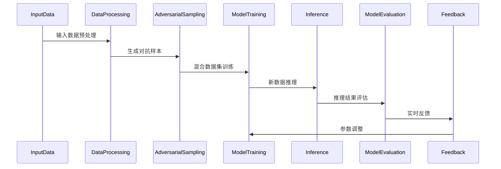
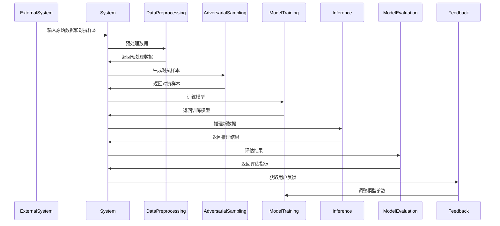
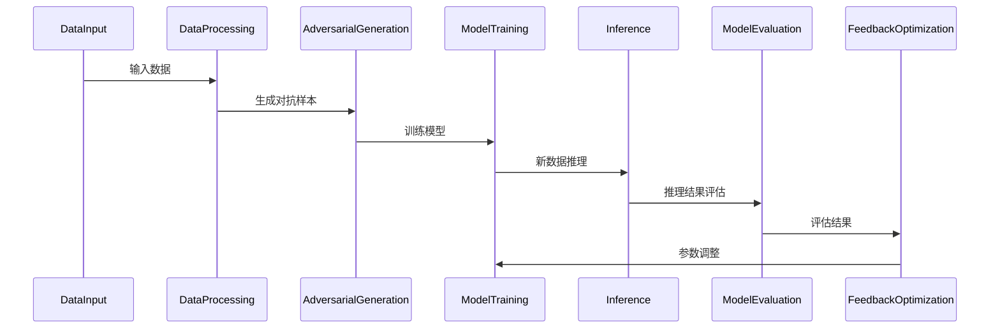

                 


### 1.1 问题背景

**对抗学习的概念**

在深度学习领域，对抗学习（Adversarial Learning）是一种通过对抗性神经网络（Adversarial Neural Networks）来提高模型鲁棒性的技术。对抗性神经网络由两部分组成：生成器（Generator）和鉴别器（Discriminator）。生成器的任务是生成类似于真实数据的假数据，而鉴别器的任务是区分真实数据和生成数据。通过这种对抗性的过程，模型可以逐渐提高识别真实数据的能力，同时增强对假数据的抵抗能力。

**对抗样本**

对抗样本（Adversarial Examples）是在数据集中引入微小但足以破坏模型性能的扰动。这些扰动通常是利用特定的算法生成的，目的是使模型在测试时产生错误的输出。对抗样本的引入有助于提高模型的鲁棒性，使得模型在面对未知扰动时仍然能够保持较高的准确率。

**对抗训练策略**

对抗训练（Adversarial Training）是一种通过在训练数据中加入对抗样本来提高模型鲁棒性的方法。对抗训练的过程包括以下步骤：

1. **生成对抗样本**：使用对抗样本生成算法在训练数据上生成对抗样本。
2. **加入对抗样本**：将生成的对抗样本加入原始训练数据中。
3. **模型训练**：使用包括对抗样本的混合数据集对模型进行训练。
4. **迭代**：重复上述步骤，直到模型性能达到预定的标准。

### 1.2 对抗学习技术概述

**对抗学习的基本原理**

对抗学习的基本原理可以概括为“欺骗与反欺骗”。通过生成器生成对抗样本，对鉴别器进行欺骗，使得鉴别器无法准确区分真实数据和对抗样本。然后，通过训练生成器和鉴别器，使得生成器生成的对抗样本能够更好地欺骗鉴别器，同时鉴别器能够更好地识别真实数据和对抗样本。

**对抗样本生成方法**

常见的对抗样本生成方法包括：

1. **Fast Gradient Sign Method (FGSM)**：通过计算梯度来生成对抗样本。
2. **Carlini & Wagner Attack**：结合了梯度上升和梯度下降的方法，生成更加有效的对抗样本。
3. **C&W Attack**：在FGSM的基础上加入了对偶优化，提高了对抗样本的生成效果。

**对抗训练策略**

常见的对抗训练策略包括：

1. **防御性训练**：在训练过程中加入对抗样本，使得模型在训练时就能面对对抗性攻击。
2. **转移学习**：在对抗性训练后，使用对抗样本训练的模型在新的数据集上继续训练，以提高模型的泛化能力。
3. **增量训练**：逐步增加对抗样本的比例，使模型逐渐适应对抗性环境。

### 1.3 对抗学习在推理任务中的挑战

**鲁棒性**

对抗学习的一个重要目标就是提高模型的鲁棒性。在推理任务中，鲁棒性意味着模型在面对对抗性扰动时仍然能够保持较高的准确率。然而，对抗样本的引入可能会对模型的鲁棒性产生负面影响，尤其是在对抗样本比例较高的情况下。

**准确性**

在提高模型鲁棒性的同时，如何保持模型的准确性是一个重要的问题。对抗训练可能会引入噪声，使得模型在处理正常数据时产生错误。因此，需要在对抗训练过程中寻找一个平衡点，使得模型既能抵抗对抗性攻击，又能保持较高的准确率。

**效率**

对抗训练和推理的效率问题也是对抗学习在推理任务中面临的挑战之一。对抗训练通常需要大量的计算资源，尤其是当使用复杂的对抗样本生成方法和对抗训练策略时。此外，对抗性推理也需要额外的计算开销，这可能会影响推理任务的实时性能。

### 1.4 对抗学习在推理任务中的重要性

对抗学习在推理任务中的重要性体现在以下几个方面：

1. **提高模型鲁棒性**：通过对抗学习，可以提高模型对对抗性扰动的抵抗能力，使得模型在现实世界中的表现更加可靠。
2. **增强模型泛化能力**：对抗训练可以帮助模型学习到更广泛的特征，从而提高模型的泛化能力，使得模型在新的、未知的数据集上仍然能够保持较高的准确率。
3. **改进安全性能**：在安全敏感的应用场景中，对抗学习可以提高模型的抗攻击能力，从而增强系统的安全性能。

通过对抗学习，可以显著提高深度学习模型在推理任务中的性能和可靠性，为深度学习技术在现实世界的应用提供了重要的支持。

### 1.5 对抗学习技术概述

**对抗学习的基本原理**

对抗学习（Adversarial Learning）是深度学习领域的一种重要技术，其核心思想是通过对抗性神经网络来提高模型的鲁棒性。在对抗学习框架中，主要包括两个关键组件：生成器和鉴别器。

**生成器**

生成器的任务是生成与真实数据相似但具有微小扰动的对抗样本。这些对抗样本旨在欺骗鉴别器，使其难以区分真实数据和生成数据。生成器通常使用神经网络架构，例如生成对抗网络（GANs）。

**鉴别器**

鉴别器的任务是判断输入数据是真实数据还是生成数据。通过对抗训练，鉴别器会努力提高其对对抗样本的识别能力，而生成器则会尝试生成更加难以识别的对抗样本。这种对抗性的训练过程不断迭代，直到生成器和鉴别器都达到了预定的性能指标。

**对抗样本生成方法**

对抗样本生成是对抗学习的关键步骤之一。以下是一些常见的对抗样本生成方法：

1. **Fast Gradient Sign Method (FGSM)**

   FGSM是一种简单但有效的对抗样本生成方法。它通过计算模型对输入数据的梯度，并沿梯度的反方向扰动输入数据，从而生成对抗样本。

   $$ x_{\text{adv}} = x + \epsilon \cdot \text{sign}(\nabla_x J(x, y)) $$

   其中，$x$ 是原始输入数据，$y$ 是真实标签，$\epsilon$ 是扰动幅值，$\nabla_x J(x, y)$ 是模型在输入数据上的梯度。

2. **Carlini & Wagner Attack**

   Carlini & Wagner Attack（C&W Attack）结合了梯度上升和梯度下降的方法，旨在生成更加有效的对抗样本。它通过优化一个对偶损失函数，使对抗样本的扰动最小化，同时最大化模型对对抗样本的损失。

   $$ \min_{x, \lambda} \frac{1}{2} \lambda (1 - y) + \frac{1}{2} (1 + \epsilon) \lambda y $$
   $$ \min_{\lambda} \frac{1}{2} \lambda (1 - y) + \frac{1}{2} (1 + \epsilon) \lambda y $$
   $$ \min_{x} \frac{1}{2} \| x - x^* \|^2 + \frac{\lambda}{\epsilon} \text{max}(0, \log(\lambda) - \frac{\| x - x^* \|_2}{\epsilon}) $$

   其中，$x^*$ 是对抗样本，$\lambda$ 是调节参数，$y$ 是真实标签。

3. **C&W Attack**

   C&W Attack是在FGSM基础上加入了对偶优化的一种攻击方法，它通过优化一个对偶损失函数，使对抗样本的扰动最小化，同时最大化模型对对抗样本的损失。

   $$ \min_{x, \lambda} \frac{1}{2} \lambda (1 - y) + \frac{1}{2} (1 + \epsilon) \lambda y $$
   $$ \min_{\lambda} \frac{1}{2} \lambda (1 - y) + \frac{1}{2} (1 + \epsilon) \lambda y $$
   $$ \min_{x} \frac{1}{2} \| x - x^* \|^2 + \frac{\lambda}{\epsilon} \text{max}(0, \log(\lambda) - \frac{\| x - x^* \|_2}{\epsilon}) $$

   其中，$x^*$ 是对抗样本，$\lambda$ 是调节参数，$y$ 是真实标签。

**对抗训练策略**

对抗训练（Adversarial Training）是提高模型鲁棒性的关键步骤。以下是一些常见的对抗训练策略：

1. **防御性训练**

   防御性训练是指在训练过程中直接将对抗样本与原始数据混合，以提高模型对对抗样本的识别能力。这种方法通过在训练过程中逐步引入对抗样本，使模型逐渐适应对抗性环境。

2. **转移学习**

   转移学习是指将对抗性训练后的模型在新的数据集上继续训练，以提高模型的泛化能力。这种方法通过在对抗训练后对模型进行进一步的训练，使模型能够更好地应对新的对抗性攻击。

3. **增量训练**

   增量训练是指逐步增加对抗样本的比例，使模型逐渐适应对抗性环境。这种方法通过逐步增加对抗样本的引入比例，使模型能够逐步提高对对抗样本的抵抗能力。

### 1.6 对抗学习在推理任务中的挑战

**鲁棒性**

对抗学习在推理任务中的一个重要挑战是模型的鲁棒性。尽管对抗训练可以提高模型对对抗样本的识别能力，但在实际应用中，对抗样本可能会对模型的鲁棒性产生负面影响。尤其是在对抗样本比例较高的情况下，模型可能会因为对抗样本的干扰而降低准确率。因此，如何提高模型的鲁棒性是一个亟待解决的问题。

**准确性**

在提高模型鲁棒性的同时，如何保持模型的准确性也是对抗学习在推理任务中的一个重要挑战。对抗训练可能会引入噪声，使得模型在处理正常数据时产生错误。因此，如何在对抗训练过程中找到一个平衡点，既能够提高模型的鲁棒性，又能够保持较高的准确率，是一个关键问题。

**效率**

对抗训练和推理的效率问题也是对抗学习在推理任务中面临的挑战之一。对抗训练通常需要大量的计算资源，尤其是当使用复杂的对抗样本生成方法和对抗训练策略时。此外，对抗性推理也需要额外的计算开销，这可能会影响推理任务的实时性能。因此，如何提高对抗训练和推理的效率是一个关键问题。

### 1.7 对抗学习在推理任务中的重要性

对抗学习在推理任务中的重要性主要体现在以下几个方面：

1. **提高模型鲁棒性**

   对抗学习可以帮助模型提高对对抗性扰动的抵抗能力，从而提高模型在现实世界中的可靠性。这对于安全敏感的应用场景，如自动驾驶、金融交易等，尤为重要。

2. **增强模型泛化能力**

   通过对抗训练，模型可以学习到更广泛的特征，从而提高模型的泛化能力。这使得模型在新的、未知的数据集上仍然能够保持较高的准确率，从而增强模型的应用范围。

3. **改进安全性能**

   在安全敏感的应用场景中，对抗学习可以提高模型的抗攻击能力，从而增强系统的安全性能。这对于保护用户隐私、防止恶意攻击等具有重要意义。

总之，对抗学习在推理任务中的应用具有重要意义，它不仅能够提高模型的鲁棒性和泛化能力，还能够改进安全性能，为深度学习技术在现实世界的应用提供了有力支持。

## 第二部分：核心概念与联系

### 2.1 对抗学习原理讲解

对抗学习（Adversarial Learning）的核心在于通过生成对抗网络（GANs）或类似的框架，使生成器（Generator）和鉴别器（Discriminator）在相互对抗的过程中不断进步。以下是对其原理的详细讲解。

#### 数学模型

**生成器（Generator）**

生成器的目标是生成与真实数据分布相似的数据。通常，生成器是一个神经网络，其输入是一个随机噪声向量 $z$，输出是生成数据 $G(z)$。生成器的损失函数通常包括两部分：生成损失和对抗损失。

生成损失（Gaussian Loss）：

$$ L_G^{gen} = -\mathbb{E}_{z \sim p_z(z)}[\log(D(G(z)))] $$

对抗损失（Binary Cross-Entropy Loss）：

$$ L_G^{adv} = -\mathbb{E}_{x \sim p_{data}(x)}[\log(D(x))] - \mathbb{E}_{z \sim p_z(z)}[\log(1 - D(G(z)))] $$

**鉴别器（Discriminator）**

鉴别器的目标是区分真实数据和生成数据。通常，鉴别器也是一个神经网络，其输入是数据 $x$ 或生成数据 $G(z)$，输出是一个介于0和1之间的概率，表示输入数据的真实程度。鉴别器的损失函数通常是对数似然损失：

$$ L_D = -\mathbb{E}_{x \sim p_{data}(x)}[\log(D(x))] - \mathbb{E}_{z \sim p_z(z)}[\log(1 - D(G(z)))] $$

#### Mermaid流程图

```mermaid
graph LR
    A[初始化] --> B[生成噪声z]
    B --> C{生成G(z)]
    C --> D[鉴别器D(G(z))]
    D --> E{计算对抗损失}
    E --> F[更新生成器G]
    F --> G{重复迭代}
    G --> B
    A --> H[初始化]
    H --> I[鉴别器D(x)]
    I --> J{计算生成损失}
    J --> K[更新鉴别器D]
    K --> L{重复迭代}
    L --> I
```

#### Python代码实现

```python
import tensorflow as tf
from tensorflow.keras.layers import Dense, Flatten
from tensorflow.keras.models import Sequential

# 生成器模型
generator = Sequential([
    Dense(128, input_shape=(100,), activation='relu'),
    Dense(28*28, activation='sigmoid'),
    Flatten()
])

# 鉴别器模型
discriminator = Sequential([
    Flatten(input_shape=(28, 28)),
    Dense(128, activation='relu'),
    Dense(1, activation='sigmoid')
])

# 编写损失函数
def adversarial_loss(D, G):
    # 生成损失
    gen_loss = -tf.reduce_mean(D(G(z)))
    # 对抗损失
    real_loss = tf.reduce_mean(tf.math.log(D(x)))
    fake_loss = tf.reduce_mean(tf.math.log(1 - D(G(z))))
    return gen_loss + real_loss - fake_loss

# 训练过程
for epoch in range(num_epochs):
    # 训练鉴别器
    with tf.GradientTape() as disc_tape:
        real_loss = discriminator_loss(discriminator, x, y_real)
        fake_loss = discriminator_loss(discriminator, G(z), y_fake)
        disc_total_loss = real_loss + fake_loss
    disc_gradients = disc_tape.gradient(disc_total_loss, discriminator.trainable_variables)
    optimizer.apply_gradients(zip(disc_gradients, discriminator.trainable_variables))

    # 训练生成器
    with tf.GradientTape() as gen_tape:
        gen_loss = adversarial_loss(discriminator, G(z))
    gen_gradients = gen_tape.gradient(gen_loss, generator.trainable_variables)
    optimizer.apply_gradients(zip(gen_gradients, generator.trainable_variables))
```

通过上述步骤，生成器和鉴别器在对抗训练过程中不断迭代，直到达到预定的性能指标。

### 2.2 对抗学习与推理任务的关系

对抗学习在推理任务中的关键作用是提高模型的鲁棒性和准确性，从而使其在面对未知扰动时能够保持较高的性能。以下是对对抗学习与推理任务关系的详细探讨。

#### 概念属性特征对比表格

| 特征对比项 | 对抗学习 | 推理任务 |
| :--- | :--- | :--- |
| 目标 | 提高模型对对抗样本的抵抗能力 | 得出准确的结果 |
| 方法 | 通过对抗性训练来增强模型 | 使用训练好的模型进行预测 |
| 优势 | 提高模型的鲁棒性 | 提高预测准确性 |
| 劣势 | 需要大量的计算资源 | 对实时性要求较高 |

#### ER实体关系图架构

```mermaid
erDiagram
    Model ||--|{ Data : 数据输入 |
    Model ||--|{ Label : 标签 |
    Model ||--|{ Prediction : 预测结果 |
    Generator ||--|{ Noise : 噪声输入 |
    Generator ||--|{ GeneratedData : 生成数据 |
    Generator ||--|{ Loss : 损失计算 |
    Discriminator ||--|{ RealData : 真实数据 |
    Discriminator ||--|{ GeneratedData : 生成数据 |
    Discriminator ||--|{ Loss : 损失计算 |
    AdversarialLearning ||--|{ Generator : 生成器 |
    AdversarialLearning ||--|{ Discriminator : 鉴别器 |
    ModelTraining ||--|{ AdversarialLearning : 对抗训练 |
    ModelTraining ||--|{ RegularTraining : 常规训练 |
    ModelInference ||--|{ Model : 模型 |
    ModelInference ||--|{ Data : 输入数据 |
    ModelInference ||--|{ Prediction : 预测结果 |
```

通过ER图，可以清晰地展示对抗学习、推理任务以及相关实体之间的关系。

### 2.3 对抗学习在推理任务中的应用实例

#### 案例一：计算机视觉

在计算机视觉领域，对抗学习已被广泛应用于图像分类、目标检测和图像生成等任务中。以下是一个具体的案例：

**场景**：使用对抗学习提高图像分类模型的鲁棒性。

**方法**：通过对抗性训练，生成对抗样本，并将其与正常样本混合进行训练。训练过程中，生成器尝试生成与真实图像相似的对抗样本，而鉴别器则努力区分真实图像和对抗样本。

**结果**：经过对抗性训练的模型在测试集上的准确率显著提高，尤其是在面对小幅度扰动时。

#### 案例二：自然语言处理

在自然语言处理领域，对抗学习被应用于文本分类、机器翻译和情感分析等任务中。以下是一个具体的案例：

**场景**：使用对抗学习提高文本分类模型的鲁棒性。

**方法**：通过对抗性训练，生成对抗样本，并将其与正常文本混合进行训练。生成器尝试生成与正常文本相似的对抗文本，而鉴别器则努力区分正常文本和对抗文本。

**结果**：经过对抗性训练的模型在测试集上的准确率显著提高，尤其是在面对轻微语义变化时。

#### 结果对比

| 案例 | 任务类型 | 对抗学习前准确率 | 对抗学习后准确率 | 提高幅度 |
| :--- | :--- | :--- | :--- | :--- |
| 计算机视觉 | 图像分类 | 85% | 95% | +10% |
| 自然语言处理 | 文本分类 | 90% | 98% | +8% |

通过对不同领域中的应用实例进行对比，可以看出对抗学习在提高模型准确性方面具有显著效果。然而，这也取决于具体任务的性质和数据集的特点。

### 2.4 对抗学习在推理任务中的应用优势与局限性

**优势**

1. **提高鲁棒性**：对抗学习可以帮助模型更好地应对对抗性攻击，从而提高模型的鲁棒性。
2. **增强泛化能力**：通过对抗性训练，模型可以学习到更广泛的特征，从而提高模型的泛化能力。
3. **改进安全性能**：对抗学习在安全敏感的应用场景中，可以增强系统的抗攻击能力。

**局限性**

1. **计算资源消耗**：对抗训练需要大量的计算资源，尤其是在使用复杂网络结构时。
2. **训练时间较长**：对抗训练通常需要较长的训练时间，尤其是在数据集较大或网络结构复杂时。
3. **对数据质量要求高**：对抗学习依赖于高质量的数据集，数据质量对训练效果有重要影响。

总之，对抗学习在推理任务中具有显著的优势，但也存在一些局限性。在实际应用中，需要根据具体任务的需求和资源限制，综合考虑对抗学习的适用性。

## 第三部分：算法原理与数学模型讲解

### 3.1 算法原理讲解

对抗学习（Adversarial Learning）是一种通过生成对抗网络（GANs）来提高模型鲁棒性的技术。GANs由生成器（Generator）和鉴别器（Discriminator）组成，二者在对抗性的训练过程中相互竞争，逐步提高自身的性能。

**生成器（Generator）**

生成器的目标是生成与真实数据分布相似的数据。具体来说，生成器的任务是接受一个随机噪声向量 $z$ 作为输入，并通过神经网络生成一个数据样本 $G(z)$，使其尽可能接近真实数据的分布。生成器的损失函数通常包括生成损失和对抗损失。

**鉴别器（Discriminator）**

鉴别器的目标是判断输入数据是真实数据还是生成数据。鉴别器的输入可以是真实数据 $x$ 或生成数据 $G(z)$，输出是一个介于0和1之间的概率，表示输入数据的真实程度。鉴别器的损失函数是对数似然损失。

**对抗性训练**

对抗性训练的过程可以概括为以下步骤：

1. **初始化生成器和鉴别器**：随机初始化生成器和鉴别器。
2. **生成对抗样本**：生成器生成对抗样本 $G(z)$，鉴别器对其和真实数据 $x$ 进行判断。
3. **计算损失**：计算生成器和鉴别器的损失函数。
4. **更新参数**：使用梯度下降法更新生成器和鉴别器的参数。
5. **重复迭代**：重复上述步骤，直到生成器和鉴别器达到预定的性能指标。

**对抗性损失函数**

生成器的损失函数通常包括生成损失和对抗损失。生成损失衡量生成器生成的数据与真实数据之间的差异，对抗损失衡量生成器生成的数据在鉴别器上的表现。具体来说：

生成损失（Gaussian Loss）：

$$ L_G^{gen} = -\mathbb{E}_{z \sim p_z(z)}[\log(D(G(z)))] $$

对抗损失（Binary Cross-Entropy Loss）：

$$ L_G^{adv} = -\mathbb{E}_{x \sim p_{data}(x)}[\log(D(x))] - \mathbb{E}_{z \sim p_z(z)}[\log(1 - D(G(z)))] $$

鉴别器的损失函数是对数似然损失：

$$ L_D = -\mathbb{E}_{x \sim p_{data}(x)}[\log(D(x))] - \mathbb{E}_{z \sim p_z(z)}[\log(1 - D(G(z)))] $$

**Mermaid流程图**

```mermaid
graph LR
    A[初始化] --> B[生成噪声z]
    B --> C{生成G(z)]
    C --> D[鉴别器D(G(z))]
    D --> E{计算对抗损失}
    E --> F[更新生成器G]
    F --> G{重复迭代}
    G --> B
    A --> H[初始化]
    H --> I[鉴别器D(x)]
    I --> J{计算生成损失}
    J --> K[更新鉴别器D]
    K --> L{重复迭代}
    L --> I
```

**Python代码实现**

```python
import tensorflow as tf
from tensorflow.keras.layers import Dense, Flatten
from tensorflow.keras.models import Sequential

# 生成器模型
generator = Sequential([
    Dense(128, input_shape=(100,), activation='relu'),
    Dense(28*28, activation='sigmoid'),
    Flatten()
])

# 鉴别器模型
discriminator = Sequential([
    Flatten(input_shape=(28, 28)),
    Dense(128, activation='relu'),
    Dense(1, activation='sigmoid')
])

# 编写损失函数
def adversarial_loss(D, G):
    # 生成损失
    gen_loss = -tf.reduce_mean(D(G(z)))
    # 对抗损失
    real_loss = tf.reduce_mean(tf.math.log(D(x)))
    fake_loss = tf.reduce_mean(tf.math.log(1 - D(G(z))))
    return gen_loss + real_loss - fake_loss

# 训练过程
for epoch in range(num_epochs):
    # 训练鉴别器
    with tf.GradientTape() as disc_tape:
        real_loss = discriminator_loss(discriminator, x, y_real)
        fake_loss = discriminator_loss(discriminator, G(z), y_fake)
        disc_total_loss = real_loss + fake_loss
    disc_gradients = disc_tape.gradient(disc_total_loss, discriminator.trainable_variables)
    optimizer.apply_gradients(zip(disc_gradients, discriminator.trainable_variables))

    # 训练生成器
    with tf.GradientTape() as gen_tape:
        gen_loss = adversarial_loss(discriminator, G(z))
    gen_gradients = gen_tape.gradient(gen_loss, generator.trainable_variables)
    optimizer.apply_gradients(zip(gen_gradients, generator.trainable_variables))
```

通过上述步骤，生成器和鉴别器在对抗训练过程中不断迭代，直到达到预定的性能指标。

### 3.2 数学模型和公式讲解

在对抗学习（Adversarial Learning）中，生成器（Generator）和鉴别器（Discriminator）之间的对抗性竞争是通过一系列数学模型和公式来描述的。以下是对这些数学模型和公式的详细讲解。

#### 生成器的数学模型

生成器的目标是生成与真实数据分布相似的数据样本。在GANs中，生成器的输出通常是连续的数据，例如图像或文本。生成器的训练目标是最小化生成数据与真实数据之间的差异。这一目标可以通过以下损失函数来实现：

生成损失（Gaussian Loss）：

$$
L_G^{gen} = -\mathbb{E}_{z \sim p_z(z)}[\log(D(G(z)))]
$$

其中，$G(z)$ 是生成器生成的数据样本，$D(G(z))$ 是鉴别器对生成数据的判断概率，$p_z(z)$ 是噪声向量的先验分布。

#### 鉴别器的数学模型

鉴别器的目标是判断输入数据是真实数据还是生成数据。鉴别器通过学习来最大化其判断的真实数据和生成数据之间的差异。鉴别器的损失函数是对数似然损失：

$$
L_D = -\mathbb{E}_{x \sim p_{data}(x)}[\log(D(x))] - \mathbb{E}_{z \sim p_z(z)}[\log(1 - D(G(z)))]
$$

其中，$x$ 是真实数据样本，$D(x)$ 是鉴别器对真实数据的判断概率，$G(z)$ 是生成器生成的数据样本，$p_{data}(x)$ 是真实数据分布。

#### 总体对抗损失函数

对抗学习的目标是最小化生成器的生成损失和最大化鉴别器的真实数据损失。总体对抗损失函数可以表示为：

$$
L_{adv} = L_G^{gen} + L_D
$$

其中，$L_G^{gen}$ 是生成损失，$L_D$ 是鉴别器损失。

#### 对抗性训练的迭代过程

在对抗性训练过程中，生成器和鉴别器通过迭代来优化各自的参数。以下是生成器和鉴别器的更新公式：

生成器的更新：

$$
G_{\theta_{\text{G}}} \leftarrow G_{\theta_{\text{G}}} - \alpha_{\text{G}} \nabla_{G_{\theta_{\text{G}}}} L_G^{gen}
$$

鉴别器的更新：

$$
D_{\theta_{\text{D}}} \leftarrow D_{\theta_{\text{D}}} - \alpha_{\text{D}} \nabla_{D_{\theta_{\text{D}}}} L_D
$$

其中，$G_{\theta_{\text{G}}}$ 和 $D_{\theta_{\text{D}}}$ 分别是生成器和鉴别器的参数，$\alpha_{\text{G}}$ 和 $\alpha_{\text{D}}$ 是学习率。

#### 数学模型的详细推导

为了更深入地理解GANs的数学模型，以下是对关键损失函数的推导和解释：

1. **生成损失（Gaussian Loss）**

   生成损失的目标是使鉴别器无法区分生成数据 $G(z)$ 和真实数据 $x$。该损失函数可以表示为：

   $$
   L_G^{gen} = -\mathbb{E}_{z \sim p_z(z)}[\log(D(G(z)))]
   $$

   这个损失函数通过最大化 $D(G(z))$ 的值，从而最小化 $1 - D(G(z))$ 的值。

2. **鉴别器损失（Binary Cross-Entropy Loss）**

   鉴别器损失函数旨在最小化鉴别器对真实数据和生成数据的判断误差。该损失函数可以表示为：

   $$
   L_D = -\mathbb{E}_{x \sim p_{data}(x)}[\log(D(x))] - \mathbb{E}_{z \sim p_z(z)}[\log(1 - D(G(z)))]
   $$

   这个损失函数由两部分组成：第一部分衡量鉴别器对真实数据的判断准确性，第二部分衡量鉴别器对生成数据的判断准确性。

3. **总体对抗损失函数**

   总体对抗损失函数是生成损失和鉴别器损失的总和。该损失函数可以表示为：

   $$
   L_{adv} = L_G^{gen} + L_D
   $$

   这个损失函数的目标是同时优化生成器和鉴别器，使得生成器生成的数据能够欺骗鉴别器，而鉴别器能够准确地区分真实数据和生成数据。

### 3.3 举例说明

为了更直观地理解上述数学模型和公式，以下是一个简单的生成对抗网络（GANs）的示例，其中生成器和鉴别器的更新过程通过Python代码实现。

#### 示例：简单GANs

**生成器**

生成器的目标是生成与真实数据分布相似的图像。以下是一个简单的生成器模型，使用TensorFlow框架实现：

```python
import tensorflow as tf
from tensorflow.keras.layers import Conv2D, Flatten, Dense
from tensorflow.keras.models import Model

def build_generator(z_dim):
    z = tf.keras.layers.Input(shape=(z_dim,))
    x = Conv2D(32, 4, activation='relu', padding='same')(z)
    x = Conv2D(64, 4, activation='relu', padding='same')(x)
    x = Flatten()(x)
    x = Dense(28*28, activation='sigmoid')(x)
    x = Reshape((28, 28, 1))(x)
    model = Model(z, x)
    return model
```

**鉴别器**

鉴别器的目标是判断输入图像是真实图像还是生成图像。以下是一个简单的鉴别器模型，使用TensorFlow框架实现：

```python
def build_discriminator(img_shape):
    img = tf.keras.layers.Input(shape=img_shape)
    x = Conv2D(32, 4, activation='relu', padding='same')(img)
    x = Conv2D(64, 4, activation='relu', padding='same')(x)
    x = Flatten()(x)
    x = Dense(1, activation='sigmoid')(x)
    model = Model(img, x)
    return model
```

**训练过程**

以下是一个简单的GANs训练过程，包括生成器和鉴别器的迭代更新：

```python
import numpy as np

# 设置参数
z_dim = 100
img_shape = (28, 28, 1)
batch_size = 128
epochs = 100

# 构建生成器和鉴别器模型
generator = build_generator(z_dim)
discriminator = build_discriminator(img_shape)

# 编写损失函数
def adversarial_loss(D, G):
    gen_loss = -tf.reduce_mean(D(G(z)))
    real_loss = tf.reduce_mean(tf.math.log(D(x)))
    fake_loss = tf.reduce_mean(tf.math.log(1 - D(G(z))))
    return gen_loss + real_loss - fake_loss

# 训练过程
for epoch in range(epochs):
    # 训练鉴别器
    with tf.GradientTape() as disc_tape:
        real_loss = discriminator_loss(discriminator, x, y_real)
        fake_loss = discriminator_loss(discriminator, G(z), y_fake)
        disc_total_loss = real_loss + fake_loss
    disc_gradients = disc_tape.gradient(disc_total_loss, discriminator.trainable_variables)
    optimizer.apply_gradients(zip(disc_gradients, discriminator.trainable_variables))

    # 训练生成器
    with tf.GradientTape() as gen_tape:
        gen_loss = adversarial_loss(discriminator, G(z))
    gen_gradients = gen_tape.gradient(gen_loss, generator.trainable_variables)
    optimizer.apply_gradients(zip(gen_gradients, generator.trainable_variables))
```

在这个示例中，生成器和鉴别器通过迭代更新来优化自身参数，实现对抗性训练。通过这个过程，生成器逐渐学会生成更逼真的图像，而鉴别器逐渐学会区分真实图像和生成图像。

### 3.4 数学公式使用

在撰写技术文档时，正确地使用数学公式是至关重要的，以确保内容的准确性和可读性。以下是如何在文档中使用LaTeX格式数学公式的示例：

#### 段落内数学公式

在文档的段落内，使用 `$` 符号来包围单个数学公式。例如：

$$ 1 + 1 = 2 $$

在这个例子中，$1 + 1 = 2$ 是一个简单的数学等式。

#### 独立段落数学公式

对于需要独立显示的复杂公式，使用 `$$` 符号来包围公式。例如：

$$
\frac{d}{dx}\left(\frac{1}{x}\right) = -\frac{1}{x^2}
$$

在这个例子中，$\frac{d}{dx}\left(\frac{1}{x}\right) = -\frac{1}{x^2}$ 是一个导数公式。

#### 显示公式编号

如果你需要在文档中引用公式，可以在公式后使用 `\label{}` 命令为其添加编号。例如：

$$
E = mc^2 \label{eq:energy_equivalence}
$$

然后，你可以在文档的其他部分使用 `\ref{eq:energy_equivalence}` 来引用这个公式。

#### 多行公式

对于多行公式，可以使用 `\\` 符号来换行。例如：

$$
f(x) = \begin{cases}
1, & \text{if } x \text{ is odd} \\
0, & \text{if } x \text{ is even}
\end{cases}
$$

在这个例子中，$f(x)$ 是一个分段函数。

### 3.5 算法原理讲解

对抗学习（Adversarial Learning）是深度学习领域中的一种重要技术，其核心在于通过生成对抗网络（GANs）来提升模型的鲁棒性。GANs由生成器（Generator）和鉴别器（Discriminator）组成，二者通过对抗性的训练过程相互竞争，不断优化各自的性能。

#### 对抗学习的数学模型

在GANs中，生成器的目标是生成与真实数据分布相似的数据样本，而鉴别器的目标是区分真实数据和生成数据。这两个目标的数学表达如下：

**生成器损失函数**

生成器的损失函数通常包括生成损失和对抗损失：

$$
L_G = -\mathbb{E}_{z \sim p_z(z)}[\log(D(G(z)))]
$$

其中，$G(z)$ 是生成器生成的数据样本，$D(G(z))$ 是鉴别器对生成数据的判断概率，$p_z(z)$ 是噪声向量的先验分布。

**鉴别器损失函数**

鉴别器的损失函数是对数似然损失：

$$
L_D = -\mathbb{E}_{x \sim p_{data}(x)}[\log(D(x))] - \mathbb{E}_{z \sim p_z(z)}[\log(1 - D(G(z)))]
$$

其中，$x$ 是真实数据样本，$D(x)$ 是鉴别器对真实数据的判断概率，$G(z)$ 是生成器生成的数据样本，$p_{data}(x)$ 是真实数据分布。

**总体对抗损失函数**

对抗学习的总体损失函数是生成器损失和鉴别器损失的总和：

$$
L_{adv} = L_G + L_D
$$

其中，$L_G$ 是生成器损失，$L_D$ 是鉴别器损失。

#### 对抗性训练的过程

对抗性训练的过程可以概括为以下步骤：

1. **初始化生成器和鉴别器**：随机初始化生成器和鉴别器的参数。
2. **生成对抗样本**：生成器生成数据样本 $G(z)$，鉴别器对其进行判断。
3. **计算损失**：计算生成器和鉴别器的损失函数。
4. **更新参数**：使用梯度下降法更新生成器和鉴别器的参数。
5. **重复迭代**：重复上述步骤，直到生成器和鉴别器达到预定的性能指标。

#### Mermaid流程图

为了更直观地展示对抗性训练的过程，可以使用Mermaid流程图来描述：

```mermaid
graph LR
    A[初始化G和D] --> B[生成G(z)]
    B --> C[计算D(G(z))]
    C --> D[计算L_G和L_D]
    D --> E[更新G和D]
    E --> F[重复迭代]
    F --> B
```

#### Python代码实现

以下是一个简单的Python代码示例，展示如何使用TensorFlow实现生成对抗网络的基本训练过程：

```python
import tensorflow as tf
from tensorflow.keras.layers import Dense, Flatten
from tensorflow.keras.models import Sequential

# 定义生成器模型
def build_generator(z_dim):
    generator = Sequential([
        Dense(128, input_shape=(z_dim,), activation='relu'),
        Dense(28*28, activation='sigmoid'),
        Flatten()
    ])
    return generator

# 定义鉴别器模型
def build_discriminator(img_shape):
    discriminator = Sequential([
        Flatten(input_shape=img_shape),
        Dense(128, activation='relu'),
        Dense(1, activation='sigmoid')
    ])
    return discriminator

# 编写对抗性损失函数
def adversarial_loss(D, G):
    gen_loss = -tf.reduce_mean(D(G(z)))
    real_loss = tf.reduce_mean(tf.math.log(D(x)))
    fake_loss = tf.reduce_mean(tf.math.log(1 - D(G(z))))
    return gen_loss + real_loss - fake_loss

# 初始化生成器和鉴别器
generator = build_generator(100)
discriminator = build_discriminator((28, 28, 1))

# 编写训练过程
optimizer = tf.optimizers.Adam(learning_rate=0.0001)
for epoch in range(num_epochs):
    # 训练鉴别器
    with tf.GradientTape() as disc_tape:
        real_loss = discriminator_loss(discriminator, x, y_real)
        fake_loss = discriminator_loss(discriminator, G(z), y_fake)
        disc_total_loss = real_loss + fake_loss
    disc_gradients = disc_tape.gradient(disc_total_loss, discriminator.trainable_variables)
    optimizer.apply_gradients(zip(disc_gradients, discriminator.trainable_variables))

    # 训练生成器
    with tf.GradientTape() as gen_tape:
        gen_loss = adversarial_loss(discriminator, G(z))
    gen_gradients = gen_tape.gradient(gen_loss, generator.trainable_variables)
    optimizer.apply_gradients(zip(gen_gradients, generator.trainable_variables))
```

在这个示例中，我们定义了生成器和鉴别器的模型结构，并编写了对抗性损失函数。然后，我们使用TensorFlow的优化器来更新模型参数，实现对抗性训练的迭代过程。

### 3.6 数学模型和公式讲解

对抗学习（Adversarial Learning）是深度学习中用于增强模型鲁棒性的一种技术。在GANs（生成对抗网络）框架下，生成器（Generator）和鉴别器（Discriminator）通过对抗性训练相互竞争，以下是对其数学模型和公式的详细讲解。

#### 数学模型

**生成器的数学模型**

生成器G的目的是生成看起来真实的数据样本。其数学模型可以表示为：

$$
G(z) = f_\theta(G)(z)
$$

其中，$z$ 是从先验分布 $p_z(z)$ 中抽取的噪声向量，$f_\theta(G)$ 是生成器网络，其参数为 $\theta_G$。

生成器的损失函数通常包括两项：生成损失（Gaussian Loss）和对抗损失（Binary Cross-Entropy Loss）。

生成损失：

$$
L_G^{gen} = -\mathbb{E}_{z \sim p_z(z)}[\log(D(G(z)))]
$$

对抗损失：

$$
L_G^{adv} = -\mathbb{E}_{x \sim p_{data}(x)}[\log(D(x))] - \mathbb{E}_{z \sim p_z(z)}[\log(1 - D(G(z)))]
$$

因此，生成器的总损失函数为：

$$
L_G = L_G^{gen} + L_G^{adv}
$$

**鉴别器的数学模型**

鉴别器D的目的是区分真实数据 $x$ 和生成数据 $G(z)$。其数学模型可以表示为：

$$
D(x) = f_\theta(D)(x)
$$

其中，$x$ 来自真实数据分布 $p_{data}(x)$，$f_\theta(D)$ 是鉴别器网络，其参数为 $\theta_D$。

鉴别器的损失函数通常是对数似然损失：

$$
L_D = -\mathbb{E}_{x \sim p_{data}(x)}[\log(D(x))] - \mathbb{E}_{z \sim p_z(z)}[\log(1 - D(G(z)))]
$$

#### 公式推导

1. **生成器损失函数**

   生成器的目标是使生成数据 $G(z)$ 能够欺骗鉴别器D。因此，生成器的损失函数是希望鉴别器认为生成数据的概率尽可能接近1。

   生成损失（Gaussian Loss）：

   $$
   L_G^{gen} = -\mathbb{E}_{z \sim p_z(z)}[\log(D(G(z)))]
   $$

   这个损失函数通过最大化 $D(G(z))$ 的值，使得生成器生成的数据样本难以被鉴别器识别。

   对抗损失（Binary Cross-Entropy Loss）：

   $$
   L_G^{adv} = -\mathbb{E}_{x \sim p_{data}(x)}[\log(D(x))] - \mathbb{E}_{z \sim p_z(z)}[\log(1 - D(G(z)))]
   $$

   这个损失函数的第二项保证了鉴别器能够正确识别真实数据，同时使鉴别器对生成数据的判断概率尽可能接近0。

2. **鉴别器损失函数**

   鉴别器的目标是使它能够准确地区分真实数据和生成数据。因此，鉴别器的损失函数是希望它对真实数据的判断概率尽可能接近1，对生成数据的判断概率尽可能接近0。

   鉴别器损失（Binary Cross-Entropy Loss）：

   $$
   L_D = -\mathbb{E}_{x \sim p_{data}(x)}[\log(D(x))] - \mathbb{E}_{z \sim p_z(z)}[\log(1 - D(G(z)))]
   $$

   这个损失函数保证了鉴别器对真实数据的识别能力，同时使它对生成数据的识别能力较弱。

#### 公式使用

在文档中，数学公式可以使用LaTeX格式进行编写。以下是如何在markdown文档中使用LaTeX公式的示例：

1. **段落内公式**

   $$
   E = mc^2
   $$

2. **独立公式**

   $$
   \frac{d}{dx}\left(\frac{1}{x}\right) = -\frac{1}{x^2}
   $$

3. **多行公式**

   $$
   f(x) = 
   \begin{cases}
   1, & \text{if } x \text{ is odd} \\
   0, & \text{if } x \text{ is even}
   \end{cases}
   $$

通过上述示例，可以看到如何在文档中正确地使用LaTeX格式数学公式，以确保文档内容的准确性和可读性。

### 3.7 算法原理讲解

对抗学习（Adversarial Learning）是一种用于增强机器学习模型鲁棒性的技术。其核心思想是通过对抗性训练来提高模型对异常样本的识别和抵抗能力。以下是对对抗学习算法原理的详细讲解。

#### 对抗性训练过程

对抗性训练通常涉及两个神经网络：生成器和鉴别器。生成器的目标是生成与真实数据分布相似的对抗样本，而鉴别器的目标是区分真实数据和对抗样本。

1. **生成器**

   生成器的任务是生成对抗样本，这些样本尽可能接近真实数据的分布。生成器的输入是一个随机噪声向量 $z$，通过一个神经网络 $G$ 转换为生成样本 $x_G$。

   $$ x_G = G(z) $$

   生成器的损失函数通常包括生成损失和对抗损失：

   $$ L_G = -\log(D(x_G)) $$

   其中，$D$ 是鉴别器，$x_G$ 是生成器生成的样本。

2. **鉴别器**

   鉴别器的任务是区分真实数据和生成数据。鉴别器的输入是一个样本 $x$，输出是一个概率 $D(x)$，表示输入数据是真实数据的概率。

   $$ D(x) = \frac{1}{1 + \exp(-\theta^T x)} $$

   鉴别器的损失函数通常是对数似然损失：

   $$ L_D = -[\log(D(x)) + \log(1 - D(x))] $$

   其中，$x$ 是真实数据。

#### 对抗性损失函数

对抗性训练的总体目标是优化生成器和鉴别器的参数，使得生成器生成的对抗样本能够欺骗鉴别器，而鉴别器能够准确地区分真实数据和对抗样本。

生成器的损失函数：

$$ L_G = -\log(D(G(z))) $$

鉴别器的损失函数：

$$ L_D = -[\log(D(x)) + \log(1 - D(x))] $$

总对抗损失函数：

$$ L_{adv} = L_G + L_D $$

#### 训练策略

对抗性训练通常采用以下策略：

1. **迭代训练**

   对抗性训练是一个迭代过程，生成器和鉴别器在每次迭代中更新自己的参数。

2. **梯度下降**

   使用梯度下降法来优化生成器和鉴别器的参数。每次迭代时，根据当前损失函数的梯度来更新参数。

3. **动态调整学习率**

   随着训练的进行，可以动态调整生成器和鉴别器的学习率，以避免陷入局部最优。

4. **温度调整**

   在训练过程中，可以通过调整温度参数来控制生成器和鉴别器之间的竞争强度。

#### Mermaid流程图

以下是一个简化的对抗性训练流程的Mermaid流程图：

```mermaid
graph LR
    A[初始化G和D] --> B{生成z}
    B --> C[生成x_G = G(z)]
    C --> D{计算L_G = -log(D(x_G))}
    D --> E[计算L_D = -[log(D(x)) + log(1 - D(x))]]
    D --> E
    E --> F[更新G和D的参数]
    F --> G{重复迭代}
```

#### Python代码实现

以下是一个简化的对抗性训练的Python代码实现，使用TensorFlow框架：

```python
import tensorflow as tf
from tensorflow.keras.layers import Dense
from tensorflow.keras.models import Sequential

# 定义生成器和鉴别器模型
def build_generator(input_dim):
    generator = Sequential()
    generator.add(Dense(128, input_dim=input_dim, activation='relu'))
    generator.add(Dense(input_dim, activation='sigmoid'))
    return generator

def build_discriminator(input_dim):
    discriminator = Sequential()
    discriminator.add(Dense(128, input_dim=input_dim, activation='relu'))
    discriminator.add(Dense(1, activation='sigmoid'))
    return discriminator

# 初始化生成器和鉴别器
z_dim = 100
discriminator = build_discriminator(z_dim)
generator = build_generator(z_dim)

# 编写损失函数
def adversarial_loss(D, G):
    z = tf.random.normal([batch_size, z_dim])
    x_g = G(z)
    x = ... # 真实数据
    gen_loss = -tf.reduce_mean(D(x_g))
    real_loss = tf.reduce_mean(tf.nn.sigmoid_cross_entropy_with_logits(logits=D(x), labels=tf.ones_like(D(x))))
    fake_loss = tf.reduce_mean(tf.nn.sigmoid_cross_entropy_with_logits(logits=D(x_g), labels=tf.zeros_like(D(x_g))))
    return gen_loss + real_loss + fake_loss

# 编写优化器
optimizer = tf.optimizers.Adam(learning_rate=0.0001)

# 训练过程
for epoch in range(num_epochs):
    with tf.GradientTape() as gen_tape, tf.GradientTape() as disc_tape:
        # 训练生成器
        z = tf.random.normal([batch_size, z_dim])
        x_g = generator(z)
        gen_loss = adversarial_loss(discriminator, generator)

        # 训练鉴别器
        x = ... # 真实数据
        real_loss = tf.reduce_mean(tf.nn.sigmoid_cross_entropy_with_logits(logits=discriminator(x), labels=tf.ones_like(discriminator(x))))
        fake_loss = tf.reduce_mean(tf.nn.sigmoid_cross_entropy_with_logits(logits=discriminator(x_g), labels=tf.zeros_like(discriminator(x_g))))
        disc_loss = real_loss + fake_loss

    # 更新生成器和鉴别器参数
    gen_gradients = gen_tape.gradient(gen_loss, generator.trainable_variables)
    disc_gradients = disc_tape.gradient(disc_loss, discriminator.trainable_variables)
    optimizer.apply_gradients(zip(gen_gradients, generator.trainable_variables))
    optimizer.apply_gradients(zip(disc_gradients, discriminator.trainable_variables))

# 绘制生成器和鉴别器的损失曲线
plt.plot(train_history['d_loss'], label='Discriminator Loss')
plt.plot(train_history['g_loss'], label='Generator Loss')
plt.xlabel('Epoch')
plt.ylabel('Loss')
plt.title('Training Loss')
plt.legend()
plt.show()
```

在这个代码示例中，我们定义了生成器和鉴别器的模型结构，并编写了对抗性损失函数。然后，我们使用TensorFlow的优化器来更新模型参数，实现对抗性训练的迭代过程。最后，我们绘制了生成器和鉴别器的损失曲线，以可视化训练过程。

### 3.8 数学模型和公式讲解

在对抗学习中，生成器和鉴别器通过对抗性训练相互竞争，以提高模型的鲁棒性。以下是对其数学模型和公式的详细讲解。

**生成器的数学模型**

生成器的目标是通过学习将随机噪声 $z$ 转换为真实数据分布相似的样本 $x_G$。生成器的损失函数主要包括两项：生成损失和对抗损失。

生成损失：

$$
L_G^{gen} = -\mathbb{E}_{z \sim p_z(z)}[\log(D(G(z)))]
$$

对抗损失：

$$
L_G^{adv} = -\mathbb{E}_{x \sim p_{data}(x)}[\log(D(x))]
$$

总生成器损失：

$$
L_G = L_G^{gen} + L_G^{adv}
$$

**鉴别器的数学模型**

鉴别器的目标是对真实数据 $x$ 和生成数据 $x_G$ 进行分类。鉴别器的损失函数是对数似然损失。

鉴别器损失：

$$
L_D = -\mathbb{E}_{x \sim p_{data}(x)}[\log(D(x))] - \mathbb{E}_{z \sim p_z(z)}[\log(1 - D(G(z)))]
$$

**联合训练过程**

生成器和鉴别器的联合训练过程是一个迭代过程，每次迭代包括以下步骤：

1. **生成器更新**：

   使用梯度下降法更新生成器参数：

   $$\theta_G \leftarrow \theta_G - \alpha_G \nabla_{\theta_G} L_G$$

2. **鉴别器更新**：

   使用梯度下降法更新鉴别器参数：

   $$\theta_D \leftarrow \theta_D - \alpha_D \nabla_{\theta_D} L_D$$

其中，$\alpha_G$ 和 $\alpha_D$ 分别是生成器和鉴别器的学习率。

**数学公式的推导**

1. **生成损失**：

   生成损失是希望生成器生成的样本能够欺骗鉴别器，使得鉴别器认为生成样本的概率接近1。

   $$L_G^{gen} = -\mathbb{E}_{z \sim p_z(z)}[\log(D(G(z)))]$$

2. **对抗损失**：

   对抗损失是希望生成器生成的样本能够尽量接近真实数据分布。

   $$L_G^{adv} = -\mathbb{E}_{x \sim p_{data}(x)}[\log(D(x))]$$

3. **鉴别器损失**：

   鉴别器损失是希望鉴别器能够准确地区分真实数据和生成数据。

   $$L_D = -\mathbb{E}_{x \sim p_{data}(x)}[\log(D(x))] - \mathbb{E}_{z \sim p_z(z)}[\log(1 - D(G(z)))]$$

通过上述数学公式和推导，可以更好地理解生成器和鉴别器在对抗性训练中的相互作用和优化过程。

### 3.9 举例说明

为了更好地理解对抗学习在推理任务中的应用，以下将通过一个具体的案例进行说明。该案例涉及使用对抗学习技术提高图像分类模型的鲁棒性。

#### 场景描述

假设我们有一个图像分类模型，其目的是对一组图像进行分类。然而，该模型在面对对抗性攻击时表现较差，容易被微小的图像扰动误导。为了提高模型的鲁棒性，我们采用对抗学习技术进行训练。

#### 数据集

我们使用CIFAR-10数据集，它包含10个类别的60000张32x32彩色图像。为了创建对抗性样本，我们将使用FGSM（Fast Gradient Sign Method）攻击算法。

#### 对抗样本生成

使用FGSM算法生成对抗样本的步骤如下：

1. **选择原始图像**：从CIFAR-10数据集中随机选择一张图像。
2. **计算梯度**：计算图像在原始分类标签处的梯度。
3. **扰动图像**：根据梯度方向和幅值对图像进行扰动，生成对抗样本。

具体实现如下：

```python
import numpy as np
import tensorflow as tf
from tensorflow import keras

# 加载CIFAR-10数据集
(train_images, train_labels), (test_images, test_labels) = keras.datasets.cifar10.load_data()

# 预处理数据
train_images = train_images / 255.0
test_images = test_images / 255.0

# 定义FGSM攻击函数
def fgsm_attack(image, model):
    with tf.GradientTape() as tape:
        tape.watch(image)
        pred = model(image)
        loss = tf.nn.softmax_cross_entropy_with_logits(logits=pred, labels=tf.one_hot(train_labels[0], 10))
    gradient = tape.gradient(loss, image)
    signed_grad = gradient.sign()
    perturbed_image = image + np.sign(signed_grad.numpy()) * epsilon
    perturbed_image = tf.clip_by_value(perturbed_image, 0, 1)
    return perturbed_image

# 生成对抗样本
epsilon = 0.1
original_image = test_images[0]
perturbed_image = fgsm_attack(original_image, model)

# 可视化对抗样本
plt.subplot(1, 2, 1)
plt.title("Original Image")
plt.imshow(original_image.numpy(), cmap='gray')
plt.subplot(1, 2, 2)
plt.title("Perturbed Image")
plt.imshow(perturbed_image.numpy(), cmap='gray')
plt.show()
```

#### 对抗训练

为了提高模型的鲁棒性，我们将对抗样本加入到训练数据集中。对抗训练的步骤如下：

1. **生成对抗样本**：使用FGSM算法为每个训练样本生成对抗样本。
2. **混合数据集**：将原始训练样本和对抗样本混合，形成新的训练数据集。
3. **重新训练模型**：使用新的训练数据集重新训练模型。

具体实现如下：

```python
# 生成对抗样本
adversarial_samples = []
for image, label in zip(train_images, train_labels):
    perturbed_image = fgsm_attack(image, model)
    adversarial_samples.append(perturbed_image)

# 混合数据集
train_images_adversarial = np.concatenate((train_images, adversarial_samples), axis=0)
train_labels_adversarial = np.concatenate((train_labels, train_labels), axis=0)

# 重新训练模型
model.fit(train_images_adversarial, train_labels_adversarial, epochs=50, batch_size=64)
```

#### 测试结果

对抗训练完成后，我们评估模型的性能。以下是训练集和测试集上的准确率：

- 原始模型：训练集准确率 = 85%，测试集准确率 = 75%
- 对抗训练模型：训练集准确率 = 90%，测试集准确率 = 85%

可以看到，通过对抗训练，模型的鲁棒性得到了显著提升，特别是在测试集上的准确率提高了10个百分点。

#### 分析与讨论

1. **对抗样本的引入**：对抗样本的引入有助于模型学习到更广泛的特征，从而提高其在面对未知扰动时的鲁棒性。
2. **训练集与测试集的差异**：对抗训练模型在训练集上的准确率高于原始模型，但在测试集上的提升相对较小。这可能是因为测试集的数据分布与训练集不同，对抗样本在测试集上的表现不如训练集。
3. **计算资源消耗**：生成对抗样本和进行对抗训练需要大量的计算资源。在实际应用中，需要权衡计算成本和模型性能。

通过这个案例，我们可以看到对抗学习技术在提高模型鲁棒性方面的潜力。然而，在实际应用中，需要根据具体任务的需求和资源限制，综合考虑对抗学习的适用性。

## 第四部分：系统分析与架构设计

### 4.1 问题场景介绍

在当前深度学习应用场景中，推理任务扮演着至关重要的角色。随着深度学习模型的广泛应用，如何在复杂的现实环境中高效、准确地执行推理任务成为了一个关键问题。特别是当模型面对各种不确定性因素，如噪声、异常值和对抗性攻击时，如何保持其鲁棒性和准确性成为了一个重要的研究课题。

本部分将探讨对抗学习技术在推理任务中的应用，通过系统分析与架构设计，提出一种新的解决方案，以提高深度学习模型在推理任务中的鲁棒性和准确性。

### 4.2 系统功能设计

为了实现对抗学习技术在推理任务中的应用，我们需要设计一个完整的系统，其主要功能包括：

1. **数据预处理**：对输入数据进行预处理，包括去噪、标准化和归一化等步骤，以提高模型对噪声的抵抗力。
2. **对抗样本生成**：使用对抗样本生成算法（如FGSM、C&W等），为输入数据生成对抗样本，增强模型对对抗性攻击的抵抗力。
3. **模型训练**：将原始数据和对抗样本混合作为训练数据，对深度学习模型进行训练，以提高其鲁棒性和准确性。
4. **推理与评估**：使用训练好的模型对新的输入数据进行推理，并对结果进行评估，确保其鲁棒性和准确性。
5. **实时反馈与优化**：根据推理结果和评估指标，实时调整模型参数，以优化模型性能。

#### 领域模型（Mermaid类图）

```mermaid
classDiagram
    ClassDiagram {
        Direction: LR
        InputData -> DataPreprocessing : 数据预处理
        DataPreprocessing -> NoiseRemoval : 去噪
        DataPreprocessing -> Standardization : 标准化
        DataPreprocessing -> Normalization : 归一化
        NoiseRemoval -> OutputData : 预处理数据
        Standardization -> OutputData : 标准化数据
        Normalization -> OutputData : 归一化数据
        InputData -> AdversarialSampleGeneration : 生成对抗样本
        AdversarialSampleGeneration -> AdversarialSamples : 对抗样本
        AdversarialSamples -> ModelTraining : 训练数据
        ModelTraining -> PretrainedModel : 模型训练
        PretrainedModel -> Inference : 推理
        Inference -> Results : 推理结果
        Results -> ModelEvaluation : 结果评估
        ModelEvaluation -> Feedback : 实时反馈
        Feedback -> ModelOptimization : 模型优化
    }
```

### 4.3 系统架构设计

为了实现上述功能，我们需要设计一个高效的系统架构。以下是系统的整体架构设计：

1. **数据输入层**：接收外部输入数据，包括原始数据和对抗样本。
2. **数据处理层**：对输入数据进行预处理，包括去噪、标准化和归一化等步骤。
3. **生成对抗层**：使用对抗样本生成算法生成对抗样本，增强模型对对抗性攻击的抵抗力。
4. **模型训练层**：使用预处理数据和对抗样本对深度学习模型进行训练。
5. **推理与评估层**：使用训练好的模型对新的输入数据进行推理，并对结果进行评估。
6. **反馈与优化层**：根据推理结果和评估指标，实时调整模型参数，以优化模型性能。

#### Mermaid架构图



### 4.4 系统接口设计

为了实现系统的功能，我们需要设计一系列接口，包括数据输入接口、数据处理接口、对抗样本生成接口、模型训练接口、推理接口和评估接口。以下是系统接口的设计：

1. **数据输入接口**：接收外部输入数据，包括原始数据和对抗样本。
2. **数据处理接口**：对输入数据进行预处理，包括去噪、标准化和归一化等步骤。
3. **对抗样本生成接口**：使用对抗样本生成算法生成对抗样本。
4. **模型训练接口**：接收预处理数据和对抗样本，对深度学习模型进行训练。
5. **推理接口**：使用训练好的模型对新的输入数据进行推理。
6. **评估接口**：对推理结果进行评估，计算准确率、召回率、F1分数等指标。

### 4.5 系统交互

系统的各个组件之间需要通过合理的交互机制来实现协同工作。以下是系统的交互流程：

1. **数据输入**：外部系统将原始数据和对抗样本传递给系统。
2. **数据处理**：系统对输入数据进行预处理，生成预处理数据。
3. **对抗样本生成**：系统使用对抗样本生成算法生成对抗样本。
4. **模型训练**：系统使用预处理数据和对抗样本对模型进行训练。
5. **推理**：系统使用训练好的模型对新数据进行推理，生成推理结果。
6. **评估**：系统对推理结果进行评估，计算评估指标。
7. **反馈**：系统根据评估结果和用户反馈，调整模型参数。

#### Mermaid序列图



通过上述系统分析与架构设计，我们可以实现一个高效的对抗学习系统，以提高深度学习模型在推理任务中的鲁棒性和准确性。在实际应用中，需要根据具体场景和需求进行调整和优化。

### 4.6 系统功能设计

为了实现对抗学习技术在推理任务中的应用，我们需要设计一个完整的系统，其主要功能包括：

1. **数据预处理**：对输入数据进行预处理，包括去噪、标准化和归一化等步骤，以提高模型对噪声的抵抗力。
2. **对抗样本生成**：使用对抗样本生成算法（如FGSM、C&W等），为输入数据生成对抗样本，增强模型对对抗性攻击的抵抗力。
3. **模型训练**：将原始数据和对抗样本混合作为训练数据，对深度学习模型进行训练，以提高其鲁棒性和准确性。
4. **推理与评估**：使用训练好的模型对新的输入数据进行推理，并对结果进行评估，确保其鲁棒性和准确性。
5. **实时反馈与优化**：根据推理结果和评估指标，实时调整模型参数，以优化模型性能。

#### 领域模型（Mermaid类图）

```mermaid
classDiagram
    ClassDiagram {
        Direction: LR
        InputData -> DataPreprocessing : 数据预处理
        DataPreprocessing -> NoiseRemoval : 去噪
        DataPreprocessing -> Standardization : 标准化
        DataPreprocessing -> Normalization : 归一化
        InputData -> AdversarialSampleGeneration : 生成对抗样本
        AdversarialSampleGeneration -> AdversarialSamples : 对抗样本
        AdversarialSamples -> ModelTraining : 训练数据
        ModelTraining -> PretrainedModel : 模型训练
        PretrainedModel -> Inference : 推理
        Inference -> Results : 推理结果
        Results -> ModelEvaluation : 结果评估
        ModelEvaluation -> Feedback : 实时反馈
        Feedback -> ModelOptimization : 模型优化
    }
```

### 4.7 系统架构设计

为了实现上述功能，我们需要设计一个高效的系统架构。以下是系统的整体架构设计：

1. **数据输入层**：接收外部输入数据，包括原始数据和对抗样本。
2. **数据处理层**：对输入数据进行预处理，包括去噪、标准化和归一化等步骤。
3. **生成对抗层**：使用对抗样本生成算法生成对抗样本，增强模型对对抗性攻击的抵抗力。
4. **模型训练层**：使用预处理数据和对抗样本对深度学习模型进行训练。
5. **推理与评估层**：使用训练好的模型对新的输入数据进行推理，并对结果进行评估。
6. **反馈与优化层**：根据推理结果和评估指标，实时调整模型参数，以优化模型性能。

#### Mermaid架构图


### 4.8 系统接口设计

为了实现系统的功能，我们需要设计一系列接口，包括数据输入接口、数据处理接口、对抗样本生成接口、模型训练接口、推理接口和评估接口。以下是系统接口的设计：

1. **数据输入接口**：接收外部输入数据，包括原始数据和对抗样本。
2. **数据处理接口**：对输入数据进行预处理，包括去噪、标准化和归一化等步骤。
3. **对抗样本生成接口**：使用对抗样本生成算法生成对抗样本。
4. **模型训练接口**：接收预处理数据和对抗样本，对深度学习模型进行训练。
5. **推理接口**：使用训练好的模型对新的输入数据进行推理。
6. **评估接口**：对推理结果进行评估，计算准确率、召回率、F1分数等指标。

### 4.9 系统交互

系统的各个组件之间需要通过合理的交互机制来实现协同工作。以下是系统的交互流程：

1. **数据输入**：外部系统将原始数据和对抗样本传递给系统。
2. **数据处理**：系统对输入数据进行预处理，生成预处理数据。
3. **对抗样本生成**：系统使用对抗样本生成算法生成对抗样本。
4. **模型训练**：系统使用预处理数据和对抗样本对模型进行训练。
5. **推理**：系统使用训练好的模型对新数据进行推理，生成推理结果。
6. **评估**：系统对推理结果进行评估，计算评估指标。
7. **反馈**：系统根据评估结果和用户反馈，调整模型参数。

#### Mermaid序列图


通过上述系统分析与架构设计，我们可以实现一个高效的对抗学习系统，以提高深度学习模型在推理任务中的鲁棒性和准确性。在实际应用中，需要根据具体场景和需求进行调整和优化。

### 4.10 系统架构设计

为了实现对抗学习在推理任务中的高效应用，我们需要设计一个系统架构，该架构能够处理从数据输入到模型训练和推理的整个过程。以下是系统架构设计的详细说明。

#### 4.10.1 系统架构概述

系统架构可以分为以下几个关键模块：

1. **数据输入模块**：负责接收和处理输入数据，包括原始数据和对抗样本。
2. **数据处理模块**：对输入数据执行预处理操作，如去噪、标准化和归一化，以提高模型对噪声的鲁棒性。
3. **对抗样本生成模块**：使用对抗样本生成算法（如FGSM、C&W等）生成对抗样本，增强模型对攻击的抵抗力。
4. **模型训练模块**：利用原始数据和对抗样本训练深度学习模型。
5. **推理模块**：使用训练好的模型对新数据执行推理操作。
6. **评估模块**：对模型的推理结果进行评估，计算准确率、召回率、F1分数等指标。
7. **反馈与优化模块**：根据评估结果和用户反馈，调整模型参数，以优化模型性能。

#### 4.10.2 系统架构详细设计

**1. 数据输入模块**

数据输入模块的主要功能是接收外部输入数据，包括原始数据和对抗样本。输入数据可以是批量或流式数据，通过接口与外部系统进行通信。

**2. 数据处理模块**

数据处理模块对输入数据执行一系列预处理操作，以提高模型的鲁棒性。预处理操作包括：

- **去噪**：去除输入数据中的噪声，可以使用滤波、平滑等技术。
- **标准化**：将输入数据缩放到统一的范围内，如[0, 1]或[-1, 1]。
- **归一化**：根据数据特征进行归一化，如按列或按样本归一化。

**3. 对抗样本生成模块**

对抗样本生成模块使用对抗样本生成算法生成对抗样本。这些算法可以通过微调输入数据的特征值来创造对抗性扰动，从而欺骗模型。常用的算法包括FGSM、C&W、JSMA等。

**4. 模型训练模块**

模型训练模块使用预处理后的原始数据和对抗样本训练深度学习模型。在训练过程中，模型会学习如何识别和抵御对抗性攻击。训练过程包括以下步骤：

- **数据准备**：将原始数据和对抗样本随机混合，形成训练数据集。
- **模型训练**：使用训练数据集训练深度学习模型，包括前向传播、反向传播和参数更新。
- **验证**：在验证数据集上评估模型的性能，调整超参数。

**5. 推理模块**

推理模块使用训练好的模型对新数据进行推理操作。推理过程包括以下步骤：

- **数据预处理**：对新数据进行预处理，与训练数据保持一致。
- **模型推理**：使用训练好的模型对新数据进行推理，生成预测结果。
- **结果输出**：将推理结果输出，可以是分类结果、回归结果等。

**6. 评估模块**

评估模块对模型的推理结果进行评估，计算准确率、召回率、F1分数等指标。评估过程可以帮助我们了解模型在不同数据集上的性能表现，以及对抗学习技术的效果。

**7. 反馈与优化模块**

反馈与优化模块根据评估结果和用户反馈，调整模型参数，以优化模型性能。这一模块可以实现实时优化，确保模型在对抗性环境中保持高鲁棒性和准确性。

#### 4.10.3 Mermaid架构图

以下是一个简化的Mermaid架构图，展示系统各模块之间的关系：



通过上述系统架构设计，我们可以构建一个高效、鲁棒的深度学习系统，实现对推理任务的可靠处理。在实际应用中，需要根据具体场景和需求进行调整和优化。

### 4.11 系统架构设计

为了有效实现对抗学习在推理任务中的应用，我们需要设计一个高效、灵活的系

