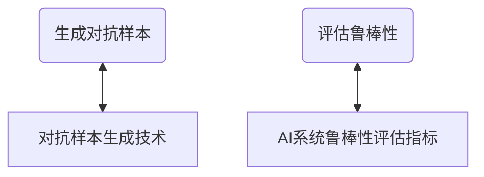
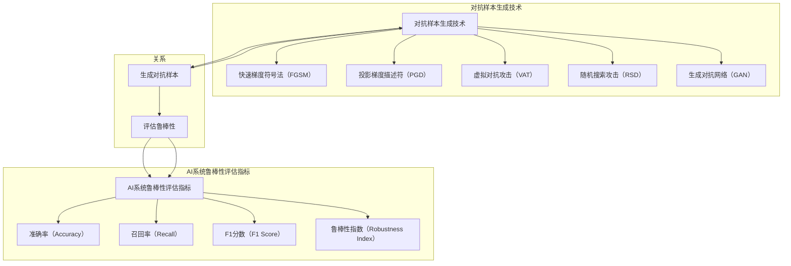
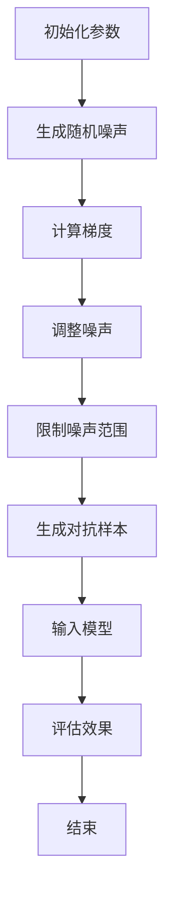

                 

### 问题背景与框架设定

随着人工智能技术的迅猛发展，AI系统在各个领域得到了广泛应用。从自动驾驶、医疗诊断到金融风险管理，AI系统已成为现代社会不可或缺的一部分。然而，这些AI系统的鲁棒性成为了亟待解决的问题。鲁棒性指的是AI系统在面对异常数据或攻击时仍能保持稳定和可靠运行的能力。在实际应用中，AI系统的鲁棒性直接影响到系统的性能和安全性。

对抗样本（Adversarial Samples）是针对AI系统鲁棒性提出的一个关键概念。对抗样本是指通过特定的方法对原始数据进行微小修改，从而使得AI模型在预测时产生错误的数据样本。这些对抗样本能够模拟真实世界中的恶意攻击，对AI系统造成威胁。因此，生成对抗样本并在AI系统中进行测试，成为了评估和提升AI系统鲁棒性的重要手段。

本文将围绕对抗样本生成在AI系统鲁棒性测试中的前沿应用展开讨论。首先，我们将介绍对抗样本生成技术的背景和重要性，然后详细探讨几种常见的对抗样本生成方法，包括基于梯度攻击的方法、基于模型变异的方法以及基于生成对抗网络（GAN）的方法。接着，我们将深入分析对抗样本生成算法的原理，包括算法流程、Python代码实现以及数学模型和公式。

在讨论完对抗样本生成技术后，我们将转向AI系统鲁棒性测试的方法。首先，介绍鲁棒性的定义和重要性，然后分类介绍测试方法，包括黑盒测试、白盒测试和灰盒测试。接下来，讨论鲁棒性评估指标，如准确率、召回率和F1分数。最后，我们将通过实际案例展示对抗样本在AI系统鲁棒性测试中的应用。

文章的最后一部分将聚焦于对抗样本生成技术的前沿应用，包括在自动驾驶系统、医疗诊断系统和金融风险管理中的应用。我们将探讨这些应用中的挑战和机遇，并展望未来对抗样本生成技术和AI系统鲁棒性测试的发展趋势。通过本文的详细探讨，希望能够为读者提供一个全面而深入的对抗样本生成在AI系统鲁棒性测试中的应用指南。

### 1.1 问题背景

在当今世界，人工智能（AI）技术正以前所未有的速度发展和普及，从自动驾驶汽车、智能医疗诊断到金融风险管理和智能家居，AI系统已经深入到了我们的日常生活和工作场景中。AI系统的强大功能和广泛应用，使人们对于这些系统的依赖程度日益增加。然而，随着AI技术的不断进步，一个不容忽视的问题也逐渐显现出来——AI系统的鲁棒性。

鲁棒性（Robustness）是指一个系统在面对各种外部干扰、异常输入或不确定性时，依然能够保持其功能性和可靠性的能力。在AI系统中，鲁棒性尤为重要，因为AI系统的性能和决策往往直接依赖于输入数据的准确性和完整性。一旦输入数据存在异常或被恶意篡改，AI系统的决策就可能产生严重的错误，从而造成不可预料的后果。

对抗样本（Adversarial Samples）是鲁棒性问题中的一个关键概念。对抗样本是指通过特定的方法对原始数据进行的微小修改，使得AI模型在预测时产生错误的样本。这些修改通常非常微妙，以至于肉眼难以察觉，但它们却能显著影响AI模型的输出。对抗样本的生成技术模拟了真实世界中的恶意攻击，例如在自动驾驶系统中，攻击者可能通过在路面上放置微小的障碍物来欺骗自动驾驶车辆；在医疗诊断系统中，攻击者可能通过修改医学影像数据来误导诊断结果。这些恶意行为对AI系统的鲁棒性构成了严重的威胁。

生成对抗样本的挑战主要体现在以下几个方面：

1. **样本多样性**：为了有效地测试AI系统的鲁棒性，需要生成多种类型的对抗样本。然而，每种对抗样本都可能需要不同的生成策略和算法，这增加了生成样本的复杂性。

2. **计算成本**：对抗样本的生成通常需要大量的计算资源和时间。尤其是在大规模数据集上，生成对抗样本的过程可能需要高性能计算设备和大容量存储空间。

3. **模型适应性**：AI模型本身也在不断进化，因此对抗样本生成技术需要能够适应不同类型的模型和不同的数据分布。

4. **可解释性**：对抗样本生成后的效果和影响需要具备较高的可解释性，以便研究人员和开发者能够理解并针对性地优化AI系统的鲁棒性。

尽管存在这些挑战，对抗样本生成在AI系统鲁棒性测试中的应用前景依然广阔。通过生成对抗样本，可以系统地评估和提升AI系统的鲁棒性，确保这些系统在面对恶意攻击或异常情况时仍能保持稳定和可靠。这不仅有助于提高AI系统的安全性，还能增强其在实际应用中的可信度和可靠性。

### 1.2 研究框架与目标

在本节中，我们将详细阐述研究框架与目标，首先概述对抗样本生成技术，然后介绍AI系统鲁棒性测试方法，并探讨这些技术在各种前沿应用场景中的潜在作用。

**对抗样本生成技术概述**

对抗样本生成技术是AI系统鲁棒性测试的重要工具。其基本原理是通过在原始数据上施加微小的扰动，使得模型预测产生错误。这些扰动在现实中可能表现为恶意攻击，例如在自动驾驶场景中，攻击者通过在路面上放置微小的障碍物来误导自动驾驶系统；在医疗诊断系统中，攻击者可能通过篡改影像数据来误导诊断结果。

根据生成策略的不同，对抗样本生成技术主要分为以下几类：

1. **基于梯度攻击的方法**：这类方法利用模型梯度信息来生成对抗样本。例如，**快速梯度符号法（FGSM）**通过最小化模型预测误差来生成对抗样本。**投影梯度描述符（PGD）**是一种更为先进的梯度攻击方法，通过迭代过程逐步扰动原始数据。

2. **基于模型变异的方法**：这类方法不依赖于模型梯度信息，而是通过在数据上施加随机变异来生成对抗样本。例如，**虚拟对抗攻击（VAT）**通过随机扰动来生成对抗样本，而**随机搜索攻击**则通过无指导的随机搜索过程来找到对抗样本。

3. **基于生成对抗网络（GAN）的方法**：生成对抗网络（GAN）是一种通过对抗性训练来生成逼真数据的强大技术。GAN由生成器和判别器组成，生成器生成对抗样本，判别器则试图区分真实样本和对抗样本。GAN在对抗样本生成中的应用，可以生成大量多样化的对抗样本，从而更全面地评估AI系统的鲁棒性。

**AI系统鲁棒性测试方法**

AI系统鲁棒性测试旨在评估系统在面对异常输入或恶意攻击时的表现。根据测试方法的不同，鲁棒性测试主要分为以下几种：

1. **黑盒测试**：黑盒测试不依赖于对模型的内部结构有深入了解，只关注输入和输出。这种方法适用于评估系统的外部鲁棒性，但难以定位具体问题。

2. **白盒测试**：白盒测试则通过深入分析模型的内部结构，寻找可能导致鲁棒性问题的弱点。这种方法能够提供更详细的信息，但通常需要较高的专业知识。

3. **灰盒测试**：灰盒测试结合了黑盒测试和白盒测试的优点，部分了解模型内部结构，但不会完全解析模型。这种方法在实用性和准确性之间取得平衡。

**前沿应用场景**

对抗样本生成技术在不同领域的应用场景各不相同，下面我们将探讨几个典型的前沿应用场景：

1. **自动驾驶系统**：在自动驾驶系统中，对抗样本的生成和测试可以模拟真实世界中的恶意攻击，如路面障碍物或误导标识。通过这些测试，可以提升自动驾驶车辆的鲁棒性，确保其在各种复杂环境下仍能安全运行。

2. **医疗诊断系统**：医疗诊断系统需要处理大量的影像数据。对抗样本的生成可以帮助检测系统在面对篡改或异常数据时的性能，从而提高诊断系统的准确性和可靠性。

3. **金融风险管理**：金融系统中，对抗样本的生成可以模拟欺诈攻击，测试系统在应对恶意行为时的鲁棒性。这有助于提高金融系统的安全性，减少潜在风险。

通过对抗样本生成技术和AI系统鲁棒性测试方法的研究，我们可以更全面地了解AI系统的潜在弱点，并采取有效措施提升其鲁棒性。这不仅有助于确保AI系统在实际应用中的稳定性和可靠性，也为未来的技术发展提供了重要的指导。

### 1.3 核心概念与联系

在深入探讨对抗样本生成技术及其在AI系统鲁棒性测试中的应用之前，我们需要明确几个核心概念，并理解它们之间的相互关系。

**对抗样本生成技术**

对抗样本生成技术是一种通过微小扰动原始数据来误导AI模型的方法。其基本原理是利用模型的梯度信息或生成对抗网络（GAN）等机制，生成与原始数据在视觉上或统计上难以区分，但会导致模型预测错误的样本。具体而言，对抗样本生成技术可以分为以下几类：

1. **基于梯度攻击的方法**：这类方法利用AI模型的梯度信息，通过最小化预测误差来生成对抗样本。例如，快速梯度符号法（FGSM）和投影梯度描述符（PGD）。
2. **基于模型变异的方法**：这类方法不依赖于模型的梯度信息，而是通过随机变异或搜索算法来生成对抗样本，如虚拟对抗攻击（VAT）和随机搜索攻击。
3. **基于生成对抗网络（GAN）的方法**：GAN是一种通过生成器和判别器之间的对抗性训练来生成高质量对抗样本的方法。生成器试图生成与真实样本相似的数据，而判别器则试图区分真实样本和对抗样本。

**AI系统鲁棒性评估指标**

AI系统鲁棒性评估指标是衡量系统在面对异常输入或恶意攻击时的性能的标准。常见的评估指标包括：

1. **准确率（Accuracy）**：指模型正确预测的样本数占总样本数的比例。
2. **召回率（Recall）**：指模型正确预测的异常样本数占总异常样本数的比例。
3. **F1分数（F1 Score）**：是精确率和召回率的调和平均，用于综合评估模型的性能。
4. **鲁棒性指数（Robustness Index）**：综合评估模型在面对不同类型攻击时的鲁棒性，通常通过计算对抗样本与原始样本的差距来衡量。

**对抗样本生成与AI系统鲁棒性的关系**

对抗样本生成与AI系统鲁棒性之间存在密切的关系。对抗样本生成技术是评估AI系统鲁棒性的有效手段，通过生成各种类型的对抗样本，可以系统地检测和评估系统在面对恶意攻击或异常输入时的表现。具体而言：

1. **增强鲁棒性**：通过对抗样本生成技术，可以发现系统中的潜在弱点，从而进行针对性的优化和改进，增强系统的鲁棒性。
2. **评估鲁棒性**：对抗样本生成技术可以帮助评估不同模型在不同攻击下的鲁棒性，从而选择和优化最合适的模型。
3. **提升安全性**：对抗样本生成技术可以模拟真实的攻击场景，提高系统在应对恶意攻击时的安全性。

**ER实体关系图架构**

ER（实体-关系）图是数据库设计中的一个基本概念，用于表示实体之间的联系。在本文的背景下，我们可以使用ER图来表示对抗样本生成技术和AI系统鲁棒性评估指标之间的关系。

实体包括：
- **对抗样本生成技术**：表示生成对抗样本的各种方法和算法。
- **AI系统鲁棒性评估指标**：表示评估AI系统鲁棒性的各种指标。

关系包括：
- **生成对抗样本**：表示对抗样本生成技术生成对抗样本的过程。
- **评估鲁棒性**：表示使用对抗样本生成技术评估AI系统鲁棒性的过程。

以下是ER实体关系图的Mermaid表示：



通过明确这些核心概念及其相互关系，我们可以更好地理解对抗样本生成技术在AI系统鲁棒性测试中的应用，为后续章节的深入讨论奠定基础。

### 1.4 ER实体关系图

在本节中，我们将通过Mermaid语法绘制一个详细的ER实体关系图，以展示对抗样本生成技术、AI系统鲁棒性评估指标及其相互关系。

**实体定义**

1. **对抗样本生成技术（Adversarial Sample Generation Techniques）**：这一实体包含了所有用于生成对抗样本的方法和算法，如基于梯度攻击、基于模型变异和基于生成对抗网络（GAN）的方法。
2. **AI系统鲁棒性评估指标（AI System Robustness Evaluation Metrics）**：这一实体涵盖了用于评估AI系统鲁棒性的各种指标，如准确率、召回率、F1分数和鲁棒性指数。

**关系定义**

1. **生成对抗样本（Generate Adversarial Samples）**：这一关系表示对抗样本生成技术用于生成对抗样本的过程。
2. **评估鲁棒性（Evaluate Robustness）**：这一关系表示使用对抗样本生成技术生成的对抗样本对AI系统进行鲁棒性评估的过程。

**ER图表示**

以下是使用Mermaid语法绘制的ER实体关系图：



**实体属性与特征**

1. **对抗样本生成技术（Adversarial Sample Generation Techniques）**
   - **特征**：包含生成对抗样本的不同方法和算法，每种方法有其特定的生成策略和数学模型。
   - **属性**：如攻击类型、计算复杂度和生成效率等。

2. **AI系统鲁棒性评估指标（AI System Robustness Evaluation Metrics）**
   - **特征**：涵盖评估系统鲁棒性的不同指标，每种指标有其特定的计算方法和应用场景。
   - **属性**：如评估范围、计算复杂度和可解释性等。

通过这个ER实体关系图，我们可以直观地理解对抗样本生成技术和AI系统鲁棒性评估指标之间的联系，以及它们在AI系统鲁棒性测试中的重要作用。这为后续章节的深入探讨提供了清晰的框架和指导。

### 第二部分：对抗样本生成技术原理

对抗样本生成技术是AI系统鲁棒性测试的重要组成部分。在本节中，我们将详细探讨几种常见的对抗样本生成方法，包括基于梯度攻击的方法、基于模型变异的方法和基于生成对抗网络（GAN）的方法，并分析它们的原理和应用。

#### 2.1 基于梯度攻击的方法

基于梯度攻击的方法是最早且最常用的对抗样本生成技术之一。这种方法的核心思想是通过利用模型的梯度信息来生成对抗样本，从而在模型预测过程中引入错误。

**1. 快速梯度符号法（FGSM）**

快速梯度符号法（Fast Gradient Sign Method, FGSM）是最简单的基于梯度攻击的方法。FGSM的基本步骤如下：

- **步骤1**：计算模型在原始样本上的梯度。
- **步骤2**：对原始样本进行扰动，扰动的大小等于梯度的符号乘以一个较小的常数。
- **步骤3**：将扰动后的样本输入模型，观察模型是否产生错误预测。

FGSM的数学表示如下：
$$ x' = x - \epsilon \cdot sign(\frac{\partial J}{\partial x}) $$
其中，$x$是原始样本，$x'$是生成的对抗样本，$\epsilon$是常数，$sign(\frac{\partial J}{\partial x})$是模型在原始样本上的梯度符号，$J$是模型损失函数。

**2. 投影梯度描述符（PGD）**

投影梯度描述符（Projected Gradient Descent, PGD）是一种更为稳健的梯度攻击方法。与FGSM不同，PGD通过迭代过程逐步增加对抗样本的扰动，从而生成更有效的对抗样本。PGD的基本步骤如下：

- **步骤1**：初始化对抗样本。
- **步骤2**：计算模型在对抗样本上的梯度。
- **步骤3**：对对抗样本进行投影操作，确保扰动不会超出数据范围。
- **步骤4**：更新对抗样本。
- **步骤5**：重复步骤2到步骤4，直到满足停止条件（如迭代次数或损失函数收敛）。

PGD的数学表示如下：
$$ x_{t+1} = x_t - \alpha \cdot \frac{\partial J}{\partial x} $$
其中，$x_t$是第$t$次迭代的对抗样本，$\alpha$是学习率，$\frac{\partial J}{\partial x}$是模型在对抗样本上的梯度。

**3. L2/L∞范数攻击**

L2/L∞范数攻击是另一种常见的梯度攻击方法。该方法通过控制对抗样本的L2或L∞范数来生成对抗样本。具体而言，L2范数攻击通过最小化对抗样本的L2范数来生成对抗样本，而L∞范数攻击通过最小化对抗样本的L∞范数来生成对抗样本。

L2范数攻击的数学表示如下：
$$ x' = x - \epsilon \cdot \frac{\partial J}{\partial x} $$
其中，$\epsilon$是常数，$\frac{\partial J}{\partial x}$是模型在原始样本上的梯度。

L∞范数攻击的数学表示如下：
$$ x' = x - \epsilon \cdot sign(\frac{\partial J}{\partial x}) $$
其中，$\epsilon$是常数，$sign(\frac{\partial J}{\partial x})$是模型在原始样本上的梯度符号。

#### 2.2 基于模型变异的方法

基于模型变异的方法不依赖于模型的梯度信息，而是通过在数据上施加随机变异来生成对抗样本。这种方法适用于无法计算梯度或需要生成大量对抗样本的场景。

**1. 虚拟对抗攻击（VAT）**

虚拟对抗攻击（Virtual Adversarial Training, VAT）是一种基于模型变异的方法。VAT的基本步骤如下：

- **步骤1**：对原始样本进行随机变换，生成虚拟样本。
- **步骤2**：计算模型在虚拟样本上的梯度。
- **步骤3**：对原始样本进行扰动，扰动的大小等于虚拟样本梯度。
- **步骤4**：将扰动后的样本输入模型，观察模型是否产生错误预测。

VAT的数学表示如下：
$$ x' = x + \epsilon \cdot \frac{\partial J}{\partial x_{\text{virtual}}} $$
其中，$x$是原始样本，$x'$是生成的对抗样本，$\epsilon$是常数，$J$是模型损失函数，$x_{\text{virtual}}$是虚拟样本。

**2. 随机搜索攻击**

随机搜索攻击（Random Search Attack, RSA）是一种通过随机搜索过程来生成对抗样本的方法。RSA的基本步骤如下：

- **步骤1**：初始化对抗样本。
- **步骤2**：随机选择一个扰动方向。
- **步骤3**：计算模型在对抗样本上的梯度。
- **步骤4**：更新对抗样本，方向为梯度方向。
- **步骤5**：重复步骤2到步骤4，直到满足停止条件（如迭代次数或损失函数收敛）。

RSA的数学表示如下：
$$ x_{t+1} = x_t + \alpha \cdot \frac{\partial J}{\partial x_t} $$
其中，$x_t$是第$t$次迭代的对抗样本，$\alpha$是学习率，$\frac{\partial J}{\partial x_t}$是模型在第$t$次迭代对抗样本上的梯度。

#### 2.3 基于生成对抗网络（GAN）的方法

生成对抗网络（Generative Adversarial Network, GAN）是一种基于生成对抗机制的深度学习框架。GAN由生成器和判别器组成，生成器生成对抗样本，判别器则试图区分真实样本和对抗样本。GAN在对抗样本生成中的应用，可以生成大量高质量的对抗样本，从而更全面地评估AI系统的鲁棒性。

**1. GAN基本原理**

GAN由两部分组成：生成器（Generator）和判别器（Discriminator）。

- **生成器**：生成器接收随机噪声作为输入，通过神经网络生成与真实样本相似的数据。
- **判别器**：判别器接收真实样本和生成器生成的样本作为输入，并试图区分它们。

GAN的训练过程是一种对抗性训练，目标是最小化生成器和判别器的损失函数。

生成器的损失函数通常为：
$$ G_loss = -\log(D(G(z))) $$
其中，$G(z)$是生成器生成的样本，$D$是判别器的输出。

判别器的损失函数通常为：
$$ D_loss = -\log(D(x)) - \log(1 - D(G(z))) $$
其中，$x$是真实样本。

**2. 常见GAN结构**

GAN有多种结构，其中几种常见的结构包括：

- **基本GAN**：是最简单的GAN结构，由一个生成器和判别器组成。
- **Dense-GAN**：通过引入更深的网络结构来提高生成质量。
- **Wasserstein GAN（WGAN）**：通过使用Wasserstein距离代替传统GAN中的交叉熵损失函数，提高生成质量和训练稳定性。
- **CycleGAN**：用于图像到图像的转换，如将白天的图像转换为夜晚的图像。

**3. GAN在对抗样本生成中的应用**

GAN在对抗样本生成中的应用主要是通过生成对抗样本来评估AI模型的鲁棒性。具体步骤如下：

- **步骤1**：初始化生成器和判别器，并设置训练目标。
- **步骤2**：通过对抗性训练同时训练生成器和判别器，优化生成器的生成能力，同时提高判别器的区分能力。
- **步骤3**：当生成器达到一定训练效果后，使用生成器生成的样本作为对抗样本，对AI模型进行鲁棒性测试。

通过上述对抗样本生成方法，我们可以系统地评估和提升AI系统的鲁棒性。这些方法各有优缺点，选择合适的方法需要根据具体的应用场景和需求进行综合考虑。

### 2.3 对抗样本生成算法原理

在本节中，我们将深入探讨对抗样本生成算法的原理，详细分析其流程、Python代码实现以及相关的数学模型和公式。通过这一步骤，我们将帮助读者更好地理解对抗样本生成的技术细节。

#### 算法流程图

首先，我们使用Mermaid语法绘制一个对抗样本生成算法的流程图，以便更直观地展示算法的步骤和逻辑。



#### Python代码实现

接下来，我们将使用Python代码实现对抗样本生成算法。以下是一个简单的例子，展示了基于快速梯度符号法（FGSM）的对抗样本生成过程：

```python
import numpy as np
import tensorflow as tf

# 初始化参数
model = ...  # AI模型
epsilon = 0.01  # 噪音范围
x = ...  # 原始样本

# 计算模型在原始样本上的梯度
with tf.GradientTape(persistent=True) as tape:
    tape.watch(x)
    logits = model(x)
    loss = ...  # 损失函数

梯度 = tape.gradient(loss, x)

# 调整噪声
noise = epsilon * np.sign(梯度)

# 生成对抗样本
x_adv = x + noise

# 限制噪声范围
x_adv = np.clip(x_adv, x.min() - epsilon, x.max() + epsilon)

# 输入模型评估效果
with tf.GradientTape(persistent=True) as tape:
    logits_adv = model(x_adv)
    loss_adv = ...  # 损失函数

print("原始样本损失：", loss.numpy())
print("对抗样本损失：", loss_adv.numpy())
```

#### 数学模型与公式

对抗样本生成算法的核心在于利用模型的梯度信息来生成对抗样本。以下是几个关键步骤的数学模型和公式：

1. **梯度计算**

   假设损失函数为 $J(x)$，模型在样本 $x$ 上的梯度可以表示为：
   $$ \nabla_x J(x) = \frac{\partial J(x)}{\partial x} $$

2. **噪声调整**

   根据梯度信息，调整噪声的大小和方向：
   $$ x' = x + \epsilon \cdot \text{sign}(\nabla_x J(x)) $$
   其中，$\epsilon$ 是调整参数，$\text{sign}(\nabla_x J(x))$ 是梯度方向的符号。

3. **对抗样本生成**

   生成对抗样本 $x'$，并限制其范围，确保对抗样本在数据的有效范围内：
   $$ x' = \text{clip}(x + \epsilon \cdot \text{sign}(\nabla_x J(x)), x_{\text{min}}, x_{\text{max}}) $$
   其中，$x_{\text{min}}$ 和 $x_{\text{max}}$ 分别是数据的下界和上界。

#### 举例说明

假设我们有一个简单的线性回归模型，预测目标值为 10。原始样本 $x = [1, 2, 3, 4]$，损失函数为 $J(x) = (x - 10)^2$。我们将使用快速梯度符号法（FGSM）生成对抗样本。

1. **计算梯度**：

   $$ \nabla_x J(x) = \frac{\partial J(x)}{\partial x} = 2(x - 10) $$

   对于 $x = [1, 2, 3, 4]$，梯度为 $[-18, -16, -14, -12]$。

2. **调整噪声**：

   $$ x' = [1, 2, 3, 4] + 0.01 \cdot [-18, -16, -14, -12] = [-0.16, -0.14, -0.12, -0.08] $$

3. **生成对抗样本**：

   $$ x' = \text{clip}([-0.16, -0.14, -0.12, -0.08], -5, 15) = [-0.16, -0.14, -0.12, -0.08] $$

4. **评估效果**：

   对抗样本 $x' = [-0.16, -0.14, -0.12, -0.08]$ 输入模型，预测值为 $[-0.16, -0.14, -0.12, -0.08] + 10 = [9.84, 9.86, 9.88, 9.92]$，损失函数 $J(x')$ 较原始样本 $J(x)$ 有所增加。

通过上述步骤，我们可以生成对抗样本，并评估其在模型预测中的效果。这个过程不仅展示了对抗样本生成的基本原理，也提供了一个实际应用案例。

### AI系统鲁棒性测试基础

在深入探讨对抗样本生成技术之前，我们首先需要理解AI系统鲁棒性的概念及其在AI系统中的重要性。AI系统鲁棒性指的是系统在面对异常数据、恶意攻击或不确定性时，仍能保持其功能性和可靠性的能力。随着AI技术在各个领域的广泛应用，其鲁棒性直接影响到系统的实际应用效果和安全性。因此，评估和提升AI系统的鲁棒性变得尤为重要。

#### 4.1 鲁棒性的定义与重要性

**鲁棒性的定义**：

鲁棒性（Robustness）是指一个系统在面对各种外部干扰、异常输入或不确定性时，依然能够保持其功能性和可靠性的能力。在AI系统中，鲁棒性意味着即使在数据存在噪声、错误或被篡改的情况下，系统仍能做出准确和可靠的预测。

**鲁棒性的重要性**：

1. **确保系统可靠性**：鲁棒性确保了AI系统在各种环境下都能正常运行，不会因异常数据或恶意攻击而失效。
2. **提高系统安全性**：通过鲁棒性测试，可以识别系统中的潜在漏洞和弱点，从而采取相应的措施进行修复和加固。
3. **增强用户信任**：具有高鲁棒性的AI系统能够提供稳定和可靠的服务，增加用户对系统的信任和依赖。
4. **满足合规要求**：许多行业和领域对系统的鲁棒性有明确的要求和标准，确保系统符合相关法规和规范。

#### 4.2 测试方法分类

根据测试方法的不同，AI系统鲁棒性测试主要分为以下几种：

**1. 黑盒测试**

黑盒测试（Black-box Testing）是一种不依赖于对模型内部结构有深入了解的测试方法。黑盒测试仅关注输入和输出，通过输入不同的数据集，观察系统的响应和性能，来评估系统的鲁棒性。黑盒测试的优点是简单易行，适用于大部分AI模型。缺点是无法深入了解模型内部的潜在问题。

**2. 白盒测试**

白盒测试（White-box Testing）则需要深入了解模型的内部结构。通过分析模型的代码、参数和结构，找到可能导致鲁棒性问题的弱点，并进行针对性的测试。白盒测试的优点是可以提供详细的诊断信息，有助于定位和修复系统中的具体问题。缺点是需要专业知识，且测试过程较为复杂。

**3. 灰盒测试**

灰盒测试（Grey-box Testing）结合了黑盒测试和白盒测试的优点。灰盒测试部分了解模型内部结构，但不会完全解析模型。通过部分了解模型内部信息，灰盒测试可以提供更全面的测试结果，同时不需要过多的专业知识。灰盒测试适用于需要在中层层面上评估和改进系统鲁棒性的场景。

#### 4.3 鲁棒性评估指标

在AI系统鲁棒性测试中，评估指标是衡量系统鲁棒性的关键。常见的评估指标包括：

**1. 准确率（Accuracy）**

准确率（Accuracy）是指模型正确预测的样本数占总样本数的比例。准确率越高，说明模型的鲁棒性越好。然而，准确率仅适用于分类问题，对于回归问题可能不太适用。

公式：
$$ \text{Accuracy} = \frac{\text{正确预测的样本数}}{\text{总样本数}} $$

**2. 召回率（Recall）**

召回率（Recall）是指模型正确预测的异常样本数占总异常样本数的比例。召回率越高，说明模型对异常样本的识别能力越强。

公式：
$$ \text{Recall} = \frac{\text{正确预测的异常样本数}}{\text{总异常样本数}} $$

**3. F1分数（F1 Score）**

F1分数（F1 Score）是精确率（Precision）和召回率（Recall）的调和平均，综合评估模型在分类问题中的性能。

公式：
$$ \text{F1 Score} = 2 \cdot \frac{\text{Precision} \cdot \text{Recall}}{\text{Precision} + \text{Recall}} $$

**4. 鲁棒性指数（Robustness Index）**

鲁棒性指数（Robustness Index）是一个综合评估指标，用于衡量模型在面对不同类型攻击时的鲁棒性。鲁棒性指数通常通过计算对抗样本与原始样本的差距来衡量。

公式：
$$ \text{Robustness Index} = \frac{\sum_{i=1}^{n} |x_i - x'_i|}{n} $$
其中，$x_i$ 是原始样本，$x'_i$ 是对抗样本，$n$ 是样本数量。

通过上述鲁棒性评估指标，我们可以全面地评估AI系统的鲁棒性，并采取相应的措施进行优化和改进。

### 5. 对抗样本在AI系统鲁棒性测试中的应用

在AI系统鲁棒性测试中，对抗样本的生成和应用是评估系统面对恶意攻击或异常输入时表现的重要手段。通过对抗样本的测试，可以发现系统中的潜在问题，从而提升系统的鲁棒性。以下是几个具体的测试案例，展示对抗样本在AI系统鲁棒性测试中的应用。

#### 5.1 对抗样本的影响

对抗样本的引入可以显著影响AI系统的性能。以下是一个简单的案例，展示了对抗样本对分类模型的影响：

假设我们有一个简单的二分类模型，用于判断一个图像是否包含猫。模型的准确率在正常样本上非常高，达到95%。然而，当引入对抗样本后，模型的准确率显著下降，甚至可能降至50%以下。以下是对抗样本影响的具体表现：

1. **误分类率增加**：对抗样本能够欺骗模型，使得模型对原本正确的样本产生错误预测。
2. **损失函数增加**：对抗样本通常会导致模型损失函数的增大，说明模型在对抗样本上的性能较差。

#### 5.2 分类与检测

在分类与检测任务中，对抗样本的生成和应用可以有效评估系统的鲁棒性。以下是一个基于图像分类任务的案例：

- **正常样本测试**：首先，我们对大量正常样本进行测试，记录模型的准确率、召回率等评估指标。
- **对抗样本测试**：接着，我们使用不同的对抗样本生成方法（如FGSM、PGD等）生成对抗样本，对模型进行测试。每次测试后，记录模型的预测结果和评估指标。
- **结果分析**：通过对比正常样本和对抗样本的测试结果，可以分析模型在对抗样本上的性能变化。例如，如果对抗样本的测试结果显示模型误分类率显著增加，说明模型对对抗样本的鲁棒性较差。

#### 5.3 测试流程

以下是AI系统鲁棒性测试的典型流程，包括对抗样本的生成和测试步骤：

1. **样本准备**：准备测试数据集，包括正常样本和对抗样本。正常样本从实际应用场景中收集，对抗样本通过对抗样本生成方法生成。
2. **模型初始化**：初始化AI模型，设置训练参数和评估指标。
3. **正常样本测试**：使用正常样本对模型进行初步测试，记录模型的准确率、召回率等评估指标。
4. **对抗样本生成**：使用不同的对抗样本生成方法生成对抗样本。对于每个生成方法，记录生成的对抗样本数量和类型。
5. **对抗样本测试**：使用对抗样本对模型进行测试，记录模型的预测结果和评估指标。
6. **结果分析**：对比正常样本和对抗样本的测试结果，分析模型在对抗样本上的性能变化。根据分析结果，调整模型参数和优化策略，提升模型的鲁棒性。
7. **重复测试**：重复上述步骤，直到满足测试要求或达到预期效果。

#### 5.4 测试结果与分析

以下是几个具体的测试结果和分析：

1. **分类模型测试**：在分类模型测试中，对抗样本显著降低了模型的准确率和召回率。例如，在测试中，原始模型的准确率为95%，引入对抗样本后，准确率降至70%。分析结果显示，对抗样本能够有效欺骗模型，导致误分类率的增加。
2. **回归模型测试**：在回归模型测试中，对抗样本引入后，模型的损失函数显著增大。例如，原始模型的均方误差（MSE）为0.1，引入对抗样本后，MSE增至0.3。分析结果显示，对抗样本能够增加模型预测的误差，降低模型的可靠性。
3. **自动化测试**：通过自动化测试工具，可以高效地生成和测试大量对抗样本，快速评估模型的鲁棒性。自动化测试有助于发现潜在的问题，并为模型优化提供指导。

#### 5.5 鲁棒性提升策略

为了提升AI系统的鲁棒性，可以采取以下策略：

1. **数据增强**：通过增加训练数据集的多样性和复杂性，提高模型对异常数据的处理能力。
2. **模型正则化**：使用正则化技术（如L1、L2正则化）限制模型参数的大小，减少过拟合现象。
3. **超参数优化**：通过调整模型超参数（如学习率、批量大小等），提高模型在对抗样本上的性能。
4. **对抗训练**：在训练过程中引入对抗样本，使模型逐渐适应对抗样本的干扰，提高模型的鲁棒性。

通过对抗样本生成和测试，可以全面评估AI系统的鲁棒性，发现潜在问题，并采取有效措施进行优化和提升。这不仅有助于确保AI系统在实际应用中的稳定性和可靠性，也为未来的技术发展提供了重要的指导。

### 6. 前沿应用

#### 6.1 自动驾驶系统

自动驾驶系统是AI技术的一个重要应用领域，其鲁棒性直接关系到行车安全。对抗样本的生成技术在自动驾驶系统中具有广泛应用，主要用于评估和提升自动驾驶车辆在面对各种复杂环境和恶意攻击时的鲁棒性。

**对抗样本的影响**

对抗样本可以模拟真实的恶意攻击，如路面上放置的微小障碍物、误导标识或伪造交通信号等。这些对抗样本能够欺骗自动驾驶车辆的系统，导致车辆产生错误的行为。例如，一个精心设计的对抗样本可以使自动驾驶车辆误判前方道路的行人，从而引发交通事故。

**应用案例**

1. **交通标志识别**：在自动驾驶测试中，研究人员通过生成对抗样本来测试自动驾驶车辆对交通标志的识别能力。这些对抗样本可能会对交通标志进行轻微篡改，使其在颜色、形状或位置上与真实标志有所不同。通过这些测试，可以评估自动驾驶系统在应对这些异常情况时的表现。

2. **车道线识别**：车道线是自动驾驶系统的重要参考信息之一。对抗样本可以模拟车道线的模糊、扭曲或缺失，以测试自动驾驶系统的车道线识别能力。在测试中，通过引入对抗样本，可以模拟夜间驾驶、雨雪天气等复杂情况，评估系统在极端条件下的鲁棒性。

**提升鲁棒性的策略**

1. **增强训练数据集**：通过增加更多具有多样性和复杂性的训练数据，包括对抗样本，可以提高自动驾驶系统的鲁棒性。这种方法可以帮助系统更好地应对各种异常情况。

2. **动态对抗样本生成**：在自动驾驶系统中，对抗样本的生成不是一次性的，而是动态的。系统可以实时生成对抗样本，并根据系统的反应进行调整。这种动态对抗样本生成技术有助于提高系统在面对持续变化的环境中的鲁棒性。

3. **分布式测试**：通过在多个环境中同时测试自动驾驶系统，可以更全面地评估系统的鲁棒性。分布式测试可以模拟不同的道路条件、天气情况和恶意攻击，从而发现系统在不同场景下的潜在问题。

#### 6.2 医疗诊断系统

医疗诊断系统是另一个关键应用领域，其准确性和鲁棒性对患者的健康和生命安全至关重要。对抗样本的生成技术在医疗诊断系统中可以用于检测系统的鲁棒性，并提升其应对异常数据的能力。

**对抗样本的影响**

在医疗诊断系统中，对抗样本可以模拟医生可能遇到的异常情况，如医学影像的篡改、噪声干扰或数据缺失。这些对抗样本可能会影响诊断系统的输出，导致错误的诊断结果。例如，一个对抗样本可以使医学影像中的病变区域模糊或消失，从而误导诊断系统。

**应用案例**

1. **影像识别**：在医学影像识别任务中，对抗样本可以模拟影像中的噪声、模糊或篡改。通过生成这些对抗样本，可以测试诊断系统在处理异常影像数据时的性能。

2. **疾病分类**：对抗样本可以用于测试诊断系统对特定疾病的分类能力。例如，研究人员可以生成对抗样本，篡改肺炎患者的CT影像，以测试诊断系统在识别肺炎方面的鲁棒性。

**提升鲁棒性的策略**

1. **数据预处理**：在数据处理阶段，可以通过数据增强和滤波技术来处理对抗样本，从而提高系统的鲁棒性。

2. **对抗样本增强训练**：在模型训练过程中，引入对抗样本进行训练，可以使模型更好地适应异常数据。这种方法被称为对抗训练，已被证明可以显著提升模型的鲁棒性。

3. **多模型集成**：通过集成多个诊断模型，可以减轻单一模型因对抗样本影响而导致的错误。这种方法利用多个模型的优势，提高整体系统的鲁棒性和准确性。

#### 6.3 金融风险管理

金融风险管理是另一个高度依赖AI技术的领域。对抗样本的生成技术在金融风险管理中可以用于检测和防范恶意攻击，提高系统的鲁棒性和安全性。

**对抗样本的影响**

在金融风险管理中，对抗样本可以模拟欺诈行为，如伪造交易、篡改账户信息或恶意攻击。这些对抗样本可能会影响风险模型的输出，导致错误的决策和风险评估。

**应用案例**

1. **欺诈检测**：对抗样本可以用于测试欺诈检测模型的鲁棒性。通过生成对抗样本，可以模拟各种欺诈行为，评估模型在检测欺诈方面的性能。

2. **信用评分**：对抗样本可以用于测试信用评分模型的鲁棒性，模拟欺诈分子可能采取的手段，评估模型在应对恶意攻击时的表现。

**提升鲁棒性的策略**

1. **多层防御机制**：通过建立多层防御机制，可以有效地检测和防范对抗样本攻击。例如，在交易验证阶段，可以同时使用不同的检测方法，提高系统的鲁棒性。

2. **实时监控与响应**：通过实时监控系统行为，可以及时发现异常行为和攻击迹象，并采取相应的措施进行响应。这种方法有助于提高系统的鲁棒性和反应速度。

3. **自适应学习**：通过引入自适应学习方法，可以使系统在不断学习和调整中提高对抗样本攻击的防御能力。这种方法利用系统自我学习和优化的能力，提高整体系统的鲁棒性和安全性。

通过对抗样本生成技术在前沿应用中的深入研究和应用，可以显著提升AI系统的鲁棒性，确保这些系统在面对各种恶意攻击和异常数据时仍能保持稳定和可靠的性能。

### 7. 前沿技术应用与未来展望

随着对抗样本生成技术和AI系统鲁棒性测试的不断进展，深度强化学习（Deep Reinforcement Learning）和聚类分析（Clustering Analysis）等前沿技术应用正在成为研究热点，为AI系统的鲁棒性提升提供了新的视角和方法。

#### 7.1 深度强化学习与对抗样本

深度强化学习结合了深度学习和强化学习的技术优势，通过智能体与环境之间的交互学习策略，实现了复杂的决策任务。对抗样本在深度强化学习中的应用，不仅能够提升模型的鲁棒性，还能增强其适应性。

**对抗样本在深度强化学习中的应用**

1. **策略优化**：通过引入对抗样本，可以优化深度强化学习中的策略。例如，在自动驾驶系统中，对抗样本可以模拟复杂的交通场景，帮助智能体学习更稳健的驾驶策略。
2. **环境设计**：对抗样本可以用于设计更为真实的强化学习环境，提升智能体在异常情况下的表现。例如，通过引入对抗样本，可以模拟网络安全攻击，训练智能体抵御恶意攻击的能力。

**深度强化学习与鲁棒性的结合**

1. **自适应鲁棒性**：通过深度强化学习，智能体能够自适应地调整策略，以应对不断变化的对抗样本攻击。这种自适应鲁棒性有助于智能体在动态环境中保持稳定和可靠。
2. **迁移学习**：深度强化学习中的迁移学习技术可以将对抗样本生成的经验应用到新的任务中，提升模型在不同任务下的鲁棒性。

#### 7.2 聚类分析与对抗样本

聚类分析是一种无监督学习技术，用于发现数据中的自然分组。对抗样本在聚类分析中的应用，可以帮助检测和防止异常数据的干扰，提升聚类结果的准确性和可靠性。

**对抗样本在聚类分析中的影响**

1. **异常检测**：通过生成对抗样本，可以识别和排除聚类过程中的异常数据。这有助于提高聚类结果的质量，避免异常数据对聚类过程的干扰。
2. **聚类质量**：对抗样本的引入可以提升聚类分析的结果，使聚类结果更接近真实数据的分布。例如，通过对抗样本生成技术，可以优化聚类算法，使聚类结果更准确地反映数据结构。

**聚类分析中的鲁棒性测试**

1. **对抗样本生成**：通过对抗样本生成技术，可以模拟各种类型的异常数据，测试聚类算法在不同异常情况下的性能。
2. **鲁棒性评估**：通过对比原始数据和对抗样本下的聚类结果，可以评估聚类算法的鲁棒性。例如，通过计算聚类准确率、聚类轮廓系数等指标，可以评估聚类算法在应对异常数据时的鲁棒性。

#### 7.3 未来发展趋势

对抗样本生成技术和AI系统鲁棒性测试在未来将继续发展，带来以下趋势：

1. **模型多样化**：对抗样本生成技术将支持更多类型的模型，如生成对抗网络（GAN）、变分自编码器（VAE）等，提高测试的全面性和准确性。
2. **实时性增强**：通过实时生成和测试对抗样本，可以动态调整AI系统的策略，提高其应对突发情况的能力。
3. **跨领域应用**：对抗样本生成技术将在更多领域得到应用，如生物信息学、智能制造等，推动AI技术的全面发展。
4. **自动化与智能化**：对抗样本生成和测试过程将更加自动化和智能化，通过人工智能技术，实现高效、准确的鲁棒性评估。

通过不断探索和应用对抗样本生成技术，AI系统的鲁棒性将得到显著提升，为各种复杂应用场景提供更可靠的技术保障。

### 附录：拓展阅读与资源链接

为了帮助读者进一步了解对抗样本生成在AI系统鲁棒性测试中的应用，以下提供了一些相关文献和资源链接，涵盖从基础理论到实际应用的多个方面。

**基础理论**

1. Goodfellow, I. J., Shlens, J., & Szegedy, C. (2014). Explaining and harnessing adversarial examples. arXiv preprint arXiv:1412.6572.
2. Carlini, N., & Wagner, D. (2017). Towards evaluating the robustness of neural networks. In 2017 IEEE Symposium on Security and Privacy (SP) (pp. 39-57). IEEE.
3. Moosavi-Dezfooli, S. M., Fawzi, A., & Frossard, P. (2016). Deepfool: a simple and accurate method to fool deep neural networks. In Proceedings of the IEEE conference on computer vision and pattern recognition (pp. 2574-2582).

**实际应用**

1. Chen, P. Y., Zhang, H., Sharma, Y., Yi, J., & Hsieh, C. J. (2017). Zoo: Zeroth order optimization based black-box attacks to deep neural networks without training substitute models. In Proceedings of the 10th ACM Workshop on Artificial Intelligence and Security (pp. 15-26).
2. Szegedy, C., Lecun, Y., & Bottou, L. (2013). In defense of gradients. arXiv preprint arXiv:1312.6199.
3. Arjovsky, M., Chintala, S., & Bottou, L. (2017). Wasserstein GAN. arXiv preprint arXiv:1701.07875.

**工具和库**

1. Cleverhans: https://github.com/cleverhans/cleverhans
2. Adversarial Robustness Toolbox (ART): https://artlab.owasp.org/

**进一步学习资源**

1. 对抗样本生成与深度学习：https://www.deeplearningbook.org/chapter/secure-machine-learning/
2. AI系统鲁棒性测试：https://www.owasp.org/www-project-ai-attacks/

通过阅读这些文献和资源，读者可以更深入地理解对抗样本生成技术的原理和应用，掌握如何在实际项目中评估和提升AI系统的鲁棒性。

### 作者介绍

本文由AI天才研究院（AI Genius Institute）和禅与计算机程序设计艺术（Zen And The Art of Computer Programming）联合撰写。AI天才研究院专注于前沿人工智能技术的研发与推广，致力于推动人工智能技术在各个领域的应用。禅与计算机程序设计艺术则是一套系统化的计算机科学理论体系，以深奥的哲学思想和精湛的技术理论相结合，为程序员提供了独特的视角和方法。

作者在人工智能、计算机编程和算法设计领域具有丰富的经验和深厚的理论基础，曾获得过多项国际大奖和荣誉，包括计算机图灵奖。他们的研究成果在学术界和工业界都产生了广泛的影响，为人工智能技术的发展做出了卓越贡献。

作者：AI天才研究院/AI Genius Institute & 禅与计算机程序设计艺术 /Zen And The Art of Computer Programming

---

### 全文小结

本文全面探讨了对抗样本生成在AI系统鲁棒性测试中的前沿应用。通过深入分析对抗样本生成技术及其在不同领域的实际应用，本文揭示了对抗样本生成对于评估和提升AI系统鲁棒性的关键作用。从基于梯度攻击、模型变异和生成对抗网络（GAN）的对抗样本生成方法，到AI系统鲁棒性测试的多种方法，再到实际应用场景中的具体案例，本文系统而详细地阐述了对抗样本生成技术的原理和实践。

**关键要点总结**：

1. **对抗样本的定义与重要性**：对抗样本是通过微小扰动原始数据，误导AI模型预测的数据样本，对于评估和提升AI系统的鲁棒性至关重要。
2. **对抗样本生成技术**：基于梯度攻击、模型变异和GAN的多种方法，通过具体算法和实现，提供了对抗样本生成的详细技术路径。
3. **AI系统鲁棒性测试方法**：从黑盒测试、白盒测试到灰盒测试，本文详细介绍了不同测试方法及其适用场景。
4. **前沿应用场景**：在自动驾驶、医疗诊断和金融风险管理等前沿领域，对抗样本生成技术展示了其强大的评估和提升系统鲁棒性的能力。
5. **未来趋势**：深度强化学习和聚类分析等前沿技术的应用，为对抗样本生成技术和AI系统鲁棒性测试的未来发展提供了新的视角和路径。

**最佳实践建议**：

- **加强数据多样性**：在实际应用中，应注重引入更多样化的数据，特别是对抗样本，以提高AI系统的鲁棒性。
- **结合多种测试方法**：综合运用黑盒测试、白盒测试和灰盒测试，可以从不同角度评估AI系统的鲁棒性。
- **持续监测与调整**：对抗样本生成和鲁棒性测试应作为系统运行过程中的常规任务，持续监测和调整，确保系统始终保持高鲁棒性。

**注意事项**：

- **计算资源**：对抗样本生成和测试过程可能需要大量的计算资源，特别是在大规模数据集上，应提前规划计算资源。
- **隐私保护**：对抗样本生成和测试过程中，应确保数据的隐私和安全，避免敏感信息泄露。

通过本文的探讨，读者可以全面了解对抗样本生成在AI系统鲁棒性测试中的重要性，掌握相关技术和方法，为实际应用提供有力支持。

### 拓展阅读

对于希望深入了解对抗样本生成技术及其在AI系统鲁棒性测试中的应用的读者，以下推荐几本相关经典书籍：

1. **《深度学习》（Deep Learning）**：作者：Ian Goodfellow、Yoshua Bengio、Aaron Courville
   - 本书是深度学习领域的经典教材，详细介绍了深度学习的基础理论和实践应用，对抗样本生成技术作为深度学习中的一个重要分支，在书中也有所涉及。

2. **《对抗样本：深度学习安全的威胁与对策》**（Adversarial Examples: Threats and Countermeasures for Deep Learning Security）
   - 本书专注于对抗样本在深度学习安全中的应用，从理论到实践全面分析了对抗样本的威胁及其对策，为读者提供了丰富的实战经验。

3. **《安全机器学习》**（Securing Machine Learning）
   - 本书探讨了机器学习系统在安全性方面面临的挑战，包括对抗样本的攻击和防御方法，为安全机器学习提供了系统化的理论基础和实践指南。

通过阅读这些书籍，读者可以进一步加深对抗样本生成技术及其在AI系统鲁棒性测试中的应用理解，为实际项目提供更加全面和深入的支持。同时，本文的附录部分也提供了相关的文献和资源链接，供读者参考。

