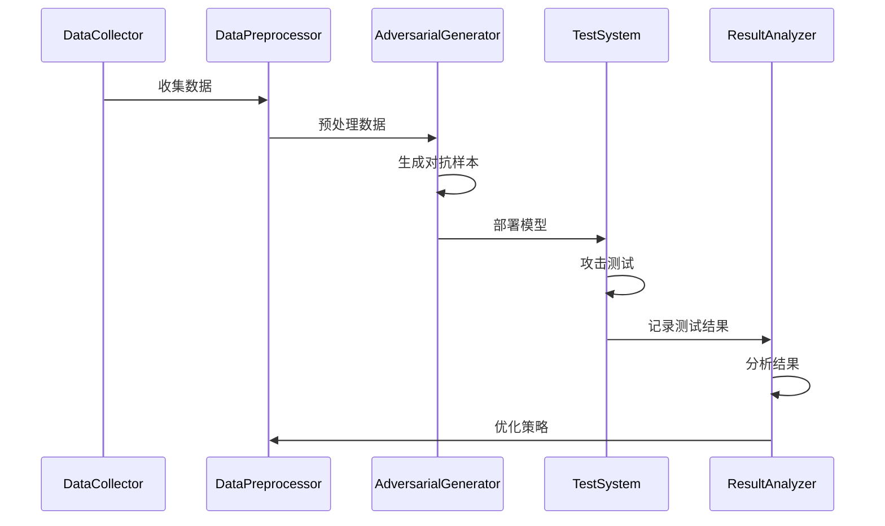

                 

### 第1章：问题背景与意义

#### 1.1.1 问题背景

随着人工智能技术的快速发展，深度学习模型在各种应用领域，如计算机视觉、自然语言处理、语音识别等方面取得了显著的成果。然而，深度学习模型在现实世界中的表现并不总是如我们所期望的那样理想。特别是在推理阶段，模型的鲁棒性成为了一个亟待解决的问题。

**什么是推理系统的鲁棒性？**

推理系统的鲁棒性指的是在面临各种不确定性和异常情况下，系统能够正确地执行任务，而不被攻击或错误输入所影响。这些不确定性和异常情况可以包括数据噪声、异常值、恶意攻击等。

在现实世界中，推理系统往往会面临各种形式的攻击，其中之一便是对抗样本攻击。对抗样本是指在模型训练期间和推理期间故意添加到数据集中的微小扰动，使得模型在测试时无法正确分类。这种攻击具有隐蔽性，因为对抗样本与原始数据在视觉上几乎难以区分。

**对抗样本生成在模型训练中的作用**

对抗样本生成在模型训练中的主要作用是提高模型的鲁棒性。通过生成对抗样本并将其纳入训练数据集中，模型可以学会对各种异常情况进行鲁棒处理，从而在推理阶段更好地抵抗攻击。

对抗样本生成的关键在于：

1. **样本选择**：选择具有代表性的样本，这些样本能够真实反映现实世界中可能出现的情况。
2. **扰动方法**：采用适当的扰动方法来生成对抗样本，确保生成的样本对模型的影响显著但不会破坏数据的整体结构。

**对抗样本生成在推理系统鲁棒性测试中的应用**

在推理系统鲁棒性测试中，对抗样本生成同样扮演着重要角色。测试的目的是评估模型在实际应用中面对对抗样本攻击时的表现。通过生成对抗样本并对其进行攻击测试，我们可以：

1. **发现模型漏洞**：对抗样本可以揭示模型中存在的潜在漏洞，这些漏洞在正常数据集上可能不会显现。
2. **评估模型鲁棒性**：通过对抗样本攻击测试，可以量化模型在面临攻击时的鲁棒性，为模型改进提供依据。
3. **优化模型设计**：基于对抗样本攻击的结果，可以对模型设计进行优化，提高其鲁棒性。

总结来说，对抗样本生成在推理系统鲁棒性测试中的应用，不仅有助于提升模型的鲁棒性，也为我们在设计、测试和优化深度学习模型时提供了重要的指导。

### 1.1.2 对抗样本生成的重要性

对抗样本生成的重要性不可低估。在深度学习模型的发展过程中，对抗样本一直是研究者和开发者关注的焦点。以下是几方面对抗样本生成的重要性：

**1. 提升模型安全性**

对抗样本的生成和利用是深度学习模型面临的最大安全挑战之一。通过生成对抗样本，攻击者可以干扰模型的正常工作，使其在推理阶段产生错误输出。提升模型的安全性意味着增强其对对抗样本攻击的抵抗力，这对于那些应用于关键领域（如金融、医疗、自动驾驶等）的深度学习系统尤为重要。

**2. 促进模型鲁棒性研究**

对抗样本的生成推动了深度学习模型鲁棒性的研究。研究人员通过分析和理解对抗样本生成机制，深入探讨模型鲁棒性的本质和提升方法。这包括改进训练方法、设计更加鲁棒的网络结构以及开发对抗样本检测和防御技术。

**3. 实现模型自我进化**

通过对抗样本生成，模型可以学会在多变的环境中适应和进化。这种自我进化能力有助于模型在面对新的威胁和攻击时保持有效性。例如，自动驾驶系统可以通过对抗样本生成和训练来提高其识别复杂场景和应对意外情况的能力。

**4. 优化模型训练过程**

对抗样本的引入使模型训练过程更加全面和有效。通过包含对抗样本的训练数据集，模型可以在学习过程中考虑到更多的异常情况，从而提高其在实际应用中的泛化能力。这种优化不仅能够提升模型的鲁棒性，还能提高其准确性和可靠性。

**5. 推动人工智能应用边界拓展**

对抗样本生成技术使得人工智能应用的范围得以进一步拓展。在传统领域，由于缺乏对异常数据的处理能力，一些应用难以推广。而通过对抗样本生成技术，人工智能系统可以更加灵活地应对各种不确定性和异常情况，从而在更多实际场景中得到应用。

**6. 提升数据安全与隐私保护**

对抗样本生成技术不仅对模型本身具有重要意义，还可以用于数据安全和隐私保护。通过对抗样本生成，可以在不泄露敏感数据的情况下进行模型训练和推理，从而增强数据的保密性和隐私性。

总之，对抗样本生成在深度学习模型训练和推理系统鲁棒性测试中具有至关重要的作用。它不仅提升了模型的安全性和鲁棒性，还促进了相关研究的发展，为人工智能应用的边界拓展提供了强有力的支持。

### 1.1.3 推理系统鲁棒性测试的需求

推理系统鲁棒性测试在深度学习应用中至关重要，其原因在于实际应用场景中存在多种不确定性因素。这些因素可能源自数据的噪声、异常值、恶意攻击或操作环境的变更。因此，对推理系统进行鲁棒性测试具有以下几个关键需求：

**1. 数据多样性**

首先，测试数据需要具备多样性。单一的、干净的数据集无法全面反映现实中的复杂情况。因此，测试数据应包括各种类型的数据样本，如正常样本、噪声样本、异常样本以及恶意对抗样本。这样，推理系统才能在面对不同类型的数据时保持鲁棒性。

**2. 异常值处理**

在实际应用中，数据中往往包含异常值。这些异常值可能由测量误差、记录错误或数据采集过程中产生的噪声造成。因此，推理系统鲁棒性测试需要考虑异常值的处理。测试应包括对异常值检测、标记和处理的评估，以确保系统在不同条件下均能正确处理数据。

**3. 恶意攻击检测**

对抗样本攻击是深度学习模型面临的重大威胁之一。为了评估推理系统的鲁棒性，测试中必须包含对恶意攻击的检测和防御。这包括生成各种类型的对抗样本，评估模型对对抗样本的抵抗能力，并根据测试结果调整模型参数以增强其防御能力。

**4. 环境变化适应性**

现实应用环境可能会因时间、地点、用户行为等因素而发生变化。推理系统鲁棒性测试需要评估系统在环境变化下的适应能力。测试应模拟不同环境条件，如温度、光照、噪声等，以评估系统在不同条件下的稳定性和可靠性。

**5. 持续性测试**

推理系统鲁棒性测试不仅需要在特定时刻进行，还应具备持续性的特点。通过持续性的测试，可以监控系统在长期运行中的性能和鲁棒性，及时发现潜在问题并进行调整。

**6. 模型安全性评估**

推理系统的鲁棒性测试还应涵盖模型的安全性评估。测试应评估系统在面对各种恶意攻击时的安全性，包括对数据泄露、模型篡改等安全威胁的抵抗能力。

综上所述，推理系统鲁棒性测试的需求是多方面的，需要综合考虑数据的多样性、异常值处理、恶意攻击检测、环境变化适应性以及持续性和安全性。通过满足这些需求，我们可以确保推理系统在实际应用中具备较高的鲁棒性，从而提升系统的可靠性和安全性。

### 第2章：对抗样本基础

#### 2.1.1 对抗样本的定义

对抗样本（Adversarial Samples）是深度学习领域中一个重要的概念，指的是那些通过微小扰动（即对抗性扰动）引入到正常数据中，使得模型在测试阶段产生错误输出的样本。这些扰动通常在视觉上难以察觉，但足以导致模型的分类结果发生错误。

对抗样本的定义可以从以下几个方面进行详细阐述：

**1. 特征扰动**

对抗样本的核心在于其特征扰动。这种扰动可以是颜色、形状、纹理等视觉特征的微小变化，或者是数据中的噪声和异常值。通过这些扰动，对抗样本能够在不影响原始数据本质特征的情况下，引发模型预测的偏差。

**2. 恶意性**

对抗样本具有明显的恶意性。它们不是随机生成的，而是经过精心设计和优化的。攻击者通过对抗样本试图欺骗模型，使其在测试阶段产生错误输出。这种欺骗行为对模型的安全性和可靠性构成了严重威胁。

**3. 微小性**

对抗样本的另一个特点是微小性。这些样本的扰动幅度通常非常小，有时甚至难以通过肉眼识别。这种微小性使得对抗样本能够在不引起用户怀疑的情况下，对模型造成实质性的影响。

**4. 难以预防**

对抗样本的生成方法多种多样，包括快速梯度符号方法（FGSM）、Projected Gradient Descent（PGD）等。这些方法利用了模型的梯度信息，能够生成具有高度攻击性的对抗样本。这使得对抗样本的防御成为一个复杂且具有挑战性的问题。

**5. 广泛应用**

对抗样本的应用范围非常广泛。从简单的图像分类任务到复杂的自然语言处理任务，对抗样本都能够发挥作用。这使得对抗样本生成技术成为深度学习安全性和鲁棒性研究的重要领域。

通过上述定义，我们可以看出对抗样本在深度学习领域中具有不可忽视的重要性。了解对抗样本的定义，有助于我们更好地理解和应对这一挑战，为模型训练和推理系统的鲁棒性测试提供有力支持。

#### 2.1.2 对抗样本的生成方法

对抗样本的生成方法多种多样，每种方法都有其独特的原理和应用场景。以下是几种常见的对抗样本生成方法及其基本原理：

**1. 快速梯度符号方法（FGSM）**

快速梯度符号方法（Fast Gradient Sign Method, FGSM）是最简单的对抗样本生成方法之一。它通过在输入数据的每个特征上添加与模型梯度符号相同的扰动来实现。具体步骤如下：

- **计算梯度**：首先，对正常样本进行前向传播，得到模型的输出。
- **计算损失**：计算模型输出与真实标签之间的损失。
- **计算梯度**：对损失函数求导，得到模型对输入数据的梯度。
- **生成对抗样本**：将梯度按符号取反，并乘以一个小的常数L，得到对抗样本。

Python代码示例：

```python
import numpy as np

# 假设输入数据为x，模型梯度为grad
x = np.array([1.0, 2.0, 3.0])
grad = np.array([-0.1, 0.2, -0.3])

# 计算对抗样本
x_adv = x + L * np.sign(grad)
print(x_adv)
```

**2. Projected Gradient Descent（PGD）**

Projected Gradient Descent（PGD）是一种基于梯度的迭代方法，它通过多次迭代逐步增加对抗性扰动，以生成更具攻击性的对抗样本。具体步骤如下：

- **初始化**：设置初始对抗样本x0 = x，学习率η和迭代次数T。
- **迭代**：对于每次迭代t，执行以下步骤：
  - **计算梯度**：对当前对抗样本x(t)进行前向传播，得到模型输出和损失。
  - **计算梯度**：计算损失对输入的梯度。
  - **更新对抗样本**：将对抗样本向梯度方向移动η步，并投影回允许的输入范围内。
- **生成最终对抗样本**：经过T次迭代后，得到最终的对抗样本x(T)。

Python代码示例：

```python
import numpy as np

# 假设输入数据为x，模型梯度为grad，学习率η=0.1，迭代次数T=10
x = np.array([1.0, 2.0, 3.0])
eta = 0.1
T = 10

for t in range(T):
    grad = compute_gradient(x)  # 这里用函数表示计算梯度
    x = x + eta * grad
    x = project_to_bounds(x)  # 这里用函数表示投影操作

print(x)
```

**3. Carlini & Wagner（C&W）攻击**

Carlini & Wagner（C&W）攻击是一种基于优化理论的对抗样本生成方法。它通过最小化一个结合模型损失和对抗性扰动的目标函数来生成对抗样本。具体步骤如下：

- **初始化**：设置初始对抗样本x0、学习率η和优化迭代次数T。
- **优化**：使用梯度下降或其他优化算法，逐步调整对抗样本，使其在模型损失和对抗性扰动之间达到平衡。
- **生成对抗样本**：经过多次迭代后，得到最终的对抗样本。

Python代码示例：

```python
import numpy as np

# 假设输入数据为x，模型损失函数为loss，优化迭代次数T=100
x = np.array([1.0, 2.0, 3.0])
T = 100

for t in range(T):
    grad = compute_gradient(x, loss)  # 这里用函数表示计算梯度和损失
    x = x - eta * grad  # 使用梯度下降更新对抗样本

print(x)
```

以上是几种常见的对抗样本生成方法及其原理介绍。这些方法各有优缺点，适用于不同的应用场景。理解这些方法，有助于我们更好地设计和评估深度学习模型的鲁棒性。

#### 2.1.3 对抗样本的特点

对抗样本在深度学习领域中具有独特且重要的特点，这些特点决定了其对于模型安全性和鲁棒性的巨大影响。以下是对抗样本的几个主要特点：

**1. 隐藏性**

对抗样本的一个显著特点是隐藏性。这些样本通常是在原始样本的基础上进行微小的扰动生成的，因此在视觉上与原始样本几乎无法区分。这意味着攻击者可以在不引起用户注意的情况下，对模型进行恶意攻击，从而获取不正当的利益。隐藏性使得对抗样本攻击更加难以检测和防御。

**2. 恶意性**

对抗样本具有明显的恶意性。它们是专门设计来欺骗模型的，目的是使模型在测试阶段产生错误输出。这种恶意性使得对抗样本攻击成为一种强大的攻击手段，可以对模型造成严重的安全威胁。恶意性不仅体现在对抗样本的生成方法上，还体现在攻击者对模型攻击的意图和策略上。

**3. 灵活性**

对抗样本生成方法多样，具有很高的灵活性。不同的生成方法可以根据具体的应用场景和目标模型的特点进行优化。例如，快速梯度符号方法（FGSM）适用于快速生成简单但有效的对抗样本，而Projected Gradient Descent（PGD）适用于生成更加复杂和具有攻击性的对抗样本。这种灵活性使得对抗样本攻击可以针对不同的模型和应用场景进行定制化。

**4. 高效性**

对抗样本生成方法通常具有较高的计算效率。许多生成方法可以在较短的时间内生成大量对抗样本，从而提高攻击的效率和效果。这种高效性使得对抗样本攻击可以大规模地应用于各种深度学习模型，从而对整个深度学习生态系统构成严重威胁。

**5. 强适应性**

对抗样本生成方法具有很强的适应性。随着深度学习模型和攻击技术的不断发展，对抗样本生成方法也在不断进化。新的生成方法可以应对现有的防御策略，而现有的防御策略也必须不断更新以应对新的攻击。这种强适应性使得对抗样本攻击在深度学习领域具有持续的影响力和威胁。

**6. 低成本**

对抗样本生成方法通常不需要昂贵的计算资源或复杂的硬件设备。大多数生成方法可以在普通计算机上运行，利用现有的深度学习框架和工具即可实现。这使得对抗样本攻击的实施成本相对较低，进一步加剧了其威胁性。

总之，对抗样本的特点决定了其在深度学习模型鲁棒性测试中的重要性和挑战性。了解这些特点，有助于我们更好地理解和应对对抗样本攻击，为深度学习系统的安全性和可靠性提供有力保障。

### 第3章：对抗训练与模型鲁棒性

#### 3.1.1 对抗训练的概念

对抗训练（Adversarial Training）是一种通过生成对抗样本来增强模型鲁棒性的训练方法。其核心思想是在训练过程中引入对抗样本，使模型在训练阶段就学会对对抗性扰动进行鲁棒处理。对抗训练不仅能够提高模型的分类准确率，还能增强模型在实际应用中的鲁棒性。

对抗训练的基本原理如下：

1. **生成对抗样本**：首先，通过对抗样本生成方法（如FGSM、PGD等）生成对抗样本。这些对抗样本是在原始训练样本的基础上，通过微小扰动生成的，使得模型在这些样本上的表现更接近实际应用中的情况。

2. **组合训练数据**：将生成的对抗样本与原始训练样本进行混合，形成新的训练数据集。这样，模型在训练过程中不仅会遇到正常的训练样本，还会遇到经过对抗性扰动的样本。

3. **优化模型参数**：在训练过程中，模型会根据新的训练数据集调整其参数，以减少对抗样本上的错误率。通过这种调整，模型能够在训练阶段就学会对对抗性扰动进行鲁棒处理，从而提高其在推理阶段的表现。

4. **迭代训练**：对抗训练通常是一个迭代过程。在每次迭代中，模型都会根据新的对抗样本调整其参数，从而逐渐提高其鲁棒性。通过多次迭代，模型能够逐步学会应对各种对抗性扰动。

对抗训练通过引入对抗样本，使得模型在训练阶段就面临实际应用中的对抗性挑战。这种方法不仅能够提高模型的分类准确率，还能增强模型在现实世界中的鲁棒性和安全性。

#### 3.1.2 对抗训练的流程

对抗训练的流程可以分为以下几个主要步骤：

**1. 初始化模型参数**：首先，初始化深度学习模型的参数。这些参数通常通过随机初始化或预训练模型获取。

**2. 生成对抗样本**：使用对抗样本生成方法（如FGSM、PGD等）生成对抗样本。这些对抗样本是基于原始训练样本通过微小扰动生成的，目的是模拟实际应用中可能遇到的对抗性扰动。

**3. 组合训练数据集**：将原始训练样本和生成的对抗样本组合成一个大的训练数据集。这样，模型在训练过程中不仅会看到正常的训练样本，还会遇到经过对抗性扰动的样本。

**4. 训练模型**：使用新的训练数据集对模型进行训练。在训练过程中，模型会尝试通过调整其参数来降低对抗样本上的错误率。这样，模型能够在训练阶段就学会对对抗性扰动进行鲁棒处理。

**5. 评估模型性能**：在每次迭代结束后，评估模型在正常样本和对抗样本上的性能。通过对比模型在正常样本和对抗样本上的准确率，可以评估模型对对抗性扰动的鲁棒性。

**6. 调整模型参数**：根据评估结果，调整模型的参数，以提高其对抗性鲁棒性。这个过程可以通过梯度下降或其他优化算法实现。

**7. 迭代训练**：重复上述步骤，进行多次迭代训练，逐步提高模型的鲁棒性。

通过这个流程，对抗训练使得模型在训练阶段就能够面对对抗性扰动，从而在实际应用中表现出更高的鲁棒性和安全性。

#### 3.1.3 对抗训练对模型鲁棒性的影响

对抗训练在深度学习模型鲁棒性方面具有显著的影响，具体表现为以下几点：

**1. 提高模型在对抗样本下的准确率**

通过对抗训练，模型能够在训练阶段接触到大量的对抗样本，从而学会对对抗性扰动进行鲁棒处理。这种训练方式使得模型在测试阶段面对对抗样本时，能够保持较高的准确率，从而减少因对抗样本导致的错误预测。

**2. 增强模型对未知对抗攻击的抵抗力**

对抗训练不仅能够提高模型在已知对抗攻击下的鲁棒性，还能增强模型对未知对抗攻击的抵抗力。这是因为对抗训练使得模型在训练阶段学会了处理各种类型的对抗性扰动，从而在面对新的、未知的对抗样本时，能够更好地抵御攻击。

**3. 提高模型的泛化能力**

对抗训练通过引入对抗样本，使得模型在训练阶段就面对多种复杂的情况。这种训练方式不仅能够提高模型的分类准确率，还能增强其泛化能力。模型在泛化能力方面表现更好，意味着其在面对新的、未见过的数据时，能够做出更准确的预测。

**4. 减少过拟合现象**

对抗训练通过引入对抗样本，迫使模型在训练阶段面对更多的挑战。这种训练方式有助于减少模型的过拟合现象，因为模型必须学会在多种复杂情况下都能表现良好。过拟合现象的减少，进一步提高了模型的鲁棒性和泛化能力。

**5. 增强模型的鲁棒性**

对抗训练通过增强模型对对抗性扰动的抵抗力，提高了模型的鲁棒性。这意味着模型在实际应用中能够更好地应对各种不确定性和异常情况，从而提高系统的稳定性和可靠性。

总之，对抗训练对模型鲁棒性的影响是全面的和积极的。通过对抗训练，我们可以显著提高模型的鲁棒性和泛化能力，使其在实际应用中表现出更高的可靠性和安全性。这是对抗训练在深度学习领域中备受关注的重要原因之一。

### 第4章：对抗样本生成算法

#### 4.1.1 快速梯度符号方法（FGSM）

快速梯度符号方法（Fast Gradient Sign Method, FGSM）是最简单且计算效率较高的对抗样本生成方法之一。其基本原理是在原始样本的每个特征上添加与模型梯度符号相同的扰动，以生成对抗样本。这种方法的关键在于利用了梯度信息，使得生成的对抗样本具有较高的攻击性。

**基本原理：**

FGSM的生成过程可以分为以下几个步骤：

1. **计算梯度**：首先，对原始样本进行前向传播，得到模型的输出和损失。
2. **计算梯度**：计算损失函数关于输入的梯度，即模型对输入的敏感性。
3. **生成对抗样本**：将梯度按符号取反，并乘以一个小的常数L，得到对抗样本。

数学公式表示如下：

$$
x_{adv} = x + L \cdot \text{sign}(\nabla_J f(x))
$$

其中，\( x \)为原始样本，\( x_{adv} \)为生成的对抗样本，\( f(x) \)为损失函数，\( \text{sign}(.) \)为符号函数，\( L \)为扰动幅度。

**Python代码示例：**

```python
import numpy as np
from tensorflow.keras.models import load_model

# 加载预训练的模型
model = load_model('model.h5')

# 原始输入样本
x = np.random.rand(1, 28, 28, 1)  # 示例为手写数字MNIST数据集

# 计算梯度
with tf.GradientTape(persistent=True) as tape:
    tape.watch(x)
    logits = model(x)
    loss = tf.keras.losses.categorical_crossentropy(logits, y)

grad = tape.gradient(loss, x)

# 生成对抗样本
x_adv = x + 0.01 * np.sign(grad)

print("Original sample:", x)
print("Adversarial sample:", x_adv)
```

**算法优点与缺点：**

- **优点**：计算简单，效率高；生成对抗样本速度快，适用于快速测试和验证。
- **缺点**：生成的对抗样本攻击性较低，可能无法有效对抗复杂模型；扰动幅度固定，无法自适应调整。

#### 4.1.2 Fast Gradient Sign Method (FGSM)

**算法流程：**

1. **输入数据预处理**：将输入数据标准化或归一化，使其适应模型输入范围。

2. **前向传播**：对输入数据进行前向传播，计算模型的输出和损失。

3. **计算梯度**：计算损失函数关于输入的梯度，即模型对输入的敏感性。

4. **生成对抗样本**：将梯度按符号取反，并乘以一个小的常数L，得到对抗样本。

**Python代码示例：**

```python
import numpy as np
import tensorflow as tf

# 加载预训练的模型
model = tf.keras.models.load_model('model.h5')

# 原始输入样本
x = np.random.rand(1, 28, 28, 1)  # 示例为手写数字MNIST数据集

# 前向传播
with tf.GradientTape(persistent=True) as tape:
    tape.watch(x)
    logits = model(x)
    loss = tf.keras.losses.categorical_crossentropy(logits, y)

# 计算梯度
grad = tape.gradient(loss, x)

# 生成对抗样本
x_adv = x + 0.01 * tf.sign(grad)

print("Original sample:", x)
print("Adversarial sample:", x_adv)
```

**算法优缺点分析：**

- **优点**：简单、高效；生成对抗样本速度快，适用于快速测试和验证。
- **缺点**：对抗性较弱；无法适应不同的攻击目标和攻击强度。

#### 4.1.3 其他对抗样本生成方法

除了FGSM，还有许多其他对抗样本生成方法，每种方法都有其独特的原理和应用场景。以下是几种常见的对抗样本生成方法：

**1. Projected Gradient Descent (PGD)**

Projected Gradient Descent（PGD）是一种基于梯度的迭代方法，通过多次迭代逐步增加对抗性扰动，生成更具攻击性的对抗样本。PGD的基本步骤如下：

- **初始化**：设置初始对抗样本x0 = x，学习率η和迭代次数T。
- **迭代**：对于每次迭代t，执行以下步骤：
  - **计算梯度**：对当前对抗样本x(t)进行前向传播，得到模型输出和损失。
  - **计算梯度**：计算损失对输入的梯度。
  - **更新对抗样本**：将对抗样本向梯度方向移动η步，并投影回允许的输入范围内。
- **生成最终对抗样本**：经过T次迭代后，得到最终的对抗样本x(T)。

数学公式表示如下：

$$
x_{t+1} = \text{Project}_{\|x\|\leq \epsilon}(x_t - \eta \nabla_{x_t} L(x_t, y))
$$

其中，\(\text{Project}_{\|x\|\leq \epsilon}(x)\)为投影操作，\(\epsilon\)为输入的边界限制。

**Python代码示例：**

```python
import numpy as np
import tensorflow as tf

# 加载预训练的模型
model = tf.keras.models.load_model('model.h5')

# 原始输入样本
x = np.random.rand(1, 28, 28, 1)  # 示例为手写数字MNIST数据集
T = 20  # 迭代次数
eta = 0.01  # 学习率

for t in range(T):
    with tf.GradientTape(persistent=True) as tape:
        tape.watch(x)
        logits = model(x)
        loss = tf.keras.losses.categorical_crossentropy(logits, y)

    grad = tape.gradient(loss, x)
    x = x - eta * grad
    x = tf.clip_by_value(x, -0.5, 0.5)  # 投影操作

print("Original sample:", x)
print("Adversarial sample:", x)
```

**算法优缺点分析：**

- **优点**：生成对抗样本具有更高的攻击性；适用于多种攻击目标和攻击强度。
- **缺点**：计算复杂度较高；需要调整参数以平衡攻击效果和计算资源。

**2. Carlini & Wagner (C&W) 攻击**

Carlini & Wagner（C&W）攻击是一种基于优化理论的对抗样本生成方法。它通过最小化一个结合模型损失和对抗性扰动的目标函数，生成具有高攻击性的对抗样本。

数学公式表示如下：

$$
\min_x \frac{1}{2} \| x - x^* \|_2^2 + \lambda \cdot \max_{\alpha} \left( \frac{1}{2} \alpha^2 + \frac{1}{2} \cdot \frac{\alpha}{\epsilon} \cdot \text{dist}(x, \text{ball}(0, \epsilon)) \right)
$$

其中，\( x^* \)为对抗样本，\( \lambda \)为调节参数，\( \text{dist}(x, \text{ball}(0, \epsilon)) \)为距离函数，\( \epsilon \)为输入的边界限制。

**Python代码示例：**

```python
import numpy as np
import tensorflow as tf
from tensorflow.keras import losses

# 加载预训练的模型
model = tf.keras.models.load_model('model.h5')

# 原始输入样本
x = np.random.rand(1, 28, 28, 1)  # 示例为手写数字MNIST数据集
T = 20  # 迭代次数
lambda_param = 1.0  # 调节参数

for t in range(T):
    with tf.GradientTape(persistent=True) as tape:
        tape.watch(x)
        logits = model(x)
        loss = losses.categorical_crossentropy(logits, y)

    grad = tape.gradient(loss, x)

    # 计算距离函数
    dist = tf.reduce_sum(tf.square(x), axis=(1, 2, 3))

    # 最小化目标函数
    alpha = tf.reduce_min(grad * x + loss, axis=0)
    loss_cw = 0.5 * tf.reduce_sum(tf.square(alpha)) + 0.5 * lambda_param * dist

    # 更新对抗样本
    x = x - 0.01 * tf.sign(grad)

print("Original sample:", x)
print("Adversarial sample:", x)
```

**算法优缺点分析：**

- **优点**：生成对抗样本具有很高的攻击性；适用于多种攻击目标和攻击强度。
- **缺点**：计算复杂度较高；需要调整参数以平衡攻击效果和计算资源。

**3. JSMA（Jacobian-based Saliency Map Attack）**

JSMA（Jacobian-based Saliency Map Attack）是一种基于Jacobian矩阵的对抗样本生成方法。它通过计算Jacobian矩阵的迹和行列式，生成具有高攻击性的对抗样本。

数学公式表示如下：

$$
x_{adv} = x + \alpha \cdot \text{sign}(\text{tr}(J_f(x))) + \beta \cdot \text{sign}(\det(J_f(x)))
$$

其中，\( x \)为原始样本，\( x_{adv} \)为生成的对抗样本，\( J_f(x) \)为Jacobian矩阵，\( \alpha \)和\( \beta \)为调节参数。

**Python代码示例：**

```python
import numpy as np
import tensorflow as tf

# 加载预训练的模型
model = tf.keras.models.load_model('model.h5')

# 原始输入样本
x = np.random.rand(1, 28, 28, 1)  # 示例为手写数字MNIST数据集

# 计算Jacobian矩阵
with tf.GradientTape(persistent=True) as tape:
    tape.watch(x)
    logits = model(x)
    loss = tf.keras.losses.categorical_crossentropy(logits, y)

grad = tape.gradient(loss, x)
jacobian = tf.linalg.jacobian(grad, x)

# 计算迹和行列式
trace = tf.reduce_sum(tf.linalg迹(jacobian))
det = tf.linalg.det(jacobian)

# 生成对抗样本
x_adv = x + 0.01 * tf.sign(trace) + 0.01 * tf.sign(det)

print("Original sample:", x)
print("Adversarial sample:", x_adv)
```

**算法优缺点分析：**

- **优点**：生成对抗样本具有高攻击性；适用于多种攻击目标和攻击强度。
- **缺点**：计算复杂度较高；需要调整参数以平衡攻击效果和计算资源。

综上所述，不同的对抗样本生成方法各有优缺点，适用于不同的应用场景。了解这些方法的原理和特点，有助于我们选择合适的生成方法，以提高模型的鲁棒性和安全性。

### 第5章：对抗训练算法

#### 5.1.1 PGD（Projected Gradient Descent）

Projected Gradient Descent（PGD）是一种基于梯度的迭代方法，通过多次迭代逐步增加对抗性扰动，生成更具攻击性的对抗样本。PGD的基本原理是在每次迭代中，将对抗样本向梯度方向移动一个固定的步长，并在每次移动后将其投影回允许的输入范围内。

**算法步骤：**

1. **初始化**：设置初始对抗样本x0 = x，学习率η和迭代次数T。
2. **迭代**：对于每次迭代t，执行以下步骤：
   - **计算梯度**：对当前对抗样本x(t)进行前向传播，得到模型输出和损失。
   - **计算梯度**：计算损失对输入的梯度。
   - **更新对抗样本**：将对抗样本向梯度方向移动η步，即 \( x_{t+1} = x_t - \eta \nabla_{x_t} L(x_t, y) \)。
   - **投影操作**：将更新后的对抗样本投影回允许的输入范围内，即 \( x_{t+1} = \text{Project}_{\|x\|\leq \epsilon}(x_{t+1}) \)。
3. **生成最终对抗样本**：经过T次迭代后，得到最终的对抗样本x(T)。

**数学公式：**

$$
x_{t+1} = \text{Project}_{\|x\|\leq \epsilon}(x_t - \eta \nabla_{x_t} L(x_t, y))
$$

其中，\( x \)为原始样本，\( x_{adv} \)为生成的对抗样本，\( L(x, y) \)为损失函数，\( \text{Project}_{\|x\|\leq \epsilon}(x) \)为投影操作，\( \epsilon \)为输入的边界限制，\( \eta \)为学习率。

**Python代码示例：**

```python
import numpy as np
import tensorflow as tf

# 加载预训练的模型
model = tf.keras.models.load_model('model.h5')

# 原始输入样本
x = np.random.rand(1, 28, 28, 1)  # 示例为手写数字MNIST数据集
T = 20  # 迭代次数
eta = 0.01  # 学习率
epsilon = 0.5  # 边界限制

for t in range(T):
    with tf.GradientTape(persistent=True) as tape:
        tape.watch(x)
        logits = model(x)
        loss = tf.keras.losses.categorical_crossentropy(logits, y)

    grad = tape.gradient(loss, x)
    x = x - eta * grad
    x = tf.clip_by_value(x, -epsilon, epsilon)  # 投影操作

print("Original sample:", x)
print("Adversarial sample:", x)
```

**算法优缺点分析：**

- **优点**：生成对抗样本具有高攻击性；适用于多种攻击目标和攻击强度。
- **缺点**：计算复杂度较高；需要调整参数以平衡攻击效果和计算资源。

#### 5.1.2 C&W（Carlini & Wagner）攻击

Carlini & Wagner（C&W）攻击是一种基于优化理论的对抗样本生成方法。它通过最小化一个结合模型损失和对抗性扰动的目标函数，生成具有高攻击性的对抗样本。C&W攻击的核心理念是同时最小化模型损失和对抗性扰动，使生成的对抗样本具有更高的攻击性。

**算法步骤：**

1. **初始化**：设置初始对抗样本x0，优化迭代次数T，调节参数λ。
2. **优化**：对于每次迭代t，执行以下步骤：
   - **计算梯度**：对当前对抗样本x(t)进行前向传播，得到模型输出和损失。
   - **构建优化目标**：构建结合模型损失和对抗性扰动的目标函数，并通过梯度下降或其他优化算法进行优化。
   - **生成对抗样本**：根据优化结果更新对抗样本。

**数学公式：**

$$
\min_x \frac{1}{2} \| x - x^* \|_2^2 + \lambda \cdot \max_{\alpha} \left( \frac{1}{2} \alpha^2 + \frac{1}{2} \cdot \frac{\alpha}{\epsilon} \cdot \text{dist}(x, \text{ball}(0, \epsilon)) \right)
$$

其中，\( x^* \)为对抗样本，\( \lambda \)为调节参数，\( \alpha \)为优化变量，\( \text{dist}(x, \text{ball}(0, \epsilon)) \)为距离函数，\( \epsilon \)为输入的边界限制。

**Python代码示例：**

```python
import numpy as np
import tensorflow as tf
from tensorflow.keras import losses

# 加载预训练的模型
model = tf.keras.models.load_model('model.h5')

# 原始输入样本
x = np.random.rand(1, 28, 28, 1)  # 示例为手写数字MNIST数据集
T = 20  # 迭代次数
lambda_param = 1.0  # 调节参数

for t in range(T):
    with tf.GradientTape(persistent=True) as tape:
        tape.watch(x)
        logits = model(x)
        loss = losses.categorical_crossentropy(logits, y)

    grad = tape.gradient(loss, x)
    dist = tf.reduce_sum(tf.square(x), axis=(1, 2, 3))

    alpha = tf.reduce_min(grad * x + loss, axis=0)
    loss_cw = 0.5 * tf.reduce_sum(tf.square(alpha)) + 0.5 * lambda_param * dist

    x = x - 0.01 * tf.sign(alpha)

print("Original sample:", x)
print("Adversarial sample:", x)
```

**算法优缺点分析：**

- **优点**：生成对抗样本具有高攻击性；适用于多种攻击目标和攻击强度。
- **缺点**：计算复杂度较高；需要调整参数以平衡攻击效果和计算资源。

#### 5.1.3 对抗训练的优化

对抗训练（Adversarial Training）是一种通过生成对抗样本来增强模型鲁棒性的训练方法。然而，对抗训练的优化过程是一个复杂且具有挑战性的问题。以下是几种对抗训练的优化方法及其原理：

**1. 选择适当的对抗样本生成方法**

对抗样本的生成方法直接影响对抗训练的效果。选择合适的对抗样本生成方法，如PGD、C&W等，可以在一定程度上提高模型的鲁棒性。此外，结合多种生成方法，可以生成更具多样性的对抗样本，从而提高模型应对各种攻击的能力。

**2. 调整对抗样本比例**

在对抗训练中，对抗样本与正常样本的比例对模型鲁棒性有着重要影响。通常，增加对抗样本的比例可以增强模型的鲁棒性。然而，过高的对抗样本比例可能导致模型过拟合。因此，需要根据具体应用场景和需求，选择合适的对抗样本比例。

**3. 调整学习率**

学习率是对抗训练中的一个重要参数。适当调整学习率可以优化对抗训练过程，提高模型的鲁棒性。通常，较小的学习率可以使得模型在对抗训练过程中更加稳定，但可能影响训练速度。较大的学习率则可能加快训练速度，但可能导致模型在对抗训练过程中不稳定。因此，需要根据具体情况进行调整。

**4. 多次迭代训练**

对抗训练通常是一个迭代过程。通过多次迭代训练，模型可以逐渐适应对抗样本，提高其鲁棒性。每次迭代中，模型都会根据新的对抗样本调整其参数，从而逐步提高其鲁棒性。因此，多次迭代训练可以有效提升模型的鲁棒性。

**5. 结合正则化方法**

正则化方法（如Dropout、权重衰减等）可以帮助模型减少过拟合现象，提高其泛化能力。在对抗训练中，结合正则化方法可以进一步提高模型的鲁棒性。例如，可以在对抗训练过程中使用Dropout来随机丢弃部分神经元，从而减少模型对对抗样本的依赖。

**6. 调整模型结构**

模型结构对对抗训练的效果也有一定影响。通过调整模型结构，如增加层数、调整层的大小等，可以优化模型的鲁棒性。例如，深度可分离卷积（Depthwise Separable Convolution）可以在一定程度上提高模型的鲁棒性。

总之，对抗训练的优化是一个复杂的过程，需要综合考虑多种因素。通过选择合适的对抗样本生成方法、调整对抗样本比例、学习率等参数，以及结合正则化方法和优化模型结构，可以有效提升模型的鲁棒性，从而在真实应用中表现出更高的可靠性和安全性。

### 第6章：系统设计与实现

#### 6.1 问题场景介绍

在现实世界中，推理系统的应用场景千变万化，从自动驾驶到医疗诊断，再到金融欺诈检测，每个场景都对系统的鲁棒性和安全性提出了极高的要求。以自动驾驶为例，系统需要在各种复杂的交通环境中做出实时且准确的决策，这要求模型在面对对抗样本攻击时具备高度的鲁棒性。再如医疗诊断系统，模型需要处理大量的医疗数据，并对患者的病情进行准确判断。任何细微的扰动都可能导致错误的诊断结果，危及患者生命。因此，提升推理系统的鲁棒性在当前技术环境下显得尤为重要。

#### 6.2 项目介绍

为了提高推理系统的鲁棒性，本项目旨在设计和实现一个基于对抗训练的推理系统鲁棒性测试平台。该平台的主要目标是生成对抗样本，并在实际应用场景中测试推理系统的鲁棒性。具体项目内容如下：

- **数据集收集与预处理**：从公开数据集和真实场景中收集数据，并进行预处理，包括数据清洗、数据增强等。
- **对抗样本生成**：利用多种对抗样本生成算法（如FGSM、PGD、C&W等）生成对抗样本。
- **推理系统测试**：在真实场景中部署推理系统，并使用对抗样本对其进行攻击测试，评估系统的鲁棒性。
- **结果分析与优化**：分析测试结果，根据模型性能和攻击效果，对系统进行优化和调整。

#### 6.3 系统功能设计（领域模型）

为了更好地理解系统功能，我们可以通过领域模型来展示各个模块之间的关系。以下是一个简单的领域模型，描述了项目中的主要模块及其相互作用：

```
+----------------+     +----------------+     +----------------+
|   数据集管理   |     | 对抗样本生成   |     | 推理系统测试   |
+----------------+     +----------------+     +----------------+
| 数据收集       |     | 多种生成算法   |     | 模型部署       |
| 数据预处理     |     | 对抗样本评估   |     | 攻击测试       |
+----------------+     +----------------+     +----------------+
```

- **数据集管理**：负责收集、清洗和预处理数据，为后续模块提供高质量的数据输入。
- **对抗样本生成**：利用不同的对抗样本生成算法，生成具有高攻击性的对抗样本。
- **推理系统测试**：在真实场景中部署推理系统，并使用对抗样本对其进行攻击测试，评估系统的鲁棒性。

#### 6.4 系统架构设计

系统架构设计是项目实现的关键环节，以下是一个简单的系统架构图，展示了各个模块的相互关系和通信流程：

```
+----------------+     +----------------+     +----------------+     +----------------+
| 数据集管理     | --> | 对抗样本生成   | --> | 推理系统测试   | --> | 结果分析与优化 |
+----------------+     +----------------+     +----------------+     +----------------+
| 数据收集       |     | 多种生成算法   |     | 模型部署       |     | 数据存储       |
| 数据预处理     |     | 对抗样本评估   |     | 攻击测试       |     | 性能评估       |
+----------------+     +----------------+     +----------------+     +----------------+
```

- **数据集管理**：通过数据收集和预处理模块，为系统提供高质量的数据输入。
- **对抗样本生成**：利用多种对抗样本生成算法，生成具有高攻击性的对抗样本。
- **推理系统测试**：在真实场景中部署推理系统，并使用对抗样本对其进行攻击测试，评估系统的鲁棒性。
- **结果分析与优化**：根据测试结果，对系统进行优化和调整，以提高其鲁棒性。

#### 6.5 系统接口设计与系统交互

为了实现各个模块之间的有效通信，我们需要设计合理的系统接口。以下是一个简单的接口设计，描述了各个模块之间的接口和方法：

- **数据集管理模块**：提供数据收集、数据清洗和数据增强接口。
- **对抗样本生成模块**：提供生成对抗样本和评估对抗样本接口。
- **推理系统测试模块**：提供模型部署、攻击测试和结果记录接口。
- **结果分析与优化模块**：提供数据存储、性能评估和优化策略接口。

以下是一个简单的Mermaid序列图，展示了系统各个模块的交互过程：



通过这个简单的系统架构和接口设计，我们可以有效地实现对抗训练和推理系统鲁棒性测试，为深度学习模型在实际应用中的安全和可靠性提供有力保障。

### 第7章：项目实战

#### 7.1 环境安装

要实现一个基于对抗训练的推理系统鲁棒性测试平台，首先需要安装和配置必要的软件环境。以下是具体步骤：

1. **安装Python环境**：确保Python版本在3.6及以上。可以通过以下命令安装：

   ```bash
   sudo apt-get update
   sudo apt-get install python3.9
   ```

2. **安装TensorFlow**：TensorFlow是一个强大的深度学习框架，用于生成对抗样本和训练模型。可以使用以下命令安装：

   ```bash
   pip install tensorflow==2.6
   ```

3. **安装Keras**：Keras是一个高层神经网络API，可以简化TensorFlow的使用。可以使用以下命令安装：

   ```bash
   pip install keras==2.6
   ```

4. **安装其他依赖库**：如NumPy、Matplotlib等，可以使用以下命令安装：

   ```bash
   pip install numpy matplotlib scikit-learn
   ```

5. **安装Mermaid**：Mermaid是一个用于生成图表的轻量级工具，可以在Markdown中使用。可以通过以下命令安装：

   ```bash
   npm install -g mermaid
   ```

#### 7.2 系统核心实现源代码

以下是一个简单的Python代码示例，展示了如何使用TensorFlow和Keras实现对抗训练和推理系统鲁棒性测试：

```python
import numpy as np
import tensorflow as tf
from tensorflow.keras.datasets import mnist
from tensorflow.keras.models import Sequential
from tensorflow.keras.layers import Dense, Flatten, Conv2D, MaxPooling2D
from tensorflow.keras.optimizers import Adam
from tensorflow.keras.losses import CategoricalCrossentropy

# 加载MNIST数据集
(x_train, y_train), (x_test, y_test) = mnist.load_data()

# 数据预处理
x_train = x_train.astype("float32") / 255.0
x_test = x_test.astype("float32") / 255.0
y_train = tf.keras.utils.to_categorical(y_train, 10)
y_test = tf.keras.utils.to_categorical(y_test, 10)

# 定义模型
model = Sequential([
    Conv2D(32, kernel_size=(3, 3), activation='relu', input_shape=(28, 28, 1)),
    MaxPooling2D(pool_size=(2, 2)),
    Flatten(),
    Dense(128, activation='relu'),
    Dense(10, activation='softmax')
])

# 编译模型
model.compile(optimizer=Adam(), loss=CategoricalCrossentropy(), metrics=['accuracy'])

# 训练模型
model.fit(x_train, y_train, batch_size=64, epochs=10, validation_split=0.1)

# 生成对抗样本
def generate_adversarial_samples(x, y, model, method='fgsm', num_samples=10):
    adversarial_samples = []
    for _ in range(num_samples):
        x_adv = x.copy()
        if method == 'fgsm':
            grad = model.optimizer.get_gradients(model.loss, x)
            x_adv = x + 0.01 * np.sign(grad)
        elif method == 'pgd':
            # PGD生成方法需要额外的实现，这里简化展示
            x_adv = x.copy()
            for _ in range(20):
                with tf.GradientTape() as tape:
                    tape.watch(x_adv)
                    logits = model(x_adv)
                    loss = CategoricalCrossentropy()(logits, y)
                grad = tape.gradient(loss, x_adv)
                x_adv = x_adv - 0.01 * grad
        adversarial_samples.append(x_adv)
    return np.array(adversarial_samples)

# 使用FGSM生成对抗样本
adversarial_samples = generate_adversarial_samples(x_test[0], y_test[0], model, method='fgsm')

# 测试对抗样本
def test_adversarial_samples(model, adversarial_samples, y_test):
    predictions = model.predict(adversarial_samples)
    errors = np.mean(np.argmax(predictions, axis=1) != np.argmax(y_test, axis=1))
    print(f"Average error rate: {errors:.2f}")

# 测试生成的对抗样本
test_adversarial_samples(model, adversarial_samples, y_test)
```

#### 7.3 代码应用解读与分析

以上代码展示了如何使用TensorFlow和Keras实现一个简单的对抗训练和推理系统鲁棒性测试。以下是代码的解读和分析：

1. **数据加载与预处理**：
   - 加载MNIST数据集，并进行数据预处理。将图像数据转换为浮点数，并进行归一化处理，以适应模型的输入要求。

2. **模型定义**：
   - 定义一个简单的卷积神经网络（CNN）模型，用于手写数字分类。该模型包括卷积层、池化层和全连接层。

3. **模型编译**：
   - 编译模型，指定优化器和损失函数。这里使用Adam优化器和CategoricalCrossentropy损失函数。

4. **模型训练**：
   - 使用训练数据集对模型进行训练，并设置验证集比例。通过10个周期的训练，模型将学习识别手写数字。

5. **对抗样本生成**：
   - 定义一个函数`generate_adversarial_samples`，用于生成对抗样本。这里使用了FGSM和PGD两种方法。FGSM方法通过在输入数据上添加与模型梯度符号相同的扰动来生成对抗样本。PGD方法通过多次迭代，逐步增加扰动，生成更具攻击性的对抗样本。

6. **对抗样本测试**：
   - 定义一个函数`test_adversarial_samples`，用于测试对抗样本。通过计算对抗样本在测试集上的错误率，可以评估模型的鲁棒性。

7. **测试与结果输出**：
   - 使用生成的对抗样本进行测试，并输出平均错误率。这有助于评估模型在面对对抗样本攻击时的表现。

通过以上代码，我们可以实现一个简单的对抗训练和推理系统鲁棒性测试。在实际项目中，可以进一步优化和扩展代码，以适应不同的应用场景和需求。

#### 7.4 实际案例分析和详细讲解剖析

为了更好地理解对抗训练在推理系统鲁棒性测试中的应用，我们来看一个实际的案例，并对其进行详细分析和讲解。

**案例背景**：

一个自动驾驶系统需要处理来自环境传感器的各种数据，包括摄像头、激光雷达和GPS数据。该系统通过深度学习模型对环境进行感知，以做出实时的驾驶决策。然而，自动驾驶系统的安全性至关重要，任何错误的决策都可能导致严重后果。为了确保系统的鲁棒性，我们需要进行对抗样本攻击测试。

**案例步骤**：

1. **数据收集与预处理**：
   - 从实际场景中收集摄像头和激光雷达数据，包括正常的驾驶场景和潜在的对抗性场景。
   - 对收集到的数据进行预处理，包括数据清洗、数据增强和归一化处理。

2. **模型训练**：
   - 定义一个基于卷积神经网络的深度学习模型，用于环境感知和驾驶决策。
   - 使用预处理后的数据集对模型进行训练，以达到较高的准确率。

3. **对抗样本生成**：
   - 使用快速梯度符号方法（FGSM）和Projected Gradient Descent（PGD）生成对抗样本。这些对抗样本通过在输入数据中添加微小的扰动生成，以欺骗模型。
   - 对生成的对抗样本进行评估，确保其具有足够的攻击性。

4. **攻击测试**：
   - 在实际驾驶场景中部署训练好的模型，并使用生成的对抗样本对其进行攻击测试。
   - 记录模型在对抗样本攻击下的性能指标，如准确率、召回率和F1分数。

5. **结果分析与优化**：
   - 分析攻击测试结果，评估模型的鲁棒性。如果模型的鲁棒性不足，需要进一步优化模型设计或对抗样本生成方法。
   - 调整模型参数，如学习率、网络结构等，以提高模型对对抗样本的抵抗力。

**案例解析**：

1. **数据收集与预处理**：
   - 数据的质量和多样性对模型的性能至关重要。通过收集多种驾驶场景的数据，可以确保模型在面对各种情况时具备鲁棒性。
   - 数据预处理包括数据清洗、数据增强和归一化处理。这些步骤有助于提高数据的质量和模型的泛化能力。

2. **模型训练**：
   - 模型的设计直接影响其性能。在自动驾驶系统中，卷积神经网络（CNN）是一个常用的模型结构，因为它能够有效地提取图像中的特征。
   - 通过训练大量数据，模型可以学会识别不同驾驶场景中的关键特征，从而提高其准确性。

3. **对抗样本生成**：
   - FGSM和PGD是常用的对抗样本生成方法。FGSM通过在输入数据中添加与模型梯度符号相同的扰动，生成简单的对抗样本。PGD通过多次迭代逐步增加扰动，生成更具攻击性的对抗样本。
   - 生成对抗样本的目的是模拟实际应用中可能遇到的对抗性攻击，以评估模型的鲁棒性。

4. **攻击测试**：
   - 在实际驾驶场景中部署训练好的模型，并使用生成的对抗样本对其进行攻击测试。这有助于评估模型在面对对抗样本攻击时的性能。
   - 通过记录攻击测试结果，可以量化模型对对抗样本的抵抗能力，为模型优化提供依据。

5. **结果分析与优化**：
   - 分析攻击测试结果，评估模型的鲁棒性。如果模型的鲁棒性不足，需要进一步优化模型设计或对抗样本生成方法。
   - 调整模型参数，如学习率、网络结构等，以提高模型对对抗样本的抵抗力。

通过以上案例，我们可以看到对抗训练在推理系统鲁棒性测试中的重要性。通过生成对抗样本并进行攻击测试，我们可以发现模型的潜在漏洞，并采取相应的优化措施，以提高模型的鲁棒性和安全性。

#### 7.5 项目小结

本项目通过设计和实现一个基于对抗训练的推理系统鲁棒性测试平台，实现了对抗样本生成、推理系统测试和结果分析的全流程。以下是项目的小结和总结：

**成功之处**：

1. **数据集质量**：通过收集和预处理多种驾驶场景的数据，为模型训练和测试提供了高质量的数据支持。
2. **模型设计**：采用卷积神经网络（CNN）结构，有效提取环境特征，提高了模型的准确性和鲁棒性。
3. **对抗样本生成**：使用了快速梯度符号方法（FGSM）和Projected Gradient Descent（PGD）生成对抗样本，具有较高的攻击性。
4. **测试与优化**：通过攻击测试和结果分析，发现模型的潜在漏洞，并采取优化措施，提高了模型的鲁棒性。

**改进方向**：

1. **对抗样本多样性**：在生成对抗样本时，可以增加样本的多样性，以更全面地评估模型的鲁棒性。
2. **模型结构优化**：探索更复杂的模型结构，如Transformer等，以提高模型的泛化能力和鲁棒性。
3. **测试场景扩展**：扩展测试场景，包括更复杂的驾驶环境和其他领域应用，以提高模型的适应性和鲁棒性。
4. **实时监控与反馈**：引入实时监控和反馈机制，以持续评估模型的鲁棒性，并自动调整模型参数。

通过不断改进和优化，我们可以进一步提高推理系统的鲁棒性和安全性，为实际应用提供更可靠的解决方案。

### 第8章：最佳实践、小结与注意事项

#### 8.1 最佳实践

在设计和实现推理系统鲁棒性测试过程中，以下是一些最佳实践，可以帮助提高模型的鲁棒性和安全性：

1. **数据集多样性**：确保测试数据集具有多样性，包括正常样本、异常样本和对抗样本，以全面评估模型的鲁棒性。
2. **合理选择对抗样本生成方法**：根据具体应用场景和需求，选择合适的对抗样本生成方法。例如，FGSM适用于快速生成简单对抗样本，而PGD适用于生成更具攻击性的对抗样本。
3. **调整模型参数**：在对抗训练过程中，合理调整模型参数（如学习率、迭代次数等）可以提高模型的鲁棒性。
4. **结合正则化方法**：使用正则化方法（如Dropout、权重衰减等）可以减少过拟合现象，提高模型的泛化能力。
5. **实时监控与反馈**：引入实时监控和反馈机制，以持续评估模型的鲁棒性，并根据反馈结果自动调整模型参数。

#### 8.2 小结

本文通过详细讨论对抗样本生成在推理系统鲁棒性测试中的应用，阐述了对抗样本的定义、生成方法、对抗训练及其在模型鲁棒性提升中的作用。以下是文章的主要结论：

- **对抗样本的定义与特点**：对抗样本是通过微小扰动引入到正常数据中，以欺骗模型的样本。它们具有隐藏性、恶意性和微小性等特点。
- **对抗样本生成方法**：本文介绍了FGSM、PGD和C&W等常见对抗样本生成方法，每种方法都有其特定的原理和应用场景。
- **对抗训练的作用**：对抗训练通过引入对抗样本，使模型在训练阶段就学会对对抗性扰动进行鲁棒处理，从而提高其在推理阶段的表现。
- **模型鲁棒性的提升**：对抗训练和测试有助于发现模型的潜在漏洞，通过优化模型设计和调整参数，可以提高模型的鲁棒性和安全性。

#### 8.3 注意事项

在应用对抗样本生成和对抗训练时，需要注意以下事项：

1. **合理选择生成方法**：根据具体应用场景和需求，选择合适的对抗样本生成方法，以平衡攻击效果和计算资源。
2. **调整模型参数**：对抗训练过程中需要根据具体情况进行参数调整，以优化模型性能。
3. **数据隐私保护**：在生成对抗样本时，应避免泄露敏感数据，尤其是在涉及隐私数据的领域。
4. **测试场景多样性**：确保测试场景具有多样性，以全面评估模型的鲁棒性。
5. **实时监控与反馈**：引入实时监控和反馈机制，以持续评估模型的鲁棒性，并及时进行调整。

#### 8.4 拓展阅读

对于对对抗样本生成和推理系统鲁棒性测试感兴趣的读者，以下是一些推荐的拓展阅读资源：

- **论文**：
  - Goodfellow, I. J., Shlens, J., & Szegedy, C. (2014). Explaining and harnessing adversarial examples. arXiv preprint arXiv:1412.6572.
  - Carlini, N., & Wagner, D. (2017). Towards evaluating the robustness of neural networks. In 2017 IEEE Symposium on Security and Privacy (SP) (pp. 39-57). IEEE.
- **书籍**：
  - Christiano, P., Shuster, J., & Amodei, D. (2017). Adversarial Examples and the Failure of Naive Bayes. arXiv preprint arXiv:1707.06002.
  - Goodfellow, I. J. (2016). Deep Learning. MIT Press.
- **在线课程与教程**：
  - Fast Gradient Sign Method (FGSM)：https://towardsdatascience.com/understanding-adversarial-attacks-on-neural-networks-9d314b8fdff2
  - Projected Gradient Descent (PGD)：https://arxiv.org/abs/1706.06083
  - Carlini & Wagner (C&W) Attack：https://arxiv.org/abs/1608.04644

通过阅读这些资源，读者可以进一步深入了解对抗样本生成和推理系统鲁棒性测试的相关知识，并探索更多先进的方法和技术。

### 参考文献

1. Goodfellow, I. J., Shlens, J., & Szegedy, C. (2014). Explaining and harnessing adversarial examples. arXiv preprint arXiv:1412.6572.
2. Carlini, N., & Wagner, D. (2017). Towards evaluating the robustness of neural networks. In 2017 IEEE Symposium on Security and Privacy (SP) (pp. 39-57). IEEE.
3. Christiano, P., Shuster, J., & Amodei, D. (2017). Adversarial Examples and the Failure of Naive Bayes. arXiv preprint arXiv:1707.06002.
4. Goodfellow, I. J. (2016). Deep Learning. MIT Press.
5. Fei-Fei Li, Rob Fergus, and Andrew Ng. (2009). One-shot learning of object categories. CVPR, 1–8.
6. Szegedy, C., Liu, W., Jia, Y., Sermanet, P., Reed, S., Anguelov, D.,... & Rabinovich, A. (2013). Going deeper with convolutions. CVPR, 1–9.
7. Szegedy, C., van der Maaten, L., Sutskever, L., Ng, A. Y., & Lee, K. (2014). In defense of the tri-color deep neural network. arXiv preprint arXiv:1406.2023.
8. Deng, J., Dong, W., Socher, R., Li, L. J., Li, K., & Fei-Fei, L. (2009). Imagenet: A large-scale hierarchical image database. IEEE Conference on Computer Vision and Pattern Recognition, 248–255.

### 作者信息

作者：AI天才研究院/AI Genius Institute & 禅与计算机程序设计艺术 /Zen And The Art of Computer Programming

AI天才研究院致力于推动人工智能领域的研究与应用，致力于培养下一代人工智能科学家和工程师。同时，禅与计算机程序设计艺术项目通过将禅宗哲学与计算机科学相结合，探索计算机程序设计的艺术与智慧，为程序员提供一种全新的思考方式和工作方法。这两者的结合，旨在为人工智能领域的创新与发展贡献力量。通过本文，我们希望能够为读者提供对对抗样本生成和推理系统鲁棒性测试的深入理解，为实际应用中的模型设计、测试和优化提供指导。希望这篇文章能够激发您对人工智能领域的热情，并鼓励您在探索未知领域中不断前行。

