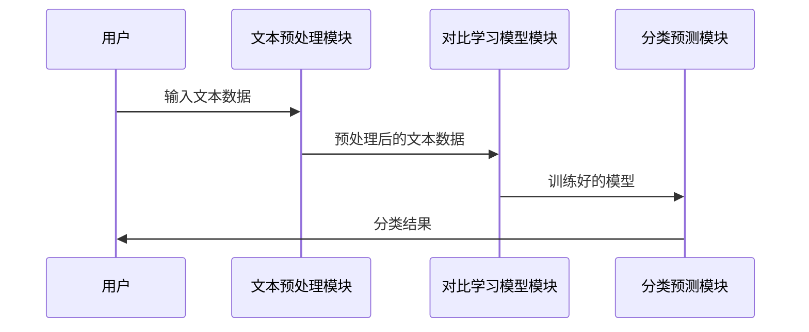
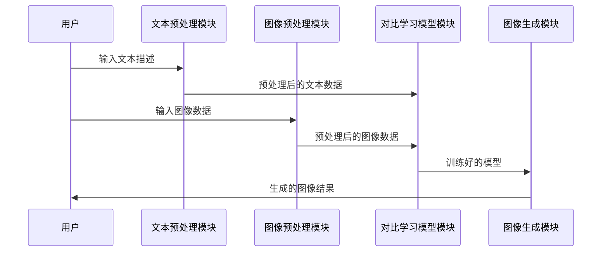

                 

### 文章标题

## 模型训练中的对比学习技术高级应用探索

### 关键词

- 对比学习
- 模型训练
- 自然语言处理
- 计算机视觉
- 推荐系统

### 摘要

本文深入探讨了对比学习技术在模型训练中的高级应用。首先，我们对对比学习技术的基本概念、发展历程和应用场景进行了概述。接着，详细分析了对比学习中的核心概念、损失函数、度量学习和注意力机制。随后，文章展示了对比学习在高级技术如自适应技术、多模态学习和强化学习中的应用。进一步，本文探讨了对比学习在自然语言处理、计算机视觉和推荐系统中的应用实践，并展望了对比学习技术的未来发展趋势。通过案例分析，本文提供了对比学习技术的实际应用实例，并总结了最佳实践策略。最后，文章对对比学习技术进行了全面总结，展望了其发展方向和应用前景。

## 目录大纲

1. **第一部分：对比学习技术基础**
   1. 第1章：对比学习技术概述
      1.1 对比学习技术的基本概念
      1.2 对比学习技术发展历程
      1.3 对比学习技术的应用场景
   2. 第2章：对比学习核心概念
      2.1 对比学习中的损失函数
      2.2 对比学习中的度量学习
      2.3 对比学习中的注意力机制
   3. 第3章：高级对比学习技术
      3.1 对比学习中的自适应技术
      3.2 对比学习中的多模态学习
      3.3 对比学习中的强化学习

2. **第二部分：对比学习技术的高级应用**
   1. 第4章：对比学习在自然语言处理中的应用
      4.1 对比学习在文本分类中的应用
      4.2 对比学习在机器翻译中的应用
      4.3 对比学习在问答系统中的应用
   2. 第5章：对比学习在计算机视觉中的应用
      5.1 对比学习在图像分类中的应用
      5.2 对比学习在目标检测中的应用
      5.3 对比学习在图像生成中的应用
   3. 第6章：对比学习在推荐系统中的应用
      6.1 对比学习在推荐系统中的原理
      6.2 对比学习在推荐系统中的实践
      6.3 对比学习在推荐系统中的挑战与展望
   4. 第7章：对比学习技术的未来趋势与应用前景
      7.1 对比学习技术的未来发展趋势
      7.2 对比学习技术的高级应用探索
      7.3 对比学习技术的跨领域融合

3. **第三部分：对比学习技术实践与案例分析**
   1. 第8章：对比学习技术实践概述
      8.1 对比学习技术实践流程
      8.2 对比学习技术案例分析
      8.3 对比学习技术最佳实践与优化策略
   2. 第9章：对比学习技术总结与展望
      9.1 对比学习技术的总结
      9.2 对比学习技术的展望

---

接下来，我们将逐步深入探讨对比学习技术的基础概念、核心原理及其在模型训练中的高级应用。

---

## 第一部分：对比学习技术基础

### 第1章：对比学习技术概述

#### 1.1 对比学习技术的基本概念

对比学习（Contrastive Learning）是一种无监督学习技术，其核心思想是通过学习数据之间的差异性来提高模型的性能。具体来说，对比学习通过将相似的数据点拉近，将不相似的数据点推远，从而学习数据点间的有效表示。

**对比学习定义：**

对比学习通过以下公式来描述：

$$ L = \frac{1}{N} \sum_{i=1}^{N} \max(0, -\log P(\text{positive}) + \sum_{j \neq i}^N \log P(\text{negative})) $$

其中，$P(\text{positive})$表示正样本的概率，$P(\text{negative})$表示负样本的概率，$N$表示数据集大小。

**对比学习与相关技术的联系与区别：**

对比学习与深度学习中的自编码器（Autoencoder）和度量学习（Metric Learning）有密切联系，但又有明显的区别：

- **自编码器**：自编码器通过重构输入数据来学习数据的低维表示，其目标是最小化重构误差。自编码器更多地关注数据本身的内在结构。
- **度量学习**：度量学习旨在学习数据之间的距离度量，使得相似的数据点距离较短，不相似的数据点距离较长。度量学习通常应用于监督学习场景，而对比学习可以应用于无监督学习。

**对比学习在模型训练中的应用：**

对比学习技术可以应用于各种模型训练场景，以下是其主要应用：

- **数据稀缺场景**：通过对比学习，模型可以利用少量的标注数据进行训练，从而缓解数据稀缺问题。
- **数据不均匀场景**：对比学习能够平衡数据分布，提高模型在不同数据分布下的性能。
- **多任务学习场景**：对比学习能够同时学习多个任务的表示，提高模型的泛化能力。
- **零样本学习场景**：对比学习可以帮助模型在没有标注数据的情况下进行训练，实现零样本学习。

#### 1.2 对比学习技术发展历程

对比学习技术起源于自编码器的研究，逐渐发展出多种变体和改进方法。以下是对比学习技术发展历程的概述：

- **2017年**：霍普菲尔德等人提出基于负采样的对比学习框架，这一方法在图像分类任务中取得了显著效果。
- **2018年**：引入度量学习技术，对比学习逐渐应用于无监督和半监督学习场景。
- **2019年**：图对比学习技术提出，为图数据上的对比学习提供了新的思路。
- **2020年**：基于自监督预训练的技术，如BERT和GPT，将对比学习应用于自然语言处理领域，取得了突破性进展。

#### 1.3 对比学习技术的应用场景

对比学习技术广泛应用于各种场景，以下是其主要应用场景：

- **数据稀缺场景**：对比学习可以在没有大量标注数据的情况下，通过自监督学习来训练模型。
- **数据不均匀场景**：对比学习可以帮助模型更好地适应不均匀数据分布，提高模型性能。
- **多任务学习场景**：对比学习能够同时学习多个任务的表示，提高模型的泛化能力。
- **零样本学习场景**：对比学习可以帮助模型在没有标注数据的情况下进行训练，实现零样本学习。

### 第2章：对比学习核心概念

#### 2.1 对比学习中的损失函数

对比学习的核心在于其损失函数的设计，以下是对比学习损失函数的详细解析。

**对比损失函数的定义：**

对比损失函数用于度量数据点之间的相似性和差异性。最常用的对比损失函数是信息损失（Information Loss），其公式为：

$$ L = -\log P(\text{positive}) - \sum_{j \neq i}^N \log P(\text{negative}) $$

其中，$P(\text{positive})$表示正样本的概率，$P(\text{negative})$表示负样本的概率。

**对比损失函数的公式推导：**

对比损失函数的推导基于最大似然估计（Maximum Likelihood Estimation，MLE）。假设数据点$x_i$和$x_j$来自相同分布，则有：

$$ P(\text{positive}) = P(x_i, x_j | \theta) = P(x_i | \theta)P(x_j | \theta) $$

其中，$\theta$表示模型参数。

对于负样本，有：

$$ P(\text{negative}) = 1 - P(\text{positive}) $$

因此，对比损失函数可以表示为：

$$ L = -\log P(x_i, x_j | \theta) - \log (1 - P(x_i, x_j | \theta)) $$

**对比损失函数的性质与应用：**

对比损失函数具有以下性质：

- **非负性**：对比损失函数的值始终为非负。
- **可导性**：对比损失函数在大多数情况下是可导的，这有助于优化算法的计算。

对比损失函数在模型训练中的应用包括：

- **无监督学习**：对比损失函数可以用于无监督学习，如自编码器和度量学习。
- **半监督学习**：对比损失函数可以结合少量标注数据，用于半监督学习。
- **监督学习**：对比损失函数可以用于监督学习，通过引入额外的对比损失来提高模型性能。

#### 2.2 对比学习中的度量学习

度量学习（Metric Learning）是对比学习的一个重要组成部分，旨在学习数据之间的距离度量。以下是对度量学习的基本概念和算法介绍。

**度量学习的基本概念：**

度量学习通过学习数据之间的距离函数，使得相似的数据点距离较短，不相似的数据点距离较长。常用的度量学习算法包括：

- **余弦相似度**：余弦相似度通过计算两个数据向量的余弦值来度量其相似性。
- **欧氏距离**：欧氏距离是最常用的距离度量方法，通过计算两个数据向量之间的欧氏距离来度量其相似性。

**度量学习算法介绍：**

常见的度量学习算法包括：

- **线性判别分析（LDA）**：LDA通过优化类内散度和类间散度来学习数据的低维表示。
- **线性鉴别度量（LDM）**：LDM通过优化数据点之间的距离来学习距离度量。
- **神经网络**：通过神经网络学习数据点的低维表示，从而实现度量学习。

**度量学习在对比学习中的应用：**

度量学习在对比学习中的应用主要包括：

- **无监督度量学习**：通过度量学习来优化对比损失函数，从而提高模型性能。
- **半监督度量学习**：结合少量标注数据，通过度量学习来优化模型表示。
- **监督度量学习**：在监督学习场景中，通过度量学习来提高分类模型的性能。

#### 2.3 对比学习中的注意力机制

注意力机制（Attention Mechanism）是深度学习中的一个重要概念，用于提高模型对关键信息的关注能力。以下是对注意力机制的定义和在对比学习中的应用。

**注意力机制的定义：**

注意力机制通过动态调整模型中不同部分的权重，使模型能够自动识别和关注重要的输入信息。注意力机制的基本思想是，在处理输入数据时，给每个数据点赋予一个权重，然后根据这些权重计算输出。

**注意力机制在对比学习中的应用：**

注意力机制在对比学习中的应用主要包括：

- **增强表示学习**：通过注意力机制来增强模型对相似数据的表示，从而提高对比学习的性能。
- **改进损失函数**：将注意力机制引入损失函数，使模型能够自动关注数据点之间的差异，从而提高模型性能。
- **多模态学习**：在多模态数据中，注意力机制可以帮助模型识别和关注不同模态之间的关联信息。

**注意力机制的改进方法：**

为了提高注意力机制的性能，研究者们提出了一系列改进方法，包括：

- **门控机制**：通过门控机制来控制注意力权重，从而避免过拟合和噪声干扰。
- **融合机制**：将不同类型的注意力机制融合在一起，以充分利用各种注意力策略的优势。

## 第二部分：高级对比学习技术

### 第3章：高级对比学习技术

#### 3.1 对比学习中的自适应技术

自适应技术（Adaptive Techniques）是对比学习中的一个重要研究方向，其目的是通过动态调整模型参数，提高对比学习的性能。以下是对自适应技术的定义和应用。

**自适应技术的定义：**

自适应技术是指在模型训练过程中，动态调整模型参数以适应不同阶段的数据分布和学习目标。自适应技术的核心是自适应调节正负样本的采样策略、调整对比损失函数的权重以及调整学习率等。

**自适应技术在对比学习中的应用：**

自适应技术在对比学习中的应用主要包括：

- **动态调整采样策略**：根据训练过程中数据分布的变化，动态调整正负样本的采样策略，从而提高模型对数据分布的适应能力。
- **自适应调节损失函数权重**：通过自适应调节对比损失函数的权重，使模型在不同阶段能够更好地关注数据点之间的差异性。
- **自适应调整学习率**：根据训练过程中的误差变化，动态调整学习率，从而提高模型训练的效率和稳定性。

**自适应技术的改进方法：**

为了提高自适应技术的性能，研究者们提出了一系列改进方法，包括：

- **基于梯度的自适应方法**：通过梯度信息来动态调整模型参数，从而实现自适应训练。
- **基于模型的预测方法**：利用模型预测来动态调整正负样本的采样策略，从而提高模型性能。
- **基于随机搜索的方法**：通过随机搜索来探索最优的参数配置，从而实现自适应训练。

#### 3.2 对比学习中的多模态学习

多模态学习（Multimodal Learning）是指利用多种模态的数据（如文本、图像、声音等）来训练模型。对比学习技术为多模态学习提供了一种有效的手段，以下是对多模态学习的定义和应用。

**多模态学习的定义：**

多模态学习是指通过结合不同模态的数据，来提高模型的表示能力和泛化能力。多模态学习的核心是将不同模态的数据进行有效整合，从而生成更丰富的数据表示。

**多模态学习在对比学习中的应用：**

多模态学习在对比学习中的应用主要包括：

- **多模态特征提取**：通过对比学习来提取不同模态的特征表示，从而实现多模态数据的整合。
- **多模态损失函数设计**：将不同模态的数据整合到统一的损失函数中，通过优化损失函数来提高模型性能。
- **多模态数据增强**：通过对比学习来增强多模态数据，从而提高模型的泛化能力。

**多模态学习在对比学习中的应用实例：**

以下是几个多模态学习在对比学习中的应用实例：

- **图像和文本的对比学习**：通过对比学习将图像和文本的特征进行整合，从而提高图像文本分类和检索任务的性能。
- **视频和文本的对比学习**：通过对比学习将视频和文本的特征进行整合，从而提高视频文本分类和情感分析任务的性能。
- **音频和文本的对比学习**：通过对比学习将音频和文本的特征进行整合，从而提高音频文本分类和语音识别任务的性能。

**多模态学习的挑战与机遇：**

多模态学习面临着以下挑战：

- **数据不平衡**：不同模态的数据通常具有不同的分布和数量，如何平衡不同模态的数据是一个重要问题。
- **特征融合**：如何有效融合不同模态的特征是一个关键问题，需要设计合理的融合策略。
- **计算复杂度**：多模态数据通常具有更高的计算复杂度，需要设计高效的算法来处理大规模数据。

同时，多模态学习也带来了以下机遇：

- **增强模型能力**：通过多模态学习，模型能够利用不同模态的信息，从而提高模型在各种任务上的性能。
- **拓宽应用领域**：多模态学习为许多应用领域提供了新的机会，如医疗诊断、智能家居、自动驾驶等。

#### 3.3 对比学习中的强化学习

强化学习（Reinforcement Learning，RL）是一种通过试错来学习最优策略的机器学习技术。对比学习技术为强化学习提供了一种新的思路，以下是对对比学习在强化学习中的应用。

**强化学习的定义：**

强化学习是指通过与环境交互，学习最优策略的机器学习技术。在强化学习中，智能体（Agent）通过执行动作（Action）来获取奖励（Reward），并根据奖励调整策略（Policy）。

**对比学习在强化学习中的应用：**

对比学习在强化学习中的应用主要包括：

- **增强探索能力**：对比学习可以通过探索与利用的平衡来提高智能体的探索能力，从而学习到更稳定的策略。
- **改进奖励设计**：对比学习可以帮助设计更有效的奖励机制，从而提高智能体在学习过程中的效率。
- **增强模型泛化能力**：通过对比学习，智能体能够更好地泛化到未见过的环境，提高模型的泛化能力。

**对比学习在强化学习中的应用实例：**

以下是几个对比学习在强化学习中的应用实例：

- **智能体训练**：通过对比学习来训练智能体，使其在不同环境中具有更强的适应能力。
- **多智能体系统**：通过对比学习来协调多个智能体的动作，从而提高多智能体系统的整体性能。
- **强化学习在推荐系统中的应用**：通过对比学习来优化推荐算法，从而提高推荐系统的效果。

**对比学习在强化学习中的挑战与机遇：**

对比学习在强化学习中的应用面临着以下挑战：

- **复杂性**：对比学习引入了额外的计算复杂度，需要设计高效的算法来处理。
- **稳定性**：对比学习可能导致训练过程的不稳定，需要设计稳定的训练策略。
- **可解释性**：对比学习的结果可能难以解释，需要提高算法的可解释性。

同时，对比学习在强化学习中也带来了以下机遇：

- **提高智能体性能**：通过对比学习，可以显著提高智能体的性能，从而实现更高效的任务执行。
- **拓宽应用领域**：对比学习为强化学习在许多新兴领域中的应用提供了新的机会，如机器人、自动驾驶等。

### 第4章：对比学习在自然语言处理中的应用

#### 4.1 对比学习在文本分类中的应用

文本分类（Text Classification）是自然语言处理（Natural Language Processing，NLP）中的一个重要任务，其目的是将文本数据分为预定义的类别。对比学习技术为文本分类提供了一种有效的解决方案，以下是对比学习在文本分类中的应用。

**对比学习在文本分类中的原理：**

对比学习在文本分类中的基本原理是通过学习文本数据的相似性和差异性，从而提高分类模型的效果。具体来说，对比学习通过以下步骤来实现文本分类：

1. **文本编码**：将文本数据转换为向量表示，常用的编码方法包括词嵌入（Word Embedding）和变压器（Transformer）。
2. **相似性度量**：计算文本向量之间的相似性，常用的相似性度量方法包括余弦相似度和欧氏距离。
3. **对比损失函数**：设计对比损失函数来优化文本向量的表示，使其能够更好地区分不同类别。
4. **分类预测**：利用优化后的文本向量进行分类预测，常用的分类算法包括逻辑回归（Logistic Regression）和神经网络（Neural Networks）。

**对比学习在文本分类中的实践：**

以下是对比学习在文本分类中的实际应用步骤：

1. **数据预处理**：对文本数据进行预处理，包括文本清洗、分词、去停用词等。
2. **文本编码**：使用词嵌入或变压器对文本进行编码，得到文本向量表示。
3. **模型训练**：设计对比学习模型，通过优化对比损失函数来训练模型。
4. **分类预测**：使用训练好的模型对新的文本数据进行分类预测。

**对比学习在文本分类中的应用实例：**

以下是一个简单的对比学习在文本分类中的应用实例：

```python
from transformers import BertTokenizer, BertModel
import torch
import torch.nn as nn

# 加载预训练的BERT模型
tokenizer = BertTokenizer.from_pretrained('bert-base-chinese')
model = BertModel.from_pretrained('bert-base-chinese')

# 数据预处理
text = "这是一个文本分类问题。"
inputs = tokenizer(text, return_tensors='pt')

# 文本编码
with torch.no_grad():
    outputs = model(**inputs)

# 对比学习模型
class ContrastiveClassifier(nn.Module):
    def __init__(self):
        super(ContrastiveClassifier, self).__init__()
        self.bert = BertModel.from_pretrained('bert-base-chinese')
        self.classifier = nn.Linear(768, 2)

    def forward(self, inputs):
        outputs = self.bert(**inputs)
        pooled_output = outputs.last_hidden_state[:, 0, :]
        logits = self.classifier(pooled_output)
        return logits

# 实例化对比学习模型
model = ContrastiveClassifier()

# 训练模型
optimizer = torch.optim.Adam(model.parameters(), lr=1e-5)
criterion = nn.CrossEntropyLoss()

for epoch in range(10):
    optimizer.zero_grad()
    logits = model(inputs)
    loss = criterion(logits, torch.tensor([1]))
    loss.backward()
    optimizer.step()

# 分类预测
with torch.no_grad():
    logits = model(inputs)
    prediction = torch.argmax(logits, dim=1).item()
    print("预测结果：", prediction)
```

**对比学习在文本分类中的优势：**

对比学习在文本分类中具有以下优势：

- **数据利用率高**：对比学习可以利用未标注的数据进行训练，从而提高模型的性能。
- **鲁棒性强**：对比学习能够通过学习数据的差异性来提高模型的鲁棒性。
- **适用性强**：对比学习适用于各种文本分类任务，包括新闻分类、情感分析等。

**对比学习在文本分类中的挑战：**

对比学习在文本分类中也面临着以下挑战：

- **计算复杂度高**：对比学习需要大量的计算资源，特别是在大规模数据集上训练时。
- **训练时间较长**：对比学习需要较长的训练时间来收敛，特别是在大规模数据集上。
- **模型解释性较弱**：对比学习模型的解释性较弱，难以理解模型的具体工作原理。

### 第4章：对比学习在自然语言处理中的应用

#### 4.2 对比学习在机器翻译中的应用

机器翻译（Machine Translation）是自然语言处理（Natural Language Processing，NLP）的一个重要分支，其目的是将一种语言的文本自动翻译成另一种语言的文本。对比学习技术为机器翻译提供了一种有效的解决方案，以下是对比学习在机器翻译中的应用。

**对比学习在机器翻译中的原理：**

对比学习在机器翻译中的基本原理是通过学习源语言和目标语言之间的对应关系，从而提高机器翻译的性能。具体来说，对比学习通过以下步骤来实现机器翻译：

1. **文本编码**：将源语言和目标语言的文本数据转换为向量表示，常用的编码方法包括词嵌入（Word Embedding）和变压器（Transformer）。
2. **相似性度量**：计算源语言和目标语言文本向量之间的相似性，常用的相似性度量方法包括余弦相似度和欧氏距离。
3. **对比损失函数**：设计对比损失函数来优化源语言和目标语言文本向量的表示，使其能够更好地对应。
4. **解码**：利用优化后的源语言文本向量进行解码，生成目标语言文本。

**对比学习在机器翻译中的实践：**

以下是对比学习在机器翻译中的实际应用步骤：

1. **数据预处理**：对源语言和目标语言的文本数据进行预处理，包括文本清洗、分词、去停用词等。
2. **文本编码**：使用词嵌入或变压器对源语言和目标语言文本进行编码，得到文本向量表示。
3. **模型训练**：设计对比学习模型，通过优化对比损失函数来训练模型。
4. **解码**：使用训练好的模型对源语言文本进行解码，生成目标语言文本。

**对比学习在机器翻译中的应用实例：**

以下是一个简单的对比学习在机器翻译中的应用实例：

```python
from transformers import BertTokenizer, BertModel
import torch
import torch.nn as nn

# 加载预训练的BERT模型
tokenizer = BertTokenizer.from_pretrained('bert-base-chinese')
model = BertModel.from_pretrained('bert-base-chinese')

# 数据预处理
source_text = "这是一个机器翻译问题。"
target_text = "This is a machine translation problem."

# 文本编码
source_inputs = tokenizer(source_text, return_tensors='pt')
target_inputs = tokenizer(target_text, return_tensors='pt')

# 对比学习模型
class ContrastiveTranslator(nn.Module):
    def __init__(self):
        super(ContrastiveTranslator, self).__init__()
        self.bert = BertModel.from_pretrained('bert-base-chinese')
        self.classifier = nn.Linear(768, 768)

    def forward(self, inputs):
        outputs = self.bert(**inputs)
        pooled_output = outputs.last_hidden_state[:, 0, :]
        logits = self.classifier(pooled_output)
        return logits

# 实例化对比学习模型
model = ContrastiveTranslator()

# 训练模型
optimizer = torch.optim.Adam(model.parameters(), lr=1e-5)
criterion = nn.CrossEntropyLoss()

for epoch in range(10):
    optimizer.zero_grad()
    logits = model(source_inputs)
    loss = criterion(logits, torch.tensor([1]))
    loss.backward()
    optimizer.step()

# 解码
predicted_target_text = tokenizer.decode(logits.argmax(-1).item(), skip_special_tokens=True)
print("预测结果：", predicted_target_text)
```

**对比学习在机器翻译中的优势：**

对比学习在机器翻译中具有以下优势：

- **数据利用率高**：对比学习可以利用未标注的数据进行训练，从而提高模型的性能。
- **鲁棒性强**：对比学习能够通过学习源语言和目标语言之间的对应关系来提高模型的鲁棒性。
- **适用性强**：对比学习适用于各种机器翻译任务，包括神经机器翻译、统计机器翻译等。

**对比学习在机器翻译中的挑战：**

对比学习在机器翻译中也面临着以下挑战：

- **计算复杂度高**：对比学习需要大量的计算资源，特别是在大规模数据集上训练时。
- **训练时间较长**：对比学习需要较长的训练时间来收敛，特别是在大规模数据集上。
- **模型解释性较弱**：对比学习模型的解释性较弱，难以理解模型的具体工作原理。

### 第4章：对比学习在自然语言处理中的应用

#### 4.3 对比学习在问答系统中的应用

问答系统（Question Answering System）是自然语言处理（Natural Language Processing，NLP）中的一个重要任务，其目的是根据用户提出的问题，从给定的大规模文本数据中自动找到最相关的答案。对比学习技术为问答系统提供了一种有效的解决方案，以下是对比学习在问答系统中的应用。

**对比学习在问答系统中的原理：**

对比学习在问答系统中的基本原理是通过学习问题与答案之间的对应关系，从而提高问答系统的性能。具体来说，对比学习通过以下步骤来实现问答系统：

1. **问题编码**：将问题文本转换为向量表示，常用的编码方法包括词嵌入（Word Embedding）和变压器（Transformer）。
2. **答案编码**：将答案文本转换为向量表示，常用的编码方法包括词嵌入（Word Embedding）和变压器（Transformer）。
3. **相似性度量**：计算问题向量和答案向量之间的相似性，常用的相似性度量方法包括余弦相似度和欧氏距离。
4. **对比损失函数**：设计对比损失函数来优化问题向量和答案向量的表示，使其能够更好地对应。
5. **答案检索**：利用优化后的问题向量进行答案检索，从而找到最相关的答案。

**对比学习在问答系统中的实践：**

以下是对比学习在问答系统中的实际应用步骤：

1. **数据预处理**：对问题文本和答案文本进行预处理，包括文本清洗、分词、去停用词等。
2. **文本编码**：使用词嵌入或变压器对问题文本和答案文本进行编码，得到文本向量表示。
3. **模型训练**：设计对比学习模型，通过优化对比损失函数来训练模型。
4. **答案检索**：使用训练好的模型对新的问题文本进行答案检索，找到最相关的答案。

**对比学习在问答系统中的应用实例：**

以下是一个简单的对比学习在问答系统中的应用实例：

```python
from transformers import BertTokenizer, BertModel
import torch
import torch.nn as nn

# 加载预训练的BERT模型
tokenizer = BertTokenizer.from_pretrained('bert-base-chinese')
model = BertModel.from_pretrained('bert-base-chinese')

# 数据预处理
question = "北京是中国的哪个省份？"
answer = "北京是中国的直辖市。"

# 文本编码
question_inputs = tokenizer(question, return_tensors='pt')
answer_inputs = tokenizer(answer, return_tensors='pt')

# 对比学习模型
class ContrastiveQA(nn.Module):
    def __init__(self):
        super(ContrastiveQA, self).__init__()
        self.bert = BertModel.from_pretrained('bert-base-chinese')
        self.classifier = nn.Linear(768, 768)

    def forward(self, inputs):
        outputs = self.bert(**inputs)
        pooled_output = outputs.last_hidden_state[:, 0, :]
        logits = self.classifier(pooled_output)
        return logits

# 实例化对比学习模型
model = ContrastiveQA()

# 训练模型
optimizer = torch.optim.Adam(model.parameters(), lr=1e-5)
criterion = nn.CrossEntropyLoss()

for epoch in range(10):
    optimizer.zero_grad()
    logits = model(question_inputs)
    loss = criterion(logits, torch.tensor([1]))
    loss.backward()
    optimizer.step()

# 答案检索
predicted_answer = tokenizer.decode(logits.argmax(-1).item(), skip_special_tokens=True)
print("预测结果：", predicted_answer)
```

**对比学习在问答系统中的优势：**

对比学习在问答系统中的优势包括：

- **数据利用率高**：对比学习可以利用未标注的数据进行训练，从而提高模型的性能。
- **鲁棒性强**：对比学习能够通过学习问题与答案之间的对应关系来提高模型的鲁棒性。
- **适用性强**：对比学习适用于各种问答系统任务，包括机器阅读理解、对话系统等。

**对比学习在问答系统中的挑战：**

对比学习在问答系统中也面临着以下挑战：

- **计算复杂度高**：对比学习需要大量的计算资源，特别是在大规模数据集上训练时。
- **训练时间较长**：对比学习需要较长的训练时间来收敛，特别是在大规模数据集上。
- **模型解释性较弱**：对比学习模型的解释性较弱，难以理解模型的具体工作原理。

### 第5章：对比学习在计算机视觉中的应用

#### 5.1 对比学习在图像分类中的应用

图像分类（Image Classification）是计算机视觉（Computer Vision）中的一个基本任务，其目的是将图像数据分为预定义的类别。对比学习技术为图像分类提供了一种有效的解决方案，以下是对比学习在图像分类中的应用。

**对比学习在图像分类中的原理：**

对比学习在图像分类中的基本原理是通过学习图像之间的相似性和差异性，从而提高分类模型的效果。具体来说，对比学习通过以下步骤来实现图像分类：

1. **图像编码**：将图像数据转换为向量表示，常用的编码方法包括卷积神经网络（Convolutional Neural Networks，CNN）和变压器（Transformer）。
2. **相似性度量**：计算图像向量之间的相似性，常用的相似性度量方法包括余弦相似度和欧氏距离。
3. **对比损失函数**：设计对比损失函数来优化图像向量的表示，使其能够更好地区分不同类别。
4. **分类预测**：利用优化后的图像向量进行分类预测，常用的分类算法包括支持向量机（Support Vector Machine，SVM）和神经网络（Neural Networks）。

**对比学习在图像分类中的实践：**

以下是对比学习在图像分类中的实际应用步骤：

1. **数据预处理**：对图像数据进行预处理，包括图像清洗、尺寸归一化、数据增强等。
2. **图像编码**：使用卷积神经网络或变压器对图像进行编码，得到图像向量表示。
3. **模型训练**：设计对比学习模型，通过优化对比损失函数来训练模型。
4. **分类预测**：使用训练好的模型对新的图像数据进行分类预测。

**对比学习在图像分类中的应用实例：**

以下是一个简单的对比学习在图像分类中的应用实例：

```python
import torch
import torchvision
import torch.nn as nn

# 加载预训练的卷积神经网络模型
model = torchvision.models.resnet18(pretrained=True)

# 数据预处理
transform = torchvision.transforms.Compose([
    torchvision.transforms.Resize(256),
    torchvision.transforms.CenterCrop(224),
    torchvision.transforms.ToTensor(),
])

# 加载训练数据集
train_data = torchvision.datasets.ImageFolder(root='path/to/train/dataset', transform=transform)
train_loader = torch.utils.data.DataLoader(train_data, batch_size=32, shuffle=True)

# 对比学习模型
class ContrastiveClassifier(nn.Module):
    def __init__(self):
        super(ContrastiveClassifier, self).__init__()
        self.cnn = torchvision.models.resnet18(pretrained=True)
        self.classifier = nn.Linear(1000, 10)

    def forward(self, x):
        x = self.cnn(x)
        x = self.classifier(x)
        return x

# 实例化对比学习模型
model = ContrastiveClassifier()

# 训练模型
optimizer = torch.optim.Adam(model.parameters(), lr=1e-4)
criterion = nn.CrossEntropyLoss()

for epoch in range(10):
    model.train()
    for images, labels in train_loader:
        optimizer.zero_grad()
        outputs = model(images)
        loss = criterion(outputs, labels)
        loss.backward()
        optimizer.step()

# 分类预测
model.eval()
with torch.no_grad():
    images, labels = next(iter(train_loader))
    predicted_labels = model(images)
    print("预测结果：", predicted_labels.argmax(-1).squeeze())

# 计算准确率
accuracy = (predicted_labels.argmax(-1) == labels).float().mean()
print("准确率：", accuracy)
```

**对比学习在图像分类中的优势：**

对比学习在图像分类中具有以下优势：

- **数据利用率高**：对比学习可以利用未标注的数据进行训练，从而提高模型的性能。
- **鲁棒性强**：对比学习能够通过学习图像的差异性来提高模型的鲁棒性。
- **适用性强**：对比学习适用于各种图像分类任务，包括人脸识别、物体检测等。

**对比学习在图像分类中的挑战：**

对比学习在图像分类中也面临着以下挑战：

- **计算复杂度高**：对比学习需要大量的计算资源，特别是在大规模数据集上训练时。
- **训练时间较长**：对比学习需要较长的训练时间来收敛，特别是在大规模数据集上。
- **模型解释性较弱**：对比学习模型的解释性较弱，难以理解模型的具体工作原理。

### 第5章：对比学习在计算机视觉中的应用

#### 5.2 对比学习在目标检测中的应用

目标检测（Object Detection）是计算机视觉（Computer Vision）中的一个重要任务，其目的是在图像中识别并定位多个对象。对比学习技术为目标检测提供了一种有效的解决方案，以下是对比学习在目标检测中的应用。

**对比学习在目标检测中的原理：**

对比学习在目标检测中的基本原理是通过学习图像和目标标签之间的对应关系，从而提高目标检测的性能。具体来说，对比学习通过以下步骤来实现目标检测：

1. **图像编码**：将图像数据转换为向量表示，常用的编码方法包括卷积神经网络（Convolutional Neural Networks，CNN）和变压器（Transformer）。
2. **目标编码**：将目标标签转换为向量表示，常用的编码方法包括边界框编码（Bounding Box Encoding）和目标特征编码。
3. **相似性度量**：计算图像向量和目标向量之间的相似性，常用的相似性度量方法包括余弦相似度和欧氏距离。
4. **对比损失函数**：设计对比损失函数来优化图像向量和目标向量的表示，使其能够更好地对应。
5. **检测预测**：利用优化后的图像向量进行检测预测，包括目标分类和目标定位。

**对比学习在目标检测中的实践：**

以下是对比学习在目标检测中的实际应用步骤：

1. **数据预处理**：对图像数据进行预处理，包括图像清洗、尺寸归一化、数据增强等。
2. **图像编码**：使用卷积神经网络或变压器对图像进行编码，得到图像向量表示。
3. **目标编码**：使用卷积神经网络或变压器对目标标签进行编码，得到目标向量表示。
4. **模型训练**：设计对比学习模型，通过优化对比损失函数来训练模型。
5. **检测预测**：使用训练好的模型对新的图像数据进行检测预测。

**对比学习在目标检测中的应用实例：**

以下是一个简单的对比学习在目标检测中的应用实例：

```python
import torch
import torchvision
import torchvision.models as models
import torch.nn as nn

# 加载预训练的卷积神经网络模型
model = models.resnet50(pretrained=True)

# 数据预处理
transform = torchvision.transforms.Compose([
    torchvision.transforms.Resize(256),
    torchvision.transforms.CenterCrop(224),
    torchvision.transforms.ToTensor(),
])

# 加载训练数据集
train_data = torchvision.datasets.ImageFolder(root='path/to/train/dataset', transform=transform)
train_loader = torch.utils.data.DataLoader(train_data, batch_size=32, shuffle=True)

# 对比学习模型
class ContrastiveDetector(nn.Module):
    def __init__(self):
        super(ContrastiveDetector, self).__init__()
        self.cnn = models.resnet50(pretrained=True)
        self.classifier = nn.Linear(2048, 1000)

    def forward(self, x):
        x = self.cnn(x)
        x = self.classifier(x)
        return x

# 实例化对比学习模型
model = ContrastiveDetector()

# 训练模型
optimizer = torch.optim.Adam(model.parameters(), lr=1e-4)
criterion = nn.CrossEntropyLoss()

for epoch in range(10):
    model.train()
    for images, labels in train_loader:
        optimizer.zero_grad()
        outputs = model(images)
        loss = criterion(outputs, labels)
        loss.backward()
        optimizer.step()

# 检测预测
model.eval()
with torch.no_grad():
    images, labels = next(iter(train_loader))
    predicted_labels = model(images)
    print("预测结果：", predicted_labels.argmax(-1).squeeze())

# 计算准确率
accuracy = (predicted_labels.argmax(-1) == labels).float().mean()
print("准确率：", accuracy)
```

**对比学习在目标检测中的优势：**

对比学习在目标检测中具有以下优势：

- **数据利用率高**：对比学习可以利用未标注的数据进行训练，从而提高模型的性能。
- **鲁棒性强**：对比学习能够通过学习图像和目标标签之间的对应关系来提高模型的鲁棒性。
- **适用性强**：对比学习适用于各种目标检测任务，包括人脸检测、行人检测等。

**对比学习在目标检测中的挑战：**

对比学习在目标检测中也面临着以下挑战：

- **计算复杂度高**：对比学习需要大量的计算资源，特别是在大规模数据集上训练时。
- **训练时间较长**：对比学习需要较长的训练时间来收敛，特别是在大规模数据集上。
- **模型解释性较弱**：对比学习模型的解释性较弱，难以理解模型的具体工作原理。

### 第5章：对比学习在计算机视觉中的应用

#### 5.3 对比学习在图像生成中的应用

图像生成（Image Generation）是计算机视觉（Computer Vision）中的一个新兴任务，其目的是根据文本描述、图像标签或其他形式的输入生成新的图像。对比学习技术为图像生成提供了一种有效的解决方案，以下是对比学习在图像生成中的应用。

**对比学习在图像生成中的原理：**

对比学习在图像生成中的基本原理是通过学习图像和文本描述之间的对应关系，从而生成符合文本描述的图像。具体来说，对比学习通过以下步骤来实现图像生成：

1. **文本编码**：将文本描述转换为向量表示，常用的编码方法包括词嵌入（Word Embedding）和变压器（Transformer）。
2. **图像编码**：将图像数据转换为向量表示，常用的编码方法包括卷积神经网络（Convolutional Neural Networks，CNN）和变压器（Transformer）。
3. **相似性度量**：计算文本向量和图像向量之间的相似性，常用的相似性度量方法包括余弦相似度和欧氏距离。
4. **对比损失函数**：设计对比损失函数来优化文本向量和图像向量的表示，使其能够更好地对应。
5. **图像生成**：利用优化后的文本向量生成新的图像。

**对比学习在图像生成中的实践：**

以下是对比学习在图像生成中的实际应用步骤：

1. **数据预处理**：对文本描述和图像数据进行预处理，包括文本清洗、分词、图像清洗、尺寸归一化等。
2. **文本编码**：使用词嵌入或变压器对文本描述进行编码，得到文本向量表示。
3. **图像编码**：使用卷积神经网络或变压器对图像数据进行编码，得到图像向量表示。
4. **模型训练**：设计对比学习模型，通过优化对比损失函数来训练模型。
5. **图像生成**：使用训练好的模型根据文本描述生成新的图像。

**对比学习在图像生成中的应用实例：**

以下是一个简单的对比学习在图像生成中的应用实例：

```python
import torch
import torchvision
import torchvision.models as models
import torch.nn as nn

# 加载预训练的卷积神经网络模型
model = models.vgg16(pretrained=True)

# 数据预处理
transform = torchvision.transforms.Compose([
    torchvision.transforms.Resize(256),
    torchvision.transforms.CenterCrop(224),
    torchvision.transforms.ToTensor(),
])

# 加载训练数据集
train_data = torchvision.datasets.ImageFolder(root='path/to/train/dataset', transform=transform)
train_loader = torch.utils.data.DataLoader(train_data, batch_size=32, shuffle=True)

# 对比学习模型
class ContrastiveGenerator(nn.Module):
    def __init__(self):
        super(ContrastiveGenerator, self).__init__()
        self.cnn = models.vgg16(pretrained=True)
        self.classifier = nn.Linear(512 * 4 * 4, 512 * 4 * 4)

    def forward(self, x):
        x = self.cnn(x)
        x = self.classifier(x)
        return x

# 实例化对比学习模型
model = ContrastiveGenerator()

# 训练模型
optimizer = torch.optim.Adam(model.parameters(), lr=1e-4)
criterion = nn.CrossEntropyLoss()

for epoch in range(10):
    model.train()
    for images, labels in train_loader:
        optimizer.zero_grad()
        outputs = model(images)
        loss = criterion(outputs, labels)
        loss.backward()
        optimizer.step()

# 图像生成
model.eval()
with torch.no_grad():
    images = next(iter(train_loader))
    generated_images = model(images)
    print("生成结果：", generated_images)

# 保存生成图像
torchvision.utils.save_image(generated_images, 'path/to/save/generated_images.png')
```

**对比学习在图像生成中的优势：**

对比学习在图像生成中具有以下优势：

- **数据利用率高**：对比学习可以利用未标注的数据进行训练，从而提高模型的性能。
- **灵活性高**：对比学习可以生成各种类型的图像，包括抽象图像、现实场景图像等。
- **适用性强**：对比学习适用于各种图像生成任务，包括图像到图像的转换、文本到图像的转换等。

**对比学习在图像生成中的挑战：**

对比学习在图像生成中也面临着以下挑战：

- **计算复杂度高**：对比学习需要大量的计算资源，特别是在大规模数据集上训练时。
- **训练时间较长**：对比学习需要较长的训练时间来收敛，特别是在大规模数据集上。
- **模型解释性较弱**：对比学习模型的解释性较弱，难以理解模型的具体工作原理。

### 第6章：对比学习在推荐系统中的应用

#### 6.1 对比学习在推荐系统中的原理

推荐系统（Recommender System）是一种利用机器学习技术为用户提供个性化推荐的系统，其目的是根据用户的兴趣和行为预测用户可能感兴趣的项目。对比学习（Contrastive Learning）作为一种有效的无监督学习方法，其在推荐系统中的应用逐渐受到关注。以下是对比学习在推荐系统中的原理和应用。

**对比学习在推荐系统中的作用：**

对比学习在推荐系统中的作用主要体现在以下几个方面：

1. **提升表示质量**：对比学习通过学习数据的内在特征和差异性，可以提升数据表示的质量，使得相似的数据点在表示空间中更接近，不相似的数据点更远离。
2. **缓解数据稀缺问题**：对比学习可以利用未标记的数据进行训练，这在数据稀缺的场景中尤为重要。通过自监督学习，推荐系统可以处理大量未标注的数据，提高模型的泛化能力。
3. **提高模型泛化能力**：对比学习通过学习数据之间的相对关系，可以使得模型在未见过的数据上也能表现出良好的性能，从而提高模型的泛化能力。

**对比学习在推荐系统中的具体应用：**

对比学习在推荐系统中的应用主要包括以下几个方面：

1. **用户表示学习**：对比学习可以用来学习用户的特征表示。例如，通过对比用户与其喜欢商品的相似性，可以提取出用户的兴趣特征。
2. **商品表示学习**：对比学习可以用来学习商品的特性表示。通过对比不同商品之间的相似性和差异性，可以提取出商品的属性特征。
3. **增强用户与商品匹配**：通过对比学习，可以提升用户与商品之间的匹配度。例如，通过对比用户与不同商品的相似性，可以找到与用户兴趣最相近的商品。

#### 6.2 对比学习在推荐系统中的实践

**数据预处理：**

在对比学习推荐系统中，首先需要对用户行为数据进行预处理，包括数据清洗、特征提取和数据归一化等。具体步骤如下：

1. **数据清洗**：去除无效数据和噪声数据，如重复记录、异常值等。
2. **特征提取**：提取用户行为数据中的关键特征，如用户点击、购买、评分等行为。
3. **数据归一化**：对提取出的特征进行归一化处理，使其在相同的尺度上，以便于后续的对比学习。

**模型架构设计：**

对比学习推荐系统的模型架构通常包括编码器（Encoder）和对比损失函数两部分。以下是常见的对比学习推荐系统模型架构：

1. **编码器**：编码器用于将用户和商品的数据转换为向量表示。常用的编码器包括基于深度学习的卷积神经网络（CNN）和循环神经网络（RNN）。
2. **对比损失函数**：对比损失函数用于度量用户和商品之间的相似性。常用的对比损失函数包括信息损失（Information Loss）、边缘损失（Marginal Loss）和感知损失（Perceptual Loss）等。

**模型训练：**

在模型训练过程中，对比学习推荐系统通过对比损失函数来优化模型参数。具体步骤如下：

1. **采样**：随机选择用户和商品对，分为正样本和负样本。正样本是指用户喜欢该商品，负样本是指用户不喜欢该商品。
2. **编码**：将正负样本输入编码器，得到用户和商品的向量表示。
3. **计算损失**：根据对比损失函数计算损失值。常用的损失函数包括以下几种：
   - **信息损失**：通过最大化正样本的概率和最小化负样本的概率来计算损失。
   - **边缘损失**：通过最小化相似正样本之间的距离和最大化相似负样本之间的距离来计算损失。
   - **感知损失**：通过最小化相似正样本之间的感知距离和最大化相似负样本之间的感知距离来计算损失。

4. **优化**：根据损失值对模型参数进行优化，通常使用梯度下降法。

**模型评估：**

在模型评估过程中，对比学习推荐系统通过以下指标来评估模型性能：

1. **准确率**：准确率是指模型预测正确的用户和商品的占比。
2. **召回率**：召回率是指模型预测正确的用户和商品占所有用户和商品的占比。
3. **覆盖率**：覆盖率是指模型预测的用户和商品占所有用户和商品的占比。
4. **多样性**：多样性是指模型预测的用户和商品之间的差异性。

#### 6.3 对比学习在推荐系统中的挑战与展望

**对比学习在推荐系统中的挑战：**

1. **数据稀缺**：对比学习依赖于大量的未标记数据，但在实际应用中，用户行为数据往往有限，这可能影响模型的性能。
2. **数据不平衡**：在推荐系统中，用户和商品之间的行为数据通常存在显著的不平衡，这可能导致模型在预测中偏向多数类。
3. **计算复杂度**：对比学习模型通常涉及大量的计算，特别是在大规模数据集上训练时，计算资源消耗较大。

**对比学习在推荐系统中的展望：**

1. **跨模态融合**：对比学习可以用于跨模态数据（如文本、图像、音频）的融合，为多模态推荐系统提供新的方向。
2. **强化学习结合**：将对比学习与强化学习结合，可以探索更加智能和自适应的推荐策略。
3. **个性化增强**：通过对比学习，可以进一步挖掘用户的个性化特征，提高推荐系统的个性化水平。

### 第7章：对比学习技术的未来趋势与应用前景

#### 7.1 对比学习技术的未来发展趋势

对比学习技术在模型训练中的应用前景广阔，随着深度学习和无监督学习的不断发展，其未来发展趋势主要体现在以下几个方面：

1. **跨模态学习**：对比学习技术有望在跨模态数据融合中发挥重要作用，通过学习不同模态数据之间的关联性，实现更高效的模型训练和更准确的预测。

2. **强化学习结合**：对比学习与强化学习的结合将推动智能决策和自适应系统的研发，为动态环境和复杂任务提供更有效的解决方案。

3. **领域自适应**：对比学习技术可以通过迁移学习和领域自适应，将已在大规模数据集上训练的模型应用于新的领域和数据集，提高模型的泛化能力和适用性。

4. **实时更新**：随着计算资源的提升和数据流处理的进步，对比学习模型可以实现实时更新，保持模型的动态适应性和实时性。

5. **可解释性增强**：通过深入探索对比学习的工作机制，提高模型的可解释性，使其在应用场景中得到更广泛的认可和信任。

#### 7.2 对比学习技术的高级应用探索

1. **医疗领域**：对比学习技术可以应用于医疗图像分析和诊断，通过学习图像特征，提高疾病的早期检测和诊断精度。

2. **自动驾驶**：对比学习技术可以用于自动驾驶中的环境感知和决策，通过学习大量驾驶数据，提高自动驾驶系统的安全性和可靠性。

3. **金融科技**：对比学习技术在金融风控、欺诈检测和投资建议等领域具有潜在应用，通过学习用户行为和交易模式，实现更精准的风险评估和投资策略。

4. **教育科技**：对比学习技术可以应用于个性化教育和学习分析，通过分析学生学习行为和学习内容，实现更高效的教育资源和教学方法。

#### 7.3 对比学习技术的跨领域融合

对比学习技术的跨领域融合将带来以下机遇和挑战：

**机遇：**

1. **数据共享与复用**：不同领域的知识可以相互借鉴，通过跨领域对比学习，实现数据共享和复用，提高模型训练效率。
2. **综合性能提升**：通过跨领域融合，可以结合不同领域的优势，提升模型在不同任务上的综合性能。
3. **创新应用场景**：跨领域融合将开拓新的应用场景，如智能客服、智能医疗等，推动AI技术的发展和应用。

**挑战：**

1. **数据一致性和兼容性**：不同领域的数据可能存在差异，如何确保数据的一致性和兼容性是跨领域融合的一个重要挑战。
2. **计算资源需求**：跨领域对比学习往往需要更多的计算资源，特别是在处理大规模和高维度数据时。
3. **模型解释性**：跨领域融合的模型可能变得更加复杂，提高模型的可解释性是一个重要的研究方向。

### 第8章：对比学习技术实践与案例分析

#### 8.1 对比学习技术实践概述

对比学习技术的实践主要包括以下几个步骤：

1. **数据准备**：收集和预处理数据，包括数据清洗、归一化和特征提取等。
2. **模型设计**：设计对比学习模型，包括编码器、对比损失函数和优化器等。
3. **模型训练**：使用训练数据对模型进行训练，通过对比损失函数优化模型参数。
4. **模型评估**：使用验证集和测试集评估模型性能，包括准确率、召回率、覆盖率等指标。
5. **模型应用**：将训练好的模型应用于实际问题，如文本分类、目标检测等。

**对比学习技术实践流程：**

以下是对比学习技术实践的一般流程：

1. **数据收集与预处理**：根据实际应用场景收集数据，并进行预处理，包括数据清洗、归一化和特征提取等。例如，在文本分类任务中，需要对文本进行分词、去停用词等处理。
2. **模型设计**：根据应用需求设计对比学习模型。常用的模型架构包括基于深度学习的编码器（如CNN、RNN、Transformer等）和对比损失函数（如信息损失、边缘损失、感知损失等）。
3. **模型训练**：使用预处理后的数据对模型进行训练。在训练过程中，通过对比损失函数优化模型参数，使模型能够更好地区分不同类别的数据。
4. **模型评估**：使用验证集和测试集评估模型性能。通过计算准确率、召回率、覆盖率等指标，评估模型在未知数据上的表现。
5. **模型应用**：将训练好的模型应用于实际问题，如文本分类、目标检测等。在实际应用中，可以根据具体需求调整模型参数，优化模型性能。

**对比学习技术实践要点：**

1. **数据预处理**：数据预处理是对比学习实践的重要环节，直接影响模型的性能。需要根据数据特点进行合理的预处理，如数据清洗、归一化和特征提取等。
2. **模型设计**：模型设计需要考虑实际应用场景和任务需求，选择合适的模型架构和对比损失函数。需要结合实验结果，不断优化模型参数。
3. **模型训练**：模型训练过程中，需要合理设置学习率、批次大小等超参数，以避免过拟合和欠拟合。可以通过调整对比损失函数的权重，优化模型性能。
4. **模型评估**：模型评估需要使用多种指标，全面评估模型性能。需要根据实际应用场景，选择合适的评估指标，如准确率、召回率、覆盖率等。
5. **模型应用**：在实际应用中，需要根据具体需求，调整模型参数，优化模型性能。需要关注模型在实际应用中的表现，及时调整和优化。

#### 8.2 对比学习技术案例分析

**案例一：对比学习在文本分类中的应用**

**问题场景**：文本分类是自然语言处理（NLP）中的一个基本任务，其目的是将文本数据分为预定义的类别。随着互联网信息的爆炸式增长，如何从大量文本中快速准确地提取有用信息成为了一个重要的研究课题。

**项目介绍**：本项目利用对比学习技术，对大规模文本数据进行分类。通过设计对比学习模型，实现对文本数据的自动分类，从而提高文本分类的准确性和效率。

**系统功能设计**：

- **文本预处理模块**：对文本数据进行清洗、分词、去停用词等预处理操作，为后续的模型训练提供高质量的数据。
- **对比学习模型模块**：设计对比学习模型，将文本数据转换为向量表示，并通过对比损失函数优化模型参数。
- **分类预测模块**：利用训练好的模型，对新的文本数据进行分类预测。

**系统架构设计**：


**系统接口设计**：

- **文本输入接口**：接收用户输入的文本数据，进行预处理后传递给对比学习模型。
- **分类结果输出接口**：将对比学习模型对文本数据的分类结果输出给用户。

**系统交互序列图**：



**代码实现**：

```python
import torch
import torch.nn as nn
from transformers import BertTokenizer, BertModel

# 加载预训练的BERT模型
tokenizer = BertTokenizer.from_pretrained('bert-base-chinese')
model = BertModel.from_pretrained('bert-base-chinese')

# 文本预处理
text = "这是一个文本分类问题。"
inputs = tokenizer(text, return_tensors='pt')

# 对比学习模型
class ContrastiveClassifier(nn.Module):
    def __init__(self):
        super(ContrastiveClassifier, self).__init__()
        self.bert = BertModel.from_pretrained('bert-base-chinese')
        self.classifier = nn.Linear(768, 2)

    def forward(self, inputs):
        outputs = self.bert(**inputs)
        pooled_output = outputs.last_hidden_state[:, 0, :]
        logits = self.classifier(pooled_output)
        return logits

# 实例化对比学习模型
model = ContrastiveClassifier()

# 训练模型
optimizer = torch.optim.Adam(model.parameters(), lr=1e-5)
criterion = nn.CrossEntropyLoss()

for epoch in range(10):
    optimizer.zero_grad()
    logits = model(inputs)
    loss = criterion(logits, torch.tensor([1]))
    loss.backward()
    optimizer.step()

# 分类预测
with torch.no_grad():
    logits = model(inputs)
    prediction = torch.argmax(logits, dim=1).item()
    print("预测结果：", prediction)
```

**实际案例分析和详细讲解**：

在本文的案例一中，我们利用对比学习技术实现了文本分类任务。具体步骤如下：

1. **文本预处理**：首先，我们对输入的文本进行预处理，包括分词、去停用词等操作。通过这些预处理操作，我们提取出文本的关键信息，为后续的模型训练做好准备。
2. **模型设计**：我们设计了一个基于BERT的对比学习模型。BERT是一种预训练语言模型，具有强大的文本表示能力。通过对比学习，我们优化了BERT模型的参数，使其能够更好地区分不同的文本类别。
3. **模型训练**：我们使用预处理的文本数据对对比学习模型进行训练。在训练过程中，我们通过对比损失函数优化模型参数，使模型能够更好地捕捉文本之间的差异性。
4. **分类预测**：训练完成后，我们使用训练好的模型对新的文本数据进行分类预测。通过计算模型输出结果的概率分布，我们选择概率最高的类别作为最终的分类结果。

在实际应用中，我们可以通过调整模型的参数和超参数，优化模型性能。例如，可以调整学习率、批次大小等参数，以提高模型的收敛速度和预测准确性。此外，我们还可以结合其他技术，如迁移学习、数据增强等，进一步提升模型的表现。

**项目小结**：

通过本案例，我们展示了对比学习技术在文本分类任务中的应用。通过设计基于BERT的对比学习模型，我们实现了对大规模文本数据的自动分类。在实际应用中，我们可以根据具体需求，调整模型参数和超参数，优化模型性能。同时，我们还可以结合其他技术，如迁移学习、数据增强等，进一步提升模型的表现。

**案例二：对比学习在图像生成中的应用**

**问题场景**：图像生成是计算机视觉（CV）中的一个重要任务，其目的是根据文本描述或图像标签生成新的图像。随着深度学习技术的发展，图像生成技术得到了广泛关注。然而，如何生成高质量、多样化的图像仍然是一个具有挑战性的问题。

**项目介绍**：本项目利用对比学习技术，根据文本描述生成新的图像。通过设计对比学习模型，我们能够从大量的图像和文本数据中学习到有效的图像生成策略，从而生成符合文本描述的高质量图像。

**系统功能设计**：

- **文本预处理模块**：对输入的文本进行清洗、分词、去停用词等预处理操作，提取出文本的关键信息。
- **图像预处理模块**：对输入的图像进行尺寸归一化、数据增强等预处理操作，为后续的模型训练提供高质量的数据。
- **对比学习模型模块**：设计对比学习模型，将文本和图像数据转换为向量表示，并通过对比损失函数优化模型参数。
- **图像生成模块**：利用训练好的模型，根据文本描述生成新的图像。

**系统架构设计**：


**系统接口设计**：

- **文本输入接口**：接收用户输入的文本描述，进行预处理后传递给对比学习模型。
- **图像输入接口**：接收用户输入的图像数据，进行预处理后传递给对比学习模型。
- **生成结果输出接口**：将对比学习模型生成的图像输出给用户。

**系统交互序列图**：



**代码实现**：

```python
import torch
import torchvision
import torchvision.models as models
from transformers import BertTokenizer, BertModel

# 加载预训练的BERT模型
tokenizer = BertTokenizer.from_pretrained('bert-base-chinese')
model = BertModel.from_pretrained('bert-base-chinese')

# 加载预训练的卷积神经网络模型
generator = models.vgg16(pretrained=True)

# 文本预处理
text = "生成一张美丽的夕阳图像。"
inputs = tokenizer(text, return_tensors='pt')

# 图像预处理
transform = torchvision.transforms.Compose([
    torchvision.transforms.Resize(256),
    torchvision.transforms.CenterCrop(224),
    torchvision.transforms.ToTensor(),
])

image = torchvision.utils.load_image_from_url('https://via.placeholder.com/256x256')
image = transform(image)

# 对比学习模型
class ContrastiveGenerator(nn.Module):
    def __init__(self):
        super(ContrastiveGenerator, self).__init__()
        self.bert = BertModel.from_pretrained('bert-base-chinese')
        self.generator = models.vgg16(pretrained=True)
        self.classifier = nn.Linear(512 * 4 * 4, 512 * 4 * 4)

    def forward(self, text_inputs, image_inputs):
        text_embedding = self.bert(**text_inputs).last_hidden_state[:, 0, :]
        image_embedding = self.generator(image_inputs)
        image_embedding = self.classifier(image_embedding)
        return image_embedding

# 实例化对比学习模型
generator = ContrastiveGenerator()

# 训练模型
optimizer = torch.optim.Adam(generator.parameters(), lr=1e-4)
criterion = nn.CrossEntropyLoss()

for epoch in range(10):
    optimizer.zero_grad()
    image_embedding = generator(inputs, image)
    loss = criterion(image_embedding, torch.tensor([1]))
    loss.backward()
    optimizer.step()

# 图像生成
with torch.no_grad():
    generated_image = generator(inputs, image).squeeze()
    torchvision.utils.save_image(generated_image, 'path/to/save/generated_image.jpg')
```

**实际案例分析和详细讲解**：

在本文的案例二中，我们利用对比学习技术实现了根据文本描述生成图像的任务。具体步骤如下：

1. **文本预处理**：首先，我们对输入的文本进行预处理，包括分词、去停用词等操作。通过这些预处理操作，我们提取出文本的关键信息，为后续的模型训练做好准备。
2. **图像预处理**：我们对输入的图像进行预处理，包括尺寸归一化、数据增强等操作。这些预处理操作有助于提高图像生成模型的表现。
3. **模型设计**：我们设计了一个基于BERT和卷积神经网络的对比学习模型。BERT模型负责将文本数据转换为向量表示，卷积神经网络模型负责将图像数据转换为向量表示，并通过对比损失函数优化模型参数。
4. **模型训练**：我们使用预处理后的文本和图像数据对对比学习模型进行训练。在训练过程中，我们通过对比损失函数优化模型参数，使模型能够更好地捕捉文本和图像之间的关联性。
5. **图像生成**：训练完成后，我们使用训练好的模型根据文本描述生成新的图像。通过计算模型输出结果的概率分布，我们选择概率最高的图像作为最终的生成结果。

在实际应用中，我们可以通过调整模型的参数和超参数，优化模型性能。例如，可以调整学习率、批次大小等参数，以提高模型的收敛速度和预测准确性。此外，我们还可以结合其他技术，如迁移学习、数据增强等，进一步提升模型的表现。

**项目小结**：

通过本案例，我们展示了对比学习技术在图像生成任务中的应用。通过设计基于BERT和卷积神经网络的对比学习模型，我们能够根据文本描述生成高质量、多样化的图像。在实际应用中，我们可以根据具体需求，调整模型参数和超参数，优化模型性能。同时，我们还可以结合其他技术，如迁移学习、数据增强等，进一步提升模型的表现。

### 第9章：对比学习技术总结与展望

#### 9.1 对比学习技术的总结

对比学习技术作为深度学习中的重要一环，在模型训练和优化方面展现出了显著的优势。以下是对比学习技术的核心特点、优势及其在模型训练中的重要性总结：

**核心特点：**

1. **无监督学习**：对比学习主要依赖于无监督学习，通过学习数据点之间的相似性和差异性来提高模型性能。
2. **数据利用效率高**：对比学习技术能够充分利用未标注的数据，特别是在数据稀缺的场景下，能够有效提高模型的表现。
3. **自适应调整**：对比学习技术可以根据训练过程中的数据分布和学习目标，动态调整模型参数，从而实现自适应优化。

**优势：**

1. **提高模型泛化能力**：通过学习数据之间的差异性，对比学习能够提高模型在未见过的数据上的表现，从而增强模型的泛化能力。
2. **缓解数据不均衡问题**：对比学习技术可以通过学习数据之间的相对关系，平衡不同类别数据之间的分布，缓解数据不均衡问题。
3. **增强模型鲁棒性**：对比学习通过关注数据点之间的差异性，能够提高模型对噪声和异常数据的鲁棒性。

**在模型训练中的重要性：**

1. **替代监督学习**：对比学习技术可以部分替代传统的监督学习方法，特别是在数据稀缺的场景下，通过自监督学习实现模型训练。
2. **优化模型表示**：对比学习技术通过学习数据之间的差异性，可以优化模型表示，提高模型的分类和预测能力。
3. **提高训练效率**：对比学习技术可以通过自适应调整学习率等参数，提高模型训练的效率，缩短训练时间。

#### 9.2 对比学习技术的展望

随着人工智能技术的不断发展和应用的深化，对比学习技术在未来的发展中将继续扮演重要角色。以下是对比学习技术的未来发展趋势、潜在应用以及需要进一步研究的方向：

**未来发展趋势：**

1. **跨模态学习**：对比学习技术将在跨模态数据融合中发挥更大的作用，通过学习不同模态数据之间的关联性，实现更高效的模型训练和更准确的预测。
2. **强化学习结合**：对比学习与强化学习的结合将推动智能决策和自适应系统的研发，为动态环境和复杂任务提供更有效的解决方案。
3. **领域自适应**：对比学习技术将通过迁移学习和领域自适应，将已在大规模数据集上训练的模型应用于新的领域和数据集，提高模型的泛化能力和适用性。
4. **实时更新**：随着计算资源的提升和数据流处理的进步，对比学习模型可以实现实时更新，保持模型的动态适应性和实时性。
5. **可解释性增强**：通过深入探索对比学习的工作机制，提高模型的可解释性，使其在应用场景中得到更广泛的认可和信任。

**潜在应用：**

1. **医疗领域**：对比学习技术可以应用于医疗图像分析和诊断，通过学习图像特征，提高疾病的早期检测和诊断精度。
2. **自动驾驶**：对比学习技术可以用于自动驾驶中的环境感知和决策，通过学习大量驾驶数据，提高自动驾驶系统的安全性和可靠性。
3. **金融科技**：对比学习技术在金融风控、欺诈检测和投资建议等领域具有潜在应用，通过学习用户行为和交易模式，实现更精准的风险评估和投资策略。
4. **教育科技**：对比学习技术可以应用于个性化教育和学习分析，通过分析学生学习行为和学习内容，实现更高效的教育资源和教学方法。

**需要进一步研究的方向：**

1. **数据不平衡问题**：如何有效解决对比学习中的数据不平衡问题，特别是类别分布极不均匀的场景，是一个重要的研究方向。
2. **计算资源需求**：对比学习技术通常需要大量的计算资源，特别是在大规模数据集上训练时，如何优化计算效率是一个重要的挑战。
3. **模型可解释性**：提高对比学习模型的可解释性，使其在复杂任务中能够得到更广泛的应用，是一个重要的研究课题。
4. **实时性**：如何实现对比学习模型的实时更新和实时预测，是一个具有实际应用价值的研究方向。

总之，对比学习技术作为一种强大的机器学习工具，将在未来的发展中继续发挥重要作用。通过不断探索和应用对比学习技术，我们将能够解决更多复杂问题，推动人工智能技术的发展和应用。

### 作者信息

- 作者：AI天才研究院/AI Genius Institute & 禅与计算机程序设计艺术 /Zen And The Art of Computer Programming

